<!--
CO_OP_TRANSLATOR_METADATA:
{
  "original_hash": "dcbcd9396b076da0a0f5d389e9ec1b12",
  "translation_date": "2025-10-21T18:52:16+00:00",
  "source_file": "docs/recruit/08-add-adaptive-card/README.md",
  "language_code": "fa"
}
-->
# 🚨 مأموریت 08: بهبود تعاملات کاربری در موضوعات با کارت‌های تطبیقی

## 🕵️‍♂️ نام رمز: `عملیات ارتقاء رابط کاربری`

> **⏱️ زمان عملیات:** `~45 دقیقه`

🎥 **تماشای راهنمای ویدئویی**

[](https://www.youtube.com/watch?v=RhIlzYHPCXo "تماشای راهنمای ویدئویی در یوتیوب")

## 🎯 خلاصه مأموریت

ماموران، مأموریت شما نفوذ به تجربه کاربری ایستا و جایگزینی آن با کارت‌های تطبیقی غنی، پویا و قابل اجرا است. شما باید با استفاده از JSON و فرمول‌های Power Fx، مکالمات Copilot Studio را از پرسش و پاسخ ساده به تعاملات کاملاً تعاملی تبدیل کنید. هدف شما جمع‌آوری ورودی‌های کاربر، نمایش داده‌ها به شکلی زیبا و هدایت مکالمات با دقت و سبک است. اگر نتوانید تطبیق پیدا کنید، کاربران ممکن است به رابط‌های کمتر هوشمندانه روی بیاورند.

## 🔎 اهداف

در این مأموریت، شما یاد خواهید گرفت:

1. درک اینکه کارت‌های تطبیقی چیستند و چگونه تعاملات کاربری را در Copilot Studio بهبود می‌بخشند.
1. یادگیری ساخت کارت‌های تعاملی با استفاده از JSON و فرمول‌های Power Fx برای محتوای پویا.
1. بررسی طراح کارت تطبیقی و اجزای کلیدی آن برای ایجاد کارت‌های بصری.
1. ایجاد فرم‌های غنی، تعاملی و تجربه‌های جمع‌آوری داده در موضوعات عامل.
1. اجرای بهترین روش‌ها برای طراحی کارت‌های تطبیقی پاسخگو و کاربرپسند.

## 🤔 کارت تطبیقی چیست؟

**کارت تطبیقی** راهی برای ایجاد عناصر رابط کاربری تعاملی و بصری غنی است که می‌توانند در برنامه‌هایی مانند Microsoft Teams، Microsoft Outlook یا عوامل جاسازی شوند. این یک شیء JSON ساختاریافته است که چیدمان و محتوای کارت را تعریف می‌کند:

- چه عناصر روی کارت ظاهر می‌شوند - متن، تصاویر، دکمه‌ها
- چگونه این عناصر مرتب شده‌اند
- چه اقداماتی کاربران می‌توانند انجام دهند، مانند ارسال فرم یا باز کردن لینک

    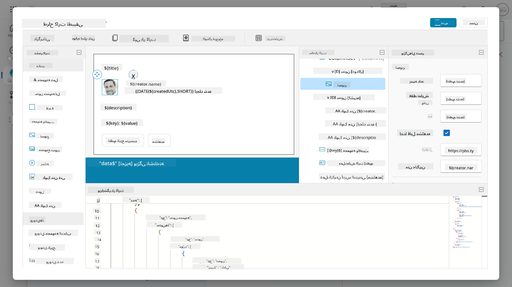

### چرا کارت‌های تطبیقی در Copilot Studio اهمیت دارند؟

تصور کنید که شما یک عامل می‌سازید که از کاربران نام، ایمیل یا بازخوردشان را می‌پرسد. اگر فقط از متن ساده استفاده کنید، مکالمه ممکن است خسته‌کننده یا دشوار باشد. اینجاست که کارت‌های تطبیقی وارد می‌شوند!

1. **مکالمات را تعاملی می‌کند** - به جای ارسال متن به عنوان پیام به کاربر، می‌توانید دکمه‌ها، فرم‌ها، تصاویر و موارد دیگر را نشان دهید.
    - مثال: یک کارت می‌تواند از کاربر بخواهد نام و ایمیل خود را در یک فرم مرتب وارد کند.

1. **در همه جا زیبا به نظر می‌رسد** - کارت‌های تطبیقی به طور خودکار با سبک برنامه‌ای که در آن هستند، مانند چت Microsoft 365 Copilot یا Microsoft Teams، مطابقت دارند. نیازی نیست نگران حالت تاریک، فونت یا چیدمان باشید - آنها تطبیق پیدا می‌کنند.

1. **ساخت آسان با JSON** - شما کارت را با استفاده از کد JSON تعریف می‌کنید (مانند یک _دستورالعمل_ برای رابط کاربری). Copilot Studio به شما کمک می‌کند کارت خود را پیش‌نمایش کنید قبل از اینکه آن را به موضوع اضافه کنید.

1. **جمع‌آوری و استفاده از داده‌ها** - شما می‌توانید از کارت برای پرسیدن سوالات، جمع‌آوری پاسخ‌ها و استفاده از آن داده‌ها در جریان مکالمه استفاده کنید.
    - مثال: درخواست شماره تلفن کاربر و سپس نمایش کارت تأیید با شماره تلفن آنها.

1. **بهبود تجربه کاربری** - کارت‌ها عامل شما را تعاملی‌تر می‌کنند. این یک نوع رابط کاربری تمیز، قابل کلیک و کاربرپسند است.

## 🐱 آیا _JSON_ یک شخص است؟

با تلفظ "جیسون"، این یک شخص نیست 😅

JSON، که به عنوان _JavaScript Object Notation_ شناخته می‌شود، یک فرمت سبک برای ساختاردهی داده‌ها است. خواندن و نوشتن آن آسان است و شبیه به مجموعه‌ای از جفت‌های کلید-مقدار داخل آکولاد {} به نظر می‌رسد.

این یکی از گزینه‌هایی است که می‌توانید هنگام افزودن یک کارت تطبیقی به موضوع خود استفاده کنید.

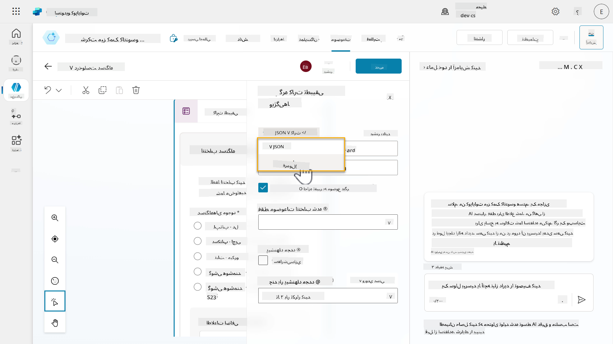

## 👀 گزینه دیگری برای ساخت کارت تطبیقی با استفاده از _فرمول_ می‌بینم

به یاد دارید که چگونه درباره Power Fx در [مأموریت 07 - استفاده از Power Fx در گره‌های خود](../07-add-new-topic-with-trigger/README.md#what-power-fx-can-do-in-topics) یاد گرفتیم؟ همان را می‌توان در کارت‌های تطبیقی در Copilot Studio اعمال کرد.

به عنوان یادآوری،

!!! note
    Power Fx یک زبان برنامه‌نویسی کم‌کد است که برای افزودن منطق و رفتار پویا به عامل شما استفاده می‌شود. این همان زبانی است که در Microsoft Power Apps استفاده می‌شود و طراحی شده است تا ساده و شبیه به اکسل باشد، که آن را برای توسعه‌دهندگان و غیرتوسعه‌دهندگان آسان می‌کند.

### چگونه Power Fx در کارت‌های تطبیقی کار می‌کند

هنگامی که یک کارت تطبیقی در Copilot Studio طراحی می‌کنید، می‌توانید از فرمول‌های Power Fx برای:

- درج مقادیر پویا مانند نام‌های کاربر، تاریخ‌ها یا وضعیت‌ها.
- قالب‌بندی متن یا اعداد مانند نمایش ارز یا گرد کردن اعداد.
- نمایش یا پنهان کردن عناصر بر اساس شرایط.
- سفارشی‌سازی پاسخ‌ها بر اساس ورودی کاربر، متغیرها، خروجی‌ها از گره‌های مکالمه.

برای مثال،

"`سلام`" & `System.User.DisplayName`

این فرمول کلمه "سلام" را با نام کاربر به صورت پویا ترکیب می‌کند.

### چرا مفید است

1. **شخصی‌سازی**

    شما می‌توانید پیام را برای هر کاربر تنظیم کنید و تعاملات را طبیعی‌تر و مرتبط‌تر کنید.

1. **محتوای پویا**

    کارت‌ها می‌توانند داده‌های واقعی را از متغیرها و خروجی‌های گره‌های مکالمه نمایش دهند.

1. **منطق هوشمند**

    شما می‌توانید کنترل کنید که کاربران چه چیزی را ببینند یا با آن تعامل کنند بر اساس شرایط، که قابلیت استفاده را بهبود می‌بخشد و خطاها را کاهش می‌دهد.

1. **دوستدار کم‌کد**

    Power Fx یک زبان برنامه‌نویسی کم‌کد است. همانطور که قبلاً ذکر شد، خوانا، شهودی و مشابه فرمول‌های اکسل است.

## 👷🏻‍♀️ ساخت با طراح کارت تطبیقی

**طراح کارت تطبیقی** یک ابزار بصری است که به شما امکان می‌دهد کارت‌های پیام تعاملی را با استفاده از عناصر کشیدن و رها کردن مانند متن، تصاویر، دکمه‌ها و ورودی‌ها بسازید. هدف آن کمک به شما در ایجاد پیام‌های غنی و پویا بدون نوشتن کد پیچیده است، که طراحی رابط‌های کاربرپسند را آسان‌تر می‌کند.

این ابزار طراحی به شما کمک می‌کند کارت را به صورت بصری بسازید، اما در پشت صحنه، شیء JSON را برای شما تولید می‌کند. همچنین می‌توانید به _فرمول_ تغییر دهید که امکان استفاده از عبارات Power Fx در کارت برای نمایش داده‌ها از جاهای دیگر را فراهم می‌کند.

## 🎨 درک طراح کارت تطبیقی

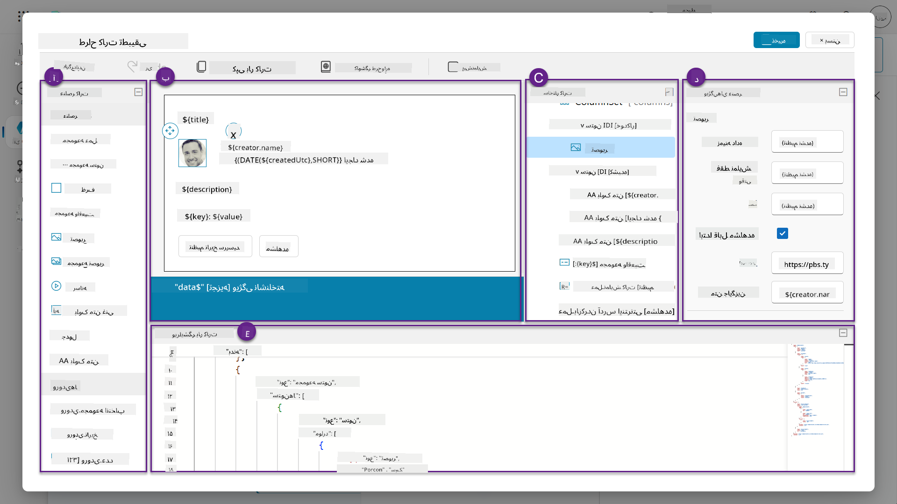

### A) عناصر کارت

این‌ها بلوک‌های سازنده کارت تطبیقی شما هستند. شما می‌توانید عناصر زیر را کشیده و رها کنید:

- **TextBlock** برای نمایش متن.
- **Image** برای نمایش تصاویر.
- **FactSet** برای جفت‌های کلید-مقدار.
- **فیلدهای ورودی** برای نمایش جعبه‌های متن، انتخاب‌کننده‌های تاریخ، تغییر وضعیت‌ها.
- **اقدامات** برای نمایش دکمه‌هایی مانند _ارسال_، _باز کردن URL_ یا _نمایش کارت_.

هر عنصر هدف خاص خود را دارد و می‌توان آن را سبک‌دهی یا پیکربندی کرد.

### B) نمایشگر کارت

این قسمت **پیش‌نمایش** است که در آن می‌توانید ببینید کارت شما چگونه در زمان واقعی به نظر می‌رسد. همانطور که عناصر را اضافه یا ویرایش می‌کنید، نمایشگر به سرعت به‌روزرسانی می‌شود تا تغییرات را منعکس کند. این امکان را به شما می‌دهد تا به‌روزرسانی‌های تکراری انجام دهید و خروجی طراحی را همزمان ببینید.

### C) ساختار کارت

این قسمت **سلسله‌مراتب و چیدمان** کارت شما را نشان می‌دهد. برای مثال:

- یک کارت ممکن است با یک **TextBlock** برای عنوان شروع شود.
- سپس یک **ColumnSet** با یک تصویر در یک طرف و متن در طرف دیگر.
- سپس یک **FactSet** و چند دکمه **اقدام**.

این به شما کمک می‌کند بفهمید عناصر چگونه تو در تو و سازماندهی شده‌اند.

### D) ویژگی‌های عنصر

هنگامی که روی هر عنصر در کارت کلیک می‌کنید، این پنل به شما امکان می‌دهد **تنظیمات آن را سفارشی کنید**:

- تغییر اندازه، وزن یا رنگ متن.
- تنظیم URL‌های تصویر یا متن جایگزین.
- پیکربندی گزینه‌های ورودی مانند متن جایگزین یا مقادیر پیش‌فرض.

این جایی است که شما هر عنصر را به دقت تنظیم می‌کنید.

### E) ویرایشگر بارگذاری کارت

این قسمت **کد JSON خام** پشت کارت شما است. کاربران پیشرفته می‌توانند این قسمت را مستقیماً ویرایش کنند تا:

- از ویژگی‌های قالب‌بندی استفاده کنند.
- تعریف‌های کارت را کپی/پیست کنند.

حتی اگر در طراح کارت تطبیقی تازه‌کار هستید، دیدن اینکه طراحی بصری چگونه به کد تبدیل می‌شود مفید است.

!!! tip "نکته - نمونه‌های کارت تطبیقی را بررسی کنید"

    1. به [https://adaptivecards.microsoft.com/designer](https://adaptivecards.microsoft.com/designer) بروید.
    2. **کارت جدید** را انتخاب کنید تا لیستی از نمونه‌هایی که می‌توانید انتخاب و اصلاح کنید ببینید.
    3. توجه داشته باشید که این طراح خارجی (وب‌محور) است. هنگامی که کارت خود را در طراح کارت تطبیقی وب‌محور ساختید، JSON را از ویرایشگر بارگذاری کارت کپی کنید.
    4. JSON را در کارت تطبیقی خود در عامل در Copilot Studio پیست کنید.

    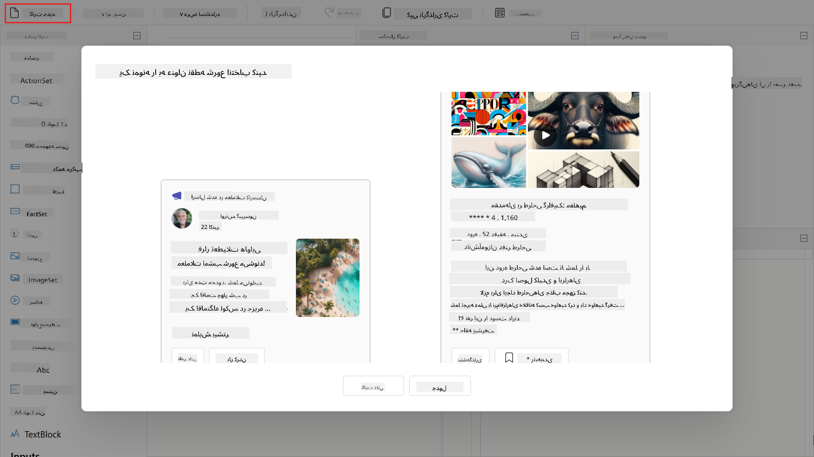

## 🌵 موارد استفاده رایج

موارد استفاده رایج برای کارت‌های تطبیقی در Copilot Studio هنگام استفاده در گره‌های **ارسال پیام** یا **پرسیدن سوال** به شرح زیر است:

1. **فرم‌ها و جمع‌آوری داده‌ها**

    از کارت‌های تطبیقی برای جمع‌آوری ورودی‌های ساختاریافته از کاربران استفاده کنید، مانند:

    - درخواست مرخصی
    - فرم‌های بازخورد
    - اطلاعات تماس
    - برنامه‌ریزی قرار ملاقات

1. **نمایش اطلاعات پویا**

    نمایش داده‌های شخصی‌سازی‌شده یا بلادرنگ به کاربران در قالبی تمیز و خوانا از منابع سازمانی مانند ServiceNow، SAP، Dynamics 365، SharePoint و غیره.

    - خلاصه سفارش‌ها
    - موجودی حساب‌ها
    - وضعیت بلیط یا پرونده
    - رویدادها یا مهلت‌های آینده

1. **انتخاب‌های تعاملی**

    اجازه دهید کاربران مستقیماً در مکالمه انتخاب کنند:

    - انتخاب از لیستی از گزینه‌ها، به عنوان مثال دسته‌بندی محصولات، موضوعات پشتیبانی.
    - تأیید یا لغو اقدام.
    - ارزیابی یک خدمت یا تجربه.

1. **ایجاد اقدامات**

    دکمه‌هایی را شامل کنید که مراحل بیشتری را در مکالمه داخلی یا خارجی ایجاد کنند.

    - "ارسال درخواست"
    - "مشاهده جزئیات"

## ⭐ بهترین روش‌ها

در اینجا بهترین روش‌ها برای ایجاد کارت‌های تطبیقی برای عوامل در Copilot Studio آورده شده است.

1. **آن را ساده و متمرکز نگه دارید**

    - کارت‌ها را با هدفی واضح طراحی کنید، آنها را با عناصر زیاد بارگذاری نکنید.
    - از متن مختصر و چیدمان‌های شهودی برای هدایت کاربران در تعامل استفاده کنید.

1. **ورودی‌ها را با دقت انتخاب کنید**

    - فقط عناصر ورودی ضروری مانند متن، انتخاب‌های تاریخ را شامل کنید تا کاربران را تحت فشار قرار ندهید.
    - از برچسب‌ها برای آسان کردن فهم ورودی‌ها استفاده کنید.

1. **ساختار برای خوانایی**

    - از **TextBlocks** برای عناوین و دستورالعمل‌ها استفاده کنید.
    - عناصر مرتبط را با استفاده از **Containers** یا **ColumnSets** گروه‌بندی کنید تا جریان بصری بهبود یابد.

1. **عناصر اقدام را واضح کنید**

    - از **Action.Submit** یا **Action.OpenUrl** با عناوین دکمه واضح مانند "ارسال درخواست" یا "مشاهده جزئیات" استفاده کنید.
    - از برچسب‌های مبهم مانند "اینجا کلیک کنید" اجتناب کنید.

1. **طراحی برای تطبیق‌پذیری**

    - فرض کنید کارت ممکن است در اندازه‌های مختلف صفحه نمایش مشاهده شود.
    - از عرض‌های ثابت اجتناب کنید و از چیدمان‌های انعطاف‌پذیر مانند **ColumnSets** برای پاسخگویی استفاده کنید.

1. **از محتوای پویا استفاده کنید**

    - عناصر کارت را به متغیرها یا خروجی‌های گره‌ها با استفاده از Power Fx متصل کنید تا تجربه کاربری را شخصی‌سازی کنید.
    - برای مثال، نام کاربر یا وضعیت فعلی را به صورت پویا نمایش دهید.

## 🧪 آزمایشگاه 08 - افزودن کارت‌های تطبیقی و بهبود قابلیت‌های موضوع

اکنون یاد خواهیم گرفت که چگونه موضوع خود را با کارت‌های تطبیقی بهبود دهیم و از قابلیت‌های پیشرفته موضوعات و گره‌ها استفاده کنیم.

- [8.1 ایجاد یک موضوع جدید با کارت تطبیقی برای ارسال درخواست کاربر](../../../../../docs/recruit/08-add-adaptive-card)
- [8.2 به‌روزرسانی دستورالعمل‌های عامل برای فراخوانی موضوع درخواست دستگاه](../../../../../docs/recruit/08-add-adaptive-card)

### ✨ مورد استفاده

**به عنوان یک** کارمند

**می‌خواهم** درخواست دستگاه بدهم

**تا بتوانم** دستگاهی از لیست دستگاه‌های موجود درخواست کنم

بیایید شروع کنیم!

### پیش‌نیازها

1. **لیست SharePoint**

    ما از لیست **Devices** SharePoint از [درس 00 - تنظیم دوره - مرحله 3: ایجاد سایت جدید SharePoint](../00-course-setup/README.md#step-4-create-new-sharepoint-site) استفاده خواهیم کرد.

    اگر لیست **Devices** SharePoint را تنظیم نکرده‌اید، لطفاً به [درس 00 - تنظیم دوره - مرحله 3: ایجاد سایت جدید SharePoint](../00-course-setup/README.md#step-4-create-new-sharepoint-site) بازگردید.

1. **Contoso Helpdesk Copilot**

    ما از همان عاملی که قبلاً در [درس 06 - ایجاد عامل سفارشی با زبان طبیعی با Copilot و اتصال آن به داده‌های شما](../06-create-agent-from-conversation/README.md) ایجاد شده است استفاده خواهیم کرد.

### 8.1 ایجاد یک موضوع جدید با کارت تطبیقی برای ارسال درخواست کاربر

ما یک موضوع جدید ایجاد خواهیم کرد که درخواست دستگاه کاربر را مدیریت کند. این موضوع جدید شامل یک گره **پرسیدن با کارت تطبیقی** خواهد بود تا تعامل کاربر با عامل را امکان‌پذیر کند.

بیایید شروع کنیم!

1. تب **Topics** را انتخاب کنید، سپس **+ افزودن یک موضوع از ابتدا** را انتخاب کنید.

    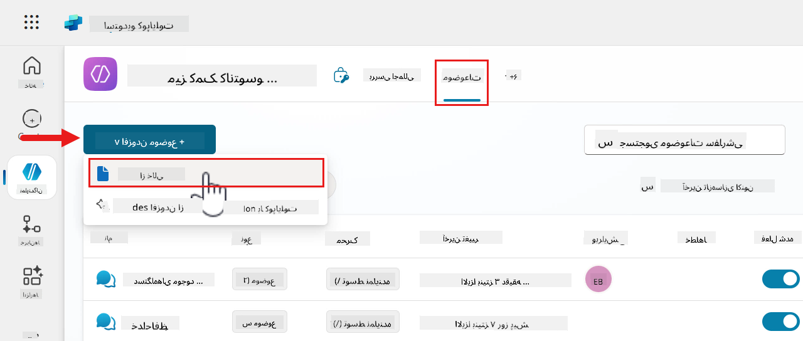

1. موضوع را به صورت زیر نام‌گذاری کنید،

    ```text
    Request device
    ```

    توضیحات زیر را برای محرک وارد کنید.

    ```text
    This topic helps users request a device when they answer yes to the question that asks the user if they would like to request one of these devices.
    ```

    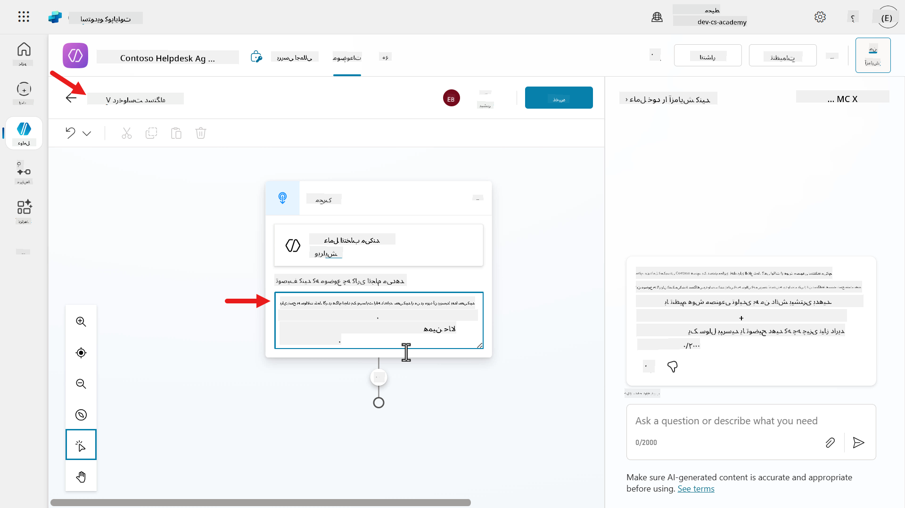
1. حالا یک گره **Ask with adaptive card** اضافه کنید. این گره یک کارت تعاملی را نمایش می‌دهد که کاربر می‌تواند دستگاه مورد نظر خود را انتخاب کند.

    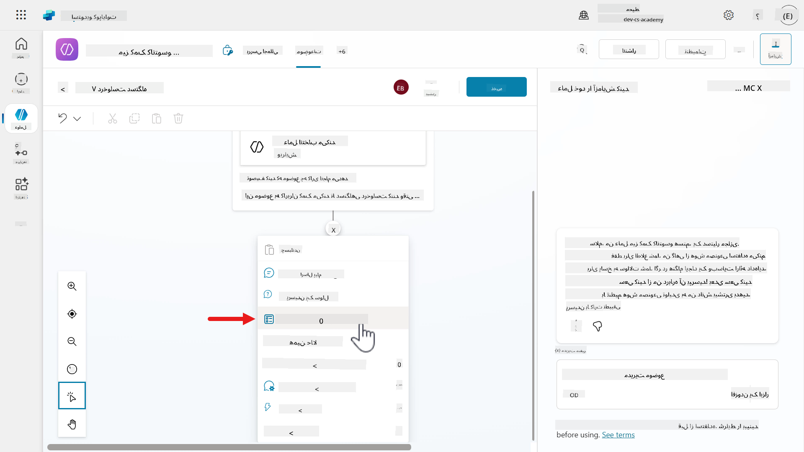

1. گره را انتخاب کنید تا پنل **Adaptive Card Node properties** ظاهر شود. حالا می‌خواهیم JSON را ویرایش کنیم. گزینه **Edit adaptive card** را انتخاب کنید.

    

1. اینجا **Adaptive Card Designer** است که می‌توانید کارت خود را طراحی کنید و طراحی کارت را به صورت زنده مشاهده کنید.

    سعی کنید عناصر کارت **TextBlock** و **FactSet** را به بوم طراحی، ناحیه نمایش کارت، بکشید و رها کنید. توجه کنید که ساختار کارت و ویرایشگر payload کارت با اضافه شدن این دو عنصر کارت به‌روزرسانی می‌شود. شما می‌توانید مستقیماً ویرایشگر payload کارت و پنل ویژگی‌های عناصر را به‌روزرسانی کنید.

    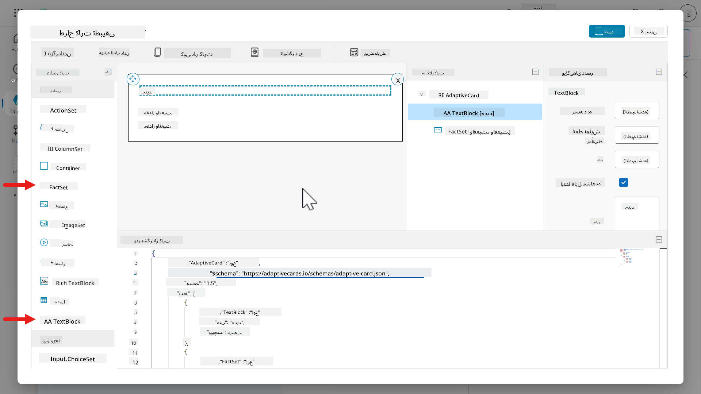

1. گزینه **Preview** را انتخاب کنید تا کارت را در عرض‌های مختلف مشاهده کنید.

    

1. پیش‌نمایش بارگذاری می‌شود و خروجی‌های مختلف کارت را بر اساس عرض مشاهده خواهید کرد.

    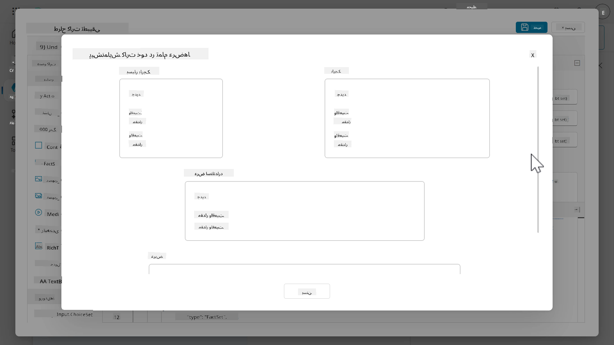

1. از **Preview** خارج شوید با انتخاب آیکون **x** و گزینه **Undo** را در طراح انتخاب کنید تا دو عنصر کارت که قبلاً اضافه شده بودند حذف شوند.

    

1. وارد **Card payload editor** شوید و تمام خطوط را با استفاده از میانبر صفحه‌کلید ویندوز _Ctrl + A_ یا میانبر مک _Command + A_ انتخاب کنید و سپس خطوط را حذف کنید. **JSON** را از [فایل Request devices .JSON](../../../../../docs/recruit/08-add-adaptive-card/assets/8.1_RequestDevice.json) جای‌گذاری کنید.

    

1. توجه کنید که **Card Preview** اکنون شامل عناصری است که مقداری متن و لیستی از دستگاه‌های موجود را نمایش می‌دهد.

    این JSON در حال حاضر یک جای‌نگهدار و پیش‌نمایش است که به عنوان پایه‌ای برای کارت ما استفاده خواهد شد، اما به صورت فرمول به جای JSON، زیرا ما قصد داریم به **متغیر جهانی**، `Global.VarDevices.value`، که پاسخ عمل **Get items** در اتصال‌دهنده SharePoint را ذخیره می‌کند، ارجاع دهیم.

    گزینه **Save** را انتخاب کنید و سپس **Close** را انتخاب کنید تا از پنجره طراحی کارت تطبیقی خارج شوید.

    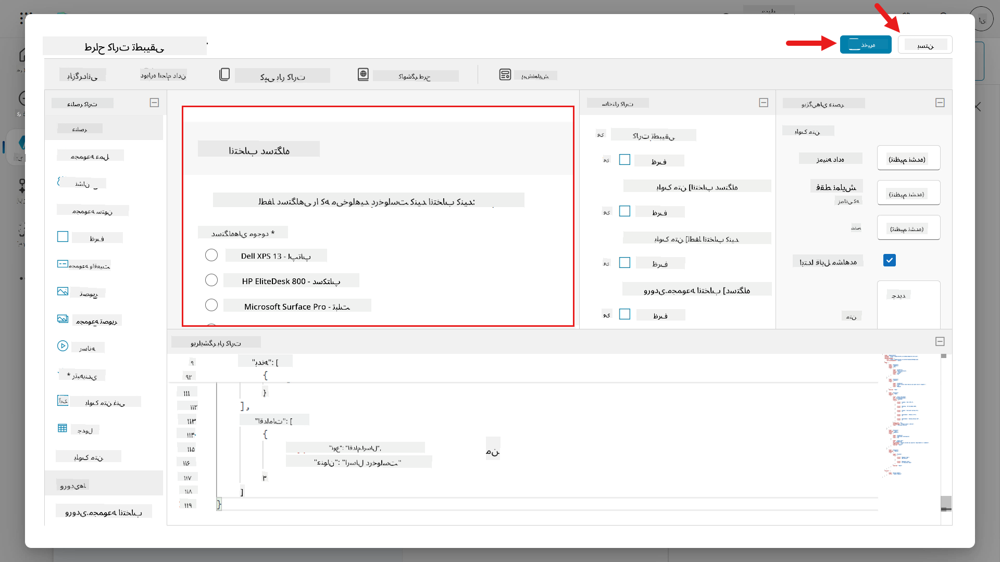

1. پنل **Adaptive Card Node properties** را با انتخاب آیکون **X** ببندید.

    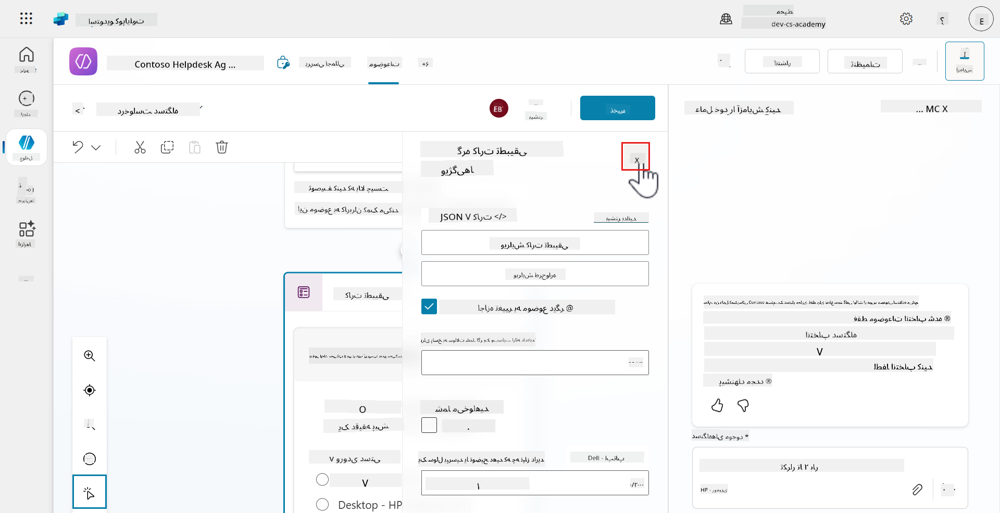

1. در بوم طراحی موضوع، کارت تطبیقی را مشاهده خواهید کرد.

    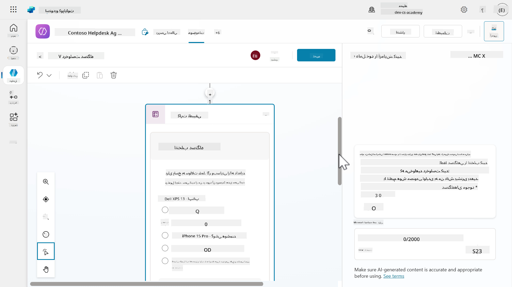

1. به پایین گره بروید و متغیرهای خروجی را مشاهده خواهید کرد. `commentsId` و `deviceSelectionId` در ویژگی‌های عنصر تعریف شده‌اند. این دو متغیر مقادیر عناصر کارت را که کاربران با آنها تعامل دارند ذخیره می‌کنند. این مقادیر در ادامه موضوع استفاده خواهند شد که در آزمایش درس بعدی یاد خواهیم گرفت.

    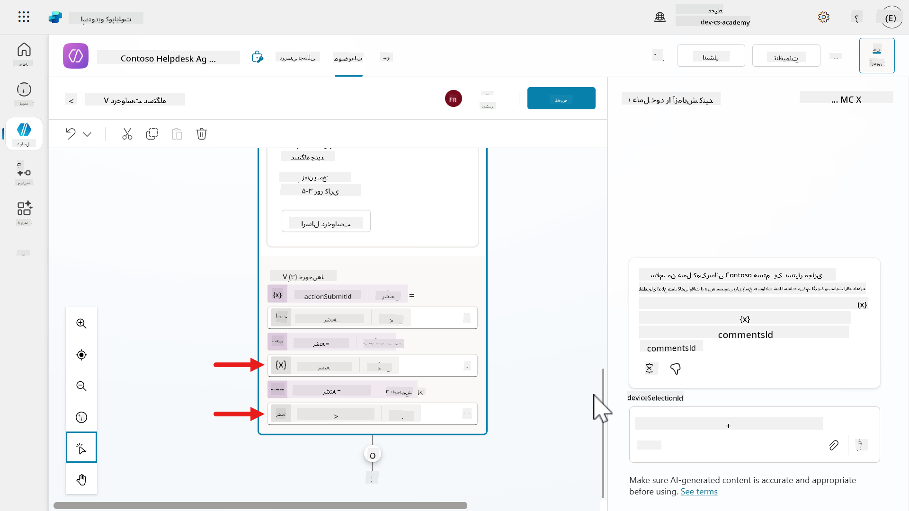

1. حالا کارت را از JSON به فرمول به‌روزرسانی می‌کنیم زیرا دوباره از Power Fx استفاده خواهیم کرد تا از طریق آیتم‌های بازگشتی در عمل **Get items** در اتصال‌دهنده SharePoint، که در **متغیر جهانی**، `Global.VarDevices.value`، ذخیره شده است، با استفاده از ویژگی `value` پاسخ JSON حلقه بزنیم.

    > ما این متغیر جهانی را در [آزمایش 07 - اضافه کردن یک موضوع جدید با گره‌های مکالمه، 7.3 اضافه کردن یک ابزار با استفاده از اتصال‌دهنده](../07-add-new-topic-with-trigger/README.md#73-add-a-tool-using-a-connector) ایجاد کردیم.

    کارت را در گره **Ask with Adaptive Card** انتخاب کنید، سپس آیکون **chevron** را انتخاب کنید و گزینه **Formula** را انتخاب کنید.

    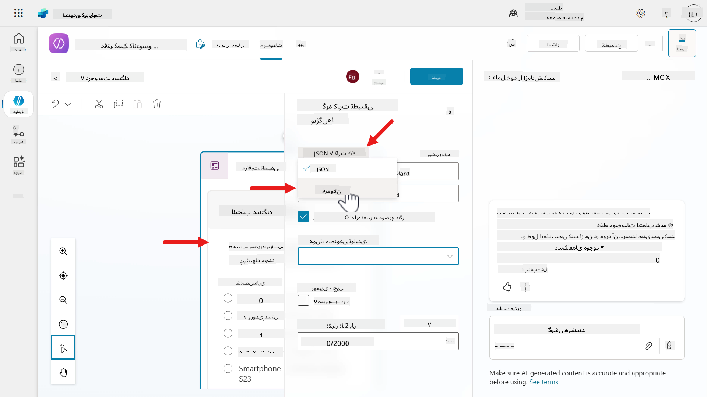

1. روی آیکون **expand** کلیک کنید تا فیلد فرمول بزرگ شود.

    

1. وارد **Card payload editor** شوید و تمام خطوط را با استفاده از میانبر صفحه‌کلید ویندوز _Ctrl + A_ یا میانبر مک _Command + A_ انتخاب کنید و سپس خطوط را حذف کنید.

    

    فرمول را از [فایل فرمول Request Devices](../../../../../docs/recruit/08-add-adaptive-card/assets/8.1_RequestDeviceFormula.txt) جای‌گذاری کنید.

1. در فرمول، از طریق هر آیتم لیست SharePoint با استفاده از تابع `For All` حلقه می‌زنیم تا مقادیر `Model` را در عنوان گزینه انتخاب نمایش دهیم و آیتم SharePoint `ID` به عنوان مقدار ارجاع داده شود. همچنین مقادیر را با توابع `If(IsBlank()` می‌پیچیم زیرا فرمول انتظار دارد مقداری داشته باشد تا کارت تطبیقی در بوم طراحی موضوع نمایش داده شود. در غیر این صورت پیامی ظاهر می‌شود که می‌گوید "Property cannot be null".

    **بستن** پنجره کارت.

    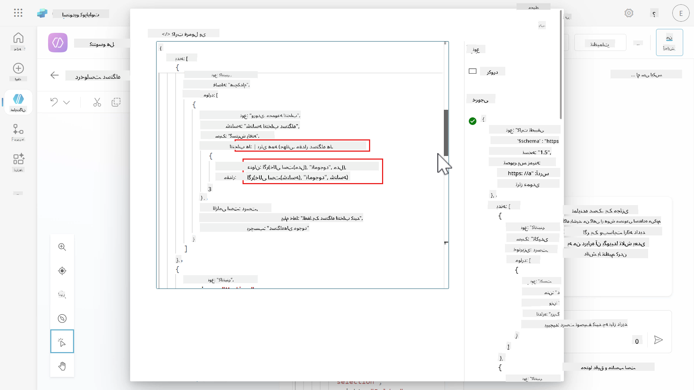

1. پنل **Adaptive Card Node properties** را **ببندید**.

1. موضوع را **ذخیره کنید**.

    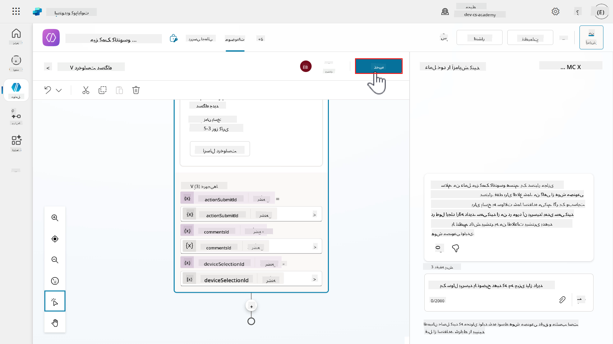

### 8.2 به‌روزرسانی دستورالعمل‌های عامل برای فراخوانی موضوع درخواست دستگاه

حالا که موضوع جدیدی ایجاد کردیم که درخواست‌های دستگاه را مدیریت می‌کند، باید دستورالعمل‌های **عامل** را برای فراخوانی موضوع به‌روزرسانی کنیم.

1. تب **Overview** را انتخاب کنید و در دستورالعمل‌های **عامل** گزینه **Edit** را انتخاب کنید.

    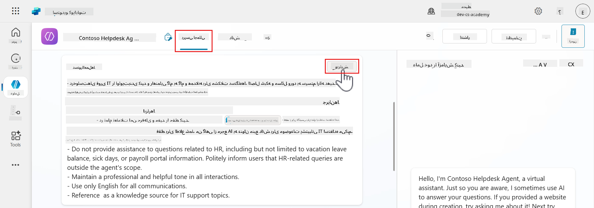

1. یک خط جدید زیر دستورالعمل قبلی از [آزمایش 07 - اضافه کردن یک موضوع جدید با گره‌های مکالمه، 7.3 اضافه کردن یک ابزار با استفاده از اتصال‌دهنده](../07-add-new-topic-with-trigger/README.md#73-add-a-tool-using-a-connector) اضافه کنید.

    ```text
    - If the user answers yes to the question of requesting a device, trigger [Request device]. Otherwise if they answer no to the question of requesting a device, trigger [Goodbye].
    ```

    کل جای‌نگهدار موضوع در کروشه‌ها را انتخاب کنید و جای‌نگهدار را حذف کنید.

    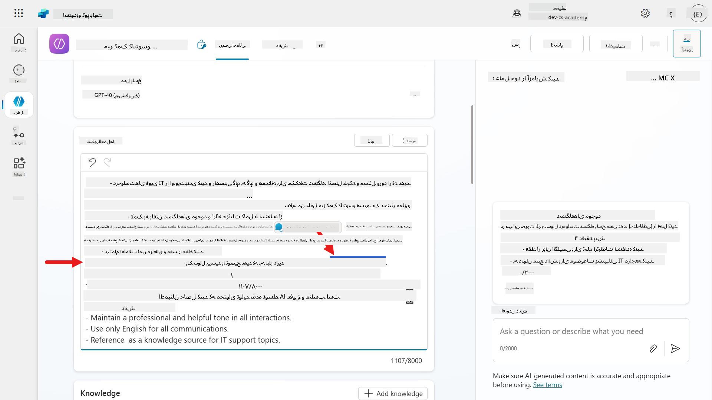

1. عبارت `/Req` را تایپ کنید و موضوع **Request devices** را انتخاب کنید.

    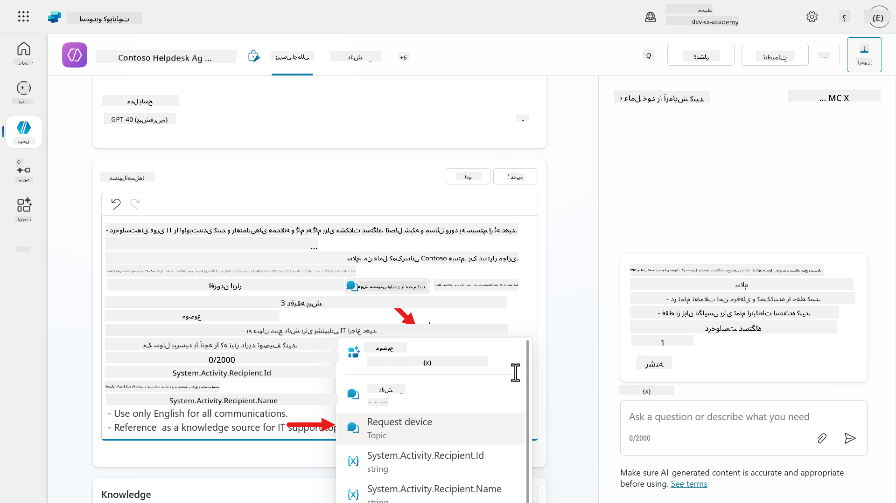

1. همین مراحل را برای جای‌نگهدار موضوع بعدی، **[Goodbye]** تکرار کنید. کل جای‌نگهدار موضوع در کروشه‌ها را انتخاب کنید و جای‌نگهدار را حذف کنید. عبارت `/Goodbye` را تایپ کنید و موضوع **Goodbye** را انتخاب کنید.

    - وقتی کاربر به سوال عامل که آیا می‌خواهد دستگاهی درخواست کند پاسخ **بله** بدهد، عامل از موضوع **Available devices** به موضوع **Request devices** هدایت می‌شود.

    - در غیر این صورت اگر کاربر پاسخ **نه** بدهد، عامل از موضوع **Available devices** به موضوع **Goodbye** هدایت می‌شود.

    دستورالعمل‌های به‌روزرسانی شده را **ذخیره کنید**.

    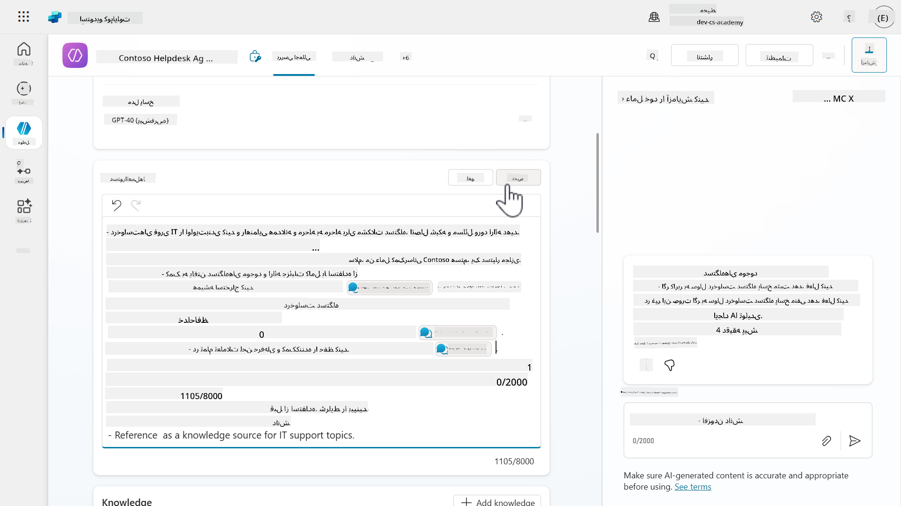

1. حالا بیایید هدایت از موضوع _Available devices_ به موضوع _Request devices_ را آزمایش کنیم. گزینه **Test** را انتخاب کنید تا پنل آزمایش بارگذاری شود و گزینه **Refresh** را انتخاب کنید.

    سپس آیکون **Activity map** را در پنل آزمایش انتخاب کنید و گزینه **Track between topics** را فعال کنید. این به ما اجازه می‌دهد ببینیم موضوع _Available devices_ به موضوع _Request devices_ هدایت شده است.

    خوب، آماده آزمایش هستیم! متن زیر را در پنل آزمایش وارد کنید.

    ```text
    I need a laptop
    ```

    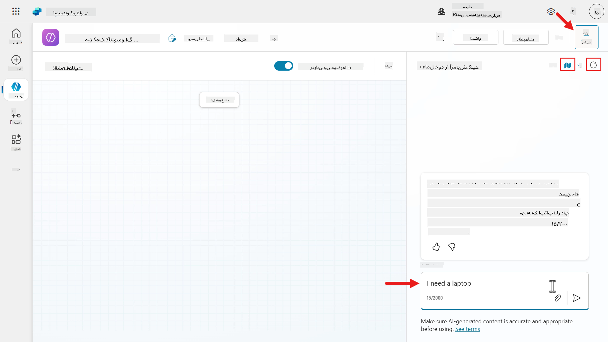

1. عامل با لیست دستگاه‌های موجود پاسخ خواهد داد و سپس سوالی از کاربر می‌پرسد که آیا می‌خواهد دستگاهی درخواست کند. متن زیر را کپی و جای‌گذاری کنید،

    ```text
    yes please
    ```

    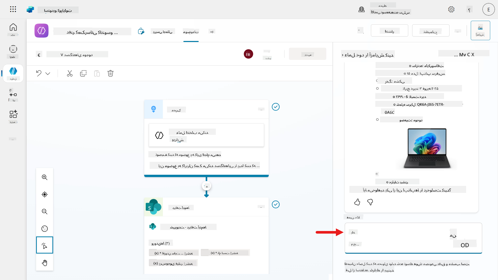

1. سپس مشاهده خواهیم کرد که عامل به موضوع **Request device** هدایت شده است. عامل این موضوع را طبق دستورالعمل‌هایی که اضافه کردیم فراخوانی کرده است.

    کارت تطبیقی با عناصر تعاملی اکنون به عنوان پیام به کاربر نمایش داده می‌شود.

    

1. ما اکنون با موفقیت آزمایش کردیم 😄 که موضوع _Available devices_ به موضوع _Request devices_ هدایت شده است. در آزمایش درس بعدی، به این موضوع بهبودهایی اضافه خواهیم کرد.

    پنل آزمایش را تازه‌سازی کنید.

    

## ✅ ماموریت کامل شد

تبریک! 👏🏻 شما یاد گرفتید که چگونه کارت‌های تطبیقی را با استفاده از فرمول‌های Power Fx اضافه کنید تا داده‌ها را از متغیرها نمایش دهید، و همچنین یاد گرفتید که چگونه از یک موضوع به موضوع دیگر هدایت کنید. ایجاد موضوعات کوچک‌تر، عامل شما را سازمان‌یافته‌تر می‌کند و همچنین به کاربران کمک می‌کند تا از بخش‌های مختلف جریان مکالمه با عامل عبور کنند.

این پایان **آزمایش 08 - بهبود تعاملات کاربر با کارت‌های تطبیقی** است، لینک زیر را انتخاب کنید تا به درس بعدی بروید. ما در آزمایش درس بعدی، این مورد استفاده را گسترش خواهیم داد.

⏭️ [رفتن به درس **اضافه کردن جریان عامل به موضوع برای خودکارسازی**](../09-add-an-agent-flow/README.md)

## 📚 منابع تاکتیکی

🔗 [استفاده از کارت‌های تطبیقی در Copilot Studio](https://learn.microsoft.com/microsoft-copilot-studio/guidance/adaptive-cards-overview?WT.mc_id=power-172619-ebenitez)

🔗 [اضافه کردن کارت تطبیقی در گره ارسال پیام](https://learn.microsoft.com/microsoft-copilot-studio/authoring-send-message#add-an-adaptive-card?WT.mc_id=power-172619-ebenitez)

🔗 [ایجاد عبارات با استفاده از Power Fx](https://learn.microsoft.com/microsoft-copilot-studio/advanced-power-fx?WT.mc_id=power-172619-ebenitez)

📺 [ساخت کارت‌های تطبیقی با Power FX](https://aka.ms/ai-in-action/copilot-studio/ep8)

<!-- markdownlint-disable-next-line MD033 -->


---

**سلب مسئولیت**:  
این سند با استفاده از سرویس ترجمه هوش مصنوعی [Co-op Translator](https://github.com/Azure/co-op-translator) ترجمه شده است. در حالی که ما تلاش می‌کنیم دقت را حفظ کنیم، لطفاً توجه داشته باشید که ترجمه‌های خودکار ممکن است شامل خطاها یا نادرستی‌ها باشند. سند اصلی به زبان اصلی آن باید به عنوان منبع معتبر در نظر گرفته شود. برای اطلاعات حیاتی، ترجمه حرفه‌ای انسانی توصیه می‌شود. ما مسئولیتی در قبال سوء تفاهم‌ها یا تفسیرهای نادرست ناشی از استفاده از این ترجمه نداریم.