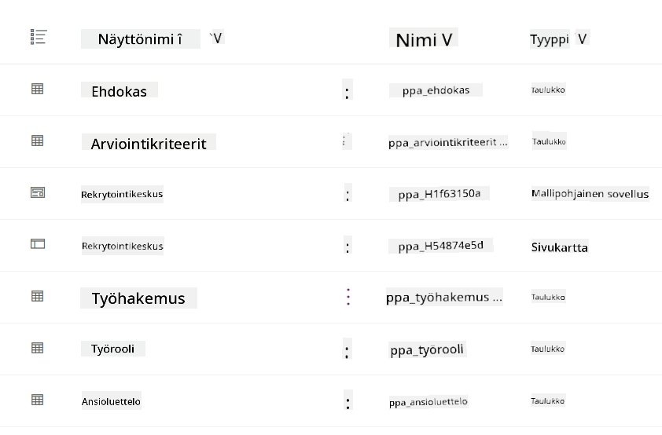
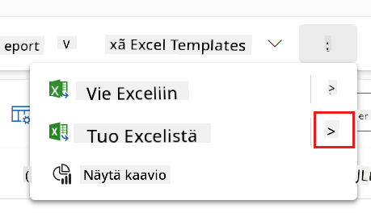
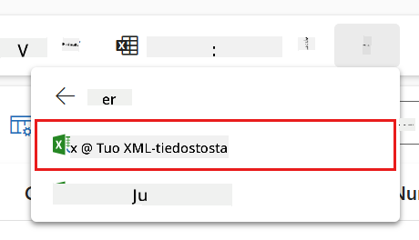
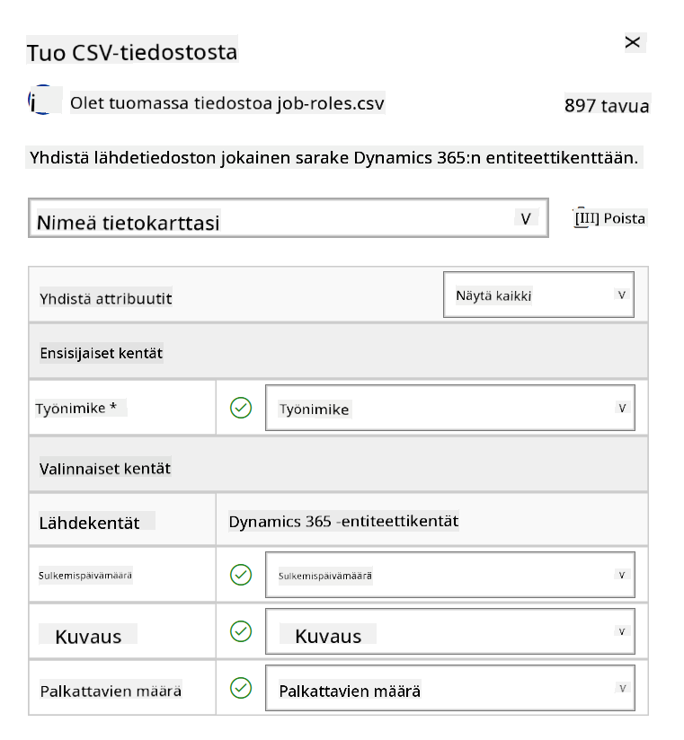
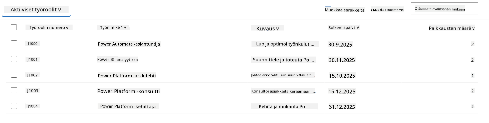
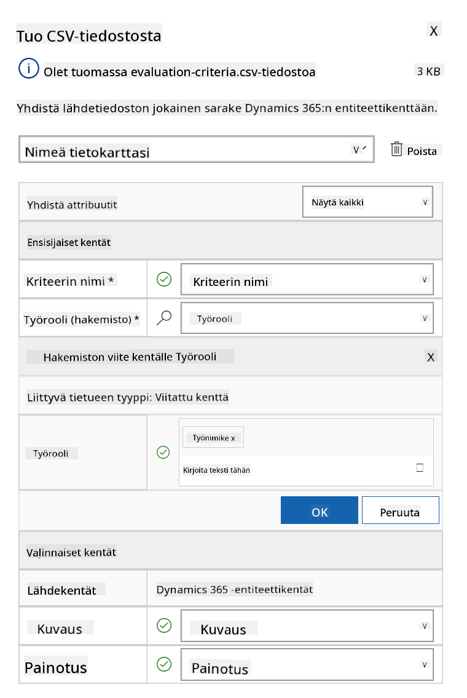
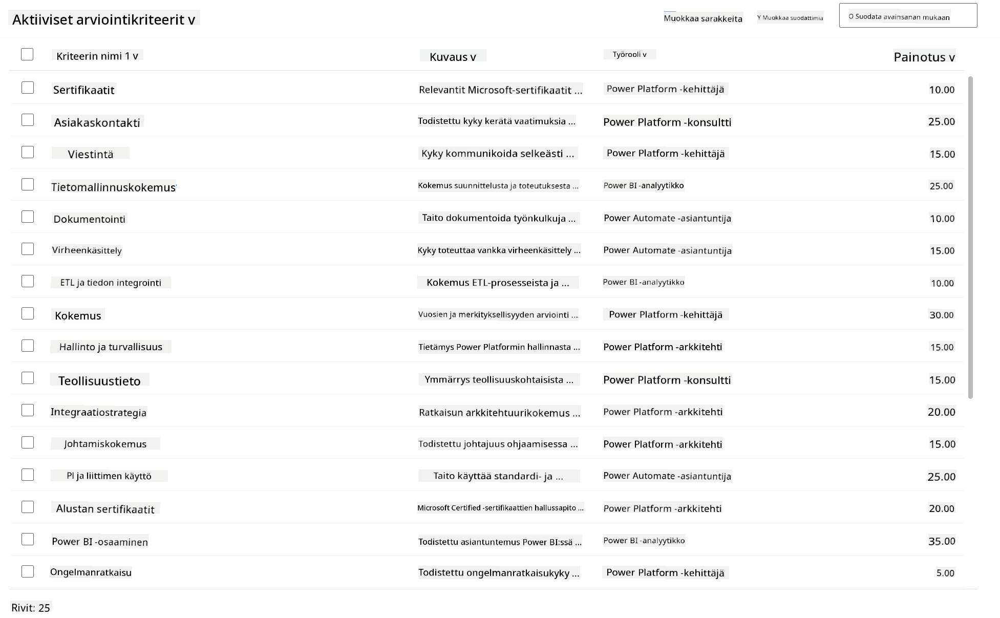

<!--
CO_OP_TRANSLATOR_METADATA:
{
  "original_hash": "2620cf9eaf09a3fc6be7fa31a3a62956",
  "translation_date": "2025-10-17T05:33:02+00:00",
  "source_file": "docs/operative-preview/01-get-started/README.md",
  "language_code": "fi"
}
-->
# 🚨 Tehtävä 01: Aloita rekrytointiautomaation agentilla

--8<-- "disclaimer.md"

## 🕵️‍♂️ Koodinimi: `OPERATION TALENT SCOUT`

> **⏱️ Operaatioaikaikkuna:** `~45 minuuttia`

## 🎯 Tehtävän kuvaus

Tervetuloa, Agentti. Ensimmäinen tehtäväsi on **Operation Talent Scout** - luoda perusinfrastruktuuri tekoälypohjaiselle rekrytointijärjestelmälle, joka mullistaa organisaatioiden tavat tunnistaa ja palkata huippuosaajia.

Tehtäväsi, jos päätät hyväksyä sen, on ottaa käyttöön ja konfiguroida kattava rekrytoinnin hallintajärjestelmä Microsoft Copilot Studion avulla. Tulet tuomaan valmiin ratkaisun, joka sisältää kaikki tarvittavat tietorakenteet, ja luomaan ensimmäisen tekoälyagenttisi - **Rekrytointiautomaation agentin** - joka toimii keskeisenä koordinaattorina kaikissa tulevissa rekrytointitoiminnoissa.

Tämä alkuvaiheen käyttöönotto luo komentokeskuksen, jota tulet kehittämään Agenttiakatemian operatiivisen ohjelman aikana. Pidä tätä tukikohtanasi - perustana, jolle rakennat kokonaisen verkoston erikoistuneita agentteja tulevissa tehtävissä.

---

## 🔎 Tavoitteet

Tämän tehtävän suorittamalla opit:

- **Skenaarion ymmärtäminen**: Saat kattavan käsityksen rekrytoinnin automaation haasteista ja ratkaisuista
- **Ratkaisun käyttöönotto**: Onnistut tuomaan ja konfiguroimaan rekrytoinnin hallintajärjestelmän perusosat
- **Agentin luominen**: Rakennat rekrytointiautomaation agentin, joka toimii pohjana tuleville Agenttiakatemian operatiivisille tehtäville

---

## 🔍 Esivaatimukset

Ennen kuin aloitat tehtävän, varmista että sinulla on:

- Copilot Studio -lisenssi
- Pääsy Microsoft Power Platform -ympäristöön
- Hallinnolliset oikeudet ratkaisujen ja agenttien luomiseen

---

## 🏢 Rekrytoinnin automaation skenaarion ymmärtäminen

Tämä skenaario näyttää, kuinka yritys voi käyttää Microsoft Copilot Studiota parantaakseen ja automatisoidakseen rekrytointiprosessiaan. Se esittelee agenttijärjestelmän, joka työskentelee yhdessä hoitaakseen tehtäviä, kuten ansioluetteloiden tarkastelua, työroolien suosituksia, haastattelumateriaalien valmistelua ja ehdokkaiden arviointia.

### Liiketoiminnallinen arvo

Ratkaisu auttaa HR-tiimejä säästämään aikaa ja tekemään parempia päätöksiä:

- Käsittelemällä automaattisesti sähköpostitse saapuvia ansioluetteloita.
- Suosittelemalla sopivia työrooleja ehdokasprofiilien perusteella.
- Luomalla työpaikkahakemuksia ja haastatteluoppaita, jotka on räätälöity kullekin ehdokkaalle.
- Varmistamalla oikeudenmukaiset ja sääntöjen mukaiset rekrytointikäytännöt sisäänrakennettujen turvallisuus- ja moderointiominaisuuksien avulla.
- Keräämällä palautetta ratkaisun parantamiseksi.

### Miten se toimii

- Keskeinen **Rekrytointiautomaation agentti** koordinoi prosessia ja tallentaa tiedot Microsoft Dataverseen.
- **Hakemusten vastaanottoagentti** lukee ansioluetteloita ja luo työpaikkahakemuksia.
- **Haastattelun valmisteluagentti** luo haastattelukysymyksiä ja dokumentteja ehdokkaan taustan perusteella.
- Järjestelmä voidaan julkaista demoverkkosivustolle, jolloin sidosryhmät voivat olla vuorovaikutuksessa sen kanssa.

Tämä skenaario sopii erinomaisesti organisaatioille, jotka haluavat modernisoida rekrytointiprosessejaan tekoälypohjaisen automaation avulla, säilyttäen samalla läpinäkyvyyden, oikeudenmukaisuuden ja tehokkuuden.

---

## 🧪 Laboratorio: Rekrytointiautomaation agentin asennus

Tässä käytännön laboratoriossa luot perustan rekrytoinnin automaatiojärjestelmällesi. Aloitat tuomalla ennalta konfiguroidun ratkaisun, joka sisältää kaikki tarvittavat Dataverse-taulukot ja tietorakenteet ehdokkaiden, työpaikkojen ja rekrytointiprosessien hallintaan. Seuraavaksi täytät nämä taulukot esimerkkidatalla, joka tukee oppimistasi tämän moduulin aikana ja tarjoaa realistisia testiskenaarioita. Lopuksi luot rekrytointiautomaation agentin Copilot Studiossa, perustamalla peruskeskusteluliittymän, joka toimii kulmakivenä kaikille tuleville ominaisuuksille, joita lisäät seuraavissa tehtävissä.

### 🧪 Lab 1.1: Ratkaisun tuonti

1. Siirry **[Copilot Studioon](https://copilotstudio.microsoft.com)**
1. Valitse **...** vasemmasta navigaatiosta ja valitse **Solutions**
1. Valitse ylhäältä **Import Solution** -painike
1. **[Lataa](https://raw.githubusercontent.com/microsoft/agent-academy/refs/heads/main/docs/operative-preview/01-get-started/assets/Operative_1_0_0_0.zip)** valmiiksi tehty ratkaisu
1. Valitse **Browse** ja valitse edellisessä vaiheessa ladattu ratkaisu
1. Valitse **Next**
1. Valitse **Import**

!!! success
    Onnistuneen tuonnin jälkeen näet vihreän ilmoituspalkin, jossa lukee:  
    "Solution "Operative" imported successfully."

Kun ratkaisu on tuotu, tutustu siihen, mitä olet tuonut valitsemalla ratkaisun näyttönimi (`Operative`).



Seuraavat komponentit on tuotu:

| Näyttönimi | Tyyppi | Kuvaus |
|-------------|------|-------------|
| Candidate | Taulukko | Ehdokastiedot |
| Evaluation Criteria | Taulukko | Arviointikriteerit roolia varten |
| Hiring Hub | Mallipohjainen sovellus | Sovellus rekrytointiprosessin hallintaan |
| Hiring Hub | Sivukartta | Hiring Hub -sovelluksen navigointirakenne |
| Job Application | Taulukko | Työhakemukset |
| Job Role | Taulukko | Työroolit |
| Resume | Taulukko | Ehdokkaiden ansioluettelot |

Viimeisenä tehtävänä tässä laboratoriossa, valitse **Publish all customizations** -painike sivun yläosasta.

### 🧪 Lab 1.2: Esimerkkidatan tuonti

Tässä laboratoriossa lisäät esimerkkidataa joihinkin taulukoihin, jotka toit labrassa 1.1.

#### Lataa tiedostot tuontia varten

1. **[Lataa](https://raw.githubusercontent.com/microsoft/agent-academy/refs/heads/main/docs/operative-preview/01-get-started/assets/evaluation-criteria.csv)** CSV-tiedosto arviointikriteereistä
1. **[Lataa](https://raw.githubusercontent.com/microsoft/agent-academy/refs/heads/main/docs/operative-preview/01-get-started/assets/job-roles.csv)** CSV-tiedosto työrooleista

#### Työroolien esimerkkidatan tuonti

1. Palaa ratkaisuun, jonka juuri toit edellisessä laboratoriossa
1. Valitse **Hiring Hub** -mallipohjainen sovellus valitsemalla rivin edessä oleva valintamerkki
1. Valitse ylhäältä **Play**-painike

    !!! warning
        Sinua saatetaan pyytää kirjautumaan uudelleen. Varmista, että teet sen. Tämän jälkeen sinun pitäisi nähdä Hiring Hub -sovellus.

1. Valitse vasemmasta navigaatiosta **Job Roles**
1. Valitse komentopalkista **More**-ikoni (kolme pistettä päällekkäin)
1. Valitse **oikea nuoli** *Import from Excel* -kohdan vieressä

    

1. Valitse **Import from CSV**

    

1. Valitse **Choose File** -painike, valitse juuri ladattu **job-roles.csv**-tiedosto ja valitse **Open**
1. Valitse **Next**
1. Jätä seuraava vaihe sellaisenaan ja valitse **Review Mapping**

    

1. Varmista, että kartoitus on oikein, ja valitse **Finish Import**

    !!! info
        Tämä käynnistää tuonnin, ja voit seurata edistymistä tai viimeistellä prosessin heti valitsemalla **Done**

1. Valitse **Done**

Tämä voi kestää hetken, mutta voit painaa **Refresh**-painiketta nähdäksesi, onko tuonti onnistunut.



#### Arviointikriteerien esimerkkidatan tuonti

1. Valitse vasemmasta navigaatiosta **Evaluation Criteria**
1. Valitse komentopalkista **More**-ikoni (kolme pistettä päällekkäin)
1. Valitse **oikea nuoli** *Import from Excel* -kohdan vieressä

    

1. Valitse **Import from CSV**

    

1. Valitse **Choose File** -painike, valitse juuri ladattu **evaluation-criteria.csv**-tiedosto ja valitse **Open**
1. Valitse **Next**
1. Jätä seuraava vaihe sellaisenaan ja valitse **Review Mapping**

    

1. Nyt meidän täytyy tehdä hieman enemmän työtä kartoituksen kanssa. Valitse suurennuslasin (🔎-ikoni) vieressä oleva Job Role -kenttä
1. Varmista, että **Job Title** on valittuna, ja jos ei ole - lisää se
1. Valitse **OK**
1. Varmista, että loput kartoituksesta ovat myös oikein, ja valitse **Finish Import**

    !!! info
        Tämä käynnistää tuonnin uudelleen, ja voit seurata edistymistä tai viimeistellä prosessin heti valitsemalla **Done**

1. Valitse **Done**

Tämä voi kestää hetken, mutta voit painaa **Refresh**-painiketta nähdäksesi, onko tuonti onnistunut.



### 🧪 Lab 1.3: Rekrytointiautomaation agentin luominen

Nyt kun olet valmis esivaatimusten asennuksen kanssa, on aika siirtyä varsinaiseen työhön! Lisätään ensin rekrytointiautomaation agentti!

1. Siirry **[Copilot Studioon](https://copilotstudio.microsoft.com)** ja varmista, että olet samassa ympäristössä, johon toit ratkaisun ja datan
1. Valitse vasemmasta navigaatiosta **Agents**
1. Valitse **New Agent**
1. Valitse **Configure**
1. **Name**-kenttään, syötä:

    ```text
    Hiring Agent
    ```

1. **Description**-kenttään, syötä:

    ```text
    Central orchestrator for all hiring activities
    ```

1. Valitse **...** *Create*-painikkeen oikealla puolella ylhäällä
1. Valitse **Update advanced settings**
1. **Solution**-kohtaan, valitse `Operative`
1. Valitse **Update**
1. Valitse oikeasta yläkulmasta **Create**

Tämä luo sinulle rekrytointiautomaation agentin, jota käytät koko Operative-kurssin ajan.

---

## 🎉 Tehtävä suoritettu

Tehtävä 01 on suoritettu! Olet nyt hallinnut seuraavat taidot:

✅ **Skenaarion ymmärtäminen**: Kattava tieto rekrytoinnin automaation haasteista ja ratkaisuista  
✅ **Ratkaisun käyttöönotto**: Onnistunut rekrytoinnin hallintajärjestelmän perusosien tuonti ja konfigurointi  
✅ **Agentin luominen**: Rakensit rekrytointiautomaation agentin, joka toimii pohjana Agenttiakatemian operatiivisessa ohjelmassa  

Seuraavaksi [Tehtävä 02](../02-multi-agent/README.md): Tee agentistasi monen agentin yhteensopiva yhdistämällä agentteja.

---

## 📚 Taktiset resurssit

📖 [Microsoft Copilot Studio - Agentin luominen](https://learn.microsoft.com/microsoft-copilot-studio/authoring-first-bot)  
📖 [Microsoft Dataverse -dokumentaatio](https://learn.microsoft.com/power-apps/maker/data-platform)

---

**Vastuuvapauslauseke**:  
Tämä asiakirja on käännetty käyttämällä tekoälypohjaista käännöspalvelua [Co-op Translator](https://github.com/Azure/co-op-translator). Vaikka pyrimme tarkkuuteen, huomioithan, että automaattiset käännökset voivat sisältää virheitä tai epätarkkuuksia. Alkuperäistä asiakirjaa sen alkuperäisellä kielellä tulisi pitää ensisijaisena lähteenä. Kriittisen tiedon osalta suositellaan ammattimaista ihmiskäännöstä. Emme ole vastuussa väärinkäsityksistä tai virhetulkinnoista, jotka johtuvat tämän käännöksen käytöstä.