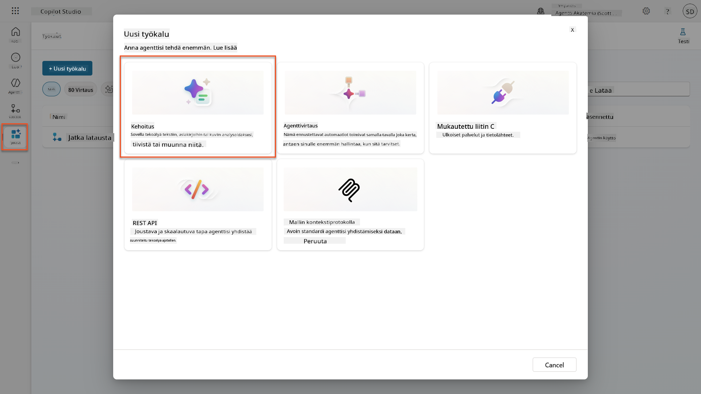
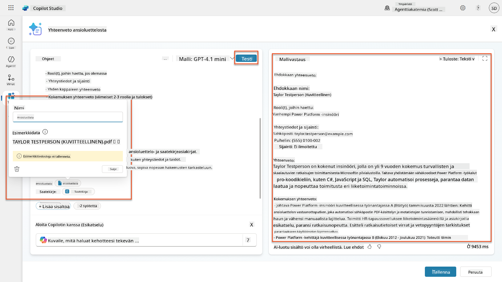
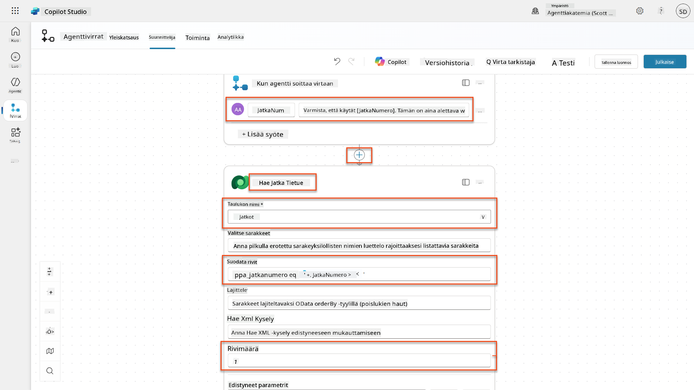
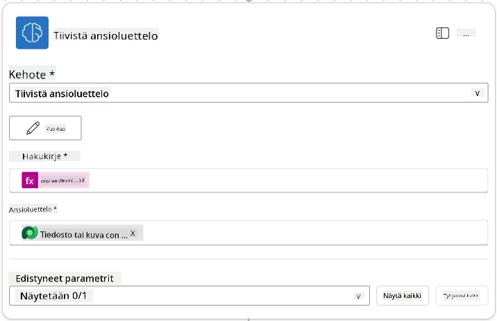
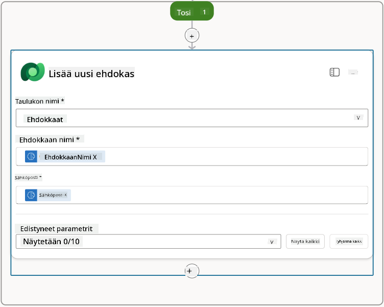
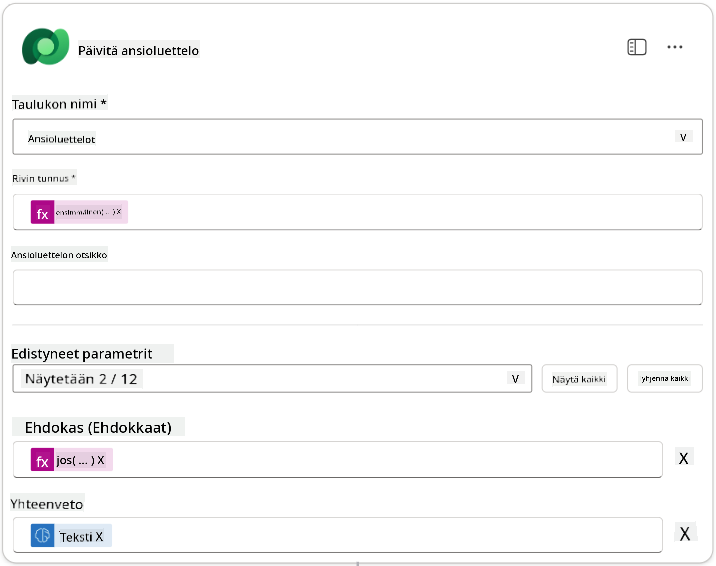
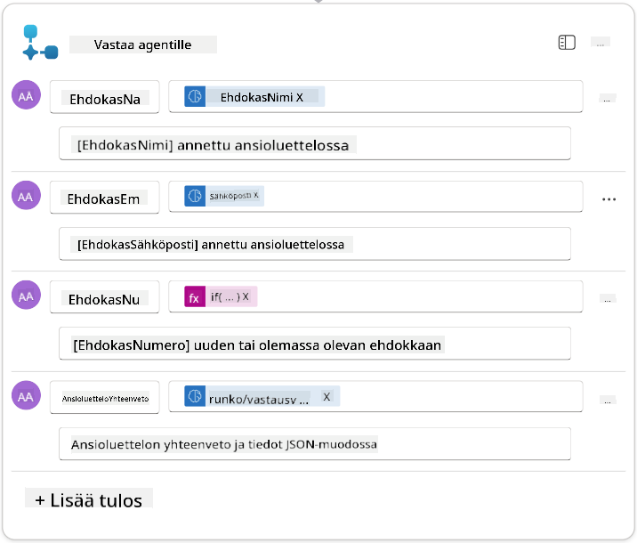
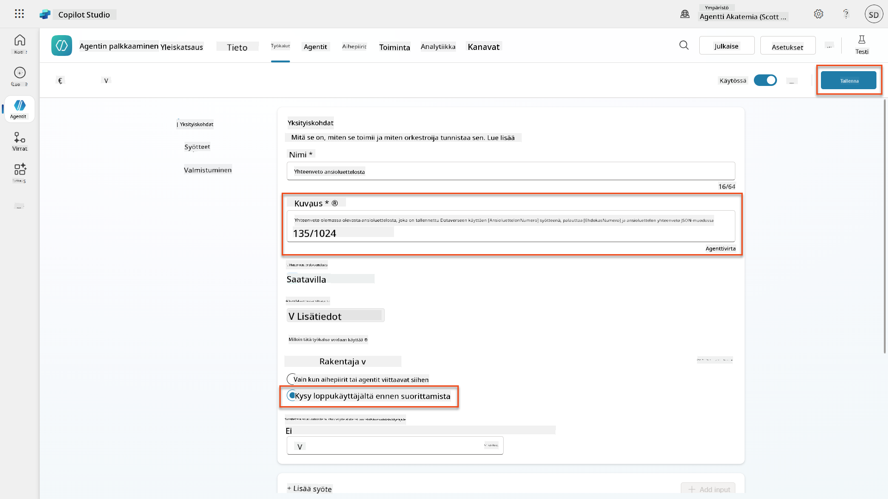
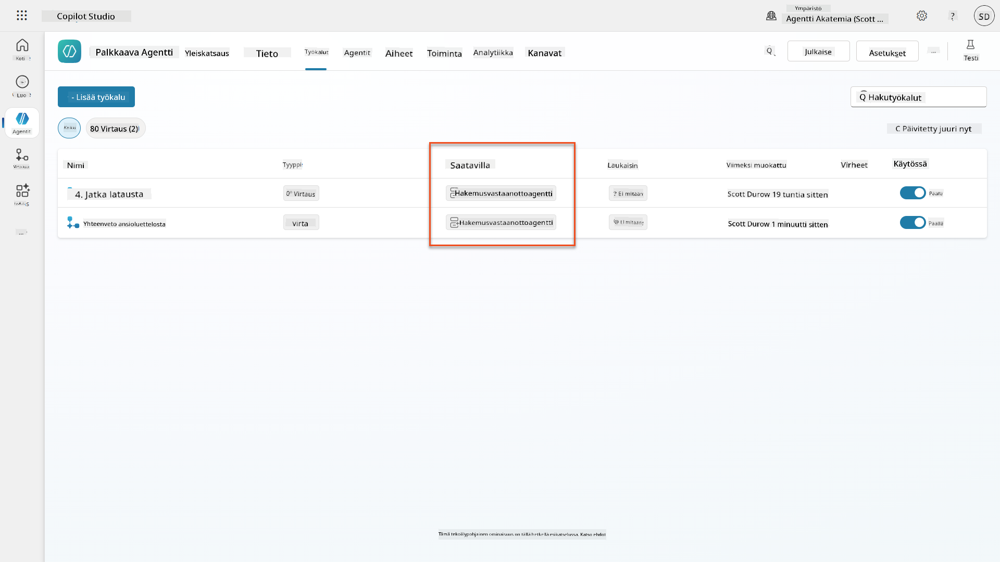
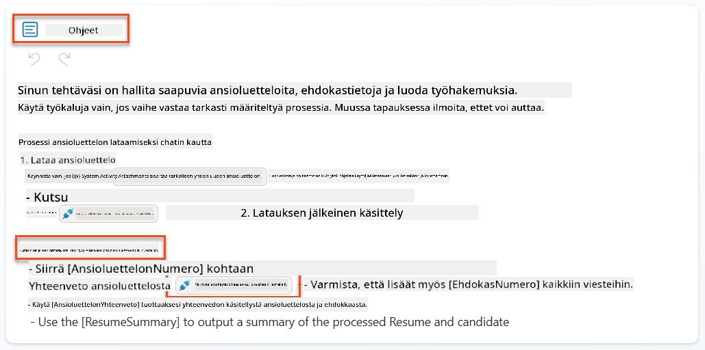

<!--
CO_OP_TRANSLATOR_METADATA:
{
  "original_hash": "616d142d4fb5f45d2a168fad6c1f9545",
  "translation_date": "2025-10-17T05:29:42+00:00",
  "source_file": "docs/operative-preview/07-multimodal-prompts/README.md",
  "language_code": "fi"
}
-->
# 🚨 Tehtävä 07: Ansioluettelon sisällön poiminta multimodaalisilla kehotteilla

--8<-- "disclaimer.md"

## 🕵️‍♂️ Koodinimi: `DOKUMENTTI ANSIOLUETTELO TIEDUSTELU`

> **⏱️ Operaatioaikaikkuna:** `~45 minuuttia`

## 🎯 Tehtävän kuvaus

Tervetuloa, Operatiivinen. Aiemmat tehtäväsi ovat antaneet sinulle tehokkaita agenttien orkestrointitaitoja, mutta nyt on aika avata pelin muuttava kyky: **multimodaalinen dokumenttianalyysi**.

Tehtäväsi, jos päätät hyväksyä sen, on **Dokumentti Ansioluettelo Tiedustelu** - poimia tarkasti jäsenneltyä dataa mistä tahansa dokumentista. Vaikka agenttisi voivat käsitellä tekstiä helposti, todellinen maailma vaatii päivittäin PDF-tiedostojen, kuvien ja monimutkaisten dokumenttien käsittelyä. Ansioluettelot kasaantuvat, laskut tarvitsevat käsittelyä ja lomakkeet vaativat välitöntä digitalisointia.

Tämä tehtävä muuttaa sinut tekstipohjaisesta agentin rakentajasta **multimodaaliseksi asiantuntijaksi**. Opit konfiguroimaan tekoälyä, joka lukee ja ymmärtää dokumentteja kuin ihmisanalyytikko - mutta tekoälyn nopeudella ja johdonmukaisuudella. Tehtävän lopussa olet rakentanut täydellisen ansioluettelon poimintajärjestelmän, joka integroituu rekrytointityönkulkuusi.

Tässä opitut tekniikat ovat olennaisia seuraavan tehtävän edistyneissä datan perustamisoperaatioissa.

## 🔎 Tavoitteet

Tässä tehtävässä opit:

1. Mitä multimodaaliset kehotteet ovat ja milloin käyttää eri tekoälymalleja
1. Kuinka konfiguroida kehotteita kuvien ja dokumenttien syötteillä
1. Kuinka muotoilla kehotteiden tulokset JSON-muotoon jäsenneltyä datan poimintaa varten
1. Parhaat käytännöt kehotteiden suunnittelussa dokumenttianalyysiin
1. Kuinka integroida multimodaaliset kehotteet Agent Flows -työnkulkuihin

## 🧠 Multimodaalisten kehotteiden ymmärtäminen

### Mikä tekee kehotteesta "multimodaalisen"?

Perinteiset kehotteet toimivat vain tekstin kanssa. Multimodaaliset kehotteet voivat käsitellä useita sisältötyyppejä:

- **Teksti**: Kirjalliset ohjeet ja sisältö
- **Kuvat**: Valokuvat, kuvakaappaukset, kaaviot ja diagrammit (.PNG, .JPG, .JPEG)  
- **Dokumentit**: Laskut, ansioluettelot, lomakkeet (.PDF)

Tämä kyky avaa voimakkaita skenaarioita, kuten ansioluetteloiden analysointi, laskujen käsittely tai datan poiminta lomakkeista.

### Miksi multimodaalisuus on tärkeää työnkuluillesi

Joka päivä organisaatiosi kohtaa seuraavia dokumenttien käsittelyhaasteita:

- **Ansioluetteloiden seulonta**: Satojen ansioluetteloiden manuaalinen lukeminen vie arvokasta aikaa
- **Laskujen käsittely**: Toimittajatietojen, summien ja päivämäärien poiminta erilaisista dokumenttimuodoista
- **Lomakkeiden analyysi**: Paperilomakkeiden muuntaminen digitaaliseksi dataksi

Multimodaaliset kehotteet poistavat nämä pullonkaulat yhdistämällä tekoälyn kielen ymmärryksen visuaalisen analyysin kykyihin. Tämä antaa tekoälyllesi kyvyn käsitellä dokumentteja yhtä tehokkaasti kuin tekstiä.

### Yleiset liiketoimintaskenaariot

Tässä muutamia esimerkkejä siitä, miten multimodaalisia kehotteita voidaan soveltaa:

| Skenaario                | Tehtävä                                                                                                                                      | Esimerkkikentät                                                                                   |
|--------------------------|-----------------------------------------------------------------------------------------------------------------------------------------------|---------------------------------------------------------------------------------------------------|
| **Ansioluetteloiden seulonta** | Poimi ehdokkaan nimi, sähköposti, puhelinnumero, nykyinen titteli, työkokemusvuodet ja keskeiset taidot.                                  | Ehdokkaan nimi, sähköpostiosoite, puhelinnumero, nykyinen työtehtävä, työkokemusvuodet, keskeiset taidot |
| **Laskujen käsittely**   | Poimi toimittajatiedot, laskun päivämäärä, kokonaissumma ja rivitiedot tästä laskusta.                                                        | Toimittajan nimi, laskun päivämäärä, kokonaissumma, laskun rivitiedot                              |
| **Lomakkeiden analyysi** | Analysoi tämä hakemuslomake ja poimi kaikki täytetyt kentät.                                                                                 | Kentän nimi (esim. Hakijan nimi), Syötetty arvo (esim. John Doe), ...                              |
| **Henkilöllisyystodistuksen tarkistus** | Poimi nimi, henkilötunnus, voimassaolopäivä ja osoite tästä henkilöllisyystodistuksesta. Varmista, että kaikki teksti on selkeästi luettavissa ja merkitse epäselvät osat. | Koko nimi, henkilötunnus, voimassaolopäivä, osoite, epäselvien osien merkintä                      |

## ⚙️ Mallin valinta AI Builderissa

AI Builder tarjoaa erilaisia malleja, jotka on optimoitu tiettyihin tehtäviin. Ymmärtäminen, mitä mallia käyttää, on ratkaisevan tärkeää onnistumisen kannalta.

!!! note "Ajantasainen syyskuussa 2025"
    AI Builder -mallit päivitetään säännöllisesti, joten tarkista viimeisimmät [AI Builder -malliasetusten dokumentaatio](https://learn.microsoft.com/ai-builder/prompt-modelsettings) saadaksesi ajantasaiset tiedot mallien saatavuudesta.

### Mallien vertailu

Kaikki seuraavat mallit tukevat visuaalista ja dokumenttien käsittelyä

| Malli | 💰Kustannus | ⚡Nopeus | ✅Paras käyttö |
|-------|------------|---------|---------------|
| **GPT-4.1 mini** | Perus (edullisin) | Nopea | Tavallinen dokumenttien käsittely, tiivistelmät, budjettitietoiset projektit |
| **GPT-4.1** | Standardi | Kohtalainen | Monimutkaiset dokumentit, edistynyt sisällön luominen, korkean tarkkuuden tarpeet |
| **o3** | Premium | Hidas (perusteellinen) | Datan analyysi, kriittinen ajattelu, hienostunut ongelmanratkaisu |
| **GPT-5 chat** | Standardi | Parannettu | Uusin dokumenttien ymmärrys, korkein vastaustarkkuus |
| **GPT-5 reasoning** | Premium | Hidas (monimutkainen analyysi) | Hienostunein analyysi, suunnittelu, edistynyt päättely |

### Lämpötila-asetusten selitys

Lämpötila ohjaa, kuinka luovia tai ennustettavia tekoälyn vastaukset ovat:

- **Lämpötila 0**: Ennustettavin, johdonmukaisimmat tulokset (paras datan poimintaan)
- **Lämpötila 0.5**: Tasapainoinen luovuus ja johdonmukaisuus  
- **Lämpötila 1**: Maksimaalinen luovuus (paras sisällön luomiseen)

Dokumenttianalyysiin käytä **lämpötila 0** varmistaaksesi johdonmukaisen datan poiminnan.

## 📊 Tulostusmuodot: Teksti vs JSON

Oikean tulostusmuodon valinta on kriittistä jatkokäsittelyä varten.

### Milloin käyttää tekstimuotoa

Tekstimuoto toimii hyvin:

- Ihmisten luettavissa oleville tiivistelmille
- Yksinkertaisille luokitteluille
- Sisällölle, joka ei vaadi jäsenneltyä käsittelyä

### Milloin käyttää JSON-muotoa

JSON-muoto on välttämätön:

- Jäsenneltyyn datan poimintaan
- Integrointiin tietokantojen tai järjestelmien kanssa
- Power Automate -työnkulkujen käsittelyyn
- Johdonmukaiseen kenttien kartoitukseen

### JSON:n parhaat käytännöt

1. **Määrittele selkeät kenttien nimet**: Käytä kuvaavia, johdonmukaisia nimiä
1. **Tarjoa esimerkkejä**: Sisällytä näyteulostulo ja arvot jokaiselle kentälle
1. **Määritä tietotyypit**: Sisällytä esimerkkejä päivämääristä, numeroista ja tekstistä
1. **Käsittele puuttuvat tiedot**: Suunnittele null- tai tyhjät arvot
1. **Vahvista rakenne**: Testaa eri dokumenttityypeillä

### Dokumenttien laatuvaatimukset

- **Resoluutio**: Varmista, että kuvat ovat selkeitä ja luettavia
- **Orientaatio**: Käännä dokumentit oikeaan suuntaan ennen käsittelyä
- **Muototuki**: Testaa erityisillä dokumenttityypeilläsi (PDF, JPG, PNG)
- **Kokorajoitukset**: Ole tietoinen ympäristösi tiedostokokorajoituksista

### Suorituskyvyn optimointi

- **Valitse sopivat mallit**: Päivitä malleja vain tarvittaessa
- **Optimoi kehotteet**: Usein lyhyemmät, selkeämmät ohjeet toimivat paremmin
- **Virheenkäsittely**: Suunnittele dokumentteja varten, joita ei voida käsitellä
- **Seuraa kustannuksia**: Eri mallit kuluttavat eri määrän AI Builder -krediittejä

## 🧪 Laboratorio 7: Ansioluettelon poimintajärjestelmän rakentaminen

Nyt on aika soveltaa multimodaalista tietämystäsi käytännössä. Rakennat kattavan ansioluettelon poimintajärjestelmän, joka analysoi ehdokkaiden dokumentteja ja muuntaa ne jäsennellyksi dataksi rekrytointityönkulkuasi varten.

### Esivaatimukset tehtävän suorittamiseksi

1. Sinulla tulee olla **joko**:

    - **Suoritettuna Tehtävä 06** ja valmiina monen agentin rekrytointijärjestelmä, **TAI**
    - **Tuoda Tehtävä 07 aloitusratkaisu**, jos aloitat alusta tai tarvitset apua. [Lataa Tehtävä 07 aloitusratkaisu](https://aka.ms/agent-academy)

1. Esimerkkianisioluettelot [Testi-ansioluettelot](https://download-directory.github.io/?url=https://github.com/microsoft/agent-academy/tree/main/operative/sample-data/resumes&filename=operative_sampledata)

!!! note "Ratkaisun tuonti ja esimerkkidata"
    Jos käytät aloitusratkaisua, katso [Tehtävä 01](../01-get-started/README.md) saadaksesi yksityiskohtaiset ohjeet ratkaisujen ja esimerkkidatan tuomisesta ympäristöösi.

### 7.1 Luo multimodaalinen kehotus

Ensimmäinen tavoitteesi: luo kehotus, joka pystyy analysoimaan ansioluettelodokumentteja ja poimimaan jäsenneltyä dataa.

1. Kirjaudu sisään [Copilot Studio](https://copilotstudio.microsoft.com) ja valitse **Työkalut** vasemmasta navigaatiosta.

1. Valitse **+ Uusi työkalu**, sitten valitse **Kehotus**.  
    

1. **Nimeä uudelleen** kehotus oletusaikamerkinnästä (Esim. *Mukautettu kehotus 09/04/2025, 04:59:11 PM*) nimellä `Tiivistä Ansioluettelo`.

1. Lisää Ohjeet-kenttään tämä kehotus:

    ```text
    You are tasked with extracting key candidate information from a resume and cover letter to facilitate matching with open job roles and creating a summary for application review.
    
    Instructions:
    1. Extract Candidate Details:
        - Identify and extract the candidate’s full name.
        - Extract contact information, specifically the email address.
    2. Create Candidate Summary:
        - Summarize the candidate’s profile as multiline text (max 2000 characters) with the following sections:
            - Candidate name
            - Role(s) applied for if present
            - Contact and location
            - One-paragraph summary
            - Experience snapshot (last 2–3 roles with outcomes)
            - Key projects (1–3 with metrics)
            - Education and certifications
            - Top skills (Top 10)
            - Availability and work authorization
    
    Guidelines:
    - Extract information only from the provided resume and cover letter documents.
    - Ensure accuracy in identifying all details such as contact details and skills.
    - The summary should be concise but informative, suitable for quick application review.
    
    Resume: /document
    CoverLetter: /text
    ```

    !!! tip "Käytä Copilot-apua"
        Voit käyttää "Aloita Copilotilla" -toimintoa kehotuksen luomiseen luonnollisella kielellä. Kokeile pyytää Copilotia luomaan kehotus ansioluettelon tiivistämiseen!

1. **Konfiguroi** syöteparametrit:

    | Parametri | Tyyppi | Nimi | Esimerkkidata |
    |-----------|--------|------|---------------|
    | Ansioluettelo | Kuva tai dokumentti | Ansioluettelo | Lataa esimerkkianisioluettelo testidatakansiosta |
    | Saatekirje | Teksti | Saatekirje | Tässä on ansioluettelo! |

1. Valitse **Testaa** nähdäksesi kehotuksen alkuperäisen tekstituloksen.  
    

### 7.2 Konfiguroi JSON-tulostus

Nyt muutat kehotuksen tuottamaan jäsenneltyä JSON-dataa tavallisen tekstin sijaan.

1. Lisää tämä JSON-muotoilumääritys kehotusohjeiden loppuun:

    ```text
    Output Format:
    Provide the output in valid JSON format with the following structure:
    
    {
        "CandidateName": "string",
        "Email": "string",
        "Summary": "string max 2000 characters",
        "Skills": [ {"item": "Skill 1"}, {"item": "Skill 2"}],
        "Experience": [ {"item": "Experience 1"}, {"item": "Experience 2"}],
    }
    ```

1. Vaihda **Tulostus**-asetus "Teksti" → **JSON**.

1. Valitse **Testaa** uudelleen varmistaaksesi, että tulos on nyt JSON-muodossa.  
    

1. **Valinnainen:** Kokeile eri tekoälymalleja nähdäksesi, miten tulokset vaihtelevat, ja palaa sitten oletusmalliin.

1. Valitse **Tallenna** luodaksesi kehotuksen.

1. **Konfiguroi käyttö agentissa** -valintaikkunassa valitse **Peruuta**.

    !!! info "Miksi emme lisää tätä työkaluksi vielä"
        Käytät tätä kehotusta Agent Flow -työnkulussa sen sijaan, että käyttäisit sitä suoraan työkaluna, mikä antaa sinulle enemmän hallintaa datan käsittelytyönkulussa.

### 7.3 Lisää kehotus Agent Flow -työnkulkuun

Luo Agent Flow -työnkulku, joka käyttää kehotustasi Dataversessa tallennettujen ansioluetteloiden käsittelyyn.

!!! tip "Agent Flow -ilmaisut"
    On erittäin tärkeää, että noudatat ohjeita solmujen nimeämisessä ja ilmaisujen syöttämisessä tarkasti, koska ilmaisut viittaavat edellisiin solmuihin niiden nimien avulla! Katso [Agent Flow -tehtävä Rekrytoinnissa](../../recruit/09-add-an-agent-flow/README.md#you-mentioned-expressions-what-are-expressions) nopeaa kertausta varten!

1. Siirry **Rekrytointiagenttiisi** Copilot Studiossa

1. Valitse **Agentit**-välilehti ja valitse lapsi **Hakemusten vastaanottoagentti**

1. **Työkalut**-paneelissa valitse **+ Lisää** → **+ Uusi työkalu** → **Agent Flow**

1. Valitse solmussa "Kun agentti kutsuu työnkulun", käytä **+ Lisää syöte** lisätäksesi seuraavan parametrin:

    | Tyyppi | Nimi | Kuvaus |
    |--------|------|--------|
    | Teksti | AnsioluettelonNumero | Varmista, että käytät [AnsioluettelonNumero]. Tämä tulee aina alkaa kirjaimella R |

1. Valitse **+** Lisää toiminto -kuvake ensimmäisen solmun alapuolella, etsi **Dataverse**, valitse **Näytä lisää**, ja sitten paikanna **Listaa rivit** -toiminto

1. Valitse **kolme pistettä (...)** Listaa rivit -solmussa ja valitse **Nimeä uudelleen** nimellä `Hae Ansioluettelotieto`, ja aseta seuraavat parametrit:

    | Ominaisuus | Kuinka asettaa | Arvo |
    |------------|----------------|------|
    | **Taulukon nimi** | Valitse | Ansioluettelot |
    | **Suodata rivit** | Dynaaminen data (salamaikoni) | `ppa_resumenumber eq 'AnsioluettelonNumero'` Korvaa **AnsioluettelonNumero** **Kun agentti kutsuu työnkulun** → **AnsioluettelonNumero** |
    | **Rivien määrä** | Syötä | 1 |

    !!! tip "Optimoi kyselyt!"
        Kun käytät tätä tekniikkaa tuotannossa, sinun tulisi aina rajoittaa valittavat sarakkeet vain niihin, joita Agent Flow tarvitsee.

    

1. Valitse **+** Lisää toiminto -kuvake Hae Ansioluettelotieto -solmun alapuolella, etsi **Dataverse**, valitse **Nä
| **Kehote** | Valitse | Tiivistä ansioluettelo |
| **Hakukirje** | Lauseke (fx-kuvake) | `first(body('Get_Resume_Record')?['value'])?['ppa_coverletter']` |
| **Ansioluettelo** | Dynaaminen data (salamakuvake) | Lataa ansioluettelo → Tiedosto tai kuvasisältö |



!!! tip "Kehotteen parametrit"
    Huomaa, että täyttämäsi parametrit ovat samoja, jotka määritit syöteparametreiksi kehotetta luodessasi.

### 7.4 Luo hakijarekisteri

Seuraavaksi sinun tulee käyttää kehotteen antamia tietoja ja luoda uusi hakijarekisteri, jos sitä ei vielä ole olemassa.

1. Valitse **+** Lisää toiminto -kuvake Tiivistä ansioluettelo -solmun alapuolella, etsi **Dataverse**, valitse **Näytä lisää**, ja etsi **Listaa rivit** -toiminto.

1. Nimeä solmu `Get Existing Candidate` ja aseta seuraavat parametrit:

    | Ominaisuus | Miten asetetaan | Arvo |
    |------------|-----------------|------|
    | **Taulukon nimi** | Valitse | Candidates |
    | **Suodata rivit** | Dynaaminen data (salamakuvake) | `ppa_email eq 'Email'`  **Korvaa** `Email` **Tiivistä ansioluettelo → Email** |
    | **Rivimäärä** | Syötä | 1 |


1. Valitse **+** Lisää toiminto -kuvake Hae olemassa oleva hakija -solmun alapuolella, etsi **Control**, valitse **Näytä lisää**, ja etsi **Ehto**-toiminto.

1. Aseta ehtojen ominaisuuksiin seuraava ehto:

    | Ehto | Operaattori | Arvo |
    |------|-------------|------|
    | Lauseke (fx-kuvake): `length(outputs('Get_Existing_Candidate')?['body/value'])` | on yhtä suuri kuin | 0 |


1. Valitse **+** Lisää toiminto -kuvake **True**-haarassa, etsi **Dataverse**, valitse **Näytä lisää**, ja etsi **Lisää uusi rivi** -toiminto.

1. Nimeä solmu `Add a New Candidate` ja aseta seuraavat parametrit:

    | Ominaisuus | Miten asetetaan | Arvo |
    |------------|-----------------|------|
    | **Taulukon nimi** | Valitse | Candidates |
    | **Hakijan nimi** | Dynaaminen data (salamakuvake) | Tiivistä ansioluettelo → `CandidateName` |
    | **Sähköposti** | Dynaaminen data (salamakuvake) | Tiivistä ansioluettelo → `Email` |



### 7.5 Päivitä ansioluettelo ja määritä työnkulun tulokset

Viimeistele työnkulku päivittämällä ansioluettelorekisteri ja määrittämällä, mitä tietoja palautetaan agentille.

1. Valitse **+** Lisää toiminto -kuvake ehdon alapuolella, etsi **Dataverse**, valitse **Näytä lisää**, ja etsi **Päivitä rivi** -toiminto.

1. Valitse otsikko ja nimeä solmu `Update Resume`, valitse **Näytä kaikki**, ja aseta seuraavat parametrit:

    | Ominaisuus | Miten asetetaan | Arvo |
    |------------|-----------------|------|
    | **Taulukon nimi** | Valitse | Resumes |
    | **Rivin tunnus** | Lauseke (fx-kuvake) | `first(body('Get_Resume_Record')?['value'])?['ppa_resumeid']` |
    | **Yhteenveto** | Dynaaminen data (salamakuvake) | Tiivistä ansioluettelo → Teksti |
    | **Hakija (Candidates)** | Lauseke (fx-kuvake) | `if(equals(length(outputs('Get_Existing_Candidate')?['body/value']), 1), first(outputs('Get_Existing_Candidate')?['body/value'])?['ppa_candidateid'], outputs('Add_a_New_Candidate')?['body/ppa_candidateid'])` |



1. Valitse **Vastaa agentille** -solmu ja käytä **+ Lisää tulos** -toimintoa määrittääksesi:

    | Tyyppi | Nimi              | Miten asetetaan                | Arvo                                                        | Kuvaus                                            |
    |--------|-------------------|--------------------------------|-------------------------------------------------------------|--------------------------------------------------|
    | Teksti | `CandidateName`   | Dynaaminen data (salamakuvake) | Tiivistä ansioluettelo → Näytä lisää → CandidateName         | Ansioluettelossa annettu [CandidateName]         |
    | Teksti | `CandidateEmail`  | Dynaaminen data (salamakuvake) | Tiivistä ansioluettelo → Näytä lisää → Email                 | Ansioluettelossa annettu [CandidateEmail]        |
    | Teksti | `CandidateNumber` | Lauseke (fx-kuvake)            | `concat('ppa_candidates/', if(equals(length(outputs('Get_Existing_Candidate')?['body/value']), 1), first(outputs('Get_Existing_Candidate')?['body/value'])?['ppa_candidateid'], outputs('Add_a_New_Candidate')?['body/ppa_candidateid']) )` | Uuden tai olemassa olevan hakijan [CandidateNumber] |
    | Teksti | `ResumeSummary`   | Dynaaminen data (salamakuvake) | Tiivistä ansioluettelo → Näytä lisää → body/responsev2/predictionOutput/structuredOutput | Ansioluettelon yhteenveto ja tiedot JSON-muodossa |



1. Valitse **Tallenna luonnos** oikeasta yläkulmasta. Agenttityönkulku näyttää seuraavalta:  


1. Valitse **Yleiskatsaus**-välilehti, valitse **Muokkaa** **Tiedot**-paneelissa.

    1. **Työnkulun nimi**: `Summarize Resume`
    1. **Kuvaus**:

        ```text
        Summarize an existing Resume stored in Dataverse using a [ResumeNumber] as input, return the [CandidateNumber], and resume summary JSON
        ```

1. Valitse **Tallenna**.

1. Valitse uudelleen **Suunnittelija**-välilehti ja valitse **Julkaise**.

### 7.6 Yhdistä työnkulku agenttiin

Lisää työnkulku työkaluksi ja määritä agentti käyttämään sitä.

1. Avaa **Hiring Agent** Copilot Studiossa.

1. Valitse **Agentit**-välilehti ja avaa **Application Intake Agent**.

1. Valitse **Työkalut**-paneeli ja valitse **+ Lisää työkalu** -> **Työnkulku** -> **Summarize Resume** **(Agent Flow)**.

1. Valitse **Lisää ja määritä**.

1. Määritä työkalun asetukset seuraavasti:

    | Asetus | Arvo |
    |--------|------|
    | **Kuvaus** | Tiivistä olemassa oleva ansioluettelo, joka on tallennettu Dataverseen käyttäen [ResumeNumber]-syötettä, palauta [CandidateNumber] ja ansioluettelon yhteenveto JSON-muodossa |
    | **Milloin tätä työkalua voidaan käyttää** | Vain kun viitataan aiheiden tai agenttien toimesta |

1. Valitse **Tallenna**  


1. Jos valitset Työkalut Hiring Agentissa, näet nyt molemmat työkalut, jotka ovat käytettävissä **Application Intake Agent** -agentilla.  


1. Siirry **Application Intake Child** -agentin ohjeisiin ja muokkaa **Post-Upload**-vaihe seuraavasti:

    ```text
    2. Post-Upload Processing  
        - After uploading, be sure to also output the [ResumeNumber] in all messages
        - Pass [ResumeNumber] to /Summarize Resume  - Be sure to use the correct value that will start with the letter R.
        - Be sure to also output the [CandidateNumber] in all messages
        - Use the [ResumeSummary] to output a summary of the processed Resume and candidate
    ```

    Korvaa `/Summarize Resume` lisäämällä viittaus **Summarize Resume agent flow** -työnkulkuun kirjoittamalla kauttaviiva (`/`) tai valitsemalla `/Summarize` lisätäksesi viittauksen.  
    

1. Valitse **Tallenna**.

### 7.7 Testaa agenttisi

Testaa koko multimodaalinen järjestelmä varmistaaksesi, että kaikki toimii oikein.

1. **Aloita testaus**:

    - Valitse **Testaa** avataksesi testipaneelin.
    - Kirjoita: `Tässä on hakijan ansioluettelo`.

    - Lataa yksi esimerkkianisoluetteloista [Test Resumes](https://download-directory.github.io/?url=https://github.com/microsoft/agent-academy/tree/main/operative/sample-data/resumes&filename=operative_sampledata).

1. **Vahvista tulokset**:
    - Kun lähetät viestin ja ansioluettelon, tarkista, että saat Ansioluettelon numeron (muoto: R#####).
    - Vahvista, että saat Hakijan numeron ja yhteenvedon.
    - Käytä toimintakarttaa nähdäksesi sekä Ansioluettelon lataustyökalun että Tiivistä ansioluettelo -työkalun toiminnassa, ja varmista, että Yhteenveto-kehotteen tulokset vastaanotetaan agentilta:  
        

1. **Tarkista tietojen pysyvyys**:
    - Siirry [Power Apps](https://make.powerapps.com).
    - Avaa **Sovellukset** → **Hiring Hub** → **Pelaa**.
    - Siirry **Ansioluettelot**-osioon ja varmista, että ansioluettelo on ladattu ja käsitelty. Sen pitäisi sisältää sekä yhteenvetotiedot että siihen liittyvä hakijarekisteri.
    - Tarkista **Hakijat** nähdäksesi poimitut hakijatiedot.  
        
    - Kun suoritat prosessin uudelleen, sen pitäisi käyttää olemassa olevaa hakijaa (yhdistettynä ansioluettelosta poimittuun sähköpostiin) sen sijaan, että loisi uuden.

!!! tip "Vianetsintä"
    - **Ansioluettelo ei käsittele**: Varmista, että tiedosto on PDF-muodossa ja kokorajoitusten mukainen.
    - **Hakijaa ei luotu**: Tarkista, että sähköposti poimittiin oikein ansioluettelosta.
    - **JSON-muotoiluvirheet**: Varmista, että kehotteen ohjeet sisältävät tarkan JSON-rakenteen.
    - **Työnkulkuvirheet**: Tarkista, että kaikki Dataverse-yhteydet ja lausekkeet on määritetty oikein.

### Valmius tuotantokäyttöön

Vaikka tämä ei ole osa tehtävää, voit harkita seuraavia toimenpiteitä, jotta agenttityönkulku olisi valmis tuotantokäyttöön:

1. **Virheenkäsittely** - Jos ansioluettelon numeroa ei löydy tai kehotteen käsittely epäonnistuu, lisää virheenkäsittelyä, joka palauttaa selkeän virheilmoituksen agentille.
1. **Olemassa olevien hakijoiden päivittäminen** - Hakija löytyy sähköpostin perusteella, jolloin nimi voidaan päivittää vastaamaan ansioluettelossa olevaa nimeä.
1. **Ansioluettelon tiivistämisen ja hakijan luomisen erottaminen** - Tämä toiminnallisuus voidaan jakaa pienempiin agenttityönkulkuihin, jotta niitä olisi helpompi ylläpitää, ja sitten agentille annetaan ohjeet käyttää niitä vuorotellen.

## 🎉 Tehtävä suoritettu

Hienoa työtä, Operative! **Document Resume Recon** on nyt valmis. Olet onnistuneesti hallinnut multimodaaliset kehotteet ja osaat nyt poimia tarkasti rakenteellista dataa mistä tahansa dokumentista.

Tässä on, mitä olet saavuttanut tämän tehtävän aikana:

**✅ Multimodaalisten kehotteiden hallinta**  
Ymmärrät nyt, mitä multimodaaliset kehotteet ovat ja milloin käyttää erilaisia tekoälymalleja optimaalisten tulosten saavuttamiseksi.

**✅ Dokumenttien käsittelyn asiantuntemus**  
Olet oppinut määrittämään kehotteita, joissa on kuva- ja dokumenttisyötteitä, ja muotoilemaan tuloksia JSON-muotoon rakenteellisen datan poimintaa varten.

**✅ Ansioluettelon poistojärjestelmä**  
Olet rakentanut täydellisen ansioluettelon poistojärjestelmän, joka käsittelee hakijadokumentteja ja integroituu rekrytointityönkulkuusi.

**✅ Parhaiden käytäntöjen toteutus**  
Olet soveltanut parhaita käytäntöjä kehotteiden suunnittelussa dokumenttianalyysiin ja integroinut multimodaaliset kehotteet agenttityönkulkuihin.

**✅ Perusta kehittyneelle käsittelylle**  
Parannetut dokumenttianalyysikyvyt ovat nyt valmiita kehittyneille datan pohjautuville ominaisuuksille, joita lisätään tulevissa tehtävissä.

🚀 **Seuraavaksi:** Tehtävässä 08 opit parantamaan kehotteitasi reaaliaikaisella Dataverse-datalla ja luomaan dynaamisia tekoälyratkaisuja, jotka mukautuvat muuttuviin liiketoimintavaatimuksiin.

⏩ [Siirry tehtävään 08: Kehotteen parantaminen Dataverse-pohjaisella datalla](../08-dataverse-grounding/README.md)

## 📚 Taktiset resurssit

📖 [Luo kehote](https://learn.microsoft.com/ai-builder/create-a-custom-prompt?WT.mc_id=power-power-182762-scottdurow)

📖 [Lisää teksti-, kuva- tai dokumenttisyöte kehotteeseesi](https://learn.microsoft.com/ai-builder/add-inputs-prompt?WT.mc_id=power-182762-scottdurow)

📖 [Käsittele vastauksia JSON-tuloksena](https://learn.microsoft.com/ai-builder/process-responses-json-output?WT.mc_id=power-182762-scottdurow)

📖 [Mallin valinta ja lämpötila-asetukset](https://learn.microsoft.com/ai-builder/prompt-modelsettings?WT.mc_id=power-182762-scottdurow)

📖 [Käytä kehotettasi Power Automatessa](https://learn.microsoft.com/ai-builder/use-a-custom-prompt-in-flow?WT.mc_id=power-182762-scottdurow)

📺 [AI Builder: JSON-tulokset kehoteohjelmassa](https://www.youtube.com/watch?v=F0fGnWrRY_I)

---

**Vastuuvapauslauseke**:  
Tämä asiakirja on käännetty käyttämällä tekoälypohjaista käännöspalvelua [Co-op Translator](https://github.com/Azure/co-op-translator). Vaikka pyrimme tarkkuuteen, huomioithan, että automaattiset käännökset voivat sisältää virheitä tai epätarkkuuksia. Alkuperäistä asiakirjaa sen alkuperäisellä kielellä tulisi pitää ensisijaisena lähteenä. Kriittisen tiedon osalta suositellaan ammattimaista ihmiskäännöstä. Emme ole vastuussa väärinkäsityksistä tai virhetulkinnoista, jotka johtuvat tämän käännöksen käytöstä.