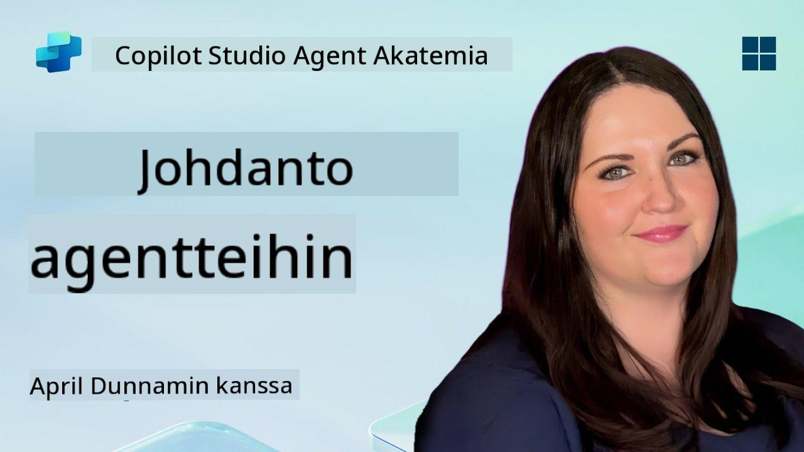

<!--
CO_OP_TRANSLATOR_METADATA:
{
  "original_hash": "d6706e107678264168d77b2e107710b1",
  "translation_date": "2025-10-17T05:46:28+00:00",
  "source_file": "docs/recruit/01-introduction-to-agents/README.md",
  "language_code": "fi"
}
-->
# 🚨 Tehtävä 01: Johdatus agenteihin

## 🕵️‍♂️ Koodinimi: `OPERATION AI AGENT DECODE`

> **⏱️ Operaatioaika:** `~30 minuuttia – vain tiedustelua, ei kenttätyötä`

🎥 **Katso opastusvideo**

## 🎯 Tehtävän kuvaus

Tervetuloa, rekrytoitu. Ennen kuin sukellamme agenttien rakentamiseen, sinun on ymmärrettävä AI-konseptit, jotka niitä ohjaavat. Tämä tehtävä antaa sinulle perustiedot keskustelevaan tekoälyyn, suuriin kielimalleihin (LLM), hakuun perustuvaan generointiin (RAG) ja agenttityyppeihin, joita voit luoda Copilot Studiossa.

## 🔎 Tavoitteet

Tässä tehtävässä opit:

1. Mitä keskusteleva tekoäly on ja miksi se on tärkeää  
1. Kuinka suuret kielimallit (LLM) ohjaavat keskustelukokemuksia  
1. Mitä hakuun perustuva generointi (RAG) tarjoaa  
1. Ero keskustelullisten ja autonomisten agenttien välillä  
1. Kuinka Copilot Studion agentit hyödyntävät näitä konsepteja  

Sukelletaan asiaan!

---

## Mitä on keskusteleva tekoäly?

Keskusteleva tekoäly viittaa järjestelmään, joka voi ymmärtää, käsitellä ja vastata ihmisen kieleen – olipa kyseessä teksti tai puhe – tavalla, joka tuntuu luonnolliselta. Ajattele chatbotteja asiakaspalvelussa tai virtuaalisia henkilökohtaisia avustajia suosikkisovelluksissasi. Kulissien takana useimmat modernit keskustelulliset tekoälyt perustuvat suuriin kielimalleihin (LLM), joista puhumme seuraavaksi.

### Miksi se on tärkeää

- **Käyttäjäkokemus:** Keskusteluliittymät ovat usein intuitiivisempia kuin valikoiden selaaminen.  
- **Skaalautuvuus:** Yksi agentti voi käsitellä kymmeniä tai satoja samanaikaisia keskusteluja.  
- **Tehokkuus:** Sen sijaan, että rakennettaisiin mukautettuja sääntöpohjaisia skriptejä, LLM-pohjaiset agentit mukautuvat lennossa käyttäjän syötteisiin.  
- **Laajennettavuus:** Oikein suunniteltuna agentit voivat käyttää tietokantoja, yhdistyä API:hin tai toimia "digitaalisina työkavereina" liiketoimintaprosesseissa.

---

## Suuret kielimallit (LLM) 101

Useimpien keskustelullisten tekoälyjärjestelmien ytimessä ovat **suuret kielimallit** – neuroverkot, jotka on koulutettu valtavilla tekstikorpuksilla. Ne oppivat kielen tilastolliset mallit, jotta ne voivat tuottaa johdonmukaisia lauseita, vastata kysymyksiin tai jopa ideoida. Keskeiset asiat, jotka kannattaa ymmärtää:

1. **Koulutusdata:** LLM:t käsittelevät teratavuja tekstiä (verkkosivuja, kirjoja, artikkeleita). Tämä "maailmantieto" antaa niille kyvyn vastata monista aiheista.  
1. **Tokenisointi:** Teksti jaetaan pienempiin yksiköihin, joita kutsutaan tokeneiksi (sanoja, osasanoja tai merkkejä). Malli ennustaa yhden tokenin kerrallaan.  
1. **Kontekstin ikkuna:** Jokaisella LLM:llä on rajoitus, kuinka monta tokenia se voi "nähdä" kerralla. Tämän rajan yli menevät tokenit katkaistaan.  
1. **Prompting:** LLM:ään vuorovaikutetaan lähettämällä sille kehotus. Mitä parempi kehotus, sitä keskittyneempi ja osuvampi vastaus.  
1. **Zero-shot vs. Fine-tuning:** Zero-shot tarkoittaa LLM:n käyttöä sellaisenaan (vain raakapainot). Fine-tuning tarkoittaa mallin säätämistä alakohtaisella datalla, jotta se vastaa tarkemmin tarpeisiisi.

!!! Tip "Vinkki"
    Yleinen vertauskuva on, että LLM on kuin "superälykäs automaattinen täydennys". Se ei oikeasti ymmärrä merkitystä kuten ihmisaivot, mutta se on erittäin hyvä ennustamaan seuraavan parhaan sanan (tai lauseen) sekvenssissä.

---

## Hakuun perustuva generointi (RAG)

Kun LLM:t luottavat pelkästään staattiseen koulutusdataan, ne voivat tuottaa virheellistä tietoa tai vanhentua. RAG ratkaisee tämän antamalla mallin "etsiä" tuoretta tietoa ennen vastauksen muodostamista. Yleisesti ottaen RAG toimii näin:

1. **Käyttäjän kysymys:** Käyttäjä esittää kysymyksen (esim. "Mitä uutta Contoson neljännesvuosikatsauksessa?").  
1. **Hakuvaihe:** Järjestelmä etsii tietolähteestä (dokumentit, sisäiset tietokannat, SharePoint-kirjastot jne.) relevantteja kohtia.  
1. **Täydennys:** Löydetyt kohdat liitetään LLM-kehotukseen joko alkuun tai loppuun.  
1. **Generointi:** LLM käsittelee sekä käyttäjän kysymyksen että haetun kontekstin ja tuottaa vastauksen, joka perustuu ajankohtaiseen dataan.  

RAG:n avulla agenttisi voi käyttää sisäisiä yrityksen wikejä, plugin-API:ita tai etsiä FAQ-tietokannasta – ja palauttaa vastauksia, jotka eivät rajoitu staattisiin malliparametreihin.

---

## Keskustelulliset vs. autonomiset agentit

Copilot Studiossa termi **agentti** voi viitata useisiin tekoälyavustajien tyyppeihin. On hyödyllistä erottaa toisistaan:

**Keskustelulliset agentit:**

- Keskittyvät ensisijaisesti kaksisuuntaiseen vuoropuheluun.  
- Säilyttävät kontekstin keskustelun useiden vaiheiden ajan.  
- Yleensä ohjataan ennalta määritellyillä kulku- tai laukaisusäännöillä (esim. "Jos käyttäjä sanoo X, vastaa Y").  
- Ihanteellisia asiakastukeen, FAQ:hin, ohjattuihin vuorovaikutuksiin, aikataulutukseen tai yksinkertaiseen kysymys-vastaus -toimintaan.  
  - Esimerkkejä:  
    - Teams-chatbot, joka vastaa HR-politiikkakysymyksiin.  
    - Power Virtual Agents -botti SharePoint-sivulla, joka ohjaa käyttäjiä lomakkeen täyttämisessä.  

**Autonomiset agentit:**

- Menevät pidemmälle kuin keskustelu; ne voivat **suorittaa toimia** käyttäjän puolesta.  
- Käyttävät LLM:n päättelysilmukoita (ajattele "suunnittele → toimi → havainnoi → suunnittele uudelleen") tehtävien suorittamiseen.  
- Yhdistyvät ulkoisiin työkaluihin tai API:ihin (esim. käynnistä Power Automate -virta, lähetä kalenterikutsuja, käsittele dataa Dataversessa).  
- Toimivat ilman jatkuvaa ihmisen ohjausta – kun ne käynnistetään, ne voivat hoitaa monivaiheisia prosesseja itsenäisesti.  
  - Esimerkkejä:  
    - Agentti, joka luo matkasuunnitelman, varaa lennot ja lähettää vahvistukset sähköpostitse.  
    - "Kokouksen tiivistäjä" -agentti, joka liittyy Teams-puheluun, transkriboi sen reaaliajassa ja kirjoittaa johtajan yhteenvedon OneNoteen.  

!!! Info "Keskeinen ero"
    Keskustelulliset agentit odottavat käyttäjän syötettä ja pysyvät vuoropuhelussa. Autonomiset agentit suunnittelevat ja toteuttavat itsenäisesti useita vaiheita laajempien työkalujen avulla.

---

## Agentit Copilot Studiossa

**Copilot Studio** yhdistää sekä keskustelulliset että autonomiset skenaariot yhdeksi kehykseksi. Näin Copilot Studio auttaa sinua rakentamaan agentteja:

1. **Visuaalinen agenttisuunnittelija:** Low-code-käyttöliittymä, jolla määritellään kehotukset, muisti ja työkalut sekä keskustelu- että toimintatyönkuluille.  
1. **LLM-konfiguraatiot:** Valitse eri OpenAI-mallien tai Microsoftin yritystason GPT:n välillä suorituskyvyn ja kustannusten tarpeiden mukaan.  
1. **Hakuliitännät:** Valmiit integraatiot SharePointiin, OneDriveen, Azure Cognitive Searchiin ja Dataverseen, jotka mahdollistavat RAG:n suoraan.  
1. **Mukautetut työkalut ja toiminnot:** Määrittele mukautettuja HTTP-toimintoja tai Power Automate -virtoja, joita agenttisi voi käyttää itsenäisesti.  
1. **Monimuotoinen tuki:** Tekstin lisäksi Copilot Studio -agentit voivat käsitellä kuvia, tiedostoja tai jäsenneltyä dataa rikastamaan kontekstia.  
1. **Julkaisu ja jakelu:** Kun agenttisi on valmis, voit julkaista sen Microsoft 365 Copilotiin (jotta käyttäjät voivat käyttää sitä Teamsissa, SharePointissa, Outlookissa jne.) tai upottaa sen itsenäisenä chat-widgetinä verkkosivulle.

---

## 🎉 Tehtävä suoritettu

Olet nyt suorittanut johdannon agentteihin ja tekoälyn peruskäsitteisiin. Ymmärrät:

1. **LLM:t = Agenttisi "aivot"**  
   - Vastaa kielen ymmärtämisestä ja generoinnista.  
   - Enemmän tokeneita = rikkaampi konteksti, mutta myös korkeammat kustannukset per kutsu.  

1. **RAG = Reaaliaikainen tiedon integrointi**  
   - Kuromaan umpeen staattisen LLM:n ja jatkuvasti muuttuvien tietolähteiden välistä kuilua.  
   - Hakee ja lisää relevantteja dokumentteja tai tietueita LLM-kehotukseen.  

1. **Keskustelulliset vs. autonomiset**  
   - **Keskustelulliset:** Keskittyvät vuoropuhelun kulkuun ja kontekstin säilyttämiseen (esim. "istuntomuisti").  
   - **Autonomiset:** Lisää "toimintolohkoja", jotka antavat agentin käyttää ulkoisia työkaluja tai palveluita.

---
Seuraavaksi tutustut [Copilot Studion perusteisiin](../02-copilot-studio-fundamentals/README.md)!

Pysy valppaana, rekrytoitu – AI-matkasi on vasta alkamassa!

## 📚 Taktiset resurssit

🔗 [Copilot Studion dokumentaation etusivu](https://learn.microsoft.com/microsoft-copilot-studio/)

---

<!-- markdownlint-disable-next-line MD033 -->

---

**Vastuuvapauslauseke**:  
Tämä asiakirja on käännetty käyttämällä tekoälypohjaista käännöspalvelua [Co-op Translator](https://github.com/Azure/co-op-translator). Vaikka pyrimme tarkkuuteen, huomioithan, että automaattiset käännökset voivat sisältää virheitä tai epätarkkuuksia. Alkuperäinen asiakirja sen alkuperäisellä kielellä tulisi pitää ensisijaisena lähteenä. Kriittisen tiedon osalta suositellaan ammattimaista ihmiskäännöstä. Emme ole vastuussa väärinkäsityksistä tai virhetulkinnoista, jotka johtuvat tämän käännöksen käytöstä.