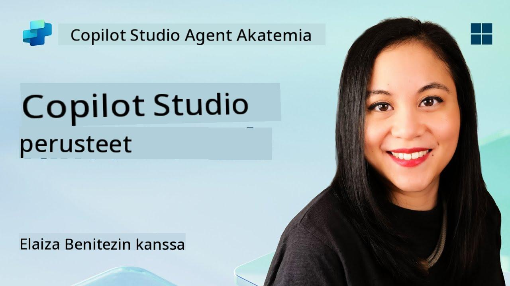
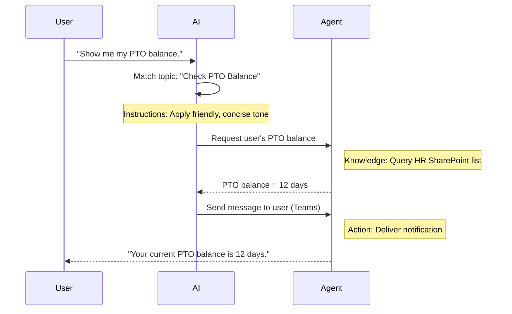

<!--
CO_OP_TRANSLATOR_METADATA:
{
  "original_hash": "90a3c5122f5687bbc8cc819990f175d4",
  "translation_date": "2025-10-17T05:59:49+00:00",
  "source_file": "docs/recruit/02-copilot-studio-fundamentals/README.md",
  "language_code": "fi"
}
-->
# 🚨 Tehtävä 02: Copilot Studion perusteet

## 🕵️‍♂️ Koodinimi: `OPERATION CORE PROTOCOL`

> **⏱️ Operaatioaika:** `~30 minuuttia – vain tiedustelua, ei kenttätyötä`  

🎥 **Katso opastusvideo**

[](https://www.youtube.com/watch?v=x4OCwDRGeLE "Katso opastus YouTubessa")

## 🎯 Tehtävän kuvaus

Tervetuloa, rekrytoitu. Tämä tehtävä antaa sinulle perustiedot Copilot Studion toiminnasta ja siitä, miten voit rakentaa älykkäitä agentteja, jotka tuottavat todellista liiketoiminta-arvoa.

Ennen kuin rakennat ensimmäisen agenttisi, sinun tulee ymmärtää neljä keskeistä komponenttia, jotka muodostavat jokaisen räätälöidyn tekoälyagentin: Tieto, Työkalut, Aiheet ja Ohjeet. Opit myös, miten nämä elementit toimivat yhdessä Copilot Studion orkestroijassa.

## 🔎 Tavoitteet

Tässä tehtävässä opit:

- **Mitä Copilot Studio on**
- **Milloin ja miksi käyttää agentteja**
- **Tutustumaan agenttien neljään rakennuspalikkaan**
      - **Tieto**
      - **Työkalut**
      - **Aiheet**
      - **Ohjeet**
- **Ymmärtämään, miten nämä komponentit toimivat yhdessä** älykkään, automatisoidun agentin luomiseksi

---

## Mitä agentit ovat Copilot Studiossa?

**Agentti** on erikoistunut tekoälyavustaja, jonka suunnittelet hoitamaan tiettyjä tehtäviä tai kyselyitä. Toisin kuin yleiskäyttöinen chatbot, agenttisi:

- **Tuntee yrityskohtaiset tiedot** (käytännöt, dokumentit, tietokannat)  
- **Suorittaa oikean maailman tehtäviä** (lähettää viestejä, luo kalenteritapahtumia, päivittää tietoja)  
- **Säilyttää keskustelukontekstin**, jotta se voi jatkaa aiemmista kysymyksistä  

Koska Copilot Studio on vähäkoodinen, voit käyttää valmiita komponentteja vetämällä ja pudottamalla – syvällisiä ohjelmointitaitoja ei tarvita. Kun agenttisi on valmis, ihmiset voivat käyttää sitä Teamsissa, Slackissa tai jopa räätälöidyllä verkkosivulla saadakseen vastauksia tai käynnistääkseen työnkulkuja automaattisesti.

---

## Milloin ja miksi käyttää Copilot Studiota

Vaikka Microsoft 365 Copilot tarjoaa yleistä tekoälyapua Office-sovelluksissa, tarvitset räätälöidyn agentin, kun:

### Tarvitset alakohtaista tietoa

- Valmiiksi asennettu Copilot ei välttämättä tunne yrityksesi sisäisiä käytäntöjä tai tietoja. Agentti voi hakea tietoja SharePoint-sivustoista, tietokannoista tai muista lähteistä antaakseen tarkkoja ja ajantasaisia vastauksia.  

### Haluat automatisoida monivaiheisia työnkulkuja

- Esimerkiksi: "Kun joku lähettää kululaskun, lähetä se hyväksyttäväksi, päivitä talousseuranta ja ilmoita esimiehelle." Räätälöity agentti voi hoitaa kaikki vaiheet yhden komennon tai tapahtuman perusteella.  

### Tarvitset kontekstuaalisen kokemuksen työkalussa  

- Kuvittele Teamsissa toimiva Uuden työntekijän perehdytysagentti, joka ohjaa HR-henkilöstöä kaikkien käytäntöjen läpi, lähettää tarvittavat lomakkeet ja aikatauluttaa perehdytystapaamiset – suoraan olemassa olevassa yhteistyöalustassasi.  

---

## Agentin neljä rakennuspalikkaa

Jokainen Copilot Studion agentti koostuu neljästä keskeisestä komponentista:

1. **Tieto**  
1. **Työkalut (Toiminnot)**  
1. **Aiheet**  
1. **Ohjeet**

Alla määrittelemme jokaisen rakennuspalikan ja näytämme, miten ne toimivat yhdessä tehokkaan agentin luomiseksi.

### 1. Tieto

**Tieto** on data ja konteksti, jota agenttisi käyttää vastatakseen kysymyksiin tarkasti. Se koostuu kahdesta osasta:

#### Räätälöidyt ohjeet ja konteksti

- Kirjoitat lyhyen kuvauksen agentin tarkoituksesta ja sävystä. Esimerkiksi:  

    ```text
    You are an IT support agent. You help employees troubleshoot common software issues, provide troubleshooting steps, and escalate urgent tickets.
    ```

- Keskustelun aikana agentti muistaa aiemmat vuorot, jotta se voi viitata jo käsiteltyihin asioihin (esimerkiksi jos käyttäjä ensin sanoo "Tulostimeni ei toimi" ja myöhemmin kysyy "Tarkistitko musteen?", agentti muistaa tulostimen kontekstin).

#### Tietolähteet (Perustiedot)

- Yhdistät agenttisi useisiin tietolähteisiin – SharePoint-kirjastoihin, dokumentaatiosivustoihin, wikeihin tai muihin tietokantoihin.  
- Kun käyttäjä esittää kysymyksen, agentti hakee asiaankuuluvat otteet näistä lähteistä, jotta vastaukset perustuvat organisaatiosi todellisiin käytäntöihin, tuoteoppaisiin tai muuhun omaan tietoon.  
- Voit jopa pakottaa agentin vastaamaan vain näistä lähteistä, estäen sitä arvaamasta tai "hallusinoimasta" vastauksia.

!!! example
    "Käytäntöavustaja"-agentti voisi yhdistyä HR:n SharePoint-sivustoon. Jos käyttäjä kysyy "Mikä on meidän lomakertymä?", agentti hakee tarkan tekstin HR-käytäntöasiakirjasta sen sijaan, että se antaisi yleisen tekoälyvastauksen.

---

### 2. Työkalut (Toiminnot)

**Työkalut (Toiminnot)** määrittelevät, mitä agentti voi tehdä keskustelun lisäksi. Jokainen toiminto on tehtävä, jonka agentti suorittaa ohjelmallisesti, kuten:

- Sähköpostin tai Teams-viestin lähettäminen  
- Kalenteritapahtuman luominen tai päivittäminen  
- Tietueen lisääminen tai muokkaaminen tietokannassa (esim. SharePoint-lista tai Dataverse-taulukko)  
- Power Automate -työnkulun tai REST API:n kutsuminen  

#### Miten toiminnot toimivat

- **Määritä syötteet ja tulosteet**  
      - Esimerkiksi sähköpostin lähettämistoiminto saattaa vaatia:  
        - `VastaanottajanSähköpostiosoite`  
        - `AiheRivi`  
        - `SähköpostinSisältö`  

- **Yhdistä toiminnot työnkulkuihin**  
      - Usein käyttäjän pyynnön täyttäminen vaatii useita vaiheita.  
      - Voit järjestää toimintoja niin, että:  
             1. Agentti hakee tietoja SharePoint-listasta.  
             2. Se luo yhteenvedon LLM:n avulla.  
             3. Se lähettää Teams-viestin yhteenvedolla.  

- **Yhdistä ulkoisiin järjestelmiin**  
      - Jos sinun täytyy päivittää CRM tai kutsua sisäinen API, luo räätälöity toiminto sen hoitamiseksi.  
      - Copilot Studio voi integroitua Power Platformiin tai mihin tahansa HTTP-pohjaiseen päätepisteeseen.

!!! example "Esimerkki "Kulujen avustaja" -agentista:"  
    1. Kuuntelee "Lähetä kulu" -pyyntöä.  
    2. Hakee käyttäjän kulutiedot lomakkeesta.  
    3. Käyttää "Lisää SharePoint-listaan" -toimintoa tallentaakseen tiedot.  
    4. Käynnistää "Lähetä sähköposti" -toiminnon ilmoittaakseen hyväksyjälle.  

---

### 3. Aiheet

**Aiheet** määrittelevät keskustelun käynnistimet tai agentin aloituspisteet. Jokainen aihe vastaa tiettyä toiminnallisuutta tai kysymyskategoriaa.

#### Keskustelun käynnistimet  

- Aihe voi olla "Lähetä IT-tiketti", "Tarkista lomatase" tai "Luo myyntiraportti".  
- Copilot Studio käyttää **generatiivista orkestrointia**: sen sijaan, että se luottaisi tarkkoihin avainsanoihin, tekoäly tulkitsee käyttäjän tarkoituksen ja valitsee oikean aiheen lyhyen kuvauksen perusteella.  

#### Aihekuvaukset  

- Jokaisessa aiheessa kirjoitat selkeän ja tiiviin kuvauksen siitä, mitä aihe kattaa.

!!! example "Esimerkki aihekuvauksesta"
    Tämä aihe auttaa käyttäjiä lähettämään IT-tukipyynnön keräämällä ongelman tiedot, prioriteetin ja yhteystiedot.

- Tekoäly käyttää tätä kuvausta päättääkseen, milloin aktivoida tämä aihe, vaikka käyttäjän sanamuoto ei täsmää tarkasti.

#### Aiheiden yhdistäminen toimintoihin  

- Jokainen aihe on yhdistetty yhteen tai useampaan toimintaan tai tiedonhakuvaiheeseen.  
- Kun tekoäly valitsee aiheen, se ohjaa keskustelua määrittelemäsi järjestyksen mukaan (esittää jatkokysymyksiä, kutsuu toimintoja, palauttaa tulokset).

!!! example
    Jos käyttäjä sanoo "Tarvitsen apua uuden kannettavan asennuksessa", tekoäly voi yhdistää tämän tarkoituksen "Lähetä IT-tiketti" -aiheeseen. Agentti kysyy sitten kannettavan mallin, käyttäjän tiedot ja lähettää tiketin automaattisesti tukijärjestelmään.

---

### 4. Ohjeet

**Ohjeet** (joskus kutsutaan "kehotteiksi" tai "järjestelmäviesteiksi") ohjaavat LLM:n sävyä, tyyliä ja rajoja. Ne muokkaavat agentin vastauksia kaikissa tilanteissa.

#### Rooli ja persoona  

- Kerrot tekoälylle, kuka se on (esim. "Olet asiakaspalveluagentti Contoso Retailille").  
- Tämä määrittää sävyn – ystävällinen, tiivis, muodollinen tai rento – käyttötapauksesi mukaan.

#### Vastausohjeet  

- Määritä säännöt, joita agentin tulee noudattaa, kuten:  
      - "Tiivistä aina käytäntötiedot luettelopisteiksi."  
      - "Jos et tiedä vastausta, sano 'Valitettavasti minulla ei ole tietoa siitä.'"  
      - "Älä koskaan sisällytä luottamuksellisia tietoja kontekstin ulkopuolella."

#### Muisti- ja kontekstisäännöt

- Voit ohjeistaa agenttia muistamaan keskustelun yksityiskohtia tietyn määrän vuoroja.  
- Esimerkiksi: "Muista tämän käyttäjän pyynnön tiedot enintään kolmen jatkokysymyksen ajan."

!!! example "Esimerkki "Etuuksien neuvonantaja" -agentista:"
    "Viittaa aina uusimpaan HR-käsikirjaan vastatessasi kysymyksiin. Jos kysytään ilmoittautumisen määräajoista, anna käytännön mukaiset päivämäärät. Pidä vastaukset alle 150 sanan pituisina."

---

## Miten neljä rakennuspalikkaa toimivat yhdessä

Kun yhdistät **Tiedon**, **Työkalut**, **Aiheet** ja **Ohjeet**, Copilot Studion tekoälyorkestroija luo agentin, joka:

1. **Kuuntelee relevanttia aihetta** (ohjautuen aihekuvauksistasi).  
1. **Soveltaa ohjeita** määrittääkseen sävyn, milloin esittää jatkokysymyksiä ja noudattaa sääntöjä.  
1. **Hyödyntää tietolähteitä** perustaakseen vastauksensa organisaatiosi tietoihin.  
1. **Kutsuu työkaluja (toimintoja)** tarpeen mukaan suorittaakseen tehtäviä – lähettää viestejä, päivittää tietoja tai kutsuu API:ita.  

Taustalla orkestroija käyttää **generatiivista suunnittelua**: se päättää, mitkä vaiheet suoritetaan ja missä järjestyksessä käyttäjän pyynnön täyttämiseksi. Jos toiminto epäonnistuu (esimerkiksi sähköpostia ei voida lähettää), agentti noudattaa virheenkäsittelyohjeitasi (esittää tarkentavan kysymyksen tai raportoi virheen). Koska LLM mukautuu keskustelukontekstiin, agentti voi säilyttää muistin useiden vuorojen ajan ja sisällyttää uutta tietoa keskustelun edetessä.

**Visuaalinen esimerkki työnkulusta:**  
<!--
1. **Käyttäjä:** "Näytä lomataseeni."
1. **AI (Aiheet):** Yhdistää "Tarkista lomatase" -aiheeseen.  
1. **AI (Ohjeet):** Käyttää ystävällistä, tiivistä sävyä.  
1. **Agentti (Tieto):** Kysyy HR:n SharePoint-listalta käyttäjän taseen.  
1. **Agentti (Toiminnot):** Hakee arvon ja lähettää Teams-viestin:  
   > "Nykyinen lomataseesi on 12 päivää."  
-->



---

## 🎉 Tehtävä suoritettu

Olet onnistuneesti suorittanut perusteiden briiffauksen. Olet nyt oppinut neljä olennaista rakennuspalikkaa, jotka muodostavat minkä tahansa agentin Copilot Studiossa:

1. **Tieto** – Mistä agentti hakee faktatiedot ja säilyttää keskustelumuistin.  
1. **Työkalut** – Tehtävät, joita agentti voi suorittaa automaattisesti.  
1. **Aiheet** – Miten agentti tunnistaa käyttäjän tarkoituksen ja päättää, mitä työnkulkua käyttää.  
1. **Ohjeet** – Säännöt, sävy ja rajat, jotka ohjaavat jokaista vastausta.

Näiden komponenttien avulla voit rakentaa yksinkertaisen agentin, joka vastaa kysymyksiin ja suorittaa yksinkertaisia työnkulkuja. Seuraavassa oppitunnissa käymme läpi vaiheittaisen opastuksen "Palvelupiste"-agentin luomiseksi – ensimmäisen tietolähteen yhdistämisestä aiheen määrittämiseen ja toiminnon kytkemiseen.

Seuraavaksi: Rakennat [ensimmäisen deklaratiivisen agenttisi M365 Copilotille](../03-create-a-declarative-agent-for-M365Copilot/README.md).

<!-- markdownlint-disable-next-line MD033 -->


---

**Vastuuvapauslauseke**:  
Tämä asiakirja on käännetty käyttämällä tekoälypohjaista käännöspalvelua [Co-op Translator](https://github.com/Azure/co-op-translator). Vaikka pyrimme tarkkuuteen, huomioithan, että automaattiset käännökset voivat sisältää virheitä tai epätarkkuuksia. Alkuperäistä asiakirjaa sen alkuperäisellä kielellä tulisi pitää ensisijaisena lähteenä. Tärkeissä tiedoissa suositellaan ammattimaista ihmiskäännöstä. Emme ole vastuussa väärinkäsityksistä tai virhetulkinnoista, jotka johtuvat tämän käännöksen käytöstä.