<!--
CO_OP_TRANSLATOR_METADATA:
{
  "original_hash": "cc4afa4a5a11c9d03896decfbcbd4060",
  "translation_date": "2025-10-17T05:42:09+00:00",
  "source_file": "docs/recruit/09-add-an-agent-flow/README.md",
  "language_code": "fi"
}
-->
# 🚨 Tehtävä 09: Lisää agenttivirta aiheeseesi automaatiota varten

## 🕵️‍♂️ Koodinimi: `OPERATION AUTOMATION POWERHOUSE`

> **⏱️ Operaatioaikaikkuna:** `~30 minuuttia`  

🎥 **Katso opastusvideo**

[](https://www.youtube.com/watch?v=vtLZJT3eBXg "Katso opastus YouTubessa")

## 🎯 Tehtävän kuvaus

Agenttisi osaa nyt keskustella käyttäjien kanssa ja tarjota tietoa, mutta todellinen operatiivinen huippuosaaminen vaatii, että agenttisi osaa myös toimia. Tämä tehtävä muuttaa keskusteluagenttisi automaation voimanpesäksi varustamalla sen agenttivirroilla.

Tehtävän lopussa olet luonut kokonaisvaltaisen laitepyyntöautomaatiojärjestelmän, joka kerää käyttäjän syötteet mukautuvan kortin avulla, hakee tietoja SharePointista, lähettää ilmoituksia esimiehille sähköpostitse ja tarjoaa käyttäjille sujuvaa palautetta - kaikki tämä agenttisi ohjaamana älykkään työnkulkuautomaatiojärjestelmän avulla.

## 🔎 Tavoitteet

Tässä tehtävässä opit:

1. Ymmärtämään, mitä agenttivirrat ovat ja miten ne eroavat Power Automate -pilvivirroista automaation osalta
1. Oppimaan agenttivirtojen keskeiset ominaisuudet, kuten tekoälytoiminnot ja luonnollisen kielen kirjoittamisen
1. Tutustumaan agenttivirran suunnittelutyökaluun ja ilmaisujen käyttöön dynaamisen datan käsittelyssä
1. Luomaan täydellisen laitepyyntöautomaatiojärjestelmän, joka integroi SharePoint-tiedot ja sähköposti-ilmoitukset

## 🤔 Mikä on agenttivirta?

Agenttivirrat ovat tehokas tapa automatisoida toistuvia tehtäviä ja integroida sovelluksesi ja palvelusi. Ajattele niitä jäsenneltyinä, vaiheittaisina työnkulkuina, joita agenttisi voi suorittaa automatisoidakseen tehtäviä tai yhdistääkseen muihin sovelluksiin ja palveluihin. Voit ajatella niitä pieninä työnkulkuina, jotka auttavat agenttiasi tekemään asioita, kuten lähettämään ilmoituksia, päivittämään tietueita tai reagoimaan tapahtumiin.

Toisin kuin autonomiset agentit, jotka käyttävät tekoälyä päätösten tekemiseen lennossa, agenttivirrat ovat **deterministisiä työnkulkuja** - eli ne seuraavat samaa polkua joka kerta, mikä takaa johdonmukaiset ja luotettavat tulokset.

Yksinkertaisesti sanottuna:

- Ne auttavat agenttiasi _tekemään asioita_, eivät vain _sanomaan asioita_ käyttäjille.
- Ne ovat uudelleenkäytettäviä eri aiheiden ja agenttien välillä, ja ne voidaan käynnistää käyttäjän viesteillä, tapahtumilla tai muilla sovelluksilla ja palveluilla.

## 🙋🏽 Kyllä, mutta miten ne eroavat Power Automate -pilvivirroista?

Sekä agenttivirrat että Power Automate -pilvivirrat auttavat automatisoimaan tehtäviä. Ne on suunniteltu eri tarkoituksiin ja toimivat eri tavoin.

### 🤖 Agenttivirrat Copilot Studiossa

**Mihin ne on tarkoitettu:**

- Suunniteltu keskustelu- ja autonomisille agenteille (agenttiohjeiden kautta) Copilot Studiossa.
- Keskittyvät älykkääseen, tekoälypohjaiseen automaatioon, joka on vuorovaikutuksessa liiketoimintajärjestelmien kanssa.

**Miksi ne ovat hyödyllisiä:**

- Helppo rakentaa ja hallita suoraan Copilot Studiossa.
- Erinomainen tehtävien automatisointiin, jotka tapahtuvat _keskustelun aikana_ käyttäjien kanssa, kuten lomapyynnön lähettäminen.
- Et tarvitse erillistä Power Automate -lisenssiä, koska laskutus perustuu Copilot Studion sisäiseen käyttöön. Tämä voi säästää aikaa ja kustannuksia yritystiimeille.

**Rajoitukset:**

- Et voi jakaa, kopioida tai määrittää yhteisomistajia.
- Agenttivirrat ovat näkyvissä ja käytettävissä vain Copilot Studiossa.
- Tällä hetkellä agenttien tapahtumatriggereitä voidaan muokata Power Automate -valmistajaportaalissa.

### ☁️ Power Automate -pilvivirrat

**Mihin ne on tarkoitettu:**

- Suunniteltu yleiskäyttöiseen automaatioon monien sovellusten ja palveluiden välillä.
- Voivat toimia itsenäisesti tai yhdessä agenttivirtojen kanssa.

**Miksi ne ovat hyödyllisiä:**

- Tarjoavat laajan valikoiman liittimiä.
- Ihanteellisia prosessien automatisointiin agenttien ulkopuolella.
- Voidaan jakaa, käyttää uudelleen ja hallita tiimien välillä.

**Vaatimukset:**

- Tarvitset Power Automate -lisenssin käyttääksesi niitä.

### 📗 Yhteenveto

| Käytä tätä | Kun haluat |
| :- | :- |
| Agenttivirrat | Automatisoida tehtäviä agentin sisällä, käyttää tekoälyä ja pitää kaikki Copilot Studiossa |  
| Power Automate -pilvivirrat | Automatisoida sovellusten ja palveluiden välillä tai rakentaa työnkulkuja agenttien ulkopuolella |

## 👍🏻 Miksi käyttää agenttivirtoja

Agenttivirrat seuraavat aina kiinteää polkua - ne tekevät saman asian joka kerta, kun niille annetaan sama syöte.

Tämä tekee niistä:

- **Luotettavia** - voit luottaa siihen, että ne toimivat samalla tavalla joka kerta.
- **Ennustettavia** - tiedät, mitä tulosta odottaa, kun virta suoritetaan.
- **Sääntöihin perustuvia** - ne seuraavat määrittelemiäsi vaiheita.

Muita etuja ovat:

- **Automaatio** - mahdollistaa agenttisi käsittelemään toistuvia tehtäviä, kuten lomakkeiden lähettämistä tai ilmoitusten lähettämistä.
- **Yhdistettävyys** - yhdistä yli 1400 liittimeen, kuten ServiceNow, SharePoint, Salesforce. Voit myös rakentaa oman mukautetun liittimen.
- **Tiivis integrointi** - agenttivirrat ovat osa agentin logiikkaa, ne käynnistyvät suoraan käyttäjän viesteistä tai toimista keskustelussa.
- **Skalautuvuus** - käytä virtoja uudelleen useiden agenttien tai skenaarioiden välillä.
- **Ei koodia tai vähän koodia** - voit rakentaa virtoja luonnollisella kielellä tai visuaalisella suunnittelutyökalulla.
- **Kaikki yhdessä alustassa** - voit suunnitella, testata ja ottaa käyttöön agenttivirtoja yhdessä paikassa - Copilot Studiossa. Ei tarvitse vaihtaa alustojen välillä.

## 🏄🏻‍♂️ Miten agenttivirrat parantavat agenttiasi?

Agenttivirrat laajentavat agenttisi kykyjä pelkän "keskustelun" ulkopuolelle käyttäjien kanssa. Ne mahdollistavat toiminnan ja järjestelmien kanssa vuorovaikuttamisen.

Oletetaan, että työskentelet talousosastolla ja saat paljon laskuja toimittajilta. Normaalisti jonkun täytyy lukea jokainen lasku, poimia tärkeät tiedot - summa, päivämäärä, lähettäjä - ja tarkistaa, että kaikki vastaa tietojasi. Sitten lasku lähetetään oikealle henkilölle hyväksyttäväksi. Tämä vie aikaa ja vaivaa.

Copilot Studion agenttivirtojen avulla voit automatisoida tämän prosessin. Kun lasku saapuu, agentti:

1. Lukee dokumentin älykkään dokumenttien käsittelyn avulla löytääkseen tärkeät tiedot.
1. Tarkistaa tiedot yrityksesi datasta varmistaakseen, että kaikki näyttää oikealta.
1. Ohjaa laskun hyväksyttäväksi oikealle henkilölle.

Tämä säästää aikaa, vähentää virheitä ja tekee koko prosessista sujuvamman.

### Ajattele sitä näin

- **Agentit**: älykkäät päätöksentekijät
- **Agenttivirrat**: luotettavat toteuttajat

### Miksi se on tärkeää

- Saat molempien maailmojen parhaat puolet: luotettavan automaation ja joustavan tekoälyn.
- Virtojen rakentaminen ja päivittäminen on helppoa liiketoiminnan tarpeiden muuttuessa.
- Voit skaalata automaation tiimien välillä.

## 🔌 Keskeiset ominaisuudet, jotka tekevät agenttivirroista tehokkaita

1. **Luonnollisen kielen kirjoittaminen**
    - Voit kuvata, mitä haluat virran tekevän, tavallisella kielellä.
    - Copilot ymmärtää tarkoituksesi ja rakentaa virran puolestasi.
    - Ei tarvitse kirjoittaa koodia - selitä ideasi.

1. **Tekoälytoiminnot**

    Käytä tekoälyä:

    - Lukemaan ja ymmärtämään dokumentteja tai kuvia.
    - Tiivistämään pitkää sisältöä lyhyiksi, hyödyllisiksi vastauksiksi.
    - Antamaan älykkäitä suosituksia tai päätöksiä.

1. **Generatiiviset toiminnot**
    - Nämä mahdollistavat virran mukautumisen reaaliajassa.
    - Agentti voi suunnitella ja säätää vaiheita muuttuvan tiedon perusteella.

1. **Integraatiotoiminnot**
    - Yhdistä virtasi muihin työkaluihin, kuten Outlook, Microsoft Teams, ServiceNow, SharePoint ja muihin sovelluksiin ja palveluihin, yli 1400 sisäänrakennetun liittimen kautta tai oman mukautetun liittimen avulla.
    - Tämä auttaa agenttiasi työskentelemään tiimisi jo käyttämien sovellusten kanssa.

1. **Ihminen mukana**
    - Lisää hyväksymisvaiheita, joissa henkilön täytyy tarkistaa tai vahvistaa jotain.
    - [Edistyneet hyväksynnät](https://learn.microsoft.com/microsoft-copilot-studio/flows-advanced-approvals?WT.mc_id=power-172621-ebenitez) tukevat muistutuksia, delegointia ja monivaiheisia hyväksyntöjä.

## ⚙️ Miten ne toimivat

1. **Käynnistys**

    Tapahtuma käynnistää virran - kuten käyttäjän kysymys, virran käynnistäminen aiheesta, aikataulutettu aika tai tapahtuma toisessa järjestelmässä.

1. **Toiminnot**

    Nämä ovat seuraavia vaiheita, joita agentti seuraa - lähettää sähköpostin, kutsuu API:n, päivittää tiketin ServiceNow:ssa.

## 🧶 Miten luoda agenttivirta

1. **Luonnollinen kieli**: kuvaa, mitä haluat agentin tekevän, ja Copilot rakentaa sen puolestasi.
1. **Suunnittelutyökalu**: vedä ja pudota toimintoja, ehtoja ja silmukoita agenttivirran suunnittelutyökalussa rakentaaksesi agenttivirran.

## 🎨 Mikä on agenttivirran suunnittelutyökalu?

Se on visuaalinen työkalu Copilot Studiossa, joka auttaa sinua rakentamaan, muokkaamaan ja hallitsemaan agenttivirtoja, jotka tarjoavat vaiheittaiset ohjeet agentillesi tehtävien suorittamiseksi. Se on suunniteltu helppokäyttöiseksi, vaikka olisit uusi agenttivirtojen parissa.

### Agenttivirran suunnittelutyökalun keskeiset ominaisuudet

1. **Visuaalinen työtila**
    - Näet koko virtasi kaaviona.
    - Voit helposti zoomata sisään/ulos, sovittaa näkymän tai käyttää minimap-toimintoa suurten virtojen navigointiin.

1. **Toimintojen lisääminen ja poistaminen**
    - Klikkaa _plus (+)_ -painiketta lisätäksesi uuden toiminnon, kuten viestin lähettämisen tai kohteen päivittämisen SharePoint-listassa.
    - Voit etsiä toimintoja liittimistä ja määrittää ne asetusten kautta.
    - Poista toiminto klikkaamalla _kolmea pistettä (⋮)_ ja valitsemalla _Poista_.

1. **Parametrien tarkistaminen**
    - Klikkaa mitä tahansa toimintoa nähdäksesi tai muokataksesi sen asetuksia, joita kutsutaan _parametreiksi_.
    - Voit syöttää arvoja manuaalisesti tai käyttää _ilmaisuja_ tehdäksesi niistä dynaamisia.

1. **Versiohistoria**
    - Joka kerta kun tallennat virtasi, versio tallennetaan.
    - Voit palata takaisin ja tarkastella tai palauttaa aiemman version tarvittaessa.

1. **Virheiden tarkistus**
    - _Virran tarkistaja_ korostaa mahdolliset virheet.
    - Kaikki virheet täytyy korjata ennen virran julkaisemista.

1. **Julkaisu ja testaus**
    - Kun virtasi on virheetön, julkaise se tehdäksesi siitä aktiivisen.
    - Käytä _Testaa_-toimintoa suorittaaksesi virtasi manuaalisesti tai automaattisesti ja tarkistaaksesi, toimiiko se odotetusti.

### Miksi käyttää agenttivirran suunnittelutyökalua?

- **Visuaalinen ja intuitiivinen** - voit rakentaa virtoja vetämällä ja klikkaamalla.
- **Turvallista kokeilla** - versiohistoria antaa mahdollisuuden peruuttaa muutokset.
- **Sisäänrakennettu testaus** - auttaa varmistamaan, että kaikki toimii ennen julkaisua.

## 🔤 Mainitsit _ilmaisut_ - mitä ilmaisut ovat?

Ilmaisut ovat pieniä kaavoja tai komentoja, jotka auttavat agenttivirtaa käsittelemään dataa. Niitä käytetään arvojen laskemiseen, tekstin muotoiluun, päätösten tekemiseen tai tietyn tiedon hakemiseen syötteistä.

### Miksi käyttää ilmaisuja?

Ilmaisut mahdollistavat:

- **Mukautetun datan käsittelyn** - yhdistä nimiä, muotoile päivämääriä.
- **Päätöksenteon** - jos arvo on suurempi kuin 10, tee jotain.
- **Datan muuntamisen** - muuta teksti pieniksi kirjaimiksi, poimi osa merkkijonosta.
- **Logiikan automatisoinnin** - ilman täyttä koodin kirjoittamista.

### Miltä ilmaisut näyttävät?

Ilmaisut käyttävät funktioita. Lainaan entisen Microsoft MVP:n, Jerry Weinstockin, selitystä siitä, mitä funktiot ovat.

!!! lainaus
    Funktiot ovat sisäänrakennettua logiikkaa, joka muuntaa dataasi joko yksinkertaisten tai monimutkaisten operaatioiden avulla ilmaisussa.

Funktiot mahdollistavat ilmaisujen rakentamisen ilman, että sinun tarvitsee kirjoittaa koodia.

Kuvaan sen näin: funktio agenttivirroissa on samanlainen kuin Excelin funktiot. Voit suorittaa operaatioita datalle muuntaaksesi sen halutuksi tulokseksi. Kun rakennat kaavaa Excelissä, valitset syöttöarvon taulukon soluista tai alueelta ja sovellat funktioita datan muokkaamiseksi. Esimerkkinä on `COUNT`-funktio, jolla lasketaan solujen lukumäärä, jotka sisältävät numeroita alueelta.

Agenttivirroissa, sen sijaan että viittaisit dataan taulukon soluista, viittaat datan lähtöihin käynnistyksestä tai toiminnoista rakentaessasi ilmaisuja. Jatkaen aiempaa esimerkkiä, käytä funktiota `length` saadaksesi kohteiden lukumäärän, jotka palautetaan _Get items_ SharePoint-liittimen toiminnosta.

### Miksi funktiot ovat tärkeitä?

Funktioiden käyttö tekee agenttivirroista:

- **Älykkäämpiä** - ne voivat reagoida erilaisiin syötteisiin tai olosuhteisiin.
- **Joustavia** - voit mukauttaa, miten dataa käsitellään.
- **Tehokkaita** - vältät manuaaliset vaiheet automatisoimalla logiikan.

### Hyödyllisimmät funktiot

Seuraavat ovat yleisiä funktioita, joita käytetään agenttivirroissa. Täydellinen lista funktioista löytyy [viiteoppaasta](https://learn.microsoft.com/azure/logic-apps/workflow-definition-language-functions-reference?WT.mc_id=power-172621-ebenitez).

#### 🔡 Teksti

- `concat()` - Yhdistää kaksi tai useampia tekstinpätkiä.
      - Esimerkki: `concat('Hei ', firstName)` → “Hei John”

- `toLower()` / `toUpper()` - Muuttaa tekstin pieniksi tai isoiksi kirjaimiksi.
      - Hyödyllinen syötteen standardointiin.

- `substring()` - Poimii osan merkkijonosta.
      - Esimerkki: Poimi nimen kolme ensimmäistä kirjainta.

- `trim()` - Poistaa välilyönnit tekstin alusta ja lopusta.

#### 🔢 Matematiikka ja numerot

- `add()
- Esimerkki: `addDays(utcNow(), 7)` tulos on 7 päivää tästä hetkestä.

- `formatDateTime()` - Muotoilee päivämäärän luettavaan merkkijonoon.
      - Esimerkki: Maanantai, 7. heinäkuuta 2025

#### ✅ Loogiset

- `if()` - Suorittaa yhden arvon, jos tosi, ja toisen, jos epätosi.
      - Esimerkki: `if(score > 50, 'Hyväksytty', 'Hylätty')`

- `equals()` - Tarkistaa, ovatko kaksi arvoa samat.

- `and()`, `or()`, `not()` - Yhdistää useita ehtoja.

#### 🪣 Muut hyödylliset funktiot

- `coalesce()` - Palauttaa ensimmäisen ei-tyhjän arvon.
      - Kätevä varmuuskopio-/oletusarvoille.

- `guid()` - Luo yksilöllisen tunnuksen.
      - Kätevä seurantaan tai lokitukseen.

- `length()` - Laskee, kuinka monta merkkiä tai kohdetta on merkkijonossa tai taulukossa.

## ⭐ Parhaat käytännöt

Tässä on joitakin parhaita käytäntöjä agenttivirtojen rakentamiseen Copilot Studiossa.

1. **Aloita yksinkertaisesti ja rakenna vähitellen**

    - Aloita pienellä, selkeällä tehtävällä, kuten viestin lähettämisellä.
    - Lisää enemmän vaiheita testattuasi automaation perusasiat.

1. **Käytä selkeitä ja kuvaavia toimintojen nimiä**

    - Nimeä jokainen vaihe selkeästi, jotta sinä ja tiimisi ymmärrätte, mitä se tekee.
    - Esimerkki: sen sijaan, että käytät oletusnimeä "Päivitä kohde" SharePoint-liittimen toiminnolle, nimeä se uudelleen kuvaamaan, mitä se päivittää, kuten "Päivitä laitteen tila."

1. **Tarkista virheet ennen julkaisemista**

    - Käytä **virhetarkistinta** löytääksesi ja korjataksesi mahdolliset ongelmat.
    - Et voi julkaista virtoja, jos niissä on virheitä, joten yritä ratkaista ne heti, kun ne ilmenevät.

1. **Testaa virtaasi perusteellisesti**

    - Se, että virta tallentuu ja julkaistaan, ei tarkoita, että se toimii odotetusti.
    - Käytä _Testaa_-ominaisuutta suorittaaksesi virran manuaalisesti tai automaattisesti ja tarkistaaksesi tulokset.

1. **Käytä versiohistoriaa**

    - Tallenna virtaasi usein, jotta voit palata aiempiin versioihin tarvittaessa.
    - Voit tarkastella ja palauttaa aiempia versioita _Versiohistoria_-paneelista.

1. **Käytä parametreja ja lausekkeita viisaasti**

    - Kun määrität toimintoja, käytä parametreja tehdäksesi virrasta dynaamisen.
    - Voit syöttää arvoja manuaalisesti tai käyttää lausekkeita niiden laskemiseen, tai yhdistää ne aiempien toimintojen arvoihin käyttämällä _dynaamisen sisällön_ valitsinta.

1. **Poista käyttämättömät toiminnot**

    - Jos lisäät toiminnon ja myöhemmin päätät, ettet tarvitse sitä, poista se pitääksesi virtasi siistinä.

## 🧪 Labra 09 - Lisää agenttivirta automaatioon ja paranna aiheiden ominaisuuksia

Nyt opimme, kuinka parannamme aihettamme mukautuvilla korteilla ja käyttämällä aiheiden ja solmujen edistyneitä toimintoja.

- [9.1 Luo agenttivirta](../../../../../docs/recruit/09-add-an-agent-flow)
- [9.2 Lisää agenttivirta aiheeseen](../../../../../docs/recruit/09-add-an-agent-flow)
- [9.3 Päivitä Pyydä laite -aihe useilla solmuilla paremman käyttäjäkokemuksen saavuttamiseksi](../../../../../docs/recruit/09-add-an-agent-flow)
- [9.4 Testaa agenttia useilla skenaarioilla](../../../../../docs/recruit/09-add-an-agent-flow)

### ✨ Käyttötapaus

**Esimiehenä**

**Haluan** vastaanottaa laitepyyntöjä

**Jotta** voin tarkistaa työntekijän pyytämän laitteen.

Aloitetaan!

### Esivaatimukset

1. **SharePoint-lista**

    Käytämme **Laitteet** SharePoint-listaa kohdasta [Oppitunti 00 - Kurssin asennus - Vaihe 3: Luo uusi SharePoint-sivusto](../00-course-setup/README.md#step-4-create-new-sharepoint-site).

    Jos et ole luonut **Laitteet** SharePoint-listaa, palaa kohtaan [Oppitunti 00 - Kurssin asennus - Vaihe 3: Luo uusi SharePoint-sivusto](../00-course-setup/README.md#step-4-create-new-sharepoint-site).

1. **Contoso Helpdesk Agent**

    Käytämme aiemmin luotua agenttia kohdasta [Oppitunti 06 - Luo mukautettu agentti luonnollisella kielellä Copilotilla ja yhdistä se tietoihisi](../06-create-agent-from-conversation/README.md).

### 9.1 Luo agenttivirta

Tässä harjoituksessa luomme agenttivirran, joka hakee SharePoint-kohteen valitusta laitteesta ja lähettää sähköpostin esimiehelle laitteen tiedoilla.

1. **Pyydä laite** -aiheessa, vieritä alas **Kysy mukautuvalla kortilla** -solmuun ja lisää uusi solmu. Valitse **Lisää työkalu** ja **Perustyökalut**-välilehdeltä valitse **Uusi agenttivirta**.

    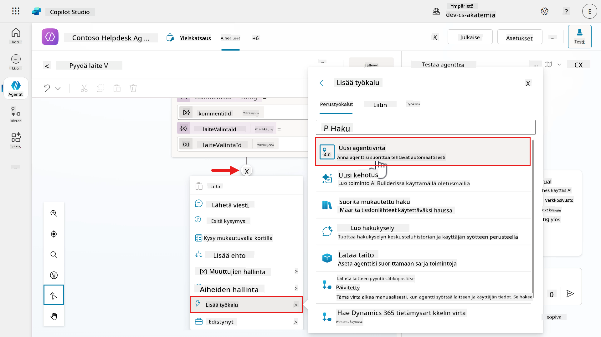

1. Agenttivirtojen **Suunnittelija** latautuu laukaisimella ja toiminnolla.

    - **Laukaisin** - Kun agentti kutsuu virran
        - Tämä käynnistää virran Copilot Studio -agentista.

    - **Toiminto** - Vastaa agentille
        - Tämä lähettää vastauksen, joka voi sisältää lähtöarvoja takaisin Copilot Studio -agentille.

    Valitse laukaisin.

    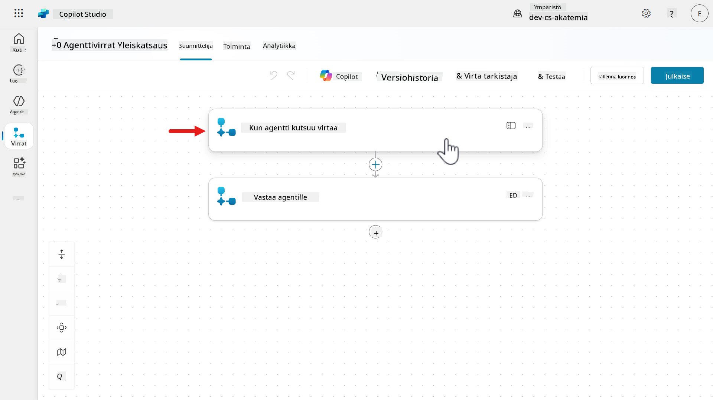

1. Seuraavaksi lisäämme useita syötteitä agenttivirtaan.

    - `DeviceSharePointId` - tämä tallentaa arvon, ID:n, SharePoint-kohteesta. Tämä ID-arvo on lähtö **Kysy mukautuvalla kortilla** -solmusta, jossa käyttäjä valitsi laitteen.

    - `User` - tämä on käyttäjän nimi, joka tulee agentin järjestelmämuuttujasta.

    - `AdditionalComments` - tämä on käyttäjän antama kommentti, joka on lähtö **Kysy mukautuvalla kortilla** -solmusta.

    Lisäämme ensin `DeviceSharePointId` laukaisimen syötteeksi. Valitse **+ Lisää syöte**.

    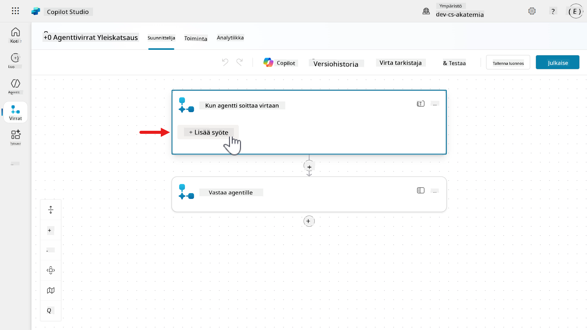

1. Syötteen tyypiksi valitse **Teksti**.

    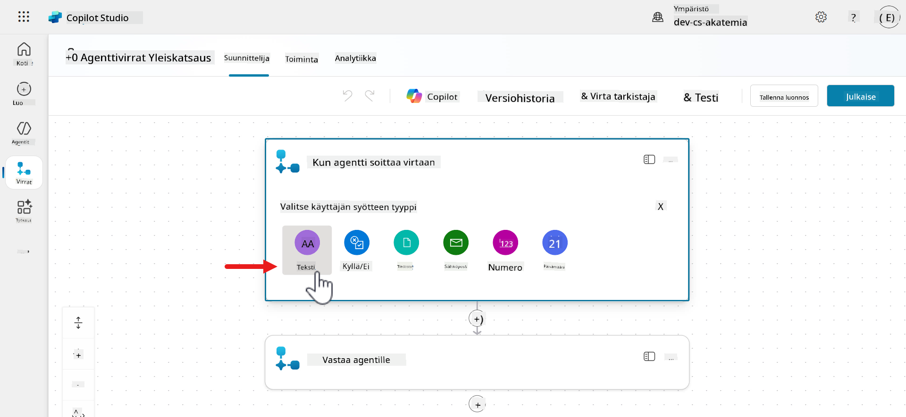

1. Syötteen nimeksi kirjoita seuraava.

    ```text
    DeviceSharePointId
    ```

    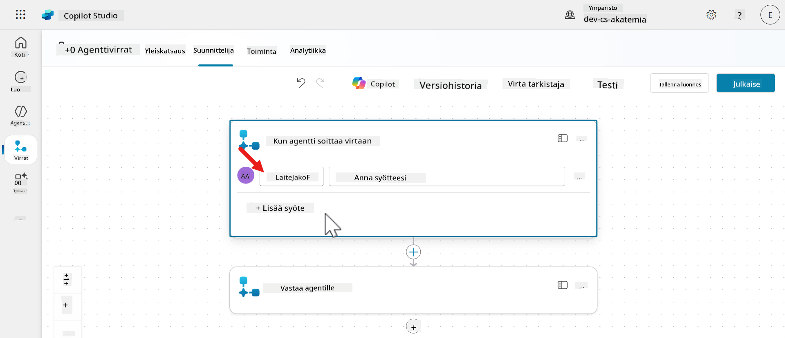

1. Lisäämme nyt toisen syötteen, `User`. Toista samat vaiheet, valitse **+ Lisää syöte** ja valitse **Teksti**.

    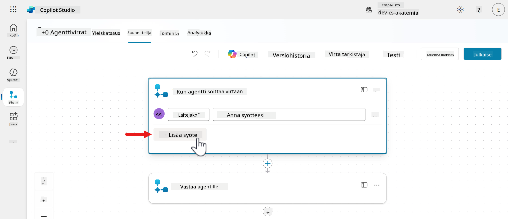

1. Syötteen nimeksi kirjoita seuraava.

    ```text
    User
    ```

    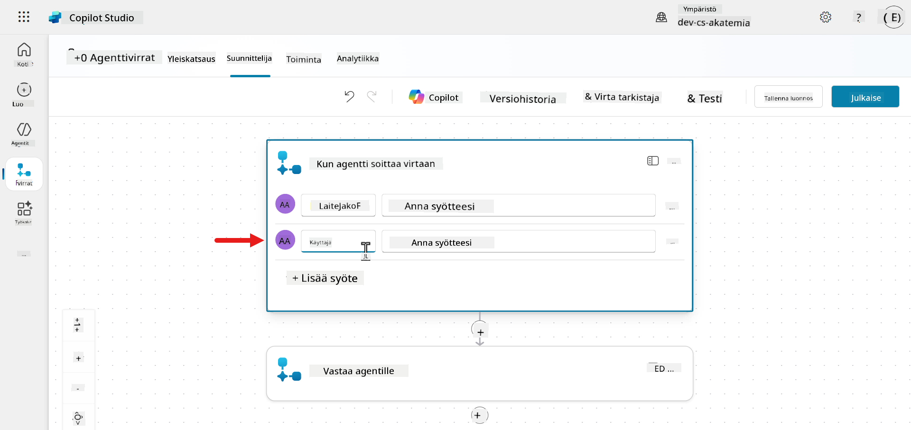

1. Lisäämme nyt kolmannen syötteen, `AdditionalComments`. Toista samat vaiheet, valitse **+ Lisää syöte** ja valitse **Teksti**.

    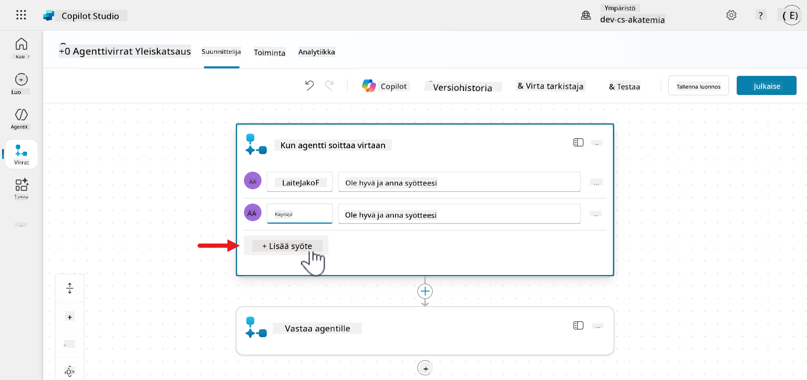

1. Syötteen nimeksi kirjoita seuraava.

    ```text
    AdditionalComments
    ```

    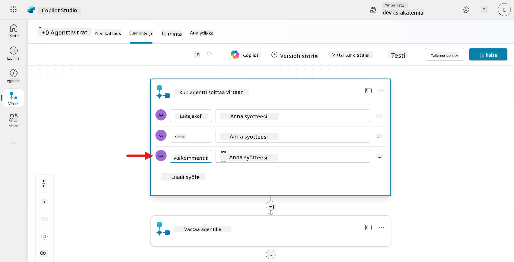

1. `AdditionalComments`-syötteelle päivitämme sen valinnaiseksi. Valitse **kolmipiste (...) -kuvake** ja valitse **Tee kentästä valinnainen**.

    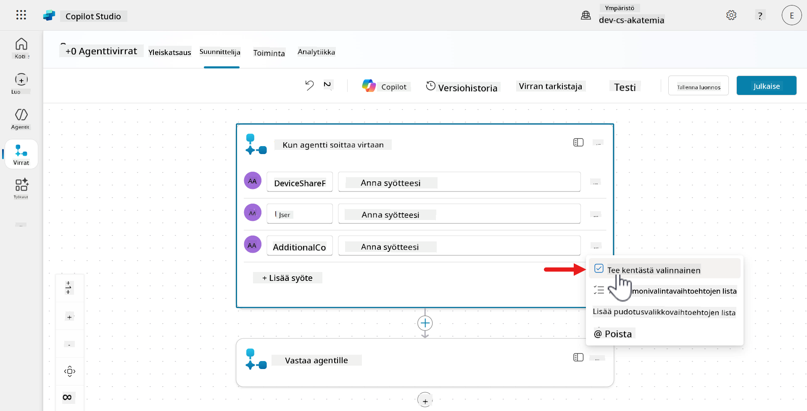

1. Hienoa työtä! Laukaisin on nyt määritetty, jatketaan. Valitse **plus + kuvake** laukaisimen alla lisätäksesi uuden toiminnon.

    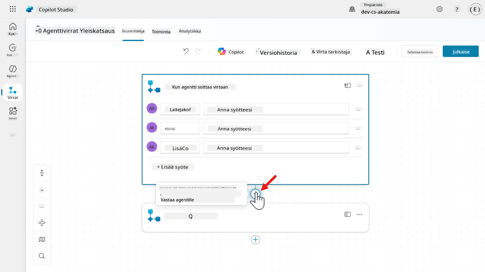

1. **Toimintopaneeli** tulee näkyviin, jossa voit tarkastella toimintoja yli 1400 sisäänrakennetusta liittimestä Microsoftin ja kolmansien osapuolten palveluihin. **Hakukenttään** kirjoita seuraava,

    ```text
    Get item
    ```

    Hakutuloksissa näkyy lista toimintoja. Valitse **Hae kohde** -toiminto **SharePoint-liittimestä**.

    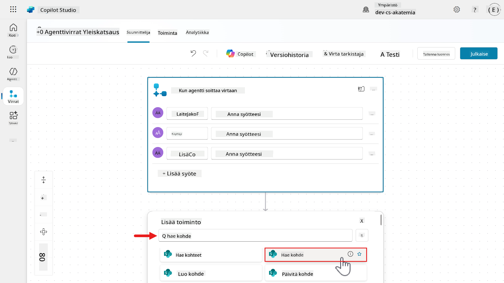

1. Voimme nyt aloittaa **Hae kohde** -toiminnon määrittämisen.

    Valitse **Kolmipiste (...)** -kuvake **Hae kohde** -toiminnossa.

    

1. Valitse **Nimeä uudelleen**.

    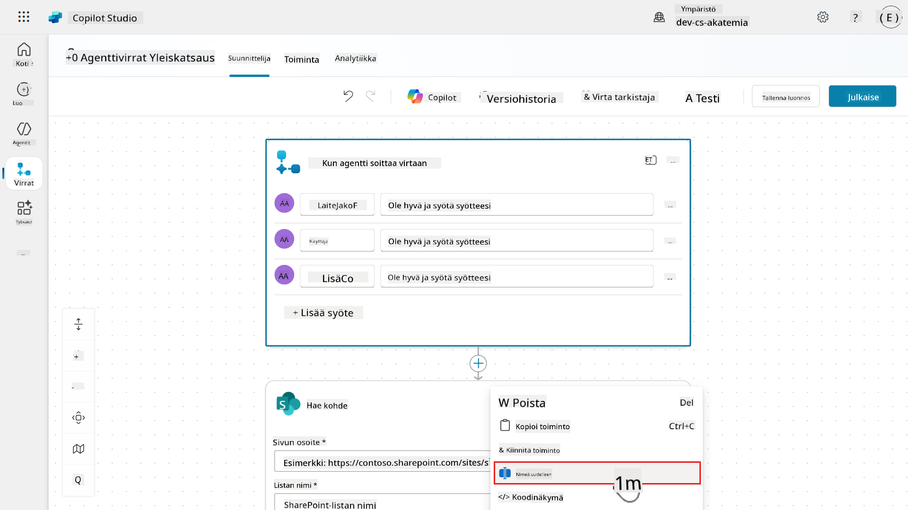

1. Nimeä toiminto seuraavasti,

    ```text
    Get Device
    ```

    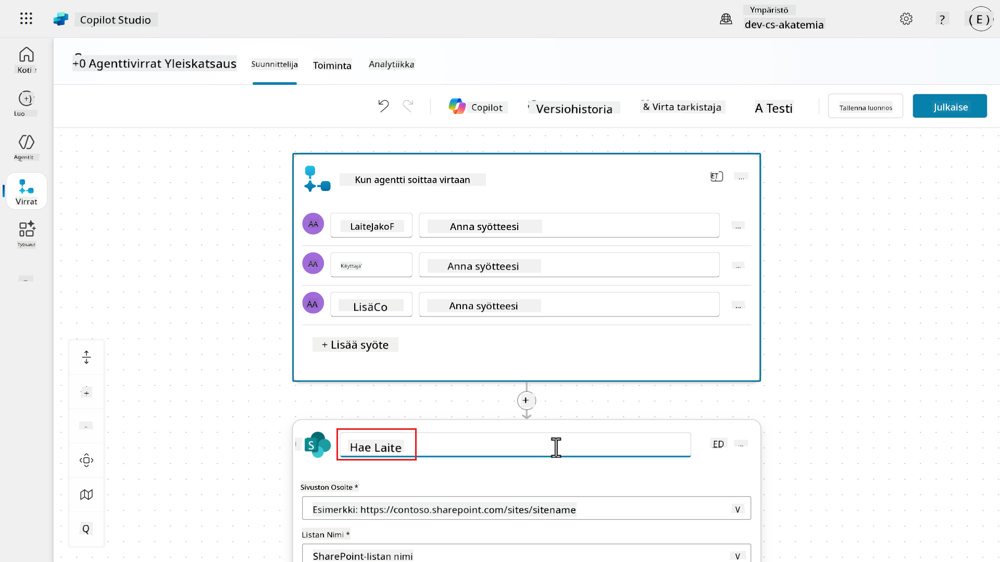

1. **Sivuston osoite** -kentässä valitse **Contoso IT SharePoint -sivuston osoite**, joka luotiin kohdassa [Oppitunti 00 - Kurssin asennus - Vaihe 3: Luo uusi SharePoint-sivusto](../00-course-setup/README.md#step-4-create-new-sharepoint-site).

    **Listan nimi** -kentässä valitse **Laitteet** SharePoint-lista.

    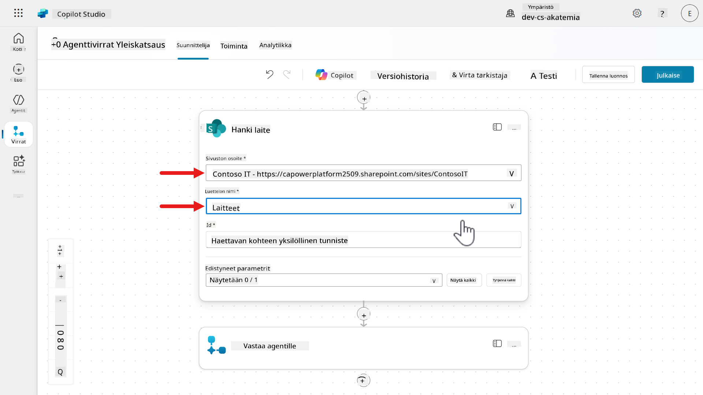

1. **Id**-kentässä valitse **salaman kuvake** tai **fx kuvake** oikealla.

    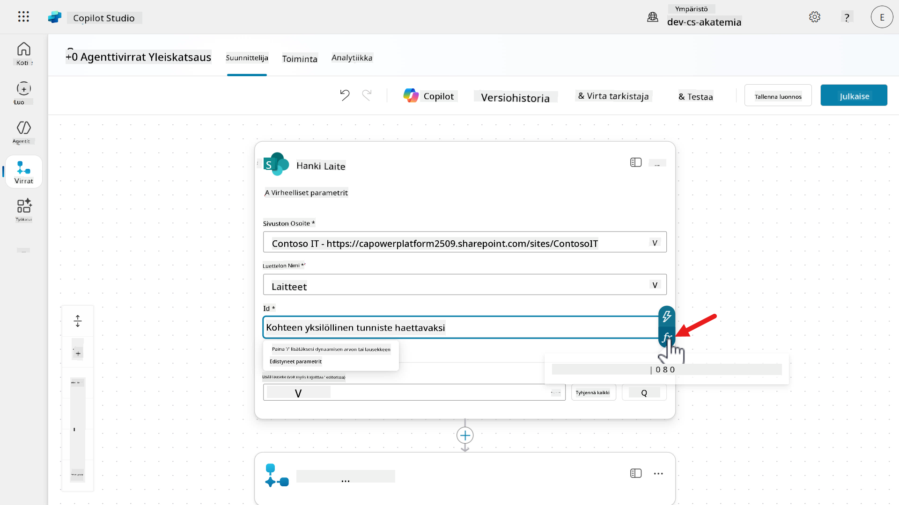

1. **Dynaamisen sisällön** välilehdellä kirjoita seuraava,

    ```text
    sharepoint
    ```

    Hakutuloksissa näkyy syötteen parametrit, jotka vastaavat haettua arvoa. Valitse **DeviceSharePointId**-parametri laukaisimesta.

    Valitse **Lisää** lisätäksesi dynaamisen sisällön syötteen **Id**-parametriin toiminnossa.

    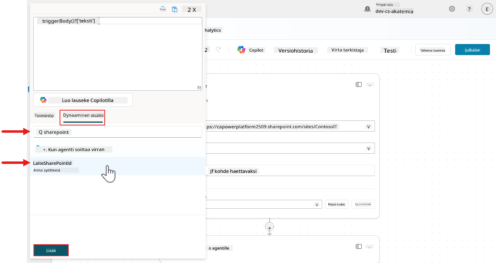

1. Laukaisimen dynaaminen sisällön syöte on nyt viitattu toiminnon **Id**-parametrissa. Päivitämme seuraavaksi yhden edistyneistä parametreista. Valitse **Näytä kaikki** nähdäksesi edistyneet parametrit.

    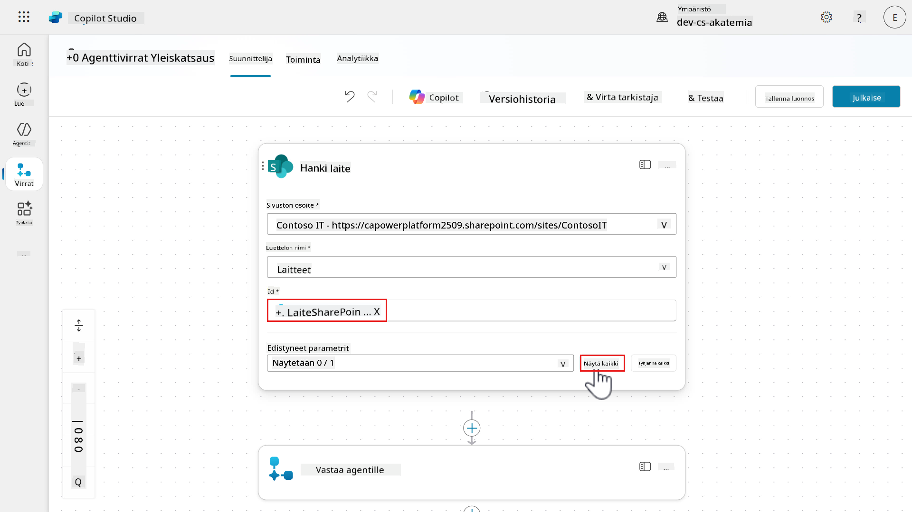

1. **Rajoita sarakkeet näkymän mukaan** -parametri tulee näkyviin, ja oletuksena se on asetettu **Käytä kaikkia sarakkeita (Älä rajoita)**. Päivitämme tämän arvon näkymään rajoittaaksemme sarakkeet, jotka palautetaan toiminnon vastauksessa. Valitse **Rajoita sarakkeet näkymän mukaan** -parametri nähdäksesi näkymien listan.

    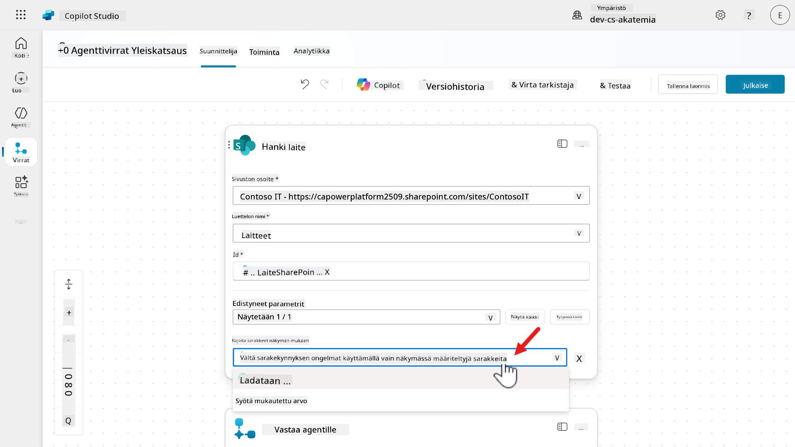

1. Valitse **Kaikki kohteet** -näkymä.

    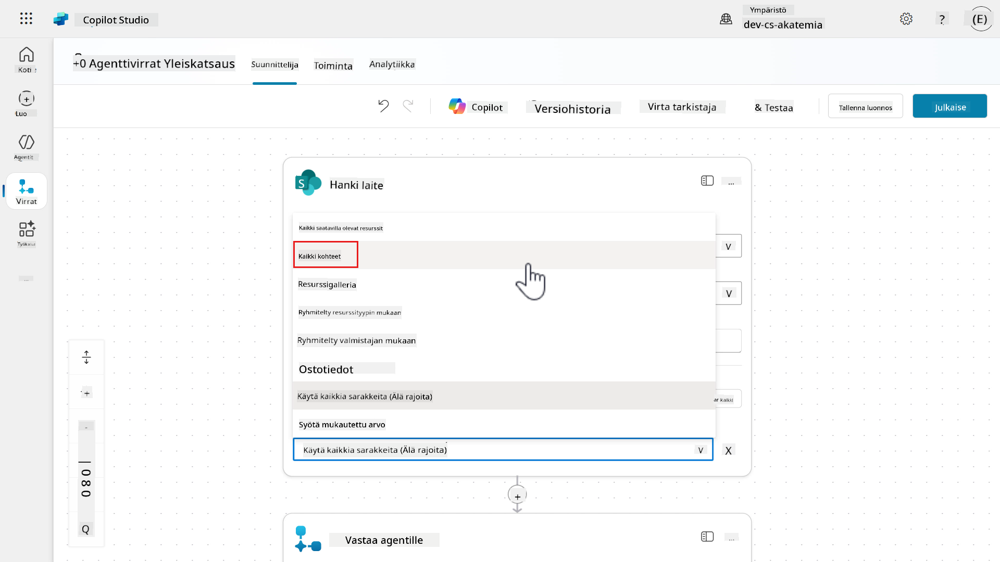

1. Valitse **plus + kuvake** _Hae laite_ -toiminnon alla lisätäksesi uuden toiminnon.

    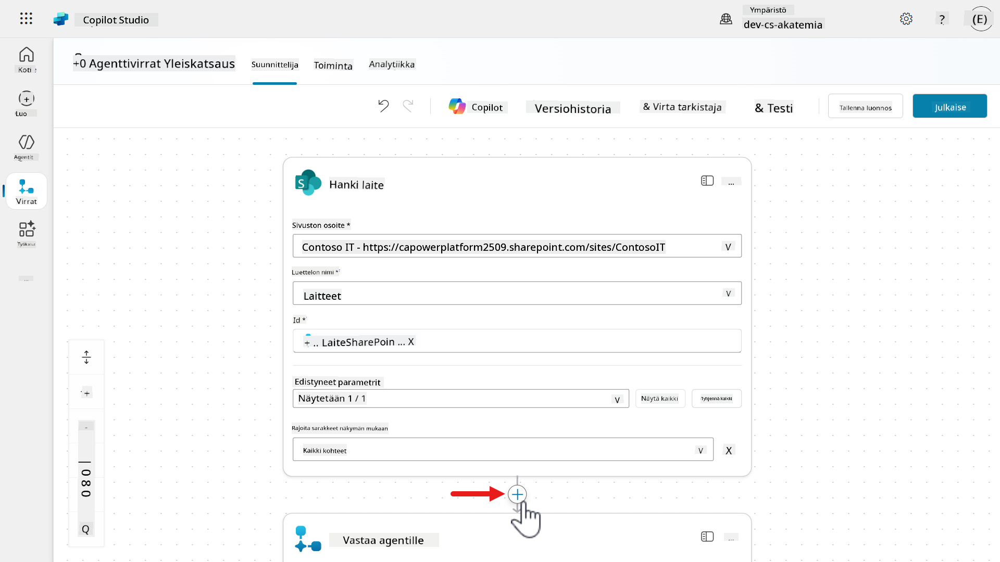

1. Hakukenttään kirjoita seuraava,

    ```text
    send an email
    ```

    Hakutuloksissa näkyy lista toimintoja. Valitse **Lähetä sähköposti (V2)** -toiminto **Office 365 Outlook -liittimestä**.

    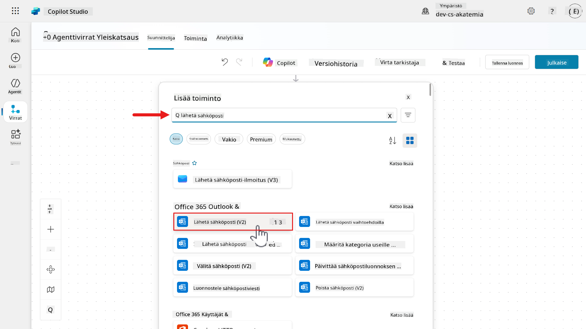

1. Seuraavaksi meidän täytyy luoda yhteys liittimen toiminnolle. Valitse **Kirjaudu sisään**.

    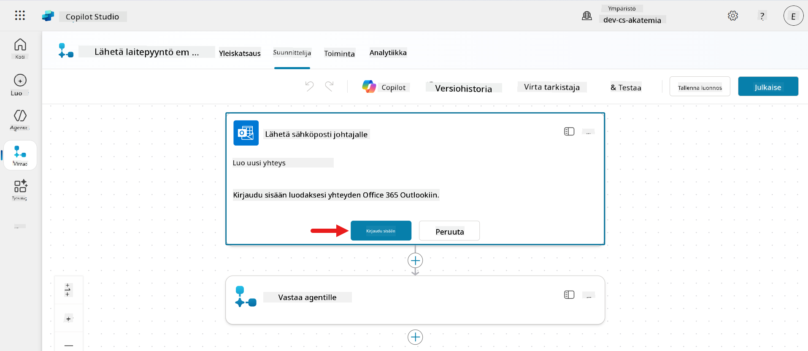

1. Valitse kirjautunut käyttäjätilisi.

    

1. Valitse **Salli pääsy**. Yhteys on nyt luotu.

    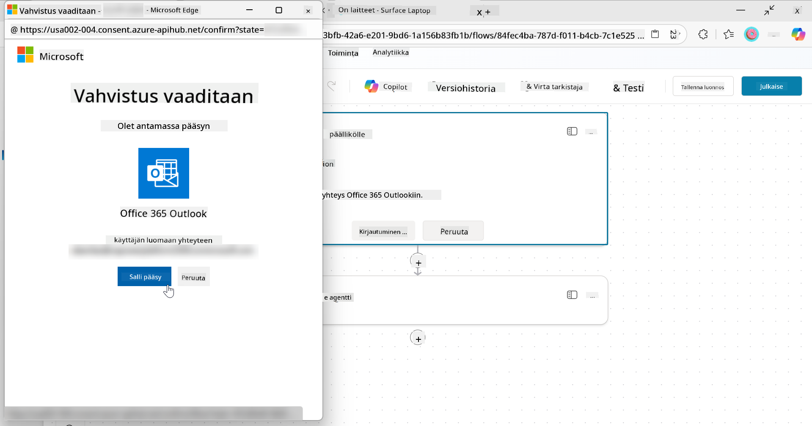

1. Nimeä toiminto seuraavasti,

    ```text
    Send an email to manager
    ```

    Määritellään seuraavaksi toiminnon syötteen parametrit.

    **Vastaanottaja**-syötteen parametriin valitse itsesi. Normaalisti tämä olisi esimiehesi tai käyttäisimme toista toimintoa, joka hakee esimiehesi Entra ID -profiilisi perusteella, mutta tämän oppitunnin tarkoitusta varten valitse itsesi.

    **Aihe**-syötteen parametriin kirjoita seuraava,

    ```text
    Request type: new device
    ```

    **Sisältö**-syötteen parametriin kirjoita seuraava,

    ```text
    Hi,

    New device requested from

    Manufacturer:
    Model:
    Link to item in SharePoint
    Additional comments from:

    This is an automated email from Contoso Helpdesk Copilot
    ```

    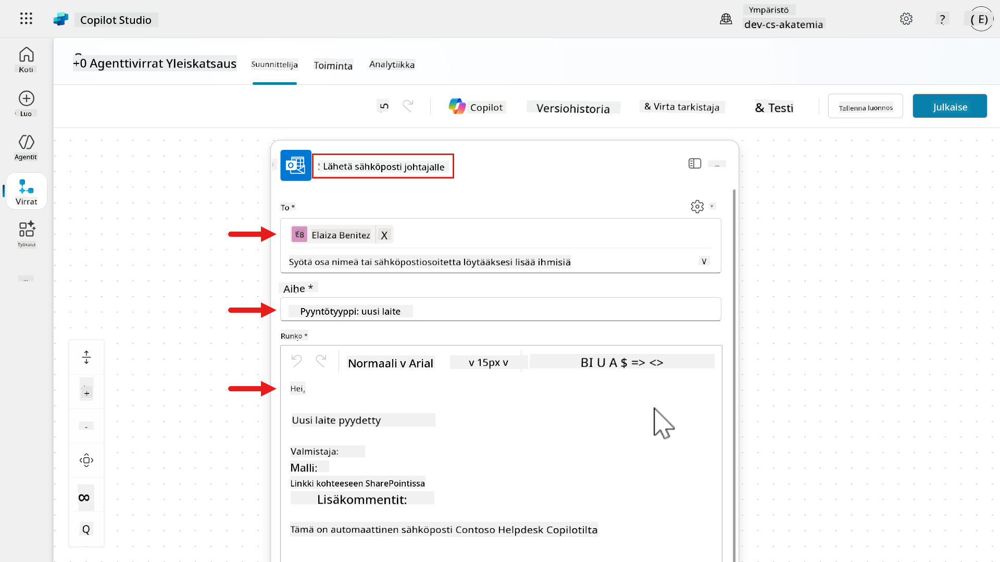

1. Seuraavaksi päivitämme **Sisältö**-syötteen parametrin viittaamaan dynaamiseen sisällön syötteeseen **laukaisimen** tai **Hae kohde** -toiminnon kautta. Kirjoita välilyönti toisen rivin jälkeen, sillä lisäämme käyttäjän nimen laukaisimen syötteestä, **User**.

    Valitse **salaman kuvake** tai **fx kuvake** oikealla.

    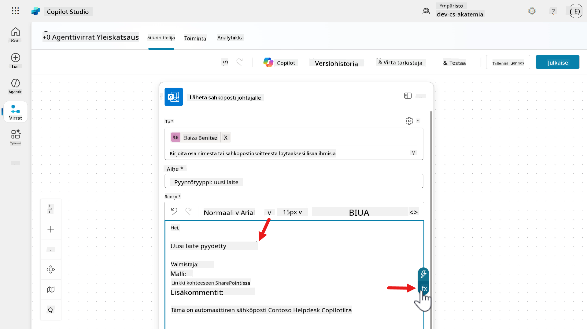

1. **Dynaamisen sisällön** välilehdellä valitse **User**-syöte laukaisimesta.

    Valitse **Lisää** lisätäksesi dynaamisen sisällön **User**-syötteen toiminnon **Sisältö**-parametriin.

    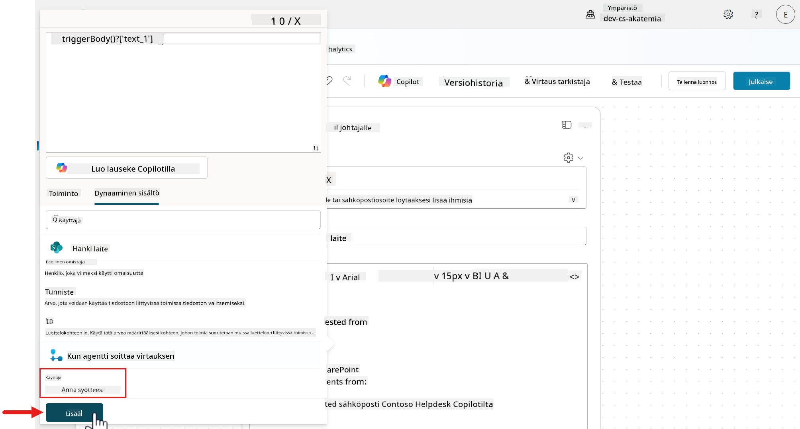
1. Dynaaminen sisältö, joka saadaan liipaisimesta, viitataan nyt toiminnon **Body**-parametrissa. Toistamme saman sähköpostiviestin rungon jäljellä oleville riveille.

    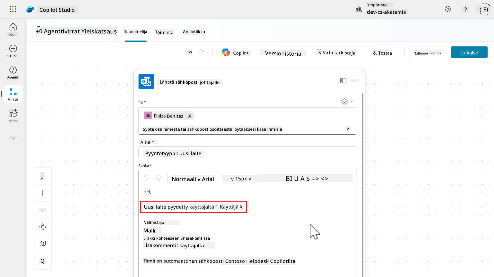

1. Klikkaa kohtaan `Manufacturer:` vieressä. Valitse oikealla oleva **salaman kuva** tai **fx-kuvake**.

    **Dynaaminen sisältö** -välilehdellä avautuvassa paneelissa kirjoita hakukenttään seuraava,

    ```text
    manufacturer
    ```

    Valitse liipaisimen **Manufacturer value** -syöte ja valitse **Add**.

    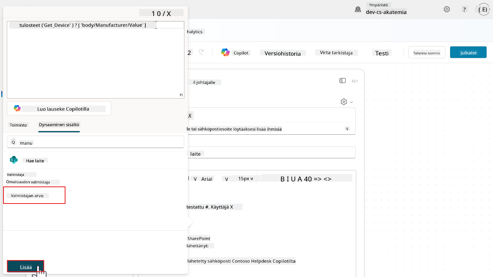

1. Klikkaa kohtaan `Model:` vieressä. Valitse oikealla oleva **salaman kuva** tai **fx-kuvake**.

    **Dynaaminen sisältö** -välilehdellä avautuvassa paneelissa kirjoita hakukenttään seuraava,

    ```text
    model
    ```

    Valitse **Model**-syöte **Get item** -toiminnosta ja valitse **Add**.

    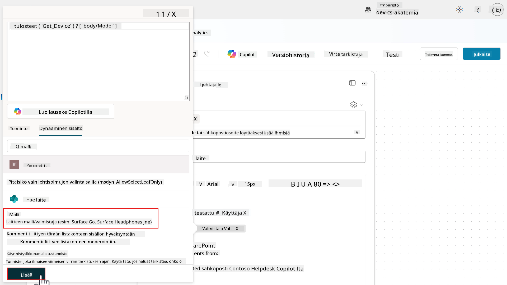

1. `Link to item in SharePoint` -tekstin kohdalla päivitämme sen hyperlinkiksi sähköpostiviestin rungossa. Klikkaa rivin alussa ja valitse oikealla oleva **salaman kuva** tai **fx-kuvake**.

    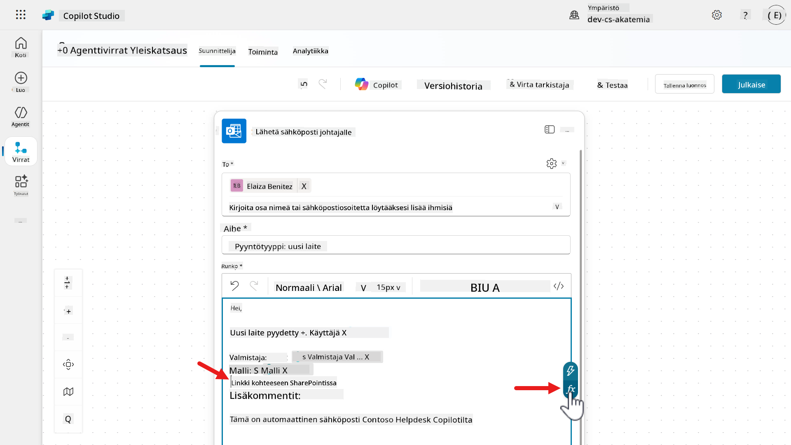

1. Klikkaa HTML-ankkuritunnisteen jälkeen ja valitse oikealla oleva **salaman kuva** tai **fx-kuvake**.

    **Dynaaminen sisältö** -välilehdellä avautuvassa paneelissa kirjoita hakukenttään seuraava,

    ```text
    link to item
    ```

    Valitse **Link to item** -syöte **Get item** -toiminnosta ja valitse **Add**.

    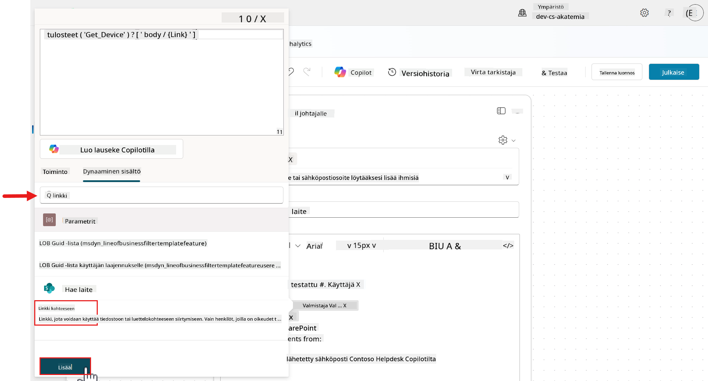

1. Vaihda HTML-editoriin valitsemalla **&lt;/&gt;**-kuvake.

    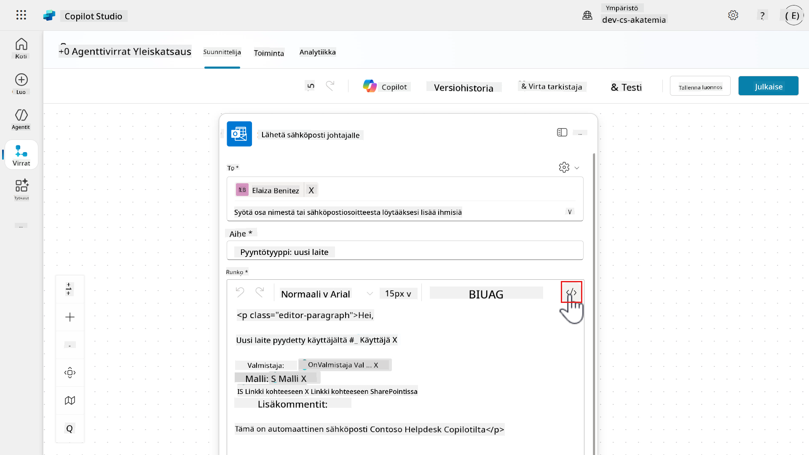

1. HTML-editori on nyt käytössä. Klikkaa ennen `Link to item in SharePoint` -tekstiä ja lisää HTML-ankkuritunniste hyperlinkin luomiseksi. Kopioi ja liitä seuraava.

    ```text
    <a href="
    ```

    

1. **Link to item**-syötteen dynaaminen sisältö viitataan nyt **Body**-parametrissa. Klikkaa **Link to item**-syötteen jälkeen ja kopioi ja liitä seuraava.

    ```text
    ">
    ```

    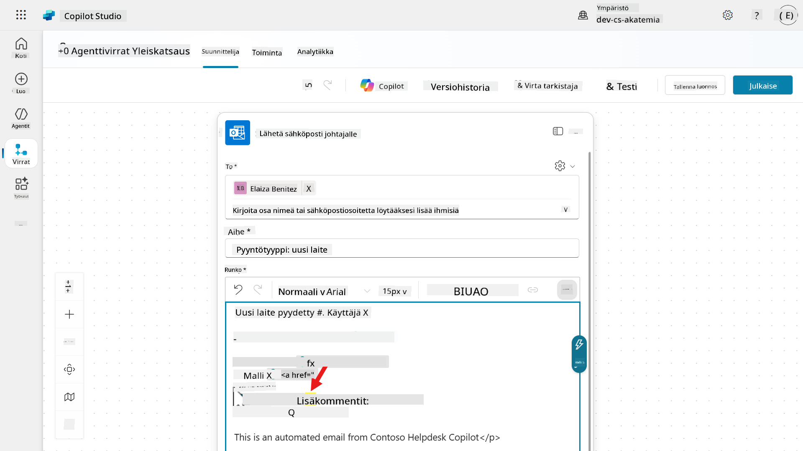

1. Klikkaa `Link to item in SharePoint` -tekstin jälkeen ja sulje HTML-ankkuritunniste. Kopioi ja liitä seuraava.

    ```text
    </a>
    ```

    

1. Valitse **&lt;/&gt;**-kuvake vaihtaaksesi koodinäkymän pois päältä.

    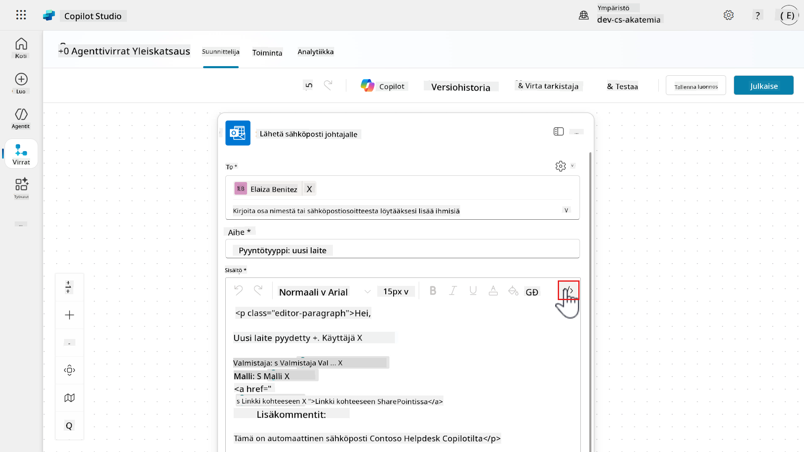

1. Valitse uudelleen **&lt;/&gt;**-kuvake vaihtaaksesi takaisin koodinäkymään.

    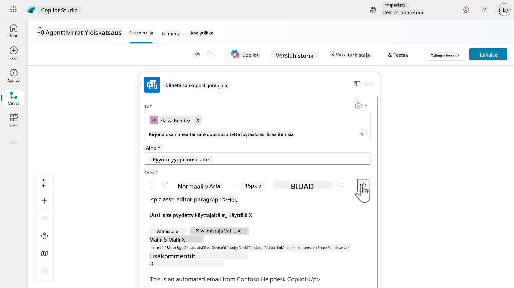

1. Huomaa, että useita ylimääräisiä merkkejä `&lt;br&gt;` on lisätty. Poista nämä merkit.

    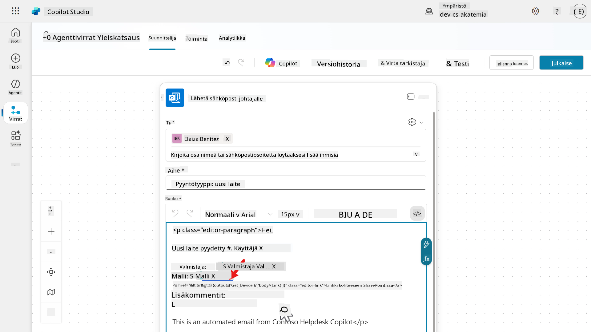

1. Olemme nyt valmiita lisäämään hyperlinkin sähköpostiviestin runkoon 😎 Valitse **&lt;/&gt;**-kuvake vaihtaaksesi koodinäkymän pois päältä.

    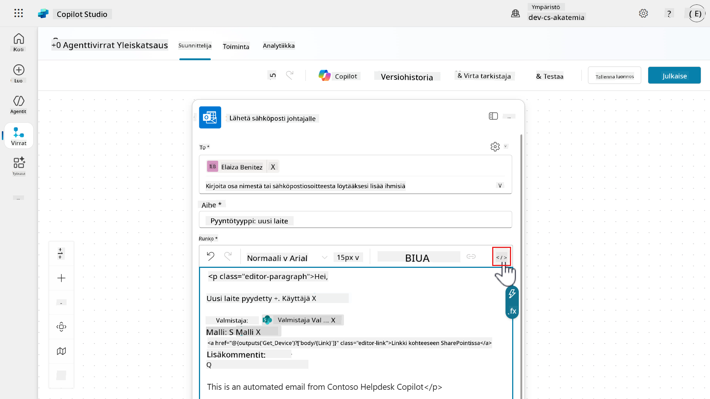

1. Klikkaa `Additional comments from` -tekstin jälkeen ennen kaksoispistettä ja valitse oikealla oleva **salaman kuva** tai **fx-kuvake**.

    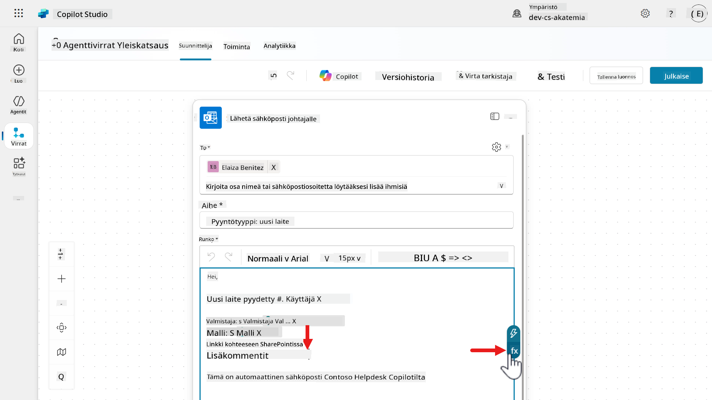

1. **Dynaaminen sisältö** -välilehdellä avautuvassa paneelissa kirjoita hakukenttään seuraava,

    ```text
    user
    ```

    Valitse liipaisimen **User**-parametri ja valitse **Add**.

    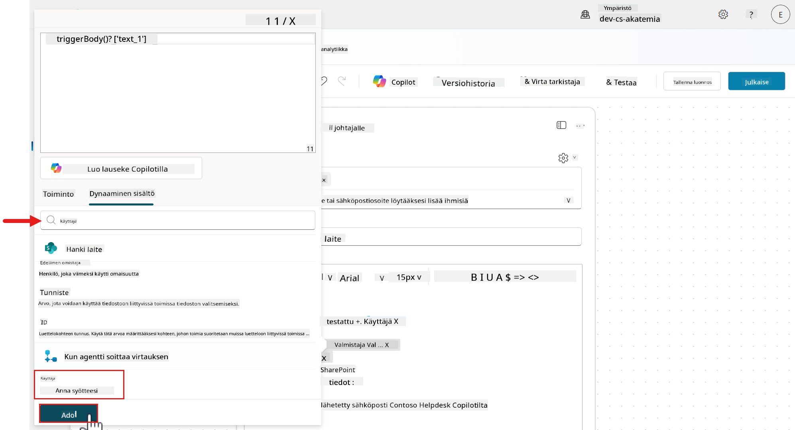

1. Aiomme nyt lisätä lausekkeen, joka näyttää käyttäjän antamat lisäkommentit **Ask an adaptive card** -solmussa, tai "None", jos käyttäjä ei anna kommentteja.

    Klikkaa kaksoispisteen jälkeen ja valitse oikealla oleva **salaman kuva** tai **fx-kuvake**.

    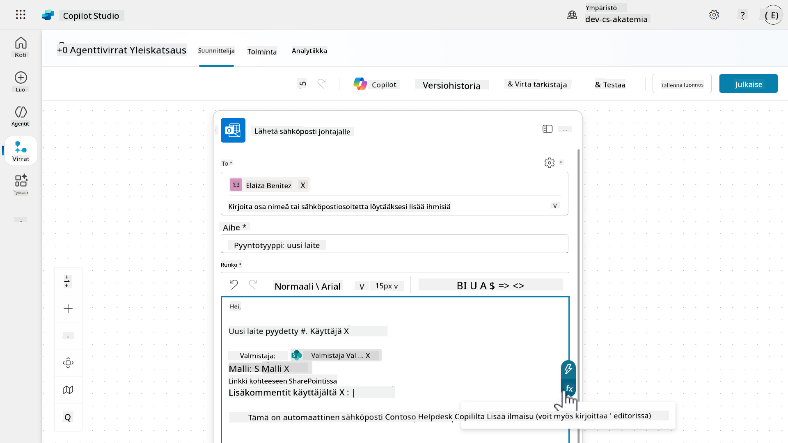

1. **Function**-välilehdellä avautuvassa paneelissa ja lausekekentässä kirjoita seuraava,

    ```text
    if(empty())
    ```

    Tämä lauseke käyttää `if`-funktiota if-else-lauseena.

    Seuraava funktio on `empty`, joka tarkistaa, onko arvo olemassa vai ei merkkijonoparametrissa. Viitattava merkkijonoparametri on liipaisimen `AdditionalComments`-syöteparametrin arvo.

    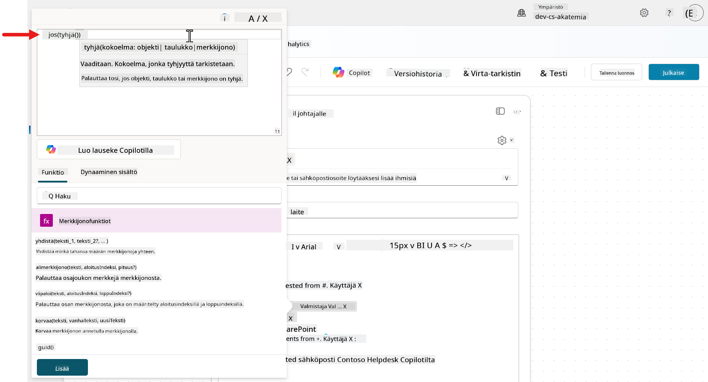

1. Klikkaa **sulkeiden sisään** `empty`-funktion jälkeen. Aiomme lisätä liipaisimen `AdditionalComments`-syöteparametrin.

    Valitse **Dynaaminen sisältö** -välilehti. Kirjoita hakukenttään seuraava,

    ```text
    Additional
    ```

    Vieritä paneelia alas ja valitse liipaisimen **AdditionalComments**-syöte. Parametri lisätään nyt lausekkeeseen merkkijonoparametrina.

    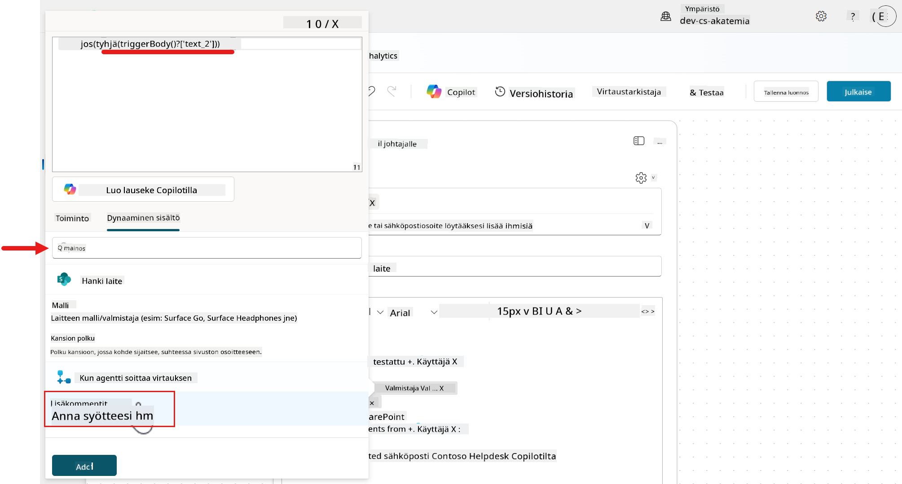

1. Määritämme seuraavaksi **_true_**-logiikan, jossa jos `AdditionalComments`-merkkijonoparametri on tyhjä, haluamme näyttää tekstin `None`.

    Sulkeiden jälkeen, jotka sisältävät merkkijonoparametrin, kirjoita seuraava,

    ```text
    , 'None',
    ```

    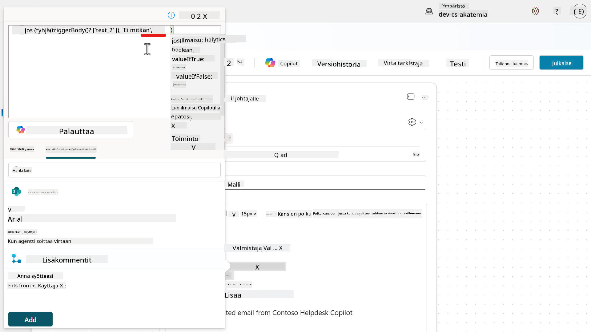

1. Lopuksi määritämme **_false_**-logiikan, jossa jos `AdditionalComments`-merkkijonoparametri ei ole tyhjä, haluamme näyttää liipaisimen **AdditionalComments**-syöteparametrin arvon.

    > Muistutus: tämä arvo tulee **Ask with adaptive card** -solmun lisäkommenttikentästä **Request device** -aiheessa.

    Pilkun jälkeen **_true_**-logiikan jälkeen valitse **Dynaaminen sisältö** -välilehti. Kirjoita hakukenttään seuraava,

    ```text
    Additional
    ```

    Vieritä paneelia alas ja valitse liipaisimen **AdditionalComments**-syöte. Parametri lisätään nyt lausekkeeseen merkkijonoparametrina.

    Lisää se **Body**-parametriin valitsemalla **Add**.

    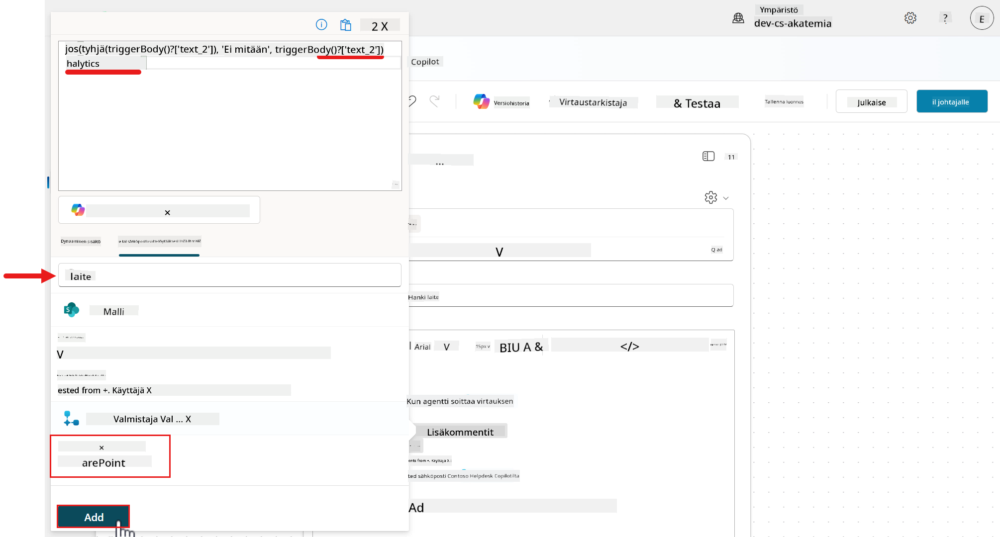

1. Erinomaista, lausekkeemme on valmis! Lauseke on nyt lisätty **Body**-parametriin. Lopuksi muotoile viimeinen rivi kursiiviksi.

    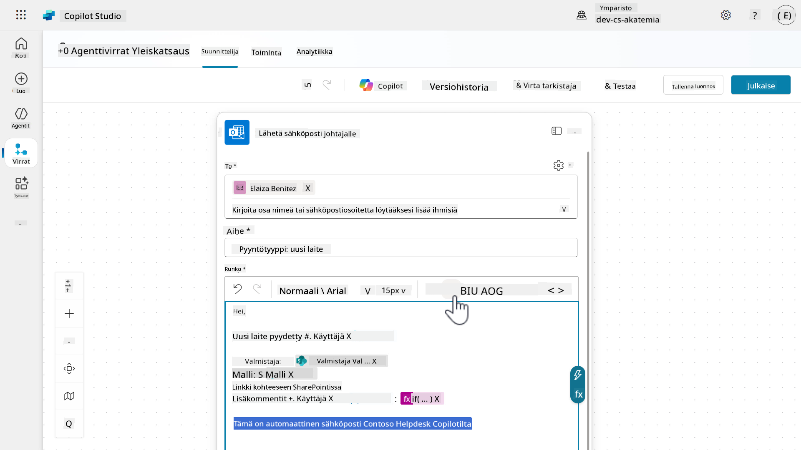

1. Päivitämme nyt **Respond to the agent** -toiminnon lähettämään **Model value**-parametrin arvon **Get item** -toiminnosta takaisin agentille.

    Pidä hiiren vasenta painiketta painettuna ja siirry suunnittelutyökalussa ylöspäin nähdäksesi **Respond to the agent** -toiminnon.

    Valitse **Respond to the agent** -toiminto ja valitse **Text**-lähtötyyppi.

    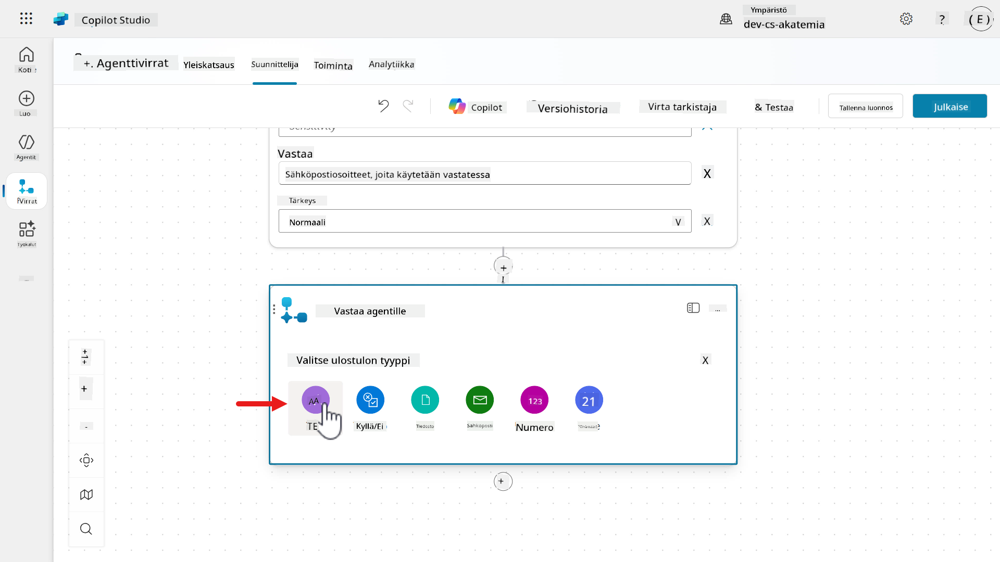

1. Kirjoita seuraava lähtönimenä.

    ```text
    ModelValue
    ```

    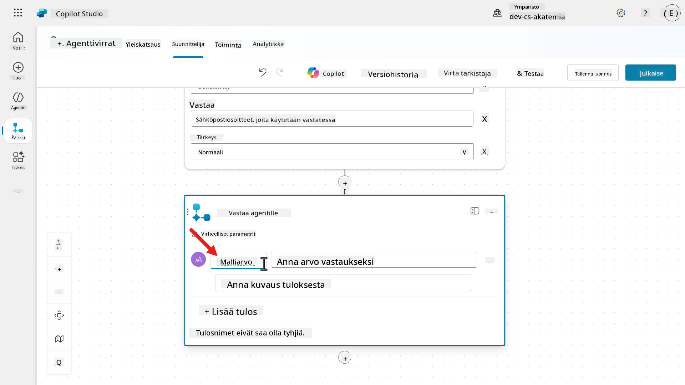

1. Valitse arvokenttä ja valitse oikealla oleva **salaman kuva** tai **fx-kuvake**.

    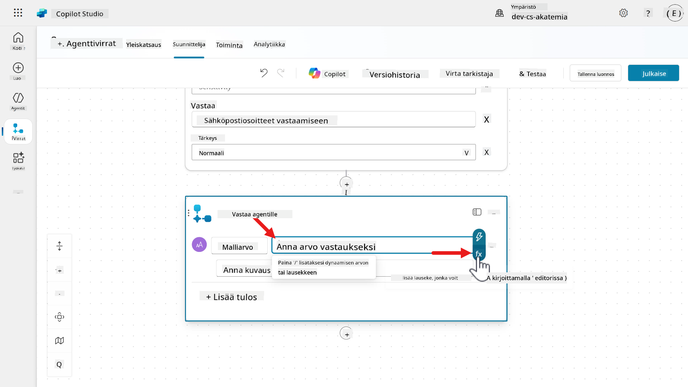

1. **Dynaaminen sisältö** -välilehdellä avautuvassa paneelissa kirjoita hakukenttään seuraava,

    ```text
    model
    ```

    Valitse **Model**-parametri **Get item** -toiminnosta ja valitse **Add**.

    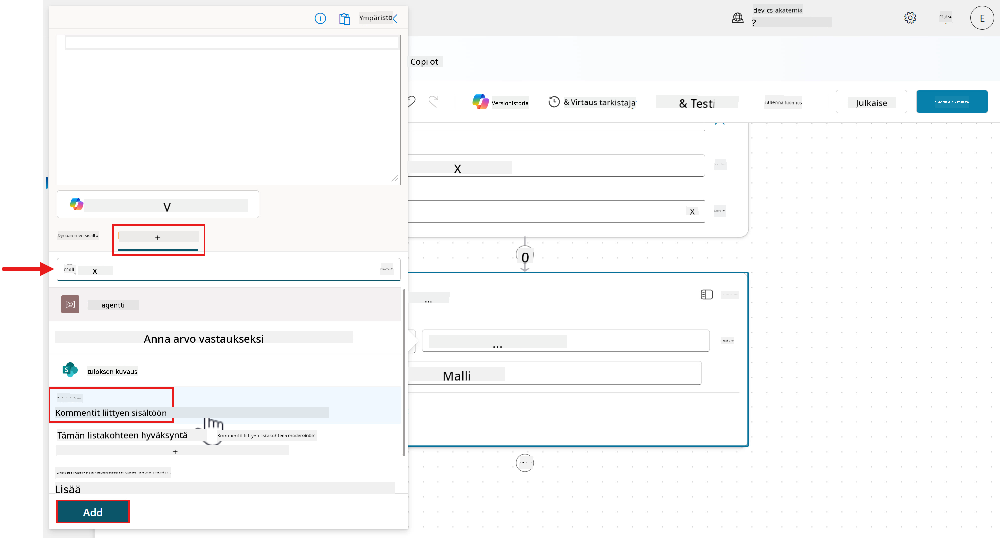

1. **Model**-parametri on nyt tekstilähdön arvo. Valitse **Save draft** tallentaaksesi agenttivirran.

    Olemme nyt valmiita agenttivirran kanssa 👏🏻

    

1. Tehdään vielä yksi päivitys agenttivirtaan ennen julkaisua. Valitse **Overview**-välilehti ja valitse **Edit**.

    

1. Kopioi ja liitä seuraava **Flow name**-kenttään.

    ```text
    Send device request email
    ```

    **Description**-kenttään valitse **refresh-kuvake** käyttääksesi tekoälyä automaattisesti luomaan kuvauksen liipaisimen ja agenttivirran toimintojen perusteella.

    Valitse **Save** tallentaaksesi päivitetyn nimen ja kuvauksen agenttivirrasta.

    

1. Valitse **Designer**-välilehti ja valitse **Publish** julkaistaksesi agenttivirran, jotta se voidaan lisätä solmuksi **Request device** -aiheeseen.

    

1. Vahvistusviesti ilmestyy pian vahvistamaan, että agenttivirta on julkaistu.

    

### 9.2 Lisää agenttivirta aiheeseen

Lisätään nyt agenttivirta **Request device** -aiheeseen.

1. Valitse **Agents** vasemmanpuoleisesta valikosta ja valitse **Contoso Helpdesk Agent**.

    

1. Valitse **Topics**-välilehti.

    

1. Valitse **Request device** -aihe.

    

1. Vieritä alas **Ask with adaptive card** -solmuun ja lisää uusi solmu.

    Valitse **Add a tool** ja **Basic tools**-välilehdellä avautuvassa paneelissa valitse äskettäin luotu ja julkaistu **Send device request email** -agenttivirta.

    

1. Agenttivirran liipaisinsyötteille meidän täytyy valita **Ask with adaptive card** -solmun muuttujalähdöt.

    Valitse **ellipsis (...) icon** **DeviceSharePointId**-syötteelle.

    

1. Valitse **deviceSelectionId**-muuttuja, joka on yksi **Ask with adaptive card** -solmussa määritellyistä lähdöistä.

    

1. Seuraavaksi valitse **ellipsis (...) icon** **User**-syötteelle.

    

1. Valitse **System**-välilehti avautuvassa muuttujapaneelissa ja valitse **User.DisplayName**. Tämä muuttuja tallentaa sisäisen käyttäjän näyttönimen, joka on vuorovaikutuksessa agentin kanssa.

    

1. Seuraavaksi valitse **greater than icon** **Advanced inputs**-kohdassa laajentaaksesi ja nähdäksesi **AdditionalComments**-syötteen.

    

1. Valitse **ellipsis (...) icon** AdditionalComments-syötteelle.

    

1. Valitse **Formula**-välilehti ja avautuvan muuttujapaneelin laajennuskuvake, sillä käytämme Power Fx -lauseketta.

    

1. Samankaltainen kuin agenttivirrassa käytetty lauseke, joka tekee ehdollisen tarkistuksen _if_-funktiolla, mutta tällä kertaa
    - käytämme Power Fx -funktioita,
    - ja lisäämme joko tyhjän arvon tai `commentsId`-lähtömuuttujan arvon **Ask with adaptive card** -solmusta.

    Kirjoita seuraavat funktiot Power Fx -kenttään,

    ```text
    If(IsBlank())
    ```

Tämä lause käyttää `If`-funktiota if-else-lauseessa.

Seuraava käytetty funktio on `IsBlank`, joka tarkistaa, onko merkkijonoparametrissa arvoa vai ei. Viitattava merkkijonoparametri on `commentsId`-ulostulomuuttuja **Ask with adaptive card** -solmusta.


1. Klikkaa seuraavaksi **sulkeiden sisälle** `IsBlank`-funktion jälkeen. Aiomme lisätä `commentsId`-ulostulomuuttujan **Ask with adaptive card** -solmusta.

    Syötä seuraava sulkeiden sisälle,

    ```text
    Topic.commentsId
    ```

    Ja lisää pilkku sulkeiden jälkeen.

    

1. Määritellään seuraavaksi logiikka

    - kun **_true_** - jos `Topic.commentsId`-merkkijonoparametri on tyhjä, emme halua lisätä arvoa.
    - kun **_false_** - jos `Topic.commentsId`-merkkijonoparametri ei ole tyhjä, lisää muuttujan commentsId arvo.

    Sulkeiden jälkeen, jotka sisältävät merkkijonoparametrin, syötä seuraava,

    ```text
    "", Topic.commentsId)
    ```

    Power Fx -lausekkeen tulisi olla seuraava,

    ```text
    If(IsBlank(Topic.commentsId), "", Topic.commentsId)
    ```

    Hienoa työtä, lauseke on valmis! 🙌🏻 Valitse nyt **Insert**, jotta agenttivirran syöttöparametri asetetaan Power Fx -lausekkeeseen.

    

1. **Tallenna** aihe.

### 9.3 Päivitä Request device -aihe useilla solmuilla paremman käyttäjäkokemuksen saavuttamiseksi

Lisätään seuraavaksi kaksi solmua:

- **Send a message** - toimii vahvistusviestinä, joka viittaa valittuun laitteeseen ja ilmoittaa, että pyyntö on lähetetty.

- **Topic management** - keskustelun lopettamiseksi ohjaamme käyttäjän **End of conversation** -solmuun.

Aloitetaan!

1. Valitse **plus + -kuvake** agenttivirran solmun alapuolella ja valitse **Send a message** -solmu.

    

1. Syötä seuraava viestikenttään,

    ```text
    Thanks
    ```

    Valitse sitten **Insert variable**, sillä viittaamme käyttäjän nimeen.

    

1. Valitse **System**-välilehti ja etsi `User` hakukentästä. Valitse **User.DisplayName**-muuttuja.

    

1. Syötä seuraava viestikenttään,

    ```text
    . Your selected device,
    ```

    Valitse sitten **Insert variable** ja tällä kertaa **Custom**-välilehdeltä **ModelValue**-muuttuja.

    Syötä seuraava viestikenttään viestin viimeistelyä varten.

    ```text
    , has been submitted and will be reviewed by your manager.
    ```

    Viestin tulisi näyttää seuraavalta.

    

1. Lopuksi valitse **plus + -kuvake** **Send a message** -solmun alapuolella ja valitse **Topic management**, sitten **Go to another topic** ja valitse **End of Conversation**.

    

1. **Tallenna** aihe.

    

### 9.4 Testaa agenttia eri skenaarioilla

Hienoa työtä!!! 😁 Voimme nyt testata agenttiamme.

#### 9.4.1 Pyydä laitetta ja lisää kommentti mukautettuun korttiin

1. **Päivitä** testipaneeli, valitse **activity map** -kuvake ja syötä seuraava viesti agentille.

    ```text
    I need a laptop
    ```

    

1. Agentti käynnistää **Available devices** ja vastaa listalla saatavilla olevista laitteista. Syötämme seuraavan vastauksen kysymykseen, haluammeko pyytää laitetta.

    ```text
    Yes
    ```

    

1. Huomaa, kuinka agentti käynnisti **Request device** agentin ohjeiden mukaisesti ja mukautettu kortti näkyy nyt agentin viestissä.

    Valitse **Surface Laptop 15** -laite ja lisää seuraava kommentti.

    ```text
    I need 16GB of RAM please
    ```

    

1. Vieritä alas, kunnes näet **Submit Request** -painikkeen, ja valitse se lähettääksesi mukautetun kortin agentille.

    

1. Valitse **Allow**, jotta agentti voi käyttää tunnuksiasi kahden liittimen todennukseen.

    

1. Agentti näyttää vahvistusviestin, joka sisältää valitun mallin, ja ohjaa sitten **End of Conversation** -aiheeseen. Hienoa!

    

1. Valitse **Kyllä** vahvistaaksesi loput **End of Conversation** -aiheesta.

    

1. Arvioi kokemus valitsemalla jokin tähdistä arviointikortissa.

    Agentti siirtyy sitten **End of Conversation** -aiheen viimeiseen **Question**-solmuun. Valitse **Ei**.

    

1. Aihe päättyy, kun lopullinen viesti näytetään testipaneelissa.

    

1. Tarkista sähköpostitilisi Saapuneet-kansio nähdäksesi agenttivirran lähettämän sähköpostin esimiehelle. Näet valitun laitteen tiedot ja mukautettuun korttiin syötetyn kommentin.

    

1. Klikkaa hyperlinkkiä, ja selain lataa laitteen SharePoint-kohteen. Mahtavaa!

    

#### 9.4.2 Pyydä laitetta, mutta älä lisää kommenttia mukautettuun korttiin

Testataan nyt skenaariota, jossa kommenttia ei lisätä.

1. Toista samat vaiheet:

    - **Päivitä** testipaneeli ja valitse **activity map** -kuvake
    - Syötä viesti, `I need a laptop`
    - Vastaa `Yes` kysymykseen laitteen pyytämisestä

    

1. Valitse tällä kertaa **Surface Laptop 13** laitteeksi, mutta älä lisää kommenttia.

    

1. **Lähetä** pyyntö valitsemalla **Submit Request** -painike.

    

1. Tällä kertaa sähköpostissa, jonka saat Saapuneet-kansioosi, kommenttina näkyy **None**.

    

#### 9.4.3 Älä pyydä laitetta

Testataan viimeinen skenaario, jossa laitetta ei pyydetä, ja **Goodbye**-aiheen tulisi käynnistyä agentin ohjeiden mukaisesti.

1. Toista samat vaiheet:

    - **Päivitä** testipaneeli ja valitse **activity map** -kuvake
    - Syötä viesti, `I need a laptop`
    - Vastaa tällä kertaa `No` kysymykseen laitteen pyytämisestä

    

1. Agentti käynnisti **Goodbye**-aiheen, ja kysymys, joka on määritelty aiheessa, esitetään.

    

## ✅ Tehtävä suoritettu

Onnittelut! 👏🏻 Olet oppinut, kuinka rakentaa agenttivirta ja lisätä se olemassa olevaan **Request device** -aiheeseen, sekä kuinka ohjata agentti toiseen aiheeseen.

Tämä oli **Lab 09 - Lisää agenttivirta automaatiota varten ja paranna aiheen ominaisuuksia** -osion loppu. Valitse alla oleva linkki siirtyäksesi seuraavaan oppituntiin. Laajennamme tämän osion käyttötapausta seuraavan oppitunnin laboratoriossa.

⏭️ [Siirry **Add Event Triggers - Enable autonomous agent capabilities** -oppituntiin](../10-add-event-triggers/README.md)

## 📚 Taktiset resurssit

🔗 [Introducing agent flows: Transforming automation with AI-first workflows](https://www.microsoft.com/microsoft-copilot/blog/copilot-studio/introducing-agent-flows-transforming-automation-with-ai-first-workflows/)

🔗 [Agent flows overview](https://learn.microsoft.com/microsoft-copilot-studio/flows-overview?WT.mc_id=power-172621-ebenitez)

🔗 [Use agent flows with your agent](https://learn.microsoft.com/microsoft-copilot-studio/advanced-flow?WT.mc_id=power-172621-ebenitez)

🔗 [List of functions in the reference guide](https://learn.microsoft.com/azure/logic-apps/workflow-definition-language-functions-reference?WT.mc_id=power-172621-ebenitez)

📺 [Agent Flows in Copilot Studio](https://www.youtube.com/watch?v=VJTKyk3Pr7s)


---

**Vastuuvapauslauseke**:  
Tämä asiakirja on käännetty käyttämällä tekoälypohjaista käännöspalvelua [Co-op Translator](https://github.com/Azure/co-op-translator). Vaikka pyrimme tarkkuuteen, huomioithan, että automaattiset käännökset voivat sisältää virheitä tai epätarkkuuksia. Alkuperäinen asiakirja sen alkuperäisellä kielellä tulisi pitää ensisijaisena lähteenä. Kriittisen tiedon osalta suositellaan ammattimaista ihmiskäännöstä. Emme ole vastuussa väärinkäsityksistä tai virhetulkinnoista, jotka johtuvat tämän käännöksen käytöstä.