<!--
CO_OP_TRANSLATOR_METADATA:
{
  "original_hash": "4fb913dfc3bbc71506dd3602c4b8e6ed",
  "translation_date": "2025-10-17T19:20:26+00:00",
  "source_file": "docs/operative-preview/02-multi-agent/README.md",
  "language_code": "fr"
}
-->
# 🚨 Mission 02 : Agents Connectés

--8<-- "disclaimer.md"

## 🕵️‍♂️ NOM DE CODE : `OPÉRATION SYMPHONIE`

> **⏱️ Durée de l'opération :** `~45 minutes`

## 🎯 Résumé de la mission

Bienvenue de retour, Agent. Lors de la Mission 01, vous avez créé votre principal Agent de Recrutement - une base solide pour gérer les flux de travail liés au recrutement. Mais un agent seul a ses limites.

Votre mission, si vous l'acceptez, est **Opération Symphonie** - transformer votre agent unique en un **système multi-agents** : une équipe orchestrée d'agents spécialisés travaillant ensemble pour relever des défis complexes en matière de recrutement. Pensez à cela comme une évolution d'un opérateur solitaire à un commandant d'une force de tâche spécialisée.

Comme un orchestre symphonique où chaque musicien joue sa partition en parfaite harmonie, vous ajouterez deux spécialistes essentiels à votre Agent de Recrutement existant : un Agent de Réception des Candidatures pour traiter automatiquement les CV, et un Agent de Préparation des Entretiens pour créer des supports d'entretien complets. Ces agents travailleront ensemble de manière fluide sous la direction de votre orchestrateur principal.

## 🔎 Objectifs

Dans cette mission, vous apprendrez :

1. Quand utiliser des **agents enfants** vs **agents connectés**
1. Comment concevoir des **architectures multi-agents** évolutives  
1. Créer des **agents enfants** pour des tâches ciblées
1. Établir des **modèles de communication** entre agents
1. Construire l'Agent de Réception des Candidatures et l'Agent de Préparation des Entretiens

## 🧠 Qu'est-ce qu'un agent connecté ?

Dans Copilot Studio, vous n'êtes pas limité à la création d'agents uniques et monolithiques. Vous pouvez créer des **systèmes multi-agents** - des réseaux d'agents spécialisés travaillant ensemble pour gérer des flux de travail complexes.

Pensez à cela comme une organisation réelle : au lieu qu'une seule personne fasse tout, vous avez des spécialistes qui excellent dans des tâches spécifiques et collaborent lorsque nécessaire.

### Pourquoi les systèmes multi-agents sont importants

- **Évolutivité :** Chaque agent peut être développé, testé et maintenu indépendamment par différentes équipes.  
- **Spécialisation :** Les agents peuvent se concentrer sur ce qu'ils font de mieux. Par exemple, un pour le traitement des données, un autre pour l'interaction utilisateur, un autre pour la prise de décision.  
- **Flexibilité :** Vous pouvez combiner et réutiliser des agents dans différents projets, et faire évoluer votre système progressivement.  
- **Facilité de maintenance :** Les modifications apportées à un agent n'affectent pas nécessairement les autres, rendant les mises à jour plus sûres et plus simples.

### Exemple réel : Processus de recrutement

Prenons notre flux de recrutement - plusieurs agents pourraient travailler ensemble avec les responsabilités suivantes :

- **Réception des CV** nécessite des compétences en analyse de documents et extraction de données
- **Évaluation** implique d'examiner les CV des candidats et de les comparer aux exigences des postes
- **Préparation des entretiens** demande une analyse approfondie de l'adéquation des candidats  
- **Communication avec les candidats** nécessite des capacités de communication empathiques

Plutôt que de créer un agent massif qui essaie de gérer toutes ces compétences différentes, vous pouvez créer des agents spécialisés pour chaque domaine et les orchestrer ensemble.

## 🔗 Agents enfants vs agents connectés : La différence clé

Copilot Studio propose deux façons de construire des systèmes multi-agents, chacune avec des cas d'utilisation distincts :

### ↘️ Agents enfants

Les agents enfants sont des **spécialistes légers** qui vivent au sein de votre agent principal. Pensez à eux comme des équipes spécialisées au sein du même département.

#### Détails techniques clés

- Les agents enfants vivent au sein de l'agent parent et ont une seule page de configuration.
- Les outils et les connaissances sont **stockés chez l'agent parent**, mais configurés pour être "disponibles pour" l'agent enfant.
- Les agents enfants **partagent les sujets** de leur agent parent. Les sujets peuvent être référencés par les instructions de l'agent enfant.
- Les agents enfants **n'ont pas besoin d'une publication séparée** - ils sont automatiquement disponibles au sein de leur agent parent une fois créés. Cela facilite les tests car les modifications apportées à l'agent parent et aux agents enfants peuvent être effectuées dans le **même espace de travail partagé**.

#### Utilisez des agents enfants lorsque

- Une seule équipe gère l'ensemble de la solution
- Vous souhaitez organiser logiquement les outils et les connaissances en sous-agents
- Vous n'avez pas besoin d'une authentification ou d'un déploiement séparé pour chaque agent
- Les agents ne seront pas publiés séparément ou utilisés indépendamment
- Vous n'avez pas besoin de réutiliser les agents dans plusieurs solutions

**Exemple :** Un agent de support informatique avec des agents enfants pour :

- Procédures de réinitialisation de mot de passe
- Dépannage matériel  
- Guides d'installation de logiciels

### 🔀 Agents connectés

Les agents connectés sont des **agents indépendants à part entière** avec lesquels votre agent principal peut collaborer. Pensez à eux comme des départements distincts travaillant ensemble sur un projet.

#### Détails techniques clés

- Les agents connectés ont **leurs propres sujets** et flux de conversation. Ils fonctionnent indépendamment avec leurs propres paramètres, logique et cycle de vie de déploiement.
- Les agents connectés **doivent être publiés** avant de pouvoir être ajoutés et utilisés par d'autres agents.
- Lors des tests, les modifications apportées à l'agent connecté doivent être publiées avant de pouvoir être utilisées par l'agent appelant.

#### Utilisez des agents connectés lorsque

- Plusieurs équipes développent et maintiennent différents agents indépendamment
- Les agents ont besoin de leurs propres paramètres, authentification et canaux de déploiement
- Vous souhaitez publier et maintenir les agents séparément avec une gestion indépendante du cycle de vie des applications (ALM) pour chaque agent
- Les agents doivent être réutilisables dans plusieurs solutions

**Exemple :** Un système de service client qui se connecte à :

- Un agent de facturation distinct maintenu par l'équipe financière
- Un agent de support technique distinct maintenu par l'équipe produit
- Un agent de retours distinct maintenu par l'équipe des opérations

!!! tip "Astuce"
    Vous pouvez combiner les deux approches ! Par exemple, votre agent principal pourrait se connecter à des agents externes d'autres équipes tout en ayant ses propres agents enfants pour des tâches spécialisées internes.

## 🎯 Modèles d'architecture multi-agents

Lors de la conception de systèmes multi-agents, plusieurs modèles émergent en fonction de la manière dont les agents interagissent :

| Modèle               | Description                                                                 | Idéal pour                                                      |
|----------------------|-----------------------------------------------------------------------------|-----------------------------------------------------------------|
| **Hub and Spoke**    | Un agent orchestrateur principal coordonne plusieurs agents spécialisés. L'orchestrateur gère l'interaction utilisateur et délègue les tâches aux agents enfants ou connectés. | Flux de travail complexes où un agent coordonne des tâches spécialisées |
| **Pipeline**         | Les agents passent le travail séquentiellement de l'un à l'autre, chacun ajoutant de la valeur avant de passer à l'étape suivante. | Processus linéaires comme le traitement des candidatures (réception → évaluation → entretien → décision) |
| **Collaboratif**     | Les agents travaillent ensemble simultanément sur différents aspects du même problème, partageant le contexte et les résultats. | Analyses complexes nécessitant plusieurs perspectives ou domaines d'expertise |

!!! tip "Astuce"
    Vous pouvez même avoir un hybride de deux ou plusieurs de ces modèles.

## 💬 Communication et partage de contexte entre agents

Lorsque les agents travaillent ensemble, ils doivent partager efficacement les informations. Voici comment cela fonctionne dans Copilot Studio :

### Historique des conversations

Par défaut, lorsqu'un agent principal appelle un agent enfant ou connecté, il peut transmettre l'**historique des conversations**. Cela donne à l'agent spécialiste un contexte complet sur ce que l'utilisateur a discuté.

Vous pouvez désactiver cette option pour des raisons de sécurité ou de performance - par exemple, si l'agent spécialiste n'a besoin que d'accomplir une tâche spécifique sans avoir besoin du contexte complet de la conversation. Cela peut être une bonne défense contre les **fuites de données**.

### Instructions explicites

Votre agent principal peut donner des **instructions spécifiques** aux agents enfants ou connectés. Par exemple : "Traitez ce CV et résumez ses compétences pour le poste de Développeur Senior."

### Valeurs de retour

Les agents peuvent renvoyer des informations structurées à l'agent appelant, permettant à l'agent principal d'utiliser ces informations dans les étapes suivantes ou de les partager avec d'autres agents.

### Intégration Dataverse

Pour des scénarios plus complexes, les agents peuvent partager des informations via **Dataverse** ou d'autres bases de données, permettant un partage de contexte persistant à travers plusieurs interactions.

## ↘️Agent enfant : Agent de Réception des Candidatures

Commençons à construire notre système de recrutement multi-agents. Notre premier spécialiste sera l'**Agent de Réception des Candidatures** - un agent enfant chargé de traiter les CV et les informations des candidats.

```mermaid
---
config:
  layout: elk
  look: neo
---
flowchart TB
 subgraph People["People"]
    direction TB
        HiringManager["Hiring Manager"]
        Interviewers["Interviewers"]
  end
 subgraph Agents["Agents"]
    direction LR
        ApplicationIntakeAgent["Application Intake Agent<br>(Child)"]
        InterviewAgent["Interview Agent<br>(Connected)"]
        HRAgent["HR Agent"]
  end
    HiringManager -- Upload CV --> HRAgent
    HRAgent -- Upload Resume, Create Candidate, Match to Job Roles --> ApplicationIntakeAgent
    ApplicationIntakeAgent -- Create Resume, Upsert Candidate, Create Job Application --> Dataverse["Dataverse"]
    ApplicationIntakeAgent -- Store Resume file in file column --> Dataverse
    HiringManager -- Ask for summaries --> HRAgent
    Interviewers -- Request interview pack --> HRAgent
    HRAgent -- Generate interview pack and summarize data --> InterviewAgent
    InterviewAgent -- Read all Candidate, Resume, Job Roles, Evaluation Criteria Data --> Dataverse
     HiringManager:::person
     Interviewers:::person
     ApplicationIntakeAgent:::agent
     InterviewAgent:::agent
     HRAgent:::agent
     Dataverse:::data
    classDef person fill:#e6f0ff,stroke:#3b82f6,color:#0b3660
    classDef agent fill:#e8f9ef,stroke:#10b981,color:#064e3b
    classDef data  fill:#f3f4f6,stroke:#6b7280,color:#111827
```

### 🤝Responsabilités de l'Agent de Réception des Candidatures

- **Analyser le contenu des CV** à partir de fichiers PDF fournis via un chat interactif (Dans une mission future, vous apprendrez à traiter les CV de manière autonome).
- **Extraire des données structurées** (nom, compétences, expérience, formation)
- **Associer les candidats aux postes ouverts** en fonction des qualifications et de la lettre de motivation
- **Stocker les informations des candidats** dans Dataverse pour un traitement ultérieur
- **Éliminer les doublons de candidatures** pour éviter de créer plusieurs fois le même candidat, en les associant à des enregistrements existants grâce à l'adresse e-mail extraite du CV.

### ⭐Pourquoi cela devrait être un agent enfant

L'Agent de Réception des Candidatures est parfaitement adapté en tant qu'agent enfant car :

- Il est spécialisé dans le traitement des documents et l'extraction de données
- Il n'a pas besoin d'une publication séparée  
- Il fait partie de notre solution globale de recrutement gérée par la même équipe
- Il se concentre sur un déclencheur spécifique (nouveau CV reçu) et est invoqué par l'Agent de Recrutement.

## 🔀Agent connecté : Agent de Préparation des Entretiens  

Notre deuxième spécialiste sera l'**Agent de Préparation des Entretiens** - un agent connecté qui aide à créer des supports d'entretien complets et à évaluer les réponses des candidats.

### 🤝Responsabilités de l'Agent de Préparation des Entretiens

- **Créer des dossiers d'entretien** avec des informations sur l'entreprise, les exigences du poste et les critères d'évaluation
- **Générer des questions d'entretien** adaptées aux rôles spécifiques et aux profils des candidats
- **Répondre aux questions générales** sur les postes et les candidatures pour la communication avec les parties prenantes

### ⭐Pourquoi cela devrait être un agent connecté

L'Agent de Préparation des Entretiens fonctionne mieux en tant qu'agent connecté car :

- L'équipe de recrutement pourrait vouloir l'utiliser indépendamment dans plusieurs processus de recrutement
- Il a besoin de sa propre base de connaissances sur les meilleures pratiques d'entretien et les critères d'évaluation
- Différents responsables du recrutement pourraient vouloir personnaliser son comportement pour leurs équipes
- Il pourrait être réutilisé pour des postes internes, pas seulement pour le recrutement externe

## 🧪Laboratoire 2.1 : Ajouter l'Agent de Réception des Candidatures

Prêt à mettre la théorie en pratique ? Ajoutons notre premier agent enfant à votre Agent de Recrutement existant.

### Prérequis pour compléter cette mission

Vous devez **soit** :

- **Avoir terminé la Mission 01** et avoir votre Agent de Recrutement prêt, **OU**
- **Importer la solution de démarrage de la Mission 02** si vous commencez à zéro ou avez besoin de rattraper votre retard. [Télécharger la solution de démarrage de la Mission 02](https://aka.ms/agent-academy)

!!! note "Importation de la solution et données d'exemple"
    Si vous utilisez la solution de démarrage, consultez [Mission 01](../01-get-started/README.md) pour des instructions détaillées sur la façon d'importer des solutions et des données d'exemple dans votre environnement.

### 2.1.1 Configuration de la solution

1. Dans Copilot Studio, sélectionnez les trois points (...) sous Outils dans la navigation à gauche.
1. Sélectionnez **Solutions**.  
    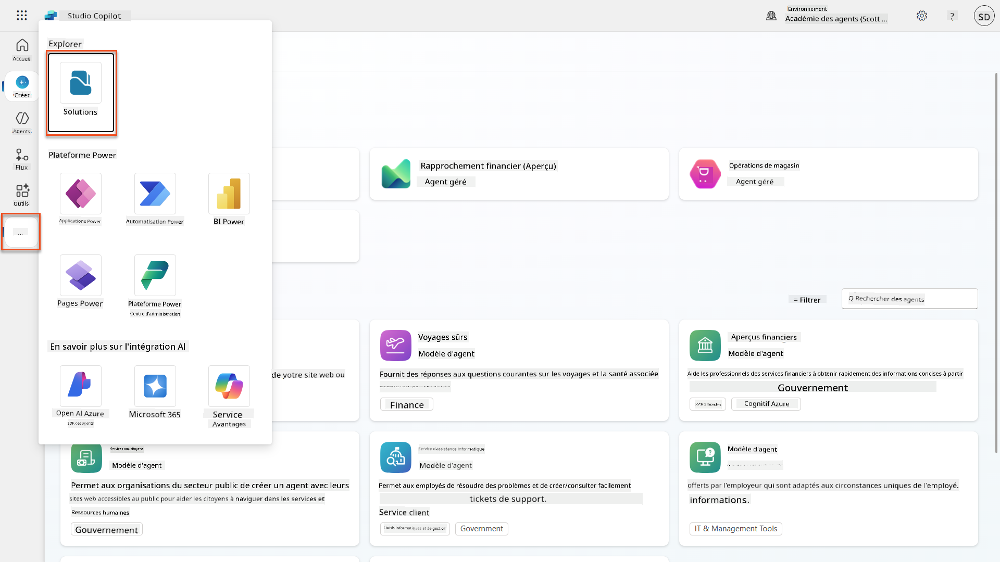
1. Localisez votre solution Opérative, sélectionnez les **trois points (...)** à côté, et choisissez **Définir comme solution préférée**. Cela garantira que tout votre travail sera ajouté à cette solution.  
    

### 2.1.2 Configurer les instructions de l'agent de recrutement

1. **Accédez** à Copilot Studio. Assurez-vous que votre environnement est sélectionné dans le **sélecteur d'environnement** en haut à droite.

1. Ouvrez votre **Agent de Recrutement** de la Mission 01

1. Sélectionnez **Modifier** dans la section **Instructions** de l'onglet **Aperçu**, et ajoutez les instructions suivantes en haut :

    ```text
    You are the central orchestrator for the hiring process. You coordinate activities, provide summaries, and delegate work to specialized agents.
    ```

1. Sélectionnez **Enregistrer**  
    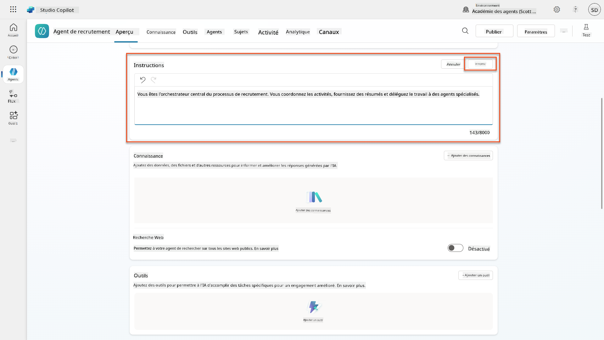

1. Sélectionnez **Paramètres** (en haut à droite)

1. Assurez-vous des paramètres suivants :

    | Paramètre | Valeur |
    |-----------|--------|
    | Utiliser l'orchestration IA générative pour les réponses de l'agent | **Oui** |
    | Modération de contenu | **Modérée** |
    | Utiliser les connaissances générales | **Désactivé** |
    | Utiliser les informations du Web | **Désactivé** |
    | Téléchargement de fichiers | **Activé** |


### 2.1.3 Ajouter l'agent enfant de Réception des Candidatures

1. **Accédez** à l'onglet **Agents** dans votre Agent de Recrutement - c'est ici que vous ajouterez des agents spécialisés.

1. Sélectionnez **+ Ajouter** puis **Créer un agent**. Notez que cela est étiqueté comme "*Créer un agent léger qui vit à l'intérieur de votre agent actuel et hérite de ses paramètres. Idéal pour décomposer une logique complexe* "  
    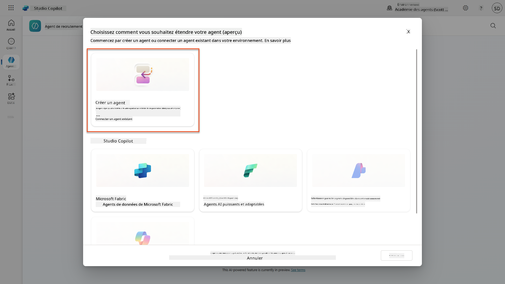

1. **Nommez** votre agent `Agent de Réception des Candidatures`

1. Sélectionnez **L'agent choisit** - Basé sur la description dans le menu déroulant **Quand cela sera-t-il utilisé ?**. Ces options sont similaires aux déclencheurs qui peuvent être configurés pour les sujets.

1. Définissez la **Description** comme suit :

    ```text
    Processes incoming resumes and stores candidates in the system
    ```

    

1. Développez **Avancé**, et définissez la priorité sur `10000`. Cela garantira que plus tard, l'Agent d'Entretien sera utilisé pour répondre aux questions générales avant celui-ci. Une condition pourrait également être définie ici, comme s'assurer qu'il y a au moins une pièce jointe.

1. Assurez-vous que le basculement **Recherche Web** est défini sur **Désactivé**. Cela est dû au fait que nous souhaitons uniquement utiliser les informations fournies par l'agent parent.

1. Sélectionnez **Enregistrer**

### 2.1.4 Configurer le flux d'agent de téléchargement de CV

Les agents ne peuvent effectuer aucune action sans outils ou sujets qui leur sont attribués.
Nous utilisons les **outils Agent Flow** plutôt que les Thèmes pour l'étape *Télécharger un CV*, car ce processus backend en plusieurs étapes nécessite une exécution déterministe et une intégration avec des systèmes externes. Bien que les Thèmes soient idéaux pour guider le dialogue conversationnel, les Agent Flows offrent l'automatisation structurée nécessaire pour gérer de manière fiable le traitement des fichiers, la validation des données et les mises à jour de la base de données (ajouter ou mettre à jour des enregistrements existants) sans dépendre de l'interaction utilisateur.

1. Localisez la section **Outils** dans la page de l'Agent de réception des candidatures.  
   **Important :** Ce n'est pas l'onglet Outils de l'agent parent, mais vous pouvez le trouver en faisant défiler vers le bas sous les instructions de l'agent enfant.

1. Sélectionnez **+ Ajouter**  
   

1. Sélectionnez **+ Nouvel outil** 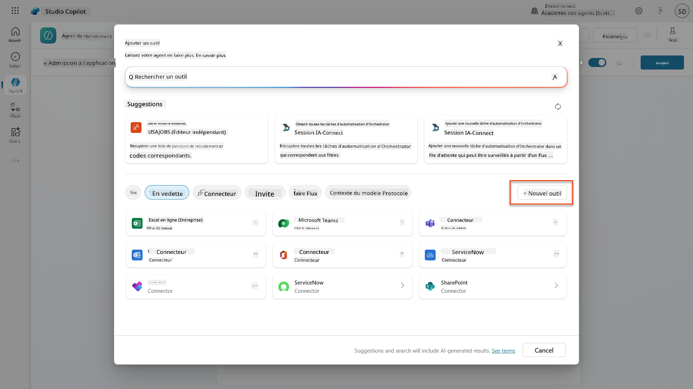

1. Sélectionnez **Agent Flow**.  
   Le concepteur Agent Flow s'ouvrira, c'est ici que nous ajouterons la logique de téléchargement de CV.  
   

1. Sélectionnez le nœud **Quand un agent appelle le flux**, et sélectionnez **+ Ajouter** une entrée pour les paramètres suivants, en veillant à ajouter à la fois le nom et la description.

    | Type  | Nom       | Description                                                                                                   |
    |-------|-----------|---------------------------------------------------------------------------------------------------------------|
    | Fichier | CV       | Le fichier PDF du CV                                                                                         |
    | Texte  | Message   | Extraire un message de style lettre de motivation du contexte. Le message doit contenir moins de 2000 caractères. |
    | Texte  | EmailUtilisateur | L'adresse e-mail d'où provient le CV. Ce sera l'utilisateur téléchargeant le CV dans le chat, ou l'adresse e-mail d'expéditeur si reçu par e-mail. |

    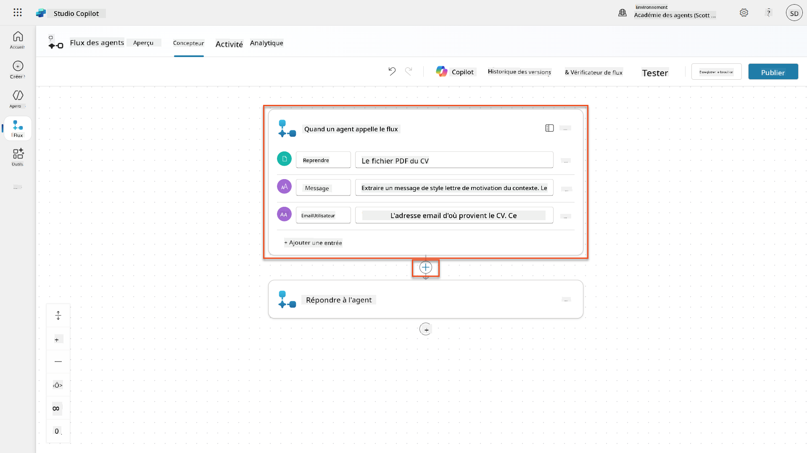

1. Sélectionnez l'**icône +** sous le nœud de déclenchement, recherchez `Dataverse`, sélectionnez **Voir plus** à côté de Microsoft Dataverse, puis sélectionnez l'action **Ajouter une nouvelle ligne** dans la section **Microsoft Dataverse**  
    

1. Nommez le nœud **Créer CV**, en sélectionnant les **trois points (...)**, puis en sélectionnant **Renommer**  
    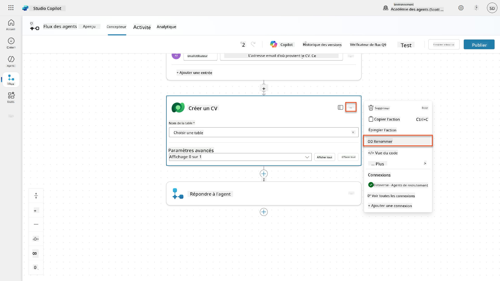

1. Définissez le **Nom de la table** sur **CVs**, puis sélectionnez **Afficher tout**, pour afficher tous les paramètres.

1. Définissez les **propriétés** suivantes :

    | Propriété                | Comment définir                 | Détails / Expression                                         |
    |--------------------------|---------------------------------|--------------------------------------------------------------|
    | **Titre du CV**          | Données dynamiques (icône éclair) | **Quand un agent appelle le flux** → **Nom du CV**    Si vous ne voyez pas le nom du CV, assurez-vous d'avoir configuré le paramètre CV ci-dessus comme type de données. |
    | **Lettre de motivation** | Expression (icône fx)            | `if(greater(length(triggerBody()?['text']), 2000), substring(triggerBody()?['text'], 0, 2000), triggerBody()?['text'])` |
    | **Adresse e-mail source**| Données dynamiques (icône éclair) | **Quand un agent appelle le flux** → **EmailUtilisateur**    |
    | **Date de téléchargement** | Expression (icône fx)            | `utcNow()`                                                   |

    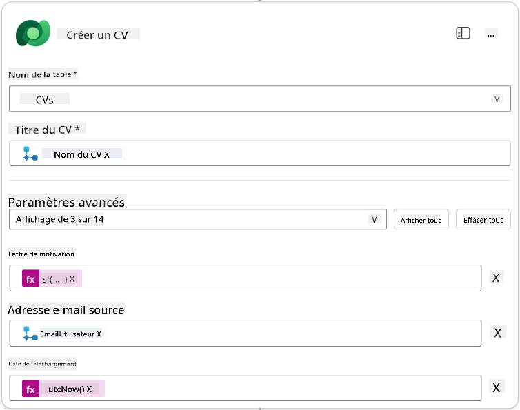

1. Sélectionnez l'**icône +** sous le nœud Créer CV, recherchez `Dataverse`, sélectionnez **Voir plus** à côté de Microsoft Dataverse, puis sélectionnez l'action **Télécharger un fichier ou une image**.  
   **Important :** Assurez-vous de ne pas sélectionner l'action Télécharger un fichier ou une image dans l'environnement sélectionné.

1. Nommez le nœud **Télécharger le fichier CV**, en sélectionnant les **trois points (...)**, puis en sélectionnant **Renommer**

1. Définissez les **propriétés** suivantes :

     | Propriété | Comment définir | Détails |
     |-----------|-----------------|---------|
     | **Nom du contenu** | Données dynamiques (icône éclair) | Quand un agent appelle le flux → Nom du CV |
     | **Nom de la table** | Sélectionner | CVs |
     | **ID de ligne** | Données dynamiques (icône éclair) | Créer CV → Voir plus → CV |
     | **Nom de la colonne** | Sélectionner | CV PDF |
     | **Contenu** | Données dynamiques (icône éclair) | Quand un agent appelle le flux → contentBytes du CV |

     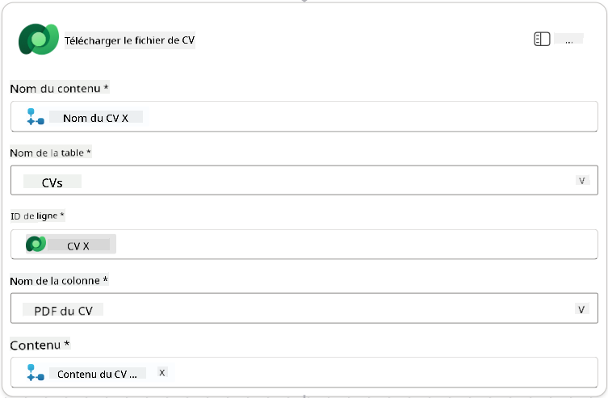

1. Sélectionnez le nœud **Répondre à l'agent**, puis sélectionnez **+ Ajouter une sortie**

     | Propriété | Comment définir | Détails |
     |-----------|-----------------|---------|
     | **Type** | Sélectionner | `Texte` |
     | **Nom** | Saisir | `NuméroCV` |
     | **Valeur** | Données dynamiques (icône éclair) | Créer CV → Voir plus → Numéro du CV |
     | **Description** | Saisir | `Le [NuméroCV] du CV créé` |

     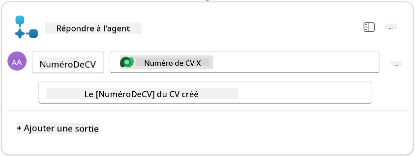

1. Sélectionnez **Enregistrer le brouillon** en haut à droite  
     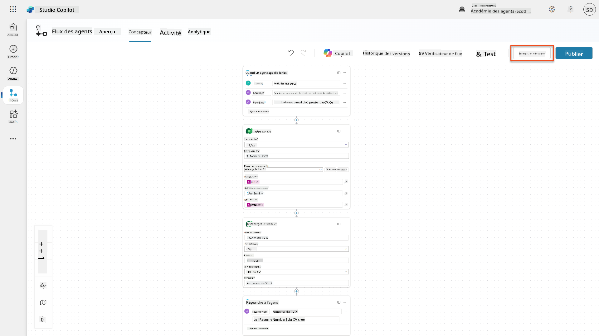

1. Sélectionnez l'onglet **Aperçu**, puis **Modifier** dans le panneau **Détails**

     1. **Nom du flux** : `Téléchargement de CV`
     1. **Description** : `Télécharge un CV sur demande`

     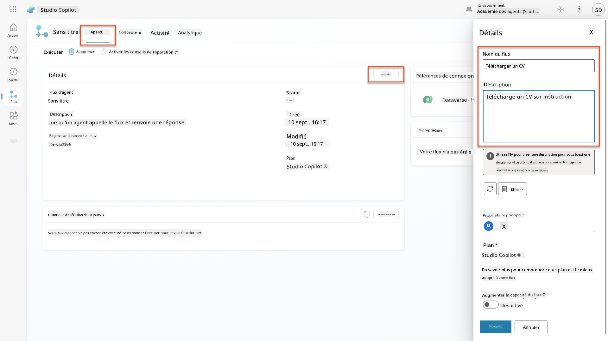

1. Sélectionnez à nouveau l'onglet **Concepteur**, puis sélectionnez **Publier**.  
     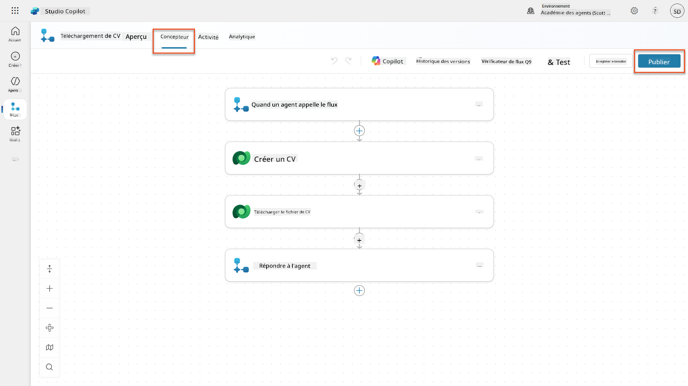

### 2.1.5 Connecter le flux à votre agent

Vous allez maintenant connecter le flux publié à votre Agent de réception des candidatures.

1. Retournez à l'**Agent de recrutement** et sélectionnez l'onglet **Agents**. Ouvrez l'**Agent de réception des candidatures**, puis localisez le panneau **Outils**.  
    

1. Sélectionnez **+ Ajouter**

1. Sélectionnez le filtre **Flux**, et recherchez `Téléchargement de CV`. Sélectionnez le flux **Téléchargement de CV**, puis **Ajouter et configurer**.

1. Définissez les paramètres suivants :

    | Paramètre | Valeur |
    |-----------|-------|
    | **Description** | `Télécharge un CV sur demande. RÈGLE STRICTE : N'utiliser cet outil que lorsqu'il est mentionné sous la forme "Téléchargement de CV" et qu'il y a des pièces jointes.` |
    | **Détails supplémentaires → Quand cet outil peut être utilisé** | `uniquement lorsqu'il est mentionné par des thèmes ou des agents` |
    | **Entrées → Ajouter une entrée** | `contentBytes` |
    | **Entrées → Ajouter une entrée** | `name` |

    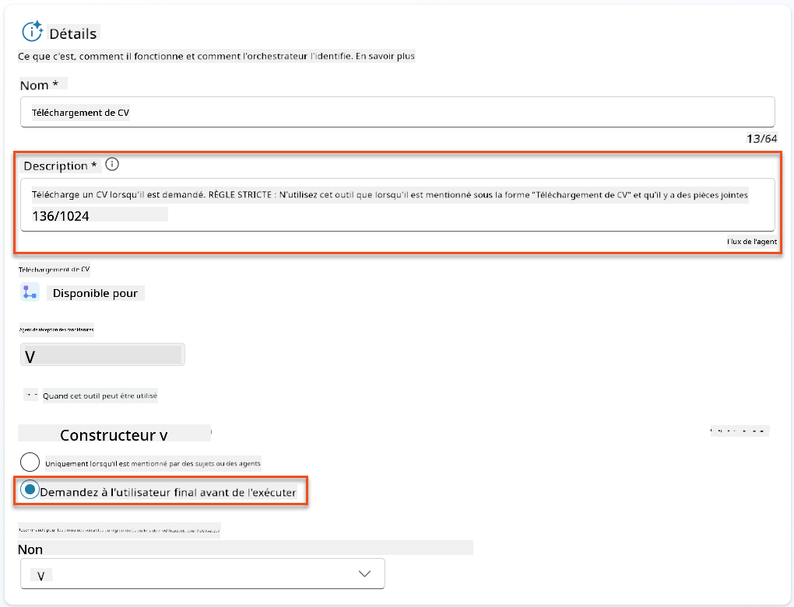

    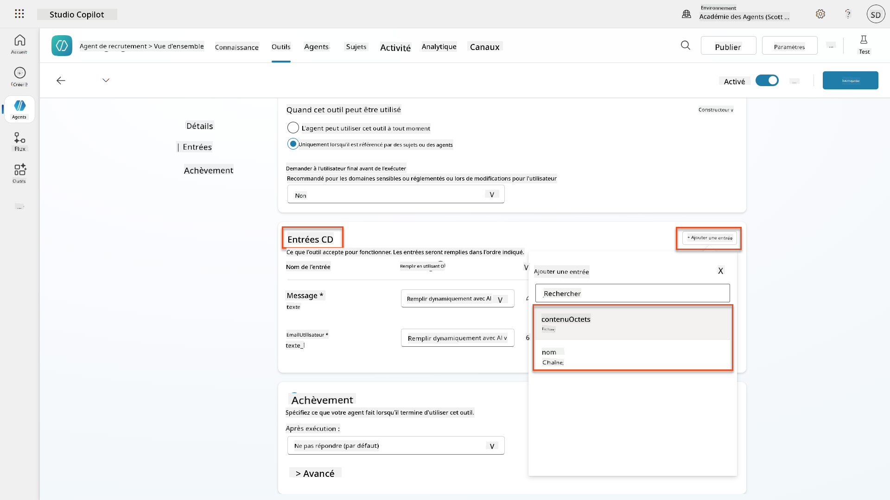

1. Ensuite, définissez les propriétés des entrées comme suit :

    | Paramètre d'entrée | Propriété | Détails |
    |---------------------|----------|---------|
    | **contentBytes** | Remplir avec | Valeur personnalisée |
    |                  | Valeur (...→Formule→Insérer) | `First(System.Activity.Attachments).Content` |
    | **name** | Remplir avec | Valeur personnalisée |
    |          | Valeur (...→Formule→Insérer) | `First(System.Activity.Attachments).Name` |
    | **Message** | Personnaliser | Configurer les paramètres personnalisés |
    |             | Description | `Extraire un message de style lettre de motivation du contexte. Veillez à ne jamais demander à l'utilisateur et à créer au moins une lettre de motivation minimale à partir du contexte disponible. RÈGLE STRICTE - le message doit contenir moins de 2000 caractères.` |
    |             | Combien de relances | Ne pas répéter |
    |             | Action si aucune entité trouvée | Définir la variable sur une valeur |
    |             | Valeur par défaut de l'entité | Téléchargement de CV |
    | **EmailUtilisateur** | Remplir avec | Valeur personnalisée |
    |  | Valeur (...→Formule→Insérer) | `System.User.Email` |

    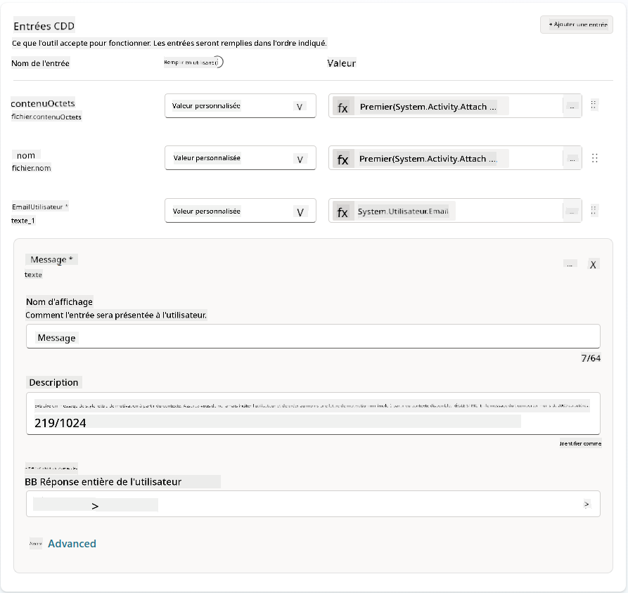

1. Sélectionnez **Enregistrer**

### 2.1.6 Définir les instructions de l'agent

1. Revenez à l'**Agent de réception des candidatures** en sélectionnant l'onglet **Agents**, puis localisez le panneau **Instructions**.

1. Dans le champ **Instructions**, collez les directives claires suivantes pour votre agent enfant :

    ```text
    You are tasked with managing incoming Resumes, Candidate information, and creating Job Applications.  
    Only use tools if the step exactly matches the defined process. Otherwise, indicate you cannot help.  
    
    Process for Resume Upload via Chat  
    1. Upload Resume  
      - Trigger only if /System.Activity.Attachments contains exactly one new resume.  
      - If more than one file, instruct the user to upload one at a time and stop.  
      - Call /Upload Resume once. Never upload more than once for the same message.  
    
    2. Post-Upload  
      - Always output the [ResumeNumber] (R#####).  
    ```

1. Là où les instructions incluent une barre oblique (/), sélectionnez le texte suivant la barre oblique et sélectionnez le nom résolu. Faites cela pour :

    - `System.Activity.Attachments` (Variable)
    - `Téléchargement de CV` (Outil)

    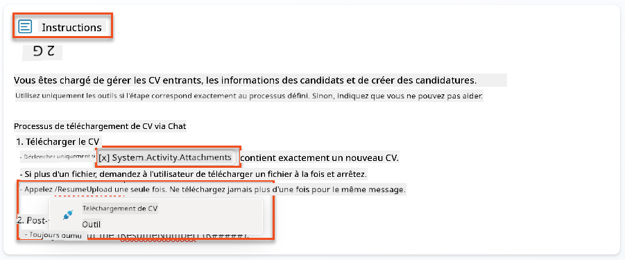

1. Sélectionnez **Enregistrer**

### 2.1.7 Tester votre Agent de réception des candidatures

Vérifions maintenant que votre premier membre de l'orchestre fonctionne correctement.

1. **Téléchargez** les [CVs de test.](https://download-directory.github.io/?url=https://github.com/microsoft/agent-academy/tree/main/operative/sample-data/resumes&filename=operative_sampledata)

1. **Activez** le panneau de test en sélectionnant **Test**.

1. **Téléchargez** deux CVs dans le chat de test, et donnez le message `Traitez ces CVs`

    - L'agent devrait retourner un message similaire à *Un seul CV peut être téléchargé à la fois. Veuillez télécharger un CV pour continuer.*

    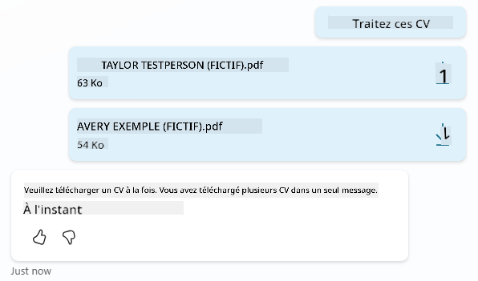

1. Essayez de télécharger **un seul CV**, avec le message `Traitez ce CV`

    - L'agent devrait alors donner un message similaire à *Le CV de Avery Exemple a été téléchargé avec succès. Le numéro du CV est R10026.*

1. Dans la **carte d'activité**, vous devriez voir l'**Agent de réception des candidatures** gérer le téléchargement du CV.  
    

1. Accédez à make.powerapps.com → Assurez-vous que votre environnement est sélectionné dans le sélecteur d'environnement en haut à droite.

1. Sélectionnez **Apps** → Hiring Hub → menu à trois points (...) → **Jouer**  
    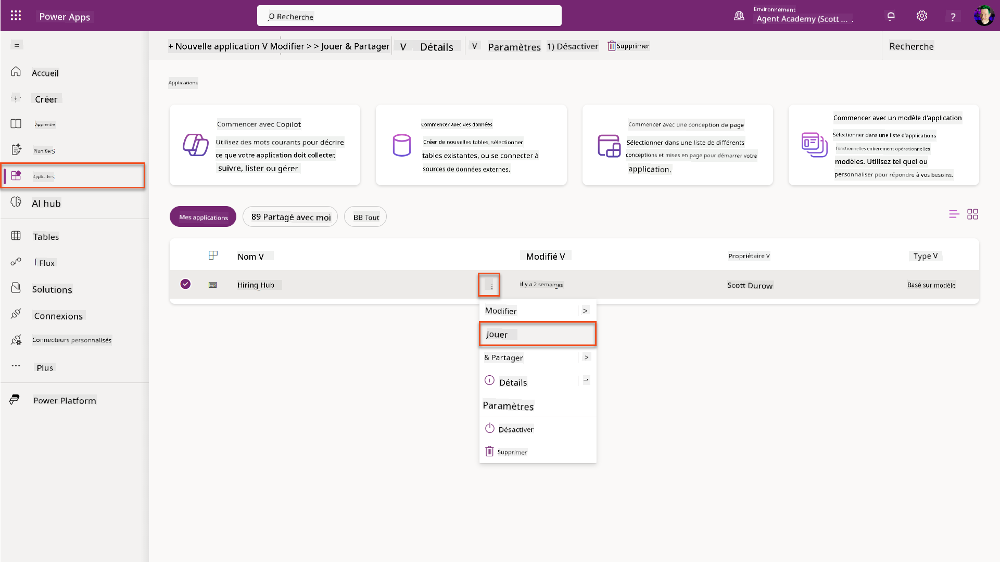

    Remarque : Si le bouton de lecture est grisé, cela signifie que vous n'avez pas publié votre solution depuis la Mission 01. Sélectionnez **Solutions** → **Publier toutes les personnalisations**.

1. Accédez à **CVs**, et vérifiez que le fichier du CV est téléchargé et que la lettre de motivation est configurée en conséquence.  
    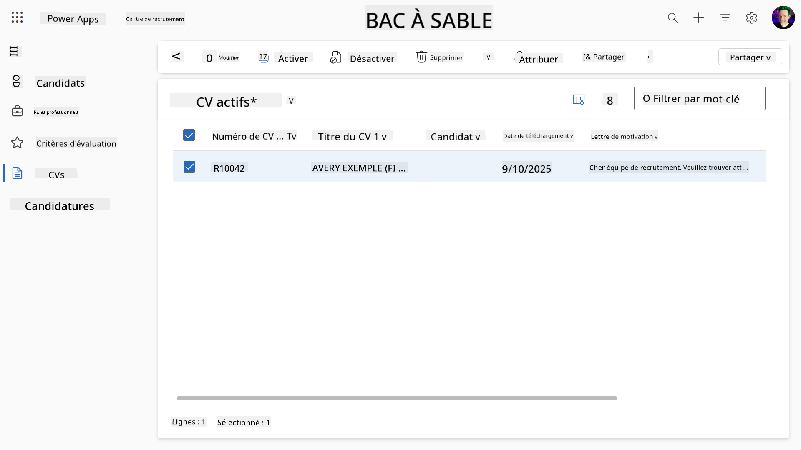

## 🧪Lab 2.2 : Ajouter l'agent connecté de préparation à l'entretien

Créons maintenant notre agent connecté pour la préparation à l'entretien et ajoutons-le à votre Agent de recrutement existant.

### 2.2.1 Créer l'agent connecté de préparation à l'entretien

1. **Accédez** à Copilot Studio. Assurez-vous que votre environnement est toujours sélectionné dans le sélecteur d'environnement en haut à droite.

1. Ouvrez votre **Agent de recrutement**

1. Accédez à l'onglet Agent, et sélectionnez **+ Ajouter un agent**

1. Sélectionnez **Connecter un agent existant** → **Copilot Studio**

1. Sélectionnez **+ Nouvel agent**

### 2.2.2 Configurer les paramètres de base

1. Sélectionnez l'onglet **Configurer**, et entrez les propriétés suivantes :

    - **Nom** : `Agent d'entretien`
    - **Description** : `Aide au processus d'entretien.`

1. Instructions :

    ```text
    You are the Interview Agent. You help interviewers and hiring managers prepare for interviews. You never contact candidates. 
    Use Knowledge to help with interview preparation. 
    
    The only valid identifiers are:
      - ResumeNumber (ppa_resumenumber)→ format R#####
      - CandidateNumber (ppa_candidatenumber)→ format C#####
      - ApplicationNumber (ppa_applicationnumber)→ format A#####
      - JobRoleNumber (ppa_jobrolenumber)→ format J#####
    
    Examples you handle
      - Give me a summary of ...
      - Help me prepare to interview candidates for the Power Platform Developer role
      - Create interview assistance for the candidates for Power Platform Developer
      - Give targeted questions for Candidate Alex Johnson focusing on the criteria for the Job Application
      
    How to work:
        You are expected to ask clarification questions if required information for queries is not provided
        - If asked for interview help without providing a job role, ask for it
        - If asking for interview questions, ask for the candidate and job role if not provided.
    
    General behavior
    - Do not invent or guess facts
    - Be concise, professional, and evidence-based
    - Map strengths and risks to the highest-weight criteria
    - If data is missing (e.g., no resume), state what is missing and ask for clarification
    - Never address or message a candidate
    ```

1. Basculez **Recherche Web** sur **Désactivé**

1. Sélectionnez **Créer**  
    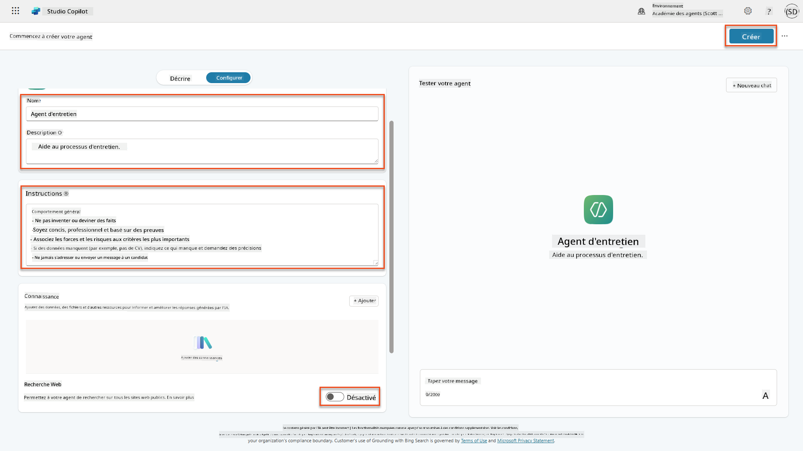

### 2.2.3 Configurer l'accès aux données et publier

1. Dans la section **Connaissances**, sélectionnez **+ Ajouter des connaissances**  
    
1. Sélectionnez **Dataverse**  
    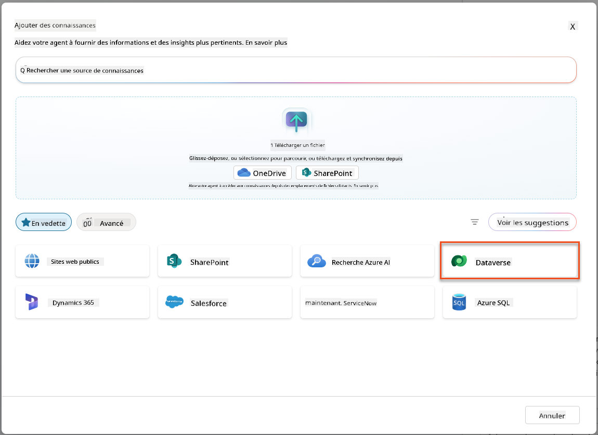
1. Dans la **boîte de recherche**, tapez `ppa_`. C'est le préfixe des tables que vous avez importées précédemment.
1. **Sélectionnez** les 5 tables (Candidat, Critères d'évaluation, Candidature, Rôle, CV)
1. Sélectionnez **Ajouter à l'agent**  
    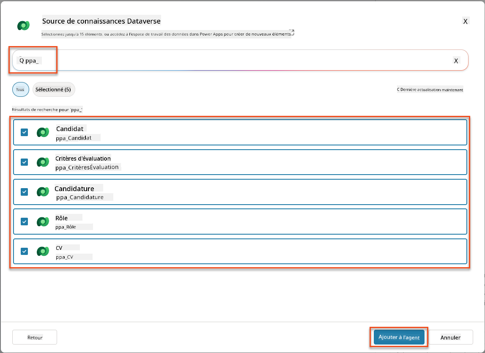
1. Sélectionnez les **Paramètres**, sur l'Agent d'entretien, et définissez les paramètres suivants :

    - **Permettre à d'autres agents de se connecter et d'utiliser celui-ci :** `Activé`
    - **Utiliser des connaissances générales :** `Désactivé`
    - **Téléchargements de fichiers :** `Désactivé`
    - **Niveau de modération de contenu :** `Moyen`
1. Sélectionnez **Enregistrer**
1. Sélectionnez **Publier**, et attendez que la publication soit terminée.

### 2.2.4 Connecter l'Agent de préparation à l'entretien à votre Agent de recrutement

1. Retournez à votre **Agent de recrutement**

1. Sélectionnez l'onglet **Agents**

1. Utilisez **+Ajouter un agent** → **Copilot Studio**, pour ajouter l'**Agent d'entretien**. Définissez la description comme suit :
    ```text
    Assists with the interview process and provides information about Resumes, Candidates, Job Roles, and Evaluation Criteria.
    ```

    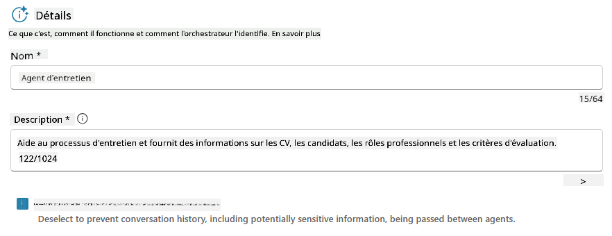
    Remarquez que l'option Transmettre l'historique de conversation à cet agent est cochée. Cela permet à l'agent parent de fournir un contexte complet à l'agent connecté.

1. Sélectionnez **Ajouter un agent**

1. Assurez-vous de voir à la fois l'**Agent de réception des candidatures** et l'**Agent d'entretien**. Notez qu'un est un agent enfant et l'autre est un agent connecté.  
    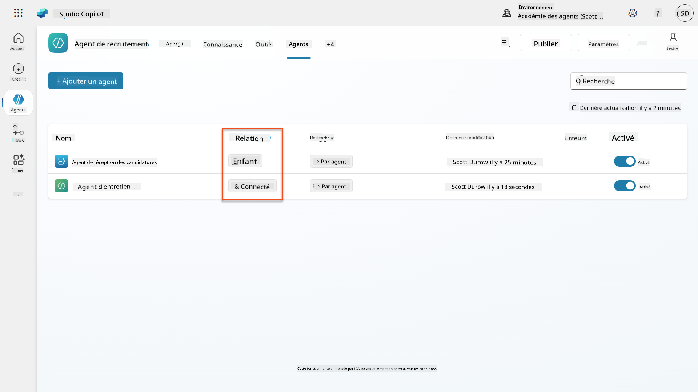

### 2.2.5 Tester la collaboration multi-agents

1. **Ouvrez** le panneau de test en sélectionnant **Tester**.

1. **Téléchargez** l'un des CV de test et entrez la description suivante qui indique à l'agent parent ce qu'il peut déléguer à l'agent connecté :

    ```text
    Upload this resume, then show me open job roles, each with a description of the evaluation criteria, then use this to match the resume to at least one suitable job role even if not a perfect match.
    ```

    

1. Remarquez comment l'Agent de recrutement a délégué le téléchargement à l'agent enfant, puis a demandé à l'Agent d'entretien de fournir un résumé et une correspondance de rôle en utilisant ses connaissances.  
   Essayez différentes façons de poser des questions sur les CV, les rôles professionnels et les critères d'évaluation.  
   **Exemples :**

    ```text
    Give me a summary of active resumes
    ```

    ```text
    Summarize resume R10044
    ```

    ```text
    Which active resumes are suitable for the Power Platform Developer role?
    ```

## 🎉 Mission accomplie

Excellent travail, Agent ! **Opération Symphony** est maintenant terminée. Vous avez réussi à transformer votre simple Agent de recrutement en une orchestre multi-agents sophistiqué avec des capacités spécialisées.

Voici ce que vous avez accompli dans cette mission :

**✅ Maîtrise de l'architecture multi-agents**  
Vous comprenez maintenant quand utiliser des agents enfants ou connectés et comment concevoir des systèmes évolutifs.

**✅ Agent enfant de réception des candidatures**  
Vous avez ajouté un agent enfant spécialisé à votre Agent de recrutement qui traite les CV, extrait les données des candidats et stocke les informations dans Dataverse.

**✅ Agent connecté de préparation à l'entretien**  
Vous avez créé un agent connecté réutilisable pour la préparation des entretiens et l'avez connecté avec succès à votre Agent de recrutement.

**✅ Communication entre agents**  
Vous avez vu comment votre agent principal peut coordonner avec des agents spécialisés, partager le contexte et orchestrer des flux de travail complexes.

**✅ Base pour l'autonomie**  
Votre système de recrutement amélioré est maintenant prêt pour les fonctionnalités avancées que nous ajouterons dans les prochaines missions : déclencheurs autonomes, modération de contenu et raisonnement approfondi.

🚀**Prochaine étape :** Dans votre prochaine mission, vous apprendrez à configurer votre agent pour traiter automatiquement les CV provenant des e-mails !

⏩[Passer à la Mission 03 : Automatisez votre agent avec des déclencheurs](../03-automate-triggers/README.md)

## 📚 Ressources tactiques

📖 [Ajouter d'autres agents (aperçu)](https://learn.microsoft.com/microsoft-copilot-studio/authoring-add-other-agents?WT.mc_id=power-182762-scottdurow)

📖 [Ajouter des outils aux agents personnalisés](https://learn.microsoft.com/microsoft-copilot-studio/advanced-plugin-actions?WT.mc_id=power-182762-scottdurow)

📖 [Travailler avec Dataverse dans Copilot Studio](https://learn.microsoft.com/microsoft-copilot-studio/knowledge-add-dataverse?WT.mc_id=power-182762-scottdurow)

📖 [Aperçu des flux d'agents](https://learn.microsoft.com/microsoft-copilot-studio/flows-overview?WT.mc_id=power-182762-scottdurow)

📖 [Créer une solution](https://learn.microsoft.com/power-platform/alm/solution-concepts-alm?WT.mc_id=power-182762-scottdurow)

📖 [Guide ALM des solutions Power Platform](https://learn.microsoft.com/power-platform/alm/overview-alm?WT.mc_id=power-182762-scottdurow)

📺 [Collaboration entre agents dans Copilot Studio](https://youtu.be/d-oD3pApHAg?si=rwIHKhJTkjSvhTHw)

---

**Avertissement** :  
Ce document a été traduit à l'aide du service de traduction automatique [Co-op Translator](https://github.com/Azure/co-op-translator). Bien que nous nous efforcions d'assurer l'exactitude, veuillez noter que les traductions automatisées peuvent contenir des erreurs ou des inexactitudes. Le document original dans sa langue d'origine doit être considéré comme la source faisant autorité. Pour des informations critiques, il est recommandé de recourir à une traduction humaine professionnelle. Nous ne sommes pas responsables des malentendus ou des interprétations erronées résultant de l'utilisation de cette traduction.