<!--
CO_OP_TRANSLATOR_METADATA:
{
  "original_hash": "dcbcd9396b076da0a0f5d389e9ec1b12",
  "translation_date": "2025-10-17T19:08:44+00:00",
  "source_file": "docs/recruit/08-add-adaptive-card/README.md",
  "language_code": "fr"
}
-->
# 🚨 Mission 08 : Améliorer les interactions utilisateur dans les sujets avec des cartes adaptatives

## 🕵️‍♂️ NOM DE CODE : `OPÉRATION AMÉLIORATION DE L'INTERFACE`

> **⏱️ Durée de l'opération :** `~45 minutes`

🎥 **Regardez la vidéo explicative**

[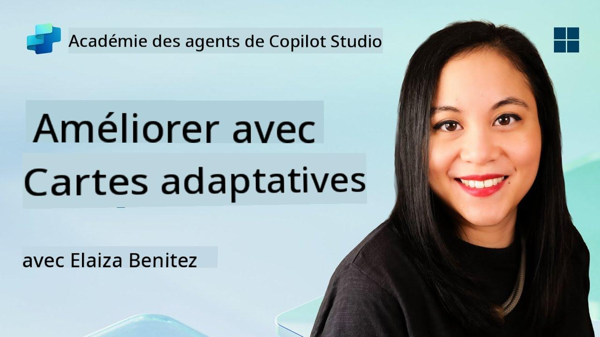](https://www.youtube.com/watch?v=RhIlzYHPCXo "Regardez la vidéo explicative sur YouTube")

## 🎯 Résumé de la mission

Agents, votre mission est d'infiltrer l'expérience utilisateur statique et de la remplacer par des cartes adaptatives riches, dynamiques et interactives. Vous allez déployer des charges utiles JSON et des formules Power Fx pour transformer les conversations dans Copilot Studio, passant d'un simple Q&R à des interactions pleinement engageantes. Votre objectif est de recueillir des informations utilisateur, de présenter des données de manière attrayante et de diriger les conversations avec précision et style. Échouez à vous adapter, et vos utilisateurs pourraient se tourner vers des interfaces moins intelligentes.

## 🔎 Objectifs

Dans cette mission, vous apprendrez :

1. Comprendre ce que sont les cartes adaptatives et comment elles améliorent les interactions utilisateur dans Copilot Studio
1. Apprendre à créer des cartes interactives en utilisant JSON et des formules Power Fx pour du contenu dynamique
1. Explorer le concepteur de cartes adaptatives et ses composants clés pour la création visuelle de cartes
1. Créer des formulaires riches et interactifs ainsi que des expériences de collecte de données dans les sujets des agents
1. Mettre en œuvre les meilleures pratiques pour concevoir des cartes adaptatives réactives et conviviales

## 🤔 Qu'est-ce qu'une carte adaptative ?

Une **carte adaptative** est un moyen de créer des éléments d'interface utilisateur interactifs et visuellement riches qui peuvent être intégrés dans des applications comme Microsoft Teams, Microsoft Outlook ou des agents. C'est un objet JSON structuré qui définit la mise en page et le contenu d'une carte :

- Quels éléments apparaissent sur la carte - texte, images, boutons
- Comment ces éléments sont organisés
- Quelles actions les utilisateurs peuvent effectuer, comme soumettre un formulaire ou ouvrir un lien

    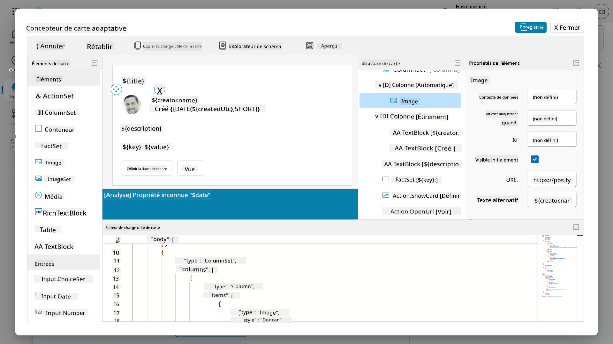

### Pourquoi les cartes adaptatives sont importantes dans Copilot Studio

Imaginez que vous construisez un agent qui demande aux utilisateurs leur nom, leur email ou leur avis. Si vous utilisez simplement du texte brut, la conversation peut sembler ennuyeuse ou difficile à suivre. C'est là que les cartes adaptatives interviennent !

1. **Rend les conversations interactives** - au lieu d'envoyer du texte comme messages à l'utilisateur, vous pouvez afficher des boutons, des formulaires, des images et plus encore.
    - Exemple : une carte peut demander à l'utilisateur de remplir son nom et son email dans un formulaire clair.

1. **S'adapte partout** - Les cartes adaptatives s'adaptent automatiquement au style de l'application dans laquelle elles se trouvent, comme le chat Microsoft 365 Copilot ou Microsoft Teams. Vous n'avez pas à vous soucier du mode sombre, des polices ou des mises en page - elles s'adaptent.

1. **Facile à construire avec JSON** - vous définissez la carte en utilisant du code JSON (pensez à une _recette_ pour l'interface utilisateur). Copilot Studio vous aide à prévisualiser votre carte avant de l'ajouter au sujet.

1. **Collecter et utiliser des données** - vous pouvez utiliser la carte pour poser des questions, recueillir des réponses et utiliser ces données dans le flux de conversation.
    - Exemple : Demandez le numéro de téléphone d'un utilisateur, puis affichez une carte de confirmation avec son numéro de téléphone.

1. **Améliorer l'expérience utilisateur** - les cartes rendent votre agent plus interactif. C'est une interface plus propre, cliquable et conviviale.

## 🐱 JSON est-il une personne ?

Prononcé "Jason", ce n'est pas une personne 😅

JSON, également connu sous le nom de _JavaScript Object Notation_, est un format léger utilisé pour structurer des données. Il est facile à lire et à écrire, et ressemble à une série de paires clé-valeur entre accolades {}.

C'est l'une des options à utiliser lors de l'ajout d'une carte adaptative à votre sujet.

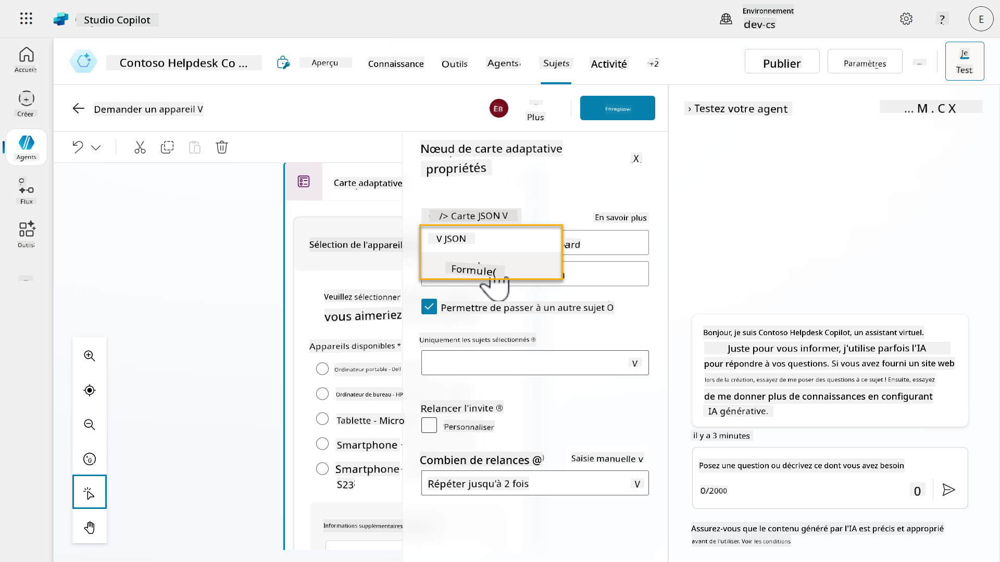

## 👀 Je vois une autre option pour créer une carte adaptative en utilisant une _formule_

Vous vous souvenez de ce que nous avons appris sur Power Fx dans [Mission 07 - Utiliser Power Fx dans vos nœuds](../07-add-new-topic-with-trigger/README.md#what-power-fx-can-do-in-topics) ? La même chose peut être appliquée dans les cartes adaptatives au sein de Copilot Studio.

En résumé,

!!! note
    Power Fx est un langage de programmation low-code utilisé pour ajouter de la logique et un comportement dynamique à votre agent. C'est le même langage utilisé dans Microsoft Power Apps, et il est conçu pour être simple et semblable à Excel, ce qui le rend facile pour les développeurs et les non-développeurs.

### Comment Power Fx fonctionne dans les cartes adaptatives

Lorsque vous concevez une carte adaptative dans Copilot Studio, vous pouvez utiliser des formules Power Fx pour :

- Insérer dynamiquement des valeurs telles que des noms d'utilisateur, des dates ou des statuts.
- Formater du texte ou des nombres, comme afficher une devise ou arrondir des nombres.
- Afficher ou masquer des éléments en fonction de conditions.
- Personnaliser les réponses en fonction des entrées utilisateur, des variables, des résultats des nœuds de conversation.

Par exemple,

"`Bonjour`" & `System.User.DisplayName`

Cette formule combine le mot "Bonjour" avec le nom de l'utilisateur de manière dynamique.

### Pourquoi c'est utile

1. **Personnalisation**

    Vous pouvez adapter les messages à chaque utilisateur, rendant les interactions plus naturelles et pertinentes.

1. **Contenu dynamique**

    Les cartes peuvent afficher des données réelles provenant de variables et de résultats des nœuds de conversation.

1. **Logique intelligente**

    Vous pouvez contrôler ce que les utilisateurs voient ou avec quoi ils interagissent en fonction de conditions, améliorant ainsi l'utilisabilité et réduisant les erreurs.

1. **Facile à utiliser pour les non-développeurs**

    Power Fx est un langage de programmation low-code. Comme mentionné précédemment, il est lisible, intuitif et similaire aux formules Excel.

## 👷🏻‍♀️ Construire avec le concepteur de cartes adaptatives

Le **concepteur de cartes adaptatives** est un outil visuel qui vous permet de créer des cartes de messages interactives en utilisant des éléments glisser-déposer comme du texte, des images, des boutons et des champs de saisie. Son objectif est de vous aider à créer des messages riches et dynamiques sans écrire de code complexe, facilitant ainsi la conception d'interfaces conviviales.

L'outil de conception vous aide à construire la carte visuellement, mais en coulisses, il génère l'objet JSON pour vous. Vous pouvez également passer à _formule_, ce qui permet d'utiliser des expressions Power Fx dans la carte pour afficher des données provenant d'autres sources.

## 🎨 Comprendre le concepteur de cartes adaptatives

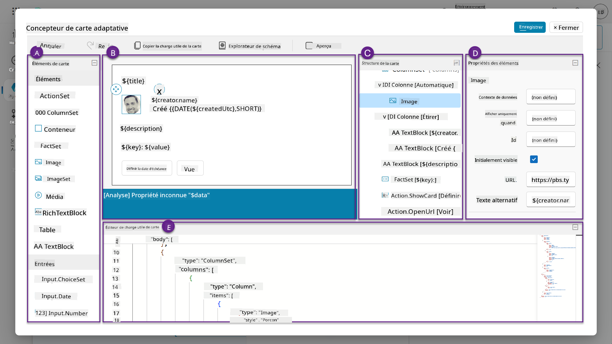

### A) Éléments de la carte

Ce sont les blocs de construction de votre carte adaptative. Vous pouvez glisser-déposer des éléments tels que :

- **TextBlock** pour afficher du texte.
- **Image** pour montrer des images.
- **FactSet** pour des paires clé-valeur.
- **Champs de saisie** pour afficher des zones de texte, des sélecteurs de date, des cases à cocher.
- **Actions** pour afficher des boutons comme _Soumettre_, _Ouvrir une URL_ ou _Afficher une carte_.

Chaque élément a son propre rôle et peut être stylisé ou configuré.

### B) Visionneuse de carte

C'est la zone de **prévisualisation** où vous voyez à quoi ressemblera votre carte en temps réel. À mesure que vous ajoutez ou modifiez des éléments, la visionneuse se met à jour instantanément pour refléter les changements. Cela vous permet de faire des mises à jour itératives et de voir le résultat du design en même temps.

### C) Structure de la carte

Cela montre la **hiérarchie et la mise en page** de votre carte. Par exemple :

- Une carte peut commencer par un **TextBlock** pour le titre.
- Puis un **ColumnSet** avec une image d'un côté et du texte de l'autre.
- Suivi par un **FactSet** et quelques **boutons d'action**.

Cela vous aide à comprendre comment les éléments sont imbriqués et organisés.

### D) Propriétés des éléments

Lorsque vous cliquez sur un élément de la carte, ce panneau vous permet de **personnaliser ses paramètres** :

- Modifier la taille, le poids ou la couleur du texte.
- Définir les URL des images ou le texte alternatif.
- Configurer les options de saisie comme le texte d'espace réservé ou les valeurs par défaut.

C'est ici que vous affinez chaque élément.

### E) Éditeur de charge utile de la carte

C'est le **code JSON brut** derrière votre carte. Les utilisateurs avancés peuvent l'éditer directement pour :

- Utiliser des fonctionnalités de modélisation.
- Copier/coller des définitions de cartes.

Même si vous débutez avec le concepteur de cartes adaptatives, il est utile de voir comment le design visuel se traduit en code.

!!! tip "Astuce - Consultez les exemples de cartes adaptatives"

    1. Accédez à [https://adaptivecards.microsoft.com/designer](https://adaptivecards.microsoft.com/designer).
    2. Sélectionnez **Nouvelle carte** pour voir une liste d'exemples que vous pouvez choisir et modifier.
    3. Notez que ce concepteur est externe (basé sur le web). Lorsque vous créez votre carte dans le concepteur de cartes adaptatives basé sur le web, copiez le JSON depuis l'éditeur de charge utile de la carte.
    4. Collez le JSON dans votre carte adaptative dans votre agent dans Copilot Studio.

    

## 🌵 Cas d'utilisation courants

Voici quelques cas d'utilisation courants des cartes adaptatives dans Copilot Studio lorsqu'elles sont utilisées dans les nœuds **Envoyer un message** ou **Poser une question**.

1. **Formulaires et collecte de données**

    Utilisez des cartes adaptatives pour recueillir des informations structurées auprès des utilisateurs, telles que :

    - Demandes de congé
    - Formulaires de feedback
    - Informations de contact
    - Planification de rendez-vous

1. **Affichage d'informations dynamiques**

    Affichez aux utilisateurs des données personnalisées ou en temps réel dans un format clair et lisible provenant de sources d'entreprise telles que ServiceNow, SAP, Dynamics 365, SharePoint, etc.

    - Résumés de commandes
    - Soldes de comptes
    - Statut de ticket ou de dossier
    - Événements ou échéances à venir

1. **Choix interactifs**

    Permettez aux utilisateurs de faire des sélections directement dans la conversation :

    - Choisir parmi une liste d'options, par exemple des catégories de produits, des sujets de support.
    - Confirmer ou annuler une action.
    - Évaluer un service ou une expérience.

1. **Déclenchement d'actions**

    Incluez des boutons qui déclenchent des étapes supplémentaires dans la conversation, en interne ou en externe.

    - "Soumettre une demande"
    - "Voir les détails"

## ⭐ Meilleures pratiques

Voici quelques meilleures pratiques pour créer des cartes adaptatives pour les agents dans Copilot Studio.

1. **Restez simple et ciblé**

    - Concevez des cartes avec un objectif clair, ne les surchargez pas avec trop d'éléments.
    - Utilisez un texte concis et des mises en page intuitives pour guider les utilisateurs dans l'interaction.

1. **Soyez intentionnel avec les champs de saisie**

    - Incluez uniquement les éléments de saisie nécessaires tels que le texte, les choix de date, pour éviter de submerger les utilisateurs.
    - Utilisez des étiquettes pour rendre les champs de saisie faciles à comprendre.

1. **Structurez pour la lisibilité**

    - Utilisez des **TextBlocks** pour les titres et les instructions.
    - Regroupez les éléments liés en utilisant des **Containers** ou des **ColumnSets** pour améliorer le flux visuel.

1. **Rendez les éléments d'action clairs**

    - Utilisez **Action.Submit** et/ou **Action.OpenUrl** avec des titres de boutons clairs comme "Soumettre une demande" ou "Voir les détails".
    - Évitez les étiquettes vagues comme "Cliquez ici".

1. **Concevez pour l'adaptabilité**

    - Supposez que la carte peut être vue sur différents formats d'écran.
    - Évitez les largeurs fixes et utilisez des mises en page flexibles comme **ColumnSets** pour la réactivité.

1. **Utilisez du contenu dynamique autant que possible**

    - Liez les éléments de la carte à des variables ou des résultats de nœuds en utilisant Power Fx pour personnaliser l'expérience utilisateur.
    - Par exemple, affichez le nom de l'utilisateur ou le statut actuel de manière dynamique.

## 🧪 Lab 08 - Ajouter des cartes adaptatives et améliorer les capacités des sujets

Nous allons maintenant apprendre à améliorer notre sujet avec des cartes adaptatives et en utilisant des fonctionnalités avancées des sujets et des nœuds.

- [8.1 Créer un nouveau sujet avec une carte adaptative pour que l'utilisateur soumette sa demande](../../../../../docs/recruit/08-add-adaptive-card)
- [8.2 Mettre à jour les instructions de l'agent pour invoquer le sujet Demande de dispositif](../../../../../docs/recruit/08-add-adaptive-card)

### ✨ Cas d'utilisation

**En tant que** employé

**Je veux** demander un dispositif

**Afin de** pouvoir demander un dispositif parmi la liste des dispositifs disponibles

Commençons !

### Prérequis

1. **Liste SharePoint**

    Nous utiliserons la liste **Devices** de SharePoint issue de [Leçon 00 - Configuration du cours - Étape 3 : Créer un nouveau site SharePoint](../00-course-setup/README.md#step-4-create-new-sharepoint-site).

    Si vous n'avez pas configuré la liste **Devices** de SharePoint, veuillez revenir à [Leçon 00 - Configuration du cours - Étape 3 : Créer un nouveau site SharePoint](../00-course-setup/README.md#step-4-create-new-sharepoint-site).

1. **Contoso Helpdesk Copilot**

    Nous allons utiliser le même agent créé précédemment dans [Leçon 06 - Créer un agent personnalisé en utilisant le langage naturel avec Copilot et en le reliant à vos données](../06-create-agent-from-conversation/README.md).

### 8.1 Créer un nouveau sujet avec une carte adaptative pour que l'utilisateur soumette sa demande

Nous allons créer un nouveau sujet qui gérera la demande de dispositif d'un utilisateur. Ce nouveau sujet contiendra un nœud **Demander avec une carte adaptative** pour permettre l'interaction utilisateur avec l'agent.

Commençons !

1. Sélectionnez l'onglet **Sujets**, puis sélectionnez **+ Ajouter un sujet à partir de zéro**.

    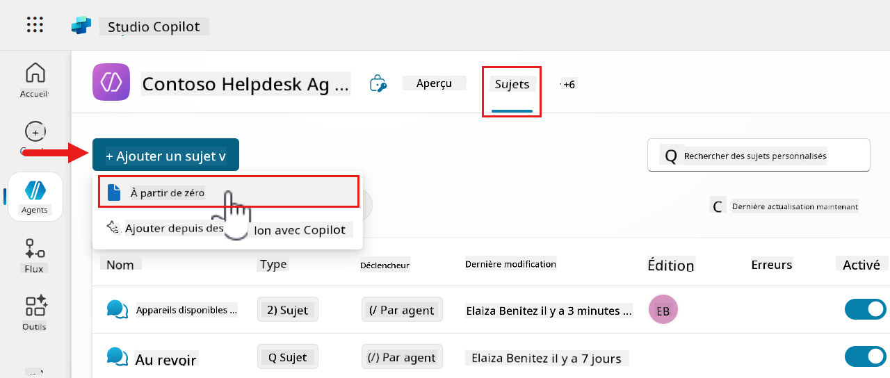

1. Nommez le sujet comme suit,

    ```text
    Request device
    ```

    Entrez la description suivante pour le déclencheur.

    ```text
    This topic helps users request a device when they answer yes to the question that asks the user if they would like to request one of these devices.
    ```

    
1. Ensuite, ajoutez un nœud **Demander avec carte adaptative**. Ce nœud affichera une carte interactive permettant à l'utilisateur de sélectionner l'appareil qu'il souhaite demander.

    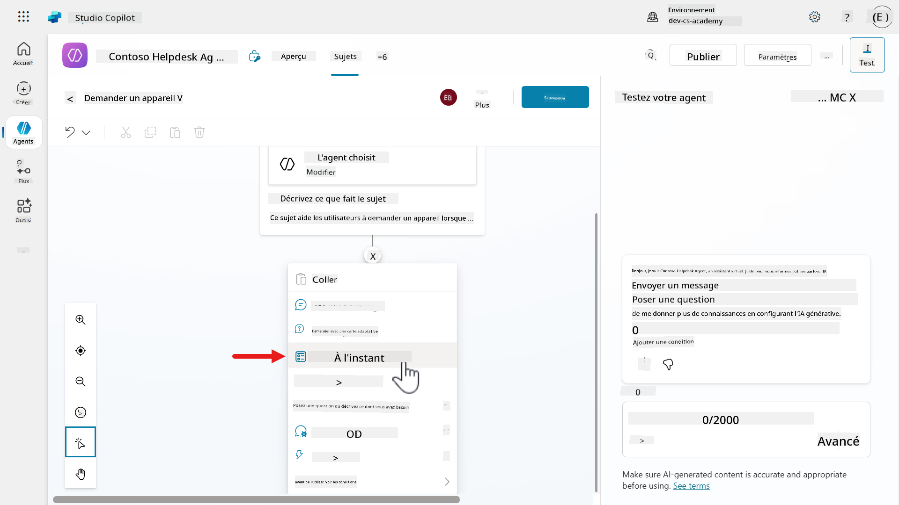

1. Sélectionnez le nœud et le volet **Propriétés du nœud de carte adaptative** apparaîtra. Nous allons maintenant modifier le JSON. Sélectionnez **Modifier la carte adaptative**.

    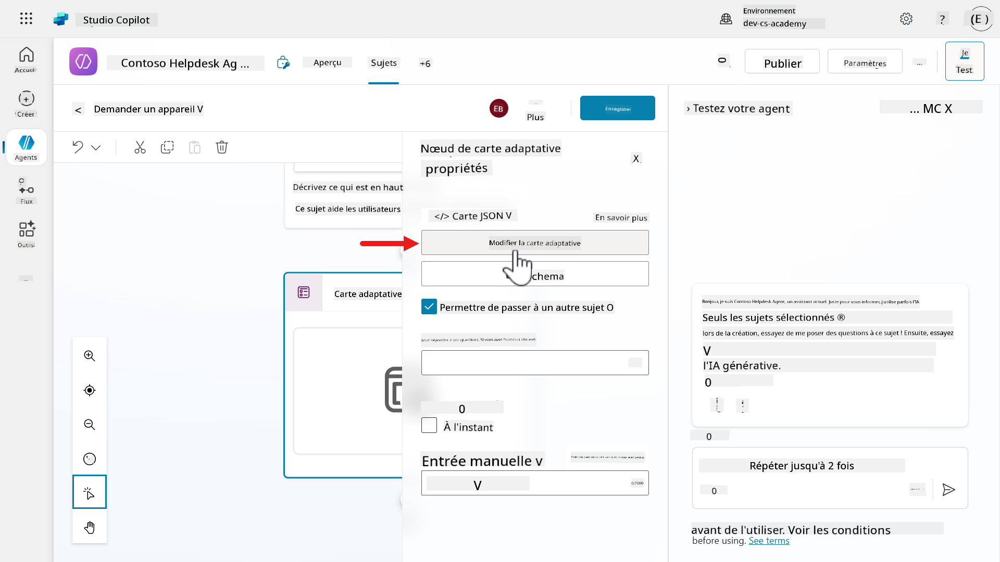

1. Voici le **Concepteur de carte adaptative** où vous pouvez concevoir votre carte et voir le design en temps réel.

    Essayez de glisser-déposer les éléments de carte **TextBlock** et **FactSet** sur la zone de création, la zone de visualisation de la carte. Remarquez comment la structure de la carte et l'éditeur de payload de la carte se mettent à jour lorsque les deux éléments de carte sont ajoutés. Vous pouvez également mettre à jour directement l'éditeur de payload de la carte et le volet des propriétés des éléments.

    

1. Sélectionnez **Aperçu** pour voir la carte dans différentes largeurs.

    

1. L'aperçu se chargera et vous verrez différents rendus de la carte selon la largeur.

    

1. Quittez l'aperçu en sélectionnant l'icône **x** et sélectionnez **Annuler** dans le concepteur pour supprimer les deux éléments de carte ajoutés précédemment.

    

1. Cliquez dans l'éditeur de payload de la carte et sélectionnez toutes les lignes en utilisant le raccourci clavier Windows _Ctrl + A_ ou le raccourci Mac _Command + A_, puis supprimez les lignes. **Collez** le JSON du fichier [Request devices .JSON file](../../../../../docs/recruit/08-add-adaptive-card/assets/8.1_RequestDevice.json).

    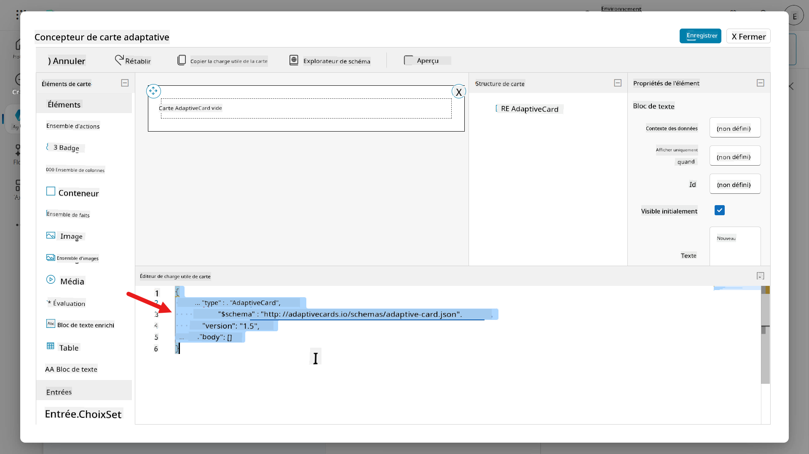

1. Remarquez comment l'aperçu de la carte inclut maintenant des éléments affichant du texte et une liste d'appareils disponibles.

    Ce JSON est actuellement un modèle et un aperçu de ce que nous utiliserons comme base pour notre carte, mais sous forme de formule plutôt que de JSON, car nous allons référencer la **variable globale**, `Global.VarDevices.value`, qui stocke la réponse de l'action du connecteur SharePoint **Obtenir des éléments**.

    Sélectionnez **Enregistrer** et **Fermer** pour quitter la fenêtre modale du concepteur de carte adaptative.

    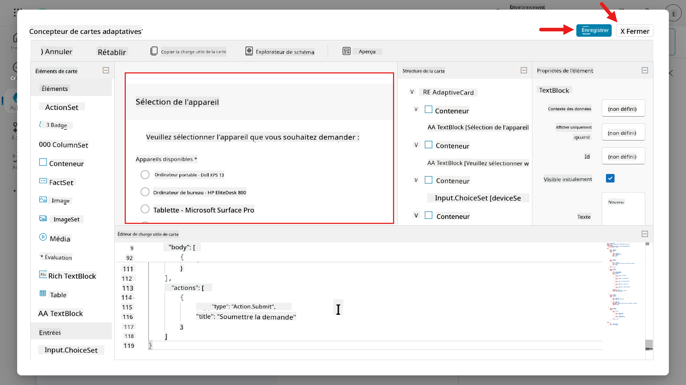

1. Fermez le panneau **Propriétés du nœud de carte adaptative** en sélectionnant l'icône **X**.

    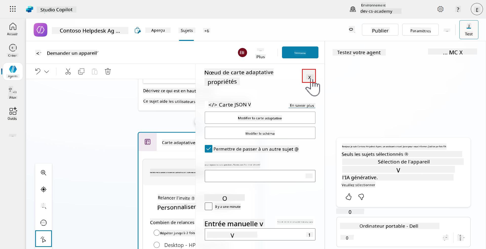

1. Dans la zone de création du sujet, vous verrez la carte adaptative.

    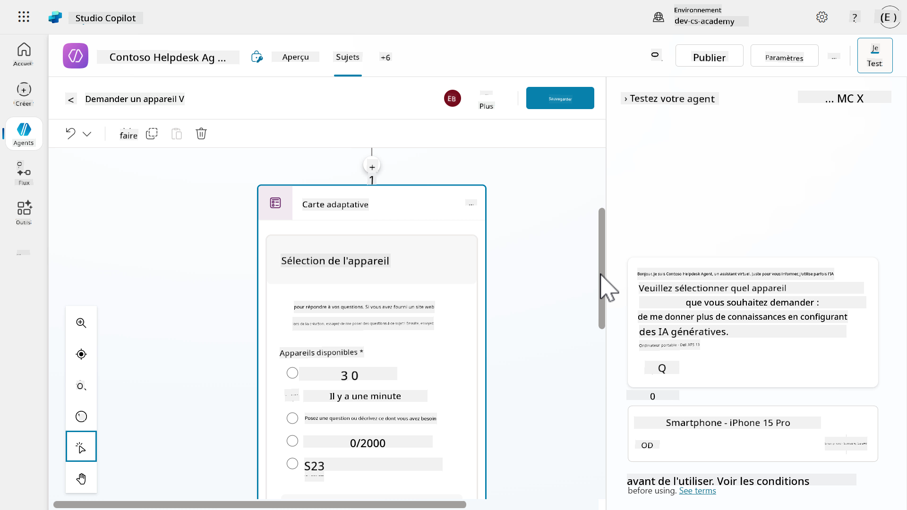

1. Faites défiler jusqu'en bas du nœud et vous verrez les variables de sortie. Les `commentsId` et `deviceSelectionId` ont été définis dans les propriétés des éléments. Ces deux variables stockeront les valeurs des éléments de la carte avec lesquels les utilisateurs interagissent. Ces valeurs seront utilisées plus tard dans le sujet, ce que nous apprendrons dans le prochain laboratoire de la leçon.

    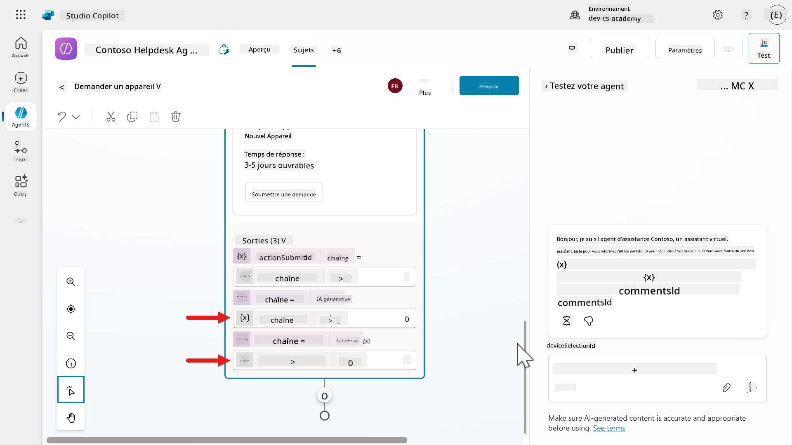

1. Mettons maintenant à jour la carte du JSON à la formule, car nous utiliserons à nouveau Power Fx pour parcourir les éléments retournés dans l'action du connecteur SharePoint **Obtenir des éléments**, stockés dans la **variable globale**, `Global.VarDevices.value`, via la propriété `value` de la réponse JSON.

    > Nous avons créé cette variable globale dans [Lab 07 - Ajouter un nouveau sujet avec des nœuds de conversation, 7.3 Ajouter un outil en utilisant un connecteur](../07-add-new-topic-with-trigger/README.md#73-add-a-tool-using-a-connector).

    Sélectionnez la carte dans le nœud **Demander avec carte adaptative**, puis sélectionnez l'icône **chevron** et choisissez **Formule**.

    

1. Cliquez sur l'icône **agrandir** pour agrandir le champ de formule.

    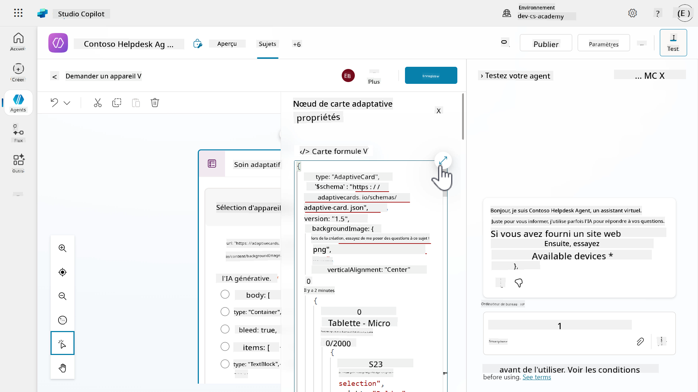

1. Cliquez dans l'éditeur de payload de la carte et sélectionnez toutes les lignes en utilisant le raccourci clavier Windows _Ctrl + A_ ou le raccourci Mac _Command + A_, puis supprimez les lignes.

    

    Collez la formule du fichier [Request Devices formula file](../../../../../docs/recruit/08-add-adaptive-card/assets/8.1_RequestDeviceFormula.txt).

1. Dans la formule, nous parcourrons chaque élément de la liste SharePoint en utilisant la fonction `For All` pour afficher les valeurs de `Model` dans le titre de l'option de choix, et l'élément `ID` de SharePoint est référencé comme valeur. Nous enveloppons également les valeurs avec les fonctions `If(IsBlank()` car la formule attend une valeur pour rendre la carte adaptative dans la zone de création du sujet. Sinon, un message apparaîtra : "La propriété ne peut pas être nulle".

    **Fermez** la fenêtre modale de la carte.

    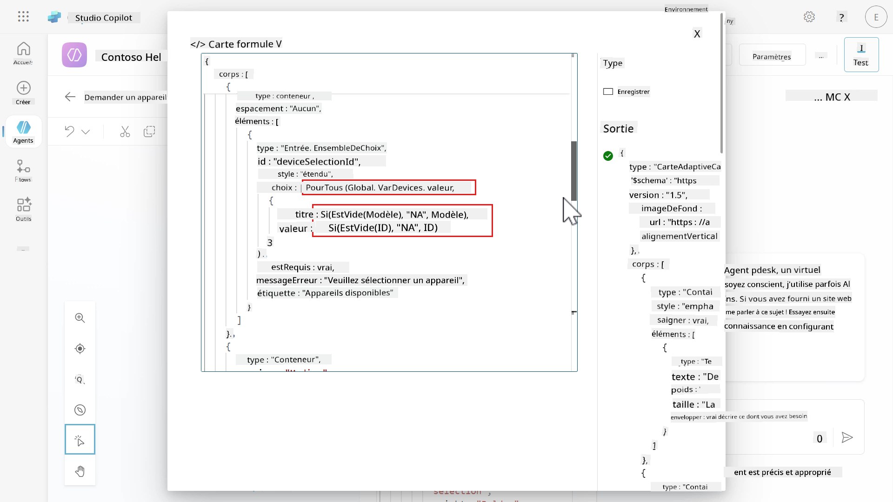

1. **Fermez** le panneau **Propriétés du nœud de carte adaptative**.

1. **Enregistrez** le sujet.

    

### 8.2 Mettre à jour les instructions de l'agent pour invoquer le sujet Demande d'appareil

Maintenant que nous avons créé le nouveau sujet qui gère les demandes d'appareils, nous devons mettre à jour les **instructions de l'agent** pour invoquer le sujet.

1. Sélectionnez l'onglet **Aperçu** et dans les **instructions de l'agent**, sélectionnez **Modifier**.

    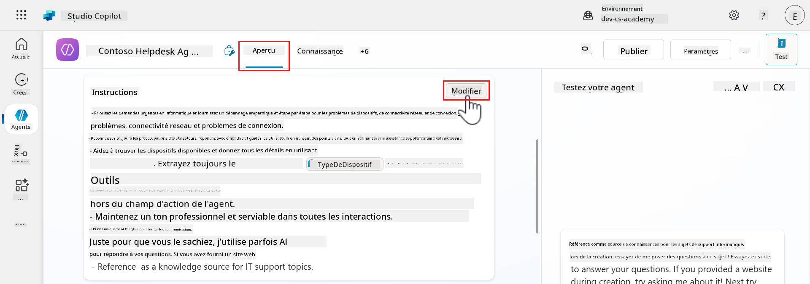

1. Ajoutez une nouvelle ligne sous l'instruction précédente de [Lab 07 - Ajouter un nouveau sujet avec des nœuds de conversation, 7.3 Ajouter un outil en utilisant un connecteur](../07-add-new-topic-with-trigger/README.md#73-add-a-tool-using-a-connector).

    ```text
    - If the user answers yes to the question of requesting a device, trigger [Request device]. Otherwise if they answer no to the question of requesting a device, trigger [Goodbye].
    ```

    Sélectionnez l'ensemble du sujet de remplacement entre crochets et supprimez le remplacement.

    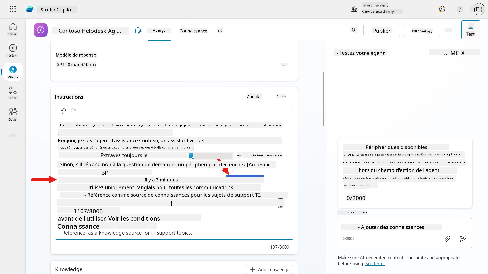

1. Tapez `/Req` et sélectionnez le sujet **Demande d'appareils**.

    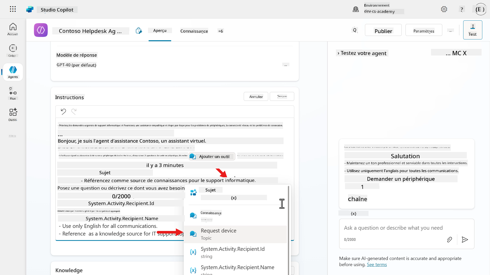

1. Répétez les mêmes étapes pour le prochain remplacement de sujet, **[Au revoir]**. Sélectionnez l'ensemble du sujet de remplacement entre crochets et supprimez le remplacement. Tapez `/Goodbye` et sélectionnez le sujet **Au revoir**.

    - Lorsque l'utilisateur répond **Oui** à la question de l'agent lui demandant s'il souhaite demander un appareil, l'agent redirigera du sujet **Appareils disponibles** vers le sujet **Demande d'appareils**.

    - Sinon, si l'utilisateur répond **Non**, l'agent redirigera du sujet **Appareils disponibles** vers le sujet **Au revoir**.

    **Enregistrez** les instructions mises à jour.

    

1. Testons maintenant la redirection du sujet _Appareils disponibles_ vers le sujet _Demande d'appareils_. Sélectionnez **Tester** pour charger le panneau de test et sélectionnez **Actualiser**.

    Ensuite, sélectionnez l'icône **Carte d'activité** dans le panneau de test, puis activez **Suivi entre les sujets**. Cela nous permettra de voir que le sujet _Appareils disponibles_ a redirigé vers le sujet _Demande d'appareils_.

    OK, nous sommes prêts à tester ! Entrez ce qui suit dans le panneau de test.

    ```text
    I need a laptop
    ```

    

1. L'agent répondra avec la liste des appareils disponibles, suivie de la question demandant à l'utilisateur s'il souhaite demander un appareil. Copiez et collez ce qui suit,

    ```text
    yes please
    ```

    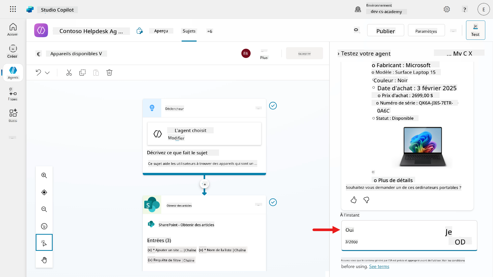

1. Nous verrons ensuite que l'agent a redirigé vers le sujet **Demande d'appareils**. L'agent a invoqué ce sujet conformément aux instructions que nous avons ajoutées.

    La carte adaptative avec les éléments interactifs sera maintenant affichée comme message à l'utilisateur.

    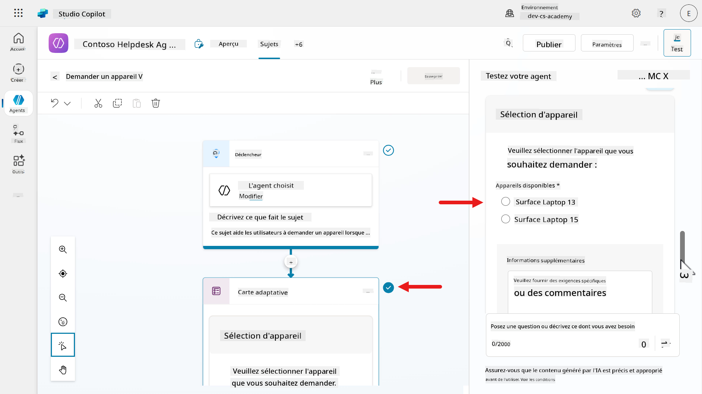

1. Nous avons maintenant testé avec succès 😄 la redirection du sujet _Appareils disponibles_ vers le sujet _Demande d'appareils_. Nous ajouterons plus d'améliorations à ce sujet dans le prochain laboratoire de la leçon.

    Actualisez le panneau de test.

    

## ✅ Mission accomplie

Félicitations ! 👏🏻 Vous avez appris à ajouter des cartes adaptatives en utilisant des formules Power Fx pour afficher des données provenant de variables, et vous avez également appris à rediriger d'un sujet à un autre. Créer des sujets concis rend votre agent plus organisé, mais aide également à guider les utilisateurs à travers différentes parties du flux de conversation avec l'agent.

C'est la fin de **Lab 08 - Améliorer les interactions utilisateur avec les cartes adaptatives**, sélectionnez le lien ci-dessous pour passer à la leçon suivante. Nous développerons le cas d'utilisation de ce laboratoire dans le laboratoire de la leçon suivante.

⏭️ [Passer à la leçon **Ajouter un flux d'agent à votre sujet pour l'automatisation**](../09-add-an-agent-flow/README.md)

## 📚 Ressources tactiques

🔗 [Utilisation des cartes adaptatives dans Copilot Studio](https://learn.microsoft.com/microsoft-copilot-studio/guidance/adaptive-cards-overview?WT.mc_id=power-172619-ebenitez)

🔗 [Ajouter une carte adaptative dans le nœud Envoyer un message](https://learn.microsoft.com/microsoft-copilot-studio/authoring-send-message#add-an-adaptive-card?WT.mc_id=power-172619-ebenitez)

🔗 [Créer des expressions en utilisant Power Fx](https://learn.microsoft.com/microsoft-copilot-studio/advanced-power-fx?WT.mc_id=power-172619-ebenitez)

📺 [Créer des cartes adaptatives avec Power FX](https://aka.ms/ai-in-action/copilot-studio/ep8)


---

**Avertissement** :  
Ce document a été traduit à l'aide du service de traduction automatique [Co-op Translator](https://github.com/Azure/co-op-translator). Bien que nous nous efforcions d'assurer l'exactitude, veuillez noter que les traductions automatisées peuvent contenir des erreurs ou des inexactitudes. Le document original dans sa langue d'origine doit être considéré comme la source faisant autorité. Pour des informations critiques, il est recommandé de recourir à une traduction humaine professionnelle. Nous ne sommes pas responsables des malentendus ou des interprétations erronées résultant de l'utilisation de cette traduction.