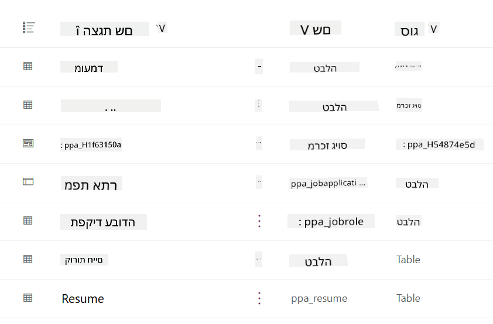
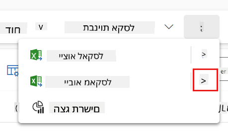

<!--
CO_OP_TRANSLATOR_METADATA:
{
  "original_hash": "2620cf9eaf09a3fc6be7fa31a3a62956",
  "translation_date": "2025-10-17T05:33:45+00:00",
  "source_file": "docs/operative-preview/01-get-started/README.md",
  "language_code": "he"
}
-->
# 🚨 משימה 01: להתחיל עם סוכן הגיוס

--8<-- "disclaimer.md"

## 🕵️‍♂️ שם קוד: `מבצע צייד כישרונות`

> **⏱️ חלון זמן למבצע:** `~45 דקות`

## 🎯 תדריך משימה

ברוך הבא, סוכן. המשימה הראשונה שלך היא **מבצע צייד כישרונות** - הקמת תשתית בסיסית למערכת גיוס מבוססת AI שתשנה את הדרך שבה ארגונים מזהים ומגייסים את הכישרונות הטובים ביותר.

המשימה שלך, אם תבחר לקבל אותה, היא לפרוס ולהגדיר מערכת ניהול גיוס מקיפה באמצעות Microsoft Copilot Studio. תייבא פתרון מוכן מראש המכיל את כל מבני הנתונים הנדרשים, ולאחר מכן תיצור את סוכן ה-AI הראשון שלך - **סוכן הגיוס** - שישמש כמתאם המרכזי לכל פעולות הגיוס העתידיות.

הפריסה הראשונית הזו מקימה את מרכז הפיקוד שתשפר במהלך תוכנית ההכשרה של האקדמיה לסוכנים. ראה זאת כבסיס הפעולה שלך - היסוד שעליו תבנה רשת שלמה של סוכנים מתמחים במשימות הבאות.

---

## 🔎 מטרות

על ידי השלמת המשימה, תוכל:

- **הבנת התרחיש**: לרכוש ידע מקיף על אתגרי פתרונות אוטומציה בגיוס
- **פריסת פתרון**: לייבא ולהגדיר בהצלחה את יסודות מערכת ניהול הגיוס
- **יצירת סוכן**: לבנות סוכן גיוס שיהווה את תחילת התרחיש שתבנה כסוכן באקדמיה

---

## 🔍 דרישות מקדימות

לפני שתתחיל במשימה זו, ודא שיש לך:

- רישיון ל-Copilot Studio
- גישה לסביבת Microsoft Power Platform
- הרשאות ניהול ליצירת פתרונות וסוכנים

---

## 🏢 הבנת תרחיש האוטומציה בגיוס

התרחיש הזה מדגים כיצד חברה יכולה להשתמש ב-Microsoft Copilot Studio כדי לשפר ולייעל את תהליך הגיוס שלה. הוא מציג מערכת של סוכנים שעובדים יחד כדי לטפל במשימות כמו סקירת קורות חיים, המלצה על תפקידים, הכנת חומרי ראיונות והערכת מועמדים.

### ערך עסקי

הפתרון עוזר לצוותי HR לחסוך זמן ולקבל החלטות טובות יותר על ידי:

- עיבוד אוטומטי של קורות חיים שהתקבלו דרך דוא"ל.
- המלצה על תפקידים מתאימים בהתבסס על פרופיל המועמד.
- יצירת בקשות עבודה ומדריכי ראיונות מותאמים לכל מועמד.
- הבטחת תהליכי גיוס הוגנים ותואמים באמצעות תכונות בטיחות ובקרה מובנות.
- איסוף משוב לשיפור הפתרון.

### איך זה עובד

- **סוכן הגיוס** המרכזי מתאם את התהליך ושומר נתונים ב-Microsoft Dataverse.
- **סוכן קליטת בקשות** קורא קורות חיים ויוצר בקשות עבודה.
- **סוכן הכנת ראיונות** מייצר שאלות ומסמכים לראיונות בהתבסס על הרקע של המועמד.
- המערכת יכולה להתפרסם באתר הדגמה, מה שמאפשר לבעלי עניין לתקשר איתה.

התרחיש הזה אידיאלי עבור ארגונים שמחפשים לחדש את תהליכי הגיוס שלהם באמצעות אוטומציה מבוססת AI, תוך שמירה על שקיפות, הוגנות ויעילות.

---

## 🧪 מעבדה: הגדרת סוכן הגיוס

במעבדה זו, תקים את הבסיס למערכת האוטומציה בגיוס שלך. תתחיל בייבוא פתרון מוגדר מראש שמכיל את כל טבלאות Dataverse ומבני הנתונים הנדרשים לניהול מועמדים, תפקידים ותהליכי גיוס. לאחר מכן, תמלא את הטבלאות הללו בנתוני דוגמה שיתמכו בלמידה שלך לאורך המודול ויספקו תרחישים מציאותיים לבדיקה. לבסוף, תיצור את סוכן הגיוס ב-Copilot Studio, ותגדיר את ממשק השיחה הבסיסי שישמש כאבן הפינה לכל התכונות האחרות שתוסיף במשימות הבאות.

### 🧪 מעבדה 1.1: ייבוא פתרון

1. עבור אל **[Copilot Studio](https://copilotstudio.microsoft.com)**
1. בחר את **...** בניווט השמאלי ובחר **Solutions**
1. לחץ על כפתור **Import Solution** בראש הדף
1. **[הורד](https://raw.githubusercontent.com/microsoft/agent-academy/refs/heads/main/docs/operative-preview/01-get-started/assets/Operative_1_0_0_0.zip)** את הפתרון המוכן
1. לחץ על **Browse** ובחר את הפתרון שהורדת בשלב הקודם
1. לחץ על **Next**
1. לחץ על **Import**

!!! success
    בהצלחה, תראה הודעה ירוקה עם הטקסט הבא כשהתהליך יסתיים:  
    "Solution "Operative" imported successfully."

לאחר ייבוא הפתרון, עיין במה שייבאת על ידי בחירת שם התצוגה של הפתרון (`Operative`).



הרכיבים הבאים יובאו:

| שם תצוגה | סוג | תיאור |
|-------------|------|-------------|
| מועמד | טבלה | מידע על מועמדים |
| קריטריוני הערכה | טבלה | קריטריוני הערכה לתפקיד |
| מרכז הגיוס | אפליקציה מונחית מודל | אפליקציה לניהול תהליך הגיוס |
| מרכז הגיוס | מפת אתר | מבנה ניווט לאפליקציית מרכז הגיוס |
| בקשת עבודה | טבלה | בקשות עבודה |
| תפקיד | טבלה | תפקידים |
| קורות חיים | טבלה | קורות חיים של מועמדים |

כמשימה אחרונה למעבדה זו, לחץ על כפתור **Publish all customizations** בראש הדף.

### 🧪 מעבדה 1.2: ייבוא נתוני דוגמה

במעבדה זו, תוסיף נתוני דוגמה לחלק מהטבלאות שייבאת במעבדה 1.1.

#### הורדת הקבצים לייבוא

1. **[הורד](https://raw.githubusercontent.com/microsoft/agent-academy/refs/heads/main/docs/operative-preview/01-get-started/assets/evaluation-criteria.csv)** את קובץ ה-CSV עם קריטריוני ההערכה
1. **[הורד](https://raw.githubusercontent.com/microsoft/agent-academy/refs/heads/main/docs/operative-preview/01-get-started/assets/job-roles.csv)** את קובץ ה-CSV עם התפקידים

#### ייבוא נתוני דוגמה לתפקידים

1. חזור לפתרון שייבאת במעבדה הקודמת
1. בחר את אפליקציית **Hiring Hub** מונחית המודל על ידי סימון התיבה בשורה המתאימה
1. לחץ על כפתור **Play** בראש הדף

    !!! warning
        ייתכן שתתבקש להתחבר שוב. ודא שאתה עושה זאת. לאחר מכן, תראה את אפליקציית Hiring Hub.

1. בחר **Job Roles** בניווט השמאלי
1. לחץ על סמל **More** (שלוש נקודות מתחת זו לזו) בסרגל הפקודות
1. לחץ על **החץ הימני** ליד *Import from Excel*

    

1. לחץ על **Import from CSV**

    

1. לחץ על כפתור **Choose File**, בחר את קובץ **job-roles.csv** שהורדת ולחץ על **Open**
1. לחץ על **Next**
1. השאר את השלב הבא כפי שהוא ולחץ על **Review Mapping**

    

1. ודא שהמיפוי נכון ולחץ על **Finish Import**

    !!! info
        זה יתחיל ייבוא ותוכל לעקוב אחר ההתקדמות או לסיים את התהליך מיד על ידי לחיצה על **Done**

1. לחץ על **Done**

זה עשוי לקחת זמן מה, אך תוכל ללחוץ על כפתור **Refresh** כדי לבדוק אם הייבוא הצליח.


#### ייבוא נתוני דוגמה לקריטריוני הערכה

1. בחר **Evaluation Criteria** בניווט השמאלי
1. לחץ על סמל **More** (שלוש נקודות מתחת זו לזו) בסרגל הפקודות
1. לחץ על **החץ הימני** ליד *Import from Excel*

    

1. לחץ על **Import from CSV**

    

1. לחץ על כפתור **Choose File**, בחר את קובץ **evaluation-criteria.csv** שהורדת ולחץ על **Open**
1. לחץ על **Next**
1. השאר את השלב הבא כפי שהוא ולחץ על **Review Mapping**

    

1. כעת יש לבצע עבודה נוספת למיפוי. לחץ על סמל הזכוכית המגדלת (🔎) ליד שדה Job Role
1. ודא ש-**Job Title** נבחר כאן, ואם לא - הוסף אותו
1. לחץ על **OK**
1. ודא שהמיפוי הנותר נכון גם כן ולחץ על **Finish Import**

    !!! info
        זה יתחיל ייבוא שוב ותוכל לעקוב אחר ההתקדמות או לסיים את התהליך מיד על ידי לחיצה על **Done**

1. לחץ על **Done**

זה עשוי לקחת זמן מה, אך תוכל ללחוץ על כפתור **Refresh** כדי לבדוק אם הייבוא הצליח.


### 🧪 מעבדה 1.3: יצירת סוכן הגיוס

כעת סיימת את הגדרת הדרישות המקדימות, הגיע הזמן לעבודה האמיתית! בוא נוסיף את סוכן הגיוס שלנו תחילה!

1. עבור אל **[Copilot Studio](https://copilotstudio.microsoft.com)** וודא שאתה באותה סביבה שבה ייבאת את הפתרון והנתונים
1. בחר **Agents** בניווט השמאלי
1. לחץ על **New Agent**
1. לחץ על **Configure**
1. עבור **Name**, הזן:

    ```text
    Hiring Agent
    ```

1. עבור **Description**, הזן:

    ```text
    Central orchestrator for all hiring activities
    ```

1. לחץ על **...** ליד כפתור *Create* בפינה הימנית העליונה
1. לחץ על **Update advanced settings**
1. עבור **Solution**, בחר `Operative`
1. לחץ על **Update**
1. לחץ על **Create** בפינה הימנית העליונה

זה ייצור עבורך את סוכן הגיוס, שבו תשתמש לאורך קורס המבצע.

---

## 🎉 משימה הושלמה

משימה 01 הושלמה! כעת שלטת במיומנויות הבאות:

✅ **הבנת התרחיש**: ידע מקיף על אתגרי פתרונות אוטומציה בגיוס  
✅ **פריסת פתרון**: ייבוא והגדרת יסודות מערכת ניהול הגיוס בהצלחה  
✅ **יצירת סוכן**: יצירת סוכן גיוס שיהווה את תחילת התרחיש שתבנה כסוכן באקדמיה  

המשימה הבאה היא [משימה 02](../02-multi-agent/README.md): הפוך את הסוכן שלך למוכן לעבודה עם סוכנים מחוברים.

---

## 📚 משאבים טקטיים

📖 [Microsoft Copilot Studio - יצירת סוכן](https://learn.microsoft.com/microsoft-copilot-studio/authoring-first-bot)  
📖 [תיעוד Microsoft Dataverse](https://learn.microsoft.com/power-apps/maker/data-platform)  

---

**הצהרת אחריות**:  
מסמך זה תורגם באמצעות שירות תרגום AI [Co-op Translator](https://github.com/Azure/co-op-translator). למרות שאנו שואפים לדיוק, יש לקחת בחשבון שתרגומים אוטומטיים עשויים להכיל שגיאות או אי דיוקים. המסמך המקורי בשפתו המקורית צריך להיחשב כמקור סמכותי. עבור מידע קריטי, מומלץ להשתמש בתרגום מקצועי אנושי. אנו לא נושאים באחריות לאי הבנות או פרשנויות שגויות הנובעות משימוש בתרגום זה.