<!--
CO_OP_TRANSLATOR_METADATA:
{
  "original_hash": "4fb913dfc3bbc71506dd3602c4b8e6ed",
  "translation_date": "2025-10-17T05:21:40+00:00",
  "source_file": "docs/operative-preview/02-multi-agent/README.md",
  "language_code": "he"
}
-->
# 🚨 משימה 02: סוכנים מחוברים

--8<-- "disclaimer.md"

## 🕵️‍♂️ שם קוד: `מבצע סימפוניה`

> **⏱️ חלון זמן המבצע:** `~45 דקות`

## 🎯 תדריך משימה

ברוך שובך, סוכן. במשימה 01, בנית את סוכן הגיוס הראשי שלך - בסיס יציב לניהול תהליכי גיוס. אבל סוכן אחד יכול לעשות רק כל כך הרבה.

המשימה שלך, אם תבחר לקבל אותה, היא **מבצע סימפוניה** - להפוך את הסוכן היחיד שלך למערכת **רב-סוכנים**: צוות מתוזמר של סוכנים מומחים שעובדים יחד כדי להתמודד עם אתגרי גיוס מורכבים. תחשוב על זה כמו לשדרג ממפעיל יחיד לפיקוד על כוח משימה מיוחד.

כמו תזמורת סימפונית שבה כל מוזיקאי מנגן את חלקו בהרמוניה מושלמת, תוסיף שני מומחים קריטיים לסוכן הגיוס הקיים שלך: סוכן קליטת בקשות לעיבוד קורות חיים באופן אוטומטי, וסוכן הכנת ראיונות ליצירת חומרי ראיונות מקיפים. סוכנים אלו יעבדו יחד בצורה חלקה תחת המנצח הראשי שלך.

## 🔎 מטרות

במשימה זו תלמד:

1. מתי להשתמש ב**סוכנים משניים** לעומת **סוכנים מחוברים**
1. כיצד לעצב **ארכיטקטורות רב-סוכנים** שמסוגלות להתרחב  
1. יצירת **סוכנים משניים** למשימות ממוקדות
1. יצירת **דפוסי תקשורת** בין סוכנים
1. בניית סוכן קליטת בקשות וסוכן הכנת ראיונות

## 🧠 מה הם סוכנים מחוברים?

ב-Copilot Studio, אינך מוגבל לבניית סוכנים יחידים ומונוליטיים. אתה יכול ליצור **מערכות רב-סוכנים** - רשתות של סוכנים מומחים שעובדים יחד כדי להתמודד עם תהליכים מורכבים.

תחשוב על זה כמו ארגון בעולם האמיתי: במקום שאדם אחד יעשה הכל, יש לך מומחים שמצטיינים במשימות ספציפיות ומשתפים פעולה כשצריך.

### למה מערכות רב-סוכנים חשובות

- **יכולת התרחבות:** כל סוכן יכול להיות מפותח, נבדק ומתוחזק באופן עצמאי על ידי צוותים שונים.  
- **התמחות:** סוכנים יכולים להתמקד במה שהם עושים הכי טוב. אולי אחד לעיבוד נתונים, אחר לאינטראקציה עם משתמשים, ואחר לקבלת החלטות.  
- **גמישות:** ניתן לשלב ולהתאים סוכנים, להשתמש בהם מחדש בפרויקטים שונים ולפתח את המערכת באופן הדרגתי.  
- **תחזוקה:** שינויים בסוכן אחד לא בהכרח משפיעים על אחרים, מה שהופך את העדכונים לבטוחים וקלים יותר.

### דוגמה בעולם האמיתי: תהליך גיוס

שקול את תהליך הגיוס שלנו - סוכנים מרובים עשויים לעבוד יחד עם תחומי אחריות הבאים:

- **קליטת קורות חיים** דורשת מיומנויות עיבוד מסמכים וחילוץ נתונים
- **הערכה** כוללת הערכת קורות חיים של מועמדים והתאמתם לדרישות התפקיד
- **הכנת ראיונות** דורשת ניתוח מעמיק של התאמת המועמד  
- **תקשורת עם מועמדים** דורשת יכולות תקשורת אמפתיות

במקום לבנות סוכן ענק שמנסה להתמודד עם כל המיומנויות השונות הללו, אתה יכול ליצור סוכנים מומחים לכל תחום ולתזמר אותם יחד.

## 🔗 סוכנים משניים לעומת סוכנים מחוברים: ההבדל המרכזי

Copilot Studio מציע שתי דרכים לבנות מערכות רב-סוכנים, כל אחת עם שימושים ייחודיים:

### ↘️ סוכנים משניים

סוכנים משניים הם **מומחים קלים** שחיים בתוך הסוכן הראשי שלך. תחשוב עליהם כמו צוותים מומחים בתוך אותו מחלקה.

#### פרטים טכניים מרכזיים

- סוכנים משניים חיים בתוך הסוכן הראשי ויש להם דף הגדרות יחיד.
- כלים וידע **מאוחסנים בסוכן הראשי**, אך מוגדרים כ"זמינים עבור" הסוכן המשני.
- סוכנים משניים **משתפים את הנושאים** של הסוכן הראשי. ניתן להתייחס לנושאים בהוראות הסוכן המשני.
- סוכנים משניים **לא צריכים פרסום נפרד** - הם זמינים אוטומטית בתוך הסוכן הראשי ברגע שנוצרו. זה הופך את הבדיקה לקלה יותר מכיוון ששינויים בסוכן הראשי והמשני יכולים להתבצע ב**אותו סביבת עבודה משותפת**.

#### השתמש בסוכנים משניים כאשר

- צוות יחיד מנהל את כל הפתרון
- אתה רוצה לארגן כלים וידע באופן לוגי לתוך סוכנים משניים
- אין צורך באימות או פריסה נפרדים לכל סוכן
- הסוכנים לא יפורסמו בנפרד או ישמשו באופן עצמאי
- אין צורך להשתמש בסוכנים מחדש במספר פתרונות

**דוגמה:** סוכן תמיכה טכנית עם סוכנים משניים עבור:

- נהלי איפוס סיסמאות
- פתרון בעיות חומרה  
- מדריכי התקנת תוכנה

### 🔀 סוכנים מחוברים

סוכנים מחוברים הם **סוכנים עצמאיים ומלאים** שהסוכן הראשי שלך יכול לשתף פעולה איתם. תחשוב עליהם כמו מחלקות נפרדות שעובדות יחד על פרויקט.

#### פרטים טכניים מרכזיים

- לסוכנים מחוברים יש **נושאים משלהם** וזרימות שיחה. הם פועלים באופן עצמאי עם הגדרות, לוגיקה ומחזור חיים פרסומי משלהם.
- סוכנים מחוברים **חייבים להיות מפורסמים** לפני שניתן להוסיף אותם ולהשתמש בהם על ידי סוכנים אחרים.
- במהלך הבדיקה, שינויים בסוכן המחובר חייבים להיות מפורסמים לפני שניתן להשתמש בהם על ידי הסוכן הקורא.

#### השתמש בסוכנים מחוברים כאשר

- צוותים מרובים מפתחים ומתחזקים סוכנים שונים באופן עצמאי
- סוכנים צריכים הגדרות, אימות וערוצי פריסה משלהם
- אתה רוצה לפרסם ולתחזק סוכנים בנפרד עם ניהול מחזור חיים עצמאי לכל סוכן
- סוכנים צריכים להיות ניתנים לשימוש חוזר במספר פתרונות

**דוגמה:** מערכת שירות לקוחות שמתחברת ל:

- סוכן חיוב נפרד שמנוהל על ידי צוות הכספים
- סוכן תמיכה טכנית נפרד שמנוהל על ידי צוות המוצר
- סוכן החזרות נפרד שמנוהל על ידי צוות התפעול

!!! tip "טיפ"
    אתה יכול לשלב את שתי הגישות! לדוגמה, הסוכן הראשי שלך יכול להתחבר לסוכנים חיצוניים מצוותים אחרים תוך כדי שיש לו סוכנים משניים משלו למשימות פנימיות מיוחדות.

## 🎯 דפוסי ארכיטקטורה רב-סוכנים

בעת עיצוב מערכות רב-סוכנים, מתגלים מספר דפוסים בהתבסס על אופן האינטראקציה בין הסוכנים:

| דפוס                | תיאור                                                                 | מתאים ל                                                      |
|----------------------|-----------------------------------------------------------------------------|---------------------------------------------------------------|
| **מרכז ודוברים**    | סוכן מנצח ראשי מתאם עם מספר סוכנים מומחים. המנצח מטפל באינטראקציה עם המשתמש ומעביר משימות לסוכנים משניים או מחוברים. | תהליכים מורכבים שבהם סוכן אחד מתאם משימות מיוחדות |
| **צינור**           | סוכנים מעבירים עבודה באופן רציף מאחד לשני, כל אחד מוסיף ערך לפני המעבר לשלב הבא. | תהליכים ליניאריים כמו עיבוד בקשות (קליטה → סינון → ראיון → החלטה) |
| **שיתופי**          | סוכנים עובדים יחד בו זמנית על היבטים שונים של אותה בעיה, משתפים הקשר ותוצאות. | ניתוח מורכב הדורש מספר נקודות מבט או תחומי מומחיות |

!!! tip "טיפ"
    ייתכן שתהיה לך גם שילוב של שניים או יותר מהדפוסים הללו.

## 💬 תקשורת בין סוכנים ושיתוף הקשר

כאשר סוכנים עובדים יחד, הם צריכים לשתף מידע בצורה יעילה. הנה איך זה עובד ב-Copilot Studio:

### היסטוריית שיחה

כברירת מחדל, כאשר סוכן ראשי קורא לסוכן משני או מחובר, הוא יכול להעביר את **היסטוריית השיחה**. זה נותן לסוכן המומחה הקשר מלא לגבי מה שהמשתמש דן בו.

ניתן להשבית זאת מסיבות אבטחה או ביצועים - לדוגמה, אם הסוכן המומחה צריך רק להשלים משימה ספציפית מבלי להזדקק להקשר המלא של השיחה. זה יכול להיות הגנה טובה מפני **דליפת נתונים**.

### הוראות מפורשות

הסוכן הראשי שלך יכול לתת **הוראות ספציפיות** לסוכנים משניים או מחוברים. לדוגמה: "עבד את קורות החיים האלה וסכם את הכישורים שלהם לתפקיד מפתח בכיר."

### ערכי החזרה

סוכנים יכולים להחזיר מידע מובנה לסוכן הקורא, מה שמאפשר לסוכן הראשי להשתמש במידע זה בשלבים הבאים או לשתף אותו עם סוכנים אחרים.

### אינטגרציה עם Dataverse

למצבים מורכבים יותר, סוכנים יכולים לשתף מידע דרך **Dataverse** או מאגרי נתונים אחרים, מה שמאפשר שיתוף הקשר מתמשך בין אינטראקציות מרובות.

## ↘️ סוכן משני: סוכן קליטת בקשות

בוא נתחיל לבנות את מערכת הגיוס הרב-סוכנים שלנו. המומחה הראשון שלנו יהיה **סוכן קליטת בקשות** - סוכן משני שאחראי על עיבוד קורות חיים ומידע מועמדים נכנסים.

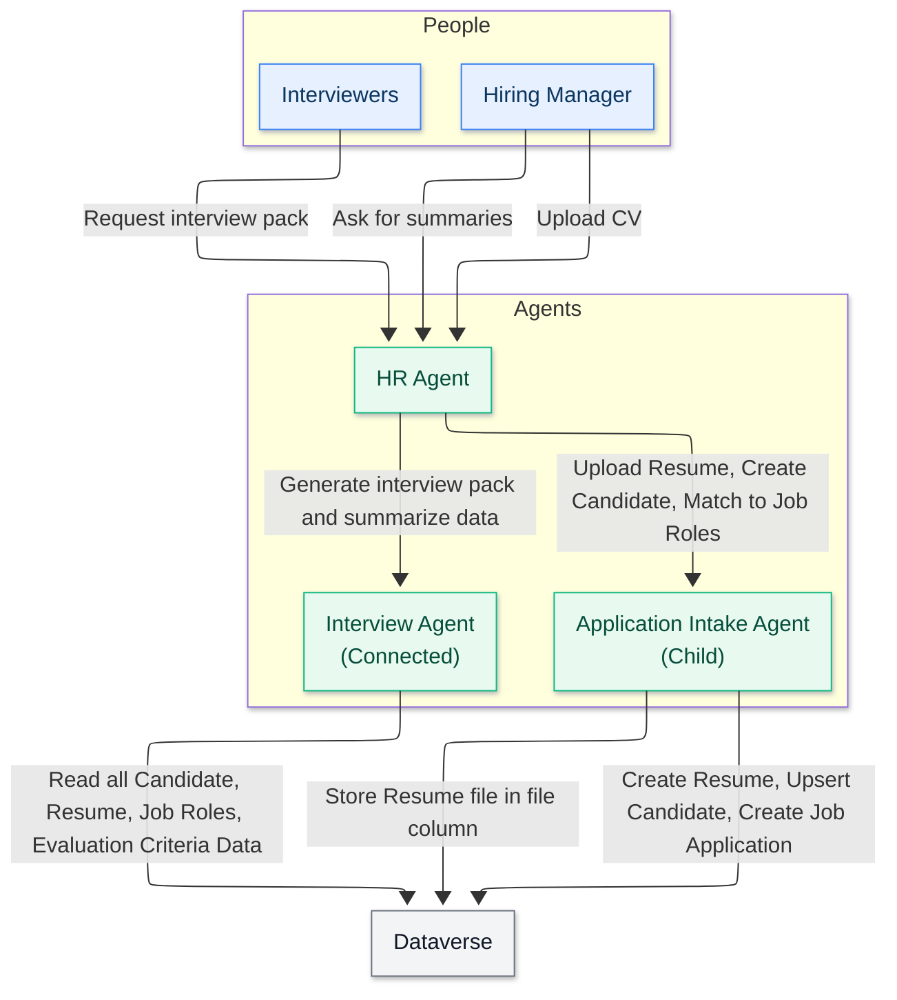
```mermaid
---
config:
  layout: elk
  look: neo
---
flowchart TB
 subgraph People["People"]
    direction TB
        HiringManager["Hiring Manager"]
        Interviewers["Interviewers"]
  end
 subgraph Agents["Agents"]
    direction LR
        ApplicationIntakeAgent["Application Intake Agent<br>(Child)"]
        InterviewAgent["Interview Agent<br>(Connected)"]
        HRAgent["HR Agent"]
  end
    HiringManager -- Upload CV --> HRAgent
    HRAgent -- Upload Resume, Create Candidate, Match to Job Roles --> ApplicationIntakeAgent
    ApplicationIntakeAgent -- Create Resume, Upsert Candidate, Create Job Application --> Dataverse["Dataverse"]
    ApplicationIntakeAgent -- Store Resume file in file column --> Dataverse
    HiringManager -- Ask for summaries --> HRAgent
    Interviewers -- Request interview pack --> HRAgent
    HRAgent -- Generate interview pack and summarize data --> InterviewAgent
    InterviewAgent -- Read all Candidate, Resume, Job Roles, Evaluation Criteria Data --> Dataverse
     HiringManager:::person
     Interviewers:::person
     ApplicationIntakeAgent:::agent
     InterviewAgent:::agent
     HRAgent:::agent
     Dataverse:::data
    classDef person fill:#e6f0ff,stroke:#3b82f6,color:#0b3660
    classDef agent fill:#e8f9ef,stroke:#10b981,color:#064e3b
    classDef data  fill:#f3f4f6,stroke:#6b7280,color:#111827
```

### 🤝 תחומי אחריות של סוכן קליטת בקשות

- **ניתוח תוכן קורות חיים** מקבצי PDF שסופקו דרך צ'אט אינטראקטיבי (במשימה עתידית תלמד כיצד לעבד קורות חיים באופן אוטונומי).
- **חילוץ נתונים מובנים** (שם, כישורים, ניסיון, השכלה)
- **התאמת מועמדים לתפקידים פתוחים** בהתבסס על כישורים ומכתב מקדים
- **אחסון מידע מועמדים** ב-Dataverse לעיבוד מאוחר יותר
- **מניעת כפילויות בקשות** כדי להימנע מיצירת אותו מועמד פעמיים, התאמה לרשומות קיימות באמצעות כתובת האימייל שחולצה מקורות החיים.

### ⭐ למה זה צריך להיות סוכן משני

סוכן קליטת הבקשות מתאים באופן מושלם כסוכן משני מכיוון ש:

- הוא מתמחה בעיבוד מסמכים וחילוץ נתונים
- אין צורך בפרסום נפרד  
- הוא חלק מפתרון הגיוס הכולל שמנוהל על ידי אותו צוות
- הוא מתמקד בהדק ספציפי (קורות חיים חדשים שהתקבלו) ומופעל מהסוכן הראשי.

## 🔀 סוכן מחובר: סוכן הכנת ראיונות  

המומחה השני שלנו יהיה **סוכן הכנת ראיונות** - סוכן מחובר שעוזר ליצור חומרי ראיונות מקיפים ומעריך תגובות מועמדים.

### 🤝 תחומי אחריות של סוכן הכנת ראיונות

- **יצירת חבילות ראיונות** עם מידע על החברה, דרישות התפקיד וקריטריוני הערכה
- **יצירת שאלות ראיונות** מותאמות לתפקידים ספציפיים ורקע מועמדים
- **מענה על שאלות כלליות** על תפקידי העבודה והבקשות לתקשורת עם בעלי עניין

### ⭐ למה זה צריך להיות סוכן מחובר

סוכן הכנת ראיונות עובד טוב יותר כסוכן מחובר מכיוון ש:

- צוות רכישת הכישרונות עשוי לרצות להשתמש בו באופן עצמאי בתהליכי גיוס מרובים
- הוא צריך בסיס ידע משלו של שיטות ראיונות וקריטריוני הערכה
- מנהלי גיוס שונים עשויים לרצות להתאים את התנהגותו לצוותים שלהם
- הוא יכול להיות בשימוש חוזר לתפקידים פנימיים, לא רק לגיוס חיצוני

## 🧪 מעבדה 2.1: הוספת סוכן קליטת הבקשות

מוכן ליישם את התיאוריה בפועל? בוא נוסיף את הסוכן המשני הראשון שלך לסוכן הגיוס הקיים שלך.

### דרישות מוקדמות להשלמת המשימה

תצטרך **או**:

- **להשלים את משימה 01** ולהכין את סוכן הגיוס שלך, **או**
- **לייבא את פתרון ההתחלה של משימה 02** אם אתה מתחיל מאפס או צריך להשלים. [הורד פתרון התחלה למשימה 02](https://aka.ms/agent-academy)

!!! note "ייבוא פתרון ונתוני דוגמה"
    אם אתה משתמש בפתרון ההתחלה, עיין ב-[משימה 01](../01-get-started/README.md) להוראות מפורטות על איך לייבא פתרונות ונתוני דוגמה לסביבתך.

### 2.1.1 הגדרת הפתרון

1. בתוך Copilot Studio, בחר את שלוש הנקודות (...) מתחת ל"כלים" בניווט השמאלי.
1. בחר **פתרונות**.  
    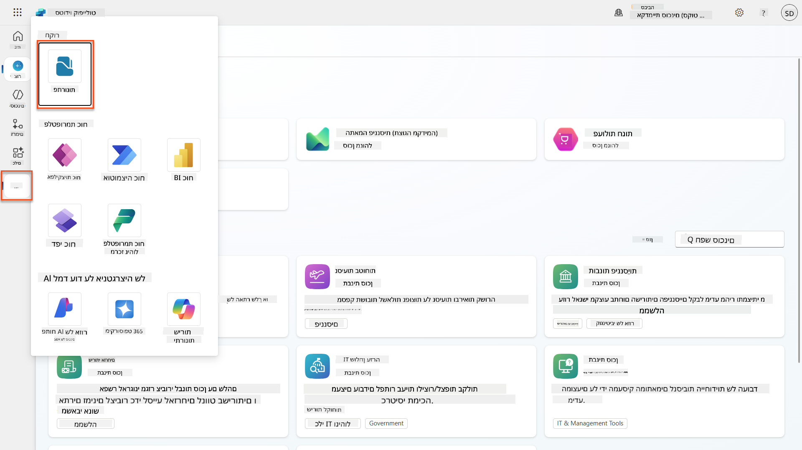
1. מצא את פתרון ה-Operative שלך, בחר את **שלוש הנקודות (...)** לידו, ובחר **הגדר פתרון מועדף**. זה יבטיח שכל העבודה שלך תתווסף לפתרון הזה.  
    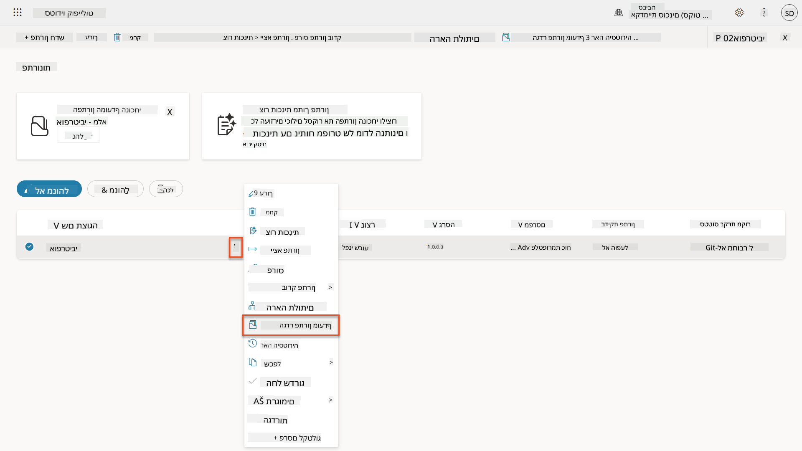

### 2.1.2 הגדר הוראות סוכן הגיוס שלך

1. **נווט** ל-Copilot Studio. ודא שסביבתך נבחרה בפינה הימנית העליונה **בוחר הסביבה**.

1. פתח את **סוכן הגיוס** שלך ממשימה 01

1. בחר **ערוך** בסעיף **הוראות** בלשונית **סקירה כללית**, והוסף את ההוראות הבאות לראש:

    ```text
    You are the central orchestrator for the hiring process. You coordinate activities, provide summaries, and delegate work to specialized agents.
    ```

1. בחר **שמור**  
    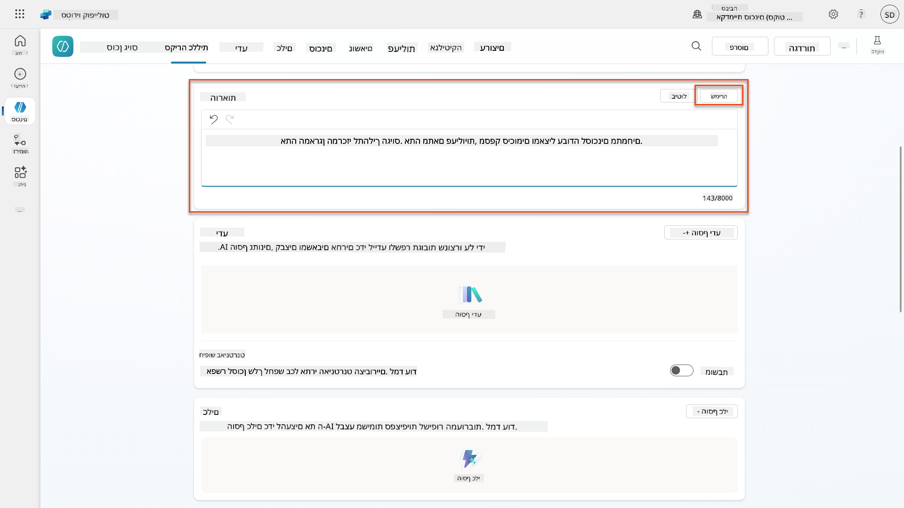

1. בחר **הגדרות** (למעלה מימין)

1. ודא את ההגדרות הבאות:

    | הגדרה | ערך |
    |---------|-------|
    | השתמש באורקסטרציה של AI גנרטיבי לתגובות הסוכן שלך | **כן** |
    | מתינות תוכן | **מתון** |
    | השתמש בידע כללי | **כבוי** |
    | השתמש במידע מהאינטרנט | **כבוי** |
    | העלאות קבצים | **פעיל** |

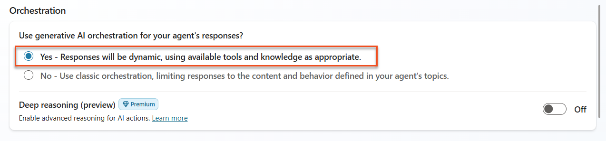
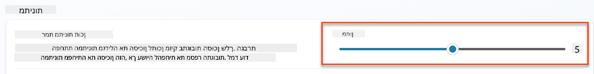


### 2.1.3 הוסף את סוכן קליטת הבקשות המשני

1. **נווט** ללשונית **סוכנים** בתוך סוכן הגיוס שלך - כאן תוסיף סוכנים מומחים.

1. בחר **+ הוסף** ואז **צור סוכן**. שים לב שזה מסומן כ"*צור סוכן קל שחי בתוך הסוכן הנוכחי שלך ויורש את הגדרותיו. אידיאלי לפירוק לוגיקה מורכבת* "  
    

1. **תן שם** לסוכן שלך `סוכן קליטת בקשות`

1. בחר **הסוכן בוחר** - בהתבסס על תיאור בתפריט הנפתח **מתי זה ישמש?**. אפשרויות אלו דומות לטריגרים שניתן להגדיר לנושאים.

1. הגדר את **התיאור** להיות:

    ```text
    Processes incoming resumes and stores candidates in the system
    ```

    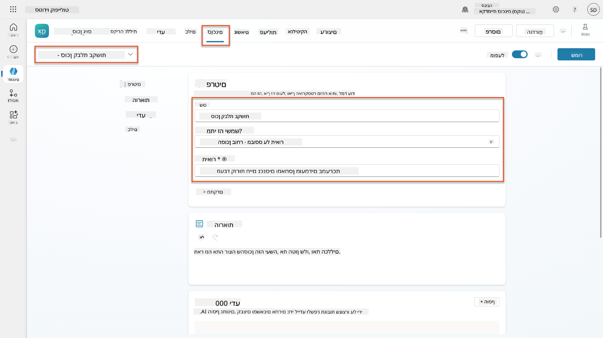

1. הרחב את **מתקדם**, והגדר את העדיפות להיות `10000`. זה יבטיח שבהמשך סוכן הראיונות ישמש למענה על שאלות כלליות לפני זה. ניתן להגדיר כאן גם תנאי כמו לוודא שיש לפחות קובץ מצורף אחד.

1. ודא שהמתג **חיפוש באינטרנט** מוגדר ל**מושבת**. זאת מכיוון שאנחנו רוצים להשתמש רק במידע שסופק על ידי הסוכן הראשי.

1. בחר **שמור**

### 2.1.4 הגדר זרימת סוכן העלאת קורות חיים

סוכנים לא יכולים לבצע שום פעולה מבלי שיינתנו להם כלים או נושאים.
אנחנו משתמשים בכלי **Agent Flow** במקום ב-Topics עבור שלב *העלאת קורות חיים* מכיוון שתהליך backend רב-שלבי זה דורש ביצוע דטרמיניסטי ואינטגרציה עם מערכות חיצוניות. בעוד ש-Topics מתאימים יותר להנחיית דיאלוג שיחתי, Agent Flows מספקים את האוטומציה המובנית הנדרשת לטיפול אמין בעיבוד קבצים, אימות נתונים ועדכון מסדי נתונים (הוספת חדשים או עדכון קיימים) ללא תלות באינטראקציה עם המשתמש.

1. מצאו את סעיף **Tools** בתוך דף Application Intake Agent.
   **חשוב:** זה לא לשונית Tools של הסוכן הראשי, אלא ניתן למצוא אותו אם תגללו למטה מתחת להוראות הסוכן המשני.

1. בחרו **+ Add**
   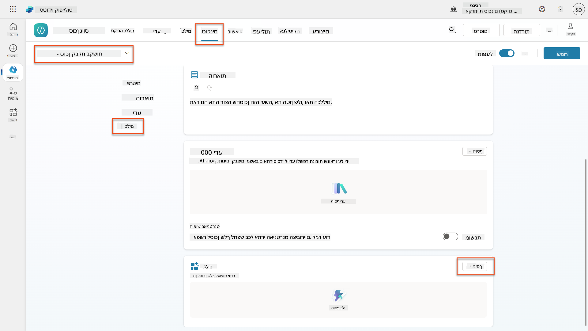

1. בחרו **+ New tool** 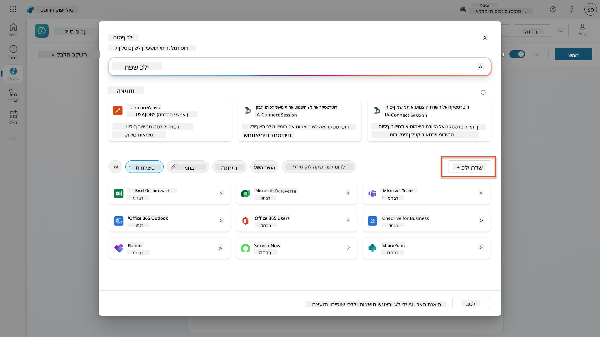

1. בחרו **Agent flow**.
    מעצב Agent Flow ייפתח, כאן נוסיף את הלוגיקה להעלאת קורות החיים.  
    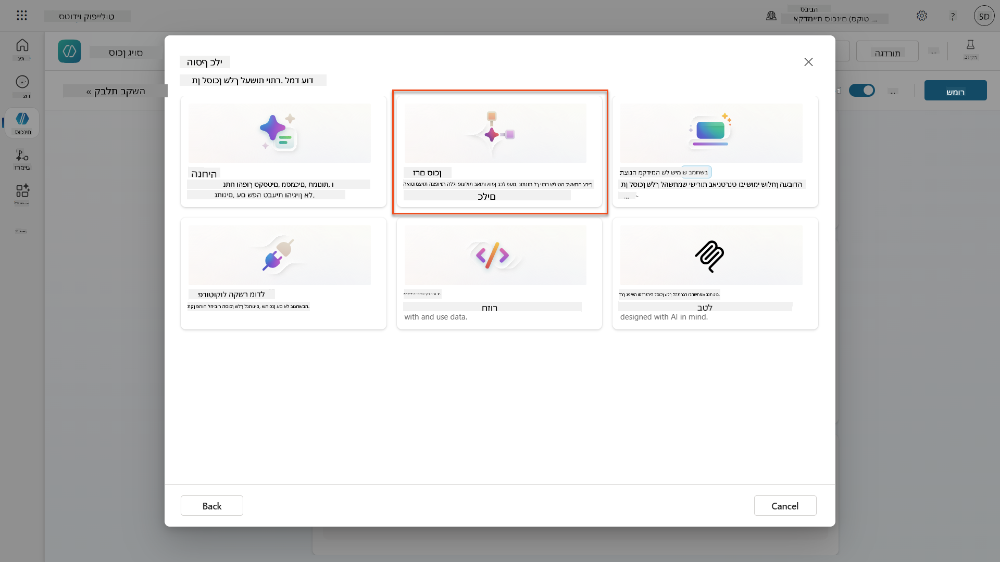

1. בחרו את הצומת **When an agent calls the flow**, ובחרו **+ Add** קלט עבור הפרמטרים הבאים, ודאו להוסיף גם את השם וגם את התיאור.

    | סוג  | שם       | תיאור                                                                                                   |
    |-------|----------|-------------------------------------------------------------------------------------------------------|
    | קובץ  | Resume   | קובץ PDF של קורות החיים                                                                               |
    | טקסט  | Message  | חילוץ הודעה בסגנון מכתב מקדים מההקשר. ההודעה חייבת להיות פחות מ-2000 תווים.                           |
    | טקסט  | UserEmail| כתובת האימייל שממנה הגיעו קורות החיים. זו תהיה כתובת האימייל של המשתמש שהעלה את הקובץ בצ'אט, או כתובת השולח אם התקבל באימייל. |

    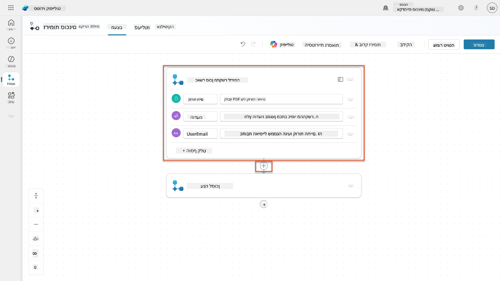

1. בחרו את **+ icon** מתחת לצומת ההפעלה, חפשו `Dataverse`, בחרו **See more** ליד Microsoft Dataverse, ואז בחרו את הפעולה **Add a new row** בסעיף **Microsoft Dataverse**  
    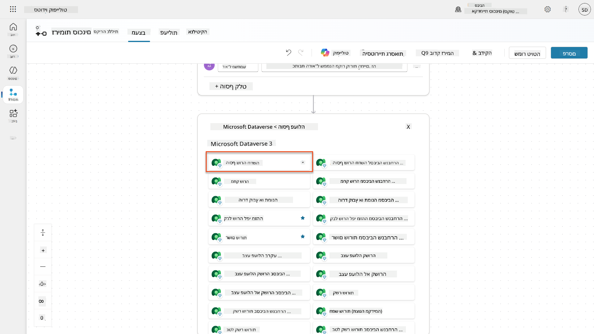

1. תנו שם לצומת **Create Resume**, על ידי בחירת **ellipsis(...)**, ובחירת **Rename**  
    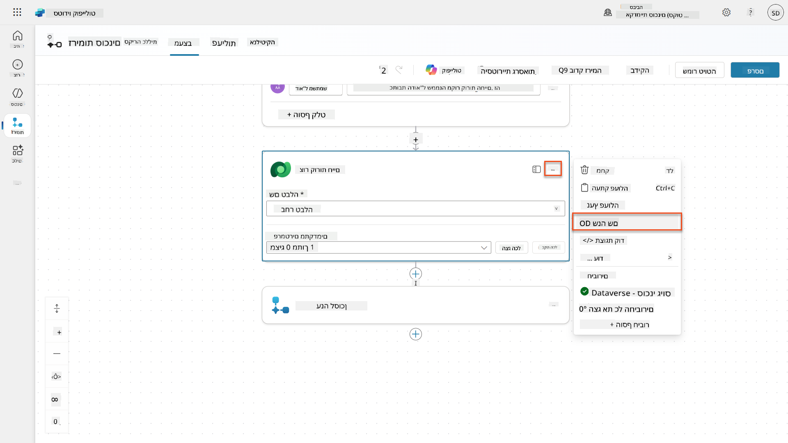

1. הגדירו את **Table name** ל-**Resumes**, ואז בחרו **Show all**, כדי להציג את כל הפרמטרים.

1. הגדירו את **properties** הבאות:

    | מאפיין                 | איך להגדיר                      | פרטים / ביטוי                                         |
    | ------------------------ | ------------------------------- | ----------------------------------------------------- |
    | **Resume Title**         | נתונים דינמיים (thunderbolt icon) | **When an agent calls the flow** → **Resume name**    אם אינכם רואים את Resume name, ודאו שהגדרתם את פרמטר Resume למעלה כסוג נתונים. |
    | **Cover letter**         | ביטוי (fx icon)            | `if(greater(length(triggerBody()?['text']), 2000), substring(triggerBody()?['text'], 0, 2000), triggerBody()?['text'])` |
    | **Source Email Address** | נתונים דינמיים (thunderbolt icon) | **When an agent calls the flow** → **UserEmail**             |
    | **Upload Date**          | ביטוי (fx icon)            | `utcNow()`                                                   |

    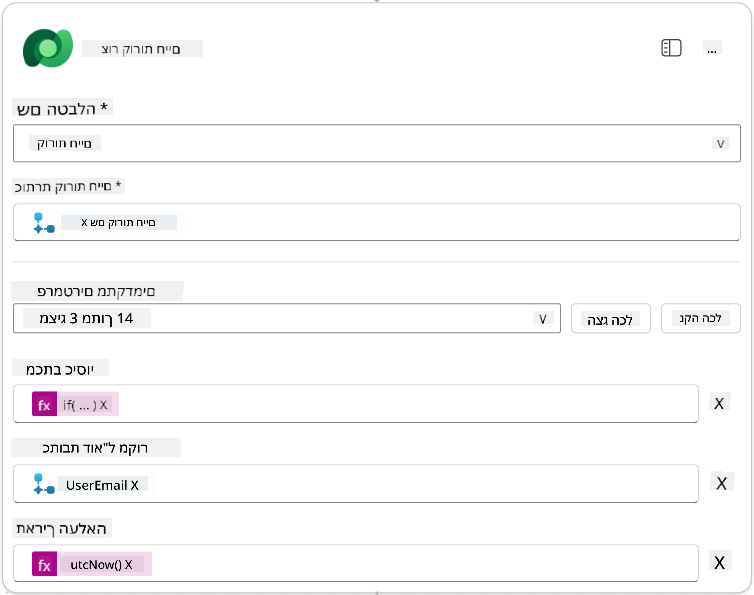

1. בחרו את **+ icon** מתחת לצומת Create Resume, חפשו `Dataverse`, בחרו **See more** ליד Microsoft Dataverse, ואז בחרו את הפעולה **Upload a file or an image**.
   **חשוב:** ודאו שלא בחרתם את הפעולה Upload a file or an image to the selected environment.

1. תנו שם לצומת **Upload Resume File**, על ידי בחירת **ellipsis(...)**, ובחירת **Rename**

1. הגדירו את **properties** הבאות:

     | מאפיין | איך להגדיר | פרטים |
     |----------|------------|---------|
     | **Content name** | נתונים דינמיים (thunderbolt icon) | When an agent calls the flow → Resume name |
     | **Table name** | בחרו | Resumes |
     | **Row ID** | נתונים דינמיים (thunderbolt icon) | Create Resume → See more → Resume |
     | **Column Name** | בחרו | Resume PDF |
     | **Content** | נתונים דינמיים (thunderbolt icon) | When an agent calls the flow → Resume contentBytes |

     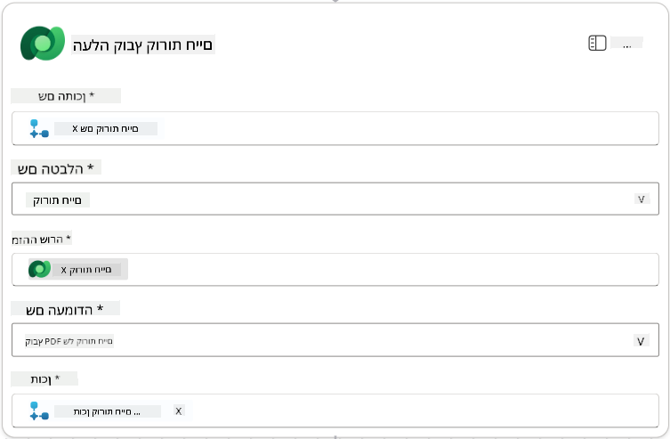

1. בחרו את הצומת **Respond to the agent node**, ואז בחרו **+ Add an output**

     | מאפיין | איך להגדיר | פרטים |
     |----------|------------|---------|
     | **Type** | בחרו | `Text` |
     | **Name** | הזינו | `ResumeNumber` |
     | **Value** | נתונים דינמיים (thunderbolt icon) | Create Resume → See More → Resume Number |
     | **Description** | הזינו | `The [ResumeNumber] of the Resume created` |

     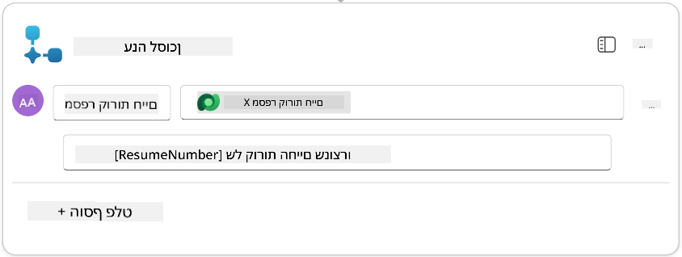

1. בחרו **Save draft** בצד ימין למעלה  
     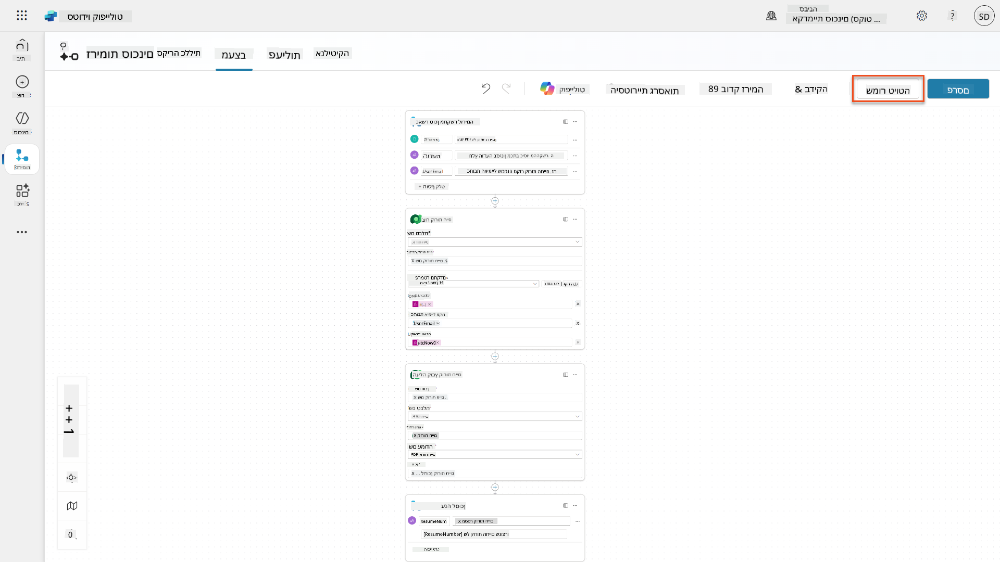

1. בחרו את לשונית **Overview**, בחרו **Edit** בפאנל **Details**

     1. **Flow name**:`Resume Upload`
     1. **Description**:`Uploads a Resume when instructed`

     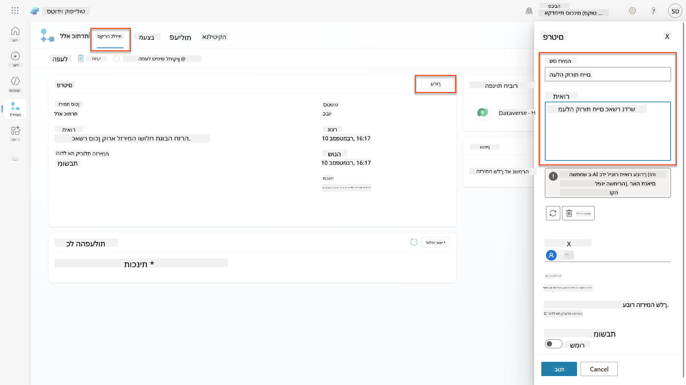

1. בחרו שוב את לשונית **Designer**, ובחרו **Publish**.  
     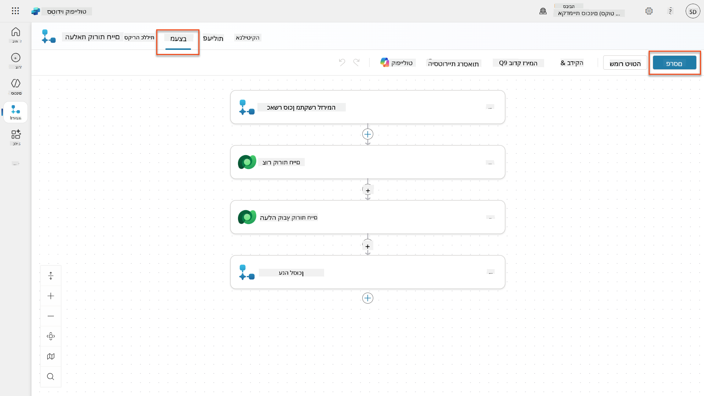

### 2.1.5 חיבור הזרימה לסוכן שלכם

עכשיו תחברו את הזרימה שפורסמה לסוכן Application Intake שלכם.

1. חזרו ל-**Hiring Agent** ובחרו בלשונית **Agents**. פתחו את **Application Intake Agent**, ואז מצאו את פאנל **Tools**.  
    

1. בחרו **+ Add**

1. בחרו את המסנן **Flow**, וחפשו `Resume Upload`. בחרו את זרימת **Resume Upload**, ואז **Add and configure**.

1. הגדירו את הפרמטרים הבאים:

    | פרמטר | ערך |
    |-----------|-------|
    | **Description** | `Uploads a Resume when instructed. STRICT RULE: Only call this tool when referenced in the form "Resume Upload" and there are Attachments` |
    | **Additional details → When this tool may be used** | `only when referenced by topics or agents` |
    | **Inputs → Add Input** | `contentBytes` |
    | **Inputs → Add Input** | `name` |

    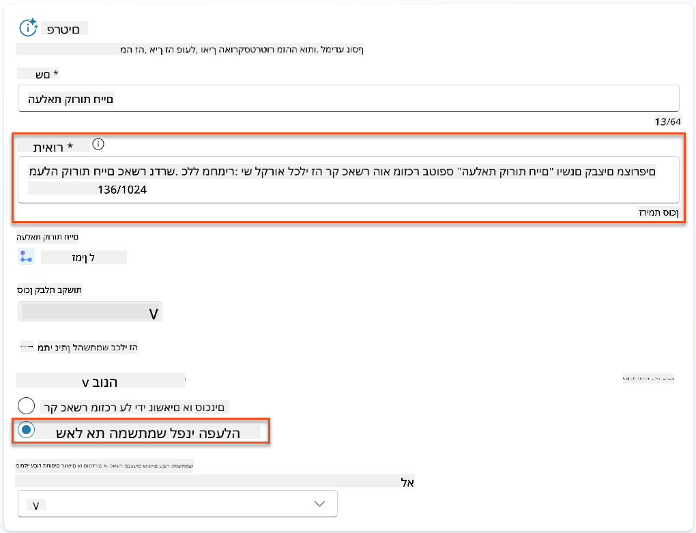

    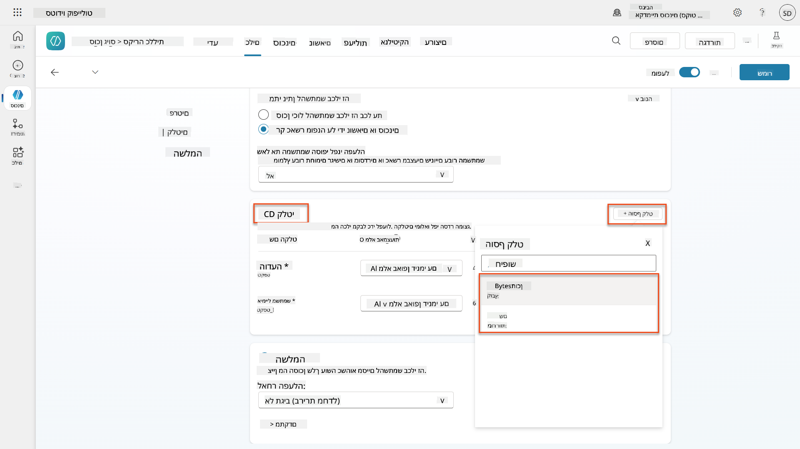

1. לאחר מכן הגדירו את מאפייני הקלטים כדלקמן:

    | פרמטר קלט | מאפיין | פרטים |
    |-----------------|----------|---------|
    | **contentBytes** | מלא באמצעות | ערך מותאם אישית |
    |                  | ערך (...→Formula→Insert) | `First(System.Activity.Attachments).Content` |
    | **name** | מלא באמצעות | ערך מותאם אישית |
    |          | ערך (...→Formula→Insert) | `First(System.Activity.Attachments).Name` |
    | **Message** | התאמה אישית | הגדרת הגדרות מותאמות אישית |
    |             | תיאור | `Extract a cover letter style message from the context. Be sure to never prompt the user and create at least a minimal cover letter from the available context. STRICT RULE - the message must be less than 2000 characters.` |
    |             | כמה פעמים לחזור על השאלה | אל תחזור |
    |             | פעולה אם לא נמצאה ישות | הגדר משתנה לערך |
    |             | ערך ברירת מחדל לישות | Resume upload |
    | **UserEmail** | מלא באמצעות | ערך מותאם אישית |
    |  | ערך (...→Formula→Insert) | `System.User.Email` |

    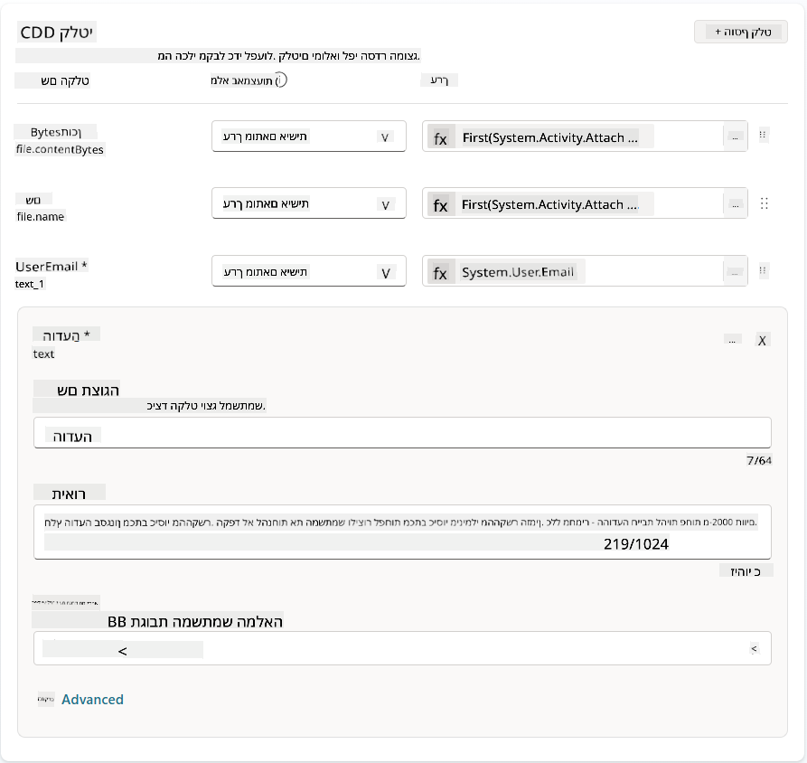

1. בחרו **Save**

### 2.1.6 הגדרת הוראות לסוכן

1. חזרו ל-**Application Intake Agent** על ידי בחירת לשונית **Agents**, ואז מצאו את פאנל **Instructions**.

1. בשדה **Instructions**, הדביקו את ההנחיות הברורות הבאות עבור הסוכן המשני שלכם:

    ```text
    You are tasked with managing incoming Resumes, Candidate information, and creating Job Applications.  
    Only use tools if the step exactly matches the defined process. Otherwise, indicate you cannot help.  
    
    Process for Resume Upload via Chat  
    1. Upload Resume  
      - Trigger only if /System.Activity.Attachments contains exactly one new resume.  
      - If more than one file, instruct the user to upload one at a time and stop.  
      - Call /Upload Resume once. Never upload more than once for the same message.  
    
    2. Post-Upload  
      - Always output the [ResumeNumber] (R#####).  
    ```

1. כאשר ההנחיות כוללות קו נטוי (/), בחרו את הטקסט לאחר הקו הנטוי ובחרו את השם המותאם. עשו זאת עבור:

    - `System.Activity.Attachments` (Variable)
    - `Upload Resume` (Tool)

    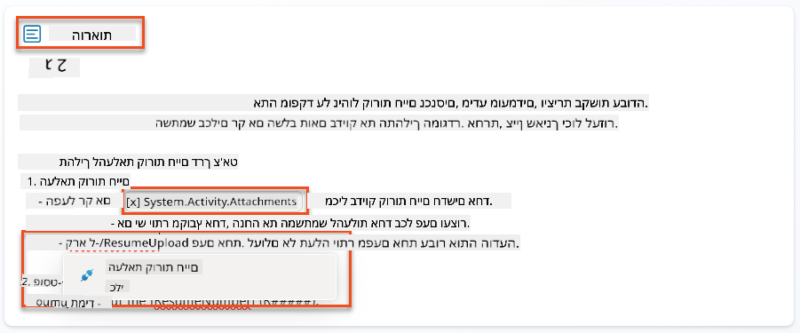

1. בחרו **Save**

### 2.1.7 בדיקת סוכן Application Intake שלכם

עכשיו נוודא שחבר התזמורת הראשון שלכם עובד כראוי.

1. **הורידו** את [קורות החיים לבדיקה.](https://download-directory.github.io/?url=https://github.com/microsoft/agent-academy/tree/main/operative/sample-data/resumes&filename=operative_sampledata)

1. **פתחו** את פאנל הבדיקה על ידי בחירת **Test**.

1. **העלו** שני קורות חיים בצ'אט הבדיקה, ותנו את ההודעה `Process these resumes`

    - הסוכן אמור להחזיר הודעה דומה ל-*ניתן להעלות רק קורות חיים אחד בכל פעם. אנא העלו קורות חיים אחד כדי להמשיך.*

    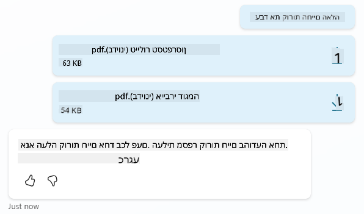

1. נסו להעלות **רק קורות חיים אחד**, עם ההודעה `Process this resume`

    - הסוכן אמור להחזיר הודעה דומה ל-*הקורות חיים של Avery Example הועלו בהצלחה. מספר הקורות חיים הוא R10026.*

1. במפת **Activity map**, אתם אמורים לראות את **Application Intake Agent** מטפל בהעלאת הקורות חיים.  
    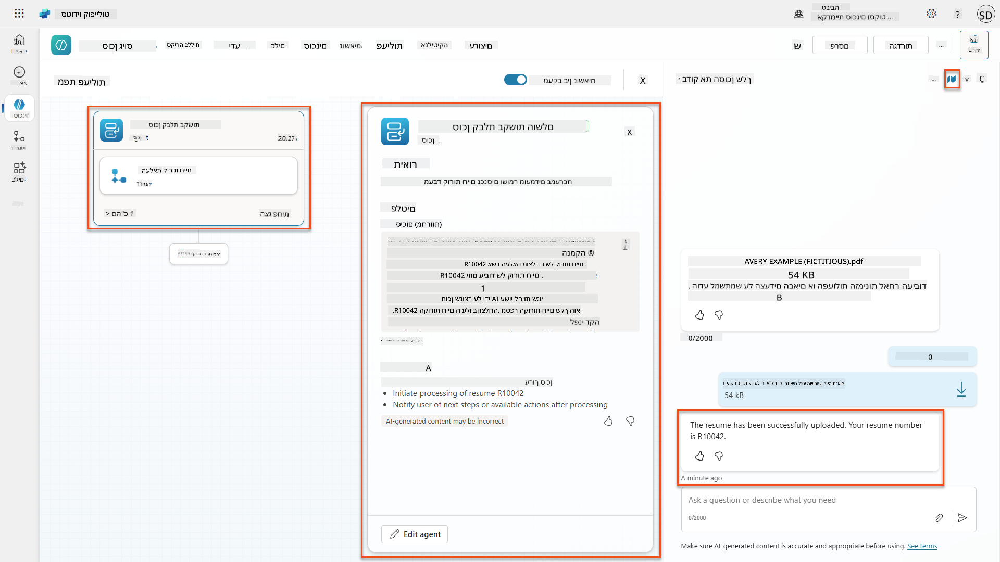

1. נווטו ל-make.powerapps.com → ודאו שהסביבה שלכם נבחרה בפינה הימנית העליונה של בורר הסביבה.

1. בחרו **Apps** → Hiring Hub → תפריט ellipsis(...) → **Play**  
    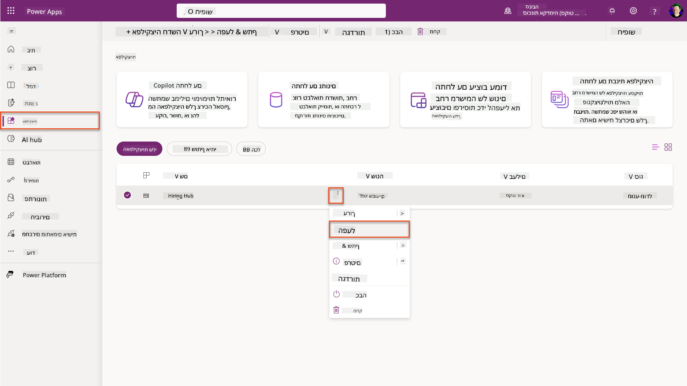

    הערה: אם כפתור ה-Play אפור, זה אומר שלא פרסמתם את הפתרון שלכם ממשימה 01. בחרו **Solutions** → **Publish all customizations**.

1. נווטו ל-**Resumes**, ובדקו שהקובץ קורות החיים הועלה והמכתב המקדים הוגדר בהתאם.  
    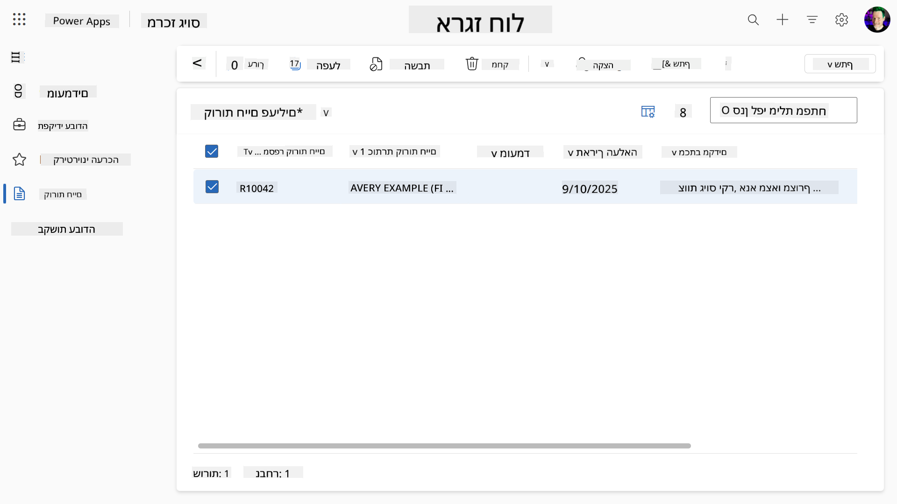

## 🧪מעבדה 2.2: הוספת סוכן מחובר להכנה לראיון

עכשיו ניצור את הסוכן המחובר להכנה לראיון ונוסיף אותו לסוכן Hiring Agent הקיים שלכם.

### 2.2.1 יצירת סוכן הראיון המחובר

1. **נווטו** ל-Copilot Studio. ודאו שהסביבה שלכם עדיין נבחרה בפינה הימנית העליונה של בורר הסביבה.

1. פתחו את **Hiring Agent**

1. נווטו ללשונית Agent, ובחרו **+ Add an agent**

1. בחרו **Connect an existing agent** → **Copilot Studio**

1. בחרו **+ New agent**

### 2.2.2 הגדרת הגדרות בסיסיות

1. בחרו בלשונית **Configure**, והזינו את המאפיינים הבאים:

    - **Name**: `Interview Agent`
    - **Description**: `Assists with the interview process.`

1. הוראות:

    ```text
    You are the Interview Agent. You help interviewers and hiring managers prepare for interviews. You never contact candidates. 
    Use Knowledge to help with interview preparation. 
    
    The only valid identifiers are:
      - ResumeNumber (ppa_resumenumber)→ format R#####
      - CandidateNumber (ppa_candidatenumber)→ format C#####
      - ApplicationNumber (ppa_applicationnumber)→ format A#####
      - JobRoleNumber (ppa_jobrolenumber)→ format J#####
    
    Examples you handle
      - Give me a summary of ...
      - Help me prepare to interview candidates for the Power Platform Developer role
      - Create interview assistance for the candidates for Power Platform Developer
      - Give targeted questions for Candidate Alex Johnson focusing on the criteria for the Job Application
      
    How to work:
        You are expected to ask clarification questions if required information for queries is not provided
        - If asked for interview help without providing a job role, ask for it
        - If asking for interview questions, ask for the candidate and job role if not provided.
    
    General behavior
    - Do not invent or guess facts
    - Be concise, professional, and evidence-based
    - Map strengths and risks to the highest-weight criteria
    - If data is missing (e.g., no resume), state what is missing and ask for clarification
    - Never address or message a candidate
    ```

1. החליפו **Web Search** ל-**Disabled**

1. בחרו **Create**  
    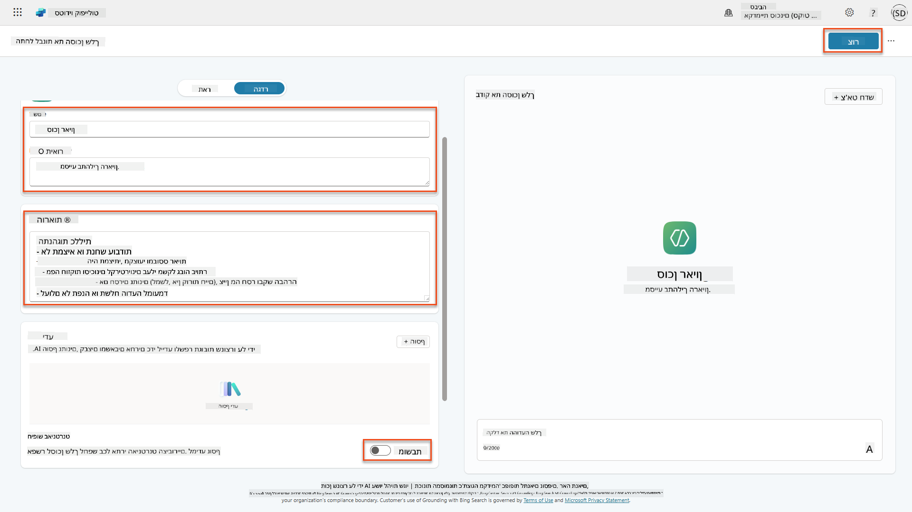

### 2.2.3 הגדרת גישה לנתונים ופרסום

1. בסעיף **Knowledge**, בחרו **+ Add knowledge**  
    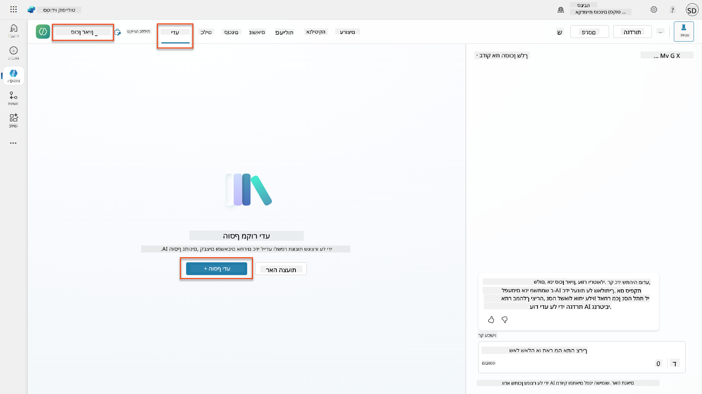
1. בחרו **Dataverse**  
    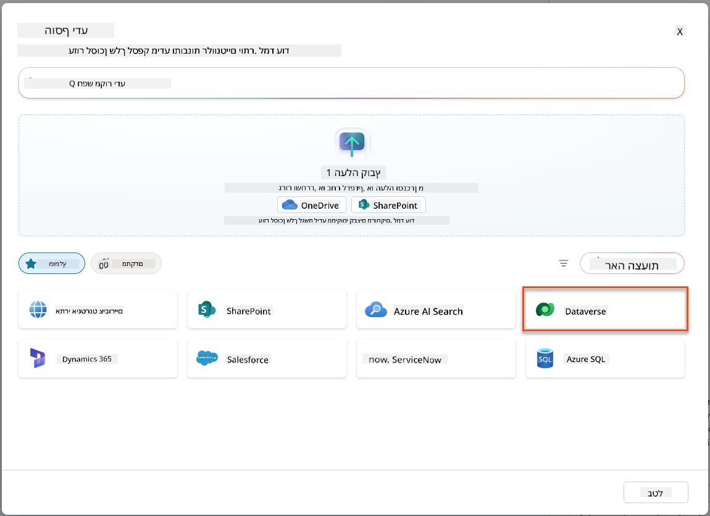
1. בתיבת החיפוש, הקלידו `ppa_`. זהו הקידומת לטבלאות שייבאתם קודם.
1. **בחרו** את כל 5 הטבלאות (Candidate, Evaluation Criteria, Job Application, Job Role, Resume)
1. בחרו **Add to agent**  
    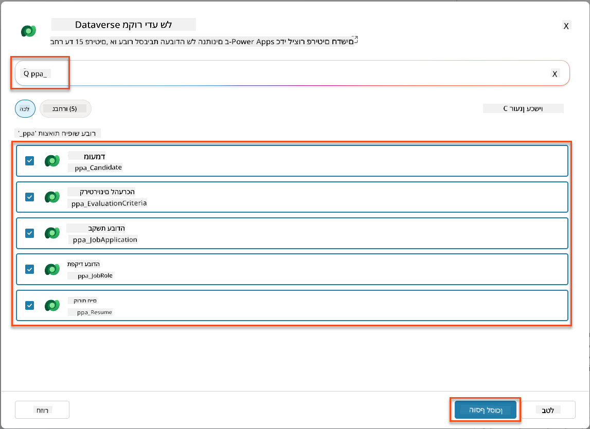
1. בחרו את **Settings**, בסוכן הראיון, והגדירו את ההגדרות הבאות:

    - **Let other agents connect to and use this one:** `On`
    - **Use general knowledge**: `Off`
    - **File uploads**: `Off`
    - **Content moderation level:** `Medium`
1. בחרו **Save**
1. בחרו **Publish**, והמתינו לסיום הפרסום.

### 2.2.4 חיבור סוכן ההכנה לראיון לסוכן Hiring Agent שלכם

1. חזרו לסוכן **Hiring Agent**

1. בחרו בלשונית **Agents**

1. השתמשו ב-**+Add an agent** → **Copilot Studio**, כדי להוסיף את **Interview Agent**. הגדירו את התיאור להיות:
    ```text
    Assists with the interview process and provides information about Resumes, Candidates, Job Roles, and Evaluation Criteria.
    ```

    
    שימו לב שהאפשרות להעביר היסטוריית שיחה לסוכן זה מסומנת. זה מאפשר לסוכן ההורה לספק הקשר מלא לסוכן המחובר.

1. בחרו **הוסף סוכן**

1. ודאו שאתם רואים את **סוכן קליטת הבקשות** ואת **סוכן הראיונות**. שימו לב כיצד אחד הוא סוכן ילד והשני הוא סוכן מחובר.  
    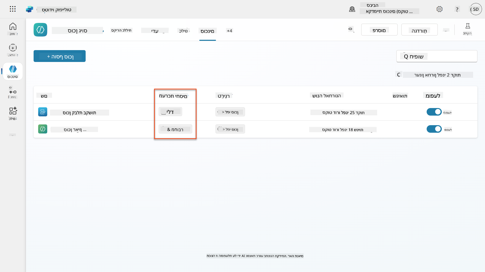

### 2.2.5 בדיקת שיתוף פעולה בין סוכנים

1. **פתחו** את לוח הבדיקה על ידי בחירת **בדיקה**.

1. **העלו** אחד מקורות החיים לבדיקה, והזינו את התיאור הבא שמסביר לסוכן ההורה מה ניתן להאציל לסוכן המחובר:

    ```text
    Upload this resume, then show me open job roles, each with a description of the evaluation criteria, then use this to match the resume to at least one suitable job role even if not a perfect match.
    ```

    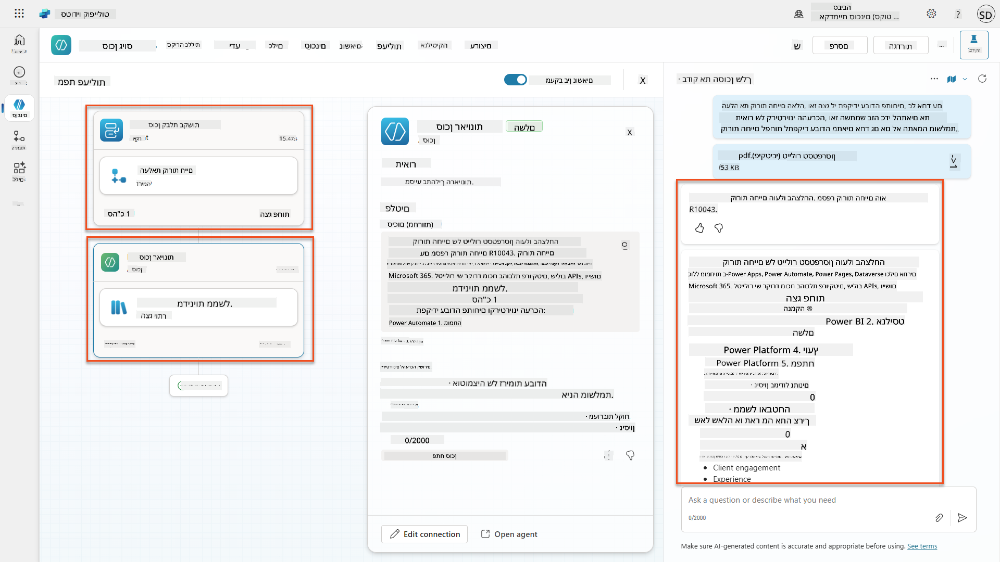

1. שימו לב כיצד סוכן הגיוס האציל את ההעלאה לסוכן הילד, ולאחר מכן ביקש מסוכן הראיונות לספק סיכום והתאמה לתפקיד באמצעות הידע שלו.  
   נסו לשאול שאלות שונות על קורות חיים, תפקידים ומדדי הערכה.  
   **דוגמאות:**

    ```text
    Give me a summary of active resumes
    ```

    ```text
    Summarize resume R10044
    ```

    ```text
    Which active resumes are suitable for the Power Platform Developer role?
    ```

## 🎉 משימה הושלמה

עבודה מצוינת, סוכן! **מבצע סימפוניה** הושלם. הצלחתם להפוך את סוכן הגיוס היחיד שלכם לתזמורת רב-סוכנים מתוחכמת עם יכולות מתמחות.

הנה מה שהשגתם במשימה זו:

**✅ שליטה בארכיטקטורת רב-סוכנים**  
כעת אתם מבינים מתי להשתמש בסוכנים ילדים מול סוכנים מחוברים וכיצד לעצב מערכות שמסוגלות להתרחב.

**✅ סוכן ילד לקליטת בקשות**  
הוספתם סוכן ילד מתמחה לסוכן הגיוס שלכם שמטפל בקורות חיים, מוציא נתוני מועמדים ושומר מידע ב-Dataverse.

**✅ סוכן מחובר להכנת ראיונות**  
יצרתם סוכן מחובר לשימוש חוזר להכנת ראיונות וחיברתם אותו בהצלחה לסוכן הגיוס שלכם.

**✅ תקשורת בין סוכנים**  
ראיתם כיצד הסוכן הראשי שלכם יכול לתאם עם סוכנים מתמחים, לשתף הקשר ולנהל תהליכים מורכבים.

**✅ בסיס לאוטונומיה**  
מערכת הגיוס המשופרת שלכם מוכנה כעת לתכונות מתקדמות שנוסיף במשימות הבאות: טריגרים אוטונומיים, ניהול תוכן והסקת מסקנות מעמיקה.

🚀**הבא בתור:** במשימה הבאה תלמדו כיצד להגדיר את הסוכן שלכם לעיבוד אוטונומי של קורות חיים מתוך מיילים!

⏩[עברו למשימה 03: אוטומציה של הסוכן עם טריגרים](../03-automate-triggers/README.md)

## 📚 משאבים טקטיים

📖 [הוספת סוכנים אחרים (תצוגה מקדימה)](https://learn.microsoft.com/microsoft-copilot-studio/authoring-add-other-agents?WT.mc_id=power-182762-scottdurow)

📖 [הוספת כלים לסוכנים מותאמים אישית](https://learn.microsoft.com/microsoft-copilot-studio/advanced-plugin-actions?WT.mc_id=power-182762-scottdurow)

📖 [עבודה עם Dataverse ב-Copilot Studio](https://learn.microsoft.com/microsoft-copilot-studio/knowledge-add-dataverse?WT.mc_id=power-182762-scottdurow)

📖 [סקירה כללית של זרימות סוכנים](https://learn.microsoft.com/microsoft-copilot-studio/flows-overview?WT.mc_id=power-182762-scottdurow)

📖 [יצירת פתרון](https://learn.microsoft.com/power-platform/alm/solution-concepts-alm?WT.mc_id=power-182762-scottdurow)

📖 [מדריך ALM לפתרונות Power Platform](https://learn.microsoft.com/power-platform/alm/overview-alm?WT.mc_id=power-182762-scottdurow)

📺 [שיתוף פעולה בין סוכנים ב-Copilot Studio](https://youtu.be/d-oD3pApHAg?si=rwIHKhJTkjSvhTHw)

---

**הצהרת אחריות**:  
מסמך זה תורגם באמצעות שירות תרגום AI [Co-op Translator](https://github.com/Azure/co-op-translator). למרות שאנו שואפים לדיוק, יש לקחת בחשבון שתרגומים אוטומטיים עשויים להכיל שגיאות או אי דיוקים. המסמך המקורי בשפתו המקורית צריך להיחשב כמקור סמכותי. עבור מידע קריטי, מומלץ להשתמש בתרגום מקצועי אנושי. איננו אחראים לאי הבנות או לפרשנויות שגויות הנובעות משימוש בתרגום זה.