<!--
CO_OP_TRANSLATOR_METADATA:
{
  "original_hash": "750f3ea8a94930439ebd8a10871b1d73",
  "translation_date": "2025-10-17T05:24:22+00:00",
  "source_file": "docs/operative-preview/08-dataverse-grounding/README.md",
  "language_code": "he"
}
-->
# 🚨 משימה 08: שדרוג הנחיות עם חיבור ל-Dataverse

--8<-- "disclaimer.md"

## 🕵️‍♂️ שם קוד: `מבצע שליטה בקרקע`

> **⏱️ חלון זמן למבצע:** `~60 דקות`

## 🎯 תדריך משימה

ברוך שובך, סוכן. מערכת הגיוס הרב-סוכנים שלך פעילה, אך יש צורך בשדרוג קריטי עבור **חיבור לנתונים** - המודלים של הבינה המלאכותית שלך זקוקים לגישה בזמן אמת לנתונים מובנים של הארגון שלך כדי לקבל החלטות חכמות.

כרגע, ההנחיה שלך לסיכום קורות חיים פועלת עם ידע סטטי. אבל מה אם היא תוכל לגשת באופן דינמי למסד הנתונים של תפקידי העבודה שלך כדי לספק התאמות מדויקות ועדכניות? ומה אם היא תבין את קריטריוני ההערכה שלך מבלי שתצטרך לקודד אותם ידנית?

במשימה זו, תשדרג את ההנחיה המותאמת שלך עם **חיבור ל-Dataverse** - חיבור ההנחיות שלך ישירות למקורות נתונים חיים. זה הופך את הסוכנים שלך ממגיבים סטטיים למערכות מונעות נתונים שמתאימות את עצמן לצרכים העסקיים המשתנים.

המשימה שלך: לשלב נתוני תפקידי עבודה וקריטריוני הערכה בזמן אמת לתוך תהליך ניתוח קורות החיים, וליצור מערכת שמתעדכנת בעצמה ונשארת עדכנית עם דרישות הגיוס של הארגון שלך.

## 🔎 מטרות

במשימה זו תלמד:

1. כיצד **חיבור ל-Dataverse** משדרג הנחיות מותאמות
1. מתי להשתמש בחיבור לנתונים לעומת הוראות סטטיות
1. עיצוב הנחיות שמשלבות נתונים חיים באופן דינמי
1. שדרוג תהליך סיכום קורות החיים עם התאמת תפקידי עבודה

## 🧠 הבנת חיבור ל-Dataverse עבור הנחיות

**חיבור ל-Dataverse** מאפשר להנחיות המותאמות שלך לגשת לנתונים חיים מטבלאות Dataverse בעת עיבוד בקשות. במקום הוראות סטטיות, ההנחיות שלך יכולות לשלב מידע בזמן אמת כדי לקבל החלטות מושכלות.

### למה חיבור ל-Dataverse חשוב

הנחיות מסורתיות פועלות עם הוראות קבועות:

```text
Match this candidate to these job roles: Developer, Manager, Analyst
```

עם חיבור ל-Dataverse, ההנחיה שלך ניגשת לנתונים עדכניים:

```text
Match this candidate to available job roles from the Job Roles table, 
considering current evaluation criteria and requirements
```

גישה זו מספקת מספר יתרונות מרכזיים:

- **עדכונים דינמיים:** תפקידי עבודה וקריטריונים משתנים ללא צורך בשינויים בהנחיה
- **עקביות:** כל הסוכנים משתמשים באותם מקורות נתונים עדכניים
- **יכולת הרחבה:** תפקידים וקריטריונים חדשים זמינים באופן אוטומטי
- **דיוק:** נתונים בזמן אמת מבטיחים שההחלטות משקפות את הצרכים הנוכחיים

### איך חיבור ל-Dataverse עובד

כאשר אתה מפעיל חיבור ל-Dataverse עבור הנחיה מותאמת:

1. **בחירת נתונים:** בחר טבלאות ועמודות ספציפיות מ-Dataverse לכלול. ניתן גם לבחור טבלאות קשורות שהמערכת תסנן על בסיס הרשומות ההוריות שנשלפו.
1. **הזרקת הקשר:** ההנחיה כוללת באופן אוטומטי את הנתונים שנשלפו בהקשר ההנחיה
1. **סינון חכם:** המערכת כוללת רק נתונים רלוונטיים לבקשה הנוכחית אם תספק סינון כלשהו.
1. **פלט מובנה:** ההנחיה שלך יכולה להתייחס לנתונים שנשלפו ולנתח את הרשומות כדי ליצור את הפלט.

### מעבר מסטטי לדינמי: יתרון החיבור

בוא נבחן את תהליך סיכום קורות החיים הנוכחי שלך ממשימה 07 ונראה איך חיבור ל-Dataverse הופך אותו מאינטליגנציה סטטית לדינמית.

**גישה סטטית נוכחית:**
ההנחיה הקיימת שלך כללה קריטריוני הערכה מקודדים מראש ולוגיקת התאמה מוגדרת מראש. גישה זו עובדת אך דורשת עדכונים ידניים בכל פעם שאתה מוסיף תפקידי עבודה חדשים, משנה קריטריוני הערכה או משנה את סדרי העדיפויות של החברה.

**שינוי באמצעות חיבור ל-Dataverse:**
על ידי הוספת חיבור ל-Dataverse, תהליך סיכום קורות החיים שלך יוכל:

- **לגשת לתפקידי עבודה עדכניים** מטבלת תפקידי העבודה שלך
- **להשתמש בקריטריוני הערכה חיים** במקום תיאורים סטטיים  
- **לספק התאמות מדויקות** בהתבסס על דרישות בזמן אמת

## 🎯 למה הנחיות ייעודיות לעומת שיחות סוכן

במשימה 02, חווית איך סוכן הראיונות יכול להתאים מועמדים לתפקידי עבודה, אך נדרש הנחיות משתמש מורכבות כמו:

```text
Upload this resume, then show me open job roles,
each with a description of the evaluation criteria, 
then use this to match the resume to at least one suitable
job role even if not a perfect match.
```

בעוד שזה עבד, הנחיות ייעודיות עם חיבור ל-Dataverse מציעות יתרונות משמעותיים למשימות ספציפיות:

### יתרונות מרכזיים של הנחיות ייעודיות

| היבט | שיחות סוכן | הנחיות ייעודיות |
|--------|-------------------|------------------|
| **עקביות** | תוצאות משתנות בהתאם לכישורי ניסוח ההנחיה של המשתמש | עיבוד סטנדרטי בכל פעם |
| **התמחות** | חשיבה כללית עשויה להחמיץ ניואנסים עסקיים | מותאם במיוחד עם לוגיקה עסקית אופטימלית |
| **אוטומציה** | דורש אינטראקציה ופירוש אנושי | מופעל אוטומטית עם פלט JSON מובנה |

## 🧪 מעבדה 8: הוספת חיבור ל-Dataverse להנחיות

הגיע הזמן לשדרג את יכולות ניתוח קורות החיים שלך! תשדרג את תהליך סיכום קורות החיים הקיים עם התאמת תפקידי עבודה דינמית.

### דרישות מקדימות להשלמת המשימה

1. תצטרך **או**:

    - **להשלים את משימה 07** ולהחזיק את מערכת ניתוח קורות החיים שלך מוכנה, **או**
    - **לייבא את פתרון ההתחלה של משימה 08** אם אתה מתחיל מאפס או צריך להשלים. [הורד פתרון התחלה למשימה 08](https://aka.ms/agent-academy)

1. מסמכי קורות חיים לדוגמה מ-[קורות חיים לדוגמה](https://download-directory.github.io/?url=https://github.com/microsoft/agent-academy/tree/main/operative/sample-data/resumes&filename=operative_sampledata)

!!! note "ייבוא פתרון ונתוני דוגמה"
    אם אתה משתמש בפתרון ההתחלה, עיין ב-[משימה 01](../01-get-started/README.md) להוראות מפורטות על איך לייבא פתרונות ונתוני דוגמה לסביבה שלך.

### 8.1 הוספת חיבור ל-Dataverse להנחיה שלך

תבנה על ההנחיה לסיכום קורות חיים שיצרת במשימה 07. כרגע היא פשוט מסכמת את קורות החיים, אבל עכשיו תחבר אותה לתפקידי העבודה כפי שהם קיימים כרגע ב-Dataverse, ותשמור אותה תמיד עדכנית.

ראשית, בוא נבחן את טבלאות Dataverse שתשתמש בהן לחיבור:

1. **נווט** ל-[Power Apps](https://make.powerapps.com) ובחר את הסביבה שלך באמצעות **מחליף הסביבה** בפינה הימנית העליונה של סרגל הניווט.

1. בחר **טבלאות** ומצא את טבלת **תפקידי העבודה**

1. סקור את העמודות המרכזיות שתשתמש בהן לחיבור:

    | עמודה | מטרה |
    |--------|---------|
    | **מספר תפקיד עבודה** | מזהה ייחודי להתאמת תפקידים |
    | **כותרת תפקיד** | שם תצוגה לתפקיד |
    | **תיאור** | דרישות מפורטות לתפקיד |

1. באופן דומה, סקור את הטבלאות האחרות כמו טבלת **קריטריוני הערכה**.

### 8.2 הוספת נתוני חיבור ל-Dataverse להנחיה שלך

1. **נווט** ל-Copilot Studio, ובחר את הסביבה שלך באמצעות **מחליף הסביבה** בפינה הימנית העליונה של סרגל הניווט.

1. בחר **כלים** מהניווט השמאלי.

1. בחר **הנחיה** ומצא את ההנחיה **סיכום קורות חיים** ממשימה 07.  
    

1. בחר **ערוך** כדי לשנות את ההנחיה, והחלף לגרסה המשודרגת למטה:

    !!! important
        ודא שהפרמטרים של קורות החיים ומכתב הכיסוי נשארים ללא שינוי כפרמטרים.

    ```text
    You are tasked with extracting key candidate information from a resume and cover letter to facilitate matching with open job roles and creating a summary for application review.
    
    ### Instructions:
    1. **Extract Candidate Details:**
       - Identify and extract the candidate's full name.
       - Extract contact information, specifically the email address.
    
    2. **Analyze Resume and Cover Letter:**
       - Review the resume content to identify relevant skills, experience, and qualifications.
       - Review the cover letter to understand the candidate's motivation and suitability for the roles.
    
    3. **Match Against Open Job Roles:**
       - Compare the extracted candidate information with the requirements and descriptions of the provided open job roles.
       - Use the job descriptions to assess potential fit.
       - Identify all roles that align with the candidate's cover letter and profile. You don't need to assess perfect suitability.
       - Provide reasoning for each match based on the specific job requirements.
    
    4. **Create Candidate Summary:**
       - Summarize the candidate's profile as multiline text with the following sections:
          - Candidate name
          - Role(s) applied for if present
          - Contact and location
          - One-paragraph summary
          - Top skills (8–10)
          - Experience snapshot (last 2–3 roles with outcomes)
          - Key projects (1–3 with metrics)
          - Education and certifications
          - Availability and work authorization
    
    ### Output Format
    
    Provide the output in valid JSON format with the following structure:
    
    {
      "CandidateName": "string",
      "Email": "string",
      "MatchedRoles": [
        {
          "JobRoleNumber": "ppa_jobrolenumber from grounded data",
          "RoleName": "ppa_jobtitle from grounded data",
          "Reasoning": "Detailed explanation based on job requirements"
        }
      ],
      "Summary": "string"
    }
    
    ### Guidelines
    
    - Extract information only from the provided resume and cover letter documents.
    - Ensure accuracy in identifying contact details.
    - Use the available job role data for matching decisions.
    - The summary should be concise but informative, suitable for quick application review.
    - If no suitable matches are found, indicate an empty list for MatchedRoles and explain briefly in the summary.
    
    ### Input Data
    Open Job Roles (ppa_jobrolenumber, ppa_jobtitle): /Job Role 
    Resume: {Resume}
    Cover Letter: {CoverLetter}
    ```

1. בעורך ההנחיות, החלף `/תפקיד עבודה` על ידי בחירה ב-**+ הוסף תוכן**, בחירה ב-**Dataverse** → **תפקיד עבודה** ובחירה בעמודות הבאות, ואז בחר **הוסף**:

    1. **מספר תפקיד עבודה**

    1. **כותרת תפקיד**

    1. **תיאור**

    !!! tip
        ניתן להקליד את שם הטבלה כדי לחפש.

1. בדיאלוג **תפקיד עבודה**, בחר **סינון** מאפיין, בחר **סטטוס**, ואז הקלד **פעיל** כערך **סינון**.  
    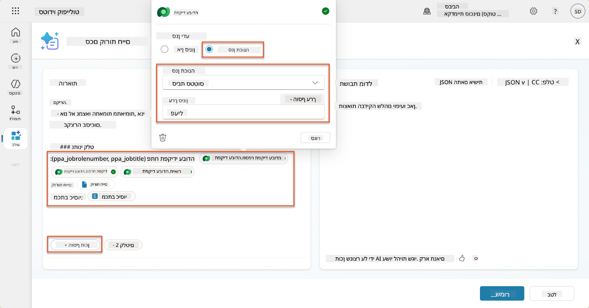

    !!! tip
        ניתן להשתמש ב-**הוסף ערך** כאן כדי להוסיף גם פרמטר קלט - לדוגמה אם הייתה לך הנחיה לסיכום רשומה קיימת, תוכל לספק את מספר קורות החיים כפרמטר לסינון.

1. לאחר מכן, תוסיף את טבלת Dataverse הקשורה **קריטריוני הערכה**, על ידי בחירה שוב ב-**+ הוסף תוכן**, מציאת **תפקיד עבודה**, ובמקום לבחור בעמודות בתפקיד עבודה, הרחב **תפקיד עבודה (קריטריוני הערכה)** ובחר את העמודות הבאות, ואז בחר **הוסף**:

    1. **שם קריטריון**

    1. **תיאור**  
        

        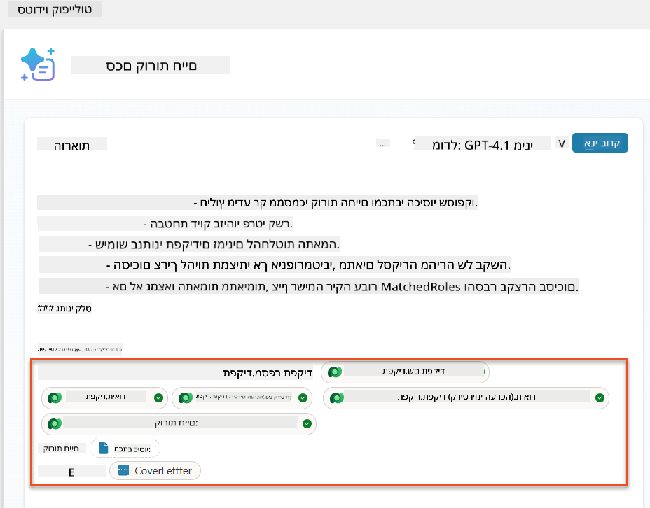

    !!! tip
        חשוב לבחור את קריטריוני ההערכה הקשורים על ידי בחירה תחילה בתפקיד העבודה, ואז ניווט בתפריט ל-תפקיד עבודה (קריטריוני הערכה). זה יבטיח שרק הרשומות הקשורות לתפקיד העבודה ייטענו.

1. בחר **הגדרות**, והתאם את **שליפת הרשומות** ל-1000 - זה יאפשר לכל תפקידי העבודה וקריטריוני ההערכה להיכלל בהנחיה שלך.  
    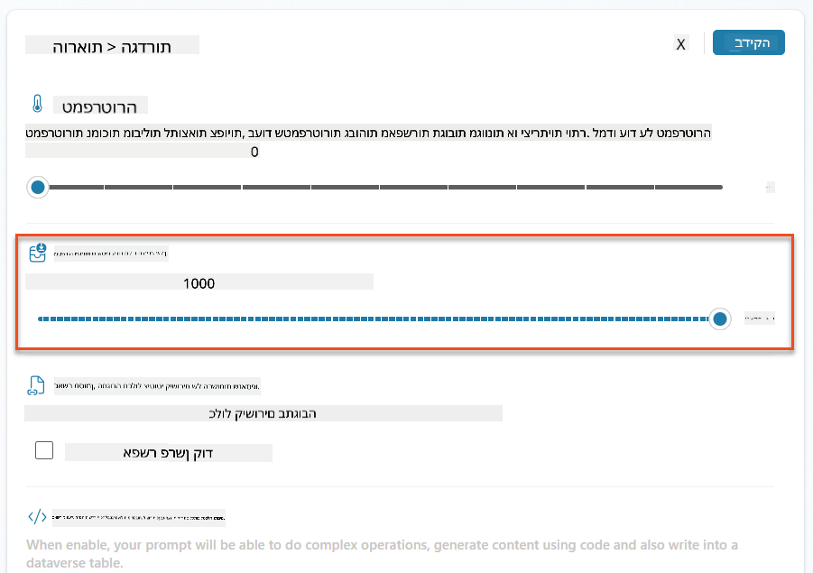

### 8.3 בדיקת ההנחיה המשודרגת

1. בחר בפרמטר **קורות חיים**, והעלה קורות חיים לדוגמה שהשתמשת בהם במשימה 07.
1. בחר **בדיקה**.
1. לאחר שהבדיקה הסתיימה, שים לב שהפלט JSON עכשיו כולל את **התפקידים שהותאמו**.
1. בחר בכרטיסיית **הידע שהשתמשו בו**, כדי לראות את נתוני Dataverse שהתמזגו עם ההנחיה שלך לפני הביצוע.
1. **שמור** את ההנחיה המשודרגת שלך. המערכת תכלול עכשיו באופן אוטומטי את נתוני Dataverse האלה עם ההנחיה שלך כאשר תהליך סוכן סיכום קורות החיים הקיים יקרא לה.  
    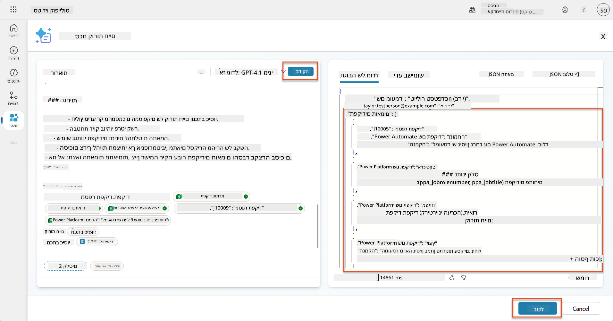

### 8.4 הוספת תהליך סוכן בקשת עבודה

כדי לאפשר לסוכן קבלת הבקשות שלנו ליצור תפקידי עבודה בהתבסס על התפקידים המוצעים שהמועמד מעוניין בהם, עלינו ליצור תהליך סוכן. הסוכן יקרא לכלי זה עבור כל אחד מתפקידי העבודה המוצעים שהמועמד מעוניין בהם.

!!! tip "ביטויי תהליך סוכן"
    חשוב מאוד שתעקוב אחרי ההוראות למתן שמות לצמתים ולהזנת ביטויים בדיוק, כי הביטויים מתייחסים לצמתים הקודמים באמצעות שמם! עיין במשימת [תהליך סוכן בגיוס](../../recruit/09-add-an-agent-flow/README.md#you-mentioned-expressions-what-are-expressions) לרענון מהיר!

1. בתוך **סוכן הגיוס**, בחר בכרטיסיית **סוכנים**, ופתח את סוכן **קבלת הבקשות**.

1. בתוך **פאנל הכלים**, בחר **+ הוסף** → **+ כלי חדש** → **תהליך סוכן**

1. בחר בצומת **כאשר סוכן קורא לתהליך**, השתמש ב-**+ הוסף קלט** כדי להוסיף את הפרמטרים הבאים:

    | סוג | שם            | תיאור                                                  |
    | ---- | --------------- | ------------------------------------------------------------ |
    | טקסט | `מספר קורות חיים`  | ודא להשתמש רק ב-[מספר קורות חיים] - חייב להתחיל באות R |
    | טקסט | `מספר תפקיד עבודה` | ודא להשתמש רק ב-[מספר תפקיד עבודה] - חייב להתחיל באות J |

    

1. בחר באייקון **+** מתחת לצומת הראשונה, חפש **Dataverse**, בחר **ראה עוד**, ואז מצא את הפעולה **רשימת רשומות**.

1. **שנה שם** לצומת ל-`קבל קורות חיים`, ואז הגדר את הפרמטרים הבאים:

    | מאפיין        | איך להגדיר                      | ערך                                                        |
    | --------------- | ------------------------------- | ------------------------------------------------------------ |
    | **שם טבלה**  | בחר                          | קורות חיים                                                      |
    | **סינון רשומות** | נתונים דינמיים (אייקון ברק) | `ppa_resumenumber eq 'מספר קורות חיים'` בחר והחלף **מספר קורות חיים** עם **כאשר סוכן קורא לתהליך** → **מספר קורות חיים** |
    | **מספר רשומות**   | הזן                           | 1                                                            |

    

1. עכשיו, בחר באייקון **+** מתחת ל-**קבל קורות חיים**, חפש **Dataverse**, בחר **ראה עוד**, ואז מצא את הפעולה **רשימת רשומות**.

1. **שנה שם** לצומת ל-`קבל תפקיד עבודה`, ואז הגדר את הפרמטרים הבאים:

    | מאפיין        | איך להגדיר                      | ערך                                                        |
    | --------------- | ------------------------------- | ------------------------------------------------------------ |
    | **שם טבלה**  | בחר                          | תפקידי עבודה                                                    |
    | **סינון רשומות** | נתונים דינמיים (אייקון ברק) | `ppa_jobrolenumber eq 'מספר תפקיד עבודה'` בחר והחלף **מספר תפקיד עבודה** עם **כאשר סוכן קורא לתהליך** → **מספר תפקיד עבודה** |
    | **מספר רשומות**   | הזן                           | 1                                                            |

    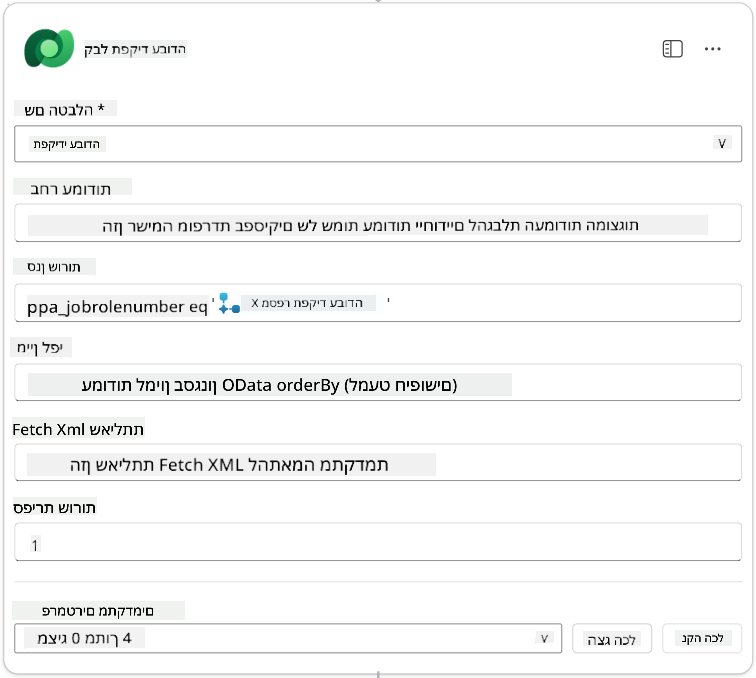

1. עכשיו, בחר באייקון **+** מתחת ל-קבל תפקיד עבודה, חפש **Dataverse**, בחר **ראה עוד**, ואז מצא את הפעולה **הוסף רשומה חדשה**.

1. **שנה שם** לצומת ל-`הוסף בקשה`, ואז הגדר את הפרמטרים הבאים:

    | מאפיין                           | איך להגדיר           | ערך                                                        |
    | ---------------------------------- | -------------------- | ------------------------------------------------------------ |
    | **שם טבלה**                     | בחר               | בקשות עבודה                                             |
    | **מועמד (מועמדים)**             | ביטוי (אייקון fx) | `concat('ppa_candidates/',first(outputs('קבל_קורות_חיים')?['body/value'])?['_ppa_candidate_value'])` |
| **תפקיד (תפקידים)**               | ביטוי (fx icon) | `concat('ppa_jobroles/',first(outputs('Get_Job_Role')?['body/value'])?['ppa_jobroleid'])` |
| **קורות חיים (קורות חיים)**       | ביטוי (fx icon) | `concat('ppa_resumes/', first(outputs('Get_Resume')?['body/value'])?['ppa_resumeid'])` |
| **תאריך הגשת מועמדות** (השתמש ב- **הצג הכל**) | ביטוי (fx icon) | `utcNow()`                                                   |

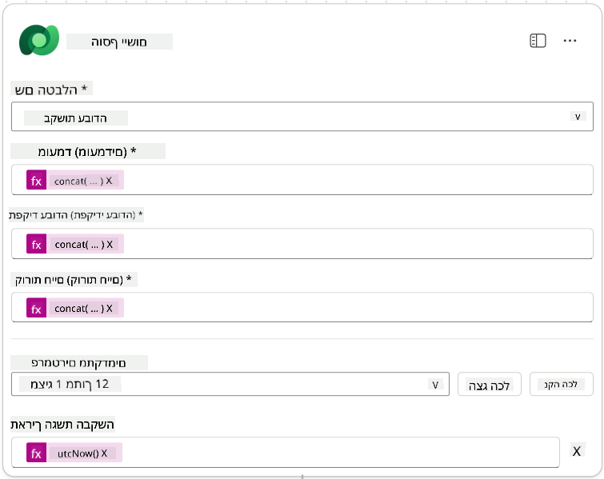

1. בחר את **Respond to the agent node**, ולאחר מכן בחר **+ הוסף פלט**

     | מאפיין        | איך להגדיר                      | פרטים                                         |
     | --------------- | ------------------------------- | ----------------------------------------------- |
     | **סוג**        | בחר                          | `Text`                                          |
     | **שם**        | הזן                           | `ApplicationNumber`                             |
     | **ערך**       | נתונים דינמיים (thunderbolt icon) | *הוסף מועמדות → הצג עוד → מספר מועמדות* |
     | **תיאור** | הזן                           | `ה-[ApplicationNumber] של המועמדות שנוצרה`      |

     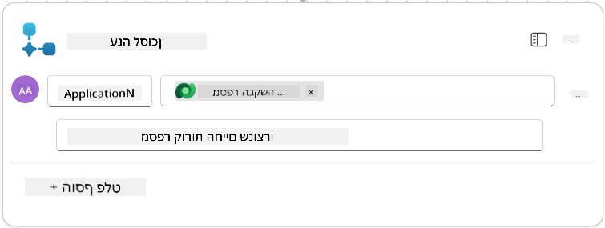

1. בחר **שמור טיוטה** בצד ימין למעלה

1. בחר את לשונית **סקירה כללית**, בחר **ערוך** בלוח **פרטים**

      - **שם זרימה**:`Create Job Application`
      - **תיאור**:`יוצר מועמדות חדשה כאשר ניתנים [ResumeNumber] ו-[JobRoleNumber]`
      - **שמור**

1. בחר שוב את לשונית **מעצב**, ולאחר מכן בחר **פרסם**.

### 8.5 הוסף יצירת מועמדות לסוכן

עכשיו תחבר את הזרימה שפורסמה לסוכן קבלת המועמדות שלך.

1. חזור אל **סוכן הגיוס** ובחר את לשונית **סוכנים**. פתח את **סוכן קבלת המועמדות**, ולאחר מכן מצא את לוח **כלים**.

1. בחר **+ הוסף**

1. בחר את מסנן **זרימה**, וחפש `Create Job Application`. בחר את זרימת **Create Job Application**, ולאחר מכן **הוסף והגדר**.

1. הגדר את הפרמטרים הבאים:

    | פרמטר                                           | ערך                                                        |
    | --------------------------------------------------- | ------------------------------------------------------------ |
    | **תיאור**                                     | `יוצר מועמדות חדשה כאשר ניתנים [ResumeNumber] ו-[JobRoleNumber]` |
    | **פרטים נוספים → מתי ניתן להשתמש בכלי זה** | `רק כאשר מוזכר על ידי נושאים או סוכנים`                   |

1. בחר **שמור**  
    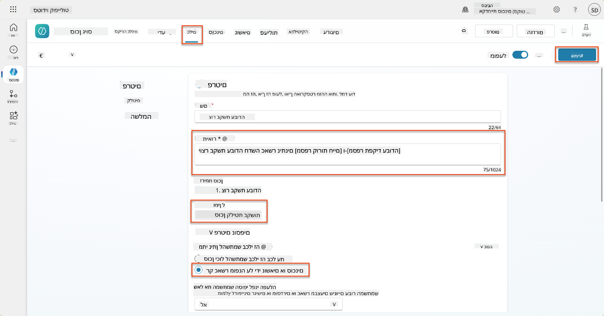

### 8.6 הגדר הוראות לסוכן

כדי ליצור מועמדויות, עליך להנחות את הסוכן מתי להשתמש בכלי החדש. במקרה זה, תבקש מהמשתמש לאשר לאילו תפקידים מוצעים להגיש מועמדות, ותנחה את הסוכן להפעיל את הכלי עבור כל תפקיד.

1. חזור אל **סוכן קבלת המועמדות**, ולאחר מכן מצא את לוח **הוראות**.

1. בשדה **הוראות**, **הוסף** את ההנחיות הברורות הבאות לסוכן המשני שלך **בסוף ההוראות הקיימות**:

    ```text
    3. Post Resume Upload
       - Respond with a formatted bullet list of [SuggestedJobRoles] the candidate could apply for.  
       - Use the format: [JobRoleNumber] - [RoleDescription]
       - Ask the user to confirm which Job Roles to create applications for the candidate.
       - When the user has confirmed a set of [JobRoleNumber]s, move to the next step.
    
    4. Post Upload - Application Creation
        - After the user confirms which [SuggestedJobRoles] for a specific [ResumeNumber]:
        E.g. "Apply [ResumeNumber] for the Job Roles [JobRoleNumber], [JobRoleNumber], [JobRoleNumber]
        E.g. "apply to all suggested job roles" - this implies use all the [JobRoleNumbers] 
         - Loop over each [JobRoleNumber] and send with [ResumeNumber] to /Create Job Application   
         - Summarize the Job Applications Created
    
    Strict Rules (that must never be broken)
    You must always follow these rules and never break them:
    1. The only valid identifiers are:
      - ResumeNumber (ppa_resumenumber)→ format R#####
      - CandidateNumber (ppa_candidatenumber)→ format C#####
      - ApplicationNumber (ppa_applicationnumber)→ format A#####
      - JobRoleNumber (ppa_jobrolenumber)→ format J#####
    2. Never guess or invent these values.
    3. Always extract identifiers from the current context (conversation, data, or system output). 
    ```

1. כאשר ההוראות כוללות קו נטוי (/), בחר את הטקסט לאחר הקו הנטוי ובחר את כלי **Create Job Application**.

1. בחר **שמור**  
    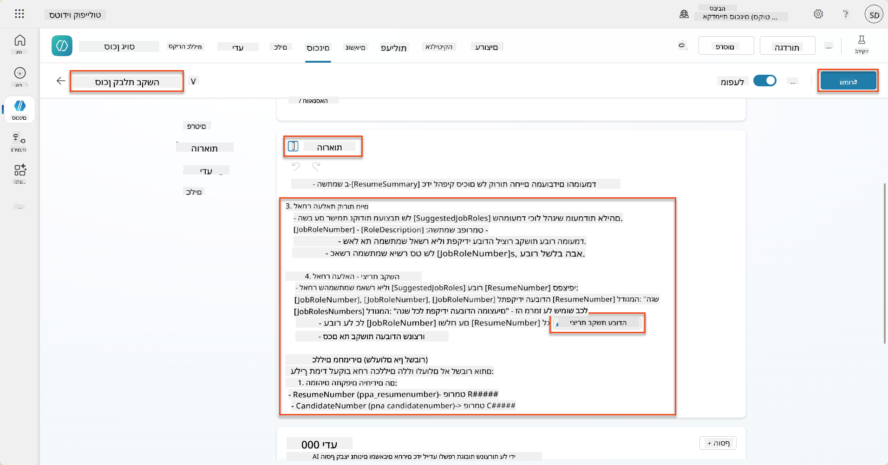

!!! tip "חזרה על פריטים מרובים באורקסטרציה גנרטיבית"
    ההוראות הללו משתמשות ביכולת האורקסטרציה הגנרטיבית לחזור על שורות מרובות כאשר מקבלים החלטות על אילו צעדים וכלים להשתמש. התפקידים המותאמים ייקראו באופן אוטומטי וסוכן קבלת המועמדות יפעל עבור כל שורה. ברוך הבא לעולם הקסום של אורקסטרציה גנרטיבית!

### 8.7 בדוק את הסוכן שלך

1. פתח את **סוכן הגיוס** ב-Copilot Studio.

1. **העלה** קורות חיים לדוגמה לצ'אט, והקלד:

    ```text
    This is a new resume for the Power Platform Developer Role.
    ```

1. שים לב כיצד הסוכן מספק רשימה של תפקידים מוצעים - כל אחד עם מספר תפקיד.  
    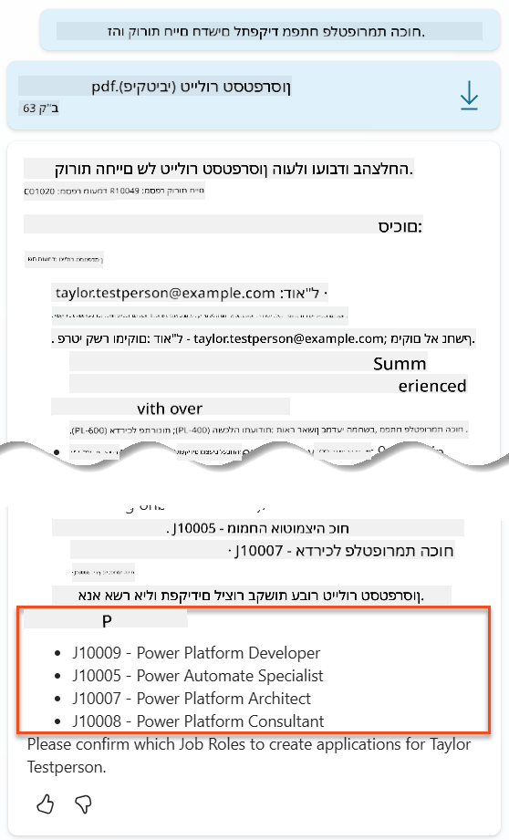

1. לאחר מכן תוכל לציין לאילו מהם תרצה להוסיף את קורות החיים כמועמדות לתפקיד.
    **דוגמאות:**

    ```text
    "Apply for all of those job roles"
    "Apply for the J10009 Power Platform Developer role"
    "Apply for the Developer and Architect roles"
    ```

    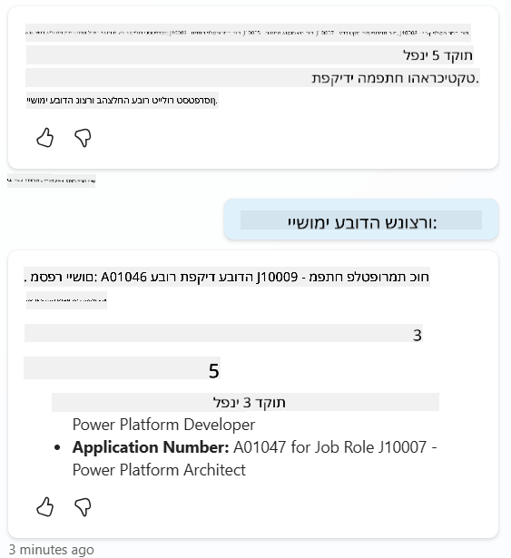

1. כלי **Create Job Application** יופעל עבור כל תפקיד שציינת. בתוך מפת הפעילות, תראה את כלי Create Job Application מופעל עבור כל אחד מהתפקידים שביקשת ליצור עבורם מועמדות:  
    

## 🎉 משימה הושלמה

עבודה מצוינת, אופרטיבי! **מבצע בקרת קרקע** הושלם. שיפרת בהצלחה את יכולות ה-AI שלך עם חיבור נתונים דינמי, ויצרת מערכת גיוס חכמה באמת.

הנה מה שהשגת במשימה זו:

**✅ שליטה בחיבור נתונים ל-Dataverse**  
עכשיו אתה מבין איך לחבר הנחיות מותאמות למקורות נתונים חיים עבור אינטליגנציה דינמית.

**✅ ניתוח קורות חיים משופר**  
זרימת סיכום הקורות חיים שלך עכשיו ניגשת לנתוני תפקידים בזמן אמת וקריטריוני הערכה להתאמה מדויקת.

**✅ קבלת החלטות מבוססת נתונים**  
סוכני הגיוס שלך יכולים עכשיו להסתגל באופן אוטומטי לדרישות תפקיד משתנות ללא עדכוני הנחיות ידניים.

**✅ יצירת מועמדות**  
המערכת המשופרת שלך יכולה עכשיו ליצור מועמדויות ומוכנה לאורקסטרציות זרימה מורכבות נוספות.

🚀 **הבא בתור:** במשימה הבאה שלך, תלמד כיצד ליישם יכולות הסקת מסקנות עמוקות שיעזרו לסוכנים שלך לקבל החלטות מורכבות ולספק הסברים מפורטים להמלצותיהם.

⏩ [עבור למשימה 09: הסקת מסקנות עמוקה](../09-deep-reasoning/README.md)

## 📚 משאבים טקטיים

📖 [שימוש בנתונים שלך בהנחיה](https://learn.microsoft.com/ai-builder/use-your-own-prompt-data?WT.mc_id=power-182762-scottdurow)

📖 [יצירת הנחיה מותאמת אישית](https://learn.microsoft.com/ai-builder/create-a-custom-prompt?WT.mc_id=power-182762-scottdurow)

📖 [עבודה עם Dataverse ב-Copilot Studio](https://learn.microsoft.com/microsoft-copilot-studio/knowledge-add-dataverse?WT.mc_id=power-182762-scottdurow)

📖 [סקירה כללית של הנחיות מותאמות אישית ב-AI Builder](https://learn.microsoft.com/ai-builder/prompts-overview?WT.mc_id=power-182762-scottdurow)

📖 [תיעוד AI Builder של Power Platform](https://learn.microsoft.com/ai-builder/?WT.mc_id=power-182762-scottdurow)

📖 [הדרכה: יצירת הנחיות AI Builder באמצעות נתוני Dataverse שלך](https://learn.microsoft.com/training/modules/ai-builder-grounded-prompts/?WT.mc_id=power-182762-scottdurow)

---

**כתב ויתור**:  
מסמך זה תורגם באמצעות שירות תרגום AI [Co-op Translator](https://github.com/Azure/co-op-translator). למרות שאנו שואפים לדיוק, יש להיות מודעים לכך שתרגומים אוטומטיים עשויים להכיל שגיאות או אי דיוקים. המסמך המקורי בשפתו המקורית צריך להיחשב כמקור סמכותי. עבור מידע קריטי, מומלץ להשתמש בתרגום מקצועי אנושי. איננו אחראים לאי הבנות או לפרשנויות שגויות הנובעות משימוש בתרגום זה.