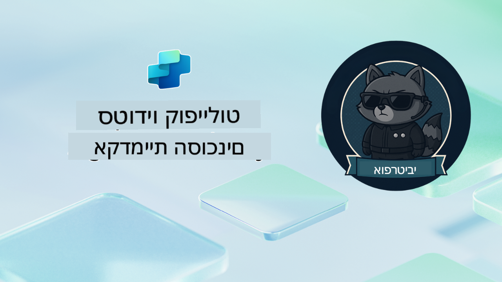

<!--
CO_OP_TRANSLATOR_METADATA:
{
  "original_hash": "24fcbe9a57d3439e05f8866e550c0a84",
  "translation_date": "2025-10-17T05:18:08+00:00",
  "source_file": "docs/operative-preview/README.md",
  "language_code": "he"
}
-->
# ברוך הבא, סוכן

**ברוך הבא, סוכן.**  
המשימה המתקדמת שלך—אם תבחר לקבל אותה—היא לשלוט באמנות בניית **מערכות מרובות סוכנים ברמת ארגון** באמצעות **Microsoft Copilot Studio**.

ההכשרה האינטנסיבית הזו תיקח אותך מעבר ליצירת סוכנים בסיסיים אל העולם המתקדם של **תזמור מרובה סוכנים**: החל מאוטומציה של גיוס עובדים ועד בטיחות AI, תלמד לבנות, לתאם ולהפעיל מערכות סוכנים חכמות באמצעות תרחישים אמיתיים ברמת ארגון.

--8<-- "disclaimer.md"

---

## 🎯 מטרת המשימה

עם סיום תוכנית אקדמיית הסוכנים, תוכל:

- לעצב וליישם **מערכות מרובות סוכנים** עבור תרחישים עסקיים מורכבים
- לשלוט בתבניות **תזמור סוכנים** ושיתוף פעולה
- ליישם **בטיחות AI ומיתון תוכן** במערכות ייצור
- לבנות **הנחיות מרובות מודלים** לעיבוד וניתוח מסמכים
- לפרוס **סוכנים מוכנים לארגון** עם ממשל ובדיקות מתאימות

---

## 🧪 דרישות מקדימות

כדי להשלים את כל המשימות, תצטרך:

- סיום הכשרת **Recruit אקדמיית הסוכנים**
- סביבה של Microsoft Power Platform עם רישיון **Copilot Studio**
- גישה ל- **Microsoft Dataverse**
- הרשאות ניהול ליצירת פתרונות וסוכנים

---

## 🧬 למי זה מיועד

הקורס המתקדם הזה מתאים ל:

- **אדריכלי פתרונות** המעצבים מערכות AI ארגוניות
- **מפתחים** הבונים פתרונות סוכנים מוכנים לייצור
- **אנשי IT** המיישמים ממשל ובטיחות AI
- **אנליסטים עסקיים** היוצרים זרימות עבודה אוטומטיות מורכבות
- כל מי שמוכן **להתקדם** מסוכנים בסיסיים למערכות ארגוניות

---

## 🧭 סקירת תוכנית הלימודים

האקדמיה בנויה כסדרה מתקדמת של פעולות שטח—כל משימה מתבססת על הקודמת כדי ליצור מערכת אוטומציה לגיוס עובדים מקיפה.

| משימה | כותרת | תדריך פעולה |
|-------|-------|-------------|
| `01` | 🚨 [התחל עם סוכן הגיוס](./01-get-started/README.md) | פרוס תשתית בסיסית ויצור את סוכן התזמור המרכזי שלך |
| `02` | 🎭 [הפוך את הסוכן שלך למוכן למרובה סוכנים עם סוכנים מחוברים](./02-multi-agent/README.md) | הפוך סוכן יחיד למערכת מתואמת של סוכנים מרובים |
| `03` | ⚡ [אוטומציה של הסוכן שלך עם טריגרים](./03-automate-triggers/README.md) | יישם התנהגויות סוכן אוטונומיות עם טריגרים מבוססי אירועים |
| `04` | 📝 [כתיבת הוראות לסוכן](./04-agent-instructions/README.md) | שלוט בתקשורת מדויקת של הסוכן ובשליטה על התנהגותו |
| `05` | 💬 [התאמה אישית של תגובות הסוכן](./05-agent-responses/README.md) | התאם אישית את תגובות הסוכן למקסימום השפעה ומעורבות |
| `06` | 🛡️ [עקרונות מיתון תוכן ובטיחות AI](./06-ai-safety/README.md) | יישם אמצעי בטיחות וציות ברמת ארגון |
| `07` | 🎨 [חילוץ תוכן קורות חיים עם הנחיות מרובות מודלים](./07-multimodal-prompts/README.md) | עיבוד מסמכים ותמונות עם יכולות AI מתקדמות |
| `08` | 🗄️ [הנחיות - עיגון ב-Dataverse](./08-dataverse-grounding/README.md) | עגן סוכנים בנתוני ארגון לתגובות מדויקות |
| `09` | 🧠 [יישום חשיבה מעמיקה להערכת התאמת מועמדים והכנה לראיונות](./09-deep-reasoning/README.md) | יישם חשיבה AI מתקדמת להחלטות מורכבות |
| `10` | 📄 [יצירת מסמכי ראיונות מותאמים אישית למועמדים עם הנחיות](./10-generate-documents/README.md) | צור מסמכים דינמיים בהתבסס על ניתוח הסוכן |
| `11` | 📊 [קבלת משוב משתמשים עם כרטיסים אדפטיביים](./11-obtain-user-feedback/README.md) | אסוף ועבד משוב משתמשים לשיפור מתמיד |
| `12` | 🌐 [פרסום הסוכנים שלך באתר הדגמה לבדיקת בעלי עניין](./12-demo-website/README.md) | פרוס פתרון מלא להדגמה ובדיקת בעלי עניין |

!!! note
    ✅ השלמת תוכנית הלימודים מזכה אותך בתג **סוכן**.  
    🔓 **מפקד** ייפתח בשלבים עתידיים.

---

**הצהרת אחריות**:  
מסמך זה תורגם באמצעות שירות תרגום AI [Co-op Translator](https://github.com/Azure/co-op-translator). למרות שאנו שואפים לדיוק, יש לקחת בחשבון שתרגומים אוטומטיים עשויים להכיל שגיאות או אי דיוקים. המסמך המקורי בשפתו המקורית צריך להיחשב כמקור סמכותי. עבור מידע קריטי, מומלץ להשתמש בתרגום מקצועי אנושי. איננו אחראים לאי הבנות או פירושים שגויים הנובעים משימוש בתרגום זה.