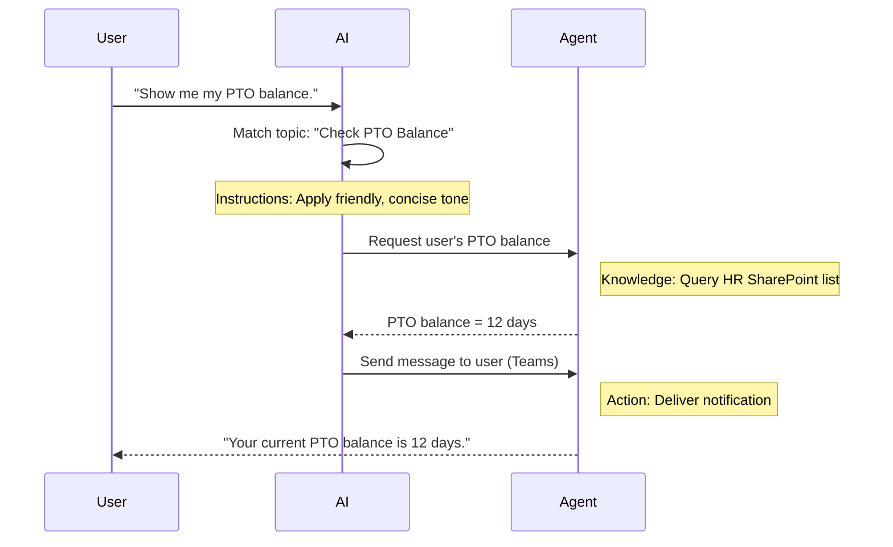

<!--
CO_OP_TRANSLATOR_METADATA:
{
  "original_hash": "90a3c5122f5687bbc8cc819990f175d4",
  "translation_date": "2025-10-17T06:00:39+00:00",
  "source_file": "docs/recruit/02-copilot-studio-fundamentals/README.md",
  "language_code": "he"
}
-->
# 🚨 משימה 02: יסודות Copilot Studio

## 🕵️‍♂️ שם קוד: `מבצע פרוטוקול ליבה`

> **⏱️ חלון זמן למבצע:** `~30 דקות – מידע בלבד, ללא עבודה בשטח`  

🎥 **צפו בסרטון ההדרכה**

[](https://www.youtube.com/watch?v=x4OCwDRGeLE "צפו בהדרכה ביוטיוב")

## 🎯 תדריך משימה

ברוך הבא, מגויס. משימה זו תספק לך מידע בסיסי להבנת אופן הפעולה של Copilot Studio וכיצד לבנות סוכנים חכמים שמספקים ערך עסקי אמיתי.

לפני שתבנה את הסוכן הראשון שלך, עליך להבין את ארבעת המרכיבים המרכזיים שמרכיבים כל סוכן AI מותאם אישית: ידע, כלים, נושאים והוראות. תלמד גם כיצד האלמנטים הללו פועלים יחד במערכת התזמור של Copilot Studio.

## 🔎 מטרות

במשימה זו, תלמד:

- **מהו Copilot Studio**
- **מתי ולמה להשתמש בסוכנים**
- **לחקור את ארבעת אבני הבניין של סוכנים**
      - **ידע**
      - **כלים**
      - **נושאים**
      - **הוראות**
- **להבין כיצד המרכיבים הללו פועלים יחד** ליצירת סוכן חכם ואוטומטי

---

## מה הם סוכנים ב-Copilot Studio?

**סוכן** הוא עוזר AI מיוחד שאתה מעצב כדי להתמודד עם משימות או שאלות ספציפיות. בניגוד לצ'אטבוט כללי, הסוכן שלך:

- **מכיר נתונים ספציפיים לחברה** (מדיניות, מסמכים, מסדי נתונים)  
- **מבצע משימות בעולם האמיתי** (שליחת הודעות, יצירת אירועי יומן, עדכון רשומות)  
- **שומר על הקשר השיח** כך שהוא יכול להמשיך משאלות קודמות  

מכיוון ש-Copilot Studio הוא בעל קוד נמוך, אתה יכול לגרור ולשחרר רכיבים מוכנים מראש – אין צורך בכישורי קידוד מעמיקים. לאחר שהסוכן שלך נבנה, אנשים יכולים להשתמש בו בתוך Teams, Slack או אפילו בדף אינטרנט מותאם אישית כדי לקבל תשובות או להפעיל תהליכי עבודה באופן אוטומטי.

---

## מתי ולמה להשתמש ב-Copilot Studio

בעוד Microsoft 365 Copilot מספק סיוע AI כללי באפליקציות Office, תצטרך סוכן מותאם אישית כאשר:

### אתה זקוק לידע ספציפי לתחום

- Copilot המובנה עשוי לא להכיר את הנהלים או הנתונים הפנימיים של החברה שלך. סוכן יכול לשאוב מידע מאתרים כמו SharePoint, מסדי נתונים או מקורות מותאמים אישית כדי לספק תשובות מדויקות ועדכניות.  

### אתה רוצה לאוטומט תהליכי עבודה מרובי שלבים

- לדוגמה: "כאשר מישהו מגיש הוצאה, שלח אותה לאישור, עדכן את מעקב הכספים והודע למנהל." סוכן מותאם אישית יכול לטפל בכל שלב, מופעל על ידי פקודה או אירוע יחיד.  

### אתה זקוק לחוויה קונטקסטואלית בתוך הכלי  

- דמיין סוכן קליטת עובדים חדשים ב-Teams שמנחה את צוות משאבי האנוש דרך כל מדיניות, שולח טפסים נחוצים ומתזמן פגישות אוריינטציה – הכל בתוך פלטפורמת שיתוף הפעולה הקיימת שלך.  

---

## ארבע אבני הבניין של סוכן

כל סוכן ב-Copilot Studio בנוי מארבעה מרכיבים מרכזיים:

1. **ידע**  
1. **כלים (פעולות)**  
1. **נושאים**  
1. **הוראות**

להלן, נגדיר כל אבן בניין ונראה כיצד הן פועלות יחד ליצירת סוכן אפקטיבי.

### 1. ידע

**ידע** הוא הנתונים וההקשר שהסוכן שלך משתמש בהם כדי לענות על שאלות בצורה מדויקת. יש לו שני חלקים:

#### הוראות מותאמות והקשר

- אתה כותב תיאור קצר של מטרת הסוכן והטון שלו. לדוגמה:  

    ```text
    You are an IT support agent. You help employees troubleshoot common software issues, provide troubleshooting steps, and escalate urgent tickets.
    ```

- במהלך שיחה, הסוכן זוכר פניות קודמות כך שהוא יכול להתייחס למה שכבר נדון (לדוגמה, אם המשתמש אומר תחילה, "המדפסת שלי לא מחוברת," ואז שואל מאוחר יותר, "בדקת את רמת הדיו?" הסוכן זוכר את ההקשר של המדפסת).

#### מקורות ידע (נתוני בסיס)

- אתה מחבר את הסוכן שלך למספר מקורות נתונים – ספריות SharePoint, אתרי תיעוד, וויקי או מסדי נתונים אחרים.  
- כאשר משתמש שואל שאלה, הסוכן שולף קטעים רלוונטיים ממקורות אלו כך שהתשובות יהיו **מבוססות** על המדיניות, מדריכי המוצר או כל מידע קנייני של הארגון שלך.  
- אתה יכול אפילו להכריח את הסוכן להגיב רק עם מידע ממקורות אלו, ולמנוע ממנו לנחש או "להמציא" תשובות.

!!! example
    סוכן "עוזר מדיניות" עשוי להתחבר לאתר SharePoint של משאבי אנוש שלך. אם משתמש שואל, "מהו שיעור הצבירה של PTO שלנו?" הסוכן שולף את הטקסט המדויק ממסמך מדיניות משאבי אנוש במקום להסתמך על תשובת AI כללית.

---

### 2. כלים (פעולות)

**כלים (פעולות)** מגדירים מה הסוכן יכול לעשות מעבר לשיחה. כל פעולה היא משימה שהסוכן מבצע באופן תכנותי, כגון:

- שליחת אימייל או הודעת Teams  
- יצירת או עדכון אירוע ביומן  
- הוספה או עריכה של רשומה במסד נתונים (לדוגמה, רשימת SharePoint או טבלת Dataverse)  
- קריאה לזרימת Power Automate או API REST  

#### כיצד פעולות פועלות

- **הגדרת קלטים ופלטים**  
      - לדוגמה, פעולה של שליחת אימייל עשויה לדרוש:  
        - `RecipientEmailAddress`  
        - `SubjectLine`  
        - `EmailBody`  

- **שילוב פעולות בתהליכי עבודה**  
      - לעיתים, מילוי בקשת משתמש כרוך במספר שלבים.  
      - אתה יכול לסדר פעולות כך ש:  
             1. הסוכן שולף נתונים מרשימת SharePoint.  
             2. הוא יוצר סיכום באמצעות LLM.  
             3. הוא שולח הודעת Teams עם הסיכום הזה.  

- **חיבור למערכות חיצוניות**  
      - אם אתה צריך לעדכן CRM או לקרוא ל-API פנימי, צור פעולה מותאמת אישית לטיפול בכך.  
      - Copilot Studio יכול להשתלב עם פלטפורמת Power או כל נקודת קצה מבוססת HTTP.

!!! example "סוכן "עוזר הוצאות" יכול:"  
    1. להאזין לבקשת "שלח הוצאה".  
    2. לאסוף את פרטי ההוצאה של המשתמש מטופס.  
    3. להשתמש בפעולה "הוסף לרשימת SharePoint" כדי לאחסן את הנתונים.  
    4. להפעיל פעולה "שלח אימייל" כדי להודיע למאשר.  

---

### 3. נושאים

**נושאים** מגדירים את הטריגרים השיחתיים או נקודות הכניסה לסוכן שלך. כל נושא מתייחס לקטגוריית שאלה או פונקציונליות מסוימת.

#### טריגרים שיחתיים  

- נושא יכול להיות "שלח קריאת תמיכה IT," "בדוק יתרת חופשה," או "צור דוח מכירות."  
- מאחורי הקלעים, Copilot Studio משתמש ב**תזמור גנרטיבי**: במקום להסתמך על מילות מפתח מדויקות, ה-AI מפרש את כוונת המשתמש ובוחר את הנושא הנכון בהתבסס על תיאור קצר שאתה מספק.  

#### תיאורי נושאים  

- בכל נושא, אתה כותב תיאור ברור ותמציתי של מה שהנושא מכסה.

!!! example "דוגמה לתיאור נושא"
    נושא זה עוזר למשתמשים לשלוח קריאת תמיכה IT על ידי איסוף פרטי הבעיה, עדיפות ומידע ליצירת קשר.

- ה-AI משתמש בתיאור הזה כדי להחליט מתי להפעיל את הנושא הזה, גם אם ניסוח המשתמש לא תואם בדיוק.

#### מיפוי נושאים לפעולות  

- כל נושא מחובר לאחת או יותר פעולות או שלבי שליפת נתונים.  
- כאשר ה-AI בוחר נושא, הוא מנחה את השיחה דרך הרצף שהגדרת (שאל שאלות המשך, קרא לפעולות, החזר תוצאות).

!!! example
    אם משתמש אומר, "אני צריך עזרה בהגדרת המחשב הנייד החדש שלי," ה-AI עשוי להתאים את הכוונה לנושא "שלח קריאת תמיכה IT". הסוכן אז מבקש את דגם המחשב הנייד, פרטי המשתמש, ומכניס קריאה למערכת התמיכה באופן אוטומטי.

---

### 4. הוראות

**הוראות** (לעיתים נקראות "הנחיות" או "הודעות מערכת") מנחות את הטון, הסגנון והגבולות של ה-LLM. הן מעצבות כיצד הסוכן מגיב בכל מצב.

#### תפקיד ואישיות  

- אתה אומר ל-AI מי הוא (לדוגמה, "אתה נציג שירות לקוחות עבור Contoso Retail").  
- זה קובע את הטון – ידידותי, תמציתי, פורמלי או קליל – בהתאם למקרה השימוש שלך.

#### הנחיות תגובה  

- ציין כללים שהסוכן חייב לעקוב אחריהם, כגון:  
      - "תמיד סכם מידע מדיניות בנקודות."  
      - "אם אינך יודע את התשובה, אמור 'מצטער, אין לי את המידע הזה.'"  
      - "לעולם אל תכלול נתונים חסויים מחוץ להקשר."

#### כללי זיכרון והקשר

- אתה יכול להנחות את הסוכן כמה פניות שיחה לזכור.  
- לדוגמה: "זכור פרטים מבקשות המשתמש הזה עד שלוש שאלות המשך."

!!! example "בסוכן "יועץ הטבות", תוכל לכלול:"
    "תמיד התייחס למדריך משאבי האנוש העדכני ביותר בעת מענה על שאלות. אם נשאל על מועדי הרשמה, ספק את התאריכים הספציפיים מהמדיניות. שמור תשובות מתחת ל-150 מילים."

---

## כיצד ארבע אבני הבניין פועלות יחד

כאשר אתה מרכיב **ידע**, **כלים**, **נושאים** ו**הוראות**, מתזמר ה-AI של Copilot Studio יוצר סוכן ש:

1. **מקשיב לנושא רלוונטי** (בהתאם לתיאורי הנושא שלך).  
1. **מיישם הוראות** כדי לקבוע את הטון, להחליט מתי לשאול שאלות המשך ולאכוף כללים.  
1. **מנצל מקורות ידע** כדי לבסס את תשובותיו על נתוני הארגון שלך.  
1. **מפעיל כלים (פעולות)** לפי הצורך לביצוע משימות – שליחת הודעות, עדכון רשומות או קריאה ל-APIs.  

מאחורי הקלעים, המתזמר משתמש בגישה של **תכנון גנרטיבי**: הוא מחליט אילו צעדים לנקוט, באיזה סדר, כדי למלא בקשת משתמש. אם פעולה נכשלת (לדוגמה, אימייל לא נשלח), הסוכן עוקב אחר הנחיות הטיפול שלך בשגיאות (שאל שאלה מבהירה או דווח על השגיאה). מכיוון שה-LLM מתאים את עצמו להקשר השיחה, הסוכן יכול לשמור זיכרון לאורך מספר פניות ולשלב מידע חדש ככל שהשיחה מתפתחת.

**דוגמה לזרימה חזותית:**  
<!--
1. **משתמש:** "הראה לי את יתרת החופשה שלי."
1. **AI (נושאים):** מתאים לנושא "בדוק יתרת חופשה".  
1. **AI (הוראות):** משתמש בטון ידידותי ותמציתי.  
1. **סוכן (ידע):** שואל את רשימת SharePoint של משאבי אנוש לגבי יתרת המשתמש.  
1. **סוכן (פעולות):** שולף את הערך ושולח הודעת Teams:  
   > "יתרת החופשה הנוכחית שלך היא 12 ימים."  
-->



---

## 🎉 משימה הושלמה

סיימת בהצלחה את תדריך היסודות שלך. עכשיו למדת את ארבעת אבני הבניין החיוניות של כל סוכן ב-Copilot Studio:

1. **ידע** – המקום שבו הסוכן מחפש מידע עובדתי ושומר זיכרון שיחה.  
1. **כלים** – המשימות שהסוכן יכול לבצע כדי לפעול באופן אוטומטי.  
1. **נושאים** – כיצד הסוכן מזהה את כוונת המשתמש ומחליט איזה תהליך להפעיל.  
1. **הוראות** – הכללים, הטון והגבולות שמנחים כל תגובה.

עם המרכיבים הללו במקום, תוכל לבנות סוכן בסיסי שעונה על שאלות ומבצע תהליכי עבודה פשוטים. בשיעור הבא, נעבור על מדריך שלב-אחר-שלב ליצירת סוכן "שירות לקוחות" – החל מחיבור מקור הידע הראשון שלך ועד הגדרת נושא וחיבור פעולה.

בהמשך: תבנה את [הסוכן ההצהרתי הראשון שלך עבור M365 Copilot](../03-create-a-declarative-agent-for-M365Copilot/README.md).

<!-- markdownlint-disable-next-line MD033 -->


---

**הצהרת אחריות**:  
מסמך זה תורגם באמצעות שירות תרגום AI [Co-op Translator](https://github.com/Azure/co-op-translator). למרות שאנו שואפים לדיוק, יש לקחת בחשבון שתרגומים אוטומטיים עשויים להכיל שגיאות או אי דיוקים. המסמך המקורי בשפתו המקורית צריך להיחשב כמקור סמכותי. עבור מידע קריטי, מומלץ להשתמש בתרגום מקצועי אנושי. איננו אחראים לאי הבנות או לפרשנויות שגויות הנובעות משימוש בתרגום זה.