<!--
CO_OP_TRANSLATOR_METADATA:
{
  "original_hash": "cd99a76bcb7372ac2771b6ae178b023d",
  "translation_date": "2025-10-17T05:41:34+00:00",
  "source_file": "docs/recruit/10-add-event-triggers/README.md",
  "language_code": "he"
}
-->
# 🚨 משימה 10: הוספת טריגרים לאירועים - הפעלת יכולות סוכן אוטונומי

## 🕵️‍♂️ שם קוד: `מבצע שגרה רפאים`

> **⏱️ חלון זמן המבצע:** `~45 דקות`

🎥 **צפו בהדרכה**

[](https://www.youtube.com/watch?v=ZgwHL8PQ1nY "צפו בהדרכה ביוטיוב")

## 🎯 תדריך המשימה

הגיע הזמן לשדרג את הסוכן שלכם מעוזר שיחה למפעיל אוטונומי. המשימה שלכם היא לאפשר לסוכן שלכם לפעול ללא צורך בזימון - להגיב לאותות מכל רחבי התחום הדיגיטלי שלכם בדיוק ובמהירות.

עם טריגרים לאירועים, תלמדו את הסוכן שלכם לעקוב אחר מערכות חיצוניות כמו SharePoint, Teams ו-Outlook, ולבצע פעולות חכמות ברגע שמתקבל אות. מבצע זה הופך את הסוכן שלכם לנכס שדה פעיל לחלוטין - שקט, מהיר ותמיד ערני.

הצלחה פירושה בניית סוכנים שמייצרים ערך - ולא רק מגיבים אליו.

## 🔎 מטרות

📖 השיעור הזה יכסה:

- הבנת טריגרים לאירועים וכיצד הם מאפשרים התנהגות סוכן אוטונומית
- למידת ההבדל בין טריגרים לאירועים לבין טריגרים לנושאים, כולל זרימות עבודה של טריגרים ומטענים
- חקר תרחישים נפוצים של טריגרים לאירועים
- הבנת שיקולי אימות, אבטחה ופרסום עבור סוכנים מבוססי אירועים
- בניית סוכן IT Help Desk אוטונומי שמגיב לאירועים ב-SharePoint ושולח אישורי דוא"ל

## 🤔 מהו טריגר לאירוע?

**טריגר לאירוע** הוא מנגנון שמאפשר לסוכן שלכם לפעול באופן אוטונומי בתגובה לאירועים חיצוניים, ללא צורך בקלט ישיר מהמשתמש. חשבו על זה כעל הפיכת הסוכן שלכם ל"צופה" באירועים ספציפיים ולפעול אוטומטית כאשר אירועים אלו מתרחשים.

בניגוד לטריגרים לנושאים, שדורשים מהמשתמשים להקליד משהו כדי להפעיל שיחה, טריגרים לאירועים מופעלים על סמך דברים שמתרחשים במערכות המחוברות שלכם. לדוגמה:

- כאשר קובץ חדש נוצר ב-SharePoint או ב-OneDrive for Business
- כאשר רשומה נוצרת ב-Dataverse
- כאשר משימה מושלמת ב-Planner
- כאשר תגובה חדשה לטופס Microsoft נשלחת
- כאשר הודעה חדשה ב-Microsoft Teams מתווספת
- על בסיס לוח זמנים חוזר (כמו תזכורות יומיות)  
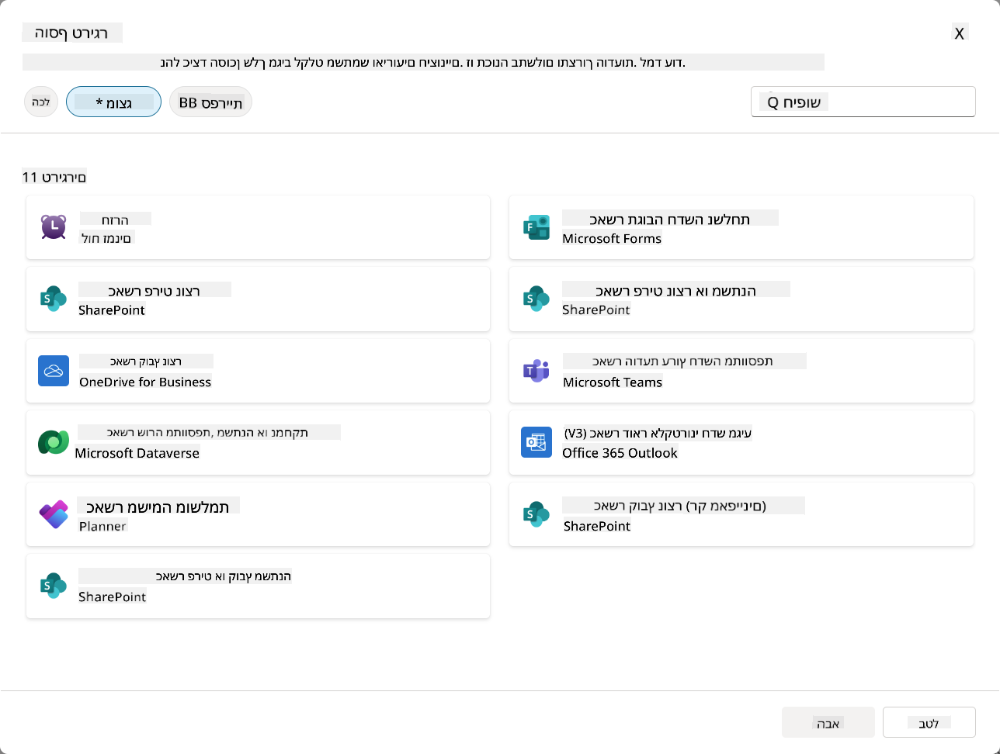

### למה טריגרים לאירועים חשובים בסוכנים אוטונומיים

טריגרים לאירועים הופכים את הסוכן שלכם מעוזר תגובתי לעוזר אוטונומי ופרואקטיבי:

1. **פעולה אוטונומית** - הסוכן שלכם יכול לעבוד 24/7 ללא התערבות אנושית, ולהגיב לאירועים בזמן שהם מתרחשים.
    - *דוגמה:* קבלת פנים אוטומטית לחברי צוות חדשים כשהם מתווספים לצוות.

1. **תגובתיות בזמן אמת** - במקום להמתין שהמשתמשים ישאלו שאלות, הסוכן שלכם מגיב מיד לאירועים רלוונטיים.
    - *דוגמה:* התרעת צוות ה-IT כאשר מסמך ב-SharePoint משתנה.

1. **אוטומציה של זרימות עבודה** - חיבור מספר פעולות על בסיס אירוע טריגר יחיד.
    - *דוגמה:* כאשר נוצר כרטיס תמיכה חדש, יצירת משימה, הודעה למנהל ועדכון לוח מעקב.

1. **תהליכים עקביים** - הבטחת שלבים חשובים שלא יפספסו על ידי אוטומציה של תגובות לאירועים מרכזיים.
    - *דוגמה:* כל עובד חדש מקבל באופן אוטומטי חומרי הכשרה ובקשות גישה.

1. **פעולות מבוססות נתונים** - שימוש במידע מהאירוע המפעיל כדי לקבל החלטות חכמות ולבצע פעולות מתאימות.
    - *דוגמה:* ניתוב כרטיסים דחופים לצוות בכיר על בסיס רמת עדיפות במטען הטריגר.

## ⚙️ איך טריגרים לאירועים עובדים?

טריגרים לאירועים פועלים באמצעות זרימת עבודה בת שלושה שלבים שמאפשרת לסוכן שלכם להגיב באופן אוטונומי לאירועים חיצוניים:

### זרימת העבודה של הטריגר

1. **זיהוי אירוע** - אירוע ספציפי מתרחש במערכת מחוברת (SharePoint, Teams, Outlook וכו')
1. **הפעלת טריגר** - טריגר האירוע מזהה את האירוע ושולח מטען לסוכן שלכם דרך Power Automate Cloud Flow.
1. **תגובת הסוכן** - הסוכן שלכם מקבל את המטען ומבצע את ההוראות שהגדרתם

### טריגרים לאירועים מול טריגרים לנושאים

הבנת ההבדל בין שני סוגי הטריגרים הללו היא קריטית:

| **טריגרים לאירועים** | **טריגרים לנושאים** |
|-------------------|-------------------|
| מופעלים על ידי אירועים במערכות חיצוניות | מופעלים על ידי קלט/ביטויים של משתמש |
| מאפשרים התנהגות סוכן אוטונומית | מאפשרים תגובות שיחה |
| משתמשים באימות של היוצר | אפשרות לאימות של המשתמש |
| פועלים ללא אינטראקציה עם המשתמש | דורשים מהמשתמש להתחיל שיחה |
| דוגמאות: יצירת קובץ, קבלת דוא"ל | דוגמה: "מה מזג האוויר?" |

## 📦 הבנת מטעני טריגר

כאשר אירוע מתרחש, הטריגר שולח **מטען** לסוכן שלכם המכיל מידע על האירוע והוראות כיצד להגיב.

### מטענים ברירת מחדל מול מטענים מותאמים אישית

כל סוג טריגר מגיע עם מבנה מטען ברירת מחדל, אך ניתן להתאים אותו:

**מטען ברירת מחדל** - משתמש בפורמט סטנדרטי כמו `Use content from {Body}`

- מכיל מידע בסיסי על האירוע
- משתמש בהוראות עיבוד כלליות
- טוב לתרחישים פשוטים

**מטען מותאם אישית** - הוספת הוראות ספציפיות ועיצוב נתונים

- כולל הוראות מפורטות לסוכן שלכם
- מציין בדיוק אילו נתונים להשתמש וכיצד
- טוב יותר לזרימות עבודה מורכבות

### הוראות לסוכן מול הוראות מטען מותאמות אישית

יש לכם שני מקומות להנחות את התנהגות הסוכן שלכם עם טריגרים לאירועים:

**הוראות לסוכן** (גלובלי)

- הנחיות רחבות החלות על כל הטריגרים
- דוגמה: "בעת עיבוד כרטיסים, תמיד בדוק כפילויות תחילה"
- הכי טוב לדפוסי התנהגות כלליים

**הוראות מטען** (ספציפי לטריגר)

- הוראות ספציפיות לסוגי טריגרים בודדים  
- דוגמה: "לשדרוג זה ב-SharePoint, שלח סיכום לערוץ הפרויקט"
- הכי טוב לסוכנים מורכבים עם מספר טריגרים

💡 **טיפ מקצועי**: הימנעו מהוראות סותרות בין שני הרמות הללו, שכן זה יכול לגרום להתנהגות בלתי צפויה.

## 🎯 תרחישים נפוצים של טריגרים לאירועים

הנה דוגמאות מעשיות כיצד טריגרים לאירועים יכולים לשפר את הסוכן שלכם:

### סוכן IT Help Desk

- **טריגר**: פריט חדש ברשימת SharePoint (כרטיס תמיכה)
- **פעולה**: קטלוג אוטומטי, קביעת עדיפות, והודעה לחברי צוות מתאימים

### סוכן קליטת עובדים

- **טריגר**: משתמש חדש שנוסף ל-Dataverse
- **פעולה**: שליחת הודעת ברוך הבא, יצירת משימות קליטה, והקצאת גישה

### סוכן ניהול פרויקטים

- **טריגר**: משימה שהושלמה ב-Planner
- **פעולה**: עדכון לוח פרויקט, הודעה לבעלי עניין, ובדיקת חסמים

### סוכן ניהול מסמכים

- **טריגר**: קובץ שהועלה לתיקיית SharePoint ספציפית
- **פעולה**: חילוץ מטא-נתונים, הוספת תגיות, והודעה לבעלי המסמך

### סוכן עוזר פגישות

- **טריגר**: אירוע בלוח שנה נוצר
- **פעולה**: שליחת תזכורות לפני הפגישה ואג'נדה, הזמנת משאבים

## ⚠️ שיקולי פרסום ואימות

לפני שהסוכן שלכם יוכל להשתמש בטריגרים לאירועים בסביבת ייצור, עליכם להבין את השלכות האימות והאבטחה.

### אימות היוצר

טריגרים לאירועים משתמשים ב**אישורי היוצר של הסוכן** לכל האימות:

- הסוכן שלכם ניגש למערכות באמצעות ההרשאות שלכם
- משתמשים יכולים לגשת לנתונים דרך האישורים שלכם
- כל הפעולות מתבצעות "כמוכם" גם כאשר משתמשים מתקשרים עם הסוכן

### שיטות עבודה מומלצות להגנת נתונים

כדי לשמור על אבטחה בעת פרסום סוכנים עם טריגרים לאירועים:

1. **העריכו גישה לנתונים** - בדקו אילו מערכות ונתונים הטריגרים שלכם יכולים לגשת אליהם
1. **בצעו בדיקות יסודיות** - הבינו אילו מידע הטריגרים כוללים במטענים
1. **צמצמו את טווח הטריגרים** - השתמשו בפרמטרים ספציפיים כדי להגביל אילו אירועים מפעילים טריגרים
1. **בדקו נתוני מטען** - ודאו שהטריגרים לא חושפים מידע רגיש
1. **עקבו אחר שימוש** - עקבו אחר פעילות הטריגרים וצריכת משאבים

## ⚠️ פתרון בעיות ומגבלות

שימו לב לשיקולים חשובים אלו בעת עבודה עם טריגרים לאירועים:

### השפעות על מכסה ועלויות

- כל הפעלה של טריגר נחשבת לצריכת הודעה
- טריגרים תכופים (כמו חזרה כל דקה) יכולים לצרוך מכסה במהירות
- עקבו אחר השימוש כדי להימנע מהגבלות

### דרישות טכניות

- זמין רק לסוכנים עם אורקסטרציה גנרטיבית מופעלת
- דורש הפעלת שיתוף זרימת ענן מודעת לפתרון בסביבתכם

### מניעת אובדן נתונים (DLP)

- מדיניות ה-DLP של הארגון שלכם קובעת אילו טריגרים זמינים
- מנהלים יכולים לחסום טריגרים לאירועים לחלוטין
- פנו למנהל שלכם אם טריגרים צפויים אינם זמינים

## 🧪 מעבדה 10 - הוספת טריגרים לאירועים להתנהגות סוכן אוטונומית

### 🎯 מקרה שימוש

תשדרגו את סוכן ה-IT Help Desk שלכם כדי להגיב אוטומטית לבקשות תמיכה חדשות. כאשר מישהו יוצר פריט חדש ברשימת כרטיסי התמיכה שלכם ב-SharePoint, הסוכן שלכם:

1. יופעל באופן אוטונומי כאשר כרטיס SharePoint נוצר
1. יספק את פרטי הכרטיס והוראות על השלבים שתרצו שיבצע
1. יאשר את הכרטיס אוטומטית למגיש באמצעות דוא"ל שנוצר על ידי AI

מעבדה זו מדגימה כיצד טריגרים לאירועים מאפשרים התנהגות סוכן אוטונומית באמת.

### דרישות מוקדמות

לפני תחילת המעבדה, ודאו שיש לכם:

- ✅ השלמת מעבדות קודמות (במיוחד מעבדות 6-8 עבור סוכן IT Help Desk)
- ✅ גישה לאתר SharePoint עם רשימת כרטיסי תמיכה
- ✅ סביבת Copilot Studio עם טריגרים לאירועים מופעלים
- ✅ הסוכן שלכם עם אורקסטרציה גנרטיבית מופעלת
- ✅ הרשאות מתאימות ב-SharePoint ובסביבת Copilot Studio שלכם

### 10.1 הפעלת AI גנרטיבי ויצירת טריגר ליצירת פריט ב-SharePoint

1. פתחו את **סוכן IT Help Desk** שלכם ב-**Copilot Studio**

1. תחילה, ודאו ש-**AI גנרטיבי** מופעל עבור הסוכן שלכם:
   - נווטו ללשונית **סקירה כללית**
   - תחת סעיף האורקסטרציה, הפעילו את **אורקסטרציה גנרטיבית** ל-**On** אם היא עדיין לא מופעלת  
     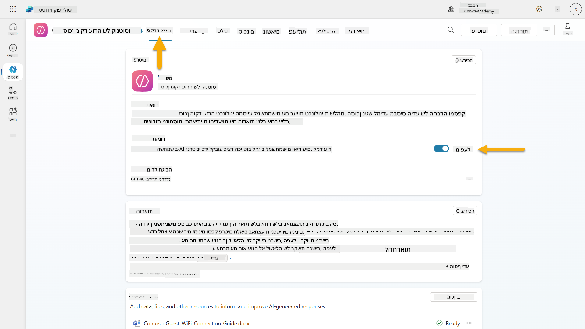

1. נווטו ללשונית **סקירה כללית** ומצאו את סעיף **טריגרים**

1. לחצו על **+ הוספת טריגר** כדי לפתוח את ספריית הטריגרים  
    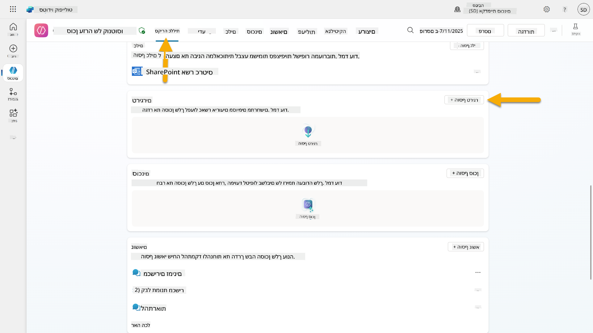

1. חפשו ובחרו **כאשר פריט נוצר** (SharePoint)  
    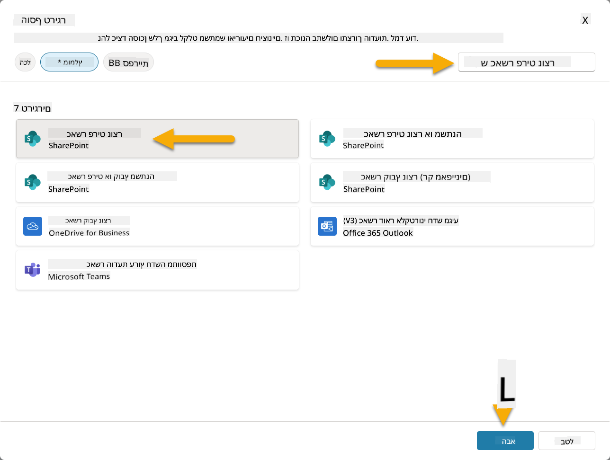

1. הגדירו את שם הטריגר והחיבורים:

   - **שם הטריגר:** כרטיס תמיכה חדש נוצר ב-SharePoint

1. המתינו עד שהחיבורים יוגדרו, ובחרו **הבא** כדי להמשיך.  
   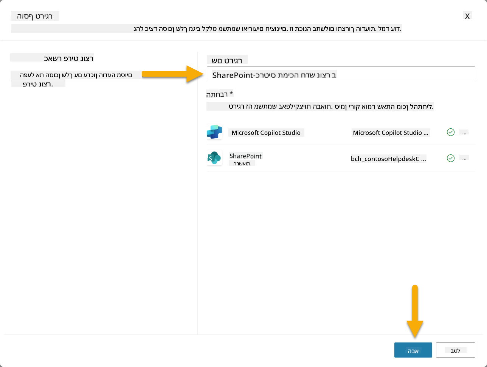

1. הגדירו את פרמטרי הטריגר:

   - **כתובת האתר**: בחרו באתר SharePoint "Contoso IT" שלכם

   - **שם הרשימה**: בחרו ברשימת "כרטיסים" שלכם

   - **הוראות נוספות לסוכן כאשר הוא מופעל על ידי הטריגר:**

     ```text
     New Support Ticket Created in SharePoint: {Body}
     
     Use the 'Acknowledge SharePoint Ticket' tool to generate the email body automatically and respond.
     
     IMPORTANT: Do not wait for any user input. Work completely autonomously.
     ```

     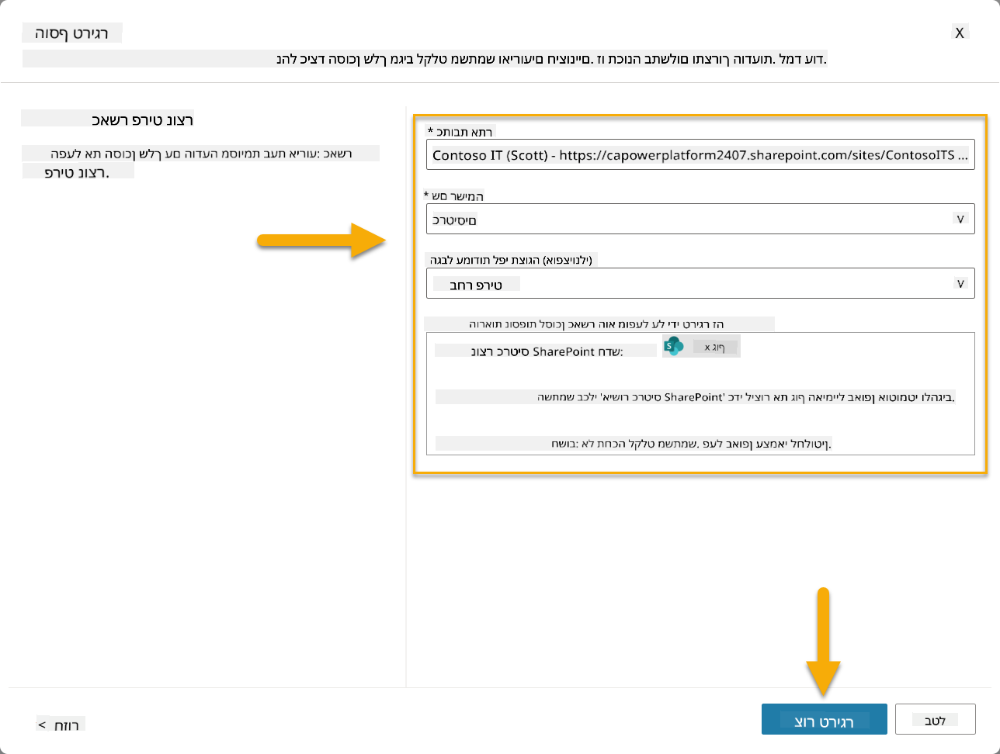

1. בחרו **צור טריגר** כדי להשלים את יצירת הטריגר. זרימת ענן Power Automate נוצרת אוטומטית כדי להפעיל את הסוכן באופן אוטונומי.

1. בחרו **סגור**.

### 10.2 עריכת הטריגר

1. בתוך סעיף **טריגרים** בלשונית **סקירה כללית**, בחרו בתפריט **...** על הטריגר **כרטיס תמיכה חדש נוצר ב-SharePoint**

1. בחרו **עריכה ב-Power Automate**  
   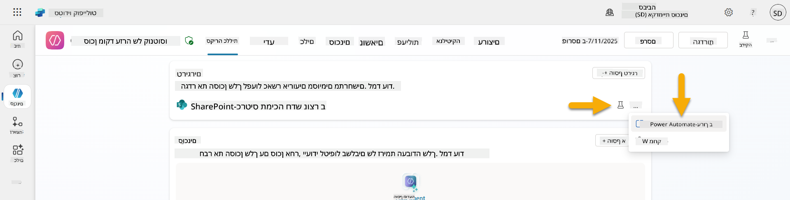

1. בחרו את הצומת **שולח הנחיה לקופילוט המוגדר לעיבוד**

1. בשדה **תוכן/הודעה**, הסירו את תוכן התוכן, **לחצו על מקש הסלאש קדימה** (/) ובחרו **הכנס ביטוי**  
   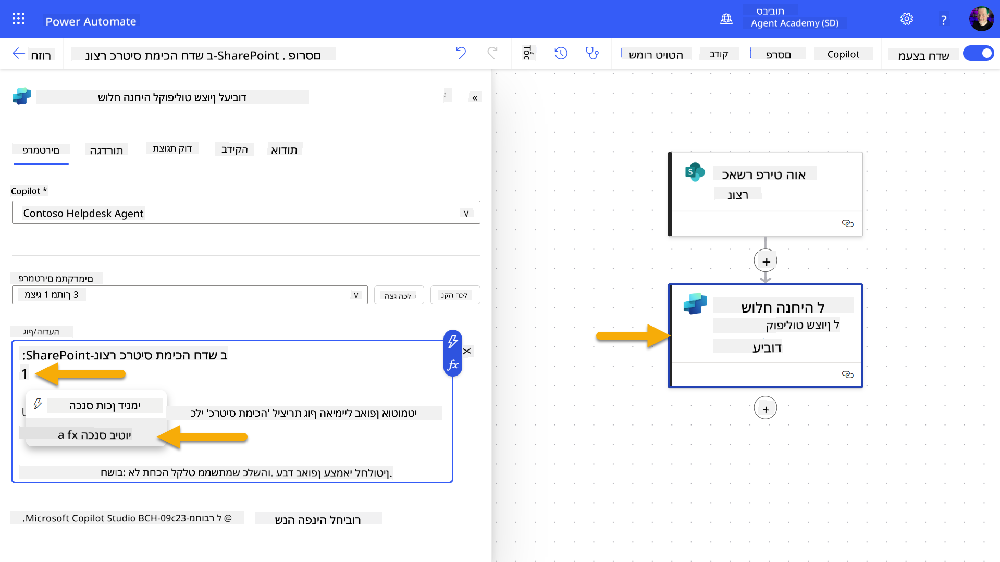

1. הכניסו את הביטוי הבא כדי לספק לסוכן פרטים ספציפיים על הכרטיס:

    ```text
    concat('Submitted By Name: ', first(triggerOutputs()?['body/value'])?['Author/DisplayName'], '\nSubmitted By Email: ', first(triggerOutputs()?['body/value'])?['Author/Email'], '\nTitle: ', first(triggerOutputs()?['body/value'])?['Title'], '\nIssue Description: ', first(triggerOutputs()?['body/value'])?['Description'], '\nPriority: ', first(triggerOutputs()?['body/value'])?['Priority/Value'],'\nTicket ID : ', first(triggerOutputs()?['body/value'])?['ID'])
    ```

1. בחרו **הוסף**  
   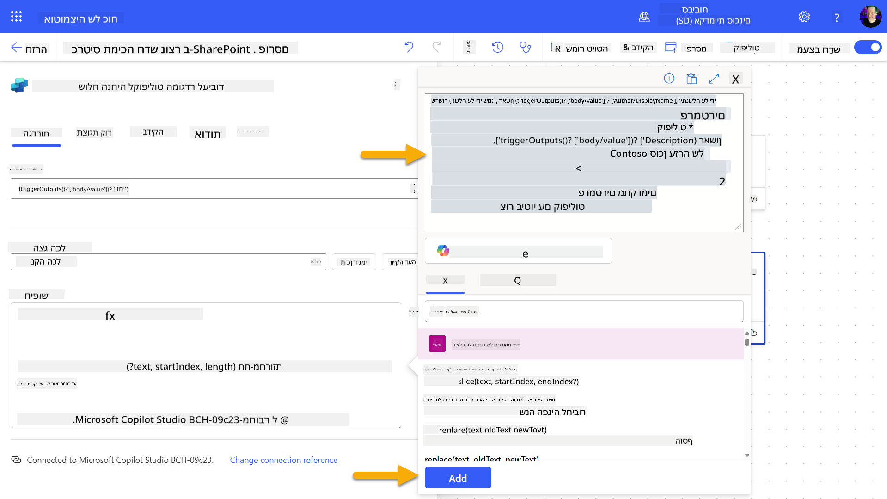

1. בחרו **פרסם** בסרגל הכלים העליון.

### 10.3 יצירת כלי לאישור דוא"ל

1. **חזרו** לסוכן שלכם ב-Copilot Studio

1. נווטו ללשונית **כלים** בסוכן שלכם

1. לחצו **+ הוספת כלי** ובחרו **מחבר**

1. חפשו ובחרו **שליחת דוא"ל (V2)** מחבר  
    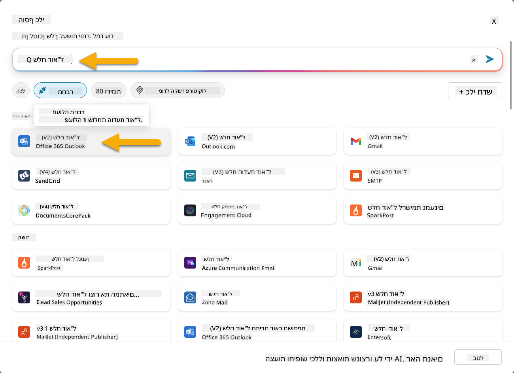

1. המתינו עד שהחיבור יוגדר, ואז בחרו **הוסף והגדיר**

1. הגדירו את הגדרות הכלי:

   - **שם**: אישור כרטיס SharePoint
   - **תיאור**: כלי זה שולח אישור דוא"ל שהכרטיס התקבל.

1. בחרו **התאמה אישית** ליד פרמטרי הקלט והגדירו כדלקמן:

    **אל**:

    - **תיאור**: כתובת הדוא"ל של האדם שמגיש את כרטיס SharePoint
    - **זיהוי כ**: דוא"ל

    **תוכן**:

    - **תיאור**: אישור שהכרטיס התקבל, ואנו שואפים להגיב תוך 3 ימי עבודה.

    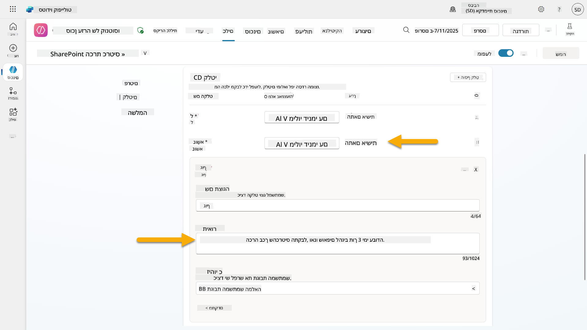

1. בחרו **שמור**

###
1. פתחו לשונית חדשה בדפדפן ועברו לרשימת **כרטיסי תמיכה IT של SharePoint** שלכם  
1. לחצו על **+ הוספת פריט חדש** כדי ליצור כרטיס בדיקה:  
   - **כותרת**: "לא מצליח להתחבר ל-VPN"  
   - **תיאור**: "לא מצליח להתחבר לרשת ה-WIFI הארגונית לאחר עדכון אחרון"  
   - **עדיפות**: "רגילה"  

1. **שמרו** את הפריט ב-SharePoint  
    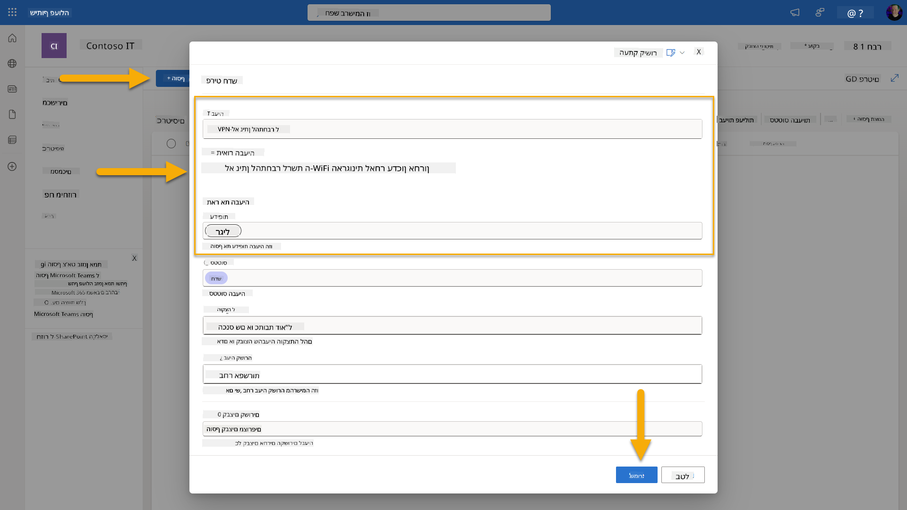  
1. חזרו ל-**Copilot Studio** ועקבו אחר לוח **בדיקת ההפעלה של הטריגר** כדי לראות את הפעלת הטריגר. השתמשו באייקון **רענון** כדי לטעון את אירוע הטריגר, זה עשוי לקחת כמה דקות.  
    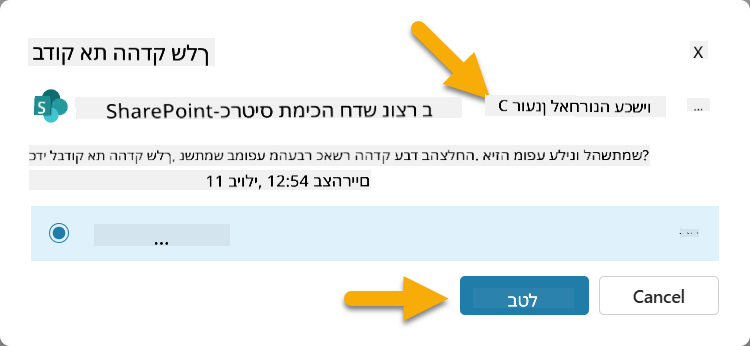  
1. ברגע שהטריגר מופיע, בחרו **התחל בדיקה**  
1. בחרו את **אייקון מפת הפעילות** בראש לוח **בדוק את הסוכן שלך**  
1. ודאו שהסוכן שלכם:  
   - קיבל את נתוני הטריגר  
   - השתמש בכלי "אישור כרטיס SharePoint"  
     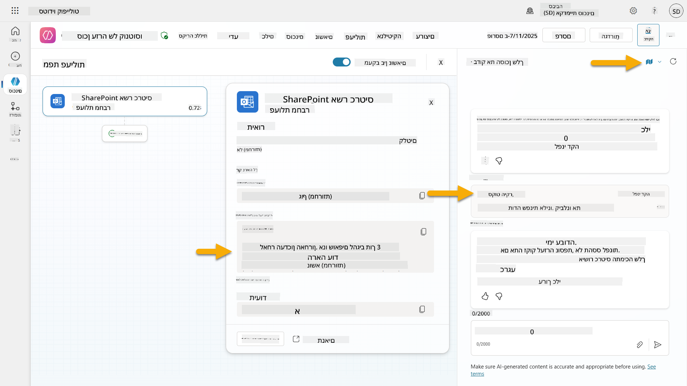  
1. בדקו את תיבת הדואר האלקטרוני של השולח כדי לוודא שנשלח מייל אישור  
    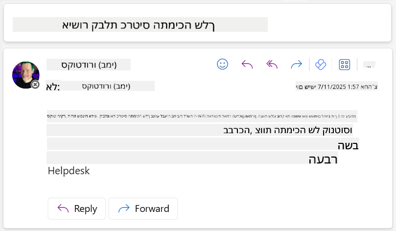  
1. עברו ללשונית **פעילות** ב-Copilot Studio כדי לראות את כל תהליך הפעלת הטריגר והפעלת הכלי  

## ✅ משימה הושלמה  

🎉 **ברכות!** הצלחתם ליישם טריגרים לאירועים עם כלי מחברים שמאפשרים לסוכן שלכם לפעול באופן עצמאי, לשלוח מיילי אישור באופן אוטומטי ולעבד כרטיסי תמיכה ללא התערבות משתמש. ברגע שהסוכן שלכם יפורסם, הוא יפעל באופן עצמאי בשמכם.  

🚀 **הבא בתור**: בשיעור הבא תלמדו כיצד [לפרסם את הסוכן שלכם](../11-publish-your-agent/README.md) ל-Microsoft Teams ול-Microsoft 365 Copilot, כך שיהיה זמין לכל הארגון שלכם!  

⏭️ [עברו לשיעור **פרסום הסוכן שלכם**](../11-publish-your-agent/README.md)  

## 📚 משאבים טקטיים  

מוכנים לצלול לעומק הטריגרים לאירועים וסוכנים אוטונומיים? עיינו במשאבים הבאים:  

- **Microsoft Learn**: [הפכו את הסוכן שלכם לאוטונומי ב-Copilot Studio](https://learn.microsoft.com/training/modules/autonomous-agents-online-workshop/?WT.mc_id=power-177340-scottdurow)  
- **תיעוד**: [הוספת טריגר לאירוע](https://learn.microsoft.com/microsoft-copilot-studio/authoring-trigger-event?WT.mc_id=power-177340-scottdurow)  
- **שיטות עבודה מומלצות**: [מבוא לטריגרים ב-Power Automate](https://learn.microsoft.com/power-automate/triggers-introduction?WT.mc_id=power-177340-scottdurow)  
- **תרחישים מתקדמים**: [שימוש בזרימות Power Automate עם סוכנים](https://learn.microsoft.com/microsoft-copilot-studio/advanced-flow-create?WT.mc_id=power-177340-scottdurow)  
- **אבטחה**: [מניעת אובדן נתונים עבור Copilot Studio](https://learn.microsoft.com/microsoft-copilot-studio/admin-data-loss-prevention?WT.mc_id=power-177340-scottdurow)  


---

**הצהרת אחריות**:  
מסמך זה תורגם באמצעות שירות תרגום AI [Co-op Translator](https://github.com/Azure/co-op-translator). למרות שאנו שואפים לדיוק, יש לקחת בחשבון שתרגומים אוטומטיים עשויים להכיל שגיאות או אי דיוקים. המסמך המקורי בשפתו המקורית צריך להיחשב כמקור סמכותי. עבור מידע קריטי, מומלץ להשתמש בתרגום מקצועי אנושי. אנו לא נושאים באחריות לכל אי הבנות או פרשנויות שגויות הנובעות משימוש בתרגום זה.