<!--
CO_OP_TRANSLATOR_METADATA:
{
  "original_hash": "616d142d4fb5f45d2a168fad6c1f9545",
  "translation_date": "2025-10-22T00:05:33+00:00",
  "source_file": "docs/operative-preview/07-multimodal-prompts/README.md",
  "language_code": "hk"
}
-->
# 🚨 任務 07：使用多模態提示提取履歷內容

--8<-- "disclaimer.md"

## 🕵️‍♂️ 行動代號：`文件履歷偵查`

> **⏱️ 行動時間窗口：** `~45分鐘`

## 🎯 任務簡介

歡迎，特工。你之前的任務已經讓你掌握了強大的代理編排技能，但現在是時候解鎖一項改變遊戲規則的能力：**多模態文件分析**。

你的任務，如果你選擇接受，就是**文件履歷偵查**——精準地從任何文件中提取結構化數據。雖然你的代理可以輕鬆處理文本，但現實世界每天都需要處理PDF、圖片和複雜的文件。履歷堆積如山，發票需要處理，表格需要即時數字化。

這項任務將把你從僅能處理文本的代理建構者轉變為**多模態專家**。你將學習如何配置能像人類分析員一樣閱讀和理解文件的AI——但具有AI的速度和一致性。完成任務後，你將建立一個完整的履歷提取系統，並將其整合到你的招聘工作流程中。

你在此學到的技術將對你下一個任務中的高級數據基礎操作至關重要。

## 🔎 目標

在這次任務中，你將學到：

1. 什麼是多模態提示以及何時使用不同的AI模型
1. 如何配置帶有圖片和文件輸入的提示
1. 如何將提示輸出格式化為JSON以進行結構化數據提取
1. 文件分析提示工程的最佳實踐
1. 如何將多模態提示整合到代理流程中

## 🧠 理解多模態提示

### 什麼使提示成為"多模態"？

傳統提示僅處理文本。但多模態提示可以處理多種類型的內容：

- **文本**：書面指令和內容
- **圖片**：照片、截圖、圖表和圖示（.PNG, .JPG, .JPEG）  
- **文件**：發票、履歷、表格（.PDF）

這項能力開啟了強大的場景，例如分析履歷、處理發票或從表格中提取數據。

### 為什麼多模態對你的工作流程至關重要

每天，你的組織都面臨以下文件處理挑戰：

- **履歷篩選**：手動閱讀數百份履歷耗費寶貴時間
- **發票處理**：從各種文件格式中提取供應商信息、金額和日期
- **表格分析**：將紙質表格轉換為數字數據

多模態提示通過結合AI的語言理解和視覺分析能力消除了這些瓶頸。這使得你的AI能像處理文本一樣有效地處理文件。

### 常見業務場景

以下是多模態提示的應用示例：

| 場景                  | 任務                                                                                     | 示例輸出字段                                                                                   |
|-----------------------|------------------------------------------------------------------------------------------|------------------------------------------------------------------------------------------------|
| **履歷篩選**          | 提取候選人姓名、電子郵件、電話、當前職位、工作經驗年數和關鍵技能。                         | 候選人姓名、電子郵件地址、電話號碼、當前職位、工作經驗年數、關鍵技能                           |
| **發票處理**          | 從發票中提取供應商信息、發票日期、總金額和項目明細。                                       | 供應商名稱、發票日期、總金額、發票項目明細                                                     |
| **表格分析**          | 分析此申請表並提取所有填寫的字段。                                                         | 字段名稱（例如：申請人姓名）、填寫值（例如：John Doe）、...                                    |
| **身份證件驗證**      | 從此身份證件中提取姓名、身份證號碼、有效期和地址。驗證所有文本是否清晰可讀並標記任何不清晰部分。 | 全名、身份證號碼、有效期、地址、不清晰部分標記                                                |

## ⚙️ AI Builder中的模型選擇

AI Builder提供了針對特定任務優化的不同模型。了解使用哪個模型對成功至關重要。

!!! note "截至2025年9月的準確信息"
    AI Builder模型會定期更新，因此請查看最新的[AI Builder模型設置文檔](https://learn.microsoft.com/ai-builder/prompt-modelsettings)以了解當前模型的可用性。

### 模型比較

以下所有模型均支持視覺和文件處理：

| 模型 | 💰成本 | ⚡速度 | ✅最佳用途 |
|------|-------|-------|-----------|
| **GPT-4.1 mini** | 基本（最具成本效益） | 快速 | 標準文件處理、摘要、注重預算的項目 |
| **GPT-4.1** | 標準 | 中等 | 複雜文件、高級內容創建、高準確性需求 |
| **o3** | 高級 | 慢（優先分析原因） | 數據分析、批判性思維、複雜問題解決 |
| **GPT-5 chat** | 標準 | 增強 | 最新文件理解、最高響應準確性 |
| **GPT-5 reasoning** | 高級 | 慢（複雜分析） | 最複雜的分析、規劃、高級推理 |

### 溫度設置解釋

溫度控制AI響應的創造性或可預測性：

- **溫度 0**：最可預測、結果一致（最適合數據提取）
- **溫度 0.5**：創造性與一致性平衡  
- **溫度 1**：最大創造性（最適合內容生成）

對於文件分析，使用**溫度 0**以確保數據提取的一致性。

## 📊 輸出格式：文本 vs JSON

選擇正確的輸出格式對下游處理至關重要。

### 何時使用文本輸出

文本輸出適用於：

- 人類可讀的摘要
- 簡單分類
- 不需要結構化處理的內容

### 何時使用JSON輸出

JSON輸出對以下情況至關重要：

- 結構化數據提取
- 與數據庫或系統集成
- Power Automate流程處理
- 一致的字段映射

### JSON最佳實踐

1. **定義清晰的字段名稱**：使用描述性、統一的命名
1. **提供示例**：為每個字段包含示例輸出和值
1. **指定數據類型**：包括日期、數字和文本的示例
1. **處理缺失數據**：計劃處理空值或缺失值
1. **驗證結構**：使用各種文件類型進行測試

### 文件質量考量

- **分辨率**：確保圖片清晰可讀
- **方向**：在處理前旋轉文件至正確方向
- **格式支持**：使用你的特定文件類型（PDF, JPG, PNG）進行測試
- **大小限制**：注意你的環境中的文件大小限制

### 性能優化

- **選擇合適的模型**：僅在需要時升級模型
- **優化提示**：通常，簡短、清晰的指令效果更好
- **錯誤處理**：計劃無法處理的文件
- **監控成本**：不同模型消耗不同數量的AI Builder點數

## 🧪 實驗室 7：建立履歷提取系統

是時候將你的多模態知識付諸實踐了。你將建立一個全面的履歷提取系統，分析候選人文件並將其轉換為結構化數據以用於你的招聘工作流程。

### 完成此任務的先決條件

1. 你需要**以下之一**：

    - **完成任務 06**並準備好你的多代理招聘系統，**或者**
    - **導入任務 07起始解決方案**，如果你是從頭開始或需要補課。[下載任務 07起始解決方案](https://aka.ms/agent-academy)

1. 從[Test Resumes](https://download-directory.github.io/?url=https://github.com/microsoft/agent-academy/tree/main/operative/sample-data/resumes&filename=operative_sampledata)下載示例履歷文件

!!! note "解決方案導入和示例數據"
    如果你使用起始解決方案，請參考[任務 01](../01-get-started/README.md)以獲取有關如何將解決方案和示例數據導入到你的環境中的詳細說明。

### 7.1 創建多模態提示

你的第一個目標：創建一個能夠分析履歷文件並提取結構化數據的提示。

1. 登錄[Copilot Studio](https://copilotstudio.microsoft.com)並從左側導航中選擇**工具**。

1. 選擇**+ 新工具**，然後選擇**提示**。  
    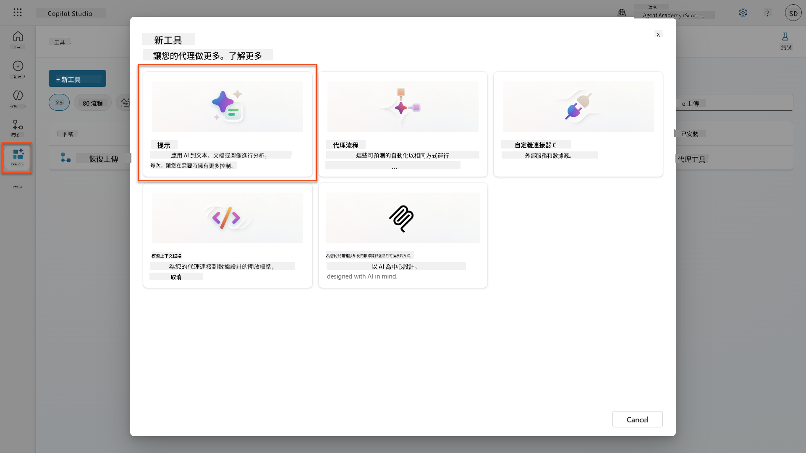

1. **重命名**提示，將默認的時間戳名稱（例如 *Custom prompt 09/04/2025, 04:59:11 PM*）更改為`Summarize Resume`。

1. 在指令字段中添加以下提示：

    ```text
    You are tasked with extracting key candidate information from a resume and cover letter to facilitate matching with open job roles and creating a summary for application review.
    
    Instructions:
    1. Extract Candidate Details:
        - Identify and extract the candidate’s full name.
        - Extract contact information, specifically the email address.
    2. Create Candidate Summary:
        - Summarize the candidate’s profile as multiline text (max 2000 characters) with the following sections:
            - Candidate name
            - Role(s) applied for if present
            - Contact and location
            - One-paragraph summary
            - Experience snapshot (last 2–3 roles with outcomes)
            - Key projects (1–3 with metrics)
            - Education and certifications
            - Top skills (Top 10)
            - Availability and work authorization
    
    Guidelines:
    - Extract information only from the provided resume and cover letter documents.
    - Ensure accuracy in identifying all details such as contact details and skills.
    - The summary should be concise but informative, suitable for quick application review.
    
    Resume: /document
    CoverLetter: /text
    ```

    !!! tip "使用Copilot協助"
        你可以使用"Get started with Copilot"通過自然語言生成你的提示。嘗試要求Copilot創建一個提示來總結履歷！

1. **配置**輸入參數：

    | 參數 | 類型 | 名稱 | 示例數據 |
    |------|------|------|----------|
    | 履歷 | 圖片或文件 | Resume | 從測試數據文件夾上傳一份示例履歷 |
    | 求職信 | 文本 | CoverLetter | 這是一份履歷！ |

1. 選擇**測試**以查看提示的初始文本輸出。  
    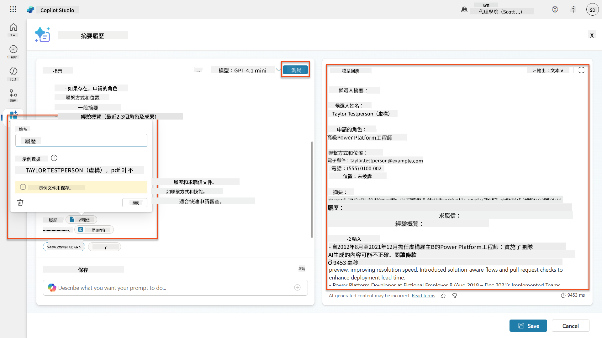

### 7.2 配置JSON輸出

現在你將把提示轉換為輸出結構化的JSON數據，而不是純文本。

1. 在提示指令的末尾添加以下JSON格式規範：

    ```text
    Output Format:
    Provide the output in valid JSON format with the following structure:
    
    {
        "CandidateName": "string",
        "Email": "string",
        "Summary": "string max 2000 characters",
        "Skills": [ {"item": "Skill 1"}, {"item": "Skill 2"}],
        "Experience": [ {"item": "Experience 1"}, {"item": "Experience 2"}],
    }
    ```

1. 將**輸出**設置從"文本"更改為**JSON**。

1. 再次選擇**測試**以驗證輸出現在已格式化為JSON。  
    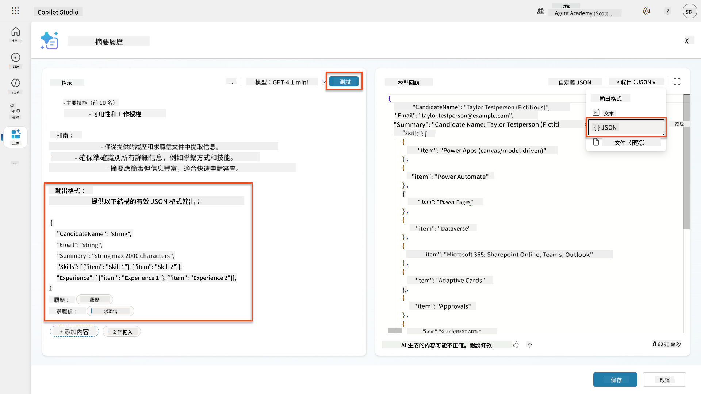

1. **可選：**嘗試使用不同的AI模型查看輸出的差異，然後返回默認模型。

1. 選擇**保存**以創建提示。

1. 在**配置用於代理使用**對話框中，選擇**取消**。

    !!! info "為什麼我們不直接將其添加為工具"
        你將在代理流程中使用此提示，而不是直接作為工具使用，這樣可以更好地控制數據處理工作流程。

### 7.3 將提示添加到代理流程

你將創建一個代理流程，使用你的提示處理存儲在Dataverse中的履歷。

!!! tip "代理流程表達式"
    非常重要的是，你需要完全按照指示命名節點並輸入表達式，因為表達式使用節點名稱引用之前的節點！請參考[Recruit中的代理流程任務](../../recruit/09-add-an-agent-flow/README.md#you-mentioned-expressions-what-are-expressions)以快速回顧！

1. 進入Copilot Studio中的**招聘代理**

1. 選擇**代理**標籤，並選擇子代理**申請接收代理**

1. 在**工具**面板中，選擇**+ 添加** → **+ 新工具** → **代理流程**

1. 在代理流程的第一個節點中，使用**+ 添加輸入**添加以下參數：

    | 類型 | 名稱 | 描述 |
    |------|------|------|
    | 文本 | ResumeNumber | 確保使用[ResumeNumber]。這必須始終以字母R開頭 |

1. 選擇第一個節點下的**+**插入操作圖標，搜索**Dataverse**，選擇**查看更多**，然後找到**列出行**操作

1. 選擇**省略號（...）**在列出行節點上，選擇**重命名**為`Get Resume Record`，然後設置以下參數：

    | 屬性 | 如何設置 | 值 |
    |------|---------|----|
    | **表名** | 選擇 | Resumes |
    | **篩選行** | 動態數據（閃電圖標） | `ppa_resumenumber eq 'ResumeNumber'` 將**ResumeNumber**替換為**當代理調用流程時** → **ResumeNumber** |
    | **行數** | 輸入 | 1 |

    !!! tip "優化查詢！"
        在生產中使用此技術時，應始終限制選擇的列僅限於代理流程所需的列。

    

1. 選擇Get Resume Record節點下的**+**插入操作圖標，搜索**Dataverse**，選擇**查看更多**，然後找到**下載文件或圖片**操作。

    !!! tip "選擇正確的操作！"
        確保不要選擇以"從選定環境"結尾的操作

1. 如前所述，重命名操作為`Download Resume`，然後設置以下參數：

    | 屬性 | 如何設置 | 值 |
    |------|---------|----|
    | **表名** | 選擇 | Resumes |
    | **行ID** | 表達式（fx圖標） | `first(body('Get_Resume_Record')?['value'])?['ppa_resumeid']` |
    | **列名** | 選擇 | Resume PDF |

    

1. 現在，選擇Download Resume下的**+**插入操作圖標，在**AI能力**下選擇**運行提示**，

1. 將操作重命名為`Summarize Resume`並設置以下參數：

    | 屬性 | 如何設置 | 值 |
| **提示** | 選擇 | 摘要履歷 |
| **求職信** | 表達式 (fx 圖標) | `first(body('Get_Resume_Record')?['value'])?['ppa_coverletter']` |
| **履歷** | 動態數據 (閃電圖標) | 下載履歷 → 文件或圖片內容 |

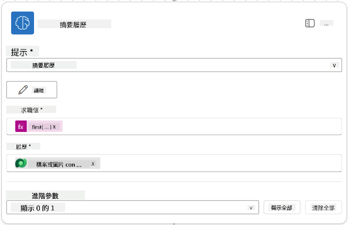

!!! tip "提示參數"
    注意，您填寫的參數與您在創建提示時配置的輸入參數相同。

### 7.4 建立候選人記錄

接下來，您需要使用提示提供的信息，並在尚未存在的情況下建立新的候選人記錄。

1. 在摘要履歷節點下方選擇 **+** 插入操作圖標，搜尋 **Dataverse**，選擇 **查看更多**，然後找到 **列出行** 操作。

1. 將節點重新命名為 `Get Existing Candidate`，並設置以下參數：

    | 屬性 | 設置方式 | 值 |
    |------|----------|----|
    | **表名稱** | 選擇 | 候選人 |
    | **篩選行** | 動態數據 (閃電圖標) | `ppa_email eq 'Email'`  **替換** `Email` 為 **摘要履歷 → Email** |
    | **行數** | 輸入 | 1 |

    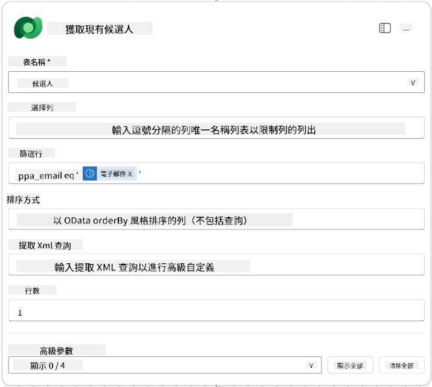

1. 在 Get Existing Candidate 節點下方選擇 **+** 插入操作圖標，搜尋 **控制**，選擇 **查看更多**，然後找到 **條件** 操作。

1. 在條件屬性中設置以下條件：

    | 條件 | 運算符 | 值 |
    |------|--------|----|
    | 表達式 (fx 圖標): `length(outputs('Get_Existing_Candidate')?['body/value'])` | 等於 | 0 |

    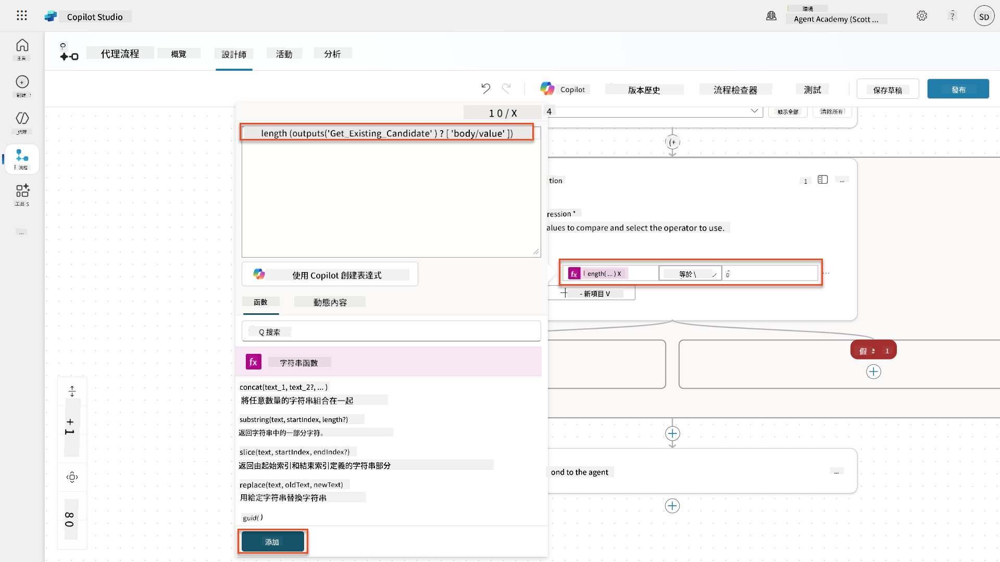

1. 在 **True** 分支中選擇 **+** 插入操作圖標，搜尋 **Dataverse**，選擇 **查看更多**，然後找到 **新增行** 操作。

1. 將節點重新命名為 `Add a New Candidate`，並設置以下參數：

    | 屬性 | 設置方式 | 值 |
    |------|----------|----|
    | **表名稱** | 選擇 | 候選人 |
    | **候選人姓名** | 動態數據 (閃電圖標) | 摘要履歷 → `CandidateName` |
    | **電子郵件** | 動態數據 (閃電圖標) | 摘要履歷 → `Email` |

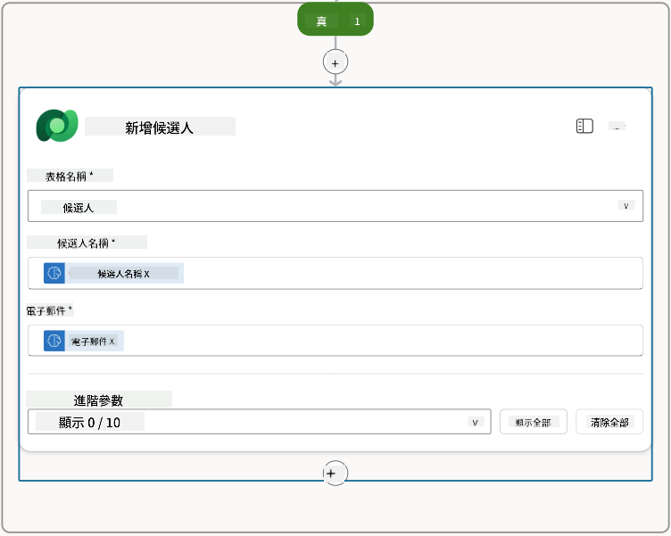

### 7.5 更新履歷並配置流程輸出

完成流程，更新履歷記錄並配置返回給代理的數據。

1. 在條件下方選擇 **+** 插入操作圖標，搜尋 **Dataverse**，選擇 **查看更多**，然後找到 **更新行** 操作。

1. 選擇標題重新命名節點為 `Update Resume`，選擇 **顯示全部**，並設置以下參數：

    | 屬性 | 設置方式 | 值 |
    |------|----------|----|
    | **表名稱** | 選擇 | 履歷 |
    | **行 ID** | 表達式 (fx 圖標) | `first(body('Get_Resume_Record')?['value'])?['ppa_resumeid']` |
    | **摘要** | 動態數據 (閃電圖標) | 摘要履歷 → 文本 |
    | **候選人 (Candidates)** | 表達式 (fx 圖標) | `if(equals(length(outputs('Get_Existing_Candidate')?['body/value']), 1), first(outputs('Get_Existing_Candidate')?['body/value'])?['ppa_candidateid'], outputs('Add_a_New_Candidate')?['body/ppa_candidateid'])` |

    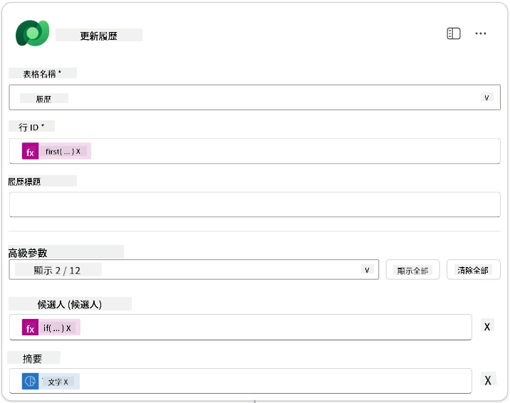

1. 選擇 **回應代理** 節點，然後使用 **+ 添加輸出** 配置：

    | 類型 | 名稱              | 設置方式                      | 值                                                        | 描述                                            |
    |------|-------------------|-------------------------------|-----------------------------------------------------------|------------------------------------------------|
    | 文本 | `CandidateName`   | 動態數據 (閃電圖標)           | 摘要履歷 → 查看更多 → CandidateName                       | 履歷中提供的 [CandidateName]                   |
    | 文本 | `CandidateEmail`  | 動態數據 (閃電圖標)           | 摘要履歷 → 查看更多 → Email                               | 履歷中提供的 [CandidateEmail]                  |
    | 文本 | `CandidateNumber` | 表達式 (fx 圖標)              | `concat('ppa_candidates/', if(equals(length(outputs('Get_Existing_Candidate')?['body/value']), 1), first(outputs('Get_Existing_Candidate')?['body/value'])?['ppa_candidateid'], outputs('Add_a_New_Candidate')?['body/ppa_candidateid']) )` | 新或現有候選人的 [CandidateNumber]             |
    | 文本 | `ResumeSummary`   | 動態數據 (閃電圖標)           | 摘要履歷 → 查看更多 → body/responsev2/predictionOutput/structuredOutput | 履歷摘要和詳細信息的 JSON 格式                 |

    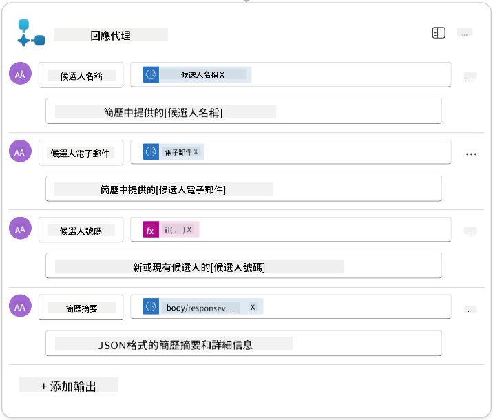

1. 在右上角選擇 **保存草稿**。您的代理流程應如下所示  
    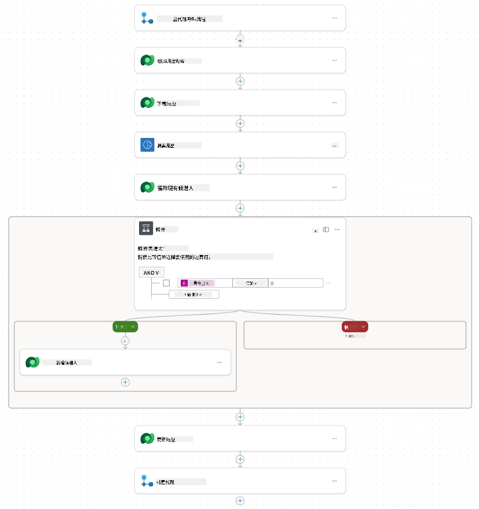

1. 選擇 **概覽** 標籤，選擇 **編輯** 在 **詳細信息** 面板中

    1. **流程名稱**：`Summarize Resume`
    1. **描述**：

        ```text
        Summarize an existing Resume stored in Dataverse using a [ResumeNumber] as input, return the [CandidateNumber], and resume summary JSON
        ```

1. 選擇 **保存**

1. 再次選擇 **設計器** 標籤，然後選擇 **發布**。

### 7.6 將流程連接到您的代理

現在您將添加流程作為工具並配置代理使用它。

1. 在 Copilot Studio 中打開您的 **招聘代理**

1. 選擇 **代理** 標籤，並打開 **申請接收代理**

1. 選擇 **工具** 面板，並選擇 **+ 添加工具** - > **流程** -> **Summarize Resume** **(代理流程)**

1. 選擇 **添加並配置**

1. 配置工具設置如下：

    | 設置 | 值 |
    |------|----|
    | **描述** | 使用 [ResumeNumber] 作為輸入，摘要存儲在 Dataverse 中的現有履歷，返回 [CandidateNumber] 和履歷摘要 JSON |
    | **此工具何時可用** | 僅當由主題或代理引用時 |

1. 選擇 **保存**  
    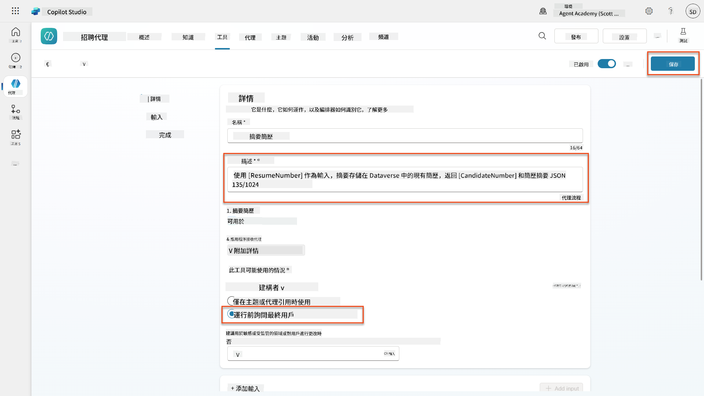

1. 如果您在招聘代理中選擇工具，您現在將看到我們的兩個工具顯示它們可供 **申請接收代理** 使用。  
    

1. 導航到 **申請接收子代理** 指令，並修改 **上傳後** 步驟如下：

    ```text
    2. Post-Upload Processing  
        - After uploading, be sure to also output the [ResumeNumber] in all messages
        - Pass [ResumeNumber] to /Summarize Resume  - Be sure to use the correct value that will start with the letter R.
        - Be sure to also output the [CandidateNumber] in all messages
        - Use the [ResumeSummary] to output a summary of the processed Resume and candidate
    ```

    替換 `/Summarize Resume`，通過輸入斜杠 (`/`) 或選擇 `/Summarize` 插入對 **摘要履歷代理流程** 的引用。  
    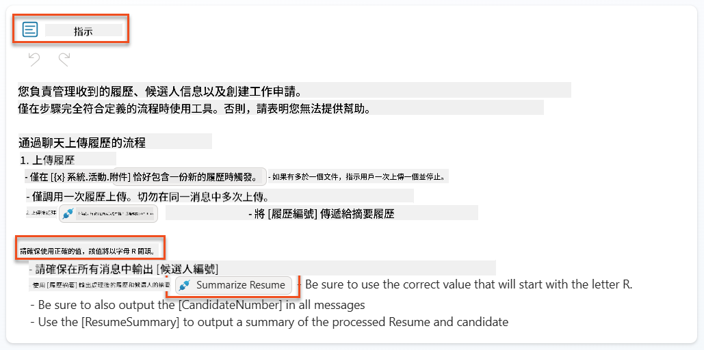

1. 選擇 **保存**。

### 7.7 測試您的代理

測試您的完整多模態系統以確保一切正常運作。

1. **開始測試**：

    - 選擇 **測試** 打開測試面板
    - 輸入：`這是一份候選人的履歷`

    - 上傳 [測試履歷](https://download-directory.github.io/?url=https://github.com/microsoft/agent-academy/tree/main/operative/sample-data/resumes&filename=operative_sampledata) 中的其中一份樣本履歷

1. **驗證結果**：
    - 發送消息和履歷後，檢查是否收到履歷編號 (格式：R#####)
    - 驗證是否獲得候選人編號和摘要
    - 使用活動地圖查看履歷上傳工具和摘要履歷工具的操作，以及代理接收到摘要提示的輸出：  
        

1. **檢查數據持久性**：
    - 導航到 [Power Apps](https://make.powerapps.com)
    - 打開 **應用** → **招聘中心** → **播放**
    - 前往 **履歷** 驗證履歷是否已上傳並處理。它應包含摘要信息和相關的候選人記錄。
    - 檢查 **候選人** 查看提取的候選人信息  
        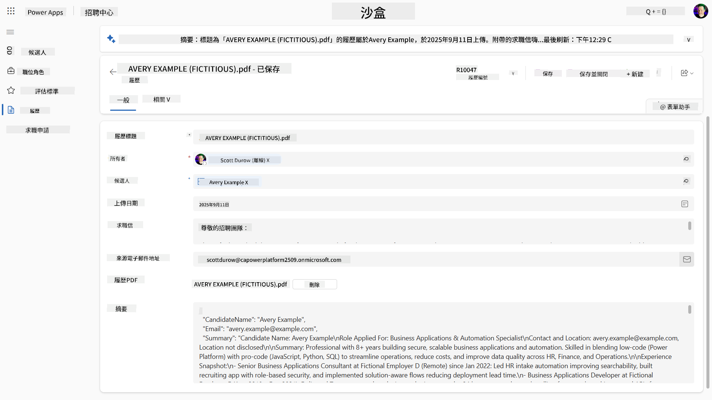
    - 當您再次運行該過程時，它應使用現有候選人（根據從履歷中提取的電子郵件匹配）而不是創建新的候選人。

!!! tip "故障排除"
    - **履歷未處理**：確保文件為 PDF 並且在大小限制內
    - **未創建候選人**：檢查履歷中是否正確提取了電子郵件
    - **JSON 格式錯誤**：驗證您的提示指令是否包含準確的 JSON 結構
    - **流程錯誤**：檢查所有 Dataverse 連接和表達式是否配置正確

### 生產準備

雖然不屬於此任務的一部分，但為了使此代理流程達到生產準備狀態，您可能還需要考慮以下事項：

1. **錯誤處理** - 如果未找到履歷編號，或提示未能解析文檔，應添加錯誤處理以向代理返回清晰的錯誤。
1. **更新現有候選人** - 候選人是通過電子郵件找到的，然後可以更新姓名以匹配履歷中的信息。
1. **拆分履歷摘要和候選人創建** - 此功能可以拆分為更小的代理流程，以便更容易維護，然後給代理指令依次使用它們。

## 🎉 任務完成

幹得好，行動者！**履歷文檔偵查** 現已完成。您已成功掌握多模態提示，現在可以精確地從任何文檔中提取結構化數據。

以下是您在此任務中完成的內容：

**✅ 多模態提示掌握**  
您現在了解什麼是多模態提示，以及何時使用不同的 AI 模型以獲得最佳結果。

**✅ 文檔處理專業知識**  
您已學會如何配置具有圖片和文檔輸入的提示，並以 JSON 格式輸出以提取結構化數據。

**✅ 履歷提取系統**  
您已建立一個完整的履歷提取系統，能夠處理候選人文檔並與您的招聘工作流程集成。

**✅ 最佳實踐實施**  
您已應用文檔分析的提示工程最佳實踐，並將多模態提示與代理流程集成。

**✅ 高級處理的基礎**  
您的增強文檔分析能力現在已準備好迎接我們即將推出的任務中的高級數據基礎功能。

🚀 **下一步：** 在任務 08 中，您將學習如何使用 Dataverse 的實時數據增強您的提示，創建適應不斷變化的業務需求的動態 AI 解決方案。

⏩ [前往任務 08：使用 Dataverse 基礎增強提示](../08-dataverse-grounding/README.md)

## 📚 戰術資源

📖 [創建提示](https://learn.microsoft.com/ai-builder/create-a-custom-prompt?WT.mc_id=power-power-182762-scottdurow)

📖 [向提示添加文本、圖片或文檔輸入](https://learn.microsoft.com/ai-builder/add-inputs-prompt?WT.mc_id=power-182762-scottdurow)

📖 [使用 JSON 輸出處理回應](https://learn.microsoft.com/ai-builder/process-responses-json-output?WT.mc_id=power-182762-scottdurow)

📖 [模型選擇和溫度設置](https://learn.microsoft.com/ai-builder/prompt-modelsettings?WT.mc_id=power-182762-scottdurow)

📖 [在 Power Automate 中使用您的提示](https://learn.microsoft.com/ai-builder/use-a-custom-prompt-in-flow?WT.mc_id=power-182762-scottdurow)

📺 [AI Builder：提示生成器中的 JSON 輸出](https://www.youtube.com/watch?v=F0fGnWrRY_I)

---

**免責聲明**：  
此文件已使用人工智能翻譯服務 [Co-op Translator](https://github.com/Azure/co-op-translator) 進行翻譯。儘管我們致力於提供準確的翻譯，但請注意，自動翻譯可能包含錯誤或不準確之處。原始文件的母語版本應被視為權威來源。對於重要信息，建議使用專業人工翻譯。我們對因使用此翻譯而引起的任何誤解或誤釋不承擔責任。