<!--
CO_OP_TRANSLATOR_METADATA:
{
  "original_hash": "dcbcd9396b076da0a0f5d389e9ec1b12",
  "translation_date": "2025-10-22T00:50:00+00:00",
  "source_file": "docs/recruit/08-add-adaptive-card/README.md",
  "language_code": "hk"
}
-->
# 🚨 任務 08：使用自適應卡提升主題中的用戶互動

## 🕵️‍♂️ 行動代號：`界面升級行動`

> **⏱️ 行動時間窗口：** `~45分鐘`

🎥 **觀看操作指南**

[](https://www.youtube.com/watch?v=RhIlzYHPCXo "在 YouTube 上觀看操作指南")

## 🎯 任務簡介

特工們，您的任務是滲透靜態的用戶體驗，並用豐富、動態且可操作的自適應卡取而代之。您將部署 JSON 負載和 Power Fx 公式，將 Copilot Studio 的對話從基本的問答轉變為完全互動的交流。您的目標是收集用戶輸入、美觀地展示數據，並以精確和風格引導對話。如果未能適應，用戶可能會轉向更智能的界面。

## 🔎 目標

在此任務中，您將學習：

1. 了解什麼是自適應卡以及它如何提升 Copilot Studio 中的用戶互動
1. 學習使用 JSON 和 Power Fx 公式構建動態內容的互動卡片
1. 探索自適應卡設計器及其關鍵組件以進行可視化卡片創建
1. 在主題中創建豐富的互動表單和數據收集體驗
1. 實施設計響應式和用戶友好型自適應卡的最佳實踐

## 🤔 什麼是自適應卡？

**自適應卡**是一種創建互動、視覺豐富的 UI 元素的方法，可以嵌入到 Microsoft Teams、Microsoft Outlook 或代理等應用中。它是一個結構化的 JSON 對象，定義了卡片的佈局和內容：

- 卡片上顯示的元素 - 文本、圖片、按鈕
- 這些元素的排列方式
- 用戶可以採取的操作，例如提交表單或打開鏈接

    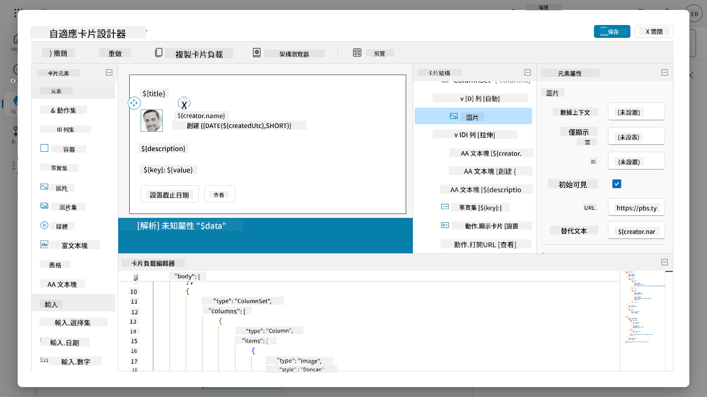

### 為什麼自適應卡在 Copilot Studio 中很重要

想像一下，您正在構建一個代理，要求用戶提供姓名、電子郵件或反饋。如果您僅使用純文本，對話可能會顯得乏味或難以跟進。這就是自適應卡的用武之地！

1. **使對話更具互動性** - 與其向用戶發送文本消息，不如展示按鈕、表單、圖片等。
    - 示例：卡片可以要求用戶在整潔的表單中填寫姓名和電子郵件。

1. **在任何地方都能看起來很棒** - 自適應卡會自動匹配它所在應用的樣式，例如 Microsoft 365 Copilot 聊天或 Microsoft Teams。您不需要擔心暗模式、字體或佈局 - 它會自動適應。

1. **使用 JSON 輕鬆構建** - 您可以使用 JSON 代碼（類似 UI 的“配方”）定義卡片。Copilot Studio 幫助您在將卡片添加到主題之前預覽它。

1. **收集和使用數據** - 您可以使用卡片提問、收集答案，並在對話流程中使用這些數據。
    - 示例：詢問用戶的電話號碼，然後顯示包含其電話號碼的確認卡片。

1. **提升用戶體驗** - 卡片使您的代理更具互動性。這是一種更整潔、可點擊且用戶友好的界面。

## 🐱 JSON 是一個人嗎？

讀作“Jason”，它不是一個人 😅

JSON，即 _JavaScript Object Notation_，是一種用於結構化數據的輕量格式。它易於閱讀和編寫，看起來像是包含在大括號 {} 中的一系列鍵值對。

這是添加自適應卡到主題時的選項之一。

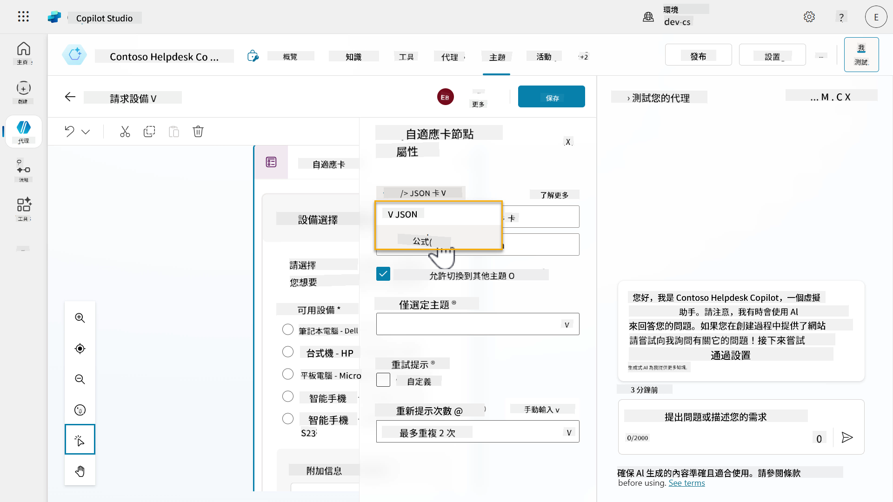

## 👀 我看到另一個選項是使用 _公式_ 構建自適應卡

還記得我們在[任務 07 - 在節點中使用 Power Fx](../07-add-new-topic-with-trigger/README.md#what-power-fx-can-do-in-topics)中學到的 Power Fx 嗎？同樣可以應用於 Copilot Studio 中的自適應卡。

回顧一下，

!!! note
    Power Fx 是一種低代碼編程語言，用於向代理添加邏輯和動態行為。它是 Microsoft Power Apps 中使用的語言，設計簡單且類似 Excel，使開發者和非開發者都能輕鬆使用。

### Power Fx 在自適應卡中的工作原理

當您在 Copilot Studio 中設計自適應卡時，可以使用 Power Fx 公式來：

- 動態插入值，例如用戶名、日期或狀態。
- 格式化文本或數字，例如顯示貨幣或四捨五入。
- 根據條件顯示或隱藏元素。
- 根據用戶輸入、變量、對話節點的輸出自定義響應。

例如，

"`Hello`" & `System.User.DisplayName`

此公式動態地將“Hello”與用戶的名字結合。

### 為什麼它有用

1. **個性化**

    您可以針對每位用戶定制消息，使互動更自然和相關。

1. **動態內容**

    卡片可以顯示來自變量和對話節點輸出的真實數據。

1. **智能邏輯**

    您可以根據條件控制用戶看到或互動的內容，提升可用性並減少錯誤。

1. **低代碼友好**

    Power Fx 是一種低代碼編程語言。如前所述，它可讀性強、直觀且類似 Excel 公式。

## 👷🏻‍♀️ 使用自適應卡設計器進行構建

**自適應卡設計器**是一種可視化工具，允許您使用拖放元素（如文本、圖片、按鈕和輸入）來構建互動消息卡片。其目的是幫助您創建豐富、動態的消息，而無需編寫複雜代碼，從而更容易設計用戶友好的界面。

設計器工具幫助您可視化構建卡片，但在幕後，它為您生成了 JSON 對象。您還可以切換到 _公式_，使 Power Fx 表達式能夠在卡片中使用以顯示其他地方的數據。

## 🎨 理解自適應卡設計器


### A) 卡片元素

這些是自適應卡的構建塊。您可以拖放以下元素：

- **TextBlock** 用於顯示文本。
- **Image** 用於展示圖片。
- **FactSet** 用於鍵值對。
- **輸入字段** 用於顯示文本框、日期選擇器、切換。
- **操作** 用於顯示按鈕，例如 _提交_、_打開 URL_ 或 _顯示卡片_。

每個元素都有其用途，可以進行樣式設置或配置。

### B) 卡片查看器

這是 **預覽** 區域，您可以實時查看卡片的外觀。當您添加或編輯元素時，查看器會立即更新以反映更改。這使您能夠進行迭代更新並同時查看設計輸出。

### C) 卡片結構

這顯示了卡片的 **層次結構和佈局**。例如：

- 卡片可能以 **TextBlock** 作為標題開始。
- 然後是一個 **ColumnSet**，一側是圖片，另一側是文本。
- 接著是 **FactSet** 和一些 **操作按鈕**。

它幫助您理解元素如何嵌套和組織。

### D) 元素屬性

當您點擊卡片中的任何元素時，此面板允許您 **自定義其設置**：

- 更改文本大小、字重或顏色。
- 設置圖片 URL 或替代文本。
- 配置輸入選項，例如佔位符文本或默認值。

這是您微調每個元素的地方。

### E) 卡片負載編輯器

這是卡片背後的 **原始 JSON 代碼**。高級用戶可以直接編輯此代碼以：

- 使用模板功能。
- 複製/粘貼卡片定義。

即使您是自適應卡設計器的新手，了解可視化設計如何轉化為代碼也是有幫助的。

!!! tip "提示 - 查看自適應卡範例"

    1. 瀏覽至 [https://adaptivecards.microsoft.com/designer](https://adaptivecards.microsoft.com/designer)。
    2. 選擇 **新建卡片** 以查看您可以選擇和修改的範例列表。
    3. 注意此設計器是外部的（基於網頁）。當您在網頁版自適應卡設計器中構建卡片時，從卡片負載編輯器中複製 JSON。
    4. 將 JSON 粘貼到 Copilot Studio 中的代理自適應卡中。

    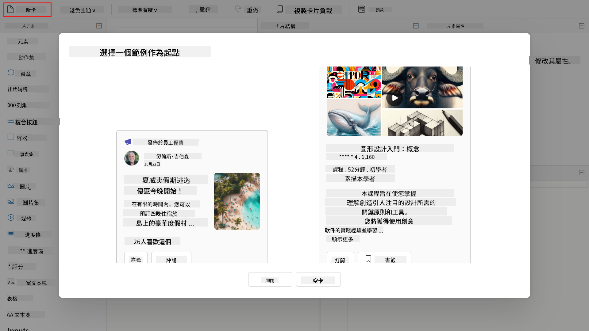

## 🌵 常見用例

以下是在 Copilot Studio 中使用 **發送消息** 或 **提問** 節點時，自適應卡的常見用例。

1. **表單和數據收集**

    使用自適應卡收集用戶的結構化輸入，例如：

    - 請假申請
    - 反饋表單
    - 聯繫信息
    - 預約安排

1. **顯示動態信息**

    向用戶展示來自企業資源（如 ServiceNow、SAP、Dynamics 365、SharePoint 等）的個性化或實時數據，格式清晰易讀。

    - 訂單摘要
    - 帳戶餘額
    - 工單或案件狀態
    - 即將到來的事件或截止日期

1. **互動選擇**

    讓用戶直接在對話中進行選擇：

    - 從選項列表中選擇，例如產品類別、支持主題。
    - 確認或取消操作。
    - 評價服務或體驗。

1. **觸發操作**

    包含按鈕以在對話中內部或外部觸發進一步的步驟。

    - “提交請求”
    - “查看詳情”

## ⭐ 最佳實踐

以下是為 Copilot Studio 中的代理創建自適應卡的一些最佳實踐。

1. **保持簡單和專注**

    - 設計卡片時要有明確的目的，不要過多地添加元素。
    - 使用簡潔的文本和直觀的佈局引導用戶完成互動。

1. **對輸入保持意圖明確**

    - 僅包含必要的輸入元素，例如文本、日期選擇，以避免讓用戶感到負擔。
    - 使用標籤使輸入易於理解。

1. **結構清晰易讀**

    - 使用 **TextBlocks** 作為標題和說明。
    - 使用 **Containers** 或 **ColumnSets** 將相關元素分組，以改善視覺流程。

1. **使操作元素清晰**

    - 使用 **Action.Submit** 或 **Action.OpenUrl**，並使用清晰的按鈕標題，例如“提交請求”或“查看詳情”。
    - 避免使用模糊的標籤，例如“點擊這裡”。

1. **設計具有適應性**

    - 假設卡片可能在不同的屏幕尺寸上查看。
    - 避免固定寬度，使用靈活的佈局，例如 **ColumnSets**，以提高響應性。

1. **盡可能使用動態內容**

    - 使用 Power Fx 將卡片元素綁定到變量或節點輸出，以個性化用戶體驗。
    - 例如，動態顯示用戶的姓名或當前狀態。

## 🧪 實驗室 08 - 添加自適應卡並提升主題功能

現在我們將學習如何使用自適應卡和主題及節點的高級功能來提升主題。

- [8.1 創建一個新主題，使用自適應卡讓用戶提交請求](../../../../../docs/recruit/08-add-adaptive-card)
- [8.2 更新代理指令以調用請求設備主題](../../../../../docs/recruit/08-add-adaptive-card)

### ✨ 用例

**作為** 員工

**我希望** 請求一台設備

**以便** 我可以從可用設備列表中請求設備

讓我們開始吧！

### 前置條件

1. **SharePoint 列表**

    我們將使用 [課程 00 - 課程設置 - 步驟 3：創建新的 SharePoint 網站](../00-course-setup/README.md#step-4-create-new-sharepoint-site) 中的 **Devices** SharePoint 列表。

    如果您尚未設置 **Devices** SharePoint 列表，請返回 [課程 00 - 課程設置 - 步驟 3：創建新的 SharePoint 網站](../00-course-setup/README.md#step-4-create-new-sharepoint-site)。

1. **Contoso Helpdesk Copilot**

    我們將使用之前在 [課程 06 - 使用自然語言創建自定義代理並將其與您的數據基礎相結合](../06-create-agent-from-conversation/README.md) 中創建的代理。

### 8.1 創建一個新主題，使用自適應卡讓用戶提交請求

我們將創建一個新主題來處理用戶的設備請求。此新主題將包含一個 **使用自適應卡提問** 節點，以啟用用戶與代理的互動。

讓我們開始吧！

1. 選擇 **主題** 標籤，然後選擇 **+ 從空白添加主題**。

    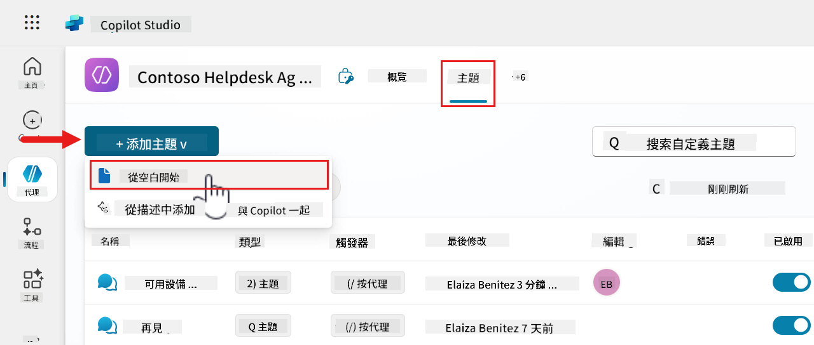

1. 將主題命名為以下內容，

    ```text
    Request device
    ```

    為觸發器輸入以下描述。

    ```text
    This topic helps users request a device when they answer yes to the question that asks the user if they would like to request one of these devices.
    ```

    
1. 接著，新增一個 **Ask with adaptive card** 節點。此節點將顯示一個互動卡片，讓使用者選擇他們想要申請的設備。

    

1. 選擇該節點後，將會出現 **Adaptive Card Node properties** 面板。我們現在要編輯 JSON。選擇 **Edit adaptive card**。選擇 **Edit adaptive card**。

    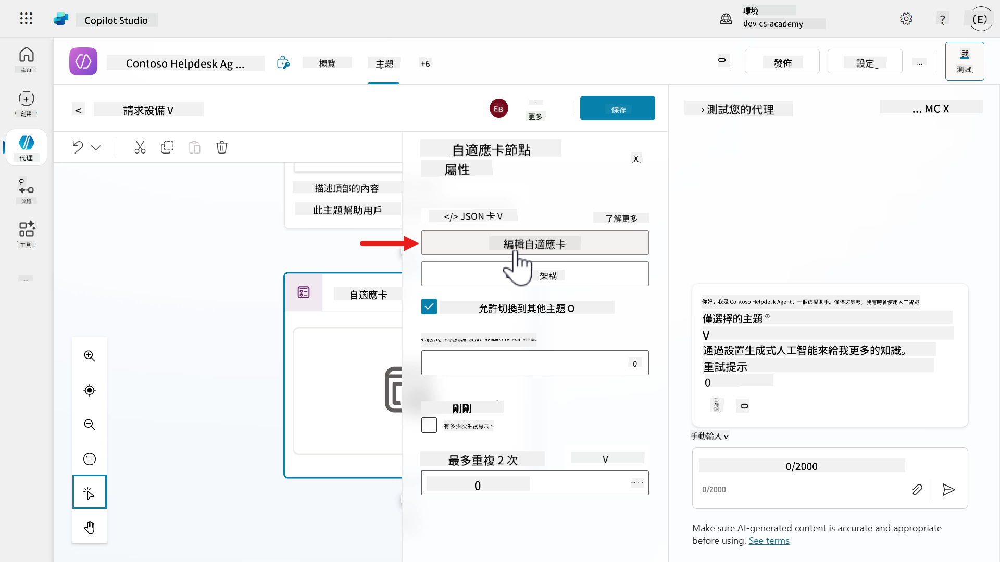

1. 這是 **Adaptive Card Designer**，您可以在此設計卡片並即時查看卡片設計。

    嘗試將 **TextBlock** 和 **FactSet** 卡片元素拖放到編輯畫布和卡片檢視區域。注意，當添加這兩個卡片元素時，卡片結構和卡片負載編輯器會更新。您可以直接更新卡片負載編輯器和元素屬性面板。

    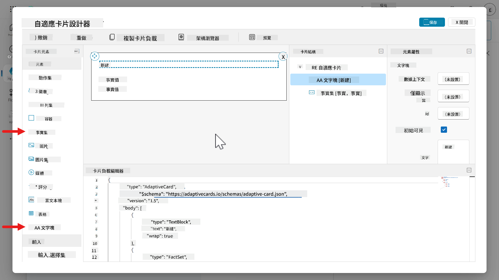

1. 選擇 **Preview** 以查看卡片在不同寬度下的顯示效果。

    

1. 預覽將載入，您可以看到卡片在不同寬度下的輸出。

    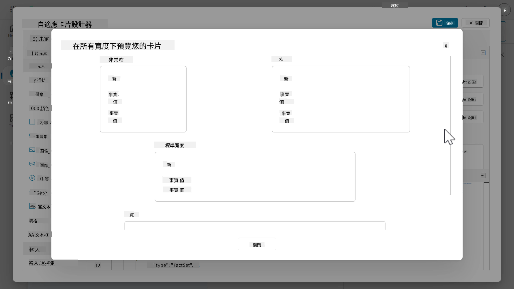

1. 點擊 **x icon** 退出 **Preview**，並在設計器中選擇 **Undo** 以移除之前添加的兩個卡片元素。

    

1. 點擊 **Card payload editor**，使用 Windows 的快捷鍵 _Ctrl + A_ 或 Mac 的快捷鍵 _Command + A_ 選擇所有行，然後刪除這些行。**貼上** [Request devices .JSON file](../../../../../docs/recruit/08-add-adaptive-card/assets/8.1_RequestDevice.json) 中的 JSON。

    

1. 注意，**Card Preview** 現在包含顯示一些文字和可用設備列表的元素。

    目前這個 JSON 是一個佔位符和預覽，將作為我們卡片的基礎，但會以公式而非 JSON 的形式，因為我們將引用 **global variable**，`Global.VarDevices.value`，該變數存儲了 **Get items** SharePoint 連接器操作的回應。

    選擇 **Save** 並選擇 **Close** 退出 Adaptive card designer 模態。

    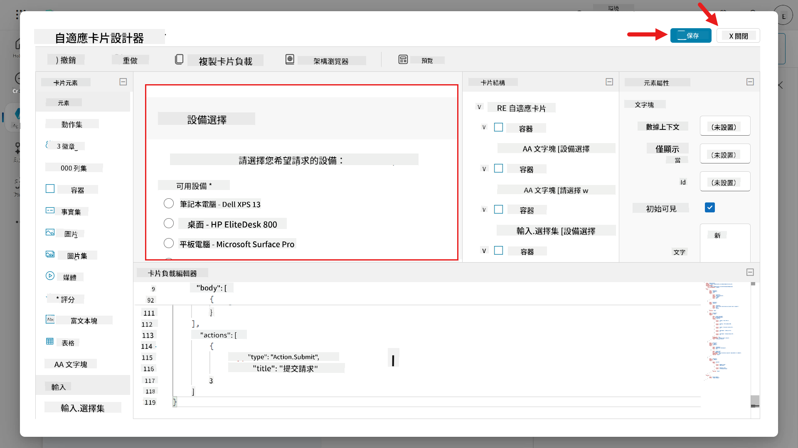

1. 點擊 **X** 圖標關閉 **Adaptive Card Node properties** 面板。

    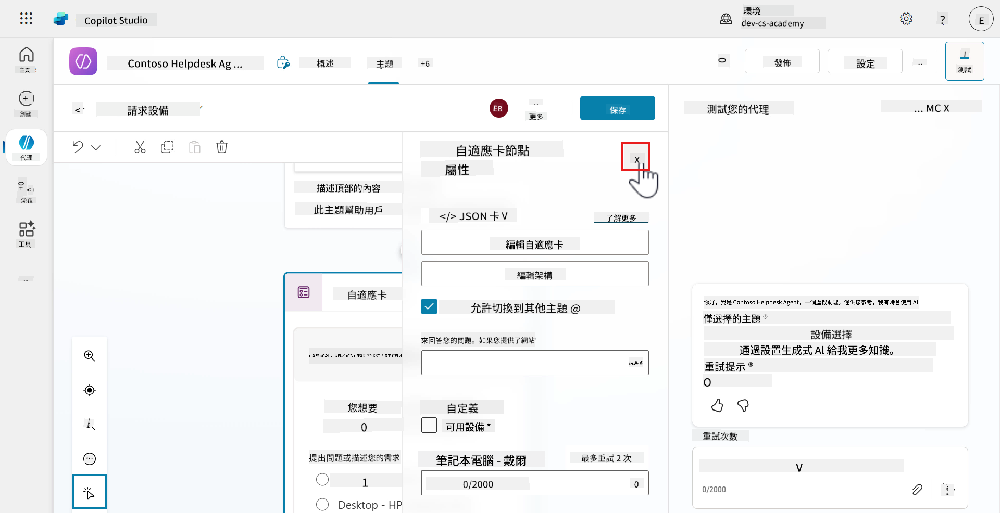

1. 在主題的編輯畫布中，您將看到自適應卡片。

    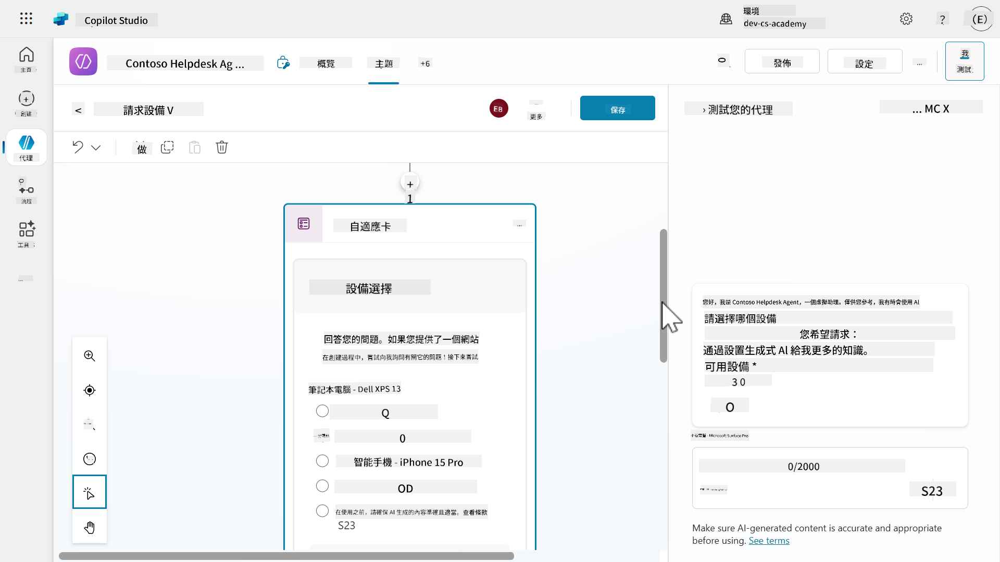

1. 滾動到節點底部，您將看到輸出變數。`commentsId` 和 `deviceSelectionId` 是在元素屬性中定義的。這兩個變數將存儲使用者與卡片元素互動的值。這些值將在主題的後續部分使用，我們會在下一課的實驗中學習。

    

1. 接下來，我們將從 JSON 更新卡片為公式，因為我們將再次使用 Power Fx 循環遍歷 **Get items** SharePoint 連接器操作返回的項目，這些項目存儲在 **global variable**，`Global.VarDevices.value` 中，通過 JSON 回應的 `value` 屬性。

    > 我們在 [Lab 07 - Add a new topic with conversation nodes, 7.3 Add a tool using a connector](../07-add-new-topic-with-trigger/README.md#73-add-a-tool-using-a-connector) 中創建了這個全局變數。

    在 **Ask with Adaptive Card** 節點中選擇卡片，然後選擇 **chevron** 圖標並選擇 **Formula**。

    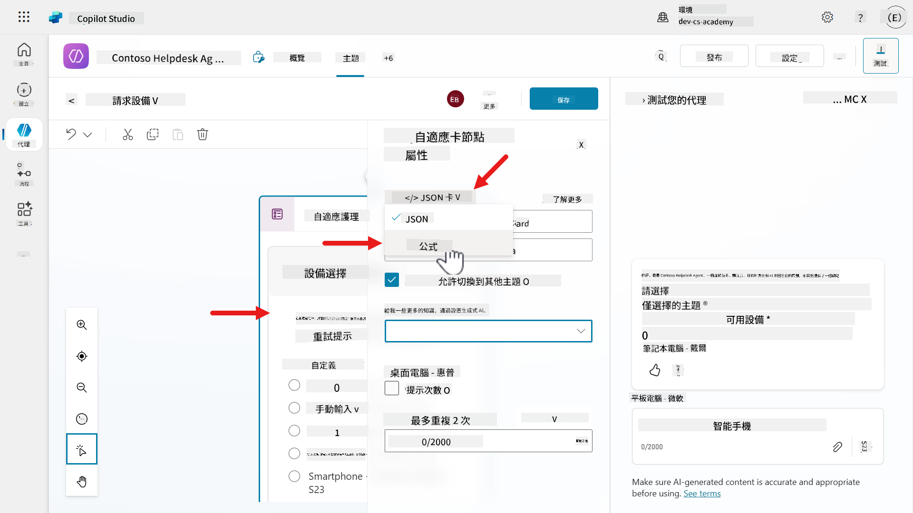

1. 點擊 **expand** 圖標以放大公式字段。

    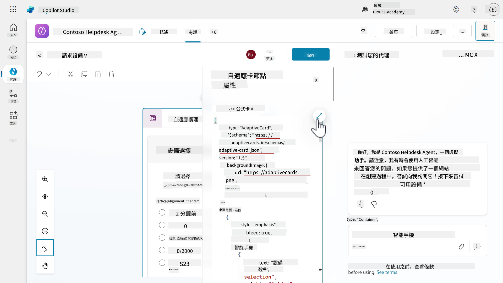

1. 點擊 **Card payload editor**，使用 Windows 的快捷鍵 _Ctrl + A_ 或 Mac 的快捷鍵 _Command + A_ 選擇所有行，然後刪除這些行。

    

    從 [Request Devices formula file](../../../../../docs/recruit/08-add-adaptive-card/assets/8.1_RequestDeviceFormula.txt) 貼上公式。

1. 在公式中，我們將使用 `For All` 函數循環遍歷每個 SharePoint 列表項目，顯示 `Model` 的值作為選項標題，並引用 SharePoint 項目的 `ID` 作為值。我們還使用 `If(IsBlank()` 函數包裹值，因為公式需要值才能在主題的編輯畫布中渲染自適應卡片。否則，您將看到一條消息顯示 "Property cannot be null"。

    **關閉** 卡片模態。

    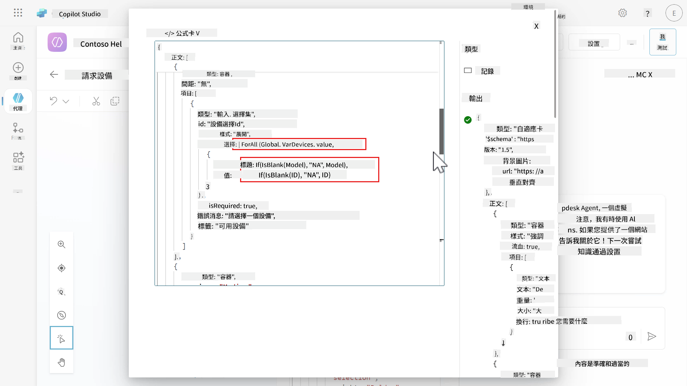

1. **關閉** **Adaptive Card Node properties** 面板。

1. **保存** 主題。

    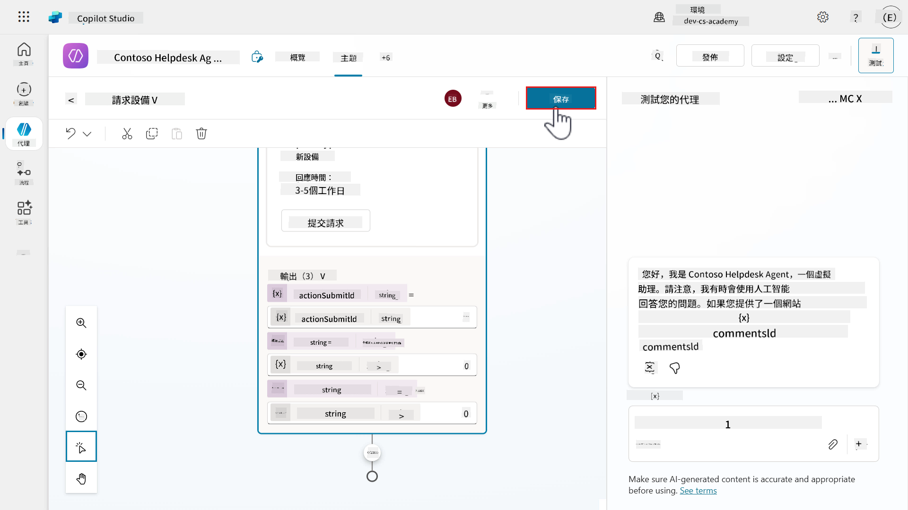

### 8.2 更新代理指令以調用申請設備主題

現在我們已經創建了處理設備申請的新主題，我們需要更新 **代理指令** 以調用該主題。

1. 選擇 **Overview** 標籤，並在 **代理指令** 中選擇 **Edit**。

    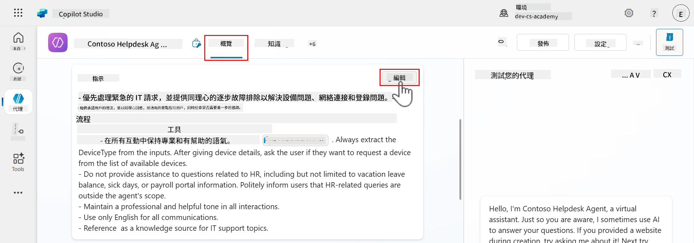

1. 在之前的指令下方新增一行，該指令來自 [Lab 07 - Add a new topic with conversation nodes, 7.3 Add a tool using a connector](../07-add-new-topic-with-trigger/README.md#73-add-a-tool-using-a-connector)。

    ```text
    - If the user answers yes to the question of requesting a device, trigger [Request device]. Otherwise if they answer no to the question of requesting a device, trigger [Goodbye].
    ```

    選擇方括號中的整個主題佔位符並刪除佔位符。

    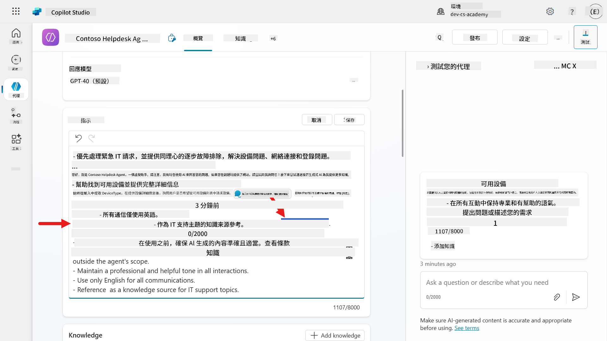

1. 輸入 `/Req` 並選擇 **Request devices** 主題。

    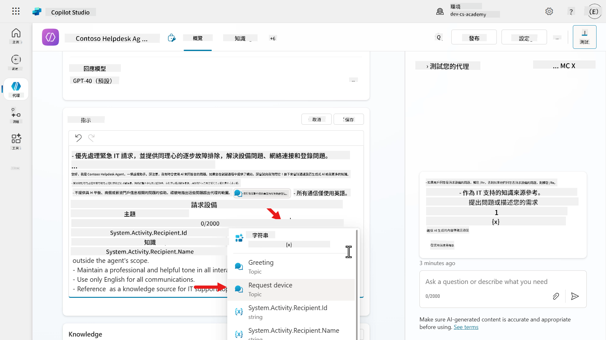

1. 對下一個主題佔位符 **[Goodbye]** 重複相同的步驟。選擇方括號中的整個主題佔位符並刪除佔位符。輸入 `/Goodbye` 並選擇 **Goodbye** 主題。

    - 當使用者回答 **Yes** 表示他們想申請設備時，代理將從 **Available devices** 主題重定向到 **Request devices** 主題。

    - 否則，如果使用者回答 **No**，代理將從 **Available devices** 主題重定向到 **Goodbye** 主題。

    **保存** 更新的指令。

    

1. 現在讓我們測試從 _Available devices_ 主題重定向到 _Request devices_ 主題。選擇 **Test** 以載入測試面板，然後選擇 **Refresh**。

    接著選擇測試面板中的 **Activity map** 圖標，並啟用 **Track between topics**。這將讓我們看到 _Available devices_ 主題已重定向到 _Request devices_ 主題。

    好了，我們可以開始測試了！在測試面板中輸入以下內容。

    ```text
    I need a laptop
    ```

    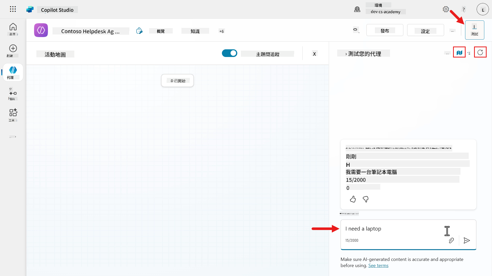

1. 代理將回應可用設備列表，接著詢問使用者是否想申請設備。複製並貼上以下內容，

    ```text
    yes please
    ```

    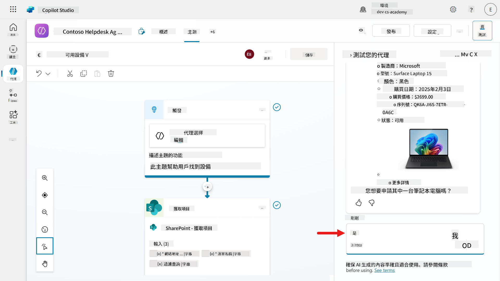

1. 接著我們會看到代理已重定向到 **Request device** 主題。代理根據我們添加的指令調用了此主題。

    帶有互動元素的自適應卡片現在將作為訊息顯示給使用者。

    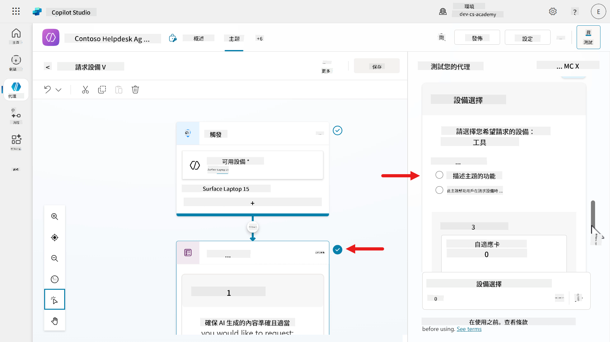

1. 我們現在已成功測試 😄 從 _Available devices_ 主題重定向到 _Request devices_ 主題。我們將在下一課的實驗中為此主題添加更多增強功能。

    刷新測試面板。

    

## ✅ 任務完成

恭喜！👏🏻 您已學會如何使用 Power Fx 公式添加自適應卡片以顯示來自變數的數據，並且還學會了如何從一個主題重定向到另一個主題。創建小型主題不僅使您的代理更有條理，還能幫助引導使用者完成與代理的不同對話流程。

這是 **Lab 08 - Enhance user interactions with Adaptive Cards** 的結尾，點擊以下連結移動到下一課。我們將在下一課的實驗中擴展此實驗中的使用案例。

⏭️ [移動到 **Add an agent flow to your Topic for automation** 課程](../09-add-an-agent-flow/README.md)

## 📚 實用資源

🔗 [在 Copilot Studio 中使用 Adaptive Cards](https://learn.microsoft.com/microsoft-copilot-studio/guidance/adaptive-cards-overview?WT.mc_id=power-172619-ebenitez)

🔗 [在 Send a message 節點中添加自適應卡片](https://learn.microsoft.com/microsoft-copilot-studio/authoring-send-message#add-an-adaptive-card?WT.mc_id=power-172619-ebenitez)

🔗 [使用 Power Fx 創建表達式](https://learn.microsoft.com/microsoft-copilot-studio/advanced-power-fx?WT.mc_id=power-172619-ebenitez)

📺 [使用 Power FX 建立自適應卡片](https://aka.ms/ai-in-action/copilot-studio/ep8)

<!-- markdownlint-disable-next-line MD033 -->


---

**免責聲明**：  
此文件已使用人工智能翻譯服務 [Co-op Translator](https://github.com/Azure/co-op-translator) 進行翻譯。儘管我們致力於提供準確的翻譯，但請注意，自動翻譯可能包含錯誤或不準確之處。原始語言的文件應被視為權威來源。對於重要信息，建議使用專業人工翻譯。我們對因使用此翻譯而引起的任何誤解或誤釋不承擔責任。