<!--
CO_OP_TRANSLATOR_METADATA:
{
  "original_hash": "dcbcd9396b076da0a0f5d389e9ec1b12",
  "translation_date": "2025-10-20T23:51:05+00:00",
  "source_file": "docs/recruit/08-add-adaptive-card/README.md",
  "language_code": "hr"
}
-->
# 🚨 Misija 08: Poboljšajte korisničke interakcije u Temama pomoću Adaptive Cards

## 🕵️‍♂️ KODNO IME: `OPERACIJA UNAPREĐENJE SUČELJA`

> **⏱️ Vrijeme operacije:** `~45 minuta`

🎥 **Pogledajte vodič**

[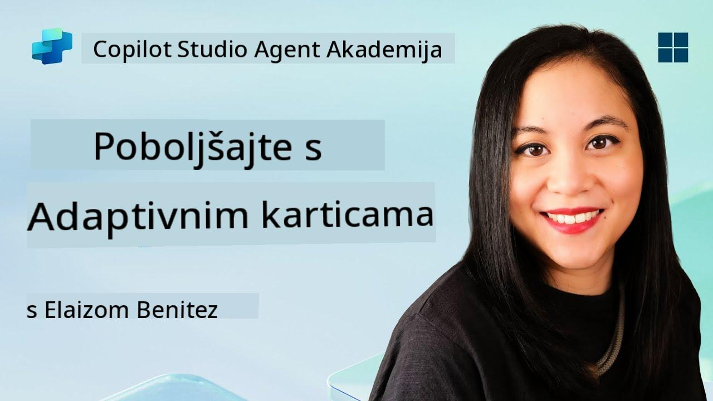](https://www.youtube.com/watch?v=RhIlzYHPCXo "Pogledajte vodič na YouTubeu")

## 🎯 Kratak opis misije

Agenti, vaša misija je infiltrirati se u statičko korisničko iskustvo i zamijeniti ga bogatim, dinamičnim i interaktivnim Adaptive Cards. Koristit ćete JSON payloads i Power Fx formule kako biste transformirali razgovore u Copilot Studiju iz osnovnih pitanja i odgovora u potpuno interaktivne angažmane. Vaš cilj je prikupiti korisničke podatke, prezentirati informacije na atraktivan način i usmjeriti razgovore s preciznošću i stilom. Ako se ne prilagodite, vaši korisnici mogu preći na manje inteligentna sučelja.

## 🔎 Ciljevi

U ovoj misiji naučit ćete:

1. Razumjeti što su Adaptive Cards i kako poboljšavaju korisničke interakcije u Copilot Studiju
1. Naučiti izraditi interaktivne kartice koristeći JSON i Power Fx formule za dinamičan sadržaj
1. Istražiti Adaptive Card Designer i njegove ključne komponente za vizualno kreiranje kartica
1. Kreirati bogate, interaktivne forme i iskustva prikupljanja podataka unutar tema agenata
1. Primijeniti najbolje prakse za dizajniranje responzivnih i korisnički prilagođenih adaptive kartica

## 🤔 Što je Adaptive Card?

**Adaptive Card** je način kreiranja interaktivnih, vizualno bogatih UI elemenata koji se mogu ugraditi u aplikacije poput Microsoft Teams, Microsoft Outlook ili agenata. To je strukturirani JSON objekt koji definira izgled i sadržaj kartice:

- Koji elementi se pojavljuju na kartici - tekst, slike, gumbi
- Kako su ti elementi raspoređeni
- Koje radnje korisnici mogu poduzeti, poput slanja forme ili otvaranja poveznice

    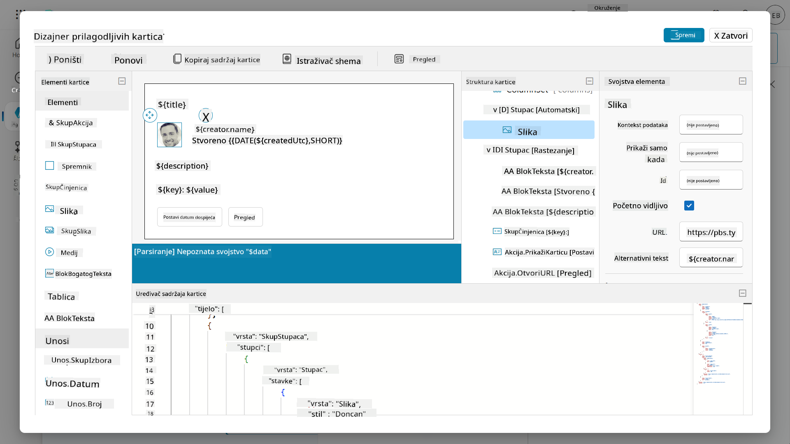

### Zašto su Adaptive Cards važne u Copilot Studiju

Zamislite da gradite agenta koji od korisnika traži ime, e-mail ili povratne informacije. Ako koristite samo običan tekst, razgovor može biti dosadan ili teško pratljiv. Tu dolaze Adaptive Cards!

1. **Čine razgovore interaktivnima** - umjesto slanja teksta kao poruka korisniku, možete prikazati gumbe, forme, slike i više.
    - Primjer: kartica može tražiti od korisnika da unese svoje ime i e-mail u urednu formu.

1. **Izgledaju odlično svugdje** - Adaptive Cards automatski se prilagođavaju stilu aplikacije u kojoj se nalaze, poput Microsoft 365 Copilot chata ili Microsoft Teamsa. Ne morate brinuti o tamnom načinu rada, fontovima ili rasporedu - sve se prilagođava.

1. **Jednostavne za izradu pomoću JSON-a** - karticu definirate pomoću JSON koda (razmislite o tome kao o _receptu_ za UI). Copilot Studio omogućuje vam pregled kartice prije nego što je dodate u temu.

1. **Prikupljanje i korištenje podataka** - karticu možete koristiti za postavljanje pitanja, prikupljanje odgovora i korištenje tih podataka u tijeku razgovora.
    - Primjer: Pitajte korisnika za broj telefona, a zatim prikažite karticu za potvrdu s njegovim brojem telefona.

1. **Poboljšanje korisničkog iskustva** - kartice čine vašeg agenta interaktivnijim. To je čišće, klikabilnije i korisnički prilagođenije sučelje.

## 🐱 Je li _JSON_ osoba?

Izgovara se "Jason", ali nije osoba 😅

JSON, poznat kao _JavaScript Object Notation_, lagani je format koji se koristi za strukturiranje podataka. Jednostavan je za čitanje i pisanje, te izgleda kao niz parova ključ-vrijednost unutar vitičastih zagrada {}.

Ovo je jedna od opcija koju možete koristiti prilikom dodavanja adaptive kartice u svoju temu.

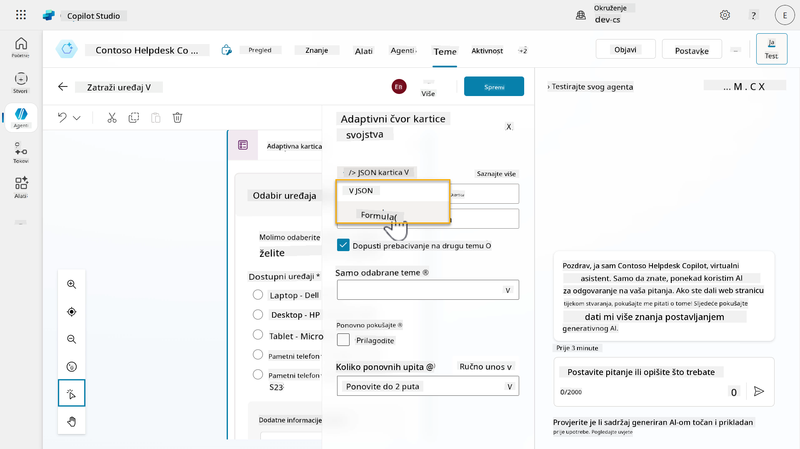

## 👀 Vidim drugu opciju za izradu adaptive kartice pomoću _formule_

Sjećate li se kako smo učili o Power Fx u [Misiji 07 - Korištenje Power Fx u vašim čvorovima](../07-add-new-topic-with-trigger/README.md#what-power-fx-can-do-in-topics)? Isto se može primijeniti na Adaptive Cards unutar Copilot Studija.

Kao podsjetnik,

!!! note
    Power Fx je programerski jezik s malo koda koji se koristi za dodavanje logike i dinamičkog ponašanja vašem agentu. To je isti jezik koji se koristi u Microsoft Power Apps, a dizajniran je da bude jednostavan i sličan Excel formulama, što ga čini lakim za korištenje kako za programere, tako i za one koji to nisu.

### Kako Power Fx funkcionira u Adaptive Cards

Kada dizajnirate Adaptive Card u Copilot Studiju, možete koristiti Power Fx formule za:

- Dinamičko umetanje vrijednosti poput imena korisnika, datuma ili statusa.
- Formatiranje teksta ili brojeva, poput prikaza valute ili zaokruživanja brojeva.
- Prikazivanje ili skrivanje elemenata na temelju uvjeta.
- Prilagodbu odgovora na temelju korisničkog unosa, varijabli, izlaza iz čvorova razgovora.

Na primjer,

"`Hello`" & `System.User.DisplayName`

Ova formula kombinira riječ "Hello" s imenom korisnika dinamički.

### Zašto je korisno

1. **Personalizacija**

    Možete prilagoditi poruku svakom korisniku, čineći interakcije prirodnijima i relevantnijima.

1. **Dinamičan sadržaj**

    Kartice mogu prikazivati stvarne podatke iz varijabli i izlaza iz čvorova razgovora.

1. **Pametna logika**

    Možete kontrolirati što korisnici vide ili s čime interagiraju na temelju uvjeta, poboljšavajući upotrebljivost i smanjujući pogreške.

1. **Prijateljski za korisnike bez programerskog iskustva**

    Power Fx je jezik s malo koda. Kao što je ranije spomenuto, čitljiv je, intuitivan i sličan Excel formulama.

## 👷🏻‍♀️ Izrada pomoću Adaptive Card Designer-a

**Adaptive Card Designer** je vizualni alat koji vam omogućuje izradu interaktivnih kartica za poruke pomoću elemenata koji se povlače i ispuštaju, poput teksta, slika, gumba i unosa. Njegova svrha je pomoći vam da kreirate bogate, dinamične poruke bez pisanja složenog koda, čineći dizajn korisnički prilagođenim.

Alat za dizajn omogućuje vam vizualnu izradu kartice, ali u pozadini generira JSON objekt za vas. Također možete prebaciti na _formulu_ koja omogućuje korištenje Power Fx izraza u kartici za prikaz podataka s drugih mjesta.

## 🎨 Razumijevanje Adaptive Card Designer-a

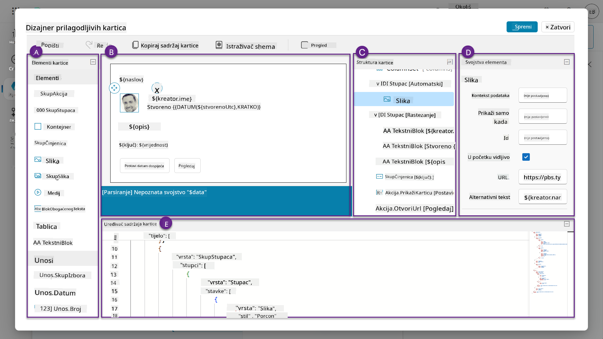

### A) Elementi kartice

Ovo su građevni blokovi vaše adaptive kartice. Možete povući i ispustiti elemente poput sljedećih:

- **TextBlock** za prikaz teksta.
- **Image** za prikaz slika.
- **FactSet** za parove ključ-vrijednost.
- **Polja za unos** za prikaz tekstualnih okvira, odabira datuma, prekidača.
- **Akcije** za prikaz gumba poput _Submit_, _Open URL_ ili _Show Card_.

Svaki element ima svoju svrhu i može se stilizirati ili konfigurirati.

### B) Pregled kartice

Ovo je **Područje za pregled** gdje u stvarnom vremenu vidite kako će vaša kartica izgledati. Kako dodajete ili uređujete elemente, pregled se odmah ažurira kako bi odražavao promjene. To vam omogućuje da napravite iterativne izmjene i istovremeno vidite rezultat dizajna.

### C) Struktura kartice

Ovo prikazuje **hijerarhiju i raspored** vaše kartice. Na primjer:

- Kartica može započeti s **TextBlock** za naslov.
- Zatim **ColumnSet** sa slikom na jednoj strani i tekstom na drugoj.
- Nakon toga **FactSet** i neki **Akcijski gumbi**.

Pomaže vam razumjeti kako su elementi ugniježđeni i organizirani.

### D) Svojstva elemenata

Kada kliknete na bilo koji element u kartici, ovaj panel vam omogućuje **prilagodbu njegovih postavki**:

- Promjena veličine, težine ili boje teksta.
- Postavljanje URL-ova slika ili alternativnog teksta.
- Konfiguriranje opcija unosa poput tekstualnih oznaka ili zadanih vrijednosti.

Ovdje precizno podešavate svaki element.

### E) Uređivač JSON koda kartice

Ovo je **sirovi JSON kod** iza vaše kartice. Napredni korisnici mogu ga direktno uređivati kako bi:

- Koristili značajke predložaka.
- Kopirali/zalijepili definicije kartica.

Čak i ako ste novi u Adaptive Card Designer-u, korisno je vidjeti kako se vizualni dizajn prevodi u kod.

!!! tip "Savjet - Pogledajte primjere Adaptive Cards"

    1. Posjetite [https://adaptivecards.microsoft.com/designer](https://adaptivecards.microsoft.com/designer).
    2. Odaberite **New card** kako biste vidjeli popis primjera koje možete odabrati i prilagoditi.
    3. Imajte na umu da je ovaj dizajner vanjski (web-baziran). Kada izradite karticu u web-baziranom Adaptive Card Designer-u, kopirajte JSON iz Uređivača koda kartice.
    4. Zalijepite JSON u svoju adaptive karticu u agentu u Copilot Studiju.

    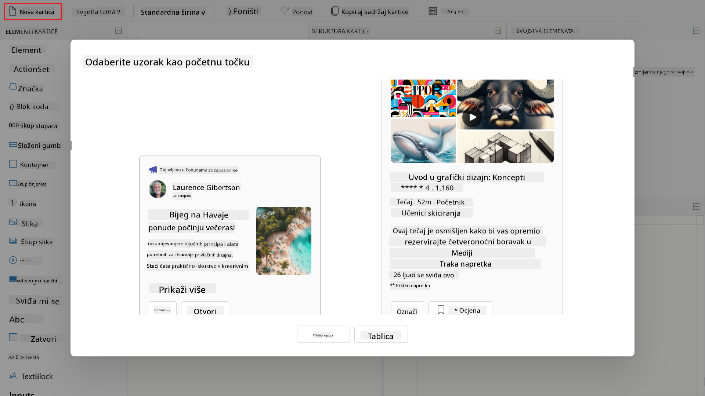

## 🌵 Uobičajeni slučajevi korištenja

Sljedeći su uobičajeni slučajevi korištenja Adaptive Cards u Copilot Studiju kada se koriste u čvorovima **Pošalji poruku** ili **Postavi pitanje**.

1. **Forme i prikupljanje podataka**

    Koristite adaptive kartice za prikupljanje strukturiranih podataka od korisnika, poput:

    - Zahtjeva za dopust
    - Obrasca za povratne informacije
    - Kontaktnih informacija
    - Zakazivanja termina

1. **Prikaz dinamičnih informacija**

    Prikazuje korisnicima personalizirane ili stvarne podatke u čistom, čitljivom formatu iz poslovnih izvora poput ServiceNow, SAP, Dynamics 365, SharePoint itd.

    - Sažeci narudžbi
    - Stanja računa
    - Statusi tiketa ili slučaja
    - Nadolazeći događaji ili rokovi

1. **Interaktivni izbori**

    Omogućite korisnicima da izravno u razgovoru odaberu opcije:

    - Odaberite s popisa opcija, na primjer kategorije proizvoda, teme podrške.
    - Potvrdite ili otkažite radnju.
    - Ocijenite uslugu ili iskustvo.

1. **Pokretanje radnji**

    Uključite gumbe koji pokreću daljnje korake u razgovoru interno ili eksterno.

    - "Pošalji zahtjev"
    - "Pogledaj detalje"

## ⭐ Najbolje prakse

Evo nekoliko najboljih praksi za kreiranje Adaptive Cards za agente u Copilot Studiju.

1. **Održavajte jednostavnost i fokusiranost**

    - Dizajnirajte kartice s jasnom svrhom, nemojte ih pretrpavati previše elemenata.
    - Koristite sažet tekst i intuitivne rasporede kako biste korisnicima olakšali interakciju.

1. **Budite namjerni s unosima**

    - Uključite samo potrebne elemente za unos poput teksta, odabira datuma, kako ne biste preopteretili korisnike.
    - Koristite oznake kako biste unose učinili lakšim za razumijevanje.

1. **Strukturirajte za čitljivost**

    - Koristite **TextBlocks** za naslove i upute.
    - Grupirajte povezane elemente pomoću **Containers** ili **ColumnSets** za bolji vizualni tok.

1. **Učinite akcijske elemente jasnima**

    - Koristite **Action.Submit** ili **Action.OpenUrl** s jasnim naslovima gumba poput "Pošalji zahtjev" ili "Pogledaj detalje".
    - Izbjegavajte nejasne oznake poput "Kliknite ovdje".

1. **Dizajnirajte za prilagodljivost**

    - Pretpostavite da će kartica biti pregledana na različitim veličinama ekrana.
    - Izbjegavajte fiksne širine i koristite fleksibilne rasporede poput **ColumnSets** za responzivnost.

1. **Koristite dinamičan sadržaj kad god je to moguće**

    - Povežite elemente kartice s varijablama ili izlazima iz čvorova pomoću Power Fx kako biste personalizirali korisničko iskustvo.
    - Na primjer, dinamički prikazujte ime korisnika ili trenutni status.

## 🧪 Laboratorij 08 - Dodavanje adaptive kartica i poboljšanje funkcionalnosti tema

Sada ćemo naučiti kako poboljšati našu temu s adaptive karticama i koristiti napredne funkcionalnosti tema i čvorova.

- [8.1 Kreirajte novu temu s adaptive karticom za korisnika kako bi podnio zahtjev](../../../../../docs/recruit/08-add-adaptive-card)
- [8.2 Ažurirajte upute za agenta kako bi pokrenuo temu Zahtjev za uređajem](../../../../../docs/recruit/08-add-adaptive-card)

### ✨ Slučaj korištenja

**Kao** zaposlenik

**Želim** zatražiti uređaj

**Kako bih** mogao zatražiti uređaj s popisa dostupnih uređaja

Krenimo!

### Preduvjeti

1. **SharePoint lista**

    Koristit ćemo **Devices** SharePoint listu iz [Lekcije 00 - Postavljanje tečaja - Korak 3: Kreirajte novu SharePoint stranicu](../00-course-setup/README.md#step-4-create-new-sharepoint-site).

    Ako niste postavili **Devices** SharePoint listu, vratite se na [Lekciju 00 - Postavljanje tečaja - Korak 3: Kreirajte novu SharePoint stranicu](../00-course-setup/README.md#step-4-create-new-sharepoint-site).

1. **Contoso Helpdesk Copilot**

    Koristit ćemo istog agenta kreiranog ranije u [Lekciji 06 - Kreirajte prilagođenog agenta koristeći prirodni jezik s Copilotom i povezujući ga s vašim podacima](../06-create-agent-from-conversation/README.md).

### 8.1 Kreirajte novu temu s adaptive karticom za korisnika kako bi podnio zahtjev

Kreirat ćemo novu temu koja će obrađivati zahtjev korisnika za uređajem. Ova nova tema sadržavat će čvor **Pitaj s adaptive karticom** kako bi omogućila interakciju korisnika s agentom.

Krenimo!

1. Odaberite karticu **Teme**, zatim odaberite **+ Dodaj novu temu od početka**.

    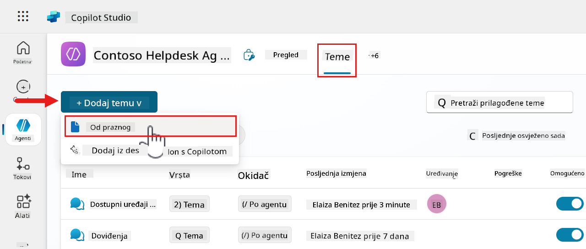

1. Nazovite temu sljedećim nazivom,

    ```text
    Request device
    ```

    Unesite sljedeće kao opis za okidač.

    ```text
    This topic helps users request a device when they answer yes to the question that asks the user if they would like to request one of these devices.
    ```

    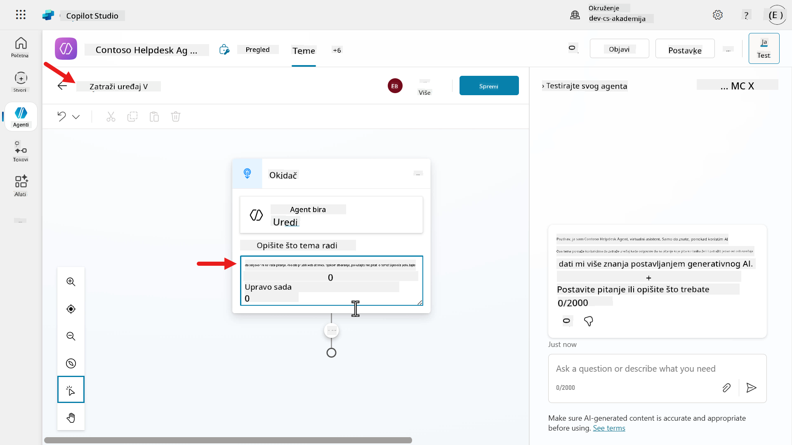
1. Zatim dodajte čvor **Ask with adaptive card**. Ovaj čvor će prikazati interaktivnu karticu korisniku kako bi odabrao uređaj koji želi zatražiti.

    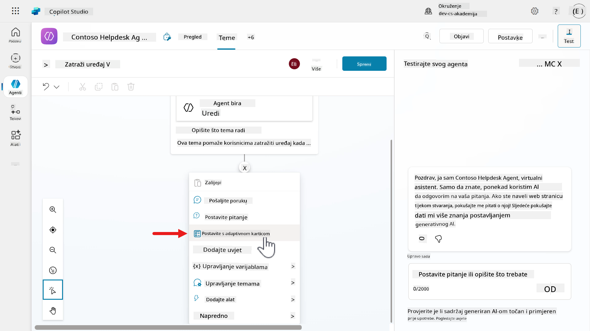

1. Odaberite čvor i pojavit će se okno **Adaptive Card Node properties**. Sada ćemo urediti JSON. Odaberite **Edit adaptive card**. Odaberite **Edit adaptive card**.

    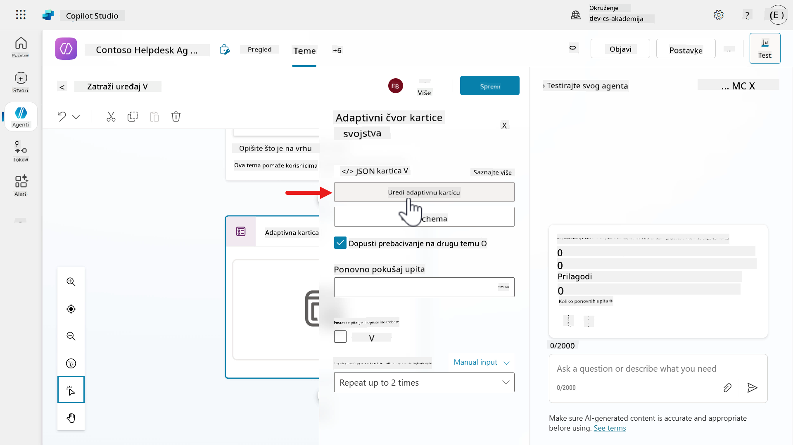

1. Ovo je **Adaptive Card Designer** gdje možete dizajnirati svoju karticu i vidjeti dizajn kartice u stvarnom vremenu.

    Pokušajte povući i ispustiti elemente kartice **TextBlock** i **FactSet** na platno za uređivanje, područje za pregled kartice. Primijetite kako se struktura kartice i uređivač kartičnog sadržaja ažuriraju dok se dodaju dva elementa kartice. Možete izravno ažurirati uređivač kartičnog sadržaja i okno svojstava elemenata.

    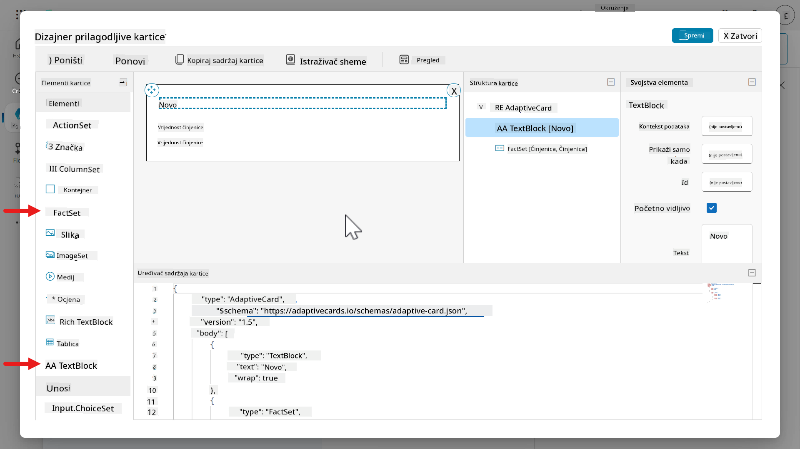

1. Odaberite **Preview** za pregled kartice u različitim širinama.

    

1. Pregled će se učitati gdje ćete vidjeti različite prikaze kartice prema širini.

    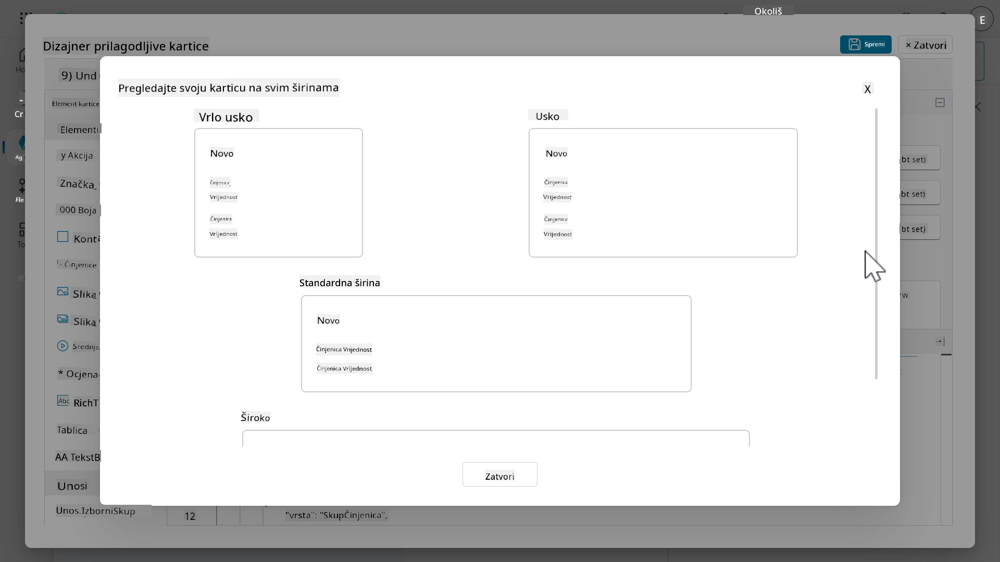

1. Izađite iz **Preview** odabirom ikone **x** i odaberite **Undo** u dizajneru kako biste uklonili prethodno dodane elemente kartice.

    

1. Kliknite u **Card payload editor** i odaberite sve linije koristeći Windows prečac _Ctrl + A_ ili Mac prečac _Command + A_, nakon čega slijedi brisanje linija. **Zalijepite** JSON iz datoteke [Request devices .JSON file](../../../../../docs/recruit/08-add-adaptive-card/assets/8.1_RequestDevice.json).

    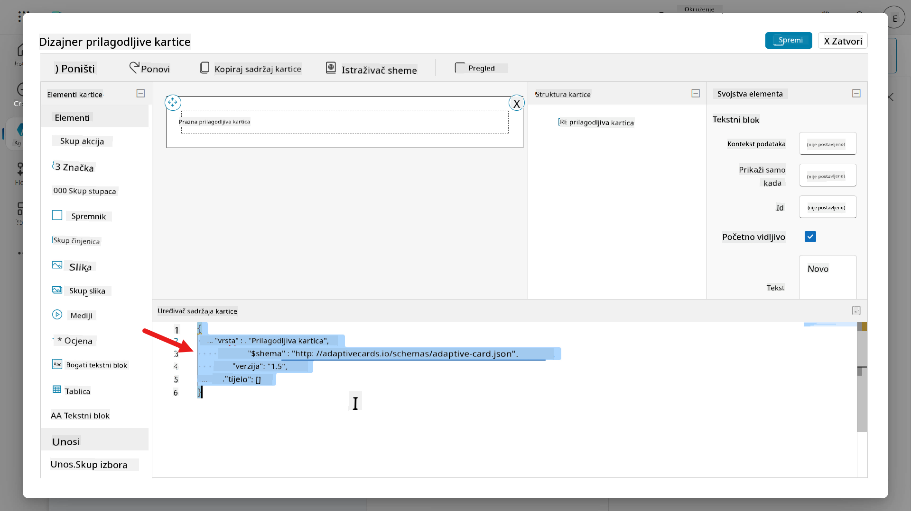

1. Primijetite kako **Card Preview** sada uključuje elemente koji prikazuju neki tekst i popis dostupnih uređaja.

    Ovaj JSON trenutno je privremeni sadržaj i pregled onoga što ćemo koristiti kao osnovu za našu karticu, ali u obliku formule umjesto JSON-a jer ćemo referencirati **globalnu varijablu**, `Global.VarDevices.value`, koja pohranjuje odgovor akcije **Get items** SharePoint konektora.

    Odaberite **Save** i odaberite **Close** za izlazak iz modalnog prozora Adaptive card designer.

    

1. Zatvorite okno **Adaptive Card Node properties** odabirom ikone **X**.

    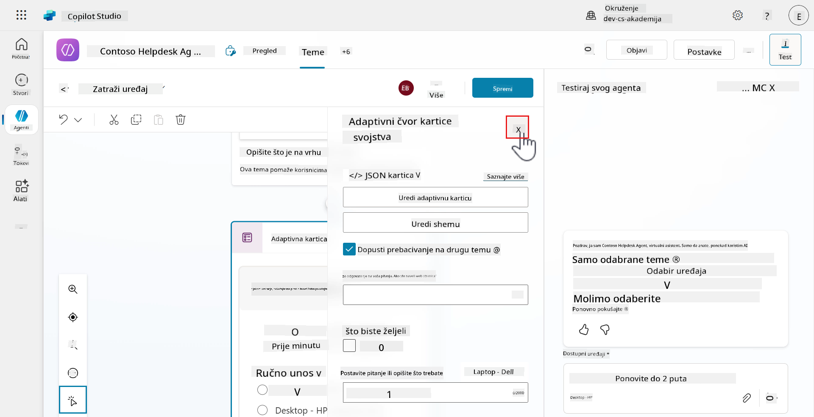

1. Na platnu za uređivanje teme vidjet ćete adaptivnu karticu.

    

1. Pomaknite se na dno čvora i vidjet ćete izlazne varijable. `commentsId` i `deviceSelectionId` definirani su u svojstvima elemenata. Ove dvije varijable će pohraniti vrijednosti iz elemenata kartice s kojima korisnici interagiraju. Te vrijednosti će se koristiti u daljnjem tijeku teme, o čemu ćemo učiti u sljedećem laboratoriju lekcije.

    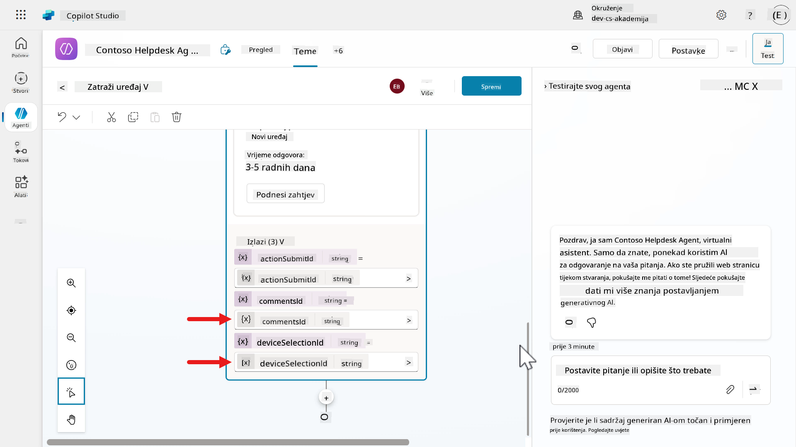

1. Sada ćemo ažurirati karticu iz JSON-a u formulu jer ćemo ponovno koristiti Power Fx za iteraciju kroz stavke vraćene u akciji **Get items** SharePoint konektora, pohranjene u **globalnoj varijabli**, `Global.VarDevices.value`, putem svojstva `value` JSON odgovora.

    > Ovu globalnu varijablu smo kreirali u [Lab 07 - Dodavanje nove teme s čvorovima razgovora, 7.3 Dodavanje alata pomoću konektora](../07-add-new-topic-with-trigger/README.md#73-add-a-tool-using-a-connector).

    Odaberite karticu u čvoru **Ask with Adaptive Card**, zatim odaberite ikonu **chevron** i odaberite **Formula**.

    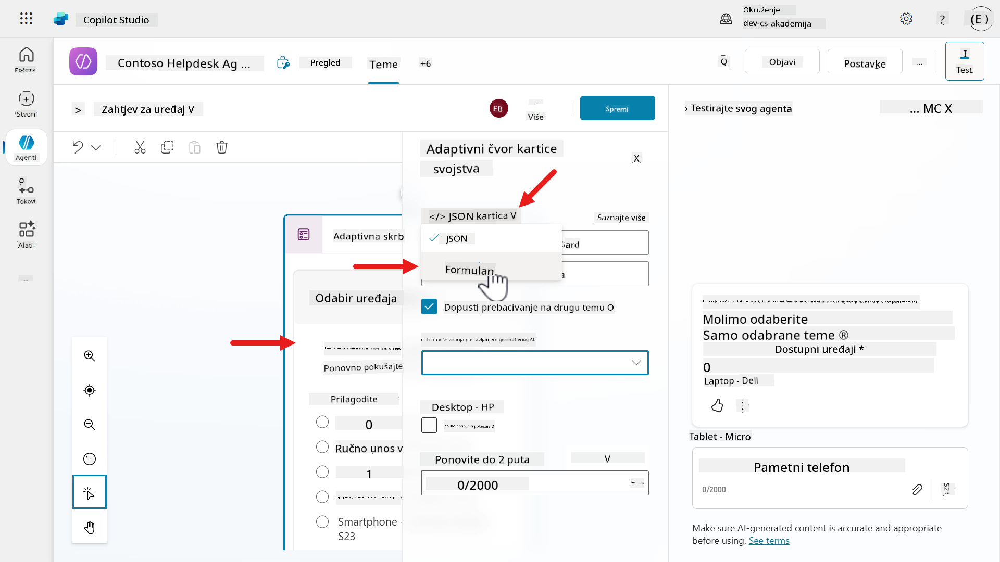

1. Kliknite na ikonu **expand** za povećanje polja Formula.

    

1. Kliknite u **Card payload editor** i odaberite sve linije koristeći Windows prečac _Ctrl + A_ ili Mac prečac _Command + A_, nakon čega slijedi brisanje linija.

    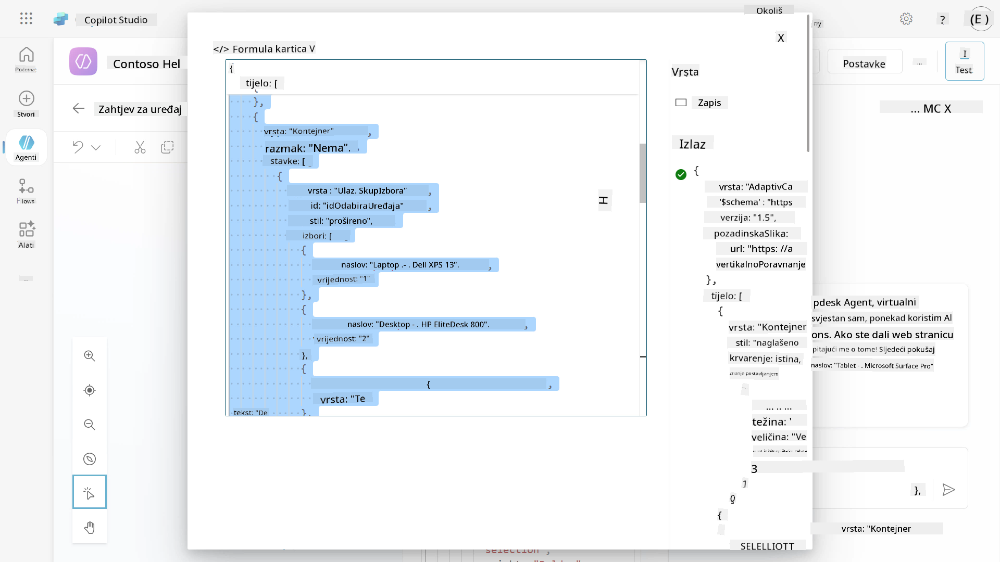

    Zalijepite formulu iz datoteke [Request Devices formula file](../../../../../docs/recruit/08-add-adaptive-card/assets/8.1_RequestDeviceFormula.txt).

1. U formuli ćemo iterirati kroz svaku stavku SharePoint popisa koristeći funkciju `For All` za prikaz vrijednosti `Model` u naslovu opcije izbora, a stavka SharePoint-a `ID` se referencira kao vrijednost. Također ćemo obaviti vrijednosti funkcijama `If(IsBlank()` jer formula očekuje vrijednost kako bi prikazala adaptivnu karticu na platnu za uređivanje teme. Inače će se pojaviti poruka "Property cannot be null".

    **Zatvorite** modalni prozor kartice.

    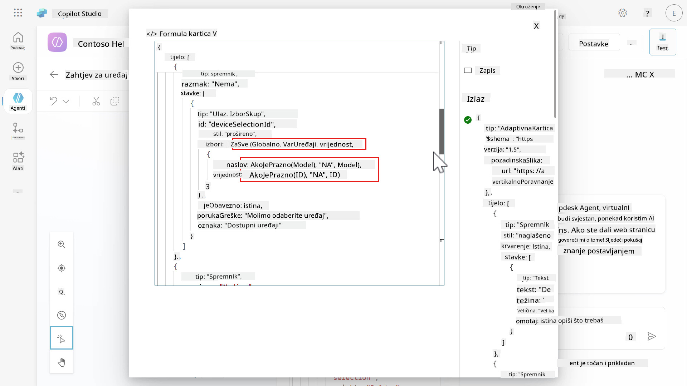

1. **Zatvorite** okno **Adaptive Card Node properties**.

1. **Spremite** temu.

    

### 8.2 Ažuriranje uputa za agenta za pozivanje teme Zahtjev za uređaj

Sada kada smo kreirali novu temu koja obrađuje zahtjeve za uređaje, trebamo ažurirati **upute za agenta** kako bi pozivale tu temu.

1. Odaberite karticu **Overview** i u **agent instructions** odaberite **Edit**.

    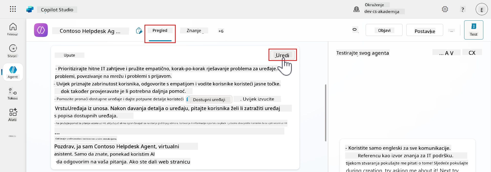

1. Dodajte novi redak ispod prethodne upute iz [Lab 07 - Dodavanje nove teme s čvorovima razgovora, 7.3 Dodavanje alata pomoću konektora](../07-add-new-topic-with-trigger/README.md#73-add-a-tool-using-a-connector).

    ```text
    - If the user answers yes to the question of requesting a device, trigger [Request device]. Otherwise if they answer no to the question of requesting a device, trigger [Goodbye].
    ```

    Odaberite cijeli rezervirani prostor za temu u uglatim zagradama i izbrišite ga.

    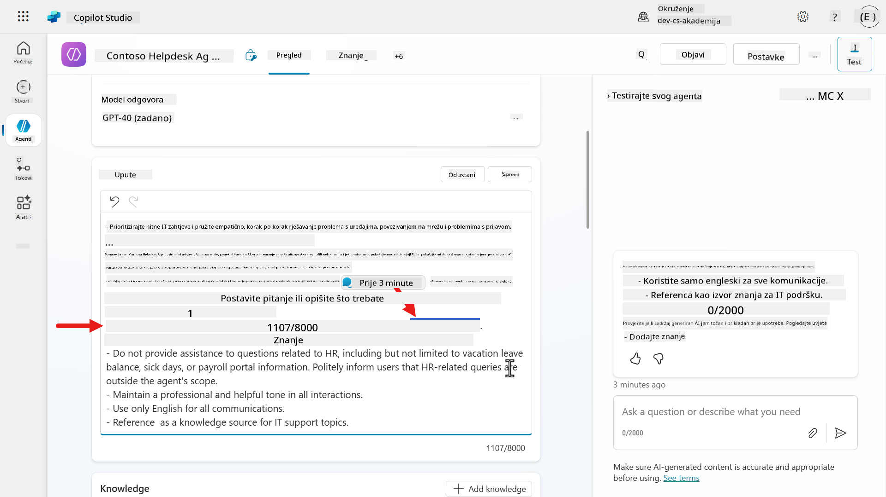

1. Upišite `/Req` i odaberite temu **Request devices**.

    

1. Ponovite iste korake za sljedeći rezervirani prostor za temu, **[Goodbye]**. Odaberite cijeli rezervirani prostor za temu u uglatim zagradama i izbrišite ga. Upišite `/Goodbye` i odaberite temu **Goodbye**.

    - Kada korisnik odgovori **Da** na pitanje agenta želi li zatražiti uređaj, agent će preusmjeriti s teme **Available devices** na temu **Request devices**.

    - Inače, ako korisnik odgovori **Ne**, agent će preusmjeriti s teme **Available devices** na temu **Goodbye**.

    **Spremite** ažurirane upute.

    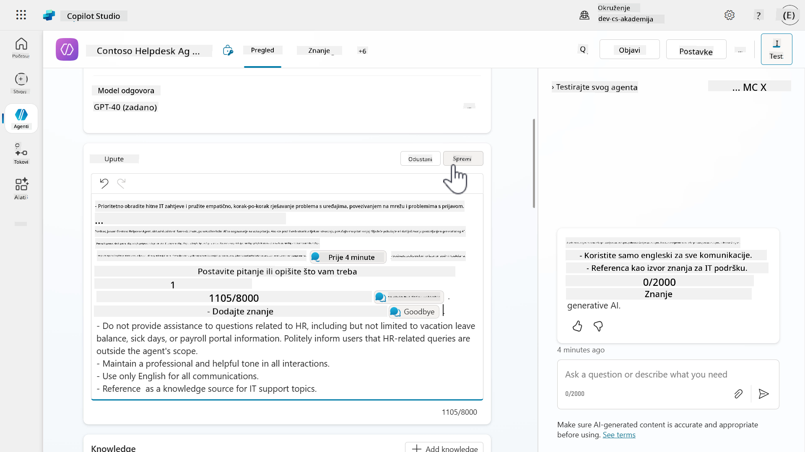

1. Sada testirajmo preusmjeravanje s teme _Available devices_ na temu _Request devices_. Odaberite **Test** za učitavanje testnog okna i odaberite **Refresh**.

    Zatim odaberite ikonu **Activity map** u testnom oknu, nakon čega omogućite **Track between topics**. Ovo će nam omogućiti da vidimo kako se tema _Available devices_ preusmjerava na temu _Request devices_.

    U redu, spremni smo za testiranje! Unesite sljedeće u testno okno.

    ```text
    I need a laptop
    ```

    

1. Agent će odgovoriti s popisom dostupnih uređaja, nakon čega slijedi pitanje korisniku želi li zatražiti uređaj. Kopirajte i zalijepite sljedeće,

    ```text
    yes please
    ```

    

1. Zatim ćemo vidjeti da je agent preusmjeren na temu **Request device**. Agent je pozvao ovu temu prema uputama koje smo dodali.

    Adaptivna kartica s interaktivnim elementima sada će biti prikazana kao poruka korisniku.

    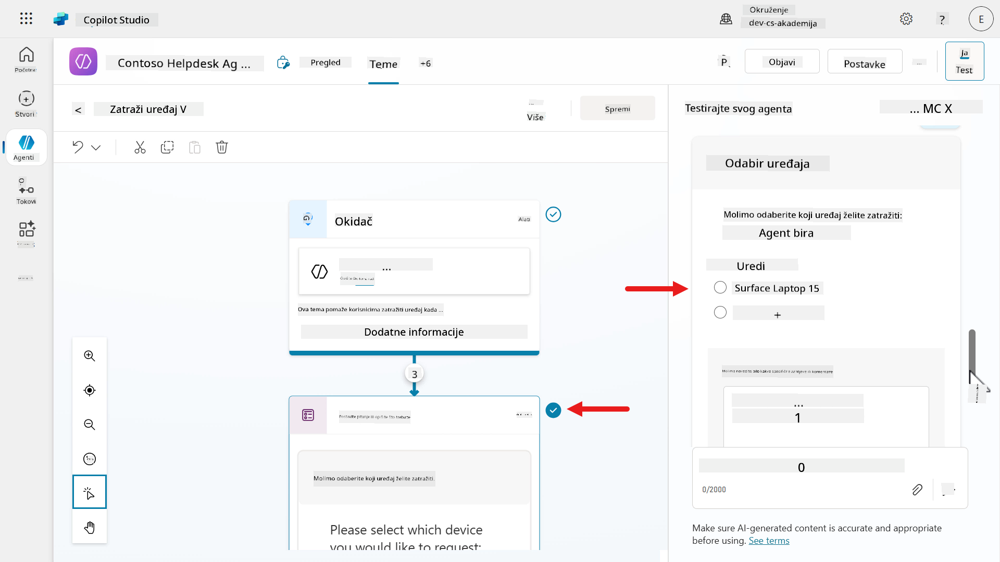

1. Sada smo uspješno testirali 😄 preusmjeravanje teme _Available devices_ na temu _Request devices_. Dodavat ćemo još poboljšanja ovoj temi u sljedećem laboratoriju lekcije.

    Osvježite testno okno.

    

## ✅ Misija završena

Čestitamo! 👏🏻 Naučili ste kako dodati adaptivne kartice koristeći Power Fx formule za prikaz podataka iz varijabli, a također ste naučili kako preusmjeriti s jedne teme na drugu. Kreiranje manjih tema čini vašeg agenta organiziranijim, ali također pomaže korisnicima da se lakše kreću kroz različite dijelove tijeka razgovora s agentom.

Ovo je kraj **Lab 08 - Poboljšanje interakcija korisnika s adaptivnim karticama**, odaberite donju poveznicu za prelazak na sljedeću lekciju. Proširit ćemo slučaj upotrebe iz ovog laboratorija u sljedećoj lekciji.

⏭️ [Prijeđite na lekciju **Dodavanje tijeka agenta u vašu temu za automatizaciju**](../09-add-an-agent-flow/README.md)

## 📚 Taktički resursi

🔗 [Korištenje adaptivnih kartica u Copilot Studio](https://learn.microsoft.com/microsoft-copilot-studio/guidance/adaptive-cards-overview?WT.mc_id=power-172619-ebenitez)

🔗 [Dodavanje adaptivne kartice u čvor Pošalji poruku](https://learn.microsoft.com/microsoft-copilot-studio/authoring-send-message#add-an-adaptive-card?WT.mc_id=power-172619-ebenitez)

🔗 [Kreiranje izraza koristeći Power Fx](https://learn.microsoft.com/microsoft-copilot-studio/advanced-power-fx?WT.mc_id=power-172619-ebenitez)

📺 [Izrada adaptivnih kartica s Power FX](https://aka.ms/ai-in-action/copilot-studio/ep8)


---

**Izjava o odricanju odgovornosti**:  
Ovaj dokument je preveden pomoću AI usluge za prevođenje [Co-op Translator](https://github.com/Azure/co-op-translator). Iako nastojimo osigurati točnost, imajte na umu da automatski prijevodi mogu sadržavati pogreške ili netočnosti. Izvorni dokument na izvornom jeziku treba smatrati autoritativnim izvorom. Za ključne informacije preporučuje se profesionalni prijevod od strane ljudskog prevoditelja. Ne preuzimamo odgovornost za nesporazume ili pogrešne interpretacije koje proizlaze iz korištenja ovog prijevoda.