<!--
CO_OP_TRANSLATOR_METADATA:
{
  "original_hash": "dcbcd9396b076da0a0f5d389e9ec1b12",
  "translation_date": "2025-10-20T17:35:31+00:00",
  "source_file": "docs/recruit/08-add-adaptive-card/README.md",
  "language_code": "hu"
}
-->
# 🚨 Küldetés 08: Felhasználói interakciók fejlesztése a Témákban Adaptive Cards segítségével

## 🕵️‍♂️ KÓDNEVE: `OPERATION INTERFACE UPLIFT`

> **⏱️ Műveleti időkeret:** `~45 perc`

🎥 **Nézd meg az útmutatót**

[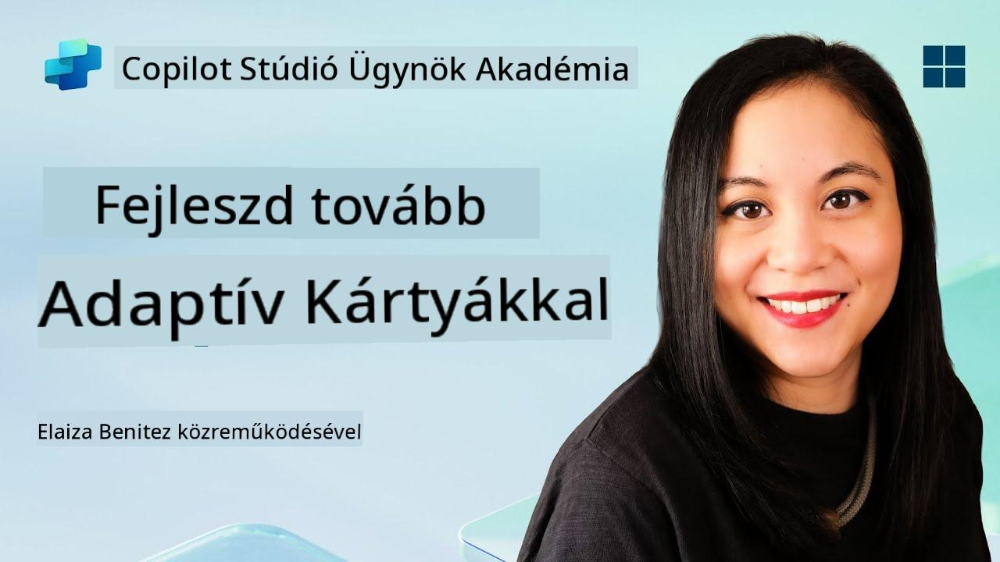](https://www.youtube.com/watch?v=RhIlzYHPCXo "Nézd meg az útmutatót a YouTube-on")

## 🎯 Küldetés összefoglaló

Ügynökök, a küldetésetek az, hogy behatoljatok a statikus felhasználói élménybe, és helyettesítsétek azt gazdag, dinamikus és interaktív Adaptive Cards elemekkel. JSON payloadokat és Power Fx formulákat fogtok bevetni, hogy átalakítsátok a Copilot Studio beszélgetéseit az egyszerű kérdés-válasz formátumról teljesen interaktív élményekké. A célotok, hogy felhasználói adatokat gyűjtsetek, gyönyörűen prezentáljátok az információkat, és precízen, stílusosan irányítsátok a beszélgetéseket. Ha nem alkalmazkodtok, a felhasználók kevésbé intelligens felületekre válthatnak.

## 🔎 Célkitűzések

Ebben a küldetésben megtanuljátok:

1. Megérteni, mik azok az Adaptive Cards, és hogyan javítják a felhasználói interakciókat a Copilot Studio-ban
1. Interaktív kártyák készítését JSON és Power Fx formulák segítségével dinamikus tartalomhoz
1. Az Adaptive Card Designer és kulcselemeinek felfedezését vizuális kártyakészítéshez
1. Gazdag, interaktív űrlapok és adatgyűjtési élmények létrehozását az ügynök témákban
1. Legjobb gyakorlatok alkalmazását reszponzív és felhasználóbarát adaptive kártyák tervezéséhez

## 🤔 Mi az az Adaptive Card?

Az **Adaptive Card** egy módja annak, hogy interaktív, vizuálisan gazdag UI elemeket hozzunk létre, amelyeket beágyazhatunk olyan alkalmazásokba, mint a Microsoft Teams, Microsoft Outlook vagy ügynökök. Ez egy strukturált JSON objektum, amely meghatározza a kártya elrendezését és tartalmát:

- Milyen elemek jelennek meg a kártyán - szöveg, képek, gombok
- Hogyan vannak elrendezve ezek az elemek
- Milyen műveleteket végezhetnek a felhasználók, például űrlap beküldése vagy link megnyitása

    

### Miért fontosak az Adaptive Cards a Copilot Studio-ban?

Képzeld el, hogy egy ügynököt építesz, amely megkérdezi a felhasználókat a nevükről, e-mail címükről vagy visszajelzésükről. Ha csak egyszerű szöveget használsz, a beszélgetés unalmasnak vagy nehezen követhetőnek tűnhet. Itt jönnek képbe az Adaptive Cards!

1. **Interaktívvá teszik a beszélgetéseket** - ahelyett, hogy szöveges üzeneteket küldenél a felhasználónak, gombokat, űrlapokat, képeket és egyebeket mutathatsz.
    - Példa: egy kártya megkérheti a felhasználót, hogy töltse ki a nevét és e-mail címét egy tiszta űrlapon.

1. **Mindenhol jól mutatnak** - Az Adaptive Cards automatikusan igazodnak az alkalmazás stílusához, amelyben megjelennek, például a Microsoft 365 Copilot chatben vagy a Microsoft Teams-ben. Nem kell aggódnod a sötét mód, a betűtípus vagy az elrendezés miatt - alkalmazkodnak.

1. **Könnyen építhető JSON-nal** - A kártyát JSON kóddal definiálod (gondolj rá úgy, mint egy _receptre_ a UI-hoz). A Copilot Studio segít előnézetet készíteni a kártyádról, mielőtt hozzáadnád a témához.

1. **Adatok gyűjtése és felhasználása** - A kártyával kérdéseket tehetsz fel, válaszokat gyűjthetsz, és felhasználhatod az adatokat a beszélgetés folyamatában.
    - Példa: Kérd a felhasználó telefonszámát, majd mutass egy megerősítő kártyát a telefonszámával.

1. **Felhasználói élmény növelése** - A kártyák interaktívabbá teszik az ügynöködet. Ez egy tisztább, kattinthatóbb és felhasználóbarátabb interfész.

## 🐱 A _JSON_ egy személy?

"Jason"-ként ejtve, nem egy személy 😅

A JSON, más néven _JavaScript Object Notation_, egy könnyű formátum az adatok strukturálására. Könnyen olvasható és írható, és kulcs-érték párok sorozataként néz ki, amelyek görbe zárójelek {} között vannak.

Ez az egyik opció, amit használhatsz, amikor egy adaptive kártyát adsz hozzá a témádhoz.

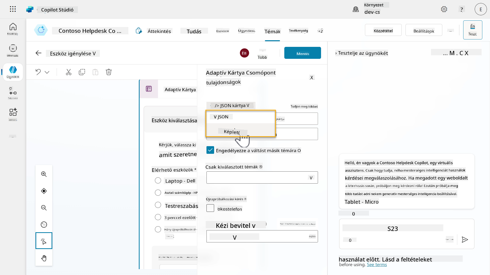

## 👀 Látok egy másik opciót az adaptive kártya építésére _formula_ használatával

Emlékszel, hogyan tanultunk a Power Fx-ről a [Küldetés 07 - Power Fx használata a node-okban](../07-add-new-topic-with-trigger/README.md#what-power-fx-can-do-in-topics) során? Ugyanez alkalmazható az Adaptive Cards-ban a Copilot Studio-ban.

Emlékeztetőül,

!!! note
    A Power Fx egy alacsony kódú programozási nyelv, amelyet logika és dinamikus viselkedés hozzáadására használnak az ügynökökhöz. Ugyanaz a nyelv, amelyet a Microsoft Power Apps-ben használnak, és úgy tervezték, hogy egyszerű és Excel-szerű legyen, megkönnyítve a fejlesztők és nem fejlesztők számára.

### Hogyan működik a Power Fx az Adaptive Cards-ban?

Amikor egy Adaptive Cardot tervezel a Copilot Studio-ban, Power Fx formulákat használhatsz:

- Dinamikusan beilleszthetsz értékeket, például felhasználói neveket, dátumokat vagy állapotokat.
- Formázhatod a szöveget vagy számokat, például megjeleníthetsz pénznemet vagy kerekíthetsz számokat.
- Feltételek alapján megjeleníthetsz vagy elrejthetsz elemeket.
- Testreszabhatod a válaszokat a felhasználói bemenetek, változók, beszélgetési node-ok kimenetei alapján.

Például,

"`Hello`" & `System.User.DisplayName`

Ez a formula dinamikusan kombinálja a "Hello" szót a felhasználó nevével.

### Miért hasznos?

1. **Személyre szabás**

    Üzeneteket igazíthatsz minden felhasználóhoz, így az interakciók természetesebbnek és relevánsabbnak érződnek.

1. **Dinamikus tartalom**

    A kártyák valós adatokat jeleníthetnek meg változókból és beszélgetési node-ok kimeneteiből.

1. **Okos logika**

    Szabályozhatod, hogy mit látnak vagy mivel lépnek interakcióba a felhasználók a feltételek alapján, javítva a használhatóságot és csökkentve a hibákat.

1. **Alacsony kódú barátságos**

    A Power Fx egy alacsony kódú programozási nyelv. Ahogy korábban említettük, olvasható, intuitív és hasonló az Excel formulákhoz.

## 👷🏻‍♀️ Építés az Adaptive Card Designer-rel

Az **Adaptive Card Designer** egy vizuális eszköz, amely lehetővé teszi interaktív üzenetkártyák létrehozását szöveg, képek, gombok és bemenetek drag-and-drop elemeinek segítségével. Célja, hogy gazdag, dinamikus üzeneteket hozzon létre bonyolult kódolás nélkül, megkönnyítve a felhasználóbarát interfészek tervezését.

Az eszköz segít vizuálisan megtervezni a kártyát, de a háttérben generálja a JSON objektumot. Átválthatsz _formula_ módra is, amely lehetővé teszi a Power Fx kifejezések használatát a kártyában, hogy máshonnan származó adatokat jeleníts meg.

## 🎨 Az Adaptive Card Designer megértése

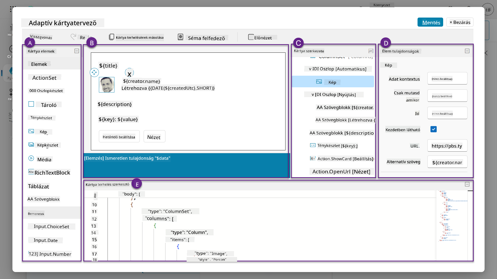

### A) Kártyaelemek

Ezek az adaptive kártya építőelemei. Drag-and-drop módszerrel hozzáadhatsz elemeket, például:

- **TextBlock** szöveg megjelenítéséhez.
- **Image** képek megjelenítéséhez.
- **FactSet** kulcs-érték párokhoz.
- **Bemeneti mezők** szövegdobozok, dátumválasztók, kapcsolók megjelenítéséhez.
- **Műveletek** gombok megjelenítéséhez, mint például _Submit_, _Open URL_, vagy _Show Card_.

Minden elemnek megvan a maga célja, és stílusozható vagy konfigurálható.

### B) Kártyanéző

Ez a **Előnézeti** terület, ahol valós időben láthatod, hogyan fog kinézni a kártyád. Ahogy elemeket adsz hozzá vagy szerkesztesz, a néző azonnal frissül, hogy tükrözze a változásokat. Ez lehetővé teszi, hogy iteratív módon frissítsd a kártyát, és egyidejűleg lásd a tervezési eredményt.

### C) Kártya struktúra

Ez mutatja a kártya **hierarchiáját és elrendezését**. Például:

- Egy kártya kezdődhet egy **TextBlock** címmel.
- Majd egy **ColumnSet**-tel, amelynek egyik oldalán kép, a másikon szöveg van.
- Ezt követheti egy **FactSet** és néhány **Művelet gomb**.

Segít megérteni, hogyan vannak az elemek egymásba ágyazva és szervezve.

### D) Elem tulajdonságok

Amikor rákattintasz bármely elemre a kártyán, ez a panel lehetővé teszi, hogy **testreszabhasd a beállításait**:

- Módosítsd a szöveg méretét, vastagságát vagy színét.
- Állítsd be a kép URL-jét vagy alternatív szövegét.
- Konfiguráld a bemeneti opciókat, például a helyőrző szöveget vagy alapértelmezett értékeket.

Itt finomhangolhatod az egyes elemeket.

### E) Kártya Payload Szerkesztő

Ez a kártyád mögötti **nyers JSON kód**. Haladó felhasználók közvetlenül szerkeszthetik ezt, hogy:

- Sablon funkciókat használjanak.
- Kártya definíciókat másoljanak/beillesszenek.

Még ha új vagy is az Adaptive Card Designer használatában, hasznos látni, hogyan fordítja le a vizuális tervezést kódokká.

!!! tip "Tipp - Nézd meg az Adaptive Card mintákat"

    1. Látogass el ide: [https://adaptivecards.microsoft.com/designer](https://adaptivecards.microsoft.com/designer).
    2. Válaszd a **New card** opciót, hogy láthasd a választható és módosítható mintákat.
    3. Ne feledd, hogy ez a tervező külső (web-alapú). Amikor kártyát készítesz a web-alapú Adaptive Card Designer-ben, másold ki a JSON-t a Card Payload Editor-ból.
    4. Illeszd be a JSON-t az adaptive kártyádba az ügynöködben a Copilot Studio-ban.

    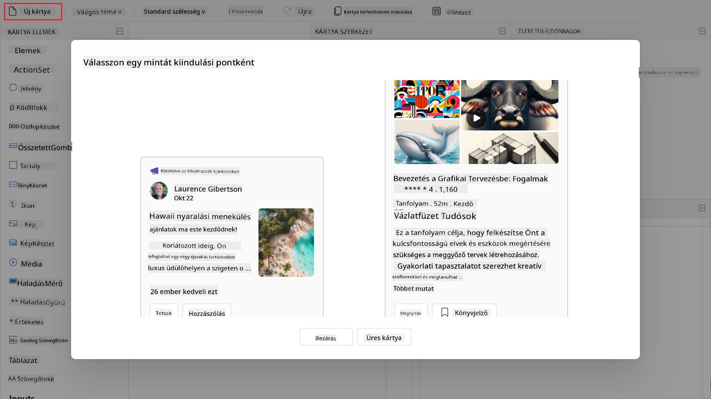

## 🌵 Gyakori felhasználási esetek

Az alábbiakban bemutatunk néhány gyakori felhasználási esetet az Adaptive Cards számára a Copilot Studio-ban, amikor a **Küldj egy üzenetet** vagy **Tegyél fel egy kérdést** node-okat használjuk.

1. **Űrlapok és adatgyűjtés**

    Használj adaptive kártyákat strukturált adatok gyűjtésére a felhasználóktól, például:

    - Szabadságkérelmek
    - Visszajelzési űrlapok
    - Kapcsolati információk
    - Időpontfoglalás

1. **Dinamikus információk megjelenítése**

    Mutass személyre szabott vagy valós idejű adatokat tiszta, olvasható formában vállalati forrásokból, mint például ServiceNow, SAP, Dynamics 365, SharePoint stb.

    - Rendelési összesítők
    - Számlaegyenlegek
    - Jegy vagy ügy állapota
    - Közelgő események vagy határidők

1. **Interaktív választások**

    Engedd meg a felhasználóknak, hogy közvetlenül a beszélgetésben válasszanak:

    - Válasszanak egy listából, például termékkategóriák, támogatási témák.
    - Erősítsenek meg vagy mondjanak le egy műveletet.
    - Értékeljenek egy szolgáltatást vagy élményt.

1. **Műveletek indítása**

    Tartalmazz gombokat, amelyek további lépéseket indítanak el a beszélgetésben belsőleg vagy külsőleg.

    - "Kérelem beküldése"
    - "Részletek megtekintése"

## ⭐ Legjobb gyakorlatok

Íme néhány legjobb gyakorlat az Adaptive Cards létrehozásához az ügynökök számára a Copilot Studio-ban.

1. **Tartsd egyszerűnek és fókuszáltnak**

    - Tervezd meg a kártyákat egyértelmű céllal, ne terheld túl sok elemmel.
    - Használj tömör szöveget és intuitív elrendezéseket, hogy irányítsd a felhasználókat az interakció során.

1. **Legyél szándékos a bemenetekkel**

    - Csak a szükséges bemeneti elemeket, például szöveget, dátumválasztókat tartalmazz, hogy ne terheld túl a felhasználókat.
    - Használj címkéket, hogy a bemenetek könnyen érthetőek legyenek.

1. **Olvashatóságra strukturálj**

    - Használj **TextBlocks**-t címsorokhoz és utasításokhoz.
    - Csoportosítsd a kapcsolódó elemeket **Containers** vagy **ColumnSets** segítségével a vizuális folyamat javítása érdekében.

1. **Tedd egyértelművé a Műveleti elemeket**

    - Használj **Action.Submit** vagy **Action.OpenUrl**-t egyértelmű gombcímekkel, mint például "Kérelem beküldése" vagy "Részletek megtekintése".
    - Kerüld az olyan homályos címkéket, mint "Kattints ide".

1. **Tervezd az alkalmazkodóképességre**

    - Feltételezd, hogy a kártyát különböző képernyőméreteken fogják megtekinteni.
    - Kerüld a fix szélességeket, és használj rugalmas elrendezéseket, például **ColumnSets**-t a reszponzivitás érdekében.

1. **Használj dinamikus tartalmat, amikor csak lehetséges**

    - Kösd a kártya elemeit változókhoz vagy node-ok kimeneteihez Power Fx segítségével, hogy személyre szabott felhasználói élményt nyújts.
    - Például dinamikusan jelenítsd meg a felhasználó nevét vagy aktuális állapotát.

## 🧪 Labor 08
1. Ezután adj hozzá egy **Kérdés adaptív kártyával** csomópontot. Ez a csomópont egy interaktív kártyát jelenít meg a felhasználónak, amelyen kiválaszthatja, hogy melyik eszközt szeretné igényelni.

    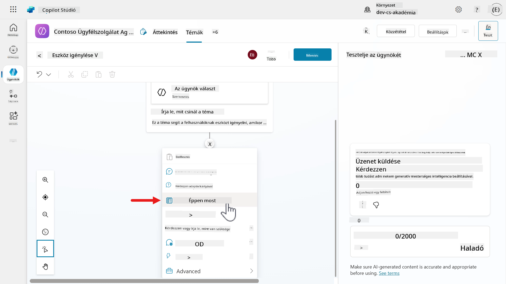

1. Válaszd ki a csomópontot, ekkor megjelenik az **Adaptív kártya csomópont tulajdonságai** panel. Most szerkeszteni fogjuk a JSON-t. Válaszd a **Adaptív kártya szerkesztése** lehetőséget. Válaszd a **Adaptív kártya szerkesztése** lehetőséget.

    

1. Ez az **Adaptív kártya tervező**, ahol megtervezheted a kártyádat, és valós időben láthatod a kártya dizájnját.

    Próbáld meg a **TextBlock** és **FactSet** kártyaelemeket áthúzni a szerkesztési vászonra, a kártyanéző területre. Figyeld meg, hogyan frissül a kártya szerkezete és a kártya payload szerkesztő, ahogy hozzáadod a két kártyaelemet. Közvetlenül frissítheted a kártya payload szerkesztőt és az elemek tulajdonságainak paneljét.

    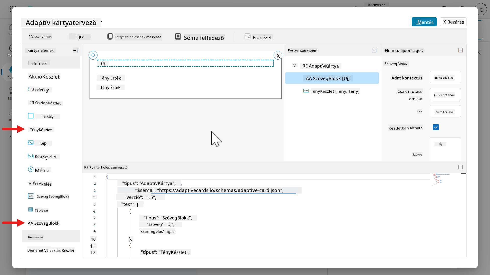

1. Válaszd a **Előnézet** lehetőséget, hogy különböző szélességekben megtekintsd a kártyát.

    

1. Az előnézet betöltődik, ahol különböző szélességekben láthatod a kártya megjelenését.

    

1. Lépj ki az **Előnézetből** az **x ikon** kiválasztásával, majd válaszd a **Visszavonás** lehetőséget a tervezőben, hogy eltávolítsd a korábban hozzáadott két kártyaelemet.

    

1. Kattints a **Kártya payload szerkesztőbe**, és válaszd ki az összes sort a Windows billentyűzet _Ctrl + A_ vagy a Mac billentyűzet _Command + A_ gyorsbillentyűjével, majd töröld a sorokat. **Illeszd be** a JSON-t a [Request devices .JSON fájlból](../../../../../docs/recruit/08-add-adaptive-card/assets/8.1_RequestDevice.json).

    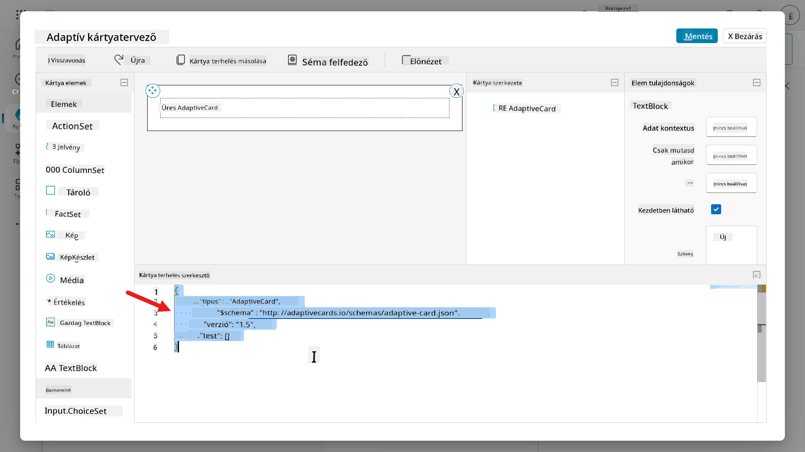

1. Figyeld meg, hogy a **Kártya előnézet** most olyan elemeket tartalmaz, amelyek szöveget és elérhető eszközök listáját jelenítik meg.

    Ez a JSON jelenleg egy helyőrző és előnézet, amelyet a kártyánk alapjaként fogunk használni, de formula formájában, nem pedig JSON-ként, mivel hivatkozni fogunk a **globális változóra**, `Global.VarDevices.value`, amely a **Get items** SharePoint csatlakozó művelet válaszát tárolja.

    Válaszd a **Mentés** és a **Bezárás** lehetőséget, hogy kilépj az Adaptív kártya tervező ablakból.

    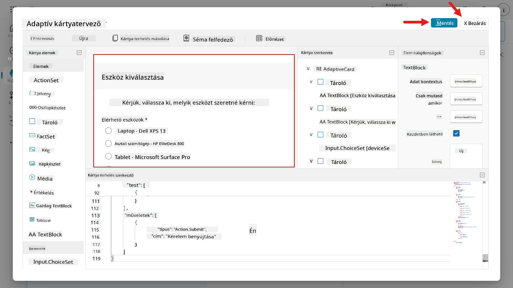

1. Zárd be az **Adaptív kártya csomópont tulajdonságai** panelt az **X** ikon kiválasztásával.

    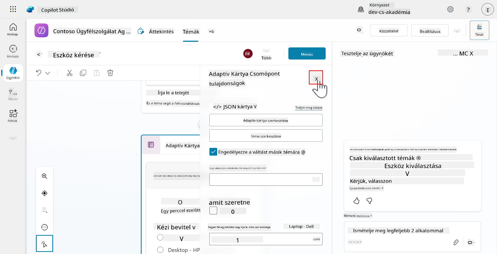

1. A téma szerkesztési vásznán látni fogod az adaptív kártyát.

    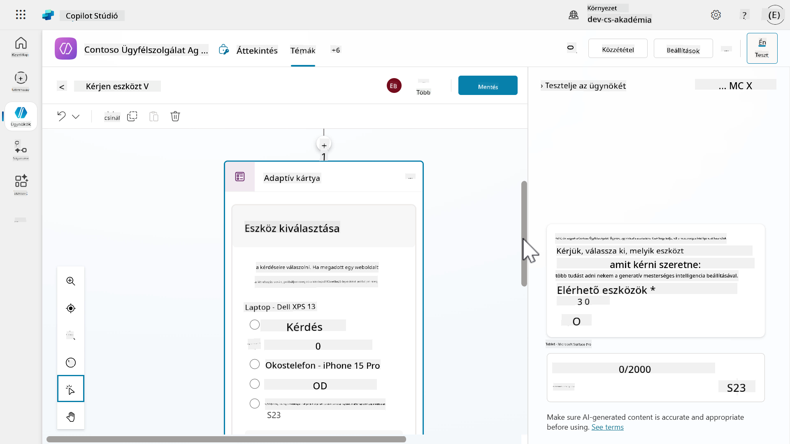

1. Görgess le a csomópont aljára, és látni fogod a kimeneti változókat. A `commentsId` és a `deviceSelectionId` az elemek tulajdonságainál lettek meghatározva. Ez a két változó tárolja az értékeket a kártyaelemekből, amelyekkel a felhasználók interakcióba lépnek. Ezeket az értékeket a téma későbbi részében fogjuk használni, amit a következő leckében tanulunk meg.

    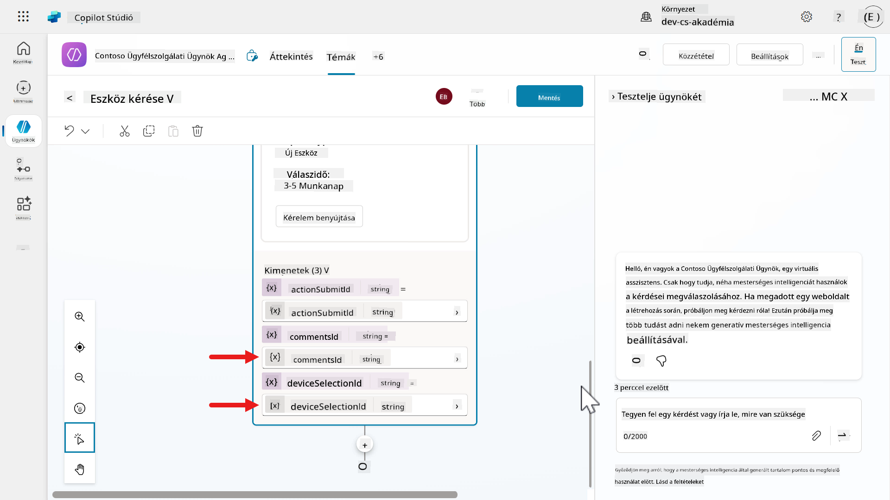

1. Most frissítsük a kártyát JSON-ról formulára, mivel ismét a Power Fx-t fogjuk használni, hogy végigmenjünk a **Get items** SharePoint csatlakozó művelet által visszaadott elemek listáján, amelyeket a **globális változó**, `Global.VarDevices.value`, tárol a JSON válasz `value` tulajdonságán keresztül.

    > Ezt a globális változót a [7.3 Új eszköz hozzáadása csatlakozóval](../07-add-new-topic-with-trigger/README.md#73-add-a-tool-using-a-connector) című leckében hoztuk létre.

    Válaszd ki a kártyát a **Kérdés adaptív kártyával** csomópontban, majd válaszd ki a **chevron** ikont, és válaszd a **Formula** lehetőséget.

    

1. Kattints a **nagyítás** ikonra, hogy nagyítsd a Formula mezőt.

    

1. Kattints a **Kártya payload szerkesztőbe**, és válaszd ki az összes sort a Windows billentyűzet _Ctrl + A_ vagy a Mac billentyűzet _Command + A_ gyorsbillentyűjével, majd töröld a sorokat.

    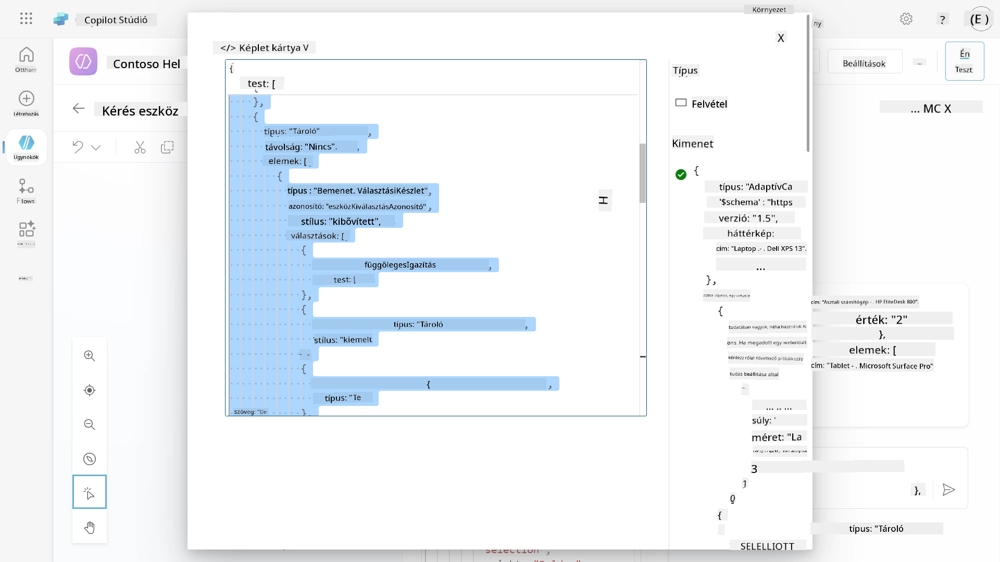

    Illeszd be a formulát a [Request Devices formula fájlból](../../../../../docs/recruit/08-add-adaptive-card/assets/8.1_RequestDeviceFormula.txt).

1. A formulában a `For All` függvényt fogjuk használni, hogy végigmenjünk minden SharePoint listaelemen, és megjelenítsük a `Model` értékeit a választási lehetőség címében, míg a SharePoint elem `ID` értéke lesz a hivatkozott érték. Az értékeket az `If(IsBlank()` függvényekkel is körbeöleljük, mivel a formula értéket vár, hogy megjelenítse az adaptív kártyát a téma szerkesztési vásznán. Ellenkező esetben megjelenik egy üzenet: "Property cannot be null".

    **Zárd be** a kártya ablakot.

    

1. **Zárd be** az **Adaptív kártya csomópont tulajdonságai** panelt.

1. **Mentsd el** a témát.

    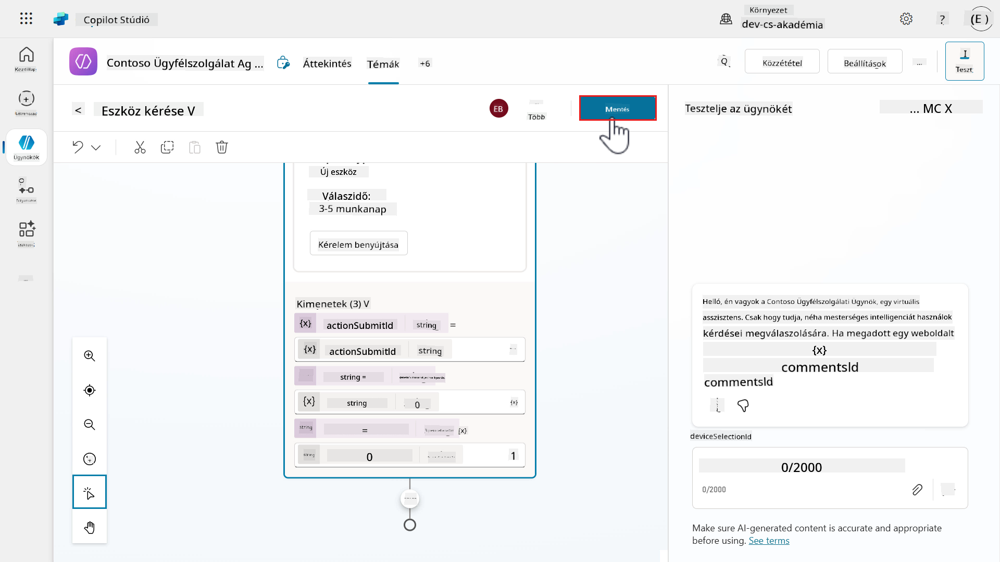

### 8.2 Ügynök utasításainak frissítése az Eszköz igénylés téma meghívásához

Most, hogy létrehoztuk az új témát, amely az eszköz igényléseket kezeli, frissítenünk kell az **ügynök utasításait**, hogy meghívja a témát.

1. Válaszd ki az **Áttekintés** fület, és az **ügynök utasításokban** válaszd a **Szerkesztés** lehetőséget.

    

1. Adj hozzá egy új sort az előző utasítás alá, amelyet a [7.3 Új eszköz hozzáadása csatlakozóval](../07-add-new-topic-with-trigger/README.md#73-add-a-tool-using-a-connector) című leckében hoztunk létre.

    ```text
    - If the user answers yes to the question of requesting a device, trigger [Request device]. Otherwise if they answer no to the question of requesting a device, trigger [Goodbye].
    ```

    Válaszd ki az egész téma helyőrzőt szögletes zárójelekben, és töröld a helyőrzőt.

    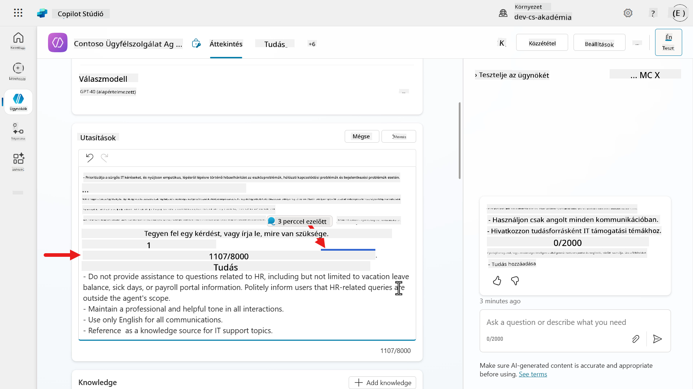

1. Írd be `/Req`, és válaszd ki az **Eszköz igénylés** témát.

    

1. Ismételd meg ugyanezeket a lépéseket a következő téma helyőrzőnél, **[Viszlát]**. Válaszd ki az egész téma helyőrzőt szögletes zárójelekben, és töröld a helyőrzőt. Írd be `/Goodbye`, és válaszd ki a **Viszlát** témát.

    - Amikor a felhasználó **Igen** választ ad az ügynök kérdésére, hogy szeretne-e eszközt igényelni, az ügynök az **Elérhető eszközök** témáról az **Eszköz igénylés** témára irányítja át.

    - Ellenkező esetben, ha a felhasználó **Nem** választ ad, az ügynök az **Elérhető eszközök** témáról a **Viszlát** témára irányítja át.

    **Mentsd el** a frissített utasításokat.

    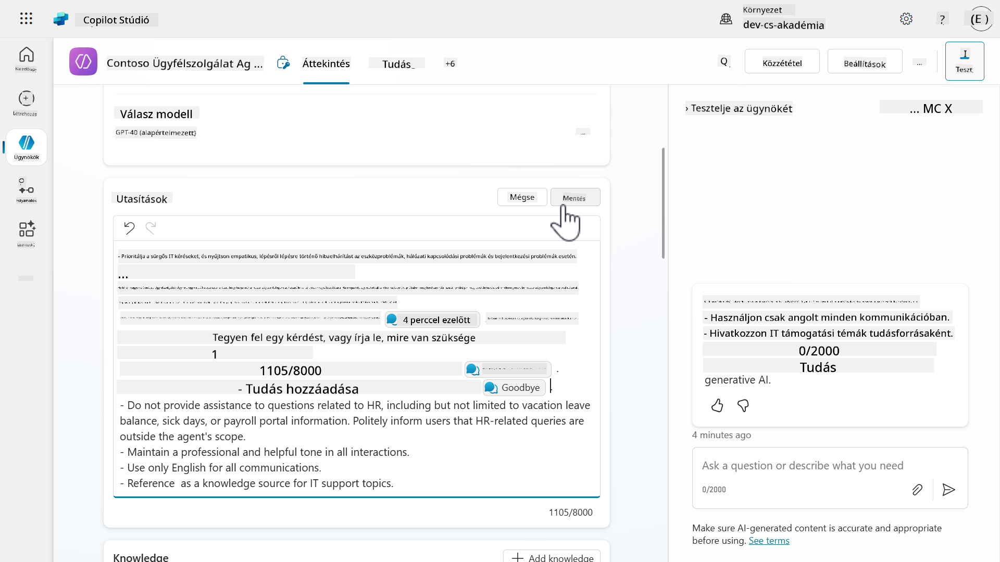

1. Most teszteljük az átirányítást az _Elérhető eszközök_ témáról az _Eszköz igénylés_ témára. Válaszd a **Teszt** lehetőséget, hogy betöltsd a tesztelési panelt, majd válaszd a **Frissítés** lehetőséget.

    Ezután válaszd ki a **Tevékenységtérkép** ikont a tesztelési panelen, majd engedélyezd a **Követés témák között** lehetőséget. Ez lehetővé teszi, hogy lássuk, az _Elérhető eszközök_ téma átirányította az _Eszköz igénylés_ témára.

    Rendben, készen állunk a tesztelésre! Írd be a következőt a tesztelési panelen.

    ```text
    I need a laptop
    ```

    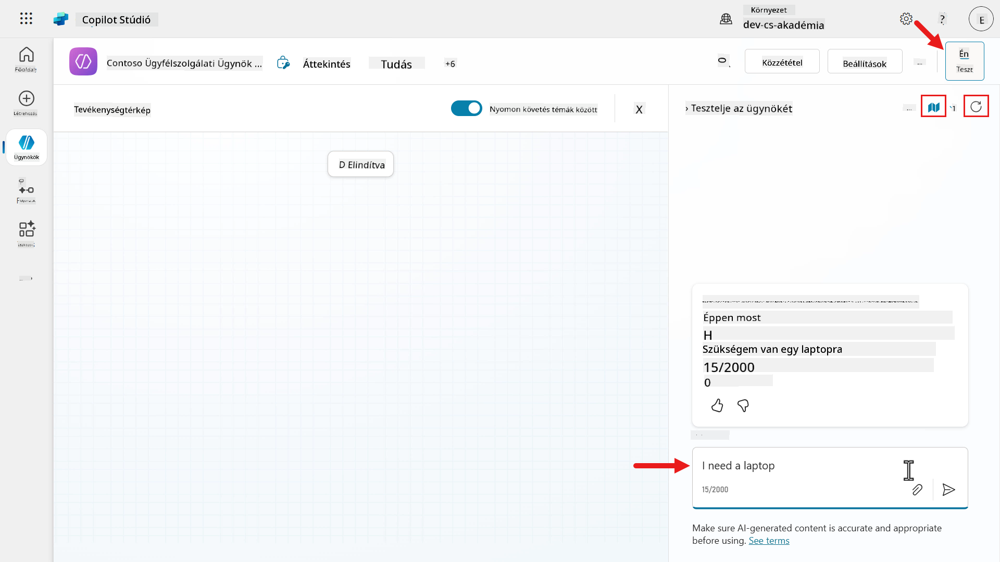

1. Az ügynök válaszol az elérhető eszközök listájával, majd megkérdezi a felhasználót, hogy szeretne-e eszközt igényelni. Másold és illeszd be a következőt:

    ```text
    yes please
    ```

    

1. Ezután látni fogjuk, hogy az ügynök átirányította az **Eszköz igénylés** témára. Az ügynök ezt a témát az általunk hozzáadott utasítások szerint hívta meg.

    Az adaptív kártya az interaktív elemekkel most üzenetként jelenik meg a felhasználónak.

    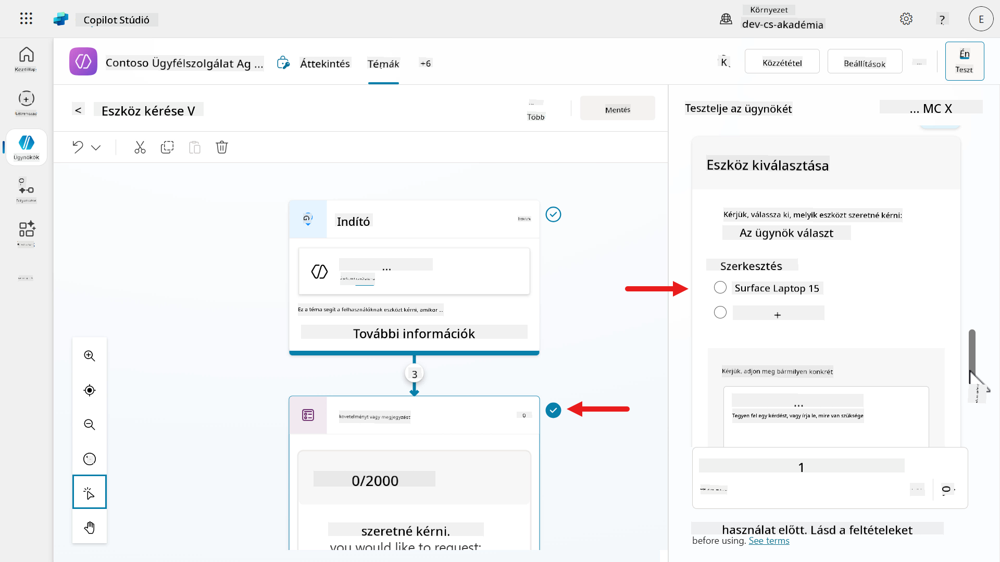

1. Sikeresen teszteltük 😄 az _Elérhető eszközök_ téma átirányítását az _Eszköz igénylés_ témára. A következő leckében további fejlesztéseket fogunk hozzáadni ehhez a témához.

    Frissítsd a tesztelési panelt.

    

## ✅ Küldetés Teljesítve

Gratulálunk! 👏🏻 Megtanultad, hogyan adj hozzá adaptív kártyákat Power Fx formulák segítségével, hogy változókból jeleníts meg adatokat, és azt is megtanultad, hogyan irányítsd át az egyik témát a másikra. A kisebb témák létrehozása nemcsak szervezettebbé teszi az ügynököt, hanem segít a felhasználóknak az ügynökkel folytatott beszélgetés különböző részein való eligazodásban.

Ez a **8. labor - Felhasználói interakciók fejlesztése adaptív kártyákkal** vége, kattints az alábbi linkre, hogy továbblépj a következő leckére. A következő laborban tovább bővítjük az ebben a leckében bemutatott felhasználási esetet.

⏭️ [Tovább a **Hozzáadás ügynök folyamathoz a témád automatizálásához** leckére](../09-add-an-agent-flow/README.md)

## 📚 Taktikai Források

🔗 [Adaptív kártyák használata a Copilot Studio-ban](https://learn.microsoft.com/microsoft-copilot-studio/guidance/adaptive-cards-overview?WT.mc_id=power-172619-ebenitez)

🔗 [Adaptív kártya hozzáadása Üzenet küldése csomópontban](https://learn.microsoft.com/microsoft-copilot-studio/authoring-send-message#add-an-adaptive-card?WT.mc_id=power-172619-ebenitez)

🔗 [Kifejezések létrehozása Power Fx segítségével](https://learn.microsoft.com/microsoft-copilot-studio/advanced-power-fx?WT.mc_id=power-172619-ebenitez)

📺 [Adaptív kártyák építése Power FX segítségével](https://aka.ms/ai-in-action/copilot-studio/ep8)

<!-- markdownlint-disable-next-line MD033 -->


---

**Felelősség kizárása**:  
Ez a dokumentum az [Co-op Translator](https://github.com/Azure/co-op-translator) AI fordítási szolgáltatás segítségével lett lefordítva. Bár törekszünk a pontosságra, kérjük, vegye figyelembe, hogy az automatikus fordítások hibákat vagy pontatlanságokat tartalmazhatnak. Az eredeti dokumentum az eredeti nyelvén tekintendő hiteles forrásnak. Kritikus információk esetén javasolt professzionális emberi fordítást igénybe venni. Nem vállalunk felelősséget semmilyen félreértésért vagy téves értelmezésért, amely a fordítás használatából eredhet.