<!--
CO_OP_TRANSLATOR_METADATA:
{
  "original_hash": "4fb913dfc3bbc71506dd3602c4b8e6ed",
  "translation_date": "2025-10-17T17:16:30+00:00",
  "source_file": "docs/operative-preview/02-multi-agent/README.md",
  "language_code": "id"
}
-->
# 🚨 Misi 02: Agen Terhubung

--8<-- "disclaimer.md"

## 🕵️‍♂️ NAMA KODE: `OPERASI SYMPHONY`

> **⏱️ Waktu Operasi:** `~45 menit`

## 🎯 Ringkasan Misi

Selamat datang kembali, Agen. Pada Misi 01, Anda telah membangun Agen Perekrutan utama Anda - sebuah dasar yang kokoh untuk mengelola alur kerja perekrutan. Namun, satu agen saja tidak cukup.

Tugas Anda, jika Anda memilih untuk menerimanya, adalah **Operasi Symphony** - mengubah agen tunggal Anda menjadi sistem **multi-agen**: tim terorganisir dari agen-agen spesialis yang bekerja sama untuk menangani tantangan perekrutan yang kompleks. Anggap saja seperti meningkatkan dari operator tunggal menjadi komandan pasukan tugas khusus.

Seperti orkestra simfoni di mana setiap musisi memainkan perannya dengan harmoni sempurna, Anda akan menambahkan dua spesialis penting ke Agen Perekrutan Anda yang sudah ada: Agen Penerimaan Aplikasi untuk memproses resume secara otomatis, dan Agen Persiapan Wawancara untuk membuat materi wawancara yang komprehensif. Agen-agen ini akan bekerja bersama dengan lancar di bawah pengawasan utama Anda.

## 🔎 Tujuan

Dalam misi ini, Anda akan belajar:

1. Kapan menggunakan **agen anak** vs **agen terhubung**
1. Cara merancang **arsitektur multi-agen** yang skalabel  
1. Membuat **agen anak** untuk tugas-tugas fokus
1. Membangun **pola komunikasi** antar agen
1. Membuat Agen Penerimaan Aplikasi dan Agen Persiapan Wawancara

## 🧠 Apa itu agen terhubung?

Di Copilot Studio, Anda tidak terbatas pada membangun agen tunggal yang monolitik. Anda dapat membuat **sistem multi-agen** - jaringan agen spesialis yang bekerja sama untuk menangani alur kerja yang kompleks.

Anggap saja seperti organisasi dunia nyata: alih-alih satu orang melakukan segalanya, Anda memiliki spesialis yang unggul dalam tugas tertentu dan berkolaborasi saat diperlukan.

### Mengapa sistem multi-agen penting

- **Skalabilitas:** Setiap agen dapat dikembangkan, diuji, dan dipelihara secara independen oleh tim yang berbeda.  
- **Spesialisasi:** Agen dapat fokus pada apa yang mereka lakukan terbaik. Mungkin satu untuk pemrosesan data, satu lagi untuk interaksi pengguna, satu lagi untuk pengambilan keputusan.  
- **Fleksibilitas:** Anda dapat mencampur dan mencocokkan agen, menggunakannya kembali di berbagai proyek, dan mengembangkan sistem Anda secara bertahap.  
- **Kemudahan Pemeliharaan:** Perubahan pada satu agen tidak harus memengaruhi agen lainnya, membuat pembaruan lebih aman dan mudah.

### Contoh dunia nyata: Proses perekrutan

Pertimbangkan alur kerja perekrutan kita - beberapa agen mungkin bekerja bersama dengan tanggung jawab berikut:

- **Penerimaan resume** membutuhkan keterampilan parsing dokumen dan ekstraksi data
- **Penilaian** melibatkan evaluasi resume kandidat dan mencocokkannya dengan persyaratan pekerjaan
- **Persiapan wawancara** membutuhkan penalaran mendalam tentang kecocokan kandidat  
- **Komunikasi dengan kandidat** membutuhkan kemampuan komunikasi yang empatik

Daripada membangun satu agen besar yang mencoba menangani semua keterampilan yang berbeda ini, Anda dapat membuat agen spesialis untuk setiap area dan mengatur mereka bersama-sama.

## 🔗 Agen anak vs agen terhubung: Perbedaan utama

Copilot Studio menawarkan dua cara untuk membangun sistem multi-agen, masing-masing dengan kasus penggunaan yang berbeda:

### ↘️ Agen anak

Agen anak adalah **spesialis ringan** yang hidup di dalam agen utama Anda. Anggap mereka sebagai tim spesialis dalam departemen yang sama.

#### Detail teknis utama

- Agen anak hidup di dalam agen induk dan memiliki satu halaman konfigurasi.
- Alat dan Pengetahuan **disimpan di agen induk**, tetapi dikonfigurasi agar "Tersedia untuk" agen anak.
- Agen anak **berbagi topik** dari agen induk mereka. Topik dapat dirujuk oleh instruksi agen anak.
- Agen anak **tidak memerlukan penerbitan terpisah** - mereka secara otomatis tersedia di dalam agen induk mereka setelah dibuat. Ini membuat pengujian lebih mudah karena perubahan pada agen induk dan anak dapat dilakukan di **ruang kerja bersama yang sama**.

#### Gunakan agen anak ketika

- Satu tim mengelola seluruh solusi
- Anda ingin mengatur alat dan pengetahuan secara logis ke dalam sub-agen
- Anda tidak memerlukan autentikasi atau penerapan terpisah untuk setiap agen
- Agen tidak akan diterbitkan secara terpisah atau digunakan secara independen
- Anda tidak perlu menggunakan kembali agen di beberapa solusi

**Contoh:** Agen helpdesk IT dengan agen anak untuk:

- Prosedur reset kata sandi
- Pemecahan masalah perangkat keras  
- Panduan instalasi perangkat lunak

### 🔀 Agen terhubung

Agen terhubung adalah **agen independen yang sepenuhnya berdiri sendiri** yang dapat berkolaborasi dengan agen utama Anda. Anggap mereka sebagai departemen terpisah yang bekerja bersama dalam sebuah proyek.

#### Detail teknis utama

- Agen terhubung memiliki **topik dan alur percakapan mereka sendiri**. Mereka beroperasi secara independen dengan pengaturan, logika, dan siklus penerapan mereka sendiri.
- Agen terhubung **harus diterbitkan** sebelum dapat ditambahkan dan digunakan oleh agen lain.
- Selama pengujian, perubahan pada agen terhubung harus diterbitkan sebelum dapat digunakan oleh agen pemanggil.

#### Gunakan agen terhubung ketika

- Beberapa tim mengembangkan dan memelihara agen yang berbeda secara independen
- Agen membutuhkan pengaturan, autentikasi, dan saluran penerapan mereka sendiri
- Anda ingin menerbitkan dan memelihara agen secara terpisah dengan manajemen siklus aplikasi (ALM) independen untuk setiap agen
- Agen harus dapat digunakan kembali di beberapa solusi

**Contoh:** Sistem layanan pelanggan yang terhubung ke:

- Agen penagihan terpisah yang dikelola oleh tim keuangan
- Agen dukungan teknis terpisah yang dikelola oleh tim produk
- Agen pengembalian terpisah yang dikelola oleh tim operasional

!!! tip "Tip"
    Anda dapat mencampur kedua pendekatan! Misalnya, agen utama Anda dapat terhubung ke agen eksternal dari tim lain sambil juga memiliki agen anak sendiri untuk tugas internal yang khusus.

## 🎯 Pola arsitektur multi-agen

Saat merancang sistem multi-agen, beberapa pola muncul berdasarkan bagaimana agen berinteraksi:

| Pola                | Deskripsi                                                                 | Terbaik Untuk                                                  |
|---------------------|---------------------------------------------------------------------------|----------------------------------------------------------------|
| **Hub dan Spoke**   | Agen pengatur utama mengoordinasikan dengan beberapa agen spesialis. Pengatur menangani interaksi pengguna dan mendelegasikan tugas ke agen anak atau terhubung. | Alur kerja kompleks di mana satu agen mengoordinasikan tugas-tugas khusus |
| **Pipeline**        | Agen meneruskan pekerjaan secara berurutan dari satu ke yang berikutnya, masing-masing menambahkan nilai sebelum meneruskan ke tahap berikutnya. | Proses linear seperti pemrosesan aplikasi (penerimaan → penyaringan → wawancara → keputusan) |
| **Kolaboratif**     | Agen bekerja bersama secara simultan pada aspek yang berbeda dari masalah yang sama, berbagi konteks dan hasil. | Analisis kompleks yang membutuhkan berbagai perspektif atau bidang keahlian |

!!! tip "Tip"
    Anda bahkan dapat memiliki kombinasi dari dua atau lebih pola ini.

## 💬Komunikasi agen dan berbagi konteks

Ketika agen bekerja bersama, mereka perlu berbagi informasi secara efektif. Berikut cara kerjanya di Copilot Studio:

### Riwayat percakapan

Secara default, ketika agen utama memanggil agen anak atau terhubung, ia dapat meneruskan **riwayat percakapan**. Ini memberikan agen spesialis konteks penuh tentang apa yang telah dibahas oleh pengguna.

Anda dapat menonaktifkan ini untuk alasan keamanan atau kinerja - misalnya, jika agen spesialis hanya perlu menyelesaikan tugas tertentu tanpa membutuhkan konteks percakapan penuh. Ini bisa menjadi pertahanan yang baik terhadap **kebocoran data**.

### Instruksi eksplisit

Agen utama Anda dapat memberikan **instruksi spesifik** kepada agen anak atau terhubung. Misalnya: "Proses resume ini dan ringkas keterampilan mereka untuk peran Senior Developer."

### Nilai pengembalian

Agen dapat mengembalikan informasi terstruktur kembali ke agen pemanggil, memungkinkan agen utama menggunakan informasi tersebut dalam langkah-langkah berikutnya atau membagikannya dengan agen lain.

### Integrasi Dataverse

Untuk skenario yang lebih kompleks, agen dapat berbagi informasi melalui **Dataverse** atau penyimpanan data lainnya, memungkinkan berbagi konteks yang persisten di beberapa interaksi.

## ↘️Agen anak: Agen Penerimaan Aplikasi

Mari kita mulai membangun sistem perekrutan multi-agen kita. Spesialis pertama kita adalah **Agen Penerimaan Aplikasi** - agen anak yang bertanggung jawab untuk memproses resume dan informasi kandidat yang masuk.

```mermaid
---
config:
  layout: elk
  look: neo
---
flowchart TB
 subgraph People["People"]
    direction TB
        HiringManager["Hiring Manager"]
        Interviewers["Interviewers"]
  end
 subgraph Agents["Agents"]
    direction LR
        ApplicationIntakeAgent["Application Intake Agent<br>(Child)"]
        InterviewAgent["Interview Agent<br>(Connected)"]
        HRAgent["HR Agent"]
  end
    HiringManager -- Upload CV --> HRAgent
    HRAgent -- Upload Resume, Create Candidate, Match to Job Roles --> ApplicationIntakeAgent
    ApplicationIntakeAgent -- Create Resume, Upsert Candidate, Create Job Application --> Dataverse["Dataverse"]
    ApplicationIntakeAgent -- Store Resume file in file column --> Dataverse
    HiringManager -- Ask for summaries --> HRAgent
    Interviewers -- Request interview pack --> HRAgent
    HRAgent -- Generate interview pack and summarize data --> InterviewAgent
    InterviewAgent -- Read all Candidate, Resume, Job Roles, Evaluation Criteria Data --> Dataverse
     HiringManager:::person
     Interviewers:::person
     ApplicationIntakeAgent:::agent
     InterviewAgent:::agent
     HRAgent:::agent
     Dataverse:::data
    classDef person fill:#e6f0ff,stroke:#3b82f6,color:#0b3660
    classDef agent fill:#e8f9ef,stroke:#10b981,color:#064e3b
    classDef data  fill:#f3f4f6,stroke:#6b7280,color:#111827
```

### 🤝Tanggung jawab Agen Penerimaan Aplikasi

- **Memproses konten resume** dari PDF yang diberikan melalui chat interaktif (Di misi mendatang Anda akan belajar cara memproses resume secara otomatis).
- **Menarik data terstruktur** (nama, keterampilan, pengalaman, pendidikan)
- **Mencocokkan kandidat dengan peran yang tersedia** berdasarkan kualifikasi dan surat pengantar
- **Menyimpan informasi kandidat** di Dataverse untuk pemrosesan selanjutnya
- **Menghindari duplikasi aplikasi** untuk mencegah pembuatan kandidat yang sama dua kali, mencocokkan dengan catatan yang ada menggunakan alamat email yang diekstraksi dari resume.

### ⭐Mengapa ini harus menjadi agen anak

Agen Penerimaan Aplikasi sangat cocok sebagai agen anak karena:

- Ini khusus untuk pemrosesan dokumen dan ekstraksi data
- Tidak memerlukan penerbitan terpisah  
- Ini adalah bagian dari solusi perekrutan keseluruhan yang dikelola oleh tim yang sama
- Ini berfokus pada pemicu tertentu (resume baru diterima) dan dipanggil dari Agen Perekrutan.

## 🔀Agen terhubung: Agen Persiapan Wawancara  

Spesialis kedua kita adalah **Agen Persiapan Wawancara** - agen terhubung yang membantu membuat materi wawancara yang komprehensif dan mengevaluasi respons kandidat.

### 🤝Tanggung jawab Agen Persiapan Wawancara

- **Membuat paket wawancara** dengan informasi perusahaan, persyaratan peran, dan kriteria evaluasi
- **Menghasilkan pertanyaan wawancara** yang disesuaikan dengan peran tertentu dan latar belakang kandidat
- **Menjawab pertanyaan umum** tentang peran pekerjaan dan aplikasi untuk komunikasi dengan pemangku kepentingan

### ⭐Mengapa ini harus menjadi agen terhubung

Agen Persiapan Wawancara lebih baik sebagai agen terhubung karena:

- Tim akuisisi bakat mungkin ingin menggunakannya secara independen di berbagai proses perekrutan
- Ia membutuhkan basis pengetahuan sendiri tentang praktik terbaik wawancara dan kriteria evaluasi
- Manajer perekrutan yang berbeda mungkin ingin menyesuaikan perilakunya untuk tim mereka
- Ia dapat digunakan kembali untuk posisi internal, bukan hanya perekrutan eksternal

## 🧪Lab 2.1: Menambahkan Agen Penerimaan Aplikasi

Siap untuk menerapkan teori ke praktik? Mari tambahkan agen anak pertama kita ke Agen Perekrutan Anda yang sudah ada.

### Prasyarat untuk menyelesaikan misi ini

Anda perlu **salah satu**:

- **Telah menyelesaikan Misi 01** dan memiliki Agen Perekrutan Anda siap, **ATAU**
- **Mengimpor solusi awal Misi 02** jika Anda memulai dari awal atau perlu mengejar ketinggalan. [Unduh Solusi Awal Misi 02](https://aka.ms/agent-academy)

!!! note "Impor Solusi dan Data Contoh"
    Jika Anda menggunakan solusi awal, lihat [Misi 01](../01-get-started/README.md) untuk instruksi rinci tentang cara mengimpor solusi dan data contoh ke lingkungan Anda.

### 2.1.1 Pengaturan solusi

1. Di dalam Copilot Studio, pilih elipsis (...) di bawah Tools di navigasi kiri.
1. Pilih **Solutions**.  
    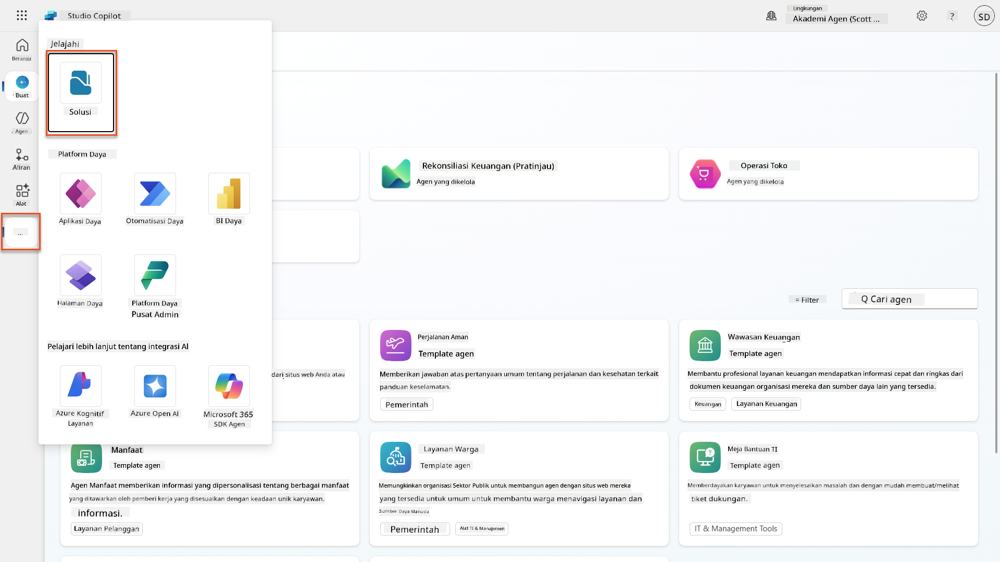
1. Temukan solusi Operative Anda, pilih **elipsis (...)** di sebelahnya, dan pilih **Set preferred solution**. Ini akan memastikan bahwa semua pekerjaan Anda akan ditambahkan ke solusi ini.  
    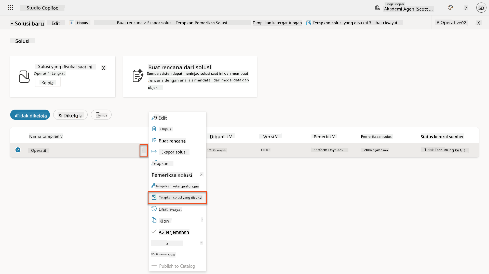

### 2.1.2 Konfigurasi instruksi agen Hiring Agent Anda

1. **Navigasikan** ke Copilot Studio. Pastikan lingkungan Anda dipilih di **Environment Picker** di kanan atas.

1. Buka **Hiring Agent** Anda dari Misi 01

1. Pilih **Edit** di bagian **Instructions** dari tab **Overview**, dan tambahkan instruksi berikut di bagian atas:

    ```text
    You are the central orchestrator for the hiring process. You coordinate activities, provide summaries, and delegate work to specialized agents.
    ```

1. Pilih **Save**  
    

1. Pilih **Settings** (kanan atas)

1. Pastikan pengaturan berikut:

    | Pengaturan | Nilai |
    |------------|-------|
    | Gunakan orkestrasi AI generatif untuk respons agen Anda | **Ya** |
    | Moderasi Konten | **Sedang** |
    | Gunakan pengetahuan umum | **Mati** |
    | Gunakan informasi dari Web | **Mati** |
    | Unggahan file | **Aktif** |


### 2.1.3 Tambahkan agen anak Application Intake

1. **Navigasikan** ke tab **Agents** di dalam Hiring Agent Anda - di sinilah Anda akan menambahkan agen spesialis.

1. Pilih **+ Add** lalu **Create an agent**. Perhatikan bahwa ini diberi label "*Buat agen ringan yang hidup di dalam agen Anda saat ini dan mewarisi pengaturannya. Ideal untuk memecah logika yang kompleks* "  
    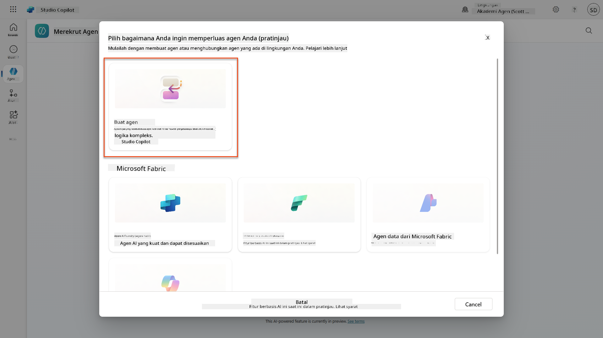

1. **Nama** agen Anda `Application Intake Agent`

1. Pilih **The agent chooses** - Berdasarkan deskripsi di dropdown **When will this be used?**. Opsi ini mirip dengan pemicu yang dapat dikonfigurasi untuk topik.

1. Tetapkan **Deskripsi** sebagai:

    ```text
    Processes incoming resumes and stores candidates in the system
    ```

    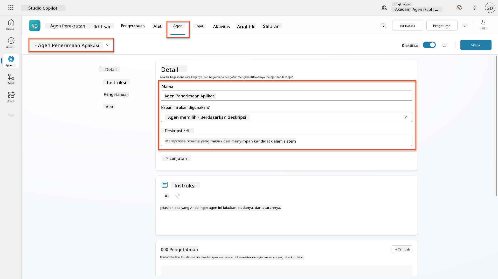

1. Perluas **Advanced**, dan tetapkan Prioritas menjadi `10000`. Ini akan memastikan bahwa nanti Agen Wawancara akan digunakan untuk menjawab pertanyaan umum sebelum agen ini. Kondisi juga dapat ditetapkan di sini seperti memastikan bahwa ada setidaknya satu lampiran.

1. Pastikan toggle **Web Search** diatur ke **Disabled**. Ini karena kita hanya ingin menggunakan informasi yang diberikan oleh agen induk.

1. Pilih **Save**

### 2.1.4 Konfigurasi alur agen Upload Resume

Agen tidak dapat melakukan tindakan apa pun tanpa diberikan alat atau topik.
Kami menggunakan **alat Agent Flow** daripada Topik untuk langkah *Upload Resume* karena proses backend multi-langkah ini membutuhkan eksekusi deterministik dan integrasi dengan sistem eksternal. Sementara Topik lebih baik untuk membimbing dialog percakapan, Agent Flow menyediakan otomatisasi terstruktur yang diperlukan untuk menangani pemrosesan file, validasi data, dan upsert database (menambahkan baru atau memperbarui yang sudah ada) secara andal tanpa bergantung pada interaksi pengguna.

1. Temukan bagian **Tools** di halaman Application Intake Agent.
   **Penting:** Ini bukan tab Tools dari parent agent, tetapi dapat ditemukan jika Anda menggulir ke bawah di bawah instruksi child agent.

1. Pilih **+ Add**
   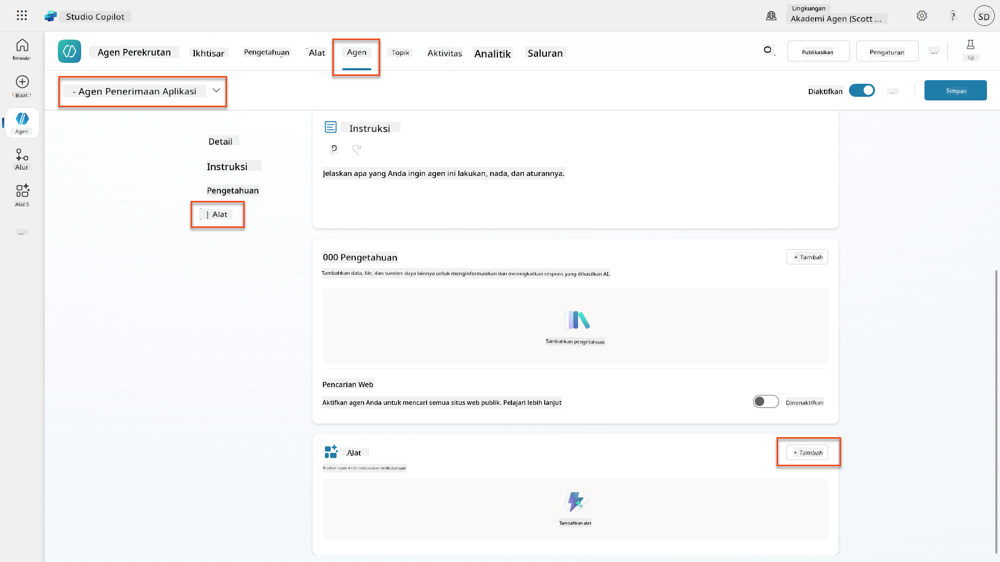

1. Pilih **+ New tool** 

1. Pilih **Agent flow**.
    Desainer Agent Flow akan terbuka, di sinilah kita akan menambahkan logika upload resume.  
    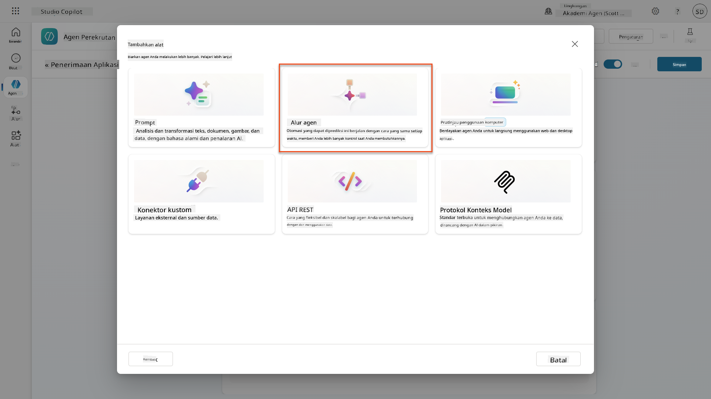

1. Pilih node **When an agent calls the flow**, dan pilih **+ Add** input untuk Parameter berikut, pastikan untuk menambahkan nama dan deskripsi.

    | Tipe  | Nama       | Deskripsi                                                                                                   |
    |-------|------------|------------------------------------------------------------------------------------------------------------|
    | File  | Resume     | File PDF Resume                                                                                            |
    | Teks  | Message    | Ekstrak pesan gaya cover letter dari konteks. Pesan harus kurang dari 2000 karakter.                       |
    | Teks  | UserEmail  | Alamat email asal Resume. Ini akan menjadi pengguna yang mengunggah resume di chat, atau alamat email pengirim jika diterima melalui email. |

    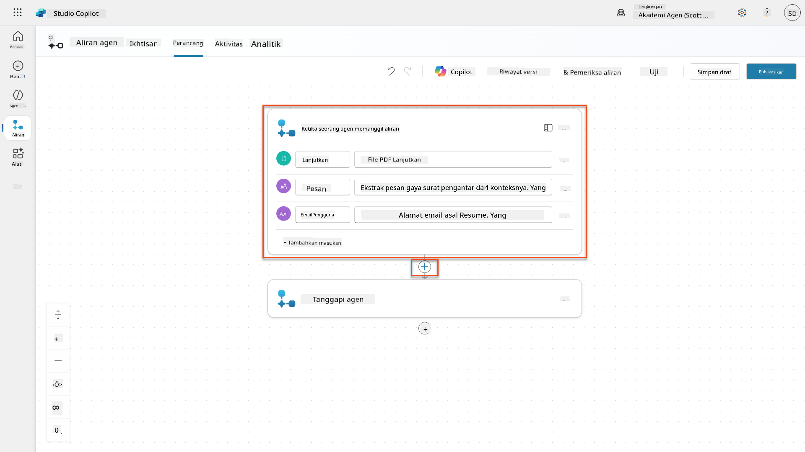

1. Pilih **+ icon** di bawah node trigger, cari `Dataverse`, pilih **See more** di sebelah Microsoft Dataverse, lalu pilih aksi **Add a new row** di bagian **Microsoft Dataverse**  
    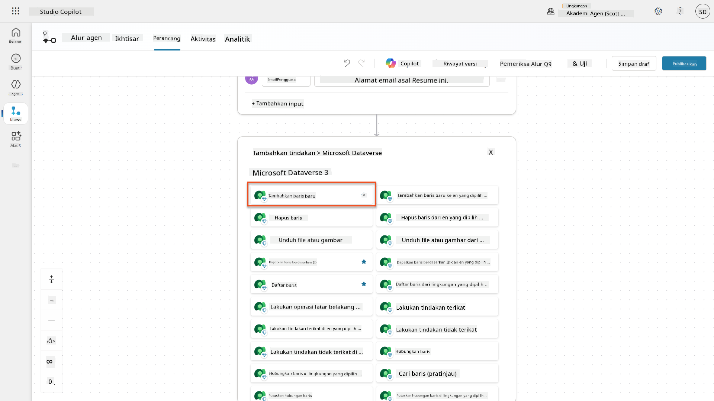

1. Beri nama node menjadi **Create Resume**, dengan memilih **ellipsis(...)**, lalu pilih **Rename**  
    

1. Atur **Table name** menjadi **Resumes**, lalu pilih **Show all**, untuk menampilkan semua parameter.

1. Atur **properties** berikut:

    | Properti                 | Cara Mengatur                  | Detail / Ekspresi                                              |
    | ------------------------ | ------------------------------ | -------------------------------------------------------------- |
    | **Resume Title**         | Data dinamis (ikon petir)      | **When an agent calls the flow** → **Resume name** Jika Anda tidak melihat Resume name, pastikan Anda telah mengonfigurasi parameter Resume di atas sebagai tipe data. |
    | **Cover letter**         | Ekspresi (ikon fx)             | `if(greater(length(triggerBody()?['text']), 2000), substring(triggerBody()?['text'], 0, 2000), triggerBody()?['text'])` |
    | **Source Email Address** | Data dinamis (ikon petir)      | **When an agent calls the flow** → **UserEmail**               |
    | **Upload Date**          | Ekspresi (ikon fx)             | `utcNow()`                                                     |

    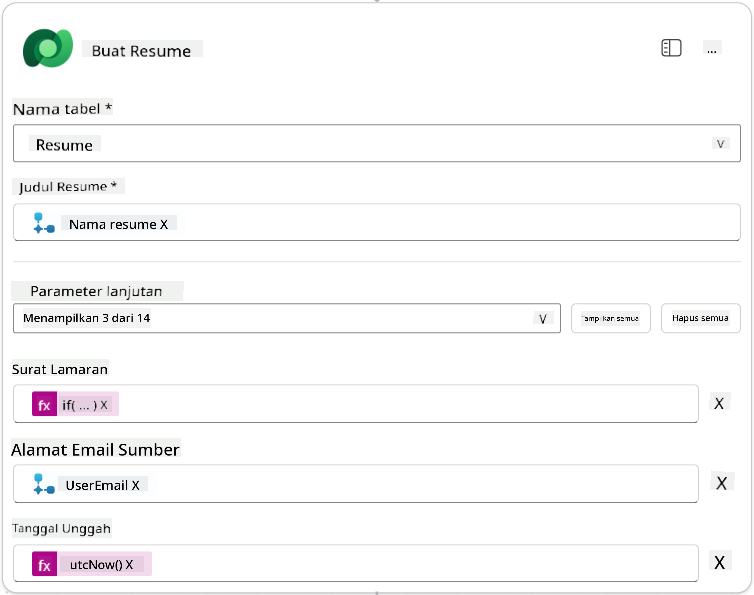

1. Pilih **+ icon** di bawah node Create Resume, cari `Dataverse`, pilih **See more** di sebelah Microsoft Dataverse, lalu pilih aksi **Upload a file or an image**.
   **Penting:** Pastikan untuk tidak memilih aksi Upload a file or an image to the selected environment.

1. Beri nama node menjadi **Upload Resume File**, dengan memilih **ellipsis(...)**, lalu pilih **Rename**

1. Atur **properties** berikut:

     | Properti | Cara Mengatur | Detail |
     |----------|---------------|--------|
     | **Content name** | Data dinamis (ikon petir) | When an agent calls the flow → Resume name |
     | **Table name** | Pilih | Resumes |
     | **Row ID** | Data dinamis (ikon petir) | Create Resume → See more → Resume |
     | **Column Name** | Pilih | Resume PDF |
     | **Content** | Data dinamis (ikon petir) | When an agent calls the flow → Resume contentBytes |

     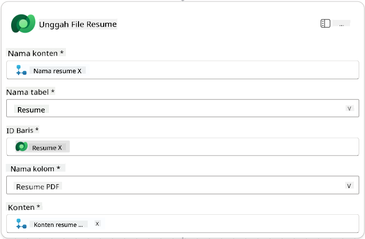

1. Pilih node **Respond to the agent**, lalu pilih **+ Add an output**

     | Properti | Cara Mengatur | Detail |
     |----------|---------------|--------|
     | **Type** | Pilih | `Text` |
     | **Name** | Masukkan | `ResumeNumber` |
     | **Value** | Data dinamis (ikon petir) | Create Resume → See More → Resume Number |
     | **Description** | Masukkan | `Nomor [ResumeNumber] dari Resume yang dibuat` |

     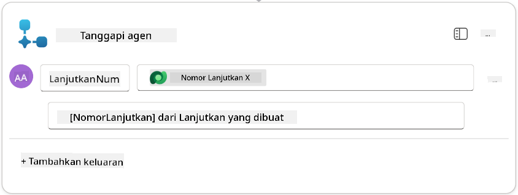

1. Pilih **Save draft** di kanan atas  
     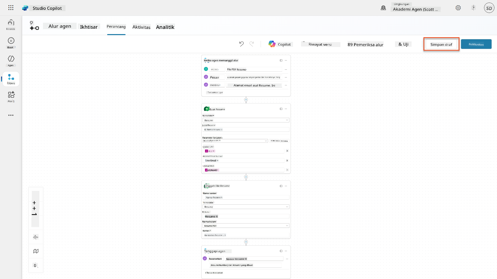

1. Pilih tab **Overview**, lalu pilih **Edit** di panel **Details**

     1. **Flow name**:`Resume Upload`
     1. **Description**:`Mengunggah Resume saat diperintahkan`

     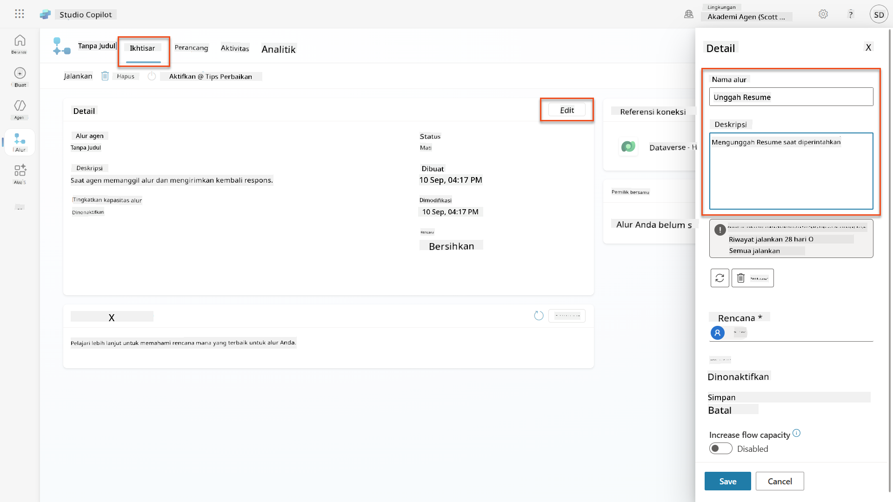

1. Pilih tab **Designer** lagi, lalu pilih **Publish**.  
     

### 2.1.5 Hubungkan flow ke agent Anda

Sekarang Anda akan menghubungkan flow yang telah dipublikasikan ke Application Intake Agent Anda.

1. Navigasikan kembali ke **Hiring Agent** dan pilih tab **Agents**. Buka **Application Intake Agent**, lalu temukan panel **Tools**.  
    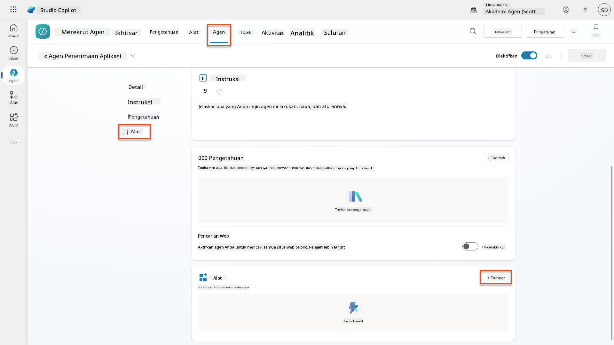

1. Pilih **+ Add**

1. Pilih filter **Flow**, lalu cari `Resume Upload`. Pilih flow **Resume Upload**, lalu **Add and configure**.

1. Atur parameter berikut:

    | Parameter | Nilai |
    |-----------|-------|
    | **Description** | `Mengunggah Resume saat diperintahkan. ATURAN KETAT: Hanya panggil alat ini saat disebutkan dalam bentuk "Resume Upload" dan ada Lampiran` |
    | **Additional details → When this tool may be used** | `hanya saat disebutkan oleh topik atau agen` |
    | **Inputs → Add Input** | `contentBytes` |
    | **Inputs → Add Input** | `name` |

    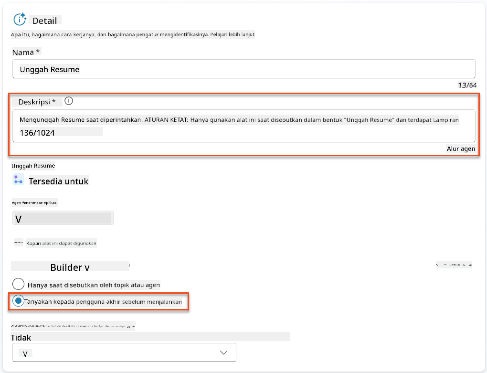

    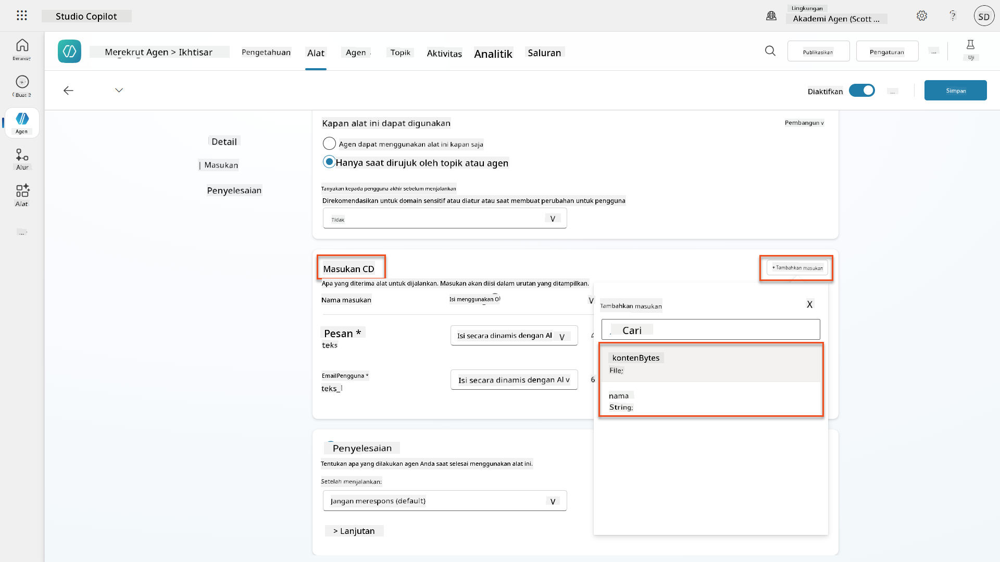

1. Selanjutnya atur properti input sebagai berikut:

    | Parameter Input | Properti | Detail |
    |-----------------|----------|--------|
    | **contentBytes** | Isi menggunakan | Nilai kustom |
    |                  | Nilai (...→Formula→Insert) | `First(System.Activity.Attachments).Content` |
    | **name** | Isi menggunakan | Nilai kustom |
    |          | Nilai (...→Formula→Insert) | `First(System.Activity.Attachments).Name` |
    | **Message** | Kustomisasi | Konfigurasikan pengaturan kustom |
    |             | Deskripsi | `Ekstrak pesan gaya cover letter dari konteks. Pastikan untuk tidak meminta pengguna dan buat setidaknya cover letter minimal dari konteks yang tersedia. ATURAN KETAT - pesan harus kurang dari 2000 karakter.` |
    |             | Berapa kali reprompt | Jangan ulangi |
    |             | Tindakan jika tidak ditemukan entitas | Atur variabel ke nilai |
    |             | Nilai entitas default | Resume upload |
    | **UserEmail** | Isi menggunakan | Nilai kustom |
    |  | Nilai (...→Formula→Insert) | `System.User.Email` |

    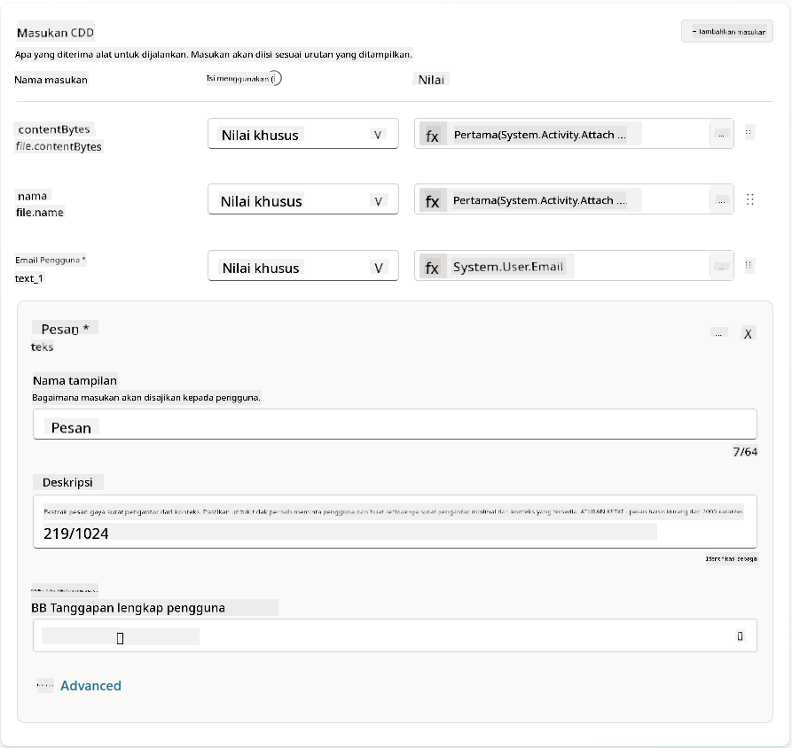

1. Pilih **Save**

### 2.1.6 Tentukan instruksi agent

1. Kembali ke **Application Intake Agent** dengan memilih tab **Agents**, lalu temukan panel **Instructions**.

1. Di bidang **Instructions**, tempelkan panduan jelas berikut untuk child agent Anda:

    ```text
    You are tasked with managing incoming Resumes, Candidate information, and creating Job Applications.  
    Only use tools if the step exactly matches the defined process. Otherwise, indicate you cannot help.  
    
    Process for Resume Upload via Chat  
    1. Upload Resume  
      - Trigger only if /System.Activity.Attachments contains exactly one new resume.  
      - If more than one file, instruct the user to upload one at a time and stop.  
      - Call /Upload Resume once. Never upload more than once for the same message.  
    
    2. Post-Upload  
      - Always output the [ResumeNumber] (R#####).  
    ```

1. Di mana instruksi mencakup garis miring (/), pilih teks setelah / dan pilih nama yang sesuai. Lakukan ini untuk:

    - `System.Activity.Attachments` (Variable)
    - `Upload Resume` (Tool)

    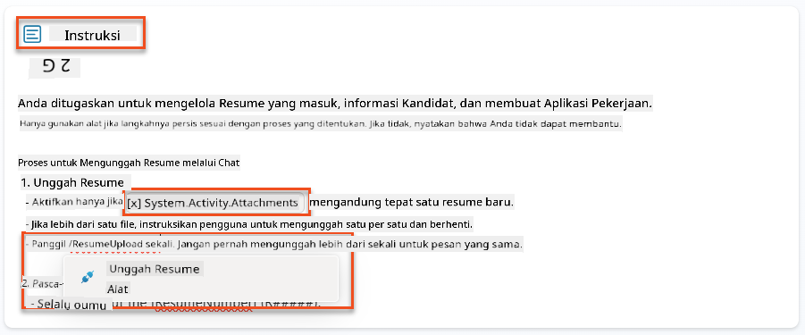

1. Pilih **Save**

### 2.1.7 Uji Application Intake Agent Anda

Sekarang mari kita verifikasi bahwa anggota orkestra pertama Anda bekerja dengan benar.

1. **Unduh** [test Resumes.](https://download-directory.github.io/?url=https://github.com/microsoft/agent-academy/tree/main/operative/sample-data/resumes&filename=operative_sampledata)

1. **Aktifkan** panel uji dengan memilih **Test**.

1. **Unggah** dua Resume di chat uji, dan berikan pesan `Process these resumes`

    - Agen harus mengembalikan pesan yang mirip dengan *Hanya satu resume yang dapat diunggah sekaligus. Silakan unggah satu resume untuk melanjutkan.*

    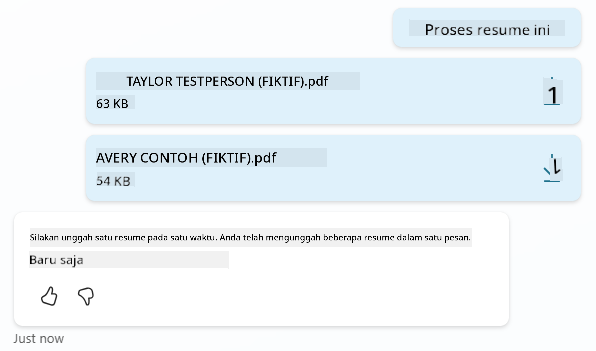

1. Coba unggah **hanya satu Resume**, dengan pesan `Process this resume`

    - Agen kemudian harus memberikan pesan yang mirip dengan *Resume untuk Avery Example telah berhasil diunggah. Nomor resume adalah R10026.*

1. Di **Activity map**, Anda harus melihat **Application Intake Agent** menangani upload resume.  
    

1. Navigasikan ke make.powerapps.com → Pastikan lingkungan Anda dipilih di kanan atas Environment Picker.

1. Pilih **Apps** → Hiring Hub → menu ellipsis(...) → **Play**  
    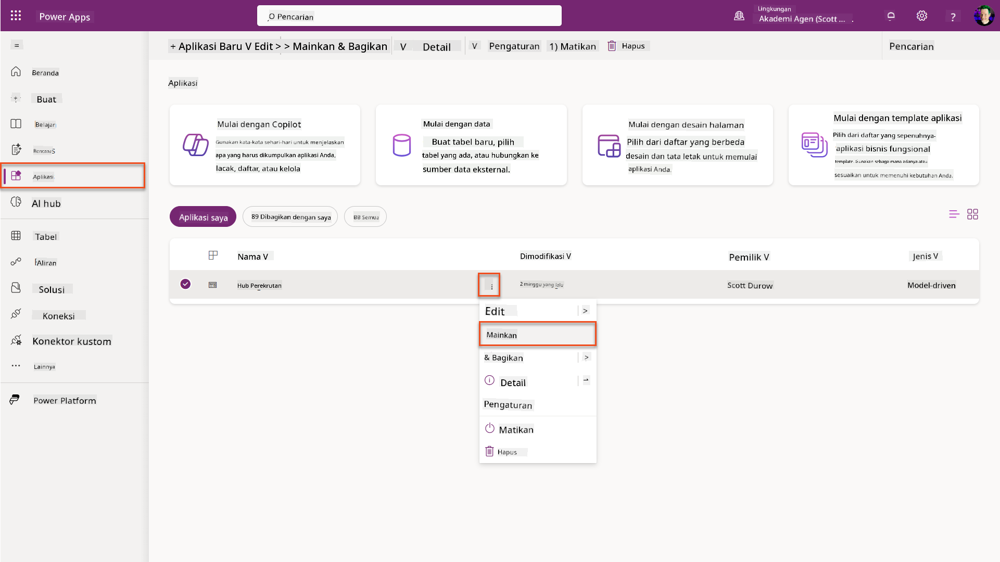

    Catatan: Jika tombol play berwarna abu-abu, itu berarti Anda belum mempublikasikan solusi Anda dari Misi 01. Pilih **Solutions** → **Publish all customizations**.

1. Navigasikan ke **Resumes**, dan periksa bahwa file resume diunggah dan cover letter diatur sesuai.  
    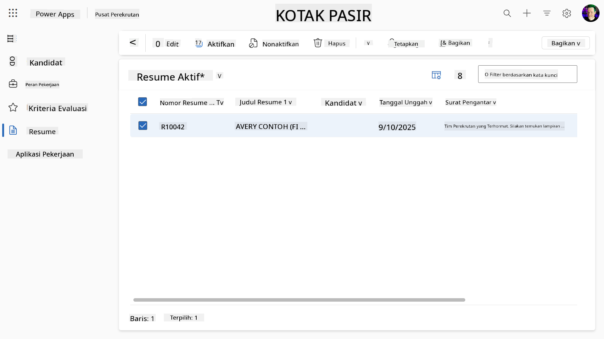

## 🧪Lab 2.2: Menambahkan agen terhubung Interview Prep

Sekarang mari kita buat agen terhubung untuk persiapan wawancara dan tambahkan ke Hiring Agent Anda yang sudah ada.

### 2.2.1 Buat agen Interview yang terhubung

1. **Navigasikan** ke Copilot Studio. Pastikan lingkungan Anda masih dipilih di kanan atas Environment Picker.

1. Buka **Hiring Agent** Anda

1. Navigasikan ke tab Agent, dan pilih **+ Add an agent**

1. Pilih **Connect an existing agent** → **Copilot Studio**

1. Pilih **+ New agent**

### 2.2.2 Konfigurasikan pengaturan dasar

1. Pilih tab **Configure**, dan masukkan properti berikut:

    - **Name**: `Interview Agent`
    - **Description**: `Membantu proses wawancara.`

1. Instruksi:

    ```text
    You are the Interview Agent. You help interviewers and hiring managers prepare for interviews. You never contact candidates. 
    Use Knowledge to help with interview preparation. 
    
    The only valid identifiers are:
      - ResumeNumber (ppa_resumenumber)→ format R#####
      - CandidateNumber (ppa_candidatenumber)→ format C#####
      - ApplicationNumber (ppa_applicationnumber)→ format A#####
      - JobRoleNumber (ppa_jobrolenumber)→ format J#####
    
    Examples you handle
      - Give me a summary of ...
      - Help me prepare to interview candidates for the Power Platform Developer role
      - Create interview assistance for the candidates for Power Platform Developer
      - Give targeted questions for Candidate Alex Johnson focusing on the criteria for the Job Application
      
    How to work:
        You are expected to ask clarification questions if required information for queries is not provided
        - If asked for interview help without providing a job role, ask for it
        - If asking for interview questions, ask for the candidate and job role if not provided.
    
    General behavior
    - Do not invent or guess facts
    - Be concise, professional, and evidence-based
    - Map strengths and risks to the highest-weight criteria
    - If data is missing (e.g., no resume), state what is missing and ask for clarification
    - Never address or message a candidate
    ```

1. Aktifkan **Web Search** ke **Disabled**

1. Pilih **Create**  
    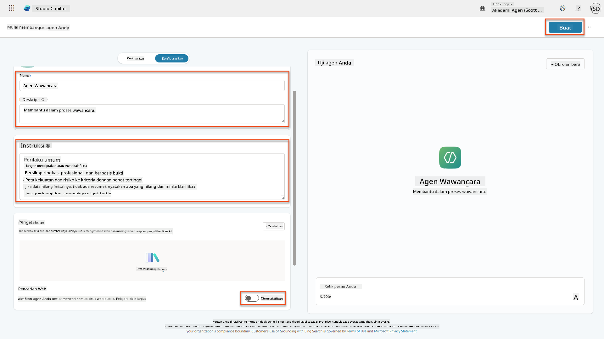

### 2.2.3 Konfigurasikan akses data dan publikasikan

1. Di bagian **Knowledge**, pilih **+ Add knowledge**  
    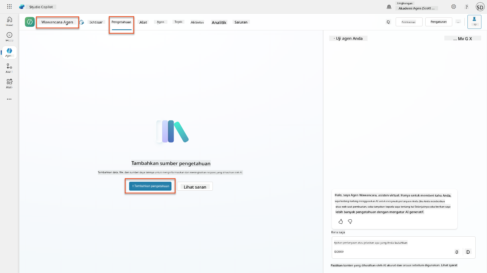
1. Pilih **Dataverse**  
    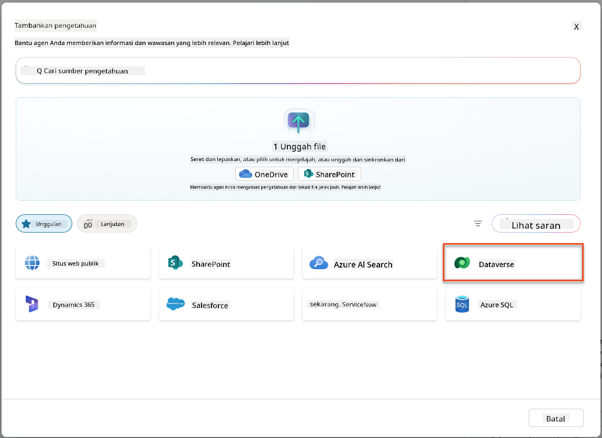
1. Di kotak **Search**, ketik `ppa_`. Ini adalah prefix untuk tabel yang Anda impor sebelumnya.
1. **Pilih** semua 5 tabel (Candidate, Evaluation Criteria, Job Application, Job Role, Resume)
1. Pilih **Add to agent**  
    
1. Pilih **Settings**, pada Interview Agent, dan atur pengaturan berikut:

    - **Let other agents connect to and use this one:** `On`
    - **Use general knowledge**: `Off`
    - **File uploads**: `Off`
    - **Content moderation level:** `Medium`
1. Pilih **Save**
1. Pilih **Publish**, dan tunggu hingga proses publikasi selesai.

### 2.2.4 Hubungkan Interview Prep Agent ke Hiring Agent Anda

1. Navigasikan kembali ke **Hiring Agent** Anda

1. Pilih tab **Agents**

1. Gunakan **+Add an agent** → **Copilot Studio**, untuk menambahkan **Interview Agent**. Atur Deskripsi menjadi:
    ```text
    Assists with the interview process and provides information about Resumes, Candidates, Job Roles, and Evaluation Criteria.
    ```

    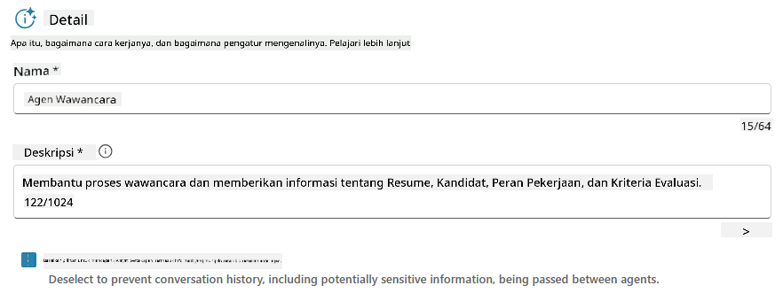
    Perhatikan bahwa opsi Pass conversation history to this agent dicentang. Ini memungkinkan agen induk memberikan konteks penuh kepada agen yang terhubung.

1. Pilih **Add agent**

1. Pastikan Anda melihat baik **Application Intake Agent** maupun **Interview Agent**. Perhatikan bagaimana satu adalah agen anak dan yang lainnya adalah agen yang terhubung.  
    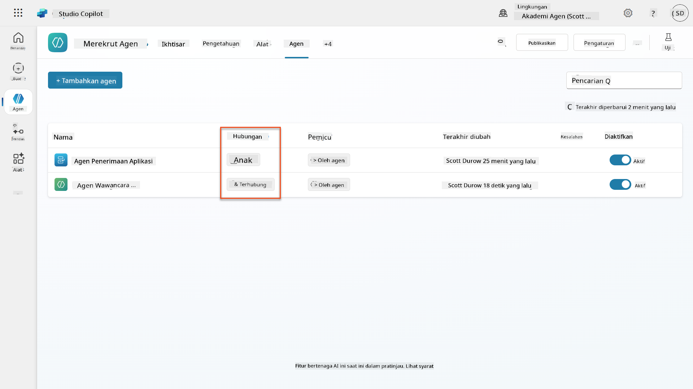

### 2.2.5 Uji kolaborasi multi-agen

1. **Buka** panel uji dengan memilih **Test**.

1. **Unggah** salah satu resume uji, dan masukkan deskripsi berikut yang memberi tahu agen induk apa yang dapat didelegasikan ke agen yang terhubung:

    ```text
    Upload this resume, then show me open job roles, each with a description of the evaluation criteria, then use this to match the resume to at least one suitable job role even if not a perfect match.
    ```

    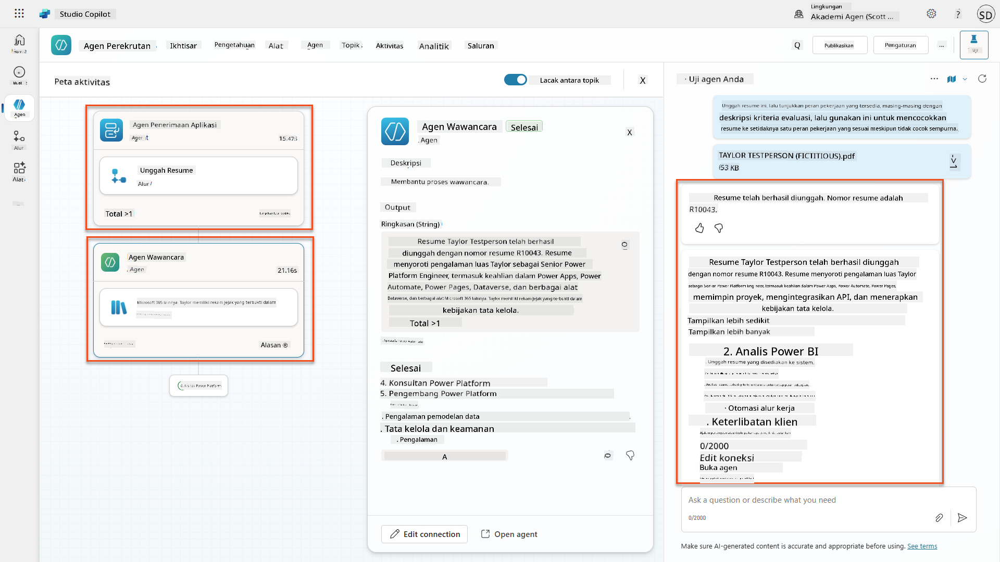

1. Perhatikan bagaimana Hiring Agent mendelegasikan pengunggahan ke agen anak, lalu meminta Interview Agent untuk memberikan ringkasan dan kecocokan peran pekerjaan menggunakan pengetahuannya.  
   Cobalah berbagai cara untuk mengajukan pertanyaan tentang Resume, Peran Pekerjaan, dan Kriteria Evaluasi.  
   **Contoh:**

    ```text
    Give me a summary of active resumes
    ```

    ```text
    Summarize resume R10044
    ```

    ```text
    Which active resumes are suitable for the Power Platform Developer role?
    ```

## 🎉 Misi Selesai

Kerja luar biasa, Agen! **Operation Symphony** kini selesai. Anda telah berhasil mengubah Hiring Agent tunggal Anda menjadi orkestra multi-agen yang canggih dengan kemampuan khusus.

Berikut adalah pencapaian Anda dalam misi ini:

**✅ Penguasaan arsitektur multi-agen**  
Anda sekarang memahami kapan harus menggunakan agen anak vs agen yang terhubung dan bagaimana merancang sistem yang dapat berkembang.

**✅ Agen anak Application Intake**  
Anda telah menambahkan agen anak khusus ke Hiring Agent Anda yang memproses resume, mengekstrak data kandidat, dan menyimpan informasi di Dataverse.

**✅ Agen terhubung Interview Prep**  
Anda telah membangun agen terhubung yang dapat digunakan kembali untuk persiapan wawancara dan berhasil menghubungkannya ke Hiring Agent Anda.

**✅ Komunikasi antar agen**  
Anda telah melihat bagaimana agen utama Anda dapat berkoordinasi dengan agen spesialis, berbagi konteks, dan mengatur alur kerja yang kompleks.

**✅ Fondasi untuk otonomi**  
Sistem perekrutan yang ditingkatkan Anda sekarang siap untuk fitur-fitur canggih yang akan kita tambahkan dalam misi mendatang: pemicu otonom, moderasi konten, dan penalaran mendalam.

🚀**Selanjutnya:** Dalam misi berikutnya, Anda akan belajar bagaimana mengonfigurasi agen Anda untuk memproses resume secara otomatis dari email!

⏩[Lanjut ke Misi 03: Otomatiskan agen Anda dengan pemicu](../03-automate-triggers/README.md)

## 📚 Sumber Daya Taktis

📖 [Tambahkan agen lain (pratinjau)](https://learn.microsoft.com/microsoft-copilot-studio/authoring-add-other-agents?WT.mc_id=power-182762-scottdurow)

📖 [Tambahkan alat ke agen khusus](https://learn.microsoft.com/microsoft-copilot-studio/advanced-plugin-actions?WT.mc_id=power-182762-scottdurow)

📖 [Bekerja dengan Dataverse di Copilot Studio](https://learn.microsoft.com/microsoft-copilot-studio/knowledge-add-dataverse?WT.mc_id=power-182762-scottdurow)

📖 [Ikhtisar alur agen](https://learn.microsoft.com/microsoft-copilot-studio/flows-overview?WT.mc_id=power-182762-scottdurow)

📖 [Buat solusi](https://learn.microsoft.com/power-platform/alm/solution-concepts-alm?WT.mc_id=power-182762-scottdurow)

📖 [Panduan ALM solusi Power Platform](https://learn.microsoft.com/power-platform/alm/overview-alm?WT.mc_id=power-182762-scottdurow)

📺 [Kolaborasi antar agen di Copilot Studio](https://youtu.be/d-oD3pApHAg?si=rwIHKhJTkjSvhTHw)

---

**Penafian**:  
Dokumen ini telah diterjemahkan menggunakan layanan penerjemahan AI [Co-op Translator](https://github.com/Azure/co-op-translator). Meskipun kami berupaya untuk memberikan hasil yang akurat, harap diketahui bahwa terjemahan otomatis mungkin mengandung kesalahan atau ketidakakuratan. Dokumen asli dalam bahasa aslinya harus dianggap sebagai sumber yang otoritatif. Untuk informasi yang bersifat kritis, disarankan menggunakan jasa penerjemahan manusia profesional. Kami tidak bertanggung jawab atas kesalahpahaman atau penafsiran yang timbul dari penggunaan terjemahan ini.