<!--
CO_OP_TRANSLATOR_METADATA:
{
  "original_hash": "4fb913dfc3bbc71506dd3602c4b8e6ed",
  "translation_date": "2025-10-18T03:12:21+00:00",
  "source_file": "docs/operative-preview/02-multi-agent/README.md",
  "language_code": "ja"
}
-->
# 🚨 ミッション02: 連携エージェント

--8<-- "disclaimer.md"

## 🕵️‍♂️ コードネーム: `OPERATION SYMPHONY`

> **⏱️ 作戦時間枠:** `~45分`

## 🎯 ミッション概要

お帰りなさい、エージェント。ミッション01では、採用ワークフローを管理するための基盤となるメインの採用エージェントを構築しました。しかし、1つのエージェントだけでは限界があります。

今回の任務は、**Operation Symphony**です。単一のエージェントを**マルチエージェントシステム**に変革し、複雑な採用課題に対応するために連携する専門エージェントのチームを編成することです。これは、単独のオペレーターから専門的なタスクフォースを指揮する形へのアップグレードと考えてください。

交響楽団のように、各音楽家が完璧な調和で役割を果たすように、既存の採用エージェントに2つの重要な専門エージェントを追加します。1つは履歴書を自動的に処理する**応募受付エージェント**、もう1つは包括的な面接資料を作成する**面接準備エージェント**です。これらのエージェントは、メインのオーケストレーターの下でシームレスに連携します。

## 🔎 目標

このミッションでは以下を学びます:

1. **子エージェント**と**連携エージェント**を使い分けるタイミング
1. **スケーラブルなマルチエージェントアーキテクチャ**の設計方法  
1. 特定のタスクに特化した**子エージェントの作成**
1. エージェント間の**通信パターンの確立**
1. 応募受付エージェントと面接準備エージェントの構築

## 🧠 連携エージェントとは？

Copilot Studioでは、単一のモノリシックなエージェントを構築するだけでなく、**マルチエージェントシステム**を作成することができます。これは、複雑なワークフローを処理するために連携する専門エージェントのネットワークです。

現実の組織のように、1人がすべてを行うのではなく、特定のタスクに優れた専門家が必要なときに協力する仕組みを考えてみてください。

### マルチエージェントシステムが重要な理由

- **スケーラビリティ:** 各エージェントは異なるチームによって独立して開発、テスト、維持が可能です。  
- **専門性:** エージェントは得意分野に集中できます。例えば、データ処理、ユーザーとのやり取り、意思決定など。  
- **柔軟性:** エージェントを組み合わせたり、プロジェクト間で再利用したり、システムを段階的に進化させることができます。  
- **保守性:** 1つのエージェントに変更を加えても、他のエージェントに影響を与えることはなく、更新が安全で簡単になります。

### 実際の例: 採用プロセス

採用ワークフローを考えてみましょう。複数のエージェントが以下の責任を持って連携するかもしれません:

- **履歴書の受付**は、文書解析とデータ抽出スキルを必要とします
- **スコアリング**は、候補者の履歴書を評価し、職務要件に一致させることを含みます
- **面接準備**は、候補者の適性について深く考察する必要があります  
- **候補者とのコミュニケーション**は、共感的なコミュニケーション能力を必要とします

これらの異なるスキルをすべて処理しようとする巨大なエージェントを構築する代わりに、各分野に特化したエージェントを作成し、それらを連携させることができます。

## 🔗 子エージェント vs 連携エージェント: 主な違い

Copilot Studioでは、マルチエージェントシステムを構築するための2つの方法を提供しており、それぞれ異なるユースケースに適しています。

### ↘️ 子エージェント

子エージェントは、メインエージェント内に存在する**軽量な専門家**です。同じ部門内の専門チームのようなものと考えてください。

#### 主な技術的詳細

- 子エージェントは親エージェント内に存在し、単一の設定ページを持ちます。
- ツールと知識は**親エージェントに保存**され、子エージェントに「利用可能」として設定されます。
- 子エージェントは親エージェントの**トピックを共有**します。トピックは子エージェントの指示で参照できます。
- 子エージェントは**別途公開する必要がありません** - 作成されると自動的に親エージェント内で利用可能になります。これにより、親エージェントと子エージェントの変更を**同じ共有ワークスペース**で行えるため、テストが簡単になります。

#### 子エージェントを使用する場合

- 単一のチームがソリューション全体を管理する場合
- ツールや知識を論理的にサブエージェントに整理したい場合
- 各エージェントに個別の認証やデプロイメントが必要ない場合
- エージェントを別々に公開したり、独立して使用する必要がない場合
- 複数のソリューションでエージェントを再利用する必要がない場合

**例:** ITヘルプデスクエージェントが以下の子エージェントを持つ場合:

- パスワードリセット手順
- ハードウェアのトラブルシューティング  
- ソフトウェアインストールガイド

### 🔀 連携エージェント

連携エージェントは、メインエージェントが協力できる**完全独立型のエージェント**です。プロジェクトに取り組む別々の部門のようなものと考えてください。

#### 主な技術的詳細

- 連携エージェントは**独自のトピック**と会話フローを持っています。それぞれ独立して動作し、独自の設定、ロジック、デプロイメントライフサイクルを持ちます。
- 連携エージェントは**公開される必要があります**。公開されて初めて他のエージェントに追加され、使用可能になります。
- テスト中に、連携エージェントの変更は公開されてから呼び出し元エージェントで使用可能になります。

#### 連携エージェントを使用する場合

- 複数のチームが異なるエージェントを独立して開発・維持する場合
- エージェントが独自の設定、認証、デプロイメントチャネルを必要とする場合
- 各エージェントを個別に公開・維持し、独立したアプリケーションライフサイクル管理（ALM）が必要な場合
- エージェントを複数のソリューションで再利用したい場合

**例:** 顧客サービスシステムが以下と連携する場合:

- 財務チームが管理する別の請求エージェント
- 製品チームが管理する別の技術サポートエージェント
- 運営チームが管理する別の返品エージェント

!!! tip "ヒント"
    両方のアプローチを組み合わせることもできます！例えば、メインエージェントが他のチームの外部エージェントと連携しながら、内部タスクに特化した独自の子エージェントを持つことができます。

## 🎯 マルチエージェントアーキテクチャパターン

マルチエージェントシステムを設計する際、エージェントの相互作用に基づいていくつかのパターンが浮かび上がります:

| パターン              | 説明                                                                 | 最適な用途                                                      |
|----------------------|---------------------------------------------------------------------|---------------------------------------------------------------|
| **ハブ＆スポーク**    | メインのオーケストレーターエージェントが複数の専門エージェントを調整します。オーケストレーターはユーザーとのやり取りを担当し、タスクを子エージェントや連携エージェントに委任します。 | メインエージェントが専門的なタスクを調整する複雑なワークフロー |
| **パイプライン**     | エージェントが作業を順次次の段階に渡し、各段階で価値を追加します。 | 履歴書受付→スクリーニング→面接→決定のような線形プロセス |
| **協調型**           | エージェントが同時に問題の異なる側面に取り組み、コンテキストや結果を共有します。 | 複数の視点や専門分野を必要とする複雑な分析 |

!!! tip "ヒント"
    これらのパターンの2つ以上を組み合わせたハイブリッドも可能です。

## 💬エージェント間の通信とコンテキスト共有

エージェントが連携する際には、情報を効果的に共有する必要があります。Copilot Studioでは以下の方法でこれを実現します:

### 会話履歴

デフォルトでは、メインエージェントが子エージェントや連携エージェントを呼び出す際に、**会話履歴**を渡すことができます。これにより、専門エージェントはユーザーが話している内容の完全なコンテキストを得ることができます。

セキュリティやパフォーマンス上の理由でこれを無効にすることも可能です。例えば、専門エージェントが特定のタスクを完了するだけで、完全な会話コンテキストを必要としない場合です。これは**データ漏洩**の防止に役立つ場合があります。

### 明示的な指示

メインエージェントは、子エージェントや連携エージェントに**具体的な指示**を与えることができます。例えば、「この履歴書を処理して、シニアデベロッパー職のスキルを要約してください」といった指示です。

### 戻り値

エージェントは、呼び出し元エージェントに構造化された情報を返すことができ、メインエージェントがその情報を次のステップで使用したり、他のエージェントと共有したりすることができます。

### Dataverse統合

より複雑なシナリオでは、エージェントが**Dataverse**やその他のデータストアを通じて情報を共有し、複数のやり取りを通じてコンテキストを永続的に共有することができます。

## ↘️子エージェント: 応募受付エージェント

マルチエージェント採用システムの構築を始めましょう。最初の専門エージェントは**応募受付エージェント**です。この子エージェントは、届いた履歴書や候補者情報を処理する役割を担います。

```mermaid
---
config:
  layout: elk
  look: neo
---
flowchart TB
 subgraph People["People"]
    direction TB
        HiringManager["Hiring Manager"]
        Interviewers["Interviewers"]
  end
 subgraph Agents["Agents"]
    direction LR
        ApplicationIntakeAgent["Application Intake Agent<br>(Child)"]
        InterviewAgent["Interview Agent<br>(Connected)"]
        HRAgent["HR Agent"]
  end
    HiringManager -- Upload CV --> HRAgent
    HRAgent -- Upload Resume, Create Candidate, Match to Job Roles --> ApplicationIntakeAgent
    ApplicationIntakeAgent -- Create Resume, Upsert Candidate, Create Job Application --> Dataverse["Dataverse"]
    ApplicationIntakeAgent -- Store Resume file in file column --> Dataverse
    HiringManager -- Ask for summaries --> HRAgent
    Interviewers -- Request interview pack --> HRAgent
    HRAgent -- Generate interview pack and summarize data --> InterviewAgent
    InterviewAgent -- Read all Candidate, Resume, Job Roles, Evaluation Criteria Data --> Dataverse
     HiringManager:::person
     Interviewers:::person
     ApplicationIntakeAgent:::agent
     InterviewAgent:::agent
     HRAgent:::agent
     Dataverse:::data
    classDef person fill:#e6f0ff,stroke:#3b82f6,color:#0b3660
    classDef agent fill:#e8f9ef,stroke:#10b981,color:#064e3b
    classDef data  fill:#f3f4f6,stroke:#6b7280,color:#111827
```

### 🤝応募受付エージェントの責任

- **PDFから履歴書の内容を解析**（将来的なミッションでは履歴書を自動的に処理する方法を学びます）。
- **構造化データを抽出**（名前、スキル、経験、学歴）
- **資格やカバーレターに基づいて候補者を空きポジションにマッチング**
- **候補者情報をDataverseに保存**して後で処理できるようにする
- **応募の重複を排除**し、履歴書から抽出したメールアドレスを使用して既存の記録にマッチング

### ⭐これが子エージェントであるべき理由

応募受付エージェントは以下の理由から子エージェントとして最適です:

- 文書処理とデータ抽出に特化している
- 別途公開する必要がない  
- 同じチームによって管理される採用ソリューションの一部である
- 特定のトリガー（新しい履歴書の受信）に焦点を当てており、採用エージェントから呼び出される

## 🔀連携エージェント: 面接準備エージェント  

2つ目の専門エージェントは**面接準備エージェント**です。この連携エージェントは、包括的な面接資料を作成し、候補者の回答を評価する役割を担います。

### 🤝面接準備エージェントの責任

- **会社情報、職務要件、評価基準を含む面接パックを作成**
- **特定の役割や候補者の背景に合わせた面接質問を生成**
- **職務や応募に関する一般的な質問に回答**し、関係者とのコミュニケーションを支援

### ⭐これが連携エージェントであるべき理由

面接準備エージェントは以下の理由から連携エージェントとして最適です:

- 人材採用チームが複数の採用プロセスで独立して使用したい場合
- 面接のベストプラクティスや評価基準の独自の知識ベースが必要
- 異なる採用担当者が自分のチームに合わせてその動作をカスタマイズしたい場合
- 外部採用だけでなく、内部ポジションにも再利用できる可能性がある

## 🧪ラボ2.1: 応募受付エージェントの追加

理論を実践に移す準備はできましたか？既存の採用エージェントに最初の子エージェントを追加しましょう。

### このミッションを完了するための前提条件

**以下のいずれか**が必要です:

- **ミッション01を完了している**こと、または採用エージェントが準備されていること、**または**
- **ミッション02スターターソリューションをインポート**すること。初めて取り組む場合や追いつく必要がある場合はこちらを使用してください。[ミッション02スターターソリューションをダウンロード](https://aka.ms/agent-academy)

!!! note "ソリューションのインポートとサンプルデータ"
    スターターソリューションを使用する場合は、[ミッション01](../01-get-started/README.md)で環境にソリューションとサンプルデータをインポートする方法について詳しく説明しています。

### 2.1.1 ソリューションのセットアップ

1. Copilot Studio内で、左側のナビゲーションのツールの下にある省略記号（...）を選択します。
1. **ソリューション**を選択します。  
    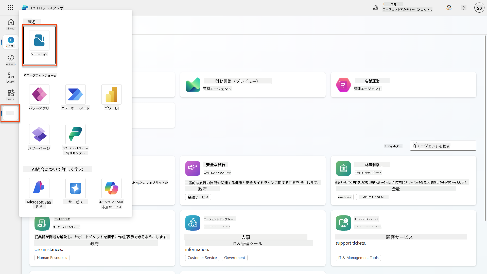
1. Operativeソリューションを見つけ、省略記号（...）を選択して**優先ソリューションに設定**を選択します。これにより、すべての作業がこのソリューションに追加されます。  
    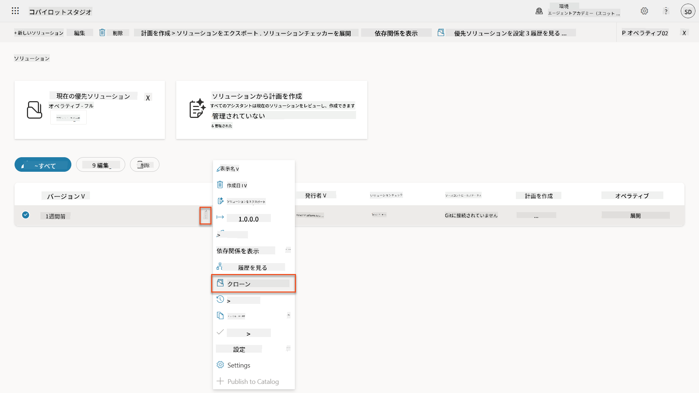

### 2.1.2 採用エージェントの指示を設定する

1. Copilot Studioに**移動**します。右上の**環境ピッカー**で環境が選択されていることを確認してください。

1. ミッション01で作成した**採用エージェント**を開きます。

1. **概要**タブの**指示**セクションで**編集**を選択し、以下の指示を上部に追加します:

    ```text
    You are the central orchestrator for the hiring process. You coordinate activities, provide summaries, and delegate work to specialized agents.
    ```

1. **保存**を選択します。  
    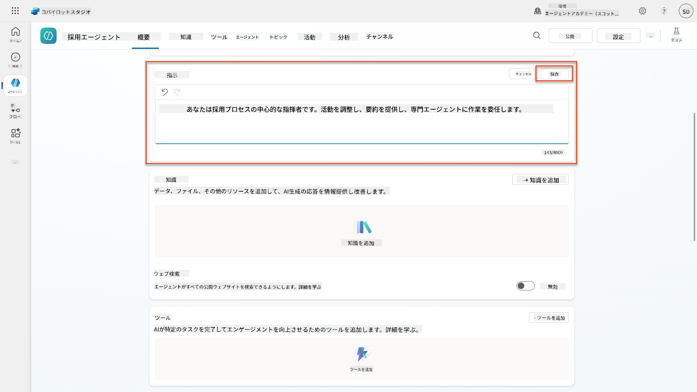

1. **設定**を選択します（右上）

1. 以下の設定を確認してください:

    | 設定 | 値 |
    |---------|-------|
    | エージェントの応答に生成AIオーケストレーションを使用する | **はい
**Agent Flowツール**を使用している理由は、*履歴書アップロード*ステップが複数ステップのバックエンドプロセスであり、決定論的な実行と外部システムとの統合が必要だからです。トピックは会話のガイドに最適ですが、Agent Flowはファイル処理、データ検証、データベースのアップサート（新規挿入または既存の更新）を確実に処理するための構造化された自動化を提供します。

1. **Application Intake Agent**ページ内の**Tools**セクションを見つけます。
   **重要:** これは親エージェントのToolsタブではなく、子エージェントの指示の下にスクロールすると見つかります。

1. **+ Add**を選択します。
   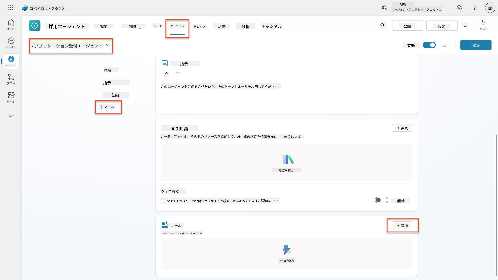

1. **+ New tool**を選択します。  
   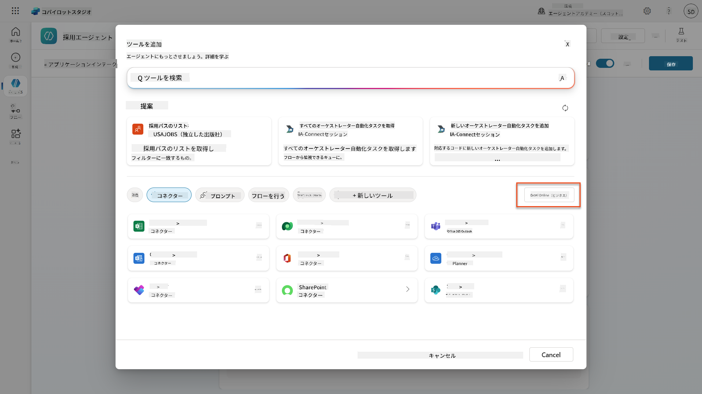

1. **Agent flow**を選択します。
   Agent Flowデザイナーが開きます。ここで履歴書アップロードのロジックを追加します。  
   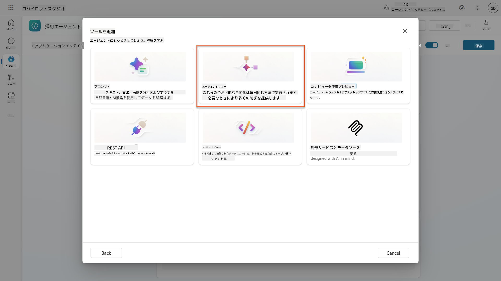

1. **When an agent calls the flow**ノードを選択し、以下のパラメータの入力を**+ Add**で追加します。名前と説明の両方を追加することを忘れないでください。

    | Type  | Name     | Description                                                                                                   |
    |-------|----------|---------------------------------------------------------------------------------------------------------------|
    | File  | Resume   | 履歴書のPDFファイル                                                                                           |
    | Text  | Message  | コンテキストからカバーレター形式のメッセージを抽出します。メッセージは2000文字未満である必要があります。         |
    | Text  | UserEmail| 履歴書が送信元のメールアドレス。このメールアドレスはチャットで履歴書をアップロードするユーザー、またはメールで受信した場合の送信元メールアドレスです。 |

    

1. トリガーノードの下にある**+アイコン**を選択し、`Dataverse`を検索し、Microsoft Dataverseの**See more**を選択して、**Microsoft Dataverse**セクションの**Add a new row**アクションを選択します。  
    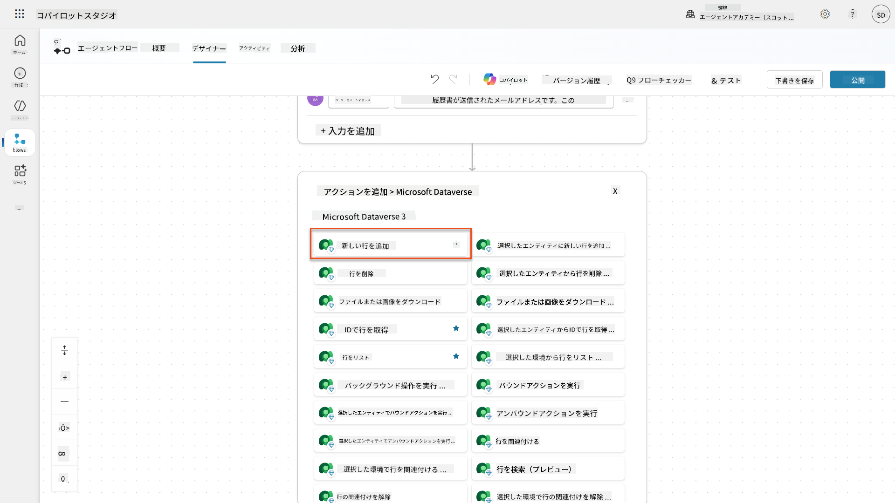

1. ノードの名前を**Create Resume**に変更します。**ellipsis(...)**を選択し、**Rename**を選択します。  
    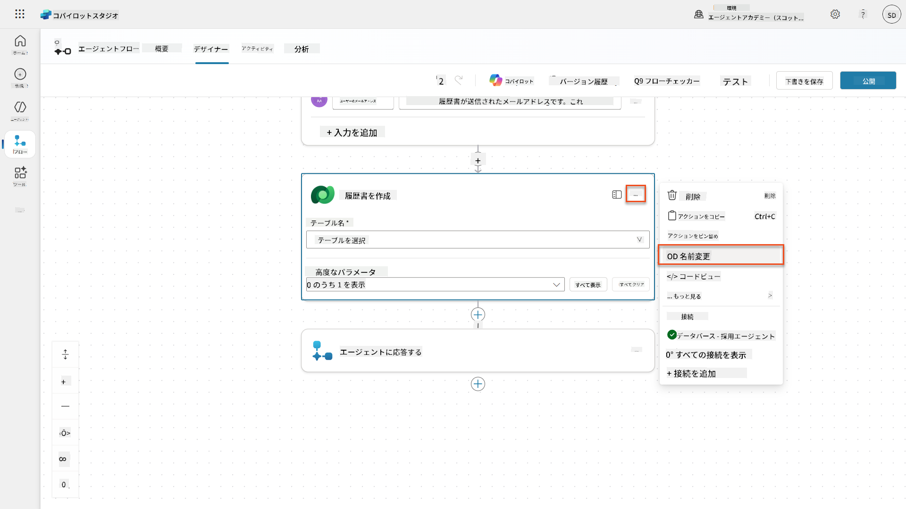

1. **Table name**を**Resumes**に設定し、**Show all**を選択してすべてのパラメータを表示します。

1. 以下の**プロパティ**を設定します：

    | Property                 | How to Set                      | Details / Expression                                         |
    | ------------------------ | ------------------------------- | ------------------------------------------------------------ |
    | **Resume Title**         | Dynamic data (thunderbolt icon) | **When an agent calls the flow** → **Resume name**    履歴書名が表示されない場合は、上記で履歴書パラメータをデータ型として設定していることを確認してください。 |
    | **Cover letter**         | Expression (fx icon)            | `if(greater(length(triggerBody()?['text']), 2000), substring(triggerBody()?['text'], 0, 2000), triggerBody()?['text'])` |
    | **Source Email Address** | Dynamic data (thunderbolt icon) | **When an agent calls the flow** → **UserEmail**             |
    | **Upload Date**          | Expression (fx icon)            | `utcNow()`                                                   |

    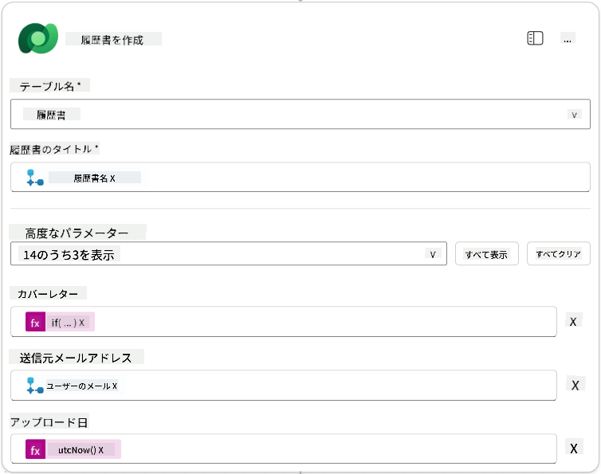

1. **Create Resume**ノードの下にある**+アイコン**を選択し、`Dataverse`を検索し、Microsoft Dataverseの**See more**を選択して、**Upload a file or an image**アクションを選択します。
   **重要:** 選択するのは、選択された環境にファイルや画像をアップロードするアクションではありません。

1. ノードの名前を**Upload Resume File**に変更します。**ellipsis(...)**を選択し、**Rename**を選択します。

1. 以下の**プロパティ**を設定します：

     | Property | How to Set | Details |
     |----------|------------|---------|
     | **Content name** | Dynamic data (thunderbolt icon) | When an agent calls the flow → Resume name |
     | **Table name** | Select | Resumes |
     | **Row ID** | Dynamic data (thunderbolt icon) | Create Resume → See more → Resume |
     | **Column Name** | Select | Resume PDF |
     | **Content** | Dynamic data (thunderbolt icon) | When an agent calls the flow → Resume contentBytes |

     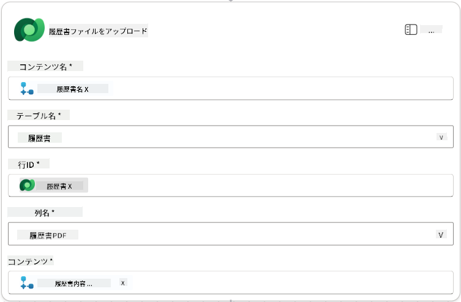

1. **Respond to the agent node**を選択し、**+ Add an output**を選択します。

     | Property | How to Set | Details |
     |----------|------------|---------|
     | **Type** | Select | `Text` |
     | **Name** | Enter | `ResumeNumber` |
     | **Value** | Dynamic data (thunderbolt icon) | Create Resume → See More → Resume Number |
     | **Description** | Enter | `作成された履歴書の[ResumeNumber]` |

     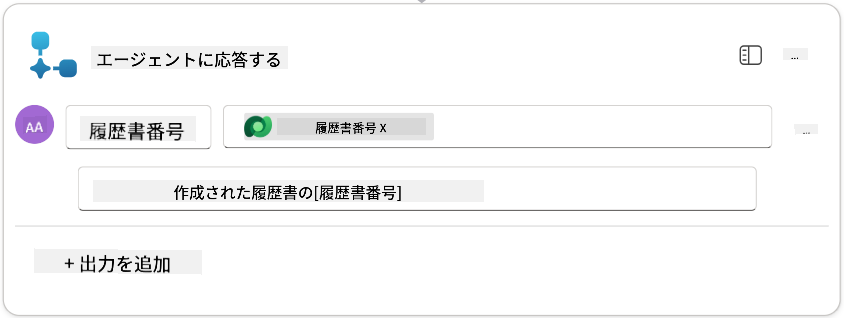

1. 右上の**Save draft**を選択します。  
     

1. **Overview**タブを選択し、**Details**パネルの**Edit**を選択します。

     1. **Flow name**:`Resume Upload`
     1. **Description**:`指示された場合に履歴書をアップロードします`

     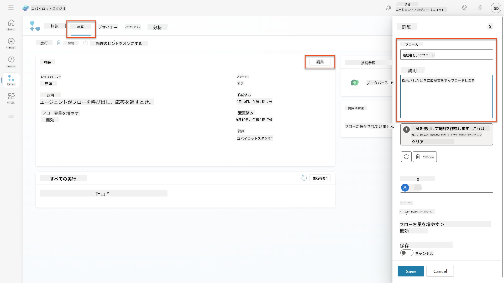

1. 再び**Designer**タブを選択し、**Publish**を選択します。  
     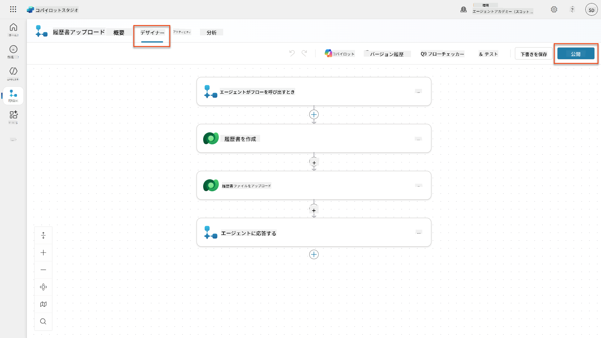

### 2.1.5 フローをエージェントに接続する

次に、公開したフローをApplication Intake Agentに接続します。

1. **Hiring Agent**に戻り、**Agents**タブを選択します。**Application Intake Agent**を開き、**Tools**パネルを見つけます。  
    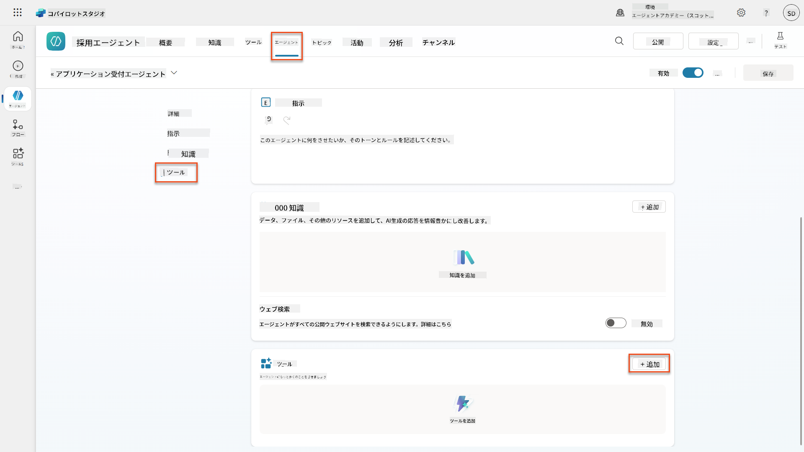

1. **+ Add**を選択します。

1. **Flow**フィルターを選択し、`Resume Upload`を検索します。**Resume Upload**フローを選択し、**Add and configure**を選択します。

1. 以下のパラメータを設定します：

    | Parameter | Value |
    |-----------|-------|
    | **Description** | `指示された場合に履歴書をアップロードします。厳格なルール：添付ファイルがある場合にのみ、このツールを「Resume Upload」として参照して呼び出してください。` |
    | **Additional details → When this tool may be used** | `トピックまたはエージェントによって参照された場合のみ` |
    | **Inputs → Add Input** | `contentBytes` |
    | **Inputs → Add Input** | `name` |

    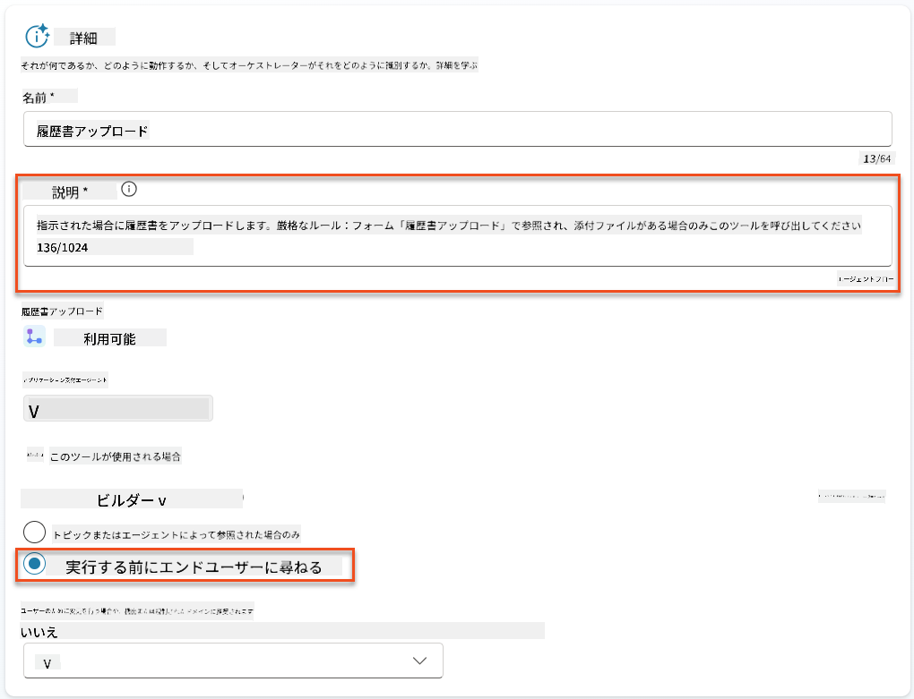

    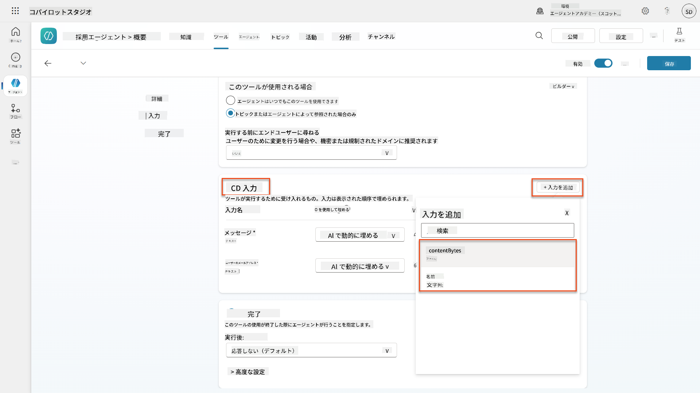

1. 次に、入力のプロパティを以下のように設定します：

    | Input Parameter | Property | Details |
    |-----------------|----------|---------|
    | **contentBytes** | Fill using | Custom value |
    |                  | Value (...→Formula→Insert) | `First(System.Activity.Attachments).Content` |
    | **name** | Fill using | Custom value |
    |          | Value (...→Formula→Insert) | `First(System.Activity.Attachments).Name` |
    | **Message** | Customize | Configure custom settings |
    |             | Description | `コンテキストからカバーレター形式のメッセージを抽出します。ユーザーにプロンプトを表示せず、利用可能なコンテキストから少なくとも最小限のカバーレターを作成してください。厳格なルール - メッセージは2000文字未満である必要があります。` |
    |             | How many reprompts | 繰り返さない |
    |             | Action if no entity found | Set variable to value |
    |             | Default entity value | Resume upload |
    | **UserEmail** | Fill using | Custom value |
    |  | Value (...→Formula→Insert) | `System.User.Email` |

    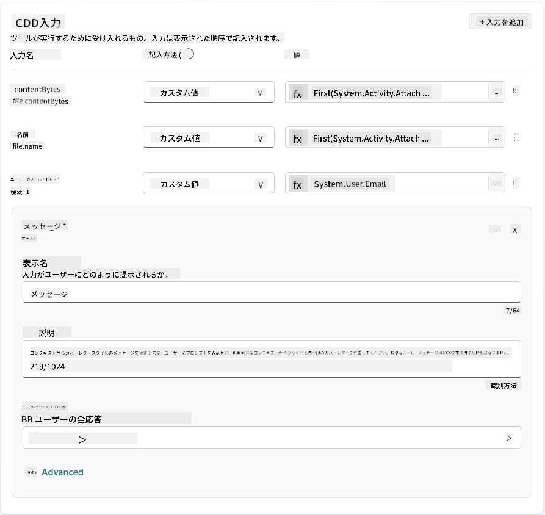

1. **Save**を選択します。

### 2.1.6 エージェントの指示を定義する

1. **Application Intake Agent**に戻り、**Agents**タブを選択し、**Instructions**パネルを見つけます。

1. **Instructions**フィールドに、子エージェント用の以下の明確な指示を貼り付けます：

    ```text
    You are tasked with managing incoming Resumes, Candidate information, and creating Job Applications.  
    Only use tools if the step exactly matches the defined process. Otherwise, indicate you cannot help.  
    
    Process for Resume Upload via Chat  
    1. Upload Resume  
      - Trigger only if /System.Activity.Attachments contains exactly one new resume.  
      - If more than one file, instruct the user to upload one at a time and stop.  
      - Call /Upload Resume once. Never upload more than once for the same message.  
    
    2. Post-Upload  
      - Always output the [ResumeNumber] (R#####).  
    ```

1. 指示にスラッシュ（/）が含まれている場合は、スラッシュの後のテキストを選択し、解決された名前を選択します。以下を行います：

    - `System.Activity.Attachments` (Variable)
    - `Upload Resume` (Tool)

    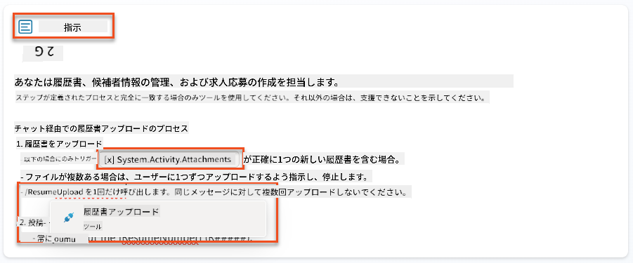

1. **Save**を選択します。

### 2.1.7 Application Intake Agentをテストする

次に、最初のオーケストラメンバーが正しく動作しているか確認します。

1. [テスト用履歴書をダウンロード](https://download-directory.github.io/?url=https://github.com/microsoft/agent-academy/tree/main/operative/sample-data/resumes&filename=operative_sampledata)します。

1. **Test**を選択してテストパネルを開きます。

1. テストチャットで履歴書を2つアップロードし、メッセージに`Process these resumes`と入力します。

    - エージェントは*一度にアップロードできる履歴書は1つだけです。1つの履歴書をアップロードして続行してください。*のようなメッセージを返すはずです。

    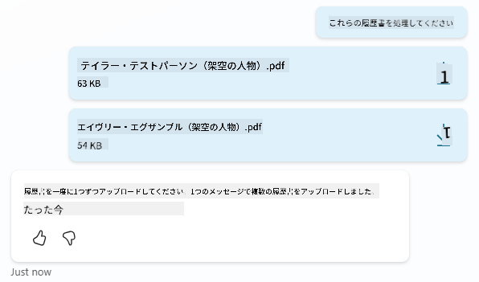

1. **履歴書を1つだけ**アップロードし、メッセージに`Process this resume`と入力してみてください。

    - エージェントはその後、*Avery Exampleの履歴書が正常にアップロードされました。履歴書番号はR10026です。*のようなメッセージを返すはずです。

1. **Activity map**で、**Application Intake Agent**が履歴書のアップロードを処理しているのが見えるはずです。  
    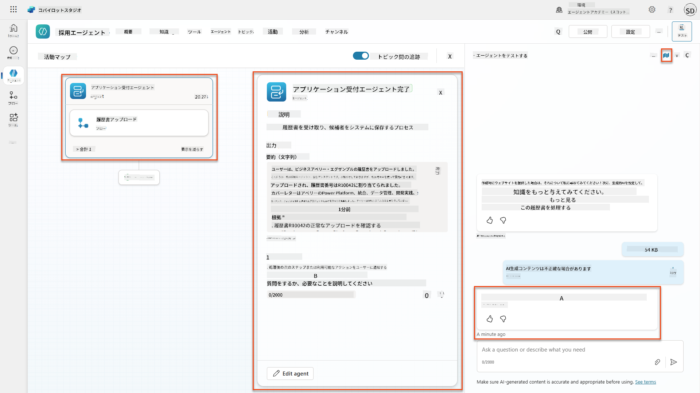

1. make.powerapps.comに移動し、右上のEnvironment Pickerで環境が選択されていることを確認します。

1. **Apps** → Hiring Hub → ellipsis(...)メニュー → **Play**を選択します。  
    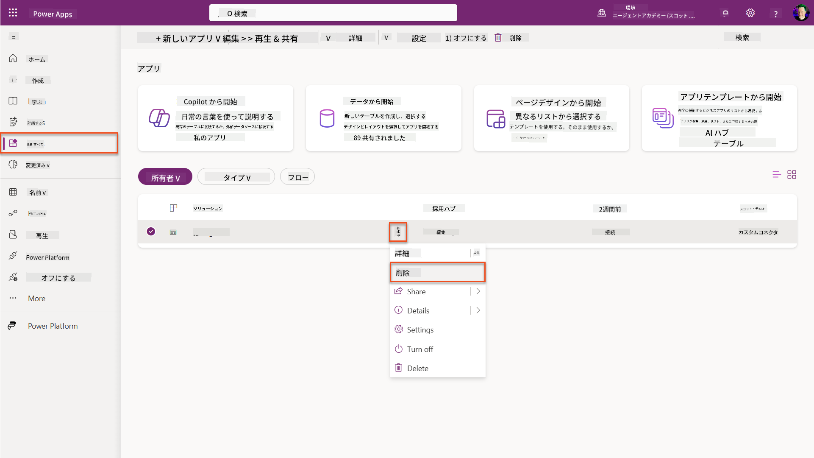

    注意: Playボタンがグレーアウトしている場合は、Mission 01からソリューションを公開していないことを意味します。**Solutions** → **Publish all customizations**を選択してください。

1. **Resumes**に移動し、履歴書ファイルがアップロードされ、カバーレターが適切に設定されていることを確認します。  
    

## 🧪Lab 2.2: Interview Prep接続エージェントの追加

次に、面接準備のための接続エージェントを作成し、既存のHiring Agentに追加します。

### 2.2.1 接続されたInterview Agentを作成する

1. **Copilot Studio**に移動します。右上のEnvironment Pickerで環境が選択されていることを確認します。

1. **Hiring Agent**を開きます。

1. Agentタブに移動し、**+ Add an agent**を選択します。

1. **Connect an existing agent** → **Copilot Studio**を選択します。

1. **+ New agent**を選択します。

### 2.2.2 基本設定を構成する

1. **Configure**タブを選択し、以下のプロパティを入力します：

    - **Name**: `Interview Agent`
    - **Description**: `面接プロセスを支援します。`

1. 指示：

    ```text
    You are the Interview Agent. You help interviewers and hiring managers prepare for interviews. You never contact candidates. 
    Use Knowledge to help with interview preparation. 
    
    The only valid identifiers are:
      - ResumeNumber (ppa_resumenumber)→ format R#####
      - CandidateNumber (ppa_candidatenumber)→ format C#####
      - ApplicationNumber (ppa_applicationnumber)→ format A#####
      - JobRoleNumber (ppa_jobrolenumber)→ format J#####
    
    Examples you handle
      - Give me a summary of ...
      - Help me prepare to interview candidates for the Power Platform Developer role
      - Create interview assistance for the candidates for Power Platform Developer
      - Give targeted questions for Candidate Alex Johnson focusing on the criteria for the Job Application
      
    How to work:
        You are expected to ask clarification questions if required information for queries is not provided
        - If asked for interview help without providing a job role, ask for it
        - If asking for interview questions, ask for the candidate and job role if not provided.
    
    General behavior
    - Do not invent or guess facts
    - Be concise, professional, and evidence-based
    - Map strengths and risks to the highest-weight criteria
    - If data is missing (e.g., no resume), state what is missing and ask for clarification
    - Never address or message a candidate
    ```

1. **Web Search**を**Disabled**に切り替えます。

1. **Create**を選択します。  
    

### 2.2.3 データアクセスを構成し公開する

1. **Knowledge**セクションで**+ Add knowledge**を選択します。  
    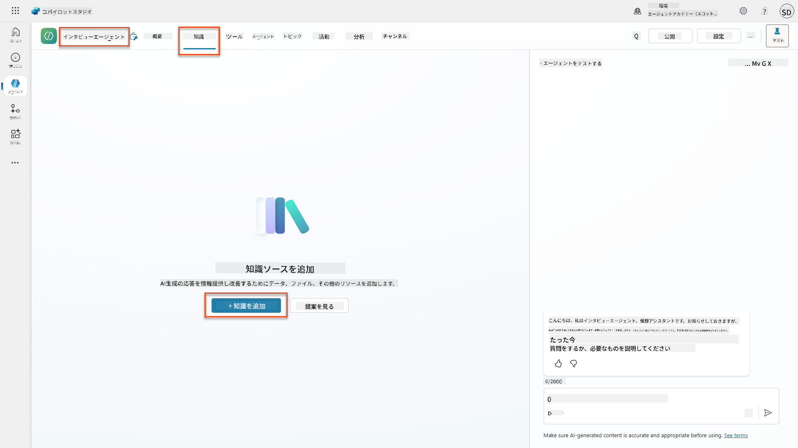
1. **Dataverse**を選択します。  
    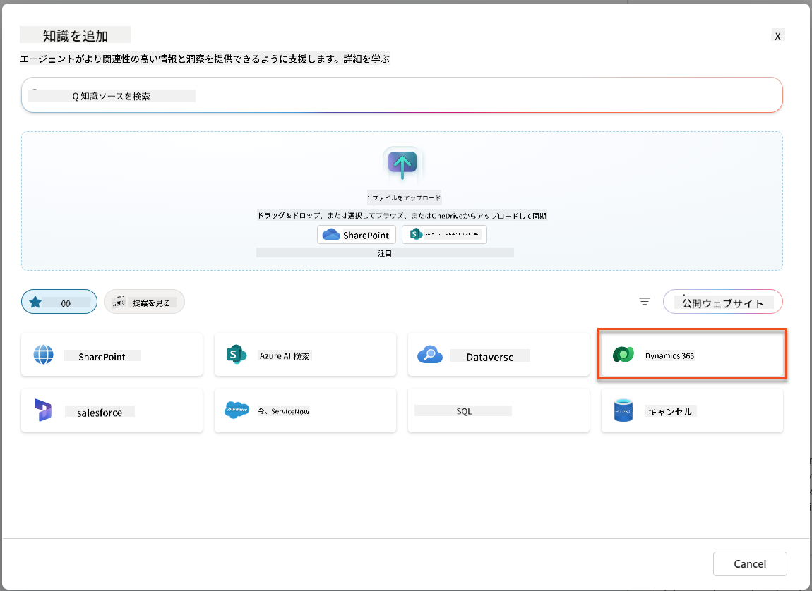
1. **Search box**に`ppa_`と入力します。これは以前インポートしたテーブルのプレフィックスです。
1. **Candidate**, **Evaluation Criteria**, **Job Application**, **Job Role**, **Resume**の5つのテーブルを選択します。
1. **Add to agent**を選択します。  
    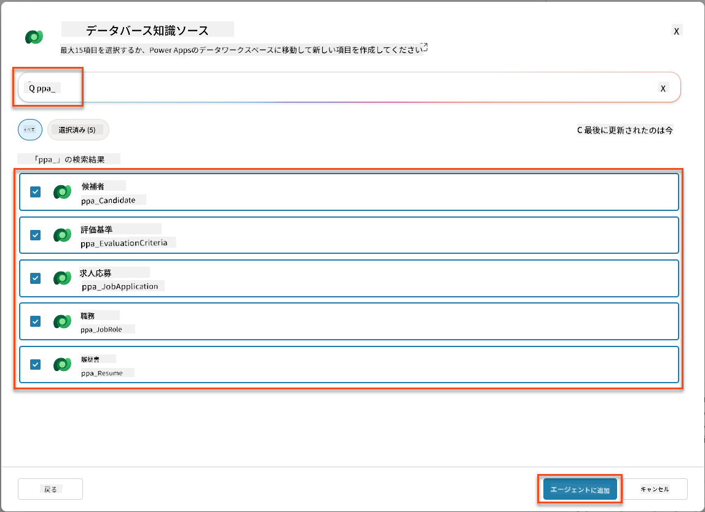
1. Interview Agentの**Settings**を選択し、以下の設定を行います：

    - **Let other agents connect to and use this one:** `On`
    - **Use general knowledge**: `Off`
    - **File uploads**: `Off`
    - **Content moderation level:** `Medium`
1. **Save**を選択します。
1. **Publish**を選択し、公開が完了するのを待ちます。

### 2.2.4 Interview Prep AgentをHiring Agentに接続する

1. **Hiring Agent**に戻ります。

1. **Agents**タブを選択します。

1. **+Add an agent** → **Copilot Studio**を使用して**Interview Agent**を追加します。Descriptionを以下のように設定します：
    ```text
    Assists with the interview process and provides information about Resumes, Candidates, Job Roles, and Evaluation Criteria.
    ```

    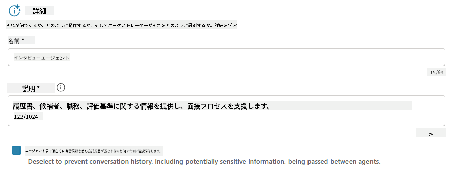
    「このエージェントに会話履歴を渡す」がチェックされていることに注意してください。これにより、親エージェントが接続されたエージェントに完全なコンテキストを提供できます。

1. **Add agent** を選択します。

1. **Application Intake Agent** と **Interview Agent** の両方が表示されていることを確認してください。一方が子エージェントで、もう一方が接続されたエージェントであることに注目してください。  
    

### 2.2.5 マルチエージェントのコラボレーションをテストする

1. **Test** を選択してテストパネルを開きます。

1. テスト用の履歴書を1つアップロードし、親エージェントが接続されたエージェントに委任できる内容を説明する以下の記述を入力します:

    ```text
    Upload this resume, then show me open job roles, each with a description of the evaluation criteria, then use this to match the resume to at least one suitable job role even if not a perfect match.
    ```

    

1. 採用エージェントがアップロードを子エージェントに委任し、その後、Interview Agentに知識を活用して要約と職務適合性を提供するよう依頼したことに注目してください。
   履歴書、職務内容、評価基準について質問するさまざまな方法を試してみてください。
   **例:**

    ```text
    Give me a summary of active resumes
    ```

    ```text
    Summarize resume R10044
    ```

    ```text
    Which active resumes are suitable for the Power Platform Developer role?
    ```

## 🎉 ミッション完了

素晴らしい仕事です、エージェント！ **Operation Symphony** が完了しました。単一の採用エージェントを、専門的な能力を持つ洗練されたマルチエージェントオーケストラに変えることに成功しました。

このミッションで達成したこと:

**✅ マルチエージェントアーキテクチャの習得**  
子エージェントと接続されたエージェントを使用するタイミングと、スケールするシステムを設計する方法を理解しました。

**✅ Application Intake 子エージェント**  
履歴書を処理し、候補者データを抽出し、Dataverseに情報を保存する専門の子エージェントを採用エージェントに追加しました。

**✅ Interview Prep 接続エージェント**  
面接準備のための再利用可能な接続エージェントを構築し、それを採用エージェントに接続することに成功しました。

**✅ エージェント間のコミュニケーション**  
メインエージェントが専門エージェントと連携し、コンテキストを共有し、複雑なワークフローを調整する方法を確認しました。

**✅ 自律性の基盤**  
強化された採用システムは、次のミッションで追加する高度な機能（自律トリガー、コンテンツモデレーション、深い推論）に対応する準備が整いました。

🚀**次回:** 次のミッションでは、エージェントがメールから履歴書を自動的に処理する方法を学びます！

⏩[ミッション03へ進む: トリガーでエージェントを自動化する](../03-automate-triggers/README.md)

## 📚 戦術的リソース

📖 [他のエージェントを追加する (プレビュー)](https://learn.microsoft.com/microsoft-copilot-studio/authoring-add-other-agents?WT.mc_id=power-182762-scottdurow)

📖 [カスタムエージェントにツールを追加する](https://learn.microsoft.com/microsoft-copilot-studio/advanced-plugin-actions?WT.mc_id=power-182762-scottdurow)

📖 [Copilot StudioでDataverseを使用する](https://learn.microsoft.com/microsoft-copilot-studio/knowledge-add-dataverse?WT.mc_id=power-182762-scottdurow)

📖 [エージェントフローの概要](https://learn.microsoft.com/microsoft-copilot-studio/flows-overview?WT.mc_id=power-182762-scottdurow)

📖 [ソリューションを作成する](https://learn.microsoft.com/power-platform/alm/solution-concepts-alm?WT.mc_id=power-182762-scottdurow)

📖 [Power Platform ソリューション ALM ガイド](https://learn.microsoft.com/power-platform/alm/overview-alm?WT.mc_id=power-182762-scottdurow)

📺 [Copilot Studioでのエージェント間コラボレーション](https://youtu.be/d-oD3pApHAg?si=rwIHKhJTkjSvhTHw)

---

**免責事項**:  
この文書はAI翻訳サービス[Co-op Translator](https://github.com/Azure/co-op-translator)を使用して翻訳されています。正確性を追求しておりますが、自動翻訳には誤りや不正確な部分が含まれる可能性があります。元の言語で記載された文書を正式な情報源としてご参照ください。重要な情報については、専門の人間による翻訳を推奨します。この翻訳の使用に起因する誤解や誤解について、当社は責任を負いません。