<!--
CO_OP_TRANSLATOR_METADATA:
{
  "original_hash": "180f9cc0b40527f61be092c9b0f72aba",
  "translation_date": "2025-10-18T03:01:58+00:00",
  "source_file": "docs/recruit/06-create-agent-from-conversation/README.md",
  "language_code": "ja"
}
-->
# 🚨 ミッション 06: Copilotを使って自然言語でカスタムエージェントを作成し、自社データで基盤を構築する

## 🕵️‍♂️ コードネーム: `OPERATION AGENT FORGE`

> **⏱️ 作業時間:** `約75分`

🎥 **ウォークスルーを見る**

[](https://www.youtube.com/watch?v=qZTtQVncGFg "YouTubeでウォークスルーを見る")

## 🎯 ミッション概要

お帰りなさい、エージェントメーカー。このミッションでは、Copilot Studioの最も強力な機能である、自然言語だけを使ってゼロからカスタムエージェントを作成する指揮を執ります。そして、それを自社データで強化します。

これは単なるチャットボットではありません。あなたが構築するのは、知識を活用したデジタル同僚であり、論理的に考え、応答し、実際の企業情報を参照できるものです。

あなたの武器は自然言語。ミッションは、SharePoint、アップロードされたファイル、または会社のURLを使用してIT関連の質問に答える完全にカスタマイズされたヘルプデスクエージェントを設計、トレーニング、テストすることです。

さあ、エージェントをゼロから構築しましょう。

## 🔎 目標

このミッションでは以下を学びます:

1. カスタムエージェントとは何か、既存のテンプレートとどう異なるのかを理解する
1. Copilotを使った自然言語プロンプトと会話設計でエージェントを作成する
1. SharePoint、ドキュメント、ウェブサイトなどの企業知識ソースでエージェントを基盤化する
1. ジェネレーティブオーケストレーションについて学び、エージェントが複数のデータソースを動的に検索して応答する方法を理解する
1. 自社データを使用して質問に答える完全機能のITヘルプデスクエージェントを構築し、テストする

## 🤔 _カスタム_エージェントとは？

カスタムエージェントとは、Copilot Studioで作成し、特定のタスクや質問に対応するために設計されたチャットボットや仮想アシスタントです。カスタムと呼ばれる理由は以下の通りです:

- **目的を決めるのはあなた** - 休暇申請、注文状況の確認、IT関連の質問への対応など。
- **会話を定義するのはあなた** - エージェントが何を言い、どのように応答するか。
- **自社データで基盤化する** - 組み込みの知識リソースを通じて企業データに接続。
- **自社システムやアプリケーションに接続する** - コネクタ、フロー、REST API、モデルコンテキストプロトコルサーバーから選択。

!!! note
    自分のデジタルヘルパーを構築するようなものです。ユーザーと会話し、質問に答えたり、プロセスに必要な情報を収集したり、企業データに接続したりするタスクを完了します。

### 🤖 カスタムエージェントは何ができるのか？

カスタムエージェントは以下を実現できます:

- ユーザーに名前、日付、好みなどの情報を尋ねる。
- その情報をデータベースやテーブルに保存する。
- 質問に基づいてデータを検索し、回答する。
- ユーザーが直接エージェントとやり取りしなくても自律的に動作する。
- メール送信やレコード作成などのアクションをオンデマンドまたは自律的にトリガーする。

### 👩🏻‍💻 なぜカスタムエージェントを使うのか？

- 繰り返し作業を自動化することで時間を節約。
- ユーザーに親しみやすく、ガイド付きの体験を提供。
- ビジネスやプロジェクトのニーズに合わせてカスタマイズ可能。

### ✨ 例

従業員が休暇申請をするためのカスタムエージェントを構築します。

エージェントは従業員の名前、休暇開始日、終了日、上司の名前を尋ね、それを休暇申請を管理する指定システム（例: SharePointリスト）に保存します。

これにより、従業員はSharePointリストに移動して新しい項目を作成する代わりに、エージェントとチャットするだけで済みます。

## 🗣️ 自然言語を使ってエージェントを作成する

以前、[レッスン 05 - 既存のエージェントを使ってすぐに始める](../05-using-prebuilt-agents/README.md)で、Copilot Studioで既存のエージェントテンプレートを使ってエージェントを迅速に構築する方法を学びました。このレッスンでは、Copilotを使った会話型の作成体験に深く入り込みます。Copilot Studioでは、Copilotとのチャットのような体験を通じてエージェントを簡単に構築できます。

Copilot Studioでは、エージェントを作成するためにコードを書く必要はありません。代わりに、エージェントに何をしてほしいかを自然言語で説明すると、Copilotがステップバイステップで構築を手助けしてくれます。

## 🌱 「何をしてほしいかを説明する」のが初めての場合 - どうすればいい？

自然言語でカスタムエージェントを作成することは、初めての概念かもしれません。Microsoft製品やサービスでCopilotを使用するたびに、自然言語を使った_プロンプト_を使用しています。

プロンプトとは、AIエージェントに何をしてほしいかを伝えるメッセージや指示のことです。アシスタントに指示を与えるようなものだと考えてください。指示が明確であればあるほど、アシスタントが理解しやすく、行動しやすくなります。

### 🪄 プロンプトが重要な理由

- エージェントの行動を導く。
- エージェントがどのような会話をするべきかを理解するのを助ける。
- 良いプロンプトはエージェントをより役立つものにし、正確にする。

### 📝 良いプロンプトを書くためのヒント

- 明確で具体的に - エージェントにしてほしいことを正確に伝える。
- ユーザーの視点で考える - ユーザーは何を言うか？エージェントはどう応答すべきか？
- 例を含める - 可能であれば、サンプルのやり取りを提供する。

### ✨ 例

HRチームが休暇申請を手助けするエージェントを必要としているとします。

プロンプトは以下のようになります:

    “休暇申請を手助けするエージェントを作りたいです。ユーザーが休暇を申請したいと言ったら、エージェントは名前、休暇開始日、終了日、上司の名前を尋ねるべきです。ユーザーがこれらの情報を提供したら、エージェントはそれを‘Vacation Requests’という名前のSharePointリストに保存し、専用のMicrosoft Teamsチャンネルに通知を投稿するべきです。”

このプロンプトが効果的な理由:

- **目標を明確に述べている** - 休暇申請を提出する
- **ユーザーとのやり取りを説明している** - ユーザーが何を言い、エージェントが何を尋ねるべきか
- **必要なデータをリストアップしている** - 名前、開始日、終了日、上司
- **データの保存場所を述べている** - ‘Vacation Requests’という名前のSharePointリスト

## 🔮 エージェントを作成した後、次に知識で基盤化するには？

Copilot Studioでは、知識ソースはエージェントがより良い回答を提供するために情報を見つける場所です。これらのソースを追加すると、Power Platform、Dynamics 365、ウェブサイト、その他の会社が使用するシステムやサービスから企業データを取り込むことができます。

これらのソースはAIと連携して、エージェントがユーザーの質問により正確に応答できるようにします。これを**ジェネレーティブオーケストレーション**と呼びます。

### 🌿 エージェントにおけるジェネレーティブオーケストレーションとは？

ジェネレーティブオーケストレーションとは、エージェントがAIを使って質問に答える方法を動的に決定することを意味します。これは、組み込みの言語スキルと追加された知識ソースからの情報を組み合わせて行われます。

ユーザーが質問をすると、エージェントは以下を行います:

- AIを使って質問を理解する。
- 必要な情報が不足している場合、即座に質問を生成してユーザーに尋ねる。
- 最も関連性の高い知識ソースを選択する。
- そのソースを検索して回答を見つける。
- 見つけた情報を使って自然で役立つ応答を生成する。

### 🏦 知識ソースが重要な理由

1. **より賢い回答** - 知識ソースを追加すると、エージェントは組織の実際のデータを使用して、より正確で役立つ回答を提供できる。
1. **手間を減らす** - すべての可能な応答を手動で書く必要がなくなる。エージェントが追加されたソースを検索して自動的に応答する。
1. **信頼できる情報を使用** - Dataverse、SharePoint、会社のウェブサイトなど、既に使用しているシステムから回答を引き出すことで、信頼性の高い情報を提供。
1. **ジェネレーティブAIと連携** - 知識ソースとAIが質問を理解し、自然に応答するのを助ける。
1. **柔軟で拡張可能** - 設定中または後で知識ソースを追加でき、ニーズの変化に応じてエージェントが賢くなる。

### ✨ 例

従業員のHR関連の質問を手助けするエージェントを構築するとします。会社のHRポリシー文書とSharePointサイトを知識ソースとして追加します。

従業員が「私は何日間の休暇を取る権利がありますか？」と尋ねた場合、エージェントはジェネレーティブオーケストレーションを使ってこれらのソースを検索し、正しいポリシーを基に回答します。これにより、従業員の権利に関するすべての可能な質問に手動で回答する必要がなくなります。

## 追加可能な知識ソースの種類

1. **公開ウェブサイト**
    - **機能:** Bingを使用して特定のウェブサイト（例: 会社のサイト）を検索。
    - **利点:** FAQや製品情報などの公開情報を取得するのに最適。

1. **ドキュメント**
    - **機能:** PDFやWordファイルなど、エージェントに直接アップロードするドキュメントを使用。これらのアップロードされたファイルはDataverseに安全に保存される。
    - **利点:** 内部ガイド、マニュアル、ポリシーに基づいて質問に答えることが可能。

1. **SharePoint**
    - **機能:** Microsoft Graph Searchを使用してSharePointフォルダやファイルに接続。
    - **利点:** SharePointに保存されたチームドキュメント、HRポリシー、プロジェクトファイルにアクセスするのに理想的。

1. **Dataverse**
    - **機能:** Dataverse環境のテーブルや行から構造化データを使用し、エージェントの応答を改善するためにテーブルや列の同義語や用語集定義を適用可能。
    - **利点:** Dataverseに保存された顧客情報などの企業データを検索する必要がある場合に便利。

1. **リアルタイム知識（コネクタ使用）**
    - **機能:** Salesforce、ServiceNow、Dynamics 365、AzureSQL、Databricksなどの他の企業システムからライブデータにアクセス可能。会話中にユーザー自身の権限を使用。
    - **利点:** データを保存または複製することなく、最新で安全かつ正確な応答を提供し、エージェントをより賢く安全にする。

1. **Azure AI Search**
    - **機能:** Azureに保存された大量のドキュメントをセマンティックおよびベクトル検索を使用して検索し、ユーザーの質問を理解。
    - **利点:** 複雑なデータソースから正確で信頼性の高い回答を提供し、引用をサポートし、大規模なドキュメントコレクションに対してスケール可能で安全なアクセス制御を提供。

## 🔒 セキュリティに関する注意事項

### 知識ソース認証

SharePointやDataverseなどの一部のソースはユーザー認証を必要とします。これは、エージェントがユーザーが閲覧可能なデータのみを応答に参照することを意味します。一方、Azure AI Searchなどの他のソースは、エージェントが接続するためにAzureアカウントや認証タイプの指定など追加の設定が必要です。

## Copilot Studioでエージェントの応答を改善する

会話型作成体験からエージェントがプロビジョニングされた後、Copilotがプロンプトから生成した指示に基づいてエージェントをテストします。Copilot Studioでエージェントの応答を改善することは、目標を明確に理解し、適切な情報を持たせることに重点を置いています。

1. **エージェント指示を改善する** - エージェントにどのように振る舞うべきかを伝える部分です。明確で具体的な言葉を使いましょう。

    例:

    ✅ “親しみやすく、簡潔に説明するカスタマーサポートエージェントのように振る舞ってください。”

    ❌ “役立つようにしてください。”（曖昧すぎる）

1. **トーンと言葉遣いを確認する** - エージェントのトーンが対象のユーザーに合っているか確認。

    以下のように設定可能:

    - 親しみやすくカジュアル。
    - プロフェッショナルで簡潔。
    - 支援的で忍耐強い。

1. **知識ソースを追加または更新する** - エージェントが特定のトピックに関する質問に答える必要がある場合、適切な情報にアクセスできるようにする。

    - ウェブサイト、ドキュメント、FAQへのリンクを追加。
    - コンテンツを最新の状態に保つ。
    - 明確で構造化された情報を使用。

1. **トピックとトリガーを使用する** - エージェントが特定のタスクや会話を処理する必要がある場合、トリガーフレーズを持つトピックを作成可能。これにより、会話をより正確に導くことができる。次のレッスンでさらに学びます。

1. **実際の質問でテストする** - ユーザーが尋ねる可能性のある質問をエージェントに試してみる。

    もし回答が不十分なら:

    - システム指示を調整。
    - 例や知識を追加。
    - 質問を言い換えて応答を確認。

1. **レビューと改善** - エージェントの改善は継続的なプロセスです！

    公開後:

    - ユーザーからのフィードバックを収集。
    - よくある質問や混乱を監視。
    - エージェントの設定を継続的に改善。

## 🧪 ラボ 06: Copilot Studioでカスタムエージェントを作成する

これから、自社データを活用
同じユースケースを使用します：[Lesson 03 - Microsoft 365 Copilotの宣言型エージェントを作成する](../03-create-a-declarative-agent-for-M365Copilot/README.md#use-case-scenario)

**従業員として**

**ITヘルプデスクエージェントからデバイスの問題、ネットワークのトラブルシューティング、プリンターのセットアップなどの問題に対して迅速かつ正確な支援を受けたい**

**その結果、生産性を維持し、技術的な問題を遅延なく解決できるようにしたい**

さあ、始めましょう！

### ✨ 前提条件

- **SharePoint サイト**

[Lesson 00 - コースセットアップ - ステップ3: 新しいSharePointサイトを作成する](../00-course-setup/README.md#step-4-create-new-sharepoint-site)で作成した **Contoso IT** SharePointサイトを使用します。

**Contoso IT** SharePointサイトをまだ設定していない場合は、[Lesson 00 - コースセットアップ - ステップ3: 新しいSharePointサイトを作成する](../00-course-setup/README.md#step-4-create-new-sharepoint-site)に戻ってください。

- **ソリューション**

[Lesson 04 - エージェントのためのソリューションを作成する](../04-creating-a-solution/README.md#41-create-a-solution-publisher)で作成した **Contoso Helpdesk Agent** ソリューションを使用します。

**Contoso Agent** ソリューションをまだ設定していない場合は、[Lesson 04 - エージェントのためのソリューションを作成する](../04-creating-a-solution/README.md#41-create-a-solution-publisher)に戻ってください。

### 6.1 Copilotを使って自然言語でエージェントを作成する

!!! warning "Copilotの質問はセッションごとに異なる場合があります"

    Copilotの会話型作成体験は毎回異なる場合があり、提供されるガイド質問が以前と少し異なることがあります。

1. Copilot Studioのホームページに移動し、フィールドにITヘルプデスクエージェントを説明する以下のプロンプトを入力します。このプロンプトには、エージェントの目的、コンテキスト、期待されるタスク、エージェントの応答形式が含まれています。

    ```text
    You are an IT help desk agent. Your goal is to assist users with their IT issues. You can access information from our company's knowledge base at https://support.microsoft.com/en-us. Your responses should be polite and helpful. If a user reports a slow computer, ask about the age of the device, current software versions, and if they've recently installed any new programs. If a user is experiencing trouble logging into their email, guide them through password reset procedures. You should be concise and informative, using step-by-step instructions with bullet points when appropriate.
    ```

      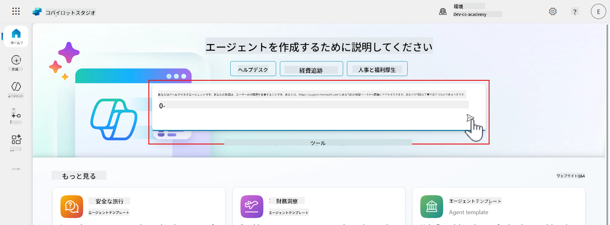

1. 次に、Copilotの会話型作成体験が読み込まれます。Copilotが応答を進行中であることがわかります。

      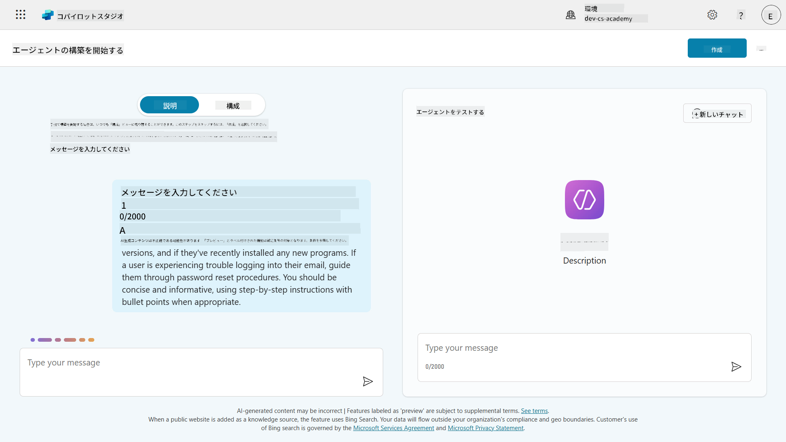

1. Copilotは、提供された指示に基づいてエージェントが設定されたことを確認し、エージェントの名前について確認を求めます。Copilotに以下の名前を付けるよう依頼します。

       ```text
       Contoso Helpdesk Agent
       ```

      

1. Copilotはリクエストを実行し、エージェントの名前がエージェントペインで更新されたことが確認できます。次に、Copilotは指示を洗練するよう求めてきます。特定の問題にどのように応答するかを尋ねており、問題を認識し、回答例を提供し、応答を箇条書き形式でフォーマットするよう依頼します。

    以下をコピーして貼り付け、Copilotにリクエストを送信してください。

       ```text
       緊急のリクエストを優先してください。対応するIT問題やシナリオの例: デバイスの問題、ネットワーク接続、ログイン問題。トラブルシューティング時には、まず問題を認識し、共感を示してから、箇条書きでステップバイステップのガイドを提供し、さらに支援が必要かどうかを尋ねてください。
       ```

      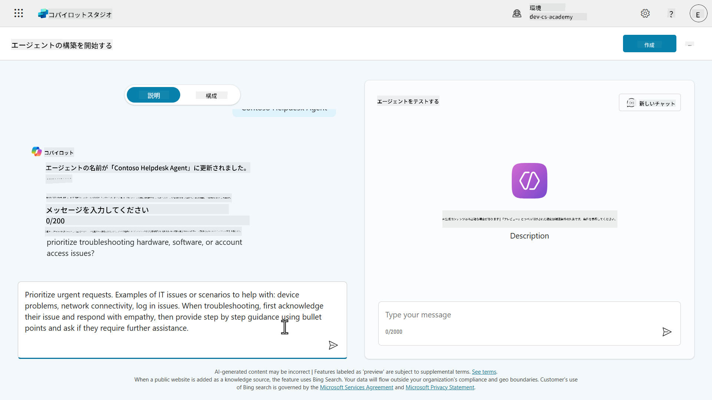

1. Copilotがリクエストを受け取った後、エージェントの指示が更新されます。右側のペインに、スタータープロンプトが表示されることに注目してください。これらは私たちの指示に基づいて形成されました。

    次に、Copilotはエージェントの知識を基にするための公開ウェブサイトを求めています。

    以下をコピーして貼り付け、Copilotにリクエストを送信してください。

      ```text
      https://support.microsoft.com
      ```

      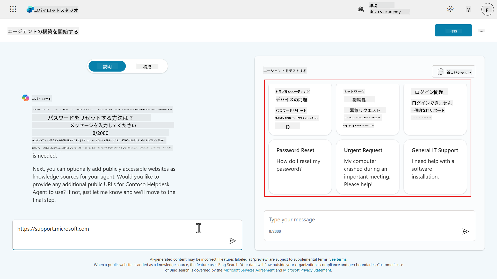

1. 公開ウェブサイトが知識ソースとして追加されます。Copilotは追加の知識ソースを追加するかどうかを尋ねてきます。追加の公開ウェブサイトを追加する必要はありません。

    以下をコピーして貼り付け、Copilotにリクエストを送信してください。

      ```text
      Proceed with setup
      ```

      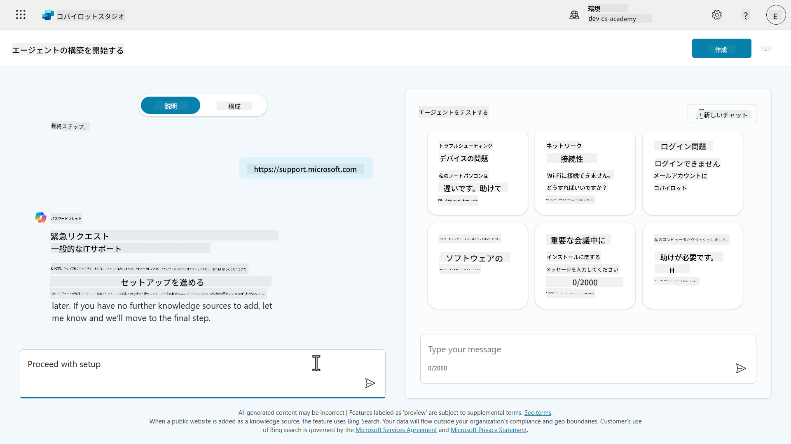

1. CopilotはContoso Helpdesk Agentのセットアップが完了したことを確認しますが、もう1つ変更を加えます。エージェントがHR関連の質問に回答しないようにリクエストします。これにより、ユーザーがHR関連の質問をした場合、エージェントが回答しないことを知らせます。

    以下をコピーして貼り付け、Copilotにリクエストを送信してください。

       ```text
       HRに関連する質問には支援を提供しないでください。例: 私の休暇残日数は？病欠日数は何日ですか？給与ポータルのURLは何ですか？
       ```

      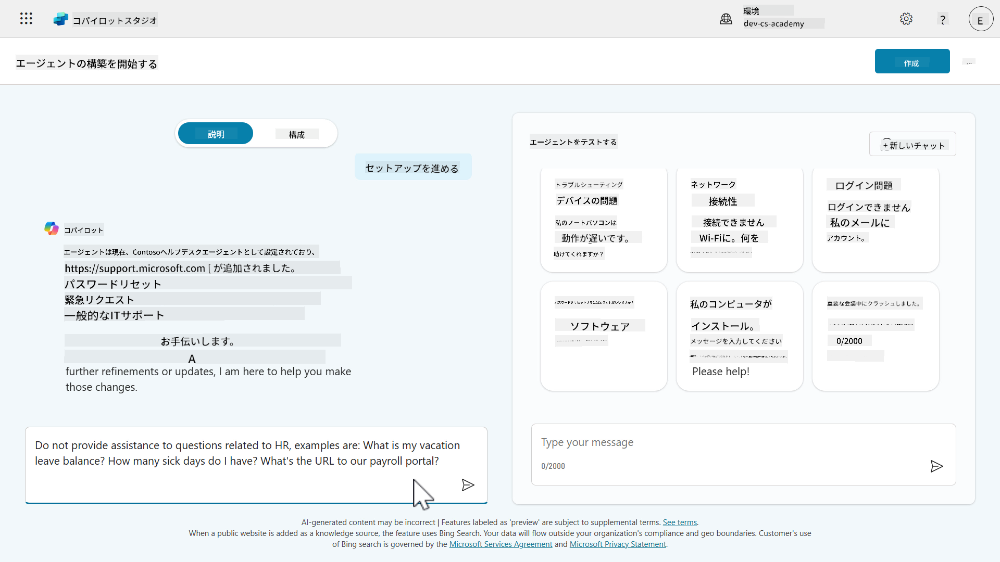

1. 指示が更新され、HR関連の質問には支援を提供しないようになります。これ以上の更新は必要ありません。エージェントを作成する準備が整いました。

      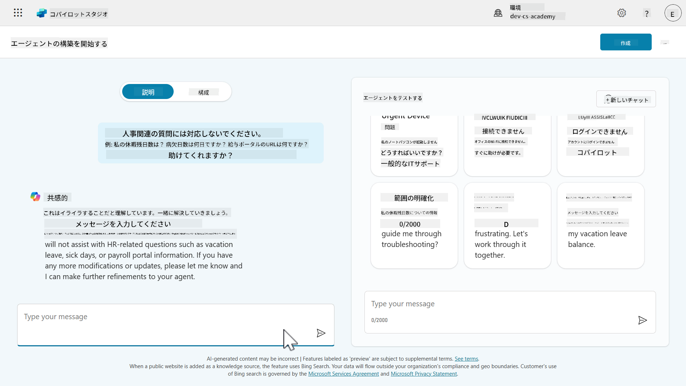

1. エージェントを作成する前に、いくつかのことを確認します。

    まず、**Configure** タブを選択して、Copilotとの会話から定義されたエージェントの詳細を確認します。ここでは、名前、説明、指示、知識、提案された/スタータープロンプトを確認できます。

      

1. 次に、エージェントをテストします。以下をコピーして貼り付け、エージェントに質問を送信してください。

       ```text
       Surfaceの保証状況を確認するにはどうすればよいですか？
       ```

      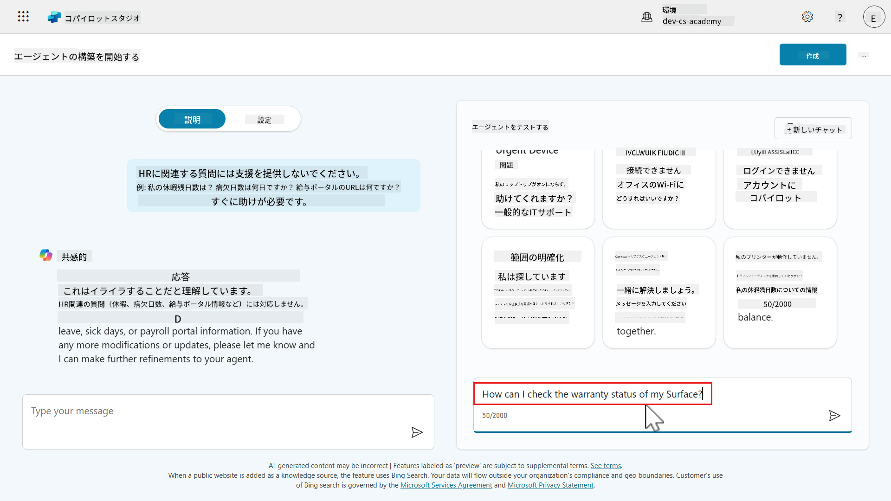

1. 質問への応答が表示され、回答が箇条書き形式のステップバイステップガイドで提供されます。素晴らしい、エージェントは正常に動作しています！ 🙌🏻

      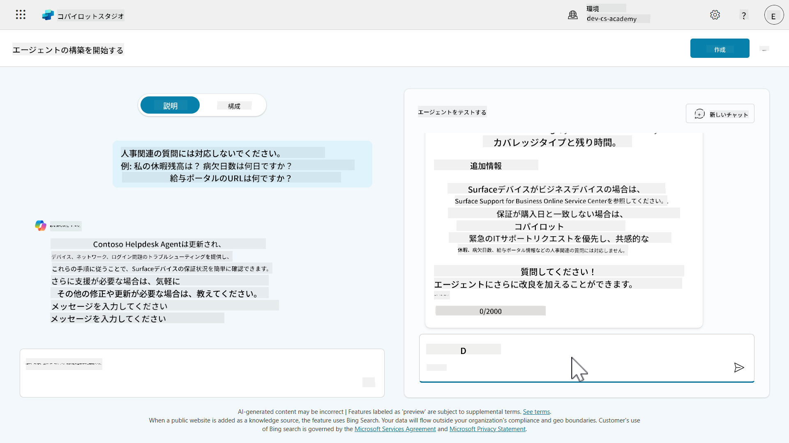

1. 最後に、エージェントが作成されるソリューションが、[Lesson 04 - 新しいソリューションを作成する](../04-creating-a-solution/README.md#42-create-a-new-solution)で作成し、優先ソリューションとして選択したソリューションであることを再確認します。

    **省略記号アイコン（...）** を選択し、**Update Advanced Settings** を選択します。

      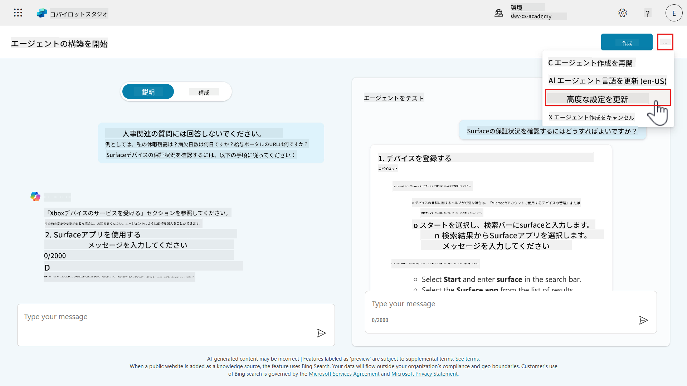

1. **Advanced Settings** モーダルが表示され、以前に作成したソリューションがデフォルトで選択されていることが確認できます。これは、[Lesson 04 - 新しいソリューションを作成する](../04-creating-a-solution/README.md#42-create-a-new-solution)でソリューションを優先ソリューションとして選択したためです。

    **キャンセル** を選択します。

      

1. さあ、カスタムエージェントを作成しましょう！ **Create** を選択します。

      

1. Copilot Studioがエージェントのプロビジョニングを開始します。

      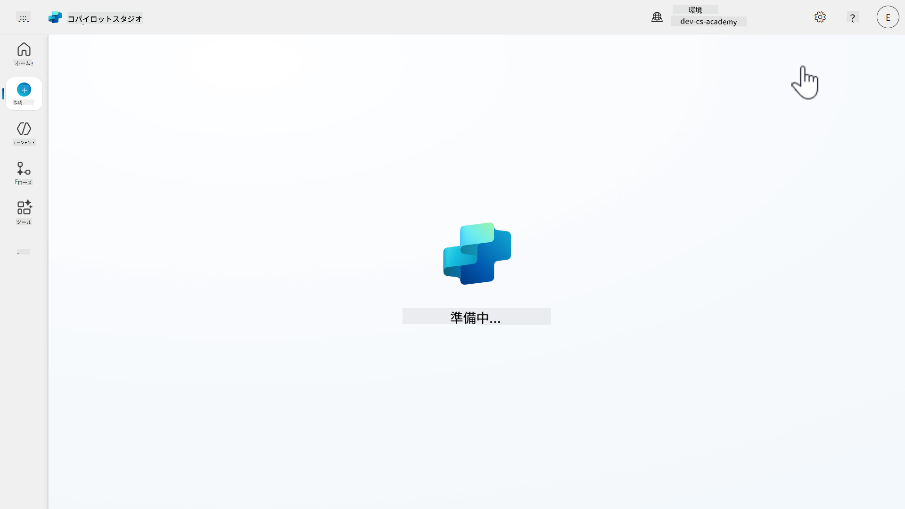

1. エージェントがプロビジョニングされると、Copilotの会話型作成体験中にリクエストした内容が反映されたエージェントの詳細を確認できます。エージェントをスクロールして確認すると、名前、説明、指示、知識ソース、提案されたプロンプトが表示されます。オーケストレーションモードはデフォルトで有効になっており、エージェントの応答モデルにはデフォルトモデルが使用されています。

      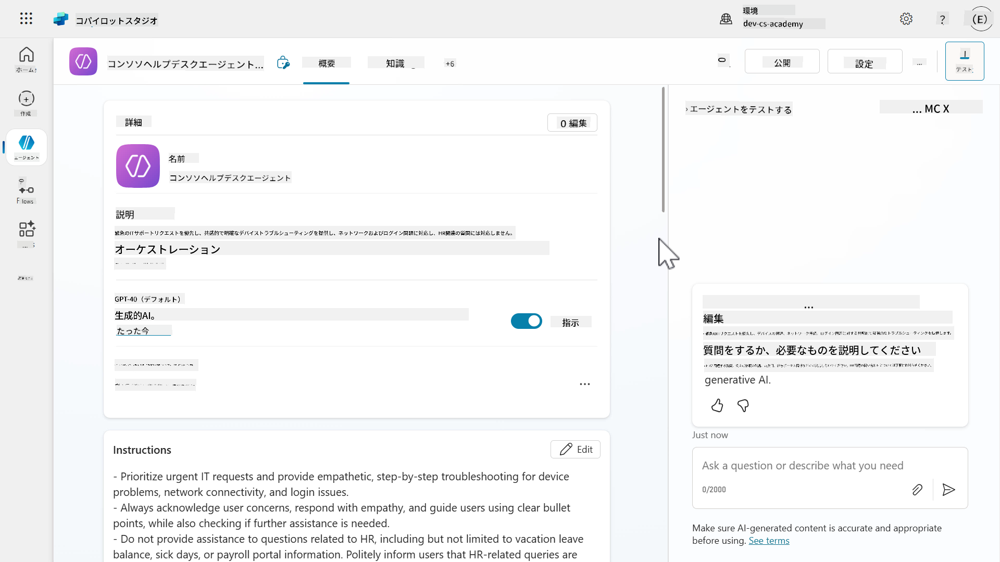

      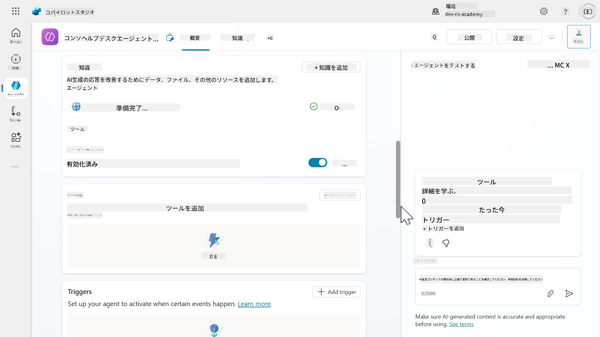

      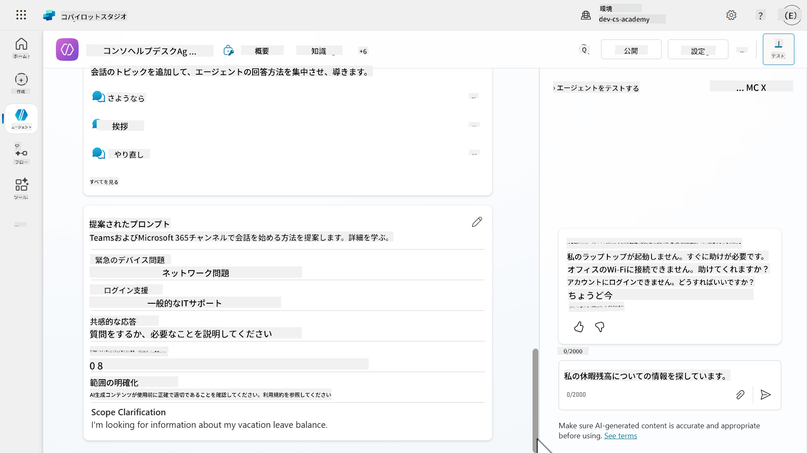

1. 新しく作成したエージェントをテストしましょう。右側の**Test**ペインで、**Activity Map**アイコンを選択します。

      

1. **Test**ペインに以下の質問を入力します。

       ```text
       Windows 11のプロダクトキーを見つけるにはどうすればよいですか？
       ```

      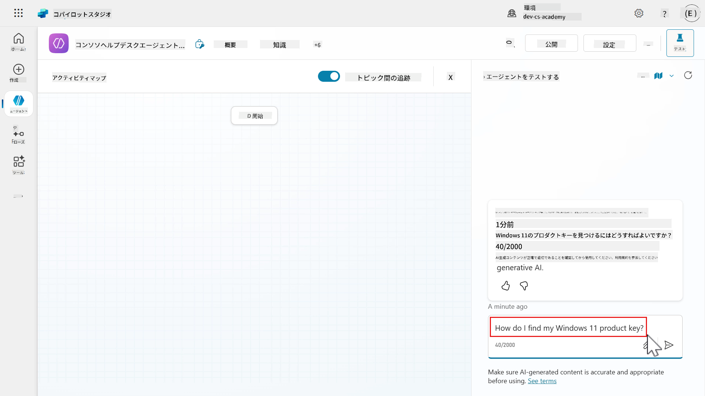

1. 次に、エージェントが知識ソースをレビューしている様子がリアルタイムで表示されます。このシナリオでは、エージェントが質問を理解し、知識ソースを検索しています。現在、追加した公開ウェブサイトが1つのソースとしてあり、エージェントがそれをレビューしています。

      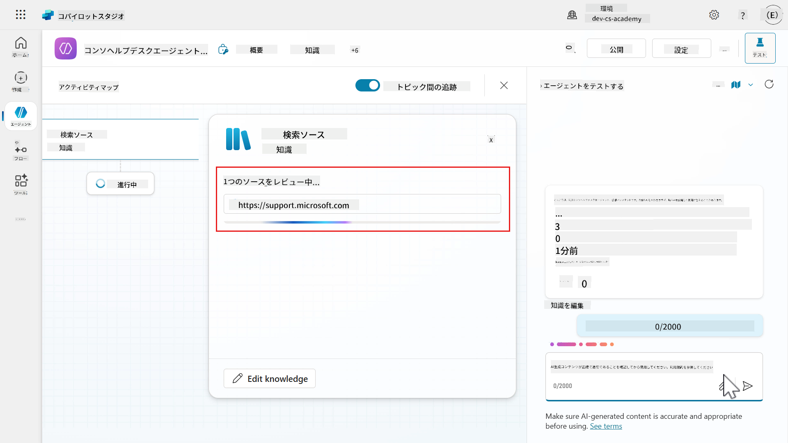

1. エージェントは指示で定義された通り、箇条書きで回答を提供します。応答には、エージェントが回答を形成する際に参照したウェブページの情報が含まれています。これにより、ユーザーは回答のソースを確認することができます。

      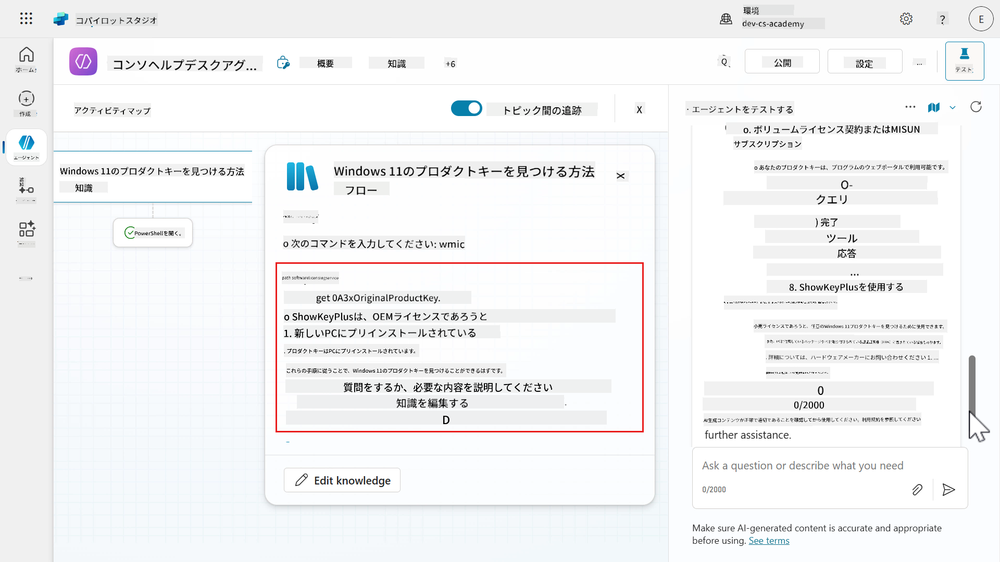

1. また、**Activity Map**の**Knowledge modal**をスクロールすることで、応答とそのソースを確認することができます。

      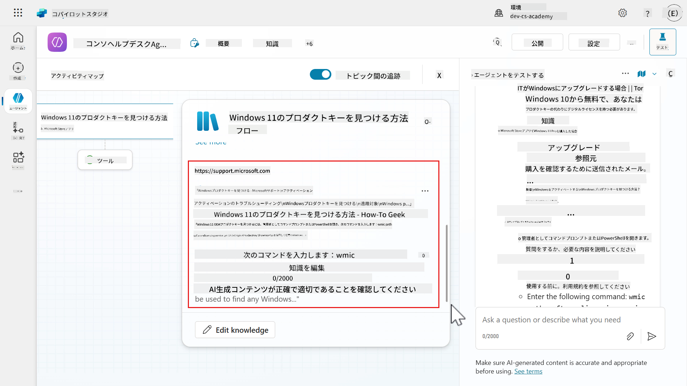

おめでとうございます！Copilot Studioで初めてのカスタムエージェントを作成しました 🙌🏻

### 6.2 SharePointサイトを使用して内部知識ソースを追加する

以前、Copilotを使用して会話型作成体験中にエージェントに公開ウェブサイトを外部知識ソースとして追加しました。次は、SharePointサイトを使用して内部知識ソースを追加します。これは[Lesson 00 - コースセットアップ](../00-course-setup/README.md#step-4-create-new-sharepoint-site)で作成したSharePointサイトです。

1. **+ Add knowledge** を選択します。

      

1. **SharePoint** を選択します。

      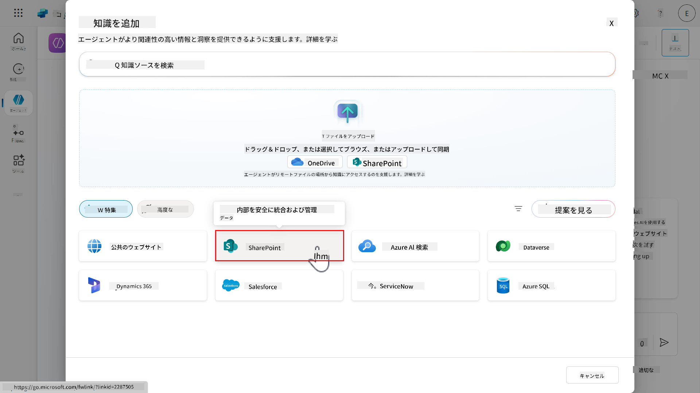

1. SharePoint URLフィールドに[Lesson 00 - コースセットアップ](../00-course-setup/README.md#step-4-create-new-sharepoint-site)で作成した**SharePointサイトのアドレス**を貼り付け、**Add** を選択します。

      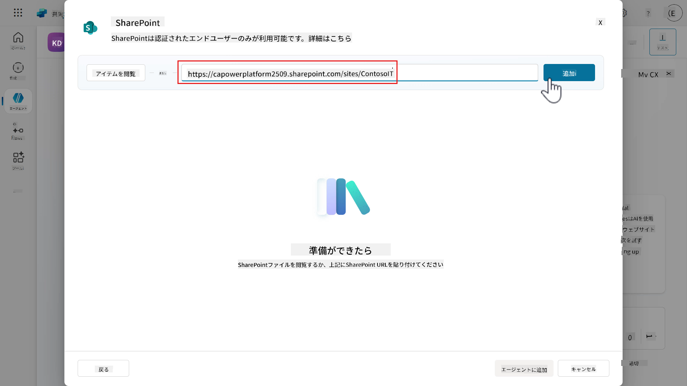

1. SharePointサイトの**名前**を`Contoso IT`に更新し、**Add** を選択します。

      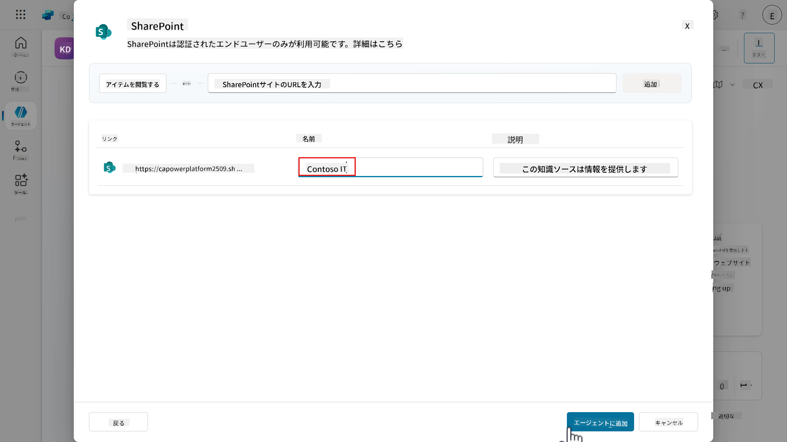

1. SharePointサイトが知識ソースとして追加され、ステータスが_Ready_になります。ステータス列には、知識ソースが正常に読み込まれた/接続されたか、問題があるかどうかが表示されます。

      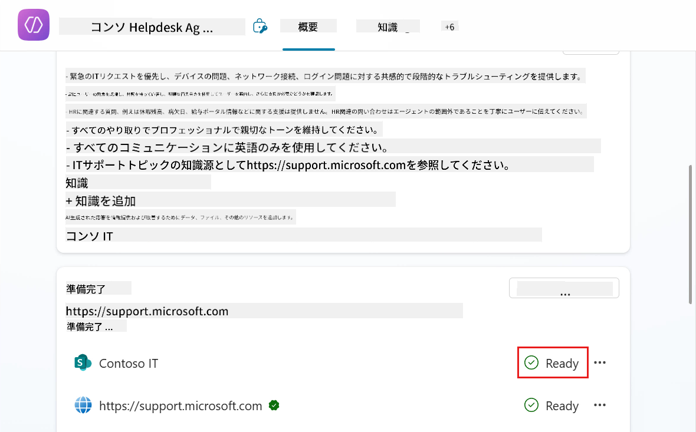

### 6.3 ドキュメントをアップロードして内部知識ソースを追加する

次に、ドキュメントを直接エージェントにアップロードして、別の内部知識ソースを追加します。

1. **Add knowledge** を選択します。

      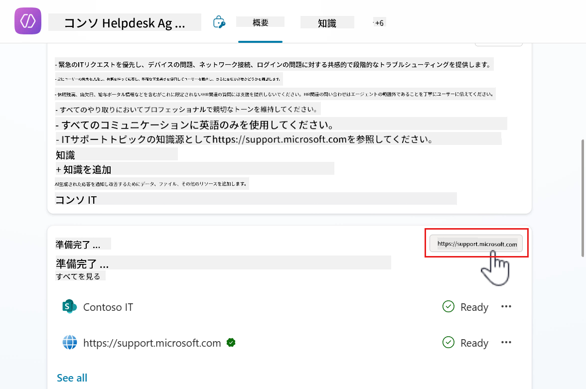

1. **Upload file** または **Select to browse** を選択します。

      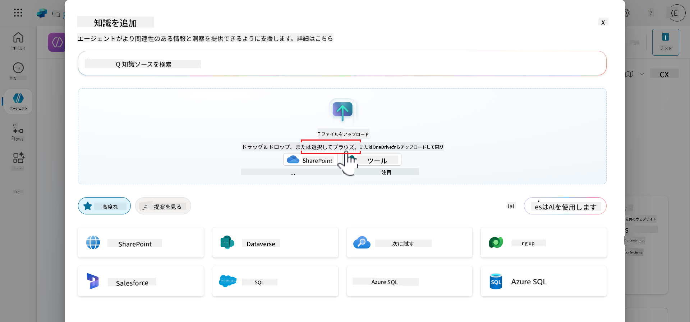

1. この[サンプルファイル](../../../../../docs/recruit/06-create-agent-from-conversation/assets/Contoso_Guest_WiFi_Connection_Guide.docx "download")をダウンロードし、ファイルエクスプローラーで選択します。**Open** を選択します。

      

1. ファイルがアップロードのために選択されました。次に **Add to agent** を選択します。

      

1. ドキュメントがエージェントに追加されるプロセスが進行中です。アップロードが完了するまで待機し、ブラウザウィンドウを閉じないでください。ドキュメントのステータスは最初は _In progress_ と表示されますが、テストを行う前にステータスが **Ready** に更新されるのを待ちます。

      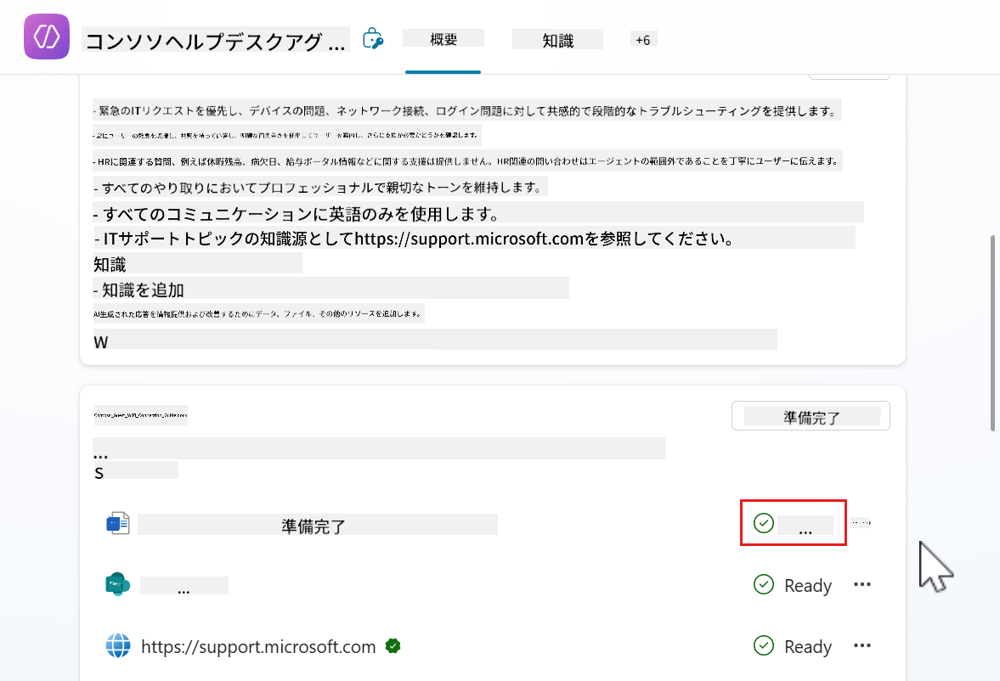

では、エージェントをテストしてみましょう！

### 6.4 エージェントをテストする

3つの知識ソースをテストするために、Contoso Helpdesk Agentに質問をします。

1. テストペインで**更新アイコン**を選択し、その後**Activity Map**アイコンを選択します。

      

1. 公開ウェブサイト（外部）知識ソースをテストするために以下の質問を入力します。

      ```text
      How can I find the serial number on my Surface device?
      ```

      

1. 次に、エージェントが知識ソースをレビューし、ウェブサイト知識ソースを使用して応答を提供する様子が表示されます。
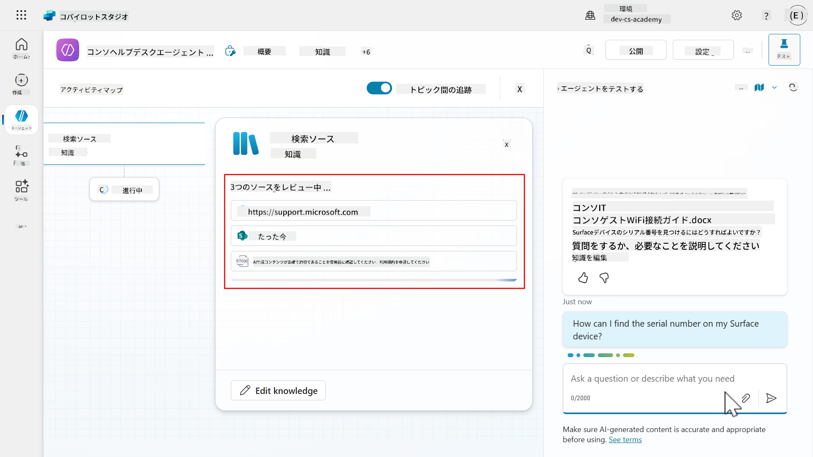

1. 応答が返されると、回答が形成されたウェブページへの参照があることに気づくでしょう。アクティビティマップの知識モーダルをスクロールすると、エージェントが検索した他の知識ソース（SharePointサイトとアップロードされたファイル）が表示されます。

    しかし、これらは使用されておらず、**参照されたソース**セクションではウェブサイトの知識ソースのみが参照されています。回答はウェブサイトの知識ソースを基にしています。参照を選択すると、そのウェブページに移動します。

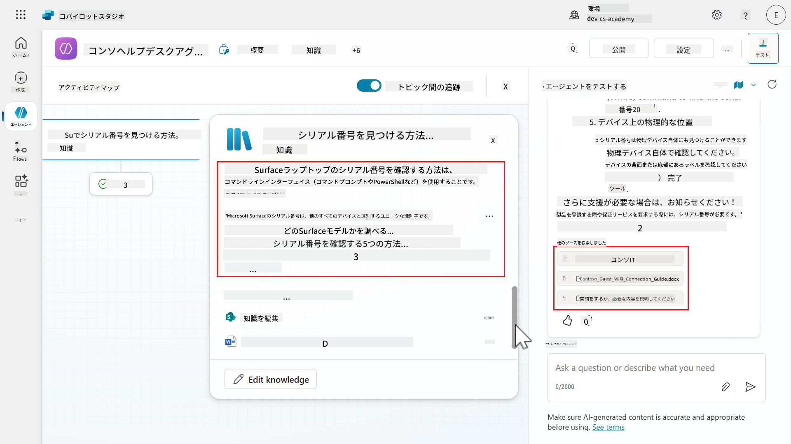

1. 次に、SharePointサイトの知識ソースとドキュメントの知識ソースを1つのメッセージでテストしてみましょう。以下の質問を入力してください。

      ```text
      How can I access our company Contoso VPN? How do guests connect to the Contoso Guest wifi?
      ```


1. 再びエージェントが3つの知識ソースをレビューし、1つのメッセージ内で質問に対する応答を生成する様子が見られます。エージェントは1つのメッセージ内で両方の質問に応答し、応答を生成したSharePointページとドキュメントを個別に参照します。

    アクティビティマップの知識モーダルでは、参照ソースとして使用されたSharePointサイトとドキュメントが表示されます。両方の質問に回答するために使用された知識ソースを完全に確認できます。

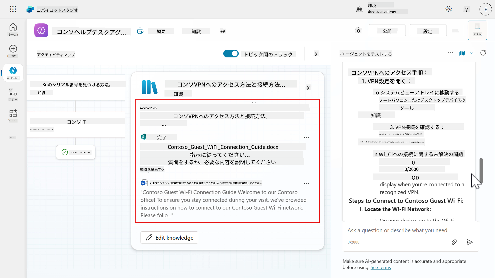

1. 生成された応答が正しいかどうかを確認することは常に重要です。SharePointサイトの参照を選択すると、VPNの手順を確認するためにスクロールできるFAQのSharePointページが読み込まれます。

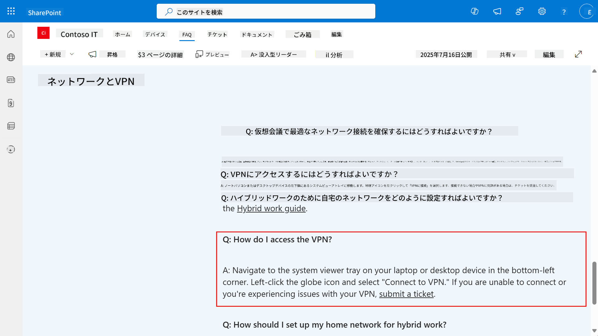

1. 次に、ドキュメントの参照を選択すると、回答を反映したドキュメントのテキストが表示されるモーダルが開きます。

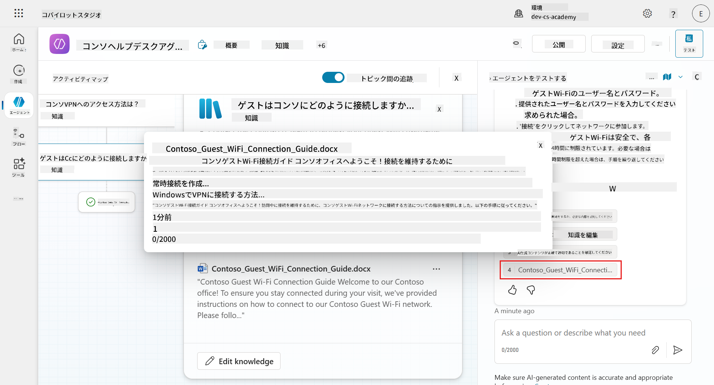

エージェントは1つのメッセージ内で複数の質問に回答し、知識ソースを検索して応答内で参照することができます。常に参照を確認して応答が正しいことを確認してください。

## ✅ ミッション完了

おめでとうございます！ 👏🏻 自然言語を使用して、3つの異なる知識ソースからデータをチャットできる独自のカスタムエージェントを作成する方法を学びました 🙌🏻

これで**Lab 06 - Copilotを使用してエージェントを作成する**は終了です。以下のリンクを選択して次のレッスンに進んでください。このラボで作成したカスタムエージェントは、次のレッスンのラボで使用されます。

⏭️ [次のレッスン「新しいトピックとトリガーを追加する」に進む](../07-add-new-topic-with-trigger/README.md)

エリートへようこそ。あなたは今、自分の言語を話し、データを参照し、チームをサポートするデジタルエージェントを作り上げる方法を知っています。引き続き頑張ってください—あなたのミッションはまだ始まったばかりです。

## 📚 戦術的リソース

🔗 [クイックスタート: エージェントを作成して展開する](https://learn.microsoft.com/microsoft-copilot-studio/fundamentals-get-started?context=%2Fmicrosoft-365-copilot%2Fextensibility%2Fcontext/?WT.mc_id=power-172617-ebenitez)

🔗 [エージェントの作成と削除](https://learn.microsoft.com/microsoft-copilot-studio/authoring-first-bot?WT.mc_id=power-172617-ebenitez)

🔗 [主要な概念 - エージェントの作成](https://learn.microsoft.com/microsoft-copilot-studio/authoring-fundamentals/?WT.mc_id=power-172617-ebenitez)

📺 [自然言語を使用してカスタムエージェントを作成する](https://aka.ms/ai-in-action/copilot-studio/ep1)

📺 [エージェントに知識を追加する](https://aka.ms/ai-in-action/copilot-studio/ep2)


---

**免責事項**:  
この文書はAI翻訳サービス[Co-op Translator](https://github.com/Azure/co-op-translator)を使用して翻訳されています。正確性を追求しておりますが、自動翻訳には誤りや不正確な部分が含まれる可能性があります。元の言語で記載された文書を正式な情報源としてお考えください。重要な情報については、専門の人間による翻訳を推奨します。この翻訳の使用に起因する誤解や誤認について、当社は一切の責任を負いません。