<!--
CO_OP_TRANSLATOR_METADATA:
{
  "original_hash": "dcbcd9396b076da0a0f5d389e9ec1b12",
  "translation_date": "2025-10-18T02:59:02+00:00",
  "source_file": "docs/recruit/08-add-adaptive-card/README.md",
  "language_code": "ja"
}
-->
# 🚨 ミッション08: トピックでのユーザーインタラクションをアダプティブカードで強化

## 🕵️‍♂️ コードネーム: `OPERATION INTERFACE UPLIFT`

> **⏱️ 作戦時間枠:** `約45分`

🎥 **ウォークスルーを見る**

[](https://www.youtube.com/watch?v=RhIlzYHPCXo "YouTubeでウォークスルーを見る")

## 🎯 ミッション概要

エージェントの皆さん、あなたのミッションは静的なユーザー体験を侵入し、リッチでダイナミック、かつアクション可能なアダプティブカードに置き換えることです。JSONペイロードとPower Fxの数式を活用して、Copilot Studioの会話を基本的なQ&Aから完全にインタラクティブなエンゲージメントに変革します。ユーザー入力を収集し、データを美しく提示し、会話を精密かつスタイリッシュに導くことが目標です。適応できなければ、ユーザーはより知的でないインターフェースに流れてしまうかもしれません。

## 🔎 目標

このミッションでは以下を学びます:

1. アダプティブカードとは何か、そしてそれがCopilot Studioでのユーザーインタラクションをどのように向上させるかを理解する
1. JSONとPower Fxの数式を使用して動的コンテンツのインタラクティブカードを作成する方法を学ぶ
1. アダプティブカードデザイナーとその主要なコンポーネントを探索し、視覚的なカード作成を行う
1. エージェントトピック内でリッチでインタラクティブなフォームやデータ収集体験を作成する
1. レスポンシブでユーザーフレンドリーなアダプティブカードを設計するためのベストプラクティスを実装する

## 🤔 アダプティブカードとは？

**アダプティブカード**は、Microsoft Teams、Microsoft Outlook、またはエージェントなどのアプリに埋め込むことができるインタラクティブで視覚的にリッチなUI要素を作成する方法です。カードのレイアウトとコンテンツを定義する構造化されたJSONオブジェクトです:

- カードに表示される要素 - テキスト、画像、ボタン
- これらの要素の配置方法
- フォームの送信やリンクの開封など、ユーザーが取ることができるアクション

    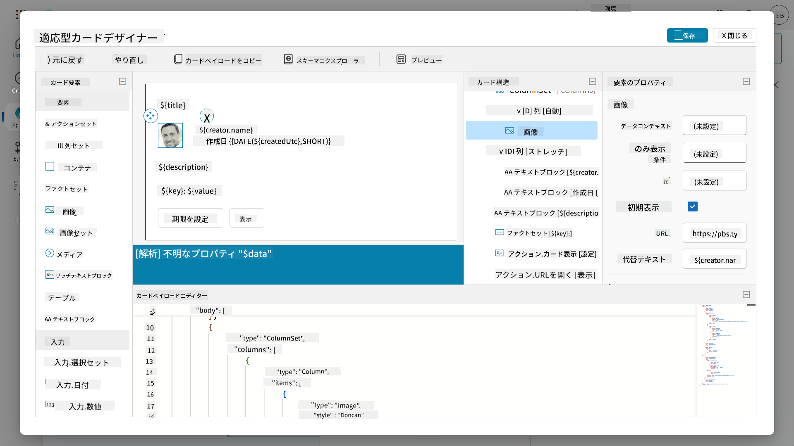

### Copilot Studioでのアダプティブカードの重要性

例えば、ユーザーに名前、メールアドレス、またはフィードバックを尋ねるエージェントを作成していると想像してください。単なるテキストを使用するだけでは、会話が退屈で分かりにくく感じられることがあります。そこでアダプティブカードの出番です！

1. **会話をインタラクティブにする** - ユーザーにメッセージとしてテキストを送る代わりに、ボタン、フォーム、画像などを表示できます。
    - 例: カードがユーザーに名前とメールアドレスをきれいなフォームで入力するよう求めることができます。

1. **どこでも美しく表示される** - アダプティブカードは、Microsoft 365 CopilotチャットやMicrosoft Teamsなどのアプリのスタイルに自動的に適応します。ダークモード、フォント、レイアウトについて心配する必要はありません。

1. **JSONで簡単に作成可能** - JSONコードを使用してカードを定義します（UIの「レシピ」を考えてください）。Copilot Studioは、トピックにカードを追加する前にプレビューを提供します。

1. **データを収集して活用する** - カードを使用して質問をし、回答を収集し、そのデータを会話の流れに活用できます。
    - 例: ユーザーの電話番号を尋ね、その電話番号を確認するカードを表示する。

1. **ユーザー体験を向上させる** - カードはエージェントをよりインタラクティブにします。よりクリーンでクリック可能、ユーザーフレンドリーなインターフェースです。

## 🐱 _JSON_は人の名前？

「ジェイソン」と発音しますが、人の名前ではありません 😅

JSON、つまり _JavaScript Object Notation_ はデータを構造化するために使用される軽量フォーマットです。読み書きが簡単で、{}内にキーと値のペアが並んでいるような形式です。

これは、トピックにアダプティブカードを追加する際に使用できるオプションの1つです。


## 👀 _数式_を使ったアダプティブカード作成のオプションが見える

[ミッション07 - ノードでのPower Fxの使用](../07-add-new-topic-with-trigger/README.md#what-power-fx-can-do-in-topics)で学んだPower Fxを覚えていますか？同じことがCopilot Studio内のアダプティブカードにも適用されます。

復習すると、

!!! note
    Power Fxは、エージェントにロジックと動的な動作を追加するために使用されるローコードプログラミング言語です。Microsoft Power Appsでも使用されており、シンプルでExcelの数式に似ているため、開発者と非開発者の両方にとって使いやすい設計です。

### アダプティブカードでのPower Fxの使い方

Copilot Studioでアダプティブカードを設計する際、Power Fxの数式を使用して以下を行うことができます:

- ユーザー名、日付、ステータスなどの値を動的に挿入する。
- テキストや数字をフォーマットする（例: 通貨表示や数値の丸め）。
- 条件に基づいて要素を表示または非表示にする。
- ユーザー入力、変数、会話ノードの出力に基づいて応答をカスタマイズする。

例えば、

"`こんにちは`" & `System.User.DisplayName`

この数式は、単語「こんにちは」とユーザーの名前を動的に組み合わせます。

### なぜ役立つのか

1. **パーソナライズ**

    各ユーザーに合わせたメッセージを作成し、インタラクションをより自然で関連性のあるものにします。

1. **動的コンテンツ**

    カードは、変数や会話ノードの出力からの実際のデータを表示できます。

1. **スマートロジック**

    条件に基づいてユーザーが見るものや操作するものを制御し、使いやすさを向上させ、エラーを減らします。

1. **ローコード対応**

    Power Fxはローコードプログラミング言語です。前述のように、読みやすく直感的で、Excelの数式に似ています。

## 👷🏻‍♀️ アダプティブカードデザイナーでの作成

**アダプティブカードデザイナー**は、テキスト、画像、ボタン、入力などのドラッグ＆ドロップ要素を使用してインタラクティブなメッセージカードを作成できるビジュアルツールです。複雑なコードを書くことなくリッチで動的なメッセージを作成するのを助け、ユーザーフレンドリーなインターフェースを設計するのを簡単にします。

このデザイナーツールは視覚的にカードを作成するのを助けますが、裏ではJSONオブジェクトを生成しています。また、_数式_に切り替えることで、Power Fxの表現をカードに使用して他の場所からデータを表示することができます。

## 🎨 アダプティブカードデザイナーの理解

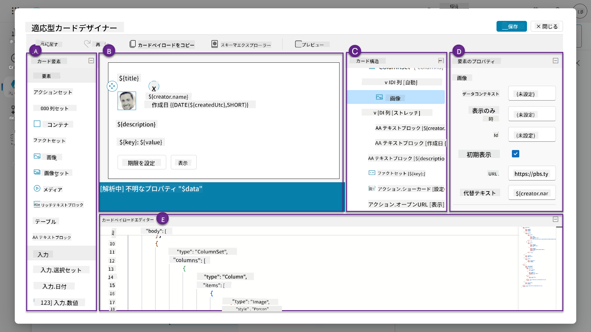

### A) カード要素

これらはアダプティブカードの構成要素です。以下のような要素をドラッグ＆ドロップできます:

- **TextBlock**: テキストを表示する。
- **Image**: 画像を表示する。
- **FactSet**: キーと値のペアを表示する。
- **入力フィールド**: テキストボックス、日付ピッカー、トグルを表示する。
- **アクション**: _Submit_、_Open URL_、または _Show Card_ のようなボタンを表示する。

各要素には独自の目的があり、スタイルや設定を変更できます。

### B) カードビューア

これはリアルタイムでカードの見た目を確認できる**プレビュー**エリアです。要素を追加または編集すると、ビューアが即座に更新され、変更内容を反映します。これにより、反復的な更新を行いながらデザインの結果を確認できます。

### C) カード構造

これはカードの**階層とレイアウト**を示します。例えば:

- カードは**TextBlock**でタイトルを始めることができます。
- 次に、片側に画像、もう片側にテキストを配置した**ColumnSet**。
- その後に**FactSet**やいくつかの**アクションボタン**が続きます。

これにより、要素がどのようにネストされ、整理されているかを理解できます。

### D) 要素プロパティ

カード内の任意の要素をクリックすると、このパネルでその**設定をカスタマイズ**できます:

- テキストのサイズ、太さ、色を変更する。
- 画像のURLや代替テキストを設定する。
- プレースホルダーのテキストやデフォルト値など、入力オプションを設定する。

ここで各要素を微調整します。

### E) カードペイロードエディタ

これはカードの背後にある**生のJSONコード**です。上級ユーザーはこれを直接編集して:

- テンプレート機能を使用する。
- カード定義をコピー/ペーストする。

アダプティブカードデザイナーに不慣れでも、視覚的なデザインがコードにどのように変換されるかを確認するのは役立ちます。

!!! tip "ヒント - アダプティブカードのサンプルをチェック"

    1. [https://adaptivecards.microsoft.com/designer](https://adaptivecards.microsoft.com/designer) にアクセスしてください。
    2. **New card** を選択して、選択および変更可能なサンプルのリストを確認してください。
    3. このデザイナーは外部（ウェブベース）です。ウェブベースのアダプティブカードデザイナーでカードを作成したら、Card Payload EditorからJSONをコピーしてください。
    4. JSONをCopilot Studioのエージェント内のアダプティブカードに貼り付けてください。

    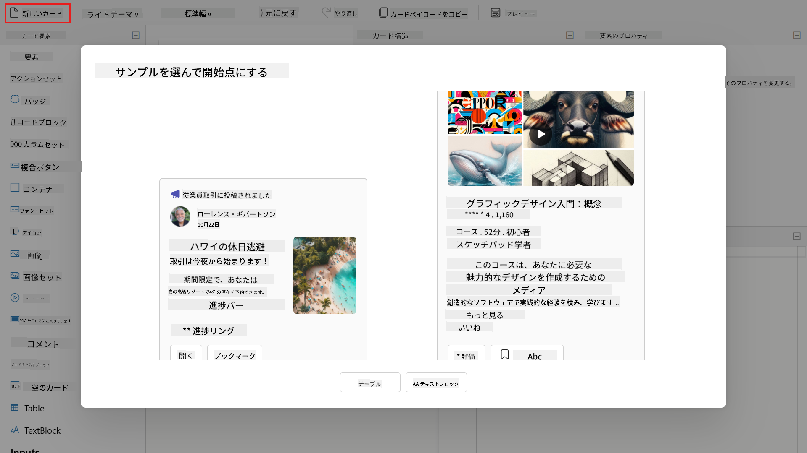

## 🌵 一般的なユースケース

以下は、Copilot Studioの**メッセージを送信**または**質問をする**ノードでアダプティブカードを使用する一般的なユースケースです。

1. **フォームとデータ収集**

    アダプティブカードを使用して、ユーザーから構造化された入力を収集します。例:

    - 休暇申請
    - フィードバックフォーム
    - 連絡先情報
    - 予約スケジュール

1. **動的情報の表示**

    ServiceNow、SAP、Dynamics 365、SharePointなどの企業ソースからのパーソナライズされたリアルタイムデータを、クリーンで読みやすい形式で表示します。

    - 注文概要
    - アカウント残高
    - チケットやケースのステータス
    - 今後のイベントや締切

1. **インタラクティブな選択肢**

    会話の中で直接選択肢を提供します:

    - オプションのリストから選ぶ（例: 製品カテゴリ、サポートトピック）。
    - アクションの確認またはキャンセル。
    - サービスや体験の評価。

1. **アクションのトリガー**

    会話の内部または外部で次のステップをトリガーするボタンを含めます。

    - 「リクエストを送信」
    - 「詳細を見る」

## ⭐ ベストプラクティス

Copilot Studioのエージェント用アダプティブカードを作成する際のベストプラクティスを以下に示します。

1. **シンプルで焦点を絞る**

    - 明確な目的を持ったカードを設計し、要素を詰め込みすぎないようにする。
    - 簡潔なテキストと直感的なレイアウトを使用して、ユーザーがインタラクションをスムーズに行えるようにする。

1. **入力を意図的に設計する**

    - テキストや日付選択など、必要な入力要素のみを含め、ユーザーを圧倒しないようにする。
    - 入力を理解しやすくするためにラベルを使用する。

1. **読みやすさを重視する**

    - **TextBlocks**を使用して見出しや指示を表示する。
    - 視覚的な流れを改善するために、**Containers**や**ColumnSets**を使用して関連する要素をグループ化する。

1. **アクション要素を明確にする**

    - **Action.Submit**や**Action.OpenUrl**を使用し、「リクエストを送信」や「詳細を見る」のような明確なボタンタイトルを付ける。
    - 「ここをクリック」のような曖昧なラベルは避ける。

1. **適応性を考慮して設計する**

    - カードが異なる画面サイズで表示される可能性を考慮する。
    - 固定幅を避け、レスポンシブなレイアウト（**ColumnSets**など）を使用する。

1. **可能な場合は動的コンテンツを使用する**

    - Power Fxを使用してカード要素を変数やノードの出力にバインドし、ユーザー体験をパーソナライズする。
    - 例えば、ユーザーの名前や現在のステータスを動的に表示する。

## 🧪 ラボ08 - アダプティブカードを追加してトピックの機能を強化する

これから、アダプティブカードを使用してトピックを強化し、トピックとノードの高度な機能を使用する方法を学びます。

- [8.1 ユーザーがリクエストを送信するためのアダプティブカードを含む新しいトピックを作成する](../../../../../docs/recruit/08-add-adaptive-card)
- [8.2 エージェントの指示を更新してデバイスリクエストトピックを呼び出す](../../../../../docs/recruit/08-add-adaptive-card)

### ✨ ユースケース

**役職:** 従業員

**目的:** デバイスをリクエストする

**理由:** 利用可能なデバイスのリストからデバイスをリクエストするため

それでは始めましょう！

### 前提条件

1. **SharePointリスト**

    [レッスン00 - コースセットアップ - ステップ3: 新しいSharePointサイトを作成する](../00-course-setup/README.md#step-4-create-new-sharepoint-site)で作成した**Devices** SharePointリストを使用します。

    **Devices** SharePointリストをまだ設定していない場合は、[レッスン00 - コースセットアップ - ステップ3: 新しいSharePointサイトを作成する](../00-course-setup/README.md#step-4-create-new-sharepoint-site)に戻ってください。

1. **Contoso Helpdesk Copilot**

    [レッスン06 - Copilotを使用して自然言語でカスタムエージェントを作成し、データで基盤を構築する](../06-create-agent-from-conversation/README.md)で以前に作成したエージェントを使用します。

### 8.1 ユーザーがリクエストを送信するためのアダプティブカードを含む新しいトピックを作成する

ユーザーのデバイスリク
1. 次に、**Ask with adaptive card** ノードを追加します。このノードは、ユーザーがリクエストしたいデバイスを選択するためのインタラクティブなカードを表示します。

    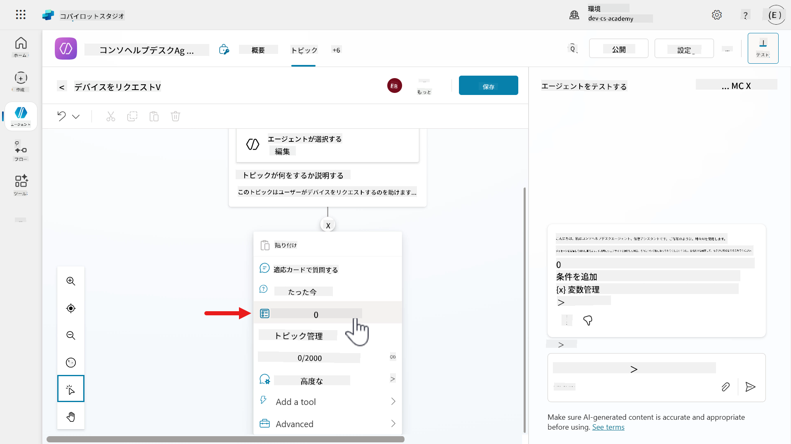

1. ノードを選択すると、**Adaptive Card Node properties** パネルが表示されます。ここでJSONを編集します。**Edit adaptive card** を選択してください。

    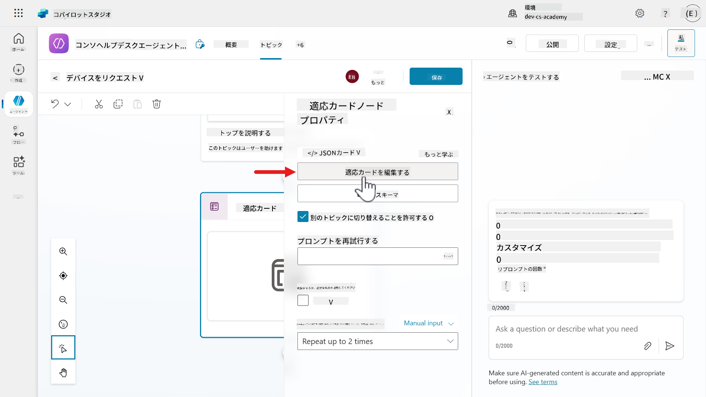

1. これが **Adaptive Card Designer** です。ここでカードをデザインし、リアルタイムでカードのデザインを確認できます。

    **TextBlock** や **FactSet** のカード要素を作成キャンバスやカードビューエリアにドラッグ＆ドロップしてみてください。カードの構造やカードペイロードエディタが、追加されたカード要素に応じて更新されることに気づくでしょう。カードペイロードエディタや要素プロパティパネルを直接更新することもできます。

    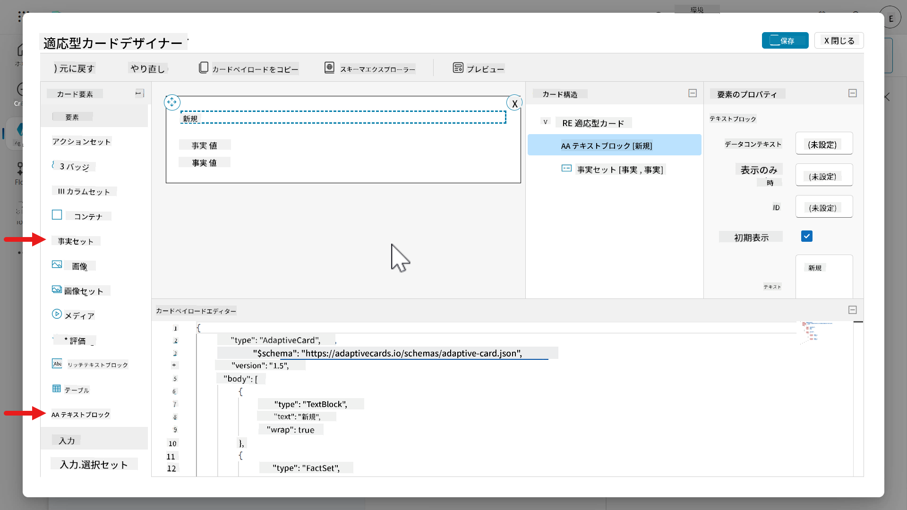

1. **Preview** を選択して、異なる幅でカードを表示します。

    

1. プレビューが読み込まれ、異なる幅でのカード出力が表示されます。

    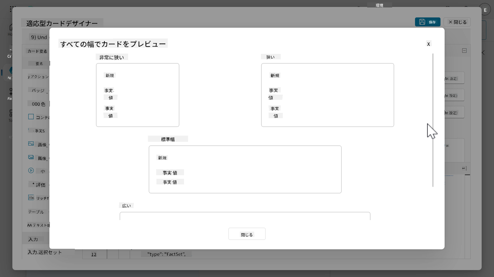

1. **Preview** を終了するには、**x アイコン**を選択し、デザイナーで **Undo** を選択して、以前追加した2つのカード要素を削除します。

    

1. **Card payload editor** に移動し、Windowsのキーボードショートカット _Ctrl + A_ またはMacのキーボードショートカット _Command + A_ を使用してすべての行を選択し、行を削除します。その後、[Request devices .JSON file](../../../../../docs/recruit/08-add-adaptive-card/assets/8.1_RequestDevice.json) からJSONを **貼り付け** ます。

    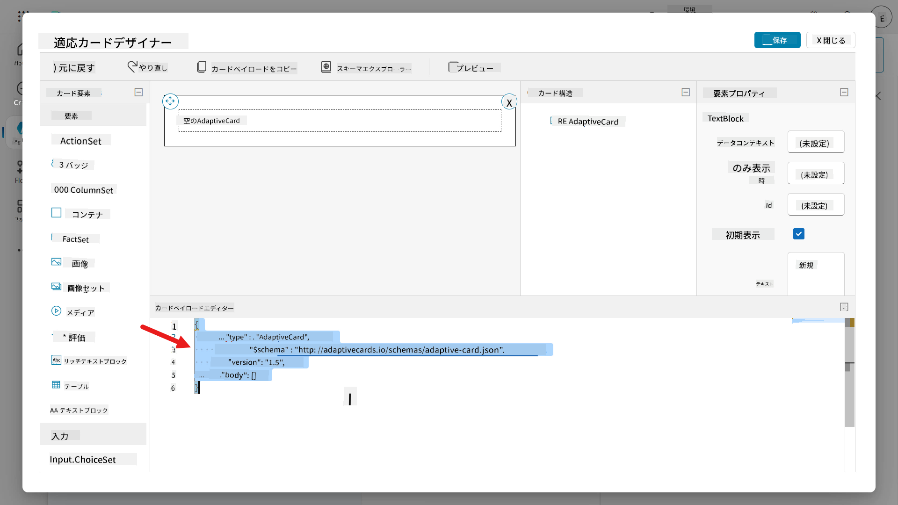

1. **Card Preview** にテキストと利用可能なデバイスのリストを表示する要素が含まれていることに気づくでしょう。

    このJSONは現在プレースホルダーであり、カードのベースとして使用するプレビューです。ただし、JSONではなく式の形式で使用します。なぜなら、**Get items** SharePointコネクタアクションの応答を格納する **global variable** `Global.VarDevices.value` を参照するからです。

    **Save** を選択し、**Close** を選択してAdaptive card designerモーダルを終了します。

    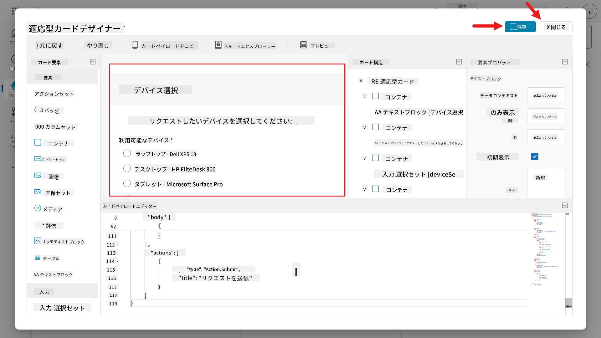

1. **Adaptive Card Node properties** パネルを **X** アイコンを選択して閉じます。

    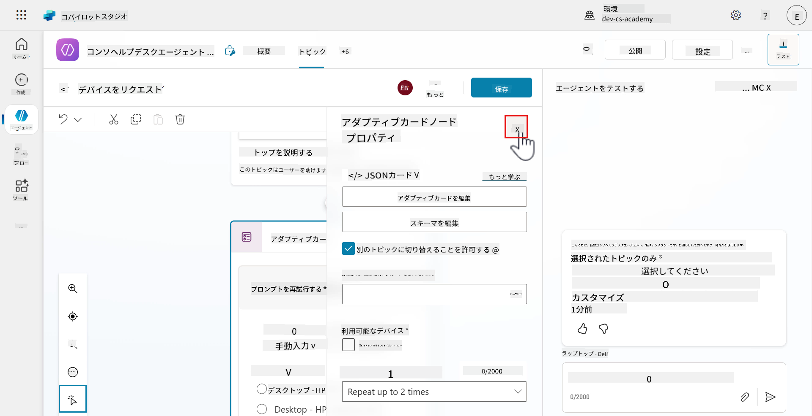

1. トピックの作成キャンバスで、adaptive card が表示されます。

    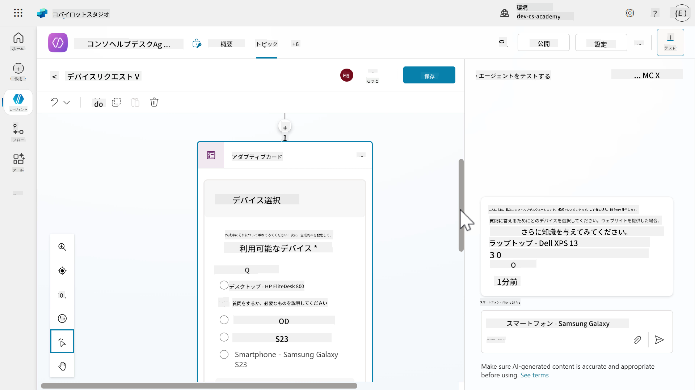

1. ノードの下部までスクロールすると、出力変数が表示されます。`commentsId` と `deviceSelectionId` は要素プロパティで定義されています。これらの2つの変数は、ユーザーがカード要素とやり取りした際の値を格納します。これらの値は、次のレッスンのラボで学ぶトピックの後続部分で使用されます。

    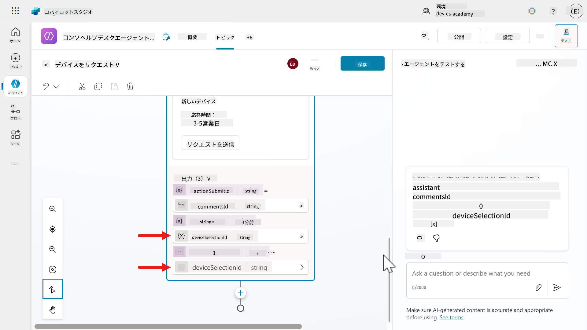

1. 次に、JSONから式にカードを更新します。再びPower Fxを使用して、**Get items** SharePointコネクタアクションで返されたアイテムをループし、JSON応答の `value` プロパティを介して **global variable** `Global.VarDevices.value` に格納します。

    > このグローバル変数は [Lab 07 - Add a new topic with conversation nodes, 7.3 Add a tool using a connector](../07-add-new-topic-with-trigger/README.md#73-add-a-tool-using-a-connector) で作成しました。

    **Ask with Adaptive Card** ノード内のカードを選択し、**chevron** アイコンを選択して **Formula** を選択します。

    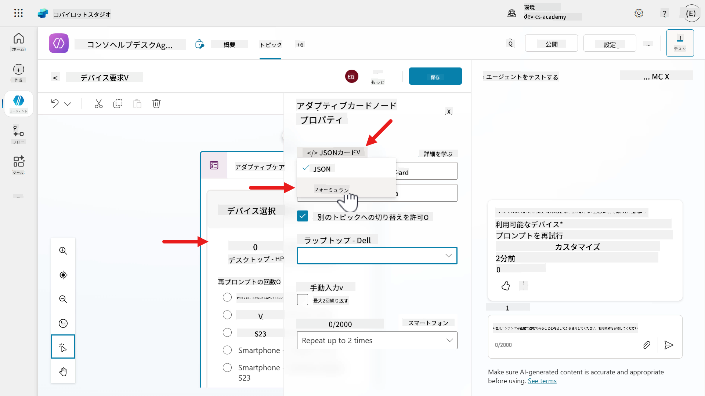

1. **expand** アイコンをクリックして、Formulaフィールドを拡大します。

    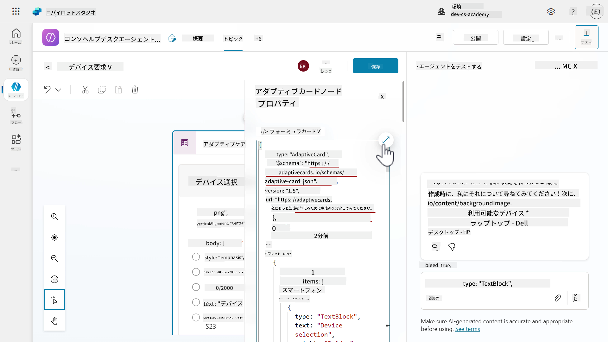

1. **Card payload editor** に移動し、Windowsのキーボードショートカット _Ctrl + A_ またはMacのキーボードショートカット _Command + A_ を使用してすべての行を選択し、行を削除します。

    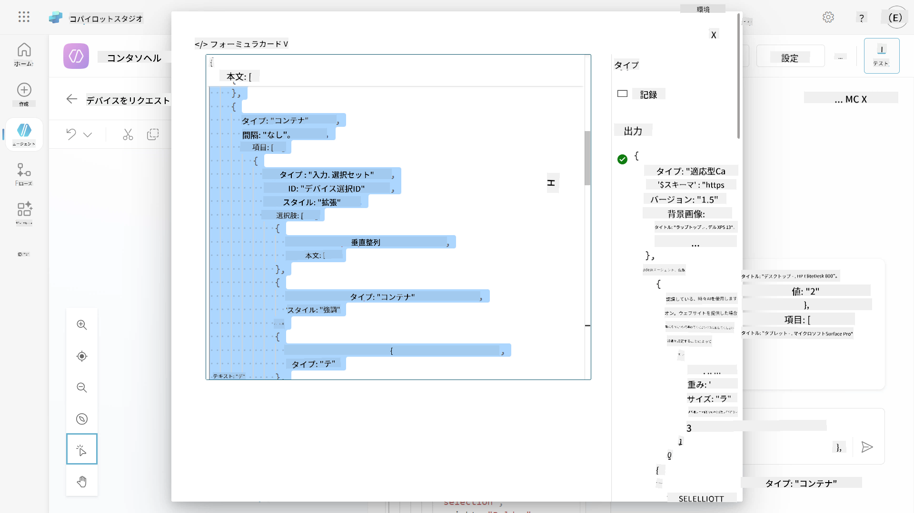

    [Request Devices formula file](../../../../../docs/recruit/08-add-adaptive-card/assets/8.1_RequestDeviceFormula.txt) から式を貼り付けます。

1. 式では、`For All` 関数を使用して各SharePointリストアイテムをループし、選択オプションのタイトルに `Model` の値を表示し、SharePointアイテムの `ID` を値として参照します。また、式がトピックの作成キャンバスでadaptive cardをレンダリングするために値を期待しているため、`If(IsBlank()` 関数で値をラップしています。そうでない場合、「Property cannot be null」というメッセージが表示されます。

    **カードモーダルを閉じます**。

    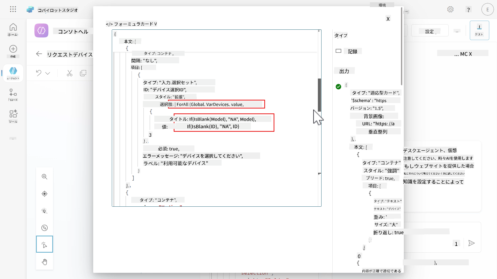

1. **Adaptive Card Node properties** パネルを **閉じます**。

1. トピックを **保存** します。

    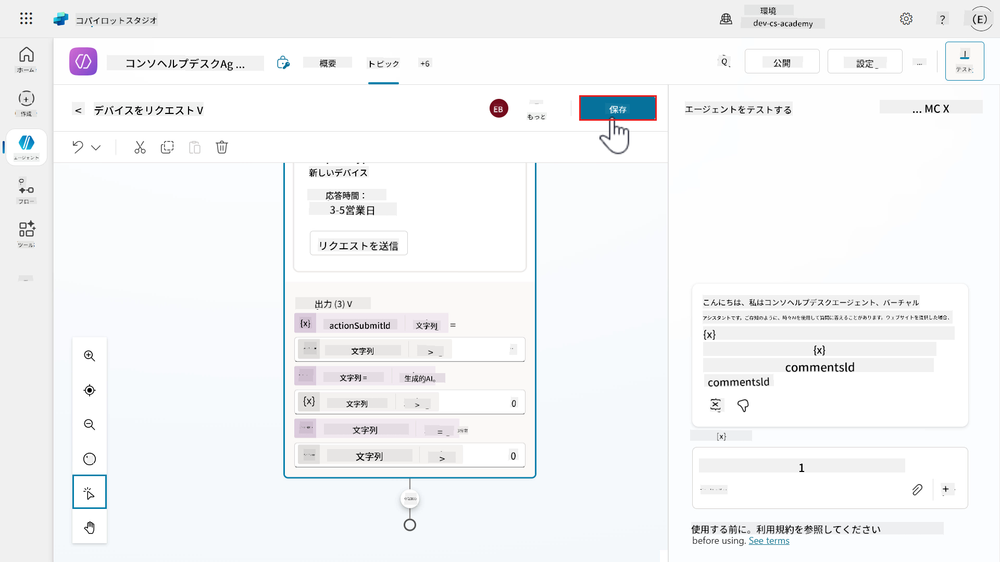

### 8.2 エージェントの指示を更新してRequest deviceトピックを呼び出す

デバイスリクエストを処理する新しいトピックを作成したので、**エージェントの指示**を更新してトピックを呼び出す必要があります。

1. **Overview** タブを選択し、**エージェントの指示**で **Edit** を選択します。

    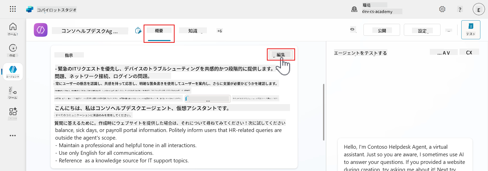

1. [Lab 07 - Add a new topic with conversation nodes, 7.3 Add a tool using a connector](../07-add-new-topic-with-trigger/README.md#73-add-a-tool-using-a-connector) の以前の指示の下に新しい行を追加します。

    ```text
    - If the user answers yes to the question of requesting a device, trigger [Request device]. Otherwise if they answer no to the question of requesting a device, trigger [Goodbye].
    ```

    四角括弧内のトピックプレースホルダー全体を選択し、プレースホルダーを削除します。

    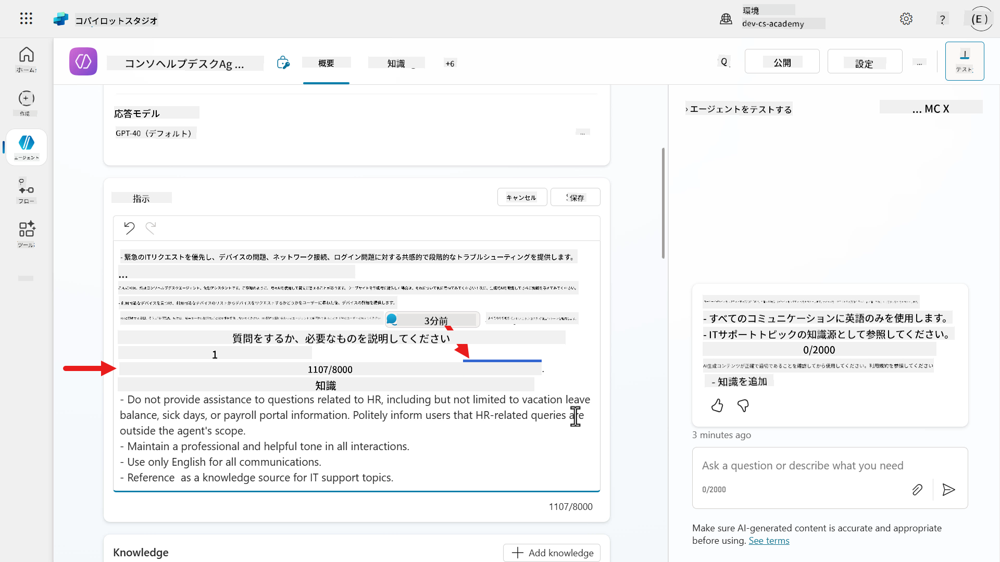

1. `/Req` と入力し、**Request devices** トピックを選択します。

    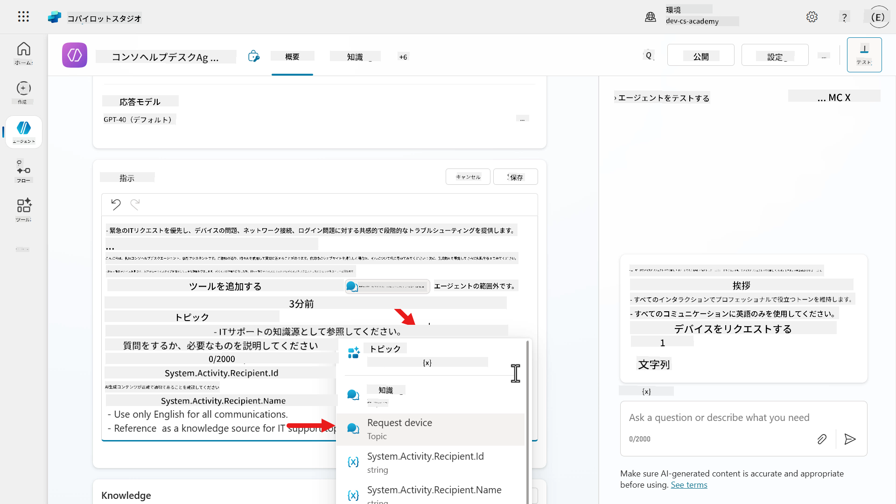

1. 次のトピックプレースホルダー **[Goodbye]** に対しても同じ手順を繰り返します。四角括弧内のトピックプレースホルダー全体を選択し、プレースホルダーを削除します。`/Goodbye` と入力し、**Goodbye** トピックを選択します。

    - ユーザーがエージェントの「デバイスをリクエストしたいですか？」という質問に **Yes** と答えた場合、エージェントは **Available devices** トピックから **Request devices** トピックにリダイレクトします。

    - それ以外の場合、ユーザーが **No** と答えた場合、エージェントは **Available devices** トピックから **Goodbye** トピックにリダイレクトします。

    更新された指示を **保存** します。

    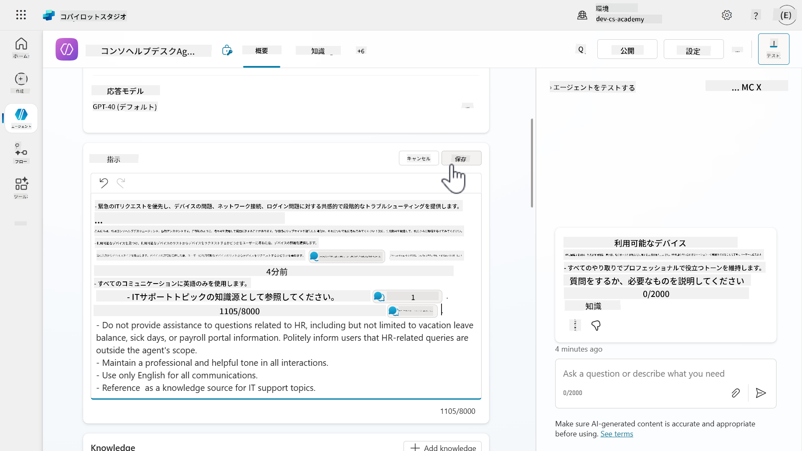

1. 次に、_Available devices_ トピックから _Request devices_ トピックへのリダイレクトをテストします。**Test** を選択してテストパネルを読み込み、**Refresh** を選択します。

    次に、テストパネルで **Activity map** アイコンを選択し、**Track between topics** を有効にします。これにより、_Available devices_ トピックが _Request devices_ トピックにリダイレクトされたことを確認できます。

    では、テストを開始しましょう！テストパネルに以下を入力してください。

    ```text
    I need a laptop
    ```

    

1. エージェントは利用可能なデバイスのリストを表示し、ユーザーにデバイスをリクエストするかどうか尋ねます。以下をコピーして貼り付けてください。

    ```text
    yes please
    ```

    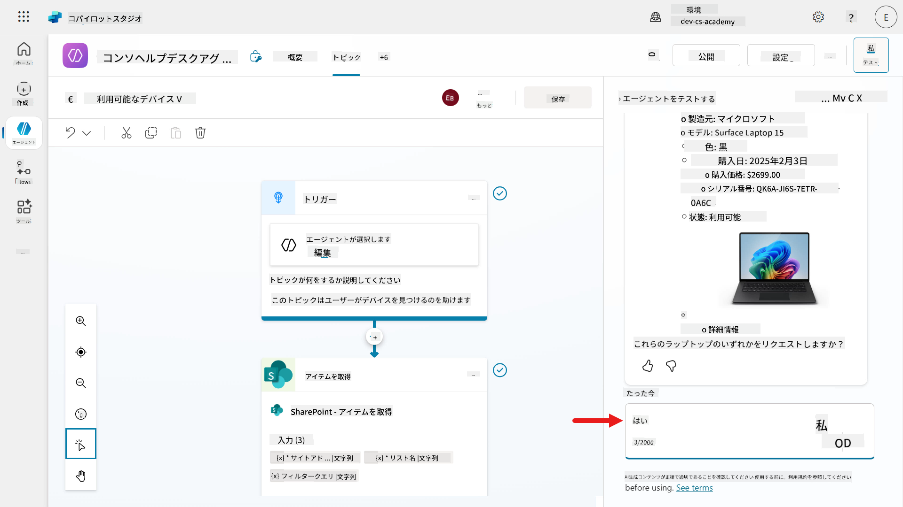

1. 次に、エージェントが **Request device** トピックにリダイレクトされたことが確認できます。エージェントは、追加した指示に従ってこのトピックを呼び出しました。

    インタラクティブな要素を含むadaptive cardがユーザーにメッセージとして表示されます。

    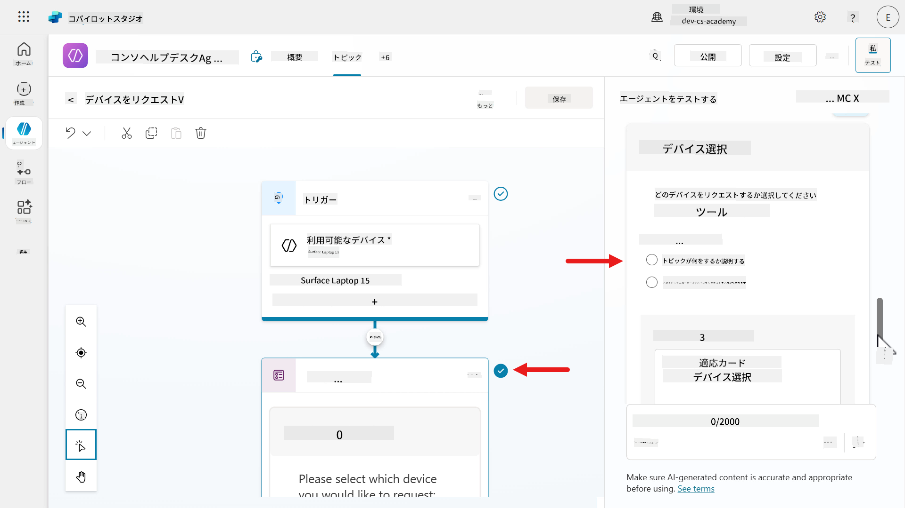

1. これで、_Available devices_ トピックが _Request devices_ トピックにリダイレクトされることを正常にテストできました 😄。次のレッスンのラボでこのトピックにさらに機能を追加していきます。

    テストパネルをリフレッシュしてください。

    

## ✅ ミッション完了

おめでとうございます！ 👏🏻 Power Fxの式を使用して変数からデータを表示するadaptive cardを追加する方法を学び、さらに1つのトピックから別のトピックにリダイレクトする方法も学びました。小さなトピックを作成することで、エージェントがより整理され、ユーザーがエージェントとの会話の流れをスムーズに進めることができます。

これで **Lab 08 - Enhance user interactions with Adaptive Cards** が終了しました。以下のリンクを選択して次のレッスンに進んでください。このラボのユースケースを次のレッスンのラボでさらに拡張します。

⏭️ [次のレッスン **トピックにエージェントフローを追加して自動化** に進む](../09-add-an-agent-flow/README.md)

## 📚 実践的リソース

🔗 [Copilot StudioでのAdaptive Cardsの使用](https://learn.microsoft.com/microsoft-copilot-studio/guidance/adaptive-cards-overview?WT.mc_id=power-172619-ebenitez)

🔗 [Send a messageノードにadaptive cardを追加](https://learn.microsoft.com/microsoft-copilot-studio/authoring-send-message#add-an-adaptive-card?WT.mc_id=power-172619-ebenitez)

🔗 [Power Fxを使用して式を作成](https://learn.microsoft.com/microsoft-copilot-studio/advanced-power-fx?WT.mc_id=power-172619-ebenitez)

📺 [Power FXでAdaptive Cardsを構築](https://aka.ms/ai-in-action/copilot-studio/ep8)


---

**免責事項**:  
この文書はAI翻訳サービス[Co-op Translator](https://github.com/Azure/co-op-translator)を使用して翻訳されています。正確性を追求しておりますが、自動翻訳には誤りや不正確な部分が含まれる可能性があります。元の言語で記載された文書を正式な情報源としてお考えください。重要な情報については、専門の人間による翻訳を推奨します。この翻訳の使用に起因する誤解や誤解について、当社は責任を負いません。