<!--
CO_OP_TRANSLATOR_METADATA:
{
  "original_hash": "4fb913dfc3bbc71506dd3602c4b8e6ed",
  "translation_date": "2025-10-21T23:45:43+00:00",
  "source_file": "docs/operative-preview/02-multi-agent/README.md",
  "language_code": "ko"
}
-->
# 🚨 미션 02: 연결된 에이전트

--8<-- "disclaimer.md"

## 🕵️‍♂️ 코드명: `작전 심포니`

> **⏱️ 작전 시간:** `~45분`

## 🎯 미션 개요

다시 만나서 반갑습니다, 에이전트님. 미션 01에서 당신은 주요 채용 에이전트를 구축하여 채용 워크플로우를 관리할 수 있는 탄탄한 기반을 마련했습니다. 하지만 한 명의 에이전트로는 한계가 있습니다.

이번 임무는 **작전 심포니**입니다. 단일 에이전트를 **다중 에이전트 시스템**으로 변환하는 것입니다. 이는 복잡한 채용 문제를 처리하기 위해 전문화된 에이전트 팀을 조직화하여 협력하게 만드는 것입니다. 마치 솔로 연주자에서 전문화된 태스크 포스를 지휘하는 지휘자로 업그레이드하는 것과 같습니다.

심포니 오케스트라에서 각 음악가가 완벽한 조화를 이루며 자신의 역할을 수행하는 것처럼, 기존의 채용 에이전트에 두 명의 중요한 전문가를 추가하게 됩니다: 이력서를 자동으로 처리하는 **지원서 접수 에이전트**와 포괄적인 면접 자료를 준비하는 **면접 준비 에이전트**. 이 에이전트들은 주요 오케스트레이터 아래에서 매끄럽게 협력하게 됩니다.

## 🔎 목표

이번 미션에서 배우게 될 내용:

1. **하위 에이전트**와 **연결된 에이전트**를 사용하는 시점
1. **확장 가능한 다중 에이전트 아키텍처** 설계 방법  
1. 특정 작업에 집중하는 **하위 에이전트** 생성
1. 에이전트 간 **통신 패턴** 설정
1. 지원서 접수 에이전트와 면접 준비 에이전트 구축

## 🧠 연결된 에이전트란?

Copilot Studio에서는 단일, 단일체 에이전트만 구축하는 데 제한되지 않습니다. **다중 에이전트 시스템**을 생성할 수 있습니다. 이는 복잡한 워크플로우를 처리하기 위해 협력하는 전문화된 에이전트 네트워크입니다.

실제 조직처럼, 한 사람이 모든 일을 하는 대신 특정 작업에 뛰어난 전문가들이 필요할 때 협력하는 방식입니다.

### 다중 에이전트 시스템이 중요한 이유

- **확장성:** 각 에이전트는 서로 다른 팀에 의해 독립적으로 개발, 테스트, 유지보수될 수 있습니다.  
- **전문성:** 에이전트는 자신이 가장 잘하는 일에 집중할 수 있습니다. 예를 들어 데이터 처리, 사용자 상호작용, 의사결정 등.  
- **유연성:** 에이전트를 혼합하고 매칭하여 프로젝트에 재사용하거나 시스템을 점진적으로 발전시킬 수 있습니다.  
- **유지보수성:** 한 에이전트의 변경 사항이 다른 에이전트에 영향을 미치지 않아 업데이트가 더 안전하고 쉬워집니다.

### 실제 사례: 채용 프로세스

채용 워크플로우를 고려해보면, 여러 에이전트가 다음과 같은 책임을 가지고 협력할 수 있습니다:

- **이력서 접수**는 문서 파싱 및 데이터 추출 기술이 필요합니다.
- **점수화**는 후보자의 이력서를 평가하고 직무 요구사항과 일치시키는 작업을 포함합니다.
- **면접 준비**는 후보자 적합성에 대한 깊은 분석이 필요합니다.  
- **후보자 커뮤니케이션**은 공감 능력이 요구됩니다.

이 모든 다양한 기술을 처리하려고 하는 거대한 에이전트를 구축하는 대신, 각 영역에 전문화된 에이전트를 생성하고 이를 함께 조율할 수 있습니다.

## 🔗 하위 에이전트 vs 연결된 에이전트: 주요 차이점

Copilot Studio는 각각의 고유한 사용 사례를 가진 다중 에이전트 시스템을 구축하는 두 가지 방법을 제공합니다:

### ↘️ 하위 에이전트

하위 에이전트는 주요 에이전트 내에 존재하는 **경량화된 전문가**입니다. 이를 같은 부서 내의 전문화된 팀으로 생각할 수 있습니다.

#### 주요 기술적 세부사항

- 하위 에이전트는 부모 에이전트 내에 존재하며 단일 구성 페이지를 가집니다.
- 도구와 지식은 **부모 에이전트에 저장**되며, 하위 에이전트에 "사용 가능"으로 설정됩니다.
- 하위 에이전트는 부모 에이전트의 **주제를 공유**합니다. 주제는 하위 에이전트 지침에서 참조될 수 있습니다.
- 하위 에이전트는 **별도의 게시가 필요하지 않습니다**. 생성되면 부모 에이전트 내에서 자동으로 사용 가능하며, 이는 테스트를 더 쉽게 만듭니다. 부모와 하위 에이전트의 변경 사항은 **같은 공유 작업 공간**에서 수행될 수 있습니다.

#### 하위 에이전트를 사용할 때

- 단일 팀이 전체 솔루션을 관리할 때
- 도구와 지식을 논리적으로 하위 에이전트로 조직하고 싶을 때
- 각 에이전트에 대해 별도의 인증이나 배포가 필요하지 않을 때
- 에이전트를 별도로 게시하거나 독립적으로 사용하지 않을 때
- 여러 솔루션에서 에이전트를 재사용할 필요가 없을 때

**예시:** IT 헬프데스크 에이전트가 다음을 위한 하위 에이전트를 가질 때:

- 비밀번호 재설정 절차
- 하드웨어 문제 해결  
- 소프트웨어 설치 가이드

### 🔀 연결된 에이전트

연결된 에이전트는 주요 에이전트와 협력할 수 있는 **완전한 독립형 에이전트**입니다. 이를 프로젝트에서 협력하는 별도의 부서로 생각할 수 있습니다.

#### 주요 기술적 세부사항

- 연결된 에이전트는 **자신만의 주제**와 대화 흐름을 가집니다. 독립적으로 작동하며 고유한 설정, 논리, 배포 라이프사이클을 가집니다.
- 연결된 에이전트는 **게시되어야** 다른 에이전트에 추가되고 사용될 수 있습니다.
- 테스트 중에는 연결된 에이전트의 변경 사항이 게시되어야 호출하는 에이전트에서 사용할 수 있습니다.

#### 연결된 에이전트를 사용할 때

- 여러 팀이 서로 다른 에이전트를 독립적으로 개발하고 유지보수할 때
- 에이전트가 고유한 설정, 인증, 배포 채널을 필요로 할 때
- 각 에이전트를 별도로 게시하고 유지보수하며 독립적인 애플리케이션 라이프사이클 관리(ALM)가 필요할 때
- 여러 솔루션에서 에이전트를 재사용해야 할 때

**예시:** 고객 서비스 시스템이 다음과 연결될 때:

- 재무 팀이 유지보수하는 별도의 청구 에이전트
- 제품 팀이 유지보수하는 별도의 기술 지원 에이전트
- 운영 팀이 유지보수하는 별도의 반품 에이전트

!!! tip "팁"
    두 가지 접근 방식을 혼합할 수도 있습니다! 예를 들어, 주요 에이전트는 다른 팀의 외부 에이전트와 연결되면서도 내부 작업을 위한 자체 하위 에이전트를 가질 수 있습니다.

## 🎯 다중 에이전트 아키텍처 패턴

다중 에이전트 시스템을 설계할 때, 에이전트 간 상호작용 방식에 따라 여러 패턴이 나타납니다:

| 패턴                | 설명                                                                 | 적합한 경우                                                   |
|----------------------|---------------------------------------------------------------------|---------------------------------------------------------------|
| **허브 앤 스포크**   | 주요 오케스트레이터 에이전트가 여러 전문화된 에이전트를 조율합니다. 오케스트레이터는 사용자 상호작용을 처리하고 하위 또는 연결된 에이전트에 작업을 위임합니다. | 주요 에이전트가 전문화된 작업을 조율하는 복잡한 워크플로우 |
| **파이프라인**       | 에이전트가 작업을 순차적으로 전달하며 각 단계에서 가치를 추가한 후 다음 단계로 전달합니다. | 지원서 처리(접수 → 스크리닝 → 면접 → 결정)와 같은 선형 프로세스 |
| **협력형**           | 에이전트가 동일한 문제의 다른 측면을 동시에 작업하며, 컨텍스트와 결과를 공유합니다. | 여러 관점이나 전문 분야가 필요한 복잡한 분석 |

!!! tip "팁"
    두 가지 이상의 패턴을 혼합한 하이브리드 형태도 가능합니다.

## 💬에이전트 간 통신 및 컨텍스트 공유

에이전트가 협력할 때, 정보를 효과적으로 공유해야 합니다. Copilot Studio에서는 다음과 같은 방식으로 작동합니다:

### 대화 기록

기본적으로, 주요 에이전트가 하위 또는 연결된 에이전트를 호출할 때 **대화 기록**을 전달할 수 있습니다. 이를 통해 전문화된 에이전트가 사용자가 논의한 내용을 완전히 이해할 수 있습니다.

보안 또는 성능상의 이유로 이를 비활성화할 수 있습니다. 예를 들어, 전문화된 에이전트가 전체 대화 컨텍스트 없이 특정 작업만 완료해야 할 때. 이는 **데이터 유출** 방어에 유용할 수 있습니다.

### 명시적 지침

주요 에이전트는 하위 또는 연결된 에이전트에 **특정 지침**을 제공할 수 있습니다. 예: "이 이력서를 처리하고 Senior Developer 역할에 대한 기술을 요약하세요."

### 반환 값

에이전트는 호출하는 에이전트로 구조화된 정보를 반환할 수 있으며, 이를 통해 주요 에이전트가 후속 단계에서 해당 정보를 사용하거나 다른 에이전트와 공유할 수 있습니다.

### Dataverse 통합

더 복잡한 시나리오에서는 에이전트가 **Dataverse** 또는 기타 데이터 저장소를 통해 정보를 공유하여 여러 상호작용 간에 지속적인 컨텍스트 공유를 가능하게 합니다.

## ↘️하위 에이전트: 지원서 접수 에이전트

다중 에이전트 채용 시스템을 구축하기 시작합시다. 첫 번째 전문가는 **지원서 접수 에이전트**입니다. 이는 들어오는 이력서와 후보자 정보를 처리하는 하위 에이전트입니다.

```mermaid
---
config:
  layout: elk
  look: neo
---
flowchart TB
 subgraph People["People"]
    direction TB
        HiringManager["Hiring Manager"]
        Interviewers["Interviewers"]
  end
 subgraph Agents["Agents"]
    direction LR
        ApplicationIntakeAgent["Application Intake Agent<br>(Child)"]
        InterviewAgent["Interview Agent<br>(Connected)"]
        HRAgent["HR Agent"]
  end
    HiringManager -- Upload CV --> HRAgent
    HRAgent -- Upload Resume, Create Candidate, Match to Job Roles --> ApplicationIntakeAgent
    ApplicationIntakeAgent -- Create Resume, Upsert Candidate, Create Job Application --> Dataverse["Dataverse"]
    ApplicationIntakeAgent -- Store Resume file in file column --> Dataverse
    HiringManager -- Ask for summaries --> HRAgent
    Interviewers -- Request interview pack --> HRAgent
    HRAgent -- Generate interview pack and summarize data --> InterviewAgent
    InterviewAgent -- Read all Candidate, Resume, Job Roles, Evaluation Criteria Data --> Dataverse
     HiringManager:::person
     Interviewers:::person
     ApplicationIntakeAgent:::agent
     InterviewAgent:::agent
     HRAgent:::agent
     Dataverse:::data
    classDef person fill:#e6f0ff,stroke:#3b82f6,color:#0b3660
    classDef agent fill:#e8f9ef,stroke:#10b981,color:#064e3b
    classDef data  fill:#f3f4f6,stroke:#6b7280,color:#111827
```

### 🤝지원서 접수 에이전트의 책임

- **이력서 내용 파싱**: 대화형 채팅을 통해 제공된 PDF에서 (향후 미션에서는 이력서를 자동으로 처리하는 방법을 배우게 됩니다).
- **구조화된 데이터 추출** (이름, 기술, 경력, 학력)
- **후보자를 개방된 역할에 매칭**: 자격 및 자기소개서를 기반으로
- **후보자 정보 저장**: Dataverse에 저장하여 이후 처리 가능
- **중복 지원 방지**: 동일한 후보자를 두 번 생성하지 않도록 이메일 주소를 사용하여 기존 기록과 매칭

### ⭐왜 하위 에이전트로 적합한가

지원서 접수 에이전트는 다음 이유로 하위 에이전트로 적합합니다:

- 문서 처리 및 데이터 추출에 특화되어 있음
- 별도의 게시가 필요하지 않음  
- 동일한 팀에서 관리하는 전체 채용 솔루션의 일부임
- 특정 트리거(새 이력서 수신)에 집중하며 채용 에이전트에서 호출됨

## 🔀연결된 에이전트: 면접 준비 에이전트  

두 번째 전문가는 **면접 준비 에이전트**입니다. 이는 포괄적인 면접 자료를 준비하고 후보자 응답을 평가하는 연결된 에이전트입니다.

### 🤝면접 준비 에이전트의 책임

- **면접 자료 생성**: 회사 정보, 역할 요구사항, 평가 기준 포함
- **면접 질문 생성**: 특정 역할과 후보자 배경에 맞춘 질문
- **일반 질문 답변**: 직무 역할 및 지원에 대한 이해관계자 커뮤니케이션

### ⭐왜 연결된 에이전트로 적합한가

면접 준비 에이전트는 다음 이유로 연결된 에이전트로 더 적합합니다:

- 인재 확보 팀이 여러 채용 프로세스에서 독립적으로 사용하고 싶어할 수 있음
- 면접 모범 사례와 평가 기준에 대한 자체 지식 기반이 필요함
- 각 채용 관리자가 팀에 맞게 행동을 맞춤화하고 싶어할 수 있음
- 외부 채용뿐만 아니라 내부 직책에도 재사용 가능

## 🧪실습 2.1: 지원서 접수 에이전트 추가

이제 이론을 실습으로 옮길 준비가 되었나요? 기존 채용 에이전트에 첫 번째 하위 에이전트를 추가해봅시다.

### 이 미션을 완료하기 위한 사전 조건

**다음 중 하나를** 준비해야 합니다:

- **미션 01을 완료**하고 채용 에이전트를 준비했거나, **OR**
- **미션 02 시작 솔루션을 가져오기**: 처음 시작하거나 따라잡아야 할 경우 [미션 02 시작 솔루션 다운로드](https://aka.ms/agent-academy)

!!! note "솔루션 가져오기 및 샘플 데이터"
    시작 솔루션을 사용하는 경우, 환경에 솔루션과 샘플 데이터를 가져오는 방법에 대한 자세한 지침은 [미션 01](../01-get-started/README.md)을 참조하세요.

### 2.1.1 솔루션 설정

1. Copilot Studio에서 왼쪽 탐색의 도구 아래에 있는 줄임표 (...)를 선택합니다.
1. **솔루션**을 선택합니다.  
    
1. Operative 솔루션을 찾아 **줄임표 (...)**를 선택한 다음 **선호 솔루션 설정**을 선택합니다. 이렇게 하면 모든 작업이 이 솔루션에 추가됩니다.  
    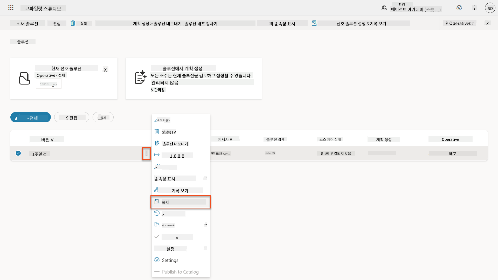

### 2.1.2 채용 에이전트 지침 구성

1. Copilot Studio로 **이동**합니다. 오른쪽 상단의 **환경 선택기**에서 환경이 선택되어 있는지 확인합니다.

1. 미션 01에서 생성한 **채용 에이전트**를 엽니다.

1. **개요** 탭의 **지침** 섹션에서 **편집**을 선택하고 다음 지침을 상단에 추가합니다:

    ```text
    You are the central orchestrator for the hiring process. You coordinate activities, provide summaries, and delegate work to specialized agents.
    ```

1. **저장**을 선택합니다.  
    

1. **설정**을 선택합니다 (오른쪽 상단).

1. 다음 설정을 확인합니다:

    | 설정 | 값 |
    |---------|-------|
    | 에이전트 응답에 생성 AI 오케스트레이션 사용 | **예** |
    | 콘텐츠 모더레이션 | **중간** |
    | 일반 지식 사용 | **끔** |
    | 웹 정보 사용 | **끔** |
    | 파일 업로드 | **켬** |


### 2.1.3 지원서 접수 하위 에이전트 추가

1. **채용 에이전트** 내 **에이전트** 탭으로 **이동**합니다. 여기에서 전문화된 에이전트를 추가할 수 있습니다.

1. **+ 추가**를 선택한 다음 **에이전트 생성**을 선택합니다. 이는 "*현재 에이전트 내에 존재하며 설정을 상속받는 경량화된 에이전트를 생성합니다. 복잡한 논리를 분해하는 데 이상적입니다*"로 표시됩니다.  
    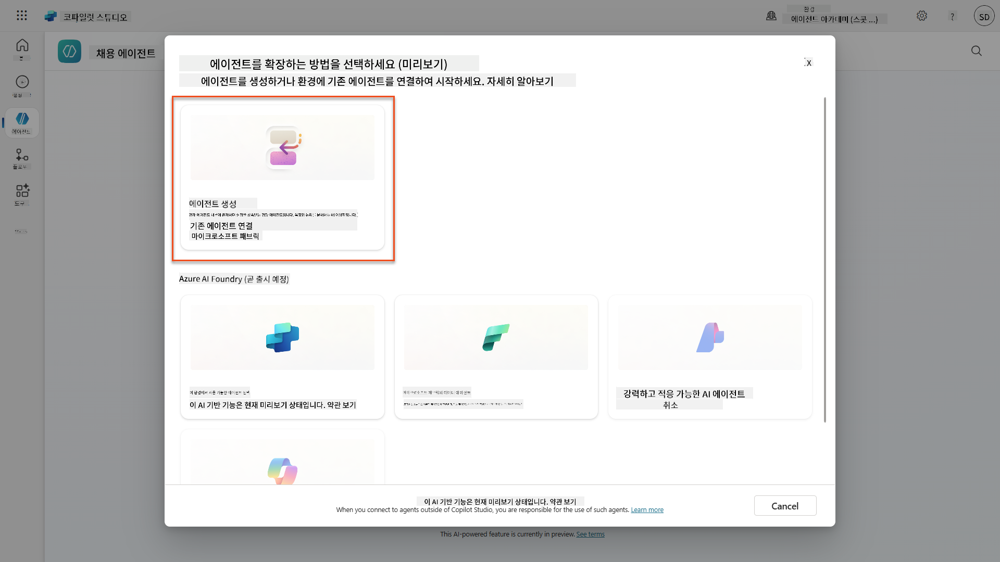

1. 에이전트 이름을 `지원서 접수 에이전트`로 **설정**합니다.

1. **사용 시점** 드롭다운에서 설명에 따라 **에이전트가 선택**을 선택합니다. 이러한 옵션은 주제에 대해 구성할 수 있는 트리거와 유사합니다.

1. **설명**을 다음으로 설정합니다:

    ```text
    Processes incoming resumes and stores candidates in the system
    ```

    

1. **고급**을 확장하고 우선순위를 `10000`으로 설정합니다. 이는 나중에 면접 에이전트가 일반 질문에 답변하기 전에 사용되도록 보장합니다. 여기에서 조건을 설정할 수도 있습니다. 예를 들어 첨부 파일이 최소 하나 이상 있어야 한다는 조건.

1. **웹 검색** 토글이 **비활성화**로 설정되어 있는지 확인합니다. 이는 부모 에이전트에서 제공된 정보만 사용하고 싶기 때문입니다.

1. **저장**을 선택합니다.

### 2.1.4 이력서 업로드 에이전트 흐름 구성

에이전트는 도구나 주제를 제공받지 않으면 어떤 작업도 수행할 수 없습니다.
우리는 *이력서 업로드* 단계에서 **Agent Flow 도구**를 사용하고 있으며, Topics 대신 이를 선택한 이유는 이 다단계 백엔드 프로세스가 결정론적 실행과 외부 시스템과의 통합을 필요로 하기 때문입니다. Topics는 대화형 대화를 안내하는 데 적합하지만, Agent Flows는 파일 처리, 데이터 검증, 데이터베이스 업서트(새로운 데이터 삽입 또는 기존 데이터 업데이트)를 사용자 상호작용에 의존하지 않고 안정적으로 처리할 수 있는 구조화된 자동화를 제공합니다.

1. **Application Intake Agent** 페이지에서 **Tools** 섹션을 찾으세요.  
   **중요:** 이는 상위 에이전트의 Tools 탭이 아니며, 하위 에이전트 지침 아래로 스크롤하면 찾을 수 있습니다.

1. **+ Add**를 선택하세요.  
   

1. **+ New tool**을 선택하세요.  
   

1. **Agent flow**를 선택하세요.  
   Agent Flow 디자이너가 열리며, 여기에서 이력서 업로드 로직을 추가할 수 있습니다.  
   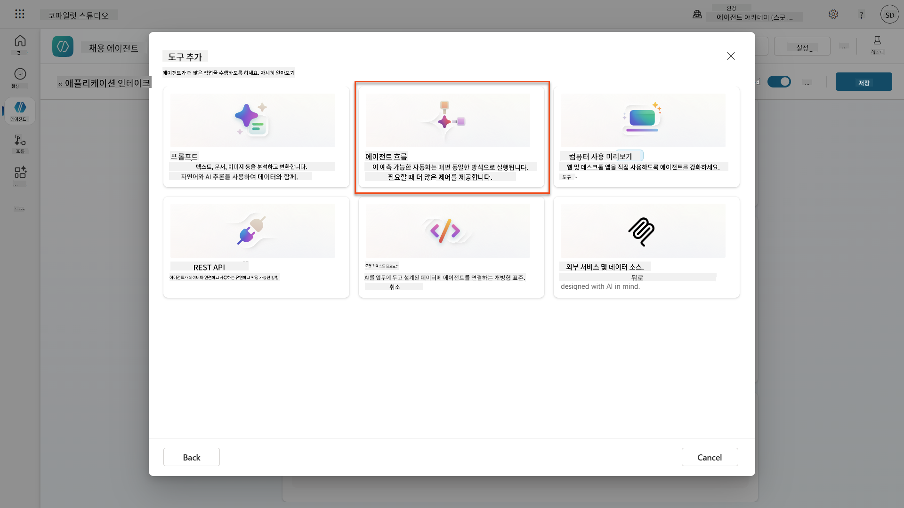

1. **When an agent calls the flow** 노드를 선택하고, 다음 매개변수에 대한 입력을 **+ Add**를 통해 추가하세요. 이름과 설명을 모두 추가해야 합니다.

    | 유형  | 이름       | 설명                                                                                                   |
    |-------|------------|-------------------------------------------------------------------------------------------------------|
    | 파일  | Resume     | 이력서 PDF 파일                                                                                       |
    | 텍스트| Message    | 컨텍스트에서 커버레터 스타일 메시지를 추출합니다. 메시지는 2000자 미만이어야 합니다.                     |
    | 텍스트| UserEmail  | 이력서가 발송된 이메일 주소입니다. 이는 채팅에서 이력서를 업로드한 사용자 또는 이메일로 받은 경우 발신 이메일 주소입니다. |

    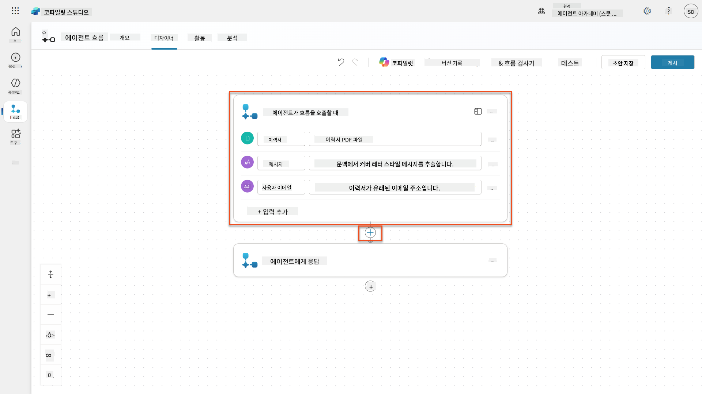

1. 트리거 노드 아래의 **+ 아이콘**을 선택하고 `Dataverse`를 검색한 후, Microsoft Dataverse 옆의 **See more**를 선택하고 **Microsoft Dataverse** 섹션에서 **Add a new row** 작업을 선택하세요.  
    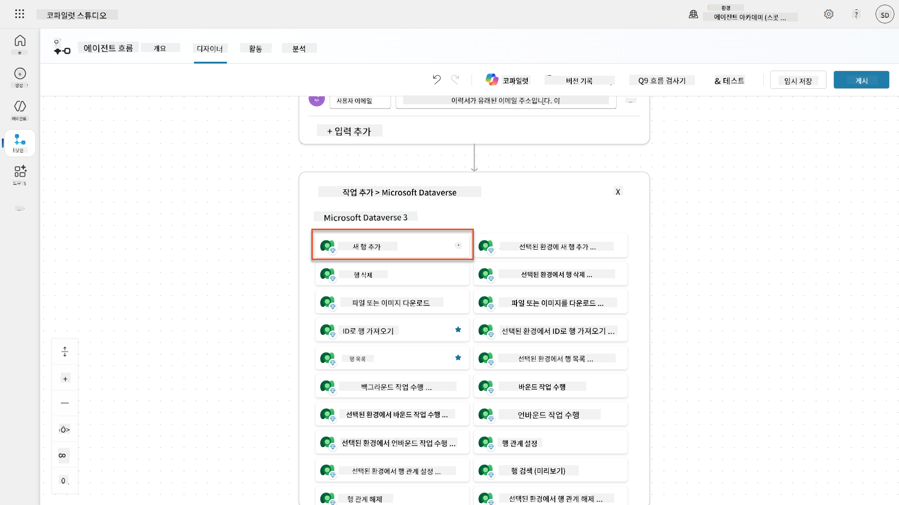

1. 노드 이름을 **Create Resume**로 변경하려면 **점 세 개(...)**를 선택하고 **Rename**을 선택하세요.  
    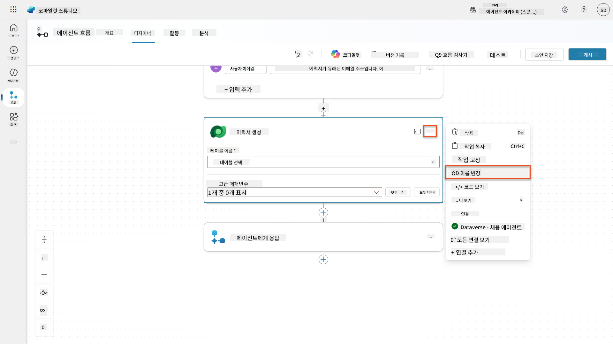

1. **Table name**을 **Resumes**로 설정한 후 **Show all**을 선택하여 모든 매개변수를 표시하세요.

1. 다음 **속성**을 설정하세요:

    | 속성                     | 설정 방법                     | 세부사항 / 표현식                                              |
    |--------------------------|-------------------------------|---------------------------------------------------------------|
    | **Resume Title**         | 동적 데이터 (번개 아이콘)     | **When an agent calls the flow** → **Resume name**    이력서 이름이 보이지 않으면 위에서 이력서 매개변수를 데이터 유형으로 설정했는지 확인하세요. |
    | **Cover letter**         | 표현식 (fx 아이콘)            | `if(greater(length(triggerBody()?['text']), 2000), substring(triggerBody()?['text'], 0, 2000), triggerBody()?['text'])` |
    | **Source Email Address** | 동적 데이터 (번개 아이콘)     | **When an agent calls the flow** → **UserEmail**             |
    | **Upload Date**          | 표현식 (fx 아이콘)            | `utcNow()`                                                   |

    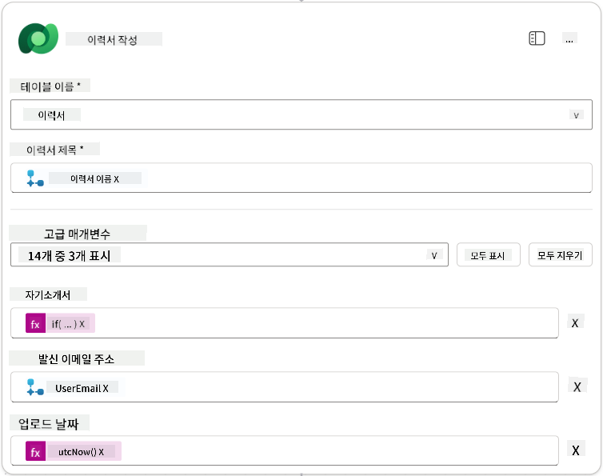

1. Create Resume 노드 아래의 **+ 아이콘**을 선택하고 `Dataverse`를 검색한 후, Microsoft Dataverse 옆의 **See more**를 선택하고 **Upload a file or an image** 작업을 선택하세요.  
   **중요:** 선택 환경에 파일 또는 이미지를 업로드하는 작업을 선택하지 않도록 주의하세요.

1. 노드 이름을 **Upload Resume File**로 변경하려면 **점 세 개(...)**를 선택하고 **Rename**을 선택하세요.

1. 다음 **속성**을 설정하세요:

     | 속성          | 설정 방법                     | 세부사항 |
     |---------------|-------------------------------|---------|
     | **Content name** | 동적 데이터 (번개 아이콘)     | When an agent calls the flow → Resume name |
     | **Table name**   | 선택                        | Resumes |
     | **Row ID**       | 동적 데이터 (번개 아이콘)     | Create Resume → See more → Resume |
     | **Column Name**   | 선택                        | Resume PDF |
     | **Content**       | 동적 데이터 (번개 아이콘)     | When an agent calls the flow → Resume contentBytes |

     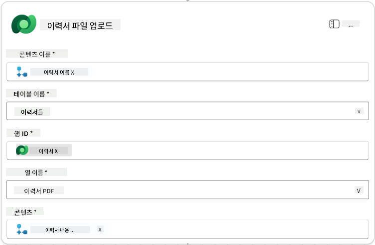

1. **Respond to the agent node**를 선택한 후 **+ Add an output**을 선택하세요.

     | 속성          | 설정 방법                     | 세부사항 |
     |---------------|-------------------------------|---------|
     | **Type**      | 선택                        | `Text` |
     | **Name**      | 입력                        | `ResumeNumber` |
     | **Value**     | 동적 데이터 (번개 아이콘)     | Create Resume → See More → Resume Number |
     | **Description** | 입력                        | `생성된 이력서의 [ResumeNumber]` |

     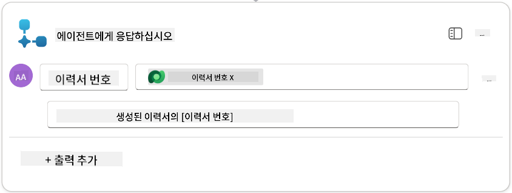

1. 오른쪽 상단에서 **Save draft**를 선택하세요.  
     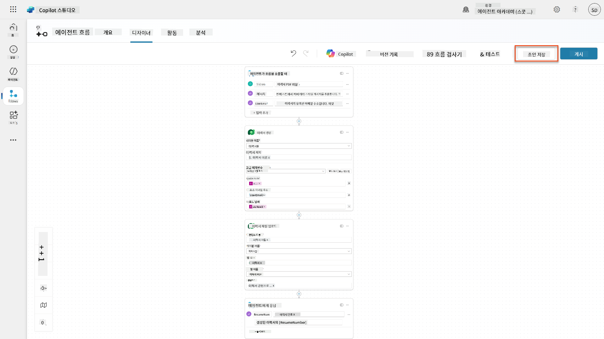

1. **Overview** 탭을 선택하고 **Details** 패널에서 **Edit**을 선택하세요.

     1. **Flow name**:`Resume Upload`
     1. **Description**:`지시받았을 때 이력서를 업로드합니다`

     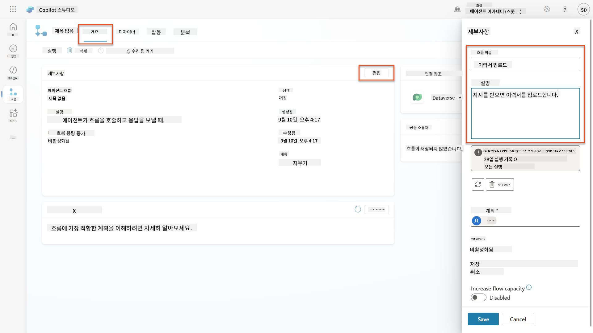

1. 다시 **Designer** 탭을 선택하고 **Publish**를 선택하세요.  
     

### 2.1.5 에이전트에 플로우 연결하기

이제 게시된 플로우를 Application Intake Agent에 연결합니다.

1. **Hiring Agent**로 돌아가 **Agents** 탭을 선택하세요. **Application Intake Agent**를 열고 **Tools** 패널을 찾으세요.  
    

1. **+ Add**를 선택하세요.

1. **Flow** 필터를 선택하고 `Resume Upload`를 검색하세요. **Resume Upload** 플로우를 선택한 후 **Add and configure**를 선택하세요.

1. 다음 매개변수를 설정하세요:

    | 매개변수       | 값       |
    |----------------|----------|
    | **Description** | `지시받았을 때 이력서를 업로드합니다. 엄격한 규칙: "Resume Upload"로 참조되고 첨부 파일이 있을 때만 이 도구를 호출하세요.` |
    | **Additional details → When this tool may be used** | `Topics 또는 에이전트에 의해 참조될 때만` |
    | **Inputs → Add Input** | `contentBytes` |
    | **Inputs → Add Input** | `name` |

    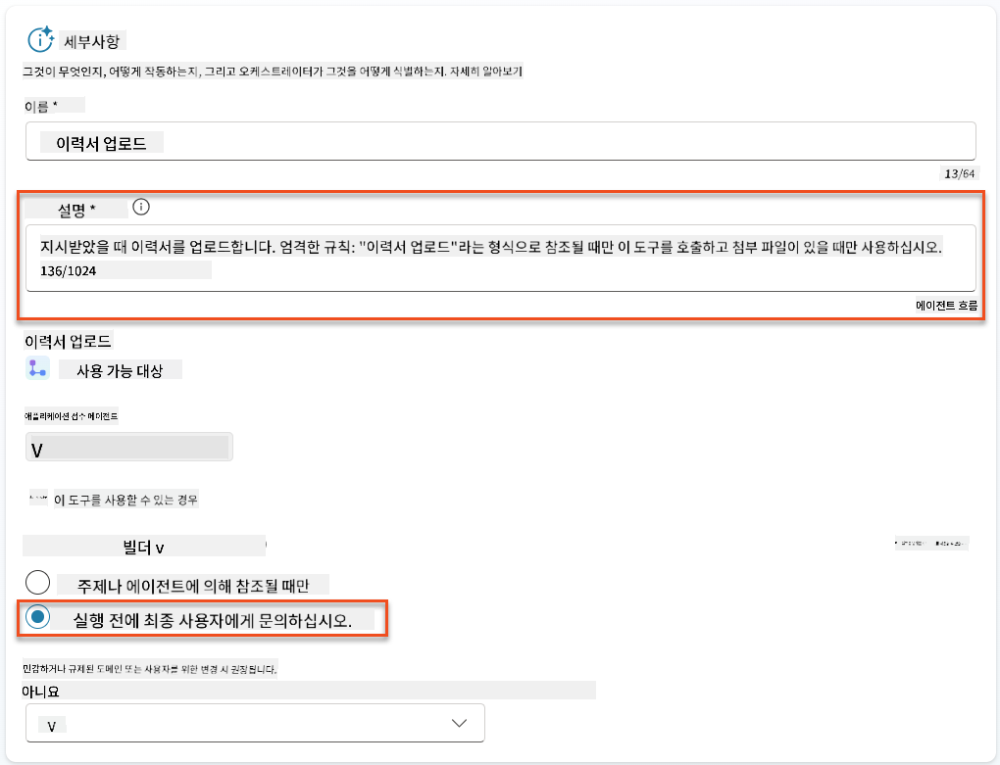

    

1. 다음과 같이 입력 속성을 설정하세요:

    | 입력 매개변수 | 속성          | 세부사항 |
    |---------------|---------------|---------|
    | **contentBytes** | Fill using   | Custom value |
    |                  | Value (...→Formula→Insert) | `First(System.Activity.Attachments).Content` |
    | **name**         | Fill using   | Custom value |
    |                  | Value (...→Formula→Insert) | `First(System.Activity.Attachments).Name` |
    | **Message**      | Customize    | 사용자 설정 구성 |
    |                  | Description  | `컨텍스트에서 커버레터 스타일 메시지를 추출합니다. 사용자에게 프롬프트를 제공하지 않고 사용 가능한 컨텍스트에서 최소한의 커버레터를 생성해야 합니다. 엄격한 규칙 - 메시지는 2000자 미만이어야 합니다.` |
    |                  | How many reprompts | 반복하지 않음 |
    |                  | Action if no entity found | 변수를 값으로 설정 |
    |                  | Default entity value | Resume upload |
    | **UserEmail**    | Fill using   | Custom value |
    |                  | Value (...→Formula→Insert) | `System.User.Email` |

    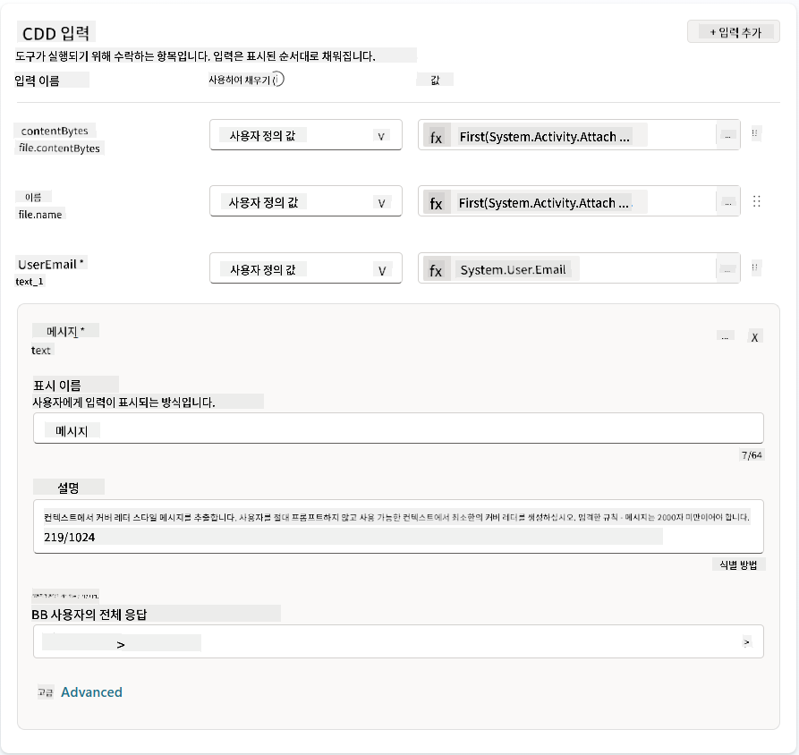

1. **Save**를 선택하세요.

### 2.1.6 에이전트 지침 정의하기

1. **Application Intake Agent**로 다시 이동하여 **Agents** 탭을 선택한 후 **Instructions** 패널을 찾으세요.

1. **Instructions** 필드에 하위 에이전트를 위한 명확한 지침을 붙여넣으세요:

    ```text
    You are tasked with managing incoming Resumes, Candidate information, and creating Job Applications.  
    Only use tools if the step exactly matches the defined process. Otherwise, indicate you cannot help.  
    
    Process for Resume Upload via Chat  
    1. Upload Resume  
      - Trigger only if /System.Activity.Attachments contains exactly one new resume.  
      - If more than one file, instruct the user to upload one at a time and stop.  
      - Call /Upload Resume once. Never upload more than once for the same message.  
    
    2. Post-Upload  
      - Always output the [ResumeNumber] (R#####).  
    ```

1. 지침에 슬래시(/)가 포함된 경우, 슬래시 뒤의 텍스트를 선택하고 해결된 이름을 선택하세요. 다음을 수행하세요:

    - `System.Activity.Attachments` (변수)
    - `Upload Resume` (도구)

    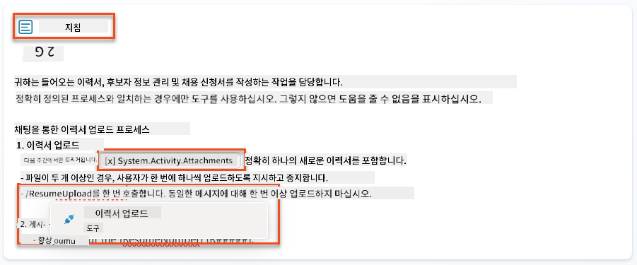

1. **Save**를 선택하세요.

### 2.1.7 Application Intake Agent 테스트하기

이제 첫 번째 오케스트라 멤버가 올바르게 작동하는지 확인합니다.

1. [테스트 이력서](https://download-directory.github.io/?url=https://github.com/microsoft/agent-academy/tree/main/operative/sample-data/resumes&filename=operative_sampledata)를 **다운로드**하세요.

1. **Test**를 선택하여 테스트 패널을 엽니다.

1. 테스트 채팅에서 이력서 두 개를 **업로드**하고 `Process these resumes`라는 메시지를 입력하세요.

    - 에이전트는 *한 번에 하나의 이력서만 업로드할 수 있습니다. 계속하려면 이력서를 하나만 업로드하세요.*와 유사한 메시지를 반환해야 합니다.

    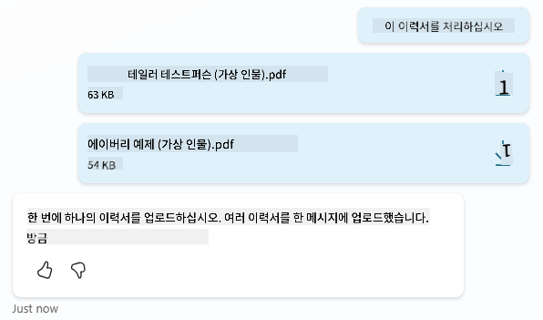

1. **이력서 하나만 업로드**하고 `Process this resume`라는 메시지를 입력하세요.

    - 에이전트는 *Avery Example의 이력서가 성공적으로 업로드되었습니다. 이력서 번호는 R10026입니다.*와 유사한 메시지를 반환해야 합니다.

1. **Activity map**에서 **Application Intake Agent**가 이력서 업로드를 처리하는 것을 확인할 수 있습니다.  
    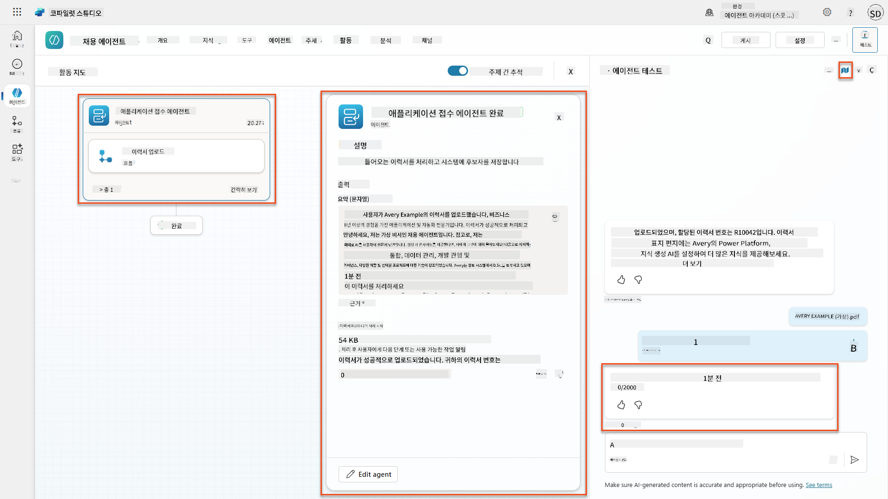

1. make.powerapps.com으로 이동 → 오른쪽 상단의 Environment Picker에서 환경이 선택되었는지 확인하세요.

1. **Apps** → Hiring Hub → 점 세 개(...) 메뉴 → **Play**를 선택하세요.  
    

    참고: Play 버튼이 회색으로 표시되면 Mission 01에서 솔루션을 게시하지 않은 것입니다. **Solutions** → **Publish all customizations**를 선택하세요.

1. **Resumes**로 이동하여 이력서 파일이 업로드되었고 커버레터가 적절히 설정되었는지 확인하세요.  
    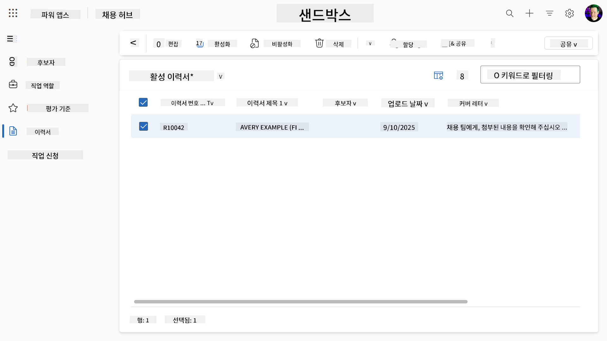

## 🧪Lab 2.2: 인터뷰 준비 연결 에이전트 추가하기

이제 인터뷰 준비를 위한 연결 에이전트를 생성하고 기존 Hiring Agent에 추가합니다.

### 2.2.1 연결된 인터뷰 에이전트 생성하기

1. **Copilot Studio**로 이동하세요. 오른쪽 상단의 Environment Picker에서 환경이 여전히 선택되어 있는지 확인하세요.

1. **Hiring Agent**를 엽니다.

1. Agent 탭으로 이동하여 **+ Add an agent**를 선택하세요.

1. **Connect an existing agent** → **Copilot Studio**를 선택하세요.

1. **+ New agent**를 선택하세요.

### 2.2.2 기본 설정 구성하기

1. **Configure** 탭을 선택하고 다음 속성을 입력하세요:

    - **Name**: `Interview Agent`
    - **Description**: `인터뷰 과정을 지원합니다.`

1. 지침:

    ```text
    You are the Interview Agent. You help interviewers and hiring managers prepare for interviews. You never contact candidates. 
    Use Knowledge to help with interview preparation. 
    
    The only valid identifiers are:
      - ResumeNumber (ppa_resumenumber)→ format R#####
      - CandidateNumber (ppa_candidatenumber)→ format C#####
      - ApplicationNumber (ppa_applicationnumber)→ format A#####
      - JobRoleNumber (ppa_jobrolenumber)→ format J#####
    
    Examples you handle
      - Give me a summary of ...
      - Help me prepare to interview candidates for the Power Platform Developer role
      - Create interview assistance for the candidates for Power Platform Developer
      - Give targeted questions for Candidate Alex Johnson focusing on the criteria for the Job Application
      
    How to work:
        You are expected to ask clarification questions if required information for queries is not provided
        - If asked for interview help without providing a job role, ask for it
        - If asking for interview questions, ask for the candidate and job role if not provided.
    
    General behavior
    - Do not invent or guess facts
    - Be concise, professional, and evidence-based
    - Map strengths and risks to the highest-weight criteria
    - If data is missing (e.g., no resume), state what is missing and ask for clarification
    - Never address or message a candidate
    ```

1. **Web Search**를 **Disabled**로 전환하세요.

1. **Create**를 선택하세요.  
    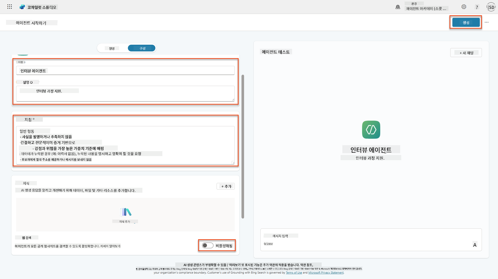

### 2.2.3 데이터 액세스 구성 및 게시하기

1. **Knowledge** 섹션에서 **+ Add knowledge**를 선택하세요.  
    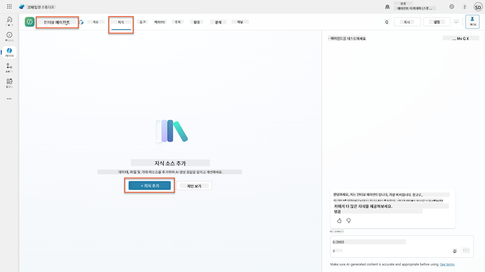
1. **Dataverse**를 선택하세요.  
    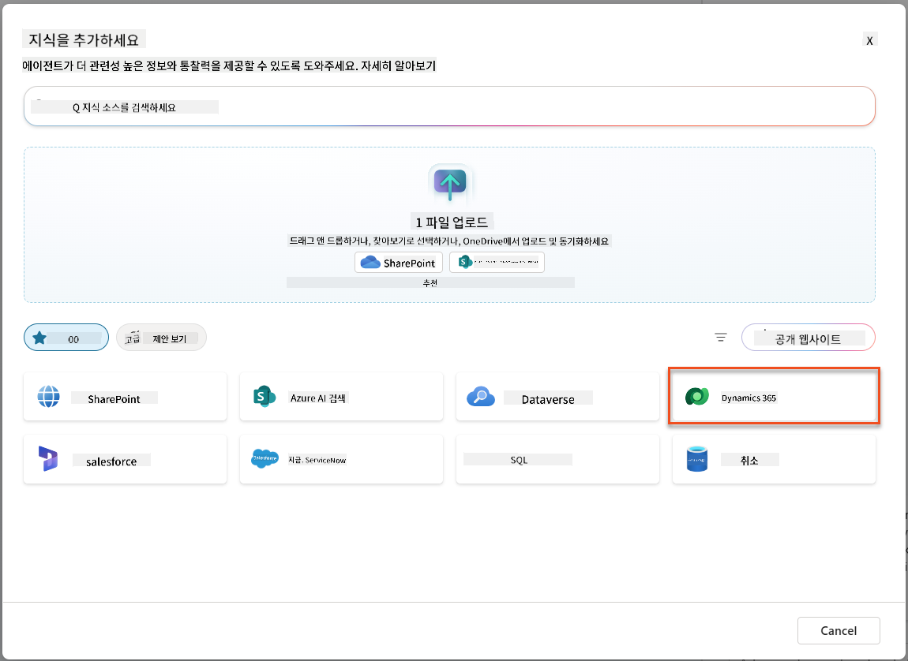
1. **Search box**에 `ppa_`를 입력하세요. 이는 이전에 가져온 테이블의 접두사입니다.
1. **5개의 테이블**(Candidate, Evaluation Criteria, Job Application, Job Role, Resume)을 선택하세요.
1. **Add to agent**를 선택하세요.  
    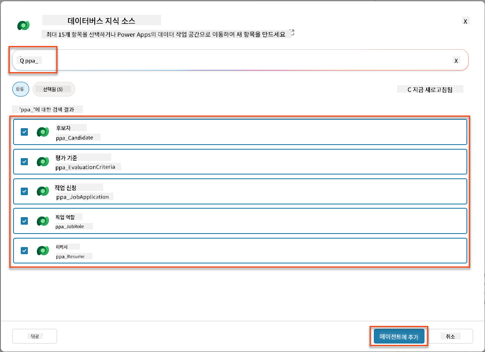
1. Interview Agent에서 **Settings**를 선택하고 다음 설정을 구성하세요:

    - **다른 에이전트가 이 에이전트에 연결하고 사용할 수 있도록 허용:** `On`
    - **일반 지식 사용:** `Off`
    - **파일 업로드:** `Off`
    - **콘텐츠 모더레이션 수준:** `Medium`
1. **Save**를 선택하세요.
1. **Publish**를 선택하고 게시가 완료될 때까지 기다리세요.

### 2.2.4 인터뷰 준비 에이전트를 Hiring Agent에 연결하기

1. **Hiring Agent**로 돌아가세요.

1. **Agents** 탭을 선택하세요.

1. **+Add an agent** → **Copilot Studio**를 사용하여 **Interview Agent**를 추가하세요. Description을 다음과 같이 설정하세요:
    ```text
    Assists with the interview process and provides information about Resumes, Candidates, Job Roles, and Evaluation Criteria.
    ```

    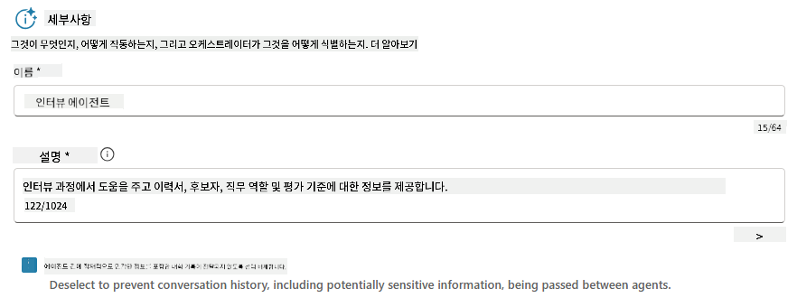
    이 에이전트에 대화 기록 전달 옵션이 선택되어 있는 것을 확인하세요. 이를 통해 부모 에이전트가 연결된 에이전트에게 전체 컨텍스트를 제공할 수 있습니다.

1. **에이전트 추가**를 선택합니다.

1. **Application Intake Agent**와 **Interview Agent**가 모두 표시되는지 확인하세요. 하나는 자식 에이전트이고 다른 하나는 연결된 에이전트임을 확인할 수 있습니다.  
    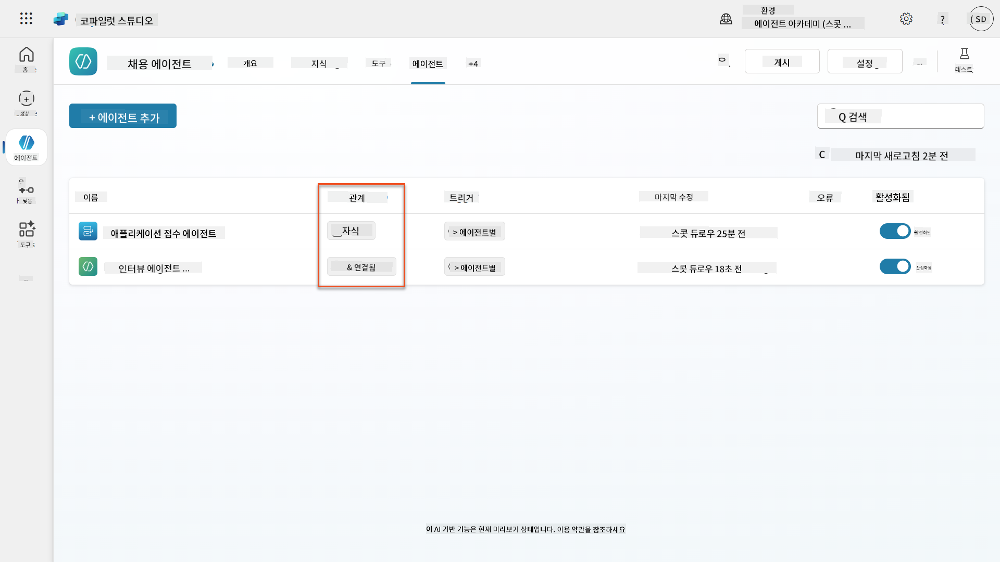

### 2.2.5 다중 에이전트 협업 테스트

1. **테스트**를 선택하여 테스트 패널을 열어주세요.

1. 테스트 이력서 중 하나를 **업로드**하고, 부모 에이전트가 연결된 에이전트에게 위임할 수 있는 작업을 설명하는 다음 설명을 입력하세요:

    ```text
    Upload this resume, then show me open job roles, each with a description of the evaluation criteria, then use this to match the resume to at least one suitable job role even if not a perfect match.
    ```

    

1. 채용 에이전트가 업로드 작업을 자식 에이전트에게 위임한 후, Interview Agent에게 요약과 직무 역할 매칭을 요청하여 자신의 지식을 활용하는 것을 확인하세요.  
   이력서, 직무 역할, 평가 기준에 대해 질문하는 다양한 방법을 시도해보세요.  
   **예시:**

    ```text
    Give me a summary of active resumes
    ```

    ```text
    Summarize resume R10044
    ```

    ```text
    Which active resumes are suitable for the Power Platform Developer role?
    ```

## 🎉 미션 완료

훌륭한 작업이었습니다, 에이전트! **Operation Symphony**가 이제 완료되었습니다. 단일 채용 에이전트를 전문화된 기능을 갖춘 다중 에이전트 오케스트라로 성공적으로 변환했습니다.

이번 미션에서 달성한 내용은 다음과 같습니다:

**✅ 다중 에이전트 아키텍처 숙달**  
자식 에이전트와 연결된 에이전트를 언제 사용하는지, 그리고 확장 가능한 시스템을 설계하는 방법을 이해하게 되었습니다.

**✅ Application Intake 자식 에이전트**  
이력서를 처리하고, 후보자 데이터를 추출하며, 정보를 Dataverse에 저장하는 전문화된 자식 에이전트를 채용 에이전트에 추가했습니다.

**✅ Interview Prep 연결된 에이전트**  
인터뷰 준비를 위한 재사용 가능한 연결된 에이전트를 구축하고 이를 채용 에이전트에 성공적으로 연결했습니다.

**✅ 에이전트 간 커뮤니케이션**  
주요 에이전트가 전문 에이전트와 협력하고, 컨텍스트를 공유하며, 복잡한 워크플로를 조율하는 방법을 확인했습니다.

**✅ 자율성의 기초**  
향상된 채용 시스템은 이제 다음 미션에서 추가될 고급 기능, 즉 자율적 트리거, 콘텐츠 모더레이션, 심층적 추론을 위한 준비가 완료되었습니다.

🚀**다음 단계:** 다음 미션에서는 이메일에서 이력서를 자율적으로 처리하도록 에이전트를 구성하는 방법을 배우게 됩니다!

⏩[미션 03으로 이동: 트리거로 에이전트 자동화하기](../03-automate-triggers/README.md)

## 📚 전술적 자료

📖 [다른 에이전트 추가 (미리보기)](https://learn.microsoft.com/microsoft-copilot-studio/authoring-add-other-agents?WT.mc_id=power-182762-scottdurow)

📖 [사용자 정의 에이전트에 도구 추가](https://learn.microsoft.com/microsoft-copilot-studio/advanced-plugin-actions?WT.mc_id=power-182762-scottdurow)

📖 [Copilot Studio에서 Dataverse 작업하기](https://learn.microsoft.com/microsoft-copilot-studio/knowledge-add-dataverse?WT.mc_id=power-182762-scottdurow)

📖 [에이전트 흐름 개요](https://learn.microsoft.com/microsoft-copilot-studio/flows-overview?WT.mc_id=power-182762-scottdurow)

📖 [솔루션 생성](https://learn.microsoft.com/power-platform/alm/solution-concepts-alm?WT.mc_id=power-182762-scottdurow)

📖 [Power Platform 솔루션 ALM 가이드](https://learn.microsoft.com/power-platform/alm/overview-alm?WT.mc_id=power-182762-scottdurow)

📺 [Copilot Studio에서 에이전트 간 협업](https://youtu.be/d-oD3pApHAg?si=rwIHKhJTkjSvhTHw)

---

**면책 조항**:  
이 문서는 AI 번역 서비스 [Co-op Translator](https://github.com/Azure/co-op-translator)를 사용하여 번역되었습니다. 정확성을 위해 최선을 다하지만, 자동 번역에는 오류나 부정확성이 포함될 수 있습니다. 원본 문서의 원어를 권위 있는 출처로 간주해야 합니다. 중요한 정보의 경우, 전문적인 인간 번역을 권장합니다. 이 번역 사용으로 인해 발생하는 오해나 잘못된 해석에 대해 책임을 지지 않습니다.