<!--
CO_OP_TRANSLATOR_METADATA:
{
  "original_hash": "c04b3587170139bc23e3b5cfc24c89ac",
  "translation_date": "2025-10-22T00:54:41+00:00",
  "source_file": "docs/recruit/07-add-new-topic-with-trigger/README.md",
  "language_code": "ko"
}
-->
# 🚨 미션 07: 트리거와 노드를 사용하여 새로운 주제 추가하기

## 🕵️‍♂️ 코드명: `주제 유지 작전`

> **⏱️ 작전 시간:** `~60분`

🎥 **워크스루 보기**

[](https://www.youtube.com/watch?v=7iPAZaA8nJs "YouTube에서 워크스루 보기")

## 🎯 미션 개요

에이전트를 구축했습니다. 이제 에이전트가 듣고, 배우고, 질문에 답할 수 있습니다. 하지만 이제 더 전략적으로 접근할 때입니다. 이번 미션에서는 에이전트가 특정 프롬프트에 정밀하게 응답할 수 있도록 깊이 있는 설정을 배울 것입니다.

주제와 트리거를 통해 에이전트는 다음을 수행할 수 있습니다:

- 의도 인식
- 논리적으로 대화 경로 설정
- 변수 수집 및 저장
- 플로우를 트리거하고 작업 수행

단순한 대화를 만드는 것이 아니라, 에이전트의 의사결정 중심을 연결하는 작업입니다. 신경 네트워크의 세계에 오신 것을 환영합니다.

## 🔎 목표

이번 미션에서 배우게 될 내용:

1. 주제가 무엇인지 이해하고 에이전트의 구조화된 대화를 만드는 데 있어 그 역할을 배우기
1. 트리거 문구와 대화 노드를 포함한 주제의 구성 요소 이해하기
1. 다양한 유형의 대화 노드 탐색 및 동적 논리를 위한 Power Fx 사용 방법 배우기
1. 사용자 요청 및 작업을 처리하기 위한 맞춤형 주제를 처음부터 생성하기
1. SharePoint 데이터에 연결된 기능적 주제를 커넥터와 도구를 사용하여 구축하기

## 🤔 주제란 무엇인가?

주제는 에이전트가 특정 사용자 질문이나 작업에 응답할 수 있도록 돕는 구조화된 대화입니다. 주제를 미니 대화나 에이전트가 처리할 수 있는 작업으로 생각하세요. 각 주제는 특정 사용자 질문이나 요청에 응답하도록 설계되었습니다.

### 🌌 주제의 목적

사용자가 필요로 하는 것에 따라 주제의 목적은 다음 세 가지로 나뉩니다:

**정보 제공** - 다음과 같은 질문에 답변:

- `...이란 무엇인가요?`
- `...은 언제인가요?`
- `왜 ...인가요?`
- `...에 대해 말해줄 수 있나요?`

**작업 완료** - 사용자가 무언가를 _할 수 있도록_ 도움:

- `"...하고 싶어요"`
- `"...하는 방법은?"`
- `"...이 필요해요"`

**문제 해결** - 문제를 해결:

- `무언가가 작동하지 않아요 ...`
- `오류 메시지를 보고 있어요 ...`
- `예상치 못한 것을 보고 있어요 ...?`

`도움이 필요해요`와 같은 모호한 질문에 대해 사용자가 더 많은 세부 정보를 제공하도록 요청하는 주제를 만들 수도 있습니다.

## 🐦 주제가 왜 유용한가요?

주제는 다음을 돕습니다:

- 에이전트의 지식을 체계적으로 정리합니다.
- 대화를 자연스럽게 만듭니다.
- 사용자 문제를 효과적으로 해결합니다.

## 🪺 주제의 유형

1. **시스템 주제** - 기본적으로 제공되며 다음과 같은 일반적인 이벤트를 처리합니다:
    - 대화 시작
    - 대화 종료
    - 오류 처리
    - 사용자 로그인 요청
    - 인간 에이전트로의 에스컬레이션

1. **맞춤형 주제** - 특정 작업이나 질문을 처리하기 위해 생성:
    - 직원 휴가 요청
    - 새 장치 또는 교체 장치 요청

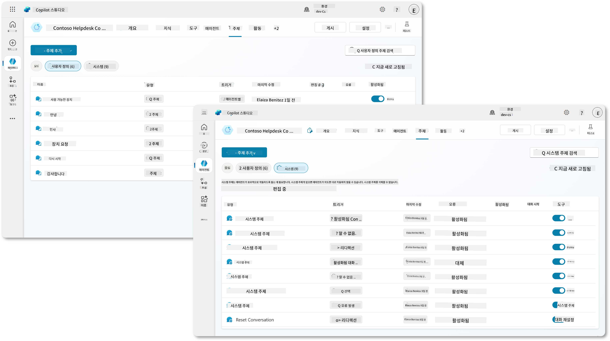

## 🧬 주제의 구성 요소

각 주제는 일반적으로 다음을 포함합니다.

### 🗣️ 트리거 문구

사용자가 주제를 시작하기 위해 말할 수 있는 단어 또는 문장입니다.

**예시:**

휴가 요청 주제의 트리거 문구는 다음과 같을 수 있습니다:

- `휴가를 신청하고 싶어요`
- `휴가 요청`
- `휴가를 신청하는 방법은?`

장치 요청 주제의 트리거 문구는 다음과 같을 수 있습니다:

- `새 장치가 필요해요`
- `장치를 요청할 수 있나요?`
- `장치 요청을 도와줄 수 있나요`

### 💬 대화 노드

주제는 사용자가 주제를 트리거한 후 에이전트가 따르는 단계로 구성됩니다. 이러한 단계를 연결하여 에이전트가 사용자와 상호작용할 때 따르는 대화 흐름을 구축합니다.

이를 다음과 같은 지침 또는 작업으로 생각하세요:

- 사용자에게 질문하기
- 메시지 보내기
- 휴가 관리 시스템과 같은 외부 서비스 호출
- 변수 설정 또는 확인
- 조건을 사용하여 대화 분기
- 다른 주제로 이동

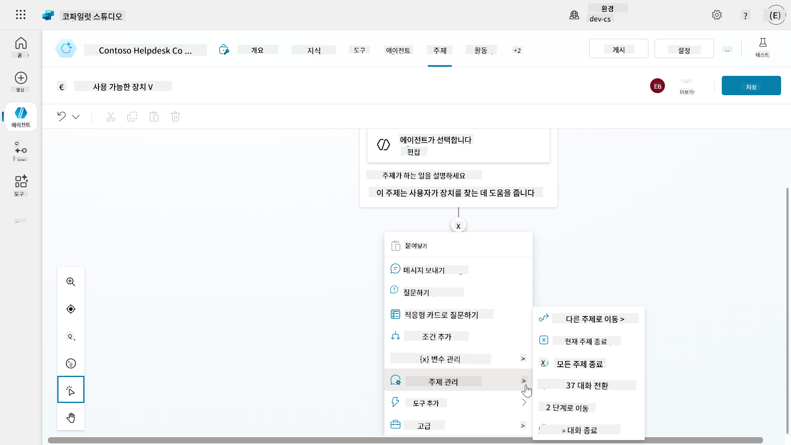

에이전트에 추가할 수 있는 주요 노드 유형은 다음과 같습니다:

#### 메시지 보내기

- **목적** - 사용자에게 메시지를 보냅니다.
- **예시** - `요청해주셔서 감사합니다! 제가 도와드릴게요.`

이 노드는 에이전트가 사용자에게 메시지를 보내도록 하며, 간단한 텍스트 또는 이미지, 비디오, 카드, 빠른 응답 및 적응형 카드와 같은 풍부한 콘텐츠를 포함할 수 있습니다.

변수를 사용하여 메시지를 개인화하고, 다양한 메시지 변형을 추가하여 다양성을 제공하며, 음성 지원 채널을 위한 음성 출력도 사용자 정의할 수 있습니다.

!!! tip
    에이전트가 사용자와 명확하고 상호작용적으로 소통할 수 있도록 돕는 "말하기" 블록으로 생각하세요.

#### 질문하기

- **목적** - 사용자에게 질문하고 답변을 기다립니다.
- **예시** - `휴가 날짜는 언제인가요?`

이 노드는 대화 중에 사용자에게 특정 정보를 요청하고 나중에 사용할 수 있도록 변수를 저장하는 데 사용됩니다.

텍스트 입력과 같은 질문 유형을 사용자 정의하거나 사용자가 선택할 수 있는 값 목록을 정의하는 엔터티를 사용할 수 있으며, 사용자가 유효하지 않은 답변을 제공하거나 질문을 건너뛸 경우 에이전트의 동작을 정의할 수 있습니다.

이미지 및 빠른 응답과 같은 풍부한 콘텐츠도 지원하며, 대화 흐름이 원활하게 진행되도록 유효성 검사, 재프롬프트 및 중단 설정을 세밀하게 조정할 수 있습니다.

!!! tip
    에이전트가 사용자와 구조화된 방식으로 상호작용할 수 있도록 돕는 "질문하고 듣기" 블록으로 생각하세요.

#### 적응형 카드로 질문하기

- **목적** - JSON을 사용하여 풍부하고 상호작용적인 카드를 보냅니다.
- **예시** - 사용자가 날짜를 선택할 수 있는 캘린더 날짜 선택기를 표시하는 카드.

이 노드는 텍스트 상자, 버튼 및 이미지를 포함한 양식과 같은 풍부하고 상호작용적인 카드를 사용자에게 보여주고 제출할 수 있도록 합니다. 사용자의 입력을 캡처하여 변수를 저장하고, 에이전트가 대화 중 나중에 이를 사용할 수 있습니다.

!!! tip
    에이전트를 사용자와의 상호작용을 더 매력적이고 세부 정보를 수집할 수 있도록 만드는 맞춤형 "양식 생성기" 블록으로 생각하세요.

#### 조건 추가

- **목적** - 대화에 논리를 추가합니다. 특정 조건을 확인하고 다음 작업을 결정합니다.
- **예시** - 사용자가 `예`라고 말하면 다음 단계로 이동합니다. `아니요`라면 대화를 종료합니다.

이 노드는 변수가 특정 기준을 충족하는지 확인하여 에이전트의 대화 흐름에서 결정 지점을 만듭니다. 조건이 참인지 거짓인지에 따라 에이전트는 다른 경로를 따릅니다.

!!! tip
    사용자 입력이나 변수에 저장된 데이터에 따라 에이전트가 결정을 내릴 수 있도록 돕는 "if-else" 블록으로 생각하세요.

#### 변수 관리

- **목적** - 대화 중 정보를 저장하거나 삭제합니다 (변수라고 함).
- **예시** - 사용자가 적응형 카드에 표시된 질문 노드에서 선택한 날짜를 저장합니다.

이 노드는 대화 중 정보를 저장하고 관리할 수 있도록 하며, 사용자 이름, 답변 또는 선호도와 같은 데이터를 포함할 수 있습니다. 텍스트, 숫자 또는 날짜와 같은 다양한 유형의 변수를 사용할 수 있으며, 단일 주제에 국한되거나 주제 간 공유(글로벌), 또는 시스템이나 환경에서 가져올 수 있습니다.

!!! tip
    에이전트가 정보를 기억하고 대화가 사용자와 계속 진행됨에 따라 이를 사용할 수 있도록 돕는 "기억 상자"로 생각하세요.

#### 주제 관리

- **목적** - 대화를 다른 주제나 주제 내의 단계로 이동하거나, 대화를 전환하거나 종료합니다.
- **예시** - "휴가 정책" 주제로 리디렉션합니다.

이 노드는 에이전트가 대화를 다시 시작하지 않고 한 주제에서 다른 주제로 이동하거나, 주제를 종료하거나, 대화를 전환하거나 종료하거나, 동일한 주제 내에서 다른 단계로 이동할 수 있도록 합니다. 주제 간에 원활하게 전환하여 대화 흐름을 안내하며, 변수를 전달하여 문맥을 유지할 수 있습니다.

!!! tip
    에이전트가 사용자와의 대화에서 유연하게 대처할 수 있도록 돕는 "다른 섹션/단계로 이동" 블록으로 생각하세요.

#### 도구 추가

- **목적** - 커넥터, 에이전트 플로우, 프롬프트, 사용자 정의 검색, 검색 쿼리, 스킬, 모델 컨텍스트 프로토콜과 같은 도구에 연결합니다.
- **예시** - 사용자가 휴가 요청을 제출한 후 실행되는 에이전트 플로우.

이 노드는 에이전트가 외부 시스템과 상호작용하거나 이메일 보내기, 날씨 확인, 데이터베이스 액세스와 같은 특정 작업을 수행할 수 있도록 합니다. 내장 커넥터, 사용자 정의 API, 에이전트 플로우, 프롬프트를 사용하거나 모델 컨텍스트 프로토콜(MCP) 서버에 연결할 수 있으며, 컴퓨터 사용 도구를 통해 데스크톱 앱의 그래픽 사용자 인터페이스 자동화도 가능합니다.

!!! tip
    에이전트가 API 호출, 프로세스 실행 또는 사용자 입력 자동 수집과 같은 작업을 수행할 수 있도록 돕는 "액션 블록"으로 생각하세요.

#### 생성형 응답 노드

- **목적** - 대규모 언어 모델을 사용하여 사용자 질문과 연결된 데이터를 기반으로 자연스럽고 인간적인 응답을 생성합니다.
- **예시** - 휴가 요청에 대한 질문에 답하기 위해 휴가 자격 정보가 포함된 연결된 지식 소스를 사용합니다.

이 노드는 웹사이트, 문서, SharePoint 또는 사용자 정의 데이터와 같은 다양한 지식 소스에서 정보를 사용하여 사용자 질문에 응답할 수 있도록 에이전트를 지원합니다. 일치하는 주제를 찾을 수 없을 때 백업으로 사용하거나, 주제 내에서 특정 소스를 기반으로 더 자세하고 동적인 답변을 제공할 수 있습니다.

!!! tip
    에이전트가 신뢰할 수 있는 콘텐츠를 검색하여 유용하고 정확한 응답을 제공할 수 있도록 돕는 "스마트 응답 블록"으로 생각하세요.

#### HTTP 요청 노드

- **목적** - API 호출(예: `GET` 또는 `POST`)을 보내 외부 시스템에 연결하여 데이터를 가져오거나 업데이트합니다.
- **예시** - 사용자가 자신의 휴가 일수 잔액을 요청하면, 에이전트가 휴가 관리 시스템에 `GET` 요청을 보내 API 응답에서 `remainingLeaveDays`를 추출하여 사용자에게 값을 답변합니다.

이 노드는 에이전트가 `GET` 또는 `POST` 요청과 같은 REST API 호출을 보내 외부 시스템에 연결할 수 있도록 합니다. 헤더, 본문 콘텐츠를 사용자 정의하거나 Power Fx를 사용하여 동적 데이터를 포함할 수 있으며, 응답을 변수에 저장하여 대화 중 나중에 사용할 수 있습니다.

!!! tip
    에이전트가 다른 서비스와 대화하여 사용자 세부 정보를 검색하거나 데이터를 다른 시스템에 보내는 등의 작업을 수행할 수 있도록 돕는 "정보 가져오기" 블록으로 생각하세요.

#### 이벤트 보내기

- **목적** - 시스템 업데이트 또는 도구 트리거와 같은 메시지가 아닌 작업을 클라이언트나 채널에 보내어 작업을 수행할 수 있도록 합니다.
- **예시** - 사용자가 채팅에 참여할 때 환영 메시지를 표시합니다.

이 노드는 에이전트가 외부 시스템이나 채널에 메시지가 아닌 작업을 보낼 수 있도록 하며, 이를 통해 시스템이 응답 방법을 결정할 수 있습니다. 각 이벤트에 이름을 지정하고 값(숫자, 텍스트, 변수 또는 Power Fx 공식)을 첨부하여 JSON 객체로 보냅니다.

!!! tip
    에이전트가 사용자 입력 없이도 백그라운드에서 작업을 수행하거나 외부 도구와 통신할 수 있도록 돕는 "조용한 트리거" 블록으로 생각하세요.

## 🏋🏻‍♀️ 노드에서 Power Fx 사용하기

Copilot Studio에서 Power Fx는 에이전트에 논리와 동적 동작을 추가하는 데 사용되는 로우 코드 프로그래밍 언어입니다. Microsoft Power Apps에서 사용되는 동일한 언어로, 간단하고 Excel과 유사하여 개발자와 비개발자 모두 쉽게 사용할 수 있습니다.


### 주제에서 Power Fx가 할 수 있는 일

- 변수 설정 및 조작
      - 예시: `Set(userName, "Adele Vance")`
- 조건 생성
      - 예시: `If(score > 80, "Pass", "Fail")`
- 데이터 형식 및 변환
      - 예시: `Text(DateValue, "dd/mm/yyyy")`

### Power Fx를 사용하는 이유

- **유연성:** 전체 코드를 작성하지 않고도 논리를 구축할 수 있습니다.
- **친숙함:** Excel 수식을 사용해본 적이 있다면 매우 유사하게 느껴질 것입니다.
- **강력함:** 사용자 데이터를 기반으로 대화를 개인화하고 입력을 검증하며 에이전트의 동작을 제어할 수 있습니다.

## 🏗️ 주제를 생성하고 편집하는 방법

에이전트를 위한 주제를 생성하고 편집하는 방법은 두 가지가 있습니다.

### 1. 빈 상태에서 생성

이 방법을 사용하면 처음부터 맞춤형 대화 흐름을 구축할 수 있으며, 주제를 편집할 때 노드를 추가하거나 제거할 수 있습니다.

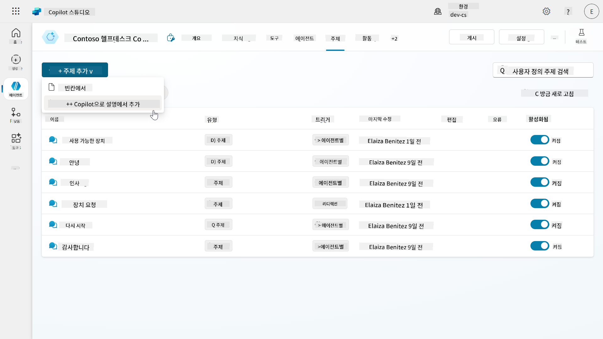

#### 이 방법이 유용한 이유

- 에이전트의 응답 방식을 완전히 제어할 수 있습니다.
- 변수, Power Fx 및 조건을 사용하여 논리를 사용자 정의할 수 있습니다.
- 특정 비즈니스 요구에 맞춘 경험을 구축하는 데 적합합니다.

### 2. Copilot로 생성
이를 통해 자연어를 사용하여 원하는 내용을 설명할 수 있으며, Copilot이 대화를 구성해줍니다. 주제를 편집할 때도 동일하게 자연어를 사용하면 Copilot이 주제를 검토하고 수정해줍니다.

#### Copilot이 지원하는 기능

- 생성 및 편집 가능:
      - 메시지 노드
      - 질문 노드
      - 조건 노드
- 사용자가 응답하지 않을 경우 다시 질문하는 방법이나 질문 중단을 관리하는 고급 설정은 지원하지 않습니다. 필요하면 수동으로 해당 설정을 조정할 수 있습니다.

#### 왜 유용한가요?

- AI 지원으로 개발 속도를 높일 수 있습니다.
- 반복적인 설정 대신 논리와 사용자 경험에 집중할 수 있습니다.
- 최소한의 노력으로 대화 흐름을 반복적으로 개선하기 쉽습니다.

#### ✨ 예시 프롬프트

- **주제 생성**
      - `사용자의 이름, 나이, 생년월일을 받아서 응답을 반복해서 알려주세요`
      - `사용자의 거리 주소, 주, 우편번호를 수집하세요. 사용자는 각 질문을 최대 4번까지 다시 시도할 수 있어야 합니다`

- **주제 편집**
      - `사용자의 생년월일을 묻는 질문을 추가하세요`
      - `수집된 정보를 Adaptive Card로 요약하세요.`

## 👩🏻‍🎨 좋아요, 에이전트를 위한 주제를 어떻게 설계하나요?

### 🧙🏻‍♂️ 1단계 - 사용자 요구 이해하기

먼저, 사용자가 에이전트에게 물어볼 일반적인 질문이나 작업을 식별하세요. 예를 들어:

- 사용자가 자주 묻는 질문: `내 병가 일수는 얼마나 되나요?`
- 사용자가 완료하고자 하는 일반적인 작업: 양식 제출
- 사용자가 자주 겪는 문제: 로그인 문제

### 📦 2단계 - 시나리오 그룹화

사용자 요구를 주제의 목적에 따라 세 가지 범주로 정리하세요:

- 정보 제공 - 사용자가 무언가를 알고 싶어함
- 작업 완료 - 사용자가 무언가를 하고 싶어함
- 문제 해결 - 사용자가 문제를 해결하는 데 도움이 필요함

### 🗺️ 3단계 - 대화 흐름 계획하기

에이전트가 어떻게 응답해야 할지 간단한 대화 흐름을 스케치하세요.

- 인사말 또는 확인으로 시작
- 세부 정보를 얻기 위한 후속 질문
- 답변 제공 또는 작업 수행

!!! tip
    대화를 짧고 집중적으로 유지하세요. 필요한 것만 물어보세요.

### 🔀 4단계 - 다양한 대화 유형 처리

다음을 설계하세요:

- **단일 턴** - 한 질문, 한 답변
- **다중 턴** - 후속 질문이 있는 대화

예시:

- 사용자: `휴가를 신청하고 싶어요.`

- 에이전트: `알겠습니다! 휴가 시작 날짜는 언제인가요?`

- 사용자: `7월 15일이에요.`

- 에이전트: `확인했습니다. 휴가 종료 날짜는 언제인가요?`

- 사용자: `7월 22일이에요.`

- 에이전트: `감사합니다! 휴가 사유는 무엇인가요?`

- 사용자: `가족 여행이에요.`

- 에이전트: `세부 정보를 감사합니다. 7월 15일부터 7월 22일까지 가족 여행을 위한 휴가 신청을 완료했습니다. 곧 확인을 받으실 겁니다.`

### 🤖 5단계 - 예상치 못한 질문에 AI 활용하기

휴가 신청 주제를 설계했더라도, 사용자는 직접적으로 다루지 않는 질문을 할 수 있습니다. 이때 AI 기능인 _Conversational boosting_ 시스템 주제가 유용합니다.

이 주제에는 생성형 답변 노드가 포함되어 있어 에이전트가 연결된 지식 소스를 바로 사용할 수 있습니다. 에이전트 수준에서 추가된 모든 지식 소스는 _Conversational boosting_ 시스템 주제 내 생성형 답변 노드에 자동으로 포함됩니다.

#### 예시

- 사용자: `사용하지 않은 휴가를 내년에 이월할 수 있나요?`

이 질문은 미리 정의된 주제 흐름에 포함되지 않을 수 있습니다, 특히 주제가 휴가 신청 처리만 다룬다면.

#### AI의 도움

에이전트가 회사의 HR 정책 문서나 내부 웹사이트에 연결되어 있다면, AI는:

- 관련 휴가 정책 검색
- 규칙 이해 및 요약
- 에이전트 응답: `HR 정책에 따르면 사용하지 않은 휴가를 다음 해로 이월할 수 있습니다. 자세한 내용은 HR 포털의 휴가 정책 섹션을 확인하세요.`

#### 왜 유용한가요?

- 정책 관련 질문마다 주제를 수동으로 생성할 필요가 없습니다.
- AI가 신뢰할 수 있는 지식 소스에서 정확한 답변을 가져올 수 있습니다.
- 에이전트가 더 똑똑하고 반응성이 뛰어난 느낌을 주어 사용자 경험을 개선합니다.

### 🔬 6단계 - 주제 및 대화 흐름 테스트하기

주제를 게시하기 전에:

- 실제 질문이나 샘플 입력을 사용하여 테스트하세요.
- 자연스럽고 도움이 되는지 확인하세요.

!!! tip
    테스트하면서 주제를 개선하세요. 예를 들어, 노드를 추가하거나 다른 주제로 리디렉션하는 대신 노드를 제거하세요.

### ⚠️ 7단계 - 웹사이트 콘텐츠 중복 피하기

이미 웹사이트에 있는 내용을 복사하지 마세요.

- 사용자가 자주 묻는 주제에 집중하세요.
- 채팅 기록이나 지원 요청을 기반으로 새로운 주제를 추가하세요.

### ✨ 대화 흐름 예시

아래는 휴가 신청을 처리하는 주제의 예시입니다.

#### 1단계: 트리거 문구

사용자가 입력,

`휴가를 신청하고 싶어요`

#### 2단계: 에이전트가 Adaptive Card를 사용하여 세부 정보 요청

에이전트가 질문,

`알겠습니다! 어떤 날짜에 휴가를 원하시나요?`

Adaptive Card에는 시작 날짜와 종료 날짜를 선택할 수 있는 캘린더 선택 컨트롤이 있습니다.

#### 3단계: 사용자가 날짜 제공

사용자가 시작 날짜를 2025년 8월 5일, 종료 날짜를 2025년 8월 10일로 선택하고 카드를 제출합니다. 날짜 값은 Adaptive Card의 출력 변수로 저장됩니다.

#### 4단계: 클라우드 흐름 실행

Power Automate 클라우드 흐름이 실행되어 휴가 관리 시스템에 새 요청을 생성하고 매니저에게 휴가 요청 알림 이메일을 보냅니다.

#### 5단계: 사용자에게 확인 메시지 전송

에이전트가 응답,

`2025년 8월 5일부터 8월 10일까지의 휴가 신청이 완료되었습니다. 매니저가 검토 후 곧 연락드릴 예정입니다.`

## 🧪 실습 07 - 대화 노드가 포함된 새 주제 추가하기

이제 트리거와 도구를 사용하여 새 주제를 추가하는 방법을 배워보겠습니다. 이 실습에서는 빈 상태에서 주제를 생성하여 주제를 필요에 맞게 사용자 정의하는 방법을 다룹니다.

- [7.1 빈 상태에서 새 주제 추가하기](../../../../../docs/recruit/07-add-new-topic-with-trigger)
- [7.2 트리거 입력 및 출력 정의하기](../../../../../docs/recruit/07-add-new-topic-with-trigger)
- [7.3 커넥터를 사용하여 도구 추가하기](../../../../../docs/recruit/07-add-new-topic-with-trigger)

### ✨ 사용 사례

**직원으로서**

**사용 가능한 장치를 알고 싶습니다**

**그래서** 사용 가능한 장치 목록을 얻을 수 있습니다

시작해봅시다!

### 사전 준비

1. **SharePoint 목록**

    [Lesson 00 - 과정 설정 - 3단계: 새 SharePoint 사이트 생성](../00-course-setup/README.md#step-4-create-new-sharepoint-site)에서 **Devices** SharePoint 목록을 사용합니다.

    **Devices** SharePoint 목록을 설정하지 않았다면 [Lesson 00 - 과정 설정 - 3단계: 새 SharePoint 사이트 생성](../00-course-setup/README.md#step-4-create-new-sharepoint-site)로 돌아가세요.

1. **Contoso Helpdesk Agent**

    이전에 생성한 [Lesson 06 - Copilot을 사용하여 자연어로 사용자 정의 에이전트 생성 및 데이터 기반 설정](../06-create-agent-from-conversation/README.md)에서 동일한 에이전트를 사용합니다.

### 7.1 빈 상태에서 새 주제 추가하기

1. 에이전트 이름 근처의 **Topics 탭**을 선택하세요. 보이지 않는다면 **+6**을 선택하면 **Topics**가 표시됩니다.

    

1. **Topics** 탭이 로드되며 기본적으로 _Custom_ 주제가 표시됩니다. 주제를 All, Custom, System으로 필터링할 수 있습니다. 현재 보이는 Custom 및 System 주제는 에이전트가 프로비저닝될 때 자동으로 생성된 것입니다.

    **+ Add a topic**을 선택하고 **From blank**를 선택하세요.

    

1. 주제 이름을 입력하세요. 다음을 복사하여 붙여넣으세요.

    ```text
    Available devices
    ```

    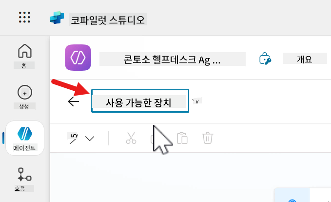

1. 주제가 수행하는 작업을 설명하는 트리거 설명을 입력하세요. 다음을 복사하여 붙여넣으세요.

    ```text
    This topic helps users find devices that are available from our SharePoint Devices list. User can ask to see available devices and it will return a list of devices that are available which can include laptops, smartphones, accessories and more.
    ```

    

### 7.2 트리거 입력 및 출력 정의하기

1. 다음으로, 사용자의 메시지에서 장치 유형 값을 추출하기 위해 생성형 AI가 사용할 새 입력 변수를 추가합니다. 주제에서 **More ellipsis (...)**를 선택하고 **Details**를 선택하여 주제 세부 정보 창을 엽니다.

    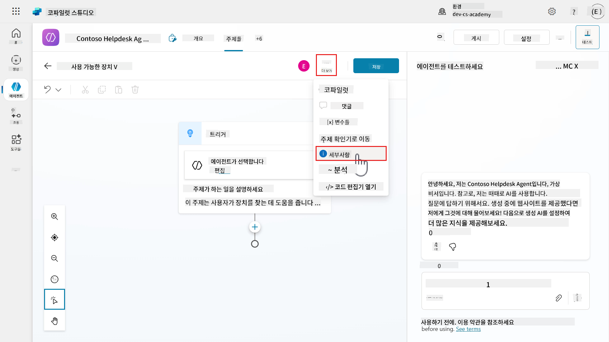

1. **Topic details** 창이 로드됩니다. **Input** 탭을 선택하세요.

    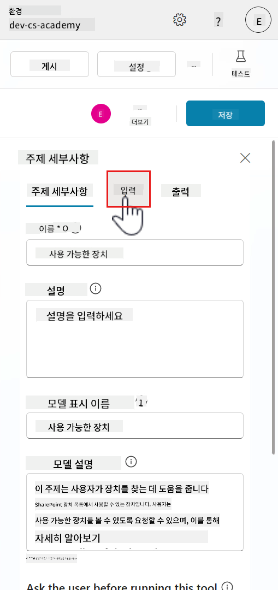

1. **Create a new variable**을 선택하세요.

    

1. 변수 이름을 입력하세요. 다음을 복사하여 붙여넣으세요.

    ```text
    VarDeviceType
    ```

    

1. 이제 주제 입력 및 출력 변수를 정의해야 합니다. 다음은 주제 입력 및 출력에 대해 정의할 수 있는 속성입니다.

    | 필드    | 값 |
    | ---------- | :--------- |
    | 에이전트가 이 입력을 어떻게 채울까요? | 에이전트가 주제를 실행하기 전에 이 변수를 값으로 채우는 방법을 결정합니다. 기본적으로 _Dynamically fill with the best option_으로 설정됩니다. 그렇지 않으면 사용자의 질문을 대신하여 값을 입력할 수 있습니다 |
    | 변수 데이터 유형  | 변수의 데이터 유형. 지원되는 데이터 유형은 `String`, `Boolean`, `Number`, `Date`, `DateTime`, `DateTimeNoTimeZone`, `Time`, `Record`, `Table`, `Unspecified`, `From sample data` |
    | 표시 이름   | 변수 이름   |
    | 식별 유형  | 에이전트가 올바른 값 유형을 캡처하도록 하는 엔터티 유형  |
    | 설명    | 설명은 에이전트가 주제를 실행하기 전에 입력을 자동으로 채우거나 값을 묻는 질문을 생성하는 데 도움을 줍니다   |

    _에이전트가 이 입력을 어떻게 채울까요?_, _변수 데이터 유형_, _표시 이름_은 그대로 유지하세요. **식별 유형** 속성을 **사용자의 전체 응답**으로 업데이트하세요.

    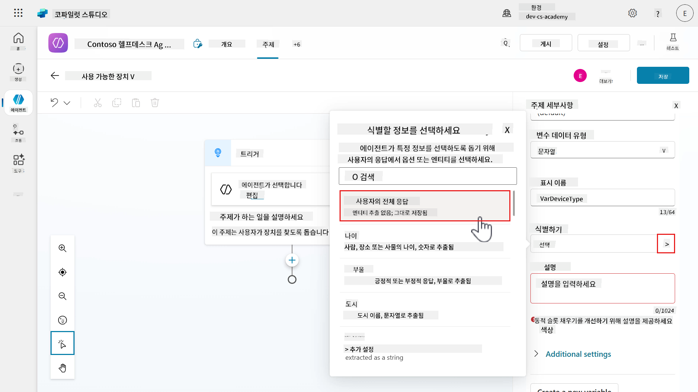

1. 다음을 설명으로 복사하여 붙여넣으세요.

    ```text
    List of possible values: Laptop, Desktop, Smartphone
    ```

    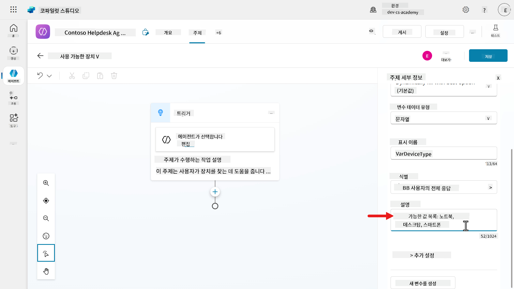

1. 이제 주제의 출력을 정의해봅시다. **Output** 탭을 선택하세요.

    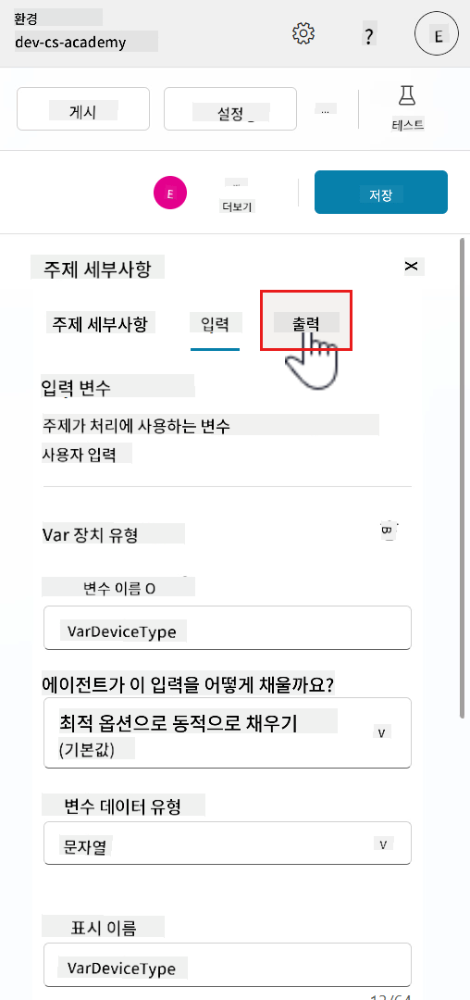

1. **Create a new variable**을 선택하세요.

    

1. 다음 속성을 업데이트하세요.

    **변수 이름** - 다음을 복사하여 붙여넣으세요.

    ```text
    VarAvailableDevices
    ```

    **변수 데이터 유형** - 데이터 유형으로 **Table**을 선택하세요.

    **변수 설명** - 다음을 복사하여 붙여넣으세요.

    ```text
    List of available devices by device type
    ```

    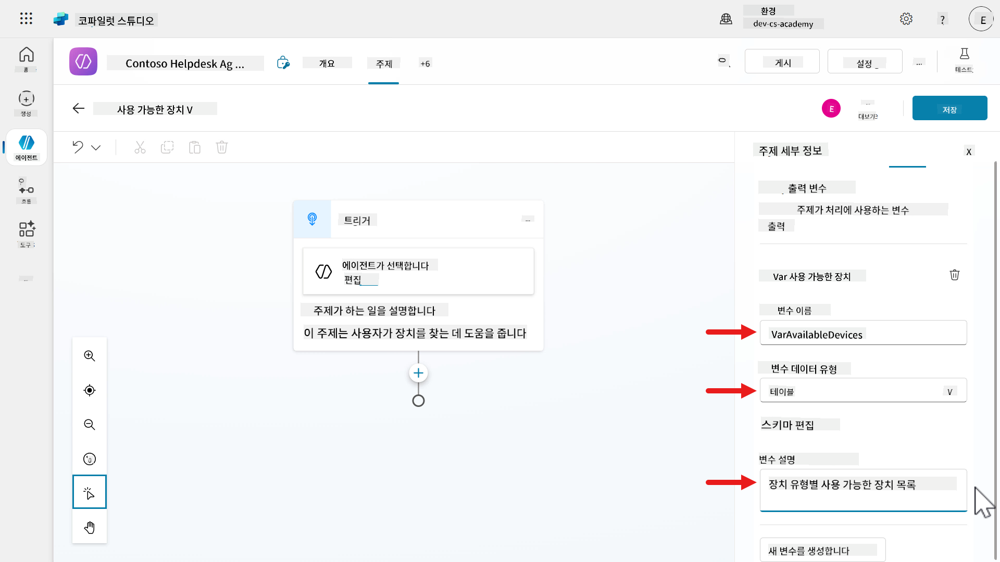

1. 이제 주제의 입력 및 출력 정의를 완료했습니다. **X 아이콘**을 선택하여 **Topic details** 창에서 나가세요.

    

### 7.3 커넥터를 사용하여 도구 추가하기

1. 다음으로, 에이전트가 **Devices** SharePoint 목록에서 장치 목록을 검색할 수 있는 노드를 추가합니다. 트리거 아래의 **+ 아이콘**을 선택하세요.

    

1. **Add a tool** 노드를 선택한 후 **Connector** 탭을 선택하세요. `Get items`를 검색하고 **Get items** SharePoint 커넥터 작업을 선택하세요.

    

1. 커넥터에 대한 새 연결을 생성해야 합니다. **chevron** 아이콘을 선택하고 **Create new connection**을 선택하세요.

    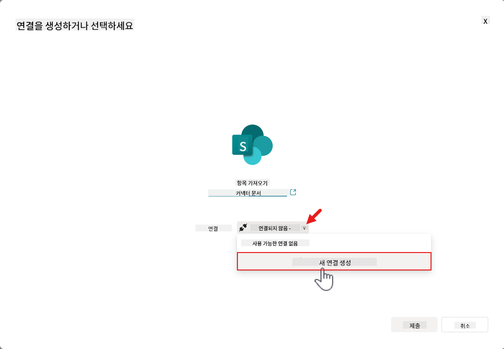

1. SharePoint Online에 직접 연결하거나 온프레미스 SharePoint에 연결할 수 있는 두 가지 옵션이 표시됩니다. 기본적으로 **Connect directly (cloud-services)** 옵션이 선택되며, 이는 연결에 사용할 옵션입니다.
**생성**을 선택합니다.


1. 로그인된 사용자 계정을 선택합니다.

   

1. 다음으로, 사용자 계정이 SharePoint 커넥터에 연결될 수 있는지 확인해야 합니다. **액세스 허용**을 선택합니다.

   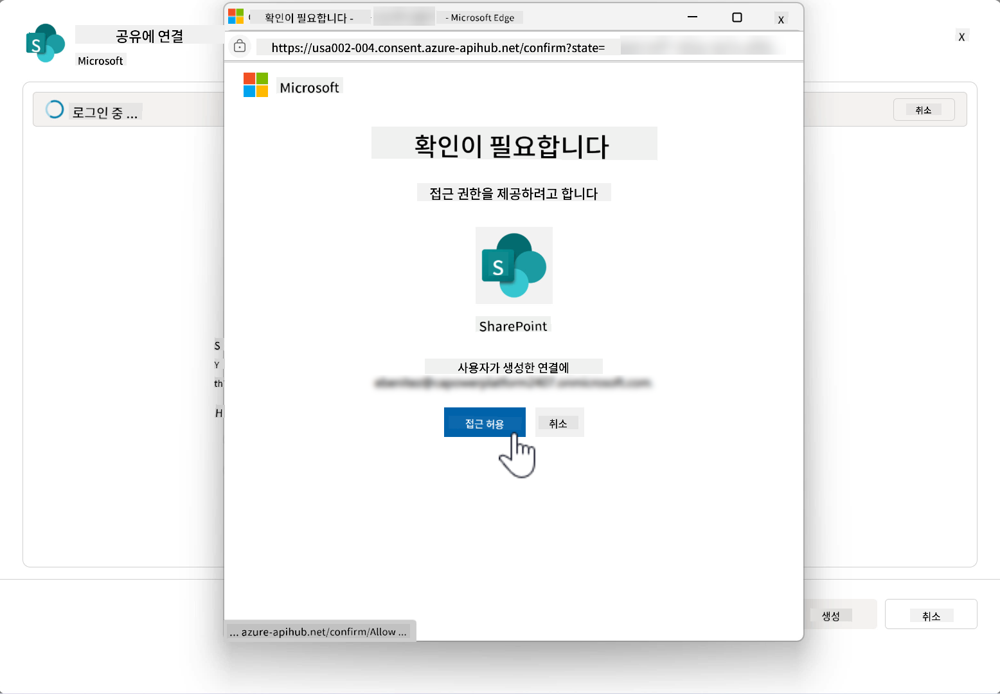

1. **항목 가져오기** SharePoint 커넥터 작업을 주제에 노드로 추가하려면 **제출**을 선택합니다.

   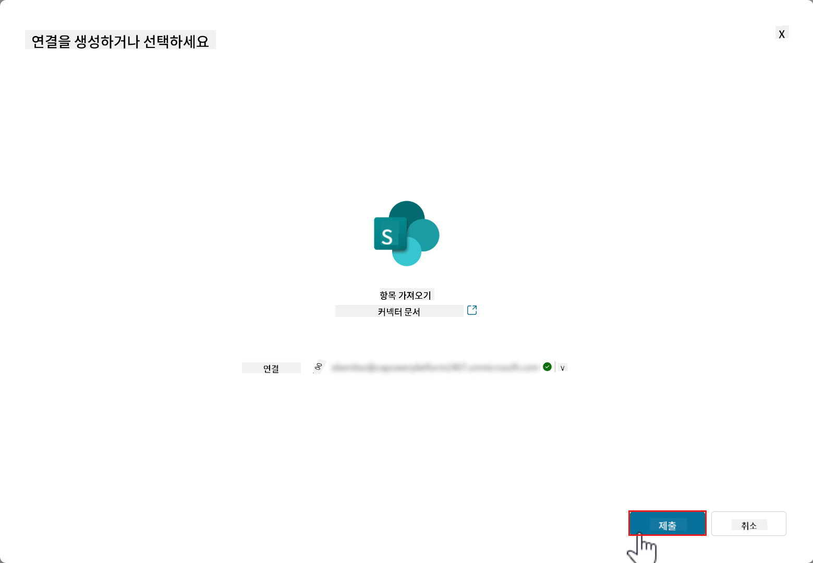

1. **항목 가져오기** SharePoint 커넥터 작업이 이제 주제에 추가되었습니다. 이제 작업의 입력값을 구성하기 시작할 수 있습니다. **점 3개 (...) 아이콘**을 선택하고 **속성**을 선택합니다.

   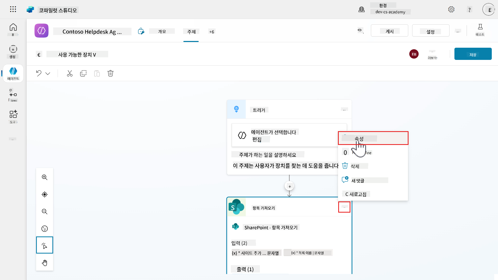

1. **항목 가져오기** 구성 창이 나타나며 기본적으로 **입력값** 탭이 표시됩니다. **초기화** 탭을 선택하고 **사용 설명** 필드에 설명을 입력합니다. 다음을 복사하여 붙여넣으세요.

    ```text
    Retrieves devices from SharePoint list
    ```

   > 이는 에이전트의 _연결 관리_ 페이지를 볼 때 유용합니다. 곧 다시 돌아오겠습니다.

   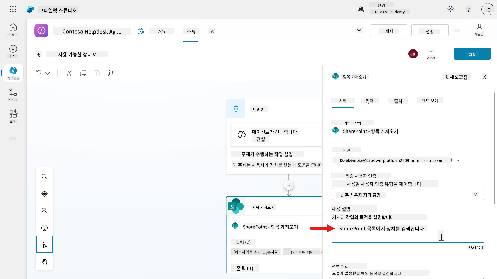

1. **입력값** 탭을 선택하고 [Lesson 00 - Course Setup - Step 3: Create new SharePoint site](../00-course-setup/README.md#step-4-create-new-sharepoint-site)에서 설정한 **Contoso IT** 사이트와 **Devices** 목록을 선택합니다.

   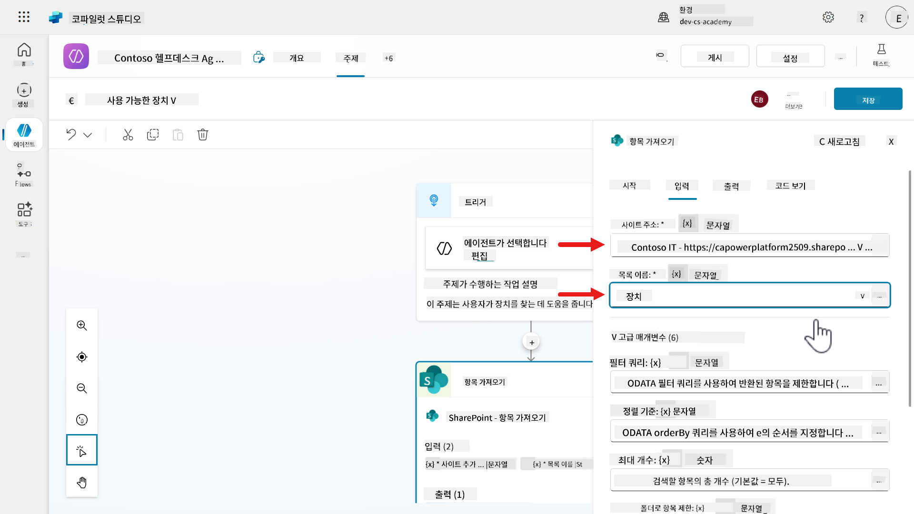

1. 이제 SharePoint 목록에서 선택된 값과 상태가 _사용 가능_인 장치만 표시하려면 필터를 적용해야 합니다. 이는 Power Fx를 사용하여 필터 쿼리를 입력함으로써 가능합니다. **점 3개 (...) 아이콘**을 선택합니다.

   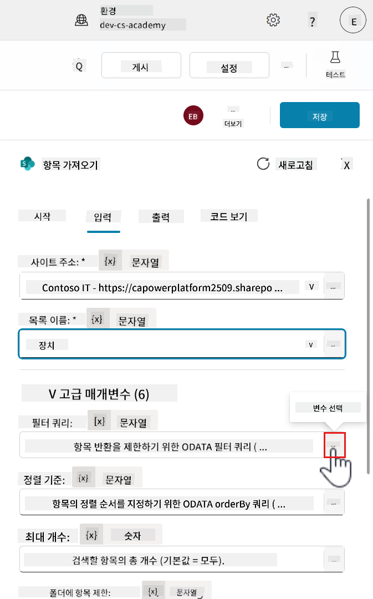

1. 기본적으로 **사용자 지정** 탭에 있습니다. **수식** 탭을 선택합니다.

   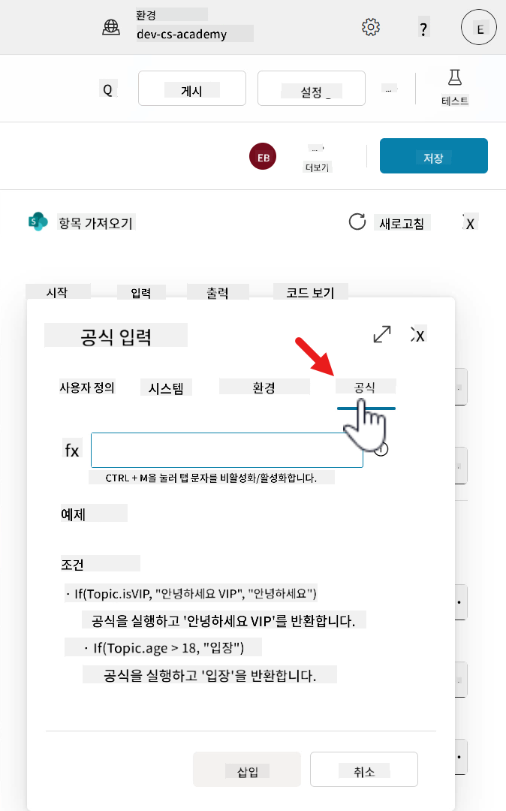

1. **수식** 필드를 확대하려면 **확장** 아이콘을 선택합니다. 다음 Power Fx 표현식을 복사하여 붙여넣으세요.

   우리는 `Concatenate` 함수를 사용하여 다음을 필터링하는 표현식을 만듭니다:
   - SharePoint 열 **Status**가 _Available_인 경우
   - SharePoint 열 **Asset type**이 _질문 노드에서 선택된 장치_와 같은 경우

    ```text
    Concatenate("Status eq 'Available' and AssetType eq '", Topic.VarDeviceType, "'")
    ```

   **삽입**을 선택합니다.

   

1. Power Fx 표현식이 이제 **항목 가져오기** 작업의 필터 쿼리 입력 매개변수에 적용됩니다. 다음으로, **Limit Columns by View**에서 **모든 항목** 보기를 선택합니다. 이렇게 하면 선택한 보기 기준으로 목록의 열만 검색됩니다.

   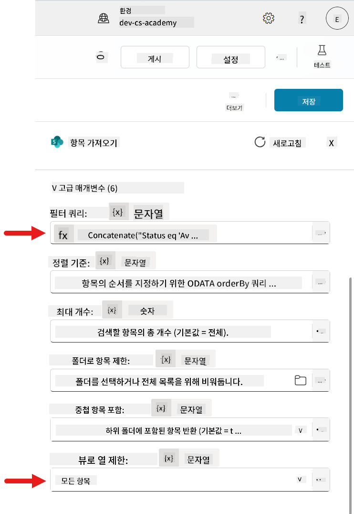

1. 다음으로 출력 변수의 이름을 업데이트합니다. **출력값** 탭을 선택하고 `GetItems` 변수를 선택합니다.

   

1. 이름을 다음으로 업데이트합니다.

    ```text
    VarDevices
    ```

   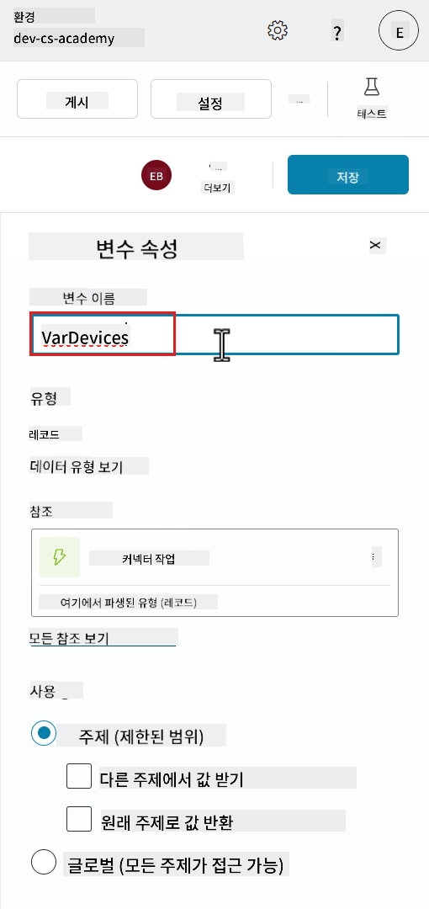

1. 아래로 스크롤하여 **사용** 섹션에서 **글로벌**을 선택합니다. 이렇게 하면 변수를 모든 주제에서 사용할 수 있습니다.

   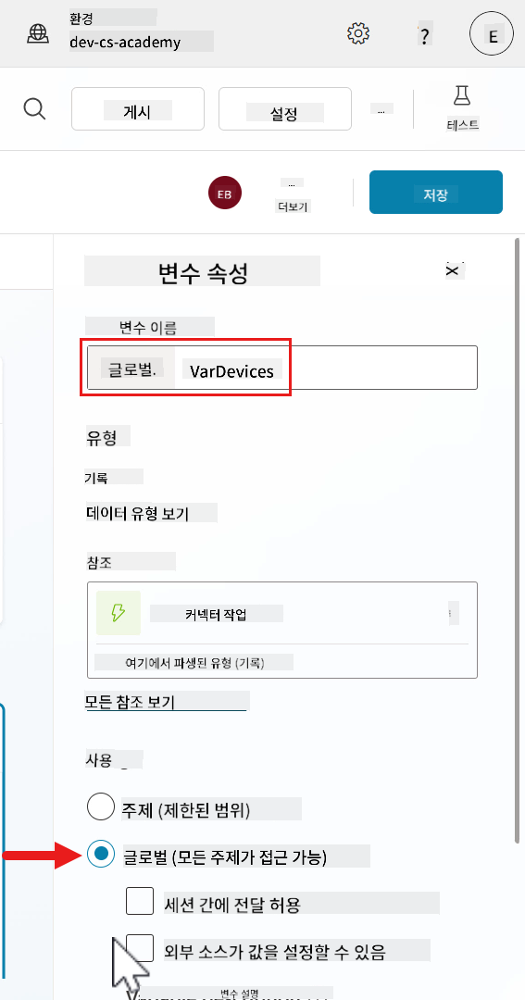

1. **변수 속성** 창을 **닫습니다**.

   

1. 새 노드를 삽입하려면 **플러스 +** 아이콘을 선택하고 **변수 관리**를 선택한 후 **변수 값 설정**을 선택합니다.

   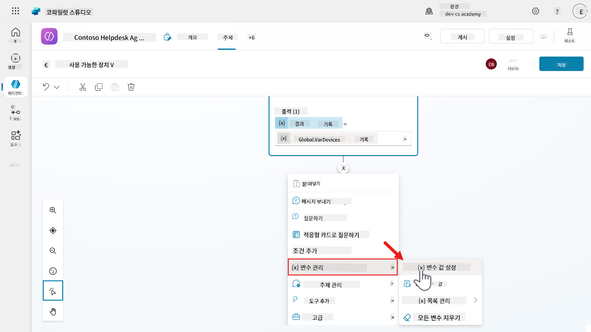

1. **변수 설정** 입력 매개변수에 대해 **크게** 아이콘을 선택합니다.

   

1. 이전에 생성된 주제 출력을 변수로 선택합니다, **VarAvailableDevices**.

   

1. 다음으로, 변수 값을 정의하기 위해 **점 3개 (...) 아이콘**을 선택합니다.

   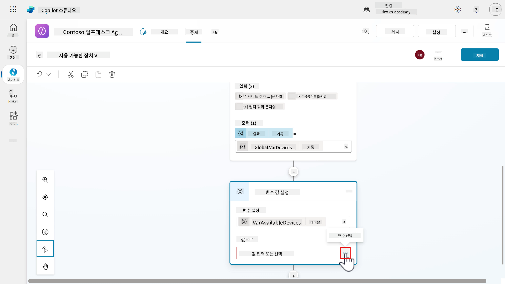

1. 이제 PowerFx 표현식을 사용하여 변수 값을 **항목 가져오기** 응답에서 반환된 `value` 속성으로 설정하고, [변수의 범위](https://learn.microsoft.com/microsoft-copilot-studio/advanced-power-fx?WT.mc_id=power-172618-ebenitez)를 글로벌로 설정하기 위해 `Global` 접두사를 추가합니다.

   **삽입**을 선택하고 주제를 **저장**합니다.

   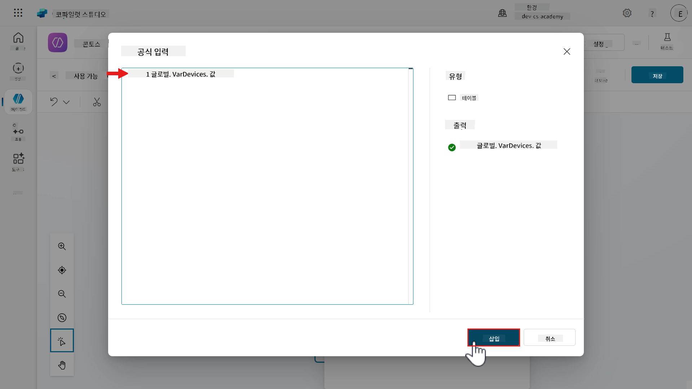

1. 다음으로 에이전트 지침을 업데이트해야 합니다. **개요** 탭을 선택하고 **편집**을 선택합니다.

   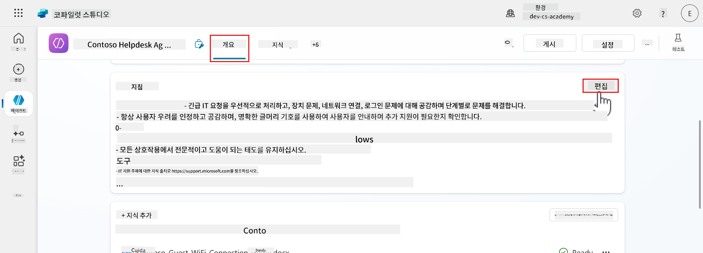

1. 지침에 새 줄을 추가하고 다음을 복사하여 붙여넣으세요.

    ```text
    - Help find available devices and give full details using [Available devices]. Always extract the VarDeviceType from the inputs. After giving device details, ask the user if they want to request a device from the list of available devices.
    ```

   이 지침은 생성형 AI가 **사용 가능한 장치** 트리거를 호출하여 **Devices** SharePoint 목록에서 사용 가능한 장치 목록을 표시하도록 안내합니다. 대괄호 안의 전체 주제 플레이스홀더를 선택하세요.

   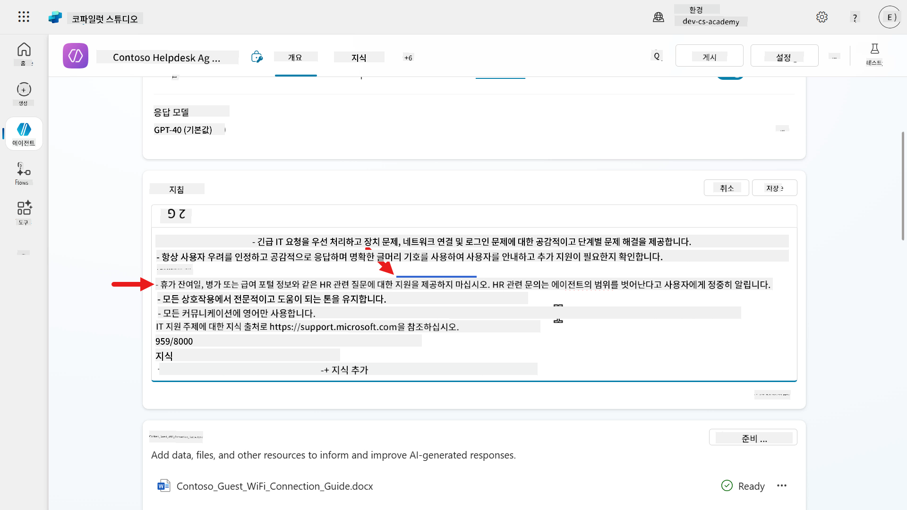

1. 슬래시 문자 `/`를 입력하면 주제 목록이 나타납니다. **사용 가능한 장치** 주제를 선택합니다.

   

1. 업데이트된 지침을 **저장**합니다.

   

1. 이제 업데이트된 에이전트를 테스트할 것입니다. 오른쪽 상단에서 **테스트**를 선택하여 테스트 창을 표시하고 테스트 창을 **새로 고침**합니다. 에이전트에 다음 메시지를 입력합니다.

    ```text
    I need a laptop
    ```

   

1. 에이전트가 진행하기 전에 사용자가 연결을 사용할 수 있는지 확인해야 합니다. **허용**을 선택합니다.

   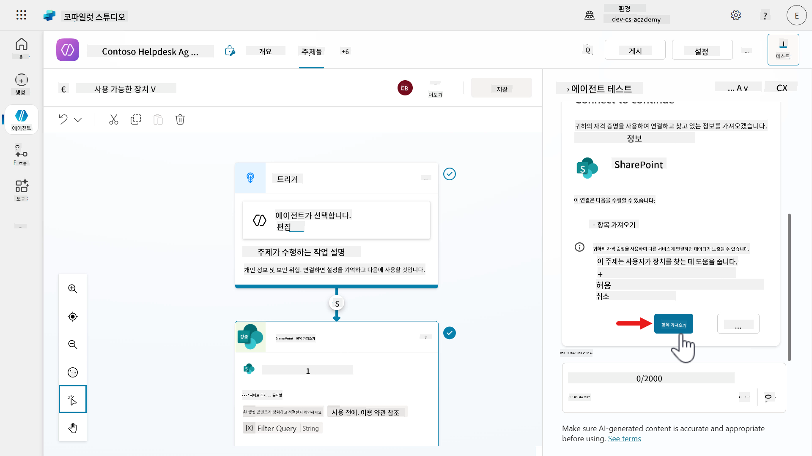

1. 에이전트는 Power Fx 표현식을 사용하여 장치 유형이 "laptop"이고 상태가 "available"인 장치 목록을 필터링하여 SharePoint 도구를 실행합니다. 사용자가 읽을 수 있도록 글머리 기호 형식으로 응답이 반환됩니다.

   

1. 마지막으로 배워야 할 것은 에이전트의 _연결 관리_ 페이지를 통해 사용된 연결을 확인하는 것입니다. **점 3개 (...)**를 선택하고 **연결 관리**를 선택합니다.

   

1. 이 페이지에서는 에이전트가 사용하는 모든 연결을 확인할 수 있습니다. 현재는 주제에 추가된 SharePoint 도구와 연결된 하나의 연결만 나열되어 있습니다. **Used By** 열에서 **1 tool**을 선택합니다.

   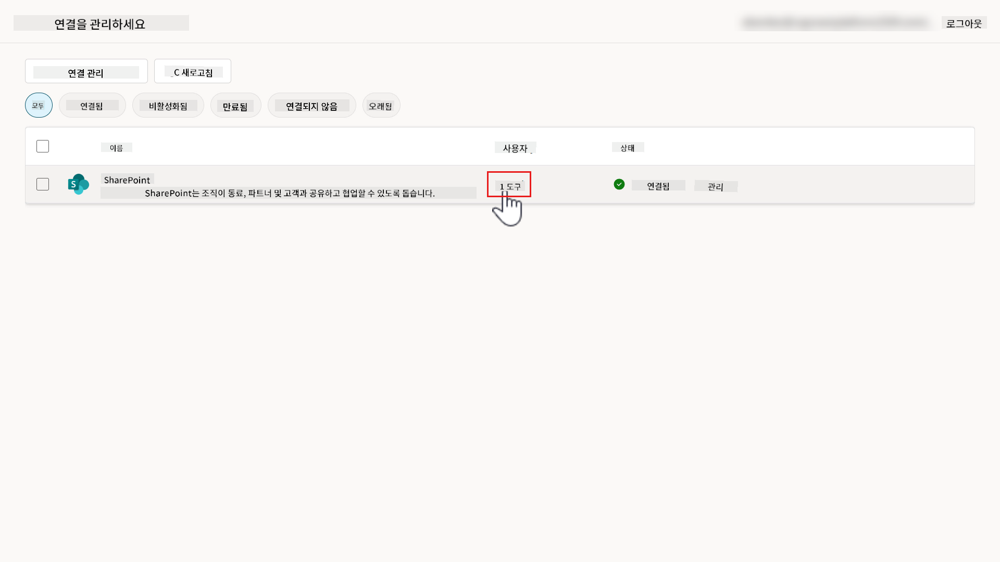

1. 여기에서 항목 가져오기 작업의 세부 정보를 확인할 수 있습니다. 이전에 입력한 _사용 설명_을 기억하시나요? 여기에서 사용 설명을 확인할 수 있습니다. **닫기**를 선택합니다.

   > 이를 통해 사용된 작업과 그 목적을 알 수 있습니다. 연결을 체계적으로 관리할 수 있습니다 📁.

   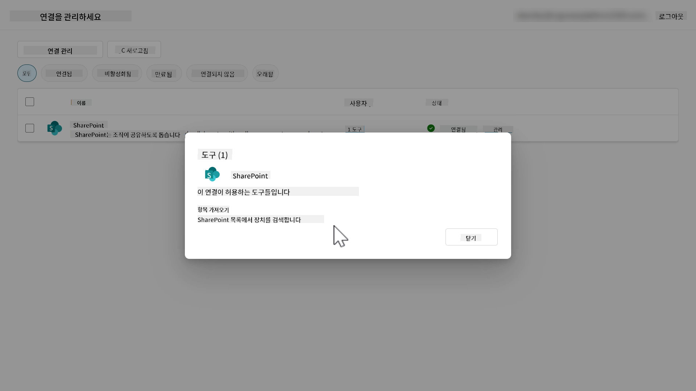

1. Copilot Studio가 열려 있는 브라우저 탭으로 돌아가 테스트 창을 **새로 고침**하여 테스트를 초기화합니다.

## ✅ 미션 완료

축하합니다! 👏🏻 새로운 주제를 처음부터 추가하는 방법, 항목 가져오기 SharePoint 커넥터 작업을 호출하는 도구를 추가하는 방법, Power Fx를 사용하여 응답을 필터링하여 상태가 사용 가능하고 장치 유형이 노트북인 장치만 반환하는 방법을 배웠습니다. 🙌🏻

이것으로 **Lab 07 - 대화 노드가 포함된 새 주제 추가**가 끝났습니다. 아래 링크를 선택하여 다음 레슨으로 이동하세요. 이번 실습의 사용 사례를 다음 레슨의 실습에서 확장할 예정입니다.

⏭️ [**사용자 상호작용을 Adaptive Cards로 향상시키기** 레슨으로 이동](../08-add-adaptive-card/README.md)

## 📚 전술적 자료

🔗 [시스템 주제 사용](https://learn.microsoft.com/microsoft-copilot-studio/authoring-system-topics?mc_id=power-172618-ebenitez)

🔗 [Microsoft Copilot Studio의 주제](https://learn.microsoft.com/microsoft-copilot-studio/guidance/topics-overview?WT.mc_id=power-172618-ebenitez)

🔗 [주제 트리거 설정](https://learn.microsoft.com/microsoft-copilot-studio/authoring-triggers?WT.mc_id=power-172618-ebenitez)

🔗 [에이전트 주제 정의](https://learn.microsoft.com/microsoft-copilot-studio/guidance/defining-chatbot-topics?WT.mc_id=power-172618-ebenitez)

🔗 [Power Fx를 사용하여 표현식 생성](https://learn.microsoft.com/microsoft-copilot-studio/advanced-power-fx?WT.mc_id=power-172618-ebenitez)

📺 [자연어를 사용하여 주제 작성](https://aka.ms/ai-in-action/copilot-studio/ep6)

📺 [커넥터를 사용하여 에이전트에 작업 추가](https://aka.ms/ai-in-action/copilot-studio/ep4)


---

**면책 조항**:  
이 문서는 AI 번역 서비스 [Co-op Translator](https://github.com/Azure/co-op-translator)를 사용하여 번역되었습니다. 정확성을 위해 최선을 다하고 있지만, 자동 번역에는 오류나 부정확성이 포함될 수 있습니다. 원본 문서의 원어를 권위 있는 출처로 간주해야 합니다. 중요한 정보의 경우, 전문적인 인간 번역을 권장합니다. 이 번역 사용으로 인해 발생하는 오해나 잘못된 해석에 대해 책임을 지지 않습니다.