<!--
CO_OP_TRANSLATOR_METADATA:
{
  "original_hash": "dcbcd9396b076da0a0f5d389e9ec1b12",
  "translation_date": "2025-10-22T00:46:45+00:00",
  "source_file": "docs/recruit/08-add-adaptive-card/README.md",
  "language_code": "ko"
}
-->
# 🚨 미션 08: Adaptive Cards로 Topics에서 사용자 상호작용 강화하기

## 🕵️‍♂️ 코드명: `OPERATION INTERFACE UPLIFT`

> **⏱️ 작업 시간:** `~45분`

🎥 **워크스루 보기**

[](https://www.youtube.com/watch?v=RhIlzYHPCXo "YouTube에서 워크스루 보기")

## 🎯 미션 브리프

요원 여러분, 이번 미션은 정적인 사용자 경험을 침투하여 풍부하고 동적인, 실행 가능한 Adaptive Cards로 교체하는 것입니다. JSON 페이로드와 Power Fx 공식을 활용하여 Copilot Studio 대화를 기본 Q&A에서 완전히 상호작용 가능한 형태로 변환하세요. 사용자 입력을 수집하고 데이터를 아름답게 표시하며 대화를 정밀하고 스타일 있게 이끄는 것이 목표입니다. 적응하지 못하면 사용자가 덜 지능적인 인터페이스로 이탈할 수 있습니다.

## 🔎 목표

이번 미션에서 배우게 될 내용:

1. Adaptive Cards가 무엇인지 이해하고 Copilot Studio에서 사용자 상호작용을 어떻게 향상시키는지 배우기
1. JSON과 Power Fx 공식을 사용하여 동적 콘텐츠를 위한 인터랙티브 카드 제작하기
1. Adaptive Card Designer와 시각적 카드 제작을 위한 주요 구성 요소 탐색하기
1. 에이전트 주제 내에서 풍부하고 인터랙티브한 양식 및 데이터 수집 경험 만들기
1. 반응형이고 사용자 친화적인 Adaptive Cards를 디자인하기 위한 모범 사례 구현하기

## 🤔 Adaptive Card란 무엇인가?

**Adaptive Card**는 Microsoft Teams, Microsoft Outlook 또는 에이전트와 같은 앱에 삽입할 수 있는 인터랙티브하고 시각적으로 풍부한 UI 요소를 만드는 방법입니다. 이는 카드의 레이아웃과 콘텐츠를 정의하는 구조화된 JSON 객체입니다:

- 카드에 표시되는 요소 - 텍스트, 이미지, 버튼
- 요소가 배열되는 방식
- 사용자가 수행할 수 있는 작업, 예를 들어 양식 제출 또는 링크 열기

    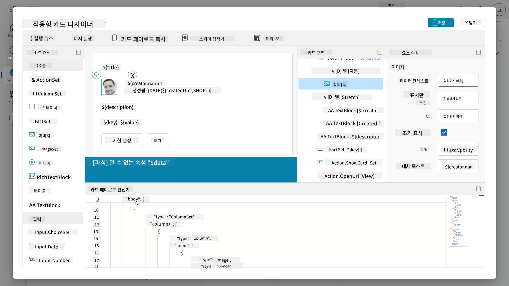

### Copilot Studio에서 Adaptive Cards가 중요한 이유

사용자에게 이름, 이메일 또는 피드백을 요청하는 에이전트를 구축한다고 상상해보세요. 단순한 텍스트만 사용하면 대화가 지루하거나 따라가기 어려울 수 있습니다. 바로 여기서 Adaptive Cards가 등장합니다!

1. **대화를 인터랙티브하게 만듦** - 사용자에게 메시지로 텍스트를 보내는 대신 버튼, 양식, 이미지 등을 표시할 수 있습니다.
    - 예: 깨끗한 양식에서 사용자에게 이름과 이메일을 입력하도록 요청하는 카드.

1. **어디서나 멋지게 보임** - Adaptive Cards는 Microsoft 365 Copilot 채팅 또는 Microsoft Teams와 같은 앱의 스타일에 자동으로 맞춰집니다. 다크 모드, 글꼴, 레이아웃에 대해 걱정할 필요가 없습니다 - 자동으로 적응합니다.

1. **JSON으로 쉽게 제작 가능** - JSON 코드로 카드를 정의합니다(즉, UI를 위한 _레시피_). Copilot Studio는 주제에 카드를 추가하기 전에 미리보기를 제공합니다.

1. **데이터 수집 및 활용** - 카드를 사용하여 질문을 하고 답변을 수집하며 대화 흐름에서 해당 데이터를 사용할 수 있습니다.
    - 예: 사용자의 전화번호를 요청한 후 전화번호를 확인하는 카드를 표시합니다.

1. **사용자 경험 향상** - 카드는 에이전트를 더 인터랙티브하게 만듭니다. 더 깨끗하고 클릭 가능하며 사용자 친화적인 인터페이스 유형입니다.

## 🐱 _JSON_은 사람인가요?

"Jason"으로 발음되며, 사람은 아닙니다 😅

JSON, 즉 _JavaScript Object Notation_은 데이터를 구조화하는 데 사용되는 경량 형식입니다. 읽고 쓰기 쉽고 중괄호 {} 안에 키-값 쌍으로 구성됩니다.

이는 주제에 Adaptive Card를 추가할 때 사용할 수 있는 옵션 중 하나입니다.

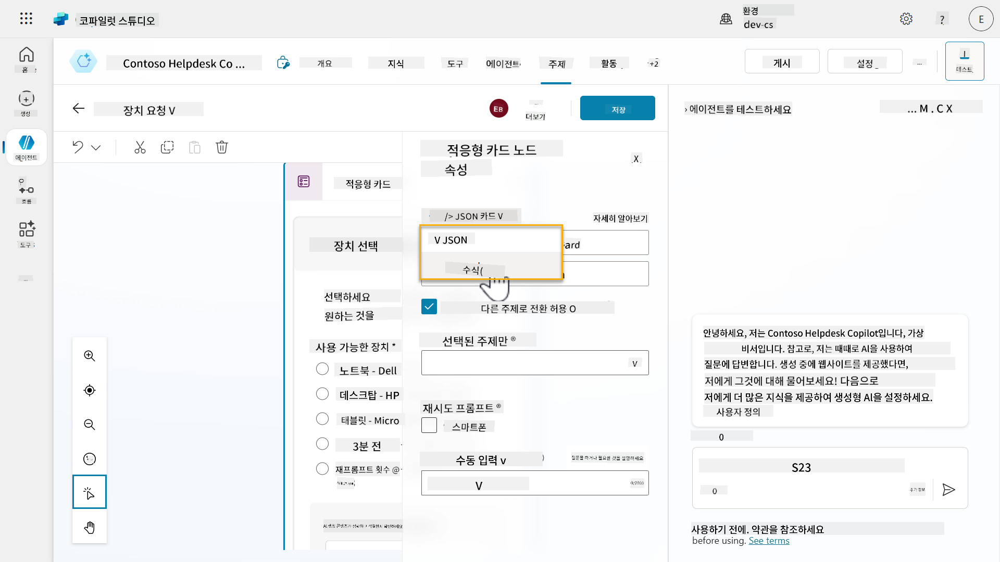

## 👀 _공식_을 사용하여 Adaptive Card를 만드는 또 다른 옵션이 보입니다

[Mission 07 - 노드에서 Power Fx 사용하기](../07-add-new-topic-with-trigger/README.md#what-power-fx-can-do-in-topics)에서 배운 Power Fx를 Adaptive Cards에서도 동일하게 적용할 수 있습니다.

간단히 복습하자면,

!!! note
    Power Fx는 에이전트에 논리와 동적 동작을 추가하는 데 사용되는 로우코드 프로그래밍 언어입니다. Microsoft Power Apps에서 사용되는 동일한 언어로, 간단하고 Excel과 유사하여 개발자와 비개발자 모두 쉽게 사용할 수 있습니다.

### Adaptive Cards에서 Power Fx의 작동 방식

Copilot Studio에서 Adaptive Card를 디자인할 때 Power Fx 공식을 사용하여 다음을 수행할 수 있습니다:

- 사용자 이름, 날짜 또는 상태와 같은 값을 동적으로 삽입.
- 통화 표시 또는 숫자 반올림과 같은 텍스트 또는 숫자 형식 지정.
- 조건에 따라 요소 표시 또는 숨기기.
- 사용자 입력, 변수, 대화 노드의 출력에 따라 응답을 사용자 정의.

예를 들어,

"`Hello`" & `System.User.DisplayName`

이 공식은 "Hello"라는 단어와 사용자의 이름을 동적으로 결합합니다.

### 유용한 이유

1. **개인화**

    각 사용자에게 메시지를 맞춤화하여 상호작용을 더 자연스럽고 관련성 있게 만듭니다.

1. **동적 콘텐츠**

    카드가 대화 노드의 변수 및 출력에서 실제 데이터를 표시할 수 있습니다.

1. **스마트 로직**

    조건에 따라 사용자가 볼 수 있는 내용이나 상호작용할 수 있는 내용을 제어하여 사용성을 개선하고 오류를 줄입니다.

1. **로우코드 친화적**

    Power Fx는 로우코드 프로그래밍 언어입니다. 앞서 언급했듯이 읽기 쉽고 직관적이며 Excel 공식과 유사합니다.

## 👷🏻‍♀️ Adaptive Card Designer로 제작하기

**Adaptive Card Designer**는 텍스트, 이미지, 버튼, 입력란과 같은 드래그 앤 드롭 요소를 사용하여 인터랙티브 메시지 카드를 시각적으로 제작할 수 있는 도구입니다. 복잡한 코드를 작성하지 않고도 풍부하고 동적인 메시지를 생성할 수 있도록 설계되어 사용자 친화적인 인터페이스를 디자인하기 쉽게 만듭니다.

디자이너 도구는 시각적으로 카드를 제작하도록 돕지만, 내부적으로는 JSON 객체를 생성합니다. 또한 _공식_으로 전환하여 Power Fx 표현식을 카드에 사용하여 다른 곳의 데이터를 표시할 수 있습니다.

## 🎨 Adaptive Card Designer 이해하기

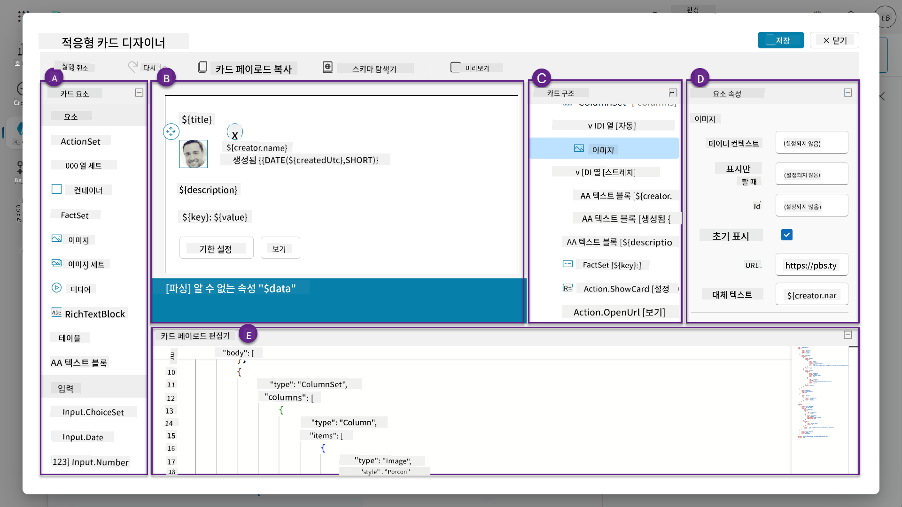

### A) 카드 요소

Adaptive Card의 구성 요소입니다. 다음과 같은 요소를 드래그 앤 드롭할 수 있습니다:

- **TextBlock**: 텍스트 표시.
- **Image**: 이미지 표시.
- **FactSet**: 키-값 쌍.
- **입력 필드**: 텍스트 박스, 날짜 선택기, 토글 표시.
- **Actions**: _Submit_, _Open URL_, _Show Card_와 같은 버튼 표시.

각 요소는 고유한 목적을 가지며 스타일을 지정하거나 구성할 수 있습니다.

### B) 카드 뷰어

카드가 실시간으로 어떻게 보일지 확인할 수 있는 **미리보기** 영역입니다. 요소를 추가하거나 편집할 때 뷰어가 즉시 업데이트되어 변경 사항을 반영합니다. 이를 통해 반복적으로 업데이트하고 디자인 결과를 동시에 확인할 수 있습니다.

### C) 카드 구조

카드의 **계층 및 레이아웃**을 보여줍니다. 예를 들어:

- 카드가 **TextBlock**으로 제목을 시작할 수 있습니다.
- 그런 다음 한쪽에는 이미지가 있고 다른 쪽에는 텍스트가 있는 **ColumnSet**.
- 이어서 **FactSet**과 몇 가지 **Action 버튼**.

요소가 어떻게 중첩되고 구성되는지 이해하는 데 도움이 됩니다.

### D) 요소 속성

카드의 요소를 클릭하면 이 패널에서 **설정을 사용자 정의**할 수 있습니다:

- 텍스트 크기, 굵기 또는 색상 변경.
- 이미지 URL 또는 대체 텍스트 설정.
- 입력 옵션 구성(예: 플레이스홀더 텍스트 또는 기본값).

여기에서 각 요소를 세부적으로 조정합니다.

### E) 카드 페이로드 편집기

카드의 **원시 JSON 코드**입니다. 고급 사용자는 이를 직접 편집하여:

- 템플릿 기능 사용.
- 카드 정의 복사/붙여넣기.

Adaptive Card 디자이너에 익숙하지 않더라도 시각적 디자인이 코드로 어떻게 변환되는지 보는 데 유용합니다.

!!! tip "팁 - Adaptive Card 샘플 확인하기"

    1. [https://adaptivecards.microsoft.com/designer](https://adaptivecards.microsoft.com/designer)로 이동합니다.
    2. **새 카드**를 선택하여 수정할 수 있는 샘플 목록을 확인합니다.
    3. 이 디자이너는 외부(웹 기반)입니다. 웹 기반 Adaptive Card Designer에서 카드를 제작한 후 Card Payload Editor에서 JSON을 복사합니다.
    4. Copilot Studio의 에이전트에서 Adaptive Card에 JSON을 붙여넣습니다.

    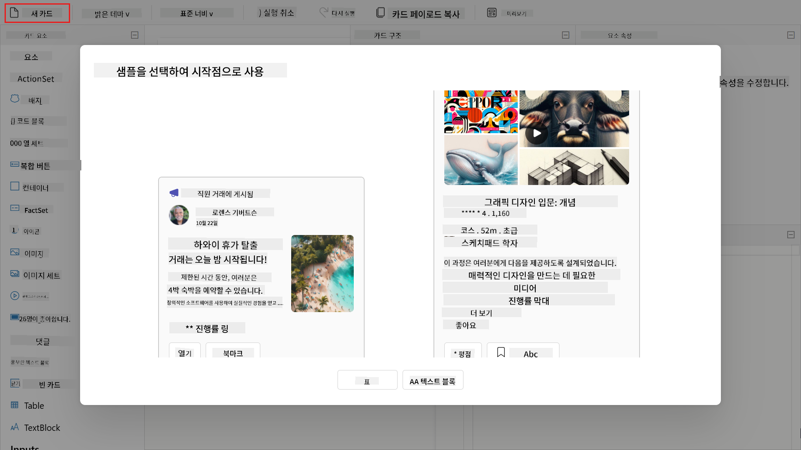

## 🌵 일반적인 사용 사례

다음은 Copilot Studio에서 **메시지 보내기** 또는 **질문하기** 노드에서 Adaptive Cards를 사용할 때의 일반적인 사용 사례입니다.

1. **양식 및 데이터 수집**

    Adaptive Cards를 사용하여 사용자로부터 구조화된 입력을 수집합니다. 예를 들어:

    - 휴가 요청
    - 피드백 양식
    - 연락처 정보
    - 약속 일정

1. **동적 정보 표시**

    ServiceNow, SAP, Dynamics 365, SharePoint 등 기업 소스에서 개인화된 또는 실시간 데이터를 깨끗하고 읽기 쉬운 형식으로 사용자에게 표시합니다.

    - 주문 요약
    - 계정 잔액
    - 티켓 또는 사례 상태
    - 다가오는 이벤트 또는 마감일

1. **인터랙티브 선택**

    대화에서 사용자가 직접 선택할 수 있도록 합니다:

    - 옵션 목록에서 선택, 예를 들어 제품 카테고리, 지원 주제.
    - 작업 확인 또는 취소.
    - 서비스 또는 경험 평가.

1. **작업 트리거**

    대화 내부 또는 외부에서 추가 단계를 트리거하는 버튼 포함.

    - "요청 제출"
    - "세부 정보 보기"

## ⭐ 모범 사례

Copilot Studio의 에이전트를 위한 Adaptive Cards를 만들 때의 모범 사례는 다음과 같습니다.

1. **간단하고 집중적으로 유지**

    - 명확한 목적을 가진 카드 디자인, 너무 많은 요소로 과부하를 주지 마세요.
    - 간결한 텍스트와 직관적인 레이아웃을 사용하여 사용자가 상호작용을 쉽게 할 수 있도록 합니다.

1. **입력을 의도적으로 포함**

    - 텍스트, 날짜 선택 등 필요한 입력 요소만 포함하여 사용자를 압도하지 않도록 합니다.
    - 입력을 쉽게 이해할 수 있도록 레이블을 사용하세요.

1. **가독성을 위한 구조화**

    - **TextBlocks**를 사용하여 제목과 지침을 표시합니다.
    - **Containers** 또는 **ColumnSets**를 사용하여 관련 요소를 그룹화하여 시각적 흐름을 개선합니다.

1. **Action 요소를 명확하게 만듦**

    - **Action.Submit** 또는 **Action.OpenUrl**을 사용하여 "요청 제출" 또는 "세부 정보 보기"와 같은 명확한 버튼 제목을 사용하세요.
    - "여기를 클릭하세요"와 같은 모호한 레이블은 피하세요.

1. **적응성을 고려하여 디자인**

    - 카드가 다양한 화면 크기에서 볼 수 있다는 점을 고려하세요.
    - 고정 너비를 피하고 **ColumnSets**와 같은 유연한 레이아웃을 사용하여 반응성을 높이세요.

1. **가능한 경우 동적 콘텐츠 사용**

    - Power Fx를 사용하여 카드 요소를 노드의 변수 또는 출력에 바인딩하여 사용자 경험을 개인화하세요.
    - 예를 들어, 사용자의 이름이나 현재 상태를 동적으로 표시합니다.

## 🧪 실습 08 - Adaptive Cards 추가 및 주제 기능 강화

이제 Adaptive Cards를 추가하고 주제와 노드의 고급 기능을 사용하여 주제를 강화하는 방법을 배워보겠습니다.

- [8.1 사용자가 요청을 제출할 수 있는 Adaptive Card가 포함된 새 주제 만들기](../../../../../docs/recruit/08-add-adaptive-card)
- [8.2 에이전트 지침 업데이트하여 Request device 주제 호출](../../../../../docs/recruit/08-add-adaptive-card)

### ✨ 사용 사례

**직원으로서**

**기기를 요청하고 싶습니다**

**그래서** 사용 가능한 기기 목록에서 기기를 요청할 수 있습니다

시작해봅시다!

### 사전 준비

1. **SharePoint 목록**

    [Lesson 00 - 코스 설정 - Step 3: 새 SharePoint 사이트 만들기](../00-course-setup/README.md#step-4-create-new-sharepoint-site)에서 **Devices** SharePoint 목록을 사용할 것입니다.

    **Devices** SharePoint 목록을 설정하지 않았다면 [Lesson 00 - 코스 설정 - Step 3: 새 SharePoint 사이트 만들기](../00-course-setup/README.md#step-4-create-new-sharepoint-site)로 돌아가세요.

1. **Contoso Helpdesk Copilot**

    이전에 생성한 에이전트를 [Lesson 06 - 자연어를 사용하여 Copilot과 데이터를 기반으로 사용자 정의 에이전트 생성](../06-create-agent-from-conversation/README.md)에서 사용할 것입니다.

### 8.1 사용자가 요청을 제출할 수 있는 Adaptive Card가 포함된 새 주제 만들기

사용자의 기기 요청을 처리할 새 주제를 만들 것입니다. 이 새 주제는 사용자와 에이전트 간의 상호작용을 가능하게 하는 **Ask with adaptive card** 노드를 포함할 것입니다.

시작해봅시다!

1. **Topics** 탭을 선택한 다음 **+ Add a topic from blank**를 선택합니다.

    

1. 주제 이름을 다음과 같이 입력합니다.

    ```text
    Request device
    ```

    트리거 설명으로 다음을 입력합니다.

    ```text
    This topic helps users request a device when they answer yes to the question that asks the user if they would like to request one of these devices.
    ```

    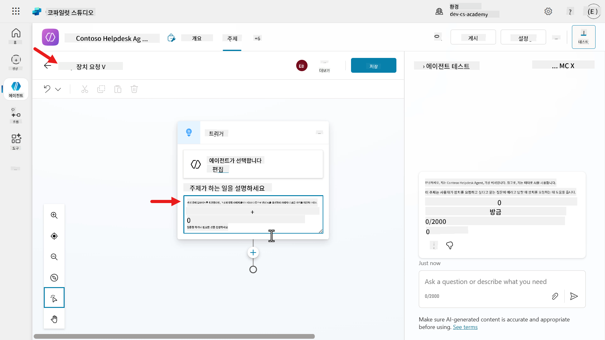
1. 다음으로 **적응형 카드로 질문하기(Ask with adaptive card)** 노드를 추가합니다. 이 노드는 사용자가 요청하고자 하는 장치를 선택할 수 있는 인터랙티브 카드를 표시합니다.

    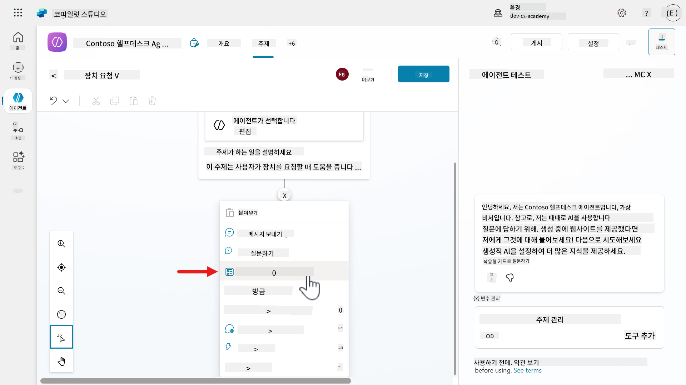

1. 노드를 선택하면 **적응형 카드 노드 속성(Adaptive Card Node properties)** 창이 나타납니다. 이제 JSON을 편집할 것입니다. **적응형 카드 편집(Edit adaptive card)**을 선택합니다.

    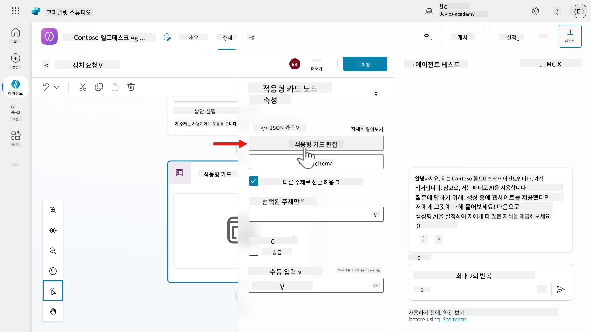

1. 여기는 **적응형 카드 디자이너(Adaptive Card Designer)**로, 카드를 디자인하고 실시간으로 카드 디자인을 확인할 수 있습니다.

    **TextBlock**과 **FactSet** 카드 요소를 작성 캔버스와 카드 뷰어 영역으로 드래그 앤 드롭해보세요. 두 카드 요소가 추가되면서 카드 구조와 카드 페이로드 편집기가 업데이트되는 것을 확인할 수 있습니다. 카드 페이로드 편집기와 요소 속성 창에서 직접 업데이트할 수도 있습니다.

    

1. **미리보기(Preview)**를 선택하여 다양한 너비에서 카드를 확인합니다.

    

1. 미리보기가 로드되면 다양한 너비에 따른 카드 출력이 표시됩니다.

    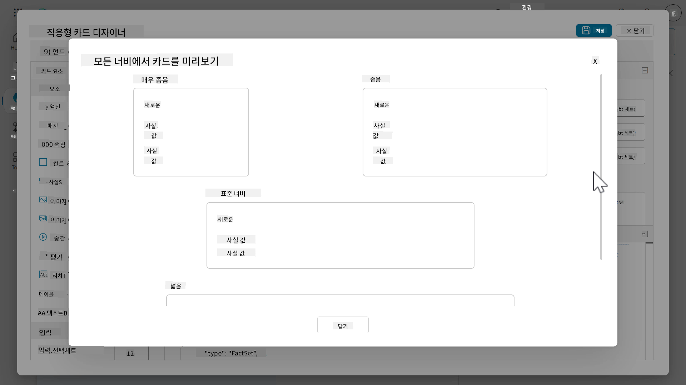

1. **미리보기(Preview)**에서 **x 아이콘**을 선택하여 나가고, 디자이너에서 이전에 추가한 두 카드 요소를 제거하려면 **되돌리기(Undo)**를 선택합니다.

    

1. **카드 페이로드 편집기(Card payload editor)**로 이동하여 Windows 키보드 단축키 _Ctrl + A_ 또는 Mac 키보드 단축키 _Command + A_를 사용해 모든 줄을 선택한 후 삭제합니다. [Request devices .JSON 파일](../../../../../docs/recruit/08-add-adaptive-card/assets/8.1_RequestDevice.json)에서 JSON을 **붙여넣기(Paste)** 합니다.

    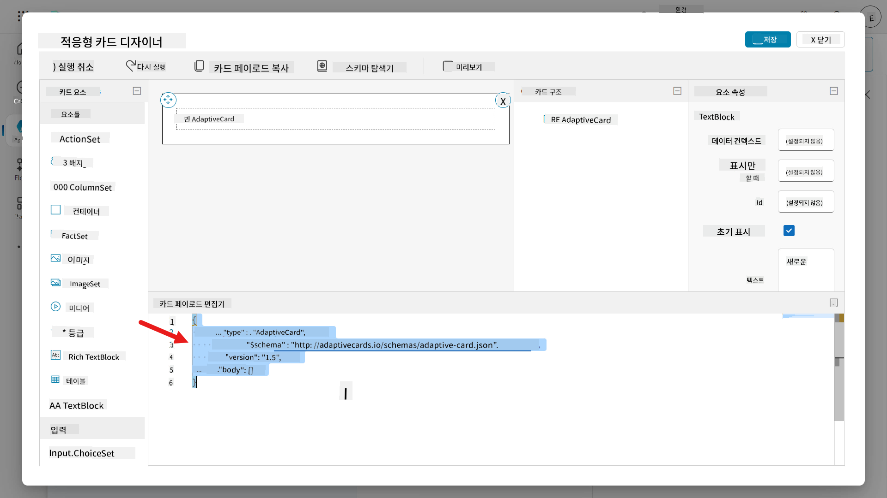

1. 이제 **카드 미리보기(Card Preview)**에 텍스트와 사용 가능한 장치 목록을 표시하는 요소가 포함된 것을 확인할 수 있습니다.

    이 JSON은 현재 플레이스홀더이며, 우리가 사용할 카드의 기본 형태를 미리보기로 보여줍니다. 이후 JSON 대신 **글로벌 변수** `Global.VarDevices.value`를 참조하는 수식 형태로 사용할 것입니다. 이 변수는 **Get items** SharePoint 커넥터 작업의 응답을 저장합니다.

    **저장(Save)**을 선택하고 **닫기(Close)**를 선택하여 적응형 카드 디자이너 모달에서 나갑니다.

    

1. **적응형 카드 노드 속성(Adaptive Card Node properties)** 패널을 **X 아이콘**을 선택하여 닫습니다.

    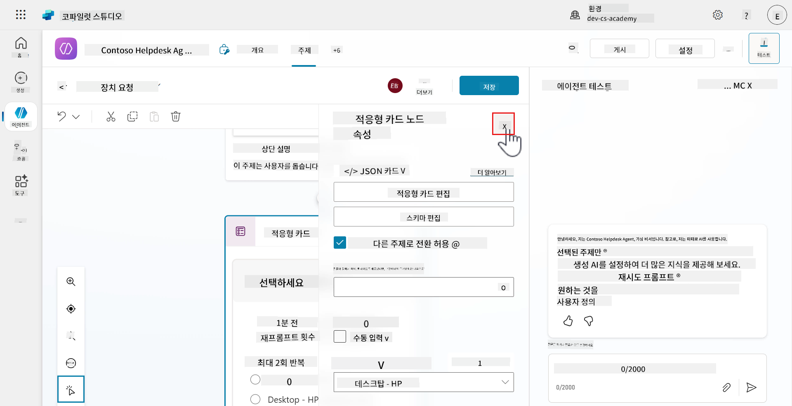

1. 주제의 작성 캔버스에서 적응형 카드를 확인할 수 있습니다.

    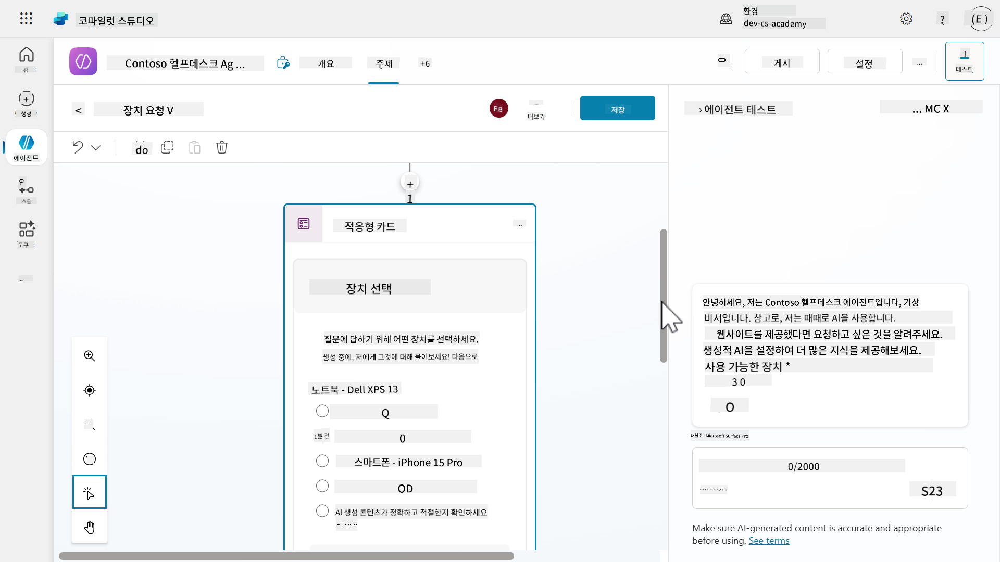

1. 노드 하단으로 스크롤하면 출력 변수를 확인할 수 있습니다. `commentsId`와 `deviceSelectionId`는 요소 속성에서 정의되었습니다. 이 두 변수는 사용자가 카드 요소와 상호작용하여 생성된 값을 저장합니다. 이러한 값은 다음 레슨의 실습에서 주제의 후속 단계에서 사용됩니다.

    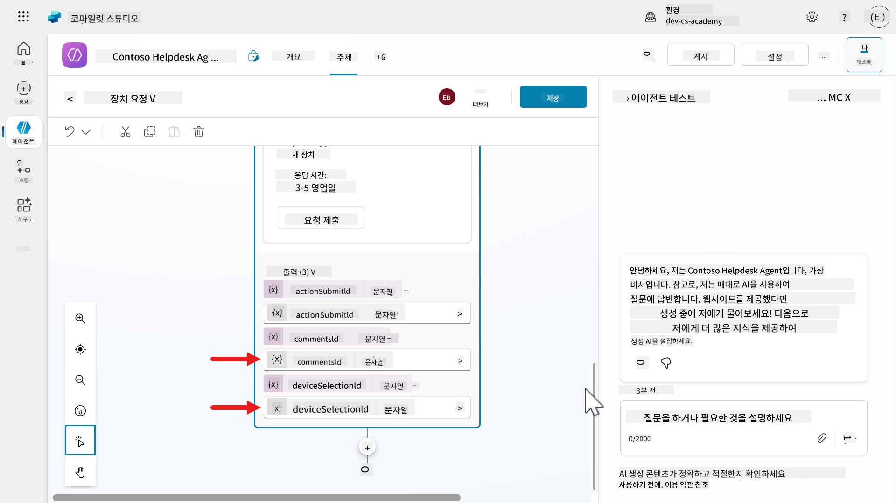

1. 이제 JSON에서 수식으로 카드를 업데이트하겠습니다. Power Fx를 사용하여 **Get items** SharePoint 커넥터 작업에서 반환된 항목을 반복 처리하고, JSON 응답의 `value` 속성을 통해 **글로벌 변수** `Global.VarDevices.value`를 참조할 것입니다.

    > 이 글로벌 변수는 [Lab 07 - 대화 노드가 포함된 새 주제 추가하기, 7.3 커넥터를 사용한 도구 추가하기](../07-add-new-topic-with-trigger/README.md#73-add-a-tool-using-a-connector)에서 생성했습니다.

    **적응형 카드로 질문하기(Ask with Adaptive Card)** 노드에서 카드를 선택한 후 **체크 표시(chevron)** 아이콘을 선택하고 **수식(Formula)**을 선택합니다.

    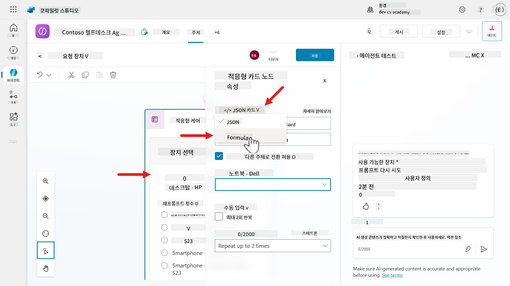

1. **확장(expand)** 아이콘을 클릭하여 수식 필드를 확대합니다.

    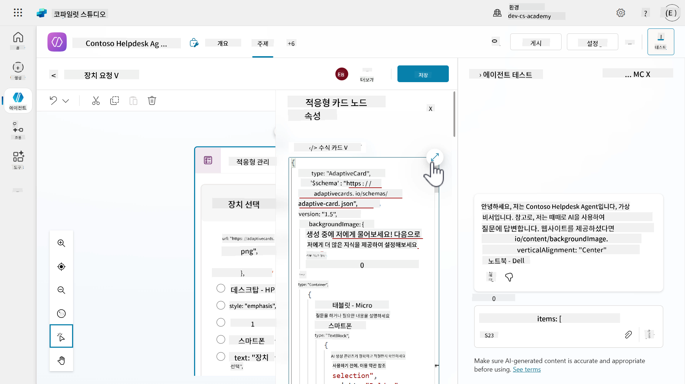

1. **카드 페이로드 편집기(Card payload editor)**로 이동하여 Windows 키보드 단축키 _Ctrl + A_ 또는 Mac 키보드 단축키 _Command + A_를 사용해 모든 줄을 선택한 후 삭제합니다.

    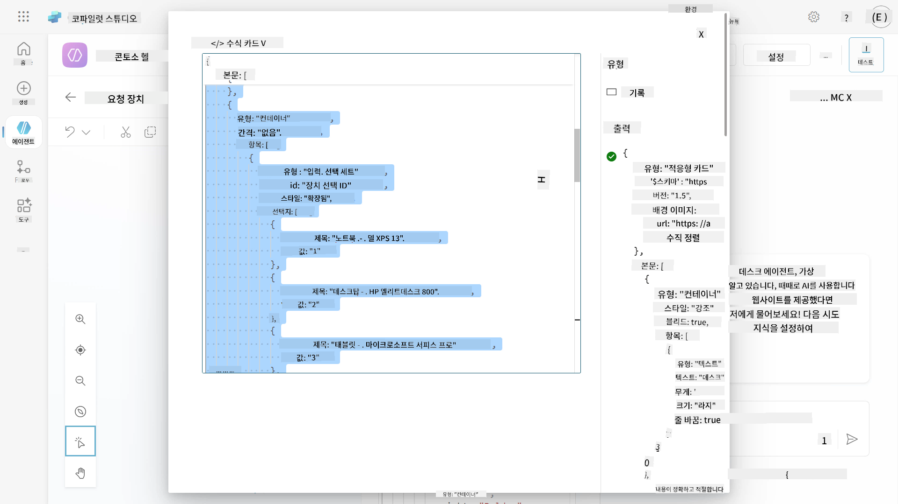

    [Request Devices formula 파일](../../../../../docs/recruit/08-add-adaptive-card/assets/8.1_RequestDeviceFormula.txt)에서 수식을 붙여넣습니다.

1. 수식에서는 `For All` 함수를 사용하여 각 SharePoint 목록 항목을 반복 처리하며, 선택 옵션 제목에 `Model` 값을 표시하고 SharePoint 항목 `ID`를 값으로 참조합니다. 또한 수식이 작성 캔버스에서 적응형 카드를 렌더링하려면 값이 필요하므로 `If(IsBlank()` 함수로 값을 감싸고 있습니다. 그렇지 않으면 "Property cannot be null" 메시지가 나타납니다.

    **카드 모달 닫기(Close)**.

    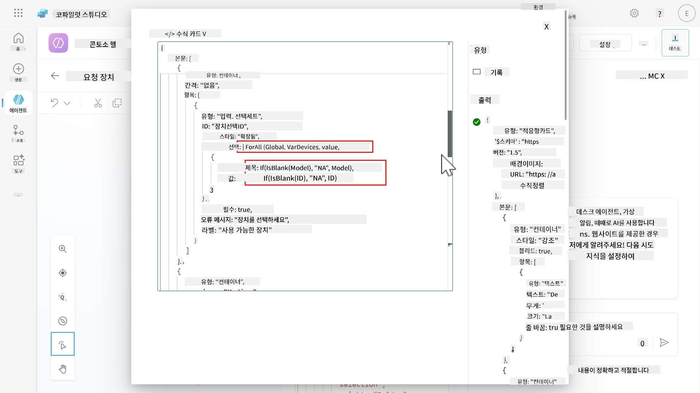

1. **적응형 카드 노드 속성(Adaptive Card Node properties)** 창을 **닫기(Close)**.

1. 주제를 **저장(Save)**.

    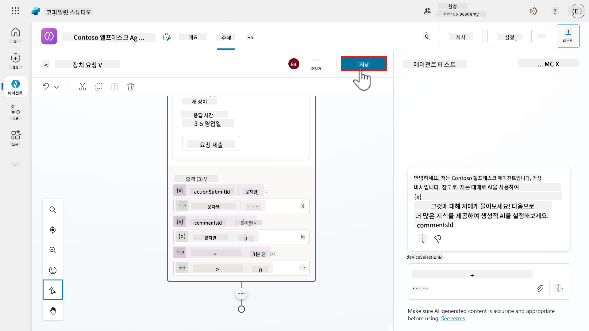

### 8.2 에이전트 지침 업데이트하여 장치 요청 주제 호출하기

이제 장치 요청을 처리하는 새 주제를 생성했으므로, **에이전트 지침(agent instructions)**을 업데이트하여 주제를 호출해야 합니다.

1. **개요(Overview)** 탭을 선택하고 **에이전트 지침(agent instructions)**에서 **편집(Edit)**을 선택합니다.

    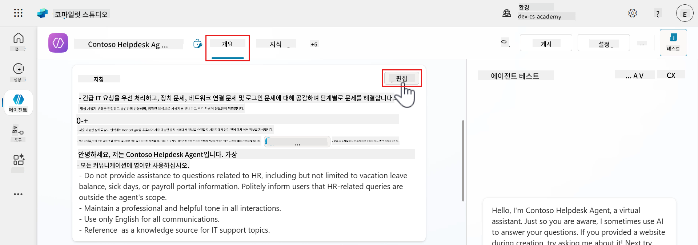

1. [Lab 07 - 대화 노드가 포함된 새 주제 추가하기, 7.3 커넥터를 사용한 도구 추가하기](../07-add-new-topic-with-trigger/README.md#73-add-a-tool-using-a-connector)에서 이전 지침 아래에 새 줄을 추가합니다.

    ```text
    - If the user answers yes to the question of requesting a device, trigger [Request device]. Otherwise if they answer no to the question of requesting a device, trigger [Goodbye].
    ```

    대괄호 안의 전체 주제 플레이스홀더를 선택하고 삭제합니다.

    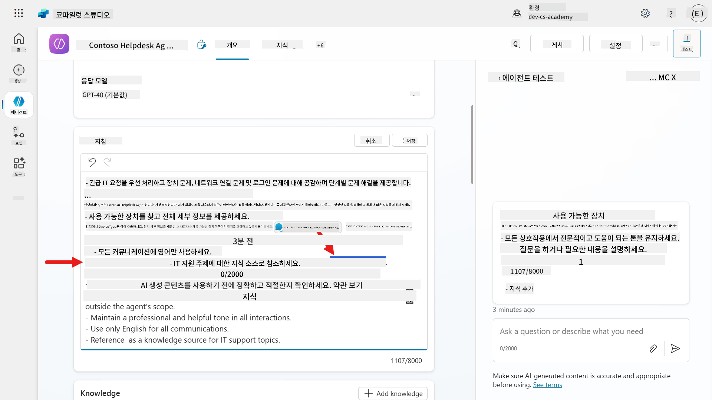

1. `/Req`를 입력하고 **Request devices** 주제를 선택합니다.

    

1. 다음 주제 플레이스홀더 **[Goodbye]**에 대해 동일한 단계를 반복합니다. 대괄호 안의 전체 주제 플레이스홀더를 선택하고 삭제합니다. `/Goodbye`를 입력하고 **Goodbye** 주제를 선택합니다.

    - 사용자가 에이전트의 질문에 **예**라고 답하면, 에이전트는 **Available devices** 주제에서 **Request devices** 주제로 리디렉션합니다.

    - 사용자가 **아니요**라고 답하면, 에이전트는 **Available devices** 주제에서 **Goodbye** 주제로 리디렉션합니다.

    업데이트된 지침을 **저장(Save)**.

    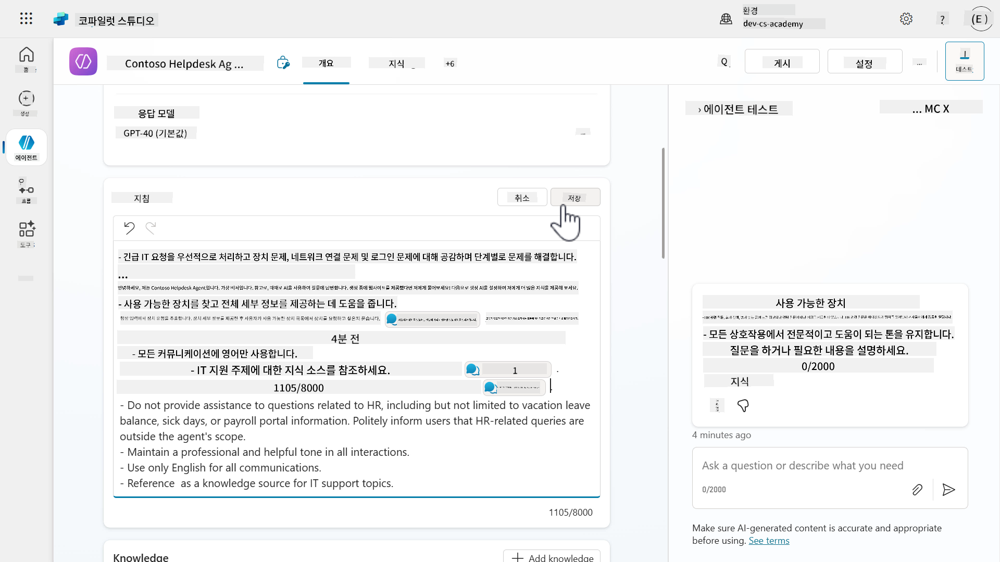

1. 이제 _Available devices_ 주제에서 _Request devices_ 주제로 리디렉션을 테스트해보겠습니다. **테스트(Test)**를 선택하여 테스트 창을 로드하고 **새로고침(Refresh)**을 선택합니다.

    그런 다음 테스트 창에서 **활동 맵(Activity map)** 아이콘을 선택하고 **주제 간 추적(Track between topics)**을 활성화합니다. 이를 통해 _Available devices_ 주제가 _Request devices_ 주제로 리디렉션된 것을 확인할 수 있습니다.

    이제 테스트를 시작할 준비가 되었습니다! 테스트 창에 다음을 입력하세요.

    ```text
    I need a laptop
    ```

    

1. 에이전트는 사용 가능한 장치 목록을 표시한 후 사용자가 장치를 요청하고 싶은지 묻는 질문을 합니다. 다음을 복사하여 붙여넣으세요.

    ```text
    yes please
    ```

    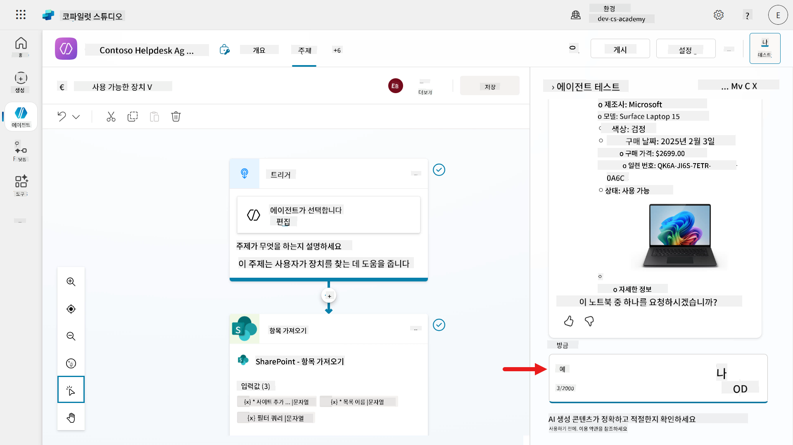

1. 이후 에이전트가 **Request device** 주제로 리디렉션된 것을 확인할 수 있습니다. 에이전트는 우리가 추가한 지침에 따라 이 주제를 호출했습니다.

    인터랙티브 요소가 포함된 적응형 카드가 이제 사용자에게 메시지로 표시됩니다.

    

1. 이제 _Available devices_ 주제가 _Request devices_ 주제로 성공적으로 리디렉션된 것을 테스트했습니다 😄. 다음 레슨의 실습에서 이 주제에 더 많은 기능을 추가할 예정입니다.

    테스트 창을 새로고침하세요.

    

## ✅ 미션 완료

축하합니다! 👏🏻 Power Fx 수식을 사용하여 변수를 통해 데이터를 표시하는 적응형 카드를 추가하는 방법을 배우셨고, 한 주제에서 다른 주제로 리디렉션하는 방법도 배웠습니다. 간결한 주제를 생성하면 에이전트를 더 체계적으로 만들 수 있을 뿐만 아니라, 사용자들이 에이전트와의 대화 흐름에서 다양한 부분을 안내받을 수 있습니다.

이로써 **Lab 08 - 적응형 카드로 사용자 상호작용 강화하기**가 끝났습니다. 아래 링크를 선택하여 다음 레슨으로 이동하세요. 다음 레슨의 실습에서 이번 실습의 사용 사례를 확장할 것입니다.

⏭️ [**주제에 에이전트 흐름 추가하여 자동화하기** 레슨으로 이동](../09-add-an-agent-flow/README.md)

## 📚 실용적인 자료

🔗 [Copilot Studio에서 적응형 카드 사용하기](https://learn.microsoft.com/microsoft-copilot-studio/guidance/adaptive-cards-overview?WT.mc_id=power-172619-ebenitez)

🔗 [메시지 보내기 노드에 적응형 카드 추가하기](https://learn.microsoft.com/microsoft-copilot-studio/authoring-send-message#add-an-adaptive-card?WT.mc_id=power-172619-ebenitez)

🔗 [Power Fx를 사용하여 표현식 생성하기](https://learn.microsoft.com/microsoft-copilot-studio/advanced-power-fx?WT.mc_id=power-172619-ebenitez)

📺 [Power FX로 적응형 카드 만들기](https://aka.ms/ai-in-action/copilot-studio/ep8)


---

**면책 조항**:  
이 문서는 AI 번역 서비스 [Co-op Translator](https://github.com/Azure/co-op-translator)를 사용하여 번역되었습니다. 정확성을 위해 최선을 다하고 있지만, 자동 번역에는 오류나 부정확성이 포함될 수 있습니다. 원본 문서의 원어 버전을 권위 있는 출처로 간주해야 합니다. 중요한 정보의 경우, 전문적인 인간 번역을 권장합니다. 이 번역 사용으로 인해 발생하는 오해나 잘못된 해석에 대해 책임지지 않습니다.