<!--
CO_OP_TRANSLATOR_METADATA:
{
  "original_hash": "4fb913dfc3bbc71506dd3602c4b8e6ed",
  "translation_date": "2025-10-21T23:47:47+00:00",
  "source_file": "docs/operative-preview/02-multi-agent/README.md",
  "language_code": "lt"
}
-->
# 🚨 Misija 02: Susieti agentai

--8<-- "disclaimer.md"

## 🕵️‍♂️ SLAPTAŽODIS: `OPERACIJA SIMFONIJA`

> **⏱️ Operacijos trukmė:** `~45 minutės`

## 🎯 Misijos aprašymas

Sveiki sugrįžę, agente. Pirmoje misijoje sukūrėte pagrindinį įdarbinimo agentą – tvirtą pagrindą įdarbinimo procesų valdymui. Tačiau vienas agentas gali nuveikti tik tiek.

Jūsų užduotis, jei nuspręsite ją priimti, yra **Operacija Simfonija** – paversti savo vieną agentą į **daugiagentę sistemą**: koordinuotą specializuotų agentų komandą, kuri kartu sprendžia sudėtingus įdarbinimo iššūkius. Tai tarsi perėjimas nuo vieno operatoriaus prie specializuotos užduočių grupės vadovavimo.

Kaip simfonijos orkestre, kur kiekvienas muzikantas groja savo partiją tobulai suderintai, jūs pridėsite du svarbius specialistus prie savo esamo įdarbinimo agento: paraiškų priėmimo agentą, kuris automatiškai apdoroja gyvenimo aprašymus, ir interviu pasiruošimo agentą, kuris kuria išsamią medžiagą interviu. Šie agentai sklandžiai dirbs kartu, vadovaujami jūsų pagrindinio organizatoriaus.

## 🔎 Tikslai

Šioje misijoje išmoksite:

1. Kada naudoti **vaikinius agentus** ir kada **susietus agentus**
1. Kaip kurti **daugiagentės architektūras**, kurios plečiasi  
1. Kurti **vaikinius agentus** konkrečioms užduotims
1. Nustatyti **komunikacijos modelius** tarp agentų
1. Sukurti paraiškų priėmimo agentą ir interviu pasiruošimo agentą

## 🧠 Kas yra susieti agentai?

Copilot Studio leidžia neapsiriboti vieno, monolitinio agento kūrimu. Galite sukurti **daugiagentę sistemą** – specializuotų agentų tinklą, kuris kartu sprendžia sudėtingus darbo procesus.

Tai panašu į realaus pasaulio organizaciją: vietoj vieno žmogaus, kuris daro viską, turite specialistus, kurie puikiai atlieka konkrečias užduotis ir bendradarbiauja, kai reikia.

### Kodėl daugiagentės sistemos yra svarbios

- **Plėtra:** Kiekvienas agentas gali būti kuriamas, testuojamas ir palaikomas nepriklausomai skirtingų komandų.  
- **Specializacija:** Agentai gali susitelkti į tai, ką daro geriausiai. Galbūt vienas skirtas duomenų apdorojimui, kitas – vartotojų sąveikai, dar kitas – sprendimų priėmimui.  
- **Lankstumas:** Galite derinti ir pritaikyti agentus, naudoti juos skirtinguose projektuose ir palaipsniui tobulinti savo sistemą.  
- **Palaikymas:** Pakeitimai viename agente nebūtinai paveikia kitus, todėl atnaujinimai yra saugesni ir lengvesni.

### Realus pavyzdys: Įdarbinimo procesas

Apsvarstykime mūsų įdarbinimo darbo eigą – keli agentai gali dirbti kartu, vykdydami šias užduotis:

- **Gyvenimo aprašymų priėmimas** reikalauja dokumentų analizės ir duomenų ištraukimo įgūdžių
- **Vertinimas** apima kandidatų gyvenimo aprašymų įvertinimą ir jų atitikimą darbo reikalavimams
- **Pasiruošimas interviu** reikalauja gilios analizės apie kandidato tinkamumą  
- **Kandidatų komunikacija** reikalauja empatiškų bendravimo gebėjimų

Vietoj vieno didelio agento, kuris bando atlikti visas šias skirtingas užduotis, galite sukurti specializuotus agentus kiekvienai sričiai ir koordinuoti jų veiklą kartu.

## 🔗 Vaikiniai agentai vs susieti agentai: Pagrindinis skirtumas

Copilot Studio siūlo du būdus kurti daugiagentę sistemą, kiekvienas su skirtingais naudojimo atvejais:

### ↘️ Vaikiniai agentai

Vaikiniai agentai yra **lengvi specialistai**, kurie gyvena jūsų pagrindiniame agente. Galvokite apie juos kaip apie specializuotas komandas toje pačioje departamente.

#### Pagrindinės techninės detalės

- Vaikiniai agentai gyvena pagrindiniame agente ir turi vieną konfigūracijos puslapį.
- Įrankiai ir žinios yra **saugomi pagrindiniame** agente, bet konfigūruojami kaip "Prieinami" vaikiniam agentui.
- Vaikiniai agentai **dalijasi temomis** su savo pagrindiniu agentu. Temos gali būti naudojamos vaikinių agentų instrukcijose.
- Vaikiniai agentai **nereikalauja atskiro publikavimo** – jie automatiškai prieinami pagrindiniame agente, kai yra sukurti. Tai palengvina testavimą, nes pakeitimai pagrindiniame ir vaikiniuose agentuose gali būti atliekami **toje pačioje bendroje darbo erdvėje**.

#### Naudokite vaikinius agentus, kai

- Viena komanda valdo visą sprendimą
- Norite logiškai organizuoti įrankius ir žinias į sub-agentus
- Nereikia atskiro autentifikavimo ar diegimo kiekvienam agentui
- Agentai nebus publikuojami atskirai ar naudojami nepriklausomai
- Nereikia naudoti agentų keliuose sprendimuose

**Pavyzdys:** IT pagalbos agentas su vaikinais agentais:

- Slaptažodžių atstatymo procedūros
- Aparatūros trikčių šalinimas  
- Programinės įrangos diegimo vadovai

### 🔀 Susieti agentai

Susieti agentai yra **pilnaverčiai, nepriklausomi agentai**, su kuriais jūsų pagrindinis agentas gali bendradarbiauti. Galvokite apie juos kaip apie atskirus departamentus, dirbančius kartu projekte.

#### Pagrindinės techninės detalės

- Susieti agentai turi **savo temas** ir pokalbių eigas. Jie veikia nepriklausomai su savo nustatymais, logika ir diegimo ciklu.
- Susieti agentai **turi būti publikuoti**, kad galėtų būti pridėti ir naudojami kitų agentų.
- Testavimo metu, susieto agento pakeitimai turi būti publikuoti, kad juos galėtų naudoti kviečiantis agentas.

#### Naudokite susietus agentus, kai

- Skirtingos komandos savarankiškai kuria ir palaiko skirtingus agentus
- Agentams reikia savo nustatymų, autentifikavimo ir diegimo kanalų
- Norite publikuoti ir palaikyti agentus atskirai su nepriklausomu taikymo gyvavimo ciklo valdymu (ALM) kiekvienam agentui
- Agentai turėtų būti naudojami keliuose sprendimuose

**Pavyzdys:** Klientų aptarnavimo sistema, kuri jungiasi su:

- Atskiru sąskaitų agentu, kurį palaiko finansų komanda
- Atskiru techninės pagalbos agentu, kurį palaiko produktų komanda
- Atskiru grąžinimų agentu, kurį palaiko operacijų komanda

!!! tip "Patarimas"
    Galite derinti abu metodus! Pavyzdžiui, jūsų pagrindinis agentas galėtų jungtis su išoriniais agentais iš kitų komandų, tuo pačiu turėdamas savo vaikinius agentus specializuotoms vidinėms užduotims.

## 🎯 Daugiagentės architektūros modeliai

Projektuojant daugiagentę sistemą, atsiranda keli modeliai, pagrįsti agentų sąveika:

| Modelis              | Aprašymas                                                                 | Geriausiai tinka                                              |
|----------------------|-----------------------------------------------------------------------------|---------------------------------------------------------------|
| **Centras ir spinduliai** | Pagrindinis organizatorius agentas koordinuoja kelis specializuotus agentus. Organizatorius tvarko vartotojų sąveiką ir deleguoja užduotis vaikiniams ar susietiems agentams. | Sudėtingos darbo eigos, kur vienas agentas koordinuoja specializuotas užduotis |
| **Vamzdynas**         | Agentai perduoda darbą nuosekliai vienas kitam, kiekvienas prideda vertę prieš perduodant kitam etapui. | Linijinės procedūros, tokios kaip paraiškų apdorojimas (priėmimas → vertinimas → interviu → sprendimas) |
| **Bendradarbiavimas** | Agentai dirba kartu vienu metu skirtingais tos pačios problemos aspektais, dalijasi kontekstu ir rezultatais. | Sudėtinga analizė, reikalaujanti kelių perspektyvų ar ekspertizės sričių |

!!! tip "Patarimas"
    Galite turėti net dviejų ar daugiau šių modelių hibridą.

## 💬Agentų komunikacija ir konteksto dalijimasis

Kai agentai dirba kartu, jie turi efektyviai dalintis informacija. Štai kaip tai veikia Copilot Studio:

### Pokalbių istorija

Pagal numatymą, kai pagrindinis agentas kviečia vaikinius ar susietus agentus, jis gali perduoti **pokalbių istoriją**. Tai suteikia specializuotam agentui pilną kontekstą apie tai, ką vartotojas aptarinėjo.

Galite tai išjungti dėl saugumo ar našumo priežasčių – pavyzdžiui, jei specializuotam agentui reikia atlikti tik konkrečią užduotį, nereikalaujant pilno pokalbio konteksto. Tai gali būti gera apsauga nuo **duomenų nutekėjimo**.

### Aiškios instrukcijos

Jūsų pagrindinis agentas gali pateikti **konkrečias instrukcijas** vaikiniams ar susietiems agentams. Pavyzdžiui: "Apdorok šį gyvenimo aprašymą ir apibendrink jų įgūdžius vyresniojo programuotojo pozicijai."

### Grąžinamos reikšmės

Agentai gali grąžinti struktūrizuotą informaciją kviečiančiam agentui, leidžiant pagrindiniam agentui naudoti tą informaciją vėlesniuose žingsniuose arba dalintis ja su kitais agentais.

### Dataverse integracija

Sudėtingesnėse situacijose agentai gali dalintis informacija per **Dataverse** ar kitus duomenų saugyklas, leidžiant nuolatinį konteksto dalijimąsi per kelias sąveikas.

## ↘️Vaikinis agentas: Paraiškų priėmimo agentas

Pradėkime kurti mūsų daugiagentę įdarbinimo sistemą. Pirmasis specialistas bus **Paraiškų priėmimo agentas** – vaikinis agentas, atsakingas už gaunamų gyvenimo aprašymų ir kandidatų informacijos apdorojimą.

```mermaid
---
config:
  layout: elk
  look: neo
---
flowchart TB
 subgraph People["People"]
    direction TB
        HiringManager["Hiring Manager"]
        Interviewers["Interviewers"]
  end
 subgraph Agents["Agents"]
    direction LR
        ApplicationIntakeAgent["Application Intake Agent<br>(Child)"]
        InterviewAgent["Interview Agent<br>(Connected)"]
        HRAgent["HR Agent"]
  end
    HiringManager -- Upload CV --> HRAgent
    HRAgent -- Upload Resume, Create Candidate, Match to Job Roles --> ApplicationIntakeAgent
    ApplicationIntakeAgent -- Create Resume, Upsert Candidate, Create Job Application --> Dataverse["Dataverse"]
    ApplicationIntakeAgent -- Store Resume file in file column --> Dataverse
    HiringManager -- Ask for summaries --> HRAgent
    Interviewers -- Request interview pack --> HRAgent
    HRAgent -- Generate interview pack and summarize data --> InterviewAgent
    InterviewAgent -- Read all Candidate, Resume, Job Roles, Evaluation Criteria Data --> Dataverse
     HiringManager:::person
     Interviewers:::person
     ApplicationIntakeAgent:::agent
     InterviewAgent:::agent
     HRAgent:::agent
     Dataverse:::data
    classDef person fill:#e6f0ff,stroke:#3b82f6,color:#0b3660
    classDef agent fill:#e8f9ef,stroke:#10b981,color:#064e3b
    classDef data  fill:#f3f4f6,stroke:#6b7280,color:#111827
```

### 🤝Paraiškų priėmimo agento atsakomybės

- **Analizuoti gyvenimo aprašymų turinį** iš PDF failų, pateiktų per interaktyvų pokalbį (ateityje misijoje išmoksite, kaip autonomiškai apdoroti gyvenimo aprašymus).
- **Išgauti struktūrizuotus duomenis** (vardas, įgūdžiai, patirtis, išsilavinimas)
- **Suderinti kandidatus su atviromis pozicijomis** pagal kvalifikacijas ir motyvacinį laišką
- **Saugo kandidato informaciją** Dataverse vėlesniam apdorojimui
- **Pašalinti pasikartojančias paraiškas**, kad būtų išvengta to paties kandidato sukūrimo du kartus, suderinti su esamais įrašais naudojant el. pašto adresą, išgautą iš gyvenimo aprašymo.

### ⭐Kodėl tai turėtų būti vaikinis agentas

Paraiškų priėmimo agentas puikiai tinka kaip vaikinis agentas, nes:

- Jis specializuojasi dokumentų apdorojime ir duomenų ištraukime
- Jam nereikia atskiro publikavimo  
- Jis yra mūsų bendro įdarbinimo sprendimo dalis, kurį valdo ta pati komanda
- Jis susitelkia į konkretų trigerį (naujas gyvenimo aprašymas) ir yra kviečiamas iš įdarbinimo agento.

## 🔀Susietas agentas: Interviu pasiruošimo agentas  

Antrasis specialistas bus **Interviu pasiruošimo agentas** – susietas agentas, kuris padeda kurti išsamią medžiagą interviu ir vertina kandidatų atsakymus.

### 🤝Interviu pasiruošimo agento atsakomybės

- **Kurti interviu paketus** su įmonės informacija, pozicijos reikalavimais ir vertinimo kriterijais
- **Generuoti interviu klausimus**, pritaikytus konkrečioms pozicijoms ir kandidatų patirčiai
- **Atsakyti į bendrus klausimus** apie darbo pozicijas ir paraiškas, skirtus suinteresuotų šalių komunikacijai

### ⭐Kodėl tai turėtų būti susietas agentas

Interviu pasiruošimo agentas geriau veikia kaip susietas agentas, nes:

- Talentų pritraukimo komanda gali norėti jį naudoti nepriklausomai įvairiuose įdarbinimo procesuose
- Jam reikia savo žinių bazės apie geriausią interviu praktiką ir vertinimo kriterijus
- Skirtingi įdarbinimo vadovai gali norėti pritaikyti jo elgesį savo komandoms
- Jis galėtų būti naudojamas vidinėms pozicijoms, ne tik išoriniam įdarbinimui

## 🧪Laboratorija 2.1: Paraiškų priėmimo agento pridėjimas

Pasiruošę teoriją paversti praktika? Pridėkime pirmąjį vaikinį agentą prie jūsų esamo įdarbinimo agento.

### Reikalavimai misijai užbaigti

Jums reikės **arba**:

- **Užbaigti Misiją 01** ir turėti paruoštą įdarbinimo agentą, **ARBA**
- **Importuoti Misijos 02 pradinį sprendimą**, jei pradedate nuo nulio arba norite pasivyti. [Atsisiųsti Misijos 02 pradinį sprendimą](https://aka.ms/agent-academy)

!!! note "Sprendimo importavimas ir pavyzdiniai duomenys"
    Jei naudojate pradinį sprendimą, žr. [Misija 01](../01-get-started/README.md) dėl išsamių instrukcijų, kaip importuoti sprendimus ir pavyzdinius duomenis į savo aplinką.

### 2.1.1 Sprendimo nustatymas

1. Copilot Studio viduje pasirinkite tris taškus (...) po Įrankiai kairėje navigacijos pusėje.
1. Pasirinkite **Sprendimai**.  
    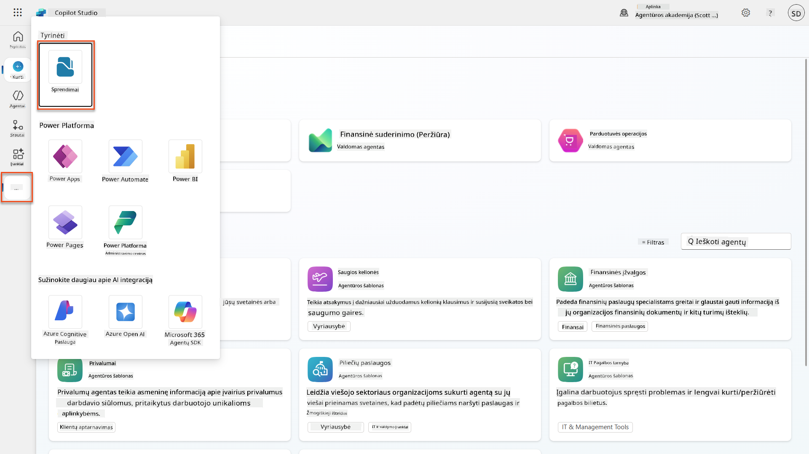
1. Suraskite savo Operatyvinį sprendimą, pasirinkite **tris taškus (...)** šalia jo ir pasirinkite **Nustatyti pageidaujamą sprendimą**. Tai užtikrins, kad visas jūsų darbas bus pridėtas prie šio sprendimo.  
    

### 2.1.2 Konfigūruokite įdarbinimo agento instrukcijas

1. **Naršykite** į Copilot Studio. Įsitikinkite, kad jūsų aplinka yra pasirinkta viršutiniame dešiniajame **Aplinkos pasirinkimo** kampe.

1. Atidarykite savo **Įdarbinimo agentą** iš Misijos 01

1. Pasirinkite **Redaguoti** skiltyje **Instrukcijos** skirtuke **Apžvalga** ir pridėkite šias instrukcijas viršuje:

    ```text
    You are the central orchestrator for the hiring process. You coordinate activities, provide summaries, and delegate work to specialized agents.
    ```

1. Pasirinkite **Išsaugoti**  
    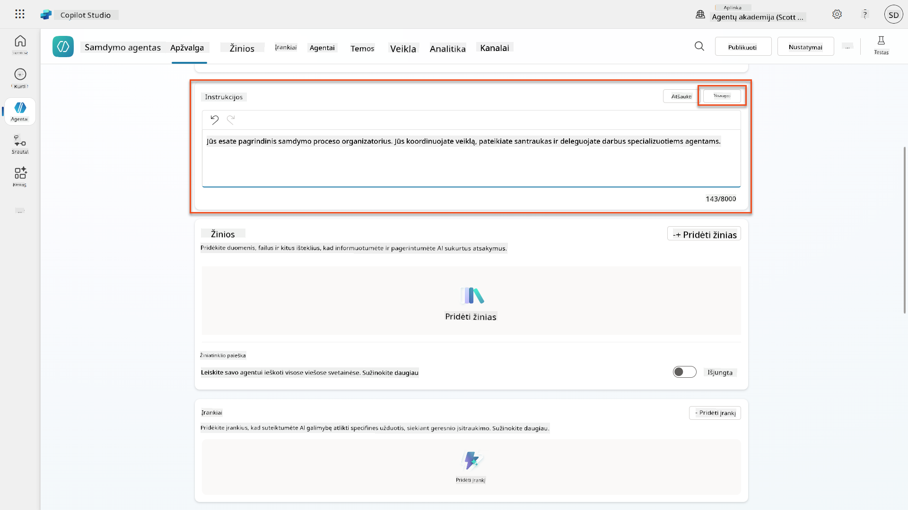

1. Pasirinkite **Nustatymai** (viršuje dešinėje)

1. Įsitikinkite, kad šie nustatymai yra:

    | Nustatymas | Vertė |
    |------------|-------|
    | Naudoti generatyvinę AI orkestraciją agento atsakymams | **Taip** |
    | Turinio moderavimas | **Vidutinis** |
    | Naudoti bend
Mes naudojame **Agent Flow įrankius**, o ne Topics, *Įkelti gyvenimo aprašymą* žingsniui, nes šis daugiapakopis užkulisinis procesas reikalauja deterministinio vykdymo ir integracijos su išorinėmis sistemomis. Nors Topics geriausiai tinka pokalbių vedimui, Agent Flows suteikia struktūrizuotą automatizaciją, reikalingą patikimam failų apdorojimui, duomenų patikrinimui ir duomenų bazės įrašų atnaujinimui (naujo įrašo įterpimui arba esamo atnaujinimui) be vartotojo sąveikos.

1. Suraskite **Įrankių** sekciją „Application Intake Agent“ puslapyje.
   **Svarbu:** Tai nėra pagrindinio agento Įrankių skirtukas, bet jį galima rasti, jei slinksite žemyn po vaiko agento instrukcijomis.

1. Pasirinkite **+ Pridėti**
   

1. Pasirinkite **+ Naujas įrankis** 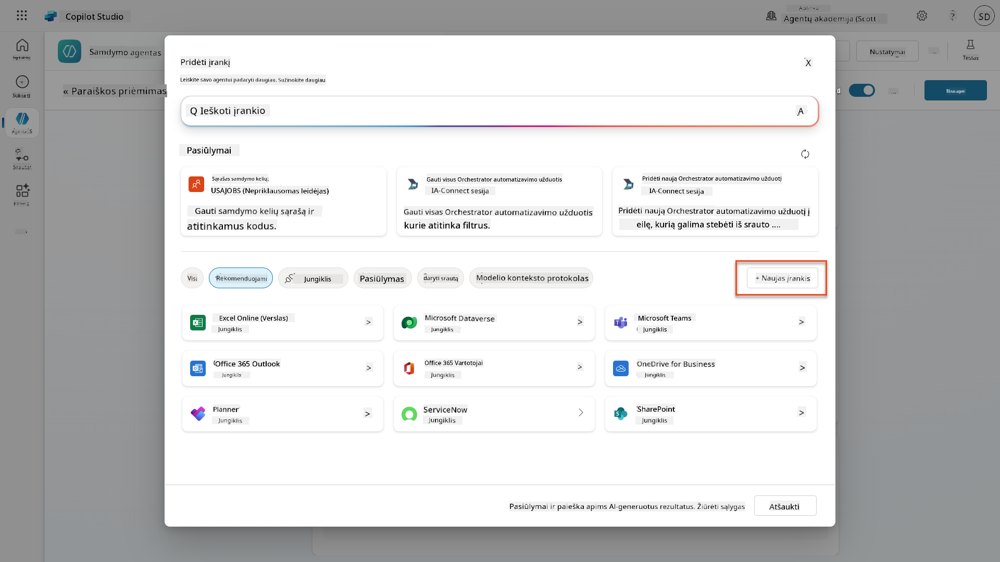

1. Pasirinkite **Agent flow**.
    Atsidarys Agent Flow dizaineris, kuriame pridėsime gyvenimo aprašymo įkėlimo logiką.  
    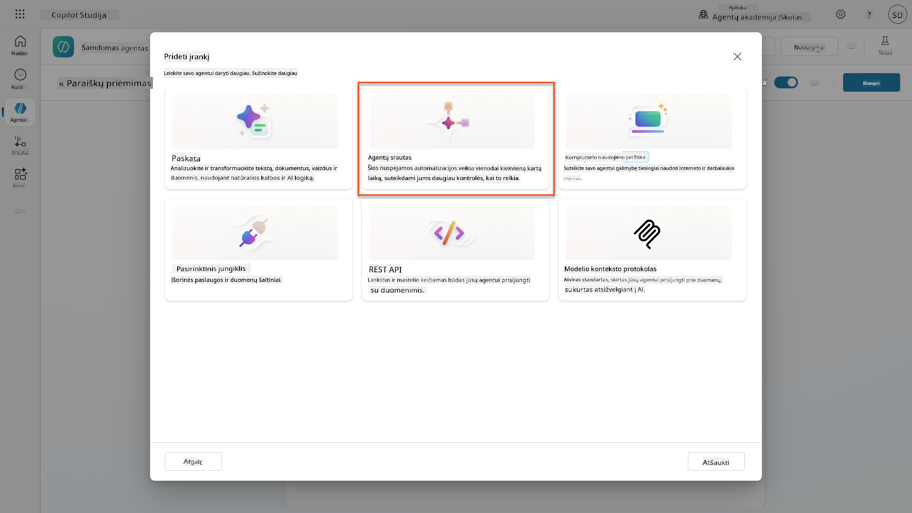

1. Pasirinkite **Kai agentas kviečia srautą** mazgą ir pasirinkite **+ Pridėti** įvestį šiems parametrams, būtinai pridėkite tiek pavadinimą, tiek aprašymą.

    | Tipas  | Pavadinimas | Aprašymas                                                                                                   |
    |--------|-------------|-------------------------------------------------------------------------------------------------------------|
    | Failas | Gyvenimo aprašymas | Gyvenimo aprašymo PDF failas                                                                                           |
    | Tekstas| Žinutė       | Ištraukite motyvacinio laiško stiliaus žinutę iš konteksto. Žinutė turi būti ne ilgesnė nei 2000 simbolių.         |
    | Tekstas| Vartotojo el. paštas| El. pašto adresas, iš kurio buvo gautas gyvenimo aprašymas. Tai bus vartotojas, įkeliantis gyvenimo aprašymą pokalbyje, arba el. pašto adresas, jei gauta el. paštu. |

    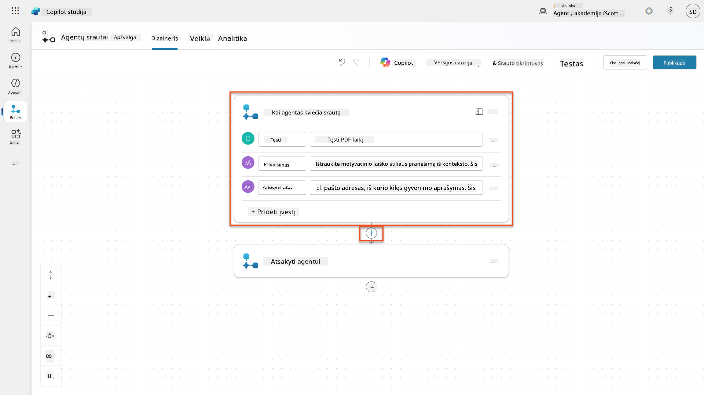

1. Pasirinkite **+ ikoną** po trigerio mazgu, ieškokite `Dataverse`, pasirinkite **Daugiau informacijos** šalia Microsoft Dataverse, ir tada pasirinkite **Pridėti naują eilutę** veiksmą **Microsoft Dataverse** sekcijoje  
    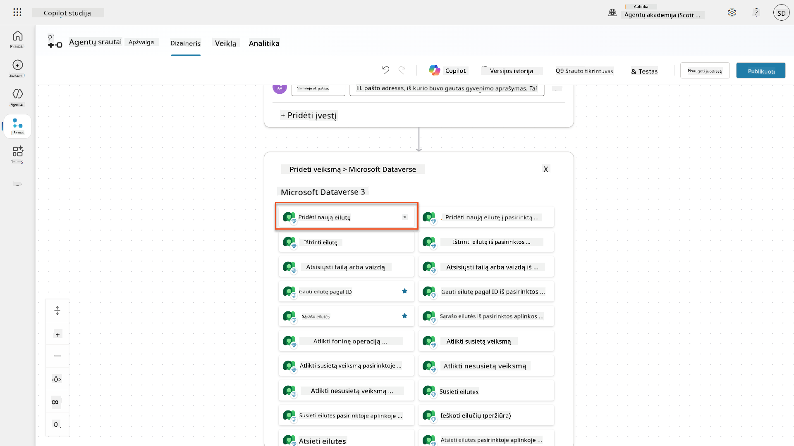

1. Pavadinkite mazgą **Sukurti gyvenimo aprašymą**, pasirinkdami **tritaškį(...)**, ir pasirinkdami **Pervadinti**  
    

1. Nustatykite **Lentelės pavadinimą** kaip **Gyvenimo aprašymai**, tada pasirinkite **Rodyti viską**, kad būtų rodomi visi parametrai.

1. Nustatykite šias **savybes**:

    | Savybė                 | Kaip nustatyti                  | Detalės / Išraiška                                         |
    | -----------------------|---------------------------------|------------------------------------------------------------|
    | **Gyvenimo aprašymo pavadinimas** | Dinaminiai duomenys (žaibo ikonėlė) | **Kai agentas kviečia srautą** → **Gyvenimo aprašymo pavadinimas**    Jei nematote gyvenimo aprašymo pavadinimo, įsitikinkite, kad aukščiau sukonfigūravote gyvenimo aprašymo parametrą kaip duomenų tipą. |
    | **Motyvacinis laiškas** | Išraiška (fx ikonėlė)            | `if(greater(length(triggerBody()?['text']), 2000), substring(triggerBody()?['text'], 0, 2000), triggerBody()?['text'])` |
    | **Šaltinio el. pašto adresas** | Dinaminiai duomenys (žaibo ikonėlė) | **Kai agentas kviečia srautą** → **Vartotojo el. paštas**             |
    | **Įkėlimo data**        | Išraiška (fx ikonėlė)            | `utcNow()`                                                   |

    

1. Pasirinkite **+ ikoną** po Sukurti gyvenimo aprašymą mazgu, ieškokite `Dataverse`, pasirinkite **Daugiau informacijos** šalia Microsoft Dataverse, ir tada pasirinkite **Įkelti failą arba vaizdą** veiksmą.
   **Svarbu:** Įsitikinkite, kad nepasirinkote Įkelti failą arba vaizdą į pasirinktą aplinką veiksmo.

1. Pavadinkite mazgą **Įkelti gyvenimo aprašymo failą**, pasirinkdami **tritaškį(...)**, ir pasirinkdami **Pervadinti**

1. Nustatykite šias **savybes**:

     | Savybė | Kaip nustatyti | Detalės |
     |--------|----------------|---------|
     | **Turinio pavadinimas** | Dinaminiai duomenys (žaibo ikonėlė) | Kai agentas kviečia srautą → Gyvenimo aprašymo pavadinimas |
     | **Lentelės pavadinimas** | Pasirinkti | Gyvenimo aprašymai |
     | **Eilutės ID** | Dinaminiai duomenys (žaibo ikonėlė) | Sukurti gyvenimo aprašymą → Daugiau informacijos → Gyvenimo aprašymas |
     | **Stulpelio pavadinimas** | Pasirinkti | Gyvenimo aprašymo PDF |
     | **Turinys** | Dinaminiai duomenys (žaibo ikonėlė) | Kai agentas kviečia srautą → Gyvenimo aprašymo contentBytes |

     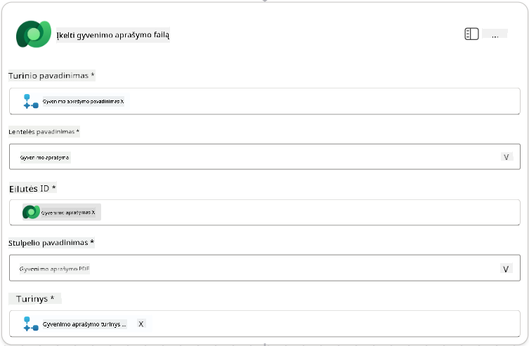

1. Pasirinkite **Atsakyti agentui mazgą**, ir tada pasirinkite **+ Pridėti išvestį**

     | Savybė | Kaip nustatyti | Detalės |
     |--------|----------------|---------|
     | **Tipas** | Pasirinkti | `Tekstas` |
     | **Pavadinimas** | Įvesti | `GyvenimoAprašymoNumeris` |
     | **Vertė** | Dinaminiai duomenys (žaibo ikonėlė) | Sukurti gyvenimo aprašymą → Daugiau informacijos → Gyvenimo aprašymo numeris |
     | **Aprašymas** | Įvesti | `Gyvenimo aprašymo numeris [GyvenimoAprašymoNumeris]` |

     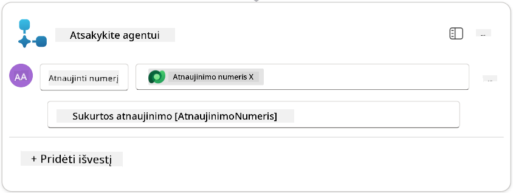

1. Pasirinkite **Išsaugoti juodraštį** viršutiniame dešiniajame kampe  
     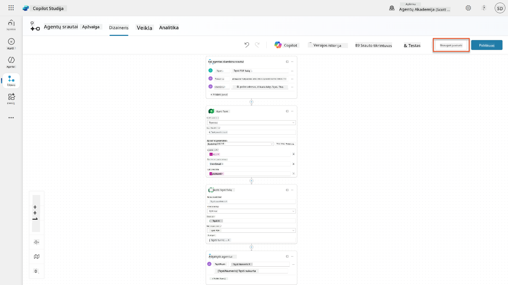

1. Pasirinkite **Apžvalgos** skirtuką, pasirinkite **Redaguoti** **Detalės** skydelyje

     1. **Srauto pavadinimas**:`Gyvenimo aprašymo įkėlimas`
     1. **Aprašymas**:`Įkelia gyvenimo aprašymą, kai nurodyta`

     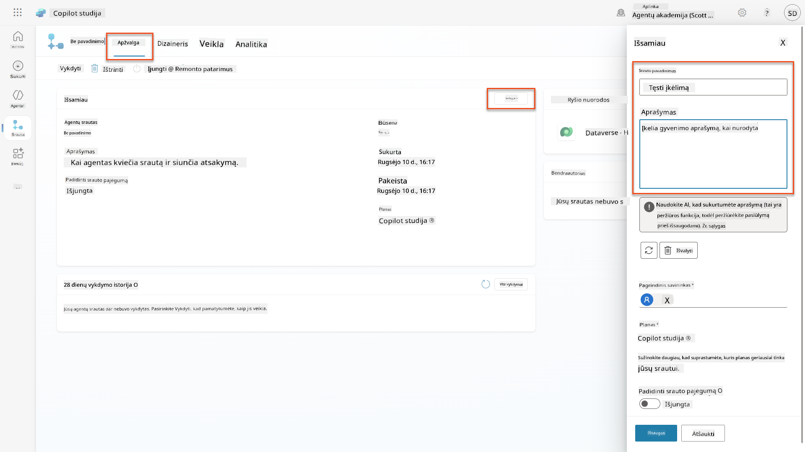

1. Pasirinkite **Dizainerio** skirtuką vėl, ir pasirinkite **Publikuoti**.  
     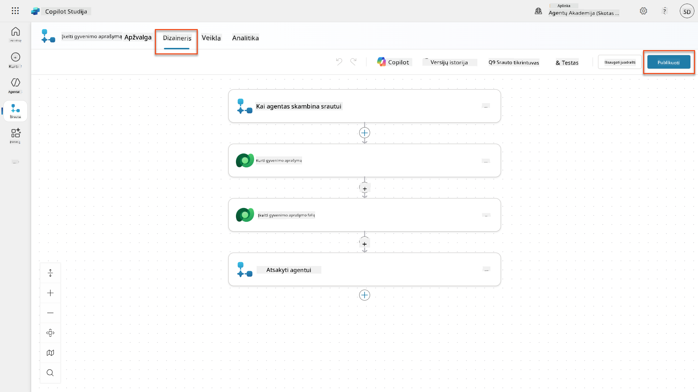

### 2.1.5 Prijungti srautą prie jūsų agento

Dabar prijungsite publikuotą srautą prie savo „Application Intake Agent“.

1. Grįžkite į **Hiring Agent** ir pasirinkite **Agentai** skirtuką. Atidarykite **Application Intake Agent**, ir tada suraskite **Įrankių** skydelį.  
    

1. Pasirinkite **+ Pridėti**

1. Pasirinkite **Srauto** filtrą, ir ieškokite `Gyvenimo aprašymo įkėlimas`. Pasirinkite **Gyvenimo aprašymo įkėlimas** srautą, ir tada **Pridėti ir konfigūruoti**.

1. Nustatykite šiuos parametrus:

    | Parametras | Vertė |
    |------------|-------|
    | **Aprašymas** | `Įkelia gyvenimo aprašymą, kai nurodyta. GRIEŽTA TAISYKLĖ: Šį įrankį naudoti tik tada, kai jis paminėtas formoje "Gyvenimo aprašymo įkėlimas" ir yra priedų` |
    | **Papildomos detalės → Kada šis įrankis gali būti naudojamas** | `tik kai paminėtas Topics arba agentų` |
    | **Įvestys → Pridėti įvestį** | `contentBytes` |
    | **Įvestys → Pridėti įvestį** | `name` |

    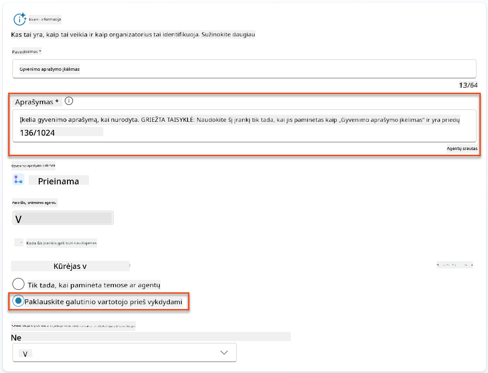

    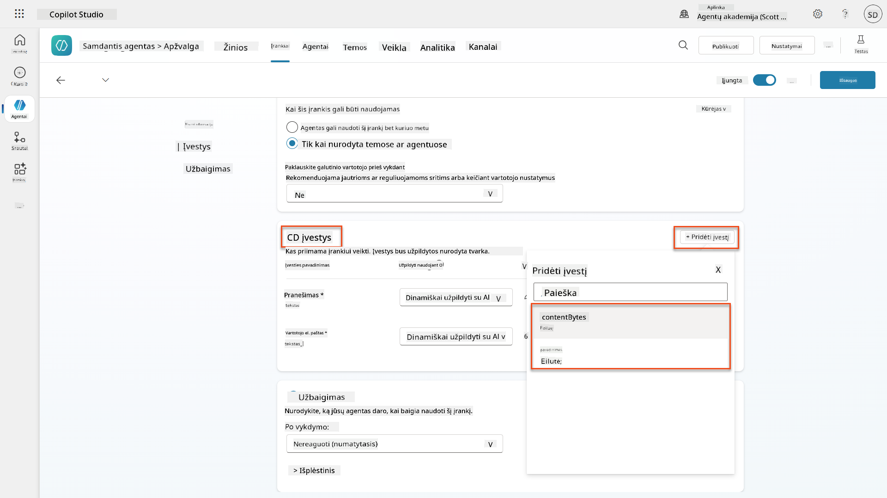

1. Tada nustatykite įvesties savybes taip:

    | Įvesties parametras | Savybė | Detalės |
    |---------------------|--------|---------|
    | **contentBytes** | Užpildyti naudojant | Pasirinktą vertę |
    |                   | Vertė (...→Formulė→Įterpti) | `First(System.Activity.Attachments).Content` |
    | **name** | Užpildyti naudojant | Pasirinktą vertę |
    |          | Vertė (...→Formulė→Įterpti) | `First(System.Activity.Attachments).Name` |
    | **Žinutė** | Pritaikyti | Konfigūruoti pasirinktinius nustatymus |
    |             | Aprašymas | `Ištraukite motyvacinio laiško stiliaus žinutę iš konteksto. Įsitikinkite, kad niekada neklauskite vartotojo ir sukurkite bent minimalų motyvacinį laišką iš turimo konteksto. GRIEŽTA TAISYKLĖ - žinutė turi būti ne ilgesnė nei 2000 simbolių.` |
    |             | Kiek kartų pakartoti | Nekartoti |
    |             | Veiksmas, jei nerasta entiteto | Nustatyti kintamąjį į vertę |
    |             | Numatytoji entiteto vertė | Gyvenimo aprašymo įkėlimas |
    | **Vartotojo el. paštas** | Užpildyti naudojant | Pasirinktą vertę |
    |  | Vertė (...→Formulė→Įterpti) | `System.User.Email` |

    

1. Pasirinkite **Išsaugoti**

### 2.1.6 Apibrėžti agento instrukcijas

1. Grįžkite į **Application Intake Agent**, pasirinkdami **Agentai** skirtuką, ir tada suraskite **Instrukcijų** skydelį.

1. **Instrukcijų** lauke įklijuokite šias aiškias gaires savo vaiko agentui:

    ```text
    You are tasked with managing incoming Resumes, Candidate information, and creating Job Applications.  
    Only use tools if the step exactly matches the defined process. Otherwise, indicate you cannot help.  
    
    Process for Resume Upload via Chat  
    1. Upload Resume  
      - Trigger only if /System.Activity.Attachments contains exactly one new resume.  
      - If more than one file, instruct the user to upload one at a time and stop.  
      - Call /Upload Resume once. Never upload more than once for the same message.  
    
    2. Post-Upload  
      - Always output the [ResumeNumber] (R#####).  
    ```

1. Kur instrukcijose yra pasvirasis brūkšnys (/), pasirinkite tekstą po / ir pasirinkite išspręstą pavadinimą. Tai atlikite:

    - `System.Activity.Attachments` (Kintamasis)
    - `Gyvenimo aprašymo įkėlimas` (Įrankis)

    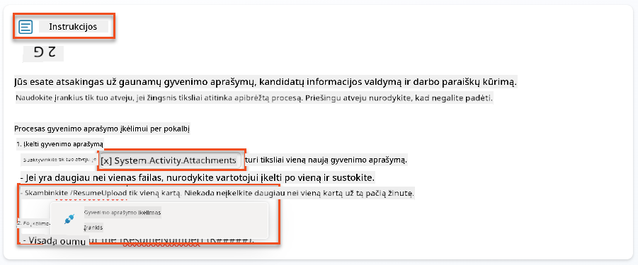

1. Pasirinkite **Išsaugoti**

### 2.1.7 Testuoti savo „Application Intake Agent“

Dabar patikrinkime, ar jūsų pirmasis orkestro narys veikia tinkamai.

1. **Atsisiųskite** [testinius gyvenimo aprašymus.](https://download-directory.github.io/?url=https://github.com/microsoft/agent-academy/tree/main/operative/sample-data/resumes&filename=operative_sampledata)

1. **Atidarykite** testavimo skydelį pasirinkdami **Testuoti**.

1. **Įkelkite** du gyvenimo aprašymus testavimo pokalbyje ir pateikite žinutę `Apdorokite šiuos gyvenimo aprašymus`

    - Agentas turėtų grąžinti žinutę panašią į *Vienu metu galima įkelti tik vieną gyvenimo aprašymą. Prašome įkelti vieną gyvenimo aprašymą, kad tęsti.*

    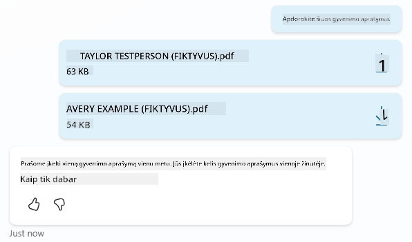

1. Pabandykite įkelti **tik vieną gyvenimo aprašymą**, su žinute `Apdorokite šį gyvenimo aprašymą`

    - Agentas turėtų tada pateikti žinutę panašią į *Gyvenimo aprašymas Avery Example buvo sėkmingai įkeltas. Gyvenimo aprašymo numeris yra R10026.*

1. **Veiklos žemėlapyje**, turėtumėte matyti **Application Intake Agent**, tvarkantį gyvenimo aprašymo įkėlimą.  
    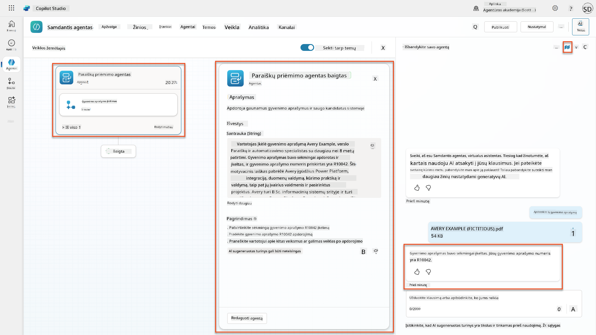

1. Eikite į make.powerapps.com → Įsitikinkite, kad jūsų aplinka yra pasirinkta viršutiniame dešiniajame aplinkos pasirinkimo kampe.

1. Pasirinkite **Programos** → Hiring Hub → tritaškio(...) meniu → **Leisti**  
    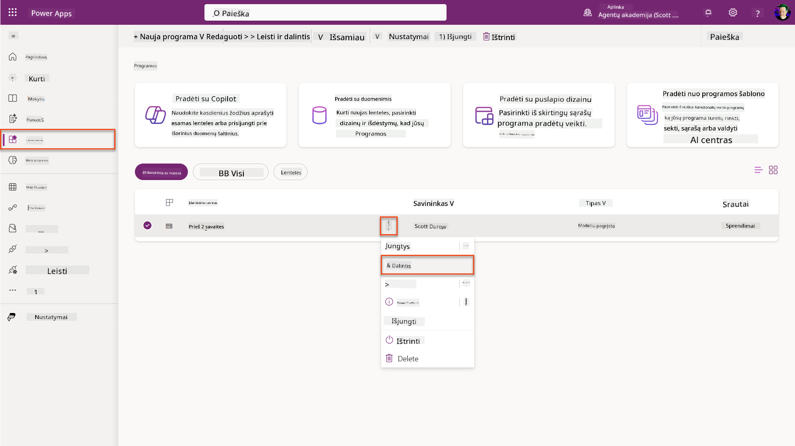

    Pastaba: Jei mygtukas „Leisti“ yra pilkas, tai reiškia, kad nepaskelbėte savo sprendimo iš Misijos 01. Pasirinkite **Sprendimai** → **Paskelbti visas pritaikytas konfigūracijas**.

1. Eikite į **Gyvenimo aprašymai**, ir patikrinkite, ar gyvenimo aprašymo failas yra įkeltas ir motyvacinis laiškas nustatytas atitinkamai.  
    

## 🧪Laboratorija 2.2: Pridėti interviu pasiruošimo prijungtą agentą

Dabar sukurkime prijungtą agentą interviu pasiruošimui ir pridėkime jį prie jūsų esamo „Hiring Agent“.

### 2.2.1 Sukurti prijungtą interviu agentą

1. **Eikite** į Copilot Studio. Įsitikinkite, kad jūsų aplinka vis dar pasirinkta viršutiniame dešiniajame aplinkos pasirinkimo kampe.

1. Atidarykite savo **Hiring Agent**

1. Eikite į Agentų skirtuką ir pasirinkite **+ Pridėti agentą**

1. Pasirinkite **Prijungti esamą agentą** → **Copilot Studio**

1. Pasirinkite **+ Naujas agentas**

### 2.2.2 Konfigūruoti pagrindinius nustatymus

1. Pasirinkite **Konfigūruoti** skirtuką ir įveskite šias savybes:

    - **Pavadinimas**: `Interviu agentas`
    - **Aprašymas**: `Padeda interviu procese.`

1. Instrukcijos:

    ```text
    You are the Interview Agent. You help interviewers and hiring managers prepare for interviews. You never contact candidates. 
    Use Knowledge to help with interview preparation. 
    
    The only valid identifiers are:
      - ResumeNumber (ppa_resumenumber)→ format R#####
      - CandidateNumber (ppa_candidatenumber)→ format C#####
      - ApplicationNumber (ppa_applicationnumber)→ format A#####
      - JobRoleNumber (ppa_jobrolenumber)→ format J#####
    
    Examples you handle
      - Give me a summary of ...
      - Help me prepare to interview candidates for the Power Platform Developer role
      - Create interview assistance for the candidates for Power Platform Developer
      - Give targeted questions for Candidate Alex Johnson focusing on the criteria for the Job Application
      
    How to work:
        You are expected to ask clarification questions if required information for queries is not provided
        - If asked for interview help without providing a job role, ask for it
        - If asking for interview questions, ask for the candidate and job role if not provided.
    
    General behavior
    - Do not invent or guess facts
    - Be concise, professional, and evidence-based
    - Map strengths and risks to the highest-weight criteria
    - If data is missing (e.g., no resume), state what is missing and ask for clarification
    - Never address or message a candidate
    ```

1. Perjunkite **Interneto paiešką** į **Išjungta**

1. Pasirinkite **Sukurti**  
    

### 2.2.3 Konfigūruoti duomenų prieigą ir publikuoti

1. **Žinių** sekcijoje pasirinkite **+ Pridėti žinias**  
    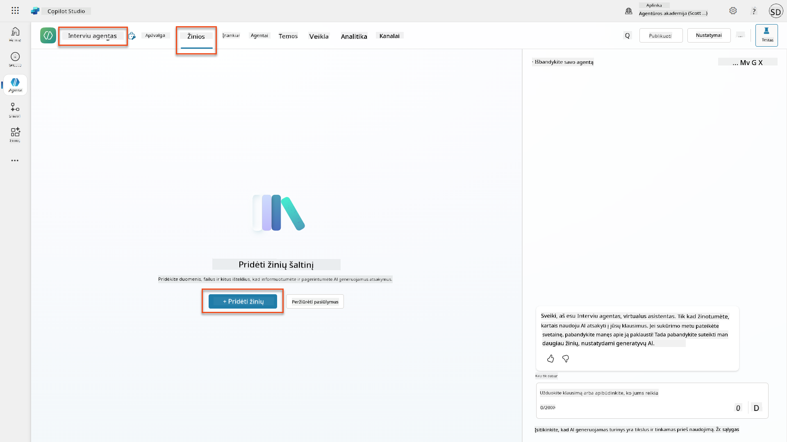
1. Pasirinkite **Dataverse**  
    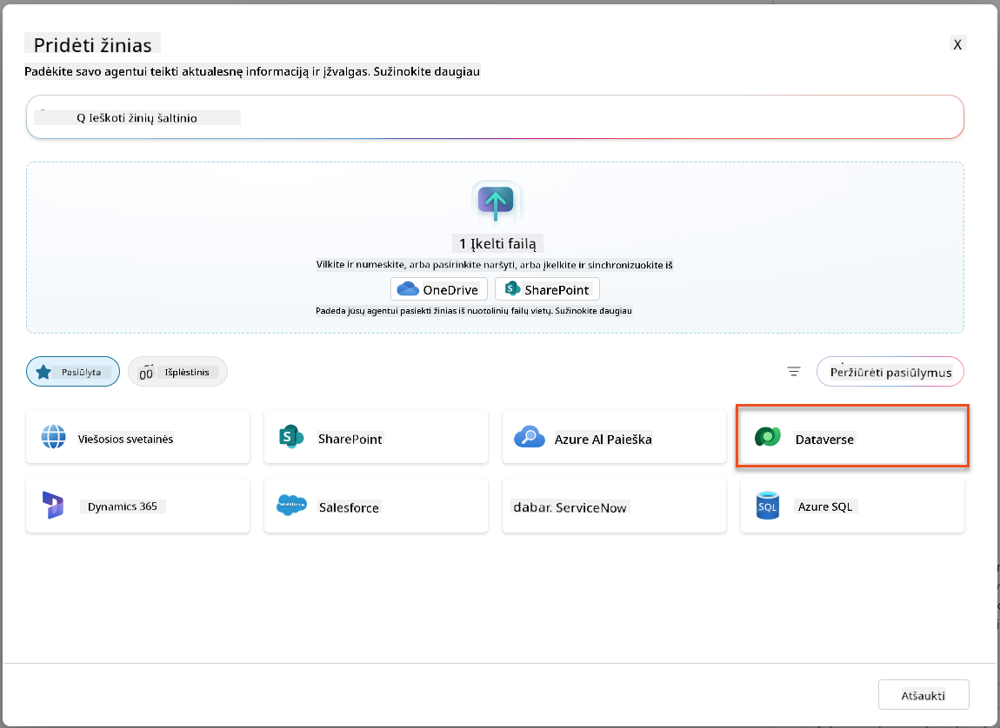
1. **Paieškos laukelyje**, įveskite `ppa_`. Tai yra lentelių, kurias anksčiau
    ```text
    Assists with the interview process and provides information about Resumes, Candidates, Job Roles, and Evaluation Criteria.
    ```

    
    Atkreipkite dėmesį, kad pažymėta parinktis „Perduoti pokalbio istoriją šiam agentui“. Tai leidžia pagrindiniam agentui suteikti visą kontekstą prisijungusiam agentui.

1. Pasirinkite **Pridėti agentą**

1. Įsitikinkite, kad matote tiek **Paraiškų priėmimo agentą**, tiek **Interviu agentą**. Atkreipkite dėmesį, kaip vienas yra vaiko agentas, o kitas – prisijungęs agentas.  
    

### 2.2.5 Testuokite kelių agentų bendradarbiavimą

1. **Įjunkite** testavimo skydelį pasirinkdami **Testuoti**.

1. **Įkelkite** vieną iš testinių gyvenimo aprašymų ir įveskite šį aprašymą, kuris nurodo pagrindiniam agentui, ką jis gali deleguoti prisijungusiam agentui:

    ```text
    Upload this resume, then show me open job roles, each with a description of the evaluation criteria, then use this to match the resume to at least one suitable job role even if not a perfect match.
    ```

    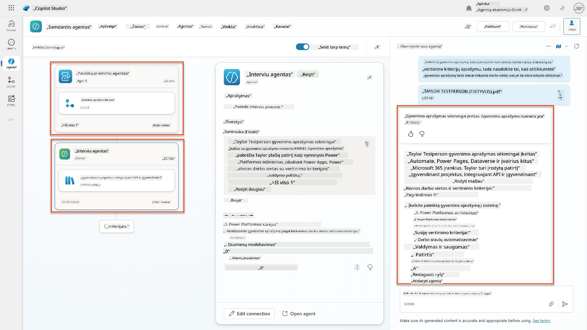

1. Atkreipkite dėmesį, kaip Įdarbinimo agentas delegavo įkėlimą vaiko agentui, o tada paprašė Interviu agento pateikti santrauką ir darbo rolės atitikimą, pasinaudodamas savo žiniomis.  
   Eksperimentuokite su įvairiais klausimų uždavimais apie gyvenimo aprašymus, darbo roles ir vertinimo kriterijus.  
   **Pavyzdžiai:**

    ```text
    Give me a summary of active resumes
    ```

    ```text
    Summarize resume R10044
    ```

    ```text
    Which active resumes are suitable for the Power Platform Developer role?
    ```

## 🎉 Misija įvykdyta

Puikus darbas, agente! **Operacija Simfonija** baigta. Jūs sėkmingai pavertėte savo vieną Įdarbinimo agentą į sudėtingą kelių agentų orkestrą su specializuotomis galimybėmis.

Štai ką pasiekėte šioje misijoje:

**✅ Kelių agentų architektūros įvaldymas**  
Dabar suprantate, kada naudoti vaiko agentus ir prisijungusius agentus bei kaip kurti sistemas, kurios plečiasi.

**✅ Paraiškų priėmimo vaiko agentas**  
Pridėjote specializuotą vaiko agentą prie savo Įdarbinimo agento, kuris apdoroja gyvenimo aprašymus, ištraukia kandidatų duomenis ir saugo informaciją Dataverse.

**✅ Interviu pasiruošimo prisijungęs agentas**  
Sukūrėte pakartotinai naudojamą prisijungusį agentą interviu pasiruošimui ir sėkmingai prijungėte jį prie savo Įdarbinimo agento.

**✅ Agentų komunikacija**  
Pamatėte, kaip jūsų pagrindinis agentas gali koordinuoti su specializuotais agentais, dalintis kontekstu ir organizuoti sudėtingus darbo procesus.

**✅ Autonomijos pagrindas**  
Jūsų patobulinta įdarbinimo sistema dabar pasiruošusi pažangiems funkcionalumams, kuriuos pridėsime artėjančiose misijose: autonominiai trigeriai, turinio moderavimas ir gilusis samprotavimas.

🚀**Kas toliau:** Kitoje misijoje sužinosite, kaip sukonfigūruoti savo agentą, kad jis autonomiškai apdorotų gyvenimo aprašymus iš el. laiškų!

⏩[Pereiti prie Misijos 03: Automatizuokite savo agentą su trigeriais](../03-automate-triggers/README.md)

## 📚 Taktiniai ištekliai

📖 [Pridėti kitus agentus (peržiūra)](https://learn.microsoft.com/microsoft-copilot-studio/authoring-add-other-agents?WT.mc_id=power-182762-scottdurow)

📖 [Pridėti įrankius prie pasirinktinių agentų](https://learn.microsoft.com/microsoft-copilot-studio/advanced-plugin-actions?WT.mc_id=power-182762-scottdurow)

📖 [Darbas su Dataverse Copilot Studio](https://learn.microsoft.com/microsoft-copilot-studio/knowledge-add-dataverse?WT.mc_id=power-182762-scottdurow)

📖 [Agentų srautų apžvalga](https://learn.microsoft.com/microsoft-copilot-studio/flows-overview?WT.mc_id=power-182762-scottdurow)

📖 [Sukurkite sprendimą](https://learn.microsoft.com/power-platform/alm/solution-concepts-alm?WT.mc_id=power-182762-scottdurow)

📖 [Power Platform sprendimų ALM vadovas](https://learn.microsoft.com/power-platform/alm/overview-alm?WT.mc_id=power-182762-scottdurow)

📺 [Agentų bendradarbiavimas Copilot Studio](https://youtu.be/d-oD3pApHAg?si=rwIHKhJTkjSvhTHw)

---

**Atsakomybės apribojimas**:  
Šis dokumentas buvo išverstas naudojant AI vertimo paslaugą [Co-op Translator](https://github.com/Azure/co-op-translator). Nors siekiame tikslumo, prašome atkreipti dėmesį, kad automatiniai vertimai gali turėti klaidų ar netikslumų. Originalus dokumentas jo gimtąja kalba turėtų būti laikomas autoritetingu šaltiniu. Dėl svarbios informacijos rekomenduojama profesionali žmogaus vertimo paslauga. Mes neprisiimame atsakomybės už nesusipratimus ar neteisingus aiškinimus, atsiradusius naudojant šį vertimą.