<!--
CO_OP_TRANSLATOR_METADATA:
{
  "original_hash": "dcbcd9396b076da0a0f5d389e9ec1b12",
  "translation_date": "2025-10-22T00:48:20+00:00",
  "source_file": "docs/recruit/08-add-adaptive-card/README.md",
  "language_code": "lt"
}
-->
# 🚨 Misija 08: Pagerinkite vartotojų sąveiką temose naudodami adaptacines korteles

## 🕵️‍♂️ SLAPTAŽODIS: `OPERACIJA INTERFACE UPLIFT`

> **⏱️ Operacijos laiko langas:** `~45 minutės`

🎥 **Žiūrėkite vaizdo įrašą**

[](https://www.youtube.com/watch?v=RhIlzYHPCXo "Žiūrėkite vaizdo įrašą YouTube")

## 🎯 Misijos aprašymas

Agentai, jūsų misija yra įsiskverbti į statinę vartotojo patirtį ir pakeisti ją turtingomis, dinamiškomis ir interaktyviomis adaptacinėmis kortelėmis. Jūs naudosite JSON duomenų paketus ir Power Fx formules, kad transformuotumėte Copilot Studio pokalbius iš paprasto klausimų-atsakymų formato į pilnai interaktyvią sąveiką. Jūsų tikslas yra surinkti vartotojo įvestį, gražiai pateikti duomenis ir tiksliai bei stilingai nukreipti pokalbius. Jei nesugebėsite prisitaikyti, jūsų vartotojai gali pereiti prie mažiau intelektualių sąsajų.

## 🔎 Tikslai

Šioje misijoje jūs išmoksite:

1. Suprasti, kas yra adaptacinės kortelės ir kaip jos pagerina vartotojų sąveiką Copilot Studio.
1. Išmokti kurti interaktyvias korteles naudojant JSON ir Power Fx formules dinamiškam turiniui.
1. Ištirti adaptacinės kortelės dizainerį ir jo pagrindinius komponentus vizualiam kortelių kūrimui.
1. Kurti turtingas, interaktyvias formas ir duomenų rinkimo patirtis agentų temose.
1. Įgyvendinti geriausią praktiką kuriant atsakingas ir vartotojui draugiškas adaptacines korteles.

## 🤔 Kas yra adaptacinė kortelė?

**Adaptacinė kortelė** yra būdas sukurti interaktyvius, vizualiai turtingus UI elementus, kuriuos galima įterpti į tokias programas kaip Microsoft Teams, Microsoft Outlook ar agentus. Tai struktūrizuotas JSON objektas, apibrėžiantis kortelės išdėstymą ir turinį:

- Kokie elementai pasirodo kortelėje - tekstas, vaizdai, mygtukai.
- Kaip tie elementai yra išdėstyti.
- Kokius veiksmus vartotojai gali atlikti, pvz., pateikti formą ar atidaryti nuorodą.

    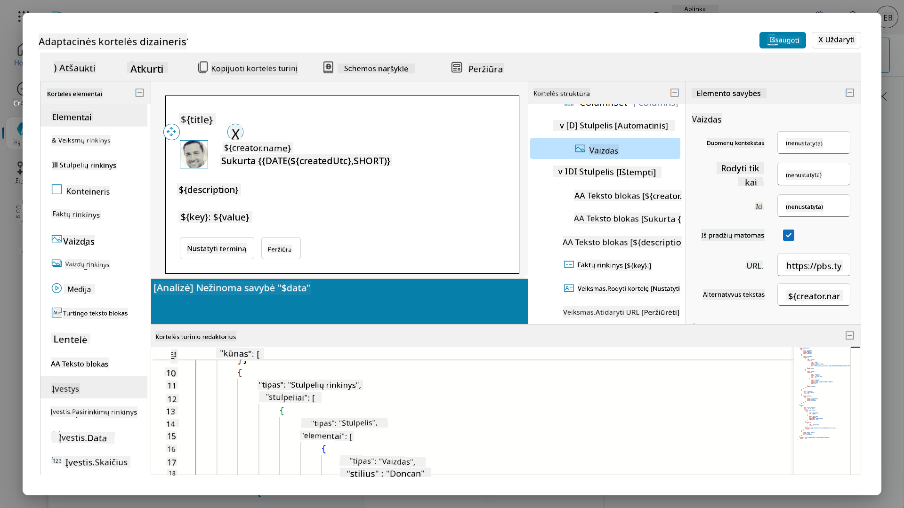

### Kodėl adaptacinės kortelės svarbios Copilot Studio

Įsivaizduokite, kad kuriate agentą, kuris prašo vartotojų pateikti savo vardą, el. pašto adresą ar atsiliepimus. Jei naudosite tik paprastą tekstą, pokalbis gali atrodyti nuobodus arba sunkiai suprantamas. Čia praverčia adaptacinės kortelės!

1. **Padaro pokalbius interaktyviais** - vietoj to, kad siųstumėte tekstą kaip žinutes vartotojui, galite rodyti mygtukus, formas, vaizdus ir daugiau.
    - Pavyzdys: kortelė gali paprašyti vartotojo užpildyti savo vardą ir el. paštą švarioje formoje.

1. **Puikiai atrodo visur** - adaptacinės kortelės automatiškai prisitaiko prie programos, kurioje jos yra, stiliaus, pvz., Microsoft 365 Copilot pokalbių ar Microsoft Teams. Jums nereikia jaudintis dėl tamsaus režimo, šriftų ar išdėstymo - jos prisitaiko.

1. **Lengva kurti naudojant JSON** - kortelę apibrėžiate naudodami JSON kodą (galvokite apie tai kaip apie UI receptą). Copilot Studio leidžia peržiūrėti kortelę prieš ją pridedant prie temos.

1. **Duomenų rinkimas ir naudojimas** - kortelę galite naudoti klausimams užduoti, atsakymams rinkti ir tuos duomenis naudoti pokalbio eigoje.
    - Pavyzdys: paprašykite vartotojo telefono numerio, tada parodykite patvirtinimo kortelę su jų telefono numeriu.

1. **Pagerina vartotojo patirtį** - kortelės leidžia jūsų agentui jaustis interaktyvesniu. Tai švaresnė, paspaudžiama ir vartotojui draugiška sąsaja.

## 🐱 Ar _JSON_ yra žmogus?

Tariamas kaip "Jason", tai nėra žmogus 😅

JSON, dar žinomas kaip _JavaScript Object Notation_, yra lengvas formatas, naudojamas duomenims struktūrizuoti. Jį lengva skaityti ir rašyti, jis atrodo kaip raktų-reikšmių poros viduje garbanotų skliaustų {}.

Tai viena iš galimybių, kurią galite naudoti pridėdami adaptacinę kortelę prie savo temos.

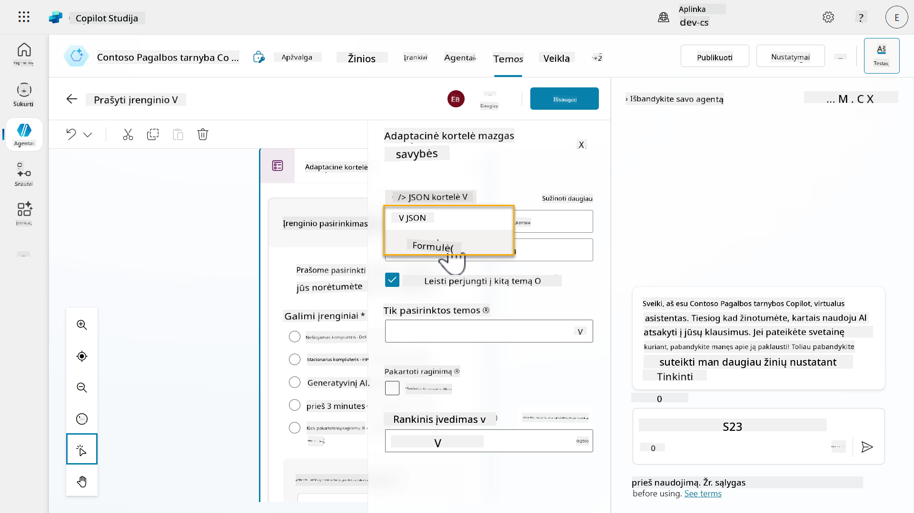

## 👀 Matai kitą galimybę kurti adaptacinę kortelę naudojant _formulę_

Prisiminkite, kaip mokėmės apie Power Fx [Misijoje 07 - Naudojant Power Fx jūsų mazguose](../07-add-new-topic-with-trigger/README.md#what-power-fx-can-do-in-topics). Tas pats gali būti taikomas adaptacinėse kortelėse Copilot Studio.

Kaip priminimas,

!!! note
    Power Fx yra mažo kodo programavimo kalba, naudojama logikai ir dinamiškam elgesiui pridėti prie jūsų agento. Tai ta pati kalba, naudojama Microsoft Power Apps, ir ji sukurta būti paprasta ir panaši į Excel, todėl ją lengva naudoti tiek programuotojams, tiek neprogramuotojams.

### Kaip Power Fx veikia adaptacinėse kortelėse

Kai kuriate adaptacinę kortelę Copilot Studio, galite naudoti Power Fx formules:

- Dinamiškai įterpti vertes, pvz., vartotojų vardus, datas ar statusą.
- Formatuoti tekstą ar skaičius, pvz., rodyti valiutą ar apvalinti skaičius.
- Rodyti arba slėpti elementus pagal sąlygas.
- Pritaikyti atsakymus pagal vartotojo įvestį, kintamuosius, pokalbio mazgų išvestis.

Pavyzdžiui,

"`Sveiki`" & `System.User.DisplayName`

Ši formulė dinamiškai sujungia žodį "Sveiki" su vartotojo vardu.

### Kodėl tai naudinga

1. **Personalizacija**

    Galite pritaikyti pranešimą kiekvienam vartotojui, kad sąveika jaustųsi natūralesnė ir aktualesnė.

1. **Dinamiškas turinys**

    Kortelės gali rodyti realius duomenis iš kintamųjų ir pokalbio mazgų išvesties.

1. **Išmanioji logika**

    Galite kontroliuoti, ką vartotojai mato ar su kuo sąveikauja pagal sąlygas, gerindami naudojimą ir mažindami klaidas.

1. **Mažo kodo draugiškumas**

    Power Fx yra mažo kodo programavimo kalba. Kaip minėta anksčiau, ji yra suprantama, intuityvi ir panaši į Excel formules.

## 👷🏻‍♀️ Kūrimas su adaptacinės kortelės dizaineriu

**Adaptacinės kortelės dizaineris** yra vizualus įrankis, leidžiantis kurti interaktyvias pranešimų korteles naudojant elementų vilkimą ir numetimą, tokių kaip tekstas, vaizdai, mygtukai ir įvestys. Jo tikslas yra padėti jums sukurti turtingus, dinamiškus pranešimus be sudėtingo kodo rašymo, palengvinant vartotojui draugiškų sąsajų kūrimą.

Dizainerio įrankis padeda vizualiai kurti kortelę, tačiau užkulisiuose jis generuoja JSON objektą už jus. Taip pat galite perjungti į _formulę_, kuri leidžia naudoti Power Fx išraiškas kortelėje, kad būtų rodomi duomenys iš kitur.

## 🎨 Suprasti adaptacinės kortelės dizainerį

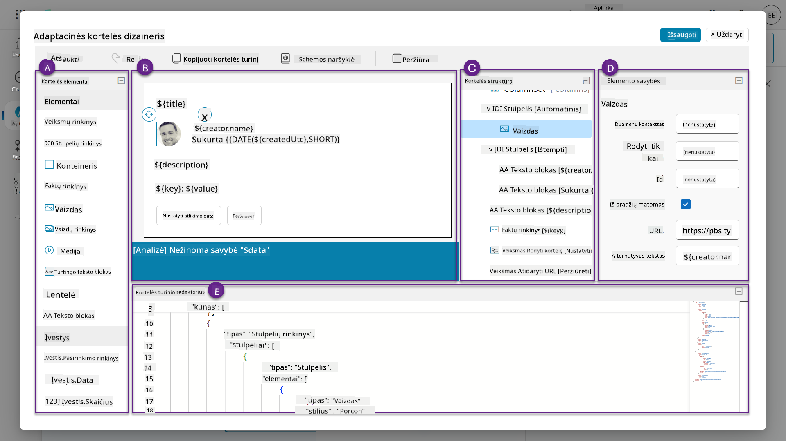

### A) Kortelės elementai

Tai yra jūsų adaptacinės kortelės statybiniai blokai. Galite vilkti ir numesti tokius elementus kaip:

- **TextBlock** tekstui rodyti.
- **Image** paveikslėliams rodyti.
- **FactSet** raktų-reikšmių poroms.
- **Įvesties laukai** tekstiniams laukams, datų pasirinkimui, perjungimams rodyti.
- **Veiksmai** mygtukams rodyti, pvz., _Pateikti_, _Atidaryti URL_ arba _Rodyti kortelę_.

Kiekvienas elementas turi savo paskirtį ir gali būti stilizuojamas arba konfigūruojamas.

### B) Kortelės peržiūra

Tai yra **Peržiūros** sritis, kurioje realiu laiku matote, kaip atrodys jūsų kortelė. Kai pridedate ar redaguojate elementus, peržiūra iš karto atnaujinama, kad atspindėtų pakeitimus. Tai leidžia atlikti iteratyvius atnaujinimus ir tuo pačiu metu matyti dizaino rezultatą.

### C) Kortelės struktūra

Tai rodo jūsų kortelės **hierarchiją ir išdėstymą**. Pavyzdžiui:

- Kortelė gali prasidėti **TextBlock** kaip antraštė.
- Tada **ColumnSet** su paveikslėliu vienoje pusėje ir tekstu kitoje.
- Po to **FactSet** ir keletas **Veiksmo mygtukų**.

Tai padeda suprasti, kaip elementai yra įdėti ir organizuoti.

### D) Elementų savybės

Kai spustelėsite bet kurį kortelės elementą, šiame skydelyje galėsite **pritaikyti jo nustatymus**:

- Keisti teksto dydį, svorį ar spalvą.
- Nustatyti paveikslėlio URL ar alternatyvų tekstą.
- Konfigūruoti įvesties parinktis, pvz., vietos rezervavimo tekstą ar numatytąsias reikšmes.

Čia galite tiksliai sureguliuoti kiekvieną elementą.

### E) Kortelės duomenų paketo redaktorius

Tai yra **žalias JSON kodas**, esantis už jūsų kortelės. Pažengę vartotojai gali jį redaguoti tiesiogiai:

- Naudoti šablonų funkcijas.
- Kopijuoti/įklijuoti kortelės apibrėžimus.

Net jei esate naujokas adaptacinės kortelės dizaineryje, naudinga matyti, kaip vizualinis dizainas verčiamas į kodą.

!!! tip "Patarimas - Peržiūrėkite adaptacinių kortelių pavyzdžius"

    1. Naršykite [https://adaptivecards.microsoft.com/designer](https://adaptivecards.microsoft.com/designer).
    2. Pasirinkite **Nauja kortelė**, kad pamatytumėte pavyzdžių sąrašą, kurį galite pasirinkti ir modifikuoti.
    3. Atkreipkite dėmesį, kad šis dizaineris yra išorinis (interneto pagrindu). Kai kuriate kortelę internetiniame adaptacinės kortelės dizaineryje, nukopijuokite JSON iš Kortelės duomenų paketo redaktoriaus.
    4. Įklijuokite JSON į savo adaptacinę kortelę savo agente Copilot Studio.

    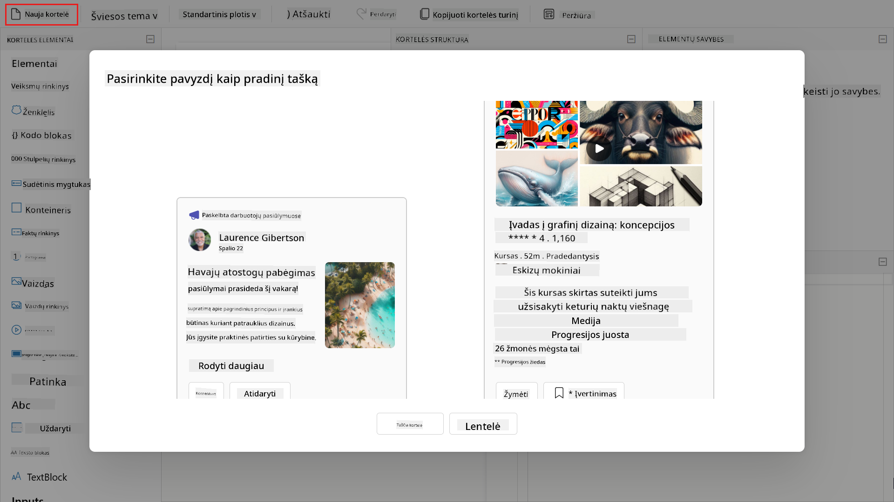

## 🌵 Dažniausi naudojimo atvejai

Šie yra dažniausi adaptacinių kortelių naudojimo atvejai Copilot Studio, kai naudojami **Siųsti pranešimą** arba **Užduoti klausimą** mazgai.

1. **Formos ir duomenų rinkimas**

    Naudokite adaptacines korteles struktūrizuotai vartotojų įvesčiai rinkti, pvz.:

    - Atostogų prašymai
    - Atsiliepimų formos
    - Kontaktinė informacija
    - Susitikimų planavimas

1. **Dinaminės informacijos rodymas**

    Rodykite vartotojams personalizuotus arba realaus laiko duomenis švariu, lengvai skaitomu formatu iš įmonės šaltinių, tokių kaip ServiceNow, SAP, Dynamics 365, SharePoint ir kt.

    - Užsakymų suvestinės
    - Sąskaitų likučiai
    - Bilietų ar bylų statusas
    - Artėjantys renginiai ar terminai

1. **Interaktyvūs pasirinkimai**

    Leiskite vartotojams pasirinkti tiesiogiai pokalbyje:

    - Pasirinkti iš sąrašo, pvz., produktų kategorijas, palaikymo temas.
    - Patvirtinti arba atšaukti veiksmą.
    - Įvertinti paslaugą ar patirtį.

1. **Veiksmų inicijavimas**

    Įtraukite mygtukus, kurie inicijuoja tolesnius veiksmus pokalbyje viduje arba išorėje.

    - "Pateikti prašymą"
    - "Peržiūrėti detales"

## ⭐ Geriausia praktika

Štai keletas geriausios praktikos pavyzdžių, kaip kurti adaptacines korteles agentams Copilot Studio.

1. **Laikykite paprastą ir aiškų**

    - Kurkite korteles su aiškiu tikslu, neperkraukite jų per daug elementų.
    - Naudokite glaustą tekstą ir intuityvius išdėstymus, kad padėtumėte vartotojams sąveikauti.

1. **Būkite apgalvoti su įvestimis**

    - Įtraukite tik būtinus įvesties elementus, pvz., tekstą, datų pasirinkimus, kad išvengtumėte vartotojų perkrovos.
    - Naudokite etiketes, kad įvestys būtų lengvai suprantamos.

1. **Struktūruokite aiškumui**

    - Naudokite **TextBlocks** antraštėms ir instrukcijoms.
    - Grupėkite susijusius elementus naudodami **Containers** arba **ColumnSets**, kad pagerintumėte vizualinį srautą.

1. **Padarykite veiksmų elementus aiškius**

    - Naudokite **Action.Submit** arba **Action.OpenUrl** su aiškiais mygtukų pavadinimais, pvz., "Pateikti prašymą" arba "Peržiūrėti detales".
    - Venkite neaiškių pavadinimų, pvz., "Spausk čia".

1. **Kurkite prisitaikymui**

    - Manykite, kad kortelė gali būti peržiūrima skirtingo dydžio ekranuose.
    - Venkite fiksuoto pločio ir naudokite lankstų išdėstymą, pvz., **ColumnSets**, kad būtų užtikrintas prisitaikymas.

1. **Naudokite dinaminį turinį, kai įmanoma**

    - Susiekite kortelės elementus su kintamaisiais arba mazgų išvestimis naudodami Power Fx, kad personalizuotumėte vartotojo patirtį.
    - Pavyzdžiui, dinamiškai rodykite vartotojo vardą arba dabartinį statusą.

## 🧪 Laboratorija 08 - Pridėkite adaptacines korteles ir pagerinkite temų galimybes

Dabar išmoksime, kaip pagerinti savo temą adaptacinėmis kortelėmis ir naudojant pažangias temų ir mazgų funkcijas.

- [8.1 Sukurkite naują temą su adaptacine kortele, kad vartotojas galėtų pateikti savo prašymą](../../../../../docs/recruit/08-add-adaptive-card)
- [8.2 Atnaujinkite agento instrukcijas, kad būtų iškviesta Prašymo įrenginio tema](../../../../../docs/recruit/08-add-adaptive-card)

### ✨ Naudojimo atvejis

**Kaip** darbuotojas

**Noriu** prašyti įrenginio

**Kad galėčiau** prašyti įrenginio iš galimų įrenginių
1. Toliau pridėkite **Klausimą su adaptacine kortele** mazgą. Šis mazgas parodys interaktyvią kortelę, kurioje vartotojas galės pasirinkti, kurį įrenginį norėtų užsakyti.

    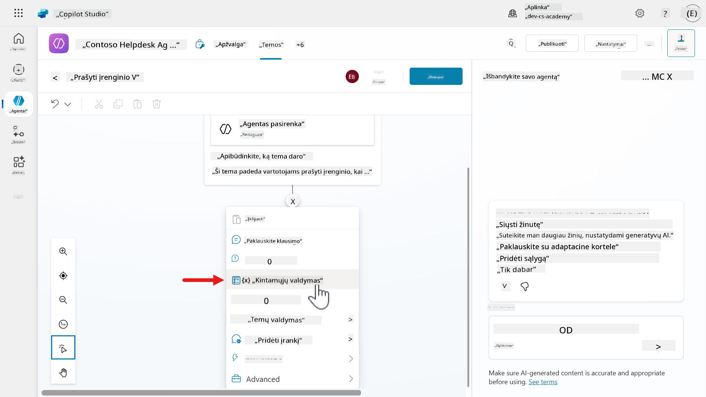

1. Pasirinkite mazgą ir pasirodys **Adaptacinės kortelės mazgo savybių** skydelis. Dabar redaguosime JSON. Pasirinkite **Redaguoti adaptacinę kortelę**. Pasirinkite **Redaguoti adaptacinę kortelę**.

    

1. Tai yra **Adaptacinės kortelės dizaineris**, kuriame galite kurti savo kortelę ir realiu laiku matyti jos dizainą.

    Pabandykite vilkti ir numesti **TextBlock** ir **FactSet** kortelės elementus į kūrimo drobę, kortelės peržiūros sritį. Pastebėkite, kaip kortelės struktūra ir kortelės turinio redaktorius atnaujinami, kai pridedami šie du kortelės elementai. Galite tiesiogiai atnaujinti kortelės turinio redaktorių ir elementų savybių skydelį.

    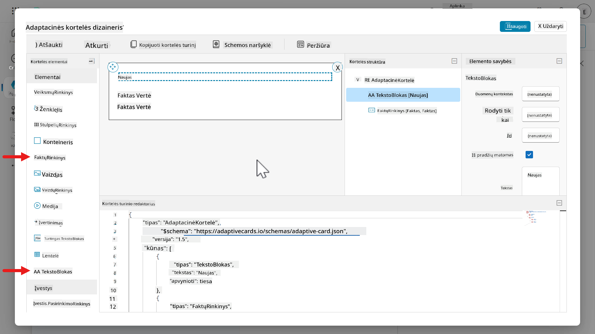

1. Pasirinkite **Peržiūra**, kad pamatytumėte kortelę skirtingais pločiais.

    

1. Peržiūra bus įkelta, kurioje matysite skirtingus kortelės išdėstymus pagal plotį.

    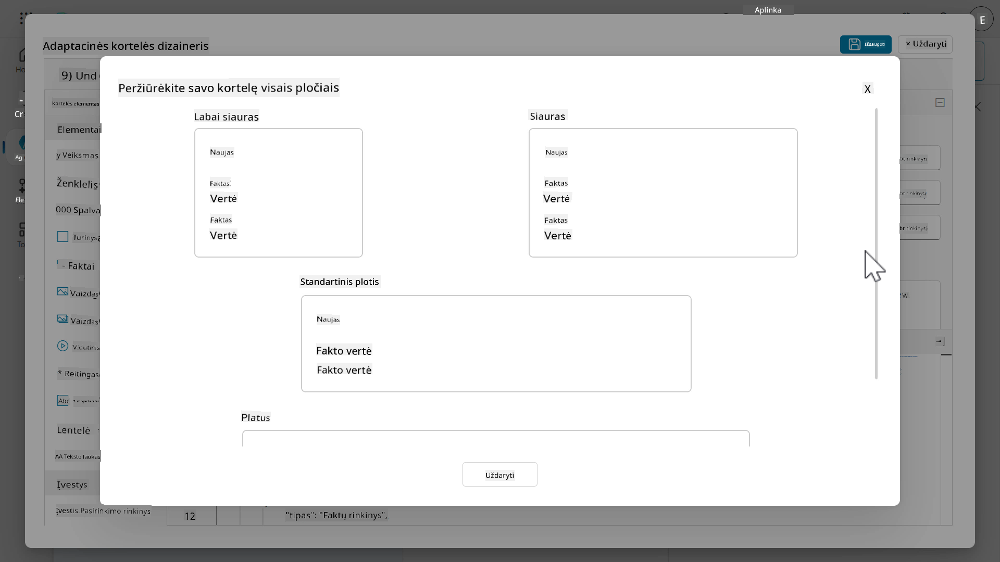

1. Išeikite iš **Peržiūros**, pasirinkdami **x ikoną**, ir dizaineryje pasirinkite **Atšaukti**, kad pašalintumėte anksčiau pridėtus du kortelės elementus.

    

1. Spustelėkite **Kortelės turinio redaktorių** ir pasirinkite visas eilutes naudodami „Windows“ klaviatūros spartųjį klavišą _Ctrl + A_ arba „Mac“ klaviatūros spartųjį klavišą _Command + A_, tada ištrinkite eilutes. **Įklijuokite** JSON iš [Request devices .JSON failo](../../../../../docs/recruit/08-add-adaptive-card/assets/8.1_RequestDevice.json).

    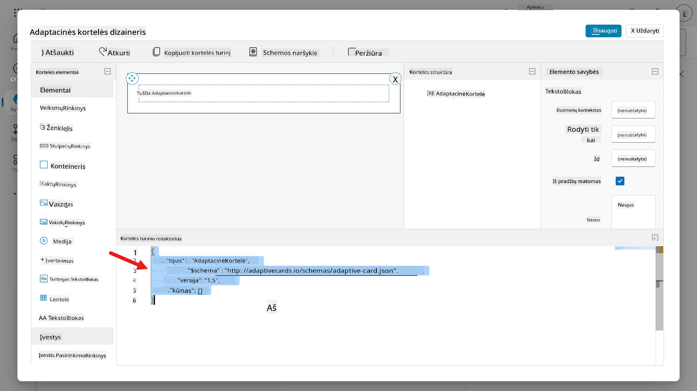

1. Pastebėkite, kaip **Kortelės peržiūra** dabar apima elementus, kurie rodo tekstą ir galimų įrenginių sąrašą.

    Šis JSON šiuo metu yra tik laikinas ir peržiūros forma, kurią naudosime kaip pagrindą mūsų kortelei, tačiau formulės, o ne JSON forma, nes mes naudosime **globalų kintamąjį**, `Global.VarDevices.value`, kuris saugo **Gauti elementus** SharePoint jungiklio veiksmų atsakymą.

    Pasirinkite **Išsaugoti** ir pasirinkite **Uždaryti**, kad išeitumėte iš Adaptacinės kortelės dizainerio lango.

    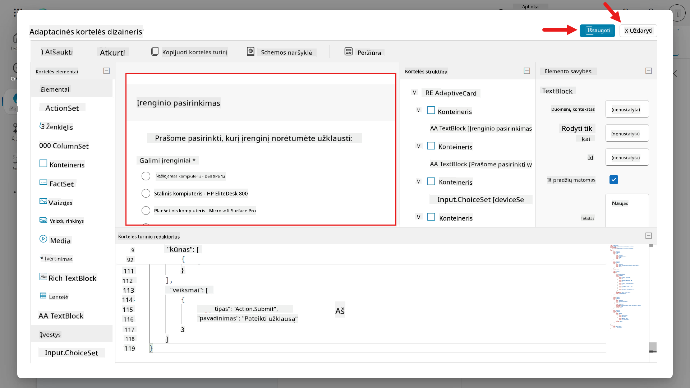

1. Uždarykite **Adaptacinės kortelės mazgo savybių** skydelį, pasirinkdami **X** ikoną.

    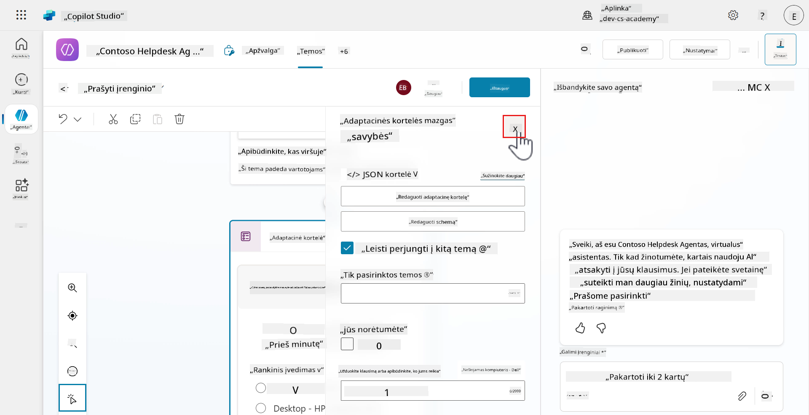

1. Temos kūrimo drobėje pamatysite adaptacinę kortelę.

    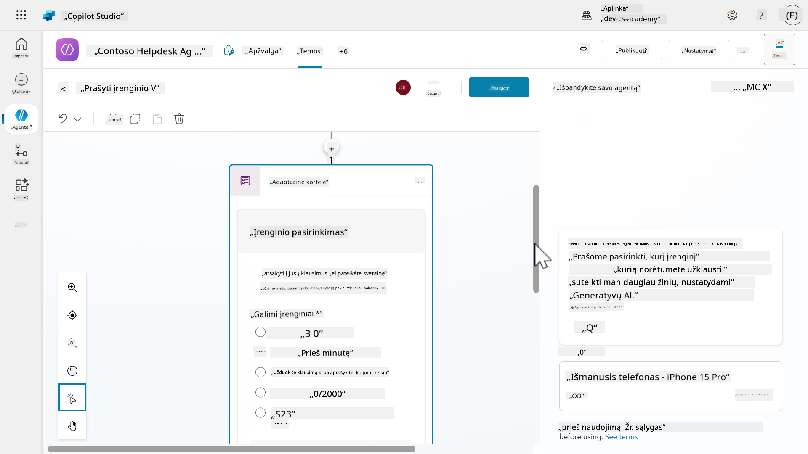

1. Slinkite į mazgo apačią ir pamatysite išvesties kintamuosius. `commentsId` ir `deviceSelectionId` buvo apibrėžti elementų savybėse. Šie du kintamieji saugos vertes iš kortelės elementų, su kuriais vartotojai sąveikauja. Šios vertės bus naudojamos toliau temoje, apie tai sužinosime kitame pamokos laboratorijoje.

    

1. Dabar atnaujinkime kortelę iš JSON į formulę, nes vėl naudosime Power Fx, kad galėtume peržiūrėti elementus, grąžintus **Gauti elementus** SharePoint jungiklio veiksmu, saugomus **globaliame kintamajame**, `Global.VarDevices.value`, per JSON atsakymo `value` savybę.

    > Šį globalų kintamąjį sukūrėme [Laboratorijoje 07 - Pridėti naują temą su pokalbių mazgais, 7.3 Pridėti įrankį naudojant jungiklį](../07-add-new-topic-with-trigger/README.md#73-add-a-tool-using-a-connector).

    Pasirinkite kortelę **Klausimo su adaptacine kortele** mazge, tada pasirinkite **chevron** ikoną ir pasirinkite **Formulė**.

    

1. Spustelėkite **išplėtimo** ikoną, kad padidintumėte Formulės lauką.

    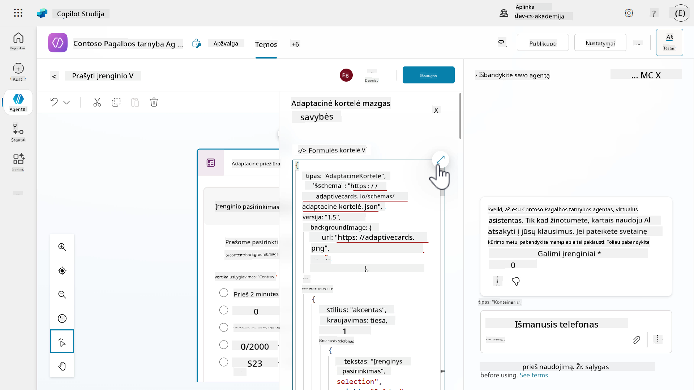

1. Spustelėkite **Kortelės turinio redaktorių** ir pasirinkite visas eilutes naudodami „Windows“ klaviatūros spartųjį klavišą _Ctrl + A_ arba „Mac“ klaviatūros spartųjį klavišą _Command + A_, tada ištrinkite eilutes.

    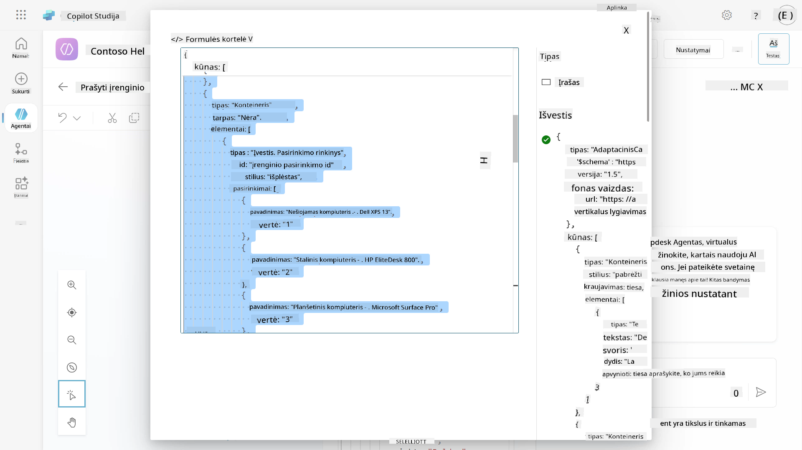

    Įklijuokite formulę iš [Request Devices formulės failo](../../../../../docs/recruit/08-add-adaptive-card/assets/8.1_RequestDeviceFormula.txt).

1. Formulėje mes peržiūrėsime kiekvieną SharePoint sąrašo elementą, naudodami `For All` funkciją, kad parodytume `Model` vertes pasirinkimo parinkties pavadinime, o SharePoint elemento `ID` bus nurodytas kaip vertė. Mes taip pat apgaubėme vertes su `If(IsBlank()` funkcijomis, nes formulė tikisi vertės, kad galėtų pateikti adaptacinę kortelę temos kūrimo drobėje. Priešingu atveju pasirodys pranešimas „Property cannot be null“.

    **Uždaryti** kortelės langą.

    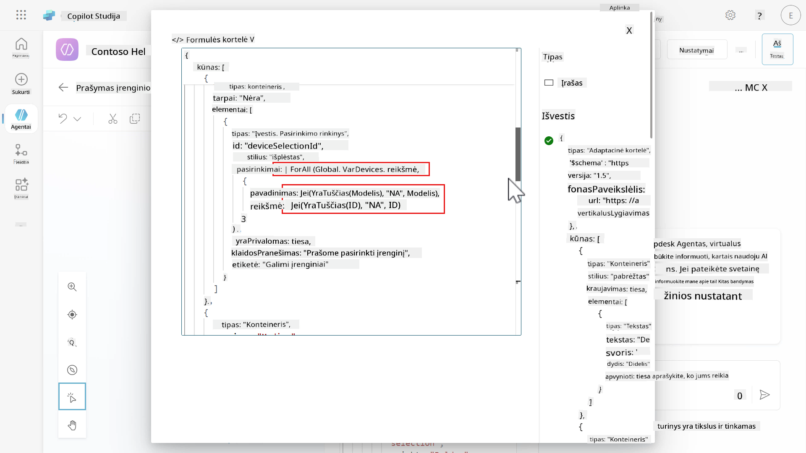

1. **Uždaryti** **Adaptacinės kortelės mazgo savybių** skydelį.

1. **Išsaugoti** temą.

    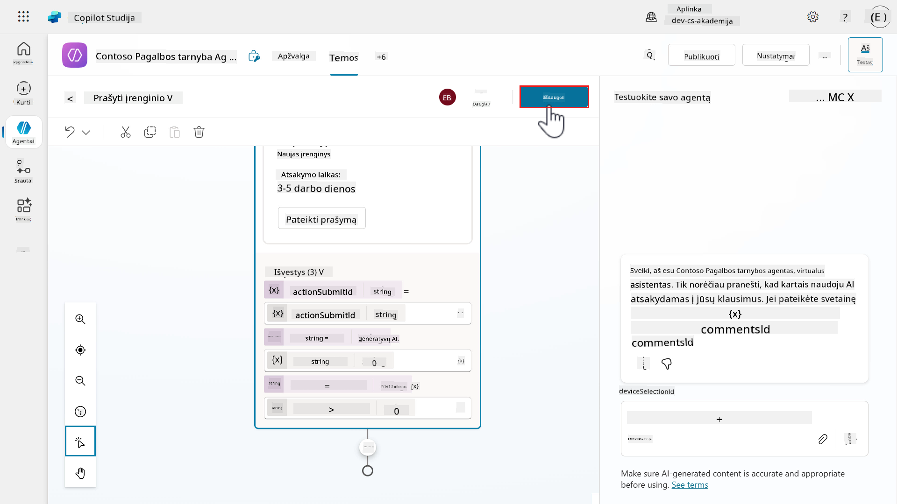

### 8.2 Atnaujinti agento instrukcijas, kad būtų iškviesta Užklausos įrenginio tema

Dabar, kai sukūrėme naują temą, kuri tvarko įrenginių užklausas, turime atnaujinti **agento instrukcijas**, kad būtų iškviesta tema.

1. Pasirinkite **Apžvalgos** skirtuką ir **agento instrukcijose** pasirinkite **Redaguoti**.

    

1. Pridėkite naują eilutę po ankstesne instrukcija iš [Laboratorijos 07 - Pridėti naują temą su pokalbių mazgais, 7.3 Pridėti įrankį naudojant jungiklį](../07-add-new-topic-with-trigger/README.md#73-add-a-tool-using-a-connector).

    ```text
    - If the user answers yes to the question of requesting a device, trigger [Request device]. Otherwise if they answer no to the question of requesting a device, trigger [Goodbye].
    ```

    Pasirinkite visą temos vietos rezervavimo ženklą kvadratinėse skliaustuose ir ištrinkite vietos rezervavimo ženklą.

    

1. Įveskite `/Req` ir pasirinkite **Užklausos įrenginių** temą.

    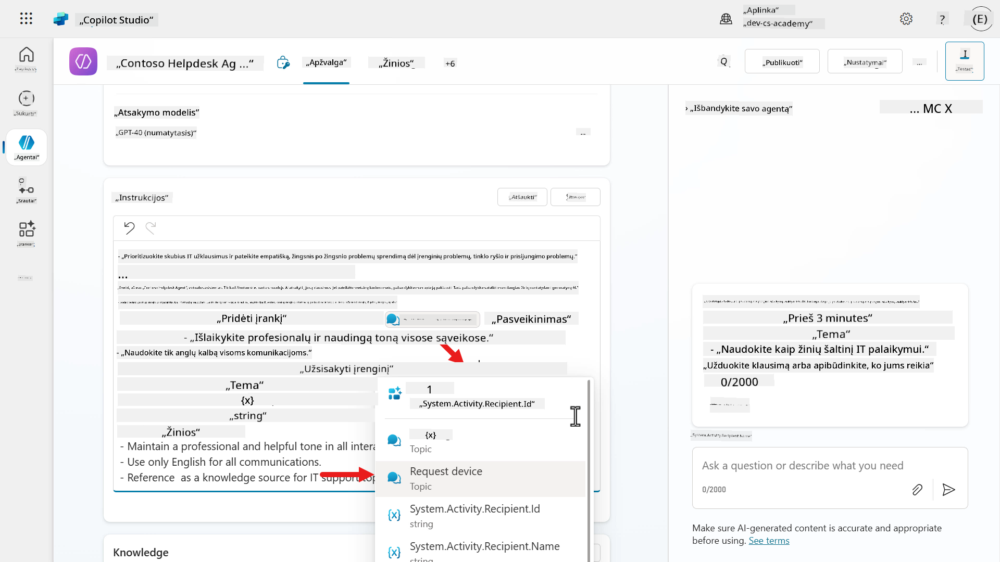

1. Pakartokite tuos pačius veiksmus kitam temos vietos rezervavimo ženklui, **[Atsisveikinimas]**. Pasirinkite visą temos vietos rezervavimo ženklą kvadratinėse skliaustuose ir ištrinkite vietos rezervavimo ženklą. Įveskite `/Goodbye` ir pasirinkite **Atsisveikinimo** temą.

    - Kai vartotojas atsako **Taip** į agento klausimą, ar jis norėtų užsakyti įrenginį, agentas nukreips iš **Galimų įrenginių** temos į **Užklausos įrenginių** temą.

    - Priešingu atveju, jei vartotojas atsako **Ne**, agentas nukreips iš **Galimų įrenginių** temos į **Atsisveikinimo** temą.

    **Išsaugoti** atnaujintas instrukcijas.

    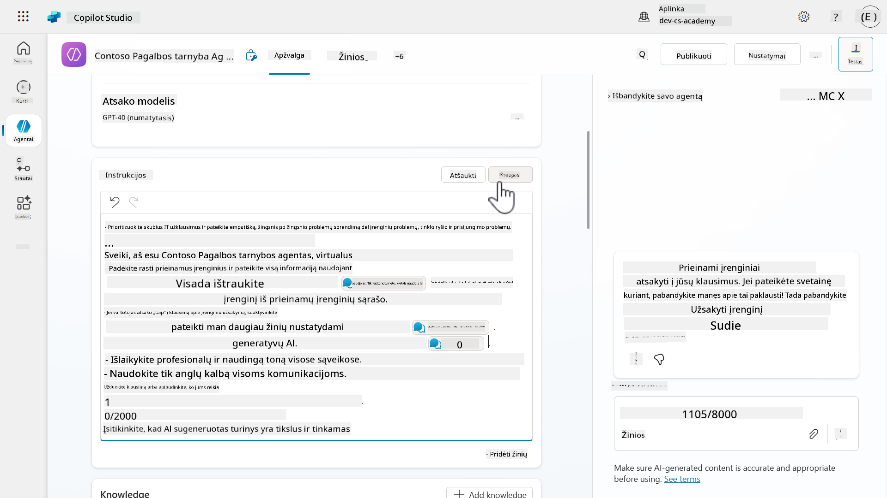

1. Dabar išbandykime nukreipimą iš _Galimų įrenginių_ temos į _Užklausos įrenginių_ temą. Pasirinkite **Testuoti**, kad įkeltumėte testavimo skydelį, ir pasirinkite **Atnaujinti**.

    Tada pasirinkite **Veiklos žemėlapio** ikoną testavimo skydelyje, po to įjunkite **Sekti tarp temų**. Tai leis mums matyti, kaip _Galimų įrenginių_ tema nukreipia į _Užklausos įrenginių_ temą.

    Gerai, galime testuoti! Įveskite šį tekstą testavimo skydelyje.

    ```text
    I need a laptop
    ```

    

1. Agentas atsakys su galimų įrenginių sąrašu, po to užduos klausimą, ar vartotojas norėtų užsakyti įrenginį. Nukopijuokite ir įklijuokite šį tekstą,

    ```text
    yes please
    ```

    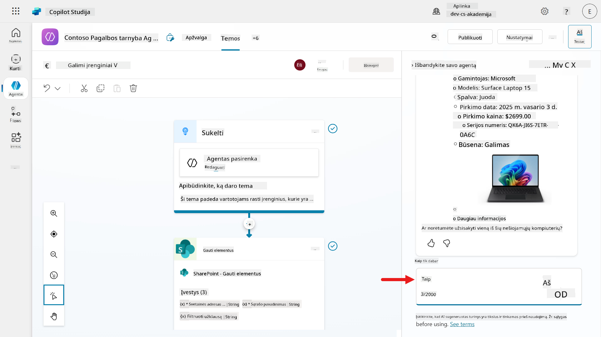

1. Tada pamatysime, kad agentas nukreipė į **Užklausos įrenginio** temą. Agentas iškvietė šią temą pagal mūsų pridėtas instrukcijas.

    Adaptacinė kortelė su interaktyviais elementais dabar bus rodoma kaip pranešimas vartotojui.

    

1. Dabar sėkmingai išbandėme 😄, kaip _Galimų įrenginių_ tema nukreipia į _Užklausos įrenginių_ temą. Kitame pamokos laboratorijoje pridėsime daugiau patobulinimų šiai temai.

    Atnaujinkite testavimo skydelį.

    

## ✅ Misija įvykdyta

Sveikiname! 👏🏻 Jūs išmokote pridėti adaptacines korteles, naudodami Power Fx formules, kad būtų rodomi duomenys iš kintamųjų, taip pat išmokote nukreipti iš vienos temos į kitą. Sukuriant mažesnes temas, jūsų agentas tampa labiau organizuotas, bet taip pat padeda vartotojams pereiti per skirtingas pokalbio su agentu dalis.

Tai yra **Laboratorijos 08 - Pagerinti vartotojo sąveiką su adaptacinėmis kortelėmis** pabaiga, pasirinkite žemiau esančią nuorodą, kad pereitumėte į kitą pamoką. Kitame pamokos laboratorijoje išplėsime šio laboratorijos naudojimo atvejį.

⏭️ [Pereiti į **Pridėti agento srautą jūsų temai automatizavimui** pamoką](../09-add-an-agent-flow/README.md)

## 📚 Taktiniai ištekliai

🔗 [Adaptacinių kortelių naudojimas Copilot Studio](https://learn.microsoft.com/microsoft-copilot-studio/guidance/adaptive-cards-overview?WT.mc_id=power-172619-ebenitez)

🔗 [Pridėti adaptacinę kortelę Siųsti pranešimą mazge](https://learn.microsoft.com/microsoft-copilot-studio/authoring-send-message#add-an-adaptive-card?WT.mc_id=power-172619-ebenitez)

🔗 [Kurti išraiškas naudojant Power Fx](https://learn.microsoft.com/microsoft-copilot-studio/advanced-power-fx?WT.mc_id=power-172619-ebenitez)

📺 [Adaptacinių kortelių kūrimas su Power FX](https://aka.ms/ai-in-action/copilot-studio/ep8)

<!-- markdownlint-disable-next-line MD033 -->


---

**Atsakomybės apribojimas**:  
Šis dokumentas buvo išverstas naudojant AI vertimo paslaugą [Co-op Translator](https://github.com/Azure/co-op-translator). Nors siekiame tikslumo, prašome atkreipti dėmesį, kad automatiniai vertimai gali turėti klaidų ar netikslumų. Originalus dokumentas jo gimtąja kalba turėtų būti laikomas autoritetingu šaltiniu. Dėl svarbios informacijos rekomenduojama profesionali žmogaus vertimo paslauga. Mes neprisiimame atsakomybės už nesusipratimus ar neteisingus aiškinimus, atsiradusius dėl šio vertimo naudojimo.