<!--
CO_OP_TRANSLATOR_METADATA:
{
  "original_hash": "4fb913dfc3bbc71506dd3602c4b8e6ed",
  "translation_date": "2025-10-20T01:03:21+00:00",
  "source_file": "docs/operative-preview/02-multi-agent/README.md",
  "language_code": "ms"
}
-->
# 🚨 Misi 02: Ejen Berhubung

--8<-- "disclaimer.md"

## 🕵️‍♂️ NAMA KOD: `OPERASI SIMFONI`

> **⏱️ Tempoh Operasi:** `~45 minit`

## 🎯 Penerangan Misi

Selamat kembali, Ejen. Dalam Misi 01, anda telah membina Ejen Pengambilan utama anda - asas yang kukuh untuk menguruskan aliran kerja pengambilan pekerja. Tetapi satu ejen sahaja tidak mencukupi.

Tugasan anda, jika anda memilih untuk menerimanya, adalah **Operasi Simfoni** - mengubah ejen tunggal anda menjadi **sistem ejen pelbagai**: pasukan ejen pakar yang teratur dan bekerjasama untuk menangani cabaran pengambilan pekerja yang kompleks. Fikirkan ia seperti menaik taraf daripada pengendali solo kepada memimpin pasukan tugas khas.

Seperti orkestra simfoni di mana setiap pemuzik memainkan peranan mereka dengan harmoni sempurna, anda akan menambah dua pakar penting kepada Ejen Pengambilan sedia ada anda: Ejen Penerimaan Permohonan untuk memproses resume secara automatik, dan Ejen Persediaan Temuduga untuk mencipta bahan temuduga yang komprehensif. Ejen-ejen ini akan bekerjasama dengan lancar di bawah pengarah utama anda.

## 🔎 Objektif

Dalam misi ini, anda akan mempelajari:

1. Bila untuk menggunakan **ejen anak** berbanding **ejen berhubung**
1. Cara mereka bentuk **senibina ejen pelbagai** yang boleh diskalakan  
1. Mencipta **ejen anak** untuk tugas-tugas khusus
1. Menetapkan **pola komunikasi** antara ejen
1. Membina Ejen Penerimaan Permohonan dan Ejen Persediaan Temuduga

## 🧠 Apa itu ejen berhubung?

Dalam Copilot Studio, anda tidak terhad kepada membina ejen tunggal yang monolitik. Anda boleh mencipta **sistem ejen pelbagai** - rangkaian ejen pakar yang bekerjasama untuk menangani aliran kerja yang kompleks.

Fikirkan ia seperti organisasi dunia sebenar: bukannya satu orang melakukan segalanya, anda mempunyai pakar yang cemerlang dalam tugas tertentu dan bekerjasama apabila diperlukan.

### Kenapa sistem ejen pelbagai penting

- **Kebolehskalaan:** Setiap ejen boleh dibangunkan, diuji, dan diselenggara secara bebas oleh pasukan yang berbeza.  
- **Kepakaran:** Ejen boleh fokus pada apa yang mereka lakukan dengan baik. Mungkin satu untuk pemprosesan data, satu lagi untuk interaksi pengguna, satu lagi untuk membuat keputusan.  
- **Fleksibiliti:** Anda boleh mencampur dan memadankan ejen, menggunakannya semula dalam projek lain, dan mengembangkan sistem anda secara beransur-ansur.  
- **Kebolehselenggaraan:** Perubahan pada satu ejen tidak semestinya mempengaruhi ejen lain, menjadikan kemas kini lebih selamat dan mudah.

### Contoh dunia sebenar: Proses pengambilan pekerja

Pertimbangkan aliran kerja pengambilan pekerja kita - pelbagai ejen mungkin bekerjasama dengan tanggungjawab berikut:

- **Penerimaan resume** memerlukan kemahiran memproses dokumen dan mengekstrak data
- **Penilaian** melibatkan penilaian resume calon dan memadankannya dengan keperluan pekerjaan
- **Persediaan temuduga** memerlukan penilaian mendalam tentang kesesuaian calon  
- **Komunikasi dengan calon** memerlukan kemahiran komunikasi yang empati

Daripada membina satu ejen besar yang cuba menangani semua kemahiran yang berbeza ini, anda boleh mencipta ejen pakar untuk setiap bidang dan mengatur mereka bersama.

## 🔗 Ejen anak vs ejen berhubung: Perbezaan utama

Copilot Studio menawarkan dua cara untuk membina sistem ejen pelbagai, masing-masing dengan kes penggunaan yang berbeza:

### ↘️ Ejen anak

Ejen anak adalah **pakar ringan** yang berada dalam ejen utama anda. Fikirkan mereka sebagai pasukan khusus dalam jabatan yang sama.

#### Butiran teknikal utama

- Ejen anak berada dalam ejen induk dan mempunyai satu halaman konfigurasi.
- Alat dan Pengetahuan **disimpan di ejen induk**, tetapi dikonfigurasikan untuk "Tersedia untuk" ejen anak.
- Ejen anak **berkongsi topik** ejen induk mereka. Topik boleh dirujuk oleh arahan ejen anak.
- Ejen anak **tidak memerlukan penerbitan berasingan** - mereka secara automatik tersedia dalam ejen induk mereka sebaik sahaja dicipta. Ini memudahkan pengujian kerana perubahan pada ejen induk dan anak boleh dilakukan dalam **ruang kerja yang sama**.

#### Gunakan ejen anak apabila

- Satu pasukan menguruskan keseluruhan penyelesaian
- Anda ingin mengatur alat dan pengetahuan secara logik ke dalam sub-ejen
- Anda tidak memerlukan pengesahan atau penerbitan berasingan untuk setiap ejen
- Ejen tidak akan diterbitkan secara berasingan atau digunakan secara bebas
- Anda tidak perlu menggunakan semula ejen dalam pelbagai penyelesaian

**Contoh:** Ejen meja bantuan IT dengan ejen anak untuk:

- Prosedur tetapan semula kata laluan
- Penyelesaian masalah perkakasan  
- Panduan pemasangan perisian

### 🔀 Ejen berhubung

Ejen berhubung adalah **ejen bebas sepenuhnya** yang boleh bekerjasama dengan ejen utama anda. Fikirkan mereka sebagai jabatan berasingan yang bekerjasama dalam satu projek.

#### Butiran teknikal utama

- Ejen berhubung mempunyai **topik dan aliran perbualan mereka sendiri**. Mereka beroperasi secara bebas dengan tetapan, logik, dan kitaran penerbitan mereka sendiri.
- Ejen berhubung **mesti diterbitkan** sebelum mereka boleh ditambah dan digunakan oleh ejen lain.
- Semasa pengujian, perubahan pada ejen berhubung mesti diterbitkan sebelum ia boleh digunakan oleh ejen pemanggil.

#### Gunakan ejen berhubung apabila

- Pelbagai pasukan membangunkan dan menyelenggara ejen yang berbeza secara bebas
- Ejen memerlukan tetapan, pengesahan, dan saluran penerbitan mereka sendiri
- Anda ingin menerbitkan dan menyelenggara ejen secara berasingan dengan pengurusan kitaran hayat aplikasi (ALM) yang bebas untuk setiap ejen
- Ejen harus boleh digunakan semula dalam pelbagai penyelesaian

**Contoh:** Sistem perkhidmatan pelanggan yang berhubung dengan:

- Ejen pengebilan berasingan yang diselenggara oleh pasukan kewangan
- Ejen sokongan teknikal berasingan yang diselenggara oleh pasukan produk
- Ejen pemulangan berasingan yang diselenggara oleh pasukan operasi

!!! tip "Petua"
    Anda boleh menggabungkan kedua-dua pendekatan! Sebagai contoh, ejen utama anda boleh berhubung dengan ejen luaran dari pasukan lain sambil juga mempunyai ejen anak sendiri untuk tugas dalaman khusus.

## 🎯 Pola senibina ejen pelbagai

Apabila mereka bentuk sistem ejen pelbagai, beberapa pola muncul berdasarkan bagaimana ejen berinteraksi:

| Pola                | Penerangan                                                                 | Terbaik Untuk                                                |
|---------------------|---------------------------------------------------------------------------|-------------------------------------------------------------|
| **Hub dan Spoke**   | Ejen pengarah utama menyelaraskan dengan pelbagai ejen pakar. Pengarah mengendalikan interaksi pengguna dan menyerahkan tugas kepada ejen anak atau berhubung. | Aliran kerja kompleks di mana satu ejen menyelaraskan tugas pakar |
| **Rangkaian**       | Ejen menghantar kerja secara berurutan dari satu ke yang lain, setiap satu menambah nilai sebelum menghantar ke peringkat seterusnya. | Proses linear seperti pemprosesan permohonan (penerimaan → penapisan → temuduga → keputusan) |
| **Kolaboratif**     | Ejen bekerjasama secara serentak pada aspek yang berbeza dari masalah yang sama, berkongsi konteks dan hasil. | Analisis kompleks yang memerlukan pelbagai perspektif atau bidang kepakaran |

!!! tip "Petua"
    Anda mungkin juga mempunyai gabungan dua atau lebih pola ini.

## 💬Komunikasi ejen dan perkongsian konteks

Apabila ejen bekerjasama, mereka perlu berkongsi maklumat dengan berkesan. Berikut adalah cara ia berfungsi dalam Copilot Studio:

### Sejarah perbualan

Secara lalai, apabila ejen utama memanggil ejen anak atau berhubung, ia boleh menghantar **sejarah perbualan**. Ini memberikan ejen pakar konteks penuh tentang apa yang telah dibincangkan oleh pengguna.

Anda boleh mematikan ini atas sebab keselamatan atau prestasi - contohnya, jika ejen pakar hanya perlu menyelesaikan tugas tertentu tanpa memerlukan konteks perbualan penuh. Ini boleh menjadi pertahanan yang baik terhadap **kebocoran data**.

### Arahan eksplisit

Ejen utama anda boleh memberikan **arahan khusus** kepada ejen anak atau berhubung. Contohnya: "Proses resume ini dan ringkaskan kemahiran mereka untuk peranan Pembangun Kanan."

### Nilai pulangan

Ejen boleh mengembalikan maklumat yang terstruktur kepada ejen pemanggil, membolehkan ejen utama menggunakan maklumat tersebut dalam langkah seterusnya atau berkongsi dengan ejen lain.

### Integrasi Dataverse

Untuk senario yang lebih kompleks, ejen boleh berkongsi maklumat melalui **Dataverse** atau stor data lain, membolehkan perkongsian konteks yang berterusan merentasi pelbagai interaksi.

## ↘️Ejen anak: Ejen Penerimaan Permohonan

Mari kita mula membina sistem pengambilan pekerja ejen pelbagai kita. Pakar pertama kita ialah **Ejen Penerimaan Permohonan** - ejen anak yang bertanggungjawab memproses resume dan maklumat calon yang diterima.

```mermaid
---
config:
  layout: elk
  look: neo
---
flowchart TB
 subgraph People["People"]
    direction TB
        HiringManager["Hiring Manager"]
        Interviewers["Interviewers"]
  end
 subgraph Agents["Agents"]
    direction LR
        ApplicationIntakeAgent["Application Intake Agent<br>(Child)"]
        InterviewAgent["Interview Agent<br>(Connected)"]
        HRAgent["HR Agent"]
  end
    HiringManager -- Upload CV --> HRAgent
    HRAgent -- Upload Resume, Create Candidate, Match to Job Roles --> ApplicationIntakeAgent
    ApplicationIntakeAgent -- Create Resume, Upsert Candidate, Create Job Application --> Dataverse["Dataverse"]
    ApplicationIntakeAgent -- Store Resume file in file column --> Dataverse
    HiringManager -- Ask for summaries --> HRAgent
    Interviewers -- Request interview pack --> HRAgent
    HRAgent -- Generate interview pack and summarize data --> InterviewAgent
    InterviewAgent -- Read all Candidate, Resume, Job Roles, Evaluation Criteria Data --> Dataverse
     HiringManager:::person
     Interviewers:::person
     ApplicationIntakeAgent:::agent
     InterviewAgent:::agent
     HRAgent:::agent
     Dataverse:::data
    classDef person fill:#e6f0ff,stroke:#3b82f6,color:#0b3660
    classDef agent fill:#e8f9ef,stroke:#10b981,color:#064e3b
    classDef data  fill:#f3f4f6,stroke:#6b7280,color:#111827
```

### 🤝Tanggungjawab Ejen Penerimaan Permohonan

- **Memproses kandungan resume** daripada PDF yang diberikan melalui chat interaktif (Dalam misi masa depan anda akan belajar cara memproses resume secara automatik).
- **Mengekstrak data terstruktur** (nama, kemahiran, pengalaman, pendidikan)
- **Memadankan calon dengan peranan terbuka** berdasarkan kelayakan dan surat lamaran
- **Menyimpan maklumat calon** dalam Dataverse untuk pemprosesan kemudian
- **Mengelakkan pendua permohonan** untuk mengelakkan penciptaan calon yang sama dua kali, memadankan kepada rekod sedia ada menggunakan alamat e-mel yang diekstrak daripada resume.

### ⭐Kenapa ini patut menjadi ejen anak

Ejen Penerimaan Permohonan sesuai sebagai ejen anak kerana:

- Ia khusus untuk pemprosesan dokumen dan pengekstrakan data
- Ia tidak memerlukan penerbitan berasingan  
- Ia adalah sebahagian daripada penyelesaian pengambilan pekerja keseluruhan yang diuruskan oleh pasukan yang sama
- Ia fokus pada pencetus tertentu (resume baru diterima) dan diaktifkan dari Ejen Pengambilan.

## 🔀Ejen berhubung: Ejen Persediaan Temuduga  

Pakar kedua kita ialah **Ejen Persediaan Temuduga** - ejen berhubung yang membantu mencipta bahan temuduga yang komprehensif dan menilai jawapan calon.

### 🤝Tanggungjawab Ejen Persediaan Temuduga

- **Mencipta pek temuduga** dengan maklumat syarikat, keperluan peranan, dan kriteria penilaian
- **Menjana soalan temuduga** yang disesuaikan untuk peranan tertentu dan latar belakang calon
- **Menjawab soalan umum** tentang peranan pekerjaan dan permohonan untuk komunikasi dengan pihak berkepentingan

### ⭐Kenapa ini patut menjadi ejen berhubung

Ejen Persediaan Temuduga lebih sesuai sebagai ejen berhubung kerana:

- Pasukan pengambilan bakat mungkin ingin menggunakannya secara bebas dalam pelbagai proses pengambilan pekerja
- Ia memerlukan pangkalan pengetahuan sendiri tentang amalan terbaik temuduga dan kriteria penilaian
- Pengurus pengambilan yang berbeza mungkin ingin menyesuaikan tingkah lakunya untuk pasukan mereka
- Ia boleh digunakan semula untuk jawatan dalaman, bukan hanya pengambilan pekerja luar

## 🧪Makmal 2.1: Menambah Ejen Penerimaan Permohonan

Bersedia untuk mempraktikkan teori? Mari tambahkan ejen anak pertama kita kepada Ejen Pengambilan sedia ada anda.

### Prasyarat untuk melengkapkan misi ini

Anda perlu **sama ada**:

- **Telah melengkapkan Misi 01** dan mempunyai Ejen Pengambilan anda sedia, **ATAU**
- **Import penyelesaian permulaan Misi 02** jika anda bermula dari awal atau perlu mengejar. [Muat Turun Penyelesaian Permulaan Misi 02](https://aka.ms/agent-academy)

!!! note "Import Penyelesaian dan Data Sampel"
    Jika anda menggunakan penyelesaian permulaan, rujuk [Misi 01](../01-get-started/README.md) untuk arahan terperinci tentang cara mengimport penyelesaian dan data sampel ke dalam persekitaran anda.

### 2.1.1 Persediaan penyelesaian

1. Di dalam Copilot Studio, pilih elipsis (...) di bawah Alat dalam navigasi sebelah kiri.
1. Pilih **Penyelesaian**.  
    
1. Cari penyelesaian Operatif anda, pilih **elipsis (...)** di sebelahnya, dan pilih **Tetapkan penyelesaian pilihan**. Ini akan memastikan semua kerja anda akan ditambah ke penyelesaian ini.  
    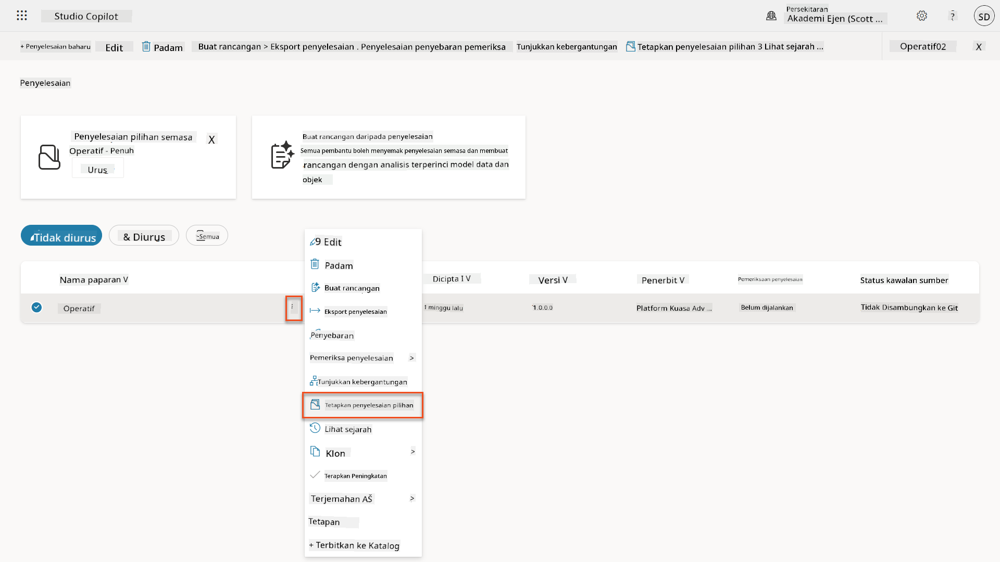

### 2.1.2 Konfigurasikan arahan ejen Ejen Pengambilan anda

1. **Navigasi** ke Copilot Studio. Pastikan persekitaran anda dipilih di penjuru kanan atas **Pemilih Persekitaran**.

1. Buka **Ejen Pengambilan** anda dari Misi 01

1. Pilih **Edit** di bahagian **Arahan** tab **Gambaran Keseluruhan**, dan tambahkan arahan berikut di bahagian atas:

    ```text
    You are the central orchestrator for the hiring process. You coordinate activities, provide summaries, and delegate work to specialized agents.
    ```

1. Pilih **Simpan**  
    

1. Pilih **Tetapan** (penjuru kanan atas)

1. Pastikan tetapan berikut:

    | Tetapan | Nilai |
    |---------|-------|
    | Gunakan orkestrasi AI generatif untuk respons ejen anda | **Ya** |
    | Moderasi Kandungan | **Sederhana** |
    | Gunakan pengetahuan umum | **Mati** |
    | Gunakan maklumat dari Web | **Mati** |
    | Muat naik fail | **Hidup** |


### 2.1.3 Tambah ejen anak Ejen Penerimaan Permohonan

1. **Navigasi** ke tab **Ejen** dalam Ejen Pengambilan anda - di sinilah anda akan menambah ejen pakar.

1. Pilih **+ Tambah** dan kemudian **Cipta ejen**. Perhatikan bahawa ini dilabelkan dengan "*Cipta ejen ringan yang berada dalam ejen semasa anda dan mewarisi tetapan. Sesuai untuk memecahkan logik kompleks* "  
    

1. **Namakan** ejen anda `Ejen Penerimaan Permohonan`

1. Pilih **Ejen memilih** - Berdasarkan penerangan dalam dropdown **Bila ini akan digunakan?**. Pilihan ini serupa dengan pencetus yang boleh dikonfigurasikan untuk topik.

1. Tetapkan **Penerangan** kepada:

    ```text
    Processes incoming resumes and stores candidates in the system
    ```

    

1. Kembangkan **Lanjutan**, dan tetapkan Keutamaan kepada `10000`. Ini akan memastikan bahawa kemudian Ejen Temuduga akan digunakan untuk menjawab soalan umum sebelum yang ini. Satu syarat juga boleh ditetapkan di sini seperti memastikan terdapat sekurang-kurangnya satu lampiran.

1. Pastikan togol **Carian Web** ditetapkan kepada **Dilumpuhkan**. Ini kerana kita hanya mahu menggunakan maklumat yang diberikan oleh ejen induk.

1. Pilih **Simpan**

### 2.1.4 Konfigurasikan aliran ejen Muat Naik Resume

Ejen tidak boleh melaksanakan sebarang tindakan tanpa diberikan alat atau topik.
Kami menggunakan **Alat Agent Flow** dan bukannya Topik untuk langkah *Muat Naik Resume* kerana proses backend berbilang langkah ini memerlukan pelaksanaan deterministik dan integrasi dengan sistem luaran. Walaupun Topik terbaik untuk membimbing dialog perbualan, Agent Flow menyediakan automasi berstruktur yang diperlukan untuk mengendalikan pemprosesan fail, pengesahan data, dan kemas kini pangkalan data (menambah baru atau mengemas kini yang sedia ada) dengan pasti tanpa bergantung pada interaksi pengguna.

1. Cari bahagian **Tools** di dalam halaman Application Intake Agent.
   **Penting:** Ini bukan tab Tools bagi ejen induk, tetapi boleh dijumpai jika anda menatal ke bawah di bawah arahan ejen anak.

1. Pilih **+ Add**
   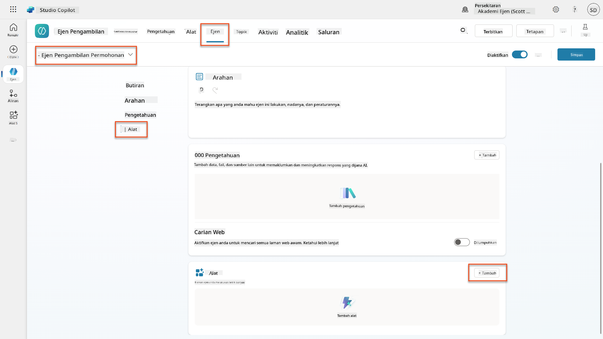

1. Pilih **+ New tool** 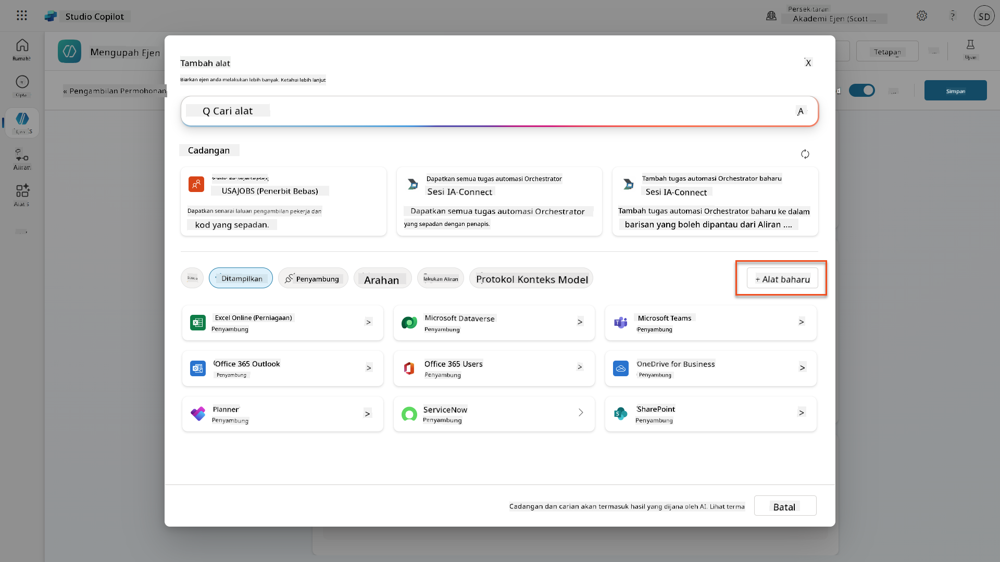

1. Pilih **Agent flow**.
    Pereka bentuk Agent Flow akan dibuka, di sinilah kita akan menambah logik muat naik resume.  
    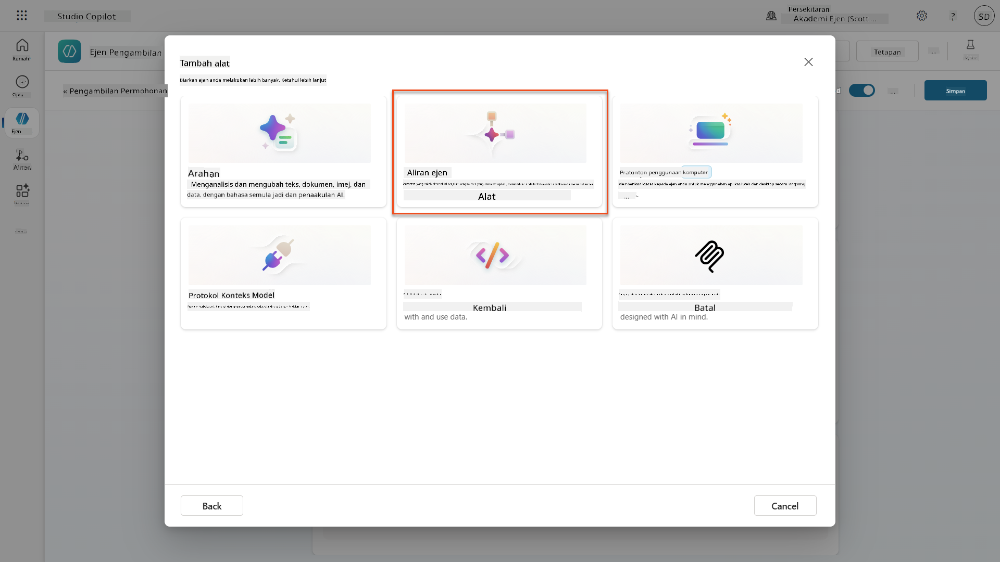

1. Pilih nod **When an agent calls the flow**, dan pilih **+ Add** input untuk Parameter berikut, pastikan untuk menambah nama dan penerangan.

    | Jenis  | Nama      | Penerangan                                                                                                   |
    |--------|-----------|-------------------------------------------------------------------------------------------------------------|
    | Fail   | Resume    | Fail PDF Resume                                                                                            |
    | Teks   | Message   | Ekstrak mesej gaya surat pengenalan daripada konteks. Mesej mesti kurang daripada 2000 aksara.              |
    | Teks   | UserEmail | Alamat e-mel asal Resume. Ini akan menjadi pengguna yang memuat naik resume dalam chat, atau alamat e-mel pengirim jika diterima melalui e-mel. |

    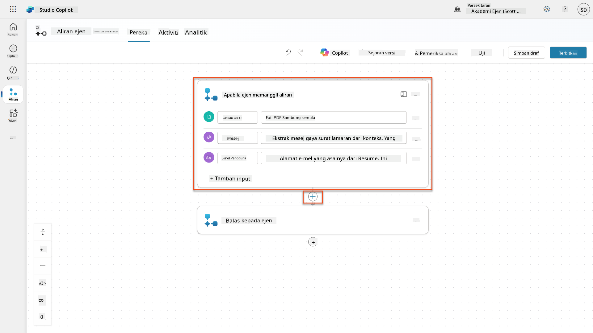

1. Pilih ikon **+** di bawah nod pencetus, cari `Dataverse`, pilih **See more** di sebelah Microsoft Dataverse, dan kemudian pilih tindakan **Add a new row** dalam bahagian **Microsoft Dataverse**  
    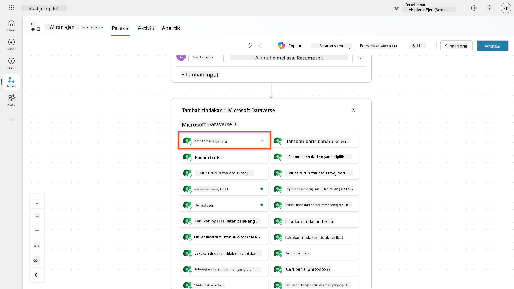

1. Namakan nod kepada **Create Resume**, dengan memilih **ellipsis(...)**, dan memilih **Rename**  
    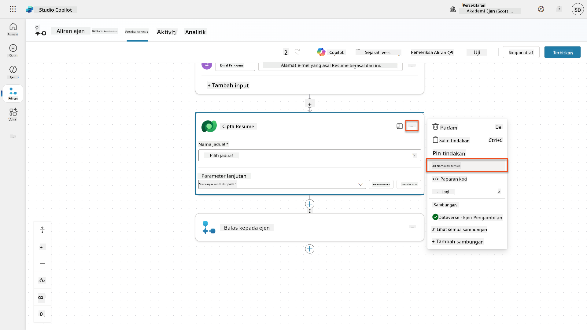

1. Tetapkan **Table name** kepada **Resumes**, kemudian pilih **Show all**, untuk menunjukkan semua parameter.

1. Tetapkan **properties** berikut:

    | Properti                 | Cara Tetapkan                  | Butiran / Ekspresi                                             |
    |--------------------------|--------------------------------|---------------------------------------------------------------|
    | **Resume Title**         | Data dinamik (ikon kilat)      | **When an agent calls the flow** → **Resume name** Jika anda tidak melihat Resume name, pastikan anda telah mengkonfigurasi parameter Resume di atas sebagai jenis data. |
    | **Cover letter**         | Ekspresi (ikon fx)             | `if(greater(length(triggerBody()?['text']), 2000), substring(triggerBody()?['text'], 0, 2000), triggerBody()?['text'])` |
    | **Source Email Address** | Data dinamik (ikon kilat)      | **When an agent calls the flow** → **UserEmail**             |
    | **Upload Date**          | Ekspresi (ikon fx)             | `utcNow()`                                                   |

    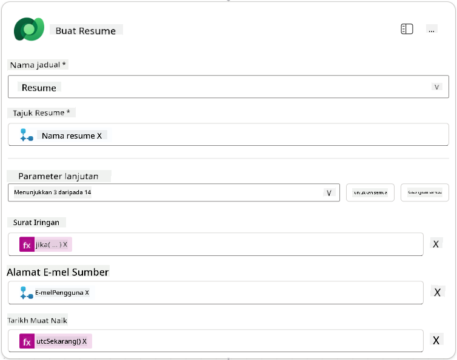

1. Pilih ikon **+** di bawah nod Create Resume, cari `Dataverse`, pilih **See more** di sebelah Microsoft Dataverse, dan kemudian pilih tindakan **Upload a file or an image**.
   **Penting:** Pastikan tidak memilih tindakan Upload a file or an image to the selected environment.

1. Namakan nod kepada **Upload Resume File**, dengan memilih **ellipsis(...)**, dan memilih **Rename**

1. Tetapkan **properties** berikut:

     | Properti | Cara Tetapkan | Butiran |
     |----------|---------------|---------|
     | **Content name** | Data dinamik (ikon kilat) | When an agent calls the flow → Resume name |
     | **Table name** | Pilih | Resumes |
     | **Row ID** | Data dinamik (ikon kilat) | Create Resume → See more → Resume |
     | **Column Name** | Pilih | Resume PDF |
     | **Content** | Data dinamik (ikon kilat) | When an agent calls the flow → Resume contentBytes |

     

1. Pilih nod **Respond to the agent**, dan kemudian pilih **+ Add an output**

     | Properti | Cara Tetapkan | Butiran |
     |----------|---------------|---------|
     | **Type** | Pilih | `Text` |
     | **Name** | Masukkan | `ResumeNumber` |
     | **Value** | Data dinamik (ikon kilat) | Create Resume → See More → Resume Number |
     | **Description** | Masukkan | `The [ResumeNumber] of the Resume created` |

     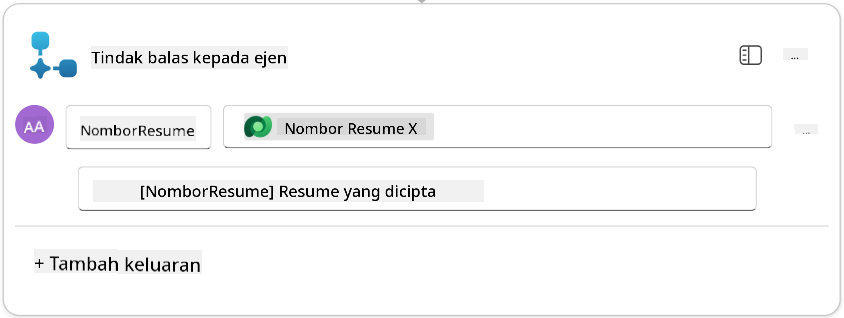

1. Pilih **Save draft** di bahagian atas kanan  
     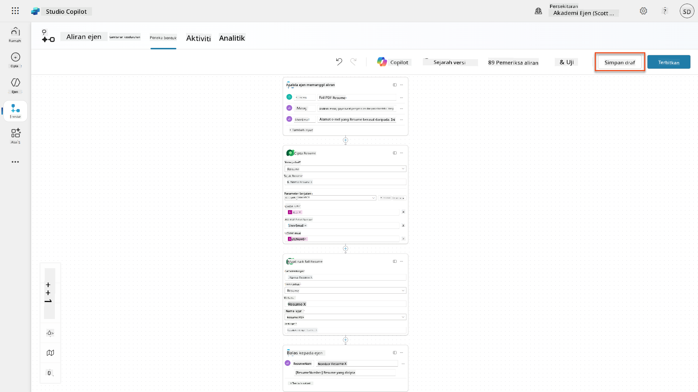

1. Pilih tab **Overview**, Pilih **Edit** pada panel **Details**

     1. **Flow name**:`Resume Upload`
     1. **Description**:`Uploads a Resume when instructed`

     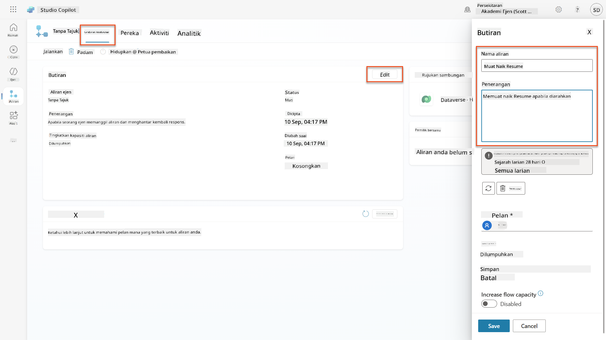

1. Pilih tab **Designer** sekali lagi, dan pilih **Publish**.  
     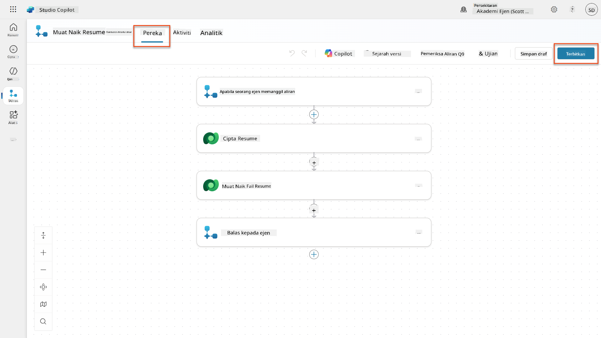

### 2.1.5 Sambungkan flow kepada ejen anda

Sekarang anda akan menyambungkan flow yang diterbitkan kepada Application Intake Agent anda.

1. Navigasi kembali ke **Hiring Agent** dan pilih tab **Agents**. Buka **Application Intake Agent**, dan kemudian cari panel **Tools**.  
    

1. Pilih **+ Add**

1. Pilih penapis **Flow**, dan cari `Resume Upload`. Pilih flow **Resume Upload**, dan kemudian **Add and configure**.

1. Tetapkan parameter berikut:

    | Parameter | Nilai |
    |-----------|-------|
    | **Description** | `Uploads a Resume when instructed. STRICT RULE: Only call this tool when referenced in the form "Resume Upload" and there are Attachments` |
    | **Additional details → When this tool may be used** | `only when referenced by topics or agents` |
    | **Inputs → Add Input** | `contentBytes` |
    | **Inputs → Add Input** | `name` |

    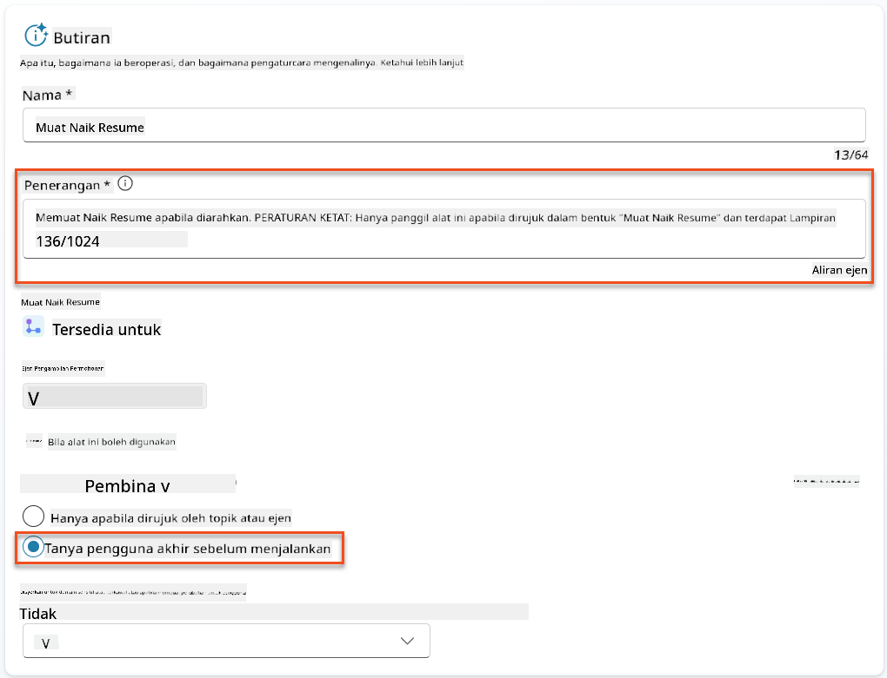

    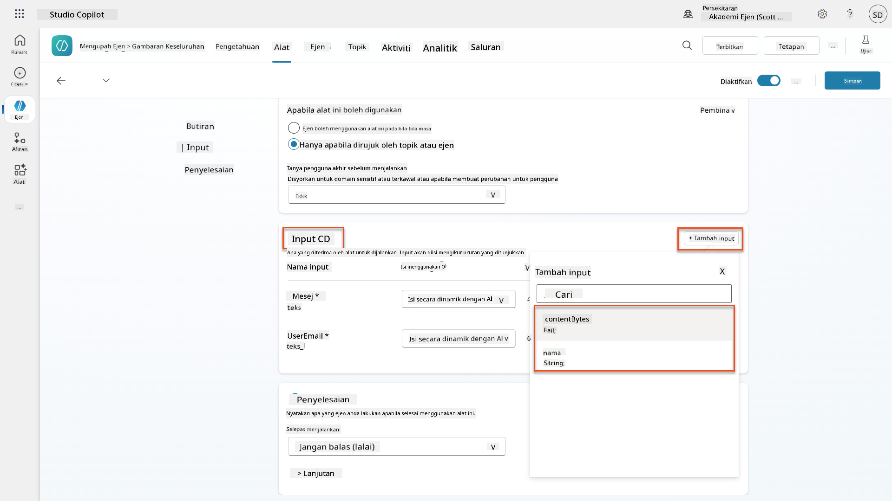

1. Seterusnya tetapkan properties input seperti berikut:

    | Parameter Input | Properti | Butiran |
    |-----------------|----------|---------|
    | **contentBytes** | Isi menggunakan | Nilai tersuai |
    |                  | Nilai (...→Formula→Insert) | `First(System.Activity.Attachments).Content` |
    | **name** | Isi menggunakan | Nilai tersuai |
    |          | Nilai (...→Formula→Insert) | `First(System.Activity.Attachments).Name` |
    | **Message** | Sesuaikan | Konfigurasi tetapan tersuai |
    |             | Penerangan | `Extract a cover letter style message from the context. Be sure to never prompt the user and create at least a minimal cover letter from the available context. STRICT RULE - the message must be less than 2000 characters.` |
    |             | Berapa kali ulang | Jangan ulang |
    |             | Tindakan jika tiada entiti dijumpai | Tetapkan pembolehubah kepada nilai |
    |             | Nilai entiti lalai | Resume upload |
    | **UserEmail** | Isi menggunakan | Nilai tersuai |
    |  | Nilai (...→Formula→Insert) | `System.User.Email` |

    

1. Pilih **Save**

### 2.1.6 Tetapkan arahan ejen

1. Kembali ke **Application Intake Agent** dengan memilih tab **Agents**, dan kemudian cari panel **Instructions**.

1. Dalam medan **Instructions**, tampal panduan jelas berikut untuk ejen anak anda:

    ```text
    You are tasked with managing incoming Resumes, Candidate information, and creating Job Applications.  
    Only use tools if the step exactly matches the defined process. Otherwise, indicate you cannot help.  
    
    Process for Resume Upload via Chat  
    1. Upload Resume  
      - Trigger only if /System.Activity.Attachments contains exactly one new resume.  
      - If more than one file, instruct the user to upload one at a time and stop.  
      - Call /Upload Resume once. Never upload more than once for the same message.  
    
    2. Post-Upload  
      - Always output the [ResumeNumber] (R#####).  
    ```

1. Di mana arahan termasuk garis miring (/), pilih teks selepas / dan pilih nama yang diselesaikan. Lakukan ini untuk:

    - `System.Activity.Attachments` (Pembolehubah)
    - `Upload Resume` (Alat)

    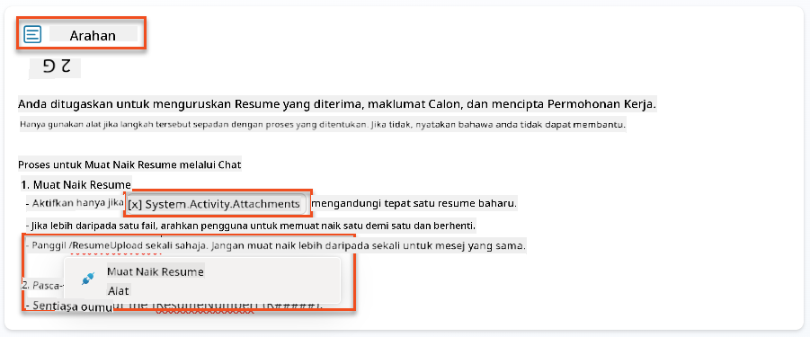

1. Pilih **Save**

### 2.1.7 Uji Application Intake Agent anda

Sekarang mari kita sahkan ahli orkestra pertama anda berfungsi dengan betul.

1. **Muat turun** [test Resumes.](https://download-directory.github.io/?url=https://github.com/microsoft/agent-academy/tree/main/operative/sample-data/resumes&filename=operative_sampledata)

1. **Toggle** panel ujian dengan memilih **Test**.

1. **Muat naik** dua Resume dalam chat ujian, dan beri mesej `Process these resumes`

    - Ejen sepatutnya memberikan mesej seperti *Hanya satu resume boleh dimuat naik pada satu masa. Sila muat naik satu resume untuk meneruskan.*

    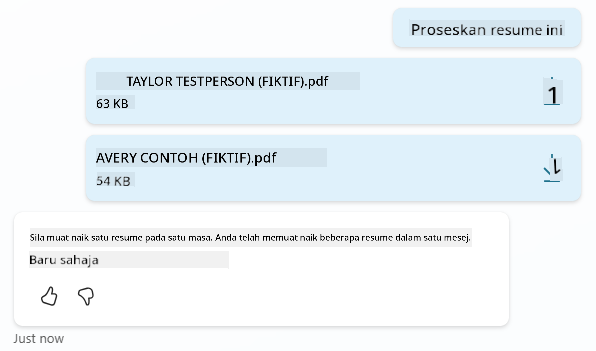

1. Cuba muat naik **hanya satu Resume**, dengan mesej `Process this resume`

    - Ejen sepatutnya memberikan mesej seperti *Resume untuk Avery Example telah berjaya dimuat naik. Nombor resume adalah R10026.*

1. Dalam **Activity map**, anda sepatutnya melihat **Application Intake Agent** mengendalikan muat naik resume.  
    

1. Navigasi ke make.powerapps.com → Pastikan persekitaran anda dipilih di penjuru kanan atas Environment Picker.

1. Pilih **Apps** → Hiring Hub → menu ellipsis(...) → **Play**  
    

    Nota: Jika butang play kelabu, ini bermakna anda belum menerbitkan penyelesaian anda dari Misi 01. Pilih **Solutions** → **Publish all customizations**.

1. Navigasi ke **Resumes**, dan periksa bahawa fail resume dimuat naik dan surat pengenalan ditetapkan dengan sewajarnya.  
    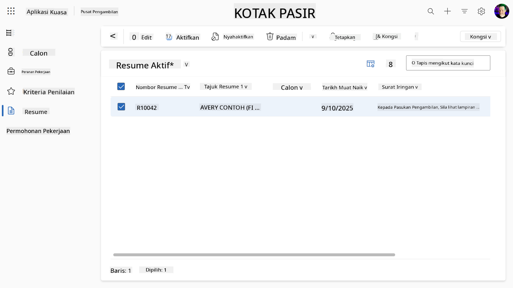

## 🧪Lab 2.2: Menambah ejen bersambung Interview Prep

Sekarang mari kita buat ejen bersambung untuk persediaan temu duga dan tambahkannya kepada Hiring Agent anda yang sedia ada.

### 2.2.1 Buat ejen bersambung Interview Agent

1. **Navigasi** ke Copilot Studio. Pastikan persekitaran anda masih dipilih di penjuru kanan atas Environment Picker.

1. Buka **Hiring Agent** anda

1. Navigasi ke tab Agent, dan pilih **+ Add an agent**

1. Pilih **Connect an existing agent** → **Copilot Studio**

1. Pilih **+ New agent**

### 2.2.2 Konfigurasi tetapan asas

1. Pilih tab **Configure**, dan masukkan properties berikut:

    - **Name**: `Interview Agent`
    - **Description**: `Membantu dengan proses temu duga.`

1. Arahan:

    ```text
    You are the Interview Agent. You help interviewers and hiring managers prepare for interviews. You never contact candidates. 
    Use Knowledge to help with interview preparation. 
    
    The only valid identifiers are:
      - ResumeNumber (ppa_resumenumber)→ format R#####
      - CandidateNumber (ppa_candidatenumber)→ format C#####
      - ApplicationNumber (ppa_applicationnumber)→ format A#####
      - JobRoleNumber (ppa_jobrolenumber)→ format J#####
    
    Examples you handle
      - Give me a summary of ...
      - Help me prepare to interview candidates for the Power Platform Developer role
      - Create interview assistance for the candidates for Power Platform Developer
      - Give targeted questions for Candidate Alex Johnson focusing on the criteria for the Job Application
      
    How to work:
        You are expected to ask clarification questions if required information for queries is not provided
        - If asked for interview help without providing a job role, ask for it
        - If asking for interview questions, ask for the candidate and job role if not provided.
    
    General behavior
    - Do not invent or guess facts
    - Be concise, professional, and evidence-based
    - Map strengths and risks to the highest-weight criteria
    - If data is missing (e.g., no resume), state what is missing and ask for clarification
    - Never address or message a candidate
    ```

1. Toggle **Web Search** kepada **Disabled**

1. Pilih **Create**  
    

### 2.2.3 Konfigurasi akses data dan terbitkan

1. Dalam bahagian **Knowledge**, pilih **+ Add knowledge**  
    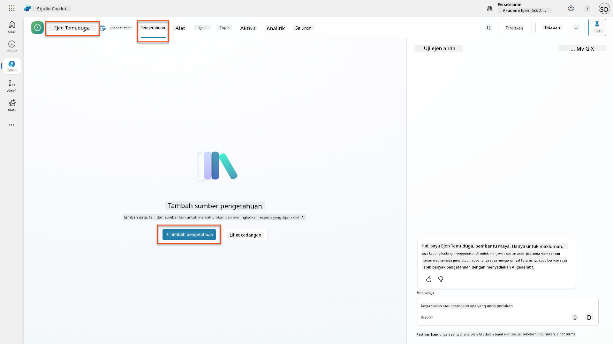
1. Pilih **Dataverse**  
    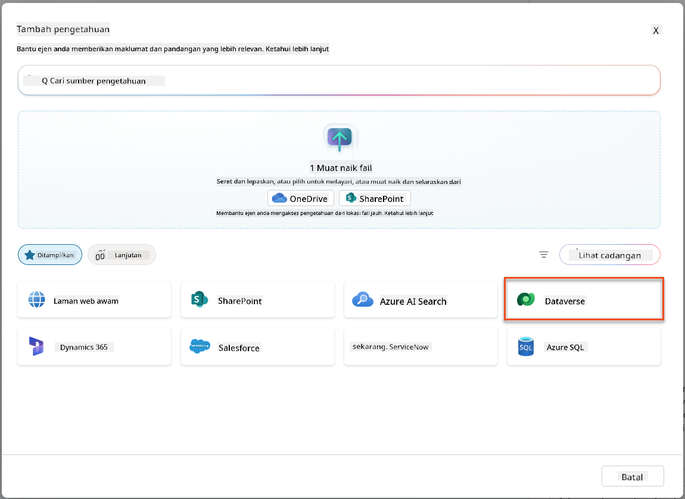
1. Dalam **Kotak carian**, taip `ppa_`. Ini adalah awalan untuk jadual yang anda import sebelum ini.
1. **Pilih** semua 5 jadual (Candidate, Evaluation Criteria, Job Application, Job Role, Resume)
1. Pilih **Add to agent**  
    
1. Pilih **Settings**, pada Interview Agent, dan tetapkan tetapan berikut:

    - **Let other agents connect to and use this one:** `On`
    - **Use general knowledge**: `Off`
    - **File uploads**: `Off`
    - **Content moderation level:** `Medium`
1. Pilih **Save**
1. Pilih **Publish**, dan tunggu sehingga penerbitan selesai.

### 2.2.4 Sambungkan Interview Prep Agent kepada Hiring Agent anda

1. Navigasi kembali ke **Hiring Agent** anda

1. Pilih tab **Agents**

1. Gunakan **+Add an agent** → **Copilot Studio**, untuk menambah **Interview Agent**. Tetapkan Penerangan kepada:
    ```text
    Assists with the interview process and provides information about Resumes, Candidates, Job Roles, and Evaluation Criteria.
    ```

    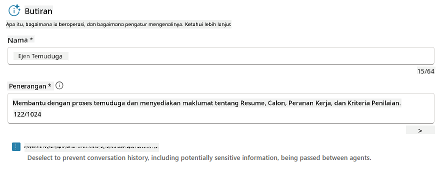
    Perhatikan bahawa pilihan Pass conversation history to this agent telah ditandakan. Ini membolehkan ejen induk memberikan konteks penuh kepada ejen bersambung.

1. Pilih **Add agent**

1. Pastikan anda melihat kedua-dua **Application Intake Agent** dan **Interview Agent**. Perhatikan bagaimana satu adalah ejen anak dan satu lagi adalah ejen bersambung.  
    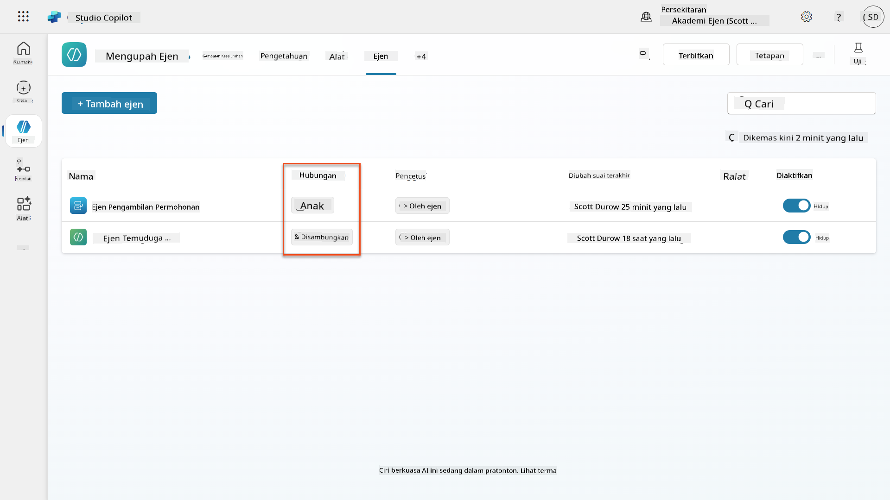

### 2.2.5 Uji kerjasama pelbagai ejen

1. **Togol** panel ujian dengan memilih **Test**.

1. **Muat naik** salah satu resume ujian, dan masukkan deskripsi berikut yang memberitahu ejen induk apa yang boleh didelegasikan kepada ejen bersambung:

    ```text
    Upload this resume, then show me open job roles, each with a description of the evaluation criteria, then use this to match the resume to at least one suitable job role even if not a perfect match.
    ```

    

1. Perhatikan bagaimana Hiring Agent mendelegasikan muat naik kepada ejen anak, dan kemudian meminta Interview Agent untuk memberikan ringkasan dan padanan peranan kerja menggunakan pengetahuannya.
   Cuba pelbagai cara untuk bertanya soalan tentang Resume, Peranan Kerja dan Kriteria Penilaian.
   **Contoh:**

    ```text
    Give me a summary of active resumes
    ```

    ```text
    Summarize resume R10044
    ```

    ```text
    Which active resumes are suitable for the Power Platform Developer role?
    ```

## 🎉 Misi Selesai

Kerja yang cemerlang, Ejen! **Operasi Symphony** kini selesai. Anda telah berjaya mengubah Hiring Agent tunggal anda menjadi orkestra pelbagai ejen yang canggih dengan keupayaan khusus.

Inilah pencapaian anda dalam misi ini:

**✅ Penguasaan seni bina pelbagai ejen**  
Anda kini memahami bila untuk menggunakan ejen anak berbanding ejen bersambung dan cara mereka bentuk sistem yang boleh berkembang.

**✅ Ejen anak Application Intake**  
Anda telah menambah ejen anak khusus kepada Hiring Agent anda yang memproses resume, mengekstrak data calon, dan menyimpan maklumat dalam Dataverse.

**✅ Ejen bersambung Interview Prep**  
Anda telah membina ejen bersambung yang boleh digunakan semula untuk persediaan temu duga dan berjaya menghubungkannya kepada Hiring Agent anda.

**✅ Komunikasi ejen**  
Anda telah melihat bagaimana ejen utama anda boleh berkoordinasi dengan ejen pakar, berkongsi konteks, dan mengatur aliran kerja yang kompleks.

**✅ Asas untuk autonomi**  
Sistem pengambilan pekerja yang dipertingkatkan anda kini bersedia untuk ciri-ciri lanjutan yang akan kita tambahkan dalam misi akan datang: pencetus autonomi, moderasi kandungan, dan penalaran mendalam.

🚀**Seterusnya:** Dalam misi seterusnya, anda akan belajar bagaimana untuk mengkonfigurasi ejen anda untuk memproses resume secara automatik daripada e-mel!

⏩[Bergerak ke Misi 03: Automasi ejen anda dengan pencetus](../03-automate-triggers/README.md)

## 📚 Sumber Taktikal

📖 [Tambah ejen lain (pratonton)](https://learn.microsoft.com/microsoft-copilot-studio/authoring-add-other-agents?WT.mc_id=power-182762-scottdurow)

📖 [Tambah alat kepada ejen tersuai](https://learn.microsoft.com/microsoft-copilot-studio/advanced-plugin-actions?WT.mc_id=power-182762-scottdurow)

📖 [Bekerja dengan Dataverse dalam Copilot Studio](https://learn.microsoft.com/microsoft-copilot-studio/knowledge-add-dataverse?WT.mc_id=power-182762-scottdurow)

📖 [Gambaran keseluruhan aliran ejen](https://learn.microsoft.com/microsoft-copilot-studio/flows-overview?WT.mc_id=power-182762-scottdurow)

📖 [Cipta penyelesaian](https://learn.microsoft.com/power-platform/alm/solution-concepts-alm?WT.mc_id=power-182762-scottdurow)

📖 [Panduan ALM penyelesaian Power Platform](https://learn.microsoft.com/power-platform/alm/overview-alm?WT.mc_id=power-182762-scottdurow)

📺 [Kerjasama ejen-ke-ejen dalam Copilot Studio](https://youtu.be/d-oD3pApHAg?si=rwIHKhJTkjSvhTHw)

---

**Penafian**:  
Dokumen ini telah diterjemahkan menggunakan perkhidmatan terjemahan AI [Co-op Translator](https://github.com/Azure/co-op-translator). Walaupun kami berusaha untuk ketepatan, sila ambil perhatian bahawa terjemahan automatik mungkin mengandungi kesilapan atau ketidaktepatan. Dokumen asal dalam bahasa asalnya harus dianggap sebagai sumber yang berwibawa. Untuk maklumat penting, terjemahan manusia profesional adalah disyorkan. Kami tidak bertanggungjawab atas sebarang salah faham atau salah tafsir yang timbul daripada penggunaan terjemahan ini.