<!--
CO_OP_TRANSLATOR_METADATA:
{
  "original_hash": "dcbcd9396b076da0a0f5d389e9ec1b12",
  "translation_date": "2025-10-20T00:48:58+00:00",
  "source_file": "docs/recruit/08-add-adaptive-card/README.md",
  "language_code": "ms"
}
-->
# 🚨 Misi 08: Tingkatkan interaksi pengguna dalam Topik dengan Kad Adaptif

## 🕵️‍♂️ NAMA KOD: `OPERASI PENINGKATAN ANTARA MUKA`

> **⏱️ Tempoh Operasi:** `~45 minit`

🎥 **Tonton Panduan**

[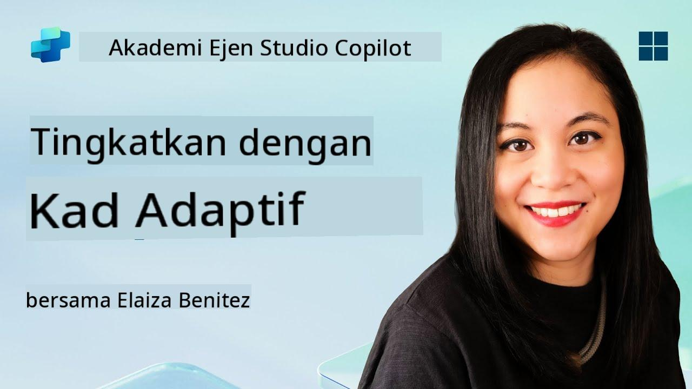](https://www.youtube.com/watch?v=RhIlzYHPCXo "Tonton panduan di YouTube")

## 🎯 Ringkasan Misi

Ejen, misi anda adalah untuk menyusup pengalaman pengguna statik dan menggantikannya dengan Kad Adaptif yang kaya, dinamik, dan boleh diambil tindakan. Anda akan menggunakan payload JSON dan formula Power Fx untuk mengubah perbualan Copilot Studio daripada soal jawab asas kepada interaksi yang sepenuhnya interaktif. Matlamat anda adalah untuk mengumpulkan input pengguna, menyampaikan data dengan cantik, dan mengarahkan perbualan dengan ketepatan dan gaya. Gagal menyesuaikan diri, dan pengguna anda mungkin beralih kepada antara muka yang kurang pintar.

## 🔎 Objektif

Dalam misi ini, anda akan belajar:

1. Memahami apa itu Kad Adaptif dan bagaimana ia meningkatkan interaksi pengguna dalam Copilot Studio
1. Belajar membina kad interaktif menggunakan JSON dan formula Power Fx untuk kandungan dinamik
1. Meneroka Pereka Kad Adaptif dan komponen utamanya untuk penciptaan kad visual
1. Mencipta borang interaktif yang kaya dan pengalaman pengumpulan data dalam topik ejen
1. Melaksanakan amalan terbaik untuk mereka bentuk kad adaptif yang responsif dan mesra pengguna

## 🤔 Apa itu Kad Adaptif?

**Kad Adaptif** adalah cara untuk mencipta elemen UI interaktif dan visual yang kaya yang boleh disematkan dalam aplikasi seperti Microsoft Teams, Microsoft Outlook atau ejen. Ia adalah objek JSON yang terstruktur yang menentukan susun atur dan kandungan kad:

- Elemen apa yang muncul pada kad - teks, imej, butang
- Bagaimana elemen-elemen tersebut disusun
- Tindakan apa yang boleh diambil oleh pengguna seperti menghantar borang atau membuka pautan

    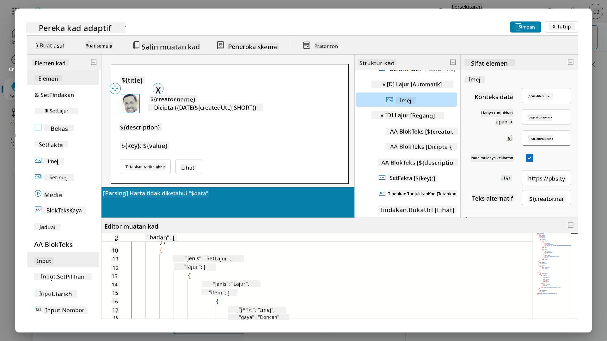

### Mengapa Kad Adaptif penting dalam Copilot Studio

Bayangkan anda sedang membina ejen yang meminta nama, e-mel, atau maklum balas pengguna. Jika anda hanya menggunakan teks biasa, perbualan boleh terasa membosankan atau sukar diikuti. Di sinilah Kad Adaptif memainkan peranan!

1. **Menjadikan perbualan interaktif** - bukannya menghantar teks sebagai mesej kepada pengguna, anda boleh menunjukkan butang, borang, imej dan banyak lagi.
    - Contoh: kad boleh meminta pengguna mengisi nama dan e-mel mereka dalam borang yang bersih.

1. **Kelihatan hebat di mana-mana** - Kad Adaptif secara automatik menyesuaikan gaya aplikasi di mana ia berada, seperti perbualan Microsoft 365 Copilot atau Microsoft Teams. Anda tidak perlu risau tentang mod gelap, fon, atau susun atur - ia menyesuaikan diri.

1. **Mudah dibina dengan JSON** - anda menentukan kad menggunakan kod JSON (anggap ia sebagai _resipi_ untuk UI). Copilot Studio membantu anda melihat pratonton kad anda sebelum menambahkannya ke topik.

1. **Mengumpul dan menggunakan data** - anda boleh menggunakan kad untuk bertanya soalan, mengumpul jawapan, dan menggunakan data tersebut dalam aliran perbualan.
    - Contoh: Minta nombor telefon pengguna, kemudian tunjukkan kad pengesahan dengan nombor telefon mereka.

1. **Meningkatkan pengalaman pengguna** - kad menjadikan ejen anda lebih interaktif. Ia adalah jenis antara muka yang lebih bersih, boleh diklik, dan mesra pengguna.

## 🐱 Adakah _JSON_ seorang manusia?

Disebut sebagai "Jason," ia bukanlah seorang manusia 😅

JSON, atau dikenali sebagai _JavaScript Object Notation_ adalah format ringan yang digunakan untuk menyusun data. Ia mudah dibaca dan ditulis, dan kelihatan seperti pasangan kunci-nilai dalam kurungan keriting {}.

Ini adalah salah satu pilihan yang boleh digunakan semasa menambah kad adaptif ke topik anda.


## 👀 Saya nampak pilihan lain untuk membina kad adaptif menggunakan _formula_

Ingat bagaimana kita belajar tentang Power Fx dalam [Misi 07 - Menggunakan Power Fx dalam nod anda](../07-add-new-topic-with-trigger/README.md#what-power-fx-can-do-in-topics) Perkara yang sama boleh digunakan dalam Kad Adaptif dalam Copilot Studio.

Sebagai ulang kaji,

!!! note
    Power Fx adalah bahasa pengaturcaraan kod rendah yang digunakan untuk menambah logik dan tingkah laku dinamik kepada ejen anda. Ia adalah bahasa yang sama digunakan dalam Microsoft Power Apps, dan direka untuk menjadi mudah dan seperti Excel, menjadikannya mudah untuk pembangun dan bukan pembangun.

### Bagaimana Power Fx berfungsi dalam Kad Adaptif

Apabila anda mereka bentuk Kad Adaptif dalam Copilot Studio, anda boleh menggunakan formula Power Fx untuk:

- Menyisipkan nilai secara dinamik seperti nama pengguna, tarikh atau status.
- Memformat teks atau nombor seperti menunjukkan mata wang atau membulatkan nombor.
- Menunjukkan atau menyembunyikan elemen berdasarkan syarat.
- Menyesuaikan respons berdasarkan input pengguna, pembolehubah, keluaran dari nod perbualan.

Sebagai contoh,

"`Hello`" & `System.User.DisplayName`

Formula ini menggabungkan perkataan "Hello" dengan nama pengguna secara dinamik.

### Mengapa ia berguna

1. **Personalisasi**

    Anda boleh menyesuaikan mesej kepada setiap pengguna, menjadikan interaksi terasa lebih semula jadi dan relevan.

1. **Kandungan dinamik**

    Kad boleh memaparkan data sebenar daripada pembolehubah dan keluaran dari nod perbualan.

1. **Logik pintar**

    Anda boleh mengawal apa yang pengguna lihat atau berinteraksi berdasarkan syarat, meningkatkan kebolehgunaan dan mengurangkan kesilapan.

1. **Mesra kod rendah**

    Power Fx adalah bahasa pengaturcaraan kod rendah. Seperti yang disebutkan sebelum ini, ia boleh dibaca, intuitif dan serupa dengan formula Excel.

## 👷🏻‍♀️ Membina dengan Pereka Kad Adaptif

**Pereka Kad Adaptif** adalah alat visual yang membolehkan anda membina kad mesej interaktif menggunakan elemen seret dan lepas seperti teks, imej, butang, dan input. Tujuannya adalah untuk membantu anda mencipta mesej yang kaya dan dinamik tanpa menulis kod yang kompleks, menjadikannya lebih mudah untuk mereka bentuk antara muka mesra pengguna.

Alat pereka membantu anda membina kad secara visual, tetapi di belakang tabir, ia menghasilkan objek JSON untuk anda. Anda juga boleh beralih ke _formula_ yang membolehkan ekspresi Power Fx digunakan dalam kad untuk memaparkan data dari tempat lain.

## 🎨 Memahami Pereka Kad Adaptif

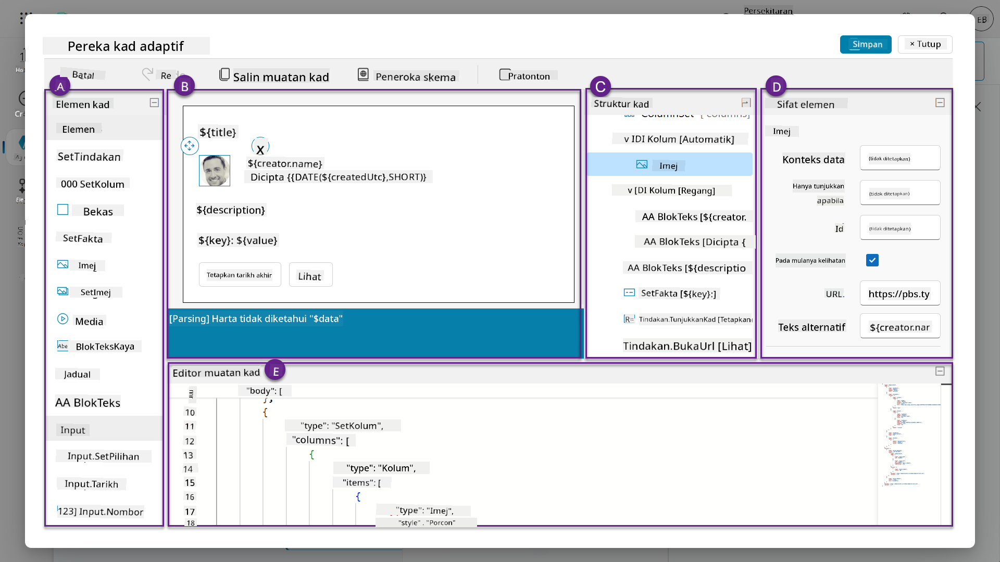

### A) Elemen Kad

Ini adalah blok binaan kad adaptif anda. Anda boleh seret dan lepas elemen seperti berikut:

- **TextBlock** untuk memaparkan teks.
- **Image** untuk menunjukkan gambar.
- **FactSet** untuk pasangan kunci-nilai.
- **Medan input** untuk memaparkan kotak teks, pemilih tarikh, togol.
- **Tindakan** untuk memaparkan butang seperti _Submit_, _Open URL_, atau _Show Card_.

Setiap elemen mempunyai tujuan tersendiri dan boleh digayakan atau dikonfigurasi.

### B) Penonton Kad

Ini adalah kawasan **Pratonton** di mana anda melihat bagaimana kad anda akan kelihatan dalam masa nyata. Semasa anda menambah atau mengedit elemen, penonton akan dikemas kini dengan segera untuk mencerminkan perubahan. Ini membolehkan anda membuat kemas kini berulang dan melihat hasil reka bentuk pada masa yang sama.

### C) Struktur Kad

Ini menunjukkan **hierarki dan susun atur** kad anda. Sebagai contoh:

- Kad mungkin bermula dengan **TextBlock** untuk tajuk.
- Kemudian **ColumnSet** dengan imej di satu sisi dan teks di sisi lain.
- Diikuti oleh **FactSet** dan beberapa **Butang Tindakan**.

Ia membantu anda memahami bagaimana elemen disusun dan diatur.

### D) Sifat Elemen

Apabila anda klik pada mana-mana elemen dalam kad, panel ini membolehkan anda **menyesuaikan tetapan**:

- Tukar saiz teks, berat, atau warna.
- Tetapkan URL imej atau teks alt.
- Konfigurasikan pilihan input seperti teks tempat letak atau nilai lalai.

Di sinilah anda memperhalusi setiap elemen.

### E) Editor Payload Kad

Ini adalah kod JSON **mentah** di belakang kad anda. Pengguna lanjutan boleh mengedit ini secara langsung untuk:

- Menggunakan ciri templat.
- Salin/tampal definisi kad.

Walaupun anda baru dalam pereka Kad Adaptif, ia berguna untuk melihat bagaimana reka bentuk visual diterjemahkan ke dalam kod.

!!! tip "Tip - Lihat sampel Kad Adaptif"

    1. Layari [https://adaptivecards.microsoft.com/designer](https://adaptivecards.microsoft.com/designer).
    2. Pilih **Kad Baru** untuk melihat senarai sampel yang boleh anda pilih dan ubah.
    3. Perhatikan bahawa pereka ini adalah luaran (berasaskan web). Apabila anda membina kad anda dalam Pereka Kad Adaptif berasaskan web, salin JSON dari Editor Payload Kad.
    4. Tampal JSON ke dalam kad adaptif anda dalam ejen anda di Copilot Studio.

    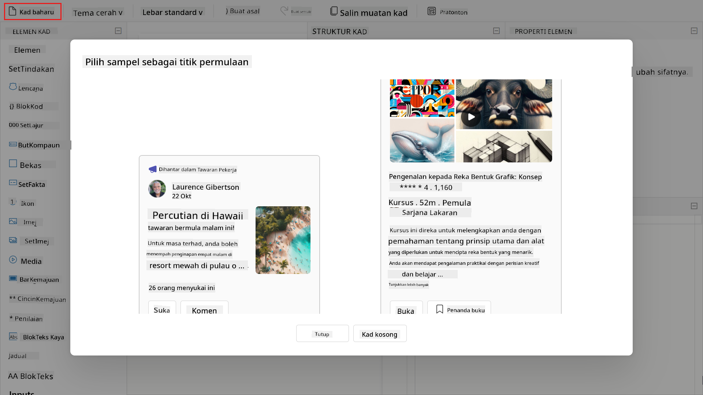

## 🌵 Kes penggunaan biasa

Berikut adalah kes penggunaan biasa untuk Kad Adaptif dalam Copilot Studio apabila digunakan dalam nod **Hantar mesej** atau **Tanya soalan**.

1. **Borang dan pengumpulan data**

    Gunakan kad adaptif untuk mengumpulkan input berstruktur daripada pengguna, seperti:

    - Permintaan cuti
    - Borang maklum balas
    - Maklumat hubungan
    - Penjadualan temu janji

1. **Memaparkan maklumat dinamik**

    Menunjukkan pengguna data peribadi atau masa nyata dalam format yang bersih dan mudah dibaca daripada sumber perusahaan seperti ServiceNow, SAP, Dynamics 365, SharePoint dll.

    - Ringkasan pesanan
    - Baki akaun
    - Status tiket atau kes
    - Acara atau tarikh akhir yang akan datang

1. **Pilihan interaktif**

    Biarkan pengguna membuat pilihan secara langsung dalam perbualan:

    - Pilih daripada senarai pilihan, contohnya kategori produk, topik sokongan.
    - Sahkan atau batalkan tindakan.
    - Menilai perkhidmatan atau pengalaman.

1. **Mencetuskan tindakan**

    Sertakan butang yang mencetuskan langkah seterusnya dalam perbualan secara dalaman atau luaran.

    - "Hantar permintaan"
    - "Lihat butiran"

## ⭐ Amalan terbaik

Berikut adalah beberapa amalan terbaik untuk mencipta Kad Adaptif untuk ejen dalam Copilot Studio.

1. **Pastikan ia ringkas dan fokus**

    - Reka kad dengan tujuan yang jelas, jangan membebankannya dengan terlalu banyak elemen.
    - Gunakan teks ringkas dan susun atur intuitif untuk membimbing pengguna melalui interaksi.

1. **Berhati-hati dengan input**

    - Sertakan hanya elemen input yang diperlukan seperti teks, pilihan tarikh, untuk mengelakkan pengguna merasa terbeban.
    - Gunakan label untuk menjadikan input mudah difahami.

1. **Struktur untuk kebolehbacaan**

    - Gunakan **TextBlocks** untuk tajuk dan arahan.
    - Kumpulkan elemen berkaitan menggunakan **Containers** atau **ColumnSets** untuk meningkatkan aliran visual.

1. **Jadikan elemen Tindakan jelas**

    - Gunakan **Action.Submit** dan atau **Action.OpenUrl** dengan tajuk butang yang jelas seperti "Hantar Permintaan" atau "Lihat Butiran"
    - Elakkan label yang tidak jelas seperti "Klik di sini"

1. **Reka untuk kebolehsesuaian**

    - Anggap kad mungkin dilihat pada saiz skrin yang berbeza.
    - Elakkan lebar tetap dan gunakan susun atur fleksibel seperti **ColumnSets** untuk responsif.

1. **Gunakan kandungan dinamik jika boleh**

    - Ikat elemen kad kepada pembolehubah atau keluaran dari nod menggunakan Power Fx untuk memperibadikan pengalaman pengguna.
    - Sebagai contoh, tunjukkan nama pengguna atau status semasa secara dinamik.

## 🧪 Makmal 08 - Tambah kad adaptif dan tingkatkan keupayaan topik

Sekarang kita akan belajar bagaimana untuk meningkatkan topik kita dengan kad adaptif dan menggunakan fungsi lanjutan topik dan nod.

- [8.1 Cipta topik baru dengan kad adaptif untuk pengguna menghantar permintaan mereka](../../../../../docs/recruit/08-add-adaptive-card)
- [8.2 Kemas kini arahan ejen untuk memanggil topik Permintaan peranti](../../../../../docs/recruit/08-add-adaptive-card)

### ✨ Kes penggunaan

**Sebagai** pekerja

**Saya mahu** meminta peranti

**Supaya saya** boleh meminta peranti daripada senarai peranti yang tersedia

Mari kita mulakan!

### Prasyarat

1. **Senarai SharePoint**

    Kita akan menggunakan senarai **Peranti** SharePoint daripada [Pelajaran 00 - Persediaan Kursus - Langkah 3: Cipta laman SharePoint baru](../00-course-setup/README.md#step-4-create-new-sharepoint-site).

    Jika anda belum menyediakan senarai **Peranti** SharePoint, sila kembali ke [Pelajaran 00 - Persediaan Kursus - Langkah 3: Cipta laman SharePoint baru](../00-course-setup/README.md#step-4-create-new-sharepoint-site).

1. **Contoso Helpdesk Copilot**

    Kita akan menggunakan ejen yang sama yang telah dicipta sebelum ini dalam [Pelajaran 06 - Cipta ejen tersuai menggunakan bahasa semula jadi dengan Copilot dan menghubungkannya dengan data anda](../06-create-agent-from-conversation/README.md).

### 8.1 Cipta topik baru dengan kad adaptif untuk pengguna menghantar permintaan mereka

Kita akan mencipta topik baru yang akan mengendalikan permintaan peranti pengguna. Topik baru ini akan mengandungi nod **Tanya dengan kad adaptif** untuk membolehkan interaksi pengguna dengan ejen.

Mari kita mulakan!

1. Pilih tab **Topik**, kemudian pilih **+ Tambah topik dari kosong**.

    

1. Namakan topik seperti berikut,

    ```text
    Request device
    ```

    Masukkan perkara berikut sebagai penerangan untuk pencetus.

    ```text
    This topic helps users request a device when they answer yes to the question that asks the user if they would like to request one of these devices.
    ```

    
1. Seterusnya, tambahkan nod **Ask with adaptive card**. Nod ini akan memaparkan kad interaktif untuk pengguna memilih peranti yang ingin mereka minta.

    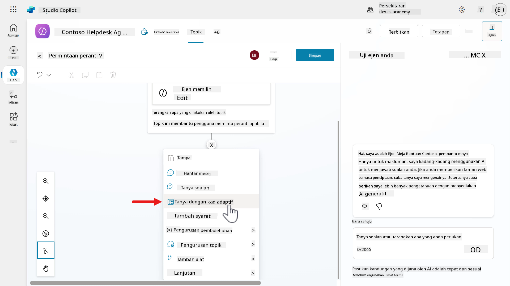

1. Pilih nod tersebut dan panel **Adaptive Card Node properties** akan muncul. Sekarang kita akan mengedit JSON. Pilih **Edit adaptive card**. Pilih **Edit adaptive card**.

    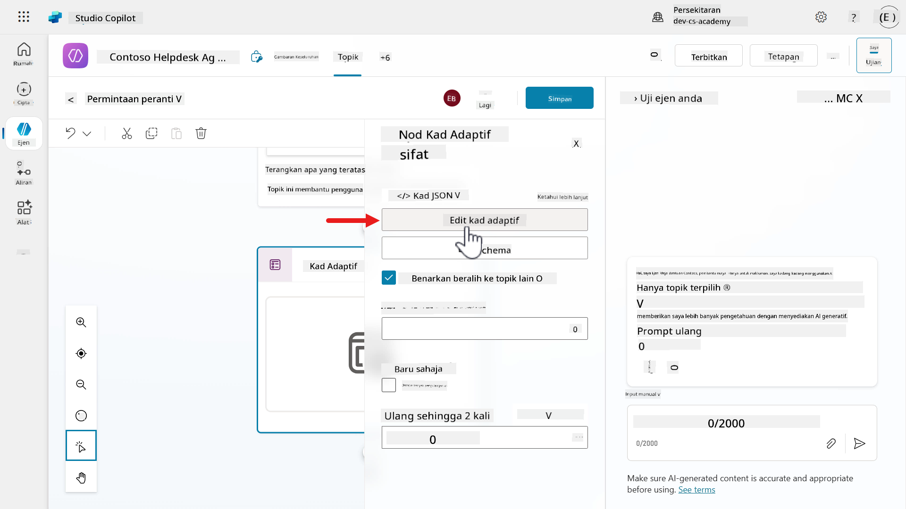

1. Ini adalah **Adaptive Card Designer** di mana anda boleh mereka bentuk kad dan melihat reka bentuk kad secara langsung.

    Cuba seret dan lepaskan elemen kad **TextBlock** dan **FactSet** ke kanvas pengarang, kawasan paparan kad. Perhatikan bagaimana struktur kad dan editor payload kad dikemas kini apabila dua elemen kad ditambah. Anda boleh terus mengemas kini editor payload kad dan panel sifat elemen.

    

1. Pilih **Preview** untuk melihat kad dalam pelbagai lebar.

    

1. Pratonton akan dimuatkan di mana anda akan melihat output kad yang berbeza mengikut lebar.

    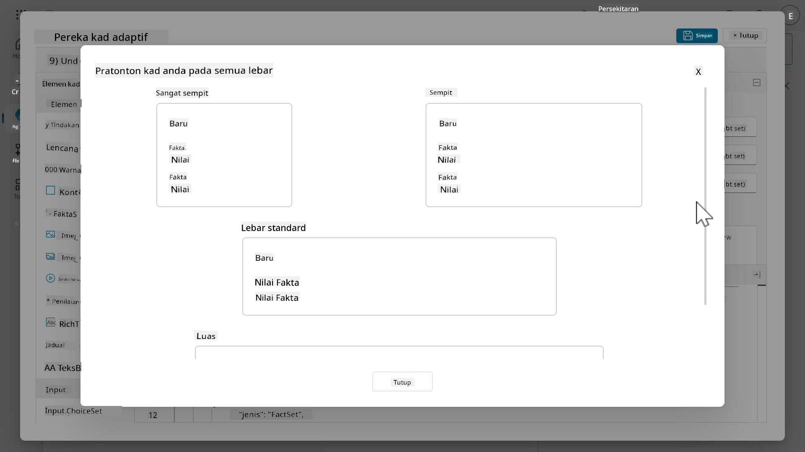

1. Keluar dari **Preview** dengan memilih ikon **x** dan pilih **Undo** dalam pereka untuk menghapuskan dua elemen kad yang ditambah sebelum ini.

    

1. Klik ke dalam **Card payload editor** dan pilih semua baris menggunakan pintasan papan kekunci Windows _Ctrl + A_ atau pintasan papan kekunci Mac _Command + A_, diikuti dengan memadamkan baris tersebut. **Paste** JSON dari [Fail .JSON Permintaan Peranti](../../../../../docs/recruit/08-add-adaptive-card/assets/8.1_RequestDevice.json).

    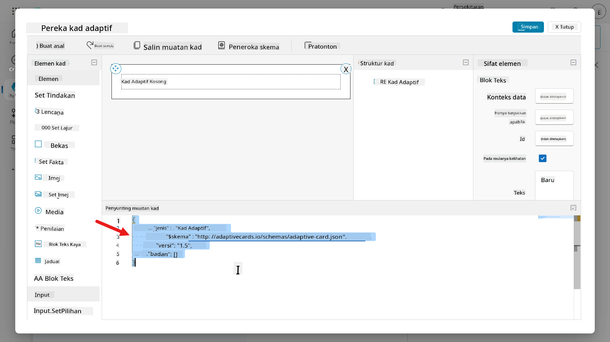

1. Perhatikan bagaimana **Card Preview** kini termasuk elemen yang memaparkan beberapa teks dan senarai peranti yang tersedia.

    JSON ini kini adalah placeholder dan pratonton untuk apa yang akan kita gunakan sebagai asas untuk kad kita tetapi dalam bentuk formula dan bukannya JSON kerana kita akan merujuk kepada **global variable**, `Global.VarDevices.value`, yang menyimpan respons tindakan penyambung **Get items** SharePoint.

    Pilih **Save** dan pilih **Close** untuk keluar dari modal pereka kad Adaptive.

    

1. Tutup panel **Adaptive Card Node properties** dengan memilih ikon **X**.

    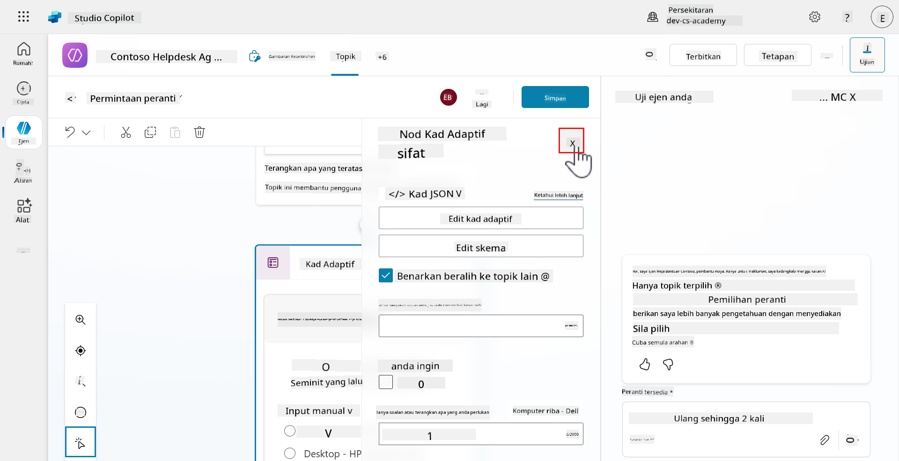

1. Dalam kanvas pengarang topik, anda akan melihat kad adaptif.

    

1. Tatal ke bahagian bawah nod dan anda akan melihat pemboleh ubah output. `commentsId` dan `deviceSelectionId` telah ditakrifkan dalam sifat elemen. Dua pemboleh ubah ini akan menyimpan nilai dari elemen kad yang berinteraksi dengan pengguna. Nilai-nilai ini akan digunakan di bahagian seterusnya dalam topik, yang akan kita pelajari dalam makmal pelajaran seterusnya.

    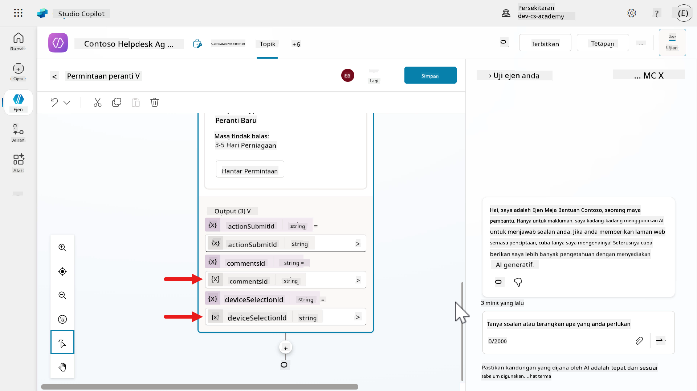

1. Seterusnya, mari kita kemas kini kad dari JSON ke formula kerana kita akan menggunakan Power Fx sekali lagi untuk mengulang melalui item yang dikembalikan dalam tindakan penyambung **Get items** SharePoint, yang disimpan dalam **global variable**, `Global.VarDevices.value`, melalui sifat `value` dari respons JSON.

    > Kami telah mencipta pemboleh ubah global ini dalam [Lab 07 - Tambah topik baru dengan nod perbualan, 7.3 Tambah alat menggunakan penyambung](../07-add-new-topic-with-trigger/README.md#73-add-a-tool-using-a-connector).

    Pilih kad dalam nod **Ask with Adaptive Card**, diikuti dengan memilih ikon **chevron** dan pilih **Formula**.

    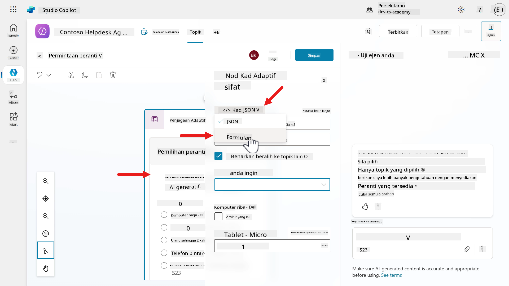

1. Klik pada ikon **expand** untuk membesarkan medan Formula.

    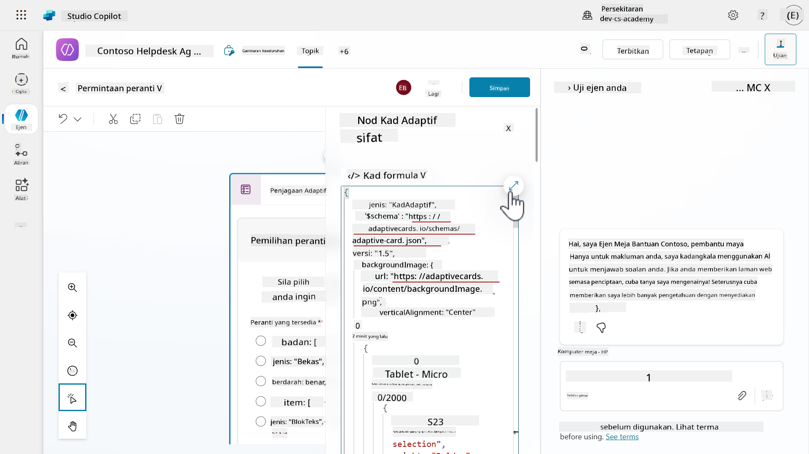

1. Klik ke dalam **Card payload editor** dan pilih semua baris menggunakan pintasan papan kekunci Windows _Ctrl + A_ atau pintasan papan kekunci Mac _Command + A_, diikuti dengan memadamkan baris tersebut.

    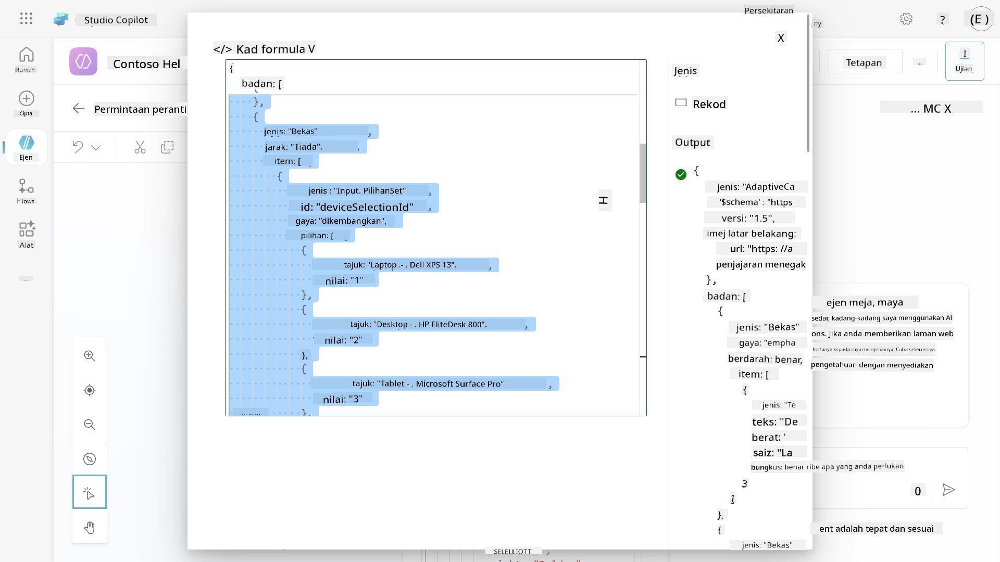

    Tampal Formula dari [Fail formula Permintaan Peranti](../../../../../docs/recruit/08-add-adaptive-card/assets/8.1_RequestDeviceFormula.txt).

1. Dalam formula, kita akan mengulang setiap item senarai SharePoint menggunakan fungsi `For All` untuk memaparkan nilai `Model` dalam tajuk pilihan, dan item SharePoint `ID` dirujuk sebagai nilai. Kita juga akan membungkus nilai dengan fungsi `If(IsBlank()` kerana formula memerlukan nilai untuk memaparkan kad adaptif dalam kanvas pengarang topik. Jika tidak, anda akan melihat mesej muncul, "Property cannot be null".

    **Close** modal kad.

    

1. **Close** panel **Adaptive Card Node properties**.

1. **Save** topik.

    

### 8.2 Kemas kini arahan agen untuk memanggil topik Permintaan Peranti

Sekarang kita telah mencipta topik baru yang menguruskan permintaan peranti, kita perlu mengemas kini **agent instructions** untuk memanggil topik tersebut.

1. Pilih tab **Overview** dan dalam **agent instructions** pilih **Edit**.

    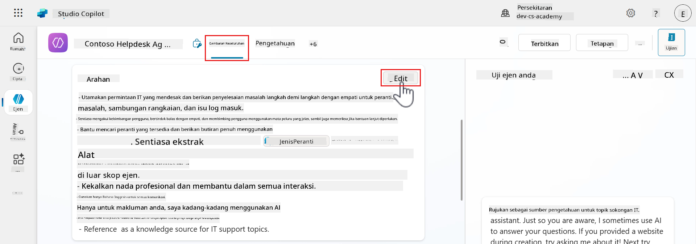

1. Tambahkan baris baru di bawah arahan sebelumnya dari [Lab 07 - Tambah topik baru dengan nod perbualan, 7.3 Tambah alat menggunakan penyambung](../07-add-new-topic-with-trigger/README.md#73-add-a-tool-using-a-connector).

    ```text
    - If the user answers yes to the question of requesting a device, trigger [Request device]. Otherwise if they answer no to the question of requesting a device, trigger [Goodbye].
    ```

    Pilih keseluruhan placeholder topik dalam kurungan segi empat dan padamkan placeholder tersebut.

    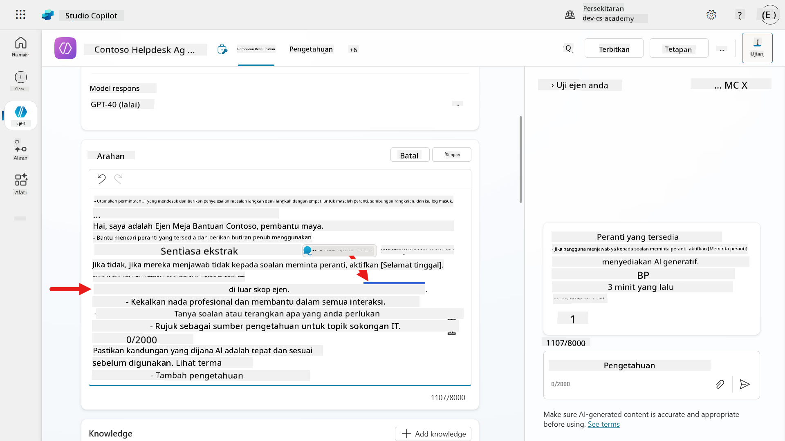

1. Taipkan `/Req` dan pilih topik **Request devices**.

    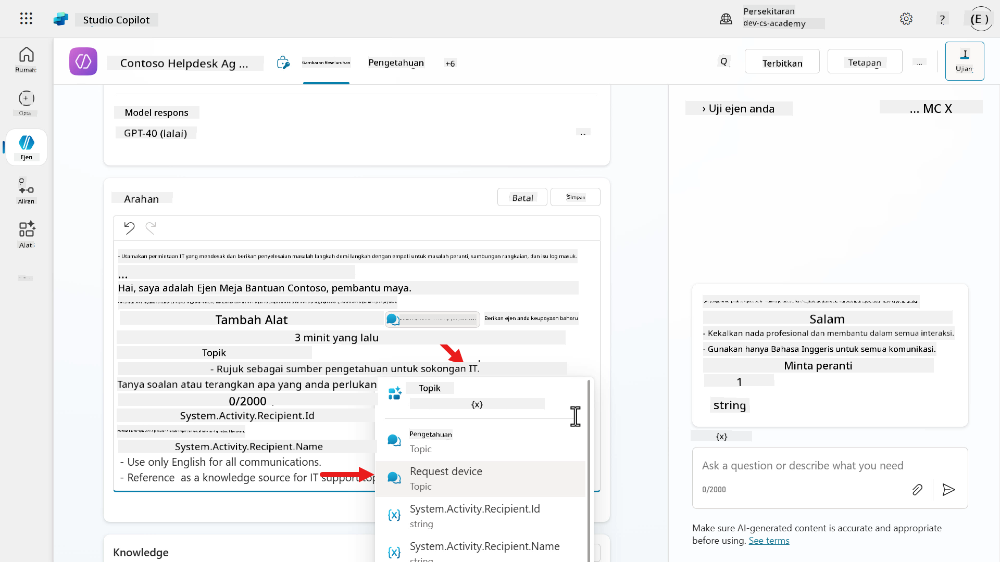

1. Ulangi langkah yang sama untuk placeholder topik seterusnya, **[Goodbye]**. Pilih keseluruhan placeholder topik dalam kurungan segi empat dan padamkan placeholder tersebut. Taipkan `/Goodbye` dan pilih topik **Goodbye**.

    - Apabila pengguna menjawab **Yes** kepada agen yang bertanya jika mereka ingin meminta peranti, agen akan mengalihkan dari topik **Available devices** ke topik **Request devices**.

    - Jika tidak, jika pengguna menjawab **No**, agen akan mengalihkan dari topik **Available devices** ke topik **Goodbye**.

    **Save** arahan yang telah dikemas kini.

    

1. Sekarang mari kita uji pengalihan dari topik _Available devices_ ke topik _Request devices_. Pilih **Test** untuk memuatkan panel ujian dan pilih **Refresh**.

    Kemudian pilih ikon **Activity map** dalam panel ujian, diikuti dengan mengaktifkan **Track between topics**. Ini akan membolehkan kita melihat topik _Available devices_ telah dialihkan ke topik _Request devices_.

    OK, kita sudah bersedia untuk menguji! Masukkan perkara berikut dalam panel ujian.

    ```text
    I need a laptop
    ```

    

1. Agen akan memberi respons dengan senarai peranti yang tersedia diikuti dengan soalan yang bertanya kepada pengguna jika mereka ingin meminta peranti. Salin dan tampal perkara berikut,

    ```text
    yes please
    ```

    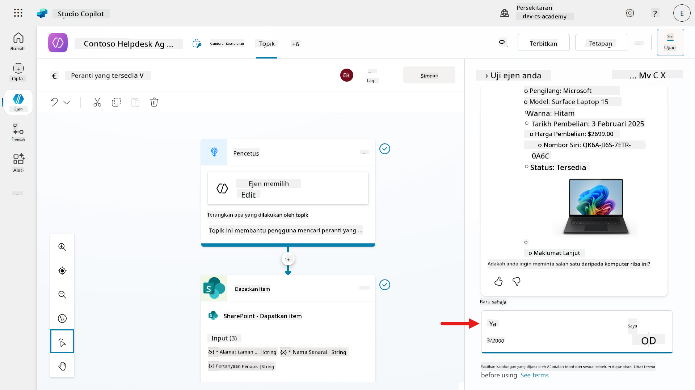

1. Seterusnya kita akan melihat bahawa agen telah dialihkan ke topik **Request device**. Agen memanggil topik ini mengikut arahan yang telah kita tambahkan.

    Kad adaptif dengan elemen interaktif kini akan dipaparkan sebagai mesej kepada pengguna.

    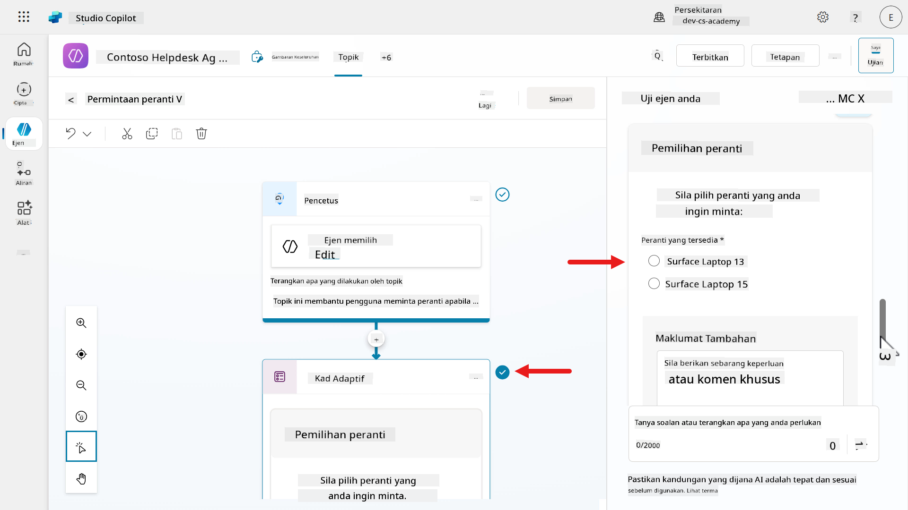

1. Kita kini telah berjaya menguji 😄 pengalihan topik _Available devices_ ke topik _Request devices_. Kita akan menambah lebih banyak penambahbaikan kepada topik ini dalam makmal pelajaran seterusnya.

    Segarkan semula panel ujian.

    

## ✅ Misi Selesai

Tahniah! 👏🏻 Anda telah mempelajari cara menambah kad adaptif menggunakan formula Power Fx untuk memaparkan data dari pemboleh ubah, dan anda juga telah mempelajari cara mengalihkan dari satu topik ke topik lain. Mencipta topik yang ringkas menjadikan agen anda lebih teratur, tetapi juga membantu membimbing pengguna melalui bahagian-bahagian aliran perbualan dengan agen.

Ini adalah akhir **Lab 08 - Tingkatkan interaksi pengguna dengan Kad Adaptif**, pilih pautan di bawah untuk bergerak ke pelajaran seterusnya. Kita akan mengembangkan kes penggunaan dalam makmal pelajaran berikut.

⏭️ [Bergerak ke pelajaran **Tambah aliran agen ke Topik anda untuk automasi**](../09-add-an-agent-flow/README.md)

## 📚 Sumber Taktikal

🔗 [Menggunakan Kad Adaptif dalam Copilot Studio](https://learn.microsoft.com/microsoft-copilot-studio/guidance/adaptive-cards-overview?WT.mc_id=power-172619-ebenitez)

🔗 [Tambah kad adaptif dalam nod Hantar mesej](https://learn.microsoft.com/microsoft-copilot-studio/authoring-send-message#add-an-adaptive-card?WT.mc_id=power-172619-ebenitez)

🔗 [Cipta ekspresi menggunakan Power Fx](https://learn.microsoft.com/microsoft-copilot-studio/advanced-power-fx?WT.mc_id=power-172619-ebenitez)

📺 [Membina Kad Adaptif dengan Power FX](https://aka.ms/ai-in-action/copilot-studio/ep8)


---

**Penafian**:  
Dokumen ini telah diterjemahkan menggunakan perkhidmatan terjemahan AI [Co-op Translator](https://github.com/Azure/co-op-translator). Walaupun kami berusaha untuk ketepatan, sila ambil perhatian bahawa terjemahan automatik mungkin mengandungi kesilapan atau ketidaktepatan. Dokumen asal dalam bahasa asalnya harus dianggap sebagai sumber yang berwibawa. Untuk maklumat penting, terjemahan manusia profesional adalah disyorkan. Kami tidak bertanggungjawab atas sebarang salah faham atau salah tafsir yang timbul daripada penggunaan terjemahan ini.