<!--
CO_OP_TRANSLATOR_METADATA:
{
  "original_hash": "4fb913dfc3bbc71506dd3602c4b8e6ed",
  "translation_date": "2025-10-21T17:41:14+00:00",
  "source_file": "docs/operative-preview/02-multi-agent/README.md",
  "language_code": "my"
}
-->
# 🚨 မစ်ရှင် 02: ဆက်သွယ်ထားသော အေးဂျင့်များ

--8<-- "disclaimer.md"

## 🕵️‍♂️ ကုဒ်နာမည်: `OPERATION SYMPHONY`

> **⏱️ လုပ်ဆောင်ချိန်:** `~45 မိနစ်`

## 🎯 မစ်ရှင်အကျဉ်း

အေးဂျင့်၊ ပြန်လာပါ။ မစ်ရှင် 01 မှာ သင့်ရဲ့ အဓိက အလုပ်ခန့်အေးဂျင့်ကို တည်ဆောက်ပြီးသားဖြစ်ပါတယ် - အလုပ်ခန့်လုပ်ငန်းစဉ်များကို စီမံခန့်ခွဲရန် အခြေခံအုတ်မြစ်တစ်ခု။ ဒါပေမဲ့ အေးဂျင့်တစ်ယောက်တည်းနဲ့ အားလုံးကို မလုပ်နိုင်ပါဘူး။

သင့်တာဝန်မှာ **Operation Symphony** ကို လက်ခံဖို့ဖြစ်ပြီး သင့်ရဲ့ တစ်ယောက်တည်းသော အေးဂျင့်ကို **multi-agent system** အဖြစ် ပြောင်းလဲဖို့ဖြစ်ပါတယ်။ အဓိက အေးဂျင့်အောက်မှာ အထူးပြုအေးဂျင့်များကို ပေါင်းစပ်ပြီး အလုပ်ခန့်လုပ်ငန်းစဉ်များကို စီမံခန့်ခွဲပါမယ်။ 

Symphony Orchestra တစ်ခုလိုပဲ တစ်ဦးချင်းစီက သူ့အပိုင်းကို သာလွန်စွာ ဆောင်ရွက်သလို သင့်ရဲ့ Hiring Agent အောက်မှာ Application Intake Agent နဲ့ Interview Prep Agent ကို ထည့်သွင်းပါမယ်။ အေးဂျင့်တွေဟာ သင့်ရဲ့ အဓိက orchestrator အောက်မှာ အဆင်ပြေစွာ ပေါင်းစပ်လုပ်ဆောင်ပါမယ်။

## 🔎 ရည်မှန်းချက်များ

ဒီမစ်ရှင်မှာ သင်လေ့လာရမှာ:

1. **child agents** နဲ့ **connected agents** ကို ဘယ်အချိန်မှာ အသုံးပြုရမလဲ
1. **multi-agent architectures** ကို အဆင့်မြှင့်တင်ဖန်တီးနည်း  
1. အထူးပြုလုပ်ငန်းများအတွက် **child agents** ဖန်တီးခြင်း
1. အေးဂျင့်များအကြား **ဆက်သွယ်မှုပုံစံများ** တည်ဆောက်ခြင်း
1. Application Intake Agent နဲ့ Interview Prep Agent တည်ဆောက်ခြင်း

## 🧠 ဆက်သွယ်ထားသော အေးဂျင့်များက ဘာလဲ?

Copilot Studio မှာ သင်တစ်ယောက်တည်းသော အေးဂျင့်တစ်ခုကို ဖန်တီးရုံမကဘဲ **multi-agent systems** - အထူးပြုအေးဂျင့်များကို ပေါင်းစပ်ပြီး ရှုပ်ထွေးသော workflows ကို စီမံခန့်ခွဲနိုင်ပါတယ်။

### multi-agent systems အရေးကြီးတဲ့အကြောင်း

- **Scalability:** အေးဂျင့်တစ်ခုချင်းစီကို သီးခြားဖွံ့ဖြိုး၊ စမ်းသပ်၊ ထိန်းသိမ်းနိုင်ပါတယ်။  
- **Specialization:** အေးဂျင့်တစ်ခုချင်းစီက သူ့အပိုင်းကို အထူးပြုလုပ်နိုင်ပါတယ်။  
- **Flexibility:** အေးဂျင့်တွေကို ပေါင်းစပ်အသုံးပြုနိုင်ပြီး အဆင့်မြှင့်တင်ဖို့လွယ်ကူပါတယ်။  
- **Maintainability:** အေးဂျင့်တစ်ခုမှာ ပြောင်းလဲမှုတွေက အခြားအေးဂျင့်တွေကို မထိခိုက်စေဘဲ update လုပ်ဖို့ လွယ်ကူပါတယ်။

### အလုပ်ခန့်လုပ်ငန်းစဉ်ကို ဥပမာအနေနဲ့

အလုပ်ခန့်လုပ်ငန်းစဉ်မှာ အေးဂျင့်တွေက အောက်ပါတာဝန်တွေကို လုပ်ဆောင်နိုင်ပါတယ်:

- **Resume intake** မှာ စာရွက်စာတမ်း parsing နဲ့ data extraction လုပ်ငန်းစွမ်းရည်လိုအပ်ပါတယ်
- **Scoring** မှာ အလုပ်လိုအပ်ချက်နဲ့ ကိုက်ညီမှုအပေါ် အလုပ်လျှောက်လွှာတွေကို အကဲဖြတ်ရပါတယ်
- **Interview preparation** မှာ အလုပ်လျှောက်သူနဲ့ အလုပ်လိုအပ်ချက်ကို နက်နက်နဲနဲ reasoning လုပ်ရပါတယ်  
- **Candidate communication** မှာ စိတ်ထိခိုက်မှုမရှိတဲ့ ဆက်သွယ်မှုစွမ်းရည်လိုအပ်ပါတယ်

## 🔗 Child agents နဲ့ connected agents: အဓိက ကွာခြားချက်

Copilot Studio မှာ multi-agent systems ဖန်တီးဖို့ နည်းလမ်းနှစ်ခုရှိပြီး သုံးစွဲမှုအပေါ်မူတည်ပြီး ကွဲပြားပါတယ်:

### ↘️ Child agents

Child agents ဟာ **lightweight specialists** ဖြစ်ပြီး အဓိကအေးဂျင့်အတွင်းမှာ ရှိပါတယ်။

#### Key technical details

- Child agents ဟာ parent agent အတွင်းမှာ ရှိပြီး configuration page တစ်ခုတည်းရှိပါတယ်။
- Tools နဲ့ Knowledge ဟာ **parent** agent မှာ သိမ်းဆည်းထားပြီး "Available to" child agent အဖြစ် configure လုပ်ထားပါတယ်။
- Child agents ဟာ parent agent ရဲ့ **topics** တွေကို မျှဝေပါတယ်။
- Child agents ဟာ **သီးခြား publish လုပ်ဖို့ မလိုအပ်ပါဘူး** - parent agent အတွင်းမှာ အလိုအလျောက် ရရှိနိုင်ပါတယ်။

#### Child agents ကို အသုံးပြုသင့်တဲ့အခါ

- တစ်ခုတည်းသောအဖွဲ့က အားလုံးကို စီမံခန့်ခွဲတဲ့အခါ
- Tools နဲ့ knowledge ကို sub-agents အဖြစ် logic အရ စီစဉ်ချင်တဲ့အခါ
- သီးခြား authentication သို့မဟုတ် deployment မလိုအပ်တဲ့အခါ
- Agents တွေကို သီးခြား publish လုပ်ဖို့ မလိုအပ်တဲ့အခါ

**ဥပမာ:** IT helpdesk agent တစ်ခုမှာ:

- Password reset procedures
- Hardware troubleshooting  
- Software installation guides

### 🔀 Connected agents

Connected agents ဟာ **အပြည့်အစုံသော သီးခြားအေးဂျင့်များ** ဖြစ်ပြီး အဓိကအေးဂျင့်နဲ့ ပေါင်းစပ်လုပ်ဆောင်နိုင်ပါတယ်။

#### Key technical details

- Connected agents ဟာ **သီးခြား topics** နဲ့ conversation flows ရှိပါတယ်။
- Connected agents ဟာ **publish လုပ်ဖို့လိုအပ်ပါတယ်**။
- Testing အတွင်းမှာ connected agent ရဲ့ ပြောင်းလဲမှုတွေကို publish လုပ်ပြီးမှ calling agent မှာ အသုံးပြုနိုင်ပါတယ်။

#### Connected agents ကို အသုံးပြုသင့်တဲ့အခါ

- အဖွဲ့အစည်းများစွာက သီးခြား agents တွေကို ဖွံ့ဖြိုးစီမံခန့်ခွဲတဲ့အခါ
- Agents တွေကို သီးခြား settings, authentication, deployment channels လိုအပ်တဲ့အခါ
- Agents တွေကို သီးခြား publish နဲ့ maintenance လုပ်ဖို့လိုအပ်တဲ့အခါ

**ဥပမာ:** Customer service system တစ်ခုမှာ:

- Finance team မှာ စီမံခန့်ခွဲတဲ့ billing agent
- Product team မှာ စီမံခန့်ခွဲတဲ့ technical support agent
- Operations team မှာ စီမံခန့်ခွဲတဲ့ returns agent

!!! tip "အကြံပြုချက်"
    သင့်ရဲ့ အဓိကအေးဂျင့်မှာ external agents တွေကို connect လုပ်ပြီး သင့်ရဲ့ internal tasks အတွက် child agents တွေကိုလည်း ရှိနိုင်ပါတယ်။

## 🎯 Multi-agent architecture patterns

Multi-agent systems တည်ဆောက်တဲ့အခါ အေးဂျင့်တွေ ဘယ်လိုပုံစံနဲ့ ဆက်သွယ်မလဲဆိုတာအပေါ် မူတည်ပြီး pattern အမျိုးမျိုးရှိပါတယ်:

| Pattern              | ဖော်ပြချက်                                                                 | အကောင်းဆုံးအသုံးပြုမှု                                                      |
|----------------------|-----------------------------------------------------------------------------|---------------------------------------------------------------|
| **Hub and Spoke**    | အဓိက orchestrator agent က အထူးပြုအေးဂျင့်များကို စီမံခန့်ခွဲပါတယ်။ | ရှုပ်ထွေးတဲ့ workflows တွေမှာ အေးဂျင့်တစ်ခုက အထူးပြုတာဝန်တွေကို စီမံခန့်ခွဲတဲ့အခါ |
| **Pipeline**         | အေးဂျင့်တွေ sequentially အလုပ်ကို လုပ်ဆောင်ပြီး နောက်တစ်ခုဆီ ပေးပို့ပါတယ်။ | Linear processes တွေမှာ (application processing → screening → interview → decision) |
| **Collaborative**    | အေးဂျင့်တွေက တစ်ချိန်တည်းမှာ အလုပ်တစ်ခုကို အမျိုးမျိုးသောအမြင်နဲ့ လုပ်ဆောင်ပါတယ်။ | ရှုပ်ထွေးတဲ့ analysis တွေမှာ |

!!! tip "အကြံပြုချက်"
    သင့်ရဲ့ system မှာ pattern နှစ်ခု သို့မဟုတ် အများကြီးကို ပေါင်းစပ်အသုံးပြုနိုင်ပါတယ်။

## 💬 အေးဂျင့်များအကြား ဆက်သွယ်မှုနဲ့ context sharing

အေးဂျင့်တွေ ပေါင်းစပ်လုပ်ဆောင်တဲ့အခါ သတင်းအချက်အလက်တွေကို ထိရောက်စွာ မျှဝေဖို့ လိုအပ်ပါတယ်။ Copilot Studio မှာ ဒီလိုလုပ်ဆောင်ပုံက:

### Conversation history

အဓိကအေးဂျင့်က child သို့မဟုတ် connected agent ကို ခေါ်တဲ့အခါ **conversation history** ကို ပေးပို့နိုင်ပါတယ်။

### Explicit instructions

အဓိကအေးဂျင့်က **specific instructions** ပေးနိုင်ပါတယ်။ ဥပမာ: "ဒီ resume ကို process လုပ်ပြီး Senior Developer role အတွက် သူ့ရဲ့ skills ကို summary လုပ်ပါ။"

### Return values

အေးဂျင့်တွေက structured information ကို ပြန်ပေးနိုင်ပြီး အဓိကအေးဂျင့်က အဲ့ဒီအချက်အလက်ကို နောက်ထပ်အဆင့်တွေမှာ အသုံးပြုနိုင်ပါတယ်။

### Dataverse integration

ရှုပ်ထွေးတဲ့ scenarios တွေမှာ Dataverse သို့မဟုတ် အခြား data stores တွေကို အသုံးပြုပြီး context sharing လုပ်နိုင်ပါတယ်။

## ↘️Child agent: Application Intake Agent

အေးဂျင့်စနစ်ကို တည်ဆောက်ဖို့ Application Intake Agent ကို စတင်ဖန်တီးပါမယ်။

```mermaid
---
config:
  layout: elk
  look: neo
---
flowchart TB
 subgraph People["People"]
    direction TB
        HiringManager["Hiring Manager"]
        Interviewers["Interviewers"]
  end
 subgraph Agents["Agents"]
    direction LR
        ApplicationIntakeAgent["Application Intake Agent<br>(Child)"]
        InterviewAgent["Interview Agent<br>(Connected)"]
        HRAgent["HR Agent"]
  end
    HiringManager -- Upload CV --> HRAgent
    HRAgent -- Upload Resume, Create Candidate, Match to Job Roles --> ApplicationIntakeAgent
    ApplicationIntakeAgent -- Create Resume, Upsert Candidate, Create Job Application --> Dataverse["Dataverse"]
    ApplicationIntakeAgent -- Store Resume file in file column --> Dataverse
    HiringManager -- Ask for summaries --> HRAgent
    Interviewers -- Request interview pack --> HRAgent
    HRAgent -- Generate interview pack and summarize data --> InterviewAgent
    InterviewAgent -- Read all Candidate, Resume, Job Roles, Evaluation Criteria Data --> Dataverse
     HiringManager:::person
     Interviewers:::person
     ApplicationIntakeAgent:::agent
     InterviewAgent:::agent
     HRAgent:::agent
     Dataverse:::data
    classDef person fill:#e6f0ff,stroke:#3b82f6,color:#0b3660
    classDef agent fill:#e8f9ef,stroke:#10b981,color:#064e3b
    classDef data  fill:#f3f4f6,stroke:#6b7280,color:#111827
```

### 🤝Application Intake Agent ရဲ့တာဝန်များ

- **Parse resume content** PDF ဖိုင်တွေကို interactive chat မှတစ်ဆင့် process လုပ်ခြင်း
- **Extract structured data** (နာမည်, skills, အတွေ့အကြုံ, ပညာရေး)
- **Match candidates to open roles** အရည်အချင်းနဲ့ cover letter အပေါ်မူတည်ပြီး
- **Store candidate information** Dataverse မှာ သိမ်းဆည်းခြင်း
- **Deduplicate applications** email address ကို အသုံးပြုပြီး record တွေကို မတူညီအောင်လုပ်ခြင်း

### ⭐Child agent ဖြစ်သင့်တဲ့အကြောင်း

Application Intake Agent ဟာ:

- စာရွက်စာတမ်း process နဲ့ data extraction အတွက် အထူးပြုထားပါတယ်
- သီးခြား publish လုပ်ဖို့ မလိုအပ်ပါဘူး  
- အလုပ်ခန့်လုပ်ငန်းစဉ်ရဲ့ အစိတ်အပိုင်းတစ်ခုအဖြစ် အဓိကအေးဂျင့်အောက်မှာ စီမံခန့်ခွဲပါတယ်

## 🔀Connected agent: Interview Prep Agent  

Interview Prep Agent ဟာ အလုပ်ခန့်လုပ်ငန်းစဉ်အတွက် interview materials ဖန်တီးဖို့ အထူးပြု connected agent ဖြစ်ပါတယ်။

### 🤝Interview Prep Agent ရဲ့တာဝန်များ

- **Create interview packs** ကုမ္ပဏီအချက်အလက်, role requirements, evaluation criteria ပါဝင်တဲ့ materials
- **Generate interview questions** role-specific နဲ့ candidate background အပေါ်မူတည်ပြီး
- **Answer general questions** အလုပ်နဲ့ applications အကြောင်း stakeholder communication အတွက်

### ⭐Connected agent ဖြစ်သင့်တဲ့အကြောင်း

Interview Prep Agent ဟာ:

- Talent acquisition team က သီးခြားအသုံးပြုနိုင်ဖို့
- Interview best practices နဲ့ evaluation criteria ကို သီးခြား knowledge base ရှိဖို့
- Hiring managers တွေက သူ့ရဲ့ behavior ကို customize လုပ်နိုင်ဖို့

## 🧪Lab 2.1: Application Intake Agent ကို ထည့်သွင်းခြင်း

### Mission ကို ပြီးမြောက်ဖို့လိုအပ်ချက်များ

သင် **အောက်ပါအနက်**:

- **Mission 01 ကို ပြီးမြောက်ထား**ပြီး Hiring Agent ကို ရှိထားဖို့ **သို့မဟုတ်**
- **Mission 02 starter solution ကို Import လုပ်ထား**ဖို့

!!! note "Solution Import နဲ့ Sample Data"
    Starter solution ကို အသုံးပြုနေပါက [Mission 01](../01-get-started/README.md) ကို ရည်ညွှန်းပြီး solution နဲ့ sample data ကို သင့် environment မှာ Import လုပ်ပါ။

### 2.1.1 Solution setup

1. Copilot Studio မှာ Tools အောက်မှာ **ellipsis (...)** ကို ရွေးပါ။
1. **Solutions** ကို ရွေးပါ။  
    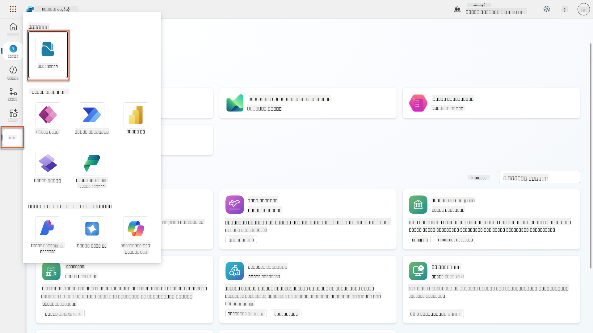
1. သင့် Operative solution ကို ရှာပြီး **ellipsis (...)** ကို ရွေးပြီး **Set preferred solution** ကို ရွေးပါ။  
    

### 2.1.2 Hiring Agent agent instructions ကို Configure လုပ်ပါ

1. Copilot Studio ကို **Navigate** လုပ်ပါ။ Environment Picker မှာ သင့် environment ကို ရွေးပါ။

1. Mission 01 မှာ ရှိတဲ့ **Hiring Agent** ကို ဖွင့်ပါ။

1. **Overview** tab ရဲ့ **Instructions** အပိုင်းမှာ **Edit** ကို ရွေးပြီး အောက်ပါ instructions ကို ထည့်ပါ:

    ```text
    You are the central orchestrator for the hiring process. You coordinate activities, provide summaries, and delegate work to specialized agents.
    ```

1. **Save** ကို ရွေးပါ  
    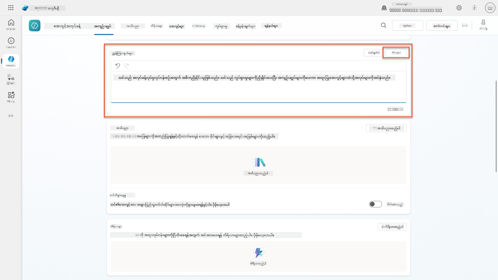

1. **Settings** (အပေါ်ယာ) ကို ရွေးပါ။

1. အောက်ပါ settings တွေကို သေချာစွာ ပြုလုပ်ပါ:

    | Setting | Value |
    |---------|-------|
    | Use generative AI orchestration for your agent's responses | **Yes** |
    | Content Moderation | **Moderate** |
    | Use general knowledge | **Off** |
    | Use information from the Web | **Off** |
    | File uploads | **On** |


### 2.1.3 Application Intake child agent ကို ထည့်ပါ

1. Hiring Agent ရဲ့ **Agents** tab ကို **Navigate** လုပ်ပါ။

1. **+ Add** ကို ရွေးပြီး **Create an agent** ကို ရွေးပါ။  
    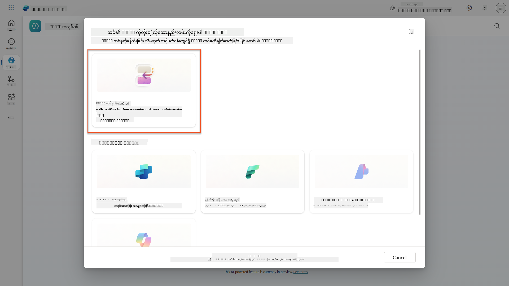

1. သင့်အေးဂျင့်ကို `Application Intake Agent` ဟု **Name** ပေးပါ။

1. **When will this be used?** dropdown မှ **The agent chooses** ကို ရွေးပါ။

1. **Description** ကို အောက်ပါအတိုင်း သတ်မှတ်ပါ:

    ```text
    Processes incoming resumes and stores candidates in the system
    ```

    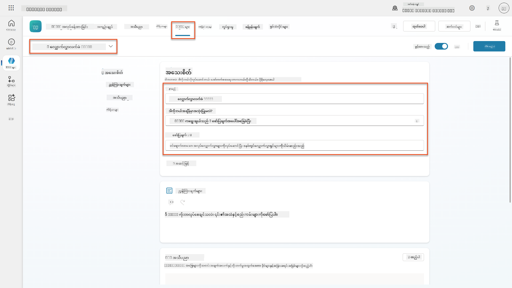

1. **Advanced** ကို ဖွင့်ပြီး Priority ကို `10000` အဖြစ် သတ်မှတ်ပါ။

1. **Web Search** toggle ကို **Disabled** အဖြစ် သတ်မှတ်ပါ။

1. **Save** ကို ရွေးပါ။

### 2.1.4 Resume Upload agent flow ကို Configure လုပ်ပါ

Agents တွေဟာ tools သို့မဟုတ် topics မပါဘဲ လုပ်ဆောင်မှုမရှိနိုင်ပါ။
ကျွန်တော်တို့ **Agent Flow tools** ကို Topics အစား *Upload Resume* အဆင့်မှာ အသုံးပြုနေပါတယ်၊ အကြောင်းကတော့ ဒီ multi-step backend လုပ်ငန်းစဉ်ဟာ deterministic execution နဲ့ အပြင်ပစနစ်တွေနဲ့ ပေါင်းစည်းမှုကို လိုအပ်လို့ပါ။ Topics တွေဟာ စကားဝိုင်းဆွေးနွေးမှုကို လမ်းညွှန်ဖို့အတွက် အကောင်းဆုံးဖြစ်ပေမယ့် Agent Flows တွေကတော့ ဖိုင်များကို အဆင်ပြေစွာ xử lýဖို့၊ ဒေတာအတည်ပြုမှုလုပ်ဖို့၊ database upserts (အသစ်ထည့်သွင်းခြင်း သို့မဟုတ် ရှိပြီးသားကို update လုပ်ခြင်း) ကို ယုံကြည်စိတ်ချစွာ လုပ်ဆောင်နိုင်တဲ့ structured automation ကို ပေးစွမ်းပါတယ်။

1. **Tools** အပိုင်းကို Application Intake Agent စာမျက်နှာအတွင်းမှာ ရှာပါ။
   **အရေးကြီး**: ဒါဟာ parent agent ရဲ့ Tools tab မဟုတ်ပါဘူး၊ child agent instructions အောက်ကို scroll လုပ်ပြီး ရှာနိုင်ပါတယ်။

1. **+ Add** ကို ရွေးပါ။
   

1. **+ New tool** ကို ရွေးပါ။ 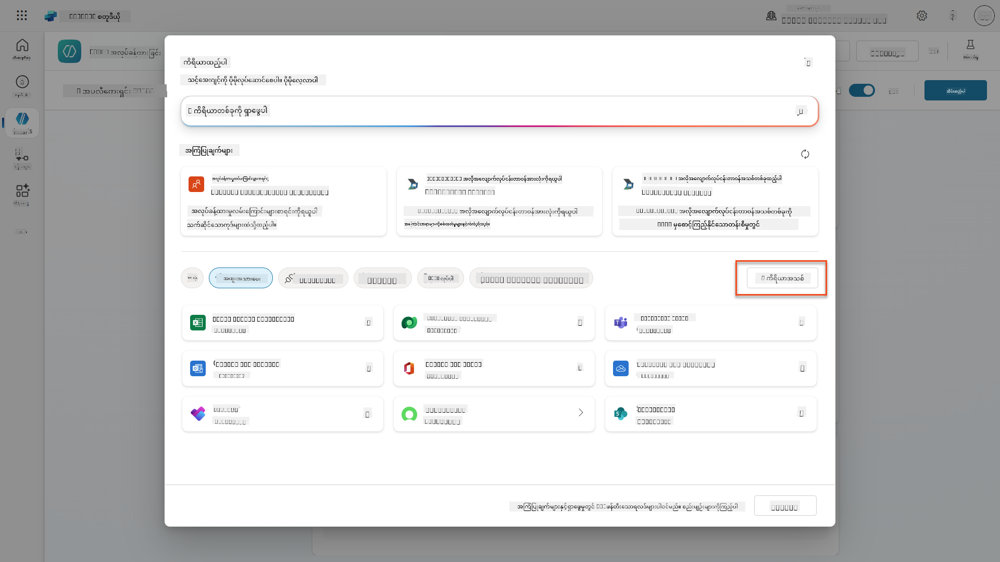

1. **Agent flow** ကို ရွေးပါ။
    Agent Flow designer ပေါ်လာပါမယ်၊ ဒီမှာ upload resume logic ကို ထည့်သွင်းမှာဖြစ်ပါတယ်။  
    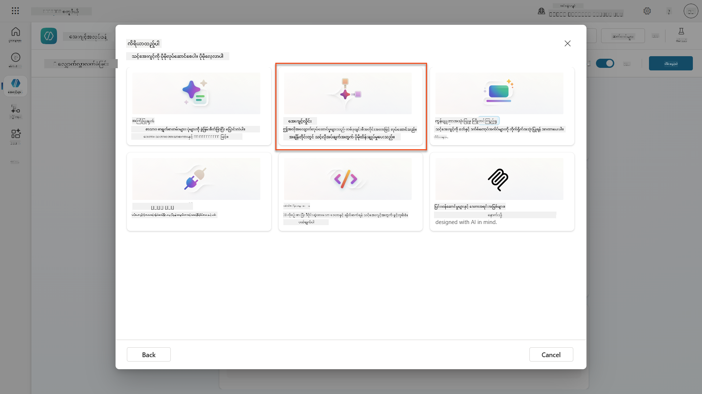

1. **When an agent calls the flow** node ကို ရွေးပြီး **+ Add** ကို ရွေးပါ၊ အောက်ပါ Parameters တွေအတွက် input ထည့်ပါ၊ name နဲ့ description နှစ်ခုလုံးကို ထည့်သွင်းပါ။

    | Type  | Name     | Description                                                                                                   |
    |-------|----------|---------------------------------------------------------------------------------------------------------------|
    | File  | Resume   | Resume PDF ဖိုင်                                                                                           |
    | Text  | Message  | context မှ cover letter ပုံစံ message ကို extract လုပ်ပါ။ Message ဟာ 2000 characters ထက်မကျော်ရပါ။         |
    | Text  | UserEmail| Resume ရဲ့ မူလ email လိပ်စာ။ Chat မှာ resume ကို upload လုပ်တဲ့ user သို့မဟုတ် email မှာရရှိတဲ့ from email address ဖြစ်ပါတယ်။ |

    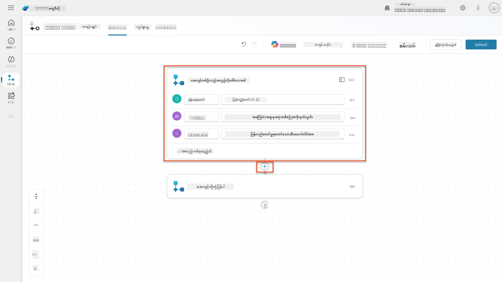

1. Trigger node အောက်မှာ **+ icon** ကို ရွေးပြီး `Dataverse` ကို ရှာပါ၊ Microsoft Dataverse အနားမှာ **See more** ကို ရွေးပြီး **Microsoft Dataverse** အပိုင်းမှာ **Add a new row** action ကို ရွေးပါ။  
    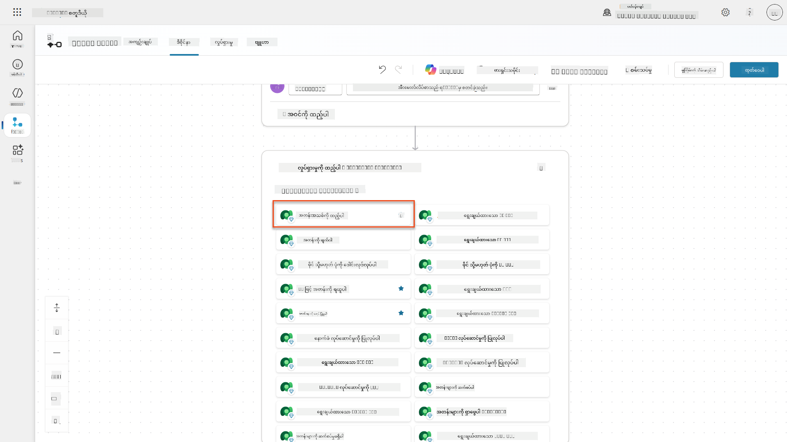

1. Node ကို **Create Resume** ဟု အမည်ပေးပါ၊ **ellipsis(...)** ကို ရွေးပြီး **Rename** ကို ရွေးပါ။  
    

1. **Table name** ကို **Resumes** သတ်မှတ်ပြီး **Show all** ကို ရွေးပါ၊ parameters အားလုံးကို ပြပါ။

1. အောက်ပါ **properties** တွေကို သတ်မှတ်ပါ:

    | Property                 | How to Set                      | Details / Expression                                         |
    | ------------------------ | ------------------------------- | ------------------------------------------------------------ |
    | **Resume Title**         | Dynamic data (thunderbolt icon) | **When an agent calls the flow** → **Resume name**    Resume name ကို မတွေ့ရင် Resume parameter ကို data type အနေနဲ့ အထက်မှာ configure လုပ်ထားပါ။ |
    | **Cover letter**         | Expression (fx icon)            | `if(greater(length(triggerBody()?['text']), 2000), substring(triggerBody()?['text'], 0, 2000), triggerBody()?['text'])` |
    | **Source Email Address** | Dynamic data (thunderbolt icon) | **When an agent calls the flow** → **UserEmail**             |
    | **Upload Date**          | Expression (fx icon)            | `utcNow()`                                                   |

    

1. Create Resume node အောက်မှာ **+ icon** ကို ရွေးပြီး `Dataverse` ကို ရှာပါ၊ Microsoft Dataverse အနားမှာ **See more** ကို ရွေးပြီး **Upload a file or an image** action ကို ရွေးပါ။
   **အရေးကြီး**: Upload a file or an image to the selected environment action ကို ရွေးမိမနေပါစေ။

1. Node ကို **Upload Resume File** ဟု အမည်ပေးပါ၊ **ellipsis(...)** ကို ရွေးပြီး **Rename** ကို ရွေးပါ။

1. အောက်ပါ **properties** တွေကို သတ်မှတ်ပါ:

     | Property | How to Set | Details |
     |----------|------------|---------|
     | **Content name** | Dynamic data (thunderbolt icon) | When an agent calls the flow → Resume name |
     | **Table name** | Select | Resumes |
     | **Row ID** | Dynamic data (thunderbolt icon) | Create Resume → See more → Resume |
     | **Column Name** | Select | Resume PDF |
     | **Content** | Dynamic data (thunderbolt icon) | When an agent calls the flow → Resume contentBytes |

     

1. **Respond to the agent node** ကို ရွေးပြီး **+ Add an output** ကို ရွေးပါ။

     | Property | How to Set | Details |
     |----------|------------|---------|
     | **Type** | Select | `Text` |
     | **Name** | Enter | `ResumeNumber` |
     | **Value** | Dynamic data (thunderbolt icon) | Create Resume → See More → Resume Number |
     | **Description** | Enter | `The [ResumeNumber] of the Resume created` |

     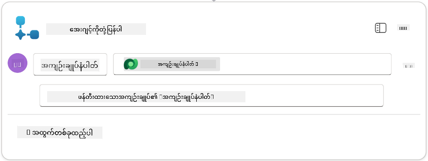

1. အပေါ်ယံညာဘက်မှာ **Save draft** ကို ရွေးပါ။  
     

1. **Overview** tab ကို ရွေးပြီး **Details** panel မှာ **Edit** ကို ရွေးပါ။

     1. **Flow name**:`Resume Upload`
     1. **Description**:`Uploads a Resume when instructed`

     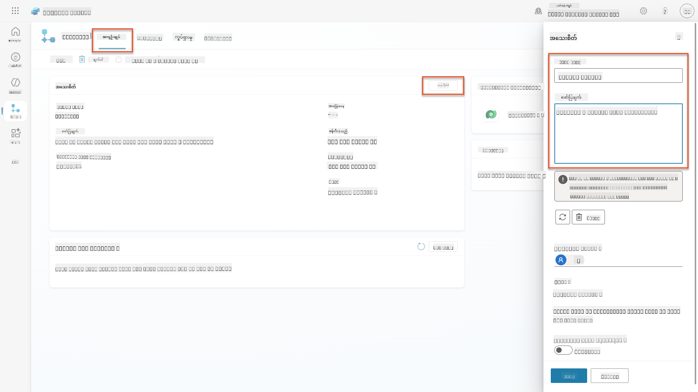

1. **Designer** tab ကို ပြန်ရောက်ပြီး **Publish** ကို ရွေးပါ။  
     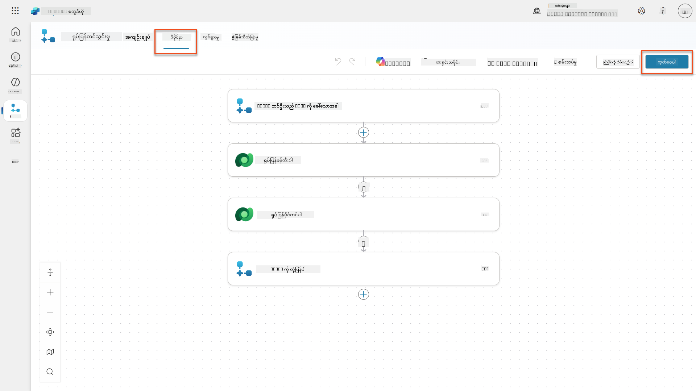

### 2.1.5 Flow ကို agent နဲ့ ချိတ်ဆက်ပါ

အခုတော့ published flow ကို Application Intake Agent နဲ့ ချိတ်ဆက်ပါမယ်။

1. **Hiring Agent** ကို ပြန်သွားပြီး **Agents** tab ကို ရွေးပါ။ **Application Intake Agent** ကို ဖွင့်ပြီး **Tools** panel ကို ရှာပါ။  
    

1. **+ Add** ကို ရွေးပါ။

1. **Flow** filter ကို ရွေးပြီး `Resume Upload` ကို ရှာပါ။ **Resume Upload** flow ကို ရွေးပြီး **Add and configure** ကို ရွေးပါ။

1. အောက်ပါ parameters တွေကို သတ်မှတ်ပါ:

    | Parameter | Value |
    |-----------|-------|
    | **Description** | `Uploads a Resume when instructed. STRICT RULE: Only call this tool when referenced in the form "Resume Upload" and there are Attachments` |
    | **Additional details → When this tool may be used** | `only when referenced by topics or agents` |
    | **Inputs → Add Input** | `contentBytes` |
    | **Inputs → Add Input** | `name` |

    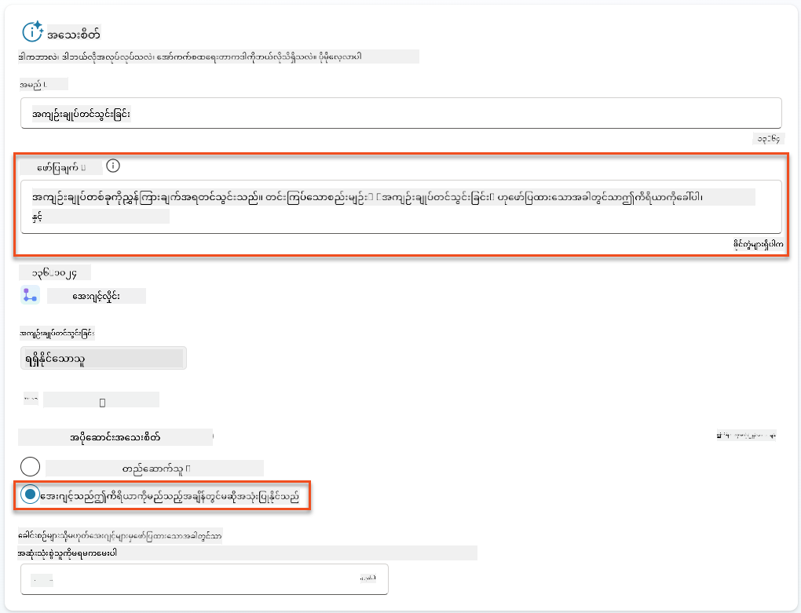

    

1. အောက်ပါ input properties တွေကို သတ်မှတ်ပါ:

    | Input Parameter | Property | Details |
    |-----------------|----------|---------|
    | **contentBytes** | Fill using | Custom value |
    |                  | Value (...→Formula→Insert) | `First(System.Activity.Attachments).Content` |
    | **name** | Fill using | Custom value |
    |          | Value (...→Formula→Insert) | `First(System.Activity.Attachments).Name` |
    | **Message** | Customize | Configure custom settings |
    |             | Description | `Extract a cover letter style message from the context. Be sure to never prompt the user and create at least a minimal cover letter from the available context. STRICT RULE - the message must be less than 2000 characters.` |
    |             | How many reprompts | Don't repeat |
    |             | Action if no entity found | Set variable to value |
    |             | Default entity value | Resume upload |
    | **UserEmail** | Fill using | Custom value |
    |  | Value (...→Formula→Insert) | `System.User.Email` |

    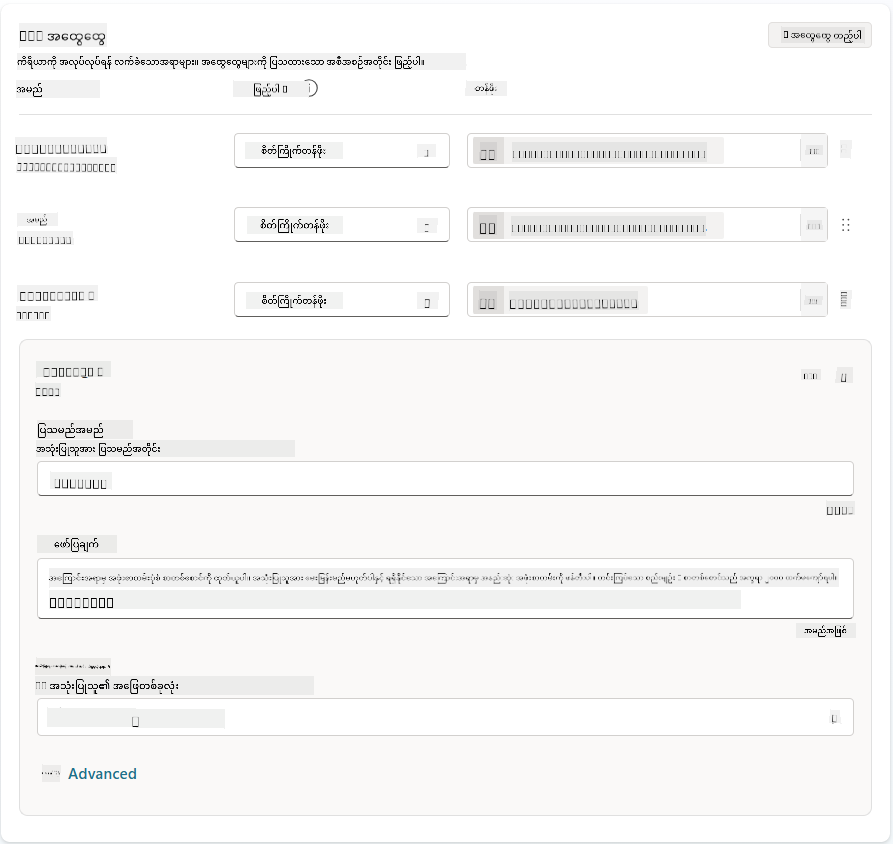

1. **Save** ကို ရွေးပါ။

### 2.1.6 Agent instructions ကို သတ်မှတ်ပါ

1. **Application Intake Agent** ကို ပြန်သွားပြီး **Agents** tab ကို ရွေးပါ၊ **Instructions** panel ကို ရှာပါ။

1. **Instructions** field မှာ အောက်ပါ clear guidance ကို paste လုပ်ပါ။

    ```text
    You are tasked with managing incoming Resumes, Candidate information, and creating Job Applications.  
    Only use tools if the step exactly matches the defined process. Otherwise, indicate you cannot help.  
    
    Process for Resume Upload via Chat  
    1. Upload Resume  
      - Trigger only if /System.Activity.Attachments contains exactly one new resume.  
      - If more than one file, instruct the user to upload one at a time and stop.  
      - Call /Upload Resume once. Never upload more than once for the same message.  
    
    2. Post-Upload  
      - Always output the [ResumeNumber] (R#####).  
    ```

1. Instructions တွေမှာ forward slash (/) ပါရှိတဲ့နေရာမှာ / အောက်မှာရှိတဲ့ text ကို ရွေးပြီး resolved name ကို ရွေးပါ။ ဒါကို အောက်ပါအတွက် လုပ်ပါ:

    - `System.Activity.Attachments` (Variable)
    - `Upload Resume` (Tool)

    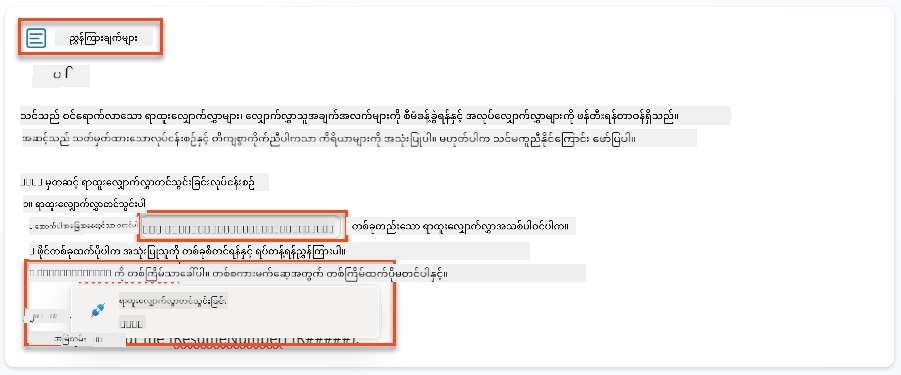

1. **Save** ကို ရွေးပါ။

### 2.1.7 Application Intake Agent ကို စမ်းသပ်ပါ

အခုတော့ သင့်ရဲ့ ပထမဆုံး orchestra member အလုပ်လုပ်နေတဲ့အတိုင်း စစ်ဆေးပါမယ်။

1. [test Resumes](https://download-directory.github.io/?url=https://github.com/microsoft/agent-academy/tree/main/operative/sample-data/resumes&filename=operative_sampledata) ကို **Download** လုပ်ပါ။

1. **Test** panel ကို ဖွင့်ဖို့ **Toggle** လုပ်ပါ။

1. Test chat မှာ Resume နှစ်ခုကို **Upload** လုပ်ပြီး `Process these resumes` ဟု message ပေးပါ။

    - Agent က *Only a single resume can be uploaded at a time. Please upload one resume to proceed.* ဆိုတဲ့ message ကို ပြန်ပေးသင့်ပါတယ်။

    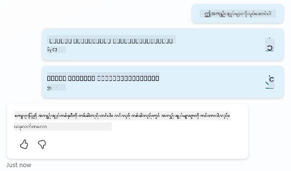

1. **Resume တစ်ခုသာ Upload** လုပ်ပြီး `Process this resume` ဟု message ပေးပါ။

    - Agent က *The resume for Avery Example has been successfully uploaded. The resume number is R10026.* ဆိုတဲ့ message ကို ပြန်ပေးသင့်ပါတယ်။

1. **Activity map** မှာ **Application Intake Agent** က resume upload ကို handle လုပ်နေတဲ့အတိုင်း မြင်ရပါမယ်။  
    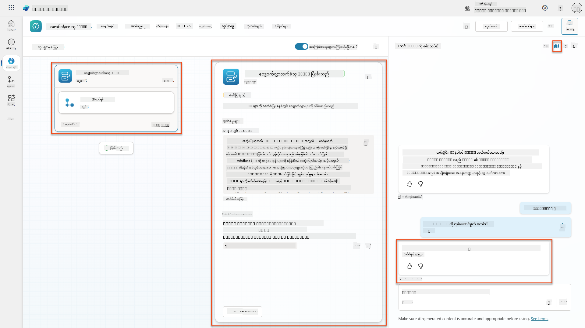

1. make.powerapps.com ကို သွားပါ → အပေါ်ယံညာဘက် Environment Picker မှာ သင့် environment ကို ရွေးပါ။

1. **Apps** → Hiring Hub → ellipsis(...) menu → **Play** ကို ရွေးပါ။  
    

    မှတ်ချက်: Play button ဟာ greyed out ဖြစ်နေတယ်ဆိုရင် Mission 01 မှ solution ကို publish မလုပ်ရသေးတာဖြစ်ပါတယ်။ **Solutions** → **Publish all customizations** ကို ရွေးပါ။

1. **Resumes** ကို သွားပြီး resume ဖိုင် upload လုပ်ထားပြီး cover letter ကို သတ်မှတ်ထားတာကို စစ်ဆေးပါ။  
    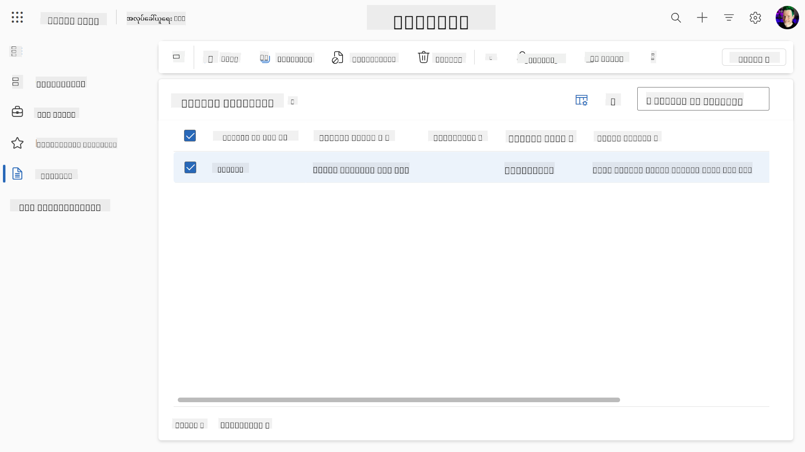

## 🧪Lab 2.2: Interview Prep connected agent ကို ထည့်သွင်းခြင်း

အခုတော့ interview preparation အတွက် connected agent ကို ဖန်တီးပြီး Hiring Agent နဲ့ ချိတ်ဆက်ပါမယ်။

### 2.2.1 Interview Agent ကို ဖန်တီးပါ

1. **Copilot Studio** ကို သွားပါ။ အပေါ်ယံညာဘက် Environment Picker မှာ သင့် environment ကို ရွေးထားပါ။

1. **Hiring Agent** ကို ဖွင့်ပါ။

1. Agent tab ကို သွားပြီး **+ Add an agent** ကို ရွေးပါ။

1. **Connect an existing agent** → **Copilot Studio** ကို ရွေးပါ။

1. **+ New agent** ကို ရွေးပါ။

### 2.2.2 အခြေခံ settings တွေကို configure လုပ်ပါ

1. **Configure** tab ကို ရွေးပြီး အောက်ပါ properties တွေကို ထည့်သွင်းပါ:

    - **Name**: `Interview Agent`
    - **Description**: `Assists with the interview process.`

1. Instructions:

    ```text
    You are the Interview Agent. You help interviewers and hiring managers prepare for interviews. You never contact candidates. 
    Use Knowledge to help with interview preparation. 
    
    The only valid identifiers are:
      - ResumeNumber (ppa_resumenumber)→ format R#####
      - CandidateNumber (ppa_candidatenumber)→ format C#####
      - ApplicationNumber (ppa_applicationnumber)→ format A#####
      - JobRoleNumber (ppa_jobrolenumber)→ format J#####
    
    Examples you handle
      - Give me a summary of ...
      - Help me prepare to interview candidates for the Power Platform Developer role
      - Create interview assistance for the candidates for Power Platform Developer
      - Give targeted questions for Candidate Alex Johnson focusing on the criteria for the Job Application
      
    How to work:
        You are expected to ask clarification questions if required information for queries is not provided
        - If asked for interview help without providing a job role, ask for it
        - If asking for interview questions, ask for the candidate and job role if not provided.
    
    General behavior
    - Do not invent or guess facts
    - Be concise, professional, and evidence-based
    - Map strengths and risks to the highest-weight criteria
    - If data is missing (e.g., no resume), state what is missing and ask for clarification
    - Never address or message a candidate
    ```

1. **Web Search** ကို **Disabled** လုပ်ပါ။

1. **Create** ကို ရွေးပါ။  
    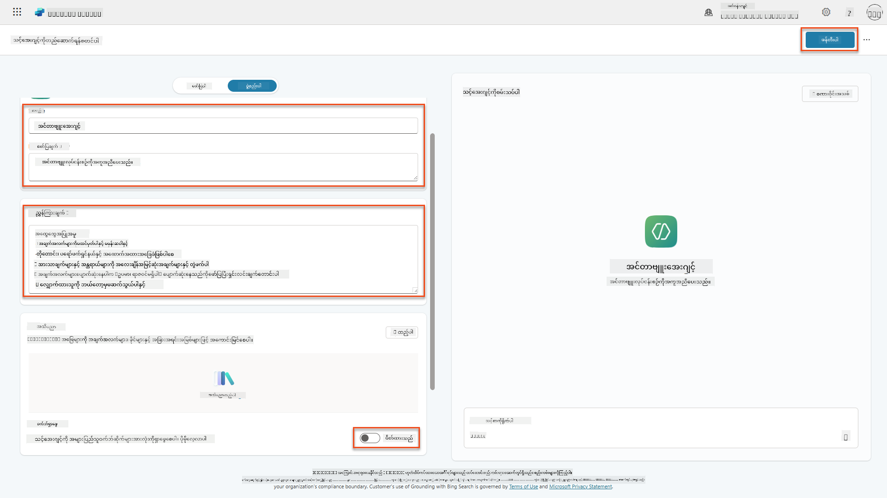

### 2.2.3 Data access ကို configure လုပ်ပြီး publish လုပ်ပါ

1. **Knowledge** အပိုင်းမှာ **+ Add knowledge** ကို ရွေးပါ။  
    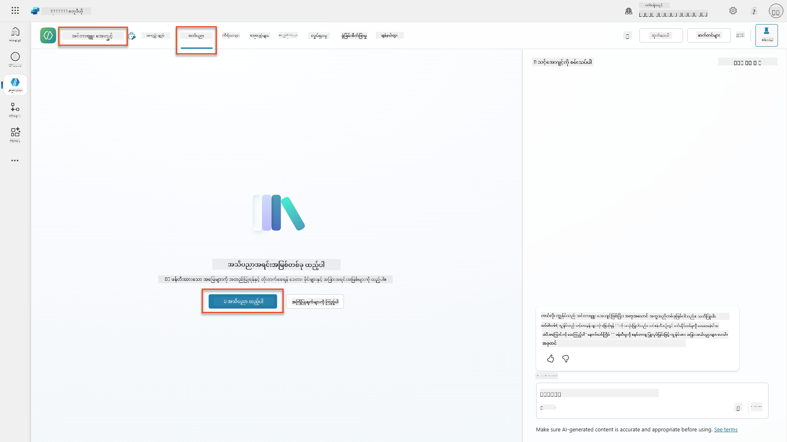
1. **Dataverse** ကို ရွေးပါ။  
    
1. **Search box** မှာ `ppa_` ဟု ရိုက်ပါ။ ဒါဟာ သင် import လုပ်ထားတဲ့ tables တွေရဲ့ prefix ဖြစ်ပါတယ်။
1. **Select** all 5 tables (Candidate, Evaluation Criteria, Job Application, Job Role, Resume)
1. **Add to agent** ကို ရွေးပါ။  
    
1. Interview Agent ရဲ့ **Settings** ကို ရွေးပြီး အောက်ပါ settings တွေကို သတ်မှတ်ပါ:

    - **Let other agents connect to and use this one:** `On`
    - **Use general knowledge**: `Off`
    - **File uploads**: `Off`
    - **Content moderation level:** `Medium`
1. **Save** ကို ရွေးပါ။
1. **Publish** ကို ရွေးပြီး publish လုပ်မှု ပြီးဆုံးရန် စောင့်ပါ။

### 2.2.4 Interview Prep Agent ကို Hiring Agent နဲ့ ချိတ်ဆက်ပါ

1. **Hiring Agent** ကို ပြန်သွားပါ။

1. **Agents** Tab ကို ရွေးပါ။

1. **+Add an agent** → **Copilot Studio** ကို အသုံးပြုပြီး **Interview Agent** ကို ထည့်ပါ။ Description ကို အောက်ပါအတိုင်း သတ်မှတ်ပါ:
    ```text
    Assists with the interview process and provides information about Resumes, Candidates, Job Roles, and Evaluation Criteria.
    ```

    
    Pass conversation history to this agent ကို အမှန်ခြစ်ထားသည်ကို သတိပြုပါ။ ဒါကတော့ မိဘ Agent က connected agent ကို အပြည့်အစုံ context ပေးနိုင်စေပါတယ်။

1. **Add agent** ကို ရွေးပါ။

1. **Application Intake Agent** နဲ့ **Interview Agent** နှစ်ခုလုံးကို မြင်ရတာကို သေချာပါစေ။ တစ်ခုက child agent ဖြစ်ပြီး နောက်တစ်ခုက connected agent ဖြစ်ပုံကို သတိပြုပါ။  
    

### 2.2.5 Multi-agent ပူးပေါင်းလုပ်ဆောင်မှုကို စမ်းသပ်ပါ

1. **Test** ကို ရွေးပြီး test panel ကို ဖွင့်ပါ။

1. စမ်းသပ်ရန် resume တစ်ခုကို **Upload** လုပ်ပြီး မိဘ agent ကို connected agent ကို ဘာတွေကို အပ်နှံနိုင်မလဲဆိုတာ ဖော်ပြတဲ့ အောက်ပါဖော်ပြချက်ကို ထည့်ပါ။

    ```text
    Upload this resume, then show me open job roles, each with a description of the evaluation criteria, then use this to match the resume to at least one suitable job role even if not a perfect match.
    ```

    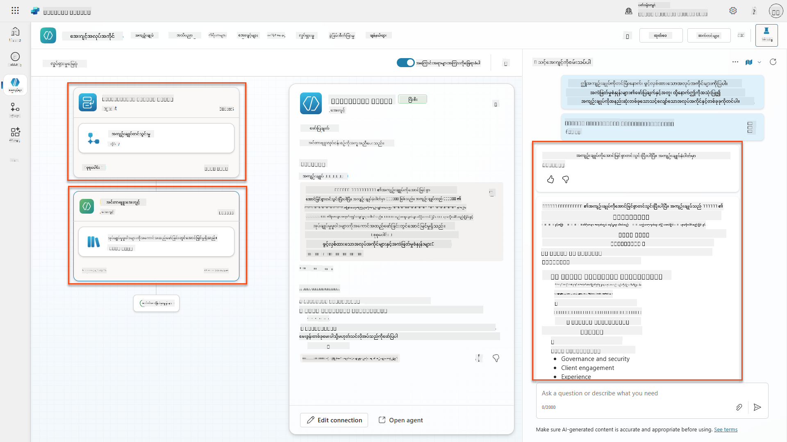

1. Hiring Agent က upload ကို child agent ကို အပ်နှံပြီး Interview Agent ကို summary နဲ့ job role match ကို သူ့ရဲ့ knowledge ကို အသုံးပြုပြီး ပေးဖို့ မေးမြန်းပုံကို သတိပြုပါ။
   Resume, Job Roles နဲ့ Evaluation Criteria အကြောင်းကို မေးမြန်းပုံအမျိုးမျိုးကို စမ်းကြည့်ပါ။
   **ဥပမာများ:**

    ```text
    Give me a summary of active resumes
    ```

    ```text
    Summarize resume R10044
    ```

    ```text
    Which active resumes are suitable for the Power Platform Developer role?
    ```

## 🎉  Mission ပြည့်စုံပါပြီ

အလွန်ကောင်းမွန်တဲ့အလုပ်ပါ၊ Agent! **Operation Symphony** ပြီးမြောက်ပါပြီ။ သင့်ရဲ့ single Hiring Agent ကို အထူးပြုစွမ်းရည်များပါဝင်တဲ့ multi-agent orchestra အဖြစ် အောင်မြင်စွာ ပြောင်းလဲနိုင်ခဲ့ပါပြီ။

ဒီ mission မှာ သင့်ရဲ့ အောင်မြင်မှုတွေကတော့ -

**✅ Multi-agent architecture ကို ကျွမ်းကျင်မှု**  
Child agents နဲ့ connected agents ကို ဘယ်အချိန်မှာ အသုံးပြုရမလဲ၊ နဲ့ စနစ်တွေကို အရွယ်အစားကြီးမားအောင် ဒီဇိုင်းဆွဲပုံကို နားလည်နိုင်ပါပြီ။

**✅ Application Intake child agent**  
Resume တွေကို စစ်ဆေးပြီး၊ candidate data ကို ထုတ်ယူပြီး Dataverse မှာ သိမ်းဆည်းပေးတဲ့ အထူးပြု child agent ကို သင့် Hiring Agent မှာ ထည့်သွင်းနိုင်ခဲ့ပါပြီ။

**✅ Interview Prep connected agent**  
Interview ပြင်ဆင်မှုအတွက် အသုံးပြုနိုင်တဲ့ reusable connected agent ကို တည်ဆောက်ပြီး Hiring Agent နဲ့ အောင်မြင်စွာ ချိတ်ဆက်နိုင်ခဲ့ပါပြီ။

**✅ Agent အချင်းချင်း ဆက်သွယ်မှု**  
Main agent က specialist agents တွေနဲ့ coordinate လုပ်ပုံ၊ context ကို မျှဝေပုံ၊ နဲ့ အဆင့်မြင့် workflows တွေကို စီမံပုံကို မြင်နိုင်ခဲ့ပါပြီ။

**✅ Autonomy အခြေခံအဆောက်အအုံ**  
သင့်ရဲ့ အဆင့်မြှင့် Hiring System က အနာဂတ် mission တွေမှာ ထည့်သွင်းမယ့် အဆင့်မြင့် features တွေ - autonomous triggers, content moderation, နဲ့ deep reasoning အတွက် ပြင်ဆင်ပြီးဖြစ်ပါပြီ။

🚀**Next up:** နောက် mission မှာ သင့် agent ကို email က resume တွေကို autonomous အလုပ်လုပ်နိုင်အောင် configure လုပ်ပုံကို သင်ယူပါမယ်!

⏩[Move to Mission 03: Automate your agent with triggers](../03-automate-triggers/README.md)

## 📚 Tactical Resources

📖 [Add other agents (preview)](https://learn.microsoft.com/microsoft-copilot-studio/authoring-add-other-agents?WT.mc_id=power-182762-scottdurow)

📖 [Add tools to custom agents](https://learn.microsoft.com/microsoft-copilot-studio/advanced-plugin-actions?WT.mc_id=power-182762-scottdurow)

📖 [Work with Dataverse in Copilot Studio](https://learn.microsoft.com/microsoft-copilot-studio/knowledge-add-dataverse?WT.mc_id=power-182762-scottdurow)

📖 [Agent flows overview](https://learn.microsoft.com/microsoft-copilot-studio/flows-overview?WT.mc_id=power-182762-scottdurow)

📖 [Create a solution](https://learn.microsoft.com/power-platform/alm/solution-concepts-alm?WT.mc_id=power-182762-scottdurow)

📖 [Power Platform solution ALM guide](https://learn.microsoft.com/power-platform/alm/overview-alm?WT.mc_id=power-182762-scottdurow)

📺 [Agent-to-agent collaboration in Copilot Studio](https://youtu.be/d-oD3pApHAg?si=rwIHKhJTkjSvhTHw)

---

**အကြောင်းကြားချက်**:  
ဤစာရွက်စာတမ်းကို AI ဘာသာပြန်ဝန်ဆောင်မှု [Co-op Translator](https://github.com/Azure/co-op-translator) ကို အသုံးပြု၍ ဘာသာပြန်ထားပါသည်။ ကျွန်ုပ်တို့သည် တိကျမှုအတွက် ကြိုးစားနေသော်လည်း အလိုအလျောက် ဘာသာပြန်မှုများတွင် အမှားများ သို့မဟုတ် မတိကျမှုများ ပါဝင်နိုင်သည်ကို သတိပြုပါ။ မူရင်းဘာသာစကားဖြင့် ရေးသားထားသော စာရွက်စာတမ်းကို အာဏာတရားရှိသော အရင်းအမြစ်အဖြစ် သတ်မှတ်သင့်ပါသည်။ အရေးကြီးသော အချက်အလက်များအတွက် လူ့ဘာသာပြန်ပညာရှင်များကို အသုံးပြုရန် အကြံပြုပါသည်။ ဤဘာသာပြန်မှုကို အသုံးပြုခြင်းမှ ဖြစ်ပေါ်လာသော အလွဲအမှားများ သို့မဟုတ် အနားယူမှုများအတွက် ကျွန်ုပ်တို့သည် တာဝန်မယူပါ။