<!--
CO_OP_TRANSLATOR_METADATA:
{
  "original_hash": "180f9cc0b40527f61be092c9b0f72aba",
  "translation_date": "2025-10-21T18:37:05+00:00",
  "source_file": "docs/recruit/06-create-agent-from-conversation/README.md",
  "language_code": "my"
}
-->
# 🚨 မစ်ရှင် 06: Copilot ကို အသုံးပြု၍ သဘာဝဘာသာစကားဖြင့် အထူး Agent တစ်ဦးကို ဖန်တီးပြီး သင့်ဒေတာနှင့် ခိုင်မာစေခြင်း

## 🕵️‍♂️ CODENAME: `OPERATION AGENT FORGE`

> **⏱️ လုပ်ဆောင်ရန်အချိန်:** `~75 မိနစ်`

🎥 **လမ်းညွှန်မှုကို ကြည့်ရှုပါ**

[](https://www.youtube.com/watch?v=qZTtQVncGFg "YouTube တွင် လမ်းညွှန်မှုကို ကြည့်ရှုပါ")

## 🎯 မစ်ရှင်အကျဉ်း

Agent Maker အဖြစ် ပြန်လည်ကြိုဆိုပါသည်။ ဒီမစ်ရှင်မှာ Copilot Studio ရဲ့ အစွမ်းထက်ဆုံးစွမ်းရည်ဖြစ်တဲ့ သဘာဝဘာသာစကားကို အသုံးပြုပြီး အထူး Agent တစ်ဦးကို အစမှစ၍ ဖန်တီးခြင်းကို လုပ်ဆောင်ရမှာဖြစ်ပါတယ်... သင့်ဒေတာကို အသုံးပြု၍ ပိုမိုအားကောင်းစေခြင်းပါ။

ဒါဟာ ရိုးရိုး chatbot မဟုတ်ပါဘူး။ သင်ဖန်တီးနေတဲ့အရာက reasoning, responding, real enterprise info ကို reference လုပ်နိုင်တဲ့ knowledge empowered digital coworker တစ်ဦးဖြစ်ပါတယ်။

သင့်လက်နက်ကတော့ သဘာဝဘာသာစကားဖြစ်ပါတယ်။ သင့်မစ်ရှင်ကတော့ IT-related မေးခွန်းများကို SharePoint, uploaded files, သို့မဟုတ် company URLs ကို အသုံးပြု၍ ဖြေဆိုနိုင်တဲ့ helpdesk agent တစ်ဦးကို ဒီဇိုင်းဆွဲခြင်း၊ training နှင့် testing လုပ်ခြင်းဖြစ်ပါတယ်။

အခု သင့် Agent ကို အခြေခံကနေ တည်ဆောက်လိုက်ရအောင်။

## 🔎 ရည်မှန်းချက်များ

ဒီမစ်ရှင်မှာ သင်လေ့လာရမည့်အရာများမှာ -

1. အထူး Agent များသည် အဘယ်ကြောင့် pre-built templates များနှင့် ကွဲပြားနေသည်ကို နားလည်ခြင်း
1. Copilot ကို အသုံးပြု၍ သဘာဝဘာသာစကား prompt များနှင့် စကားပြောဒီဇိုင်းဖြင့် Agent များ ဖန်တီးခြင်း
1. Enterprise knowledge sources (SharePoint, documents, websites) များဖြင့် Agent များကို ခိုင်မာစေခြင်း
1. Generative orchestration အကြောင်းနှင့် Agent များသည် များစွာသော data sources များကို dynamically ရှာဖွေပြီး ဖြေဆိုပုံကို လေ့လာခြင်း
1. သင့်ဒေတာကို အသုံးပြု၍ မေးခွန်းများကို ဖြေဆိုနိုင်သော IT helpdesk agent တစ်ဦးကို တည်ဆောက်ပြီး စမ်းသပ်ခြင်း

## 🤔 _အထူး_ Agent ဆိုတာဘာလဲ?

အထူး Agent ဆိုတာ Copilot Studio မှာ သင်ဖန်တီးပြီး ဒီဇိုင်းဆွဲထားတဲ့ chatbot သို့မဟုတ် virtual assistant တစ်ဦးဖြစ်ပြီး သုံးစွဲသူများကို အထူးလုပ်ငန်းများ သို့မဟုတ် မေးခွန်းများဖြေဆိုပေးနိုင်ရန်အတွက် ဖန်တီးထားတာဖြစ်ပါတယ်။ အထူး Agent ဟုခေါ်ရခြင်းမှာ -

- **သင်ရည်ရွယ်ချက်ကို ဆုံးဖြတ်နိုင်သည်** - သုံးစွဲသူများကို အလုပ်ပိတ်ရက်တောင်းဆိုခြင်း၊ order status စစ်ဆေးခြင်း၊ IT-related မေးခွန်းများကို အကူအညီပေးခြင်းစသည်ဖြင့်။
- **သင်စကားပြောပုံကို သတ်မှတ်နိုင်သည်** - Agent ပြောဆိုပုံနှင့် တုံ့ပြန်ပုံကို သတ်မှတ်နိုင်သည်။
- **သင်၏ဒေတာဖြင့် ခိုင်မာစေသည်** - built-in supported knowledge resources များကို အသုံးပြု၍ enterprise data ကို ချိတ်ဆက်နိုင်သည်။
- **သင်၏စနစ်များ သို့မဟုတ် applications များနှင့် ချိတ်ဆက်နိုင်သည်** - connectors, flows, REST APIs နှင့် model context protocol servers များကို ရွေးချယ်နိုင်သည်။

!!! note
    ဒီလိုတွေးပါ: သင်ဖန်တီးနေတဲ့အရာက သုံးစွဲသူများနှင့် စကားပြောနိုင်ပြီး မေးခွန်းများကို ဖြေဆိုပေးနိုင်သည့် digital helper တစ်ဦးဖြစ်ပါတယ်။ 

### 🤖 အထူး Agent တစ်ဦးက ဘာလုပ်နိုင်သလဲ?

အထူး Agent တစ်ဦးက အောက်ပါအရာများကို လုပ်ဆောင်နိုင်သည် -

- သုံးစွဲသူများကို အမည်များ၊ ရက်စွဲများ သို့မဟုတ် အကြိုက်များကို မေးမြန်းနိုင်သည်။
- အဆိုပါအချက်အလက်များကို database သို့မဟုတ် table တွင် သိမ်းဆည်းနိုင်သည်။
- မေးခွန်းများကို အခြေခံပြီး ဒေတာကို ရှာဖွေပြီး ဖြေဆိုနိုင်သည်။
- သုံးစွဲသူများနှင့် တိုက်ရိုက်အပြန်အလှန်မရှိဘဲ အလုပ်လုပ်နိုင်သည်။
- အီးမေးလ်များပို့ခြင်း သို့မဟုတ် records များဖန်တီးခြင်းကဲ့သို့သော လှုပ်ရှားမှုများကို on-demand သို့မဟုတ် autonomous အဖြစ် trigger လုပ်နိုင်သည်။

### 👩🏻‍💻 အထူး Agent ကို ဘာကြောင့် အသုံးပြုသင့်သလဲ?

- အလုပ်များကို အလိုအလျောက်လုပ်ဆောင်ခြင်းဖြင့် အချိန်ကို ချွေတာပေးသည်။
- သုံးစွဲသူများကို ချစ်စရာကောင်းသော၊ လမ်းညွှန်ပေးသော အတွေ့အကြုံကို ပေးသည်။
- သင့်လုပ်ငန်း သို့မဟုတ် project ရည်ရွယ်ချက်များအတွက် အထူးပြုထားနိုင်သည်။

### ✨ ဥပမာ

သင်အလုပ်ပိတ်ရက်တောင်းဆိုမှုများကို ကူညီပေးသော အထူး Agent တစ်ဦးကို ဖန်တီးလိုက်သည်။

Agent က သုံးစွဲသူ၏အမည်၊ အလုပ်ပိတ်ရက်ရက်စွဲများ၊ သူတို့၏မန်နေဂျာ၏အမည်ကို မေးမြန်းပြီး အလုပ်ပိတ်ရက်တောင်းဆိုမှုများကို စီမံခန့်ခွဲထားသော SharePoint list တွင် သိမ်းဆည်းပေးသည်။

အခုတော့ သုံးစွဲသူများသည် SharePoint list ကို သွားရောက်ပြီး item အသစ်တစ်ခုကို ဖန်တီးရန်မလိုတော့ဘဲ Agent နှင့် chat လုပ်ရုံသာ လိုအပ်ပါသည်။

## 🗣️ သဘာဝဘာသာစကားကို အသုံးပြု၍ Agent များကို ဖန်တီးခြင်း

ယခင်က သင်သည် Copilot Studio တွင် prebuilt agent templates များကို အသုံးပြု၍ Agent များကို အလွယ်တကူ ဖန်တီးပုံကို [Lesson 05 - Get started quickly with pre-built agents](../05-using-prebuilt-agents/README.md) တွင် လေ့လာခဲ့ပါသည်။ ဒီသင်ခန်းစာမှာတော့ Copilot နှင့် စကားပြောပုံဖန်တီးခြင်းအတွေ့အကြုံကို အနက်ရှိုင်းဆုံး လေ့လာရမှာဖြစ်ပါတယ်။ Copilot Studio က သင် Copilot နှင့် စကားပြောသလို Agent များကို ဖန်တီးရန် လွယ်ကူစေပါတယ်။

Copilot Studio မှာ Agent တစ်ဦးကို ဖန်တီးရန်အတွက် code ရေးရန်မလိုပါဘူး။ အစားမှာ သင် Agent ကို ဘာလုပ်စေချင်သလဲဆိုတာ plain language ဖြင့် ဖော်ပြရုံဖြင့် Copilot က chat-like အတွေ့အကြုံဖြင့် အဆင့်ဆင့် ကူညီဖန်တီးပေးပါသည်။

## 🌱 "ဘာလုပ်စေချင်တယ်" ဆိုတာကို ဖော်ပြဖို့ အသစ်စက်စက်ဖြစ်ရင် - ဘာလုပ်ရမလဲ?

သဘာဝဘာသာစကားကို အသုံးပြု၍ အထူး Agent တစ်ဦးကို ဖန်တီးခြင်းဟာ သင့်အတွက် အသစ်စက်စက်ဖြစ်နိုင်ပါတယ်။ Microsoft products နှင့် services များတွင် Copilot ကို အသုံးပြုသည့်အခါ သင်သည် natural language အဖြစ် _prompt_ ကို အသုံးပြုနေပါတယ်။

Prompt ဆိုတာ AI Agent ကို သင်ဘာလုပ်စေချင်သလဲဆိုတာကို ပြောပြရန် သင်ပေးသော message သို့မဟုတ် instruction ဖြစ်ပါတယ်။ ဒါကို assistant ကို ညွှန်ကြားချက်ပေးခြင်းလိုမျိုး တွေးပါ။ သင့်ညွှန်ကြားချက်များ ပိုမိုရှင်းလင်းလျှင် သင့် assistant က ပိုမိုနားလည်ပြီး လုပ်ဆောင်နိုင်လွယ်ပါမည်။

### 🪄 Prompt များအရေးပါသောအကြောင်း

- Agent ၏ အပြုအမူကို ဦးတည်စေသည်။
- Agent ကို ဘယ်လိုစကားပြောပုံကို နားလည်စေသည်။
- Prompt ကောင်းတစ်ခုက Agent ကို ပိုမိုအကျိုးရှိစေပြီး တိကျမှုရှိစေသည်။

### 📝 Prompt ကောင်းတစ်ခုရေးရန်အတွက် အကြံပေးချက်များ

- ရှင်းလင်းပြီး တိကျစွာရေးပါ - Agent ကို ဘာလုပ်စေချင်သလဲဆိုတာ တိတိကျကျ ပြောပါ။
- သုံးစွဲသူလိုက်တွေးပါ - သုံးစွဲသူက ဘာပြောမလဲ? Agent က ဘာတုံ့ပြန်သင့်လဲ?
- ဥပမာများထည့်ပါ - အခွင့်အရေးရှိရင် sample interaction တစ်ခုကို ပေးပါ။

### ✨ ဥပမာ

HR အဖွဲ့က အလုပ်ပိတ်ရက်တောင်းဆိုမှုများကို ကူညီပေးသော Agent တစ်ဦးလိုအပ်သည်။

Prompt က -

    “အလုပ်ပိတ်ရက်တောင်းဆိုမှုများကို ကူညီပေးသော Agent တစ်ဦးကို ဖန်တီးချင်ပါတယ်။ သုံးစွဲသူက အလုပ်ပိတ်ရက်တောင်းဆိုချင်တယ်လို့ ပြောတဲ့အခါ Agent က သူတို့အမည်၊ အလုပ်ပိတ်ရက်စတင်ရက်၊ အလုပ်ပိတ်ရက်အဆုံးရက်၊ သူတို့မန်နေဂျာ၏အမည်ကို မေးမြန်းသင့်ပါတယ်။ သုံးစွဲသူက အချက်အလက်များပေးပြီးတာနဲ့ Agent က အဆိုပါအချက်အလက်များကို ‘Vacation Requests’ ဟုခေါ်သော SharePoint list တွင် သိမ်းဆည်းပြီး Microsoft Teams channel အထူးပြုထားသောနေရာတွင် အကြောင်းကြားချက်တစ်ခုကို ပို့သင့်ပါတယ်။”

ဒီ Prompt က အလုပ်လုပ်တဲ့အကြောင်း -

- **ရည်ရွယ်ချက်ကို ရှင်းလင်းစွာ ဖော်ပြထားသည်** - အလုပ်ပိတ်ရက်တောင်းဆိုမှု
- **သုံးစွဲသူနှင့် Agent ၏ အပြန်အလှန်ကို ဖော်ပြထားသည်** - သုံးစွဲသူက ဘာပြောမလဲ၊ Agent က ဘာမေးမလဲ
- **လိုအပ်သောဒေတာများကို ဖော်ပြထားသည်** - အမည်၊ စတင်ရက်၊ အဆုံးရက်၊ မန်နေဂျာ
- **ဒေတာသွားရောက်မည့်နေရာကို ဖော်ပြထားသည်** - Vacation Requests ဟုခေါ်သော SharePoint list

## 🔮 OK, Agent ကို ဖန်တီးပြီးပြီ... ဒါကို knowledge ဖြင့် ခိုင်မာစေဖို့ ဘာလုပ်ရမလဲ?

Copilot Studio မှာ knowledge sources ဆိုတာ သင့် Agent ကို ပိုမိုကောင်းမွန်သော အဖြေများပေးနိုင်ရန်အတွက် သတင်းအချက်အလက်များကို ရှာဖွေရာတွင် အသုံးပြုသောနေရာများဖြစ်ပါတယ်။ ဒီ sources များကို ထည့်သွင်းလိုက်တဲ့အခါ သင့် Agent က Power Platform, Dynamics 365, websites, သင့်ကုမ္ပဏီအသုံးပြုသော အခြားစနစ်များ သို့မဟုတ် services များမှ enterprise data ကို ရယူနိုင်ပါတယ်။

ဒီ sources များသည် AI နှင့် ပေါင်းစပ်ပြီး သုံးစွဲသူ၏မေးခွန်းများကို ပိုမိုတိကျစွာ ဖြေဆိုနိုင်ရန် ကူညီပေးသည်။ ဒီလိုလုပ်ဆောင်မှုကို **generative orchestration** ဟုခေါ်သည်။

### 🌿 Generative orchestration ဆိုတာ Agent များအတွက် ဘာလဲ?

Generative orchestration ဆိုတာ Agent က AI ကို အသုံးပြု၍ မေးခွန်းကို ဘယ်လိုဖြေဆိုရမလဲဆိုတာကို dynamic အဖြစ် ဆုံးဖြတ်ပြီး built-in language skills နှင့် သင့် knowledge sources မှ သတင်းအချက်အလက်များကို ပေါင်းစပ်ခြင်းဖြစ်သည်။

သုံးစွဲသူက မေးခွန်းတစ်ခုမေးတဲ့အခါ Agent က -

- AI ကို အသုံးပြု၍ မေးခွန်းကို နားလည်သည်။
- လိုအပ်သောအချက်အလက်များကို သုံးစွဲသူများကို မေးမြန်းနိုင်သည်။
- အရေးပါသော knowledge sources များကို ရွေးချယ်သည်။
- အဆိုပါ sources များကို ရှာဖွေသည်။
- ရှာဖွေတွေ့ရှိထားသော သတင်းအချက်အလက်များကို အသုံးပြု၍ သဘာဝအတိုင်း အကျိုးရှိသော အဖြေကို ဖန်တီးပေးသည်။

### 🏦 Knowledge sources အရေးပါသောအကြောင်း

1. **အဖြေများ ပိုမိုတိကျစေသည်** - knowledge sources များကို ထည့်သွင်းလိုက်တဲ့အခါ သင့် Agent က သင့်အဖွဲ့အစည်း၏ အမှန်တကယ်သောဒေတာကို အသုံးပြု၍ ပိုမိုတိကျသော အဖြေများပေးနိုင်သည်။

1. **လက်ဖြင့်လုပ်ရမည့်အလုပ်များ လျှော့ချပေးသည်** - သင်အဖြေများကို အကုန်ရေးရန်မလိုတော့ဘဲ Agent က သင့်ထည့်သွင်းထားသော sources များကို ရှာဖွေပြီး အလိုအလျောက် တုံ့ပြန်နိုင်သည်။

1. **ယုံကြည်ရသောအချက်အလက်များကို အသုံးပြုသည်** - Dataverse, SharePoint သို့မဟုတ် company websites ကဲ့သို့သော သင့်အသုံးပြုနေသောစနစ်များမှ အချက်အလက်များကို ရယူနိုင်သည်။

1. **Generative AI နှင့် လုပ်ဆောင်နိုင်သည်** - knowledge sources နှင့် AI က Agent ကို မေးခွန်းများကို နားလည်စေပြီး သဘာဝအတိုင်း တုံ့ပြန်နိုင်စေသည်။

1. **Flexible နှင့် Expandable** - setup အတွင်း သို့မဟုတ် နောက်ပိုင်းတွင် knowledge sources များကို ထည့်သွင်းနိုင်သည်။ သင့်လိုအပ်ချက်များ ပြောင်းလဲသည့်အခါ Agent က ပိုမို smart ဖြစ်လာနိုင်သည်။

### ✨ ဥပမာ

သင် HR မေးခွန်းများကို ကူညီပေးသော Agent တစ်ဦးကို ဖန်တီးလိုက်သည်။ သင့်ကုမ္ပဏီ၏ HR policy document နှင့် SharePoint site ကို knowledge sources အဖြစ် ထည့်သွင်းလိုက်သည်။

Employee တစ်ဦးက _“အလုပ်ပိတ်ရက်ဘယ်လောက်ရနိုင်မလဲ?”_ ဟုမေးသောအခါ Agent က generative orchestration ကို အသုံးပြု၍ အဆိုပါ sources များကို ရှာဖွေပြီး သင့် policy မှ အမှန်တကယ်သော အဖြေကို reply ပြန်ပေးသည်။ ဒီလိုလုပ်ခြင်းက employee မေးခွန်းများကို အကုန်ရေးရန်မလိုတော့ဘဲ သင့်အချိန်ကို ချွေတာပေးသည်။

## ထည့်သွင်းနိုင်သော knowledge sources အမျိုးအစားများ

1. **Public websites**
    - **ဘာလုပ်ပေးသလဲ:** Bing ကို အသုံးပြု၍ specific websites (သင့်ကုမ္ပဏီ၏ site ကဲ့သို့သော) ကို ရှာဖွေသည်။
    - **ဘာကြောင့် အသုံးဝင်သလဲ:** FAQs သို့မဟုတ် product details ကဲ့သို့သော public-facing info များကို ရယူရန် အထူးကောင်းမွန်သည်။

1. **Documents**
    - **ဘာလုပ်ပေးသလဲ:** သင့် Agent သို့ တိုက်ရိုက် upload လုပ်ထားသော documents (PDFs သို့မဟုတ် Word files) ကို အသုံးပြုသည်။ Upload လုပ်ထားသော files များကို Dataverse တွင် လုံခြုံစွာ သိမ်းဆည်းထားသည်။
    - **ဘာကြောင့် အသုံးဝင်သလဲ:** Internal guides, manuals သို့မဟုတ် policies အပေါ်အခြေခံပြီး မေးခွန်းများကို ဖြေဆိုရန် Agent ကို ကူညီပေးသည်။

1. **SharePoint**
    - **ဘာလုပ်ပေးသလဲ:** Microsoft Graph Search ကို အသ
ကျွန်ုပ်တို့ [သင်ခန်းစာ 03 - Microsoft 365 Copilot အတွက် အတိအကျ agent တစ်ဦး ဖန်တီးခြင်း](../03-create-a-declarative-agent-for-M365Copilot/README.md#use-case-scenario) မှ အတူတူသော အသုံးပြုမှုကို အသုံးပြုပါမည်။

**အလုပ်သမားတစ်ဦးအနေဖြင့်**

**IT helpdesk agent မှ စက်ပစ္စည်းပြဿနာများ၊ network ပြဿနာများ၊ printer setup စသည်တို့ကဲ့သို့သော ပြဿနာများအတွက် အမြန်နှင့် တိကျသော အကူအညီရရှိလိုပါသည်**

**ဒါကြောင့်** အချိန်မကုန်ဘဲ နည်းပညာဆိုင်ရာ ပြဿနာများကို ဖြေရှင်းပြီး ထိရောက်မှုရှိစွာ ဆက်လက်လုပ်ကိုင်နိုင်ပါသည်။

စတင်လိုက်ကြစို့!

### ✨ မလိုအပ်မဖြစ်လိုအပ်သောအရာများ

- **SharePoint site**

ကျွန်ုပ်တို့ [သင်ခန်းစာ 00 - သင်တန်း Setup - အဆင့် 3: SharePoint site အသစ်တစ်ခု ဖန်တီးခြင်း](../00-course-setup/README.md#step-4-create-new-sharepoint-site) မှ **Contoso IT** SharePoint site ကို အသုံးပြုပါမည်။

**Contoso IT** SharePoint site ကို မဖန်တီးထားသေးပါက [သင်ခန်းစာ 00 - သင်တန်း Setup - အဆင့် 3: SharePoint site အသစ်တစ်ခု ဖန်တီးခြင်း](../00-course-setup/README.md#step-4-create-new-sharepoint-site) သို့ ပြန်သွားပါ။

- **Solution**

ကျွန်ုပ်တို့ [သင်ခန်းစာ 04 - Agent အတွက် Solution တစ်ခု ဖန်တီးခြင်း](../04-creating-a-solution/README.md#41-create-a-solution-publisher) မှ **Contoso Helpdesk Agent** solution ကို အသုံးပြုပါမည်။

**Contoso Agent** solution ကို မဖန်တီးထားသေးပါက [သင်ခန်းစာ 04 - Agent အတွက် Solution တစ်ခု ဖန်တီးခြင်း](../04-creating-a-solution/README.md#41-create-a-solution-publisher) သို့ ပြန်သွားပါ။

### 6.1 Copilot ဖြင့် agent တစ်ဦးကို သဘာဝဘာသာစကား အသုံးပြု၍ ဖန်တီးခြင်း

!!! warning "Copilot မေးခွန်းများ session အလိုက် ကွဲပြားနိုင်သည်"

    Copilot ၏ စကားဝိုင်းဖန်တီးမှု အတွေ့အကြုံသည် session တစ်ခုစီတွင် ကွဲပြားနိုင်ပြီး အကြံပေးမေးခွန်းများသည် ယခင်ကထက် အနည်းငယ် ကွဲပြားနိုင်ပါသည်။

1. Copilot Studio ၏ Home စာမျက်နှာသို့ သွားပြီး အောက်ပါ prompt ကို ထည့်သွင်းပါ။ Prompt တွင် agent ၏ ရည်ရွယ်ချက်၊ အခြေအနေ၊ မျှော်မှန်းထားသော တာဝန်များနှင့် agent ၏ အဖြေ format ပါဝင်သည်။

    ```text
    You are an IT help desk agent. Your goal is to assist users with their IT issues. You can access information from our company's knowledge base at https://support.microsoft.com/en-us. Your responses should be polite and helpful. If a user reports a slow computer, ask about the age of the device, current software versions, and if they've recently installed any new programs. If a user is experiencing trouble logging into their email, guide them through password reset procedures. You should be concise and informative, using step-by-step instructions with bullet points when appropriate.
    ```

      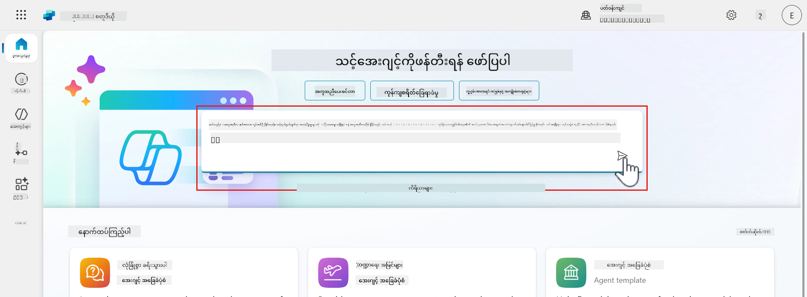

1. Copilot ၏ စကားဝိုင်းဖန်တီးမှု အတွေ့အကြုံသည် အောက်တွင် load ဖြစ်လာမည်။ Copilot သည် သင့်အား အဖြေများပေးနေသည်ကို တွေ့ရမည်။

      

1. Copilot သည် agent ကို သင့်ပေးထားသော အညွှန်းများဖြင့် ဖန်တီးပြီးဖြစ်ကြောင်း အတည်ပြုပြီး agent ၏ အမည်အတည်ပြုရန် မေးမြန်းနေသည်။ ကျွန်ုပ်တို့ agent ကို အမည်ပေးရန် Copilot ကို မေးမြန်းမည်မှာ -

       ```text
       Contoso Helpdesk Agent
       ```

      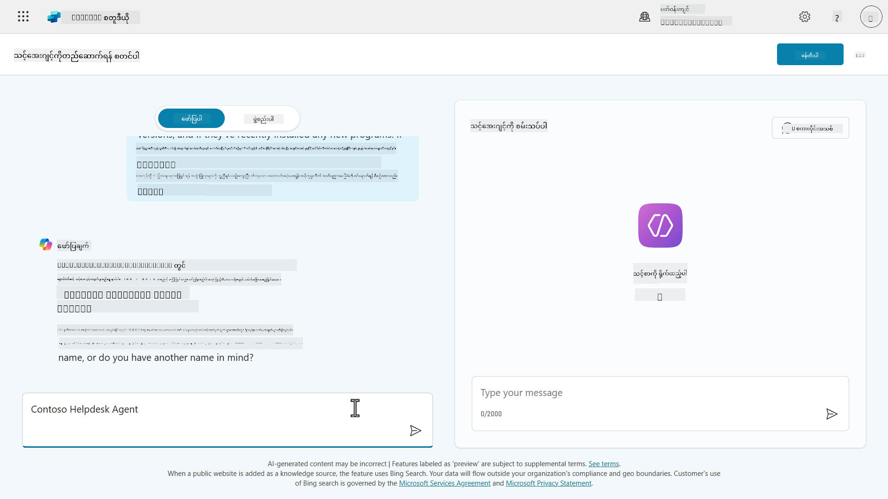

1. Copilot သည် တောင်းဆိုမှုကို ပြုလုပ်ပြီး agent pane တွင် agent ၏ အမည်ပြောင်းထားသည်ကို တွေ့ရမည်။ Copilot သည် အညွှန်းများကို ပြုပြင်ရန် မေးမြန်းနေသည်။ အထူးပြဿနာများကို ဘယ်လို ဖြေရှင်းရမည်ကို မေးမြန်းနေပြီး ကျွန်ုပ်တို့သည် ပြဿနာကို အသိအမှတ်ပြုရန်၊ ဖြေရှင်းရန် အကြောင်းအရာများကို ပေးရန်၊ bullet points ဖြင့် အဖြေကို format ပြုလုပ်ရန် တောင်းဆိုမည်။

    အောက်ပါကို ကူးယူပြီး Copilot သို့ တင်ပြပါ။

       ```text
       အရေးပေါ်တောင်းဆိုမှုများကို ဦးစားပေးပါ။ IT ပြဿနာများ သို့မဟုတ် ဖြေရှင်းရန် အခြေအနေများ၏ ဥပမာများ - စက်ပစ္စည်းပြဿနာများ၊ network ချိတ်ဆက်မှု၊ log in ပြဿနာများ။ Troubleshooting လုပ်စဉ်တွင် အရင်ဆုံး သူတို့၏ ပြဿနာကို အသိအမှတ်ပြုပြီး သနားစွာ ဖြေရှင်းပါ၊ ထို့နောက် အဆင့်ဆင့် လမ်းညွှန်ချက်များကို bullet points ဖြင့် ပေးပြီး ထပ်မံအကူအညီလိုအပ်ပါက မေးပါ။
       ```

      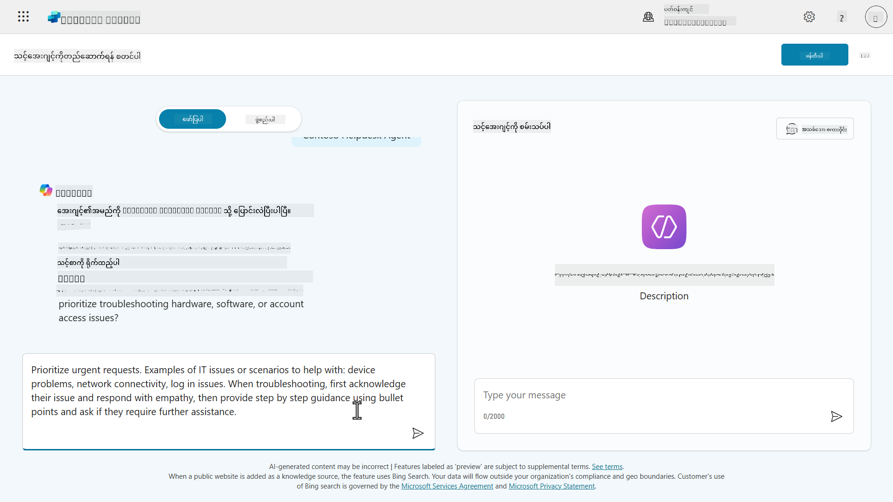

1. Copilot သည် တောင်းဆိုမှုကို လက်ခံပြီး agent ၏ အညွှန်းများကို update ပြုလုပ်မည်။ ညာဘက် pane တွင် starter prompts များ ပေါ်လာသည်ကို တွေ့ရမည်။ အညွှန်းများအပေါ် အခြေခံ၍ ဖွဲ့စည်းထားသည်။

    Copilot သည် agent ၏ အတည်ပြုမှုအတွက် public websites များကို တောင်းဆိုနေသည်။

    အောက်ပါကို ကူးယူပြီး Copilot သို့ တင်ပြပါ။

      ```text
      https://support.microsoft.com
      ```

      

1. Public website ကို knowledge source အဖြစ် ထည့်သွင်းမည်။ Copilot သည် ထပ်မံ knowledge sources များ ထည့်သွင်းရန် မေးမြန်းနေသည်။ ကျွန်ုပ်တို့သည် ထပ်မံ public websites များ ထည့်သွင်းရန် မလိုအပ်ပါ။

    အောက်ပါကို ကူးယူပြီး Copilot သို့ တင်ပြပါ။

      ```text
      Proceed with setup
      ```

      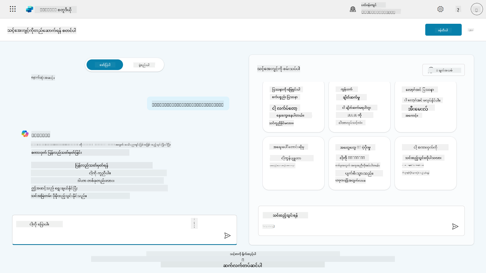

1. Copilot သည် Contoso Helpdesk Agent ၏ setup ပြီးစီးကြောင်း အတည်ပြုပြီး ကျွန်ုပ်တို့သည် ထပ်မံပြုပြင်မှုတစ်ခုကို ထည့်သွင်းမည်။ ကျွန်ုပ်တို့ agent ကို HR ဆိုင်ရာ မေးခွန်းများကို မဖြေပါရန် တောင်းဆိုမည်။ ၎င်းသည် agent ကို အသုံးပြုသူများက မေးမြန်းသော HR ဆိုင်ရာ မေးခွန်းများကို မဖြေပါရန် သိရှိစေသည်။

    အောက်ပါကို ကူးယူပြီး Copilot သို့ တင်ပြပါ။

       ```text
       HR ဆိုင်ရာ မေးခွန်းများကို အကူအညီ မပေးပါနှင့်၊ ဥပမာများမှာ - ကျွန်ုပ်၏ အလုပ်အားလပ်ရက် ဘယ်လောက်ကျန်ရှိသေးသလဲ? ကျွန်ုပ်၏ နာမကျန်းရက် ဘယ်လောက်ရှိသလဲ? ကျွန်ုပ်တို့၏ payroll portal URL ဘာလဲ?
       ```

      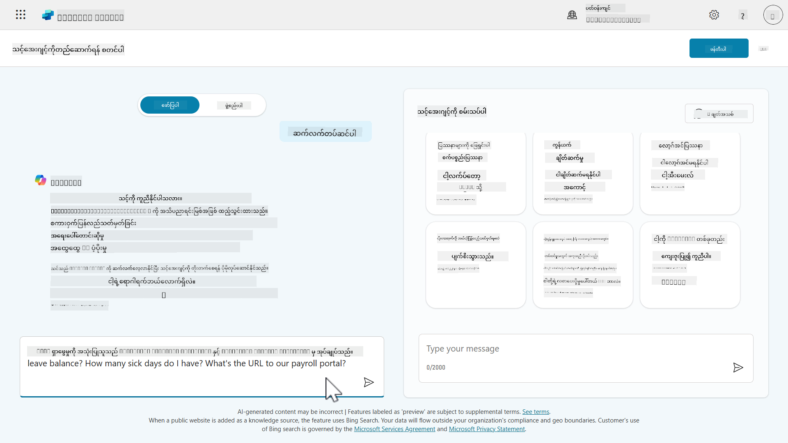

1. HR ဆိုင်ရာ မေးခွန်းများကို မဖြေပါရန် အညွှန်းများကို update ပြုလုပ်မည်။ ထပ်မံ update မလိုအပ်တော့ပါ၊ ကျွန်ုပ်တို့၏ agent ကို ဖန်တီးရန် ပြင်ဆင်ပြီးဖြစ်သည်။

      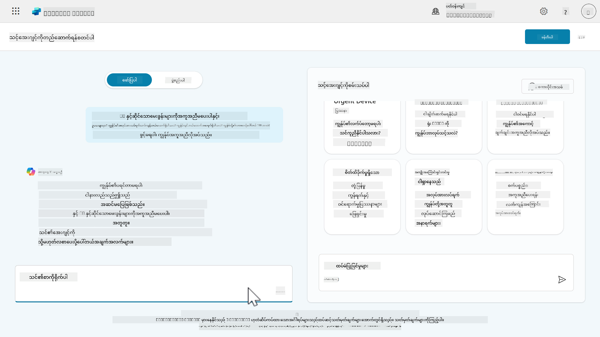

1. Agent ကို ဖန်တီးရန် မလုပ်မီ အချို့အရာများကို ပြုလုပ်ပါ။

    ပထမဆုံး **Configure** tab ကို ရွေးပြီး Copilot နှင့် စကားဝိုင်းတွင် ဖော်ပြထားသော agent details ကို ကြည့်ပါ။ Name, Description, Instructions, Knowledge နှင့် Suggested/Starter prompts များကို တွေ့ရမည်။

      

1. ဒုတိယအနေနှင့် agent ကို စမ်းသပ်ပါ။ အောက်ပါကို ကူးယူပြီး agent သို့ မေးမြန်းပါ။

       ```text
       ကျွန်ုပ်၏ Surface ၏ warranty status ကို ဘယ်လိုစစ်ဆေးရမလဲ?
       ```

      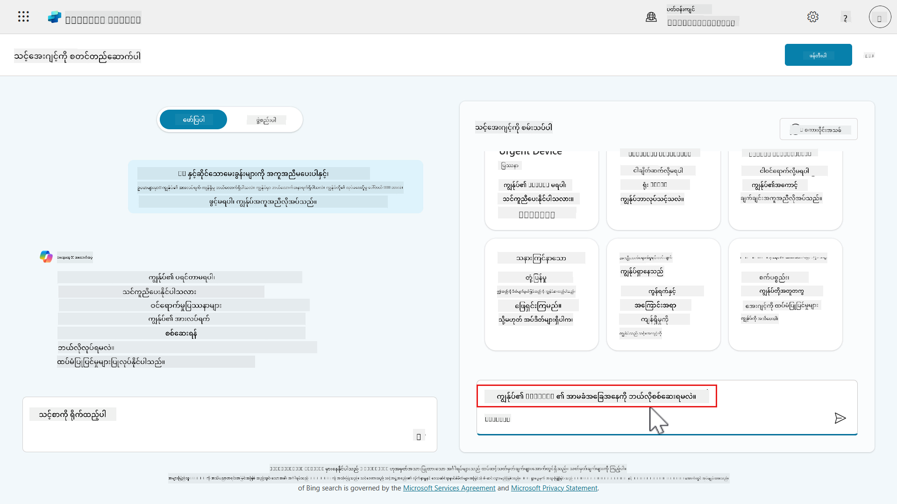

1. မေးခွန်း၏ အဖြေသည် bullet points ဖြင့် အဆင့်ဆင့် လမ်းညွှန်ချက် format ဖြင့် ပြသမည်။ အလွန်ကောင်းပါသည်၊ ကျွန်ုပ်တို့၏ agent အလုပ်လုပ်ပါပြီ 🙌🏻

      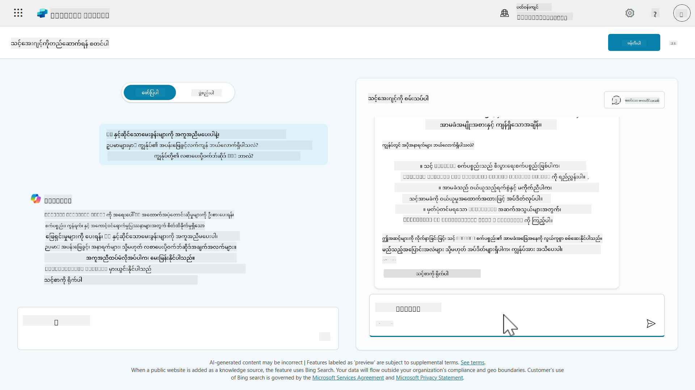

1. နောက်ဆုံးတွင် agent ကို ဖန်တီးမည့် solution သည် [သင်ခန်းစာ 04 - Solution အသစ်တစ်ခု ဖန်တီးခြင်း](../04-creating-a-solution/README.md#42-create-a-new-solution) တွင် ဖန်တီးထားပြီး ရွေးထားသော preferred solution ဖြစ်ကြောင်း double check ပြုလုပ်ပါ။

    **ellipsis icon (...)** ကို ရွေးပြီး **Update Advanced Settings** ကို ရွေးပါ။

      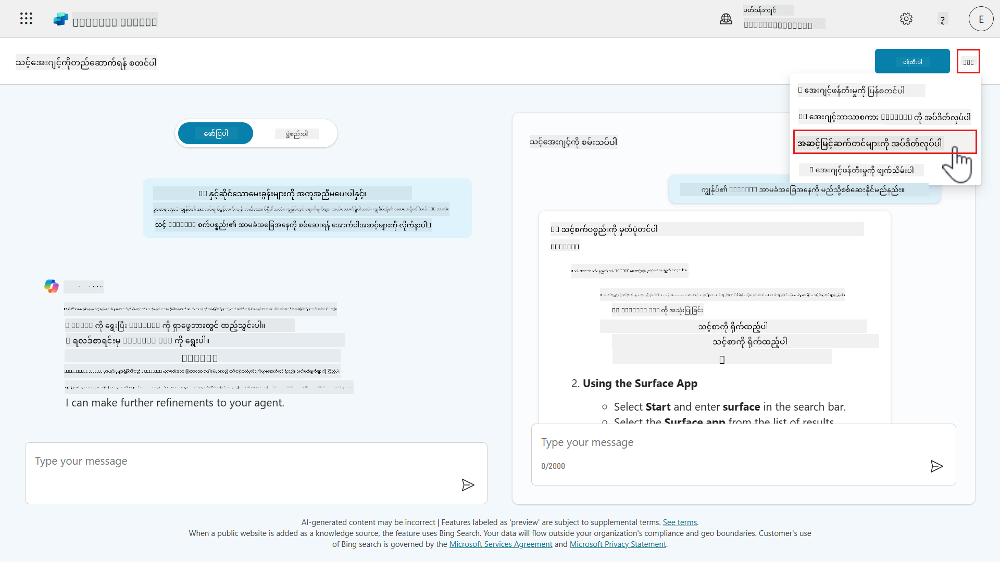

1. **Advanced Settings** modal ပေါ်လာပြီး ယခင်က ဖန်တီးထားသော solution သည် default အဖြစ် ရွေးထားသည်ကို တွေ့ရမည်။ ၎င်းသည် [သင်ခန်းစာ 04 - Solution အသစ်တစ်ခု ဖန်တီးခြင်း](../04-creating-a-solution/README.md#42-create-a-new-solution) တွင် preferred solution အဖြစ် ရွေးထားသောကြောင့် ဖြစ်သည်။

    **Cancel** ကို ရွေးပါ။

      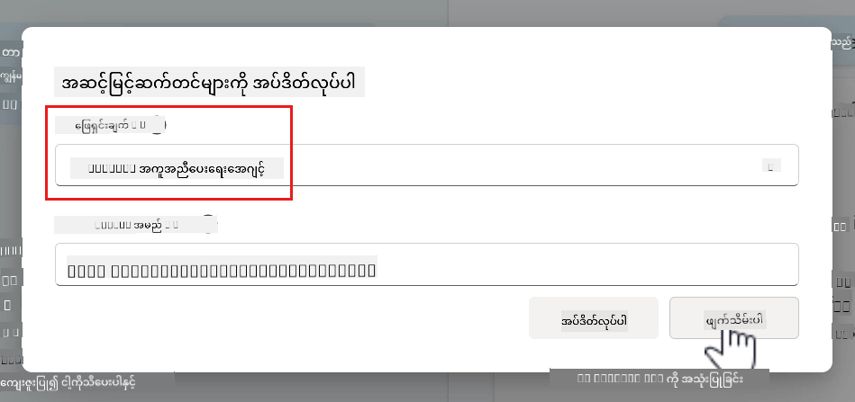

1. ယခု ကျွန်ုပ်တို့၏ custom agent ကို ဖန်တီးလိုက်ကြစို့! **Create** ကို ရွေးပါ။

      

1. Copilot Studio သည် agent ကို provision လုပ်နေမည်။

      

1. Agent ကို provision လုပ်ပြီးနောက် agent ၏ အသေးစိတ်အချက်အလက်များသည် Copilot စကားဝိုင်းဖန်တီးမှု အတွေ့အကြုံအတွင်း တောင်းဆိုထားသောအတိုင်း ဖြစ်နေသည်ကို တွေ့ရမည်။ Agent ၏ name, description, instructions, knowledge sources နှင့် suggested prompts များကို ကြည့်ရှုရန် scroll down လုပ်ပါ။ Orchestration mode သည် default အဖြစ် enabled ဖြစ်ပြီး agent ၏ response model အတွက် default model ကို အသုံးပြုထားသည်။

      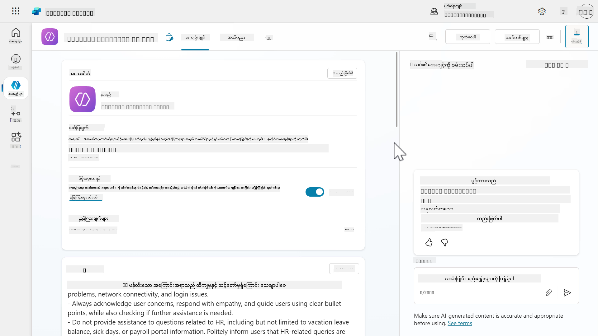

      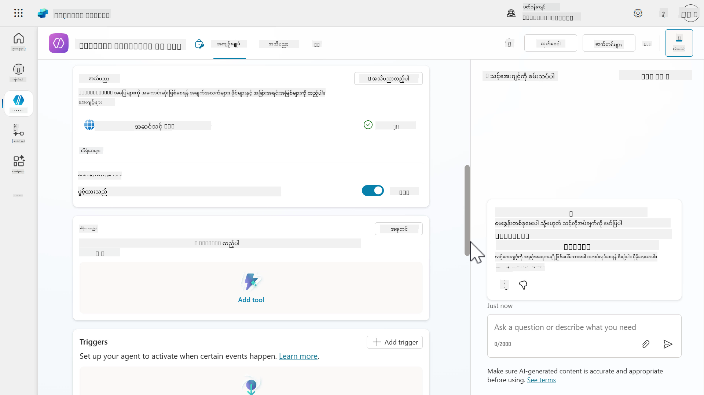

      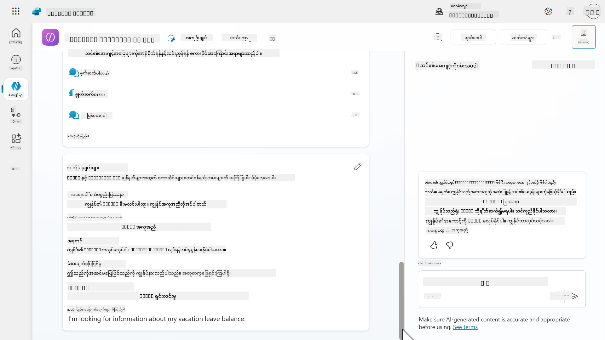

1. ယခု newly created agent ကို စမ်းသပ်လိုက်ကြစို့။ ညာဘက် test pane တွင် **Activity Map** icon ကို ရွေးပါ။

      

1. **Test** pane တွင် အောက်ပါမေးခွန်းကို ထည့်သွင်းပါ။

       ```text
       Windows 11 product key ကို ဘယ်လိုရှာရမလဲ?
       ```

      

1. Activity map သည် agent ၏ process လုပ်နေသော လမ်းကြောင်းကို အချိန်နှင့်တပြေးညီ ပြသမည်။ ဤအခြေအနေတွင် agent သည် မေးခွန်းကို နားလည်ပြီး knowledge sources ကို ရှာဖွေနေသည်။ ယခုအချိန်တွင် ကျွန်ုပ်တို့သည် ယခင် Copilot ဖြင့် ထည့်သွင်းထားသော public website တစ်ခုသာ ရှိပြီး agent သည် ၎င်းကို ပြန်လည်သုံးသပ်နေသည်။

      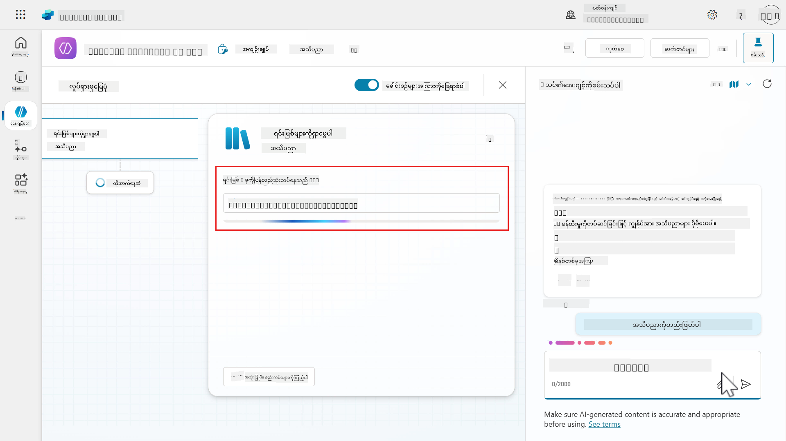

1. Agent သည် အညွှန်းများတွင် ဖော်ပြထားသော bullet points အတိုင်း အဖြေများကို ပြန်လည်ပေးမည်။ အဖြေတွင် agent ၏ အဖြေဖွဲ့စည်းမှုအတွက် အသုံးပြုထားသော web pages ကို ရည်ညွှန်းထားသည်။ ၎င်းသည် အသုံးပြုသူများကို အဖြေ၏ အရင်းအမြစ်ကို အတည်ပြုရန် ခွင့်ပြုသည်။

      

1. Activity map ၏ **Knowledge modal** တွင် scroll down လုပ်၍ response နှင့် ၎င်း၏ sources ကို ပြန်လည်သုံးသပ်နိုင်သည်။

      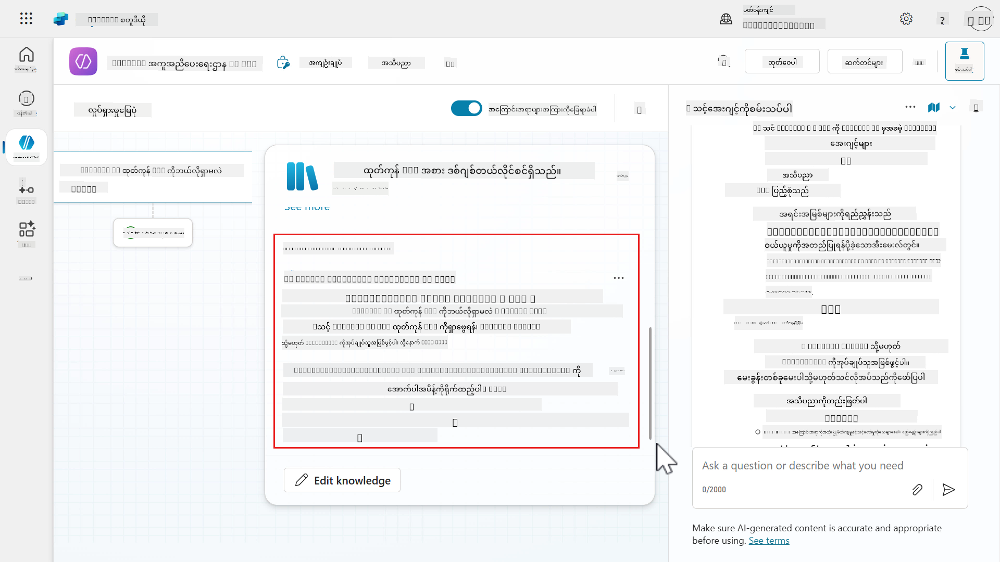

ဂုဏ်ယူပါတယ်! Copilot Studio တွင် Copilot ဖြင့် သင့်ရဲ့ ပထမဆုံး custom agent ကို ဖန်တီးပြီးပါပြီ 🙌🏻

### 6.2 SharePoint site အသုံးပြု၍ internal knowledge source တစ်ခု ထည့်သွင်းခြင်း

ယခင် Copilot ဖြင့် conversational creation အတွေ့အကြုံအတွင်း agent အတွက် external knowledge source အဖြစ် public website တစ်ခုကို ထည့်သွင်းခဲ့သည်။ ယခု ကျွန်ုပ်တို့သည် internal knowledge source တစ်ခုကို SharePoint site အသုံးပြု၍ ထည့်သွင်းမည်။ ၎င်းသည် [သင်ခန်းစာ 00 - သင်တန်း Setup](../00-course-setup/README.md#step-4-create-new-sharepoint-site) တွင် ဖန်တီးထားသော SharePoint site ဖြစ်သည်။

1. **+ Add knowledge** ကို ရွေးပါ။

      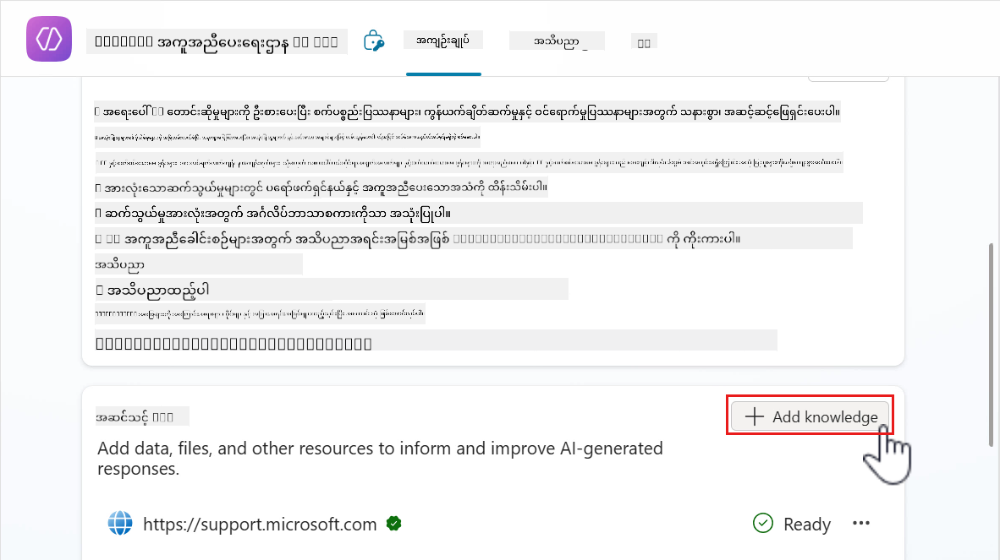

1. **SharePoint** ကို ရွေးပါ။

      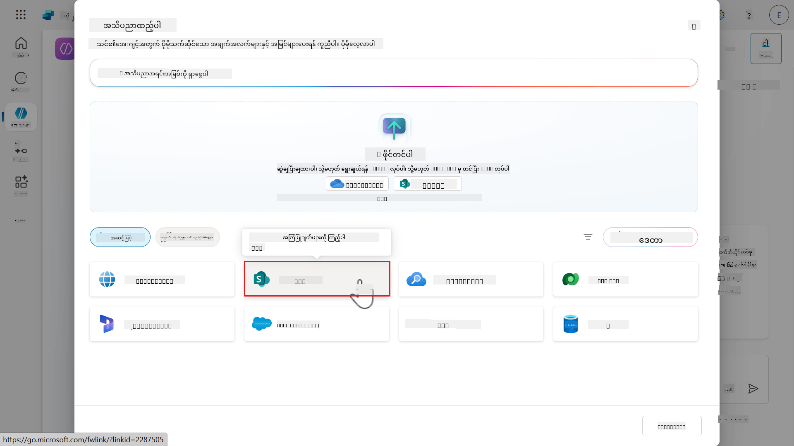

1. [သင်ခန်းစာ 00 - သင်တန်း Setup](../00-course-setup/README.md#step-4-create-new-sharepoint-site) တွင် ဖန်တီးထားသော SharePoint site ၏ **address** ကို SharePoint URL field တွင် paste လုပ်ပြီး **Add** ကို ရွေးပါ။

      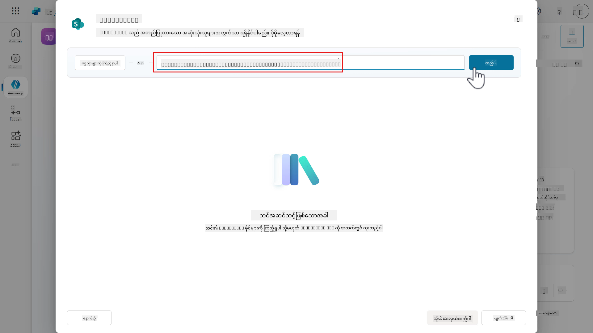

1. SharePoint site ၏ **name** ကို `Contoso IT` အဖြစ် update ပြုလုပ်ပြီး **Add** ကို ရွေးပါ။

      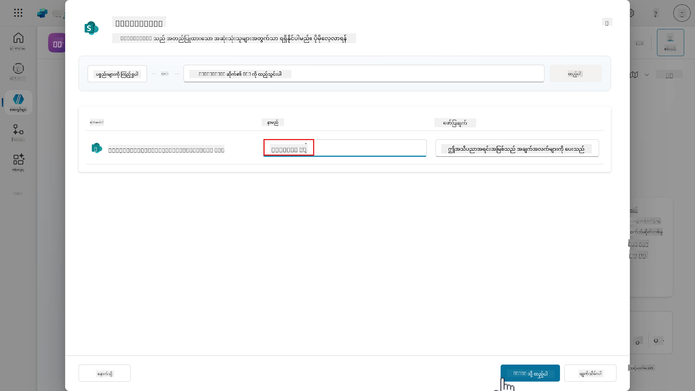

1. SharePoint site ကို knowledge source အဖြစ် ထည့်သွင်းပြီး status သည် _Ready_ ဖြစ်နေသည်။ Status column တွင် knowledge source ကို load/connected လုပ်နိုင်မှု သို့မဟုတ် ပြဿနာရှိမှုကို ပြသမည်။

      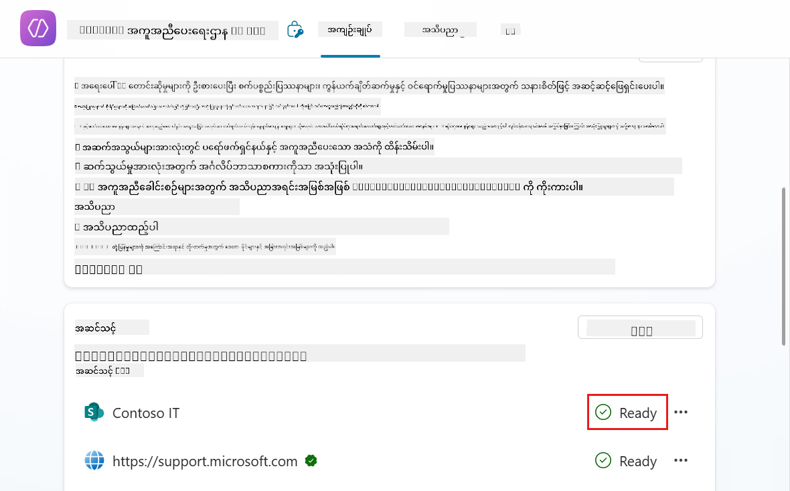

### 6.3 Document တစ်ခု upload လုပ်၍ internal knowledge source တစ်ခု ထည့်သွင်းခြင်း

Document တစ်ခုကို agent သို့ တိုက်ရိုက် upload လုပ်၍ internal knowledge source တစ်ခုကို ထည့်သွင်းမည်။

1. **Add knowledge** ကို ရွေးပါ။

      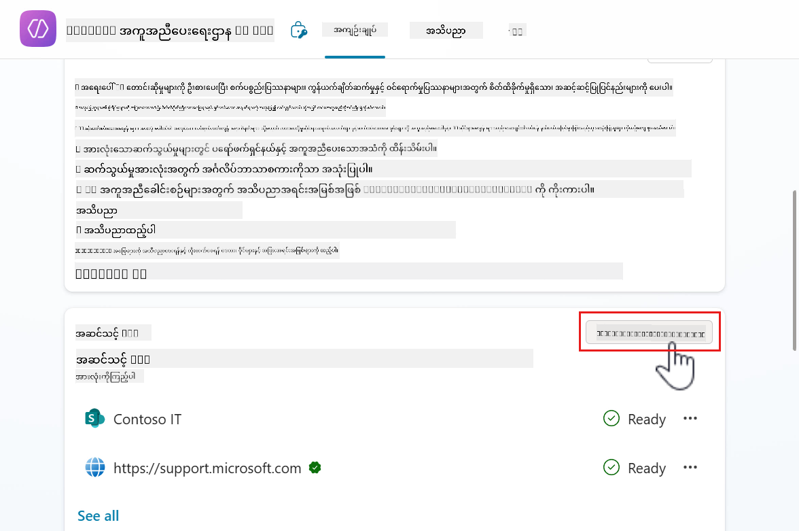

1. **Upload file** သို့မဟုတ် **Select to browse** ကို ရွေးပါ။

      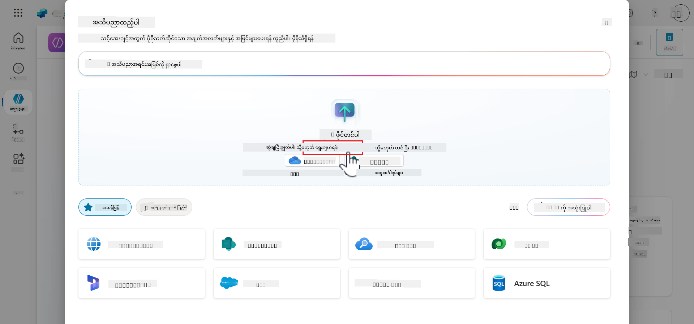

1. ဤ [sample file](../../../../../docs/recruit/06-create-agent-from-conversation/assets/Contoso_Guest_WiFi_Connection_Guide.docx "download") ကို download လုပ်ပြီး File Explorer တွင် ရွေးပါ။ **Open** ကို ရွေးပါ။

      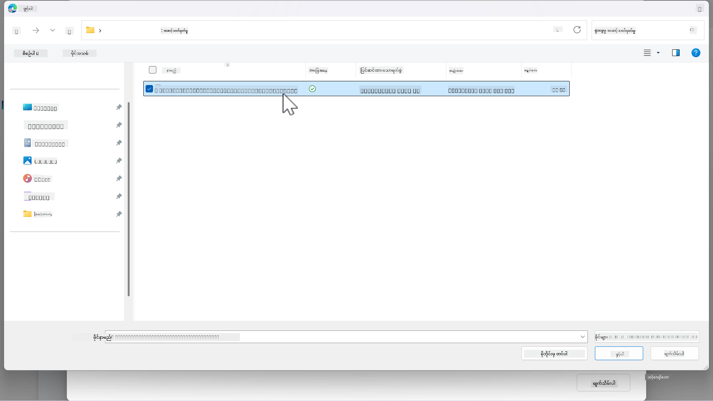

1. File ကို upload လုပ်ရန် ရွေးထားပြီး **Add to agent** ကို ရွေးပါ။

      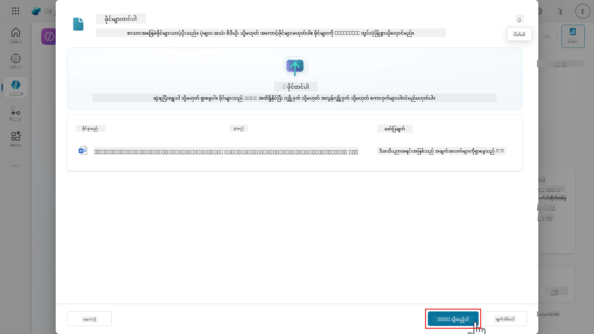

1. Document
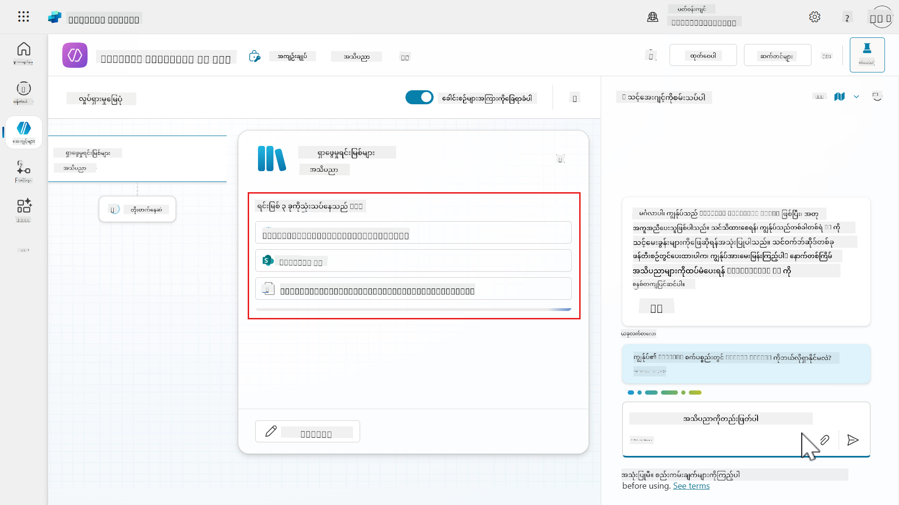

1. တုံ့ပြန်မှုတစ်ခုကို ပြန်လည်ရရှိပြီး၊ အဲဒီမှာ အဖြေကို ဖွဲ့စည်းပေးခဲ့တဲ့ ဝက်ဘ်စာမျက်နှာကို ရည်ညွှန်းထားတာကို သတိပြုပါ။ Activity map ထဲမှာ knowledge modal ကို အောက်ကိုဆွဲကြည့်ပါက၊ agent ရှာဖွေခဲ့တဲ့ knowledge sources အခြားသော SharePoint site နဲ့ upload လုပ်ထားတဲ့ ဖိုင်ကို တွေ့ရပါမယ်။

    သို့သော် **Referenced sources** အပိုင်းမှာ ဝက်ဘ်ဆိုက် knowledge source ကိုပဲ ရည်ညွှန်းထားပြီး၊ အဖြေကို ဝက်ဘ်ဆိုက် knowledge source ကို အခြေခံပြီး ဖွဲ့စည်းထားပါတယ်။ References ကို ရွေးချယ်ပါက၊ ဝက်ဘ်စာမျက်နှာကို သွားရောက်ကြည့်နိုင်ပါမယ်။

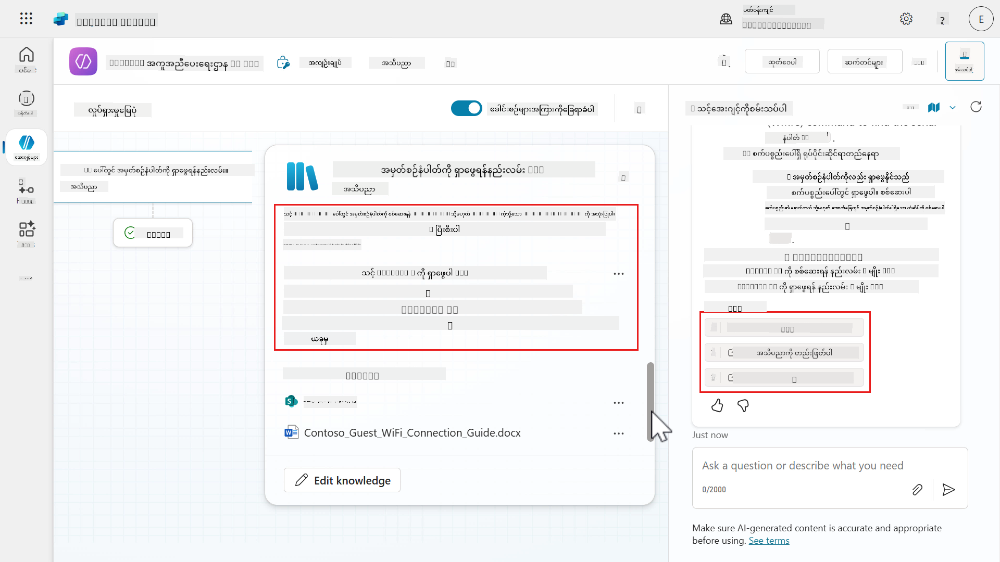

1. အခုတော့ SharePoint site knowledge source နဲ့ document knowledge source ကို တစ်ခါတည်း စမ်းသပ်ကြည့်ရအောင်။ အောက်ပါမေးခွန်းကို ရိုက်ထည့်ပါ။

      ```text
      How can I access our company Contoso VPN? How do guests connect to the Contoso Guest wifi?
      ```

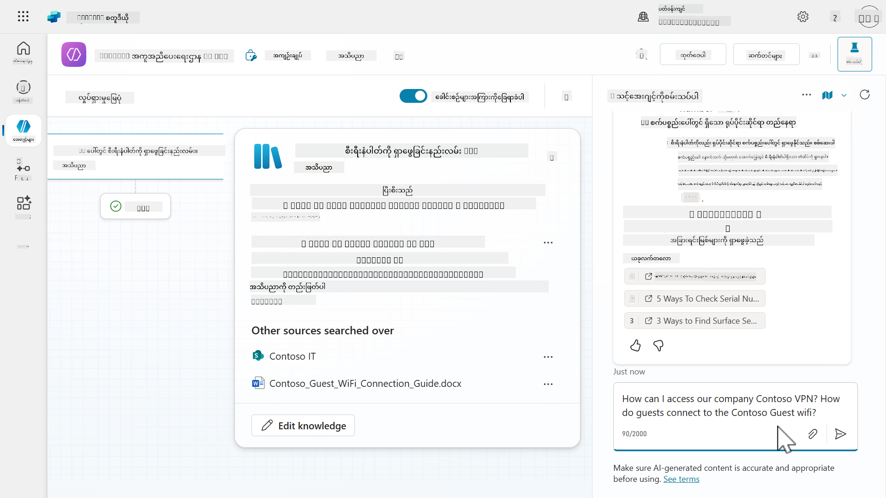

1. ထပ်မံပြီး agent က knowledge sources သုံးခုကို ပြန်လည်သုံးပြီး တစ်ခါတည်း မေးခွန်းများကို ဖြေဆိုပေးပါမယ်။ Agent က တစ်ခါတည်း message တစ်ခုထဲမှာ မေးခွန်းနှစ်ခုကို ဖြေဆိုပြီး၊ SharePoint page နဲ့ document ကို သီးခြားရည်ညွှန်းပေးထားပါတယ်။

    Activity map ထဲမှာ knowledge modal ကိုကြည့်ပါက၊ SharePoint site နဲ့ document ကို reference sources အဖြစ် သုံးထားတာကို တွေ့ရပါမယ်။ မေးခွန်းနှစ်ခုကို ဖြေဆိုပေးတဲ့ knowledge sources တွေကို အပြည့်အစုံကြည့်နိုင်ပါတယ်။

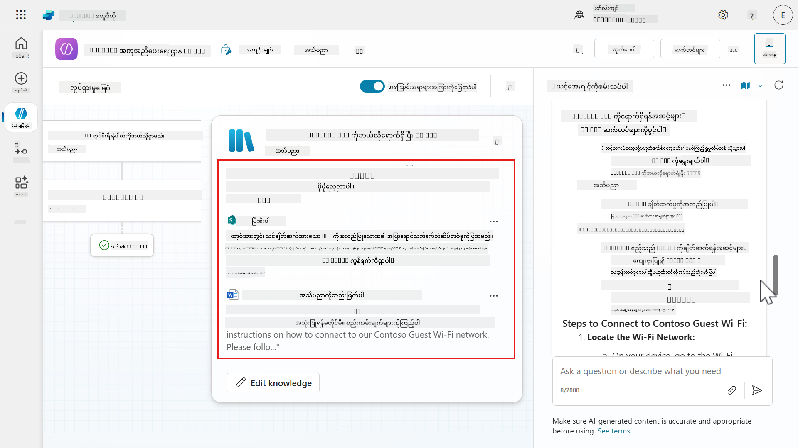

1. ဖွဲ့စည်းထားတဲ့ အဖြေမှန်ကန်မှုကို အမြဲစစ်ဆေးထားသင့်ပါတယ်။ SharePoint site reference ကို ရွေးချယ်ပြီး FAQs SharePoint page ကို ဖွင့်ပါက VPN instructions ကို အောက်ကိုဆွဲကြည့်နိုင်ပါတယ်။


1. နောက်တစ်ခုမှာ document reference ကို ရွေးချယ်ပါက၊ document ထဲမှာ အဖြေကို ပြန်လည်ရိုက်ထားတဲ့ စာသားကို modal ထဲမှာ တွေ့ရပါမယ်။

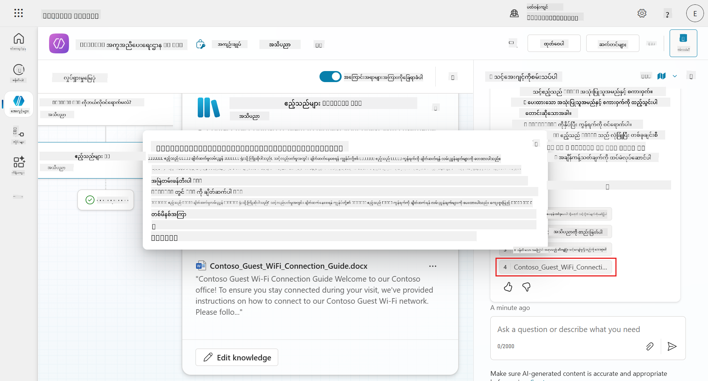

Agent က တစ်ခါတည်း message တစ်ခုထဲမှာ မေးခွန်းများကို ဖြေဆိုနိုင်ပြီး၊ knowledge sources ကို ရှာဖွေ + reference ပြုလုပ်နိုင်ပါတယ်။ အဖြေမှန်ကန်မှုကို အမြဲစစ်ဆေးရန် References ကို ပြန်လည်ကြည့်ပါ။

## ✅ Mission Complete

ဂုဏ်ယူပါတယ်! 👏🏻 သင်သည် သင့် data မှ knowledge sources သုံးခုကို chat ပြုလုပ်နိုင်သော သင့်ကိုယ်ပိုင် custom agent ကို သဘာဝဘာသာစကားဖြင့် ဖန်တီးပုံကို သင်ယူပြီးဖြစ်ပါပြီ 🙌🏻

**Lab 06 - Create an agent with Copilot** ၏ နောက်ဆုံးအပိုင်းဖြစ်ပြီး၊ အောက်ပါလင့်ခ်ကို ရွေးချယ်ပြီး နောက်တစ်ခုသော သင်ခန်းစာဆီသို့ ရွှေ့ပါ။ သင်ဖန်တီးထားသော custom agent ကို နောက်တစ်ခုသော သင်ခန်းစာ၏ lab တွင် အသုံးပြုပါမယ်။

⏭️ [Move to **Add a new Topic with trigger** lesson](../07-add-new-topic-with-trigger/README.md)

Elite အဖွဲ့သို့ ကြိုဆိုပါတယ်။ သင်သည် သင့်ဘာသာစကားကို ပြောနိုင်သော၊ သင့် data ကို ရည်ညွှန်းနိုင်သော၊ သင့်အဖွဲ့ကို အထောက်အကူပြုနိုင်သော digital agents ဖန်တီးပုံကို သိရှိပြီးဖြစ်ပါပြီ။ ဆက်လက်လုပ်ဆောင်ပါ—သင့် mission သာ စတင်နေသေးပါ။

## 📚 Tactical Resources

🔗 [Quickstart: Create and deploy an agent](https://learn.microsoft.com/microsoft-copilot-studio/fundamentals-get-started?context=%2Fmicrosoft-365-copilot%2Fextensibility%2Fcontext/?WT.mc_id=power-172617-ebenitez)

🔗 [Create and delete agents](https://learn.microsoft.com/microsoft-copilot-studio/authoring-first-bot?WT.mc_id=power-172617-ebenitez)

🔗 [Key concepts - Authoring agents](https://learn.microsoft.com/microsoft-copilot-studio/authoring-fundamentals/?WT.mc_id=power-172617-ebenitez)

📺 [Create a custom agent using natural language](https://aka.ms/ai-in-action/copilot-studio/ep1)

📺 [Add knowledge to your agents](https://aka.ms/ai-in-action/copilot-studio/ep2)


---

**အကြောင်းကြားချက်**:  
ဤစာရွက်စာတမ်းကို AI ဘာသာပြန်ဝန်ဆောင်မှု [Co-op Translator](https://github.com/Azure/co-op-translator) ကို အသုံးပြု၍ ဘာသာပြန်ထားပါသည်။ ကျွန်ုပ်တို့သည် တိကျမှုအတွက် ကြိုးစားနေသော်လည်း အလိုအလျောက် ဘာသာပြန်မှုများတွင် အမှားများ သို့မဟုတ် မတိကျမှုများ ပါဝင်နိုင်သည်ကို သတိပြုပါ။ မူရင်းဘာသာစကားဖြင့် ရေးသားထားသော စာရွက်စာတမ်းကို အာဏာတရားရှိသော အရင်းအမြစ်အဖြစ် သတ်မှတ်သင့်ပါသည်။ အရေးကြီးသော အချက်အလက်များအတွက် လူက ဘာသာပြန်မှုကို အကြံပြုပါသည်။ ဤဘာသာပြန်မှုကို အသုံးပြုခြင်းမှ ဖြစ်ပေါ်လာသော အလွဲအမှားများ သို့မဟုတ် အနားလွဲမှုများအတွက် ကျွန်ုပ်တို့သည် တာဝန်မယူပါ။