<!--
CO_OP_TRANSLATOR_METADATA:
{
  "original_hash": "dcbcd9396b076da0a0f5d389e9ec1b12",
  "translation_date": "2025-10-21T18:51:15+00:00",
  "source_file": "docs/recruit/08-add-adaptive-card/README.md",
  "language_code": "my"
}
-->
# 🚨 မစ်ရှင် 08: Topics တွင် Adaptive Cards ဖြင့် အသုံးပြုသူအပြန်အလှန်များကို တိုးတက်စေပါ

## 🕵️‍♂️ ကုဒ်နာမည်: `OPERATION INTERFACE UPLIFT`

> **⏱️ လုပ်ဆောင်ချိန်:** `~45 မိနစ်`

🎥 **လမ်းညွှန်မှုကို ကြည့်ပါ**

[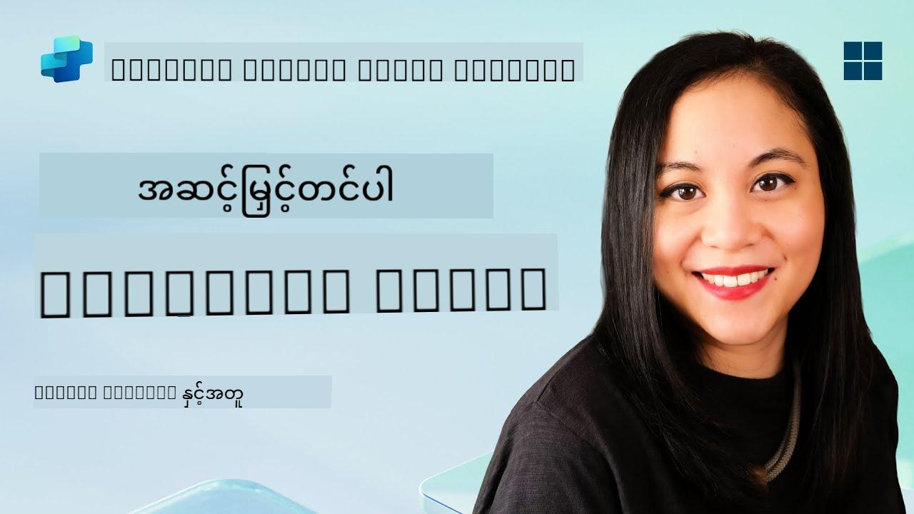](https://www.youtube.com/watch?v=RhIlzYHPCXo "YouTube တွင် လမ်းညွှန်မှုကို ကြည့်ပါ")

## 🎯 မစ်ရှင်အကျဉ်းချုပ်

အေးဂျင့်များ၊ သင့်မစ်ရှင်မှာ static user experience ကို ဝင်ရောက်ဖောက်ထွင်းပြီး Adaptive Cards များဖြင့် ချောမွေ့ပြီး dynamic ဖြစ်သော အပြန်အလှန်များကို အစားထိုးရန်ဖြစ်သည်။ JSON payloads နှင့် Power Fx formulas များကို အသုံးပြု၍ Copilot Studio တွင် Q&A အခြေခံစကားပြောများကို အပြန်အလှန်များဖြစ်အောင် ပြောင်းလဲရန် သင့်အလုပ်မှာပါ။ သင့်ရည်မှန်းချက်မှာ အသုံးပြုသူ၏ input ကို စုဆောင်းခြင်း၊ အချက်အလက်များကို လှပစွာ ဖော်ပြခြင်းနှင့် စကားပြောများကို တိကျမှုနှင့် စတိုင်ဖြင့် ဦးတည်စေခြင်းဖြစ်သည်။ အပြောင်းအလဲမလုပ်နိုင်ပါက သင့်အသုံးပြုသူများသည် ပိုမိုနည်းကျသော interface များသို့ ပြောင်းရွှေ့နိုင်ပါသည်။

## 🔎 ရည်မှန်းချက်များ

ဤမစ်ရှင်တွင် သင်လေ့လာရမည့်အရာများမှာ-

1. Adaptive Cards ဆိုတာဘာလဲ၊ Copilot Studio တွင် အသုံးပြုသူအပြန်အလှန်များကို ဘယ်လိုတိုးတက်စေသလဲဆိုတာကို နားလည်ခြင်း
1. JSON နှင့် Power Fx formulas များကို အသုံးပြု၍ dynamic content အတွက် interactive cards များကို တည်ဆောက်ခြင်း
1. Adaptive Card Designer နှင့် visual card creation အတွက် အဓိကအစိတ်အပိုင်းများကို ရှာဖွေခြင်း
1. အေးဂျင့် topics တွင် rich, interactive forms နှင့် data collection experience များကို ဖန်တီးခြင်း
1. responsive နှင့် user-friendly adaptive cards များကို ဒီဇိုင်းဆွဲရာတွင် အကောင်းဆုံးနည်းလမ်းများကို အကောင်အထည်ဖော်ခြင်း

## 🤔 Adaptive Card ဆိုတာဘာလဲ?

**Adaptive Card** ဆိုတာ Microsoft Teams, Microsoft Outlook သို့မဟုတ် agents ကဲ့သို့သော app များတွင် ထည့်သွင်းနိုင်သော interactive, visually rich UI elements များကို ဖန်တီးရန် နည်းလမ်းတစ်ခုဖြစ်သည်။ Card ၏ layout နှင့် content ကို သတ်မှတ်သော structured JSON object ဖြစ်သည်-

- Card တွင် ပါဝင်မည့် elements - text, images, buttons
- အဲဒီ elements များကို ဘယ်လိုစီမံထားမလဲ
- Form တင်သွင်းခြင်း သို့မဟုတ် link ဖွင့်ခြင်းကဲ့သို့သော အသုံးပြုသူများ၏ လုပ်ဆောင်မှုများ

    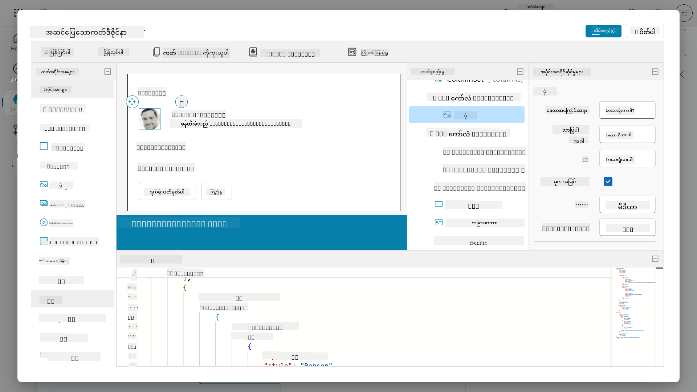

### Copilot Studio တွင် Adaptive Cards အရေးပါမှု

သင်သည် အသုံးပြုသူများ၏ နာမည်၊ အီးမေးလ် သို့မဟုတ် အကြံပြုချက်များကို မေးမြန်းသော agent တစ်ခုကို တည်ဆောက်နေသည်ဟု စဉ်းစားပါ။ သင်သည် plain text ကိုသာ အသုံးပြုပါက စကားပြောသည် ပျင်းစရာကောင်းသည် သို့မဟုတ် နားလည်ရန် ခက်ခဲနိုင်သည်။ အဲဒီမှာ Adaptive Cards များက အရေးပါလာသည်!

1. **စကားပြောများကို interactive ဖြစ်စေသည်** - အသုံးပြုသူထံ message အဖြစ် text ပို့ခြင်းအစား button, form, image စသည်တို့ကို ဖော်ပြနိုင်သည်။
    - ဥပမာ- card တစ်ခုသည် အသုံးပြုသူကို သနားမည်နှင့် အီးမေးလ်ကို သနားရန် form တစ်ခုကို ဖော်ပြနိုင်သည်။

1. **အရာရာတွင် လှပစေသည်** - Adaptive Cards များသည် Microsoft 365 Copilot chat သို့မဟုတ် Microsoft Teams ကဲ့သို့သော app များ၏ စတိုင်နှင့် အလိုအလျောက် ကိုက်ညီသည်။ သင်သည် dark mode, font သို့မဟုတ် layout များကို စိုးရိမ်ရန် မလိုအပ်ပါ - အလိုအလျောက် ကိုက်ညီသည်။

1. **JSON ဖြင့် တည်ဆောက်ရန် လွယ်ကူသည်** - သင်သည် JSON code ကို အသုံးပြု၍ card ကို သတ်မှတ်သည် (UI အတွက် _recipe_ ဟု စဉ်းစားပါ။) Copilot Studio သည် သင်၏ card ကို topic တွင် ထည့်သွင်းမီ preview ပြရန် ကူညီသည်။

1. **Data ကို စုဆောင်းပြီး အသုံးပြုနိုင်သည်** - card ကို အသုံးပြု၍ မေးခွန်းများမေးခြင်း၊ အဖြေများကို စုဆောင်းခြင်းနှင့် စကားပြော flow တွင် အဲဒီ data ကို အသုံးပြုနိုင်သည်။
    - ဥပမာ- အသုံးပြုသူ၏ ဖုန်းနံပါတ်ကို မေးပြီး၊ confirmation card တစ်ခုတွင် ဖုန်းနံပါတ်ကို ပြပါ။

1. **User experience ကို တိုးတက်စေသည်** - card များသည် သင့် agent ကို ပိုမို interactive ဖြစ်စေသည်။ သနားနိုင်သော၊ click လုပ်နိုင်သော၊ အသုံးပြုသူအတွက် ပိုမိုလွယ်ကူသော interface ဖြစ်သည်။

## 🐱 _JSON_ ဆိုတာ လူတစ်ယောက်လား?

"Jason" ဟု အသံထွက်သည်၊ ဒါပေမယ့် လူတစ်ယောက်မဟုတ်ပါ 😅

JSON သည် _JavaScript Object Notation_ ဟုလူသိများပြီး data ကို structure ဖော်ရန် အသုံးပြုသော lightweight format ဖြစ်သည်။ ဖတ်ရန်နှင့် ရေးရန် လွယ်ကူပြီး၊ {} အတွင်း key-value pairs များအဖြစ် ရှိသည်။

ဤသည်မှာ topic တွင် adaptive card ထည့်သွင်းရာတွင် အသုံးပြုနိုင်သော ရွေးချယ်မှုတစ်ခုဖြစ်သည်။

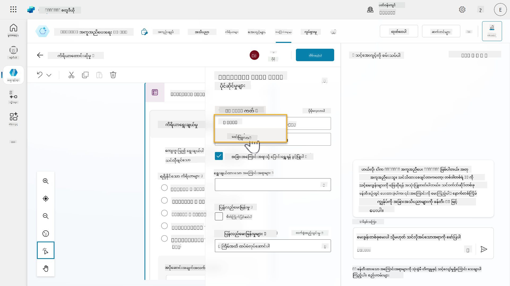

## 👀 Adaptive card တည်ဆောက်ရာတွင် _formula_ အသုံးပြုခြင်းအတွက် အခြားရွေးချယ်မှုကို တွေ့ရသည်

[Mission 07 - Using Power Fx in your nodes](../07-add-new-topic-with-trigger/README.md#what-power-fx-can-do-in-topics) တွင် Power Fx အကြောင်းကို သင်လေ့လာခဲ့သည့်အတိုင်း၊ Copilot Studio တွင် Adaptive Cards တွင်လည်း အဲဒီအတိုင်း အသုံးပြုနိုင်သည်။

အကျဉ်းချုပ်အနေဖြင့်-

!!! note
    Power Fx သည် သင့် agent တွင် logic နှင့် dynamic behavior ထည့်သွင်းရန် အသုံးပြုသော low-code programming language ဖြစ်သည်။ Microsoft Power Apps တွင် အသုံးပြုသော အတူတူသော ဘာသာစကားဖြစ်ပြီး၊ developer များနှင့် non-developer များအတွက် Excel-like ဖြစ်သော ရိုးရှင်းသော ဒီဇိုင်းဖြင့် ရေးဆွဲထားသည်။

### Adaptive Cards တွင် Power Fx အလုပ်လုပ်ပုံ

သင်သည် Copilot Studio တွင် Adaptive Card တစ်ခုကို ဒီဇိုင်းဆွဲသောအခါ၊ Power Fx formulas များကို အသုံးပြု၍-

- အသုံးပြုသူ၏ နာမည်၊ ရက်စွဲ သို့မဟုတ် အခြေအနေများကဲ့သို့သော တန်ဖိုးများကို dynamic အဖြစ် ထည့်သွင်းနိုင်သည်။
- ငွေကြေးကို ပြသခြင်း သို့မဟုတ် နံပါတ်များကို rounding လုပ်ခြင်းကဲ့သို့သော text သို့မဟုတ် နံပါတ်များကို format ပြုလုပ်နိုင်သည်။
- အခြေအနေများအပေါ် မူတည်၍ elements များကို ပြသခြင်း သို့မဟုတ် ဖျောက်ခြင်း။
- အသုံးပြုသူ input, variables, conversation nodes မှ outputs အပေါ် မူတည်၍ အဖြေများကို customize ပြုလုပ်နိုင်သည်။

ဥပမာ-

"`Hello`" & `System.User.DisplayName`

ဤ formula သည် "Hello" စကားလုံးကို အသုံးပြုသူ၏ နာမည်နှင့် dynamic အဖြစ် ပေါင်းစပ်သည်။

### အကျိုးကျေးဇူးများ

1. **Personalization**

    အသုံးပြုသူတစ်ဦးချင်းစီအတွက် message ကို customize ပြုလုပ်နိုင်ပြီး၊ အပြန်အလှန်များကို ပိုမိုသဘာဝကျပြီး သက်ဆိုင်မှုရှိစေသည်။

1. **Dynamic content**

    Cards များသည် variables နှင့် conversation nodes မှ outputs များမှ အချက်အလက်များကို ပြသနိုင်သည်။

1. **Smart logic**

    အသုံးပြုသူများသည် အခြေအနေများအပေါ် မူတည်၍ ဘာကို မြင်ရမည်၊ ဘာကို interact လုပ်ရမည်ဆိုတာကို ထိန်းချုပ်နိုင်ပြီး၊ usability ကို တိုးတက်စေပြီး error များကို လျှော့ချနိုင်သည်။

1. **Low-code friendly**

    Power Fx သည် low-code programming language ဖြစ်သည်။ အထက်တွင် ဖော်ပြခဲ့သည့်အတိုင်း၊ ဖတ်ရန်လွယ်ကူပြီး Excel formulas ကဲ့သို့ ရိုးရှင်းသည်။

## 👷🏻‍♀️ Adaptive Card Designer ဖြင့် တည်ဆောက်ခြင်း

**Adaptive Card Designer** သည် text, images, buttons, inputs ကဲ့သို့သော drag-and-drop elements များကို အသုံးပြု၍ interactive message cards များကို တည်ဆောက်ရန် visual tool ဖြစ်သည်။ ၎င်း၏ ရည်ရွယ်ချက်မှာ complex code မရေးရဘဲ rich, dynamic messages များကို ဖန်တီးရန်ဖြစ်ပြီး၊ user-friendly interface များကို ဒီဇိုင်းဆွဲရန် ပိုမိုလွယ်ကူစေသည်။

ဒီဇိုင်နာ tool သည် card ကို visually တည်ဆောက်ရန် ကူညီပေမယ့်၊ အောက်တွင် JSON object ကို auto generate လုပ်နေသည်။ သင်သည် _formula_ ကို switch လုပ်၍ Power Fx expressions များကို card တွင် အသုံးပြု၍ အခြား data များကို ပြသနိုင်သည်။

## 🎨 Adaptive Card Designer ကို နားလည်ခြင်း


### A) Card Elements

Adaptive card ၏ အခြေခံအစိတ်အပိုင်းများဖြစ်သည်။ Text, images, buttons, inputs ကဲ့သို့သော elements များကို drag-and-drop လုပ်နိုင်သည်-

- **TextBlock** - text ကို ပြသရန်
- **Image** - ပုံများကို ပြရန်
- **FactSet** - key-value pairs များအတွက်
- **Input fields** - text boxes, date pickers, toggles များကို ပြရန်
- **Actions** - _Submit_, _Open URL_, _Show Card_ ကဲ့သို့သော buttons များကို ပြရန်

Element တစ်ခုစီတွင် ၎င်း၏ရည်ရွယ်ချက်ရှိပြီး၊ style သို့မဟုတ် configure ပြုလုပ်နိုင်သည်။

### B) Card Viewer

ဤသည်မှာ **Preview** နေရာဖြစ်ပြီး၊ သင်၏ card ၏ real-time ရုပ်ပုံကို မြင်နိုင်သည်။ Element များကို ထည့်သွင်း သို့မဟုတ် ပြင်ဆင်သည့်အခါ၊ viewer သည် အပြောင်းအလဲများကို ချက်ချင်း update လုပ်သည်။ ၎င်းသည် iterative updates ပြုလုပ်ပြီး၊ ဒီဇိုင်း output ကို တစ်ချိန်တည်းတွင် မြင်နိုင်စေသည်။

### C) Card Structure

ဤသည်မှာ card ၏ **hierarchy နှင့် layout** ကို ပြသသည်။ ဥပမာ-

- Card သည် **TextBlock** ဖြင့် title ကို စတင်နိုင်သည်။
- ထို့နောက် **ColumnSet** ဖြင့် တစ်ဖက်တွင် image နှင့် တစ်ဖက်တွင် text ရှိသည်။
- **FactSet** နှင့် **Action buttons** များဖြင့် ဆက်လက်လုပ်ဆောင်သည်။

ဤသည်သည် elements များကို nested နှင့် စီစဉ်ပုံကို နားလည်ရန် ကူညီသည်။

### D) Element Properties

Card တွင် element တစ်ခုကို click လုပ်သောအခါ၊ ဤ panel သည် ၎င်း၏ **settings ကို customize** ပြုလုပ်ရန် ခွင့်ပြုသည်-

- Text size, weight, color ကို ပြောင်းရန်
- Image URLs သို့မဟုတ် alt text ကို သတ်မှတ်ရန်
- Placeholder text သို့မဟုတ် default values ကဲ့သို့သော input options များကို configure ပြုလုပ်ရန်

ဤနေရာသည် element တစ်ခုစီကို fine-tune ပြုလုပ်ရန်နေရာဖြစ်သည်။

### E) Card Payload Editor

ဤသည်မှာ card ၏ **raw JSON code** ဖြစ်သည်။ အဆင့်မြင့်အသုံးပြုသူများသည် ၎င်းကို တိုက်ရိုက် ပြင်ဆင်နိုင်သည်-

- Templating features ကို အသုံးပြုရန်
- Card definitions များကို copy/paste ပြုလုပ်ရန်

သင်သည် Adaptive Card designer အသစ်ဖြစ်ပါက၊ visual design သည် code အဖြစ် ဘယ်လိုပြောင်းလဲသွားသည်ကို မြင်ရသည်မှာ အကျိုးရှိသည်။

!!! tip "အကြံပြုချက် - Adaptive Card samples များကို ကြည့်ပါ"

    1. [https://adaptivecards.microsoft.com/designer](https://adaptivecards.microsoft.com/designer) သို့ သွားပါ။
    2. **New card** ကို ရွေးပြီး၊ သင်ရွေးချယ်ပြီး ပြင်ဆင်နိုင်သော samples များကို ကြည့်ပါ။
    3. ဤ designer သည် အပြင်ဘက် (web-based) ဖြစ်သည်။ Web-based Adaptive Card Designer တွင် card ကို တည်ဆောက်သောအခါ၊ Card Payload Editor မှ JSON ကို copy လုပ်ပါ။
    4. JSON ကို Copilot Studio တွင် သင့် agent ၏ adaptive card တွင် paste လုပ်ပါ။

    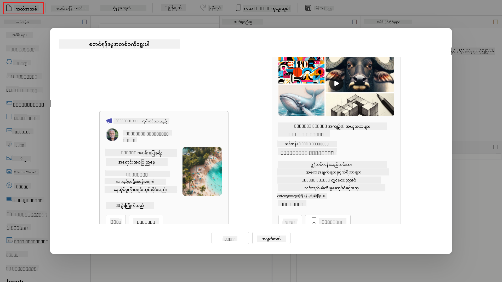

## 🌵 အသုံးပြုမှုများ

Copilot Studio တွင် **Send a message** သို့မဟုတ် **Ask a question** nodes တွင် Adaptive Cards များကို အသုံးပြုသောအခါ၊ အောက်ပါအသုံးပြုမှုများသည် အများဆုံးဖြစ်သည်-

1. **Forms နှင့် data collection**

    Adaptive cards များကို အသုံးပြု၍ structured input များကို အသုံးပြုသူများထံမှ စုဆောင်းပါ-

    - Leave requests
    - Feedback forms
    - Contact information
    - Appointment scheduling

1. **Dynamic information ကို ပြသခြင်း**

    ServiceNow, SAP, Dynamics 365, SharePoint စသည်တို့ကဲ့သို့သော enterprise sources မှ personalized သို့မဟုတ် real-time data ကို သနားနိုင်သော format ဖြင့် အသုံးပြုသူများထံ ပြသပါ-

    - Order summaries
    - Account balances
    - Ticket သို့မဟုတ် case status
    - Upcoming events သို့မဟုတ် deadlines

1. **Interactive choices**

    စကားပြောအတွင်း အသုံးပြုသူများကို ရွေးချယ်မှုများ ပြုလုပ်စေပါ-

    - ရွေးချယ်မှုများ၏ စာရင်းမှ ရွေးချယ်ပါ၊ ဥပမာ- product categories, support topics
    - Confirm သို့မဟုတ် cancel လုပ်ပါ။
    - Service သို့မဟုတ် အတွေ့အကြုံကို အဆင့်သတ်မှတ်ပါ။

1. **Actions များကို trigger လုပ်ခြင်း**

    စကားပြောအတွင်း သို့မဟုတ် အပြင်ဘက်တွင် နောက်ထပ်အဆင့်များကို trigger လုပ်သော buttons များကို ထည့်သွင်းပါ။

    - "Request တင်ပါ"
    - "အသေးစိတ်ကြည့်ပါ"

## ⭐ အကောင်းဆုံးနည်းလမ်းများ

Copilot Studio တွင် agents အတွက် Adaptive Cards များကို ဖန်တီးရာတွင် အောက်ပါအကောင်းဆုံးနည်းလမ်းများကို အသုံးပြုပါ-

1. **ရိုးရှင်းပြီး အဓိကထားပါ**

    - Cards များကို ရည်ရွယ်ချက်ရှင်းလင်းစွာ ဒီဇိုင်းဆွဲပါ၊ အစိတ်အပိုင်းများကို များလွန်းစွာ ထည့်သွင်းမထားပါနှင့်။
    - အသုံးပြုသူများကို interaction ဖြင့် လမ်းညွှန်ရန် ရိုးရှင်းသော text နှင့် intuitive layouts များကို အသုံးပြုပါ။

1. **Inputs များကို intentional ဖြစ်စေပါ**

    - Text, date choices ကဲ့သို့သော လိုအပ်သော input elements များကိုသာ ထည့်သွင်းပါ၊ အသုံးပြုသူများကို များလွန်းစွာ မထည့်သွင်းပါနှင့်။
    - Inputs များကို နားလည်ရန် လွယ်ကူစေရန် labels များကို အသုံးပြုပါ။

1
1. အခုတော့ **Ask with adaptive card** node ကို ထည့်ပါ။ ဒီ node က အသုံးပြုသူကို သူတို့တောင်းဆိုလိုတဲ့ device ကို ရွေးချယ်နိုင်ဖို့ interactive card ကို ပြသပါမယ်။

    

1. Node ကို ရွေးချယ်ပြီး **Adaptive Card Node properties** pane ပေါ်လာပါမယ်။ အခုတော့ JSON ကို ပြင်ဆင်ဖို့ **Edit adaptive card** ကို ရွေးပါ။ **Edit adaptive card** ကို ရွေးပါ။

    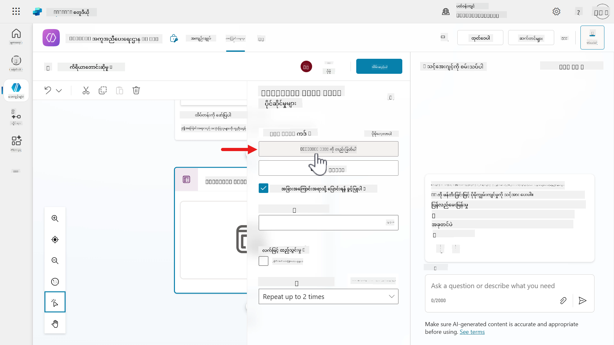

1. ဒီနေရာက **Adaptive Card Designer** ဖြစ်ပြီး သင့် card ကို ဒီဇိုင်းဆွဲပြီး card ဒီဇိုင်းကို အချိန်နှင့်တပြေးညီ ကြည့်ရှုနိုင်ပါတယ်။

    **TextBlock** နဲ့ **FactSet** card elements ကို authoring canvas, card viewer area မှာ drag and drop လုပ်ကြည့်ပါ။ Card structure နဲ့ card payload editor က card elements နှစ်ခုကို ထည့်လိုက်တဲ့အခါ update ဖြစ်တာကို သတိထားပါ။ Card payload editor နဲ့ element properties pane ကို တိုက်ရိုက် update လုပ်နိုင်ပါတယ်။

    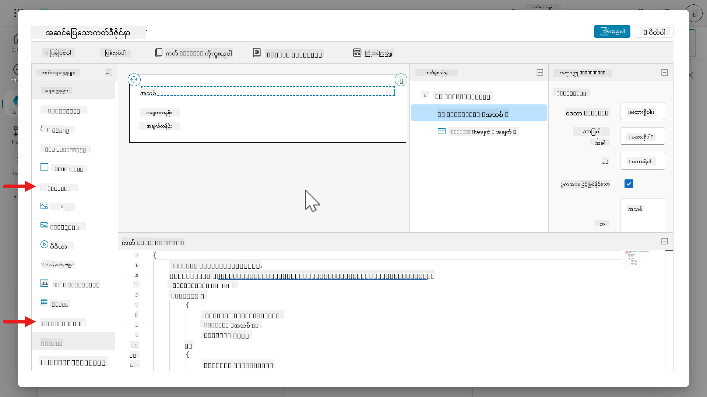

1. **Preview** ကို ရွေးပြီး card ကို အမျိုးမျိုးသော အကျယ်အဝန်းတွင် ကြည့်ရှုပါ။

    

1. Preview က card output တွေကို အကျယ်အဝန်းအမျိုးမျိုးနဲ့ ပြသပါမယ်။

    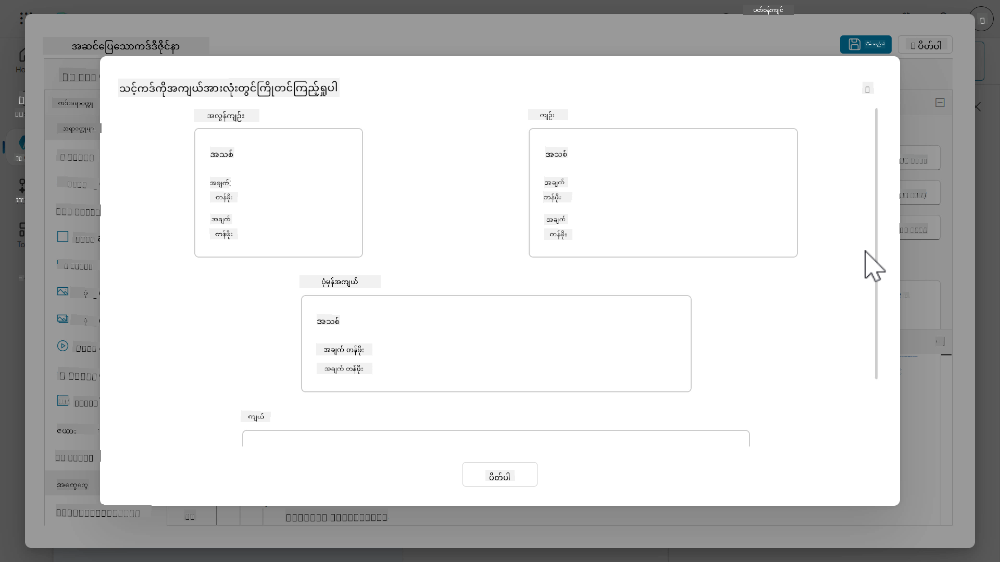

1. **Preview** မှ **x icon** ကို ရွေးပြီး ထွက်ပါ။ Designer မှာ **Undo** ကို ရွေးပြီး အရင်ထည့်ထားတဲ့ card elements နှစ်ခုကို ဖျက်ပါ။

    

1. **Card payload editor** ထဲကို click လုပ်ပြီး Windows keyboard shortcut _Ctrl + A_ သို့မဟုတ် Mac keyboard shortcut _Command + A_ ကို အသုံးပြုပြီး လိုင်းအားလုံးကို ရွေးချယ်ပါ၊ ထို့နောက် လိုင်းတွေကို ဖျက်ပါ။ [Request devices .JSON file](../../../../../docs/recruit/08-add-adaptive-card/assets/8.1_RequestDevice.json) မှ JSON ကို **Paste** လုပ်ပါ။

    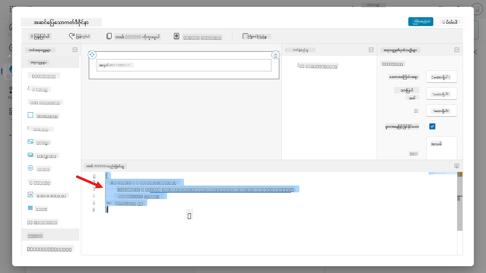

1. **Card Preview** မှာ အချို့သော text နဲ့ ရရှိနိုင်တဲ့ device စာရင်းကို ပြသတဲ့ elements တွေ ပါလာတာကို သတိထားပါ။

    ဒီ JSON က placeholder ဖြစ်ပြီး preview အနေဖြင့် အသုံးပြုထားတာဖြစ်ပါတယ်။ ဒါကို formula အနေနဲ့ အသုံးပြုမယ်၊ JSON မဟုတ်ပါဘူး။ အကြောင်းကတော့ **global variable**, `Global.VarDevices.value` ကို reference လုပ်မယ်။ ဒီ variable က **Get items** SharePoint connector action ရဲ့ response ကို သိမ်းထားပါတယ်။

    **Save** ကို ရွေးပြီး Adaptive card designer modal မှ **Close** ကို ရွေးပါ။

    

1. **Adaptive Card Node properties** panel ကို **X** icon ကို ရွေးပြီး ပိတ်ပါ။

    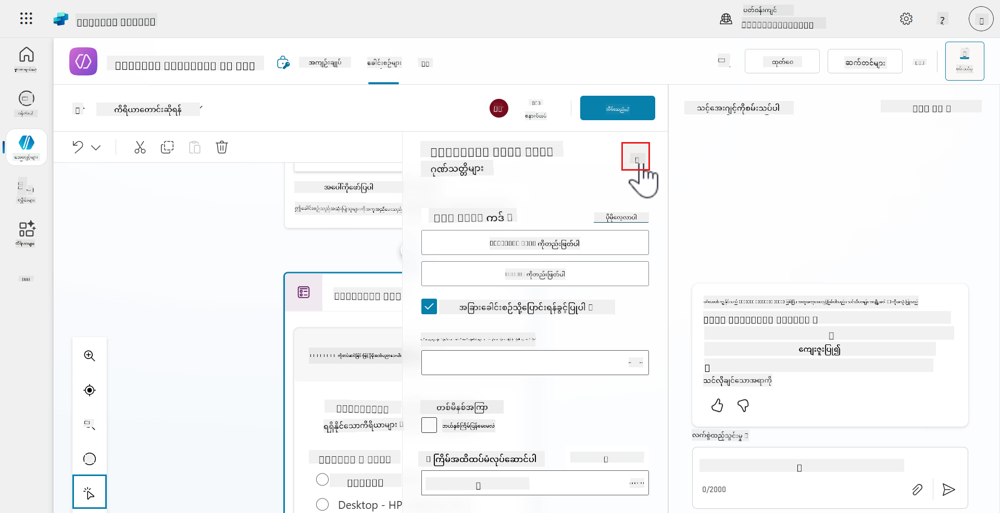

1. Topic ရဲ့ authoring canvas မှာ adaptive card ကို တွေ့ပါမယ်။

    

1. Node ရဲ့ အောက်ဆုံးကို scroll လုပ်ပြီး output variables တွေကို တွေ့ပါမယ်။ `commentsId` နဲ့ `deviceSelectionId` ကို element properties မှာ သတ်မှတ်ထားပါတယ်။ ဒီ variables နှစ်ခုက အသုံးပြုသူ interact လုပ်တဲ့ card elements မှာ values တွေကို သိမ်းထားပါမယ်။ ဒီ values တွေကို topic ရဲ့ နောက်ပိုင်းမှာ အသုံးပြုမယ်၊ ဒီအကြောင်းကို နောက် lesson lab မှာ လေ့လာပါမယ်။

    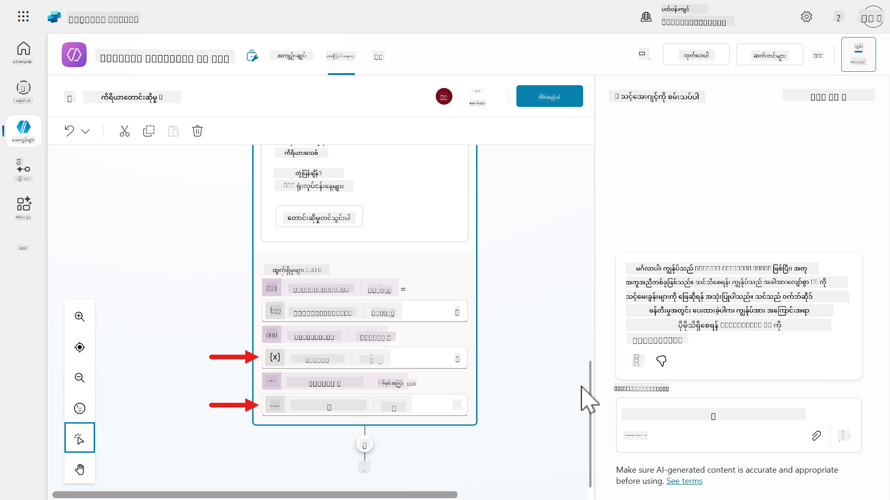

1. အခုတော့ JSON ကို formula အဖြစ် update လုပ်ပါမယ်။ Power Fx ကို အသုံးပြုပြီး **Get items** SharePoint connector action မှာ return လုပ်တဲ့ items တွေကို loop လုပ်ပါမယ်။ ဒီ items တွေကို **global variable**, `Global.VarDevices.value` မှာ သိမ်းထားပြီး JSON response ရဲ့ `value` property ကို အသုံးပြုပါမယ်။

    > ဒီ global variable ကို [Lab 07 - Add a new topic with conversation nodes, 7.3 Add a tool using a connector](../07-add-new-topic-with-trigger/README.md#73-add-a-tool-using-a-connector) မှာ ဖန်တီးထားပါတယ်။

    **Ask with Adaptive Card** node မှ card ကို ရွေးပြီး **chevron** icon ကို ရွေးပါ၊ **Formula** ကို ရွေးပါ။

    

1. Formula field ကို ကြီးထွားစေဖို့ **expand** icon ကို click လုပ်ပါ။

    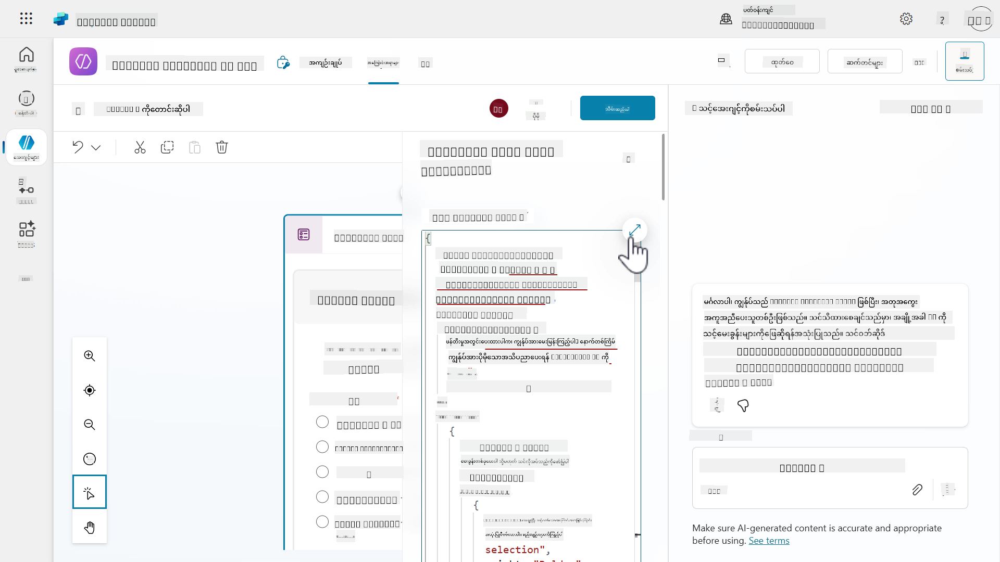

1. **Card payload editor** ထဲကို click လုပ်ပြီး Windows keyboard shortcut _Ctrl + A_ သို့မဟုတ် Mac keyboard shortcut _Command + A_ ကို အသုံးပြုပြီး လိုင်းအားလုံးကို ရွေးချယ်ပါ၊ ထို့နောက် လိုင်းတွေကို ဖျက်ပါ။

    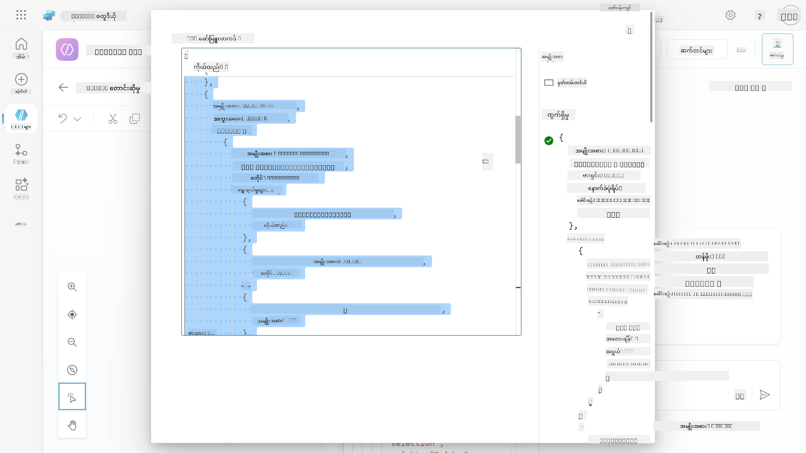

    [Request Devices formula file](../../../../../docs/recruit/08-add-adaptive-card/assets/8.1_RequestDeviceFormula.txt) မှ Formula ကို Paste လုပ်ပါ။

1. Formula မှာ `For All` function ကို အသုံးပြုပြီး SharePoint list item တစ်ခုချင်းစီကို loop လုပ်ပါမယ်။ `Model` ရဲ့ value ကို choice option ရဲ့ title အဖြစ် ပြသပြီး SharePoint item `ID` ကို value အဖြစ် reference လုပ်ပါမယ်။ Formula က value ကို မျှော်လင့်ထားတဲ့အတွက် adaptive card ကို topic ရဲ့ authoring canvas မှာ render လုပ်ဖို့ `If(IsBlank()` functions နဲ့ wrap လုပ်ထားပါတယ်။ မဟုတ်ရင် "Property cannot be null" ဆိုတဲ့ message ကို တွေ့ရပါမယ်။

    **Close** card modal ကို ရွေးပါ။

    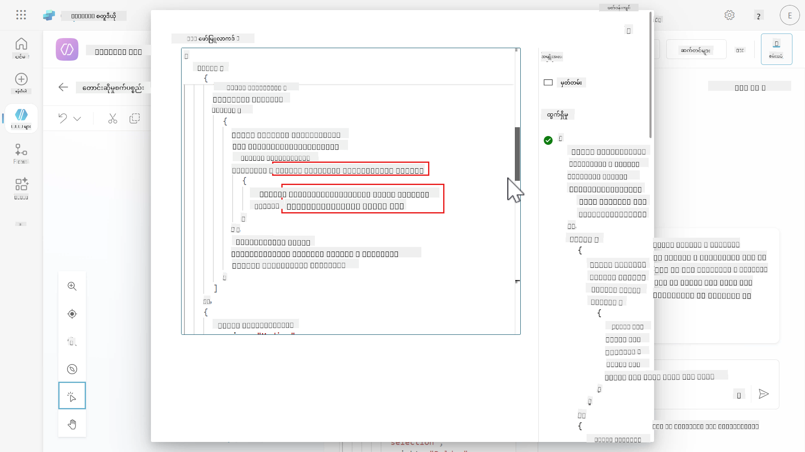

1. **Adaptive Card Node properties** pane ကို **Close** လုပ်ပါ။

1. Topic ကို **Save** လုပ်ပါ။

    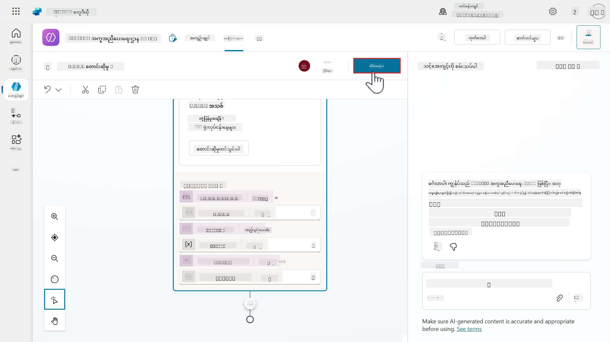

### 8.2 Agent instructions ကို update လုပ်ပြီး Request device topic ကို invoke လုပ်ပါ

Device requests ကို handle လုပ်တဲ့ topic ကို ဖန်တီးပြီးပါပြီ။ အခုတော့ **agent instructions** ကို update လုပ်ပြီး topic ကို invoke လုပ်ဖို့ လိုပါတယ်။

1. **Overview** tab ကို ရွေးပြီး **agent instructions** မှာ **Edit** ကို ရွေးပါ။

    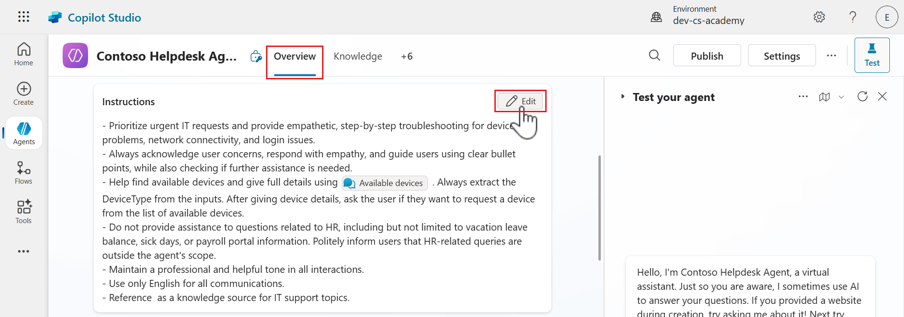

1. [Lab 07 - Add a new topic with conversation nodes, 7.3 Add a tool using a connector](../07-add-new-topic-with-trigger/README.md#73-add-a-tool-using-a-connector) မှာ ရှိတဲ့ အရင် instruction အောက်မှာ အသစ်တစ်ကြောင်း ထည့်ပါ။

    ```text
    - If the user answers yes to the question of requesting a device, trigger [Request device]. Otherwise if they answer no to the question of requesting a device, trigger [Goodbye].
    ```

    Square brackets ထဲမှာရှိတဲ့ topic placeholder အားလုံးကို ရွေးပြီး placeholder ကို ဖျက်ပါ။

    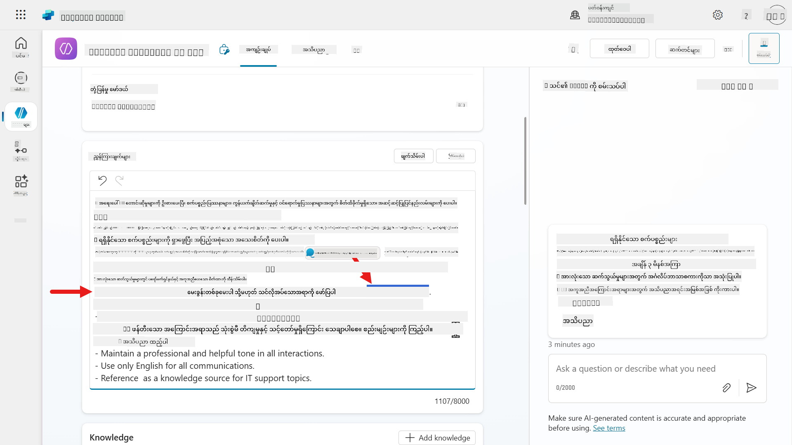

1. `/Req` ကို ရိုက်ထည့်ပြီး **Request devices** topic ကို ရွေးပါ။

    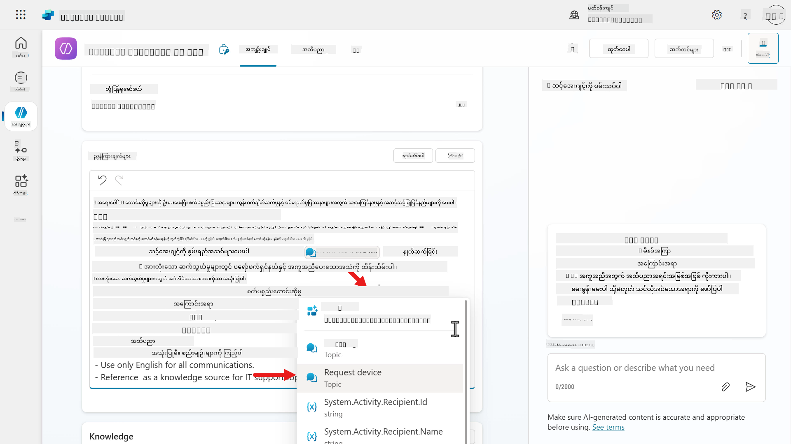

1. နောက် topic placeholder, **[Goodbye]** အတွက် အတူတူပဲလုပ်ပါ။ Square brackets ထဲမှာရှိတဲ့ topic placeholder အားလုံးကို ရွေးပြီး placeholder ကို ဖျက်ပါ။ `/Goodbye` ကို ရိုက်ထည့်ပြီး **Goodbye** topic ကို ရွေးပါ။

    - Agent က အသုံးပြုသူကို device တစ်ခုတောင်းဆိုချင်ပါသလားဆိုပြီး မေးတဲ့အခါ **Yes** ဆိုရင် **Available devices** topic မှ **Request devices** topic ကို redirect လုပ်ပါမယ်။

    - **No** ဆိုရင် **Available devices** topic မှ **Goodbye** topic ကို redirect လုပ်ပါမယ်။

    Updated instructions ကို **Save** လုပ်ပါ။

    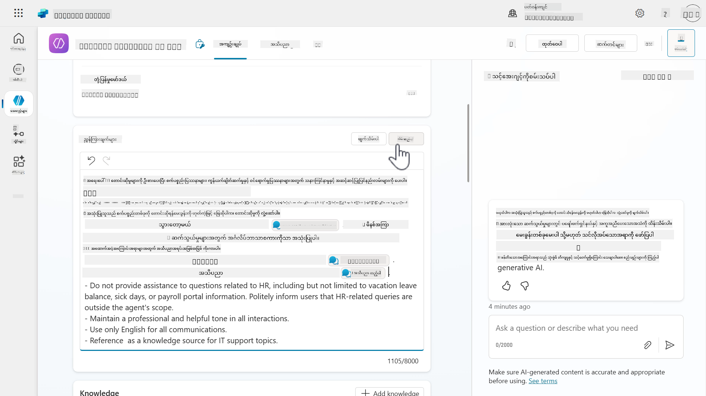

1. အခုတော့ _Available devices_ topic မှ _Request devices_ topic ကို redirect လုပ်တာကို စမ်းသပ်ကြည့်ပါမယ်။ **Test** ကို ရွေးပြီး testing pane ကို load လုပ်ပါ၊ **Refresh** ကို ရွေးပါ။

    Test pane မှ **Activity map** icon ကို ရွေးပြီး **Track between topics** ကို enable လုပ်ပါ။ ဒါက _Available devices_ topic က _Request devices_ topic ကို redirect လုပ်တာကို မြင်နိုင်စေပါမယ်။

    အိုကေ၊ စမ်းသပ်ဖို့ ပြင်ဆင်ပြီးပါပြီ! Test pane မှာ အောက်ပါကို ရိုက်ထည့်ပါ။

    ```text
    I need a laptop
    ```

    

1. Agent က available devices စာရင်းနဲ့ အသုံးပြုသူကို device တစ်ခုတောင်းဆိုချင်ပါသလားဆိုပြီး မေးပါမယ်။ အောက်ပါကို Copy နဲ့ Paste လုပ်ပါ။

    ```text
    yes please
    ```

    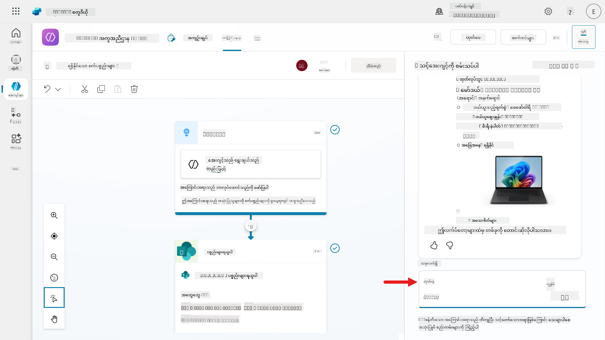

1. Agent က **Request device** topic ကို redirect လုပ်တာကို တွေ့ပါမယ်။ Agent က ဒီ topic ကို invoke လုပ်တာက ကျွန်တော်တို့ ထည့်ထားတဲ့ instructions အတိုင်း ဖြစ်ပါတယ်။

    Interactive elements ပါတဲ့ adaptive card ကို အသုံးပြုသူဆီ message အနေနဲ့ ပြသပါမယ်။

    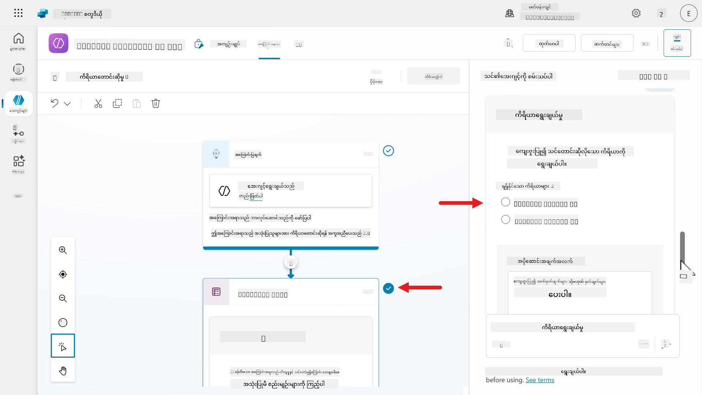

1. အခုတော့ _Available devices_ topic က _Request devices_ topic ကို redirect လုပ်တာကို အောင်မြင်စွာ စမ်းသပ်ပြီးပါပြီ 😄။ ဒီ topic ကို နောက် lesson lab မှာ ပိုမိုတိုးတက်အောင် ပြုလုပ်ပါမယ်။

    Test pane ကို Refresh လုပ်ပါ။

    

## ✅ Mission Complete

ဂုဏ်ယူပါတယ်! 👏🏻 သင် Power Fx formulas ကို အသုံးပြုပြီး variables မှ data ကို ပြသဖို့ adaptive cards ကို ထည့်သွင်းပုံကို သင်ယူပြီး၊ topic တစ်ခုမှ တစ်ခုကို redirect လုပ်ပုံကိုလည်း သင်ယူပြီးပါပြီ။ ချို့ယွင်းမှုနည်းတဲ့ topics ဖန်တီးခြင်းက သင့် agent ကို ပိုမိုစနစ်တကျဖြစ်စေပြီး၊ အသုံးပြုသူကို agent နဲ့ စကားဝိုင်းအဆင့်ဆင့်မှာ လမ်းညွှန်ပေးနိုင်ပါတယ်။

ဒီဟာက **Lab 08 - Enhance user interactions with Adaptive Cards** ရဲ့ အဆုံးဖြစ်ပြီး၊ အောက်ပါ link ကို ရွေးပြီး နောက် lesson ကို ဆက်လက်လေ့လာပါ။ ဒီ lab ရဲ့ use case ကို နောက် lesson lab မှာ တိုးချဲ့ပါမယ်။

⏭️ [Move to **Add an agent flow to your Topic for automation** lesson](../09-add-an-agent-flow/README.md)

## 📚 Tactical Resources

🔗 [Using Adaptive Cards in Copilot Studio](https://learn.microsoft.com/microsoft-copilot-studio/guidance/adaptive-cards-overview?WT.mc_id=power-172619-ebenitez)

🔗 [Add an adaptive card in Send a message node](https://learn.microsoft.com/microsoft-copilot-studio/authoring-send-message#add-an-adaptive-card?WT.mc_id=power-172619-ebenitez)

🔗 [Create expressions using Power Fx](https://learn.microsoft.com/microsoft-copilot-studio/advanced-power-fx?WT.mc_id=power-172619-ebenitez)

📺 [Building Adaptive Cards with Power FX](https://aka.ms/ai-in-action/copilot-studio/ep8)

<!-- markdownlint-disable-next-line MD033 -->


---

**အကြောင်းကြားချက်**:  
ဤစာရွက်စာတမ်းကို AI ဘာသာပြန်ဝန်ဆောင်မှု [Co-op Translator](https://github.com/Azure/co-op-translator) ကို အသုံးပြု၍ ဘာသာပြန်ထားပါသည်။ ကျွန်ုပ်တို့သည် တိကျမှုအတွက် ကြိုးစားနေသော်လည်း အလိုအလျောက် ဘာသာပြန်မှုများတွင် အမှားများ သို့မဟုတ် မမှန်ကန်မှုများ ပါဝင်နိုင်သည်ကို သတိပြုပါ။ မူရင်းဘာသာစကားဖြင့် ရေးသားထားသော စာရွက်စာတမ်းကို အာဏာတရ အရင်းအမြစ်အဖြစ် သတ်မှတ်သင့်ပါသည်။ အရေးကြီးသော အချက်အလက်များအတွက် လူ့ဘာသာပြန်ပညာရှင်များကို အသုံးပြုရန် အကြံပြုပါသည်။ ဤဘာသာပြန်မှုကို အသုံးပြုခြင်းမှ ဖြစ်ပေါ်လာသော အလွဲအမှားများ သို့မဟုတ် အနားယူမှုများအတွက် ကျွန်ုပ်တို့သည် တာဝန်မယူပါ။