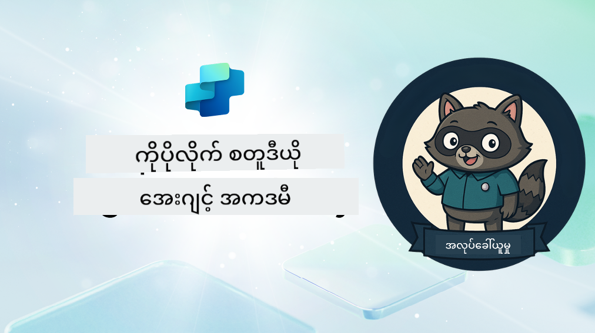

<!--
CO_OP_TRANSLATOR_METADATA:
{
  "original_hash": "8b5ecad9d5d073ea3f4c2b844e80f2e5",
  "translation_date": "2025-10-21T18:15:24+00:00",
  "source_file": "docs/recruit/README.md",
  "language_code": "my"
}
-->
# အဖွဲ့ဝင်အသစ်ကို ကြိုဆိုပါသည်

**အဖွဲ့ဝင်အသစ်ကို ကြိုဆိုပါသည်။**  
သင်၏တာဝန်—သင်လက်ခံလိုပါက— **Microsoft Copilot Studio** ကို အသုံးပြု၍ အေးဂျင့်များကို တည်ဆောက်ခြင်း၏ အတတ်ပညာကို ကျွမ်းကျင်ရန် ဖြစ်ပါသည်။

ဤလက်တွေ့လေ့ကျင့်မှုသည် **အေးဂျင့်များ၏ ကမ္ဘာ** သို့ ဝင်ရောက်ရန် သင်၏ အစပေါ်အချက်ဖြစ်ပြီး၊ အခြေခံပုံစံများမှ Adaptive Cards နှင့် အေးဂျင့်လှိုင်းများအထိ၊ သင်သည် အေးဂျင့်များကို တည်ဆောက်ခြင်း၊ အရွယ်အစားချဲ့ခြင်းနှင့် deploy လုပ်ခြင်းကို အမှန်တကယ် အသုံးချနိုင်သော tools နှင့် အသုံးပြုမှုများဖြင့် လေ့လာနိုင်ပါမည်။

---

## 🎯 တာဝန်ရည်မှန်းချက်

Agent Academy ကို ပြီးမြောက်စွာ လေ့လာပြီးပါက၊ သင်သည် အောက်ပါအရာများကို လုပ်နိုင်ပါမည်-

- Microsoft Copilot Studio ၏ အရပ်ထဲတွင် အေးဂျင့်များသည် အဘယ်အရာဖြစ်သည်ကို နားလည်ခြင်း
- Large Language Models (LLMs), retrieval-augmented generation (RAG), နှင့် orchestration တို့သည် အေးဂျင့်တစ်ခုတွင် ဘယ်လိုပေါင်းစပ်ထားသည်ကို ရှာဖွေခြင်း
- **Declarative** နှင့် **Custom Agents** နှစ်မျိုးလုံးကို တည်ဆောက်ခြင်း
- **Topics**, **Adaptive Cards**, နှင့် **Agent Flows** ဖြင့် အေးဂျင့်များကို တိုးတက်စေခြင်း
- အေးဂျင့်များကို **Microsoft Teams** နှင့် **Microsoft 365 Copilot** တွင် deploy လုပ်ခြင်း

---

## 🧪 လိုအပ်ချက်များ

အားလုံးသော တာဝန်များကို ပြီးမြောက်စွာ လုပ်ဆောင်ရန်၊ သင်သည် အောက်ပါအရာများလိုအပ်ပါမည်-

- Microsoft 365 Developer tenant (SharePoint enabled ဖြစ်ရမည်)
- **Microsoft Copilot Studio** (စမ်းသပ်မှုသို့မဟုတ် လိုင်စင်ရရှိထားသော) ကို အသုံးပြုနိုင်မှု
- အလိုအလျောက်: SharePoint, Power Platform, သို့မဟုတ် Power Fx အခြေခံအသိပညာ

---

## 🧬 ဤသင်ခန်းစာသည် အဘယ်သူများအတွက်ဖြစ်သည်

ဤသင်ခန်းစာသည် အောက်ပါအဖွဲ့များအတွက် အထူးသင့်လျော်ပါသည်-

- **Copilot Studio** ကို လေ့လာနေသော Maker များနှင့် Developer များ
- **Microsoft 365 Copilot extensions** ကို တည်ဆောက်နေသော IT ပရိုဖက်ရှင်နယ်များ
- Intelligent agents ဖြင့် **အဆင့်မြှင့်တင်**လိုသော Power Platform စိတ်ဝင်စားသူများ
- **လုပ်ဆောင်ခြင်း** ဖြင့် လေ့လာရန် ပိုမိုနှစ်သက်သူများ

---

## 🧭 သင်ခန်းစာအကြောင်းအရာအကျဉ်းချုပ်

ဤသင်ခန်းစာသည် တိုးတက်မှုအဆင့်လိုက် သင်ခန်းစာများအဖြစ် ခွဲခြားထားပြီး၊ အေးဂျင့်တည်ဆောက်မှုကျွမ်းကျင်မှုကို မြှင့်တင်ရန် တစ်ခုချင်းစီကို တာဝန်အဖြစ် ဖန်တီးထားပါသည်။

| သင်ခန်းစာ | ခေါင်းစဉ် | တာဝန်အကျဉ်းချုပ် |
|--------|-------|------------------|
| `00` | 🧰 [သင်ခန်းစာ Setup](./00-course-setup/README.md) | သင်၏ developer ပတ်ဝန်းကျင်၊ Copilot Studio စမ်းသပ်မှုနှင့် SharePoint site ကို စတင်တည်ဆောက်ပါ |
| `01` | 🧠 [အေးဂျင့်များအကြောင်းမိတ်ဆက်](./01-introduction-to-agents/README.md) | Conversational AI အကြောင်းအရာများ၊ LLMs နှင့် autonomous vs. declarative agents ကို နားလည်ပါ |
| `02` | 🛠️ [Copilot Studio အခြေခံများ](./02-copilot-studio-fundamentals/README.md) | Knowledge, skills, autonomy အခြေခံအဆင့်များကို လေ့လာပါ |
| `03` | 👩‍💻 [Declarative Agent တစ်ခုကို တည်ဆောက်ပါ](./03-create-a-declarative-agent-for-M365Copilot/README.md) | Microsoft 365 Copilot တွင် သင်၏အေးဂျင့်ကို အခြေခံပုံစံဖြင့် ထည့်သွင်းပါ |
| `04` | 🧩 [Solution တစ်ခုကို ဖန်တီးခြင်း](./04-creating-a-solution/README.md) | သင်၏အေးဂျင့်ကို environment management အတွက် အသုံးပြုနိုင်သော solution အဖြစ် package လုပ်ပါ |
| `05` | 🚀 [Pre-Built Agents ဖြင့် စတင်ပါ](./05-using-prebuilt-agents/README.md) | Template agent တစ်ခုကို အသုံးပြု၍ setup ကို မြန်ဆန်စေပါ |
| `06` | ✍️ [Custom Agent တစ်ခုကို တည်ဆောက်ပါ](./06-create-agent-from-conversation/README.md) | Knowledge sources များကို အခြေခံထားသော Copilot အသစ်တစ်ခုကို ဖန်တီးပါ |
| `07` | 🧠 [Trigger များပါသော Topic တစ်ခုကို ထည့်သွင်းပါ](./07-add-new-topic-with-trigger/README.md) | Topics ကို အသုံးပြု၍ custom question/answer လမ်းကြောင်းများကို သတ်မှတ်ပါ |
| `08` | 🪪 [Adaptive Cards ဖြင့် တိုးတက်စေပါ](./08-add-adaptive-card/README.md) | Power Fx နှင့် SharePoint ကို အသုံးပြု၍ Adaptive Card တစ်ခုကို တည်ဆောက်ပါ |
| `09` | 🔁 [Agent Flows ဖြင့် အလိုအလျောက်လုပ်ဆောင်ပါ](./09-add-an-agent-flow/README.md) | Adaptive Card input ကို အသုံးပြု၍ back-end flows ကို trigger လုပ်ပါ |
| `10` | 🧭 [Event Triggers ကို ထည့်သွင်းပါ](./10-add-event-triggers/README.md) | Event-based logic ကို အသုံးပြု၍ သင်၏အေးဂျင့်ကို အလိုအလျောက်လုပ်ဆောင်စေပါ |
| `11` | 📢 [သင်၏အေးဂျင့်ကို Publish လုပ်ပါ](./11-publish-your-agent/README.md) | Microsoft Teams နှင့် Microsoft 365 Copilot တွင် သင်၏အေးဂျင့်ကို deploy လုပ်ပါ |
| `12` | 🪪 [Licensing ကို နားလည်ပါ](./12-understanding-licensing/README.md) | Copilot Studio နှင့်အတူ licensing နှင့် billing အလုပ်လုပ်ပုံကို လေ့လာပါ |
| `13` | 🚨 [Recruit Badge ကို ရယူခြင်း](./course-completion-badges-recruit/README.md) | သင်၏ badge ကို ရယူပြီး သင်၏အောင်မြင်မှုကို မှတ်သားပါ! |

!!! note
    ✅ ဤသင်ခန်းစာကို ပြီးမြောက်စွာ လေ့လာပြီးပါက **Recruit** badge ကို ရရှိပါမည်။  
    🔓 **Operative** နှင့် **Commander** ကို အနာဂတ်အဆင့်များတွင် unlock လုပ်နိုင်ပါမည်။

<!-- markdownlint-disable-next-line MD033 -->

---

**အကြောင်းကြားချက်**:  
ဤစာရွက်စာတမ်းကို AI ဘာသာပြန်ဝန်ဆောင်မှု [Co-op Translator](https://github.com/Azure/co-op-translator) ကို အသုံးပြု၍ ဘာသာပြန်ထားပါသည်။ ကျွန်ုပ်တို့သည် တိကျမှုအတွက် ကြိုးစားနေသော်လည်း အလိုအလျောက် ဘာသာပြန်မှုများတွင် အမှားများ သို့မဟုတ် မမှန်ကန်မှုများ ပါဝင်နိုင်သည်ကို သတိပြုပါ။ မူရင်းဘာသာစကားဖြင့် ရေးသားထားသော စာရွက်စာတမ်းကို အာဏာတရားရှိသော အရင်းအမြစ်အဖြစ် သတ်မှတ်သင့်ပါသည်။ အရေးကြီးသော အချက်အလက်များအတွက် လူက ဘာသာပြန်မှုကို အကြံပြုပါသည်။ ဤဘာသာပြန်မှုကို အသုံးပြုခြင်းမှ ဖြစ်ပေါ်လာသော အလွဲအလွတ်များ သို့မဟုတ် အနားလွဲမှုများအတွက် ကျွန်ုပ်တို့သည် တာဝန်မယူပါ။