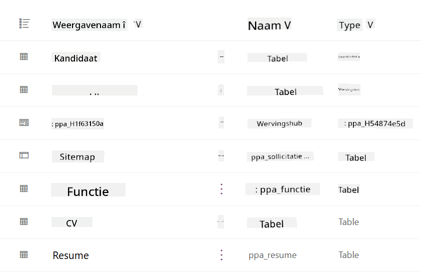
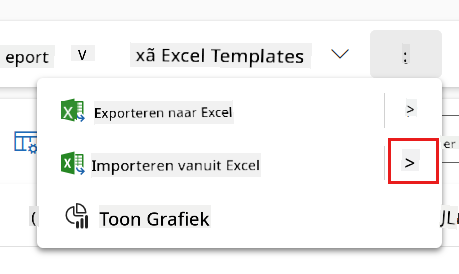
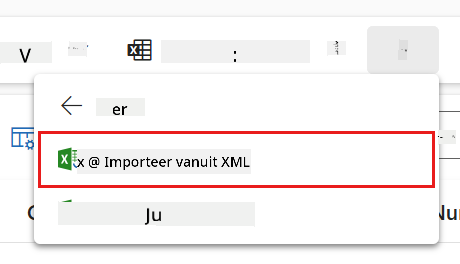
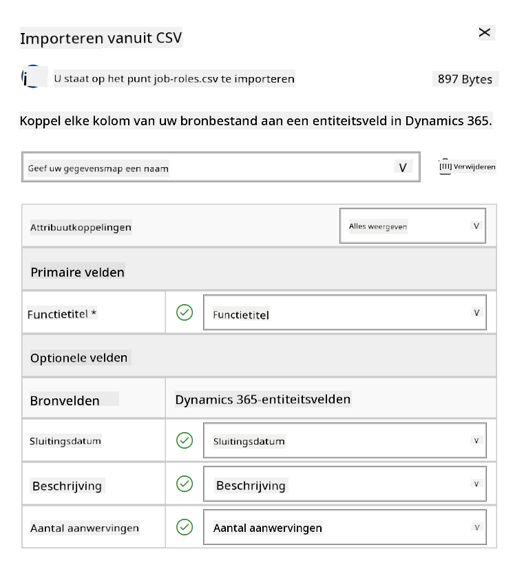
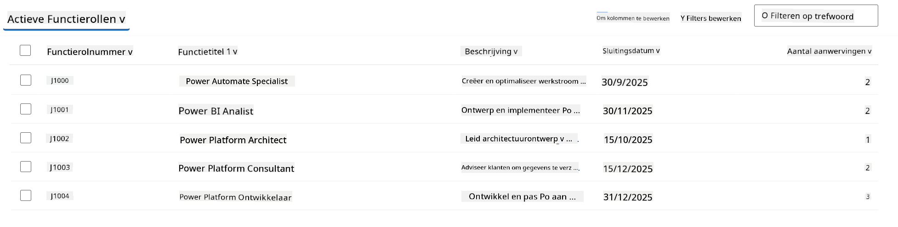
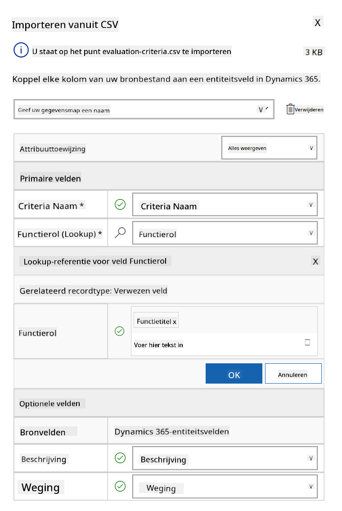
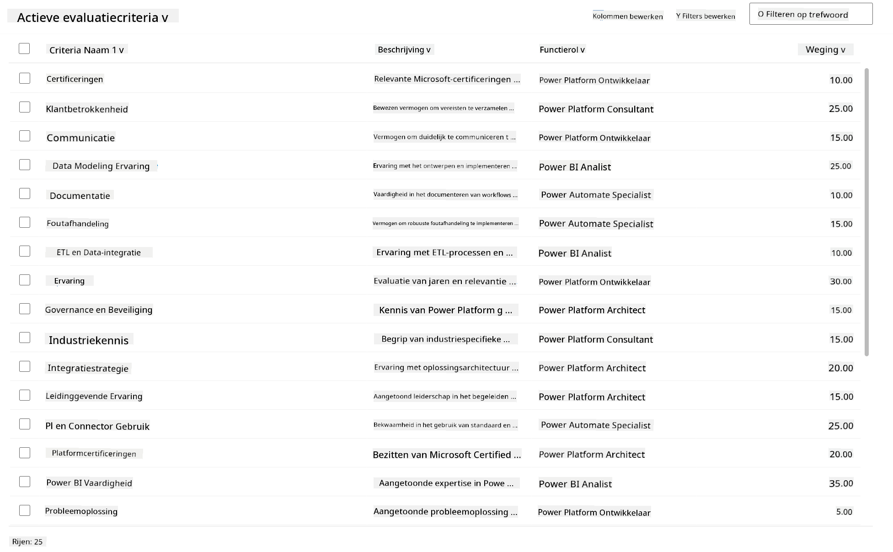

<!--
CO_OP_TRANSLATOR_METADATA:
{
  "original_hash": "2620cf9eaf09a3fc6be7fa31a3a62956",
  "translation_date": "2025-10-17T05:33:27+00:00",
  "source_file": "docs/operative-preview/01-get-started/README.md",
  "language_code": "nl"
}
-->
# 🚨 Missie 01: Aan de slag met de Hiring Agent

--8<-- "disclaimer.md"

## 🕵️‍♂️ CODENAAM: `OPERATIE TALENT SCOUT`

> **⏱️ Operatie Tijdvenster:** `~45 minuten`

## 🎯 Missieoverzicht

Welkom, Agent. Je eerste opdracht is **Operatie Talent Scout** - het opzetten van de basisinfrastructuur voor een AI-gestuurd wervingssysteem dat de manier waarop organisaties toptalent identificeren en aannemen zal transformeren.

Je missie, als je ervoor kiest deze te accepteren, is om een uitgebreid wervingsbeheersysteem te implementeren en configureren met behulp van Microsoft Copilot Studio. Je importeert een vooraf gebouwde oplossing met alle benodigde datastructuren en maakt vervolgens je eerste AI-agent - de **Hiring Agent** - die zal dienen als de centrale coördinator voor alle toekomstige wervingsoperaties.

Deze eerste implementatie vormt het commandocentrum dat je verder zult uitbreiden tijdens het Agent Academy Operative-programma. Beschouw dit als je basis - het fundament waarop je een volledig netwerk van gespecialiseerde agents zult bouwen in de volgende missies.

---

## 🔎 Doelstellingen

Door deze missie te voltooien, zul je:

- **Scenario Begrip**: Uitgebreide kennis opdoen over uitdagingen en oplossingen voor wervingsautomatisering
- **Oplossing Implementatie**: De basis van een wervingsbeheersysteem succesvol importeren en configureren
- **Agent Creatie**: Een Hiring Agent bouwen die het startpunt vormt van het scenario dat je als Agent Academy Operative gaat ontwikkelen

---

## 🔍 Vereisten

Voordat je aan deze missie begint, zorg ervoor dat je beschikt over:

- Een Copilot Studio-licentie
- Toegang tot een Microsoft Power Platform-omgeving
- Beheerdersrechten om oplossingen en agents te maken

---

## 🏢 Begrip van het Wervingsautomatiseringsscenario

Dit scenario laat zien hoe een bedrijf Microsoft Copilot Studio kan gebruiken om het wervingsproces te verbeteren en te automatiseren. Het introduceert een systeem van agents die samenwerken om taken zoals het beoordelen van cv's, het aanbevelen van functies, het voorbereiden van interviewmateriaal en het evalueren van kandidaten te beheren.

### Zakelijke Waarde

De oplossing helpt HR-teams tijd te besparen en betere beslissingen te nemen door:

- Cv's die via e-mail worden ontvangen automatisch te verwerken.
- Geschikte functies voor te stellen op basis van kandidatenprofielen.
- Sollicitaties en interviewgidsen op maat voor elke kandidaat te maken.
- Eerlijke en conforme wervingspraktijken te waarborgen via ingebouwde veiligheids- en moderatiefuncties.
- Feedback te verzamelen om de oplossing te verbeteren.

### Hoe Het Werkt

- Een centrale **Hiring Agent** coördineert het proces en slaat gegevens op in Microsoft Dataverse.
- Een **Application Intake Agent** leest cv's en maakt sollicitaties.
- Een **Interview Prep Agent** genereert interviewvragen en documenten op basis van de achtergrond van de kandidaat.
- Het systeem kan worden gepubliceerd op een demo-website, zodat belanghebbenden ermee kunnen interactie hebben.

Dit scenario is ideaal voor organisaties die hun wervingsprocessen willen moderniseren met AI-gestuurde automatisering, terwijl transparantie, eerlijkheid en efficiëntie worden gewaarborgd.

---

## 🧪 Lab: De Hiring Agent instellen

In dit praktische lab leg je de basis voor je wervingsautomatiseringssysteem. Je begint met het importeren van een vooraf geconfigureerde oplossing die alle benodigde Dataverse-tabellen en datastructuren bevat voor het beheren van kandidaten, functies en wervingsworkflows. Vervolgens vul je deze tabellen met voorbeeldgegevens die je ondersteunen bij het leren tijdens deze module en realistische scenario's bieden voor testen. Ten slotte maak je de Hiring Agent in Copilot Studio, waarbij je de basisconversatie-interface instelt die de hoeksteen zal vormen voor alle andere functies die je in toekomstige missies toevoegt.

### 🧪 Lab 1.1: Oplossing importeren

1. Ga naar **[Copilot Studio](https://copilotstudio.microsoft.com)**
1. Selecteer de **...** in de linker navigatie en selecteer **Solutions**
1. Selecteer de knop **Import Solution** bovenaan
1. **[Download](https://raw.githubusercontent.com/microsoft/agent-academy/refs/heads/main/docs/operative-preview/01-get-started/assets/Operative_1_0_0_0.zip)** de voorbereide oplossing
1. Selecteer **Browse** en kies de gedownloade oplossing uit de vorige stap
1. Selecteer **Next**
1. Selecteer **Import**

!!! success
    Bij succes zie je een groene notificatiebalk met de volgende boodschap wanneer het klaar is:  
    "Solution "Operative" imported successfully."

Wanneer de oplossing is geïmporteerd, bekijk wat je hebt geïmporteerd door de weergavenaam van de oplossing (`Operative`) te selecteren.



De volgende componenten zijn geïmporteerd:

| Weergavenaam | Type | Beschrijving |
|--------------|------|--------------|
| Candidate | Tabel | Informatie over kandidaten |
| Evaluation Criteria | Tabel | Evaluatiecriteria voor de functie |
| Hiring Hub | Model-Driven App | Applicatie voor het beheren van het wervingsproces |
| Hiring Hub | Site Map | Navigatiestructuur voor de Hiring Hub-app |
| Job Application | Tabel | Sollicitaties |
| Job Role | Tabel | Functies |
| Resume | Tabel | Cv's van de kandidaten |

Als laatste taak voor dit lab, selecteer de knop **Publish all customizations** bovenaan de pagina.

### 🧪 Lab 1.2: Voorbeeldgegevens importeren

In dit lab voeg je voorbeeldgegevens toe aan enkele van de tabellen die je hebt geïmporteerd in lab 1.1.

#### Download de bestanden om te importeren

1. **[Download](https://raw.githubusercontent.com/microsoft/agent-academy/refs/heads/main/docs/operative-preview/01-get-started/assets/evaluation-criteria.csv)** het CSV-bestand met de evaluatiecriteria
1. **[Download](https://raw.githubusercontent.com/microsoft/agent-academy/refs/heads/main/docs/operative-preview/01-get-started/assets/job-roles.csv)** het CSV-bestand met de functies

#### Importeer de voorbeeldgegevens voor functies

1. Ga terug naar de oplossing die je zojuist hebt geïmporteerd in het vorige lab
1. Selecteer de **Hiring Hub** Model-Driven App door het vinkje voor de rij te selecteren
1. Selecteer de knop **Play** bovenaan

    !!! warning
        Mogelijk wordt je gevraagd opnieuw in te loggen. Zorg ervoor dat je dat doet. Daarna zou je de Hiring Hub-app moeten zien.

1. Selecteer **Job Roles** in de linker navigatie
1. Selecteer het **Meer**-icoon (drie puntjes onder elkaar) in de commandobalk
1. Selecteer de **rechter pijl** naast *Import from Excel*

    

1. Selecteer **Import from CSV**

    

1. Selecteer de knop **Choose File**, kies het bestand **job-roles.csv** dat je zojuist hebt gedownload en selecteer vervolgens **Open**
1. Selecteer **Next**
1. Laat de volgende stap zoals deze is en selecteer **Review Mapping**

    

1. Zorg ervoor dat de mapping correct is en selecteer **Finish Import**

    !!! info
        Dit start een import en je kunt de voortgang volgen of het proces direct voltooien door **Done** te selecteren

1. Selecteer **Done**

Dit kan even duren, maar je kunt op de knop **Refresh** klikken om te zien of de import is geslaagd.



#### Importeer de voorbeeldgegevens voor evaluatiecriteria

1. Selecteer **Evaluation Criteria** in de linker navigatie
1. Selecteer het **Meer**-icoon (drie puntjes onder elkaar) in de commandobalk
1. Selecteer de **rechter pijl** naast *Import from Excel*

    

1. Selecteer **Import from CSV**

    

1. Selecteer de knop **Choose File**, kies het bestand **evaluation-criteria.csv** dat je zojuist hebt gedownload en selecteer vervolgens **Open**
1. Selecteer **Next**
1. Laat de volgende stap zoals deze is en selecteer **Review Mapping**

    

1. Nu moeten we iets meer werk doen voor de mapping. Selecteer het vergrootglas (🔎 icoon) naast het veld Job Role
1. Zorg ervoor dat **Job Title** hier is geselecteerd, en voeg het toe als dat niet het geval is
1. Selecteer **OK**
1. Zorg ervoor dat de rest van de mapping ook correct is en selecteer **Finish Import**

    !!! info
        Dit start opnieuw een import en je kunt de voortgang volgen of het proces direct voltooien door **Done** te selecteren

1. Selecteer **Done**

Dit kan even duren, maar je kunt op de knop **Refresh** klikken om te zien of de import is geslaagd.



### 🧪 Lab 1.3: De Hiring Agent maken

Nu je klaar bent met het instellen van de vereisten, is het tijd voor het echte werk! Laten we eerst onze Hiring Agent toevoegen!

1. Ga naar **[Copilot Studio](https://copilotstudio.microsoft.com)** en zorg ervoor dat je in dezelfde omgeving bent als waar je de oplossing en de gegevens hebt geïmporteerd
1. Selecteer **Agents** in de linker navigatie
1. Selecteer **New Agent**
1. Selecteer **Configure**
1. Voer voor **Name** in:

    ```text
    Hiring Agent
    ```

1. Voer voor **Description** in:

    ```text
    Central orchestrator for all hiring activities
    ```

1. Selecteer de **...** naast de knop *Create* rechtsboven
1. Selecteer **Update advanced settings**
1. Selecteer als **Solution** `Operative`
1. Selecteer **Update**
1. Selecteer **Create** rechtsboven

Dit zal de Hiring Agent voor je maken, die je zult gebruiken gedurende deze Operative-cursus.

---

## 🎉 Missie Voltooid

Missie 01 is voltooid! Je hebt nu de volgende vaardigheden onder de knie:

✅ **Scenario Begrip**: Uitgebreide kennis van uitdagingen en oplossingen voor wervingsautomatisering  
✅ **Oplossing Implementatie**: De basis van een wervingsbeheersysteem succesvol geïmporteerd en geconfigureerd  
✅ **Agent Creatie**: Een Hiring Agent gebouwd die het startpunt vormt van het scenario dat je gaat ontwikkelen als Agent Academy Operative  

De volgende stap is [Missie 02](../02-multi-agent/README.md): Maak je agent klaar voor meerdere agents met verbonden agents.

---

## 📚 Tactische Bronnen

📖 [Microsoft Copilot Studio - Maak een agent](https://learn.microsoft.com/microsoft-copilot-studio/authoring-first-bot)  
📖 [Microsoft Dataverse Documentatie](https://learn.microsoft.com/power-apps/maker/data-platform)

---

**Disclaimer**:  
Dit document is vertaald met behulp van de AI-vertalingsservice [Co-op Translator](https://github.com/Azure/co-op-translator). Hoewel we streven naar nauwkeurigheid, dient u zich ervan bewust te zijn dat geautomatiseerde vertalingen fouten of onnauwkeurigheden kunnen bevatten. Het originele document in de oorspronkelijke taal moet worden beschouwd als de gezaghebbende bron. Voor kritieke informatie wordt professionele menselijke vertaling aanbevolen. Wij zijn niet aansprakelijk voor eventuele misverstanden of verkeerde interpretaties die voortvloeien uit het gebruik van deze vertaling.