<!--
CO_OP_TRANSLATOR_METADATA:
{
  "original_hash": "616d142d4fb5f45d2a168fad6c1f9545",
  "translation_date": "2025-10-17T05:30:34+00:00",
  "source_file": "docs/operative-preview/07-multimodal-prompts/README.md",
  "language_code": "nl"
}
-->
# 🚨 Missie 07: Inhoud van cv's extraheren met multimodale prompts

--8<-- "disclaimer.md"

## 🕵️‍♂️ CODENAAM: `DOCUMENT CV RECON`

> **⏱️ Operatie Tijdvenster:** `~45 minuten`

## 🎯 Missieoverzicht

Welkom, Operative. Je eerdere missies hebben je uitgerust met krachtige vaardigheden in het orkestreren van agents, maar nu is het tijd om een baanbrekende mogelijkheid te ontgrendelen: **multimodale documentanalyse**.

Je opdracht, als je ervoor kiest om deze te accepteren, is **Document CV Recon** - gestructureerde gegevens met precisie uit elk document halen. Hoewel je agents tekst gemakkelijk kunnen verwerken, vereist de echte wereld dagelijks het omgaan met PDF's, afbeeldingen en complexe documenten. Cv's stapelen zich op, facturen moeten worden verwerkt en formulieren moeten direct worden gedigitaliseerd.

Deze missie zal je transformeren van een agentenbouwer die alleen met tekst werkt naar een **multimodale expert**. Je leert AI configureren die documenten leest en begrijpt zoals een menselijke analist - maar dan met de snelheid en consistentie van AI. Aan het einde van de missie heb je een compleet systeem voor het extraheren van cv's gebouwd dat integreert met je wervingsworkflow.

De technieken die je hier leert, zullen essentieel zijn voor de geavanceerde data-grondingsoperaties in je volgende missie.

## 🔎 Doelstellingen

In deze missie leer je:

1. Wat multimodale prompts zijn en wanneer je verschillende AI-modellen moet gebruiken
1. Hoe je prompts configureert met invoer van afbeeldingen en documenten
1. Hoe je promptuitvoer als JSON kunt formatteren voor gestructureerde gegevensextractie
1. Best practices voor prompt engineering met documentanalyse
1. Hoe je multimodale prompts integreert met Agent Flows

## 🧠 Begrip van multimodale prompts

### Wat maakt een prompt "multimodaal"?

Traditionele prompts werken alleen met tekst. Maar multimodale prompts kunnen meerdere soorten inhoud verwerken:

- **Tekst**: Geschreven instructies en inhoud
- **Afbeeldingen**: Foto's, screenshots, grafieken en diagrammen (.PNG, .JPG, .JPEG)  
- **Documenten**: Facturen, cv's, formulieren (.PDF)

Deze mogelijkheid opent krachtige scenario's zoals het analyseren van cv's, het verwerken van facturen of het extraheren van gegevens uit formulieren.

### Waarom multimodaal belangrijk is voor je workflows

Elke dag staat je organisatie voor deze uitdagingen bij het verwerken van documenten:

- **Cv-screening**: Handmatig honderden cv's lezen kost waardevolle tijd
- **Factuurverwerking**: Leveranciersgegevens, bedragen en datums extraheren uit verschillende documentformaten
- **Formulieranalyse**: Papieren formulieren omzetten in digitale gegevens

Multimodale prompts elimineren deze knelpunten door AI's taalbegrip te combineren met visuele analysemogelijkheden. Dit geeft je AI de mogelijkheid om documenten net zo effectief te verwerken als tekst.

### Veelvoorkomende zakelijke scenario's

Hier zijn enkele voorbeelden van hoe multimodale prompts kunnen worden toegepast:

| Scenario                | Taak                                                                                                                                      | Voorbeeld uitvoervelden                                                                                   |
|-------------------------|-------------------------------------------------------------------------------------------------------------------------------------------|---------------------------------------------------------------------------------------------------------|
| **Cv-screening**        | Naam kandidaat, e-mail, telefoonnummer, huidige functie, aantal jaren ervaring en belangrijkste vaardigheden extraheren.                   | Naam kandidaat, e-mailadres, telefoonnummer, huidige functietitel, aantal jaren ervaring, belangrijkste vaardigheden |
| **Factuurverwerking**   | Leveranciersinformatie, factuurdatum, totaalbedrag en regels uit deze factuur extraheren.                                                 | Naam leverancier, factuurdatum, totaalbedrag, factuurregels                                             |
| **Formulieranalyse**    | Dit aanvraagformulier analyseren en alle ingevulde velden extraheren.                                                                     | Veldnaam (bijv. Naam aanvrager), Ingevoerde waarde (bijv. John Doe), ...                                  |
| **ID-document verificatie** | Naam, ID-nummer, vervaldatum en adres uit dit identiteitsdocument extraheren. Verifiëren dat alle tekst duidelijk leesbaar is en onduidelijke secties markeren. | Volledige naam, Identificatienummer, Vervaldatum, Adres, Vlag voor onduidelijke secties                  |

## ⚙️ Modelselectie in AI Builder

AI Builder biedt verschillende modellen die zijn geoptimaliseerd voor specifieke taken. Begrijpen welk model je moet gebruiken is cruciaal voor succes.

!!! note "Accuraat per september 2025"
    AI Builder-modellen worden regelmatig bijgewerkt, dus controleer de meest recente [AI Builder modelinstellingen documentatie](https://learn.microsoft.com/ai-builder/prompt-modelsettings) voor de huidige beschikbaarheid van modellen.

### Modelvergelijking

Alle onderstaande modellen ondersteunen visuele en documentverwerking.

| Model | 💰Kosten | ⚡Snelheid | ✅Beste voor |
|-------|------|-------|----------|
| **GPT-4.1 mini** | Basis (meest kosteneffectief) | Snel | Standaard documentverwerking, samenvatting, budgetbewuste projecten |
| **GPT-4.1** | Standaard | Gemiddeld | Complexe documenten, geavanceerde contentcreatie, hoge nauwkeurigheidseisen |
| **o3** | Premium | Traag (eerst analyseren) | Gegevensanalyse, kritisch denken, geavanceerde probleemoplossing |
| **GPT-5 chat** | Standaard | Verbeterd | Nieuwste documentbegrip, hoogste responsnauwkeurigheid |
| **GPT-5 reasoning** | Premium | Traag (complexe analyse) | Meest geavanceerde analyse, planning, geavanceerd redeneren |

### Uitleg over temperatuurinstellingen

Temperatuur bepaalt hoe creatief of voorspelbaar de AI-reacties zijn:

- **Temperatuur 0**: Meest voorspelbaar, consistente resultaten (beste voor gegevensextractie)
- **Temperatuur 0.5**: Gebalanceerde creativiteit en consistentie  
- **Temperatuur 1**: Maximale creativiteit (beste voor contentcreatie)

Voor documentanalyse gebruik je **temperatuur 0** om consistente gegevensextractie te garanderen.

## 📊 Uitvoerformaten: Tekst vs JSON

Het kiezen van het juiste uitvoerformaat is cruciaal voor verdere verwerking.

### Wanneer tekstuitvoer te gebruiken

Tekstuitvoer werkt goed voor:

- Menselijk leesbare samenvattingen
- Eenvoudige classificaties
- Inhoud die geen gestructureerde verwerking vereist

### Wanneer JSON-uitvoer te gebruiken

JSON-uitvoer is essentieel voor:

- Gestructureerde gegevensextractie
- Integratie met databases of systemen
- Power Automate flowverwerking
- Consistente veldmapping

### Beste praktijken voor JSON

1. **Definieer duidelijke veldnamen**: Gebruik beschrijvende, consistente namen
1. **Geef voorbeelden**: Voeg voorbeelduitvoer en waarden toe voor elk veld
1. **Specificeer datatypes**: Voeg voorbeelden toe voor datums, nummers en tekst
1. **Omgaan met ontbrekende gegevens**: Plan voor null- of lege waarden
1. **Valideer structuur**: Test met verschillende documenttypes

### Overwegingen voor documentkwaliteit

- **Resolutie**: Zorg ervoor dat afbeeldingen duidelijk en leesbaar zijn
- **Oriëntatie**: Draai documenten naar de juiste oriëntatie voordat je ze verwerkt
- **Ondersteuning van formaten**: Test met je specifieke documenttypes (PDF, JPG, PNG)
- **Groottebeperkingen**: Houd rekening met beperkingen in bestandsgrootte in je omgeving

### Prestatieoptimalisatie

- **Kies geschikte modellen**: Upgrade modellen alleen wanneer nodig
- **Optimaliseer prompts**: Vaak presteren kortere, duidelijkere instructies beter
- **Foutafhandeling**: Plan voor documenten die niet kunnen worden verwerkt
- **Kostenmonitoring**: Verschillende modellen verbruiken verschillende hoeveelheden AI Builder-credits

## 🧪 Lab 7: Een systeem voor cv-extractie bouwen

Tijd om je kennis over multimodale prompts in de praktijk te brengen. Je gaat een uitgebreid systeem voor cv-extractie bouwen dat kandidaatdocumenten analyseert en omzet in gestructureerde gegevens voor je wervingsworkflow.

### Vereisten om deze missie te voltooien

1. Je hebt **ofwel**:

    - **Missie 06 voltooid** en je multi-agent wervingssysteem gereed, **OF**
    - **De starteroplossing van Missie 07 geïmporteerd** als je opnieuw begint of moet inhalen. [Download Mission 07 Starter Solution](https://aka.ms/agent-academy)

1. Voorbeeld-cv-documenten van [Test Resumes](https://download-directory.github.io/?url=https://github.com/microsoft/agent-academy/tree/main/operative/sample-data/resumes&filename=operative_sampledata)

!!! note "Oplossing importeren en voorbeeldgegevens"
    Als je de starteroplossing gebruikt, raadpleeg dan [Missie 01](../01-get-started/README.md) voor gedetailleerde instructies over hoe je oplossingen en voorbeeldgegevens in je omgeving kunt importeren.

### 7.1 Maak een multimodale prompt

Je eerste doel: maak een prompt die cv-documenten kan analyseren en gestructureerde gegevens kan extraheren.

1. Log in op [Copilot Studio](https://copilotstudio.microsoft.com) en selecteer **Tools** in de linker navigatie.

1. Selecteer **+ Nieuwe tool**, en selecteer vervolgens **Prompt**.  
    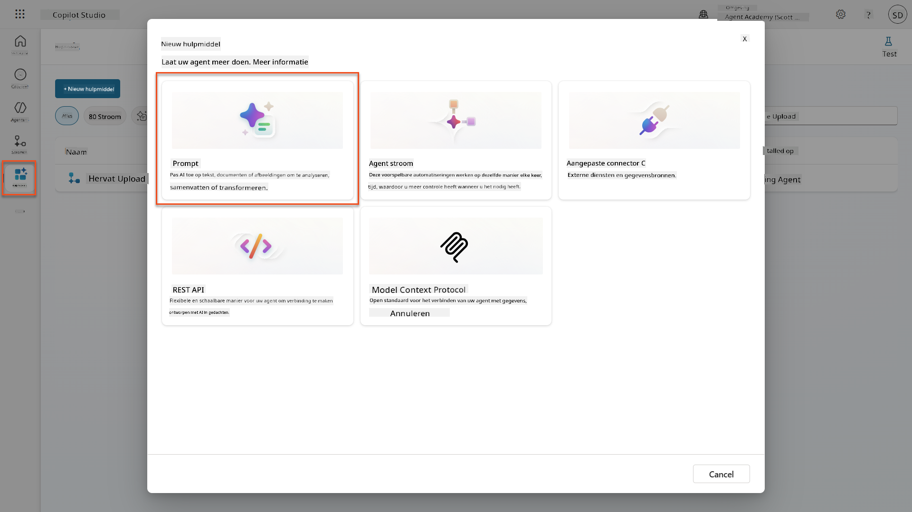

1. **Hernoem** de prompt van de standaard tijdstempelnaam (bijv. *Aangepaste prompt 09/04/2025, 04:59:11 PM*) naar `Samenvatting CV`.

1. Voeg in het veld Instructies deze prompt toe:

    ```text
    You are tasked with extracting key candidate information from a resume and cover letter to facilitate matching with open job roles and creating a summary for application review.
    
    Instructions:
    1. Extract Candidate Details:
        - Identify and extract the candidate’s full name.
        - Extract contact information, specifically the email address.
    2. Create Candidate Summary:
        - Summarize the candidate’s profile as multiline text (max 2000 characters) with the following sections:
            - Candidate name
            - Role(s) applied for if present
            - Contact and location
            - One-paragraph summary
            - Experience snapshot (last 2–3 roles with outcomes)
            - Key projects (1–3 with metrics)
            - Education and certifications
            - Top skills (Top 10)
            - Availability and work authorization
    
    Guidelines:
    - Extract information only from the provided resume and cover letter documents.
    - Ensure accuracy in identifying all details such as contact details and skills.
    - The summary should be concise but informative, suitable for quick application review.
    
    Resume: /document
    CoverLetter: /text
    ```

    !!! tip "Gebruik Copilot-assistentie"
        Je kunt "Aan de slag met Copilot" gebruiken om je prompt te genereren met natuurlijke taal. Probeer Copilot te vragen om een prompt te maken om een cv samen te vatten!

1. **Configureer** de invoerparameters:

    | Parameter | Type | Naam | Voorbeeldgegevens |
    |-----------|------|------|-------------------|
    | CV | Afbeelding of document | CV | Upload een voorbeeld-cv uit de testgegevensmap |
    | Motivatiebrief | Tekst | Motivatiebrief | Hier is een CV! |

1. Selecteer **Test** om de initiële tekstuitvoer van je prompt te bekijken.  
    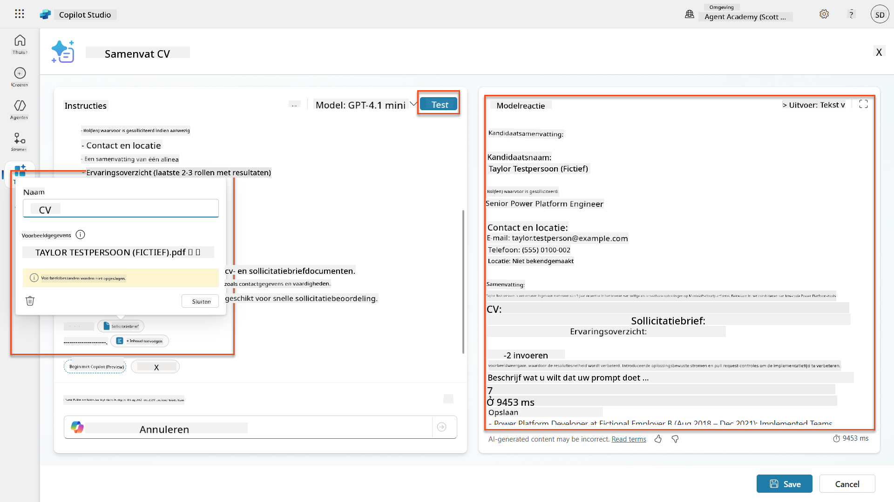

### 7.2 JSON-uitvoer configureren

Nu ga je de prompt omzetten naar gestructureerde JSON-uitvoer in plaats van gewone tekst.

1. Voeg deze JSON-formaatspecificatie toe aan het einde van je promptinstructies:

    ```text
    Output Format:
    Provide the output in valid JSON format with the following structure:
    
    {
        "CandidateName": "string",
        "Email": "string",
        "Summary": "string max 2000 characters",
        "Skills": [ {"item": "Skill 1"}, {"item": "Skill 2"}],
        "Experience": [ {"item": "Experience 1"}, {"item": "Experience 2"}],
    }
    ```

1. Verander de **Uitvoer**-instelling van "Tekst" naar **JSON**.

1. Selecteer **Test** opnieuw om te verifiëren dat de uitvoer nu is geformatteerd als JSON.  
    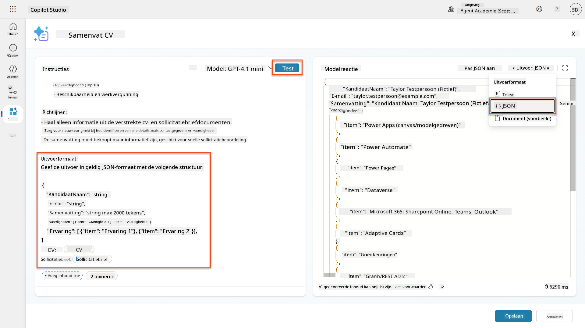

1. **Optioneel:** Experimenteer met verschillende AI-modellen om te zien hoe de uitvoer varieert, en keer vervolgens terug naar het standaardmodel.

1. Selecteer **Opslaan** om de prompt te maken.

1. In het **Configureren voor gebruik in Agent**-dialoogvenster, selecteer **Annuleren**.

    !!! info "Waarom we dit nog niet als tool toevoegen"
        Je gebruikt deze prompt in een Agent Flow in plaats van direct als tool, wat je meer controle geeft over de gegevensverwerkingsworkflow.

### 7.3 Prompt toevoegen aan een Agent Flow

Je gaat een Agent Flow maken die je prompt gebruikt om cv's te verwerken die zijn opgeslagen in Dataverse.

!!! tip "Agent Flow Expressies"
    Het is erg belangrijk dat je de instructies voor het benoemen van je knooppunten en het invoeren van expressies precies volgt, omdat de expressies verwijzen naar de vorige knooppunten met hun naam! Raadpleeg de [Agent Flow missie in Recruit](../../recruit/09-add-an-agent-flow/README.md#you-mentioned-expressions-what-are-expressions) voor een snelle opfrisser!

1. Navigeer naar je **Wervingsagent** binnen Copilot Studio

1. Selecteer het **Agents**-tabblad en selecteer de onderliggende **Aanvraag Intake Agent**

1. Binnen het **Tools**-paneel, selecteer **+ Toevoegen** → **+ Nieuwe tool** → **Agent flow**

1. Selecteer het knooppunt "Wanneer een agent de flow oproept", gebruik **+ Voeg een invoer toe** om de volgende parameter toe te voegen:

    | Type | Naam | Beschrijving |
    |------|------|-------------|
    | Tekst | CvNummer | Zorg ervoor dat je [CvNummer] gebruikt. Dit moet altijd beginnen met de letter R |

1. Selecteer het **+** Invoegactie-icoon onder het eerste knooppunt, zoek naar **Dataverse**, selecteer **Meer zien**, en zoek vervolgens de actie **Rijen opvragen**

1. Selecteer de **ellips (...)** op het knooppunt Rijen opvragen, en selecteer **Hernoemen** naar `Haal Cv Record op`, en stel de volgende parameters in:

    | Eigenschap | Hoe in te stellen | Waarde |
    |------------|-------------------|--------|
    | **Tabelnaam** | Selecteer | Cv's |
    | **Filterrijen** | Dynamische gegevens (bliksemschicht-icoon) | `ppa_cvnummer eq 'CvNummer'` Vervang **CvNummer** door **Wanneer een agent de flow oproept** → **CvNummer** |
    | **Aantal rijen** | Voer in | 1 |

    !!! tip "Optimaliseer die queries!"
        Wanneer je deze techniek in productie gebruikt, moet je altijd de geselecteerde kolommen beperken tot alleen die welke nodig zijn voor de Agent Flow.

    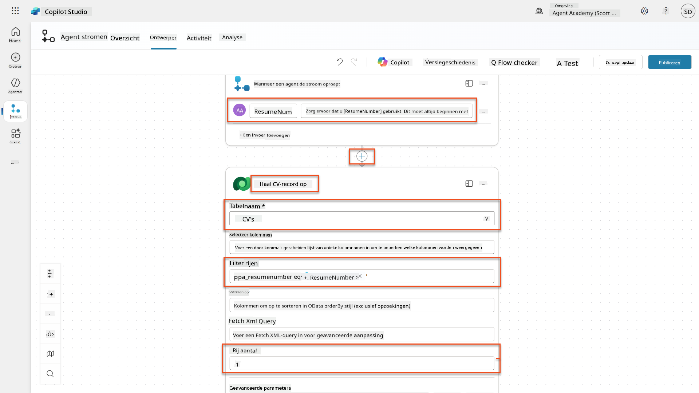

1. Selecteer het **+** Invoegactie-icoon onder het knooppunt Haal Cv Record op, zoek naar **Dataverse**, selecteer **Meer zien**, en zoek vervolgens de actie **Een bestand of afbeelding downloaden**.

    !!! tip "Kies de juiste actie!"
        Zorg ervoor dat je niet de actie selecteert die eindigt met "van geselecteerde omgeving"

1. Zoals eerder, hernoem de actie naar `Download Cv`, en stel vervolgens de volgende parameters in:

    | Eigenschap | Hoe in te stellen | Waarde |
    |------------|-------------------|--------|
    | **Tabelnaam** | Selecteer | Cv's |
    | **Rij-ID** | Expressie (fx-icoon) | `first(body('Haal_Cv_Record_op')?['value'])?['ppa_cvid']` |
    | **Kolomnaam** | Selecteer | Cv PDF |

    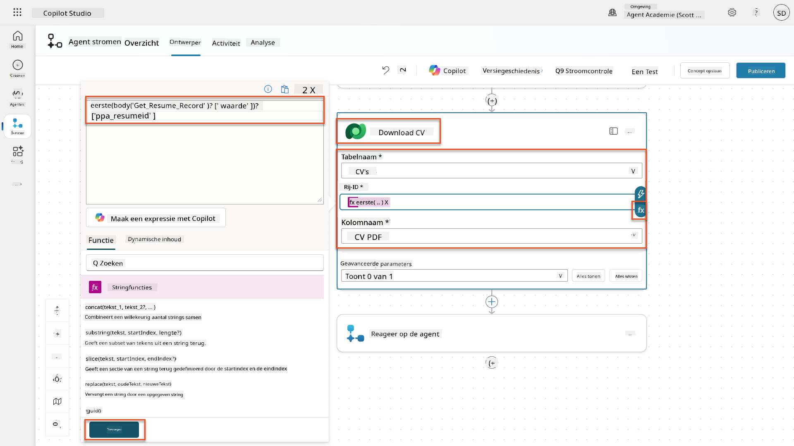

1. Selecteer nu het **+** Invoegactie-icoon onder Download Cv, onder **AI-mogelijkheden**, selecteer **Voer een prompt uit**,

1. Hernoem de actie naar `Samenvatting Cv` en stel de volgende parameters in:

    | Eigenschap | Hoe in te stellen | Waarde |
    |------------|-------------------|--------|
| **Prompt** | Selecteer | Samenvat CV |
| **CoverLetter** | Expressie (fx-icoon) | `first(body('Get_Resume_Record')?['value'])?['ppa_coverletter']` |
| **Resume** | Dynamische gegevens (bliksemschicht-icoon) | Download CV → Bestand of afbeeldingsinhoud |

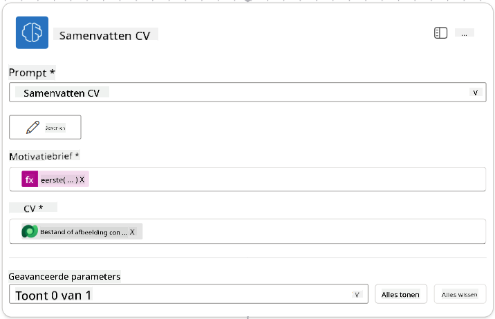

!!! tip "Prompt Parameters"
Let op dat de parameters die je invult dezelfde zijn als die je hebt geconfigureerd als invoerparameters toen je je prompt maakte.

### 7.4 Maak kandidaatrecord

Vervolgens moet je de informatie die de Prompt je heeft gegeven gebruiken om een nieuw kandidaatrecord aan te maken, als deze nog niet bestaat.

1. Selecteer het **+** Actie-invoegen-icoon onder de Samenvat CV-node, zoek naar **Dataverse**, selecteer **Meer weergeven**, en zoek vervolgens de actie **Rijen weergeven**.

1. Hernoem de node naar `Get Existing Candidate` en stel de volgende parameters in:

    | Eigenschap | Hoe in te stellen | Waarde |
    |------------|-------------------|--------|
    | **Tabelnaam** | Selecteer | Kandidaten |
    | **Filterrijen** | Dynamische gegevens (bliksemschicht-icoon) | `ppa_email eq 'Email'`  **Vervang** `Email` door **Samenvat CV → Email** |
    | **Rijenaantal** | Voer in | 1 |

    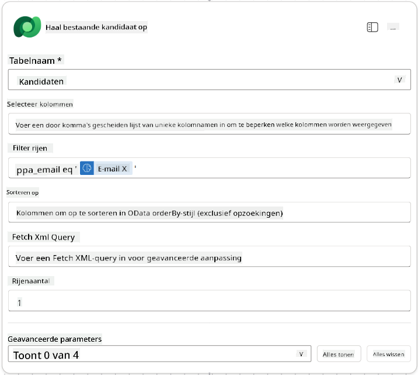

1. Selecteer het **+** Actie-invoegen-icoon onder de Get Existing Candidate-node, zoek naar **Control**, selecteer **Meer weergeven**, en zoek vervolgens de actie **Voorwaarde**.

1. Stel in de eigenschappen van de voorwaarde de volgende voorwaarde in:

    | Voorwaarde | Operator | Waarde |
    |------------|----------|--------|
    | Expressie (fx-icoon): `length(outputs('Get_Existing_Candidate')?['body/value'])` | is gelijk aan | 0 |

    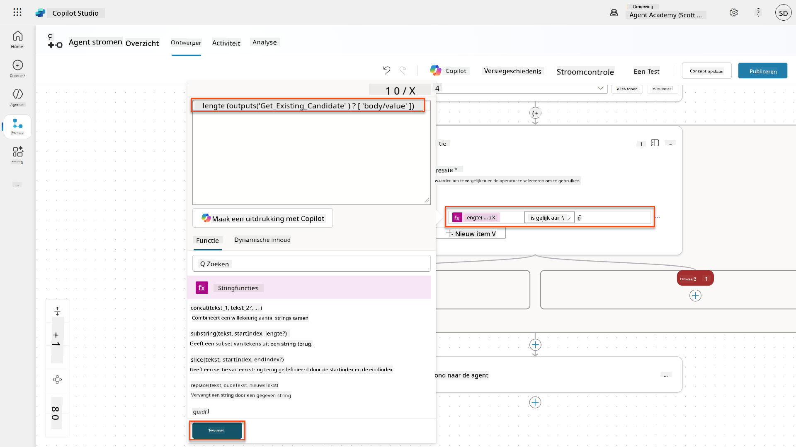

1. Selecteer het **+** Actie-invoegen-icoon in de **True**-tak, zoek naar **Dataverse**, selecteer **Meer weergeven**, en zoek vervolgens de actie **Voeg een nieuwe rij toe**.

1. Hernoem de node naar `Add a New Candidate` en stel de volgende parameters in:

    | Eigenschap | Hoe in te stellen | Waarde |
    |------------|-------------------|--------|
    | **Tabelnaam** | Selecteer | Kandidaten |
    | **Kandidaatnaam** | Dynamische gegevens (bliksemschicht-icoon) | Samenvat CV → `CandidateName` |
    | **Email** | Dynamische gegevens (bliksemschicht-icoon) | Samenvat CV → `Email` |

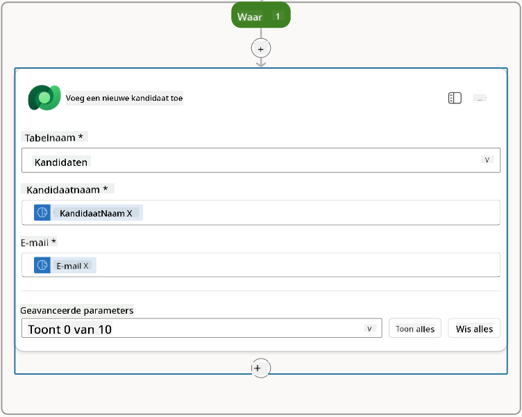

### 7.5 Update CV en configureer flow-uitvoer

Voltooi de flow door het CV-record bij te werken en te configureren welke gegevens aan je agent worden geretourneerd.

1. Selecteer het **+** Actie-invoegen-icoon onder de voorwaarde, zoek naar **Dataverse**, selecteer **Meer weergeven**, en zoek vervolgens de actie **Update een rij**.

1. Selecteer de titel om de node te hernoemen naar `Update Resume`, selecteer **Alles weergeven**, en stel de volgende parameters in:

    | Eigenschap | Hoe in te stellen | Waarde |
    |------------|-------------------|--------|
    | **Tabelnaam** | Selecteer | CV's |
    | **Rij-ID** | Expressie (fx-icoon) | `first(body('Get_Resume_Record')?['value'])?['ppa_resumeid']` |
    | **Samenvatting** | Dynamische gegevens (bliksemschicht-icoon) | Samenvat CV → Tekst |
    | **Kandidaat (Kandidaten)** | Expressie (fx-icoon) | `if(equals(length(outputs('Get_Existing_Candidate')?['body/value']), 1), first(outputs('Get_Existing_Candidate')?['body/value'])?['ppa_candidateid'], outputs('Add_a_New_Candidate')?['body/ppa_candidateid'])` |

    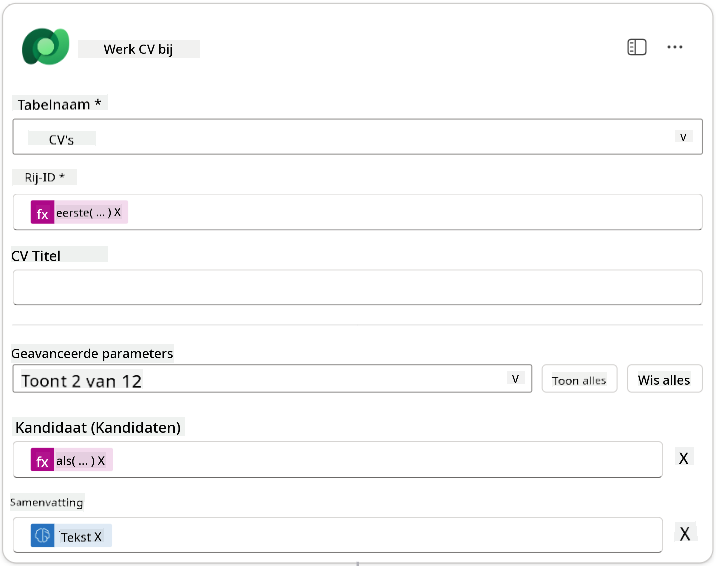

1. Selecteer de node **Reageer op de agent** en gebruik **+ Voeg een uitvoer toe** om te configureren:

    | Type | Naam              | Hoe in te stellen                | Waarde                                                        | Beschrijving                                            |
    |------|-------------------|----------------------------------|--------------------------------------------------------------|--------------------------------------------------------|
    | Tekst | `CandidateName`   | Dynamische gegevens (bliksemschicht-icoon) | Samenvat CV → Meer weergeven → CandidateName                  | De [CandidateName] opgegeven in het CV                |
    | Tekst | `CandidateEmail`  | Dynamische gegevens (bliksemschicht-icoon) | Samenvat CV → Meer weergeven → Email                          | De [CandidateEmail] opgegeven in het CV               |
    | Tekst | `CandidateNumber` | Expressie (fx-icoon)            | `concat('ppa_candidates/', if(equals(length(outputs('Get_Existing_Candidate')?['body/value']), 1), first(outputs('Get_Existing_Candidate')?['body/value'])?['ppa_candidateid'], outputs('Add_a_New_Candidate')?['body/ppa_candidateid']) )` | Het [CandidateNumber] van de nieuwe of bestaande kandidaat |
    | Tekst | `ResumeSummary`   | Dynamische gegevens (bliksemschicht-icoon) | Samenvat CV → Meer weergeven → body/responsev2/predictionOutput/structuredOutput | De samenvatting en details van het CV in JSON-formaat |

    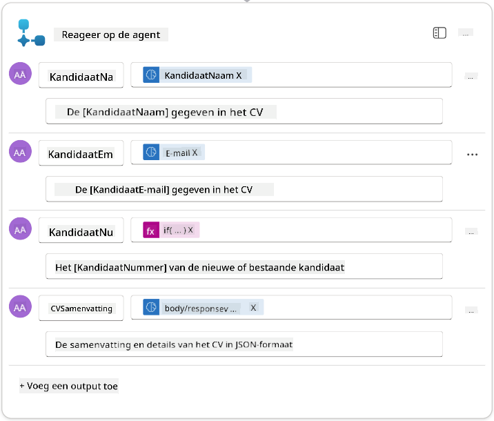

1. Selecteer **Concept opslaan** rechtsboven. Je Agent Flow zou er als volgt uit moeten zien  
    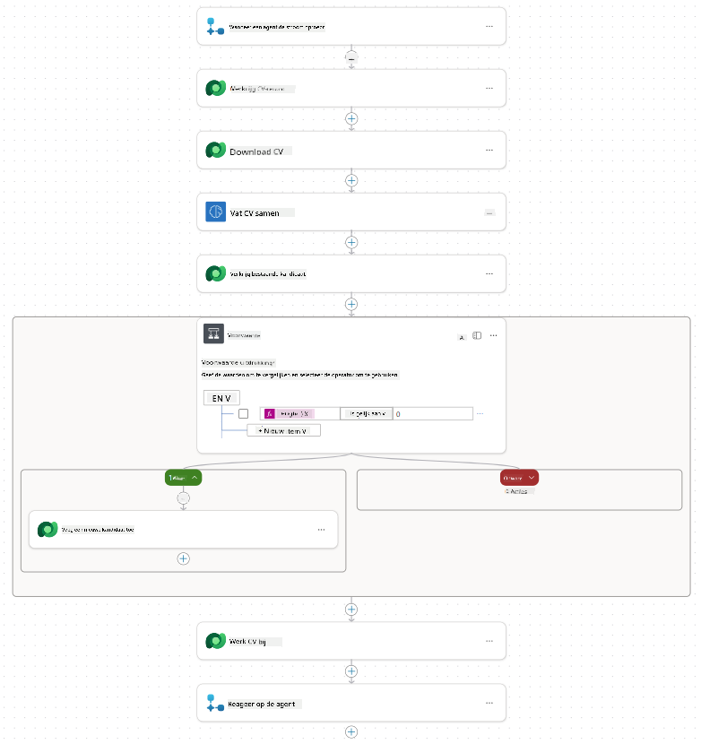

1. Selecteer het tabblad **Overzicht**, selecteer **Bewerken** in het **Details**-paneel.

    1. **Flow naam**:`Samenvat CV`
    1. **Beschrijving**:

        ```text
        Summarize an existing Resume stored in Dataverse using a [ResumeNumber] as input, return the [CandidateNumber], and resume summary JSON
        ```

1. Selecteer **Opslaan**.

1. Selecteer het tabblad **Ontwerper** opnieuw en selecteer **Publiceren**.

### 7.6 Verbind de flow met je agent

Nu voeg je de flow toe als een tool en configureer je je agent om deze te gebruiken.

1. Open je **Hiring Agent** in Copilot Studio.

1. Selecteer het tabblad **Agents** en open de **Application Intake Agent**.

1. Selecteer het **Tools**-paneel en selecteer **+ Voeg een tool toe** → **Flow** → **Samenvat CV** **(Agent Flow)**.

1. Selecteer **Toevoegen en configureren**.

1. Configureer de toolinstellingen als volgt:

    | Instelling | Waarde |
    |------------|--------|
    | **Beschrijving** | Vat een bestaand CV samen dat is opgeslagen in Dataverse met een [ResumeNumber] als invoer, retourneer het [CandidateNumber] en de samenvatting van het CV in JSON |
    | **Wanneer deze tool kan worden gebruikt** | Alleen wanneer verwezen door onderwerpen of agents |

1. Selecteer **Opslaan**  
    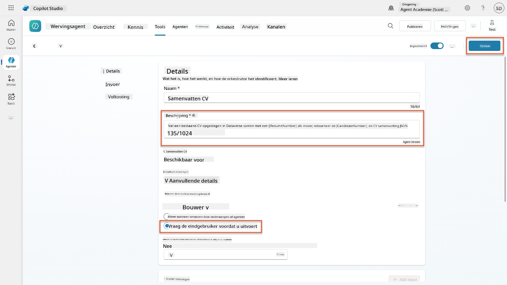

1. Als je Tools selecteert binnen de Hiring Agent, zie je nu dat beide tools bruikbaar zijn door de **Application Intake Agent**.  
    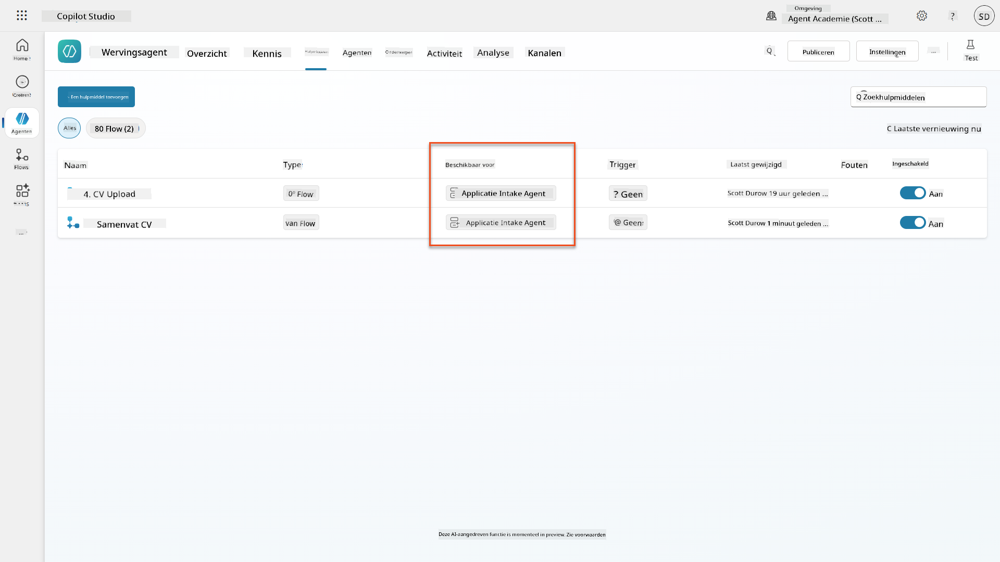

1. Navigeer naar de **Application Intake Child** agent-instructies en wijzig de **Post-Upload**-stap naar het volgende:

    ```text
    2. Post-Upload Processing  
        - After uploading, be sure to also output the [ResumeNumber] in all messages
        - Pass [ResumeNumber] to /Summarize Resume  - Be sure to use the correct value that will start with the letter R.
        - Be sure to also output the [CandidateNumber] in all messages
        - Use the [ResumeSummary] to output a summary of the processed Resume and candidate
    ```

    Vervang `/Summarize Resume` door een verwijzing naar de **Samenvat CV agent flow** door een schuine streep (`/)` te typen of `/Summarize` te selecteren om de verwijzing in te voegen.  
    

1. Selecteer **Opslaan**.

### 7.7 Test je agent

Test je complete multimodale systeem om ervoor te zorgen dat alles correct werkt.

1. **Start testen**:

    - Selecteer **Test** om het testpaneel te openen
    - Typ: `Hier is een kandidaat CV`

    - Upload een van de voorbeeld-CV's van [Test Resumes](https://download-directory.github.io/?url=https://github.com/microsoft/agent-academy/tree/main/operative/sample-data/resumes&filename=operative_sampledata)

1. **Controleer de resultaten**:
    - Zodra je het bericht en CV verzendt, controleer of je een CV-nummer ontvangt (formaat: R#####)
    - Controleer of je een kandidaatnummer en samenvatting ontvangt
    - Gebruik de activiteitenkaart om zowel de CV-uploadtool als de Samenvat CV-tool in actie te zien, en controleer of de uitvoer van de samenvattingsprompt door de agent wordt ontvangen:  
        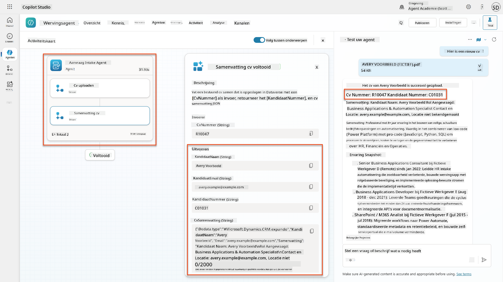

1. **Controleer gegevensopslag**:
    - Navigeer naar [Power Apps](https://make.powerapps.com)
    - Open **Apps** → **Hiring Hub** → **Afspelen**
    - Ga naar **CV's** om te controleren of het CV is geüpload en verwerkt. Het zou zowel samenvattingsinformatie als een gekoppeld kandidaatrecord moeten hebben.
    - Controleer **Kandidaten** om de geëxtraheerde kandidaatgegevens te zien  
        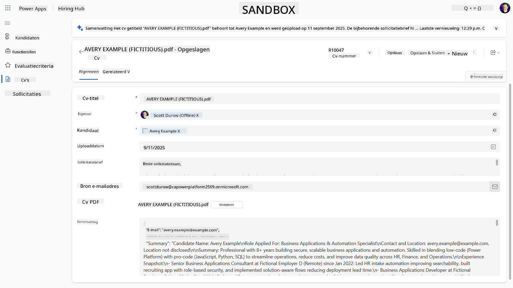
    - Wanneer je het proces opnieuw uitvoert, zou het de bestaande kandidaat moeten gebruiken (gematcht op het e-mailadres dat uit het CV is gehaald) in plaats van een nieuwe te maken.

!!! tip "Problemen oplossen"
    - **CV wordt niet verwerkt**: Zorg ervoor dat het bestand een PDF is en binnen de groottebeperkingen valt
    - **Geen kandidaat aangemaakt**: Controleer of het e-mailadres correct is geëxtraheerd uit het CV
    - **JSON-formaatfouten**: Controleer of je promptinstructies de exacte JSON-structuur bevatten
    - **Flow-fouten**: Controleer of alle Dataverse-verbindingen en expressies correct zijn geconfigureerd

### Productiegereedheid

Hoewel dit geen onderdeel is van deze missie, kun je overwegen om de volgende stappen te nemen om deze agent flow productiegereed te maken:

1. **Foutafhandeling** - Als het CV-nummer niet werd gevonden of de prompt het document niet kon verwerken, moet er foutafhandeling worden toegevoegd om een duidelijke foutmelding aan de agent te retourneren.
1. **Bestaande kandidaten bijwerken** - De kandidaat wordt gevonden via het e-mailadres, waarna de naam kan worden bijgewerkt om overeen te komen met die op het CV.
1. **Het splitsen van de CV-samenvatting en het aanmaken van de kandidaat** - Deze functionaliteit kan worden opgesplitst in kleinere agent flows om ze gemakkelijker te onderhouden, waarna de agent instructies krijgt om ze achtereenvolgens te gebruiken.

## 🎉 Missie Voltooid

Uitstekend werk, Operative! **Document CV Recon** is nu voltooid. Je hebt met succes multimodale prompts onder de knie en kunt nu gestructureerde gegevens uit elk document met precisie extraheren.

Dit heb je bereikt in deze missie:

**✅ Meesterschap over multimodale prompts**  
Je begrijpt nu wat multimodale prompts zijn en wanneer je verschillende AI-modellen moet gebruiken voor optimale resultaten.

**✅ Expertise in documentverwerking**  
Je hebt geleerd prompts te configureren met beeld- en documentinvoer en uitvoer te formatteren als JSON voor gestructureerde gegevensextractie.

**✅ CV-extractiesysteem**  
Je hebt een compleet CV-extractiesysteem gebouwd dat kandidaatdocumenten verwerkt en integreert met je wervingsworkflow.

**✅ Implementatie van best practices**  
Je hebt best practices toegepast voor prompt engineering met documentanalyse en multimodale prompts geïntegreerd met Agent Flows.

**✅ Basis voor geavanceerde verwerking**  
Je verbeterde documentanalysecapaciteiten zijn nu klaar voor de geavanceerde gegevensgrondingsfuncties die we in komende missies zullen toevoegen.

🚀 **Volgende stap:** In Missie 08 ontdek je hoe je je prompts kunt verbeteren met realtime gegevens uit Dataverse, waardoor je dynamische AI-oplossingen kunt creëren die zich aanpassen aan veranderende zakelijke vereisten.

⏩ [Ga naar Missie 08: Verbeterde prompts met Dataverse-gronding](../08-dataverse-grounding/README.md)

## 📚 Tactische bronnen

📖 [Maak een prompt](https://learn.microsoft.com/ai-builder/create-a-custom-prompt?WT.mc_id=power-power-182762-scottdurow)

📖 [Voeg tekst-, beeld- of documentinvoer toe aan je prompt](https://learn.microsoft.com/ai-builder/add-inputs-prompt?WT.mc_id=power-182762-scottdurow)

📖 [Verwerk reacties met JSON-uitvoer](https://learn.microsoft.com/ai-builder/process-responses-json-output?WT.mc_id=power-182762-scottdurow)

📖 [Modelselectie en temperatuurinstellingen](https://learn.microsoft.com/ai-builder/prompt-modelsettings?WT.mc_id=power-182762-scottdurow)

📖 [Gebruik je prompt in Power Automate](https://learn.microsoft.com/ai-builder/use-a-custom-prompt-in-flow?WT.mc_id=power-182762-scottdurow)

📺 [AI Builder: JSON-uitvoer in prompt builder](https://www.youtube.com/watch?v=F0fGnWrRY_I)

---

**Disclaimer**:  
Dit document is vertaald met behulp van de AI-vertalingsservice [Co-op Translator](https://github.com/Azure/co-op-translator). Hoewel we streven naar nauwkeurigheid, dient u zich ervan bewust te zijn dat geautomatiseerde vertalingen fouten of onnauwkeurigheden kunnen bevatten. Het originele document in de oorspronkelijke taal moet worden beschouwd als de gezaghebbende bron. Voor kritieke informatie wordt professionele menselijke vertaling aanbevolen. Wij zijn niet aansprakelijk voor eventuele misverstanden of verkeerde interpretaties die voortvloeien uit het gebruik van deze vertaling.