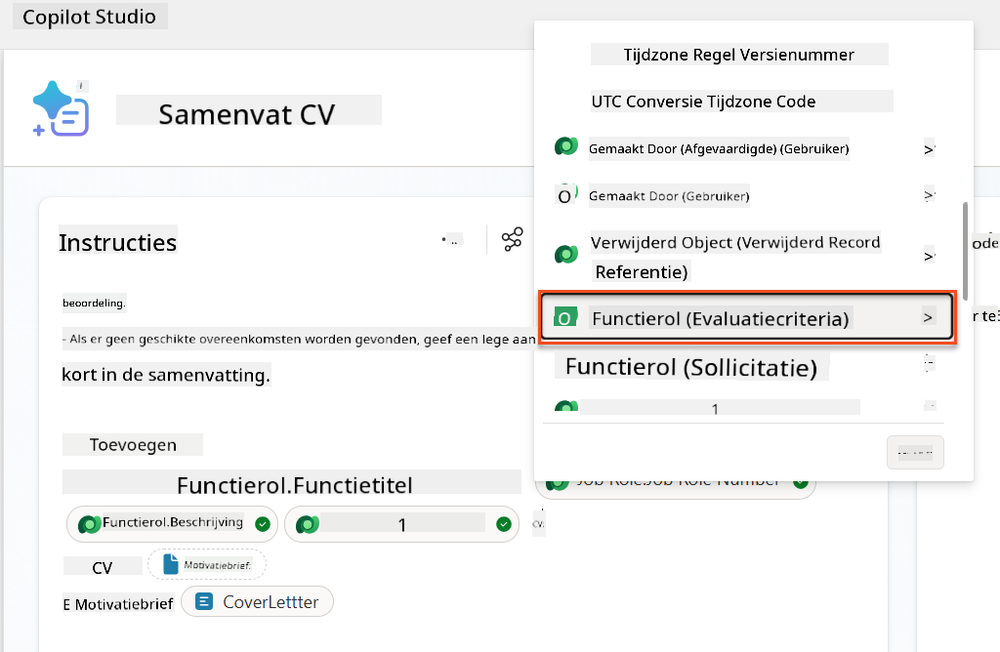
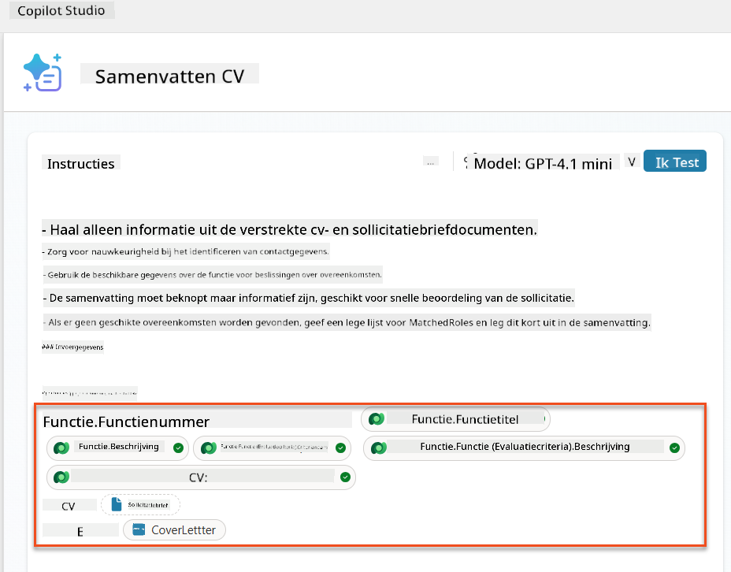
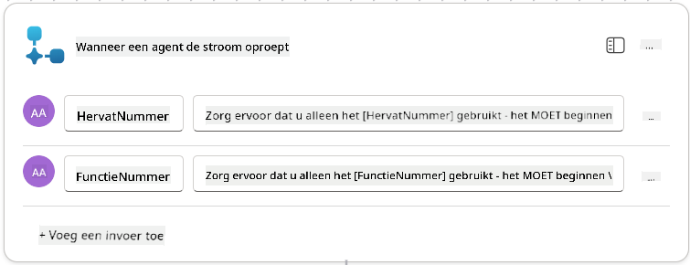
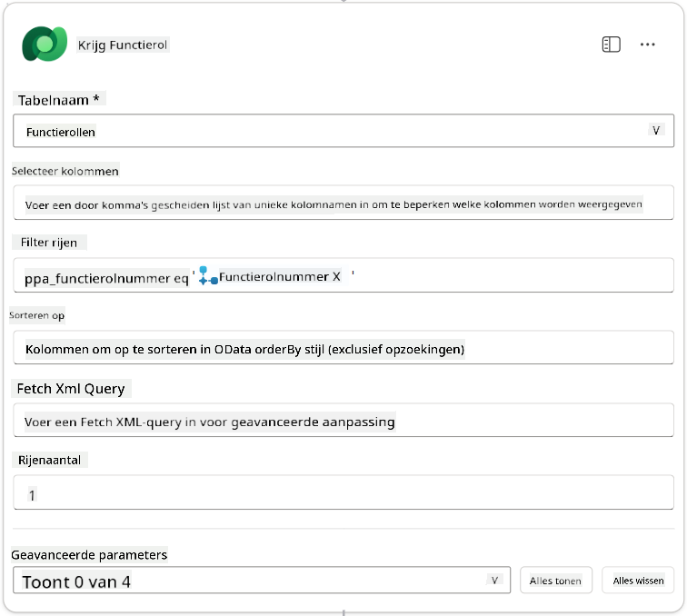
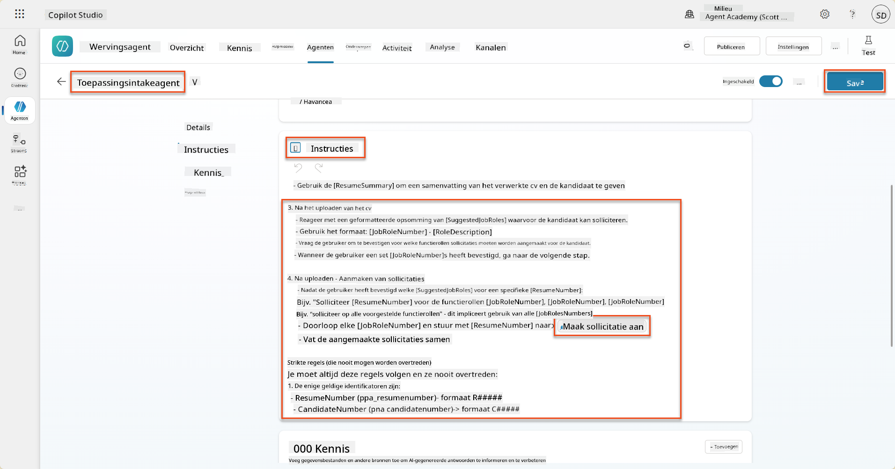
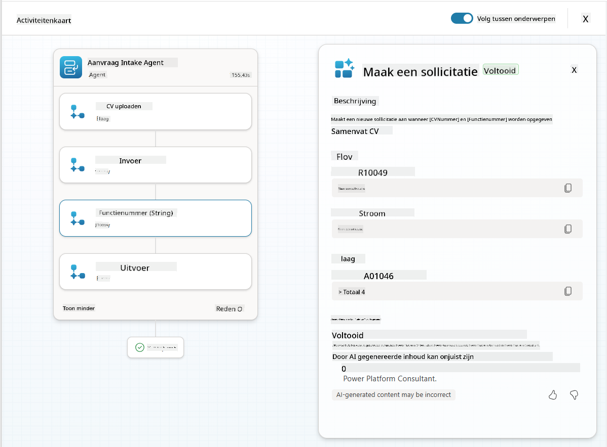

<!--
CO_OP_TRANSLATOR_METADATA:
{
  "original_hash": "750f3ea8a94930439ebd8a10871b1d73",
  "translation_date": "2025-10-17T05:23:48+00:00",
  "source_file": "docs/operative-preview/08-dataverse-grounding/README.md",
  "language_code": "nl"
}
-->
# 🚨 Missie 08: Verbeterde prompts met Dataverse-ondersteuning

--8<-- "disclaimer.md"

## 🕵️‍♂️ CODENAAM: `OPERATIE GRONDINGSCONTROLE`

> **⏱️ Operatietijdvenster:** `~60 minuten`

## 🎯 Missieoverzicht

Welkom terug, Operative. Jouw multi-agent wervingssysteem is operationeel, maar er is een cruciale verbetering nodig voor **data-ondersteuning** - jouw AI-modellen hebben real-time toegang nodig tot de gestructureerde gegevens van jouw organisatie om intelligente beslissingen te kunnen nemen.

Momenteel werkt jouw Samenvatting CV-prompt met statische kennis. Maar wat als het dynamisch toegang zou hebben tot jouw database met functierollen om nauwkeurige, actuele matches te bieden? Wat als het jouw evaluatiecriteria begreep zonder dat je deze handmatig hoeft in te voeren?

In deze missie ga je jouw aangepaste prompt verbeteren met **Dataverse-ondersteuning** - door jouw prompts direct te verbinden met live gegevensbronnen. Dit transformeert jouw agents van statische respondenten naar dynamische, datagestuurde systemen die zich aanpassen aan veranderende zakelijke behoeften.

Jouw missie: integreer real-time gegevens over functierollen en evaluatiecriteria in jouw workflow voor cv-analyse, en creëer een zelf-updatend systeem dat altijd actueel blijft met de wervingsvereisten van jouw organisatie.

## 🔎 Doelstellingen

In deze missie leer je:

1. Hoe **Dataverse-ondersteuning** aangepaste prompts verbetert
1. Wanneer je data-ondersteuning moet gebruiken versus statische instructies
1. Het ontwerpen van prompts die dynamisch live gegevens integreren
1. Het verbeteren van de Samenvatting CV-flow met functierolmatching

## 🧠 Begrip van Dataverse-ondersteuning voor prompts

**Dataverse-ondersteuning** stelt jouw aangepaste prompts in staat om live gegevens uit jouw Dataverse-tabellen te gebruiken bij het verwerken van verzoeken. In plaats van statische instructies kunnen jouw prompts real-time informatie opnemen om weloverwogen beslissingen te nemen.

### Waarom Dataverse-ondersteuning belangrijk is

Traditionele prompts werken met vaste instructies:

```text
Match this candidate to these job roles: Developer, Manager, Analyst
```

Met Dataverse-ondersteuning heeft jouw prompt toegang tot actuele gegevens:

```text
Match this candidate to available job roles from the Job Roles table, 
considering current evaluation criteria and requirements
```

Deze aanpak biedt verschillende belangrijke voordelen:

- **Dynamische updates:** Functierollen en criteria veranderen zonder dat de prompt hoeft te worden aangepast
- **Consistentie:** Alle agents gebruiken dezelfde actuele gegevensbronnen
- **Schaalbaarheid:** Nieuwe rollen en criteria zijn automatisch beschikbaar
- **Nauwkeurigheid:** Real-time gegevens zorgen ervoor dat beslissingen de huidige behoeften weerspiegelen

### Hoe Dataverse-ondersteuning werkt

Wanneer je Dataverse-ondersteuning inschakelt voor een aangepaste prompt:

1. **Gegevensselectie:** Kies specifieke Dataverse-tabellen en kolommen om op te nemen. Je kunt ook gerelateerde tabellen selecteren die het systeem filtert op basis van de opgehaalde hoofdrecords.
1. **Contextinjectie:** De prompt voegt automatisch de opgehaalde gegevens toe aan de promptcontext.
1. **Intelligent filteren:** Het systeem neemt alleen gegevens op die relevant zijn voor het huidige verzoek als je een filter opgeeft.
1. **Gestructureerde output:** Jouw prompt kan verwijzen naar de opgehaalde gegevens en redeneren over de opgehaalde records om de output te creëren.

### Van statisch naar dynamisch: Het voordeel van ondersteuning

Laten we jouw huidige Samenvatting CV-flow van Missie 07 bekijken en zien hoe Dataverse-ondersteuning deze transformeert van statische naar dynamische intelligentie.

**Huidige statische aanpak:**
Jouw bestaande prompt bevatte hardgecodeerde evaluatiecriteria en vooraf bepaalde matchinglogica. Deze aanpak werkt, maar vereist handmatige updates telkens wanneer je nieuwe functierollen toevoegt, evaluatiecriteria wijzigt of bedrijfsprioriteiten verschuift.

**Transformatie met Dataverse-ondersteuning:**
Door Dataverse-ondersteuning toe te voegen, zal jouw Samenvatting CV-flow:

- **Toegang hebben tot actuele functierollen** uit jouw Functierollen-tabel
- **Live evaluatiecriteria gebruiken** in plaats van statische beschrijvingen  
- **Nauwkeurige matches bieden** op basis van real-time vereisten

## 🎯 Waarom toegewijde prompts versus agentgesprekken

In Missie 02 heb je ervaren hoe de Interview Agent kandidaten kon matchen met functierollen, maar dit vereiste complexe gebruikersprompts zoals:

```text
Upload this resume, then show me open job roles,
each with a description of the evaluation criteria, 
then use this to match the resume to at least one suitable
job role even if not a perfect match.
```

Hoewel dit werkte, bieden toegewijde prompts met Dataverse-ondersteuning aanzienlijke voordelen voor specifieke taken:

### Belangrijke voordelen van toegewijde prompts

| Aspect | Agentgesprekken | Toegewijde prompts |
|--------|-------------------|------------------|
| **Consistentie** | Resultaten variëren afhankelijk van de vaardigheid van de gebruiker in het opstellen van prompts | Gestandaardiseerde verwerking elke keer |
| **Specialisatie** | Algemeen redeneren kan bedrijfsnuances missen | Speciaal ontworpen met geoptimaliseerde bedrijfslogica |
| **Automatisering** | Vereist menselijke interactie en interpretatie | Wordt automatisch geactiveerd met gestructureerde JSON-output |

## 🧪 Lab 8: Voeg Dataverse-ondersteuning toe aan prompts

Tijd om jouw cv-analysecapaciteiten te upgraden! Je gaat de bestaande Samenvatting CV-flow verbeteren met dynamische functierolmatching.

### Vereisten om deze missie te voltooien

1. Je hebt **ofwel**:

    - **Missie 07 voltooid** en jouw cv-analysesysteem gereed, **OF**
    - **De starteroplossing van Missie 08 geïmporteerd** als je opnieuw begint of wilt inhalen. [Download Missie 08 Starteroplossing](https://aka.ms/agent-academy)

1. Voorbeeld-cv-documenten van [test CV's](https://download-directory.github.io/?url=https://github.com/microsoft/agent-academy/tree/main/operative/sample-data/resumes&filename=operative_sampledata)

!!! note "Oplossing importeren en voorbeeldgegevens"
    Als je de starteroplossing gebruikt, raadpleeg [Missie 01](../01-get-started/README.md) voor gedetailleerde instructies over het importeren van oplossingen en voorbeeldgegevens in jouw omgeving.

### 8.1 Voeg Dataverse-ondersteuning toe aan jouw prompt

Je bouwt voort op de Samenvatting CV-prompt die je hebt gemaakt in Missie 07. Momenteel vat deze alleen het cv samen, maar nu ga je deze koppelen aan de functierollen zoals ze momenteel bestaan in Dataverse, zodat deze altijd actueel blijft.

Laten we eerst de Dataverse-tabellen bekijken waarmee je gaat werken:

1. **Navigeer** naar [Power Apps](https://make.powerapps.com) en selecteer jouw omgeving met behulp van de **Omgevingsschakelaar** rechtsboven in de navigatiebalk.

1. Selecteer **Tabellen** en zoek de **Functierollen**-tabel.

1. Bekijk de belangrijkste kolommen die je gaat gebruiken voor ondersteuning:

    | Kolom | Doel |
    |--------|---------|
    | **Functierolnummer** | Unieke identificatie voor rolmatching |
    | **Functietitel** | Weergavenaam voor de rol |
    | **Beschrijving** | Gedetailleerde rolvereisten |

1. Bekijk op dezelfde manier de andere tabellen, zoals de **Evaluatiecriteria**-tabel.

### 8.2 Voeg Dataverse-ondersteuningsgegevens toe aan jouw prompt

1. **Navigeer** naar Copilot Studio en selecteer jouw omgeving met behulp van de **Omgevingsschakelaar** rechtsboven in de navigatiebalk.

1. Selecteer **Tools** in de linker navigatie.

1. Kies **Prompt** en zoek jouw **Samenvatting CV**-prompt van Missie 07.  
    

1. Selecteer **Bewerken** om de prompt te wijzigen en vervang deze door de verbeterde versie hieronder:

    !!! important
        Zorg ervoor dat de parameters voor CV en Motivatiebrief intact blijven als parameters.

    ```text
    You are tasked with extracting key candidate information from a resume and cover letter to facilitate matching with open job roles and creating a summary for application review.
    
    ### Instructions:
    1. **Extract Candidate Details:**
       - Identify and extract the candidate's full name.
       - Extract contact information, specifically the email address.
    
    2. **Analyze Resume and Cover Letter:**
       - Review the resume content to identify relevant skills, experience, and qualifications.
       - Review the cover letter to understand the candidate's motivation and suitability for the roles.
    
    3. **Match Against Open Job Roles:**
       - Compare the extracted candidate information with the requirements and descriptions of the provided open job roles.
       - Use the job descriptions to assess potential fit.
       - Identify all roles that align with the candidate's cover letter and profile. You don't need to assess perfect suitability.
       - Provide reasoning for each match based on the specific job requirements.
    
    4. **Create Candidate Summary:**
       - Summarize the candidate's profile as multiline text with the following sections:
          - Candidate name
          - Role(s) applied for if present
          - Contact and location
          - One-paragraph summary
          - Top skills (8–10)
          - Experience snapshot (last 2–3 roles with outcomes)
          - Key projects (1–3 with metrics)
          - Education and certifications
          - Availability and work authorization
    
    ### Output Format
    
    Provide the output in valid JSON format with the following structure:
    
    {
      "CandidateName": "string",
      "Email": "string",
      "MatchedRoles": [
        {
          "JobRoleNumber": "ppa_jobrolenumber from grounded data",
          "RoleName": "ppa_jobtitle from grounded data",
          "Reasoning": "Detailed explanation based on job requirements"
        }
      ],
      "Summary": "string"
    }
    
    ### Guidelines
    
    - Extract information only from the provided resume and cover letter documents.
    - Ensure accuracy in identifying contact details.
    - Use the available job role data for matching decisions.
    - The summary should be concise but informative, suitable for quick application review.
    - If no suitable matches are found, indicate an empty list for MatchedRoles and explain briefly in the summary.
    
    ### Input Data
    Open Job Roles (ppa_jobrolenumber, ppa_jobtitle): /Job Role 
    Resume: {Resume}
    Cover Letter: {CoverLetter}
    ```

1. In de prompteditor vervang je `/Functierol` door **+ Inhoud toevoegen**, selecteer **Dataverse** → **Functierol** en selecteer de volgende kolommen, en klik vervolgens op **Toevoegen**:

    1. **Functierolnummer**

    1. **Functietitel**

    1. **Beschrijving**

    !!! tip
        Je kunt de tabelnaam typen om te zoeken.

1. In het **Functierol**-dialoogvenster selecteer je het **Filter**-attribuut, selecteer **Status**, en typ **Actief** als de **Filter**-waarde.  
    

    !!! tip
        Je kunt hier **Waarde toevoegen** gebruiken om een invoerparameter toe te voegen - bijvoorbeeld als je een prompt had om een bestaand record samen te vatten, kun je het CV-nummer als parameter opgeven om op te filteren.

1. Vervolgens voeg je de gerelateerde Dataverse-tabel **Evaluatiecriteria** toe door opnieuw **+ Inhoud toevoegen** te selecteren, **Functierollen** te vinden, en in plaats van de kolommen op Functierol te selecteren, uit te breiden naar **Functierol (Evaluatiecriteria)** en de volgende kolommen te selecteren, en vervolgens op **Toevoegen** te klikken:

    1. **Criterianaam**

    1. **Beschrijving**  
        

        

    !!! tip
        Het is belangrijk om de gerelateerde Evaluatiecriteria te selecteren door eerst de Functierol te selecteren en vervolgens in het menu naar Functierol (Evaluatiecriteria) te navigeren. Dit zorgt ervoor dat alleen de gerelateerde records voor de Functierol worden geladen.

1. Selecteer **Instellingen** en pas de **Recordophaling** aan naar 1000 - dit zorgt ervoor dat het maximale aantal Functierollen en Evaluatiecriteria wordt opgenomen in jouw prompt.  
    

### 8.3 Test de verbeterde prompt

1. Selecteer de **CV**-parameter en upload een voorbeeld-cv dat je in Missie 07 hebt gebruikt.
1. Selecteer **Test**.
1. Zodra de test is uitgevoerd, merk je dat de JSON-output nu de **Gematchte Rollen** bevat.
1. Selecteer het tabblad **Gebruikte kennis** om de Dataverse-gegevens te zien die met jouw prompt zijn samengevoegd vóór uitvoering.
1. **Sla** jouw bijgewerkte prompt op. Het systeem zal nu automatisch deze Dataverse-gegevens opnemen in jouw prompt wanneer de bestaande Samenvatting CV Agent Flow deze oproept.  
    

### 8.4 Voeg een Agent Flow voor sollicitaties toe

Om onze Sollicitatie Intake Agent in staat te stellen functierollen te creëren op basis van de voorgestelde rollen, moeten we een Agent Flow maken. De agent zal deze tool aanroepen voor elk van de voorgestelde functierollen waarin de kandidaat geïnteresseerd is.

!!! tip "Agent Flow-uitdrukkingen"
    Het is erg belangrijk dat je de instructies voor het benoemen van jouw knooppunten en het invoeren van uitdrukkingen precies volgt, omdat de uitdrukkingen verwijzen naar de vorige knooppunten met behulp van hun naam! Raadpleeg de [Agent Flow-missie in Recruit](../../recruit/09-add-an-agent-flow/README.md#you-mentioned-expressions-what-are-expressions) voor een snelle opfrissing!

1. Binnen de **Wervingsagent**, selecteer het tabblad **Agents** en open de **Sollicitatie Intake Agent** subagent.

1. Binnen het **Tools**-paneel, selecteer **+ Toevoegen** → **+ Nieuwe tool** → **Agent Flow**

1. Selecteer het knooppunt **Wanneer een agent de flow oproept**, gebruik **+ Voeg een invoer toe** om de volgende parameter toe te voegen:

    | Type | Naam            | Beschrijving                                                  |
    | ---- | --------------- | ------------------------------------------------------------ |
    | Tekst | `CVNummer`  | Zorg ervoor dat je alleen het [CVNummer] gebruikt - het MOET beginnen met de letter C |
    | Tekst | `Functierolnummer` | Zorg ervoor dat je alleen het [Functierolnummer] gebruikt - het MOET beginnen met de letter F |

    

1. Selecteer het **+** Invoegactie-icoon onder het eerste knooppunt, zoek naar **Dataverse**, selecteer **Meer zien**, en zoek vervolgens de actie **Rijen opvragen**.

1. **Hernoem** het knooppunt naar `Haal CV op` en stel de volgende parameters in:

    | Eigenschap        | Hoe in te stellen             | Waarde                                                        |
    | ----------------- | ----------------------------- | ------------------------------------------------------------ |
    | **Tabelnaam**     | Selecteer                     | CV's                                                         |
    | **Filterrijen**   | Dynamische gegevens (bliksemicoon) | `ppa_cvnummer eq 'CVNummer'` Selecteer en vervang **CVNummer** door **Wanneer een agent de flow oproept** → **CVNummer** |
    | **Aantal rijen**  | Invoeren                      | 1                                                            |

    

1. Selecteer nu het **+** Invoegactie-icoon onder **Haal CV op**, zoek naar **Dataverse**, selecteer **Meer zien**, en zoek vervolgens de actie **Rijen opvragen**.

1. **Hernoem** het knooppunt naar `Haal Functierol op` en stel de volgende parameters in:

    | Eigenschap        | Hoe in te stellen             | Waarde                                                        |
    | ----------------- | ----------------------------- | ------------------------------------------------------------ |
    | **Tabelnaam**     | Selecteer                     | Functierollen                                                 |
    | **Filterrijen**   | Dynamische gegevens (bliksemicoon) | `ppa_functierolnummer eq 'Functierolnummer'` Selecteer en vervang **Functierolnummer** door **Wanneer een agent de flow oproept** → **Functierolnummer** |
    | **Aantal rijen**  | Invoeren                      | 1                                                            |

    

1. Selecteer nu het **+** Invoegactie-icoon onder Haal Functierol op, zoek naar **Dataverse**, selecteer **Meer zien**, en zoek vervolgens de actie **Voeg een nieuwe rij toe**.

1. **Hernoem** het knooppunt naar `Voeg Sollicitatie toe` en stel de volgende parameters in:

    | Eigenschap                           | Hoe in te stellen      | Waarde                                                        |
    | ------------------------------------ | ---------------------- | ------------------------------------------------------------ |
    | **Tabelnaam**                        | Selecteer              | Sollicitaties                                                 |
    | **Kandidaat (Kandidaten)**           | Uitdrukking (fx-icoon) | `concat('ppa_kandidaten/',first(outputs('Haal_CV_op')?['body/value'])?['_ppa_kandidaat_waarde'])` |
| **Functierol (Functierollen)**           | Expressie (fx-icoon) | `concat('ppa_jobroles/',first(outputs('Get_Job_Role')?['body/value'])?['ppa_jobroleid'])` |
| **CV (CV's)**                            | Expressie (fx-icoon) | `concat('ppa_resumes/', first(outputs('Get_Resume')?['body/value'])?['ppa_resumeid'])` |
| **Sollicitatiedatum** (gebruik **Alles weergeven**) | Expressie (fx-icoon) | `utcNow()`                                                   |


1. Selecteer de **Reageer op de agent-node** en selecteer vervolgens **+ Een uitvoer toevoegen**

     | Eigenschap      | Hoe in te stellen               | Details                                         |
     | --------------- | ------------------------------- | ----------------------------------------------- |
     | **Type**        | Selecteer                       | `Text`                                          |
     | **Naam**        | Voer in                         | `ApplicationNumber`                             |
     | **Waarde**      | Dynamische gegevens (bliksemicoon) | *Sollicitatie toevoegen → Meer weergeven → Sollicitatienummer* |
     | **Beschrijving** | Voer in                        | `Het [ApplicationNumber] van de aangemaakte sollicitatie`      |

     

1. Selecteer **Concept opslaan** rechtsboven

1. Selecteer het tabblad **Overzicht**, klik op **Bewerken** in het **Details**-paneel

      - **Flownaam**:`Create Job Application`
      - **Beschrijving**:`Maakt een nieuwe sollicitatie aan op basis van [ResumeNumber] en [JobRoleNumber]`
      - **Opslaan**

1. Selecteer opnieuw het tabblad **Ontwerper** en klik op **Publiceren**.

### 8.5 Voeg Create Job Application toe aan agent

Nu ga je de gepubliceerde flow koppelen aan je Application Intake Agent.

1. Navigeer terug naar de **Hiring Agent** en selecteer het tabblad **Agents**. Open de **Application Intake Agent** en zoek het **Tools**-paneel.

1. Selecteer **+ Toevoegen**

1. Selecteer de **Flow**-filter en zoek naar `Create Job Application`. Selecteer de **Create Job Application**-flow en klik op **Toevoegen en configureren**.

1. Stel de volgende parameters in:

    | Parameter                                           | Waarde                                                      |
    | --------------------------------------------------- | ---------------------------------------------------------- |
    | **Beschrijving**                                    | `Maakt een nieuwe sollicitatie aan op basis van [ResumeNumber] en [JobRoleNumber]` |
    | **Aanvullende details → Wanneer deze tool kan worden gebruikt** | `Alleen wanneer verwezen door onderwerpen of agents`        |

1. Selecteer **Opslaan**  
    

### 8.6 Definieer agentinstructies

Om sollicitaties aan te maken, moet je de agent vertellen wanneer de nieuwe tool te gebruiken. In dit geval vraag je de gebruiker om te bevestigen op welke voorgestelde functierollen hij wil solliciteren en instrueer je de agent om de tool voor elke rol te gebruiken.

1. Ga terug naar de **Application Intake Agent** en zoek het **Instructies**-paneel.

1. Voeg in het veld **Instructies** de volgende duidelijke richtlijnen toe voor je subagent aan het **einde van de bestaande** instructies:

    ```text
    3. Post Resume Upload
       - Respond with a formatted bullet list of [SuggestedJobRoles] the candidate could apply for.  
       - Use the format: [JobRoleNumber] - [RoleDescription]
       - Ask the user to confirm which Job Roles to create applications for the candidate.
       - When the user has confirmed a set of [JobRoleNumber]s, move to the next step.
    
    4. Post Upload - Application Creation
        - After the user confirms which [SuggestedJobRoles] for a specific [ResumeNumber]:
        E.g. "Apply [ResumeNumber] for the Job Roles [JobRoleNumber], [JobRoleNumber], [JobRoleNumber]
        E.g. "apply to all suggested job roles" - this implies use all the [JobRoleNumbers] 
         - Loop over each [JobRoleNumber] and send with [ResumeNumber] to /Create Job Application   
         - Summarize the Job Applications Created
    
    Strict Rules (that must never be broken)
    You must always follow these rules and never break them:
    1. The only valid identifiers are:
      - ResumeNumber (ppa_resumenumber)→ format R#####
      - CandidateNumber (ppa_candidatenumber)→ format C#####
      - ApplicationNumber (ppa_applicationnumber)→ format A#####
      - JobRoleNumber (ppa_jobrolenumber)→ format J#####
    2. Never guess or invent these values.
    3. Always extract identifiers from the current context (conversation, data, or system output). 
    ```

1. Waar de instructies een schuine streep (/) bevatten, selecteer je de tekst na de / en selecteer je de tool **Create Job Application**.

1. Selecteer **Opslaan**  
    

!!! tip "Itereren over meerdere items in Generative Orchestration"
    Deze instructies maken gebruik van de mogelijkheid van generative orchestration om over meerdere rijen te itereren bij het nemen van beslissingen over welke stappen en tools te gebruiken. De Matchende Functierollen worden automatisch gelezen en de Application Intake Agent wordt uitgevoerd voor elke rij. Welkom in de magische wereld van generative orchestration!

### 8.7 Test je agent

1. Open je **Hiring Agent** in Copilot Studio.

1. **Upload** een voorbeeld-CV in de chat en typ:

    ```text
    This is a new resume for the Power Platform Developer Role.
    ```

1. Let op hoe de agent een lijst met voorgestelde functierollen geeft - elk met een functierolnummer.  
    

1. Je kunt vervolgens aangeven voor welke van deze rollen je het CV als sollicitatie wilt indienen.
    **Voorbeelden:**

    ```text
    "Apply for all of those job roles"
    "Apply for the J10009 Power Platform Developer role"
    "Apply for the Developer and Architect roles"
    ```

    

1. De **Create Job Application tool** wordt vervolgens uitgevoerd voor elke functierol die je hebt opgegeven. In de Activiteitenkaart zie je dat de Create Job Application tool wordt uitgevoerd voor elke functierol waarvoor je een sollicitatie hebt aangemaakt:  
    

## 🎉 Missie Voltooid

Uitstekend werk, Operative! **Operatie Grounding Control** is nu voltooid. Je hebt met succes je AI-capaciteiten verbeterd met dynamische gegevensverankering en een echt intelligent wervingssysteem gecreëerd.

Dit heb je bereikt in deze missie:

**✅ Meesterschap in Dataverse-verankering**  
Je begrijpt nu hoe je aangepaste prompts kunt koppelen aan live gegevensbronnen voor dynamische intelligentie.

**✅ Verbeterde CV-analyse**  
Je Summarize Resume-flow heeft nu toegang tot realtime functierolgegevens en evaluatiecriteria voor nauwkeurige matching.

**✅ Data-gedreven besluitvorming**  
Je wervingsagents kunnen nu automatisch aanpassen aan veranderende functie-eisen zonder handmatige promptupdates.

**✅ Sollicitatie aanmaken**  
Je verbeterde systeem kan nu sollicitaties aanmaken en is klaar voor verdere complexe workflow-orkestratie.

🚀 **Volgende stap:** In je volgende missie leer je hoe je diepgaande redeneercapaciteiten implementeert die je agents helpen complexe beslissingen te nemen en gedetailleerde uitleg te geven voor hun aanbevelingen.

⏩ [Ga naar Missie 09: Diepgaand redeneren](../09-deep-reasoning/README.md)

## 📚 Tactische Bronnen

📖 [Gebruik je eigen gegevens in een prompt](https://learn.microsoft.com/ai-builder/use-your-own-prompt-data?WT.mc_id=power-182762-scottdurow)

📖 [Maak een aangepaste prompt](https://learn.microsoft.com/ai-builder/create-a-custom-prompt?WT.mc_id=power-182762-scottdurow)

📖 [Werken met Dataverse in Copilot Studio](https://learn.microsoft.com/microsoft-copilot-studio/knowledge-add-dataverse?WT.mc_id=power-182762-scottdurow)

📖 [AI Builder aangepaste prompts overzicht](https://learn.microsoft.com/ai-builder/prompts-overview?WT.mc_id=power-182762-scottdurow)

📖 [Power Platform AI Builder documentatie](https://learn.microsoft.com/ai-builder/?WT.mc_id=power-182762-scottdurow)

📖 [Training: Maak AI Builder prompts met je eigen Dataverse-gegevens](https://learn.microsoft.com/training/modules/ai-builder-grounded-prompts/?WT.mc_id=power-182762-scottdurow)

---

**Disclaimer**:  
Dit document is vertaald met behulp van de AI-vertalingsservice [Co-op Translator](https://github.com/Azure/co-op-translator). Hoewel we streven naar nauwkeurigheid, dient u zich ervan bewust te zijn dat geautomatiseerde vertalingen fouten of onnauwkeurigheden kunnen bevatten. Het originele document in de oorspronkelijke taal moet worden beschouwd als de gezaghebbende bron. Voor kritieke informatie wordt professionele menselijke vertaling aanbevolen. Wij zijn niet aansprakelijk voor eventuele misverstanden of verkeerde interpretaties die voortvloeien uit het gebruik van deze vertaling.