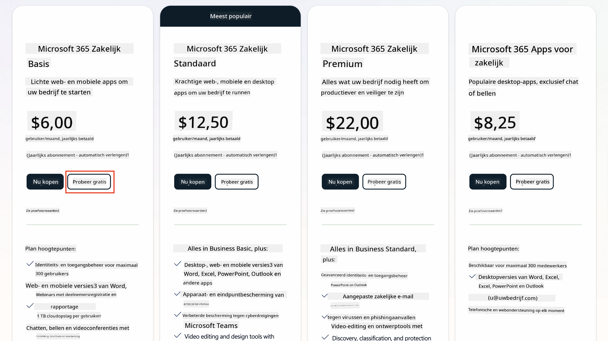
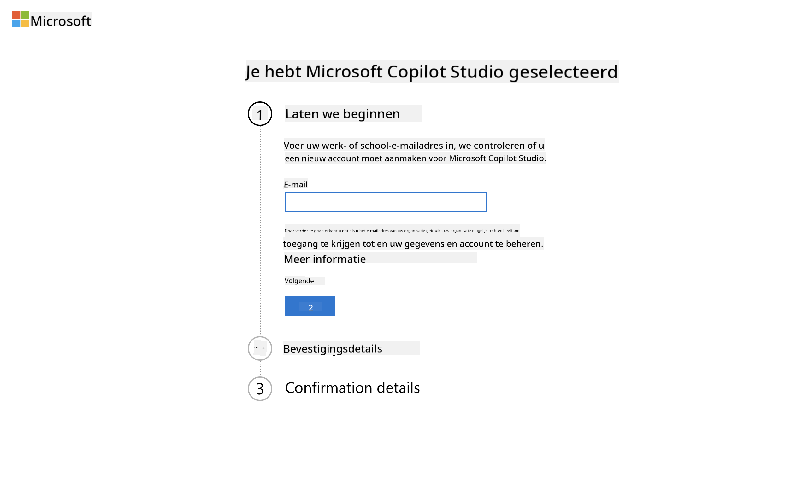
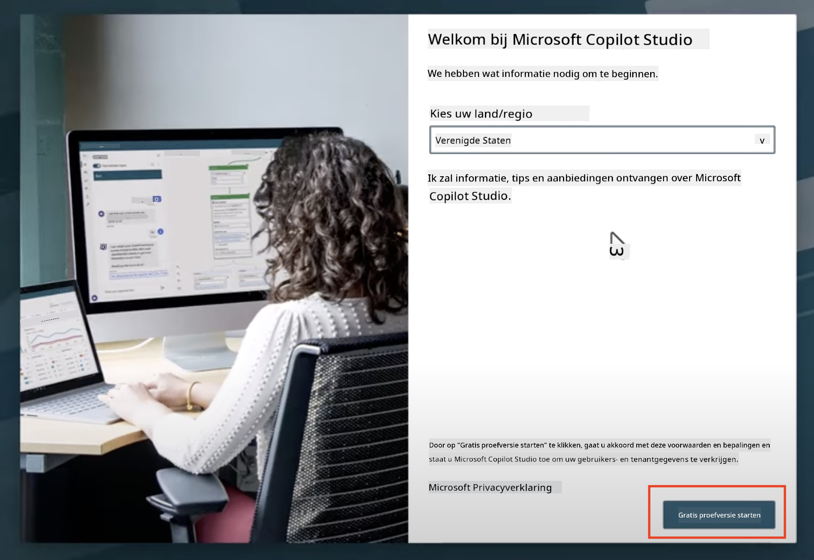
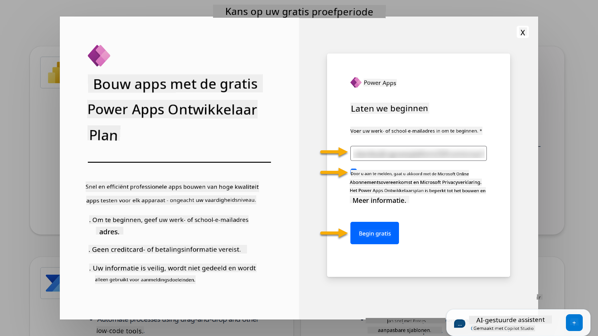
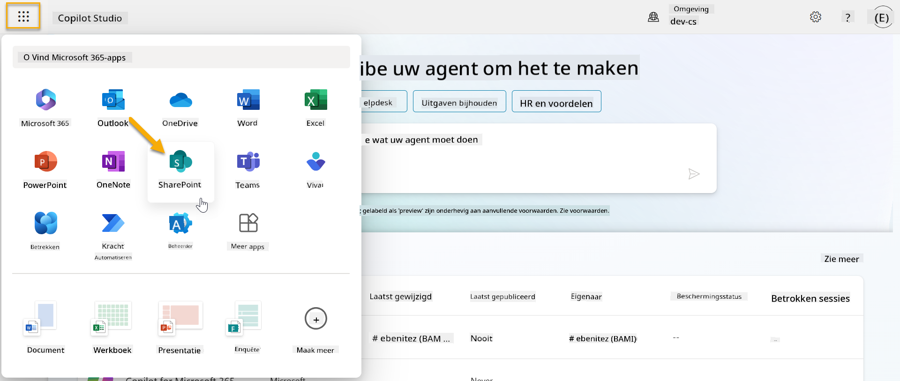
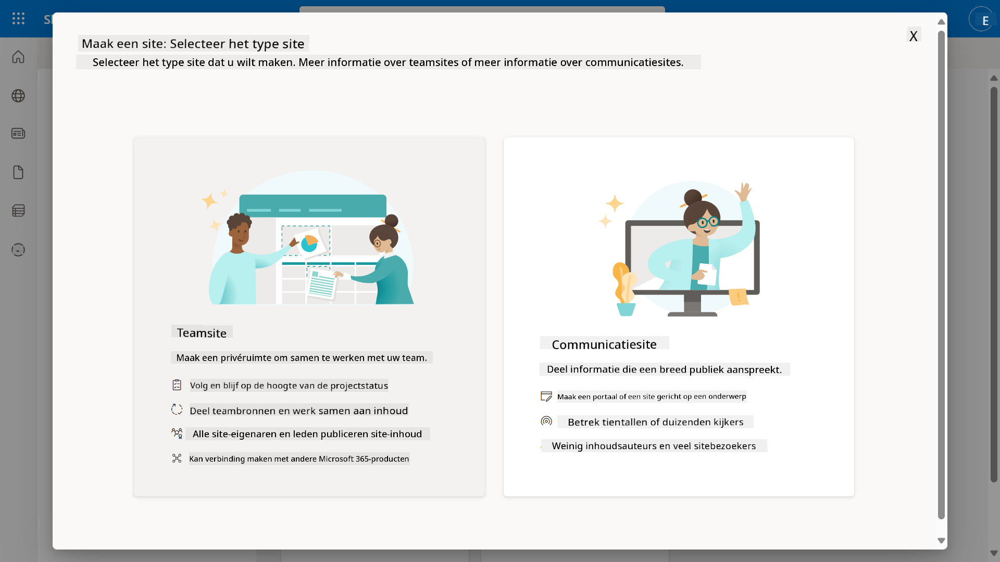
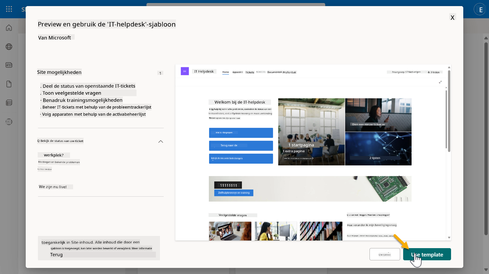
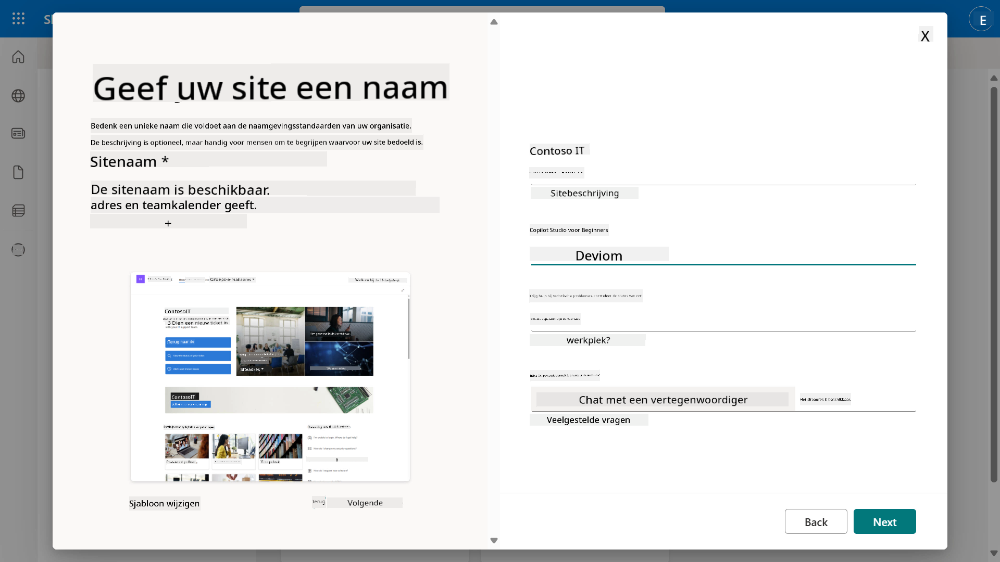

<!--
CO_OP_TRANSLATOR_METADATA:
{
  "original_hash": "d9cd8cd1a4fbd8915171a2ed972cc322",
  "translation_date": "2025-10-17T06:05:33+00:00",
  "source_file": "docs/recruit/00-course-setup/README.md",
  "language_code": "nl"
}
-->
# 🚨 Missie 00: Cursusinstelling

## 🕵️‍♂️ CODENAAM: `OPERATIE KLAAR VOOR IMPLEMENTATIE`

> **⏱️ Operatietijdvenster:** `~30 minuten`  

## 🎯 Missieoverzicht

Welkom bij de eerste missie van je training als Copilot Studio Agent.  
Voordat je je eerste AI-agent kunt bouwen, moet je een **veldklare ontwikkelomgeving** opzetten.

Deze briefing beschrijft de systemen, toegangsgegevens en installatieprocedures die nodig zijn om succesvol te opereren in het Microsoft 365-ecosysteem.

## 🔎 Doelstellingen

Je missie omvat:

1. Het verkrijgen van een Microsoft 365-account  
1. Toegang krijgen tot Microsoft Copilot Studio  
1. (Optioneel) Een Microsoft 365 Copilot-licentie verkrijgen voor productiepublicatie  
1. Een ontwikkelomgeving creëren als je Copilot Studio-omgeving om in te bouwen  
1. Een SharePoint-site maken die later als gegevensbron zal dienen  

---

## 🔍 Vereisten

Voordat je begint, zorg ervoor dat je:

1. Een **werk- of school-e-mailadres** hebt (persoonlijke @outlook.com, @gmail.com, etc., worden niet ondersteund).  
1. Toegang hebt tot internet en een moderne browser (Edge, Chrome of Firefox aanbevolen).  
1. Basiskennis hebt van Microsoft 365 (bijvoorbeeld inloggen op Office-apps of Teams).  
1. (Optioneel) Een creditcard of betaalmethode hebt als je van plan bent betaalde licenties aan te schaffen.  

---

## Stap 1: Verkrijg een Microsoft 365-account

Copilot Studio bevindt zich binnen Microsoft 365, dus je hebt een Microsoft 365-account nodig om toegang te krijgen. Je kunt een bestaand account gebruiken als je er al een hebt, of deze stappen volgen om een geschikte licentie te verkrijgen:

1. **Schaf een betaalde Microsoft 365 Business-abonnement aan**  
   1. Ga naar de [Microsoft 365 Business-abonnementen en prijzenpagina](https://www.microsoft.com/microsoft-365/business/microsoft-365-plans-and-pricing)  
   1. De goedkoopste optie om te beginnen is het Microsoft 365 Business Basic-abonnement. Selecteer `Probeer gratis` en doorloop het begeleide formulier om je abonnement, accountgegevens en betalingsinformatie in te vullen.  
     
   1. Zodra je je nieuwe account hebt, log in.  

    !!! Tip  
        Als je van plan bent agents te publiceren in Microsoft 365 Copilot Chat of verbinding te maken met organisatiedata (SharePoint, OneDrive, Dataverse), is een Microsoft 365 Copilot-licentie vereist. Dit is een aanvullende licentie waar je meer over kunt leren [op de licentiesite](https://www.microsoft.com/microsoft-365/copilot#plans).  

---

## Stap 2: Start een Copilot Studio-proefversie

Zodra je je Microsoft 365 Tenant hebt, moet je toegang krijgen tot Copilot Studio. Je kunt een gratis proefperiode van 30 dagen krijgen door deze stappen te volgen:

1. Navigeer naar [aka.ms/TryCopilotStudio](https://aka.ms/TryCopilotStudio).  
1. Voer het e-mailadres in van het nieuwe account dat je in de vorige stap hebt geconfigureerd en selecteer `Volgende`.  
  
1. Het zou je account moeten herkennen. Selecteer `Inloggen`.  
  
1. Selecteer `Start gratis proefversie`.  
  

!!! info "Proefnotities"  
     1. De gratis proefversie biedt **volledige Copilot Studio-functionaliteiten**.  
     1. Je ontvangt e-mailmeldingen over het verlopen van je proefperiode. Je kunt de proefperiode verlengen in stappen van 30 dagen (tot maximaal 90 dagen agent-runtime).  
     1. Als je tenantbeheerder zelfregistratie heeft uitgeschakeld, zie je een foutmelding—neem contact op met je Microsoft 365-beheerder om dit opnieuw in te schakelen.  

---

## Stap 3: Maak een nieuwe ontwikkelomgeving

### Meld je aan voor een Power Apps Developer Plan

Gebruik dezelfde Microsoft 365-tenant als in Stap 1 en meld je aan voor een Power Apps Developer Plan om een gratis ontwikkelomgeving te creëren waarin je kunt bouwen en testen met Copilot Studio.

1. Meld je aan op de [Power Apps Developer Plan-website](https://aka.ms/PowerAppsDevPlan).  

    - Voer je e-mailadres in  
    - Vink het selectievakje aan  
    - Selecteer **Start gratis**  

      

1. Na aanmelding voor het Developer Plan word je doorgestuurd naar [Power Apps](https://make.powerapps.com/). De omgeving gebruikt je naam, bijvoorbeeld **Adele Vance's omgeving**. Als er al een omgeving met die naam bestaat, wordt de nieuwe ontwikkelomgeving **Adele Vance's (1)** omgeving genoemd.  

    Gebruik deze ontwikkelomgeving in Copilot Studio bij het voltooien van de labs.  

!!! Note  
    Als je een bestaand Microsoft 365-account gebruikt en er geen hebt aangemaakt in Stap 1, bijvoorbeeld je eigen account binnen je werkorganisatie, kan het zijn dat je IT-beheerder (of een vergelijkbaar team) die je tenant/omgevingen beheert, het aanmeldproces heeft uitgeschakeld. Neem in dat geval contact op met je beheerder, of maak een testtenant aan zoals beschreven in Stap 1.  

---

## Stap 4: Maak een nieuwe SharePoint-site

Er moet een nieuwe SharePoint-site worden gemaakt die zal worden gebruikt in [Les 06 - Maak een aangepaste agent met behulp van de conversatiecreatie-ervaring met Copilot en het koppelen aan je gegevens](../06-create-agent-from-conversation/README.md#62-add-an-internal-knowledge-source-using-a-sharepoint-site).  

1. Selecteer het wafelicoon linksboven in Microsoft Copilot Studio om het menu te bekijken. Selecteer SharePoint in het menu.  

      

1. SharePoint wordt geladen. Selecteer **+ Site maken** om een nieuwe SharePoint-site te maken.  

      

1. Er verschijnt een dialoogvenster om je te begeleiden bij het maken van een nieuwe SharePoint-site. Selecteer **Teamsite**.  

      

1. In de volgende stap wordt standaard een lijst met Microsoft-sjablonen geladen. Scroll naar beneden en selecteer de **IT-helpdesk**-sjabloon.  

      

1. Selecteer **Sjabloon gebruiken** om een nieuwe SharePoint-site te maken met de IT-helpdesk sjabloon.  

      

1. Voer informatie in voor je site. Het volgende is een voorbeeld:  

    | Veld | Waarde |
    | --- | --- |
    | Sitenaam | Contoso IT |
    | Sitebeschrijving | Copilot Studio voor Beginners |
    | Siteadres | ContosoIT |

      

1. In de laatste stap kan een taal worden geselecteerd voor de SharePoint-site. Standaard is dit **Engels**. Laat de taal op **Engels** staan en selecteer **Site maken**.  

      

1. De SharePoint-site wordt de komende seconden ingericht. Ondertussen kun je ervoor kiezen andere gebruikers aan je site toe te voegen door hun e-mailadres in te voeren in het veld **Leden toevoegen**. Wanneer voltooid, selecteer **Voltooien**.  

      

1. De startpagina van de SharePoint-site wordt vervolgens geladen. **Kopieer** de URL van de SharePoint-site.  

1. Deze sjabloon biedt pagina's met voorbeeldgegevens over verschillende IT-beleidsregels en twee voorbeeldlijsten (Tickets en Apparaten).  

### Gebruik de lijst Apparaten in SharePoint

We zullen de lijst **Apparaten** gebruiken in [Missie 07 - Voeg een nieuw onderwerp toe met trigger en knooppunten](../07-add-new-topic-with-trigger/README.md#73-add-a-tool-using-a-connector).  

### Voeg een nieuwe kolom toe

Scroll helemaal naar rechts in de lijst en selecteer de knop **+ Kolom toevoegen**. Kies het type **hyperlink**, voer **Afbeelding** in als kolomnaam en selecteer toevoegen.  

### Maak voorbeeldgegevens in de lijst Apparaten in SharePoint

Je moet ervoor zorgen dat je deze lijst vult met minimaal 4 voorbeeldgegevens en een extra kolom aan deze lijst toevoegt.  

Bij het toevoegen van voorbeeldgegevens, zorg ervoor dat de volgende velden zijn ingevuld:

- Foto van apparaat - gebruik de afbeeldingen uit de [map met apparaatafbeeldingen](https://github.com/microsoft/agent-academy/tree/main/docs/recruit/00-course-setup/images/device-images)  
- Titel  
- Status  
- Fabrikant  
- Model  
- Type eigendom  
- Kleur  
- Serienummer  
- Aankoopdatum  
- Aankoopprijs  
- Bestelnummer  
- Afbeelding - gebruik de volgende links  

| Apparaat | URL |
|---------|---------|
| Surface Laptop 13 | [https://raw.githubusercontent.com/microsoft/agent-academy/refs/heads/main/docs/recruit/00-course-setup/images/device-images/Surface-Laptop-13.png](https://raw.githubusercontent.com/microsoft/agent-academy/refs/heads/main/docs/recruit/00-course-setup/images/device-images/Surface-Laptop-13.png) |
| Surface Laptop 15 | [https://raw.githubusercontent.com/microsoft/agent-academy/refs/heads/main/docs/recruit/00-course-setup/images/device-images/Surface-Laptop-15.png](https://raw.githubusercontent.com/microsoft/agent-academy/refs/heads/main/docs/recruit/00-course-setup/images/device-images/Surface-Laptop-15.png) |
| Surface Pro | [https://raw.githubusercontent.com/microsoft/agent-academy/refs/heads/main/docs/recruit/00-course-setup/images/device-images/Surface-Pro-12.png](https://raw.githubusercontent.com/microsoft/agent-academy/refs/heads/main/docs/recruit/00-course-setup/images/device-images/Surface-Pro-12.png) |
| Surface Studio | [https://raw.githubusercontent.com/microsoft/agent-academy/refs/heads/main/docs/recruit/00-course-setup/images/device-images/Surface-Studio.png](https://raw.githubusercontent.com/microsoft/agent-academy/refs/heads/main/docs/recruit/00-course-setup/images/device-images/Surface-Studio.png) |

---

## ✅ Missie Voltooid

Je hebt succesvol:

- Een Microsoft 365 ontwikkelomgeving opgezet  
- Je Copilot Studio-proefversie geactiveerd  
- Een SharePoint-site gemaakt voor het koppelen van agents  
- De lijst Apparaten gevuld voor gebruik in toekomstige missies  

Je bent officieel klaar om te beginnen met je **Recruit-niveau agenttraining** in [Les 01](../01-introduction-to-agents/README.md).  

<!-- markdownlint-disable-next-line MD033 -->

---

**Disclaimer**:  
Dit document is vertaald met behulp van de AI-vertalingsservice [Co-op Translator](https://github.com/Azure/co-op-translator). Hoewel we streven naar nauwkeurigheid, dient u zich ervan bewust te zijn dat geautomatiseerde vertalingen fouten of onnauwkeurigheden kunnen bevatten. Het originele document in de oorspronkelijke taal moet worden beschouwd als de gezaghebbende bron. Voor kritieke informatie wordt professionele menselijke vertaling aanbevolen. Wij zijn niet aansprakelijk voor eventuele misverstanden of verkeerde interpretaties die voortvloeien uit het gebruik van deze vertaling.