<!--
CO_OP_TRANSLATOR_METADATA:
{
  "original_hash": "4fb913dfc3bbc71506dd3602c4b8e6ed",
  "translation_date": "2025-10-21T23:49:48+00:00",
  "source_file": "docs/operative-preview/02-multi-agent/README.md",
  "language_code": "pl"
}
-->
# 🚨 Misja 02: Połączone Agenty

--8<-- "disclaimer.md"

## 🕵️‍♂️ KODOWA NAZWA: `OPERACJA SYMFONIA`

> **⏱️ Czas trwania operacji:** `~45 minut`

## 🎯 Opis Misji

Witaj ponownie, Agencie. W Misji 01 stworzyłeś swojego głównego Agenta Rekrutacyjnego - solidną podstawę do zarządzania procesami rekrutacyjnymi. Ale jeden agent może zrobić tylko tyle.

Twoje zadanie, jeśli zdecydujesz się je przyjąć, to **Operacja Symfonia** - przekształcenie pojedynczego agenta w **system wieloagentowy**: zespół wyspecjalizowanych agentów, którzy współpracują, aby sprostać złożonym wyzwaniom rekrutacyjnym. Pomyśl o tym jak o przejściu od działania w pojedynkę do dowodzenia wyspecjalizowaną grupą zadaniową.

Podobnie jak orkiestra symfoniczna, w której każdy muzyk odgrywa swoją rolę w doskonałej harmonii, dodasz dwóch kluczowych specjalistów do swojego istniejącego Agenta Rekrutacyjnego: Agenta Przyjmowania Aplikacji, który automatycznie przetwarza CV, oraz Agenta Przygotowania do Rozmowy, który tworzy kompleksowe materiały do rozmów kwalifikacyjnych. Ci agenci będą współpracować płynnie pod kierownictwem głównego organizatora.

## 🔎 Cele

W tej misji nauczysz się:

1. Kiedy używać **agentów podrzędnych** vs **agentów połączonych**
1. Jak projektować **architektury wieloagentowe**, które się skalują  
1. Tworzenie **agentów podrzędnych** do skoncentrowanych zadań
1. Ustanawianie **wzorców komunikacji** między agentami
1. Budowanie Agenta Przyjmowania Aplikacji i Agenta Przygotowania do Rozmowy

## 🧠 Czym są połączone agenty?

W Copilot Studio nie jesteś ograniczony do budowania pojedynczych, monolitycznych agentów. Możesz tworzyć **systemy wieloagentowe** - sieci wyspecjalizowanych agentów, którzy współpracują, aby obsłużyć złożone procesy.

Pomyśl o tym jak o rzeczywistej organizacji: zamiast jednej osoby robiącej wszystko, masz specjalistów, którzy doskonale radzą sobie z określonymi zadaniami i współpracują, gdy jest to potrzebne.

### Dlaczego systemy wieloagentowe są ważne

- **Skalowalność:** Każdy agent może być rozwijany, testowany i utrzymywany niezależnie przez różne zespoły.  
- **Specjalizacja:** Agenci mogą skupić się na tym, co robią najlepiej. Na przykład jeden do przetwarzania danych, inny do interakcji z użytkownikiem, a jeszcze inny do podejmowania decyzji.  
- **Elastyczność:** Możesz mieszać i dopasowywać agentów, ponownie ich używać w różnych projektach i stopniowo rozwijać swój system.  
- **Łatwość utrzymania:** Zmiany w jednym agencie niekoniecznie wpływają na inne, co sprawia, że aktualizacje są bezpieczniejsze i łatwiejsze.

### Przykład z życia: Proces rekrutacyjny

Rozważ nasz proces rekrutacyjny - wielu agentów może współpracować, realizując następujące zadania:

- **Przyjmowanie CV** wymaga umiejętności parsowania dokumentów i ekstrakcji danych
- **Ocena** polega na analizie CV kandydatów i dopasowaniu ich do wymagań stanowiska
- **Przygotowanie do rozmowy** wymaga głębokiego rozumienia dopasowania kandydata  
- **Komunikacja z kandydatem** wymaga empatycznych umiejętności komunikacyjnych

Zamiast budować jednego ogromnego agenta, który próbuje obsłużyć wszystkie te różne umiejętności, możesz stworzyć wyspecjalizowanych agentów dla każdego obszaru i zorganizować ich współpracę.

## 🔗 Agenci podrzędni vs połączeni agenci: Kluczowa różnica

Copilot Studio oferuje dwa sposoby budowania systemów wieloagentowych, każdy z różnymi zastosowaniami:

### ↘️ Agenci podrzędni

Agenci podrzędni to **lekkie specjalisty**, które działają w ramach głównego agenta. Pomyśl o nich jak o wyspecjalizowanych zespołach w tym samym dziale.

#### Kluczowe szczegóły techniczne

- Agenci podrzędni działają w ramach agenta nadrzędnego i mają jedną stronę konfiguracji.
- Narzędzia i wiedza są **przechowywane u agenta nadrzędnego**, ale skonfigurowane jako "Dostępne dla" agenta podrzędnego.
- Agenci podrzędni **dzielą tematy** z agentem nadrzędnym. Tematy mogą być odwoływane przez instrukcje agenta podrzędnego.
- Agenci podrzędni **nie wymagają osobnej publikacji** - są automatycznie dostępni w ramach agenta nadrzędnego po ich utworzeniu. Ułatwia to testowanie, ponieważ zmiany w agencie nadrzędnym i podrzędnym mogą być wykonywane w **tej samej wspólnej przestrzeni roboczej**.

#### Używaj agentów podrzędnych, gdy

- Jeden zespół zarządza całym rozwiązaniem
- Chcesz logicznie zorganizować narzędzia i wiedzę w podagentach
- Nie potrzebujesz osobnego uwierzytelniania ani wdrożenia dla każdego agenta
- Agenci nie będą publikowani osobno ani używani niezależnie
- Nie potrzebujesz ponownego użycia agentów w wielu rozwiązaniach

**Przykład:** Agent pomocy technicznej IT z agentami podrzędnymi do:

- Procedur resetowania hasła
- Rozwiązywania problemów z sprzętem  
- Instalacji oprogramowania

### 🔀 Połączeni agenci

Połączeni agenci to **pełnoprawni, niezależni agenci**, z którymi Twój główny agent może współpracować. Pomyśl o nich jak o oddzielnych działach współpracujących nad projektem.

#### Kluczowe szczegóły techniczne

- Połączeni agenci mają **swoje własne tematy** i przepływy konwersacji. Działają niezależnie z własnymi ustawieniami, logiką i cyklem wdrożenia.
- Połączeni agenci **muszą być opublikowani**, zanim będą mogli być dodani i używani przez inne agenty.
- Podczas testowania zmiany w połączonym agencie muszą być opublikowane, zanim będą mogły być używane przez agenta wywołującego.

#### Używaj połączonych agentów, gdy

- Różne zespoły niezależnie rozwijają i utrzymują różnych agentów
- Agenci potrzebują własnych ustawień, uwierzytelniania i kanałów wdrożeniowych
- Chcesz publikować i utrzymywać agentów osobno z niezależnym zarządzaniem cyklem życia aplikacji (ALM) dla każdego agenta
- Agenci powinni być ponownie używani w wielu rozwiązaniach

**Przykład:** System obsługi klienta, który łączy się z:

- Oddzielnym agentem ds. rozliczeń, zarządzanym przez zespół finansowy
- Oddzielnym agentem wsparcia technicznego, zarządzanym przez zespół produktowy
- Oddzielnym agentem zwrotów, zarządzanym przez zespół operacyjny

!!! tip "Wskazówka"
    Możesz mieszać oba podejścia! Na przykład Twój główny agent może łączyć się z zewnętrznymi agentami innych zespołów, jednocześnie mając własnych agentów podrzędnych do wyspecjalizowanych zadań wewnętrznych.

## 🎯 Wzorce architektury wieloagentowej

Podczas projektowania systemów wieloagentowych pojawia się kilka wzorców w zależności od tego, jak agenci współpracują:

| Wzorzec              | Opis                                                                 | Najlepsze dla                                                      |
|----------------------|---------------------------------------------------------------------|--------------------------------------------------------------------|
| **Hub i szprychy**   | Główny agent organizator koordynuje pracę wielu wyspecjalizowanych agentów. Organizator obsługuje interakcję z użytkownikiem i deleguje zadania agentom podrzędnym lub połączonym. | Złożone procesy, w których jeden agent koordynuje wyspecjalizowane zadania |
| **Pipeline**         | Agenci przekazują pracę sekwencyjnie od jednego do drugiego, każdy dodając wartość przed przekazaniem do następnego etapu. | Procesy liniowe, takie jak przetwarzanie aplikacji (przyjęcie → ocena → rozmowa → decyzja) |
| **Współpraca**       | Agenci współpracują jednocześnie nad różnymi aspektami tego samego problemu, dzieląc się kontekstem i wynikami. | Złożona analiza wymagająca wielu perspektyw lub obszarów ekspertyzy |

!!! tip "Wskazówka"
    Możesz nawet mieć hybrydę dwóch lub więcej z tych wzorców.

## 💬Komunikacja agentów i udostępnianie kontekstu

Kiedy agenci współpracują, muszą skutecznie dzielić się informacjami. Oto jak to działa w Copilot Studio:

### Historia konwersacji

Domyślnie, gdy główny agent wywołuje agenta podrzędnego lub połączonego, może przekazać **historię konwersacji**. Daje to agentowi specjalistycznemu pełny kontekst na temat tego, o czym użytkownik rozmawiał.

Możesz to wyłączyć ze względów bezpieczeństwa lub wydajności - na przykład, jeśli agent specjalistyczny potrzebuje tylko wykonać określone zadanie bez pełnego kontekstu rozmowy. Może to być dobra obrona przed **wyciekiem danych**.

### Wyraźne instrukcje

Twój główny agent może przekazywać **konkretne instrukcje** agentom podrzędnym lub połączonym. Na przykład: "Przetwórz to CV i podsumuj ich umiejętności na stanowisko Starszego Programisty."

### Wartości zwrotne

Agenci mogą zwracać uporządkowane informacje do agenta wywołującego, pozwalając głównemu agentowi na wykorzystanie tych informacji w kolejnych krokach lub udostępnienie ich innym agentom.

### Integracja z Dataverse

W bardziej złożonych scenariuszach agenci mogą dzielić się informacjami poprzez **Dataverse** lub inne magazyny danych, umożliwiając trwałe udostępnianie kontekstu w wielu interakcjach.

## ↘️Agent podrzędny: Agent Przyjmowania Aplikacji

Zacznijmy budować nasz wieloagentowy system rekrutacyjny. Naszym pierwszym specjalistą będzie **Agent Przyjmowania Aplikacji** - agent podrzędny odpowiedzialny za przetwarzanie nadsyłanych CV i informacji o kandydatach.

```mermaid
---
config:
  layout: elk
  look: neo
---
flowchart TB
 subgraph People["People"]
    direction TB
        HiringManager["Hiring Manager"]
        Interviewers["Interviewers"]
  end
 subgraph Agents["Agents"]
    direction LR
        ApplicationIntakeAgent["Application Intake Agent<br>(Child)"]
        InterviewAgent["Interview Agent<br>(Connected)"]
        HRAgent["HR Agent"]
  end
    HiringManager -- Upload CV --> HRAgent
    HRAgent -- Upload Resume, Create Candidate, Match to Job Roles --> ApplicationIntakeAgent
    ApplicationIntakeAgent -- Create Resume, Upsert Candidate, Create Job Application --> Dataverse["Dataverse"]
    ApplicationIntakeAgent -- Store Resume file in file column --> Dataverse
    HiringManager -- Ask for summaries --> HRAgent
    Interviewers -- Request interview pack --> HRAgent
    HRAgent -- Generate interview pack and summarize data --> InterviewAgent
    InterviewAgent -- Read all Candidate, Resume, Job Roles, Evaluation Criteria Data --> Dataverse
     HiringManager:::person
     Interviewers:::person
     ApplicationIntakeAgent:::agent
     InterviewAgent:::agent
     HRAgent:::agent
     Dataverse:::data
    classDef person fill:#e6f0ff,stroke:#3b82f6,color:#0b3660
    classDef agent fill:#e8f9ef,stroke:#10b981,color:#064e3b
    classDef data  fill:#f3f4f6,stroke:#6b7280,color:#111827
```

### 🤝Obowiązki Agenta Przyjmowania Aplikacji

- **Parsowanie treści CV** z plików PDF przesyłanych w interaktywnym czacie (W przyszłej misji nauczysz się, jak autonomicznie przetwarzać CV).
- **Ekstrakcja danych strukturalnych** (imię, umiejętności, doświadczenie, wykształcenie)
- **Dopasowanie kandydatów do otwartych ról** na podstawie kwalifikacji i listu motywacyjnego
- **Przechowywanie informacji o kandydatach** w Dataverse do późniejszego przetwarzania
- **Deduplikacja aplikacji** w celu uniknięcia tworzenia tego samego kandydata dwa razy, dopasowanie do istniejących rekordów za pomocą adresu e-mail wyodrębnionego z CV.

### ⭐Dlaczego powinien być agentem podrzędnym

Agent Przyjmowania Aplikacji idealnie pasuje jako agent podrzędny, ponieważ:

- Jest wyspecjalizowany w przetwarzaniu dokumentów i ekstrakcji danych
- Nie wymaga osobnej publikacji  
- Jest częścią naszego ogólnego rozwiązania rekrutacyjnego zarządzanego przez ten sam zespół
- Koncentruje się na konkretnym wyzwalaczu (nowe CV otrzymane) i jest wywoływany przez Agenta Rekrutacyjnego.

## 🔀Połączony agent: Agent Przygotowania do Rozmowy  

Naszym drugim specjalistą będzie **Agent Przygotowania do Rozmowy** - połączony agent, który pomaga tworzyć kompleksowe materiały do rozmów kwalifikacyjnych i oceniać odpowiedzi kandydatów.

### 🤝Obowiązki Agenta Przygotowania do Rozmowy

- **Tworzenie pakietów rozmów kwalifikacyjnych** z informacjami o firmie, wymaganiami stanowiska i kryteriami oceny
- **Generowanie pytań do rozmowy** dostosowanych do konkretnych ról i doświadczenia kandydatów
- **Odpowiadanie na ogólne pytania** dotyczące ról zawodowych i aplikacji dla komunikacji z interesariuszami

### ⭐Dlaczego powinien być połączonym agentem

Agent Przygotowania do Rozmowy lepiej sprawdzi się jako połączony agent, ponieważ:

- Zespół ds. pozyskiwania talentów może chcieć używać go niezależnie w różnych procesach rekrutacyjnych
- Potrzebuje własnej bazy wiedzy na temat najlepszych praktyk rozmów kwalifikacyjnych i kryteriów oceny
- Różni menedżerowie ds. rekrutacji mogą chcieć dostosować jego zachowanie do swoich zespołów
- Może być ponownie używany do rekrutacji na stanowiska wewnętrzne, a nie tylko zewnętrzne

## 🧪Laboratorium 2.1: Dodanie Agenta Przyjmowania Aplikacji

Gotowy, aby przejść od teorii do praktyki? Dodajmy naszego pierwszego agenta podrzędnego do Twojego istniejącego Agenta Rekrutacyjnego.

### Wymagania wstępne do ukończenia tej misji

Musisz **albo**:

- **Ukończyć Misję 01** i mieć gotowego Agenta Rekrutacyjnego, **ALBO**
- **Zaimportować rozwiązanie startowe Misji 02**, jeśli zaczynasz od zera lub potrzebujesz nadrobić zaległości. [Pobierz rozwiązanie startowe Misji 02](https://aka.ms/agent-academy)

!!! note "Importowanie rozwiązania i dane przykładowe"
    Jeśli korzystasz z rozwiązania startowego, zapoznaj się z [Misją 01](../01-get-started/README.md) w celu uzyskania szczegółowych instrukcji dotyczących importowania rozwiązań i danych przykładowych do swojego środowiska.

### 2.1.1 Konfiguracja rozwiązania

1. W Copilot Studio wybierz wielokropek (...) poniżej Narzędzi w lewym menu nawigacyjnym.
1. Wybierz **Rozwiązania**.  
    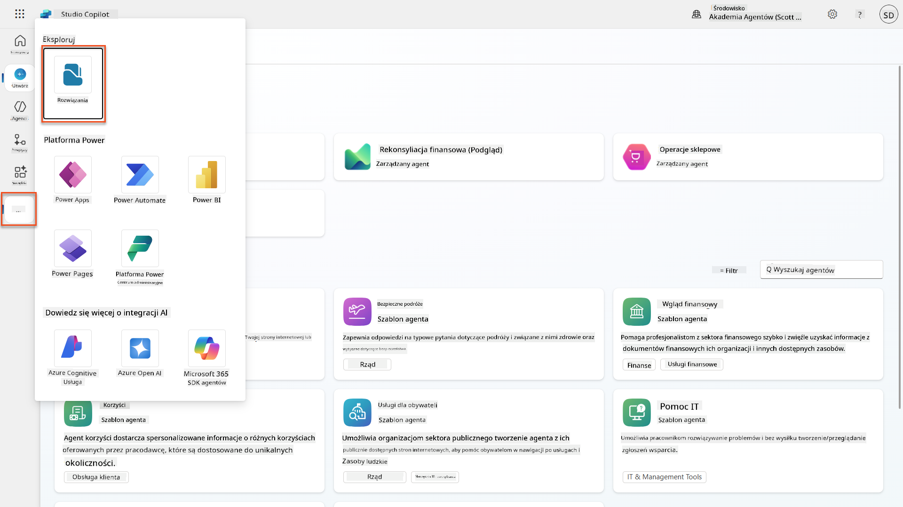
1. Znajdź swoje rozwiązanie Operative, wybierz **wielokropek (...)** obok niego i wybierz **Ustaw preferowane rozwiązanie**. Zapewni to, że cała Twoja praca zostanie dodana do tego rozwiązania.  
    

### 2.1.2 Konfiguracja instrukcji agenta Rekrutacyjnego

1. **Przejdź** do Copilot Studio. Upewnij się, że Twoje środowisko jest wybrane w prawym górnym **Wybieraku Środowiska**.

1. Otwórz swojego **Agenta Rekrutacyjnego** z Misji 01

1. Wybierz **Edytuj** w sekcji **Instrukcje** na karcie **Przegląd**, i dodaj następujące instrukcje na górze:

    ```text
    You are the central orchestrator for the hiring process. You coordinate activities, provide summaries, and delegate work to specialized agents.
    ```

1. Wybierz **Zapisz**  
    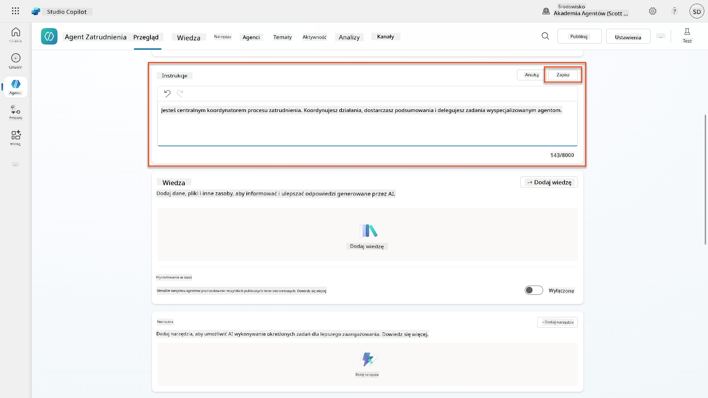

1. Wybierz **Ustawienia** (prawy górny róg)

1. Upewnij się, że następujące ustawienia są skonfigurowane:

    | Ustawienie | Wartość |
    |------------|---------|
    | Użyj generatywnej orkiestracji AI dla odpowiedzi agenta | **Tak** |
    | Moderacja treści | **Umiarkowana** |
    | Użyj wiedzy ogólnej | **Wyłączone** |
    | Użyj informacji z Internetu | **Wyłączone** |
    | Przesyłanie plików | **Włączone** |


 bez konieczności interakcji z użytkownikiem.

1. Znajdź sekcję **Narzędzia** na stronie agenta Application Intake.  
   **Ważne:** To nie jest zakładka Narzędzia głównego agenta, ale można ją znaleźć, przewijając w dół pod instrukcjami agenta podrzędnego.

1. Wybierz **+ Dodaj**  
   

1. Wybierz **+ Nowe narzędzie**  
   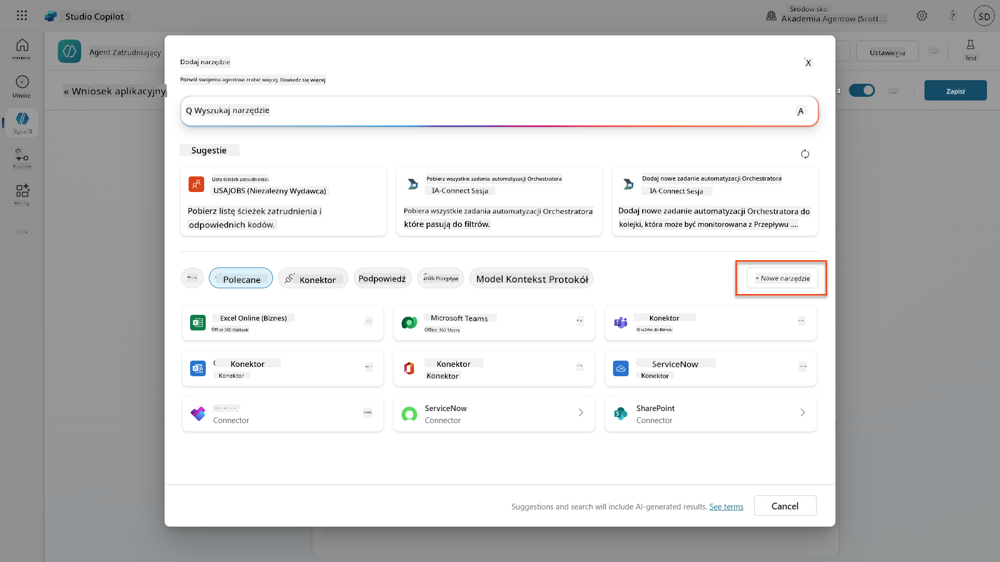

1. Wybierz **Agent flow**.  
   Otworzy się projektant Agent Flow, gdzie dodamy logikę przesyłania CV.  
   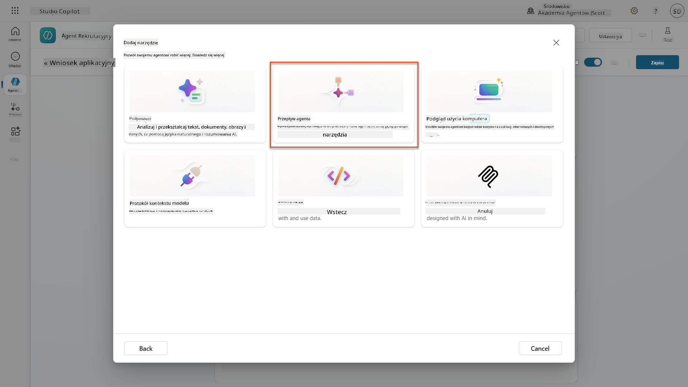

1. Wybierz węzeł **Gdy agent wywołuje przepływ**, a następnie wybierz **+ Dodaj** wejście dla następujących parametrów, upewniając się, że dodano zarówno nazwę, jak i opis.

    | Typ   | Nazwa      | Opis                                                                                                       |
    |-------|------------|-----------------------------------------------------------------------------------------------------------|
    | Plik  | CV         | Plik PDF z CV                                                                                            |
    | Tekst | Wiadomość  | Wyciągnij wiadomość w stylu listu motywacyjnego z kontekstu. Wiadomość musi mieć mniej niż 2000 znaków.   |
    | Tekst | EmailUżytkownika | Adres e-mail, z którego pochodzi CV. To będzie użytkownik przesyłający CV w czacie lub adres e-mail nadawcy, jeśli otrzymano je e-mailem. |

    

1. Wybierz **+ ikonę** poniżej węzła wyzwalającego, wyszukaj `Dataverse`, wybierz **Zobacz więcej** obok Microsoft Dataverse, a następnie wybierz akcję **Dodaj nowy wiersz** w sekcji **Microsoft Dataverse**  
    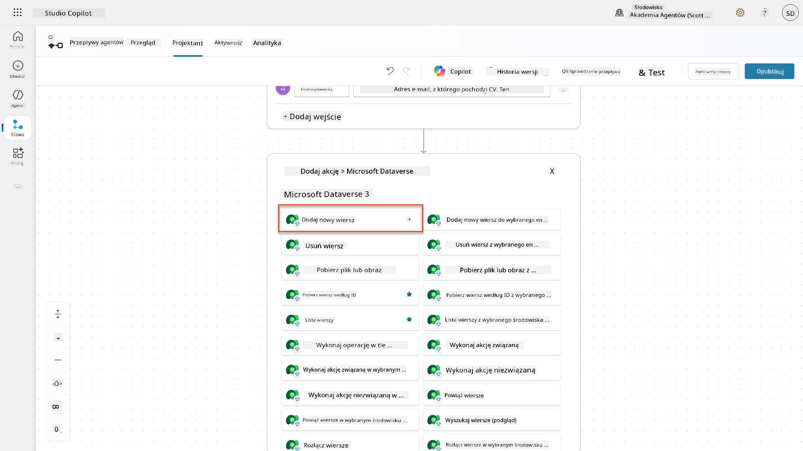

1. Nazwij węzeł **Utwórz CV**, wybierając **trzy kropki(...)**, a następnie wybierając **Zmień nazwę**  
    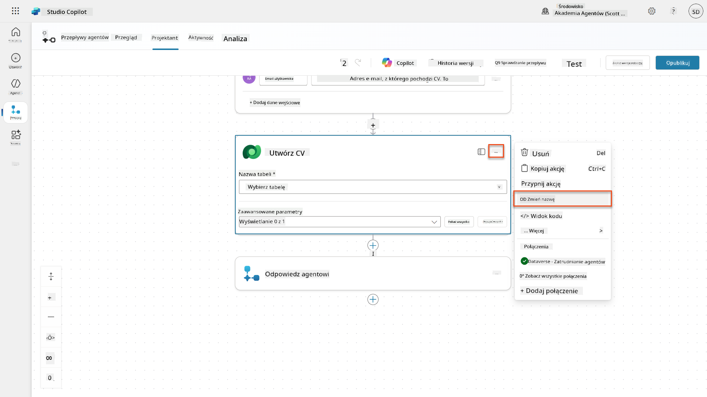

1. Ustaw **Nazwa tabeli** na **CV**, a następnie wybierz **Pokaż wszystko**, aby wyświetlić wszystkie parametry.

1. Ustaw następujące **właściwości**:

    | Właściwość              | Jak ustawić                     | Szczegóły / Wyrażenie                                         |
    |-------------------------|---------------------------------|--------------------------------------------------------------|
    | **Tytuł CV**            | Dane dynamiczne (ikona pioruna) | **Gdy agent wywołuje przepływ** → **Nazwa CV** Jeśli nie widzisz nazwy CV, upewnij się, że skonfigurowałeś parametr CV powyżej jako typ danych. |
    | **List motywacyjny**    | Wyrażenie (ikona fx)            | `if(greater(length(triggerBody()?['text']), 2000), substring(triggerBody()?['text'], 0, 2000), triggerBody()?['text'])` |
    | **Adres e-mail źródła** | Dane dynamiczne (ikona pioruna) | **Gdy agent wywołuje przepływ** → **EmailUżytkownika**       |
    | **Data przesłania**     | Wyrażenie (ikona fx)            | `utcNow()`                                                   |

    

1. Wybierz **+ ikonę** poniżej węzła Utwórz CV, wyszukaj `Dataverse`, wybierz **Zobacz więcej** obok Microsoft Dataverse, a następnie wybierz akcję **Prześlij plik lub obraz**.  
   **Ważne:** Upewnij się, że nie wybierasz akcji Prześlij plik lub obraz do wybranego środowiska.

1. Nazwij węzeł **Prześlij plik CV**, wybierając **trzy kropki(...)**, a następnie wybierając **Zmień nazwę**

1. Ustaw następujące **właściwości**:

     | Właściwość       | Jak ustawić                     | Szczegóły |
     |------------------|---------------------------------|----------|
     | **Nazwa treści** | Dane dynamiczne (ikona pioruna) | Gdy agent wywołuje przepływ → Nazwa CV |
     | **Nazwa tabeli** | Wybierz                        | CV       |
     | **ID wiersza**   | Dane dynamiczne (ikona pioruna) | Utwórz CV → Zobacz więcej → CV |
     | **Nazwa kolumny**| Wybierz                        | CV PDF   |
     | **Treść**        | Dane dynamiczne (ikona pioruna) | Gdy agent wywołuje przepływ → contentBytes CV |

     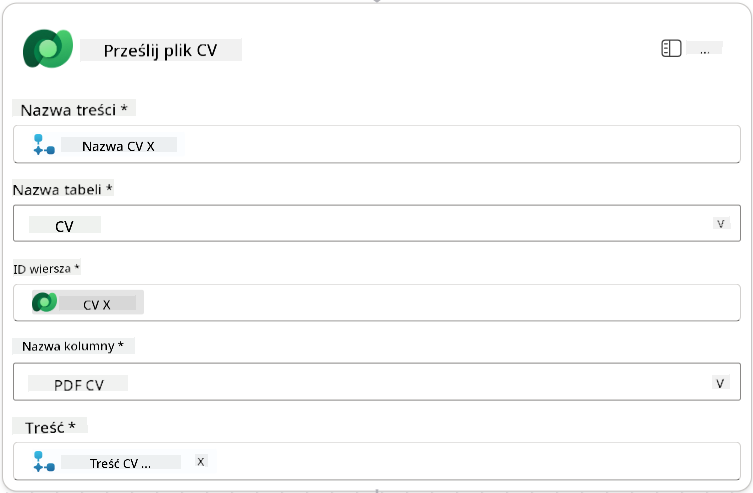

1. Wybierz węzeł **Odpowiedz agentowi**, a następnie wybierz **+ Dodaj wyjście**

     | Właściwość       | Jak ustawić                     | Szczegóły |
     |------------------|---------------------------------|----------|
     | **Typ**          | Wybierz                        | `Tekst`  |
     | **Nazwa**        | Wprowadź                       | `NumerCV` |
     | **Wartość**      | Dane dynamiczne (ikona pioruna) | Utwórz CV → Zobacz więcej → Numer CV |
     | **Opis**         | Wprowadź                       | `Numer [NumerCV] utworzonego CV` |

     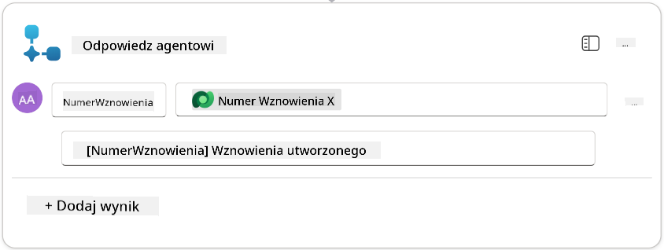

1. Wybierz **Zapisz wersję roboczą** w prawym górnym rogu  
     

1. Wybierz zakładkę **Przegląd**, wybierz **Edytuj** w panelu **Szczegóły**

     1. **Nazwa przepływu**:`Przesyłanie CV`
     1. **Opis**:`Przesyła CV na polecenie`

     

1. Wybierz ponownie zakładkę **Projektant**, a następnie wybierz **Publikuj**.  
     

### 2.1.5 Połącz przepływ z agentem

Teraz połączysz opublikowany przepływ z agentem Application Intake.

1. Przejdź z powrotem do **Hiring Agent** i wybierz zakładkę **Agenci**. Otwórz **Application Intake Agent**, a następnie znajdź panel **Narzędzia**.  
    

1. Wybierz **+ Dodaj**

1. Wybierz filtr **Przepływ**, wyszukaj `Przesyłanie CV`. Wybierz przepływ **Przesyłanie CV**, a następnie **Dodaj i skonfiguruj**.

1. Ustaw następujące parametry:

    | Parametr          | Wartość |
    |-------------------|---------|
    | **Opis**          | `Przesyła CV na polecenie. ŚCISŁA ZASADA: Wywołuj to narzędzie tylko, gdy jest wspomniane w formie "Przesyłanie CV" i są załączniki` |
    | **Dodatkowe szczegóły → Kiedy można użyć tego narzędzia** | `tylko gdy jest wspomniane przez tematy lub agentów` |
    | **Wejścia → Dodaj wejście** | `contentBytes` |
    | **Wejścia → Dodaj wejście** | `name` |

    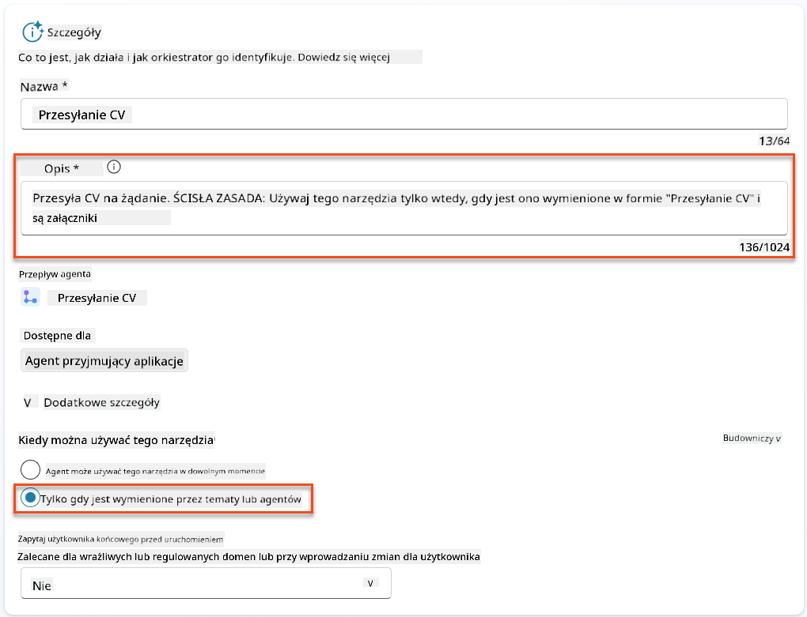

    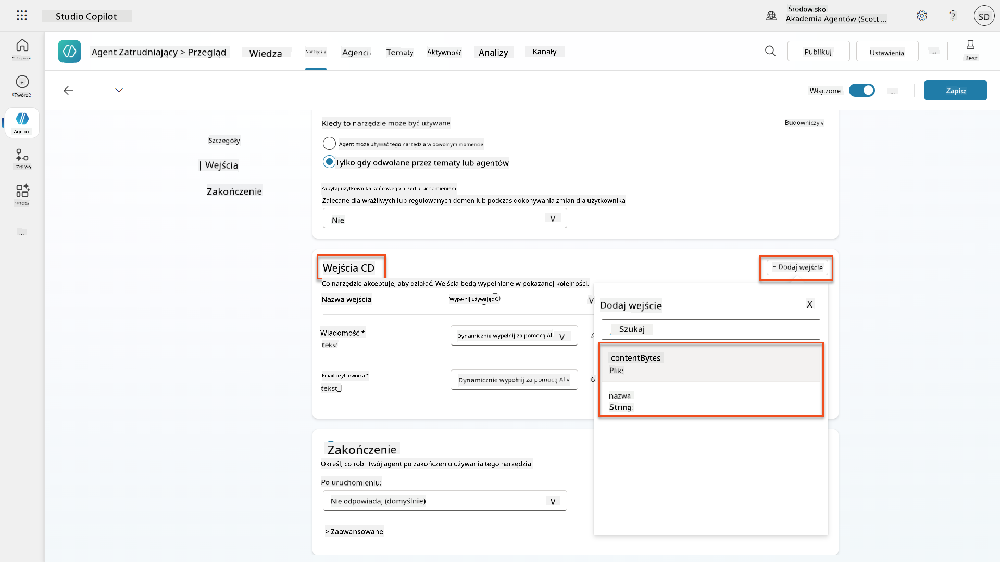

1. Następnie ustaw właściwości wejść w następujący sposób:

    | Parametr wejściowy | Właściwość | Szczegóły |
    |--------------------|------------|----------|
    | **contentBytes**   | Wypełnij używając | Wartość niestandardowa |
    |                    | Wartość (...→Formuła→Wstaw) | `First(System.Activity.Attachments).Content` |
    | **name**           | Wypełnij używając | Wartość niestandardowa |
    |                    | Wartość (...→Formuła→Wstaw) | `First(System.Activity.Attachments).Name` |
    | **Wiadomość**      | Dostosuj | Skonfiguruj ustawienia niestandardowe |
    |                    | Opis | `Wyciągnij wiadomość w stylu listu motywacyjnego z kontekstu. Upewnij się, że nigdy nie pytasz użytkownika i tworzysz przynajmniej minimalny list motywacyjny z dostępnego kontekstu. ŚCISŁA ZASADA - wiadomość musi mieć mniej niż 2000 znaków.` |
    |                    | Ile razy powtórzyć | Nie powtarzaj |
    |                    | Akcja, jeśli nie znaleziono encji | Ustaw zmienną na wartość |
    |                    | Domyślna wartość encji | Przesyłanie CV |
    | **EmailUżytkownika** | Wypełnij używając | Wartość niestandardowa |
    |                    | Wartość (...→Formuła→Wstaw) | `System.User.Email` |

    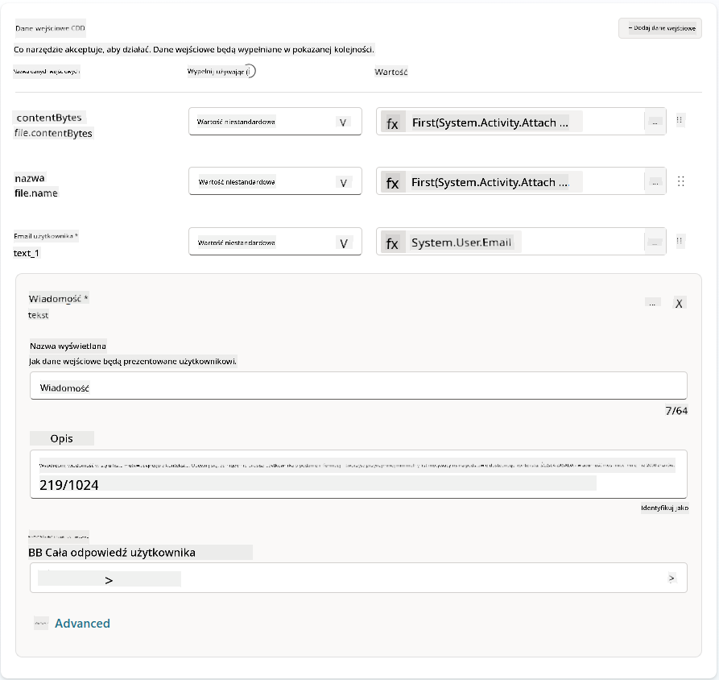

1. Wybierz **Zapisz**

### 2.1.6 Zdefiniuj instrukcje agenta

1. Wróć do **Application Intake Agent**, wybierając zakładkę **Agenci**, a następnie znajdź panel **Instrukcje**.

1. W polu **Instrukcje** wklej następujące jasne wytyczne dla swojego agenta podrzędnego:

    ```text
    You are tasked with managing incoming Resumes, Candidate information, and creating Job Applications.  
    Only use tools if the step exactly matches the defined process. Otherwise, indicate you cannot help.  
    
    Process for Resume Upload via Chat  
    1. Upload Resume  
      - Trigger only if /System.Activity.Attachments contains exactly one new resume.  
      - If more than one file, instruct the user to upload one at a time and stop.  
      - Call /Upload Resume once. Never upload more than once for the same message.  
    
    2. Post-Upload  
      - Always output the [ResumeNumber] (R#####).  
    ```

1. Gdzie instrukcje zawierają ukośnik (/), wybierz tekst po ukośniku i wybierz rozpoznaną nazwę. Zrób to dla:

    - `System.Activity.Attachments` (Zmienna)
    - `Przesyłanie CV` (Narzędzie)

    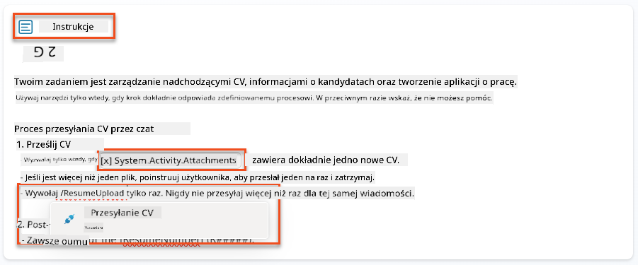

1. Wybierz **Zapisz**

### 2.1.7 Przetestuj swojego agenta Application Intake

Teraz zweryfikuj, czy pierwszy członek orkiestry działa poprawnie.

1. **Pobierz** [testowe CV.](https://download-directory.github.io/?url=https://github.com/microsoft/agent-academy/tree/main/operative/sample-data/resumes&filename=operative_sampledata)

1. **Otwórz** panel testowy, wybierając **Test**.

1. **Prześlij** dwa CV w czacie testowym i wpisz wiadomość `Przetwórz te CV`

    - Agent powinien zwrócić wiadomość podobną do *Można przesłać tylko jedno CV naraz. Proszę przesłać jedno CV, aby kontynuować.*

    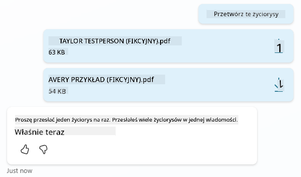

1. Spróbuj przesłać **tylko jedno CV**, z wiadomością `Przetwórz to CV`

    - Agent powinien wtedy zwrócić wiadomość podobną do *CV dla Avery Example zostało pomyślnie przesłane. Numer CV to R10026.*

1. Na **mapie aktywności** powinieneś zobaczyć, jak **Application Intake Agent** obsługuje przesyłanie CV.  
    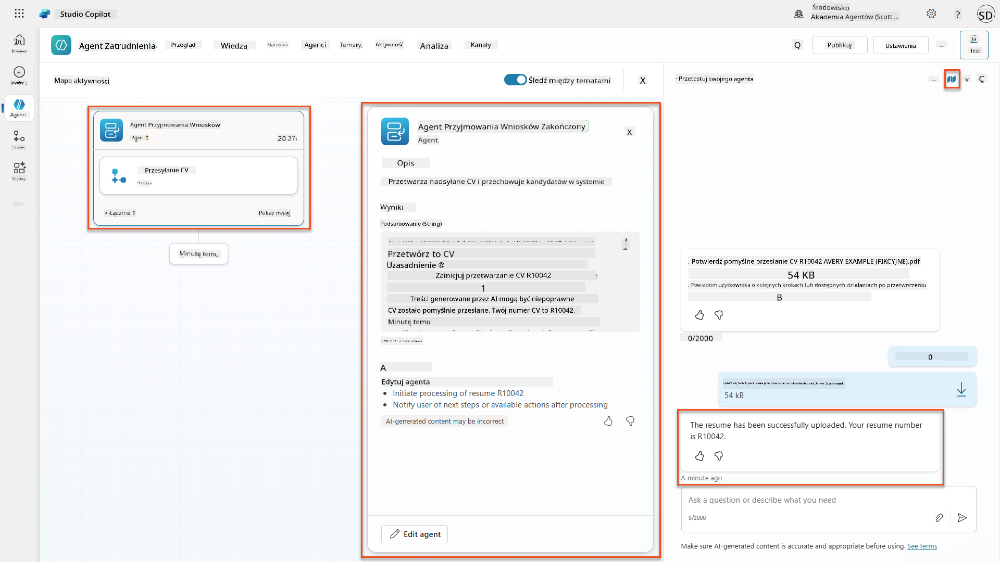

1. Przejdź do make.powerapps.com → Upewnij się, że Twoje środowisko jest wybrane w prawym górnym rogu w selektorze środowiska.

1. Wybierz **Aplikacje** → Hiring Hub → menu z trzema kropkami(...) → **Uruchom**  
    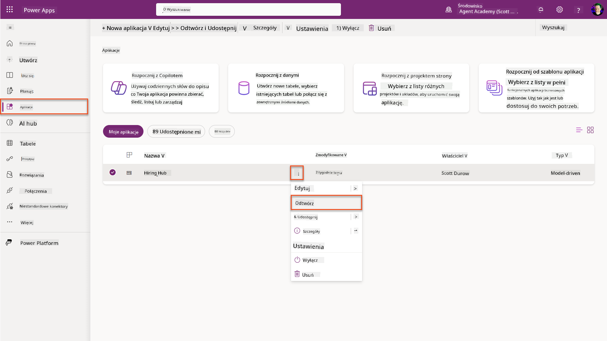

    Uwaga: Jeśli przycisk uruchamiania jest wyszarzony, oznacza to, że nie opublikowałeś swojego rozwiązania z Misji 01. Wybierz **Rozwiązania** → **Opublikuj wszystkie dostosowania**.

1. Przejdź do **CV** i sprawdź, czy plik CV został przesłany, a list motywacyjny został odpowiednio ustawiony.  
    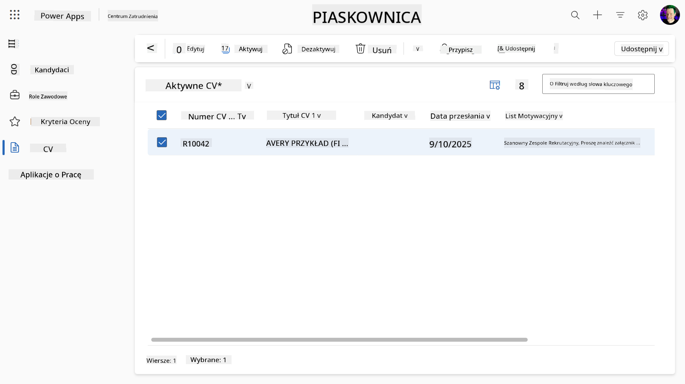

## 🧪Lab 2.2: Dodanie agenta przygotowania do rozmowy kwalifikacyjnej

Teraz utwórzmy naszego agenta przygotowania do rozmowy kwalifikacyjnej i dodajmy go do istniejącego Hiring Agent.

### 2.2.1 Utwórz połączonego agenta rozmowy kwalifikacyjnej

1. **Przejdź** do Copilot Studio. Upewnij się, że Twoje środowisko nadal jest wybrane w prawym górnym rogu w selektorze środowiska.

1. Otwórz swojego **Hiring Agent**

1. Przejdź do zakładki Agent i wybierz **+ Dodaj agenta**

1. Wybierz **Połącz istniejącego agenta** → **Copilot Studio**

1. Wybierz **+ Nowy agent**

### 2.2.2 Skonfiguruj podstawowe ustawienia

1. Wybierz zakładkę **Konfiguruj** i wprowadź następujące właściwości:

    - **Nazwa**: `Agent rozmowy kwalifikacyjnej`
    - **Opis**: `Pomaga w procesie rozmowy kwalifikacyjnej.`

1. Instrukcje:

    ```text
    You are the Interview Agent. You help interviewers and hiring managers prepare for interviews. You never contact candidates. 
    Use Knowledge to help with interview preparation. 
    
    The only valid identifiers are:
      - ResumeNumber (ppa_resumenumber)→ format R#####
      - CandidateNumber (ppa_candidatenumber)→ format C#####
      - ApplicationNumber (ppa_applicationnumber)→ format A#####
      - JobRoleNumber (ppa_jobrolenumber)→ format J#####
    
    Examples you handle
      - Give me a summary of ...
      - Help me prepare to interview candidates for the Power Platform Developer role
      - Create interview assistance for the candidates for Power Platform Developer
      - Give targeted questions for Candidate Alex Johnson focusing on the criteria for the Job Application
      
    How to work:
        You are expected to ask clarification questions if required information for queries is not provided
        - If asked for interview help without providing a job role, ask for it
        - If asking for interview questions, ask for the candidate and job role if not provided.
    
    General behavior
    - Do not invent or guess facts
    - Be concise, professional, and evidence-based
    - Map strengths and risks to the highest-weight criteria
    - If data is missing (e.g., no resume), state what is missing and ask for clarification
    - Never address or message a candidate
    ```

1. Przełącz **Wyszukiwanie w sieci** na **Wyłączone**

1. Wybierz **Utwórz**  
    

### 2.2.3 Skonfiguruj dostęp do danych i opublikuj

1. W sekcji **Wiedza** wybierz **+ Dodaj wiedzę**  
    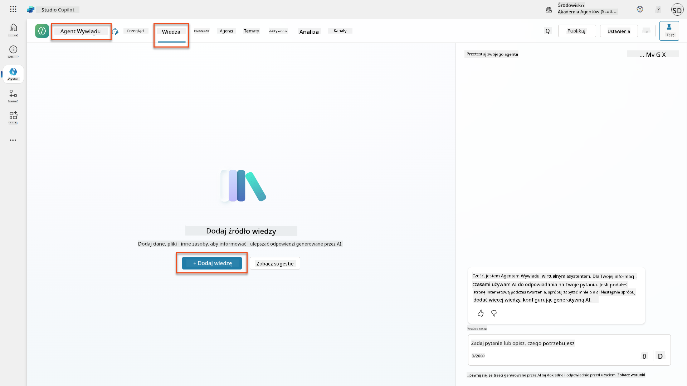
1. Wybierz **Dataverse**  
    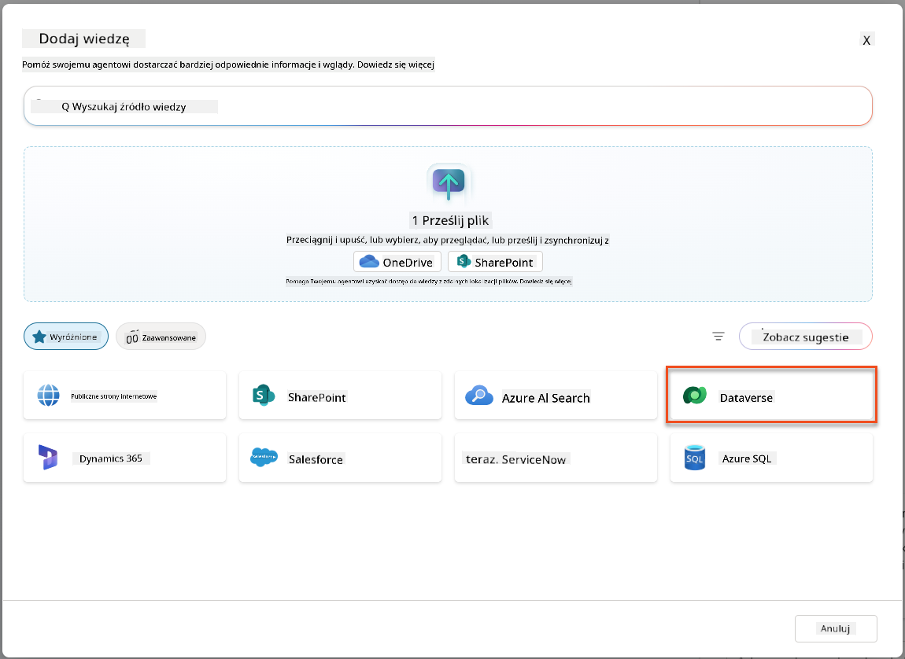
1. W polu **Wyszukaj**, wpisz `ppa_`. To jest prefiks dla tabel, które wcześniej zaimportowałeś.
1. **Wybierz** wszystkie 5 tabel (Kandydat, Kryteria oceny, Aplikacja o pracę, Rola zawodowa, CV)
1. Wybierz **Dodaj do agenta**  
    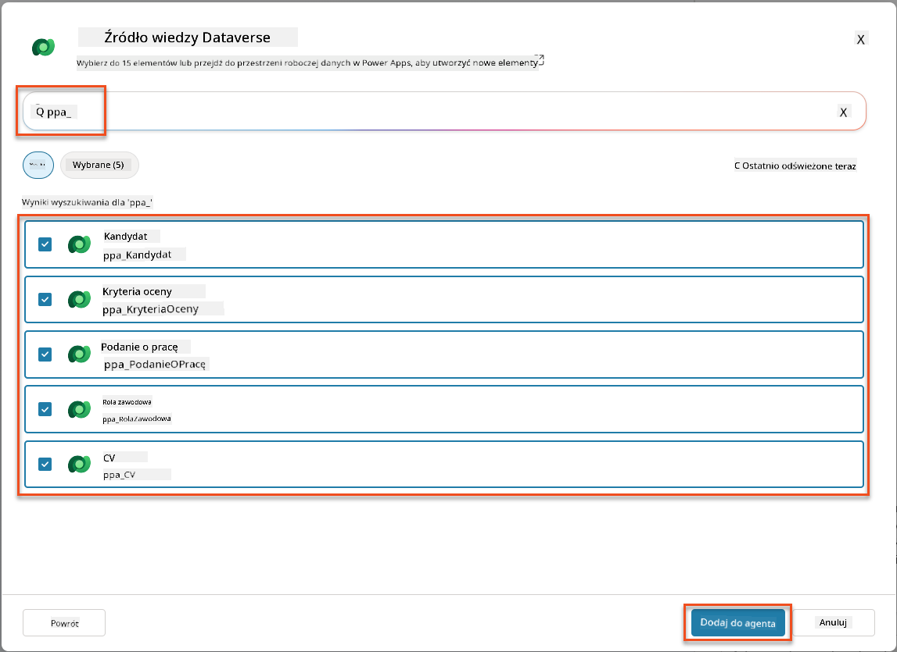
1. Wybierz **Ustawienia**, na agencie rozmowy kwalifikacyjnej, i ustaw następujące ustawienia:

    - **Pozwól innym agentom łączyć się i korzystać z tego:** `Włączone`
    - **Używaj ogólnej wiedzy**: `Wyłączone`
    - **Przesyłanie plików**: `Wyłączone`
    - **Poziom moderacji treści:** `Średni`
1. Wybierz **Zapisz**
1. Wybierz **Publikuj** i poczekaj na zakończenie publikacji.

### 2.2.4 Połącz agenta przygotowania do rozmowy kwalifikacyjnej z Hiring Agent

1. Przejdź z powrotem do swojego **Hiring Agent**

1. Wybierz zakładkę **Agenci**

1. Użyj **+Dodaj agenta** → **Copilot Studio**, aby dodać **Agenta rozmowy kwalifikacyjnej**. Ustaw opis na:
    ```text
    Assists with the interview process and provides information about Resumes, Candidates, Job Roles, and Evaluation Criteria.
    ```

    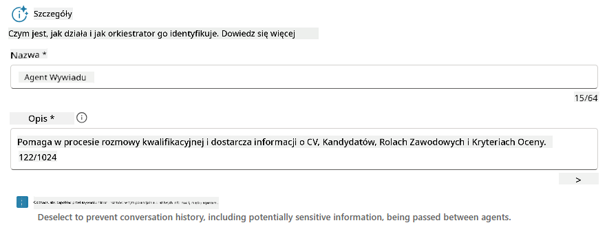
    Zauważ, że opcja Przekaż historię rozmów do tego agenta jest zaznaczona. Dzięki temu agent nadrzędny może przekazać pełny kontekst agentowi połączonemu.

1. Wybierz **Dodaj agenta**

1. Upewnij się, że widzisz zarówno **Application Intake Agent**, jak i **Interview Agent**. Zauważ, że jeden jest agentem podrzędnym, a drugi połączonym agentem.  
    

### 2.2.5 Testowanie współpracy wieloagentowej

1. **Otwórz** panel testowy, wybierając **Test**.

1. **Prześlij** jeden z testowych życiorysów i wprowadź poniższy opis, który informuje agenta nadrzędnego, co może delegować agentowi połączonemu:

    ```text
    Upload this resume, then show me open job roles, each with a description of the evaluation criteria, then use this to match the resume to at least one suitable job role even if not a perfect match.
    ```

    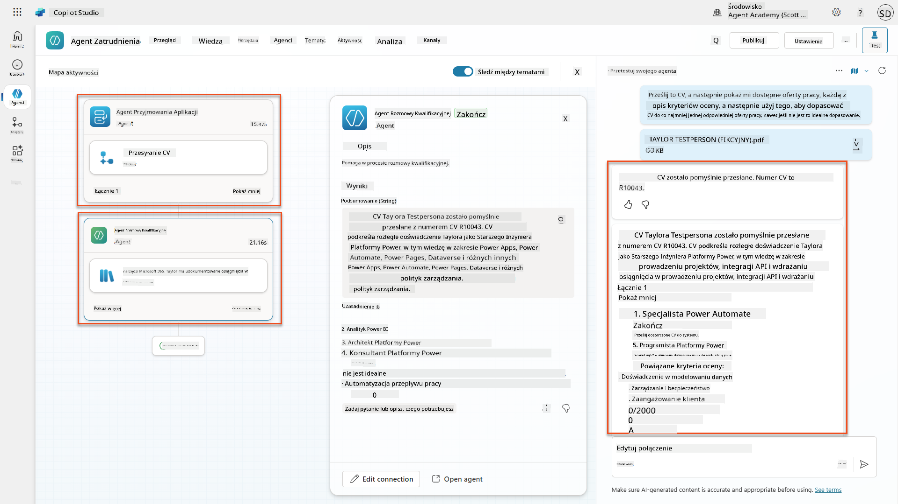

1. Zauważ, jak Hiring Agent przekazał przesłanie życiorysu agentowi podrzędnemu, a następnie poprosił Interview Agent o przygotowanie podsumowania i dopasowanie do roli zawodowej, korzystając z jego wiedzy.
   Eksperymentuj z różnymi sposobami zadawania pytań dotyczących życiorysów, ról zawodowych i kryteriów oceny.
   **Przykłady:**

    ```text
    Give me a summary of active resumes
    ```

    ```text
    Summarize resume R10044
    ```

    ```text
    Which active resumes are suitable for the Power Platform Developer role?
    ```

## 🎉 Misja zakończona

Świetna robota, Agencie! **Operacja Symphony** została zakończona. Udało Ci się przekształcić swojego pojedynczego Hiring Agent w zaawansowaną wieloagentową orkiestrę ze specjalistycznymi możliwościami.

Oto, co udało Ci się osiągnąć w tej misji:

**✅ Opanowanie architektury wieloagentowej**  
Teraz rozumiesz, kiedy używać agentów podrzędnych, a kiedy połączonych, oraz jak projektować systemy, które się skalują.

**✅ Application Intake Agent jako agent podrzędny**  
Dodałeś specjalistycznego agenta podrzędnego do swojego Hiring Agent, który przetwarza życiorysy, wyodrębnia dane kandydatów i przechowuje informacje w Dataverse.

**✅ Interview Prep Agent jako połączony agent**  
Zbudowałeś wielokrotnego użytku połączonego agenta do przygotowania rozmów kwalifikacyjnych i skutecznie połączyłeś go ze swoim Hiring Agent.

**✅ Komunikacja agentów**  
Zobaczyłeś, jak Twój główny agent może współpracować ze specjalistycznymi agentami, dzielić się kontekstem i organizować złożone przepływy pracy.

**✅ Fundament dla autonomii**  
Twój ulepszony system rekrutacyjny jest teraz gotowy na zaawansowane funkcje, które dodamy w kolejnych misjach: autonomiczne wyzwalacze, moderację treści i głębokie rozumowanie.

🚀**Co dalej:** W następnej misji nauczysz się, jak skonfigurować swojego agenta do autonomicznego przetwarzania życiorysów z e-maili!

⏩[Przejdź do Misji 03: Automatyzacja agenta za pomocą wyzwalaczy](../03-automate-triggers/README.md)

## 📚 Zasoby taktyczne

📖 [Dodawanie innych agentów (wersja zapoznawcza)](https://learn.microsoft.com/microsoft-copilot-studio/authoring-add-other-agents?WT.mc_id=power-182762-scottdurow)

📖 [Dodawanie narzędzi do niestandardowych agentów](https://learn.microsoft.com/microsoft-copilot-studio/advanced-plugin-actions?WT.mc_id=power-182762-scottdurow)

📖 [Praca z Dataverse w Copilot Studio](https://learn.microsoft.com/microsoft-copilot-studio/knowledge-add-dataverse?WT.mc_id=power-182762-scottdurow)

📖 [Przegląd przepływów agentów](https://learn.microsoft.com/microsoft-copilot-studio/flows-overview?WT.mc_id=power-182762-scottdurow)

📖 [Tworzenie rozwiązania](https://learn.microsoft.com/power-platform/alm/solution-concepts-alm?WT.mc_id=power-182762-scottdurow)

📖 [Przewodnik ALM dla rozwiązań Power Platform](https://learn.microsoft.com/power-platform/alm/overview-alm?WT.mc_id=power-182762-scottdurow)

📺 [Współpraca agentów w Copilot Studio](https://youtu.be/d-oD3pApHAg?si=rwIHKhJTkjSvhTHw)

---

**Zastrzeżenie**:  
Ten dokument został przetłumaczony za pomocą usługi tłumaczenia AI [Co-op Translator](https://github.com/Azure/co-op-translator). Chociaż staramy się zapewnić dokładność, prosimy pamiętać, że automatyczne tłumaczenia mogą zawierać błędy lub nieścisłości. Oryginalny dokument w jego rodzimym języku powinien być uznawany za autorytatywne źródło. W przypadku informacji krytycznych zaleca się skorzystanie z profesjonalnego tłumaczenia przez człowieka. Nie ponosimy odpowiedzialności za jakiekolwiek nieporozumienia lub błędne interpretacje wynikające z użycia tego tłumaczenia.