<!--
CO_OP_TRANSLATOR_METADATA:
{
  "original_hash": "180f9cc0b40527f61be092c9b0f72aba",
  "translation_date": "2025-10-22T00:39:44+00:00",
  "source_file": "docs/recruit/06-create-agent-from-conversation/README.md",
  "language_code": "pl"
}
-->
# 🚨 Misja 06: Stwórz własnego agenta za pomocą języka naturalnego z Copilot i połącz go z danymi

## 🕵️‍♂️ KOD OPERACJI: `OPERACJA KUŹNIA AGENTÓW`

> **⏱️ Czas trwania operacji:** `~75 minut`

🎥 **Obejrzyj przewodnik**

[](https://www.youtube.com/watch?v=qZTtQVncGFg "Obejrzyj przewodnik na YouTube")

## 🎯 Cel misji

Witaj ponownie, Twórco Agentów. W tej misji przejmujesz stery najpotężniejszej funkcji w Copilot Studio - tworzenia własnego agenta od podstaw za pomocą języka naturalnego… i wzbogacania go o własne dane.

To nie jest zwykły chatbot. Tworzysz cyfrowego współpracownika, który potrafi rozumować, odpowiadać i korzystać z rzeczywistych informacji przedsiębiorstwa.

Twoje narzędzie? Język naturalny. Twoja misja? Zaprojektowanie, przeszkolenie i przetestowanie w pełni spersonalizowanego agenta helpdesku, który odpowiada na pytania dotyczące IT, korzystając z SharePoint, przesłanych plików lub adresów URL firmy.

Zbudujmy Twojego agenta od podstaw.

## 🔎 Cele

W tej misji nauczysz się:

1. Zrozumienia, czym są własne agenty i jak różnią się od gotowych szablonów.
1. Tworzenia agentów za pomocą naturalnych poleceń i projektowania rozmów z Copilot.
1. Łączenia agentów z zasobami wiedzy przedsiębiorstwa, w tym SharePoint, dokumentami i stronami internetowymi.
1. Poznania generatywnej orkiestracji i sposobu, w jaki agenci dynamicznie wyszukują i odpowiadają, korzystając z wielu źródeł danych.
1. Budowania i testowania w pełni funkcjonalnego agenta helpdesku IT, który odpowiada na pytania na podstawie Twoich danych.

## 🤔 Czym jest _własny_ agent?

Własny agent to chatbot lub wirtualny asystent, którego tworzysz i projektujesz w Copilot Studio, aby pomagać użytkownikom w określonych zadaniach lub odpowiadać na pytania. Nazywa się go własnym, ponieważ:

- **Ty decydujesz o jego celu** - pomaga użytkownikom w składaniu wniosków urlopowych, sprawdzaniu statusu zamówienia, udzielaniu pomocy w kwestiach IT.
- **Ty definiujesz rozmowę** - co agent mówi i jak powinien odpowiadać.
- **Ty łączysz go z własnymi danymi** - podłączasz do danych przedsiębiorstwa za pomocą wbudowanych zasobów wiedzy.
- **Ty łączysz go z własnymi systemami lub aplikacjami** - wybierasz spośród konektorów, przepływów, REST API i serwerów protokołu kontekstu modelu.

!!! note
    Pomyśl o tym w ten sposób: budujesz własnego cyfrowego pomocnika, który może rozmawiać z użytkownikami i wykonywać dla nich zadania, takie jak odpowiadanie na pytania, zbieranie informacji potrzebnych do realizacji procesu lub łączenie się z danymi przedsiębiorstwa.

### 🤖 Co potrafi własny agent?

Własny agent może wykonywać następujące zadania:

- Pytać użytkowników o informacje, takie jak imiona, daty czy preferencje.
- Zapisywać te informacje w bazie danych lub tabeli.
- Wyszukiwać dane na podstawie zadanych pytań i udzielać odpowiedzi.
- Działać autonomicznie, bez bezpośredniej interakcji z użytkownikiem.
- Wywoływać działania na żądanie poprzez bezpośrednią interakcję z użytkownikiem lub autonomicznie, np. wysyłanie e-maili czy tworzenie rekordów.

### 👩🏻‍💻 Dlaczego warto korzystać z własnego agenta?

- Oszczędza czas, automatyzując powtarzalne zadania.
- Zapewnia użytkownikom przyjazne, prowadzone doświadczenie.
- Można go dostosować do potrzeb firmy lub projektu.

### ✨ Przykład

Tworzysz własnego agenta, który pomaga pracownikom w składaniu wniosków urlopowych.

Agent pyta o ich imię, daty urlopu oraz imię przełożonego, a następnie zapisuje te informacje w wyznaczonym systemie zarządzania wnioskami urlopowymi, takim jak lista SharePoint.

Teraz, zamiast nawigować po liście SharePoint i tworzyć nowy element, pracownicy po prostu rozmawiają z agentem.

## 🗣️ Tworzenie agentów za pomocą języka naturalnego

W poprzedniej lekcji nauczyłeś się, jak szybko tworzyć agentów w Copilot Studio, korzystając z gotowych szablonów agentów w [Lekcji 05 - Rozpocznij szybko z gotowymi agentami](../05-using-prebuilt-agents/README.md). W tej lekcji zagłębimy się w doświadczenie tworzenia rozmów z Copilot. Copilot Studio ułatwia budowanie agentów poprzez rozmowę z Copilot, tak jakbyś prowadził konwersację.

W Copilot Studio nie musisz pisać kodu, aby stworzyć agenta. Zamiast tego opisujesz, co chcesz, aby Twój agent robił, w prostym języku, a Copilot pomaga Ci go zbudować krok po kroku w formie rozmowy.

## 🌱 Ale jestem nowy w "opisywaniu tego, czego chcę" - co robić?

Opisywanie w języku naturalnym, aby stworzyć własnego agenta, może być dla Ciebie nowym konceptem. Za każdym razem, gdy korzystasz z Copilot w produktach i usługach Microsoft, używasz języka naturalnego w formie _promptu_.

Prompt to wiadomość lub instrukcja, którą przekazujesz agentowi AI, aby powiedzieć mu, co chcesz, aby zrobił. Pomyśl o tym jak o dawaniu wskazówek asystentowi. Im bardziej klarowne są Twoje instrukcje, tym łatwiej asystentowi zrozumieć i działać zgodnie z nimi.

### 🪄 Dlaczego prompty są ważne

- Kierują zachowaniem agenta.
- Pomagają agentowi zrozumieć, jaki rodzaj rozmowy powinien prowadzić.
- Dobry prompt sprawia, że agent jest bardziej pomocny i dokładny.

### 📝 Wskazówki dotyczące pisania dobrego promptu

- Bądź jasny i konkretny - powiedz dokładnie, co chcesz, aby agent zrobił.
- Myśl jak użytkownik - co użytkownik powie? Jak agent powinien odpowiedzieć?
- Dodaj przykłady - jeśli to możliwe, podaj przykładową interakcję.

### ✨ Przykład

Załóżmy, że zespół HR potrzebuje agenta do pomocy w składaniu wniosków urlopowych.

Prompt mógłby brzmieć:

    „Chcę stworzyć agenta, który pomaga użytkownikom w składaniu wniosków urlopowych. Gdy użytkownik powie, że chce wziąć urlop, agent powinien zapytać o jego imię, datę rozpoczęcia urlopu, datę zakończenia urlopu oraz imię przełożonego. Po podaniu tych informacji przez użytkownika, agent powinien zapisać je na liście SharePoint o nazwie ‘Wnioski Urlopowe’ i opublikować powiadomienie w dedykowanym kanale Microsoft Teams.”

Dlaczego ten prompt działa:

- **Jasno określa cel** - składanie wniosków urlopowych.
- **Opisuje interakcję użytkownika** - co użytkownik mówi i co agent powinien zapytać.
- **Wymienia wymagane dane** - imię, daty urlopu, przełożony.
- **Wskazuje, gdzie dane mają być zapisane** - lista SharePoint o nazwie Wnioski Urlopowe.

## 🔮 OK, stworzyłem swojego agenta... jak teraz połączyć go z wiedzą?

W Copilot Studio źródła wiedzy to miejsca, w których Twój agent może znaleźć informacje, aby udzielać lepszych odpowiedzi. Dodając te źródła, Twój agent może korzystać z danych przedsiębiorstwa z takich miejsc jak Power Platform, Dynamics 365, strony internetowe i inne systemy lub usługi używane przez Twoją firmę.

Te źródła współpracują z AI, aby pomóc Twojemu agentowi odpowiadać bardziej precyzyjnie na pytania użytkowników, co jest osiągane dzięki temu, co nazywa się **generatywną orkiestracją**.

### 🌿 Czym jest generatywna orkiestracja w kontekście agentów?

Generatywna orkiestracja oznacza, że agent używa AI, aby dynamicznie zdecydować, jak odpowiedzieć na pytanie, łącząc swoje wbudowane umiejętności językowe z informacjami z dodanych źródeł wiedzy.

Gdy użytkownik zadaje pytanie, agent:

- Rozumie pytanie za pomocą AI.
- Może zapytać użytkownika o brakujące informacje, generując pytania na bieżąco.
- Wybiera najbardziej odpowiednie źródła wiedzy.
- Przeszukuje te źródła w poszukiwaniu odpowiedzi.
- Generuje naturalną, pomocną odpowiedź na podstawie znalezionych informacji.

### 🏦 Dlaczego źródła wiedzy są ważne?

1. **Mądrzejsze odpowiedzi** - dodając źródła wiedzy, Twój agent może udzielać lepszych, bardziej precyzyjnych odpowiedzi, korzystając z rzeczywistych danych Twojej organizacji.

1. **Mniej pracy ręcznej** - nie musisz pisać każdej możliwej odpowiedzi. Agent może przeszukiwać dodane źródła i odpowiadać automatycznie.

1. **Korzystanie z zaufanych informacji** - Twój agent może pobierać odpowiedzi z systemów, których już używasz, takich jak Dataverse, SharePoint czy strony internetowe firmy, dzięki czemu użytkownicy otrzymują wiarygodne informacje z zaufanych źródeł.

1. **Współpraca z generatywną AI** - źródła wiedzy i AI pomagają Twojemu agentowi zrozumieć pytania i odpowiadać naturalnie, nawet jeśli pytanie nie zostało wcześniej zaprogramowane lub dodane jako początkowy prompt.

1. **Elastyczność i możliwość rozbudowy** - możesz dodawać źródła wiedzy w dowolnym momencie podczas konfiguracji lub później, dzięki czemu Twój agent staje się coraz mądrzejszy wraz ze zmianą Twoich potrzeb.

### ✨ Przykład

Wyobraź sobie, że tworzysz agenta, który pomaga pracownikom w kwestiach HR. Dodajesz dokument z polityką HR Twojej firmy oraz stronę SharePoint jako źródła wiedzy.

Gdy pracownik pyta, _„Ile dni urlopu mi przysługuje?”_, agent używa generatywnej orkiestracji, aby przeszukać te źródła i odpowiedzieć zgodnie z obowiązującą polityką, bez konieczności ręcznego pisania tej odpowiedzi. Oszczędza to czas, który musiałbyś poświęcić na uwzględnienie każdego możliwego pytania, jakie pracownik mógłby zadać na temat swoich uprawnień.

## Rodzaje źródeł wiedzy, które można dodać

1. **Publiczne strony internetowe**
    - **Co robi:** Przeszukuje określone strony internetowe (np. stronę Twojej firmy) za pomocą Bing.
    - **Dlaczego jest przydatne:** Świetne do pobierania informacji publicznych, takich jak FAQ czy szczegóły produktów.

1. **Dokumenty**
    - **Co robi:** Korzysta z dokumentów przesłanych bezpośrednio do agenta, takich jak pliki PDF czy Word. Przesłane pliki są bezpiecznie przechowywane w Dataverse.
    - **Dlaczego jest przydatne:** Umożliwia agentowi odpowiadanie na pytania na podstawie wewnętrznych przewodników, instrukcji czy polityk.

1. **SharePoint**
    - **Co robi:** Łączy się z folderami lub plikami SharePoint za pomocą Microsoft Graph Search.
    - **Dlaczego jest przydatne:** Idealne do uzyskiwania dostępu do dokumentów zespołowych, polityk HR czy plików projektowych przechowywanych w SharePoint.

1. **Dataverse**
    - **Co robi:** Korzysta ze strukturalnych danych z tabel i wierszy środowiska Dataverse, może stosować synonimy i definicje słownikowe dla tabel i kolumn, aby poprawić odpowiedzi agenta.
    - **Dlaczego jest przydatne:** Gdy potrzebujesz wyszukiwać dane przedsiębiorstwa przechowywane w Dataverse, takie jak informacje o klientach.

1. **Wiedza w czasie rzeczywistym dzięki konektorom**
    - **Co robi:** Pozwala Twojemu agentowi na dostęp do aktualnych danych z innych systemów przedsiębiorstwa, takich jak Salesforce, ServiceNow, Dynamics 365, AzureSQL, Databricks i inne, podczas rozmowy, korzystając z uprawnień użytkownika.
    - **Dlaczego jest przydatne:** Zapewnia aktualne, bezpieczne i precyzyjne odpowiedzi bez przechowywania lub duplikowania danych, czyniąc Twojego agenta mądrzejszym i bezpieczniejszym.

1. **Azure AI Search**
    - **Co robi:** Pozwala Twojemu agentowi przeszukiwać duże zestawy dokumentów przechowywanych w Azure za pomocą wyszukiwania semantycznego i wektorowego, aby zrozumieć pytania użytkowników.
    - **Dlaczego jest przydatne:** Dostarcza precyzyjne, wiarygodne odpowiedzi z złożonych źródeł danych, wspiera cytowania i dobrze się skaluje dla dużych kolekcji dokumentów z kontrolą dostępu.

## 🔒 Uwagi dotyczące bezpieczeństwa

### Uwierzytelnianie źródeł wiedzy

Niektóre źródła, takie jak SharePoint i Dataverse, wymagają uwierzytelnienia użytkownika. Oznacza to, że agent będzie odnosił się w odpowiedziach tylko do danych, które użytkownik ma prawo zobaczyć. Inne źródła mogą wymagać dodatkowej konfiguracji, aby agent mógł się z nimi połączyć, na przykład Azure AI Search, które wymaga konta Azure i określenia typu uwierzytelnienia.

## Poprawa odpowiedzi agenta w Copilot Studio

Po utworzeniu agenta w procesie konwersacyjnym, warto przetestować jego działanie w oparciu o instrukcje wygenerowane przez Copilot na podstawie Twojego promptu. Poprawa odpowiedzi agenta w Copilot Studio polega na upewnieniu się, że rozumie on Twoje cele i ma dostęp do odpowiednich informacji.

1. **Doprecyzowanie instrukcji dla agenta** - tutaj określasz, jak agent powinien się zachowywać. Używaj jasnego, konkretnego języka.

    Na przykład:

    ✅ „Zachowuj się jak przyjazny agent obsługi klienta, który tłumaczy rzeczy w prosty sposób.”

    ❌ „Bądź pomocny.” (Zbyt ogólne)

1. **Sprawdź ton i język** - upewnij się, że ton agenta pasuje do Twojej grupy odbiorców.

    Możesz ustawić go jako:

    - Przyjazny i swobodny.
    - Profesjonalny i zwięzły.
    - Wspierający i cierpliwy.

1. **Dodaj lub zaktualizuj źródła wiedzy** - jeśli Twój agent musi odpowiadać na pytania dotyczące konkretnego tematu, upewnij się, że ma dostęp do odpowiednich informacji.

    - Dodaj linki do stron internetowych, dokumentów lub FAQ.
    - Aktualizuj treści na bieżąco.
    - Używaj jasnych, dobrze zorganizowanych informacji.

1. **Używaj tematów i wyzwalaczy** - jeśli Twój agent musi obsługiwać konkretne zadania lub rozmowy, możesz tworzyć tematy z frazami wyzwalającymi. To pomaga precyzyjniej kierować rozmową. Więcej na ten temat dowiemy się w kolejnej lekcji.

1. **Testuj prawdziwe pytania** - spróbuj zadać swojemu agentowi pytania, które mogą zadawać użytkownicy.

    Jeśli odpowiedzi nie są zadowalające:

    - Dostosuj instrukcje systemowe.
    - Dodaj więcej przykładów lub wiedzy.
    - Przeformułuj pytania, aby zobaczyć, jak agent odpowiada.

1. **Przeglądaj i iteruj** - poprawa agenta to proces ciągły!

    Po opublikowaniu:

    - Zbieraj opinie od użytkowników.
    - Obserwuj często zadawane pytania lub niejasności.
    - Kontynuuj udoskonalanie konfiguracji agenta.

## 🧪 Laboratorium 06: Tworzenie własnego agenta w Copilot Studio

Teraz nauczymy się, jak stworzyć własnego agenta, który będzie mógł rozmawiać na podstawie Twoich danych.

- [6.1 Tworzenie agenta za pomocą języka naturalnego w Copilot](../../../../../docs/recruit/06-create-agent-from-conversation)
- [6.2 Dodanie we
Użyjemy tego samego przypadku użycia z [Lekcja 03 - Tworzenie deklaratywnego agenta dla Microsoft 365 Copilot](../03-create-a-declarative-agent-for-M365Copilot/README.md#use-case-scenario)

**Jako** pracownik

**Chcę** szybko i dokładnie uzyskać pomoc od agenta pomocy technicznej IT w sprawach takich jak problemy z urządzeniami, rozwiązywanie problemów z siecią, konfiguracja drukarki

**Aby móc** być produktywnym i rozwiązywać problemy techniczne bez opóźnień

Zaczynajmy!

### ✨ Wymagania wstępne

- **Witryna SharePoint**

Będziemy korzystać z witryny SharePoint **Contoso IT** z [Lekcja 00 - Konfiguracja kursu - Krok 3: Tworzenie nowej witryny SharePoint](../00-course-setup/README.md#step-4-create-new-sharepoint-site).

Jeśli nie skonfigurowałeś witryny SharePoint **Contoso IT**, wróć do [Lekcja 00 - Konfiguracja kursu - Krok 3: Tworzenie nowej witryny SharePoint](../00-course-setup/README.md#step-4-create-new-sharepoint-site).

- **Rozwiązanie**

Będziemy korzystać z rozwiązania **Contoso Helpdesk Agent** z [Lekcja 04 - Tworzenie rozwiązania dla Twojego agenta](../04-creating-a-solution/README.md#41-create-a-solution-publisher).

Jeśli nie skonfigurowałeś rozwiązania **Contoso Agent**, wróć do [Lekcja 04 - Tworzenie rozwiązania dla Twojego agenta](../04-creating-a-solution/README.md#41-create-a-solution-publisher).

### 6.1 Tworzenie agenta za pomocą języka naturalnego w Copilot

!!! warning "Pytania Copilot mogą się różnić w zależności od sesji"

    Doświadczenie konwersacyjne w Copilot może się różnić za każdym razem, a dostarczone pytania mogą być nieco inne niż wcześniej.

1. Przejdź do strony głównej Copilot Studio i w polu wpisz następujący prompt opisujący agenta pomocy technicznej IT. Prompt zawiera cel agenta, kontekst, oczekiwane zadania i format odpowiedzi agenta.

    ```text
    You are an IT help desk agent. Your goal is to assist users with their IT issues. You can access information from our company's knowledge base at https://support.microsoft.com/en-us. Your responses should be polite and helpful. If a user reports a slow computer, ask about the age of the device, current software versions, and if they've recently installed any new programs. If a user is experiencing trouble logging into their email, guide them through password reset procedures. You should be concise and informative, using step-by-step instructions with bullet points when appropriate.
    ```

      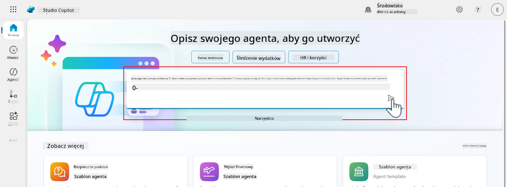

1. Następnie załaduje się doświadczenie konwersacyjne w Copilot. Zobaczysz, że Copilot przetwarza Twoje zapytanie.

      

1. Copilot potwierdza, że agent został skonfigurowany zgodnie z dostarczonymi instrukcjami i pyta o potwierdzenie nazwy agenta. Poprosimy Copilot o nazwę naszego agenta jako:

       ```text
       Contoso Helpdesk Agent
       ```

      

1. Copilot wykonuje żądanie i zobaczymy, że nazwa agenta została zaktualizowana w panelu agenta. Następnie Copilot pyta nas o doprecyzowanie instrukcji. Pyta, jak powinniśmy odpowiadać na konkretne problemy, a my poprosimy, aby potwierdzał problem, podawał przykłady tematów do odpowiedzi i formatował odpowiedź w punktach.

    Skopiuj i wklej poniższe, a następnie wyślij żądanie do Copilot.

       ```text
       Priorytetowo traktuj pilne zgłoszenia. Przykłady problemów IT lub scenariuszy do pomocy: problemy z urządzeniami, łączność sieciowa, problemy z logowaniem. Podczas rozwiązywania problemów najpierw potwierdź ich problem i odpowiedz z empatią, następnie podaj instrukcje krok po kroku w formie punktów i zapytaj, czy potrzebują dalszej pomocy.
       ```

      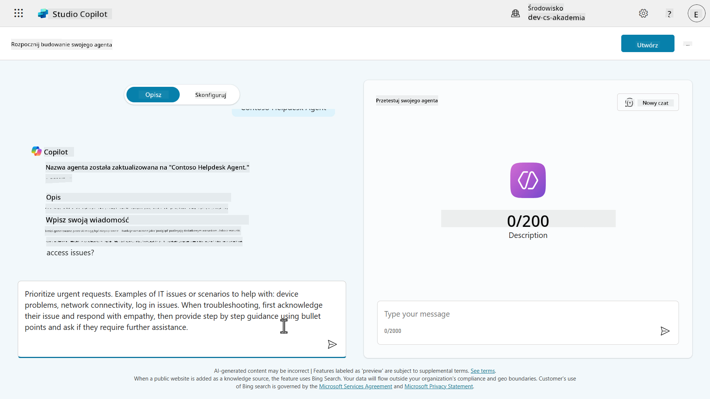

1. Instrukcje agenta zostaną zaktualizowane po otrzymaniu żądania przez Copilot. Zauważ, że w panelu po prawej stronie pojawiły się teraz początkowe prompty. Zostały one utworzone na podstawie naszych instrukcji.

    Następnie Copilot pyta o publiczne strony internetowe, które mogą być źródłem wiedzy dla agenta.

    Skopiuj i wklej poniższe, a następnie wyślij żądanie do Copilot.

      ```text
      https://support.microsoft.com
      ```

      

1. Publiczna strona internetowa zostanie dodana jako źródło wiedzy. Copilot pyta, czy należy dodać dodatkowe źródła wiedzy. Nie musimy dodawać dodatkowych publicznych stron internetowych.

    Skopiuj i wklej poniższe, a następnie wyślij żądanie do Copilot.

      ```text
      Proceed with setup
      ```

      

1. Copilot potwierdza, że konfiguracja naszego agenta Contoso Helpdesk Agent została zakończona, ale dodamy jeszcze jedną modyfikację. Poprosimy, aby nasz agent nie odpowiadał na pytania związane z HR. Dzięki temu nasz agent będzie wiedział, że nie powinien odpowiadać na pytania użytkowników dotyczące HR.

    Skopiuj i wklej poniższe, a następnie wyślij żądanie do Copilot.

       ```text
       Nie udzielaj pomocy w pytaniach związanych z HR, przykłady to: Jaki jest mój bilans urlopów? Ile dni chorobowych mi przysługuje? Jaki jest URL do naszego portalu płacowego?
       ```

      

1. Instrukcje zostaną zaktualizowane, aby nie udzielać pomocy w pytaniach związanych z HR. Nie musimy wprowadzać dalszych aktualizacji, nasz agent jest gotowy do utworzenia.

      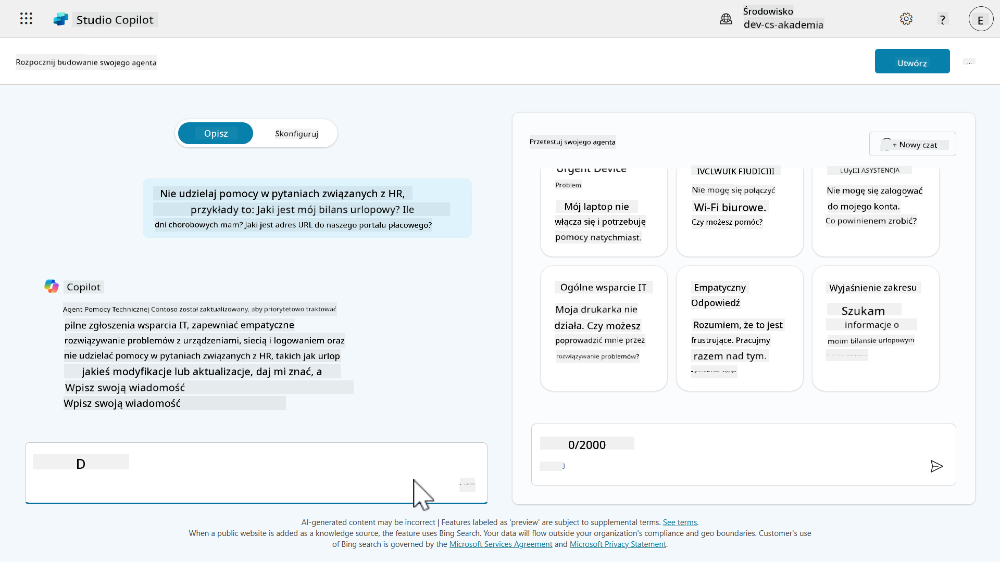

1. Zanim utworzymy naszego agenta, wykonajmy kilka rzeczy.

    Najpierw wybierz kartę **Configure**, aby zobaczyć szczegóły agenta zdefiniowane podczas naszej rozmowy z Copilot. Tutaj zobaczysz nazwę, opis, instrukcje, wiedzę i sugerowane/początkowe prompty.

      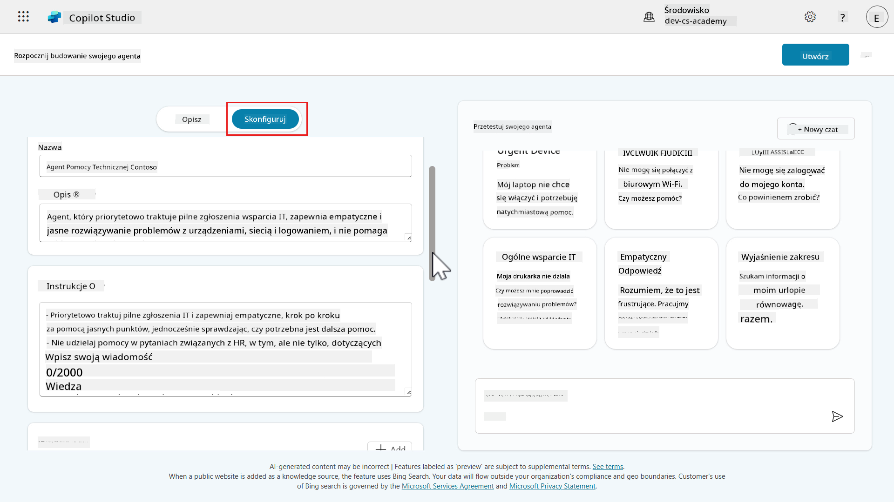

1. Po drugie, przetestujmy naszego agenta. Skopiuj i wklej poniższe, a następnie wyślij pytanie do naszego agenta.

       ```text
       Jak mogę sprawdzić status gwarancji mojego Surface?
       ```

      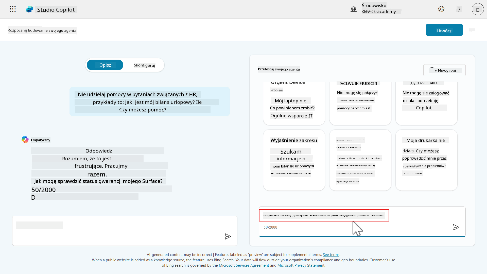

1. Odpowiedź na pytanie zostanie wyświetlona, gdzie odpowiedzi są w formacie przewodnika krok po kroku w punktach. Świetnie, nasz agent działa! 🙌🏻

      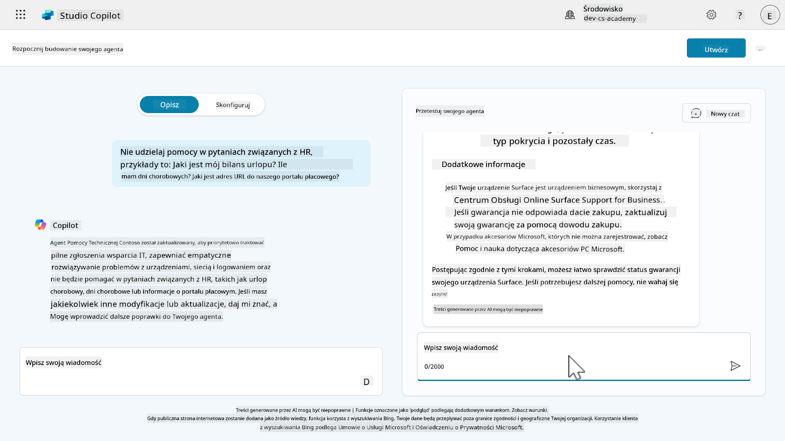

1. Na koniec sprawdzimy, czy rozwiązanie, w którym nasz agent zostanie utworzony, jest rozwiązaniem, które utworzyliśmy i wybraliśmy jako preferowane rozwiązanie w [Lekcja 04 - Tworzenie nowego rozwiązania](../04-creating-a-solution/README.md#42-create-a-new-solution).

    Wybierz ikonę **trzech kropek (...)** i wybierz **Update Advanced Settings**.

      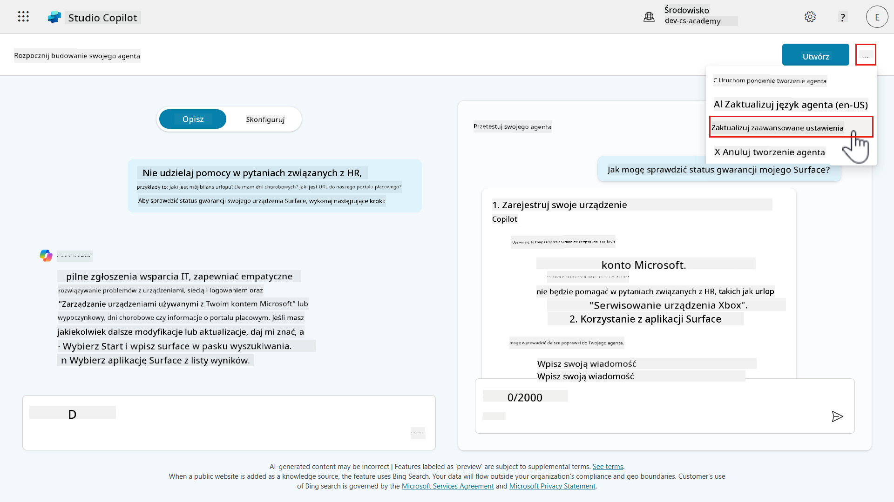

1. Pojawi się modal **Advanced Settings**, gdzie możemy zobaczyć, że nasze rozwiązanie utworzone wcześniej jest domyślnie wybrane. Jest to wynikiem wybrania naszego rozwiązania jako preferowanego w [Lekcja 04 - Tworzenie nowego rozwiązania](../04-creating-a-solution/README.md#42-create-a-new-solution).

    Wybierz **Cancel.**

      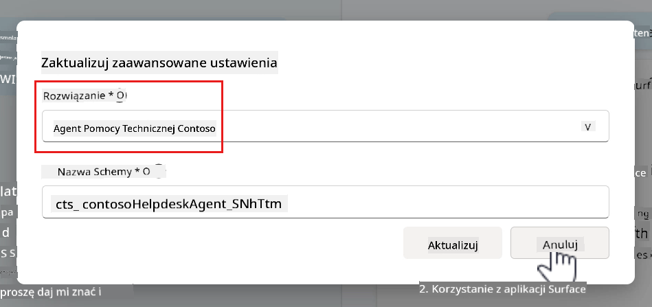

1. Teraz utwórzmy naszego niestandardowego agenta! Wybierz **Create**.

      

1. Copilot Studio rozpocznie tworzenie naszego agenta.

      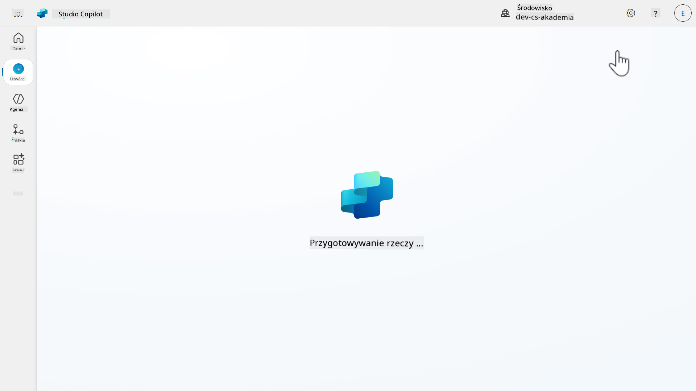

1. Po utworzeniu agenta możemy zobaczyć szczegóły agenta odzwierciedlające to, o co prosiliśmy podczas doświadczenia konwersacyjnego w Copilot. Przewiń w dół, aby przejrzeć agenta, gdzie zobaczysz nazwę, opis, instrukcje, źródła wiedzy i sugerowane prompty. Tryb orkiestracji jest domyślnie włączony, a domyślny model jest używany jako model odpowiedzi agenta.

      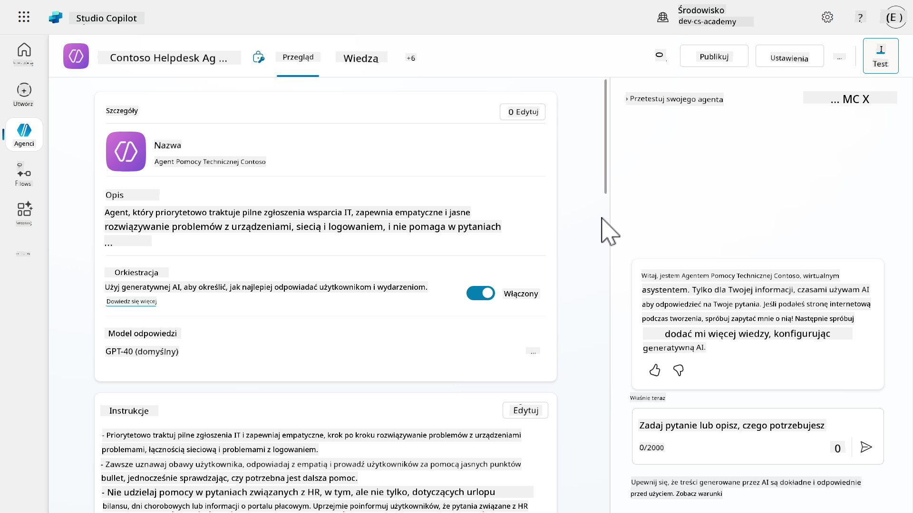

      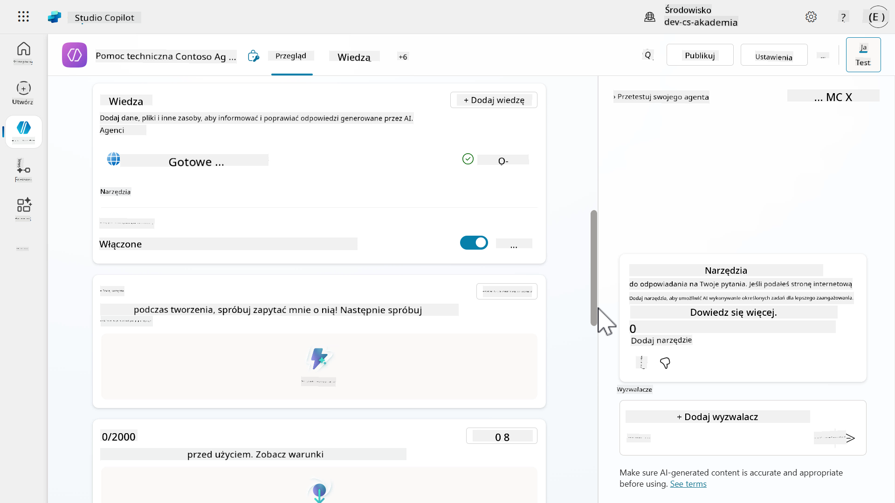

      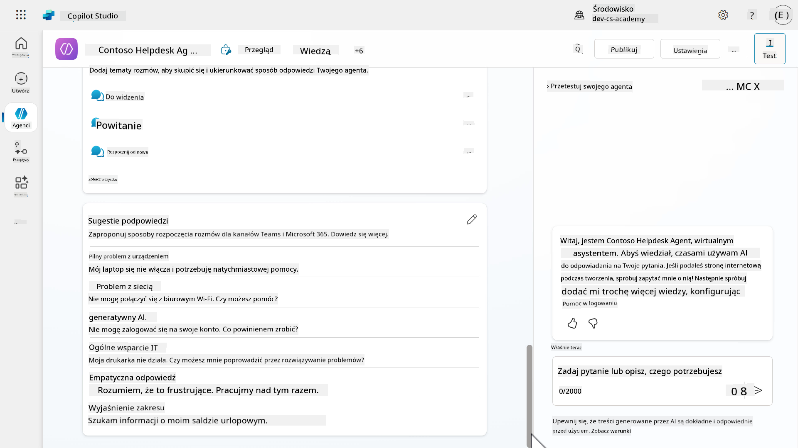

1. Teraz przetestujmy naszego nowo utworzonego agenta. W panelu **Test** po prawej stronie wybierz ikonę **Activity Map**.

      

1. Wpisz następujące pytanie w panelu **Test**.

       ```text
       Jak znaleźć klucz produktu Windows 11?
       ```

      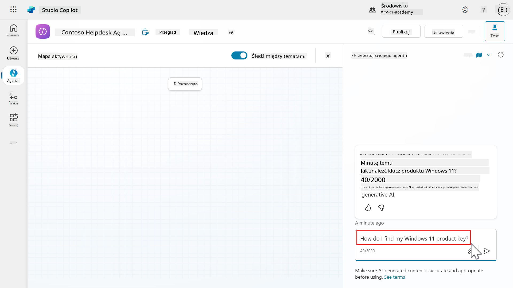

1. Następnie załaduje się mapa aktywności, która pokazuje w czasie rzeczywistym, jaką ścieżkę przetwarza agent. W tym scenariuszu nasz agent zrozumiał pytanie i przeszukuje źródła wiedzy. Obecnie mamy jedno źródło, którym jest publiczna strona internetowa dodana wcześniej za pomocą Copilot, którą agent przegląda.

      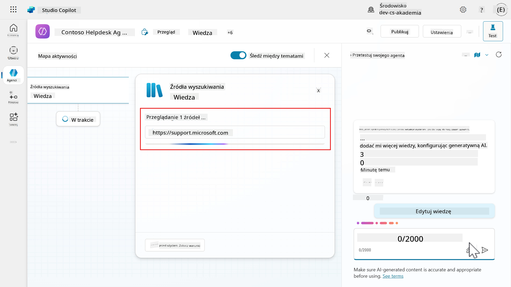

1. Nasz agent odpowiada następnie odpowiedziami w formie punktów, zgodnie z instrukcjami. Odpowiedź zawiera odniesienia do stron internetowych, z których agent utworzył swoją odpowiedź. Umożliwia to użytkownikom weryfikację źródła odpowiedzi.

      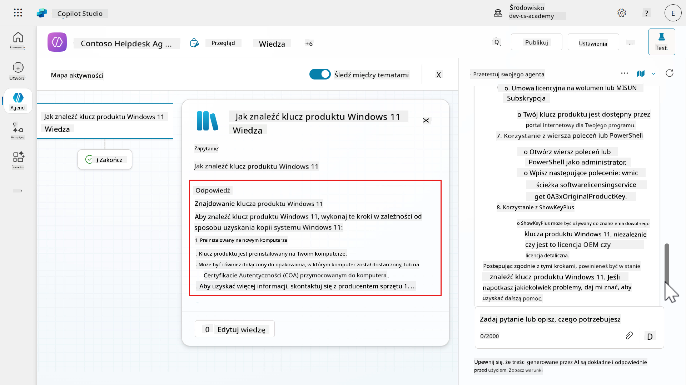

1. Możesz również przejrzeć odpowiedź i jej źródła, przewijając w dół modal **Knowledge** w mapie aktywności.

      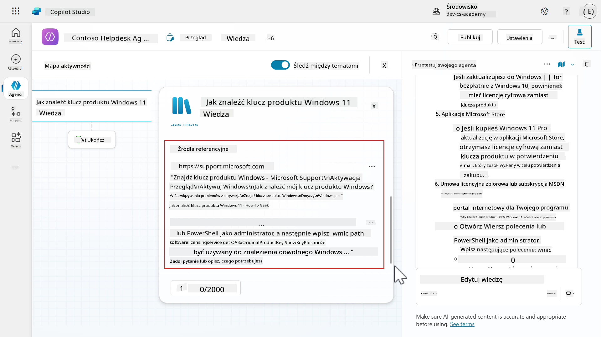

Gratulacje! Utworzyłeś swojego pierwszego niestandardowego agenta za pomocą Copilot w Copilot Studio 🙌🏻

### 6.2 Dodanie wewnętrznego źródła wiedzy za pomocą witryny SharePoint

Wcześniej w Copilot dodaliśmy publiczną stronę internetową jako zewnętrzne źródło wiedzy dla naszego agenta podczas doświadczenia konwersacyjnego. Teraz dodamy wewnętrzne źródło wiedzy za pomocą witryny SharePoint. Będzie to witryna SharePoint, którą utworzyłeś podczas [Lekcja 00 - Konfiguracja kursu](../00-course-setup/README.md#step-4-create-new-sharepoint-site).

1. Wybierz **+ Add knowledge**.

      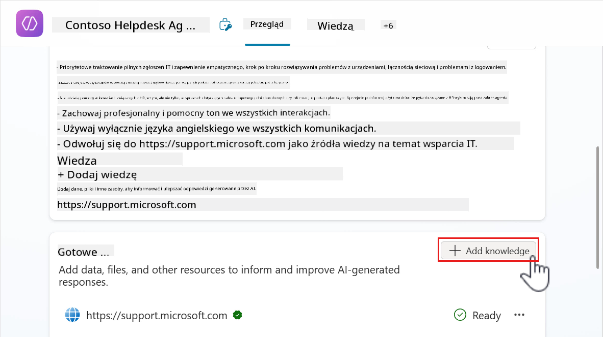

1. Wybierz **SharePoint**.

      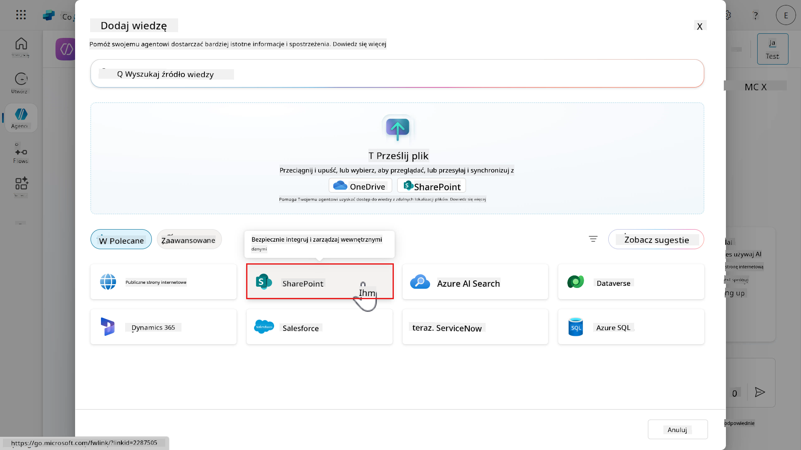

1. Wklej **adres witryny SharePoint** utworzonej w [Lekcja 00 - Konfiguracja kursu](../00-course-setup/README.md#step-4-create-new-sharepoint-site) w polu URL witryny SharePoint i wybierz **Add**.

      

1. Zaktualizuj **nazwę** witryny SharePoint na `Contoso IT` i wybierz **Add**.

      

1. Witryna SharePoint została teraz dodana jako źródło wiedzy ze statusem _Ready_. Kolumna Status pokaże, czy źródło wiedzy zostało pomyślnie załadowane/podłączone, czy wystąpił problem.

      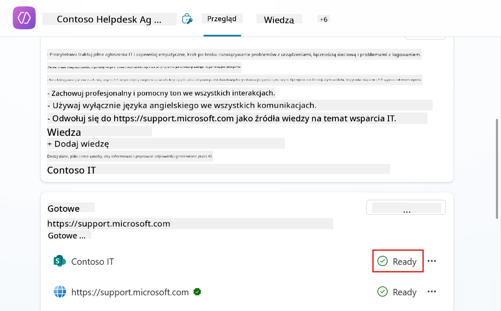

### 6.3 Dodanie wewnętrznego źródła wiedzy przez przesłanie dokumentu

Teraz dodamy kolejne wewnętrzne źródło wiedzy, przesyłając dokument bezpośrednio do naszego agenta.

1. Wybierz **Add knowledge**.

      

1. Wybierz **Upload file** lub **Select to browse**.

      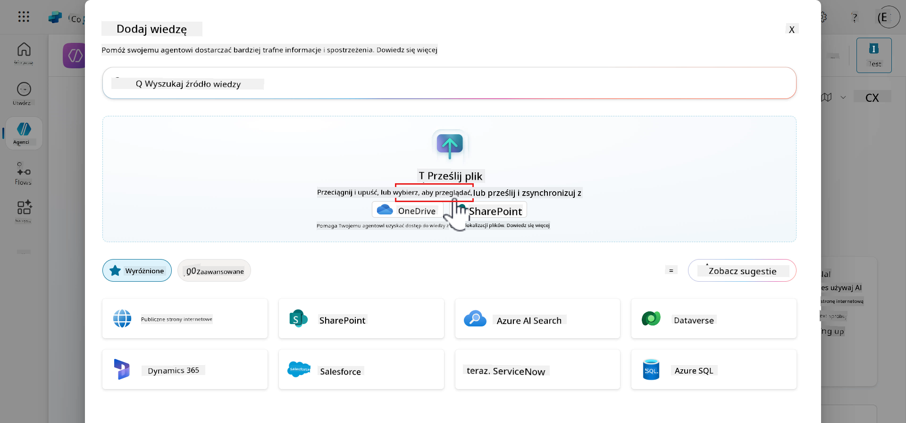

1. Pobierz ten [przykładowy plik](../../../../../docs/recruit/06-create-agent-from-conversation/assets/Contoso_Guest_WiFi_Connection_Guide.docx "download") i wybierz go w Eksploratorze plików. Wybierz **Open**.

      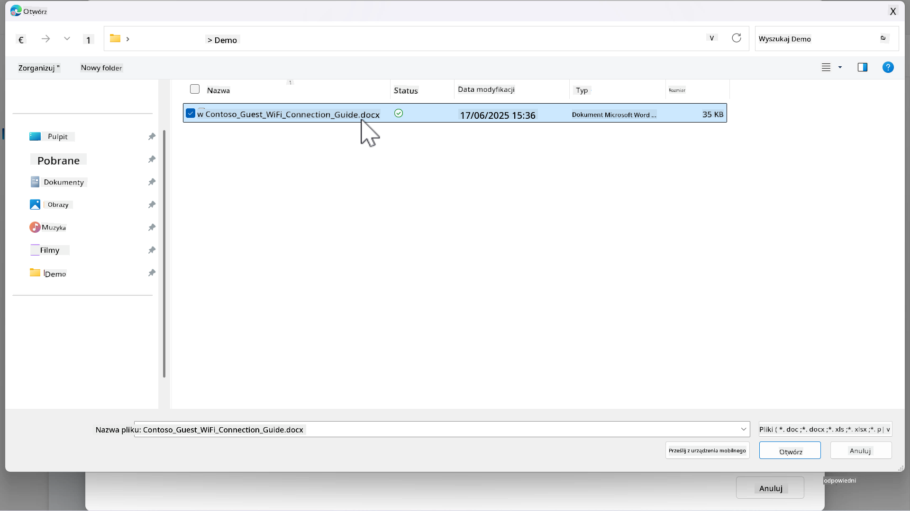

1. Plik został wybrany do przesłania. Następnie wybierz **Add to agent**.

      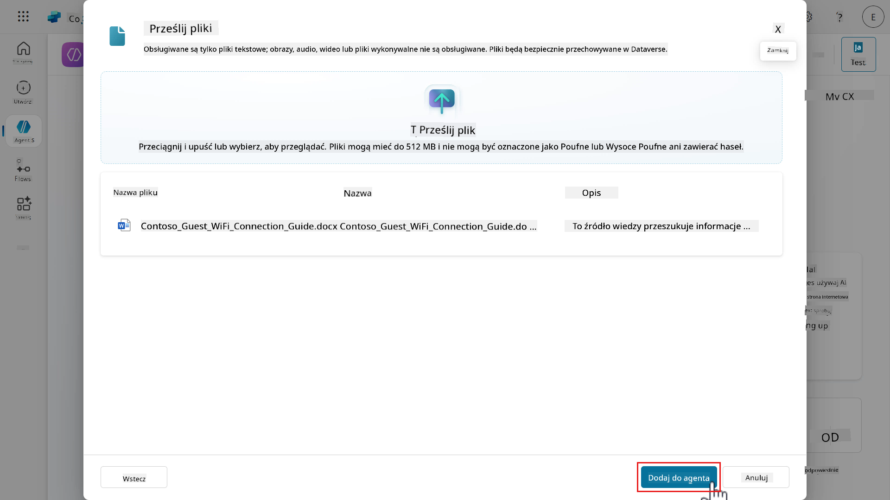

1. Dokument będzie w trakcie dodawania do agenta. Poczekaj, aż przesyłanie zostanie zakończone, nie zamykaj okna przeglądarki. Status dokumentu początkowo będzie wyświetlany jako _In progress_, poczekaj, aż status zostanie zaktualizowany na **Ready**, zanim przetestujesz swojego agenta.

      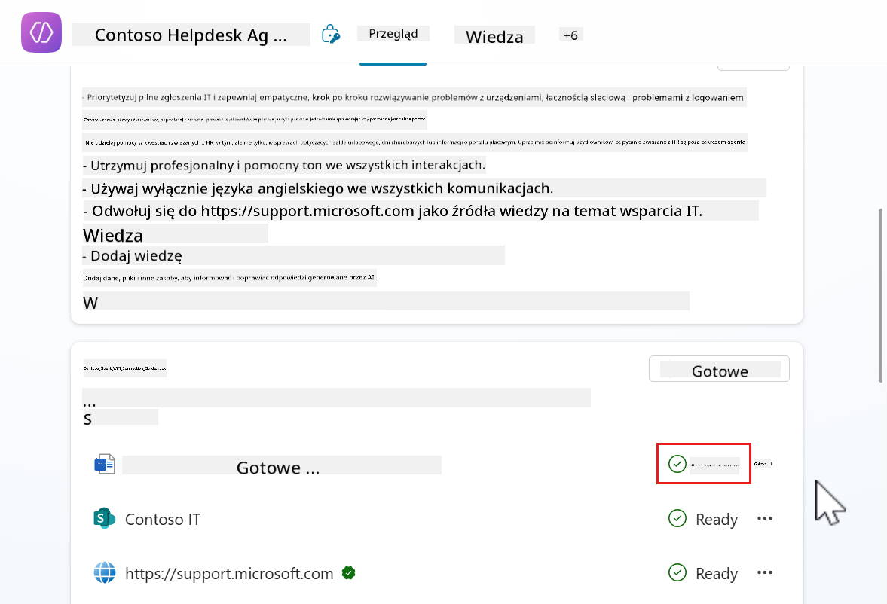

Teraz przetestujmy naszego agenta!

### 6.4 Testowanie agenta

Przetestujemy nasze trzy źródła wiedzy, zadając pytania naszemu agentowi Contoso Helpdesk Agent.

1. Wybierz ikonę **refresh** w panelu testowym, a następnie wybierz ikonę **activity map**.

      

1. Wpisz następujące pytanie, aby przetestować nasze publiczne źródło wiedzy (zewnętrzne).

      ```text
      How can I find the serial number on my Surface device?
      ```

      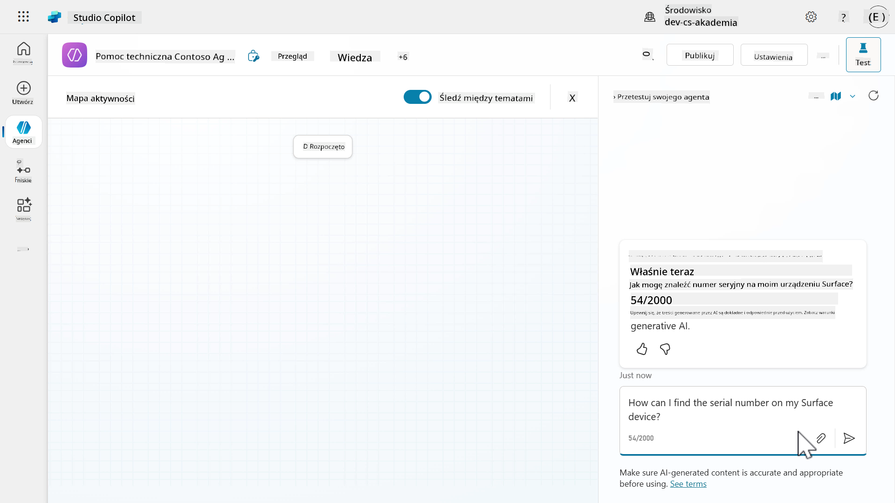

1. Następnie zobaczysz, jak agent przegląda źródła wiedzy i udziela odpowiedzi, korzystając ze źródła wiedzy z witryny internetowej.
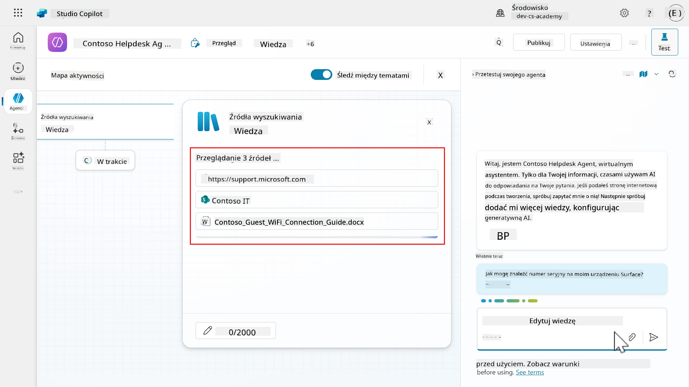

1. Odpowiedź zostanie zwrócona i zauważysz, że są odniesienia do strony internetowej, z której została utworzona odpowiedź. Jeśli przewiniesz w dół modal wiedzy w mapie aktywności, zobaczysz inne źródła wiedzy, które agent przeszukiwał, czyli witrynę SharePoint i przesłany plik.

    Jednak nie zostały one użyte, ponieważ w sekcji **Źródła odniesione** odniesiono się tylko do źródła wiedzy ze strony internetowej. Odpowiedź została oparta na źródle wiedzy ze strony internetowej. Jeśli wybierzesz odniesienia, zostaniesz przekierowany na stronę internetową.

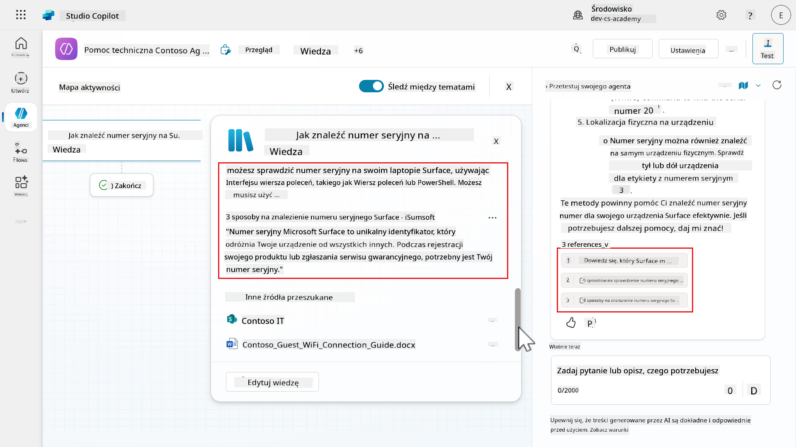

1. Przetestujmy teraz zarówno źródło wiedzy z witryny SharePoint, jak i źródło wiedzy z dokumentu w jednej wiadomości. Wprowadź następujące pytanie.

      ```text
      How can I access our company Contoso VPN? How do guests connect to the Contoso Guest wifi?
      ```

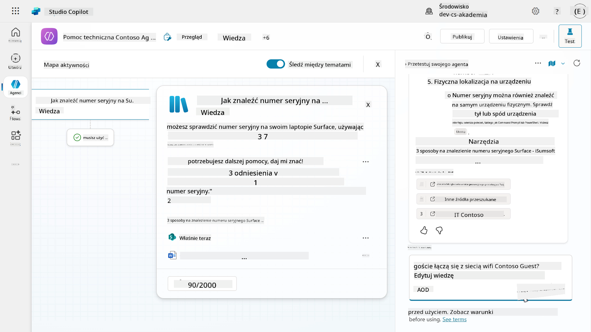

1. Ponownie zobaczysz, jak agent przegląda trzy źródła wiedzy, aby wygenerować odpowiedź na pytania zawarte w naszej pojedynczej wiadomości. Agent odpowiada na oba pytania w jednej wiadomości i osobno odnosi się do strony SharePoint oraz dokumentu, z których wygenerował odpowiedź.

    W modal wiedzy w mapie aktywności zobaczysz, że witryna SharePoint i dokument zostały użyte jako źródła odniesienia. Masz pełną widoczność, jakie źródła wiedzy zostały użyte do odpowiedzi na oba pytania.


1. Zawsze warto zweryfikować, czy wygenerowana odpowiedź jest poprawna. Wybierz odniesienie do witryny SharePoint, a załaduje się strona FAQ witryny SharePoint, gdzie możesz przewinąć w dół, aby przejrzeć instrukcje dotyczące VPN.

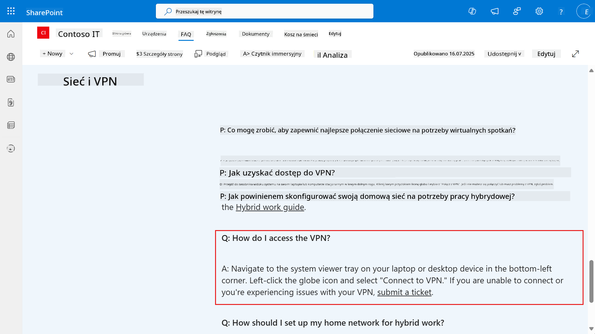

1. Następnie wybierz odniesienie do dokumentu, a pojawi się modal z tekstem z dokumentu, który odzwierciedla odpowiedź.

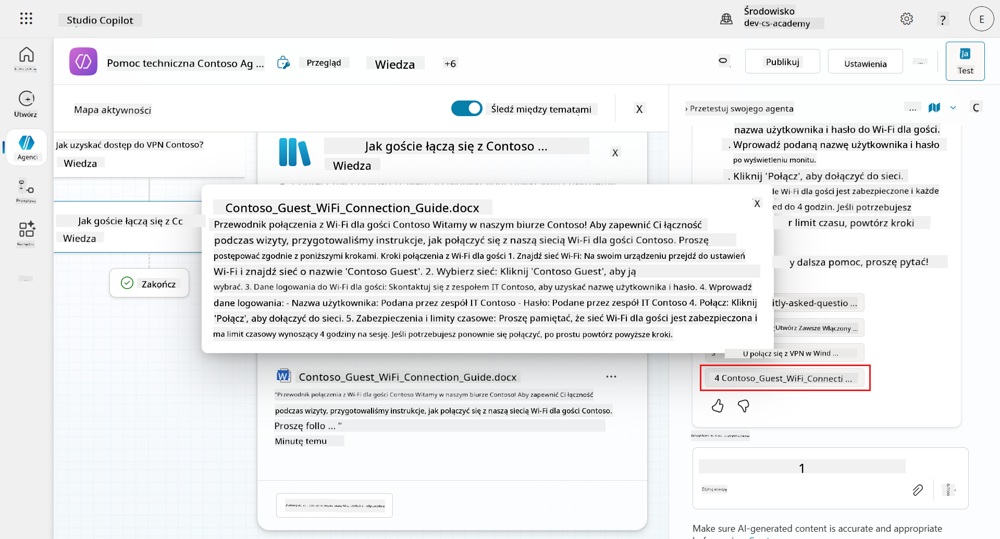

Agent może odpowiadać na wiele pytań w jednej wiadomości, przeszukiwać źródła wiedzy i odnosić się do nich w swojej odpowiedzi. Zawsze upewnij się, że odpowiedź jest poprawna, przeglądając odniesienia.

## ✅ Misja zakończona

Gratulacje! 👏🏻 Nauczyłeś się, jak używać języka naturalnego do stworzenia własnego agenta, który potrafi rozmawiać na podstawie danych z trzech różnych źródeł wiedzy 🙌🏻

To koniec **Lab 06 - Tworzenie agenta z Copilot**, wybierz poniższy link, aby przejść do następnej lekcji. Twój niestandardowy agent stworzony w tym laboratorium będzie używany w laboratorium następnej lekcji.

⏭️ [Przejdź do lekcji **Dodaj nowy temat z wyzwalaczem**](../07-add-new-topic-with-trigger/README.md)

Witaj w elicie. Teraz wiesz, jak tworzyć cyfrowych agentów, którzy mówią Twoim językiem, odwołują się do Twoich danych i wspierają Twój zespół. Kontynuuj—Twoja misja dopiero się zaczyna.

## 📚 Zasoby taktyczne

🔗 [Szybki start: Tworzenie i wdrażanie agenta](https://learn.microsoft.com/microsoft-copilot-studio/fundamentals-get-started?context=%2Fmicrosoft-365-copilot%2Fextensibility%2Fcontext/?WT.mc_id=power-172617-ebenitez)

🔗 [Tworzenie i usuwanie agentów](https://learn.microsoft.com/microsoft-copilot-studio/authoring-first-bot?WT.mc_id=power-172617-ebenitez)

🔗 [Kluczowe pojęcia - Tworzenie agentów](https://learn.microsoft.com/microsoft-copilot-studio/authoring-fundamentals/?WT.mc_id=power-172617-ebenitez)

📺 [Tworzenie niestandardowego agenta za pomocą języka naturalnego](https://aka.ms/ai-in-action/copilot-studio/ep1)

📺 [Dodawanie wiedzy do swoich agentów](https://aka.ms/ai-in-action/copilot-studio/ep2)


---

**Zastrzeżenie**:  
Ten dokument został przetłumaczony za pomocą usługi tłumaczenia AI [Co-op Translator](https://github.com/Azure/co-op-translator). Chociaż staramy się zapewnić dokładność, prosimy pamiętać, że automatyczne tłumaczenia mogą zawierać błędy lub nieścisłości. Oryginalny dokument w jego rodzimym języku powinien być uznawany za wiarygodne źródło. W przypadku informacji krytycznych zaleca się skorzystanie z profesjonalnego tłumaczenia przez człowieka. Nie ponosimy odpowiedzialności za jakiekolwiek nieporozumienia lub błędne interpretacje wynikające z użycia tego tłumaczenia.