<!--
CO_OP_TRANSLATOR_METADATA:
{
  "original_hash": "dcbcd9396b076da0a0f5d389e9ec1b12",
  "translation_date": "2025-10-22T00:49:08+00:00",
  "source_file": "docs/recruit/08-add-adaptive-card/README.md",
  "language_code": "pl"
}
-->
# 🚨 Misja 08: Ulepsz interakcje użytkownika w Tematach za pomocą Kart Adaptacyjnych

## 🕵️‍♂️ KOD OPERACJI: `OPERACJA ULEPSZENIE INTERFEJSU`

> **⏱️ Czas operacji:** `~45 minut`

🎥 **Obejrzyj Przewodnik**

[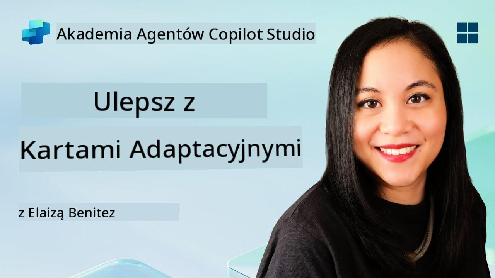](https://www.youtube.com/watch?v=RhIlzYHPCXo "Obejrzyj przewodnik na YouTube")

## 🎯  Opis Misji

Agenci, Waszym zadaniem jest przeniknięcie do statycznego doświadczenia użytkownika i zastąpienie go bogatymi, dynamicznymi i interaktywnymi Kartami Adaptacyjnymi. Wykorzystacie ładunki JSON i formuły Power Fx, aby przekształcić rozmowy w Copilot Studio z prostych pytań i odpowiedzi w w pełni interaktywne interakcje. Waszym celem jest zbieranie danych od użytkowników, prezentowanie informacji w atrakcyjny sposób oraz precyzyjne kierowanie rozmowami. Nie dostosujecie się – użytkownicy mogą przejść do mniej inteligentnych interfejsów.

## 🔎 Cele

W tej misji nauczycie się:

1. Zrozumienia, czym są Karty Adaptacyjne i jak poprawiają interakcje użytkownika w Copilot Studio
1. Tworzenia interaktywnych kart za pomocą JSON i formuł Power Fx dla dynamicznej zawartości
1. Eksplorowania Projektanta Kart Adaptacyjnych i jego kluczowych komponentów do wizualnego tworzenia kart
1. Tworzenia bogatych, interaktywnych formularzy i doświadczeń zbierania danych w tematach agentów
1. Wdrażania najlepszych praktyk projektowania responsywnych i przyjaznych dla użytkownika kart adaptacyjnych

## 🤔 Czym jest Karta Adaptacyjna?

**Karta Adaptacyjna** to sposób na tworzenie interaktywnych, wizualnie atrakcyjnych elementów interfejsu użytkownika, które można osadzać w aplikacjach takich jak Microsoft Teams, Microsoft Outlook czy agenci. Jest to struktura w formacie JSON, która definiuje układ i zawartość karty:

- Jakie elementy pojawiają się na karcie - tekst, obrazy, przyciski
- Jak te elementy są rozmieszczone
- Jakie działania użytkownicy mogą podjąć, takie jak przesłanie formularza czy otwarcie linku

    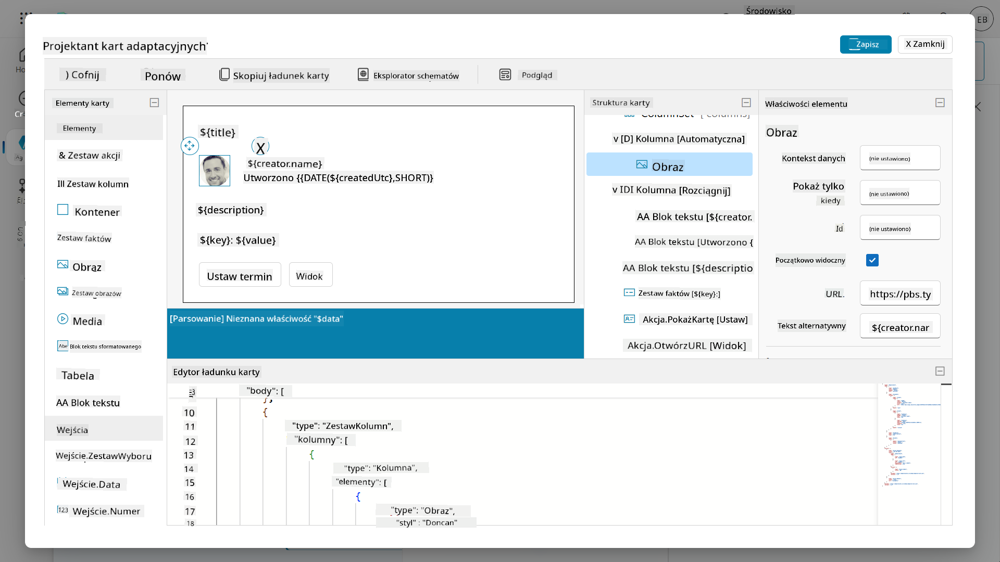

### Dlaczego Karty Adaptacyjne są ważne w Copilot Studio

Wyobraź sobie, że tworzysz agenta, który pyta użytkowników o ich imię, e-mail lub opinię. Jeśli użyjesz tylko zwykłego tekstu, rozmowa może wydawać się nudna lub trudna do śledzenia. Właśnie tutaj wkraczają Karty Adaptacyjne!

1. **Uczynienie rozmów interaktywnymi** - zamiast wysyłać tekst jako wiadomości do użytkownika, możesz pokazać przyciski, formularze, obrazy i więcej.
    - Przykład: karta może poprosić użytkownika o wypełnienie swojego imienia i e-maila w przejrzystym formularzu.

1. **Świetny wygląd wszędzie** - Karty Adaptacyjne automatycznie dopasowują się do stylu aplikacji, w której są używane, takich jak Microsoft 365 Copilot chat czy Microsoft Teams. Nie musisz martwić się o tryb ciemny, czcionki czy układy - karta się dostosowuje.

1. **Łatwe tworzenie za pomocą JSON** - kartę definiujesz za pomocą kodu JSON (pomyśl o tym jak o _przepisie_ na interfejs użytkownika). Copilot Studio pozwala na podgląd karty przed dodaniem jej do tematu.

1. **Zbieranie i wykorzystanie danych** - możesz użyć karty do zadawania pytań, zbierania odpowiedzi i wykorzystania tych danych w przepływie rozmowy.
    - Przykład: Poproś o numer telefonu użytkownika, a następnie pokaż kartę potwierdzenia z jego numerem telefonu.

1. **Poprawa doświadczenia użytkownika** - karty sprawiają, że Twój agent wydaje się bardziej interaktywny. To bardziej przejrzysty, klikalny i przyjazny dla użytkownika typ interfejsu.

## 🐱 Czy _JSON_ to osoba?

Wymawiane jako "Jason", to nie osoba 😅

JSON, czyli _JavaScript Object Notation_, to lekki format używany do strukturyzowania danych. Jest łatwy do odczytu i pisania, wygląda jak seria par klucz-wartość w nawiasach klamrowych {}.

To jedna z opcji do użycia przy dodawaniu karty adaptacyjnej do tematu.


## 👀 Widzę inną opcję tworzenia karty adaptacyjnej za pomocą _formuły_

Pamiętasz, jak uczyliśmy się o Power Fx w [Misji 07 - Używanie Power Fx w węzłach](../07-add-new-topic-with-trigger/README.md#what-power-fx-can-do-in-topics)? To samo można zastosować w Kartach Adaptacyjnych w Copilot Studio.

Przypomnienie:

!!! note
    Power Fx to język programowania low-code używany do dodawania logiki i dynamicznego zachowania do Twojego agenta. To ten sam język używany w Microsoft Power Apps, zaprojektowany tak, aby był prosty i podobny do Excela, co ułatwia jego użycie zarówno programistom, jak i osobom bez doświadczenia w kodowaniu.

### Jak Power Fx działa w Kartach Adaptacyjnych

Podczas projektowania Karty Adaptacyjnej w Copilot Studio możesz używać formuł Power Fx do:

- Dynamicznego wstawiania wartości, takich jak imiona użytkowników, daty czy statusy.
- Formatowania tekstu lub liczb, np. wyświetlania waluty czy zaokrąglania liczb.
- Pokazywania lub ukrywania elementów na podstawie warunków.
- Dostosowywania odpowiedzi na podstawie danych wejściowych użytkownika, zmiennych, wyników z węzłów rozmowy.

Na przykład:

"`Hello`" & `System.User.DisplayName`

Ta formuła dynamicznie łączy słowo "Hello" z imieniem użytkownika.

### Dlaczego to jest przydatne

1. **Personalizacja**

    Możesz dostosować wiadomości do każdego użytkownika, sprawiając, że interakcje wydają się bardziej naturalne i istotne.

1. **Dynamiczna zawartość**

    Karty mogą wyświetlać rzeczywiste dane z zmiennych i wyników z węzłów rozmowy.

1. **Inteligentna logika**

    Możesz kontrolować, co użytkownicy widzą lub z czym wchodzą w interakcję na podstawie warunków, poprawiając użyteczność i zmniejszając liczbę błędów.

1. **Przyjazne dla użytkowników low-code**

    Power Fx to język programowania low-code. Jak wspomniano wcześniej, jest czytelny, intuicyjny i podobny do formuł Excela.

## 👷🏻‍♀️ Tworzenie za pomocą Projektanta Kart Adaptacyjnych

**Projektant Kart Adaptacyjnych** to narzędzie wizualne, które pozwala tworzyć interaktywne karty wiadomości za pomocą elementów przeciągnij-i-upuść, takich jak tekst, obrazy, przyciski i pola wejściowe. Jego celem jest pomoc w tworzeniu bogatych, dynamicznych wiadomości bez pisania skomplikowanego kodu, co ułatwia projektowanie przyjaznych dla użytkownika interfejsów.

Narzędzie projektanta pomaga wizualnie budować kartę, ale za kulisami generuje dla Ciebie obiekt JSON. Możesz również przełączyć się na _formułę_, która umożliwia użycie wyrażeń Power Fx w karcie do wyświetlania danych z innych źródeł.

## 🎨 Zrozumienie Projektanta Kart Adaptacyjnych

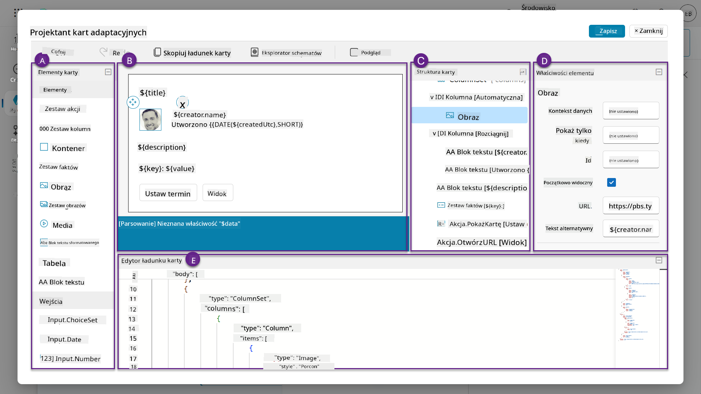

### A) Elementy Karty

To są podstawowe elementy Twojej karty adaptacyjnej. Możesz przeciągać i upuszczać takie elementy jak:

- **TextBlock** do wyświetlania tekstu.
- **Image** do pokazywania obrazów.
- **FactSet** dla par klucz-wartość.
- **Pola wejściowe** do wyświetlania pól tekstowych, wyboru daty, przełączników.
- **Akcje** do wyświetlania przycisków takich jak _Submit_, _Open URL_ czy _Show Card_.

Każdy element ma swoje przeznaczenie i można go stylizować lub konfigurować.

### B) Podgląd Karty

To jest obszar **Podglądu**, w którym widzisz, jak Twoja karta będzie wyglądać w czasie rzeczywistym. Gdy dodajesz lub edytujesz elementy, podgląd aktualizuje się natychmiast, aby odzwierciedlić zmiany. Dzięki temu możesz wprowadzać iteracyjne poprawki i jednocześnie widzieć efekt projektu.

### C) Struktura Karty

Pokazuje **hierarchię i układ** Twojej karty. Na przykład:

- Karta może zaczynać się od **TextBlock** dla tytułu.
- Następnie **ColumnSet** z obrazem po jednej stronie i tekstem po drugiej.
- Potem **FactSet** i kilka **Przycisków Akcji**.

Pomaga to zrozumieć, jak elementy są zagnieżdżone i zorganizowane.

### D) Właściwości Elementów

Gdy klikniesz dowolny element na karcie, ten panel pozwala **dostosować jego ustawienia**:

- Zmienić rozmiar, wagę lub kolor tekstu.
- Ustawić URL obrazu lub tekst alternatywny.
- Skonfigurować opcje wejściowe, takie jak tekst zastępczy czy wartości domyślne.

Tutaj możesz dopracować każdy element.

### E) Edytor Ładunku Karty

To jest **surowy kod JSON** Twojej karty. Zaawansowani użytkownicy mogą edytować go bezpośrednio, aby:

- Używać funkcji szablonów.
- Kopiować/wklejać definicje kart.

Nawet jeśli dopiero zaczynasz korzystać z Projektanta Kart Adaptacyjnych, warto zobaczyć, jak projekt wizualny przekłada się na kod.

!!! tip "Wskazówka - Sprawdź przykłady Kart Adaptacyjnych"

    1. Przejdź na [https://adaptivecards.microsoft.com/designer](https://adaptivecards.microsoft.com/designer).
    2. Wybierz **Nowa karta**, aby zobaczyć listę przykładów, które możesz wybrać i zmodyfikować.
    3. Pamiętaj, że ten projektant jest zewnętrzny (oparty na sieci). Gdy tworzysz kartę w projektancie Kart Adaptacyjnych online, skopiuj JSON z Edytora Ładunku Karty.
    4. Wklej JSON do swojej karty adaptacyjnej w agencie w Copilot Studio.

    

## 🌵 Typowe zastosowania

Poniżej przedstawiono typowe zastosowania Kart Adaptacyjnych w Copilot Studio, gdy są używane w węzłach **Wyślij wiadomość** lub **Zadaj pytanie**.

1. **Formularze i zbieranie danych**

    Użyj kart adaptacyjnych do zbierania uporządkowanych danych od użytkowników, takich jak:

    - Wnioski urlopowe
    - Formularze opinii
    - Informacje kontaktowe
    - Harmonogramy spotkań

1. **Wyświetlanie dynamicznych informacji**

    Pokazuje użytkownikom spersonalizowane lub dane w czasie rzeczywistym w przejrzystym, czytelnym formacie z źródeł korporacyjnych, takich jak ServiceNow, SAP, Dynamics 365, SharePoint itp.

    - Podsumowania zamówień
    - Salda kont
    - Statusy zgłoszeń lub spraw
    - Nadchodzące wydarzenia lub terminy

1. **Interaktywne wybory**

    Pozwól użytkownikom dokonywać wyborów bezpośrednio w rozmowie:

    - Wybierz z listy opcji, na przykład kategorie produktów, tematy wsparcia.
    - Potwierdź lub anuluj działanie.
    - Oceń usługę lub doświadczenie.

1. **Wyzwalanie działań**

    Dodaj przyciski, które wyzwalają kolejne kroki w rozmowie wewnętrznie lub zewnętrznie.

    - "Prześlij wniosek"
    - "Zobacz szczegóły"

## ⭐ Najlepsze praktyki

Oto kilka najlepszych praktyk dotyczących tworzenia Kart Adaptacyjnych dla agentów w Copilot Studio.

1. **Zachowaj prostotę i skupienie**

    - Projektuj karty z jasnym celem, nie przeładowuj ich zbyt wieloma elementami.
    - Używaj zwięzłego tekstu i intuicyjnych układów, aby prowadzić użytkowników przez interakcję.

1. **Bądź celowy w kwestii danych wejściowych**

    - Uwzględnij tylko niezbędne elementy wejściowe, takie jak tekst, wybory daty, aby nie przytłaczać użytkowników.
    - Używaj etykiet, aby dane wejściowe były łatwe do zrozumienia.

1. **Struktura dla czytelności**

    - Używaj **TextBlocks** dla nagłówków i instrukcji.
    - Grupuj powiązane elementy za pomocą **Containers** lub **ColumnSets**, aby poprawić wizualny przepływ.

1. **Uczyń elementy Akcji jasnymi**

    - Używaj **Action.Submit** lub **Action.OpenUrl** z jasnymi tytułami przycisków, takimi jak "Prześlij wniosek" czy "Zobacz szczegóły".
    - Unikaj niejasnych etykiet, takich jak "Kliknij tutaj".

1. **Projektuj z myślą o adaptacyjności**

    - Zakładaj, że karta może być wyświetlana na różnych rozmiarach ekranu.
    - Unikaj stałych szerokości i używaj elastycznych układów, takich jak **ColumnSets**, dla responsywności.

1. **Używaj dynamicznej zawartości, gdy to możliwe**

    - Powiąż elementy karty z zmiennymi lub wynikami z węzłów za pomocą Power Fx, aby spersonalizować doświadczenie użytkownika.
    - Na przykład, dynamicznie wyświetl imię użytkownika lub aktualny status.

## 🧪 Laboratorium 08 - Dodaj karty adaptacyjne i ulepsz możliwości tematu

Teraz nauczymy się, jak ulepszyć nasz temat za pomocą kart adaptacyjnych i wykorzystać zaawansowane funkcje tematów i węzłów.

- [8.1 Utwórz nowy temat z kartą adaptacyjną, aby użytkownik mógł przesłać swoje żądanie](../../../../../docs/recruit/08-add-adaptive-card)
- [8.2 Zaktualizuj instrukcje agenta, aby wywołać temat Żądanie urządzenia](../../../../../docs/recruit/08-add-adaptive-card)

### ✨ Przypadek użycia

**Jako** pracownik

**Chcę** złożyć wniosek o urządzenie

**Aby** móc wybrać urządzenie z listy dostępnych urządzeń

Zaczynajmy!

### Wymagania wstępne

1. **Lista SharePoint**

    Będziemy używać listy **Devices** w SharePoint z [Lekcji 00 - Konfiguracja kursu - Krok 3: Utwórz nową witrynę SharePoint](../00-course-setup/README.md#step-4-create-new-sharepoint-site).

    Jeśli nie skonfigurowałeś listy **Devices** w SharePoint, wróć do [Lekcji 00 - Konfiguracja kursu - Krok 3: Utwórz nową witrynę SharePoint](../00-course-setup/README.md#step-4-create-new-sharepoint-site).

1. **Contoso Helpdesk Copilot**

    Będziemy używać tego samego agenta, który został utworzony wcześniej w [Lekcji 06 - Utwórz niestandardowego agenta za pomocą języka naturalnego i powiąż go z Twoimi danymi](../06-create-agent-from-conversation/README.md).

### 8.1 Utwórz nowy temat z kartą adaptacyjną, aby użytkownik mógł przesłać swoje żądanie

Utworzymy nowy temat, który będzie obsługiwał żądanie urządzenia użytkownika. Ten nowy temat będzie zawierał węzeł **Zapytaj za pomocą karty adaptacyjnej**, aby umożliwić interakcję użytkownika z agentem.

Zaczynajmy!

1. Wybierz kartę **Tematy**, a następnie wybierz **+ Dodaj temat od zera**.

    

1. Nazwij temat następująco,


1. Następnie dodaj węzeł **Zapytaj z kartą adaptacyjną**. Ten węzeł wyświetli interaktywną kartę, na której użytkownik będzie mógł wybrać urządzenie, które chce zamówić.

    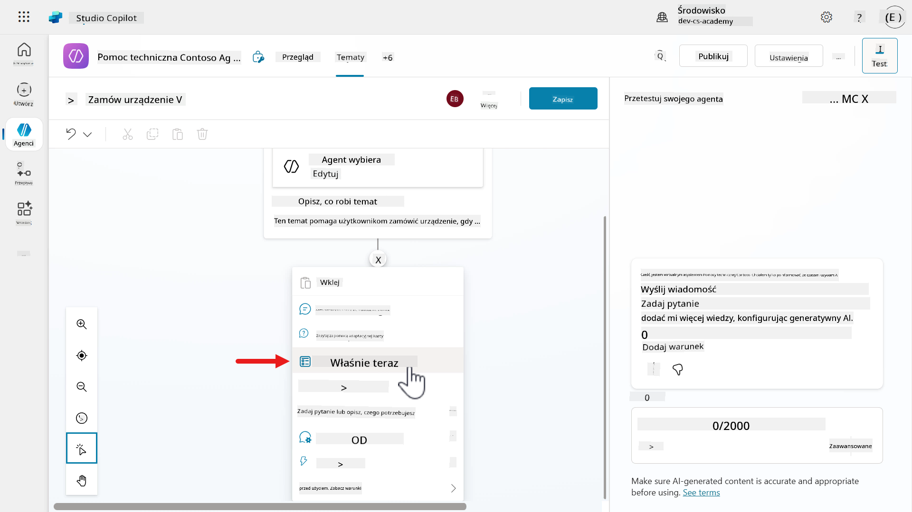

1. Wybierz węzeł, a pojawi się panel **Właściwości węzła karty adaptacyjnej**. Teraz edytujemy JSON. Wybierz **Edytuj kartę adaptacyjną**. Wybierz **Edytuj kartę adaptacyjną**.

    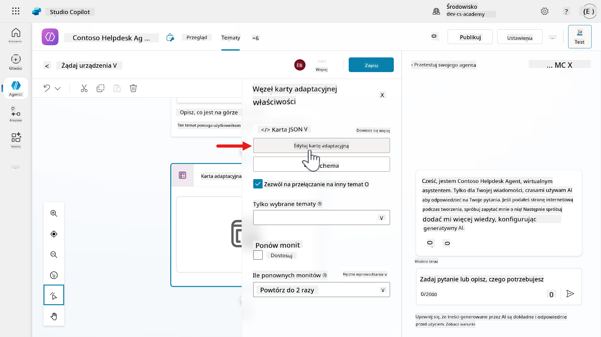

1. To jest **Projektant kart adaptacyjnych**, gdzie możesz zaprojektować swoją kartę i zobaczyć jej wygląd w czasie rzeczywistym.

    Spróbuj przeciągnąć i upuścić elementy kart **TextBlock** i **FactSet** na obszar roboczy, czyli obszar podglądu karty. Zauważ, jak struktura karty i edytor ładunku karty aktualizują się po dodaniu tych dwóch elementów. Możesz bezpośrednio edytować edytor ładunku karty oraz panel właściwości elementów.

    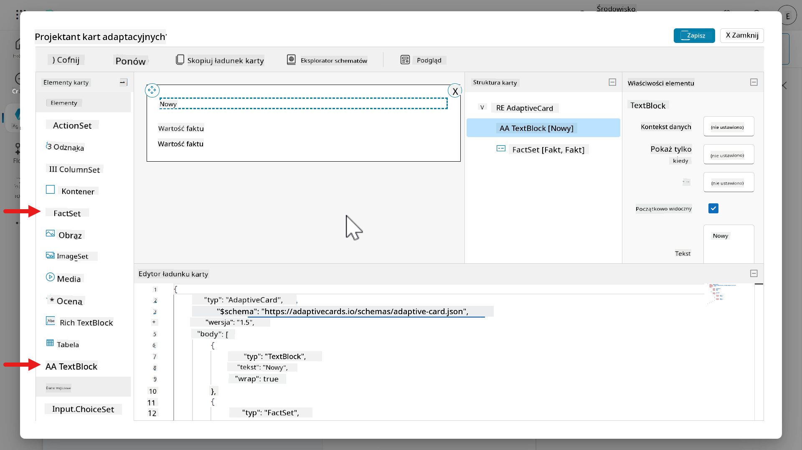

1. Wybierz **Podgląd**, aby zobaczyć kartę w różnych szerokościach.

    

1. Podgląd załaduje się, pokazując różne wersje karty w zależności od szerokości.

    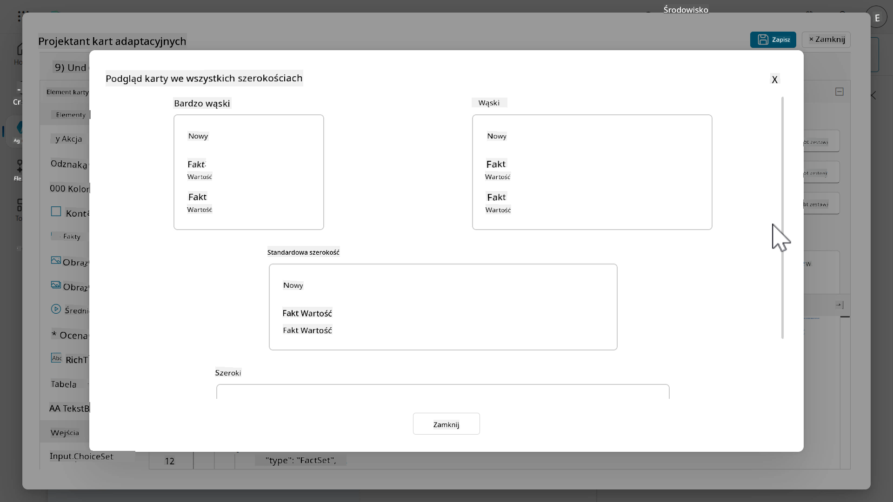

1. Wyjdź z **Podglądu**, wybierając ikonę **x**, a następnie wybierz **Cofnij** w projektancie, aby usunąć wcześniej dodane dwa elementy karty.

    

1. Kliknij w **Edytor ładunku karty** i zaznacz wszystkie linie, używając skrótu klawiaturowego _Ctrl + A_ na Windowsie lub _Command + A_ na Macu, a następnie usuń linie. **Wklej** JSON z pliku [Request devices .JSON file](../../../../../docs/recruit/08-add-adaptive-card/assets/8.1_RequestDevice.json).

    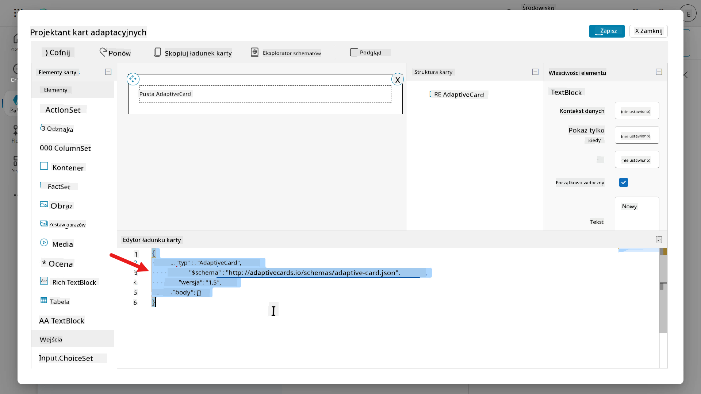

1. Zauważ, że **Podgląd karty** teraz zawiera elementy wyświetlające tekst oraz listę dostępnych urządzeń.

    Ten JSON jest obecnie tylko przykładem i podglądem tego, co wykorzystamy jako bazę dla naszej karty, ale w formie formuły zamiast JSON, ponieważ będziemy odwoływać się do **globalnej zmiennej**, `Global.VarDevices.value`, która przechowuje odpowiedź z akcji **Get items** w konektorze SharePoint.

    Wybierz **Zapisz**, a następnie **Zamknij**, aby wyjść z modalnego okna projektanta kart adaptacyjnych.

    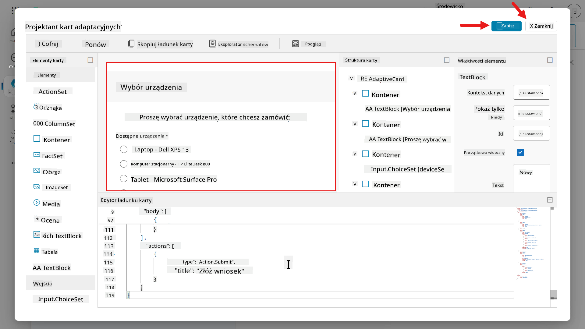

1. Zamknij panel **Właściwości węzła karty adaptacyjnej**, wybierając ikonę **X**.

    

1. Na obszarze roboczym tematu zobaczysz kartę adaptacyjną.

    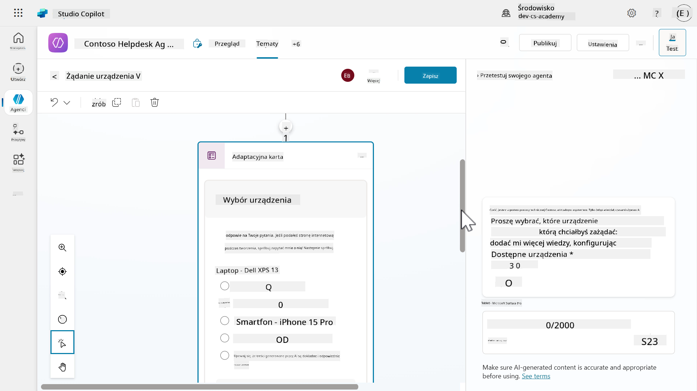

1. Przewiń na dół węzła, aby zobaczyć zmienne wyjściowe. `commentsId` i `deviceSelectionId` zostały zdefiniowane w właściwościach elementu. Te dwie zmienne będą przechowywać wartości z elementów karty, z którymi użytkownicy wchodzą w interakcję. Te wartości będą używane w dalszej części tematu, o czym dowiemy się w kolejnej lekcji.

    

1. Teraz zaktualizujemy kartę z JSON na formułę, ponieważ ponownie użyjemy Power Fx, aby przejść przez elementy zwrócone w akcji **Get items** w konektorze SharePoint, przechowywane w **globalnej zmiennej**, `Global.VarDevices.value`, za pomocą właściwości `value` w odpowiedzi JSON.

    > Utworzyliśmy tę globalną zmienną w [Lab 07 - Dodaj nowy temat z węzłami konwersacji, 7.3 Dodaj narzędzie za pomocą konektora](../07-add-new-topic-with-trigger/README.md#73-add-a-tool-using-a-connector).

    Wybierz kartę w węźle **Zapytaj z kartą adaptacyjną**, a następnie wybierz ikonę **chevron** i wybierz **Formuła**.

    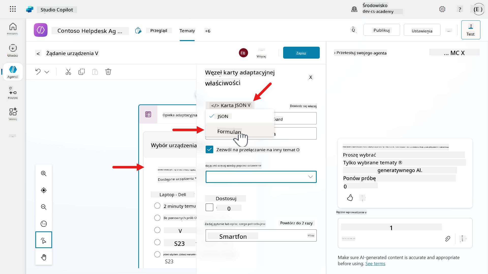

1. Kliknij ikonę **rozwiń**, aby powiększyć pole Formuły.

    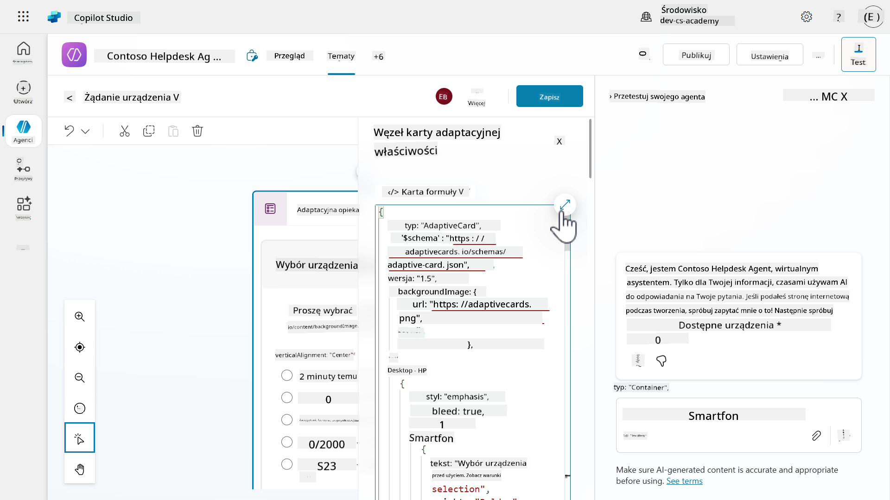

1. Kliknij w **Edytor ładunku karty** i zaznacz wszystkie linie, używając skrótu klawiaturowego _Ctrl + A_ na Windowsie lub _Command + A_ na Macu, a następnie usuń linie.

    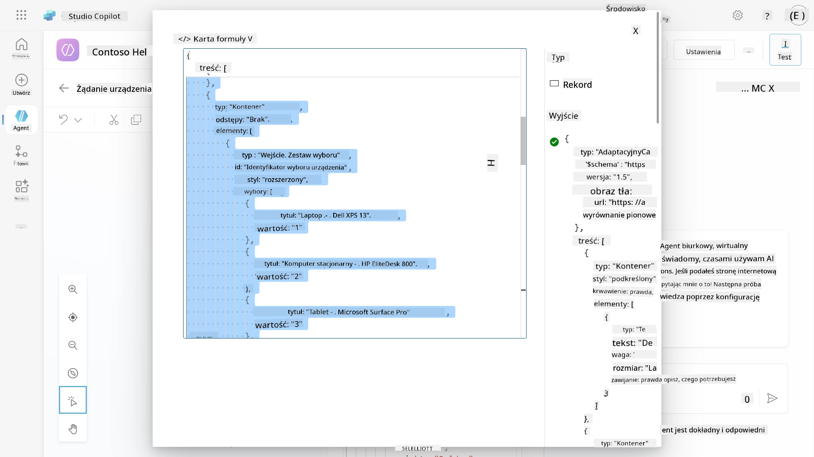

    Wklej Formułę z pliku [Request Devices formula file](../../../../../docs/recruit/08-add-adaptive-card/assets/8.1_RequestDeviceFormula.txt).

1. W formule przejdziemy przez każdy element listy SharePoint za pomocą funkcji `For All`, aby wyświetlić wartości `Model` w tytule opcji wyboru, a element `ID` z SharePoint będzie referencją jako wartość. Dodatkowo otaczamy wartości funkcjami `If(IsBlank()`, ponieważ formuła oczekuje wartości, aby wyświetlić kartę adaptacyjną na obszarze roboczym tematu. W przeciwnym razie pojawi się komunikat "Property cannot be null".

    **Zamknij** modalne okno karty.

    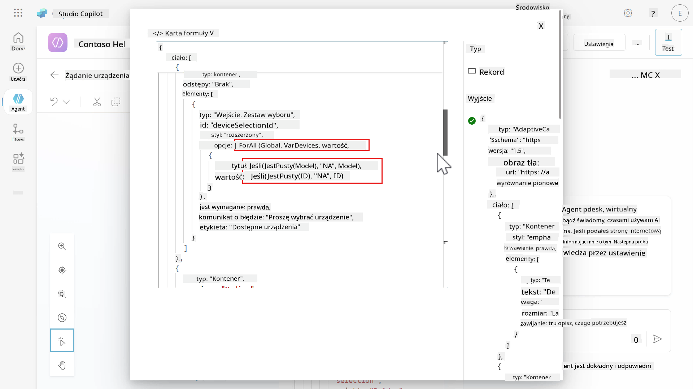

1. **Zamknij** panel **Właściwości węzła karty adaptacyjnej**.

1. **Zapisz** temat.

    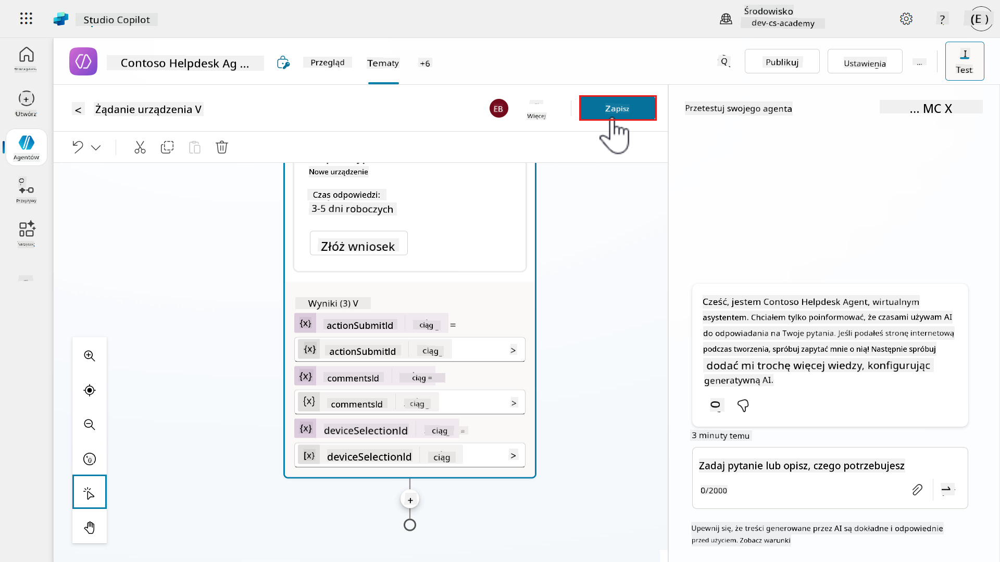

### 8.2 Zaktualizuj instrukcje agenta, aby wywołać temat Zamówienie urządzenia

Teraz, gdy utworzyliśmy nowy temat obsługujący zamówienia urządzeń, musimy zaktualizować **instrukcje agenta**, aby wywołać ten temat.

1. Wybierz kartę **Przegląd**, a w **instrukcjach agenta** wybierz **Edytuj**.

    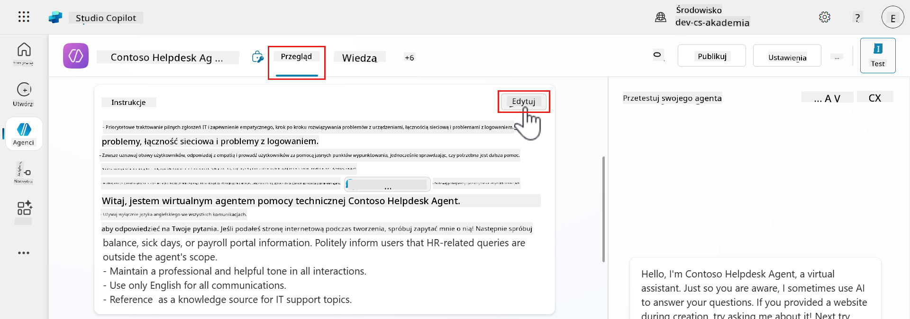

1. Dodaj nową linię poniżej poprzedniej instrukcji z [Lab 07 - Dodaj nowy temat z węzłami konwersacji, 7.3 Dodaj narzędzie za pomocą konektora](../07-add-new-topic-with-trigger/README.md#73-add-a-tool-using-a-connector).

    ```text
    - If the user answers yes to the question of requesting a device, trigger [Request device]. Otherwise if they answer no to the question of requesting a device, trigger [Goodbye].
    ```

    Zaznacz cały placeholder tematu w nawiasach kwadratowych i usuń placeholder.

    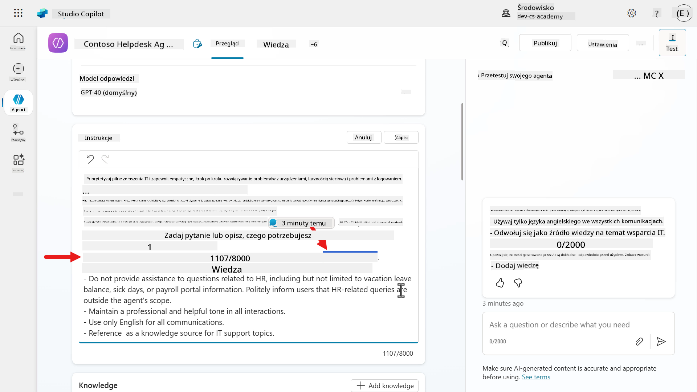

1. Wpisz `/Req` i wybierz temat **Zamówienie urządzeń**.

    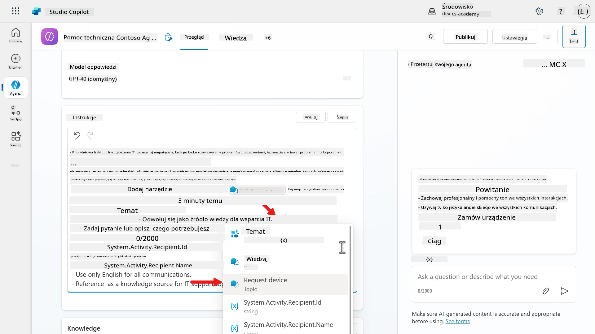

1. Powtórz te same kroki dla kolejnego placeholdera tematu, **[Goodbye]**. Zaznacz cały placeholder tematu w nawiasach kwadratowych i usuń placeholder. Wpisz `/Goodbye` i wybierz temat **Goodbye**.

    - Gdy użytkownik odpowie **Tak** na pytanie agenta, czy chce zamówić urządzenie, agent przekieruje z tematu **Dostępne urządzenia** do tematu **Zamówienie urządzeń**.

    - W przeciwnym razie, jeśli użytkownik odpowie **Nie**, agent przekieruje z tematu **Dostępne urządzenia** do tematu **Goodbye**.

    **Zapisz** zaktualizowane instrukcje.

    

1. Teraz przetestujmy przekierowanie z tematu _Dostępne urządzenia_ do tematu _Zamówienie urządzeń_. Wybierz **Test**, aby załadować panel testowy, a następnie wybierz **Odśwież**.

    Następnie wybierz ikonę **Mapa aktywności** w panelu testowym, a następnie włącz **Śledzenie między tematami**. Pozwoli nam to zobaczyć, że temat _Dostępne urządzenia_ przekierował do tematu _Zamówienie urządzeń_.

    OK, możemy testować! Wprowadź następujące w panelu testowym.

    ```text
    I need a laptop
    ```

    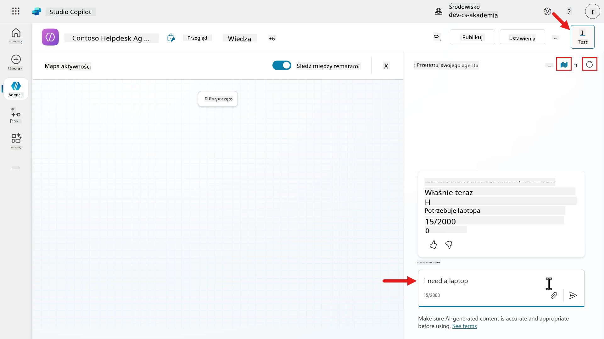

1. Agent odpowie listą dostępnych urządzeń, a następnie zapyta użytkownika, czy chce zamówić urządzenie. Skopiuj i wklej następujące,

    ```text
    yes please
    ```

    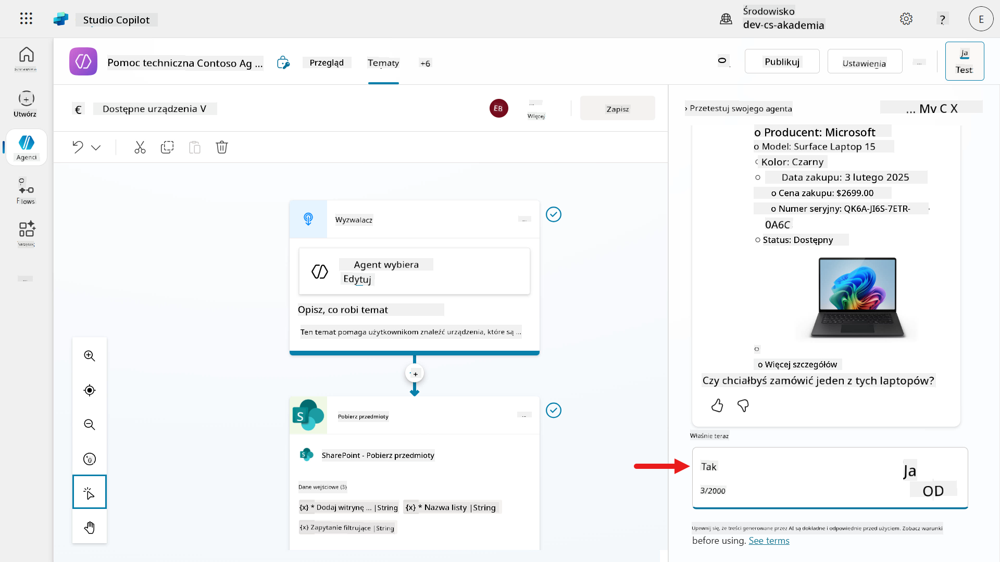

1. Następnie zobaczymy, że agent przekierował do tematu **Zamówienie urządzeń**. Agent wywołał ten temat zgodnie z dodanymi przez nas instrukcjami.

    Karta adaptacyjna z interaktywnymi elementami zostanie teraz wyświetlona jako wiadomość dla użytkownika.

    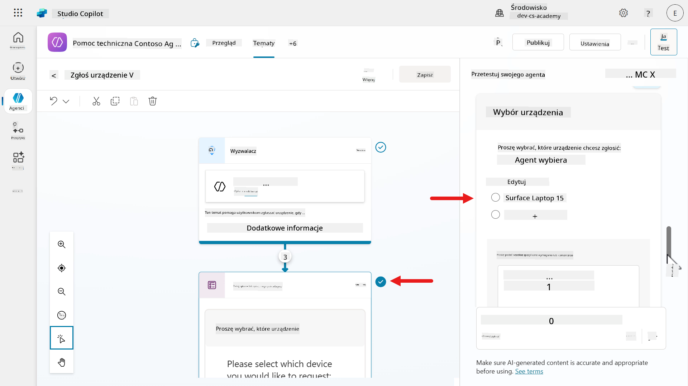

1. Pomyślnie przetestowaliśmy 😄 przekierowanie tematu _Dostępne urządzenia_ do tematu _Zamówienie urządzeń_. W kolejnej lekcji dodamy więcej ulepszeń do tego tematu.

    Odśwież panel testowy.

    

## ✅ Misja zakończona

Gratulacje! 👏🏻 Nauczyłeś się, jak dodawać karty adaptacyjne za pomocą formuł Power Fx, aby wyświetlać dane z zmiennych, a także jak przekierowywać z jednego tematu do drugiego. Tworzenie małych tematów sprawia, że Twój agent jest bardziej zorganizowany, a także pomaga prowadzić użytkowników przez różne części przepływu konwersacji z agentem.

To koniec **Lab 08 - Ulepsz interakcje użytkownika za pomocą kart adaptacyjnych**, wybierz poniższy link, aby przejść do następnej lekcji. Rozwiniemy przypadek użycia z tej lekcji w kolejnej.

⏭️ [Przejdź do lekcji **Dodaj przepływ agenta do swojego tematu dla automatyzacji**](../09-add-an-agent-flow/README.md)

## 📚 Zasoby taktyczne

🔗 [Korzystanie z kart adaptacyjnych w Copilot Studio](https://learn.microsoft.com/microsoft-copilot-studio/guidance/adaptive-cards-overview?WT.mc_id=power-172619-ebenitez)

🔗 [Dodaj kartę adaptacyjną w węźle Wyślij wiadomość](https://learn.microsoft.com/microsoft-copilot-studio/authoring-send-message#add-an-adaptive-card?WT.mc_id=power-172619-ebenitez)

🔗 [Tworzenie wyrażeń za pomocą Power Fx](https://learn.microsoft.com/microsoft-copilot-studio/advanced-power-fx?WT.mc_id=power-172619-ebenitez)

📺 [Tworzenie kart adaptacyjnych za pomocą Power FX](https://aka.ms/ai-in-action/copilot-studio/ep8)

<!-- markdownlint-disable-next-line MD033 -->


---

**Zastrzeżenie**:  
Ten dokument został przetłumaczony za pomocą usługi tłumaczenia AI [Co-op Translator](https://github.com/Azure/co-op-translator). Chociaż staramy się zapewnić dokładność, prosimy pamiętać, że automatyczne tłumaczenia mogą zawierać błędy lub nieścisłości. Oryginalny dokument w jego rodzimym języku powinien być uznawany za źródło autorytatywne. W przypadku informacji krytycznych zaleca się skorzystanie z profesjonalnego tłumaczenia przez człowieka. Nie ponosimy odpowiedzialności za jakiekolwiek nieporozumienia lub błędne interpretacje wynikające z użycia tego tłumaczenia.