<!--
CO_OP_TRANSLATOR_METADATA:
{
  "original_hash": "9dceeba2eae2bb73e328602a060eddab",
  "translation_date": "2025-10-22T00:51:54+00:00",
  "source_file": "docs/recruit/11-publish-your-agent/README.md",
  "language_code": "pl"
}
-->
# 🚨 Misja 11: Opublikuj swojego agenta

## 🕵️‍♂️ KOD OPERACJI: `OPERACJA PUBLIKUJ PUBLIKUJ PUBLIKUJ`

> **⏱️ Czas operacji:** `~30 minut`  

🎥 **Obejrzyj instruktaż**

[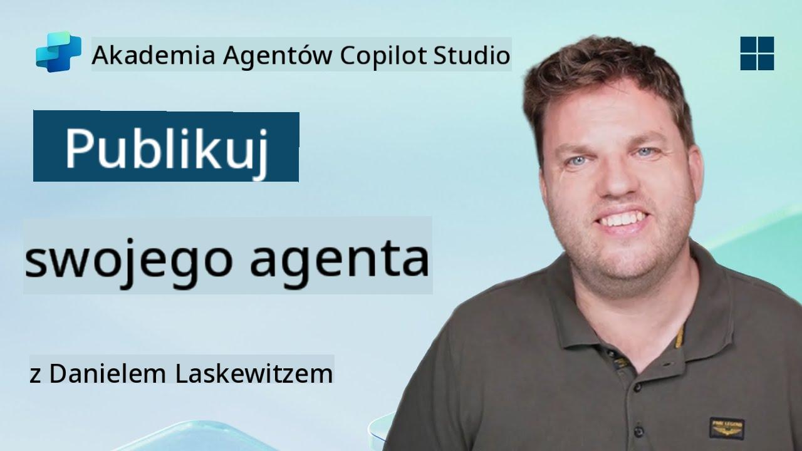](https://www.youtube.com/watch?v=eVZmljhYlSI "Obejrzyj instruktaż na YouTube")

## 🎯 Opis misji

Po ukończeniu serii wymagających modułów, Twórca Agentów, jesteś gotowy na najważniejszy krok: publikację swojego agenta. Czas udostępnić swoje dzieło użytkownikom Microsoft Teams i Microsoft 365 Copilot.

Twój agent—wyposażony w jasną misję, potężne narzędzia i dostęp do kluczowych źródeł wiedzy—jest gotowy do działania. Korzystając z Microsoft Copilot Studio, wdrażasz swojego agenta, aby mógł zacząć pomagać prawdziwym użytkownikom tam, gdzie pracują.

Uruchommy Twojego agenta w akcji.

## 🔎 Cele

📖 W tej lekcji dowiesz się:

1. Dlaczego publikacja agenta jest ważna
1. Co się dzieje podczas publikacji agenta
1. Jak dodać kanał (Microsoft Teams i Microsoft 365 Copilot)
1. Jak dodać agenta do Microsoft Teams
1. Jak udostępnić agenta w Microsoft Teams dla całej organizacji

## 🚀 Publikacja agenta

Za każdym razem, gdy pracujesz nad agentem w Copilot Studio, możesz go aktualizować, dodając wiedzę lub narzędzia. Gdy wszystkie zmiany są gotowe i dokładnie przetestowane, możesz go opublikować. Publikacja zapewnia, że najnowsze aktualizacje są dostępne. Jeśli zaktualizujesz swojego agenta o nowe narzędzia, ale nie klikniesz przycisku publikacji, zmiany nie będą jeszcze dostępne dla użytkowników końcowych.

Pamiętaj, aby zawsze kliknąć przycisk publikacji, gdy chcesz udostępnić aktualizacje użytkownikom swojego agenta. Twój agent może mieć dodane kanały, a po kliknięciu publikacji aktualizacje będą dostępne we wszystkich kanałach, które zostały dodane do agenta.

## ⚙️ Konfiguracja kanałów

Kanały określają, gdzie użytkownicy mogą uzyskać dostęp do Twojego agenta i z nim współdziałać. Po opublikowaniu agenta możesz udostępnić go w wielu kanałach. Każdy kanał może wyświetlać treści Twojego agenta w inny sposób.

Możesz dodać swojego agenta do następujących kanałów:

- **Microsoft Teams i Microsoft 365 Copilot** - Udostępnij swojego agenta w czatach i spotkaniach Teams oraz w doświadczeniach Microsoft 365 Copilot ([Dowiedz się więcej](https://learn.microsoft.com/microsoft-copilot-studio/publication-add-bot-to-microsoft-teams))
- **Strona demonstracyjna** - Przetestuj swojego agenta na stronie demonstracyjnej dostarczonej przez Copilot Studio ([Dowiedz się więcej](https://learn.microsoft.com/microsoft-copilot-studio/publication-connect-bot-to-web-channels))
- **Własna strona internetowa** - Osadź swojego agenta bezpośrednio na swojej stronie internetowej ([Dowiedz się więcej](https://learn.microsoft.com/microsoft-copilot-studio/publication-connect-bot-to-web-channels))
- **Aplikacja mobilna** - Zintegruj swojego agenta z własną aplikacją mobilną ([Dowiedz się więcej](https://learn.microsoft.com/microsoft-copilot-studio/publication-connect-bot-to-custom-application))
- **SharePoint** - Dodaj swojego agenta do witryn SharePoint w celu pomocy z dokumentami i witrynami ([Dowiedz się więcej](https://learn.microsoft.com/microsoft-copilot-studio/publication-add-bot-to-sharepoint))
- **Facebook Messenger** - Połącz się z użytkownikami za pośrednictwem platformy wiadomości Facebooka ([Dowiedz się więcej](https://learn.microsoft.com/microsoft-copilot-studio/publication-add-bot-to-facebook))
- **Power Pages** - Zintegruj swojego agenta z witrynami Power Pages ([Dowiedz się więcej](https://learn.microsoft.com/microsoft-copilot-studio/publication-add-bot-to-power-pages))
- **Kanały Azure Bot Service** - Uzyskaj dostęp do dodatkowych kanałów, takich jak Slack, Telegram, Twilio SMS i inne ([Dowiedz się więcej](https://learn.microsoft.com/microsoft-copilot-studio/publication-connect-bot-to-azure-bot-service-channels))

Aby dodać kanał, przejdź do zakładki **Channels** w swoim agencie i wybierz kanał, który chcesz skonfigurować. Każdy kanał ma specyficzne wymagania dotyczące konfiguracji i może wymagać dodatkowego uwierzytelnienia lub kroków konfiguracyjnych.

## 📺 Doświadczenia kanałów

Różne kanały oferują różne doświadczenia użytkownika. Tworząc agenta dla wielu kanałów, pamiętaj o różnicach między nimi. Zawsze warto przetestować swojego agenta w różnych kanałach, aby upewnić się, że działa zgodnie z zamierzeniami.

| Doświadczenie                     | Strona        | Teams i Microsoft 365 Copilot          | Facebook                 | Dynamics Omnichannel dla Obsługi Klienta                   |
| --------------------------------- | ------------- | --------------------------------------- | ------------------------ | ---------------------------------------------------------- |
| [Ankieta satysfakcji klienta][1]  | Karta adaptacyjna | Tylko tekst                            | Tylko tekst             | Tylko tekst                                                |
| [Opcje wielokrotnego wyboru][1]   | Obsługiwane   | [Obsługiwane do sześciu (jako karta hero)][4] | [Obsługiwane do 13][6] | [Częściowo obsługiwane][8]                                 |
| [Markdown][2]                     | Obsługiwane   | [Częściowo obsługiwane][5]             | [Częściowo obsługiwane][7] | [Częściowo obsługiwane][9]                                 |
| [Wiadomość powitalna][1]          | Obsługiwane   | Obsługiwane                            | Nieobsługiwane           | Obsługiwane dla [Czatu][10]. Nieobsługiwane dla innych kanałów. |
| [Czy-miałeś-na-myśli][3]          | Obsługiwane   | Obsługiwane                            | Obsługiwane              | Obsługiwane dla [Microsoft Teams][11], [Czatu][10], Facebooka i kanałów tekstowych (SMS przez [TeleSign][12] i [Twilio][13], [WhatsApp][14], [WeChat][15] oraz [Twitter][16]). Sugerowane działania są prezentowane jako lista tekstowa; użytkownicy muszą ponownie wpisać opcję, aby odpowiedzieć. |

[1]: https://learn.microsoft.com/microsoft-copilot-studio/authoring-create-edit-topics  
[2]: https://daringfireball.net/projects/markdown/  
[3]: https://learn.microsoft.com/microsoft-copilot-studio/advanced-ai-features  
[4]: https://learn.microsoft.com/microsoftteams/platform/concepts/cards/cards-reference#hero-card  
[5]: https://learn.microsoft.com/microsoftteams/platform/bots/how-to/format-your-bot-messages#text-only-messages  
[6]: https://developers.facebook.com/docs/messenger-platform/send-messages/quick-replies/  
[7]: https://www.facebook.com/help/147348452522644?helpref=related  
[8]: https://learn.microsoft.com/dynamics365/customer-service/asynchronous-channels#suggested-actions-support  
[9]: https://learn.microsoft.com/dynamics365/customer-service/asynchronous-channels#preview-support-for-formatted-messages  
[10]: https://learn.microsoft.com/dynamics365/customer-service/set-up-chat-widget  
[11]: https://learn.microsoft.com/dynamics365/customer-service/configure-microsoft-teams  
[12]: https://learn.microsoft.com/dynamics365/customer-service/configure-sms-channel  
[13]: https://learn.microsoft.com/dynamics365/customer-service/configure-sms-channel-twilio  
[14]: https://learn.microsoft.com/dynamics365/customer-service/configure-whatsapp-channel  
[15]: https://learn.microsoft.com/dynamics365/customer-service/configure-wechat-channel  
[16]: https://learn.microsoft.com/dynamics365/customer-service/configure-twitter-channel  

> [!NOTE]  
> Istnieją przykłady, gdzie można zastosować różną logikę dla różnych kanałów. Przykład można znaleźć w repozytorium Power Platform Snippets:  
>  
> Henry Jammes udostępnił przykład, jak wyświetlić inną kartę adaptacyjną, gdy kanałem jest Microsoft Teams. ([Link do przykładu](https://github.com/pnp/powerplatform-snippets/blob/main/copilot-studio/multiple-topics-matched-topic/source/multiple-topics-matched.yaml#L40))

## 🧪 Laboratorium 11: Opublikuj swojego agenta w Teams i Microsoft 365 Copilot

### 🎯 Przypadek użycia

Twój agent pomocy technicznej Contoso IT jest teraz w pełni skonfigurowany z potężnymi funkcjami—może uzyskiwać dostęp do źródeł wiedzy w SharePoint, tworzyć zgłoszenia wsparcia, wysyłać powiadomienia proaktywne i inteligentnie odpowiadać na zapytania użytkowników. Jednak wszystkie te funkcje są obecnie dostępne tylko w środowisku deweloperskim, w którym zostały stworzone.

**Wyzwanie:** Użytkownicy końcowi nie mogą korzystać z możliwości Twojego agenta, dopóki nie zostanie on odpowiednio opublikowany i udostępniony w kanałach, w których faktycznie pracują.

**Rozwiązanie:** Publikacja Twojego agenta zapewnia, że najnowsza wersja—z wszystkimi ostatnimi aktualizacjami, nowymi tematami, ulepszonymi źródłami wiedzy i skonfigurowanymi przepływami—jest dostępna dla prawdziwych użytkowników. Bez publikacji użytkownicy nadal będą korzystać ze starszej wersji Twojego agenta, która może nie zawierać kluczowych funkcji.

Dodanie kanału Teams i Microsoft 365 Copilot jest równie ważne, ponieważ:

- **Integracja z Teams**: Pracownicy Twojej organizacji spędzają większość dnia w Microsoft Teams, współpracując, uczestnicząc w spotkaniach i komunikując się. Dodając swojego agenta do Teams, użytkownicy mogą uzyskać wsparcie IT bez opuszczania swojego głównego środowiska pracy.

- **Microsoft 365 Copilot**: Użytkownicy mogą uzyskać dostęp do Twojego specjalistycznego agenta pomocy technicznej IT bezpośrednio w ramach doświadczenia Microsoft 365 Copilot, co pozwala na płynną integrację z ich codziennym przepływem pracy w aplikacjach Office.

- **Centralny dostęp**: Zamiast zapamiętywać oddzielne strony internetowe czy aplikacje, użytkownicy mogą uzyskać wsparcie IT za pośrednictwem platform, z których już korzystają, co zmniejsza trudności i zwiększa adopcję.

Ta misja przekształca Twoją pracę deweloperską w gotowe do produkcji rozwiązanie, które dostarcza realną wartość użytkownikom końcowym Twojej organizacji.

### Wymagania wstępne

Przed rozpoczęciem tego laboratorium upewnij się, że:

- ✅ Ukończyłeś poprzednie laboratoria i masz w pełni skonfigurowanego agenta pomocy technicznej Contoso
- ✅ Twój agent został przetestowany i jest gotowy do użycia produkcyjnego
- ✅ Masz uprawnienia w środowisku Copilot Studio do publikacji agentów
- ✅ Masz dostęp do Microsoft Teams w swojej organizacji

### 11.1 Publikacja agenta

Teraz, gdy zakończyliśmy pracę nad agentem, musimy upewnić się, że cała nasza praca jest dostępna dla użytkowników końcowych, którzy będą korzystać z naszego agenta. Aby upewnić się, że treści są dostępne dla wszystkich użytkowników, musimy opublikować naszego agenta.

1. Przejdź do agenta pomocy technicznej Contoso w Copilot Studio (przez [portal twórców Copilot Studio](https://copilotstudio.microsoft.com))

    W Copilot Studio publikacja agenta jest prosta. Wystarczy wybrać przycisk publikacji na górze przeglądu agenta.

    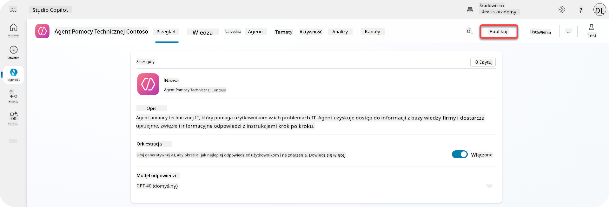

1. Wybierz przycisk **Publish** w swoim agencie

    Otworzy się okno publikacji - aby potwierdzić, że naprawdę chcesz opublikować swojego agenta.

    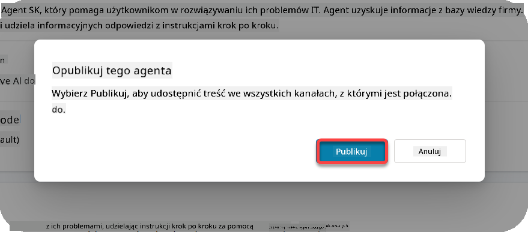

1. Wybierz **Publish**, aby potwierdzić publikację swojego agenta

    Teraz pojawi się komunikat, że Twój agent jest publikowany. Nie musisz trzymać tego okna otwartego. Otrzymasz powiadomienie, gdy agent zostanie opublikowany.

    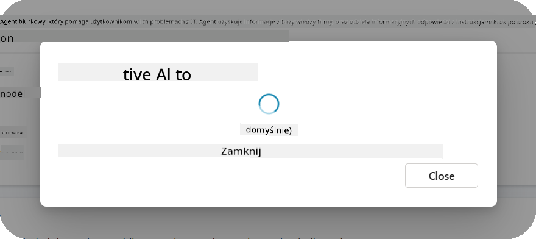

    Gdy agent zostanie opublikowany, zobaczysz powiadomienie na górze strony agenta.

    

Ale - właśnie opublikowaliśmy agenta, nie dodaliśmy go jeszcze do kanału, więc teraz to naprawmy!

### 11.2 Dodanie kanału Teams i Microsoft 365 Copilot

1. Aby dodać kanał Teams i Microsoft 365 Copilot do naszego agenta, musimy wybrać **Channel** w górnej nawigacji agenta

    

    Tutaj możemy zobaczyć wszystkie kanały, które możemy dodać do tego agenta.

1. Wybierz **Teams and Microsoft 365**

    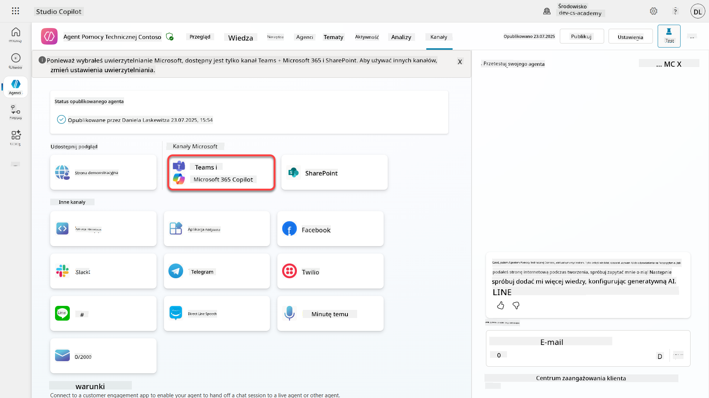

1. Wybierz **Add channel**, aby ukończyć kreator i dodać kanał do agenta

    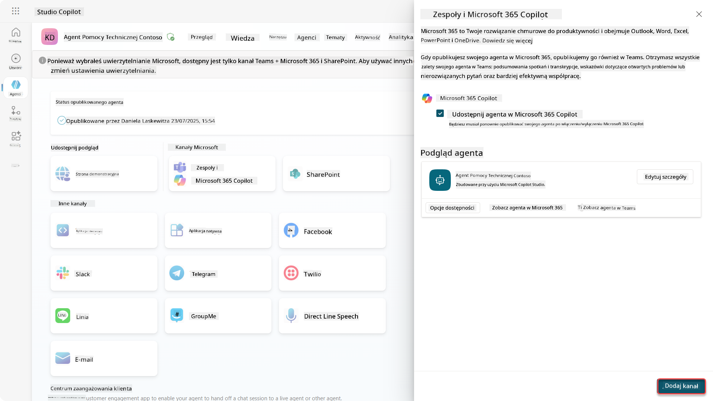

    Dodanie kanału zajmie chwilę. Po dodaniu pojawi się zielone powiadomienie na górze paska bocznego.

    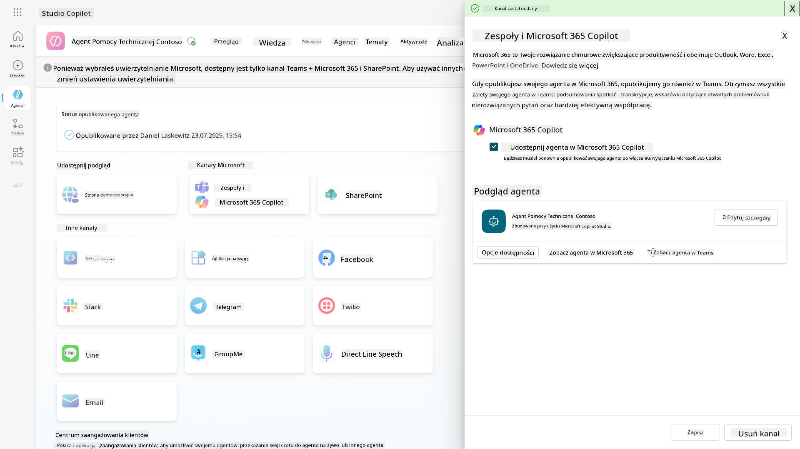

1. Wybierz **See agent in Teams**, aby otworzyć nową kartę

    

1. Wybierz **Add**, aby dodać agenta pomocy technicznej Contoso do Teams

    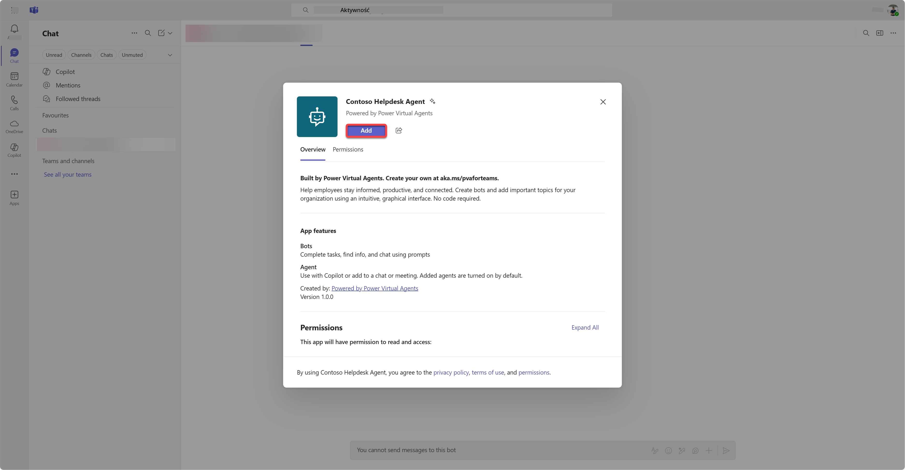

    To zajmie chwilę. Po zakończeniu powinien pojawić się następujący ekran:

    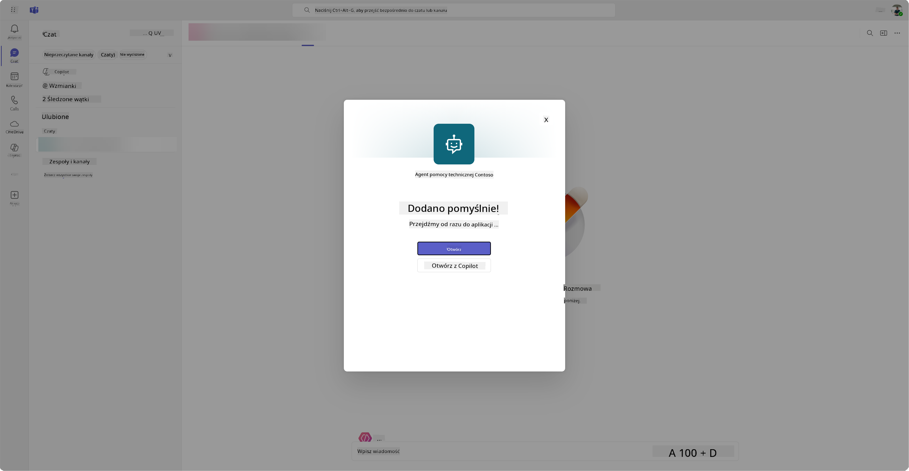

1. Wybierz **Open**, aby otworzyć agenta w Teams

    To otworzy agenta w Teams jako aplikację Teams

    

Teraz opublikowaliśmy agenta, aby działał dla Ciebie w Microsoft Teams, ale możesz chcieć udostępnić go większej liczbie osób.

### 11.3 Udostępnienie agenta wszystkim użytkownikom w dzierżawie

1. Zamknij kartę przeglądarki, w której otwarty był agent pomocy technicznej Contoso

    Powinno to przenieść Cię z powrotem do Copilot Studio, gdzie panel boczny Teams i Microsoft 365 Copilot nadal jest otwarty. Do tej pory otworzyliśmy agenta w Teams, ale możemy zrobić znacznie więcej. Możemy edytować szczegóły agenta, wdrożyć go dla większej liczby użytkowników i więcej.

1. Wybierz **Edit details**

    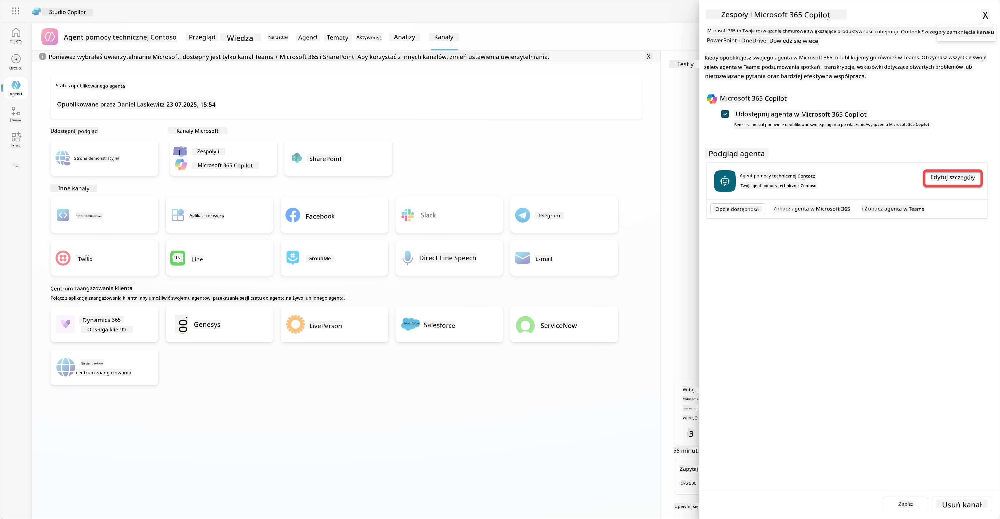
To otworzy panel, w którym możemy zmienić wiele szczegółów i ustawień agenta. Możemy zmienić podstawowe informacje, takie jak ikona, kolor tła ikony oraz opisy. Możemy również zmienić ustawienia Teams (na przykład umożliwić użytkownikowi dodanie agenta do zespołu lub pozwolić na używanie tego agenta w czatach grupowych i spotkaniach). Po wybraniu *więcej* można także zmienić szczegóły dotyczące dewelopera, takie jak nazwa dewelopera, strona internetowa, oświadczenie o prywatności i warunki użytkowania.

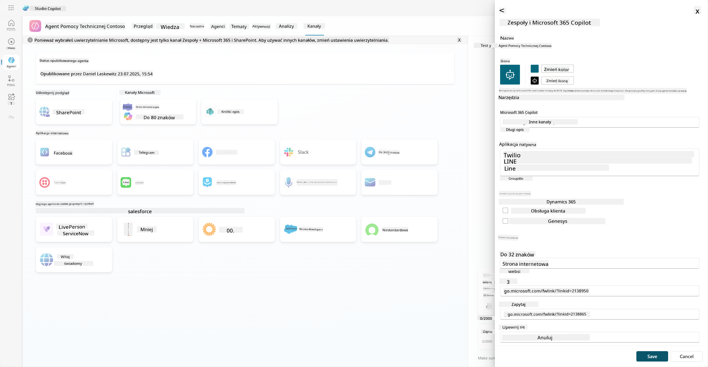

1. Wybierz **Anuluj**, aby zamknąć panel edycji szczegółów.

1. Wybierz **Opcje dostępności**.

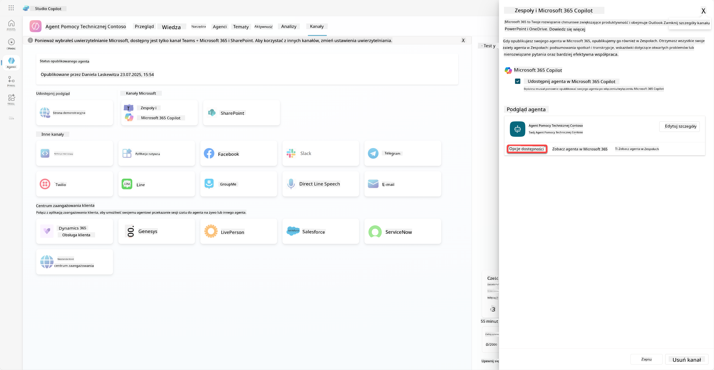

To otworzy panel opcji dostępności, gdzie możesz skopiować link do wysłania użytkownikom, aby mogli korzystać z tego agenta (pamiętaj, że musisz również udostępnić agenta użytkownikowi) oraz pobrać plik, aby dodać swojego agenta do sklepu Microsoft Teams lub Microsoft 365. Aby pokazać agenta w sklepie, masz inne opcje: możesz udostępnić go swoim współpracownikom i użytkownikom współdzielonym (aby pokazać w sekcji *Zbudowane z Power Platform*) lub możesz udostępnić go wszystkim w swojej organizacji (wymaga to zatwierdzenia przez administratora).

1. Wybierz **Pokaż wszystkim w mojej organizacji**.

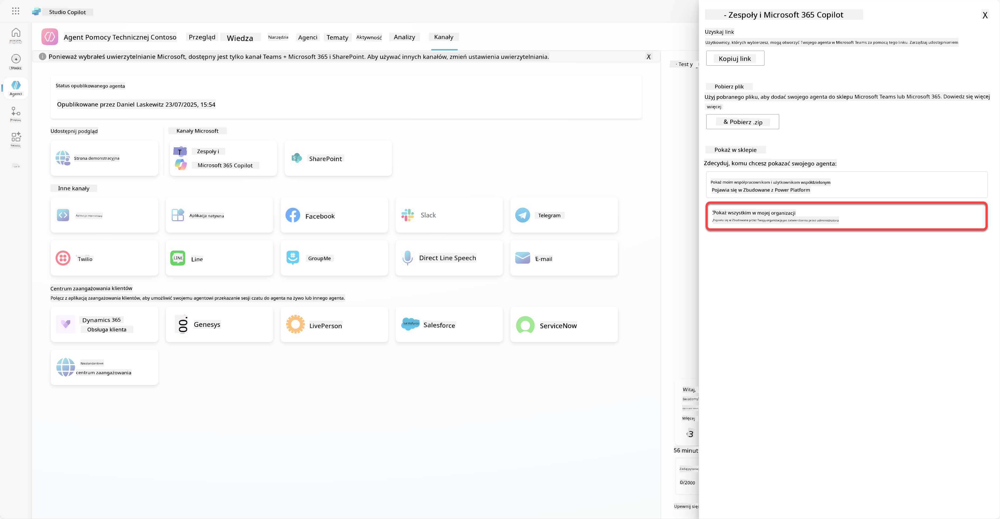

1. Wybierz **Prześlij do zatwierdzenia przez administratora**.

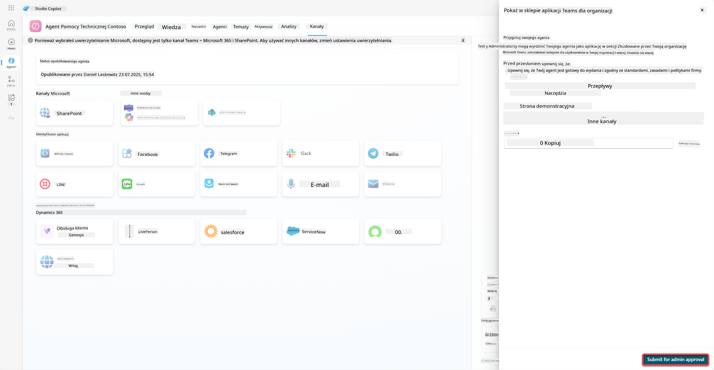

Teraz administrator musi zatwierdzić przesłanie Twojego agenta. Może to zrobić, przechodząc do Centrum Administracyjnego Teams i wyszukując Contoso Helpdesk Agent w aplikacjach. Na zrzucie ekranu widać, co administrator zobaczy w Centrum Administracyjnym Teams.

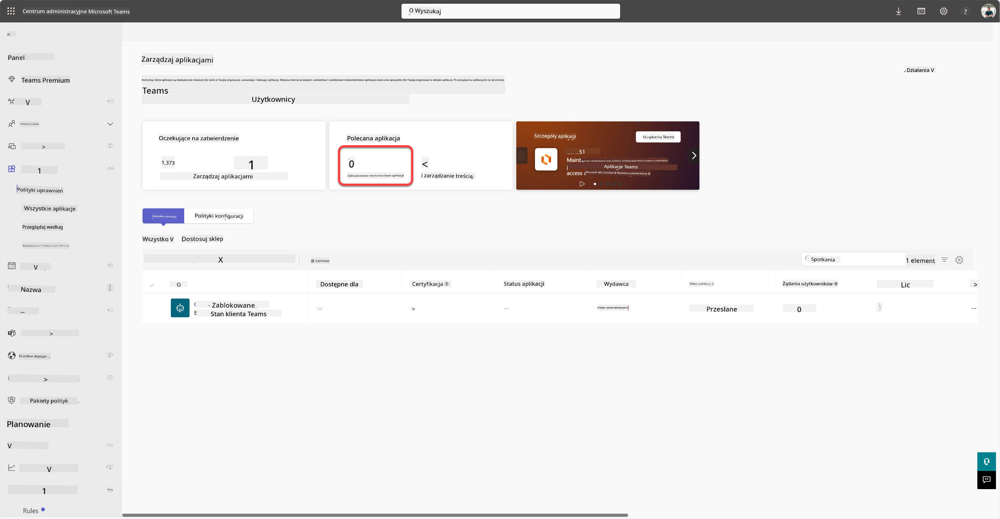

Administrator musi wybrać Contoso Helpdesk Agent i kliknąć *Publikuj*, aby opublikować Contoso Helpdesk Agent dla wszystkich.

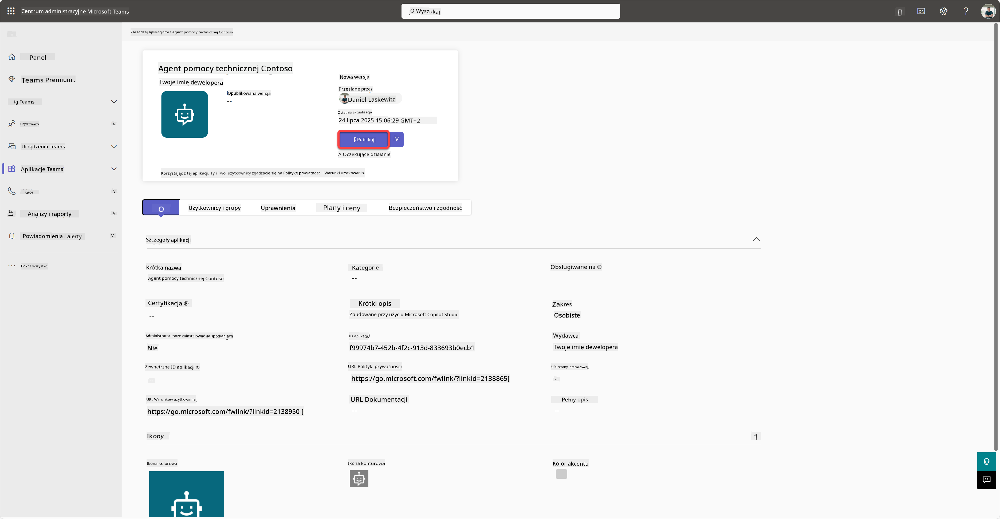

Gdy administrator opublikuje przesłanie agenta, będziesz mógł odświeżyć Copilot Studio i powinieneś zobaczyć baner *dostępne w sklepie aplikacji* w opcjach dostępności.

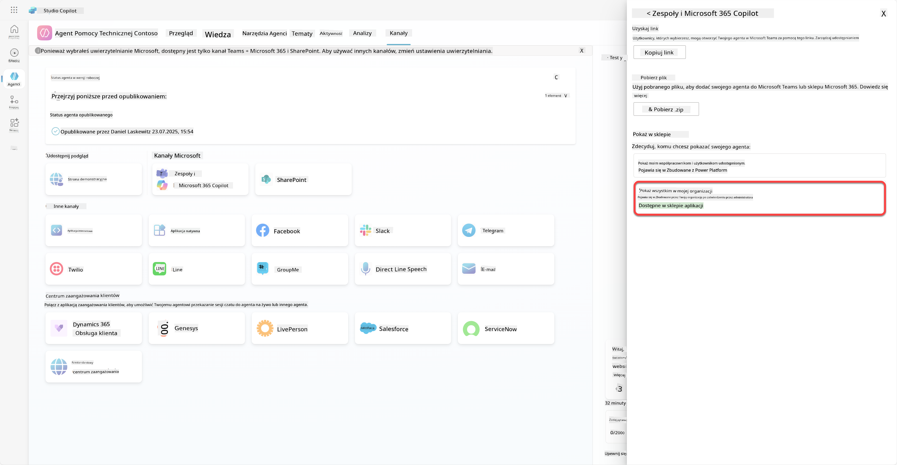

Tutaj jest jeszcze więcej możliwości. Twój administrator może zmienić globalną politykę konfiguracji i automatycznie zainstalować Contoso Helpdesk Agent dla wszystkich w dzierżawie. Ponadto możesz przypiąć Contoso Helpdesk Agent do lewego paska, aby każdy miał łatwy dostęp do niego.

## ✅ Misja zakończona

🎉 **Gratulacje!** Udało Ci się opublikować swojego agenta i dodać go do Teams oraz Microsoft 365 Copilot! Następna misja to ostatnia część kursu: Zrozumienie licencjonowania.

⏭️ [Przejdź do lekcji **Zrozumienie licencjonowania**](../12-understanding-licensing/README.md)

## 📚 Zasoby taktyczne

🔗 [Dokumentacja kanałów publikacji](https://learn.microsoft.com/microsoft-copilot-studio/publication-fundamentals-publish-channels)

---

**Zastrzeżenie**:  
Ten dokument został przetłumaczony za pomocą usługi tłumaczenia AI [Co-op Translator](https://github.com/Azure/co-op-translator). Chociaż staramy się zapewnić dokładność, prosimy pamiętać, że automatyczne tłumaczenia mogą zawierać błędy lub nieścisłości. Oryginalny dokument w jego rodzimym języku powinien być uznawany za autorytatywne źródło. W przypadku informacji krytycznych zaleca się skorzystanie z profesjonalnego tłumaczenia przez człowieka. Nie ponosimy odpowiedzialności za jakiekolwiek nieporozumienia lub błędne interpretacje wynikające z użycia tego tłumaczenia.