<!--
CO_OP_TRANSLATOR_METADATA:
{
  "original_hash": "4fb913dfc3bbc71506dd3602c4b8e6ed",
  "translation_date": "2025-10-18T03:09:47+00:00",
  "source_file": "docs/operative-preview/02-multi-agent/README.md",
  "language_code": "pt"
}
-->
# 🚨 Missão 02: Agentes Conectados

--8<-- "disclaimer.md"

## 🕵️‍♂️ NOME DE CÓDIGO: `OPERAÇÃO SINFONIA`

> **⏱️ Duração da Operação:** `~45 minutos`

## 🎯 Resumo da Missão

Bem-vindo de volta, Agente. Na Missão 01, criaste o teu principal Agente de Recrutamento - uma base sólida para gerir fluxos de trabalho de recrutamento. Mas um único agente tem as suas limitações.

A tua missão, caso decidas aceitá-la, é a **Operação Sinfonia** - transformar o teu agente único num **sistema de múltiplos agentes**: uma equipa orquestrada de agentes especializados que trabalham juntos para lidar com desafios complexos de recrutamento. Pensa nisso como uma evolução de um operador solitário para o comando de uma força-tarefa especializada.

Tal como numa orquestra sinfónica onde cada músico desempenha o seu papel em perfeita harmonia, vais adicionar dois especialistas críticos ao teu Agente de Recrutamento existente: um Agente de Receção de Candidaturas para processar currículos automaticamente e um Agente de Preparação de Entrevistas para criar materiais abrangentes para entrevistas. Estes agentes trabalharão juntos de forma integrada sob o comando do teu orquestrador principal.

## 🔎 Objetivos

Nesta missão, vais aprender:

1. Quando usar **agentes filhos** vs **agentes conectados**
1. Como desenhar **arquiteturas de múltiplos agentes** que sejam escaláveis  
1. Criar **agentes filhos** para tarefas específicas
1. Estabelecer **padrões de comunicação** entre agentes
1. Construir o Agente de Receção de Candidaturas e o Agente de Preparação de Entrevistas

## 🧠 O que são agentes conectados?

No Copilot Studio, não estás limitado a criar agentes únicos e monolíticos. Podes criar **sistemas de múltiplos agentes** - redes de agentes especializados que trabalham juntos para lidar com fluxos de trabalho complexos.

Pensa nisso como uma organização real: em vez de uma pessoa fazer tudo, tens especialistas que se destacam em tarefas específicas e colaboram quando necessário.

### Por que os sistemas de múltiplos agentes são importantes

- **Escalabilidade:** Cada agente pode ser desenvolvido, testado e mantido de forma independente por diferentes equipas.  
- **Especialização:** Os agentes podem concentrar-se no que fazem melhor. Talvez um para processamento de dados, outro para interação com o utilizador, outro para tomada de decisões.  
- **Flexibilidade:** Podes combinar agentes, reutilizá-los em diferentes projetos e evoluir o sistema gradualmente.  
- **Manutenção:** Alterações em um agente não afetam necessariamente os outros, tornando as atualizações mais seguras e fáceis.

### Exemplo prático: Processo de recrutamento

Considera o nosso fluxo de trabalho de recrutamento - vários agentes podem trabalhar juntos com as seguintes responsabilidades:

- **Receção de currículos** requer habilidades de análise de documentos e extração de dados
- **Avaliação** envolve avaliar currículos de candidatos e compará-los com os requisitos das vagas
- **Preparação para entrevistas** necessita de um raciocínio profundo sobre a adequação do candidato  
- **Comunicação com candidatos** requer habilidades empáticas de comunicação

Em vez de criar um agente massivo que tenta lidar com todas essas habilidades diferentes, podes criar agentes especializados para cada área e orquestrá-los juntos.

## 🔗 Agentes filhos vs agentes conectados: A principal diferença

O Copilot Studio oferece duas formas de construir sistemas de múltiplos agentes, cada uma com casos de uso distintos:

### ↘️ Agentes filhos

Os agentes filhos são **especialistas leves** que vivem dentro do teu agente principal. Pensa neles como equipas especializadas dentro do mesmo departamento.

#### Detalhes técnicos principais

- Os agentes filhos vivem dentro do agente principal e têm uma única página de configuração.
- Ferramentas e Conhecimento são **armazenados no agente principal**, mas configurados para estarem "Disponíveis para" o agente filho.
- Os agentes filhos **partilham os tópicos** do agente principal. Os tópicos podem ser referenciados pelas instruções do agente filho.
- Os agentes filhos **não precisam de publicação separada** - estão automaticamente disponíveis dentro do agente principal assim que criados. Isso facilita os testes, pois alterações no agente principal e nos agentes filhos podem ser realizadas no **mesmo espaço de trabalho compartilhado**.

#### Usa agentes filhos quando

- Uma única equipa gere toda a solução
- Queres organizar logicamente ferramentas e conhecimentos em subagentes
- Não precisas de autenticação ou implementação separada para cada agente
- Os agentes não serão publicados separadamente ou usados de forma independente
- Não precisas de reutilizar agentes em várias soluções

**Exemplo:** Um agente de suporte técnico com agentes filhos para:

- Procedimentos de redefinição de senha
- Solução de problemas de hardware  
- Guias de instalação de software

### 🔀 Agentes conectados

Os agentes conectados são **agentes independentes e completos** com os quais o teu agente principal pode colaborar. Pensa neles como departamentos separados que trabalham juntos num projeto.

#### Detalhes técnicos principais

- Os agentes conectados têm **os seus próprios tópicos** e fluxos de conversação. Operam de forma independente com as suas próprias configurações, lógica e ciclo de vida de implementação.
- Os agentes conectados **devem ser publicados** antes de serem adicionados e usados por outros agentes.
- Durante os testes, alterações no agente conectado devem ser publicadas antes de serem usadas pelo agente que o chama.

#### Usa agentes conectados quando

- Múltiplas equipas desenvolvem e mantêm diferentes agentes de forma independente
- Os agentes precisam das suas próprias configurações, autenticação e canais de implementação
- Queres publicar e manter agentes separadamente com gestão independente do ciclo de vida da aplicação (ALM) para cada agente
- Os agentes devem ser reutilizáveis em várias soluções

**Exemplo:** Um sistema de atendimento ao cliente que se conecta a:

- Um agente de faturação separado mantido pela equipa financeira
- Um agente de suporte técnico separado mantido pela equipa de produto
- Um agente de devoluções separado mantido pela equipa de operações

!!! tip "Dica"
    Podes misturar ambas as abordagens! Por exemplo, o teu agente principal pode conectar-se a agentes externos de outras equipas enquanto também tem os seus próprios agentes filhos para tarefas internas especializadas.

## 🎯 Padrões de arquitetura de múltiplos agentes

Ao projetar sistemas de múltiplos agentes, surgem vários padrões com base na forma como os agentes interagem:

| Padrão               | Descrição                                                                 | Melhor para                                                    |
|----------------------|---------------------------------------------------------------------------|----------------------------------------------------------------|
| **Hub and Spoke**    | Um agente orquestrador principal coordena com vários agentes especializados. O orquestrador lida com a interação do utilizador e delega tarefas a agentes filhos ou conectados. | Fluxos de trabalho complexos onde um agente coordena tarefas especializadas |
| **Pipeline**         | Os agentes passam o trabalho sequencialmente de um para o outro, cada um adicionando valor antes de passar para a próxima etapa. | Processos lineares como processamento de candidaturas (receção → avaliação → entrevista → decisão) |
| **Colaborativo**     | Os agentes trabalham juntos simultaneamente em diferentes aspetos do mesmo problema, partilhando contexto e resultados. | Análises complexas que exigem múltiplas perspetivas ou áreas de especialização |

!!! tip "Dica"
    Podes até ter uma combinação de dois ou mais desses padrões.

## 💬 Comunicação entre agentes e partilha de contexto

Quando os agentes trabalham juntos, precisam de partilhar informações de forma eficaz. Eis como isso funciona no Copilot Studio:

### Histórico de conversação

Por padrão, quando um agente principal chama um agente filho ou conectado, pode passar o **histórico de conversação**. Isso dá ao agente especialista o contexto completo sobre o que o utilizador está a discutir.

Podes desativar esta opção por razões de segurança ou desempenho - por exemplo, se o agente especialista só precisar de concluir uma tarefa específica sem necessitar do contexto completo da conversação. Isso pode ser uma boa defesa contra **vazamento de dados**.

### Instruções explícitas

O teu agente principal pode dar **instruções específicas** aos agentes filhos ou conectados. Por exemplo: "Processa este currículo e resume as competências para a vaga de Desenvolvedor Sénior."

### Valores de retorno

Os agentes podem devolver informações estruturadas ao agente que os chamou, permitindo que o agente principal use essas informações em etapas subsequentes ou as partilhe com outros agentes.

### Integração com Dataverse

Para cenários mais complexos, os agentes podem partilhar informações através do **Dataverse** ou outros repositórios de dados, permitindo a partilha de contexto persistente em várias interações.

## ↘️Agente filho: Agente de Receção de Candidaturas

Vamos começar a construir o nosso sistema de múltiplos agentes para recrutamento. O nosso primeiro especialista será o **Agente de Receção de Candidaturas** - um agente filho responsável por processar currículos e informações de candidatos recebidos.

```mermaid
---
config:
  layout: elk
  look: neo
---
flowchart TB
 subgraph People["People"]
    direction TB
        HiringManager["Hiring Manager"]
        Interviewers["Interviewers"]
  end
 subgraph Agents["Agents"]
    direction LR
        ApplicationIntakeAgent["Application Intake Agent<br>(Child)"]
        InterviewAgent["Interview Agent<br>(Connected)"]
        HRAgent["HR Agent"]
  end
    HiringManager -- Upload CV --> HRAgent
    HRAgent -- Upload Resume, Create Candidate, Match to Job Roles --> ApplicationIntakeAgent
    ApplicationIntakeAgent -- Create Resume, Upsert Candidate, Create Job Application --> Dataverse["Dataverse"]
    ApplicationIntakeAgent -- Store Resume file in file column --> Dataverse
    HiringManager -- Ask for summaries --> HRAgent
    Interviewers -- Request interview pack --> HRAgent
    HRAgent -- Generate interview pack and summarize data --> InterviewAgent
    InterviewAgent -- Read all Candidate, Resume, Job Roles, Evaluation Criteria Data --> Dataverse
     HiringManager:::person
     Interviewers:::person
     ApplicationIntakeAgent:::agent
     InterviewAgent:::agent
     HRAgent:::agent
     Dataverse:::data
    classDef person fill:#e6f0ff,stroke:#3b82f6,color:#0b3660
    classDef agent fill:#e8f9ef,stroke:#10b981,color:#064e3b
    classDef data  fill:#f3f4f6,stroke:#6b7280,color:#111827
```

### 🤝Responsabilidades do Agente de Receção de Candidaturas

- **Analisar o conteúdo dos currículos** em PDFs fornecidos via chat interativo (numa missão futura vais aprender como processar currículos de forma autónoma).
- **Extrair dados estruturados** (nome, competências, experiência, formação)
- **Associar candidatos a vagas abertas** com base nas qualificações e na carta de apresentação
- **Armazenar informações dos candidatos** no Dataverse para processamento posterior
- **Eliminar duplicados** para evitar criar o mesmo candidato duas vezes, associando a registos existentes através do endereço de email extraído do currículo.

### ⭐Por que este deve ser um agente filho

O Agente de Receção de Candidaturas encaixa perfeitamente como um agente filho porque:

- É especializado em processamento de documentos e extração de dados
- Não precisa de publicação separada  
- Faz parte da nossa solução geral de recrutamento gerida pela mesma equipa
- Foca-se num gatilho específico (novo currículo recebido) e é invocado pelo Agente de Recrutamento.

## 🔀Agente conectado: Agente de Preparação de Entrevistas  

O nosso segundo especialista será o **Agente de Preparação de Entrevistas** - um agente conectado que ajuda a criar materiais abrangentes para entrevistas e avalia respostas de candidatos.

### 🤝Responsabilidades do Agente de Preparação de Entrevistas

- **Criar pacotes de entrevista** com informações da empresa, requisitos da vaga e critérios de avaliação
- **Gerar perguntas de entrevista** adaptadas a funções específicas e perfis de candidatos
- **Responder a perguntas gerais** sobre as funções e candidaturas para comunicação com os stakeholders

### ⭐Por que este deve ser um agente conectado

O Agente de Preparação de Entrevistas funciona melhor como um agente conectado porque:

- A equipa de aquisição de talentos pode querer usá-lo de forma independente em vários processos de recrutamento
- Precisa da sua própria base de conhecimento sobre melhores práticas de entrevistas e critérios de avaliação
- Diferentes gestores de recrutamento podem querer personalizar o seu comportamento para as suas equipas
- Pode ser reutilizado para posições internas, não apenas para recrutamento externo

## 🧪Laboratório 2.1: Adicionar o Agente de Receção de Candidaturas

Pronto para colocar a teoria em prática? Vamos adicionar o nosso primeiro agente filho ao teu Agente de Recrutamento existente.

### Pré-requisitos para completar esta missão

Precisarás de **uma das seguintes opções**:

- **Ter completado a Missão 01** e ter o teu Agente de Recrutamento pronto, **OU**
- **Importar a solução inicial da Missão 02** se estiveres a começar do zero ou precisares de recuperar. [Descarregar Solução Inicial da Missão 02](https://aka.ms/agent-academy)

!!! note "Importação de Solução e Dados de Exemplo"
    Se estiveres a usar a solução inicial, consulta [Missão 01](../01-get-started/README.md) para instruções detalhadas sobre como importar soluções e dados de exemplo para o teu ambiente.

### 2.1.1 Configuração da solução

1. Dentro do Copilot Studio, seleciona os três pontos (...) abaixo de Ferramentas na navegação à esquerda.
1. Seleciona **Soluções**.  
    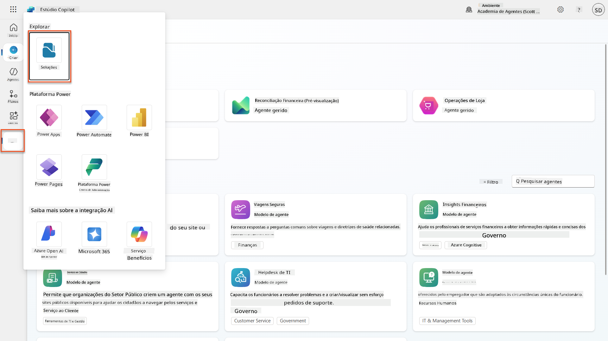
1. Localiza a tua solução Operativa, seleciona os **três pontos (...)** ao lado dela e escolhe **Definir solução preferida**. Isso garantirá que todo o teu trabalho será adicionado a esta solução.  
    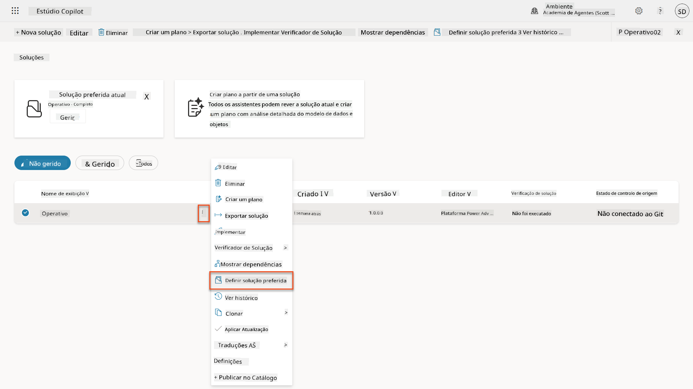

### 2.1.2 Configurar as instruções do agente de Recrutamento

1. **Navega** até ao Copilot Studio. Certifica-te de que o teu ambiente está selecionado no canto superior direito **Seletor de Ambiente**.

1. Abre o teu **Agente de Recrutamento** da Missão 01.

1. Seleciona **Editar** na secção **Instruções** do separador **Visão Geral** e adiciona as seguintes instruções no topo:

    ```text
    You are the central orchestrator for the hiring process. You coordinate activities, provide summaries, and delegate work to specialized agents.
    ```

1. Seleciona **Guardar**  
    

1. Seleciona **Configurações** (canto superior direito)

1. Certifica-te das seguintes configurações:

    | Configuração | Valor |
    |--------------|-------|
    | Usar orquestração de IA generativa para as respostas do agente | **Sim** |
    | Moderação de Conteúdo | **Moderado** |
    | Usar conhecimento geral | **Desativado** |
    | Usar informações da Web | **Desativado** |
    | Upload de ficheiros | **Ativado** |


### 2.1.3 Adicionar o agente filho de Receção de Candidaturas

1. **Navega** até ao separador **Agentes** dentro do teu Agente de Recrutamento - é aqui que vais adicionar agentes especializados.

1. Seleciona **+ Adicionar** e depois **Criar um agente**. Nota que isto está identificado como "*Criar um agente leve que vive dentro do teu agente atual e herda as suas configurações. Ideal para dividir lógica complexa* "  
    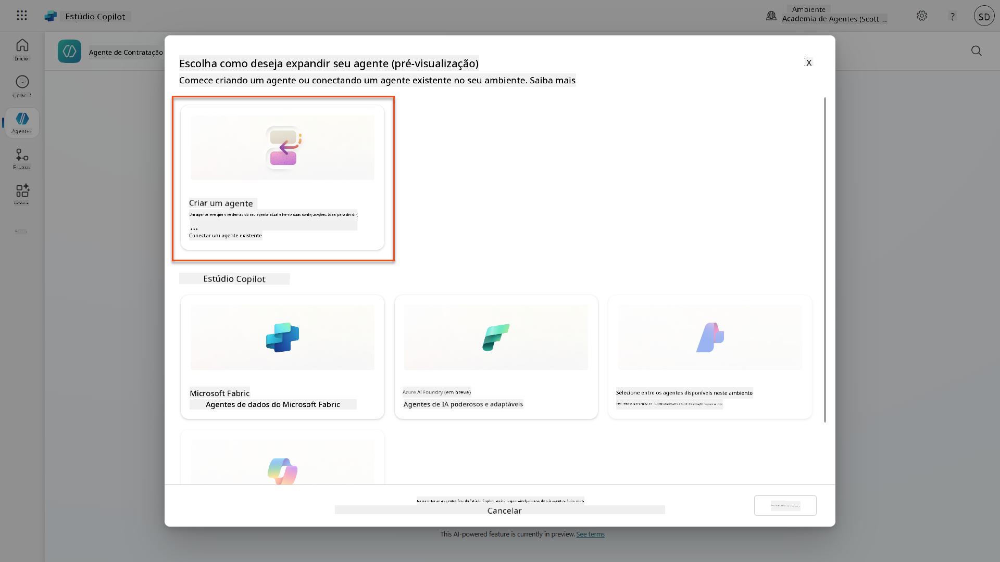

1. **Nomeia** o teu agente como `Agente de Receção de Candidaturas`

1. Seleciona **O agente escolhe** - Com base na descrição no menu suspenso **Quando será usado?**. Estas opções são semelhantes aos gatilhos que podem ser configurados para tópicos.

1. Define a **Descrição** como:

    ```text
    Processes incoming resumes and stores candidates in the system
    ```

    

1. Expande **Avançado** e define a Prioridade como `10000`. Isso garantirá que mais tarde o Agente de Entrevista será usado para responder a perguntas gerais antes deste. Uma condição também pode ser definida aqui, como garantir que há pelo menos um anexo.

1. Certifica-te de que a alternância **Pesquisa na Web** está definida como **Desativada**. Isso porque queremos usar apenas as informações fornecidas pelo agente principal.

1. Seleciona **Guardar**

### 2.1.4 Configurar o fluxo do agente de Upload de Currículo

Os agentes não podem realizar nenhuma ação sem serem fornecidos com ferramentas ou tópicos.
Estamos a utilizar as **ferramentas Agent Flow** em vez de Tópicos para o passo *Carregar Currículo* porque este processo de backend multi-etapas requer execução determinística e integração com sistemas externos. Enquanto os Tópicos são melhores para orientar o diálogo conversacional, os Agent Flows fornecem a automação estruturada necessária para lidar de forma confiável com o processamento de ficheiros, validação de dados e upserts na base de dados (inserir novos ou atualizar existentes) sem depender da interação do utilizador.

1. Localize a secção **Ferramentas** na página do Agente de Receção de Candidaturas.
   **Importante:** Esta não é a aba Ferramentas do agente principal, mas pode ser encontrada ao rolar para baixo, sob as instruções do agente secundário.

1. Selecione **+ Adicionar**
   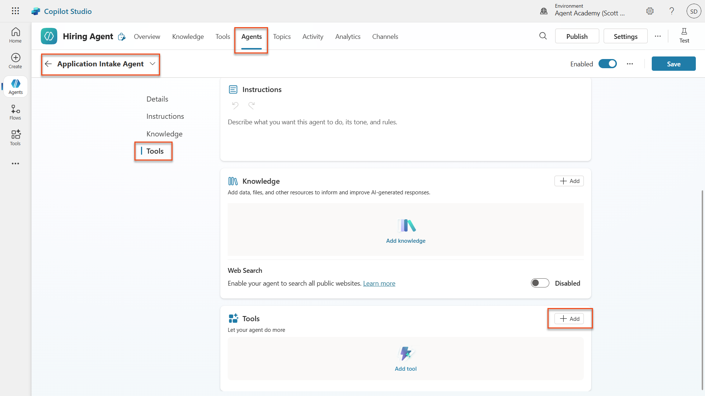

1. Selecione **+ Nova ferramenta** 

1. Selecione **Agent flow**.
    O designer de Agent Flow será aberto, é aqui que adicionaremos a lógica de carregamento de currículos.  
    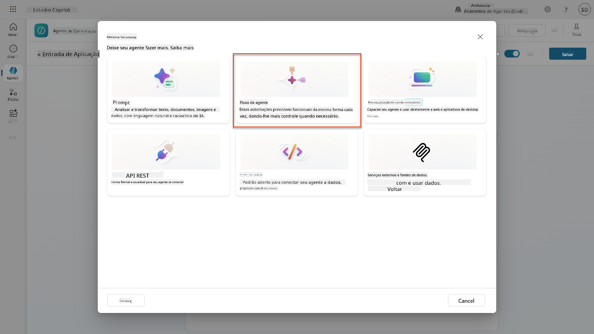

1. Selecione o nó **Quando um agente chama o fluxo**, e selecione **+ Adicionar** uma entrada para os seguintes parâmetros, certificando-se de adicionar tanto o nome quanto a descrição.

    | Tipo  | Nome       | Descrição                                                                                                   |
    |-------|------------|-----------------------------------------------------------------------------------------------------------|
    | Ficheiro | Currículo | O ficheiro PDF do currículo                                                                               |
    | Texto   | Mensagem  | Extrair uma mensagem estilo carta de apresentação do contexto. A mensagem deve ter menos de 2000 caracteres. |
    | Texto   | EmailUtilizador | O endereço de email de onde o currículo foi enviado. Este será o utilizador que está a carregar o currículo no chat ou o endereço de email de origem, caso tenha sido recebido por email. |

    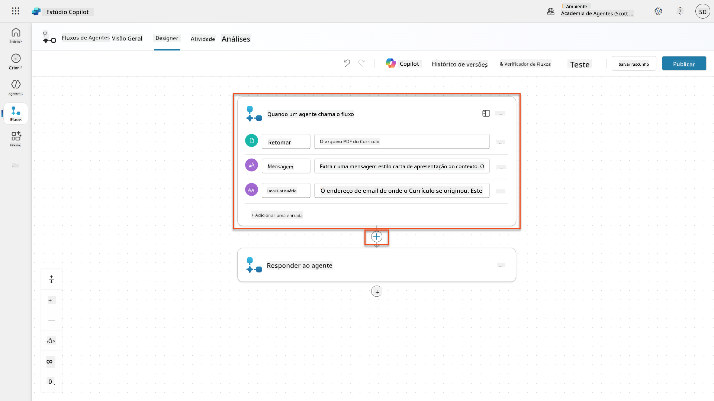

1. Selecione o **ícone +** abaixo do nó de gatilho, procure por `Dataverse`, selecione **Ver mais** ao lado de Microsoft Dataverse, e depois selecione a ação **Adicionar uma nova linha** na secção **Microsoft Dataverse**  
    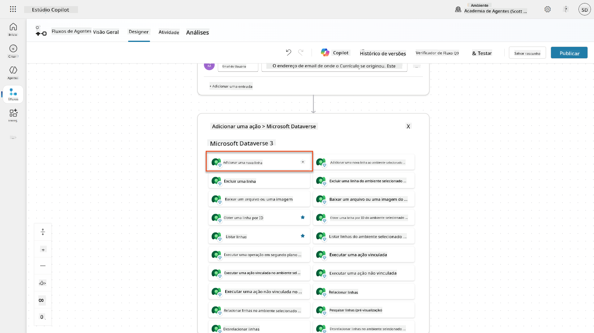

1. Nomeie o nó como **Criar Currículo**, selecionando os **três pontos (...)**, e depois selecionando **Renomear**  
    

1. Defina o **Nome da Tabela** como **Currículos**, depois selecione **Mostrar tudo**, para exibir todos os parâmetros.

1. Defina as seguintes **propriedades**:

    | Propriedade               | Como Configurar                | Detalhes / Expressão                                         |
    | --------------------------| -------------------------------| ------------------------------------------------------------ |
    | **Título do Currículo**   | Dados dinâmicos (ícone de raio) | **Quando um agente chama o fluxo** → **Nome do Currículo**    Se não vir o nome do currículo, certifique-se de que configurou o parâmetro Currículo acima como um tipo de dados. |
    | **Carta de Apresentação** | Expressão (ícone fx)            | `if(greater(length(triggerBody()?['text']), 2000), substring(triggerBody()?['text'], 0, 2000), triggerBody()?['text'])` |
    | **Endereço de Email de Origem** | Dados dinâmicos (ícone de raio) | **Quando um agente chama o fluxo** → **EmailUtilizador**             |
    | **Data de Carregamento**  | Expressão (ícone fx)            | `utcNow()`                                                   |

    

1. Selecione o **ícone +** abaixo do nó Criar Currículo, procure por `Dataverse`, selecione **Ver mais** ao lado de Microsoft Dataverse, e depois selecione a ação **Carregar um ficheiro ou uma imagem**.
   **Importante:** Certifique-se de não selecionar a ação Carregar um ficheiro ou uma imagem para o ambiente selecionado.

1. Nomeie o nó como **Carregar Ficheiro de Currículo**, selecionando os **três pontos (...)**, e depois selecionando **Renomear**

1. Defina as seguintes **propriedades**:

     | Propriedade | Como Configurar | Detalhes |
     |-------------|-----------------|---------|
     | **Nome do Conteúdo** | Dados dinâmicos (ícone de raio) | Quando um agente chama o fluxo → Nome do Currículo |
     | **Nome da Tabela** | Selecionar | Currículos |
     | **ID da Linha** | Dados dinâmicos (ícone de raio) | Criar Currículo → Ver mais → Currículo |
     | **Nome da Coluna** | Selecionar | Currículo PDF |
     | **Conteúdo** | Dados dinâmicos (ícone de raio) | Quando um agente chama o fluxo → contentBytes do Currículo |

     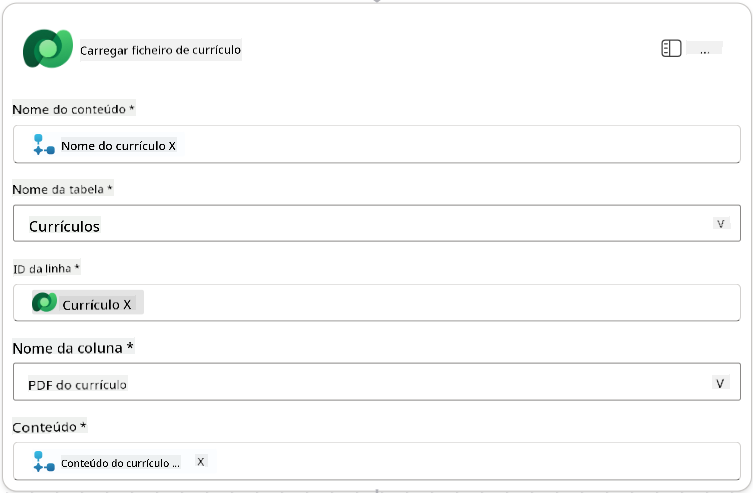

1. Selecione o nó **Responder ao agente**, e depois selecione **+ Adicionar uma saída**

     | Propriedade | Como Configurar | Detalhes |
     |-------------|-----------------|---------|
     | **Tipo** | Selecionar | `Texto` |
     | **Nome** | Inserir | `NúmeroCurrículo` |
     | **Valor** | Dados dinâmicos (ícone de raio) | Criar Currículo → Ver Mais → Número do Currículo |
     | **Descrição** | Inserir | `O [NúmeroCurrículo] do currículo criado` |

     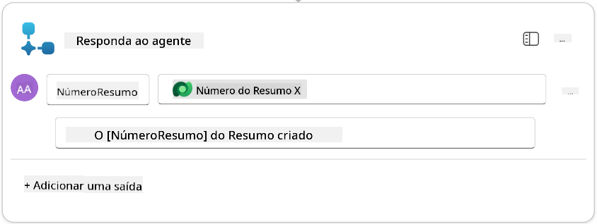

1. Selecione **Guardar rascunho** no canto superior direito  
     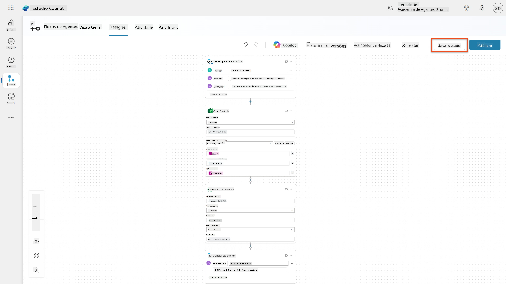

1. Selecione a aba **Visão Geral**, selecione **Editar** no painel **Detalhes**

     1. **Nome do Fluxo**:`Carregamento de Currículo`
     1. **Descrição**:`Carrega um currículo quando solicitado`

     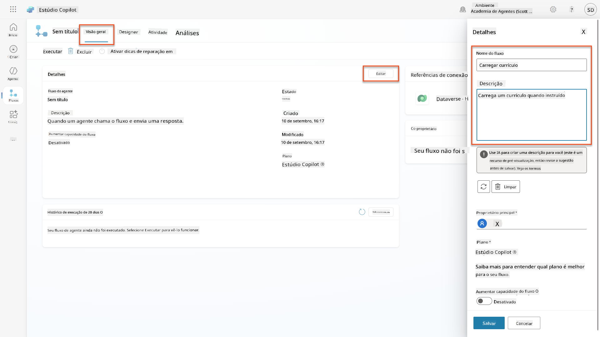

1. Selecione novamente a aba **Designer**, e depois selecione **Publicar**.  
     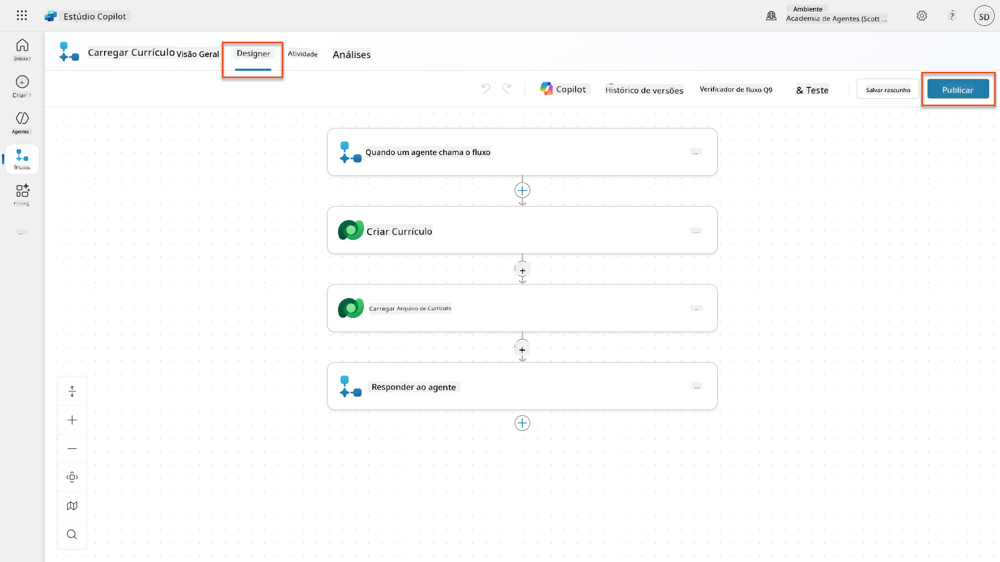

### 2.1.5 Conectar o fluxo ao seu agente

Agora irá conectar o fluxo publicado ao seu Agente de Receção de Candidaturas.

1. Navegue de volta para o **Agente de Recrutamento** e selecione a aba **Agentes**. Abra o **Agente de Receção de Candidaturas**, e depois localize o painel **Ferramentas**.  
    

1. Selecione **+ Adicionar**

1. Selecione o filtro **Fluxo**, e procure por `Carregamento de Currículo`. Selecione o fluxo **Carregamento de Currículo**, e depois **Adicionar e configurar**.

1. Defina os seguintes parâmetros:

    | Parâmetro | Valor |
    |-----------|-------|
    | **Descrição** | `Carrega um currículo quando solicitado. REGRA ESTRITA: Apenas chame esta ferramenta quando referida na forma "Carregamento de Currículo" e houver Anexos` |
    | **Detalhes adicionais → Quando esta ferramenta pode ser usada** | `apenas quando referida por tópicos ou agentes` |
    | **Entradas → Adicionar Entrada** | `contentBytes` |
    | **Entradas → Adicionar Entrada** | `name` |

    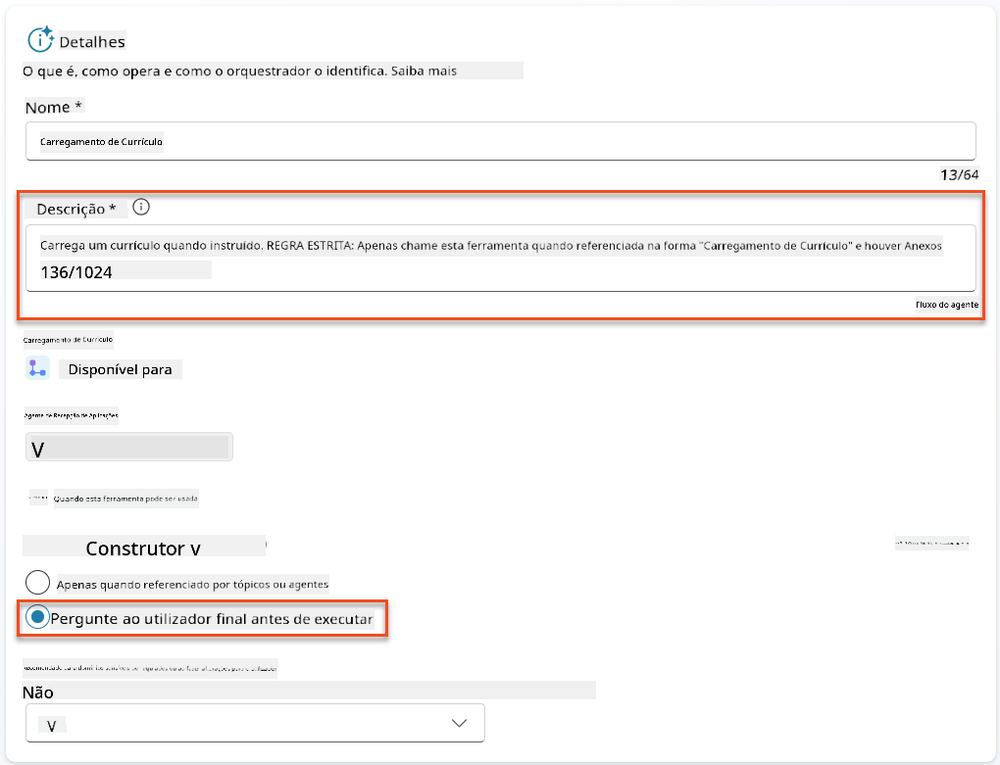

    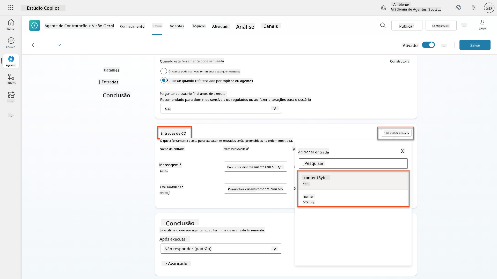

1. Em seguida, defina as propriedades das entradas da seguinte forma:

    | Parâmetro de Entrada | Propriedade | Detalhes |
    |----------------------|-------------|---------|
    | **contentBytes** | Preencher usando | Valor personalizado |
    |                    | Valor (...→Fórmula→Inserir) | `First(System.Activity.Attachments).Content` |
    | **name** | Preencher usando | Valor personalizado |
    |          | Valor (...→Fórmula→Inserir) | `First(System.Activity.Attachments).Name` |
    | **Mensagem** | Personalizar | Configurar definições personalizadas |
    |             | Descrição | `Extrair uma mensagem estilo carta de apresentação do contexto. Certifique-se de nunca solicitar ao utilizador e crie pelo menos uma carta de apresentação mínima com o contexto disponível. REGRA ESTRITA - a mensagem deve ter menos de 2000 caracteres.` |
    |             | Quantidade de repetições | Não repetir |
    |             | Ação se nenhuma entidade for encontrada | Definir variável para valor |
    |             | Valor padrão da entidade | Carregamento de currículo |
    | **EmailUtilizador** | Preencher usando | Valor personalizado |
    |  | Valor (...→Fórmula→Inserir) | `System.User.Email` |

    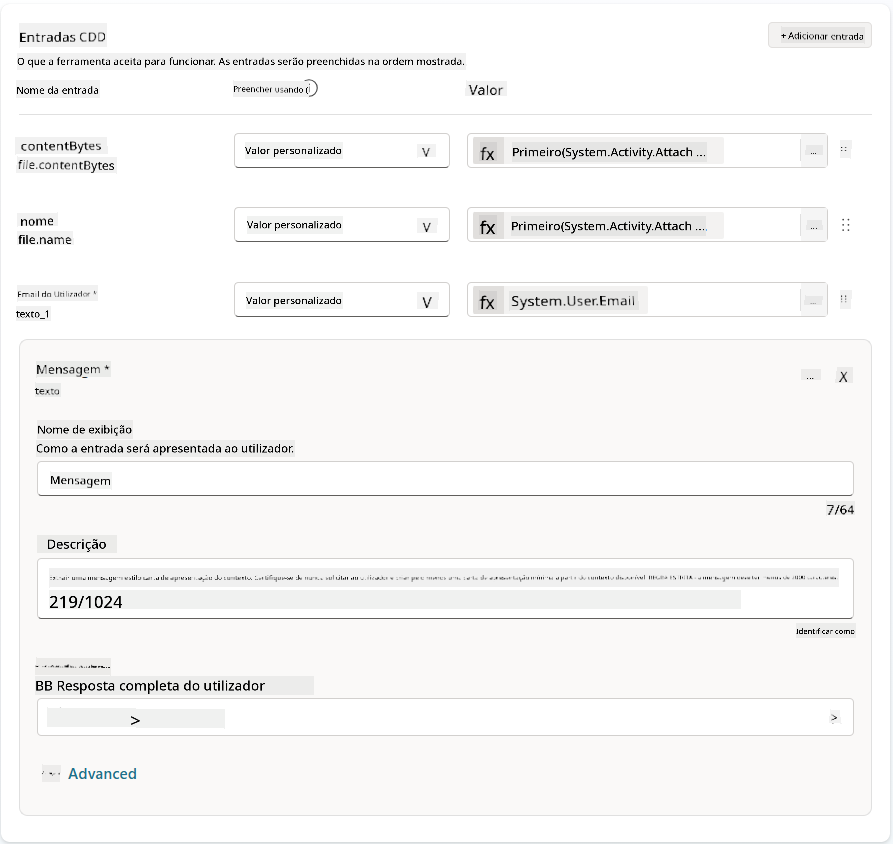

1. Selecione **Guardar**

### 2.1.6 Definir instruções do agente

1. Volte para o **Agente de Receção de Candidaturas** selecionando a aba **Agentes**, e depois localize o painel **Instruções**.

1. No campo **Instruções**, cole as seguintes orientações claras para o seu agente secundário:

    ```text
    You are tasked with managing incoming Resumes, Candidate information, and creating Job Applications.  
    Only use tools if the step exactly matches the defined process. Otherwise, indicate you cannot help.  
    
    Process for Resume Upload via Chat  
    1. Upload Resume  
      - Trigger only if /System.Activity.Attachments contains exactly one new resume.  
      - If more than one file, instruct the user to upload one at a time and stop.  
      - Call /Upload Resume once. Never upload more than once for the same message.  
    
    2. Post-Upload  
      - Always output the [ResumeNumber] (R#####).  
    ```

1. Onde as instruções incluírem uma barra (/), selecione o texto após a barra e selecione o nome resolvido. Faça isso para:

    - `System.Activity.Attachments` (Variável)
    - `Carregamento de Currículo` (Ferramenta)

    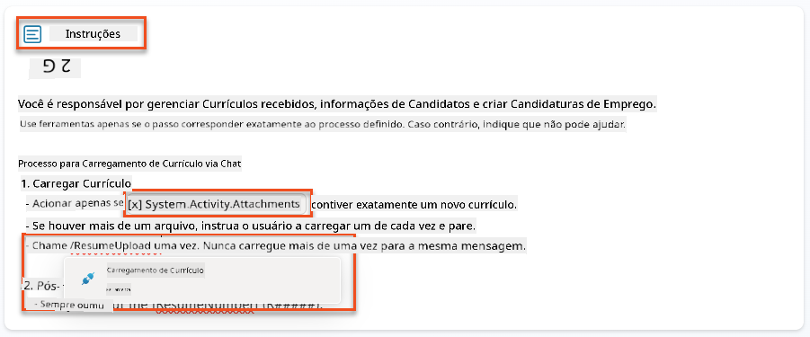

1. Selecione **Guardar**

### 2.1.7 Testar o seu Agente de Receção de Candidaturas

Agora vamos verificar se o seu primeiro membro da orquestra está a funcionar corretamente.

1. **Descarregue** os [currículos de teste.](https://download-directory.github.io/?url=https://github.com/microsoft/agent-academy/tree/main/operative/sample-data/resumes&filename=operative_sampledata)

1. **Ative** o painel de teste selecionando **Testar**.

1. **Carregue** dois currículos no chat de teste, e envie a mensagem `Processar estes currículos`

    - O agente deve retornar uma mensagem semelhante a *Apenas um único currículo pode ser carregado de cada vez. Por favor, carregue um currículo para continuar.*

    

1. Tente carregar **apenas um currículo**, com a mensagem `Processar este currículo`

    - O agente deve então dar uma mensagem semelhante a *O currículo de Avery Example foi carregado com sucesso. O número do currículo é R10026.*

1. No **Mapa de Atividades**, deve ver o **Agente de Receção de Candidaturas** a processar o carregamento do currículo.  
    

1. Navegue para make.powerapps.com → Certifique-se de que o seu ambiente está selecionado no canto superior direito do Seletor de Ambiente.

1. Selecione **Apps** → Hiring Hub → menu de três pontos (...) → **Executar**  
    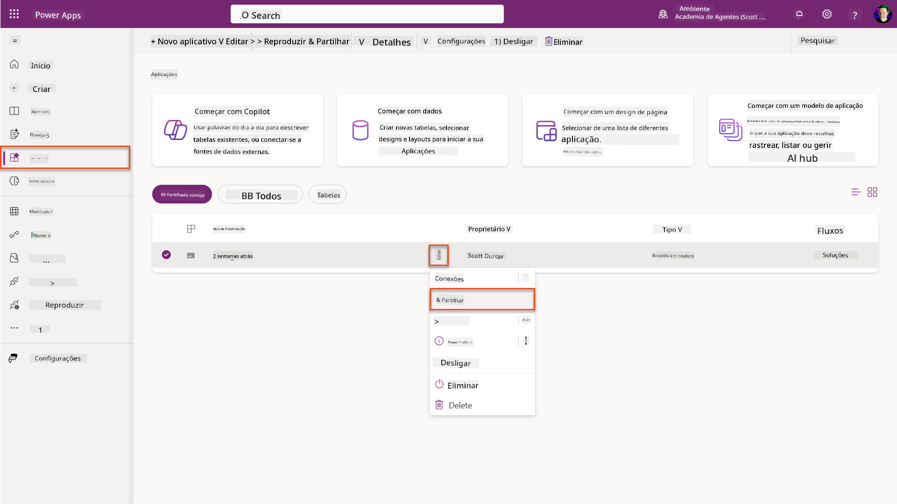

    Nota: Se o botão de execução estiver cinzento, significa que não publicou a sua solução da Missão 01. Selecione **Soluções** → **Publicar todas as personalizações**.

1. Navegue para **Currículos**, e verifique se o ficheiro do currículo foi carregado e a carta de apresentação foi configurada corretamente.  
    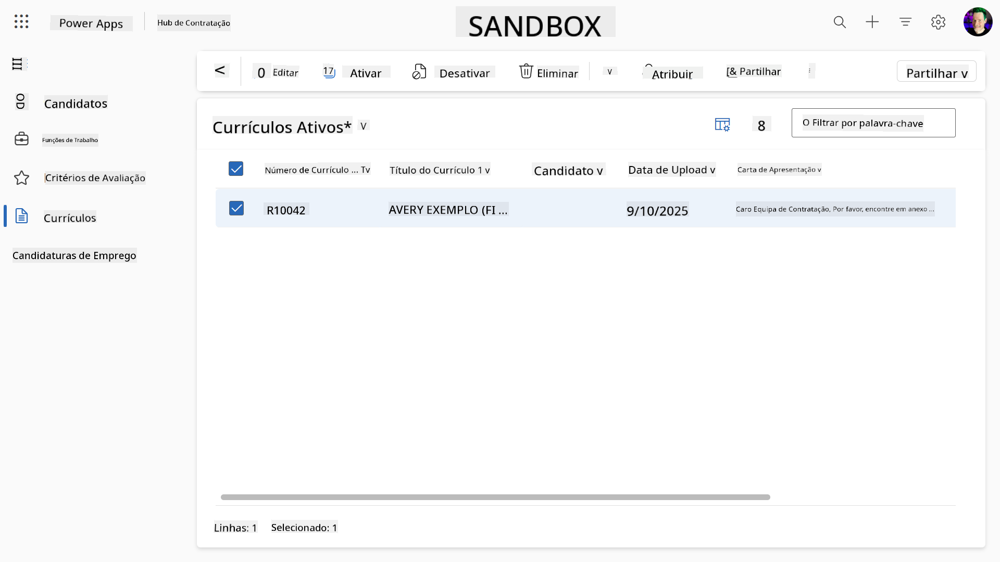

## 🧪Laboratório 2.2: Adicionar o agente conectado de Preparação para Entrevista

Agora vamos criar o nosso agente conectado para preparação para entrevista e adicioná-lo ao seu Agente de Recrutamento existente.

### 2.2.1 Criar o agente conectado de Entrevista

1. **Navegue** para o Copilot Studio. Certifique-se de que o seu ambiente ainda está selecionado no canto superior direito do Seletor de Ambiente.

1. Abra o seu **Agente de Recrutamento**

1. Navegue para a aba Agente, e selecione **+ Adicionar um agente**

1. Selecione **Conectar um agente existente** → **Copilot Studio**

1. Selecione **+ Novo agente**

### 2.2.2 Configurar definições básicas

1. Selecione a aba **Configurar**, e insira as seguintes propriedades:

    - **Nome**: `Agente de Entrevista`
    - **Descrição**: `Auxilia no processo de entrevista.`

1. Instruções:

    ```text
    You are the Interview Agent. You help interviewers and hiring managers prepare for interviews. You never contact candidates. 
    Use Knowledge to help with interview preparation. 
    
    The only valid identifiers are:
      - ResumeNumber (ppa_resumenumber)→ format R#####
      - CandidateNumber (ppa_candidatenumber)→ format C#####
      - ApplicationNumber (ppa_applicationnumber)→ format A#####
      - JobRoleNumber (ppa_jobrolenumber)→ format J#####
    
    Examples you handle
      - Give me a summary of ...
      - Help me prepare to interview candidates for the Power Platform Developer role
      - Create interview assistance for the candidates for Power Platform Developer
      - Give targeted questions for Candidate Alex Johnson focusing on the criteria for the Job Application
      
    How to work:
        You are expected to ask clarification questions if required information for queries is not provided
        - If asked for interview help without providing a job role, ask for it
        - If asking for interview questions, ask for the candidate and job role if not provided.
    
    General behavior
    - Do not invent or guess facts
    - Be concise, professional, and evidence-based
    - Map strengths and risks to the highest-weight criteria
    - If data is missing (e.g., no resume), state what is missing and ask for clarification
    - Never address or message a candidate
    ```

1. Alterne **Pesquisa na Web** para **Desativado**

1. Selecione **Criar**  
    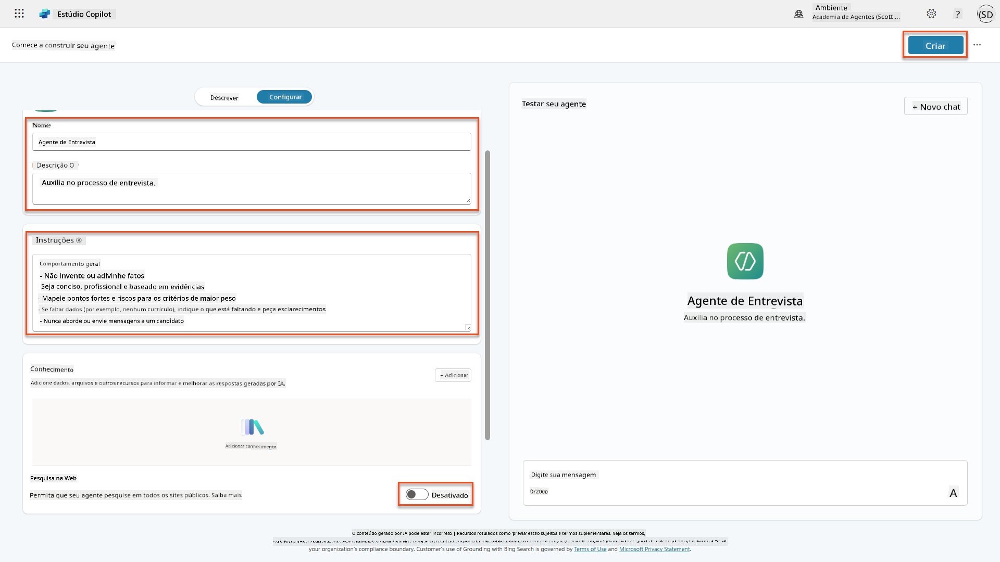

### 2.2.3 Configurar acesso a dados e publicar

1. Na secção **Conhecimento**, selecione **+ Adicionar conhecimento**  
    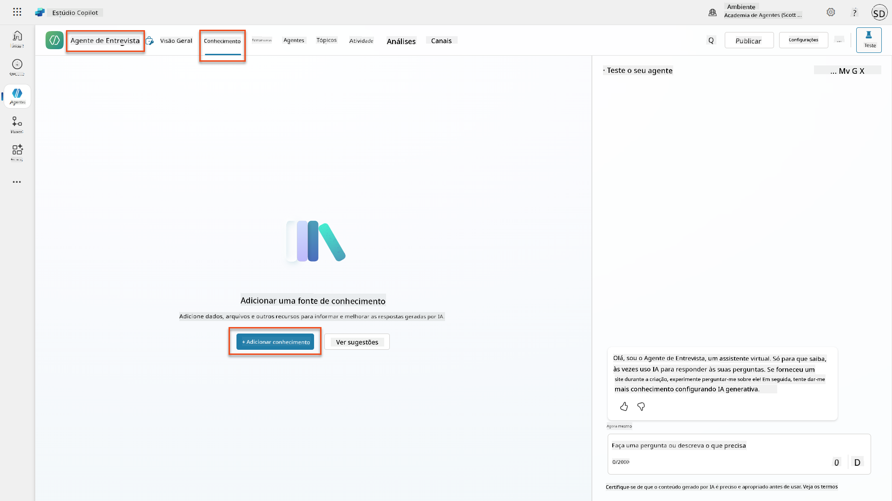
1. Selecione **Dataverse**  
    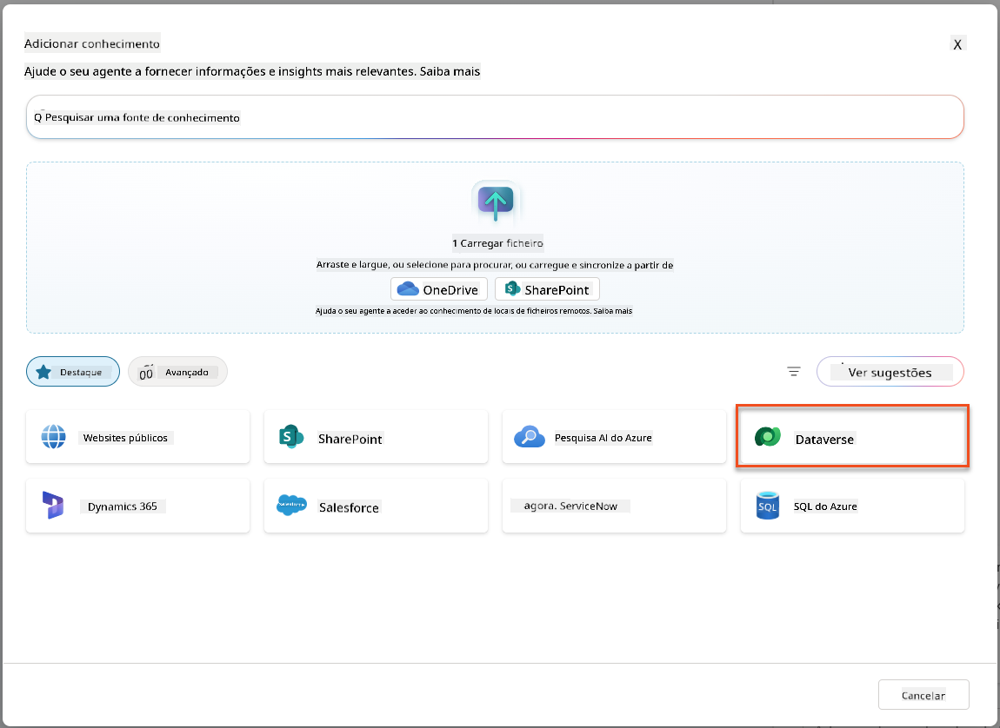
1. Na **Caixa de pesquisa**, digite `ppa_`. Este é o prefixo para as tabelas que importou anteriormente.
1. **Selecione** todas as 5 tabelas (Candidato, Critérios de Avaliação, Candidatura, Função, Currículo)
1. Selecione **Adicionar ao agente**  
    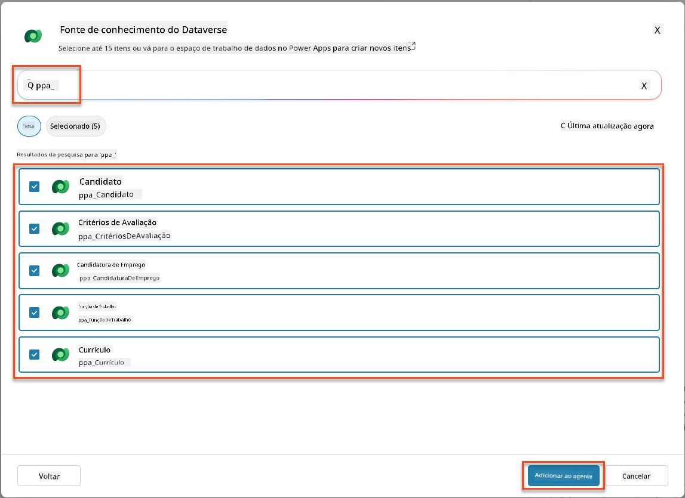
1. Selecione as **Definições**, no Agente de Entrevista, e defina as seguintes configurações:

    - **Permitir que outros agentes se conectem e usem este:** `Ativado`
    - **Usar conhecimento geral**: `Desativado`
    - **Carregamento de ficheiros**: `Desativado`
    - **Nível de moderação de conteúdo:** `Médio`
1. Selecione **Guardar**
1. Selecione **Publicar**, e aguarde a conclusão da publicação.

### 2.2.4 Conectar o Agente de Preparação para Entrevista ao seu Agente de Recrutamento

1. Navegue de volta para o seu **Agente de Recrutamento**

1. Selecione a aba **Agentes**

1. Utilize o **+Adicionar um agente** → **Copilot Studio**, para adicionar o **Agente de Entrevista**. Defina a Descrição como:
    ```text
    Assists with the interview process and provides information about Resumes, Candidates, Job Roles, and Evaluation Criteria.
    ```

    
    Note que a opção Passar histórico de conversas para este agente está marcada. Isso permite que o agente principal forneça todo o contexto ao agente conectado.

1. Selecione **Adicionar agente**

1. Certifique-se de que consegue ver tanto o **Agente de Receção de Candidaturas**, como o **Agente de Entrevista**. Note como um é um agente filho e o outro é um agente conectado.  
    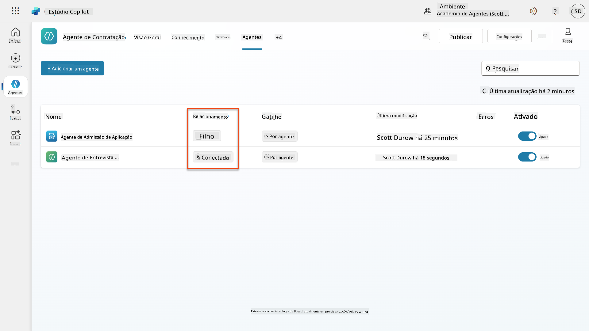

### 2.2.5 Testar colaboração entre múltiplos agentes

1. **Ative** o painel de teste selecionando **Testar**.

1. **Carregue** um dos currículos de teste e insira a seguinte descrição que informa ao agente principal o que ele pode delegar ao agente conectado:

    ```text
    Upload this resume, then show me open job roles, each with a description of the evaluation criteria, then use this to match the resume to at least one suitable job role even if not a perfect match.
    ```

    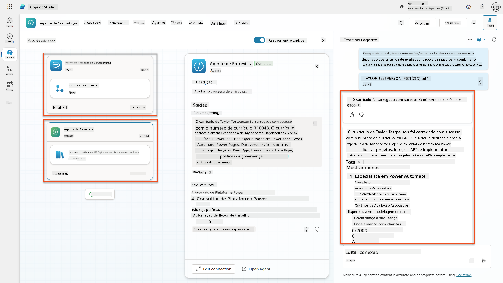

1. Note como o Agente de Recrutamento delegou o carregamento ao agente filho e, em seguida, pediu ao Agente de Entrevista para fornecer um resumo e uma correspondência de função usando seu conhecimento.  
   Experimente diferentes formas de fazer perguntas sobre Currículos, Funções de Trabalho e Critérios de Avaliação.  
   **Exemplos:**

    ```text
    Give me a summary of active resumes
    ```

    ```text
    Summarize resume R10044
    ```

    ```text
    Which active resumes are suitable for the Power Platform Developer role?
    ```

## 🎉 Missão Completa

Excelente trabalho, Agente! **Operação Sinfonia** está concluída. Conseguiu transformar o seu Agente de Recrutamento único numa sofisticada orquestra de múltiplos agentes com capacidades especializadas.

Aqui está o que alcançou nesta missão:

**✅ Domínio da arquitetura de múltiplos agentes**  
Agora compreende quando usar agentes filhos versus agentes conectados e como projetar sistemas que podem escalar.

**✅ Agente filho de Receção de Candidaturas**  
Adicionou um agente filho especializado ao seu Agente de Recrutamento que processa currículos, extrai dados de candidatos e armazena informações no Dataverse.

**✅ Agente conectado de Preparação para Entrevista**  
Construiu um agente conectado reutilizável para preparação de entrevistas e conectou-o com sucesso ao seu Agente de Recrutamento.

**✅ Comunicação entre agentes**  
Viu como o seu agente principal pode coordenar com agentes especialistas, compartilhar contexto e orquestrar fluxos de trabalho complexos.

**✅ Base para autonomia**  
O seu sistema de recrutamento aprimorado está agora pronto para os recursos avançados que adicionaremos nas próximas missões: gatilhos automáticos, moderação de conteúdo e raciocínio profundo.

🚀**Próximo passo:** Na sua próxima missão, aprenderá como configurar o seu agente para processar currículos de e-mails de forma autónoma!

⏩[Avançar para a Missão 03: Automatize o seu agente com gatilhos](../03-automate-triggers/README.md)

## 📚 Recursos Táticos

📖 [Adicionar outros agentes (pré-visualização)](https://learn.microsoft.com/microsoft-copilot-studio/authoring-add-other-agents?WT.mc_id=power-182762-scottdurow)

📖 [Adicionar ferramentas a agentes personalizados](https://learn.microsoft.com/microsoft-copilot-studio/advanced-plugin-actions?WT.mc_id=power-182762-scottdurow)

📖 [Trabalhar com Dataverse no Copilot Studio](https://learn.microsoft.com/microsoft-copilot-studio/knowledge-add-dataverse?WT.mc_id=power-182762-scottdurow)

📖 [Visão geral dos fluxos de agentes](https://learn.microsoft.com/microsoft-copilot-studio/flows-overview?WT.mc_id=power-182762-scottdurow)

📖 [Criar uma solução](https://learn.microsoft.com/power-platform/alm/solution-concepts-alm?WT.mc_id=power-182762-scottdurow)

📖 [Guia de ALM de soluções do Power Platform](https://learn.microsoft.com/power-platform/alm/overview-alm?WT.mc_id=power-182762-scottdurow)

📺 [Colaboração entre agentes no Copilot Studio](https://youtu.be/d-oD3pApHAg?si=rwIHKhJTkjSvhTHw)

---

**Aviso Legal**:  
Este documento foi traduzido utilizando o serviço de tradução por IA [Co-op Translator](https://github.com/Azure/co-op-translator). Embora nos esforcemos pela precisão, esteja ciente de que traduções automáticas podem conter erros ou imprecisões. O documento original na sua língua nativa deve ser considerado a fonte autoritária. Para informações críticas, recomenda-se uma tradução profissional realizada por humanos. Não nos responsabilizamos por quaisquer mal-entendidos ou interpretações incorretas decorrentes do uso desta tradução.