<!--
CO_OP_TRANSLATOR_METADATA:
{
  "original_hash": "dcbcd9396b076da0a0f5d389e9ec1b12",
  "translation_date": "2025-10-18T02:57:53+00:00",
  "source_file": "docs/recruit/08-add-adaptive-card/README.md",
  "language_code": "pt"
}
-->
# 🚨 Missão 08: Melhorar interações de utilizadores em Tópicos com Cartões Adaptativos

## 🕵️‍♂️ NOME DE CÓDIGO: `OPERAÇÃO MELHORIA DE INTERFACE`

> **⏱️ Janela de Tempo da Operação:** `~45 minutos`

🎥 **Assista ao Tutorial**

[](https://www.youtube.com/watch?v=RhIlzYHPCXo "Assista ao tutorial no YouTube")

## 🎯 Resumo da Missão

Agentes, a vossa missão é infiltrar-se na experiência de utilizador estática e substituí-la por Cartões Adaptativos ricos, dinâmicos e acionáveis. Irão implementar cargas JSON e fórmulas Power Fx para transformar conversas no Copilot Studio de perguntas e respostas básicas em interações totalmente interativas. O vosso objetivo é recolher informações dos utilizadores, apresentar dados de forma atrativa e direcionar conversas com precisão e estilo. Falhem em adaptar-se e os vossos utilizadores podem migrar para interfaces menos inteligentes.

## 🔎 Objetivos

Nesta missão, irão aprender:

1. Compreender o que são Cartões Adaptativos e como melhoram as interações dos utilizadores no Copilot Studio.
1. Aprender a criar cartões interativos usando JSON e fórmulas Power Fx para conteúdo dinâmico.
1. Explorar o Designer de Cartões Adaptativos e os seus principais componentes para criação visual de cartões.
1. Criar formulários ricos e interativos e experiências de recolha de dados dentro dos tópicos de agentes.
1. Implementar as melhores práticas para projetar cartões adaptativos responsivos e fáceis de usar.

## 🤔 O que é um Cartão Adaptativo?

Um **Cartão Adaptativo** é uma forma de criar elementos de interface de utilizador interativos e visualmente ricos que podem ser incorporados em aplicações como Microsoft Teams, Microsoft Outlook ou agentes. É um objeto JSON estruturado que define o layout e o conteúdo de um cartão:

- Quais elementos aparecem no cartão - texto, imagens, botões.
- Como esses elementos estão organizados.
- Quais ações os utilizadores podem realizar, como enviar um formulário ou abrir um link.

    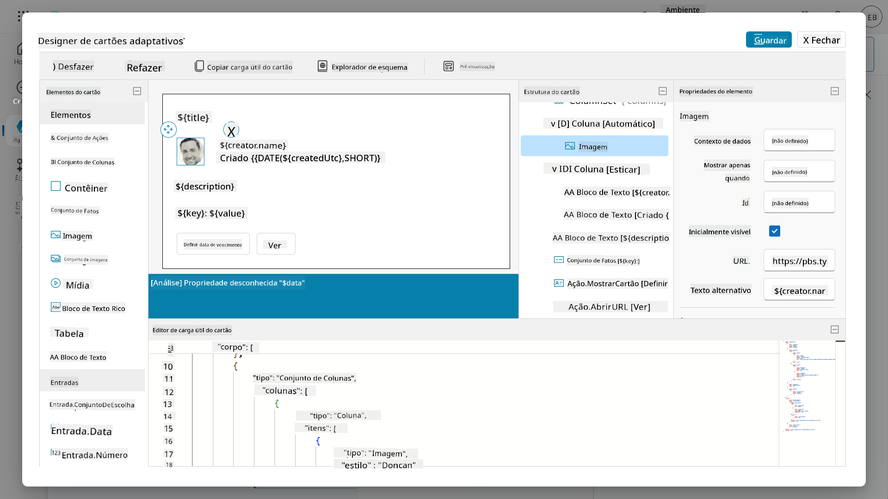

### Por que os Cartões Adaptativos são importantes no Copilot Studio

Imagine que está a criar um agente que pergunta aos utilizadores o nome, email ou feedback. Se usar apenas texto simples, a conversa pode parecer aborrecida ou difícil de seguir. É aí que entram os Cartões Adaptativos!

1. **Torna as conversas interativas** - em vez de enviar texto como mensagens para o utilizador, pode mostrar botões, formulários, imagens e mais.
    - Exemplo: um cartão pode pedir ao utilizador para preencher o nome e email num formulário limpo.

1. **Ficam bem em qualquer lugar** - os Cartões Adaptativos ajustam-se automaticamente ao estilo da aplicação onde estão, como o chat do Microsoft 365 Copilot ou Microsoft Teams. Não precisa preocupar-se com modo escuro, fontes ou layouts - eles adaptam-se.

1. **Fácil de construir com JSON** - define o cartão usando código JSON (pense numa _receita_ para a interface). O Copilot Studio ajuda a pré-visualizar o cartão antes de o adicionar ao tópico.

1. **Recolher e usar dados** - pode usar o cartão para fazer perguntas, recolher respostas e usar esses dados no fluxo da conversa.
    - Exemplo: Pedir o número de telefone de um utilizador e, em seguida, mostrar um cartão de confirmação com o número.

1. **Melhora a experiência do utilizador** - os cartões fazem o agente parecer mais interativo. É uma interface mais limpa, clicável e fácil de usar.

## 🐱 O _JSON_ é uma pessoa?

Pronunciado como "Jason", não é uma pessoa 😅

JSON, também conhecido como _JavaScript Object Notation_, é um formato leve usado para estruturar dados. É fácil de ler e escrever, e parece uma série de pares chave-valor dentro de chaves {}.

Esta é uma das opções para usar ao adicionar um cartão adaptativo ao seu tópico.

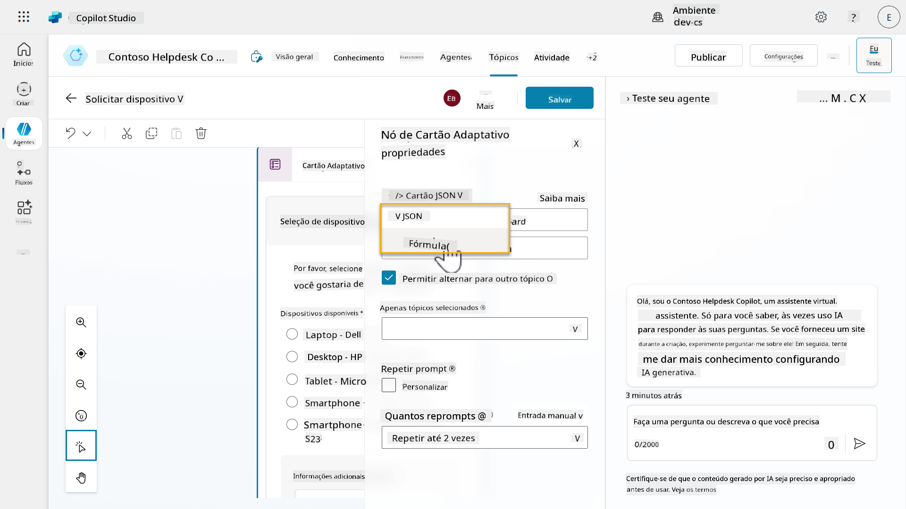

## 👀 Vejo outra opção para criar um cartão adaptativo usando _fórmula_

Lembra-se de como aprendemos sobre Power Fx em [Missão 07 - Usar Power Fx nos seus nós](../07-add-new-topic-with-trigger/README.md#what-power-fx-can-do-in-topics)? O mesmo pode ser aplicado em Cartões Adaptativos dentro do Copilot Studio.

Como um resumo,

!!! note
    Power Fx é uma linguagem de programação de baixo código usada para adicionar lógica e comportamento dinâmico ao seu agente. É a mesma linguagem usada no Microsoft Power Apps e foi projetada para ser simples e semelhante ao Excel, tornando-a fácil para desenvolvedores e não desenvolvedores.

### Como o Power Fx funciona em Cartões Adaptativos

Quando projeta um Cartão Adaptativo no Copilot Studio, pode usar fórmulas Power Fx para:

- Inserir valores dinamicamente, como nomes de utilizadores, datas ou status.
- Formatar texto ou números, como mostrar moeda ou arredondar números.
- Mostrar ou ocultar elementos com base em condições.
- Personalizar respostas com base na entrada do utilizador, variáveis, saídas de nós de conversação.

Por exemplo,

"`Olá`" & `System.User.DisplayName`

Esta fórmula combina a palavra "Olá" com o nome do utilizador dinamicamente.

### Por que é útil

1. **Personalização**

    Pode adaptar a mensagem para cada utilizador, tornando as interações mais naturais e relevantes.

1. **Conteúdo dinâmico**

    Os cartões podem exibir dados reais de variáveis e saídas de nós de conversação.

1. **Lógica inteligente**

    Pode controlar o que os utilizadores veem ou interagem com base em condições, melhorando a usabilidade e reduzindo erros.

1. **Fácil para quem não programa**

    Power Fx é uma linguagem de programação de baixo código. Como mencionado anteriormente, é legível, intuitiva e semelhante às fórmulas do Excel.

## 👷🏻‍♀️ Construindo com o Designer de Cartões Adaptativos

O **Designer de Cartões Adaptativos** é uma ferramenta visual que permite criar cartões de mensagens interativos usando elementos de arrastar e soltar, como texto, imagens, botões e entradas. O seu objetivo é ajudar a criar mensagens ricas e dinâmicas sem escrever código complexo, facilitando o design de interfaces amigáveis.

A ferramenta de design ajuda a construir o cartão visualmente, mas nos bastidores, está a gerar o objeto JSON para si. Também pode alternar para _fórmula_, o que permite usar expressões Power Fx no cartão para exibir dados de outras fontes.

## 🎨 Compreendendo o Designer de Cartões Adaptativos

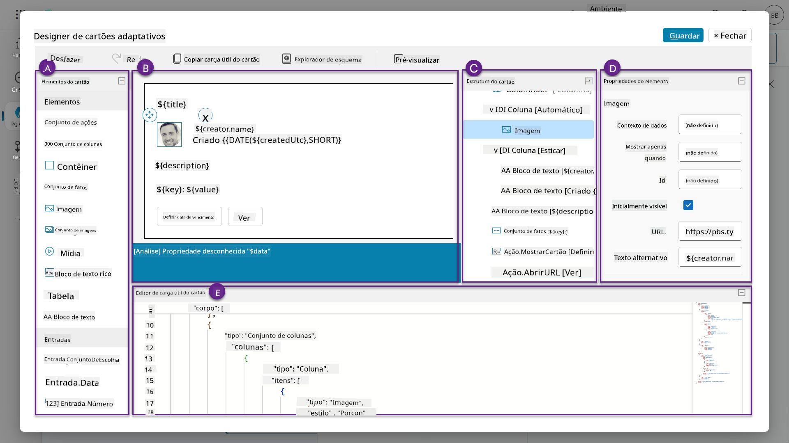

### A) Elementos do Cartão

Estes são os blocos de construção do seu cartão adaptativo. Pode arrastar e soltar elementos como os seguintes:

- **TextBlock** para exibir texto.
- **Image** para mostrar imagens.
- **FactSet** para pares chave-valor.
- **Campos de entrada** para exibir caixas de texto, seletores de data, alternadores.
- **Ações** para exibir botões como _Enviar_, _Abrir URL_ ou _Mostrar Cartão_.

Cada elemento tem o seu próprio propósito e pode ser estilizado ou configurado.

### B) Visualizador de Cartão

Esta é a área de **Pré-visualização**, onde pode ver como o seu cartão ficará em tempo real. À medida que adiciona ou edita elementos, o visualizador atualiza-se instantaneamente para refletir as alterações. Isso permite fazer atualizações iterativas e ver o resultado do design ao mesmo tempo.

### C) Estrutura do Cartão

Mostra a **hierarquia e layout** do seu cartão. Por exemplo:

- Um cartão pode começar com um **TextBlock** para o título.
- Depois, um **ColumnSet** com uma imagem de um lado e texto do outro.
- Seguido por um **FactSet** e alguns **Botões de Ação**.

Ajuda a entender como os elementos estão aninhados e organizados.

### D) Propriedades dos Elementos

Quando clica em qualquer elemento no cartão, este painel permite-lhe **personalizar as suas configurações**:

- Alterar tamanho, peso ou cor do texto.
- Definir URLs de imagem ou texto alternativo.
- Configurar opções de entrada, como texto de espaço reservado ou valores padrão.

É aqui que ajusta cada elemento.

### E) Editor de Carga do Cartão

Este é o **código JSON bruto** por trás do seu cartão. Utilizadores avançados podem editá-lo diretamente para:

- Usar recursos de modelagem.
- Copiar/colar definições de cartão.

Mesmo que seja novo no Designer de Cartões Adaptativos, é útil ver como o design visual se traduz em código.

!!! tip "Dica - Confira os exemplos de Cartões Adaptativos"

    1. Acesse [https://adaptivecards.microsoft.com/designer](https://adaptivecards.microsoft.com/designer).
    2. Selecione **Novo cartão** para ver uma lista de exemplos que pode escolher e modificar.
    3. Note que este designer é externo (baseado na web). Quando criar o seu cartão no Designer de Cartões Adaptativos baseado na web, copie o JSON do Editor de Carga do Cartão.
    4. Cole o JSON no seu cartão adaptativo no agente no Copilot Studio.

    

## 🌵 Casos de uso comuns

Os seguintes são casos de uso comuns para Cartões Adaptativos no Copilot Studio quando usados nos nós **Enviar uma mensagem** ou **Fazer uma pergunta**.

1. **Formulários e recolha de dados**

    Use cartões adaptativos para recolher entradas estruturadas dos utilizadores, como:

    - Pedidos de licença.
    - Formulários de feedback.
    - Informações de contacto.
    - Agendamento de compromissos.

1. **Exibição de informações dinâmicas**

    Mostre aos utilizadores dados personalizados ou em tempo real num formato limpo e legível, provenientes de fontes empresariais como ServiceNow, SAP, Dynamics 365, SharePoint, etc.

    - Resumos de pedidos.
    - Saldos de contas.
    - Status de tickets ou casos.
    - Próximos eventos ou prazos.

1. **Escolhas interativas**

    Permita que os utilizadores façam seleções diretamente na conversa:

    - Escolher de uma lista de opções, por exemplo, categorias de produtos, tópicos de suporte.
    - Confirmar ou cancelar uma ação.
    - Avaliar um serviço ou experiência.

1. **Ações desencadeadas**

    Inclua botões que desencadeiam passos adicionais na conversa internamente ou externamente.

    - "Enviar pedido".
    - "Ver detalhes".

## ⭐ Melhores práticas

Aqui estão algumas melhores práticas para criar Cartões Adaptativos para agentes no Copilot Studio.

1. **Mantenha simples e focado**

    - Projete cartões com um propósito claro, não os sobrecarregue com muitos elementos.
    - Use texto conciso e layouts intuitivos para orientar os utilizadores na interação.

1. **Seja intencional com entradas**

    - Inclua apenas os elementos de entrada necessários, como texto, escolhas de data, para evitar sobrecarregar os utilizadores.
    - Use etiquetas para tornar as entradas fáceis de entender.

1. **Estruture para legibilidade**

    - Use **TextBlocks** para títulos e instruções.
    - Agrupe elementos relacionados usando **Containers** ou **ColumnSets** para melhorar o fluxo visual.

1. **Torne os elementos de ação claros**

    - Use **Action.Submit** e/ou **Action.OpenUrl** com títulos de botões claros como "Enviar Pedido" ou "Ver Detalhes".
    - Evite rótulos vagos como "Clique aqui".

1. **Projete para adaptabilidade**

    - Assuma que o cartão pode ser visualizado em diferentes tamanhos de ecrã.
    - Evite larguras fixas e use layouts flexíveis como **ColumnSets** para maior responsividade.

1. **Use conteúdo dinâmico sempre que possível**

    - Vincule elementos do cartão a variáveis ou saídas de nós usando Power Fx para personalizar a experiência do utilizador.
    - Por exemplo, exiba o nome do utilizador ou o status atual dinamicamente.

## 🧪 Laboratório 08 - Adicionar cartões adaptativos e melhorar as capacidades do tópico

Agora vamos aprender como melhorar o nosso tópico com cartões adaptativos e usar funcionalidades avançadas de tópicos e nós.

- [8.1 Criar um novo tópico com um cartão adaptativo para o utilizador enviar o seu pedido](../../../../../docs/recruit/08-add-adaptive-card)
- [8.2 Atualizar as instruções do agente para invocar o tópico de Pedido de dispositivo](../../../../../docs/recruit/08-add-adaptive-card)

### ✨ Caso de uso

**Como** funcionário

**Quero** solicitar um dispositivo

**Para que** possa pedir um dispositivo da lista de dispositivos disponíveis

Vamos começar!

### Pré-requisitos

1. **Lista do SharePoint**

    Vamos usar a lista **Devices** do SharePoint de [Lição 00 - Configuração do Curso - Passo 3: Criar novo site do SharePoint](../00-course-setup/README.md#step-4-create-new-sharepoint-site).

    Se ainda não configurou a lista **Devices** do SharePoint, por favor, volte para [Lição 00 - Configuração do Curso - Passo 3: Criar novo site do SharePoint](../00-course-setup/README.md#step-4-create-new-sharepoint-site).

1. **Contoso Helpdesk Copilot**

    Vamos usar o mesmo agente criado anteriormente em [Lição 06 - Criar um agente personalizado usando linguagem natural com Copilot e baseando-o nos seus dados](../06-create-agent-from-conversation/README.md).

### 8.1 Criar um novo tópico com um cartão adaptativo para o utilizador enviar o seu pedido

Vamos criar um novo tópico que irá lidar com o pedido de dispositivo de um utilizador. Este novo tópico conterá um nó **Perguntar com cartão adaptativo** para permitir a interação do utilizador com o agente.

Vamos começar!

1. Selecione o separador **Tópicos**, depois selecione **+ Adicionar um tópico a partir do zero**.

    

1. Nomeie o tópico como o seguinte,

    ```text
    Request device
    ```

    Insira o seguinte como descrição para o gatilho.

    ```text
    This topic helps users request a device when they answer yes to the question that asks the user if they would like to request one of these devices.
    ```

    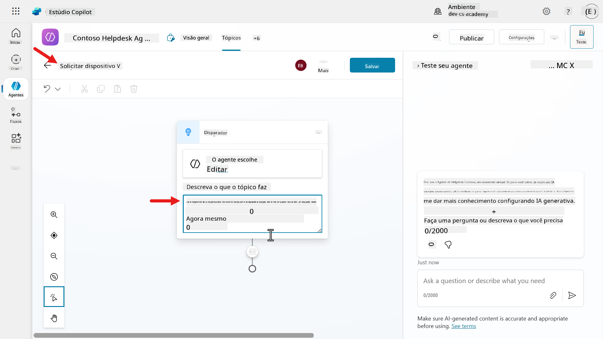
1. Em seguida, adicione um nó **Perguntar com cartão adaptativo**. Este nó exibirá um cartão interativo para o utilizador selecionar qual dispositivo gostaria de solicitar.

    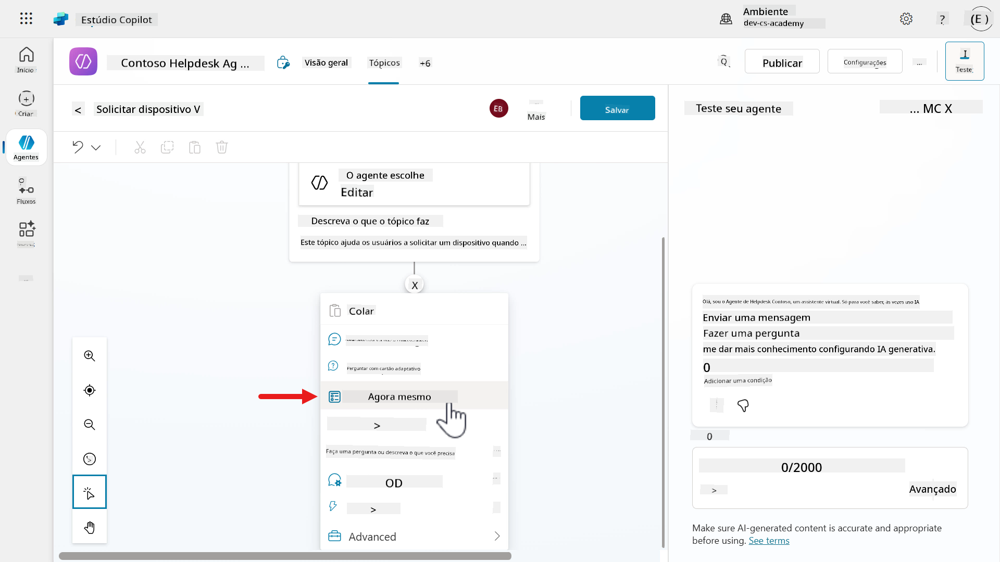

1. Selecione o nó e o painel **Propriedades do nó do cartão adaptativo** aparecerá. Vamos agora editar o JSON. Selecione **Editar cartão adaptativo**.

    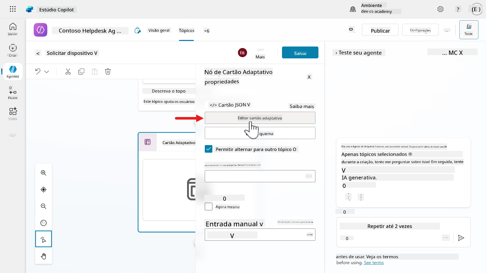

1. Este é o **Designer de Cartões Adaptativos**, onde pode criar o design do cartão e visualizar o design em tempo real.

    Experimente arrastar e soltar os elementos de cartão **TextBlock** e **FactSet** na área de criação, que é a área de visualização do cartão. Note como a estrutura do cartão e o editor de payload do cartão são atualizados à medida que os dois elementos são adicionados. Pode atualizar diretamente o editor de payload do cartão e o painel de propriedades dos elementos.

    

1. Selecione **Pré-visualizar** para ver o cartão em diferentes larguras.

    

1. A pré-visualização será carregada, onde poderá ver diferentes saídas do cartão por largura.

    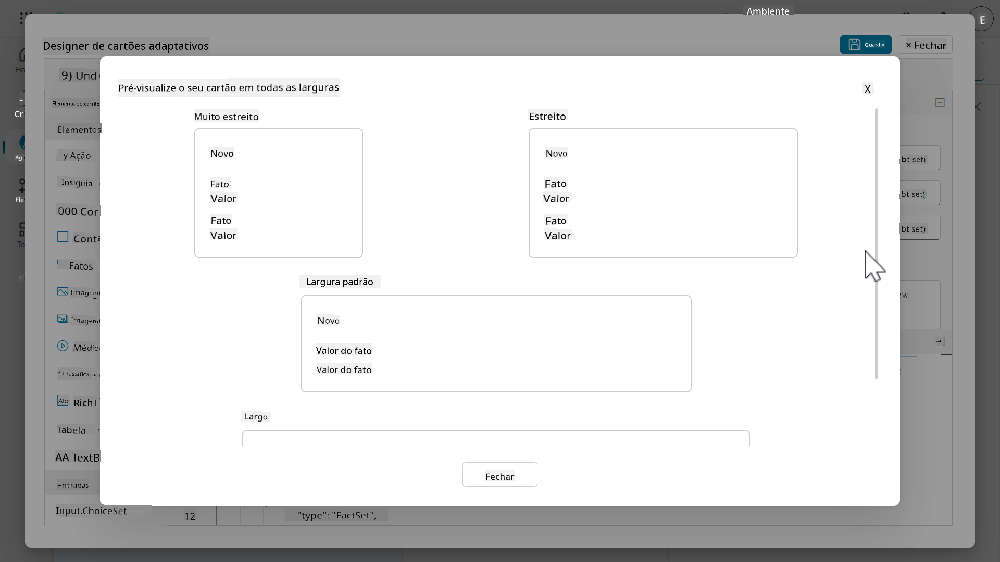

1. Saia da **Pré-visualização** selecionando o **ícone x** e selecione **Desfazer** no designer para remover os dois elementos de cartão adicionados anteriormente.

    

1. Clique no **editor de payload do cartão** e selecione todas as linhas usando o atalho de teclado do Windows _Ctrl + A_ ou o atalho de teclado do Mac _Command + A_, seguido de apagar as linhas. **Cole** o JSON do [ficheiro Request devices .JSON](../../../../../docs/recruit/08-add-adaptive-card/assets/8.1_RequestDevice.json).

    

1. Note como a **Pré-visualização do Cartão** agora inclui elementos que exibem algum texto e uma lista de dispositivos disponíveis.

    Este JSON é atualmente um modelo e uma pré-visualização do que usaremos como base para o nosso cartão, mas na forma de uma fórmula em vez de JSON, já que vamos referenciar a **variável global**, `Global.VarDevices.value`, que armazena a resposta da ação do conector **Obter itens** do SharePoint.

    Selecione **Guardar** e **Fechar** para sair do modal do designer de cartões adaptativos.

    

1. Feche o painel **Propriedades do nó do cartão adaptativo** selecionando o **ícone X**.

    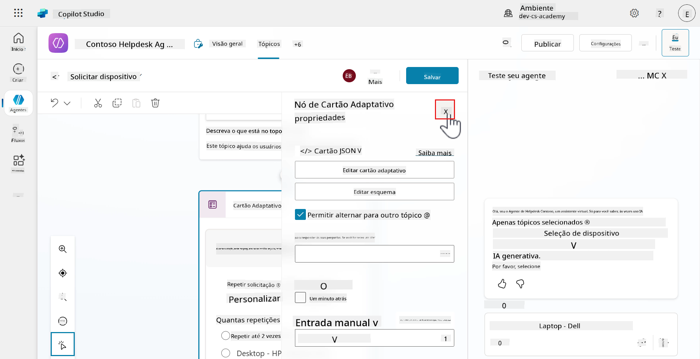

1. No painel de criação do tópico, verá o cartão adaptativo.

    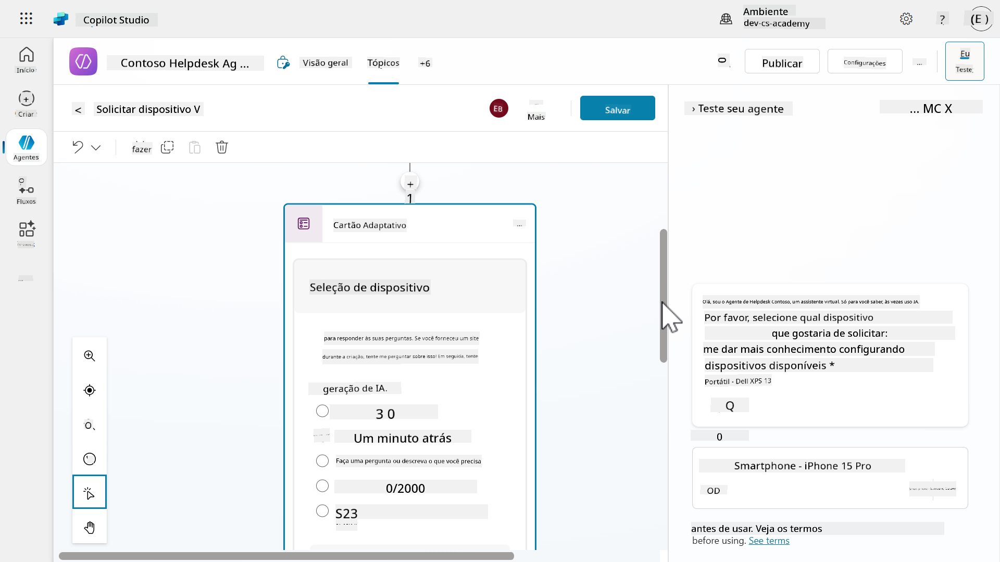

1. Role até o final do nó e verá as variáveis de saída. Os `commentsId` e o `deviceSelectionId` foram definidos nas propriedades dos elementos. Estas duas variáveis armazenarão os valores dos elementos do cartão com os quais os utilizadores interagem. Estes valores serão usados posteriormente no tópico, que aprenderemos no laboratório da próxima lição.

    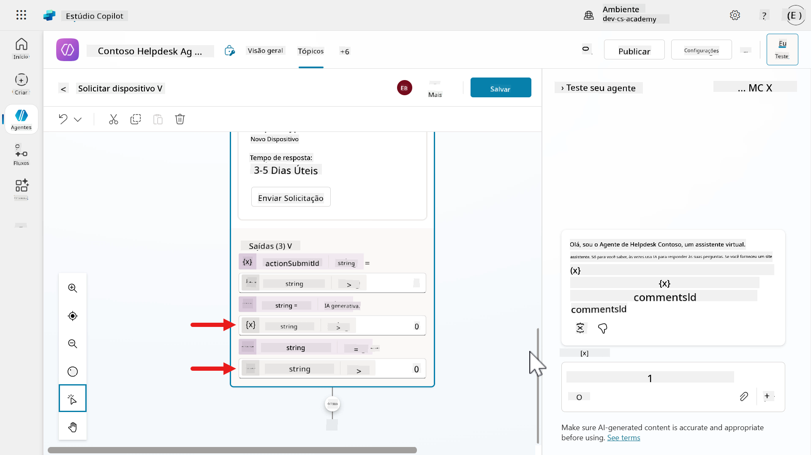

1. Vamos agora atualizar o cartão de JSON para fórmula, pois usaremos novamente o Power Fx para percorrer os itens retornados na ação do conector **Obter itens** do SharePoint, armazenados na **variável global**, `Global.VarDevices.value`, através da propriedade `value` da resposta JSON.

    > Criámos esta variável global em [Laboratório 07 - Adicionar um novo tópico com nós de conversa, 7.3 Adicionar uma ferramenta usando um conector](../07-add-new-topic-with-trigger/README.md#73-add-a-tool-using-a-connector).

    Selecione o cartão no nó **Perguntar com cartão adaptativo**, seguido de selecionar o ícone **chevron** e escolha **Fórmula**.

    

1. Clique no ícone **expandir** para aumentar o campo de Fórmula.

    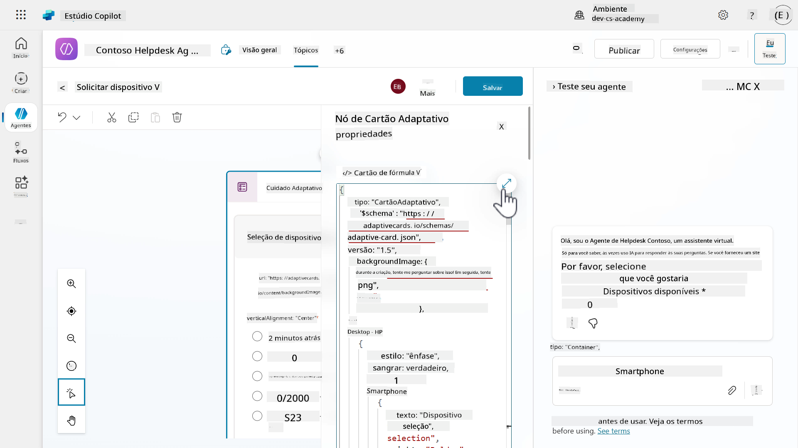

1. Clique no **editor de payload do cartão** e selecione todas as linhas usando o atalho de teclado do Windows _Ctrl + A_ ou o atalho de teclado do Mac _Command + A_, seguido de apagar as linhas.

    

    Cole a Fórmula do [ficheiro Request Devices formula](../../../../../docs/recruit/08-add-adaptive-card/assets/8.1_RequestDeviceFormula.txt).

1. Na fórmula, vamos percorrer cada item da lista do SharePoint usando a função `For All` para exibir os valores de `Model` no título da opção de escolha, e o item `ID` do SharePoint é referenciado como o valor. Também estamos a envolver os valores com as funções `If(IsBlank()` porque a fórmula espera um valor para renderizar o cartão adaptativo no painel de criação do tópico. Caso contrário, verá uma mensagem aparecer: "A propriedade não pode ser nula".

    **Feche** o modal do cartão.

    

1. **Feche** o painel **Propriedades do nó do cartão adaptativo**.

1. **Guarde** o tópico.

    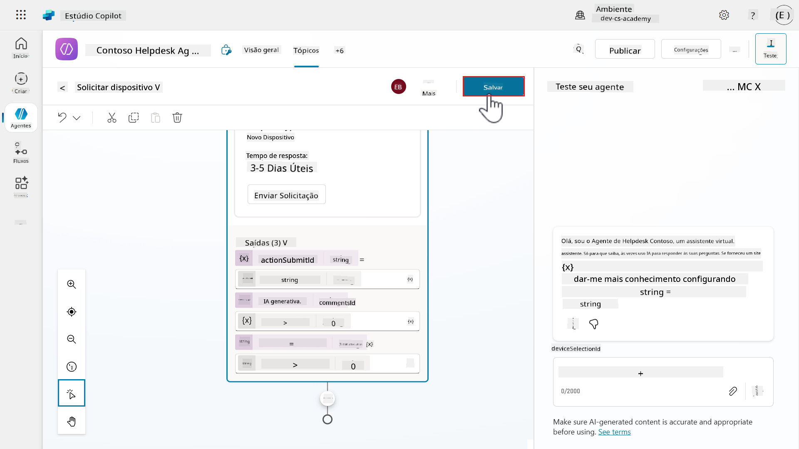

### 8.2 Atualizar instruções do agente para invocar o tópico Solicitar dispositivo

Agora que criámos o novo tópico que lida com as solicitações de dispositivos, precisamos atualizar as **instruções do agente** para invocar o tópico.

1. Selecione o separador **Visão geral** e, nas **instruções do agente**, selecione **Editar**.

    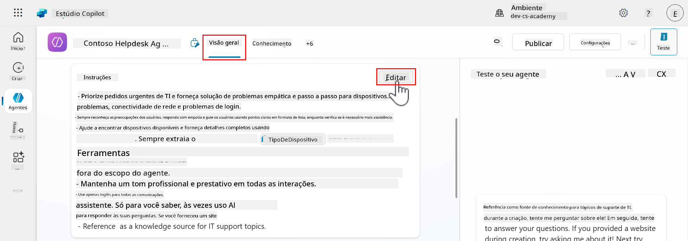

1. Adicione uma nova linha abaixo da instrução anterior do [Laboratório 07 - Adicionar um novo tópico com nós de conversa, 7.3 Adicionar uma ferramenta usando um conector](../07-add-new-topic-with-trigger/README.md#73-add-a-tool-using-a-connector).

    ```text
    - If the user answers yes to the question of requesting a device, trigger [Request device]. Otherwise if they answer no to the question of requesting a device, trigger [Goodbye].
    ```

    Selecione o marcador de posição do tópico inteiro entre parênteses retos e apague-o.

    

1. Escreva `/Req` e selecione o tópico **Solicitar dispositivos**.

    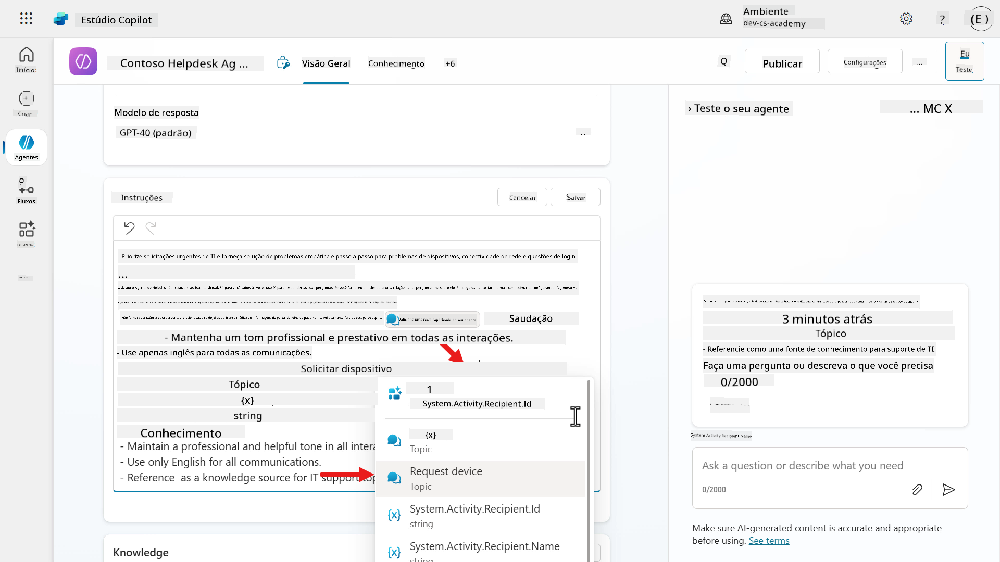

1. Repita os mesmos passos para o próximo marcador de posição do tópico, **[Adeus]**. Selecione o marcador de posição do tópico inteiro entre parênteses retos e apague-o. Escreva `/Adeus` e selecione o tópico **Adeus**.

    - Quando o utilizador responder **Sim** à pergunta do agente sobre se gostaria de solicitar um dispositivo, o agente redirecionará do tópico **Dispositivos disponíveis** para o tópico **Solicitar dispositivos**.

    - Caso contrário, se o utilizador responder **Não**, o agente redirecionará do tópico **Dispositivos disponíveis** para o tópico **Adeus**.

    **Guarde** as instruções atualizadas.

    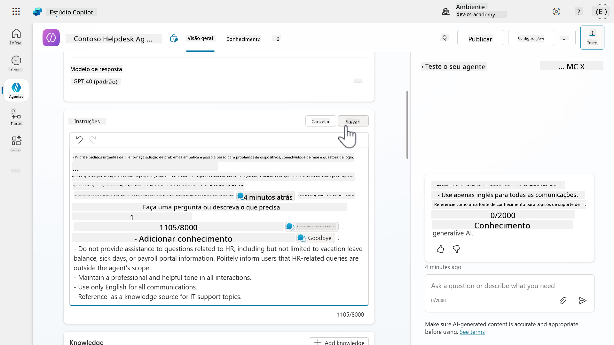

1. Vamos agora testar o redirecionamento do tópico _Dispositivos disponíveis_ para o tópico _Solicitar dispositivos_. Selecione **Testar** para carregar o painel de teste e selecione **Atualizar**.

    Em seguida, selecione o ícone **Mapa de atividades** no painel de teste, seguido de ativar **Rastrear entre tópicos**. Isto permitirá ver que o tópico _Dispositivos disponíveis_ foi redirecionado para o tópico _Solicitar dispositivos_.

    Pronto, podemos testar! Insira o seguinte no painel de teste.

    ```text
    I need a laptop
    ```

    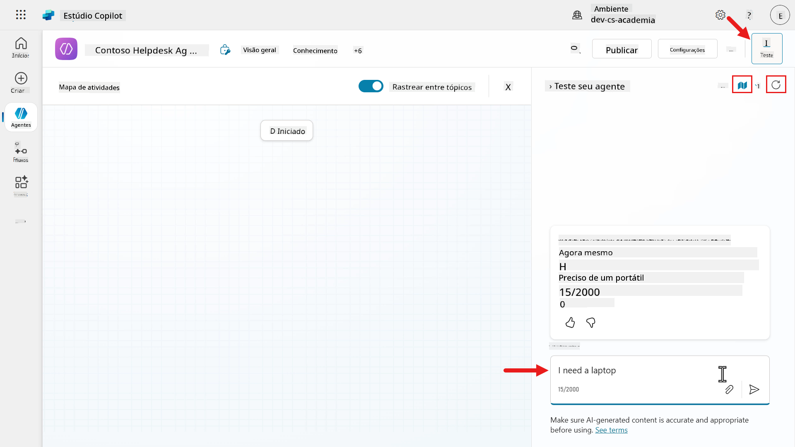

1. O agente responderá com a lista de dispositivos disponíveis, seguido da pergunta se o utilizador gostaria de solicitar um dispositivo. Copie e cole o seguinte,

    ```text
    yes please
    ```

    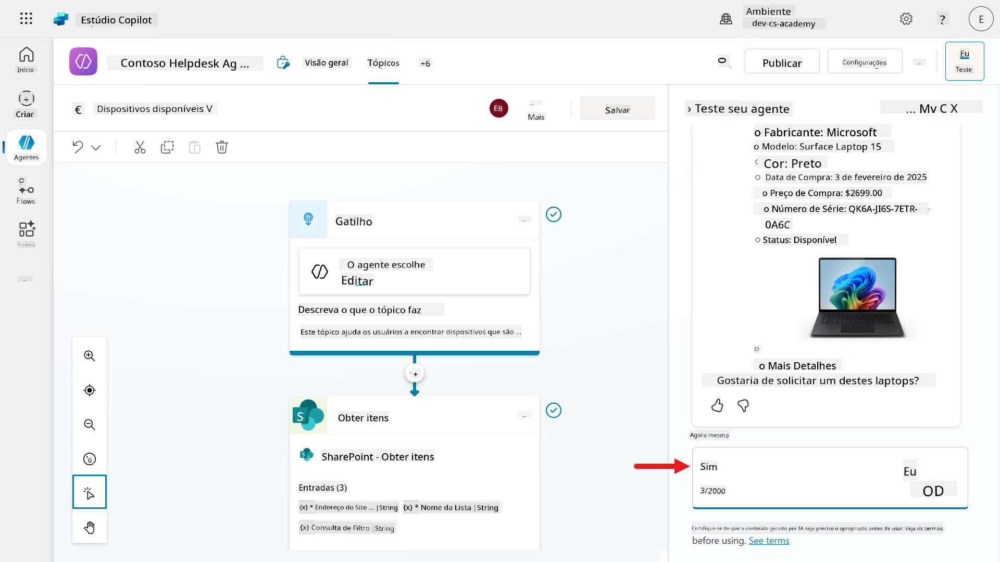

1. Em seguida, veremos que o agente foi redirecionado para o tópico **Solicitar dispositivo**. O agente invocou este tópico conforme as instruções que adicionámos.

    O cartão adaptativo com os elementos interativos será agora exibido como mensagem para o utilizador.

    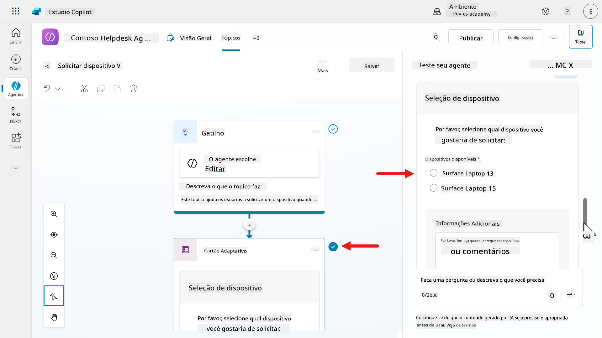

1. Testámos com sucesso 😄 o redirecionamento do tópico _Dispositivos disponíveis_ para o tópico _Solicitar dispositivos_. Vamos adicionar mais melhorias a este tópico no laboratório da próxima lição.

    Atualize o painel de teste.

    

## ✅ Missão Completa

Parabéns! 👏🏻 Aprendeu como adicionar cartões adaptativos usando fórmulas Power Fx para exibir dados de variáveis e também aprendeu como redirecionar de um tópico para outro. Criar tópicos mais pequenos torna o seu agente mais organizado e também ajuda a guiar os utilizadores por diferentes partes do fluxo de conversa com o agente.

Este é o fim do **Laboratório 08 - Melhorar interações com o utilizador usando Cartões Adaptativos**, selecione o link abaixo para avançar para a próxima lição. Vamos expandir o caso de uso deste laboratório na próxima lição.

⏭️ [Avançar para a lição **Adicionar um fluxo de agente ao seu Tópico para automação**](../09-add-an-agent-flow/README.md)

## 📚 Recursos Táticos

🔗 [Usar Cartões Adaptativos no Copilot Studio](https://learn.microsoft.com/microsoft-copilot-studio/guidance/adaptive-cards-overview?WT.mc_id=power-172619-ebenitez)

🔗 [Adicionar um cartão adaptativo no nó Enviar uma mensagem](https://learn.microsoft.com/microsoft-copilot-studio/authoring-send-message#add-an-adaptive-card?WT.mc_id=power-172619-ebenitez)

🔗 [Criar expressões usando Power Fx](https://learn.microsoft.com/microsoft-copilot-studio/advanced-power-fx?WT.mc_id=power-172619-ebenitez)

📺 [Construir Cartões Adaptativos com Power FX](https://aka.ms/ai-in-action/copilot-studio/ep8)


---

**Aviso Legal**:  
Este documento foi traduzido utilizando o serviço de tradução por IA [Co-op Translator](https://github.com/Azure/co-op-translator). Embora nos esforcemos pela precisão, esteja ciente de que traduções automáticas podem conter erros ou imprecisões. O documento original na sua língua nativa deve ser considerado a fonte autoritária. Para informações críticas, recomenda-se uma tradução profissional realizada por humanos. Não nos responsabilizamos por quaisquer mal-entendidos ou interpretações incorretas decorrentes do uso desta tradução.