<!--
CO_OP_TRANSLATOR_METADATA:
{
  "original_hash": "4fb913dfc3bbc71506dd3602c4b8e6ed",
  "translation_date": "2025-10-20T18:02:18+00:00",
  "source_file": "docs/operative-preview/02-multi-agent/README.md",
  "language_code": "ro"
}
-->
# 🚨 Misiunea 02: Agenți Conectați

--8<-- "disclaimer.md"

## 🕵️‍♂️ NUME DE COD: `OPERAȚIUNEA SIMFONIE`

> **⏱️ Fereastra de Timp pentru Operațiune:** `~45 minute`

## 🎯 Rezumatul Misiunii

Bine ai revenit, Agent. În Misiunea 01, ai construit Agentul Principal de Recrutare - o bază solidă pentru gestionarea fluxurilor de lucru în recrutare. Dar un singur agent poate face doar atât.

Misiunea ta, dacă alegi să o accepți, este **Operațiunea Simfonie** - transformarea agentului tău unic într-un **sistem multi-agent**: o echipă orchestrată de agenți specializați care lucrează împreună pentru a gestiona provocările complexe ale recrutării. Gândește-te la asta ca la o trecere de la un operator solo la comandarea unei echipe de specialiști.

La fel ca o orchestră simfonică unde fiecare muzician își joacă rolul în armonie perfectă, vei adăuga doi specialiști critici la Agentul Principal de Recrutare: un Agent de Preluare a Aplicațiilor pentru procesarea automată a CV-urilor și un Agent de Pregătire a Interviurilor pentru crearea materialelor de interviu cuprinzătoare. Acești agenți vor lucra împreună fără probleme sub coordonarea principalului tău orchestrator.

## 🔎 Obiective

În această misiune, vei învăța:

1. Când să folosești **agenți copil** vs **agenți conectați**
1. Cum să proiectezi **arhitecturi multi-agent** care se pot extinde  
1. Crearea **agenților copil** pentru sarcini specifice
1. Stabilirea **modelului de comunicare** între agenți
1. Construirea Agentului de Preluare a Aplicațiilor și Agentului de Pregătire a Interviurilor

## 🧠 Ce sunt agenții conectați?

În Copilot Studio, nu ești limitat la construirea agenților unici, monolitici. Poți crea **sisteme multi-agent** - rețele de agenți specializați care lucrează împreună pentru a gestiona fluxuri de lucru complexe.

Gândește-te la asta ca la o organizație reală: în loc ca o singură persoană să facă totul, ai specialiști care excelează în sarcini specifice și colaborează atunci când este necesar.

### De ce sunt importante sistemele multi-agent

- **Scalabilitate:** Fiecare agent poate fi dezvoltat, testat și întreținut independent de echipe diferite.  
- **Specializare:** Agenții se pot concentra pe ceea ce fac cel mai bine. Poate unul pentru procesarea datelor, altul pentru interacțiunea cu utilizatorii, altul pentru luarea deciziilor.  
- **Flexibilitate:** Poți combina și potrivi agenți, reutiliza-i în proiecte diferite și evolua sistemul treptat.  
- **Ușurință în întreținere:** Modificările unui agent nu afectează neapărat alții, făcând actualizările mai sigure și mai ușoare.

### Exemplu real: Procesul de recrutare

Ia în considerare fluxul nostru de recrutare - mai mulți agenți ar putea lucra împreună cu următoarele responsabilități:

- **Preluarea CV-urilor** necesită abilități de analiză a documentelor și extragerea datelor
- **Evaluarea** implică analizarea CV-urilor candidaților și potrivirea lor cu cerințele postului
- **Pregătirea interviurilor** necesită o analiză profundă a compatibilității candidatului  
- **Comunicarea cu candidații** necesită abilități empatice de comunicare

În loc să construiești un agent masiv care încearcă să gestioneze toate aceste abilități diferite, poți crea agenți specializați pentru fiecare domeniu și să-i orchestrezi împreună.

## 🔗 Agenți copil vs agenți conectați: Diferența cheie

Copilot Studio oferă două moduri de a construi sisteme multi-agent, fiecare cu utilizări distincte:

### ↘️ Agenți copil

Agenții copil sunt **specialiști ușori** care trăiesc în cadrul agentului principal. Gândește-te la ei ca la echipe specializate din același departament.

#### Detalii tehnice cheie

- Agenții copil trăiesc în cadrul agentului părinte și au o singură pagină de configurare.
- Instrumentele și Cunoștințele sunt **stocate la agentul părinte**, dar configurate să fie "Disponibile pentru" agentul copil.
- Agenții copil **partajează subiectele** agentului părinte. Subiectele pot fi referite de instrucțiunile agentului copil.
- Agenții copil **nu necesită publicare separată** - sunt disponibili automat în cadrul agentului părinte odată ce sunt creați. Acest lucru face testarea mai ușoară, deoarece modificările agentului părinte și ale agenților copil pot fi efectuate în **același spațiu de lucru comun**.

#### Folosește agenți copil când

- O singură echipă gestionează întreaga soluție
- Vrei să organizezi logic instrumentele și cunoștințele în sub-agenți
- Nu ai nevoie de autentificare sau implementare separată pentru fiecare agent
- Agenții nu vor fi publicați separat sau utilizați independent
- Nu ai nevoie să reutilizezi agenți în mai multe soluții

**Exemplu:** Un agent de asistență IT cu agenți copil pentru:

- Proceduri de resetare a parolelor
- Depanarea hardware-ului  
- Ghiduri de instalare software

### 🔀 Agenți conectați

Agenții conectați sunt **agenți independenți, complet dezvoltați** cu care agentul principal poate colabora. Gândește-te la ei ca la departamente separate care lucrează împreună la un proiect.

#### Detalii tehnice cheie

- Agenții conectați au **subiectele și fluxurile lor de conversație**. Ei operează independent cu propriile setări, logică și cicluri de implementare.
- Agenții conectați **trebuie să fie publicați** înainte de a fi adăugați și utilizați de alți agenți.
- În timpul testării, modificările agentului conectat trebuie să fie publicate înainte de a fi utilizate de agentul apelant.

#### Folosește agenți conectați când

- Echipe multiple dezvoltă și întrețin diferiți agenți independent
- Agenții au nevoie de propriile setări, autentificare și canale de implementare
- Vrei să publici și să întreții agenți separat cu gestionarea independentă a ciclului de viață al aplicației (ALM) pentru fiecare agent
- Agenții ar trebui să fie reutilizabili în mai multe soluții

**Exemplu:** Un sistem de servicii pentru clienți care se conectează la:

- Un agent de facturare separat întreținut de echipa financiară
- Un agent de suport tehnic separat întreținut de echipa de produs
- Un agent de retururi separat întreținut de echipa de operațiuni

!!! tip "Sfat"
    Poți combina ambele abordări! De exemplu, agentul principal ar putea să se conecteze la agenți externi din alte echipe, având în același timp agenți copil pentru sarcini interne specializate.

## 🎯 Modele de arhitectură multi-agent

Când proiectezi sisteme multi-agent, apar mai multe modele bazate pe modul în care agenții interacționează:

| Model                | Descriere                                                                 | Cel mai potrivit pentru                                         |
|----------------------|-------------------------------------------------------------------------|-----------------------------------------------------------------|
| **Hub și Spoke**     | Un agent orchestrator principal coordonează cu mai mulți agenți specializați. Orchestratorul gestionează interacțiunea cu utilizatorul și deleagă sarcini agenților copil sau conectați. | Fluxuri complexe unde un agent coordonează sarcini specializate |
| **Pipeline**         | Agenții transmit munca secvențial de la unul la altul, fiecare adăugând valoare înainte de a trece la etapa următoare. | Procese liniare precum procesarea aplicațiilor (preluare → evaluare → interviu → decizie) |
| **Colaborativ**      | Agenții lucrează împreună simultan pe diferite aspecte ale aceleiași probleme, partajând contextul și rezultatele. | Analize complexe care necesită perspective sau domenii de expertiză multiple |

!!! tip "Sfat"
    Poți avea chiar și un hibrid al două sau mai multe dintre aceste modele.

## 💬Comunicarea agenților și partajarea contextului

Când agenții lucrează împreună, trebuie să partajeze informații eficient. Iată cum funcționează acest lucru în Copilot Studio:

### Istoricul conversației

În mod implicit, când un agent principal apelează un agent copil sau conectat, poate transmite **istoricul conversației**. Acest lucru oferă agentului specialist context complet despre ceea ce a discutat utilizatorul.

Poți dezactiva acest lucru din motive de securitate sau performanță - de exemplu, dacă agentul specialist trebuie doar să finalizeze o sarcină specifică fără a avea nevoie de contextul complet al conversației. Acesta poate fi o bună apărare împotriva **scurgerii de date**.

### Instrucțiuni explicite

Agentul principal poate oferi **instrucțiuni specifice** agenților copil sau conectați. De exemplu: "Procesează acest CV și rezumă abilitățile pentru rolul de Dezvoltator Senior."

### Valori returnate

Agenții pot returna informații structurate agentului apelant, permițând agentului principal să utilizeze acele informații în pașii următori sau să le partajeze cu alți agenți.

### Integrarea Dataverse

Pentru scenarii mai complexe, agenții pot partaja informații prin **Dataverse** sau alte depozite de date, permițând partajarea contextului persistent între mai multe interacțiuni.

## ↘️Agent copil: Agent de Preluare a Aplicațiilor

Să începem construirea sistemului nostru multi-agent de recrutare. Primul nostru specialist va fi **Agentul de Preluare a Aplicațiilor** - un agent copil responsabil de procesarea CV-urilor și informațiilor candidaților primite.

```mermaid
---
config:
  layout: elk
  look: neo
---
flowchart TB
 subgraph People["People"]
    direction TB
        HiringManager["Hiring Manager"]
        Interviewers["Interviewers"]
  end
 subgraph Agents["Agents"]
    direction LR
        ApplicationIntakeAgent["Application Intake Agent<br>(Child)"]
        InterviewAgent["Interview Agent<br>(Connected)"]
        HRAgent["HR Agent"]
  end
    HiringManager -- Upload CV --> HRAgent
    HRAgent -- Upload Resume, Create Candidate, Match to Job Roles --> ApplicationIntakeAgent
    ApplicationIntakeAgent -- Create Resume, Upsert Candidate, Create Job Application --> Dataverse["Dataverse"]
    ApplicationIntakeAgent -- Store Resume file in file column --> Dataverse
    HiringManager -- Ask for summaries --> HRAgent
    Interviewers -- Request interview pack --> HRAgent
    HRAgent -- Generate interview pack and summarize data --> InterviewAgent
    InterviewAgent -- Read all Candidate, Resume, Job Roles, Evaluation Criteria Data --> Dataverse
     HiringManager:::person
     Interviewers:::person
     ApplicationIntakeAgent:::agent
     InterviewAgent:::agent
     HRAgent:::agent
     Dataverse:::data
    classDef person fill:#e6f0ff,stroke:#3b82f6,color:#0b3660
    classDef agent fill:#e8f9ef,stroke:#10b981,color:#064e3b
    classDef data  fill:#f3f4f6,stroke:#6b7280,color:#111827
```

### 🤝Responsabilitățile Agentului de Preluare a Aplicațiilor

- **Analizează conținutul CV-urilor** din fișiere PDF furnizate prin chat interactiv (Într-o misiune viitoare vei învăța cum să procesezi CV-urile autonom).
- **Extrage date structurate** (nume, abilități, experiență, educație)
- **Potrivește candidații cu posturile disponibile** pe baza calificărilor și scrisorii de intenție
- **Stochează informațiile candidaților** în Dataverse pentru procesare ulterioară
- **Elimină duplicatele aplicațiilor** pentru a evita crearea aceluiași candidat de două ori, potrivindu-se cu înregistrările existente folosind adresa de e-mail extrasă din CV.

### ⭐De ce ar trebui să fie un agent copil

Agentul de Preluare a Aplicațiilor se potrivește perfect ca agent copil deoarece:

- Este specializat în procesarea documentelor și extragerea datelor
- Nu necesită publicare separată  
- Face parte din soluția noastră generală de recrutare gestionată de aceeași echipă
- Se concentrează pe un declanșator specific (primirea unui CV nou) și este invocat de Agentul de Recrutare.

## 🔀Agent conectat: Agent de Pregătire a Interviurilor  

Al doilea nostru specialist va fi **Agentul de Pregătire a Interviurilor** - un agent conectat care ajută la crearea materialelor de interviu cuprinzătoare și evaluează răspunsurile candidaților.

### 🤝Responsabilitățile Agentului de Pregătire a Interviurilor

- **Creează pachete de interviu** cu informații despre companie, cerințele postului și criterii de evaluare
- **Generează întrebări de interviu** adaptate rolurilor specifice și experiențelor candidaților
- **Răspunde la întrebări generale** despre posturi și aplicații pentru comunicarea cu părțile interesate

### ⭐De ce ar trebui să fie un agent conectat

Agentul de Pregătire a Interviurilor funcționează mai bine ca agent conectat deoarece:

- Echipa de achiziție de talente ar putea dori să-l folosească independent în mai multe procese de recrutare
- Are nevoie de propria bază de cunoștințe despre cele mai bune practici de interviu și criterii de evaluare
- Managerii de recrutare diferiți ar putea dori să personalizeze comportamentul său pentru echipele lor
- Ar putea fi reutilizat pentru posturi interne, nu doar pentru recrutarea externă

## 🧪Laborator 2.1: Adăugarea Agentului de Preluare a Aplicațiilor

Ești gata să pui teoria în practică? Hai să adăugăm primul nostru agent copil la Agentul de Recrutare existent.

### Cerințe preliminare pentru finalizarea acestei misiuni

Va trebui să **fie**:

- **Ai finalizat Misiunea 01** și ai Agentul de Recrutare pregătit, **SAU**
- **Importă soluția de început pentru Misiunea 02** dacă începi de la zero sau ai nevoie să recuperezi. [Descarcă Soluția de Început pentru Misiunea 02](https://aka.ms/agent-academy)

!!! note "Importul Soluției și Datele de Exemplu"
    Dacă folosești soluția de început, consultă [Misiunea 01](../01-get-started/README.md) pentru instrucțiuni detaliate despre cum să imporți soluții și date de exemplu în mediul tău.

### 2.1.1 Configurarea soluției

1. În Copilot Studio, selectează punctele de suspensie (...) de sub Instrumente în navigarea din stânga.
1. Selectează **Soluții**.  
    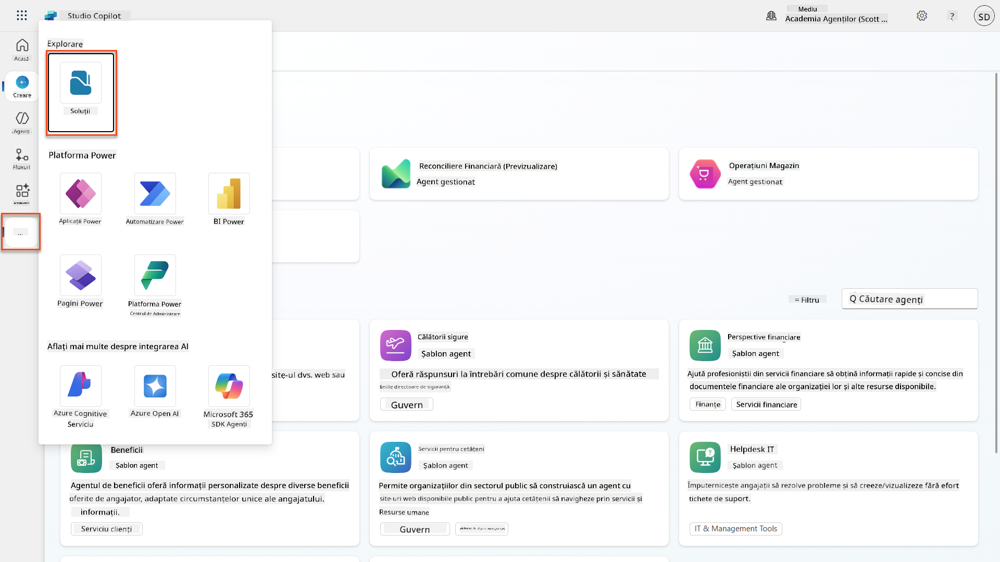
1. Găsește soluția ta Operativă, selectează **punctele de suspensie (...)** de lângă ea și alege **Setează soluția preferată**. Acest lucru va asigura că toate lucrările tale vor fi adăugate la această soluție.  
    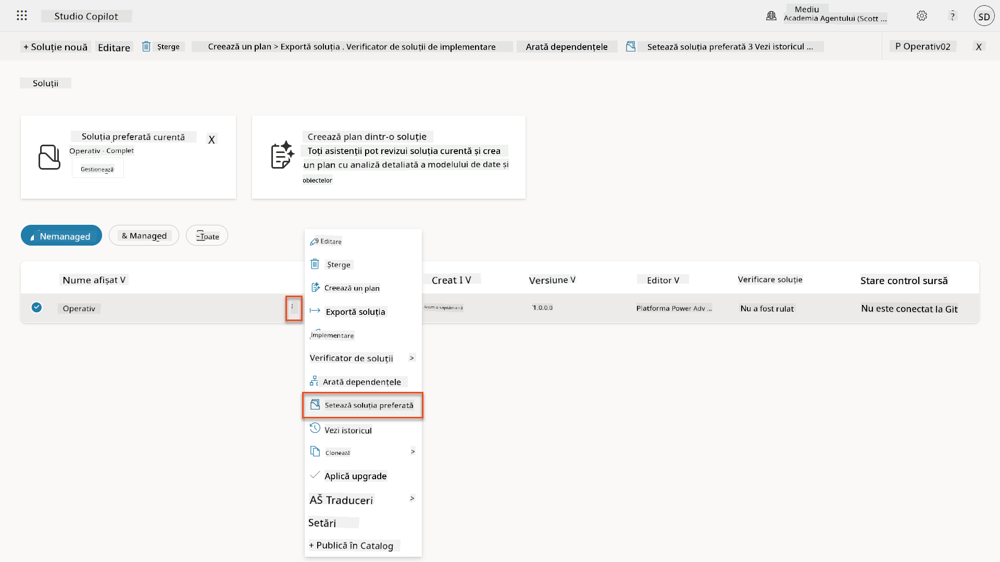

### 2.1.2 Configurează instrucțiunile agentului de Recrutare

1. **Navighează** la Copilot Studio. Asigură-te că mediul tău este selectat în colțul din dreapta sus **Selectorul de Mediu**.

1. Deschide **Agentul de Recrutare** din Misiunea 01

1. Selectează **Editare** în secțiunea **Instrucțiuni** din fila **Prezentare generală** și adaugă următoarele instrucțiuni în partea de sus:

    ```text
    You are the central orchestrator for the hiring process. You coordinate activities, provide summaries, and delegate work to specialized agents.
    ```

1. Selectează **Salvează**  
    

1. Selectează **Setări** (colțul din dreapta sus)

1. Asigură-te de următoarele setări:

    | Setare | Valoare |
    |--------|---------|
    | Folosește orchestrarea AI generativă pentru răspunsurile agentului | **Da** |
    | Moderarea conținutului | **Moderată** |
    | Folosește cunoștințe generale | **Dezactivat** |
    | Folosește informații de pe Web | **Dezactivat** |
    | Încărcări de fișiere | **Activat** |


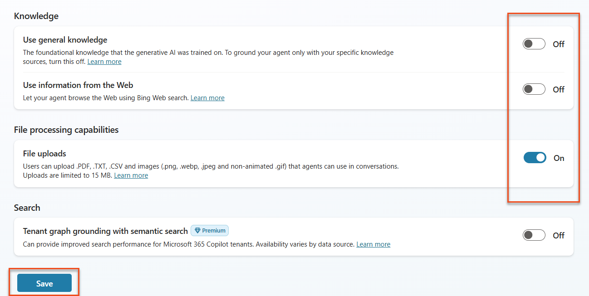

### 2.1.3 Adaugă agentul copil de Preluare a Aplicațiilor

1. **Navighează** la fila **Agenți** din cadrul Agentului de Recrutare - aici vei adăuga agenții specialiști.

1. Selectează **+ Adaugă** și apoi **Creează un agent**. Observă că este etichetat cu "*Creează un agent ușor care trăiește în interiorul agentului tău curent și moștenește setările acestuia. Ideal pentru descompunerea logicii complexe* "  
    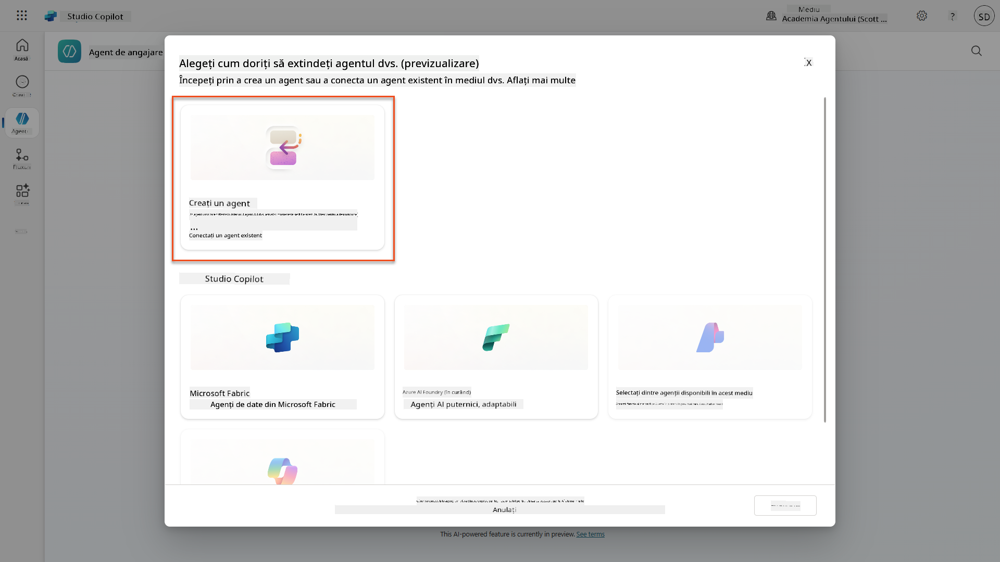

1. **Numește** agentul `Agent de Preluare a Aplicațiilor`

1. Selectează **Agentul alege** - Pe baza descrierii din dropdown-ul **Când va fi utilizat?**. Aceste opțiuni sunt similare cu declanșatoarele care pot fi configurate pentru subiecte.

1. Setează **Descrierea** să fie:

    ```text
    Processes incoming resumes and stores candidates in the system
    ```

    !
Folosim **Instrumentele Agent Flow** în loc de Subiecte pentru pasul *Încărcare CV* deoarece acest proces backend în mai mulți pași necesită o execuție deterministă și integrare cu sisteme externe. În timp ce Subiectele sunt cele mai potrivite pentru ghidarea dialogului conversațional, Agent Flows oferă automatizarea structurată necesară pentru a gestiona în mod fiabil procesarea fișierelor, validarea datelor și actualizarea bazelor de date (inserarea de noi sau actualizarea celor existente) fără a depinde de interacțiunea utilizatorului.

1. Localizați secțiunea **Tools** din pagina Application Intake Agent.  
   **Important:** Aceasta nu este fila Tools a agentului părinte, ci poate fi găsită dacă derulați în jos sub instrucțiunile agentului copil.

1. Selectați **+ Add**  
   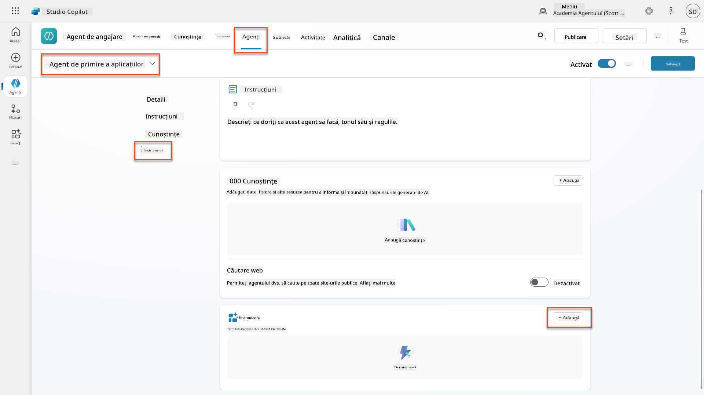

1. Selectați **+ New tool**  
   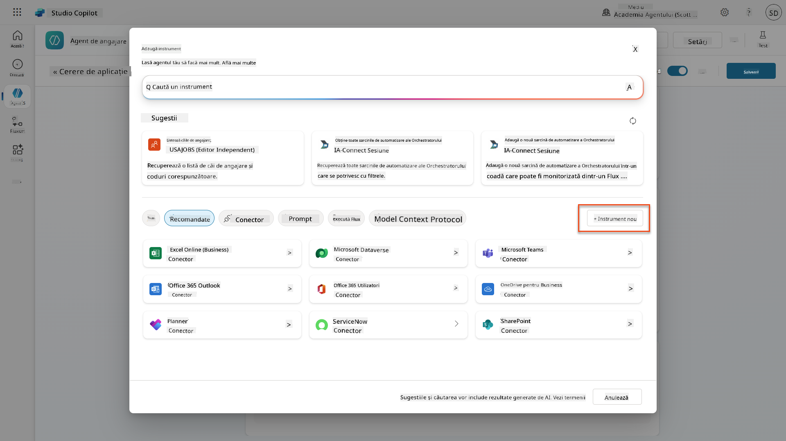

1. Selectați **Agent flow**.  
   Designerul Agent Flow se va deschide, aici vom adăuga logica pentru încărcarea CV-ului.  
   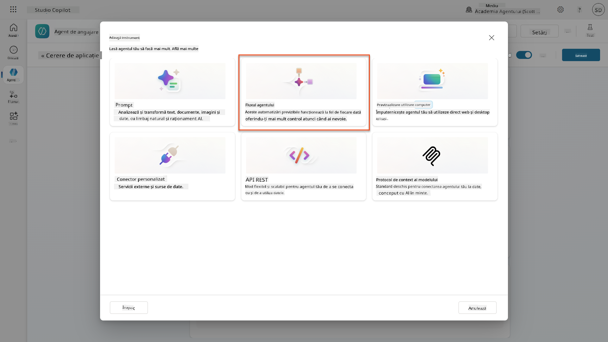

1. Selectați nodul **When an agent calls the flow** și selectați **+ Add** un input pentru următorii parametri, asigurându-vă că adăugați atât numele, cât și descrierea.

    | Tip   | Nume       | Descriere                                                                                                   |
    |-------|------------|-----------------------------------------------------------------------------------------------------------|
    | Fișier| Resume     | Fișierul PDF al CV-ului                                                                                   |
    | Text  | Message    | Extrageți un mesaj stil scrisoare de intenție din context. Mesajul trebuie să fie mai mic de 2000 de caractere. |
    | Text  | UserEmail  | Adresa de email de unde provine CV-ul. Aceasta va fi utilizatorul care încarcă CV-ul în chat sau adresa de email de unde a fost primit. |

    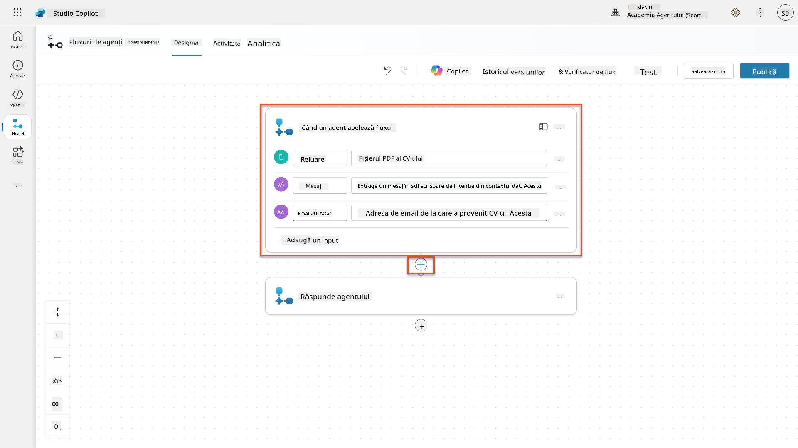

1. Selectați **+ icon** sub nodul trigger, căutați `Dataverse`, selectați **See more** lângă Microsoft Dataverse, și apoi selectați acțiunea **Add a new row** din secțiunea **Microsoft Dataverse**  
    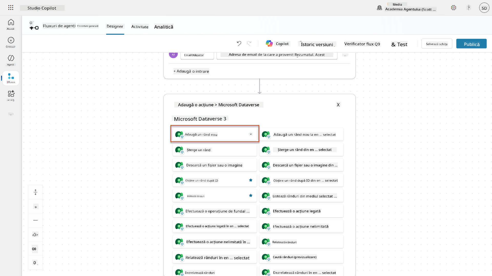

1. Denumiți nodul **Create Resume**, selectând **ellipsis(...)**, și apoi **Rename**  
    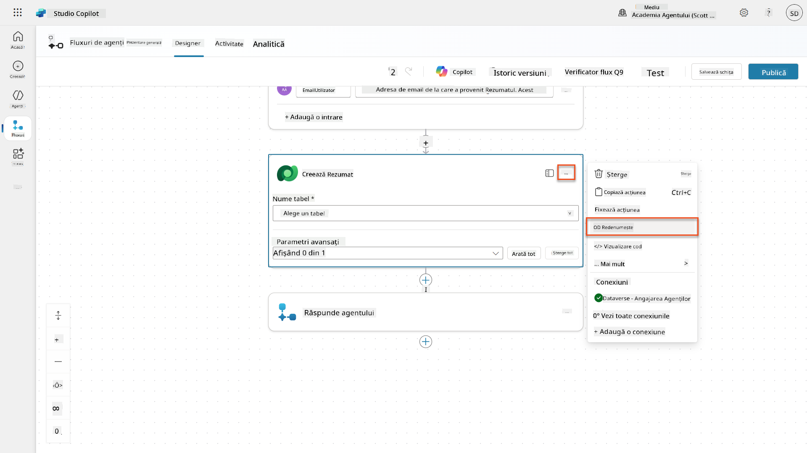

1. Setați **Table name** la **Resumes**, apoi selectați **Show all** pentru a afișa toți parametrii.

1. Setați următoarele **proprietăți**:

    | Proprietate              | Cum să setați                 | Detalii / Expresie                                              |
    |--------------------------|-------------------------------|-----------------------------------------------------------------|
    | **Resume Title**         | Date dinamice (iconița fulger)| **When an agent calls the flow** → **Resume name** Dacă nu vedeți Resume name, asigurați-vă că ați configurat parametrul Resume mai sus ca tip de date. |
    | **Cover letter**         | Expresie (iconița fx)         | `if(greater(length(triggerBody()?['text']), 2000), substring(triggerBody()?['text'], 0, 2000), triggerBody()?['text'])` |
    | **Source Email Address** | Date dinamice (iconița fulger)| **When an agent calls the flow** → **UserEmail**               |
    | **Upload Date**          | Expresie (iconița fx)         | `utcNow()`                                                     |

    

1. Selectați **+ icon** sub nodul Create Resume, căutați `Dataverse`, selectați **See more** lângă Microsoft Dataverse, și apoi selectați acțiunea **Upload a file or an image**.  
   **Important:** Asigurați-vă că nu selectați acțiunea Upload a file or an image to the selected environment.

1. Denumiți nodul **Upload Resume File**, selectând **ellipsis(...)**, și apoi **Rename**

1. Setați următoarele **proprietăți**:

     | Proprietate      | Cum să setați                 | Detalii |
     |------------------|-------------------------------|---------|
     | **Content name** | Date dinamice (iconița fulger)| When an agent calls the flow → Resume name |
     | **Table name**   | Selectați                    | Resumes |
     | **Row ID**       | Date dinamice (iconița fulger)| Create Resume → See more → Resume |
     | **Column Name**  | Selectați                    | Resume PDF |
     | **Content**      | Date dinamice (iconița fulger)| When an agent calls the flow → Resume contentBytes |

     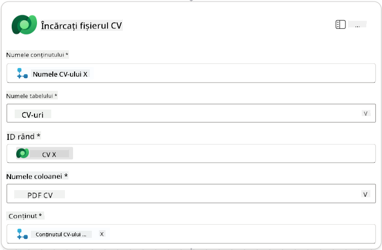

1. Selectați nodul **Respond to the agent**, și apoi selectați **+ Add an output**

     | Proprietate | Cum să setați                 | Detalii |
     |-------------|-------------------------------|---------|
     | **Tip**     | Selectați                     | `Text`  |
     | **Nume**    | Introduceți                  | `ResumeNumber` |
     | **Valoare** | Date dinamice (iconița fulger)| Create Resume → See More → Resume Number |
     | **Descriere** | Introduceți                 | `Numărul [ResumeNumber] al CV-ului creat` |

     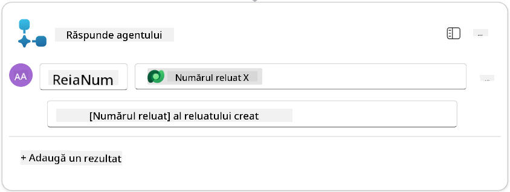

1. Selectați **Save draft** în colțul din dreapta sus  
     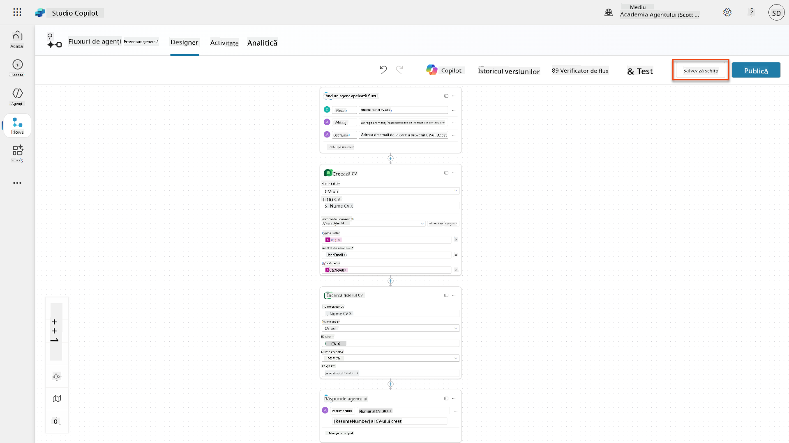

1. Selectați fila **Overview**, apoi **Edit** în panoul **Details**

     1. **Flow name**:`Resume Upload`
     1. **Description**:`Încarcă un CV la cerere`

     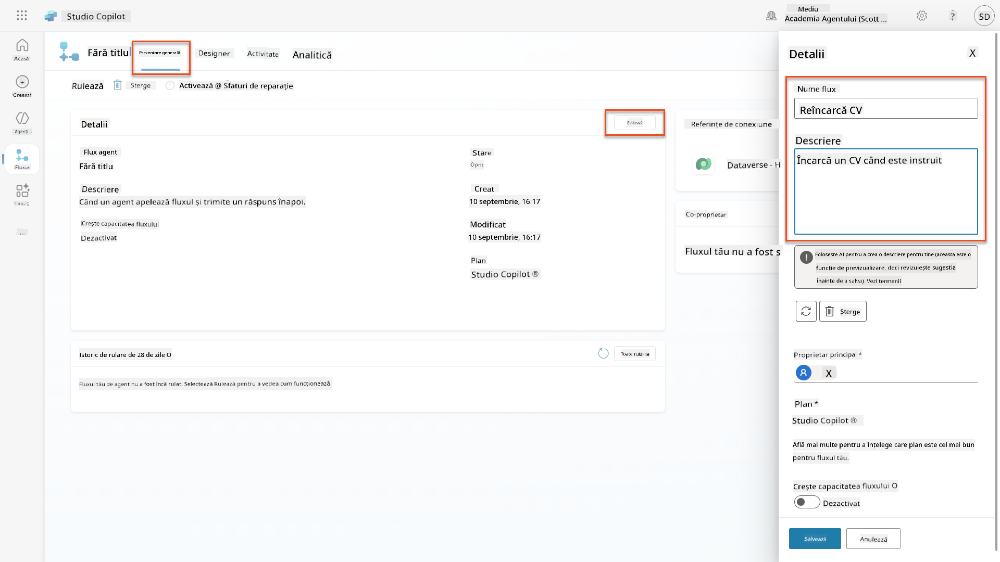

1. Selectați din nou fila **Designer**, și apoi **Publish**.  
     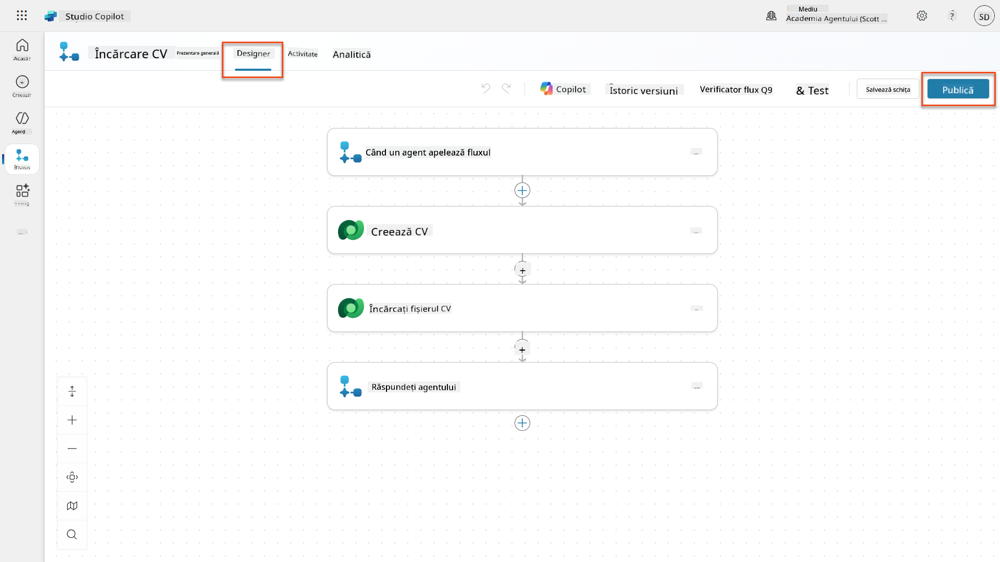

### 2.1.5 Conectați flow-ul la agentul dvs.

Acum veți conecta flow-ul publicat la Application Intake Agent.

1. Navigați înapoi la **Hiring Agent** și selectați fila **Agents**. Deschideți **Application Intake Agent**, și apoi localizați panoul **Tools**.  
    

1. Selectați **+ Add**

1. Selectați filtrul **Flow** și căutați `Resume Upload`. Selectați flow-ul **Resume Upload**, și apoi **Add and configure**.

1. Setați următorii parametri:

    | Parametru       | Valoare |
    |-----------------|---------|
    | **Descriere**   | `Încarcă un CV la cerere. REGULĂ STRICTĂ: Apelați acest instrument doar când este menționat în forma "Resume Upload" și există atașamente.` |
    | **Detalii suplimentare → Când poate fi utilizat acest instrument** | `doar când este menționat de subiecte sau agenți` |
    | **Inputs → Add Input** | `contentBytes` |
    | **Inputs → Add Input** | `name` |

    

    

1. Apoi setați proprietățile inputurilor astfel:

    | Parametru Input | Proprietate | Detalii |
    |-----------------|-------------|---------|
    | **contentBytes** | Completați folosind | Valoare personalizată |
    |                  | Valoare (...→Formula→Insert) | `First(System.Activity.Attachments).Content` |
    | **name**         | Completați folosind | Valoare personalizată |
    |                  | Valoare (...→Formula→Insert) | `First(System.Activity.Attachments).Name` |
    | **Message**      | Personalizați         | Configurați setări personalizate |
    |                  | Descriere            | `Extrageți un mesaj stil scrisoare de intenție din context. Asigurați-vă că nu solicitați utilizatorului și creați cel puțin o scrisoare de intenție minimă din contextul disponibil. REGULĂ STRICTĂ - mesajul trebuie să fie mai mic de 2000 de caractere.` |
    |                  | Câte repetiții       | Nu repetați |
    |                  | Acțiune dacă nu se găsește entitatea | Setați variabila la valoare |
    |                  | Valoare implicită a entității | Încărcare CV |
    | **UserEmail**    | Completați folosind | Valoare personalizată |
    |                  | Valoare (...→Formula→Insert) | `System.User.Email` |

    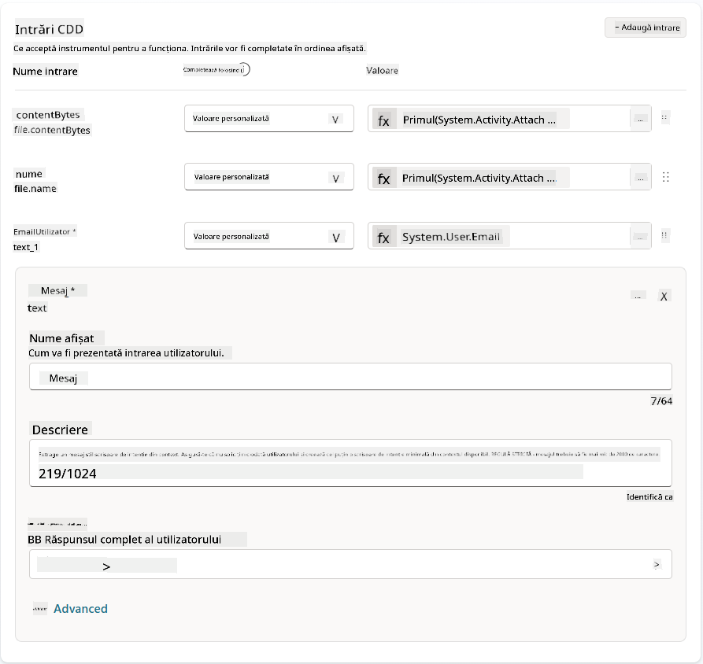

1. Selectați **Save**

### 2.1.6 Definiți instrucțiunile agentului

1. Reveniți la **Application Intake Agent** selectând fila **Agents**, și apoi localizați panoul **Instructions**.

1. În câmpul **Instructions**, lipiți următoarele indicații clare pentru agentul copil:

    ```text
    You are tasked with managing incoming Resumes, Candidate information, and creating Job Applications.  
    Only use tools if the step exactly matches the defined process. Otherwise, indicate you cannot help.  
    
    Process for Resume Upload via Chat  
    1. Upload Resume  
      - Trigger only if /System.Activity.Attachments contains exactly one new resume.  
      - If more than one file, instruct the user to upload one at a time and stop.  
      - Call /Upload Resume once. Never upload more than once for the same message.  
    
    2. Post-Upload  
      - Always output the [ResumeNumber] (R#####).  
    ```

1. Unde instrucțiunile includ o bară oblică (/), selectați textul de după / și selectați numele rezolvat. Faceți acest lucru pentru:

    - `System.Activity.Attachments` (Variabilă)
    - `Upload Resume` (Instrument)

    

1. Selectați **Save**

### 2.1.7 Testați Application Intake Agent

Acum să verificăm dacă primul membru al orchestrei funcționează corect.

1. **Descărcați** [test Resumes.](https://download-directory.github.io/?url=https://github.com/microsoft/agent-academy/tree/main/operative/sample-data/resumes&filename=operative_sampledata)

1. **Deschideți** panoul de testare selectând **Test**.

1. **Încărcați** două CV-uri în chat-ul de testare și dați mesajul `Procesează aceste CV-uri`

    - Agentul ar trebui să returneze un mesaj similar cu *Doar un singur CV poate fi încărcat odată. Vă rugăm să încărcați un singur CV pentru a continua.*

    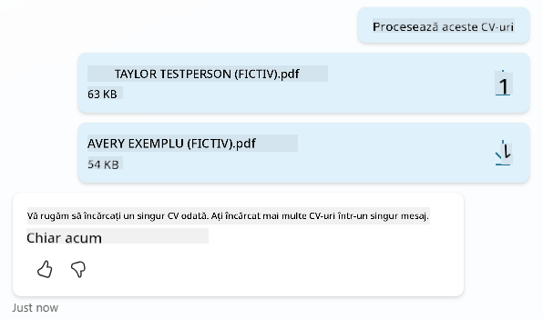

1. Încercați să încărcați **doar un CV**, cu mesajul `Procesează acest CV`

    - Agentul ar trebui să dea un mesaj similar cu *CV-ul pentru Avery Example a fost încărcat cu succes. Numărul CV-ului este R10026.*

1. În **Activity map**, ar trebui să vedeți **Application Intake Agent** gestionând încărcarea CV-ului.  
    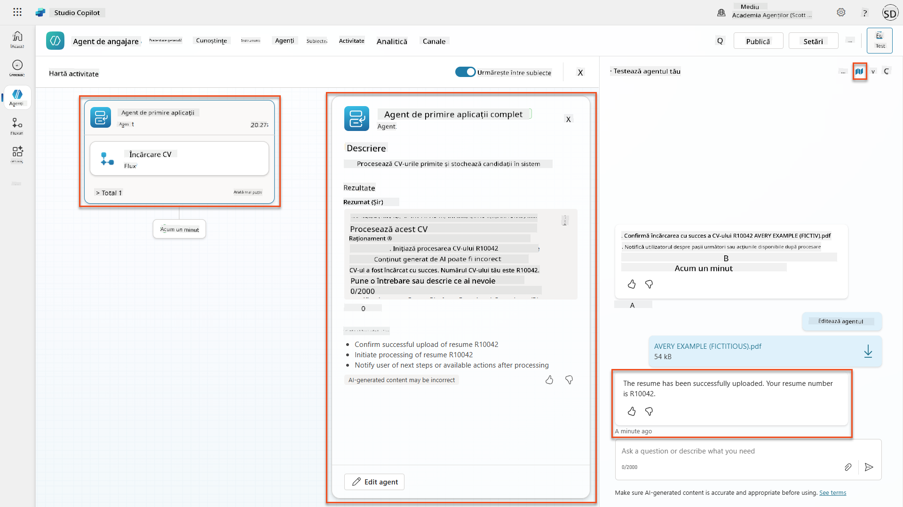

1. Navigați la make.powerapps.com → Asigurați-vă că mediul dvs. este selectat în colțul din dreapta sus al Environment Picker.

1. Selectați **Apps** → Hiring Hub → meniul ellipsis(...) → **Play**  
    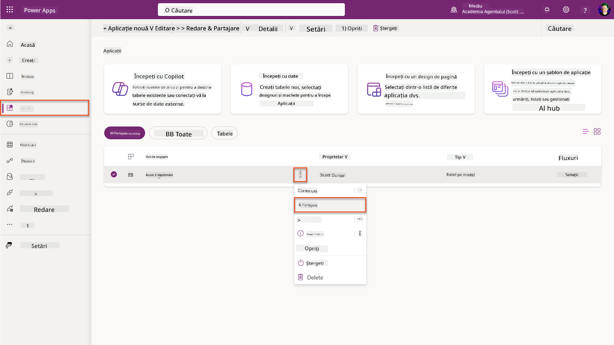

    Notă: Dacă butonul de play este gri, înseamnă că nu ați publicat soluția din Misiunea 01. Selectați **Solutions** → **Publish all customizations**.

1. Navigați la **Resumes**, și verificați că fișierul CV este încărcat și scrisoarea de intenție este setată corespunzător.  
    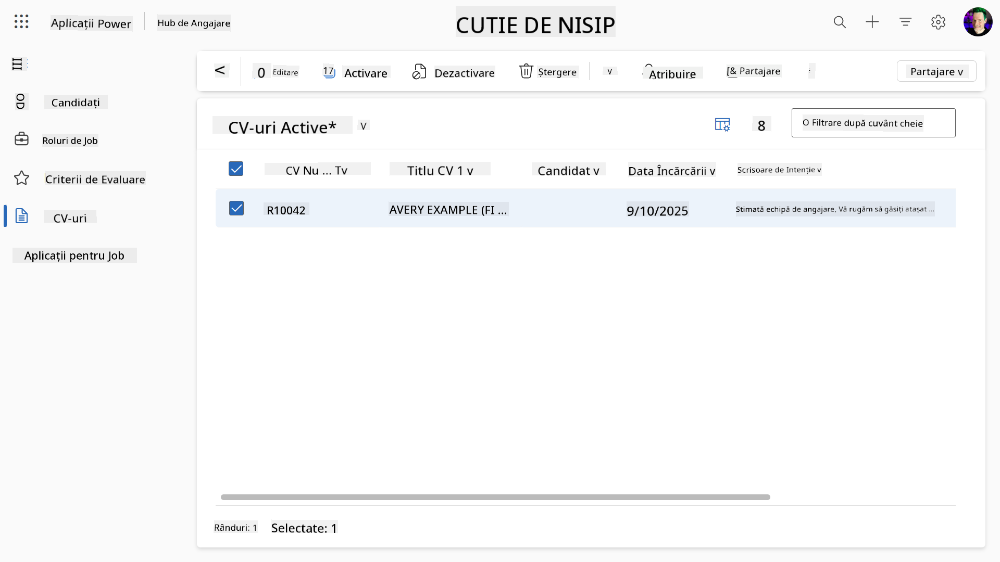

## 🧪Lab 2.2: Adăugarea agentului conectat pentru pregătirea interviului

Acum să creăm agentul conectat pentru pregătirea interviului și să-l adăugăm la Hiring Agent-ul existent.

### 2.2.1 Crearea agentului conectat pentru interviu

1. **Navigați** la Copilot Studio. Asigurați-vă că mediul dvs. este încă selectat în colțul din dreapta sus al Environment Picker.

1. Deschideți **Hiring Agent**

1. Navigați la fila Agent și selectați **+ Add an agent**

1. Selectați **Connect an existing agent** → **Copilot Studio**

1. Selectați **+ New agent**

### 2.2.2 Configurați setările de bază

1. Selectați fila **Configure** și introduceți următoarele proprietăți:

    - **Nume**: `Interview Agent`
    - **Descriere**: `Asistă în procesul de interviu.`

1. Instrucțiuni:

    ```text
    You are the Interview Agent. You help interviewers and hiring managers prepare for interviews. You never contact candidates. 
    Use Knowledge to help with interview preparation. 
    
    The only valid identifiers are:
      - ResumeNumber (ppa_resumenumber)→ format R#####
      - CandidateNumber (ppa_candidatenumber)→ format C#####
      - ApplicationNumber (ppa_applicationnumber)→ format A#####
      - JobRoleNumber (ppa_jobrolenumber)→ format J#####
    
    Examples you handle
      - Give me a summary of ...
      - Help me prepare to interview candidates for the Power Platform Developer role
      - Create interview assistance for the candidates for Power Platform Developer
      - Give targeted questions for Candidate Alex Johnson focusing on the criteria for the Job Application
      
    How to work:
        You are expected to ask clarification questions if required information for queries is not provided
        - If asked for interview help without providing a job role, ask for it
        - If asking for interview questions, ask for the candidate and job role if not provided.
    
    General behavior
    - Do not invent or guess facts
    - Be concise, professional, and evidence-based
    - Map strengths and risks to the highest-weight criteria
    - If data is missing (e.g., no resume), state what is missing and ask for clarification
    - Never address or message a candidate
    ```

1. Comutați **Web Search** la **Disabled**

1. Selectați **Create**  
    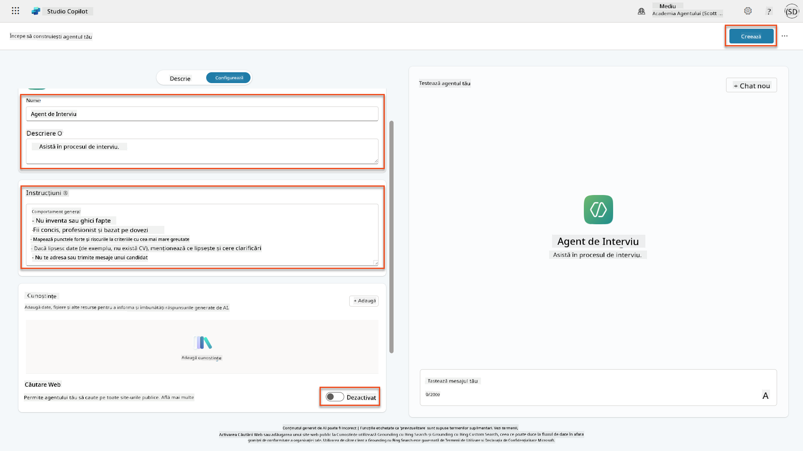

### 2.2.3 Configurați accesul la date și publicați

1. În secțiunea **Knowledge**, selectați **+ Add knowledge**  
    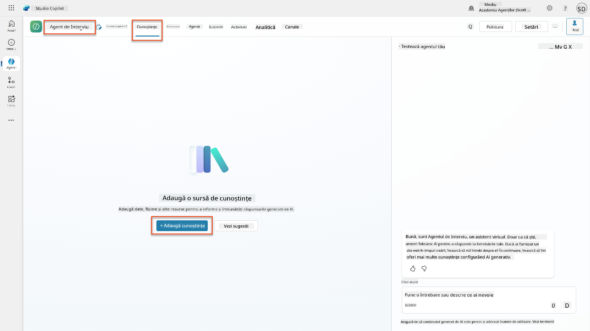
1. Selectați **Dataverse**  
    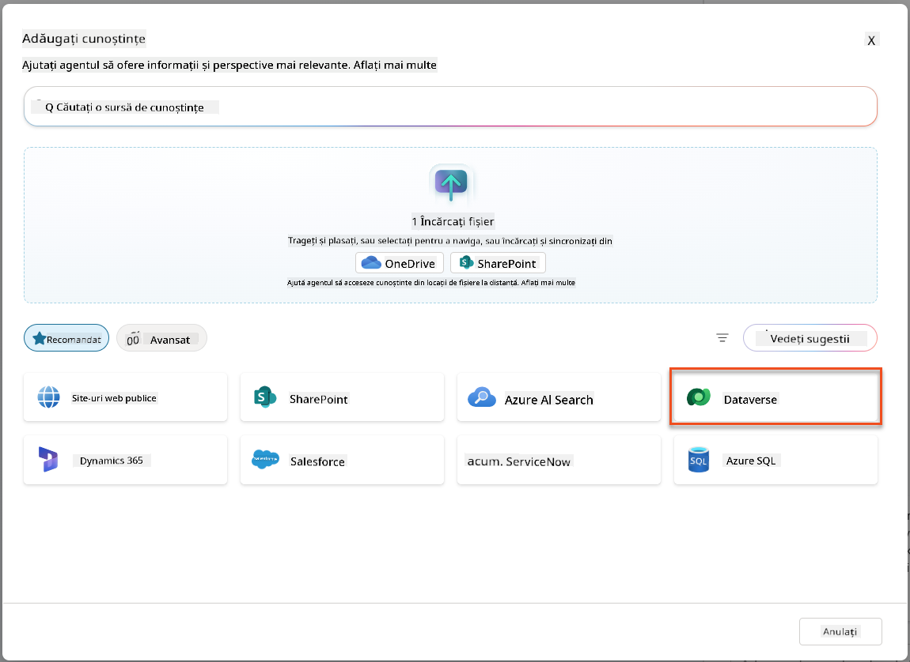
1. În **Search box**, introduceți `ppa_`. Acesta este prefixul pentru tabelele pe care le-ați importat anterior.
1. **Selectați** toate cele 5 tabele (Candidate, Evaluation Criteria, Job Application, Job Role, Resume)
1. Selectați **Add to agent**  
    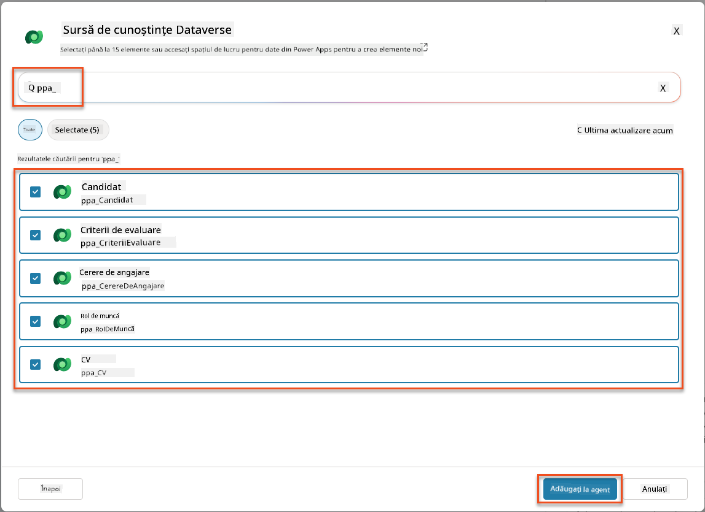
1. Selectați **Settings**, pe Interview Agent, și setați următoarele setări:

    - **Permiteți altor agenți să se conecteze și să folosească acest agent:** `On`
    - **Folosiți cunoștințe generale**: `Off`
    - **Încărcări de fișiere**: `Off`
    - **Nivel de moderare a conținutului:** `Medium`
1. Selectați **Save**
1. Selectați **Publish**, și așteptați finalizarea publicării.

### 2.2.4 Conectați Agentul de Pregătire pentru Interviu la Hiring Agent

1. Navigați înapoi la **Hiring Agent**

1. Selectați fila **Agents**

1. Folosiți **+Add an agent** → **Copilot Studio**, pentru a adăuga **Interview Agent**. Setați descrierea să fie:
    ```text
    Assists with the interview process and provides information about Resumes, Candidates, Job Roles, and Evaluation Criteria.
    ```

    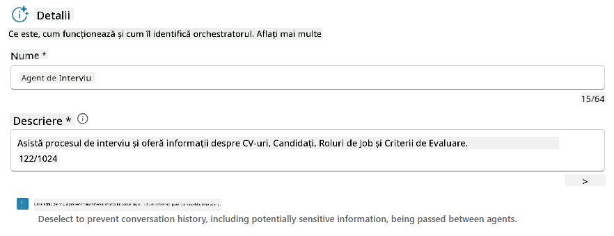
    Observați că opțiunea „Pass conversation history to this agent” este bifată. Acest lucru permite agentului părinte să ofere context complet agentului conectat.

1. Selectați **Add agent**

1. Asigurați-vă că vedeți atât **Application Intake Agent**, cât și **Interview Agent**. Observați cum unul este un agent copil, iar celălalt este un agent conectat.  
    

### 2.2.5 Testați colaborarea multi-agent

1. **Deschideți** panoul de testare selectând **Test**.

1. **Încărcați** unul dintre CV-urile de test și introduceți următoarea descriere care îi spune agentului părinte ce poate delega agentului conectat:

    ```text
    Upload this resume, then show me open job roles, each with a description of the evaluation criteria, then use this to match the resume to at least one suitable job role even if not a perfect match.
    ```

    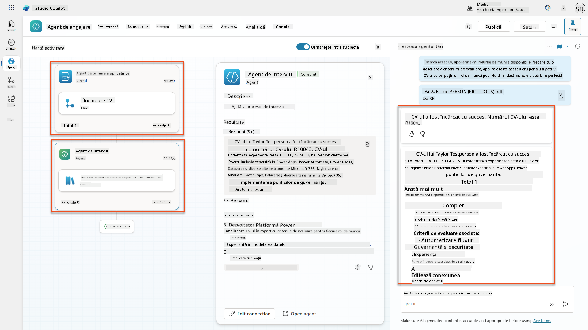

1. Observați cum Hiring Agent a delegat încărcarea agentului copil, iar apoi a cerut Interview Agent să ofere un rezumat și o potrivire cu rolul de muncă folosindu-și cunoștințele. 
   Experimentați cu diferite moduri de a pune întrebări despre CV-uri, roluri de muncă și criterii de evaluare.  
   **Exemple:**

    ```text
    Give me a summary of active resumes
    ```

    ```text
    Summarize resume R10044
    ```

    ```text
    Which active resumes are suitable for the Power Platform Developer role?
    ```

## 🎉 Misiune Îndeplinită

Excelentă treabă, Agent! **Operațiunea Simfonie** este acum completă. Ați transformat cu succes Hiring Agent-ul vostru într-o orchestră multi-agent sofisticată cu capabilități specializate.

Iată ce ați realizat în această misiune:

**✅ Stăpânirea arhitecturii multi-agent**  
Acum înțelegeți când să folosiți agenți copil vs agenți conectați și cum să proiectați sisteme scalabile.

**✅ Agent copil pentru Application Intake**  
Ați adăugat un agent copil specializat la Hiring Agent-ul vostru care procesează CV-uri, extrage date despre candidați și stochează informații în Dataverse.

**✅ Agent conectat pentru pregătirea interviului**  
Ați construit un agent conectat reutilizabil pentru pregătirea interviurilor și l-ați conectat cu succes la Hiring Agent-ul vostru.

**✅ Comunicare între agenți**  
Ați văzut cum agentul principal poate coordona cu agenți specializați, poate împărtăși contextul și poate orchestra fluxuri de lucru complexe.

**✅ Fundament pentru autonomie**  
Sistemul vostru de recrutare îmbunătățit este acum pregătit pentru funcționalitățile avansate pe care le vom adăuga în misiunile viitoare: declanșatoare autonome, moderarea conținutului și raționamente profunde.

🚀**Urmează:** În următoarea misiune, veți învăța cum să configurați agentul pentru a procesa autonom CV-uri din e-mailuri!

⏩[Treceți la Misiunea 03: Automatizați agentul cu declanșatoare](../03-automate-triggers/README.md)

## 📚 Resurse Tactice

📖 [Adăugați alți agenți (previzualizare)](https://learn.microsoft.com/microsoft-copilot-studio/authoring-add-other-agents?WT.mc_id=power-182762-scottdurow)

📖 [Adăugați instrumente agenților personalizați](https://learn.microsoft.com/microsoft-copilot-studio/advanced-plugin-actions?WT.mc_id=power-182762-scottdurow)

📖 [Lucrați cu Dataverse în Copilot Studio](https://learn.microsoft.com/microsoft-copilot-studio/knowledge-add-dataverse?WT.mc_id=power-182762-scottdurow)

📖 [Prezentare generală a fluxurilor agenților](https://learn.microsoft.com/microsoft-copilot-studio/flows-overview?WT.mc_id=power-182762-scottdurow)

📖 [Creați o soluție](https://learn.microsoft.com/power-platform/alm/solution-concepts-alm?WT.mc_id=power-182762-scottdurow)

📖 [Ghid ALM pentru soluții Power Platform](https://learn.microsoft.com/power-platform/alm/overview-alm?WT.mc_id=power-182762-scottdurow)

📺 [Colaborare între agenți în Copilot Studio](https://youtu.be/d-oD3pApHAg?si=rwIHKhJTkjSvhTHw)

---

**Declinare de responsabilitate**:  
Acest document a fost tradus folosind serviciul de traducere AI [Co-op Translator](https://github.com/Azure/co-op-translator). Deși ne străduim să asigurăm acuratețea, vă rugăm să fiți conștienți că traducerile automate pot conține erori sau inexactități. Documentul original în limba sa natală ar trebui considerat sursa autoritară. Pentru informații critice, se recomandă traducerea profesională realizată de un specialist uman. Nu ne asumăm responsabilitatea pentru eventualele neînțelegeri sau interpretări greșite care pot apărea din utilizarea acestei traduceri.