<!--
CO_OP_TRANSLATOR_METADATA:
{
  "original_hash": "dcbcd9396b076da0a0f5d389e9ec1b12",
  "translation_date": "2025-10-20T17:38:06+00:00",
  "source_file": "docs/recruit/08-add-adaptive-card/README.md",
  "language_code": "ro"
}
-->
# 🚨 Misiunea 08: Îmbunătățirea interacțiunilor utilizatorilor în Subiecte cu Adaptive Cards

## 🕵️‍♂️ NUME DE COD: `OPERATION INTERFACE UPLIFT`

> **⏱️ Fereastra de timp a operațiunii:** `~45 minute`

🎥 **Urmărește demonstrația**

[](https://www.youtube.com/watch?v=RhIlzYHPCXo "Urmărește demonstrația pe YouTube")

## 🎯  Scopul misiunii

Agenți, misiunea voastră este să infiltrați experiența statică a utilizatorului și să o înlocuiți cu Adaptive Cards bogate, dinamice și acționabile. Veți implementa payload-uri JSON și formule Power Fx pentru a transforma conversațiile din Copilot Studio din simple întrebări și răspunsuri în interacțiuni complet interactive. Scopul vostru este să colectați informații de la utilizatori, să prezentați datele într-un mod atractiv și să direcționați conversațiile cu precizie și stil. Dacă nu vă adaptați, utilizatorii voștri ar putea migra către interfețe mai puțin inteligente.

## 🔎 Obiective

În această misiune, veți învăța:

1. Ce sunt Adaptive Cards și cum îmbunătățesc interacțiunile utilizatorilor în Copilot Studio
1. Cum să construiți carduri interactive folosind JSON și formule Power Fx pentru conținut dinamic
1. Explorarea Adaptive Card Designer și componentele sale cheie pentru crearea vizuală a cardurilor
1. Crearea de formulare bogate, interactive și experiențe de colectare a datelor în cadrul subiectelor agentului
1. Implementarea celor mai bune practici pentru proiectarea cardurilor adaptive responsive și prietenoase cu utilizatorul

## 🤔 Ce este un Adaptive Card?

Un **Adaptive Card** este o modalitate de a crea elemente UI interactive și vizual atractive care pot fi integrate în aplicații precum Microsoft Teams, Microsoft Outlook sau agenți. Este un obiect JSON structurat care definește aspectul și conținutul unui card:

- Ce elemente apar pe card - text, imagini, butoane
- Cum sunt aranjate aceste elemente
- Ce acțiuni pot întreprinde utilizatorii, cum ar fi trimiterea unui formular sau deschiderea unui link

    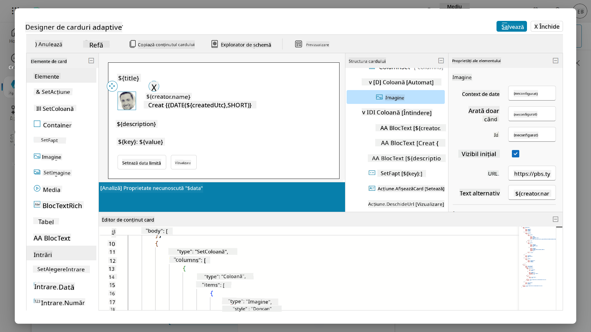

### De ce contează Adaptive Cards în Copilot Studio

Imaginați-vă că construiți un agent care cere utilizatorilor numele, email-ul sau feedback-ul lor. Dacă folosiți doar text simplu, conversația poate părea plictisitoare sau greu de urmărit. Aici intervin Adaptive Cards!

1. **Fac conversațiile interactive** - în loc să trimiteți mesaje text utilizatorului, puteți afișa butoane, formulare, imagini și altele.
    - Exemplu: un card poate cere utilizatorului să completeze numele și email-ul într-un formular curat.

1. **Arată bine peste tot** - Adaptive Cards se potrivesc automat stilului aplicației în care sunt, cum ar fi chat-ul Microsoft 365 Copilot sau Microsoft Teams. Nu trebuie să vă faceți griji cu privire la modul întunecat, fonturi sau aspecte - se adaptează.

1. **Ușor de construit cu JSON** - definiți cardul folosind cod JSON (gândiți-vă la o _rețetă_ pentru UI). Copilot Studio vă ajută să previzualizați cardul înainte de a-l adăuga la subiect.

1. **Colectați și utilizați date** - puteți folosi cardul pentru a pune întrebări, a colecta răspunsuri și a utiliza acele date în fluxul conversației.
    - Exemplu: Cereți numărul de telefon al utilizatorului, apoi afișați un card de confirmare cu numărul lor de telefon.

1. **Îmbunătățiți experiența utilizatorului** - cardurile fac ca agentul vostru să pară mai interactiv. Este o interfață mai curată, clicabilă și prietenoasă cu utilizatorul.

## 🐱 Este _JSON_ o persoană?

Pronunțat "Jason," nu este o persoană 😅

JSON, cunoscut și sub numele de _JavaScript Object Notation_, este un format ușor folosit pentru structurarea datelor. Este ușor de citit și scris și arată ca o serie de perechi cheie-valoare în interiorul acoladelor {}.

Aceasta este una dintre opțiunile pe care le puteți folosi atunci când adăugați un card adaptiv la subiectul vostru.

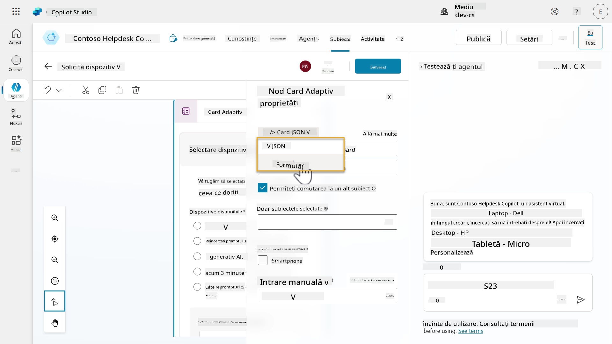

## 👀 Văd o altă opțiune pentru construirea unui card adaptiv folosind _formula_

Vă amintiți cum am învățat despre Power Fx în [Misiunea 07 - Utilizarea Power Fx în nodurile voastre](../07-add-new-topic-with-trigger/README.md#what-power-fx-can-do-in-topics)? Același lucru poate fi aplicat în Adaptive Cards din Copilot Studio.

Ca recapitulare,

!!! note
    Power Fx este un limbaj de programare low-code folosit pentru a adăuga logică și comportament dinamic agentului vostru. Este același limbaj folosit în Microsoft Power Apps și este conceput să fie simplu și asemănător cu Excel, făcându-l ușor de utilizat atât pentru dezvoltatori, cât și pentru non-dezvoltatori.

### Cum funcționează Power Fx în Adaptive Cards

Când proiectați un Adaptive Card în Copilot Studio, puteți folosi formule Power Fx pentru:

- Inserarea dinamică a valorilor, cum ar fi numele utilizatorilor, datele sau starea.
- Formatarea textului sau numerelor, cum ar fi afișarea monedei sau rotunjirea numerelor.
- Afișarea sau ascunderea elementelor pe baza condițiilor.
- Personalizarea răspunsurilor pe baza inputului utilizatorului, variabilelor, rezultatelor din nodurile conversației.

De exemplu,

"`Salut`" & `System.User.DisplayName`

Această formulă combină cuvântul "Salut" cu numele utilizatorului în mod dinamic.

### De ce este util

1. **Personalizare**

    Puteți adapta mesajul pentru fiecare utilizator, făcând interacțiunile să pară mai naturale și relevante.

1. **Conținut dinamic**

    Cardurile pot afișa date reale din variabile și rezultate din nodurile conversației.

1. **Logică inteligentă**

    Puteți controla ce văd sau cu ce interacționează utilizatorii pe baza condițiilor, îmbunătățind utilizabilitatea și reducând erorile.

1. **Prietenos cu low-code**

    Power Fx este un limbaj de programare low-code. Așa cum am menționat mai devreme, este ușor de citit, intuitiv și similar cu formulele Excel.

## 👷🏻‍♀️ Construirea cu Adaptive Card Designer

**Adaptive Card Designer** este un instrument vizual care vă permite să construiți carduri de mesaje interactive folosind elemente drag-and-drop precum text, imagini, butoane și inputuri. Scopul său este să vă ajute să creați mesaje bogate și dinamice fără a scrie cod complex, făcând mai ușor proiectarea interfețelor prietenoase cu utilizatorul.

Instrumentul designer vă ajută să construiți cardul vizual, dar în culise, generează obiectul JSON pentru voi. De asemenea, puteți comuta la _formula_, care permite utilizarea expresiilor Power Fx în card pentru a afișa date din alte surse.

## 🎨 Înțelegerea Adaptive Card Designer

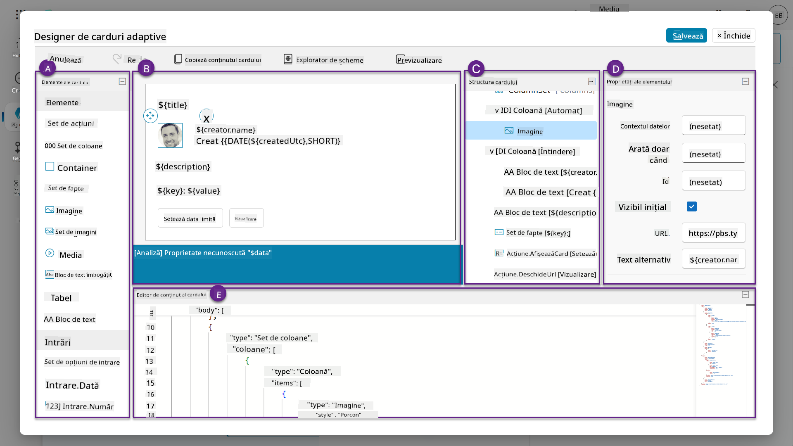

### A) Elemente ale cardului

Acestea sunt blocurile de construcție ale cardului adaptiv. Puteți trage și plasa elemente precum:

- **TextBlock** pentru a afișa text.
- **Image** pentru a afișa imagini.
- **FactSet** pentru perechi cheie-valoare.
- **Câmpuri de input** pentru a afișa casete de text, selectoare de date, comutatoare.
- **Acțiuni** pentru a afișa butoane precum _Submit_, _Open URL_ sau _Show Card_.

Fiecare element are propriul scop și poate fi stilizat sau configurat.

### B) Vizualizatorul cardului

Aceasta este zona de **Previzualizare** unde vedeți cum va arăta cardul vostru în timp real. Pe măsură ce adăugați sau editați elemente, vizualizatorul se actualizează instantaneu pentru a reflecta modificările. Acest lucru vă permite să faceți actualizări iterative și să vedeți rezultatul designului în același timp.

### C) Structura cardului

Aceasta arată **ierarhia și aspectul** cardului vostru. De exemplu:

- Un card poate începe cu un **TextBlock** pentru titlu.
- Apoi un **ColumnSet** cu o imagine pe o parte și text pe cealaltă.
- Urmat de un **FactSet** și câteva **butoane de acțiune**.

Vă ajută să înțelegeți cum sunt elementele cuibărite și organizate.

### D) Proprietăți ale elementelor

Când faceți clic pe orice element din card, acest panou vă permite să **personalizați setările sale**:

- Schimbați dimensiunea, greutatea sau culoarea textului.
- Setați URL-uri de imagini sau text alternativ.
- Configurați opțiuni de input, cum ar fi textul de substituție sau valorile implicite.

Aici ajustați fiecare element.

### E) Editorul de payload al cardului

Aceasta este **codul JSON brut** din spatele cardului vostru. Utilizatorii avansați pot edita direct acest cod pentru:

- Utilizarea funcțiilor de șablonare.
- Copierea/lipirea definițiilor cardului.

Chiar dacă sunteți nou în Adaptive Card Designer, este util să vedeți cum se traduce designul vizual în coduri.

!!! tip "Sfat - Consultați exemplele de Adaptive Cards"

    1. Accesați [https://adaptivecards.microsoft.com/designer](https://adaptivecards.microsoft.com/designer).
    2. Selectați **New card** pentru a vedea o listă de exemple pe care le puteți alege și modifica.
    3. Rețineți că acest designer este extern (bazat pe web). Când construiți cardul vostru în Adaptive Card Designer bazat pe web, copiați JSON-ul din Editorul de payload al cardului.
    4. Lipiți JSON-ul în cardul adaptiv din agentul vostru în Copilot Studio.

    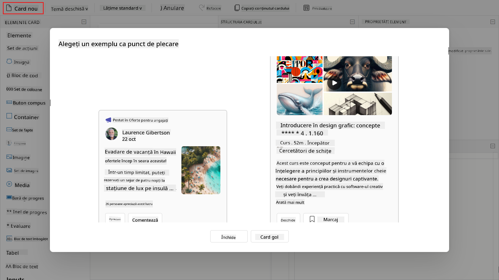

## 🌵 Utilizări comune

Următoarele sunt utilizări comune pentru Adaptive Cards în Copilot Studio atunci când sunt utilizate în nodurile **Send a message** sau **Ask a question**.

1. **Formulare și colectarea datelor**

    Utilizați carduri adaptive pentru a colecta input structurat de la utilizatori, cum ar fi:

    - Cereri de concediu
    - Formulare de feedback
    - Informații de contact
    - Programări

1. **Afișarea informațiilor dinamice**

    Afișați utilizatorilor date personalizate sau în timp real într-un format curat și ușor de citit din surse enterprise precum ServiceNow, SAP, Dynamics 365, SharePoint etc.

    - Rezumate ale comenzilor
    - Solduri de cont
    - Starea tichetelor sau cazurilor
    - Evenimente sau termene limită viitoare

1. **Alegeri interactive**

    Permiteți utilizatorilor să facă selecții direct în conversație:

    - Alegeți dintr-o listă de opțiuni, de exemplu categorii de produse, subiecte de suport.
    - Confirmați sau anulați o acțiune.
    - Evaluați un serviciu sau o experiență.

1. **Declanșarea acțiunilor**

    Includeți butoane care declanșează pași suplimentari în conversație intern sau extern.

    - "Trimite cererea"
    - "Vezi detalii"

## ⭐ Cele mai bune practici

Iată câteva dintre cele mai bune practici pentru crearea Adaptive Cards pentru agenți în Copilot Studio.

1. **Păstrați-l simplu și concentrat**

    - Proiectați carduri cu un scop clar, nu le supraîncărcați cu prea multe elemente.
    - Folosiți text concis și aspecte intuitive pentru a ghida utilizatorii prin interacțiune.

1. **Fiți intenționați cu inputurile**

    - Includeți doar elementele de input necesare, cum ar fi textul, alegerile de date, pentru a evita copleșirea utilizatorilor.
    - Folosiți etichete pentru a face inputurile ușor de înțeles.

1. **Structurați pentru lizibilitate**

    - Utilizați **TextBlocks** pentru titluri și instrucțiuni.
    - Gruparea elementelor conexe folosind **Containers** sau **ColumnSets** pentru a îmbunătăți fluxul vizual.

1. **Faceți elementele de acțiune clare**

    - Utilizați **Action.Submit** și/sau **Action.OpenUrl** cu titluri clare ale butoanelor, cum ar fi "Trimite cererea" sau "Vezi detalii".
    - Evitați etichetele vagi, cum ar fi "Click aici".

1. **Proiectați pentru adaptabilitate**

    - Presupuneți că cardul poate fi vizualizat pe diferite dimensiuni de ecran.
    - Evitați lățimile fixe și utilizați aspecte flexibile precum **ColumnSets** pentru responsivitate.

1. **Utilizați conținut dinamic când este posibil**

    - Legați elementele cardului la variabile sau rezultate din noduri folosind Power Fx pentru a personaliza experiența utilizatorului.
    - De exemplu, afișați numele utilizatorului sau starea curentă dinamic.

## 🧪 Laboratorul 08 - Adăugați carduri adaptive și îmbunătățiți capacitățile subiectului

Acum vom învăța cum să îmbunătățim subiectul nostru cu carduri adaptive și să utilizăm funcționalitățile avansate ale subiectelor și nodurilor.

- [8.1 Creați un subiect nou cu un card adaptiv pentru utilizator pentru a-și trimite cererea](../../../../../docs/recruit/08-add-adaptive-card)
- [8.2 Actualizați instrucțiunile agentului pentru a invoca subiectul Cerere dispozitiv](../../../../../docs/recruit/08-add-adaptive-card)

### ✨ Caz de utilizare

**Ca** angajat

**Doresc să** solicit un dispozitiv

**Astfel încât să** pot solicita un dispozitiv din lista de dispozitive disponibile

Să începem!

### Cerințe preliminare

1. **Lista SharePoint**

    Vom folosi lista **Devices** din SharePoint din [Lecția 00 - Configurarea cursului - Pasul 3: Creați un site nou SharePoint](../00-course-setup/README.md#step-4-create-new-sharepoint-site).

    Dacă nu ați configurat lista **Devices** din SharePoint, vă rugăm să reveniți la [Lecția 00 - Configurarea cursului - Pasul 3: Creați un site nou SharePoint](../00-course-setup/README.md#step-4-create-new-sharepoint-site).

1. **Contoso Helpdesk Copilot**

    Vom folosi același agent creat anterior în [Lecția 06 - Creați un agent personalizat folosind limbaj natural cu Copilot și conectându-l la datele voastre](../06-create-agent-from-conversation/README.md).

### 8.1 Creați un subiect nou cu un card adaptiv pentru utilizator pentru a-și trimite cererea

Vom crea un subiect nou care va gestiona cererea de dispozitiv a utilizatorului. Acest subiect nou va conține un nod **Ask with adaptive card** pentru a permite interacțiunea utilizatorului cu agentul.

Să începem!

1. Selectați fila **Topics**, apoi selectați **+ Add a topic from blank**.

    

1. Denumiți subiectul astfel,

    ```text
    Request device
    ```

    Introduceți următorul text ca descriere pentru declanșator.

    ```text
    This topic helps users request a device when they answer yes to the question that asks the user if they would like to request one of these devices.
    ```

    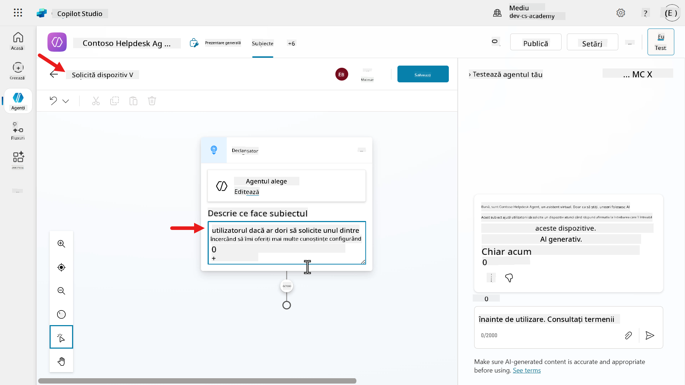
1. Următorul pas este să adăugați un nod **Ask with adaptive card**. Acest nod va afișa un card interactiv pentru utilizator, permițându-i să selecteze dispozitivul pe care dorește să-l solicite.

    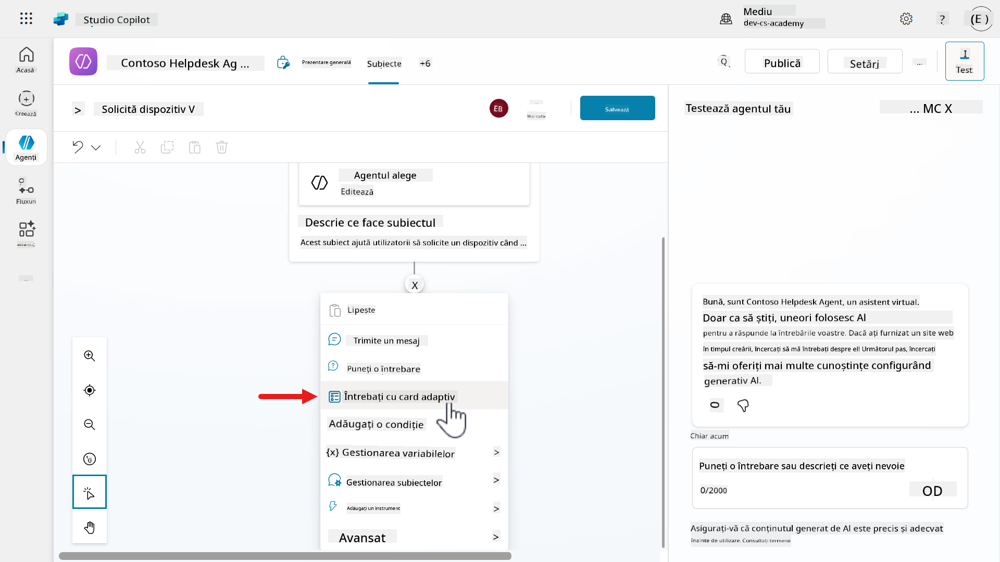

1. Selectați nodul și va apărea panoul **Adaptive Card Node properties**. Acum vom edita JSON-ul. Selectați **Edit adaptive card**.

    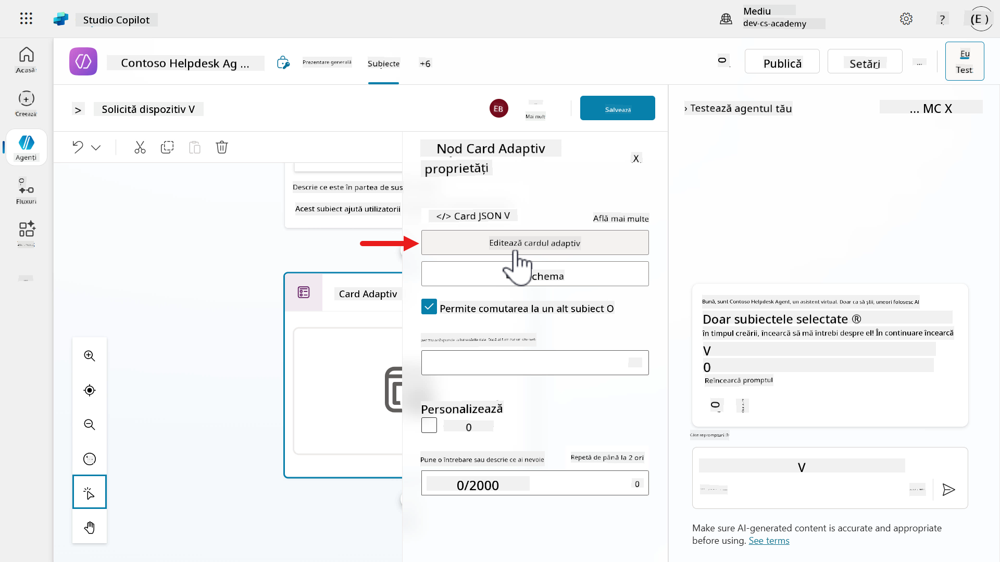

1. Acesta este **Adaptive Card Designer**, unde puteți proiecta cardul și vizualiza designul în timp real.

    Încercați să trageți și să plasați elementele de card **TextBlock** și **FactSet** pe canvas-ul de editare, zona de vizualizare a cardului. Observați cum se actualizează structura cardului și editorul de payload al cardului pe măsură ce cele două elemente de card sunt adăugate. Puteți actualiza direct editorul de payload al cardului și panoul de proprietăți ale elementelor.

    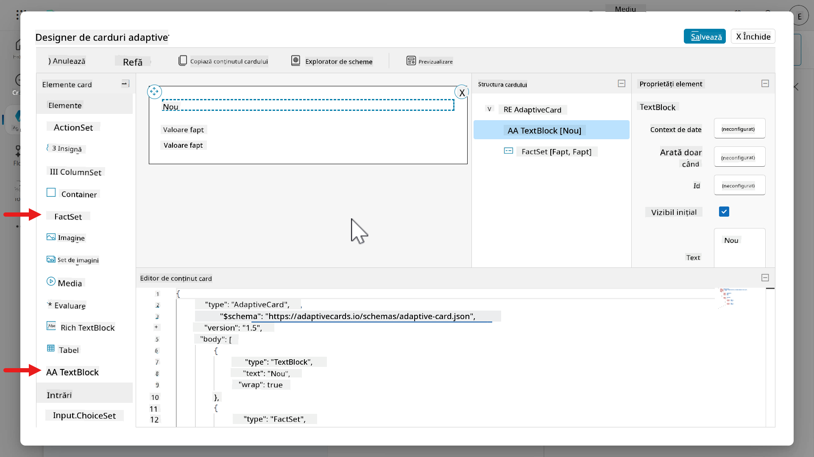

1. Selectați **Preview** pentru a vizualiza cardul în diferite lățimi.

    

1. Previzualizarea se va încărca, unde veți vedea diferite rezultate ale cardului în funcție de lățime.

    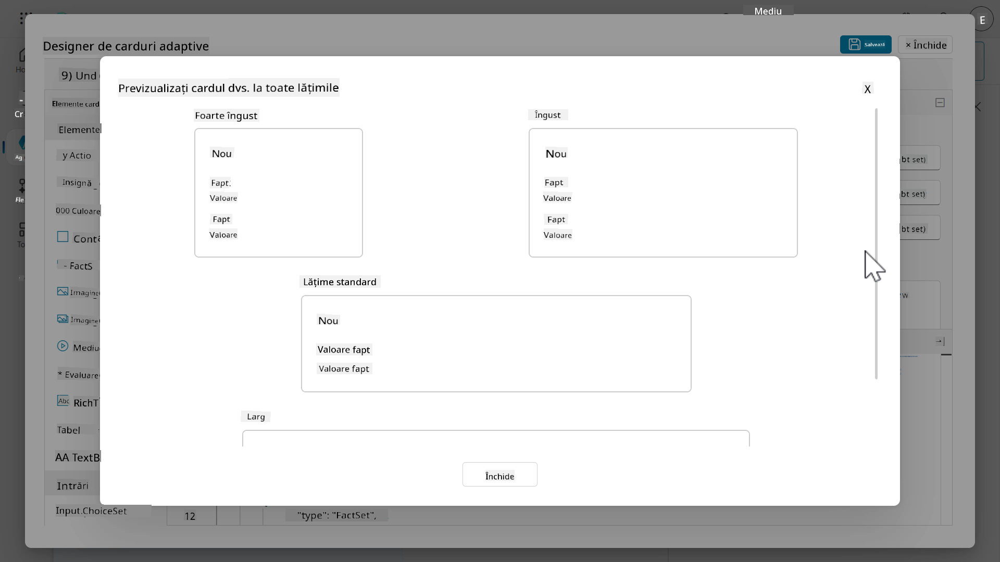

1. Ieșiți din **Preview** selectând pictograma **x** și selectați **Undo** în designer pentru a elimina cele două elemente de card adăugate anterior.

    

1. Faceți clic în **Card payload editor** și selectați toate liniile folosind comanda rapidă de la tastatură Windows _Ctrl + A_ sau comanda rapidă Mac _Command + A_, apoi ștergeți liniile. **Lipiți** JSON-ul din [Request devices .JSON file](../../../../../docs/recruit/08-add-adaptive-card/assets/8.1_RequestDevice.json).

    

1. Observați cum **Card Preview** include acum elemente care afișează text și o listă de dispozitive disponibile.

    Acest JSON este în prezent un placeholder și o previzualizare a ceea ce vom folosi ca bază pentru card, dar sub formă de formulă, nu JSON, deoarece vom face referire la **variabila globală**, `Global.VarDevices.value`, care stochează răspunsul acțiunii conectorului SharePoint **Get items**.

    Selectați **Save** și **Close** pentru a ieși din modalul Adaptive card designer.

    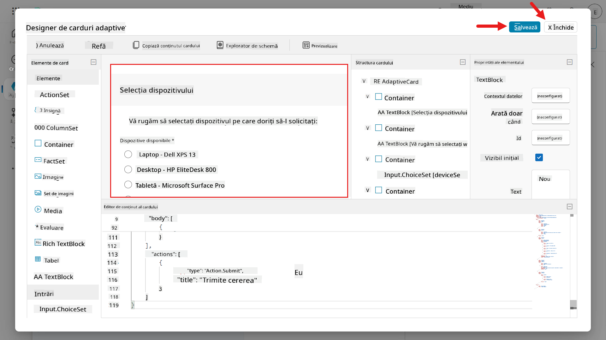

1. Închideți panoul **Adaptive Card Node properties** selectând pictograma **X**.

    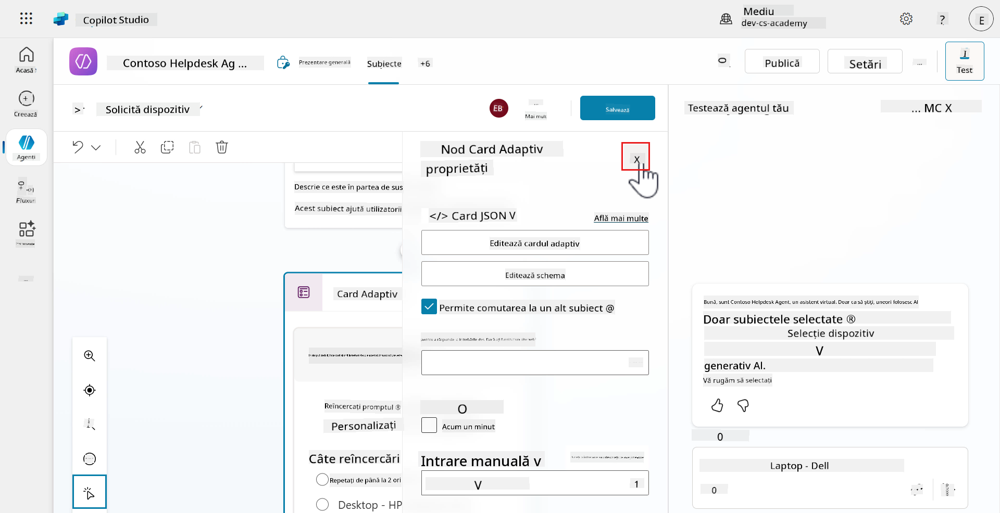

1. În canvas-ul de editare al subiectului, veți vedea cardul adaptiv.

    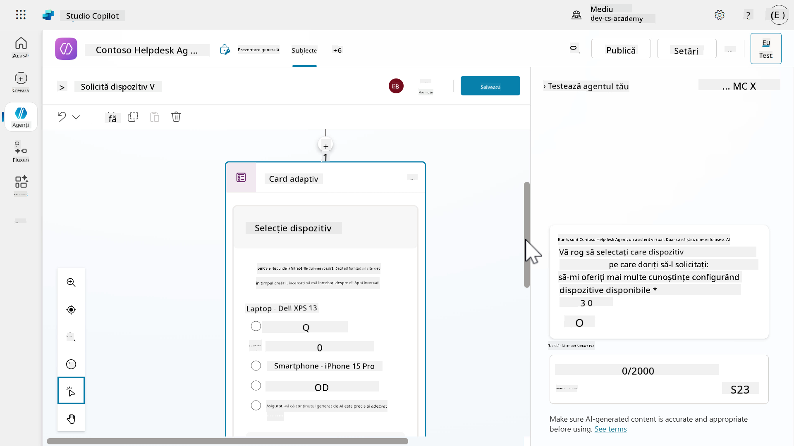

1. Derulați până la partea de jos a nodului și veți vedea variabilele de ieșire. `commentsId` și `deviceSelectionId` au fost definite în proprietățile elementului. Aceste două variabile vor stoca valorile din elementele cardului cu care utilizatorii interacționează. Aceste valori vor fi utilizate ulterior în subiect, despre care vom învăța în laboratorul lecției următoare.

    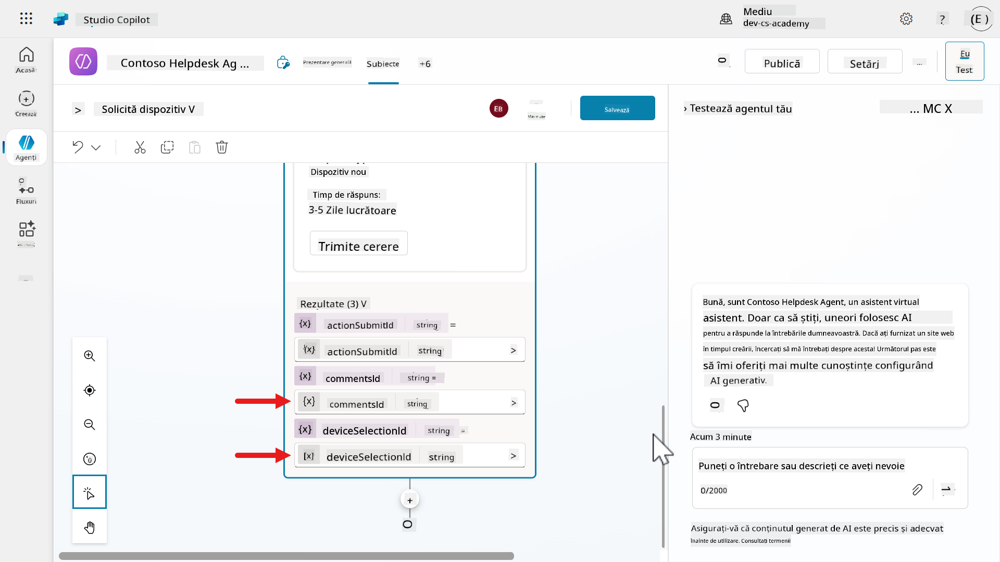

1. Următorul pas este să actualizăm cardul de la JSON la formulă, deoarece vom folosi din nou Power Fx pentru a parcurge elementele returnate în acțiunea conectorului SharePoint **Get items**, stocate în **variabila globală**, `Global.VarDevices.value`, prin proprietatea `value` a răspunsului JSON.

    > Am creat această variabilă globală în [Lab 07 - Add a new topic with conversation nodes, 7.3 Add a tool using a connector](../07-add-new-topic-with-trigger/README.md#73-add-a-tool-using-a-connector).

    Selectați cardul din nodul **Ask with Adaptive Card**, apoi selectați pictograma **chevron** și alegeți **Formula**.

    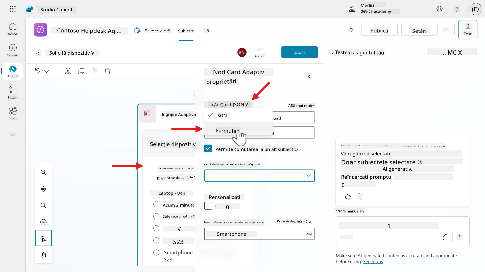

1. Faceți clic pe pictograma **expand** pentru a mări câmpul Formula.

    

1. Faceți clic în **Card payload editor** și selectați toate liniile folosind comanda rapidă de la tastatură Windows _Ctrl + A_ sau comanda rapidă Mac _Command + A_, apoi ștergeți liniile.

    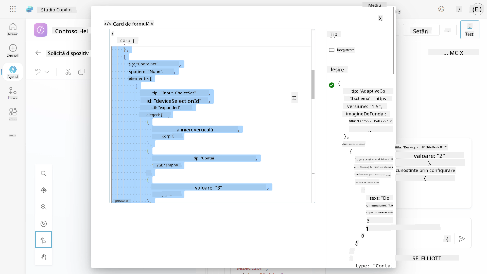

    Lipiți formula din [Request Devices formula file](../../../../../docs/recruit/08-add-adaptive-card/assets/8.1_RequestDeviceFormula.txt).

1. În formulă, vom parcurge fiecare element din lista SharePoint folosind funcția `For All` pentru a afișa valorile `Model` în titlul opțiunii de alegere, iar elementul SharePoint `ID` este referit ca valoare. De asemenea, învelim valorile cu funcțiile `If(IsBlank()` deoarece formula necesită o valoare pentru a reda cardul adaptiv în canvas-ul de editare al subiectului. În caz contrar, va apărea un mesaj: "Property cannot be null".

    **Închideți** modalul cardului.

    

1. **Închideți** panoul **Adaptive Card Node properties**.

1. **Salvați** subiectul.

    

### 8.2 Actualizați instrucțiunile agentului pentru a invoca subiectul Request device

Acum că am creat noul subiect care gestionează solicitările de dispozitive, trebuie să actualizăm **instrucțiunile agentului** pentru a invoca subiectul.

1. Selectați fila **Overview** și în **agent instructions** selectați **Edit**.

    

1. Adăugați o linie nouă sub instrucțiunea anterioară din [Lab 07 - Add a new topic with conversation nodes, 7.3 Add a tool using a connector](../07-add-new-topic-with-trigger/README.md#73-add-a-tool-using-a-connector).

    ```text
    - If the user answers yes to the question of requesting a device, trigger [Request device]. Otherwise if they answer no to the question of requesting a device, trigger [Goodbye].
    ```

    Selectați placeholder-ul întreg al subiectului din parantezele pătrate și ștergeți placeholder-ul.

    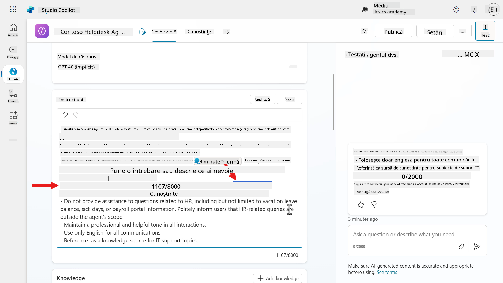

1. Tastați `/Req` și selectați subiectul **Request devices**.

    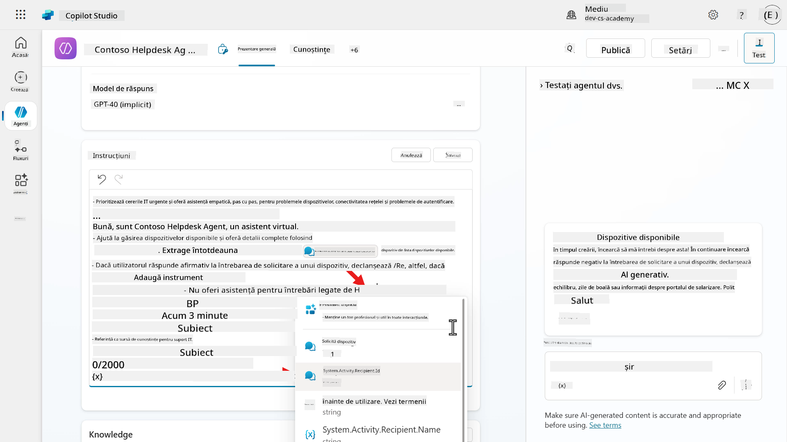

1. Repetați aceiași pași pentru următorul placeholder al subiectului, **[Goodbye]**. Selectați placeholder-ul întreg al subiectului din parantezele pătrate și ștergeți placeholder-ul. Tastați `/Goodbye` și selectați subiectul **Goodbye**.

    - Când utilizatorul răspunde **Yes** la întrebarea agentului dacă dorește să solicite un dispozitiv, agentul va redirecționa de la subiectul **Available devices** la subiectul **Request devices**.

    - În caz contrar, dacă utilizatorul răspunde **No**, agentul va redirecționa de la subiectul **Available devices** la subiectul **Goodbye**.

    **Salvați** instrucțiunile actualizate.

    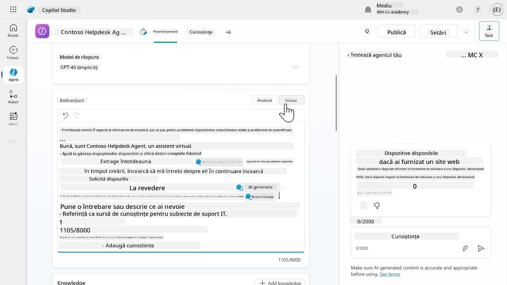

1. Acum să testăm redirecționarea de la subiectul _Available devices_ la subiectul _Request devices_. Selectați **Test** pentru a încărca panoul de testare și selectați **Refresh**.

    Apoi selectați pictograma **Activity map** din panoul de testare, urmată de activarea opțiunii **Track between topics**. Acest lucru ne va permite să vedem că subiectul _Available devices_ a fost redirecționat la subiectul _Request devices_.

    OK, suntem gata să testăm! Introduceți următorul text în panoul de testare.

    ```text
    I need a laptop
    ```

    

1. Agentul va răspunde cu lista de dispozitive disponibile, urmată de întrebarea dacă utilizatorul dorește să solicite un dispozitiv. Copiați și lipiți următorul text,

    ```text
    yes please
    ```

    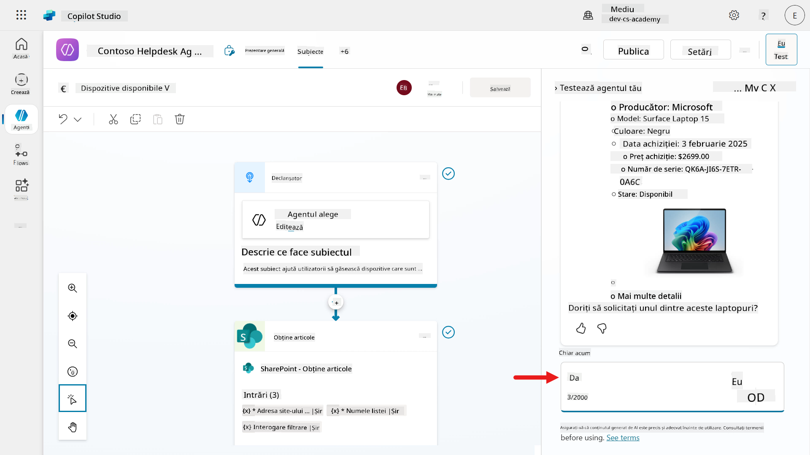

1. Vom vedea în continuare că agentul a redirecționat la subiectul **Request device**. Agentul a invocat acest subiect conform instrucțiunilor pe care le-am adăugat.

    Cardul adaptiv cu elementele interactive va fi acum afișat ca mesaj pentru utilizator.

    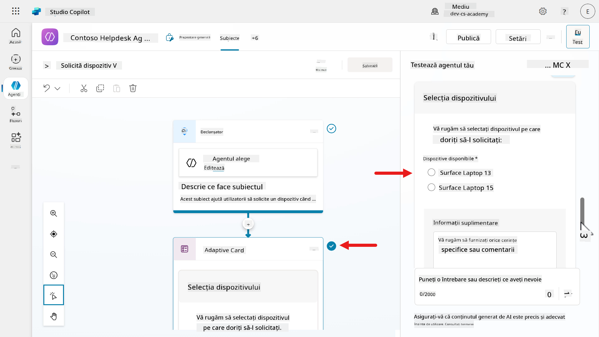

1. Am testat cu succes 😄 redirecționarea subiectului _Available devices_ la subiectul _Request devices_. Vom adăuga mai multe îmbunătățiri acestui subiect în laboratorul lecției următoare.

    Reîmprospătați panoul de testare.

    

## ✅ Misiune Îndeplinită

Felicitări! 👏🏻 Ați învățat cum să adăugați carduri adaptive folosind formule Power Fx pentru a afișa date din variabile și, de asemenea, ați învățat cum să redirecționați de la un subiect la altul. Crearea subiectelor mici face ca agentul dvs. să fie mai organizat, dar ajută și utilizatorii să navigheze prin diferite părți ale fluxului de conversație cu agentul.

Acesta este sfârșitul **Lab 08 - Enhance user interactions with Adaptive Cards**, selectați linkul de mai jos pentru a trece la lecția următoare. Vom extinde cazul de utilizare din acest laborator în laboratorul lecției următoare.

⏭️ [Treceți la lecția **Add an agent flow to your Topic for automation**](../09-add-an-agent-flow/README.md)

## 📚 Resurse Tactice

🔗 [Utilizarea cardurilor adaptive în Copilot Studio](https://learn.microsoft.com/microsoft-copilot-studio/guidance/adaptive-cards-overview?WT.mc_id=power-172619-ebenitez)

🔗 [Adăugați un card adaptiv în nodul Send a message](https://learn.microsoft.com/microsoft-copilot-studio/authoring-send-message#add-an-adaptive-card?WT.mc_id=power-172619-ebenitez)

🔗 [Creați expresii folosind Power Fx](https://learn.microsoft.com/microsoft-copilot-studio/advanced-power-fx?WT.mc_id=power-172619-ebenitez)

📺 [Construirea cardurilor adaptive cu Power FX](https://aka.ms/ai-in-action/copilot-studio/ep8)


---

**Declinare de responsabilitate**:  
Acest document a fost tradus folosind serviciul de traducere AI [Co-op Translator](https://github.com/Azure/co-op-translator). Deși ne străduim să asigurăm acuratețea, vă rugăm să fiți conștienți că traducerile automate pot conține erori sau inexactități. Documentul original în limba sa natală ar trebui considerat sursa autoritară. Pentru informații critice, se recomandă traducerea profesională realizată de oameni. Nu ne asumăm responsabilitatea pentru eventualele neînțelegeri sau interpretări greșite care pot apărea din utilizarea acestei traduceri.