<!--
CO_OP_TRANSLATOR_METADATA:
{
  "original_hash": "dcbcd9396b076da0a0f5d389e9ec1b12",
  "translation_date": "2025-10-20T17:37:19+00:00",
  "source_file": "docs/recruit/08-add-adaptive-card/README.md",
  "language_code": "sk"
}
-->
# 🚨 Misia 08: Zlepšenie interakcií používateľov v Témach pomocou Adaptívnych kariet

## 🕵️‍♂️ KRYCÍ NÁZOV: `OPERÁCIA ZLEPŠENIE ROZHRANIA`

> **⏱️ Časový rámec operácie:** `~45 minút`

🎥 **Pozrite si prehľad**

[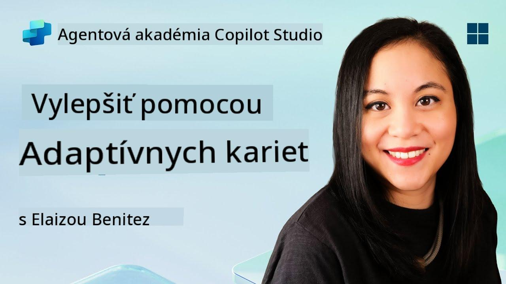](https://www.youtube.com/watch?v=RhIlzYHPCXo "Pozrite si prehľad na YouTube")

## 🎯  Misia

Agenti, vašou misiou je preniknúť do statického používateľského rozhrania a nahradiť ho bohatými, dynamickými a interaktívnymi adaptívnymi kartami. Nasadíte JSON payloady a Power Fx vzorce na transformáciu konverzácií v Copilot Studio z jednoduchých otázok a odpovedí na plne interaktívne zapojenia. Vaším cieľom je zhromaždiť vstupy od používateľov, prezentovať údaje esteticky a presne riadiť konverzácie. Ak sa neprispôsobíte, vaši používatelia môžu prejsť na menej inteligentné rozhrania.

## 🔎 Ciele

V tejto misii sa naučíte:

1. Pochopiť, čo sú adaptívne karty a ako zlepšujú interakcie používateľov v Copilot Studio
1. Naučiť sa vytvárať interaktívne karty pomocou JSON a Power Fx vzorcov pre dynamický obsah
1. Preskúmať Adaptívny návrhár kariet a jeho kľúčové komponenty pre vizuálnu tvorbu kariet
1. Vytvárať bohaté, interaktívne formuláre a skúsenosti so zhromažďovaním údajov v témach agentov
1. Implementovať najlepšie postupy pri navrhovaní responzívnych a používateľsky prívetivých adaptívnych kariet

## 🤔 Čo je adaptívna karta?

**Adaptívna karta** je spôsob, ako vytvárať interaktívne, vizuálne bohaté prvky používateľského rozhrania, ktoré môžu byť vložené do aplikácií ako Microsoft Teams, Microsoft Outlook alebo agentov. Je to štruktúrovaný JSON objekt, ktorý definuje rozloženie a obsah karty:

- Aké prvky sa zobrazia na karte - text, obrázky, tlačidlá
- Ako sú tieto prvky usporiadané
- Aké akcie môžu používatelia vykonať, ako napríklad odoslanie formulára alebo otvorenie odkazu

    

### Prečo sú adaptívne karty dôležité v Copilot Studio

Predstavte si, že vytvárate agenta, ktorý sa pýta používateľov na ich meno, e-mail alebo spätnú väzbu. Ak použijete iba obyčajný text, konverzácia môže pôsobiť nudne alebo ťažko sledovateľne. Tu prichádzajú na rad adaptívne karty!

1. **Robia konverzácie interaktívnymi** - namiesto posielania textu ako správy používateľovi môžete zobraziť tlačidlá, formuláre, obrázky a ďalšie.
    - Príklad: karta môže požiadať používateľa, aby vyplnil svoje meno a e-mail v čistom formulári.

1. **Vyzerajú skvele všade** - Adaptívne karty automaticky zodpovedajú štýlu aplikácie, v ktorej sa nachádzajú, ako napríklad Microsoft 365 Copilot chat alebo Microsoft Teams. Nemusíte sa obávať tmavého režimu, písma alebo rozloženia - prispôsobia sa.

1. **Jednoduché na vytvorenie pomocou JSON** - kartu definujete pomocou JSON kódu (myslite na to ako na _recept_ pre používateľské rozhranie). Copilot Studio vám umožňuje náhľad vašej karty pred jej pridaním do témy.

1. **Zhromažďovanie a používanie údajov** - kartu môžete použiť na kladenie otázok, zhromažďovanie odpovedí a použitie týchto údajov v toku konverzácie.
    - Príklad: Požiadajte o telefónne číslo používateľa a potom zobrazte potvrdzovaciu kartu s jeho telefónnym číslom.

1. **Zlepšenie používateľskej skúsenosti** - karty robia vášho agenta interaktívnejším. Je to čistejšie, klikateľnejšie a používateľsky prívetivejšie rozhranie.

## 🐱 Je _JSON_ osoba?

Vyslovuje sa ako "Jason," ale nie je to osoba 😅

JSON, inak známy ako _JavaScript Object Notation_, je ľahký formát používaný na štruktúrovanie údajov. Je ľahko čitateľný a zapisovateľný a vyzerá ako séria dvojíc kľúč-hodnota vo vnútri zložených zátvoriek {}.

Toto je jedna z možností, ktorú môžete použiť pri pridávaní adaptívnej karty do vašej témy.

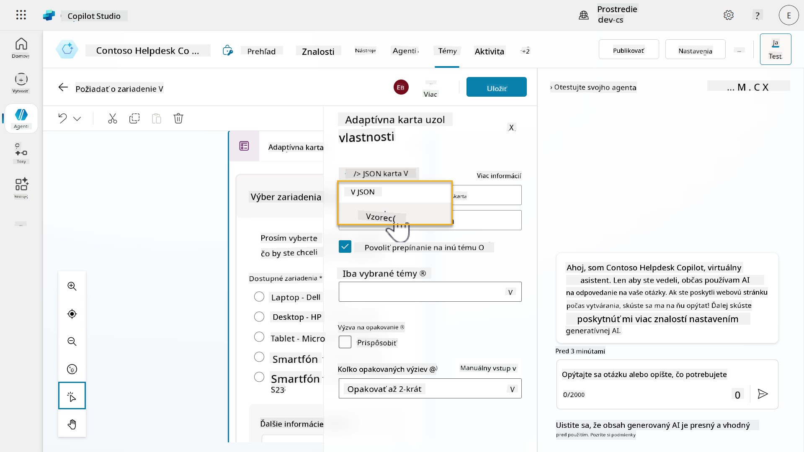

## 👀 Vidím ďalšiu možnosť na vytvorenie adaptívnej karty pomocou _vzorcov_

Pamätáte si, ako sme sa učili o Power Fx v [Misii 07 - Používanie Power Fx vo vašich uzloch](../07-add-new-topic-with-trigger/README.md#what-power-fx-can-do-in-topics)? To isté sa dá aplikovať v adaptívnych kartách v Copilot Studio.

Ako pripomenutie,

!!! note
    Power Fx je nízko-kódový programovací jazyk používaný na pridanie logiky a dynamického správania do vášho agenta. Je to ten istý jazyk používaný v Microsoft Power Apps a je navrhnutý tak, aby bol jednoduchý a podobný Excelu, čo ho robí ľahko použiteľným pre vývojárov aj ne-vývojárov.

### Ako Power Fx funguje v adaptívnych kartách

Keď navrhujete adaptívnu kartu v Copilot Studio, môžete použiť Power Fx vzorce na:

- Dynamické vloženie hodnôt, ako sú mená používateľov, dátumy alebo stavy.
- Formátovanie textu alebo čísel, napríklad zobrazenie meny alebo zaokrúhlenie čísel.
- Zobrazenie alebo skrytie prvkov na základe podmienok.
- Prispôsobenie odpovedí na základe vstupov používateľov, premenných, výstupov z konverzačných uzlov.

Napríklad,

"`Hello`" & `System.User.DisplayName`

Tento vzorec dynamicky kombinuje slovo "Hello" s menom používateľa.

### Prečo je to užitočné

1. **Personalizácia**

    Môžete prispôsobiť správu každému používateľovi, čím interakcie pôsobia prirodzenejšie a relevantnejšie.

1. **Dynamický obsah**

    Karty môžu zobrazovať reálne údaje z premenných a výstupov z konverzačných uzlov.

1. **Inteligentná logika**

    Môžete kontrolovať, čo používateľ vidí alebo s čím interaguje na základe podmienok, čím zlepšujete použiteľnosť a znižujete chyby.

1. **Nízko-kódová priateľskosť**

    Power Fx je nízko-kódový programovací jazyk. Ako už bolo spomenuté, je čitateľný, intuitívny a podobný Excel vzorcom.

## 👷🏻‍♀️ Tvorba pomocou Adaptívneho návrhára kariet

**Adaptívny návrhár kariet** je vizuálny nástroj, ktorý vám umožňuje vytvárať interaktívne správy pomocou drag-and-drop prvkov, ako sú text, obrázky, tlačidlá a vstupy. Jeho účelom je pomôcť vám vytvárať bohaté, dynamické správy bez písania zložitého kódu, čím sa uľahčuje navrhovanie používateľsky prívetivých rozhraní.

Návrhár vám pomáha vizuálne vytvárať kartu, ale v zákulisí generuje JSON objekt za vás. Môžete tiež prepnúť na _vzorce_, ktoré umožňujú použitie Power Fx výrazov v karte na zobrazenie údajov odinakiaľ.

## 🎨 Pochopenie Adaptívneho návrhára kariet

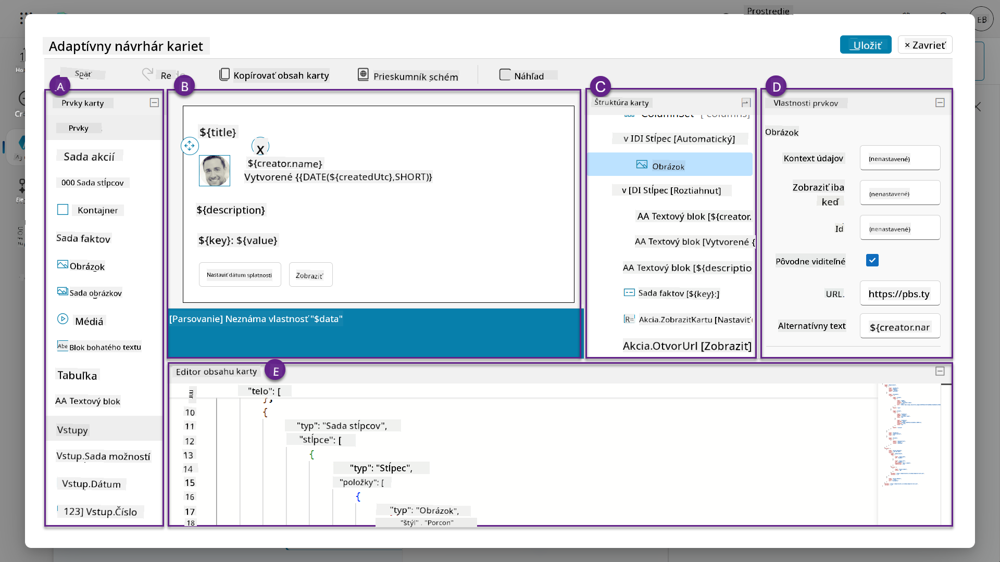

### A) Prvky karty

Tieto sú stavebnými blokmi vašej adaptívnej karty. Môžete presúvať a púšťať prvky, ako napríklad:

- **TextBlock** na zobrazenie textu.
- **Image** na zobrazenie obrázkov.
- **FactSet** pre dvojice kľúč-hodnota.
- **Vstupné polia** na zobrazenie textových polí, výberu dátumu, prepínačov.
- **Akcie** na zobrazenie tlačidiel, ako sú _Submit_, _Open URL_, alebo _Show Card_.

Každý prvok má svoj vlastný účel a môže byť štýlovo upravený alebo konfigurovaný.

### B) Prehliadač kariet

Toto je **Náhľad** oblasti, kde vidíte, ako bude vaša karta vyzerať v reálnom čase. Ako pridávate alebo upravujete prvky, prehliadač sa okamžite aktualizuje, aby odrážal zmeny. To vám umožňuje robiť iteratívne úpravy a zároveň vidieť výsledok návrhu.

### C) Štruktúra karty

Toto ukazuje **hierarchiu a rozloženie** vašej karty. Napríklad:

- Karta môže začínať **TextBlock** pre nadpis.
- Potom **ColumnSet** s obrázkom na jednej strane a textom na druhej.
- Nasleduje **FactSet** a niekoľko **Akčných tlačidiel**.

Pomáha vám pochopiť, ako sú prvky vnorené a organizované.

### D) Vlastnosti prvkov

Keď kliknete na akýkoľvek prvok na karte, tento panel vám umožní **prispôsobiť jeho nastavenia**:

- Zmeniť veľkosť, hrúbku alebo farbu textu.
- Nastaviť URL obrázkov alebo alternatívny text.
- Konfigurovať možnosti vstupu, ako je text zástupného symbolu alebo predvolené hodnoty.

Tu môžete doladiť každý prvok.

### E) Editor payloadu karty

Toto je **surový JSON kód** za vašou kartou. Pokročilí používatelia ho môžu upravovať priamo na:

- Použitie funkcií šablónovania.
- Kopírovanie/vkladanie definícií kariet.

Aj keď ste noví v návrhárovi adaptívnych kariet, je užitočné vidieť, ako sa vizuálny návrh prekladá do kódu.

!!! tip "Tip - Pozrite si vzorky adaptívnych kariet"

    1. Prejdite na [https://adaptivecards.microsoft.com/designer](https://adaptivecards.microsoft.com/designer).
    2. Vyberte **Nová karta**, aby ste videli zoznam vzoriek, ktoré môžete vybrať a upraviť.
    3. Upozorňujeme, že tento návrhár je externý (webový). Keď vytvoríte svoju kartu v webovom návrhárovi adaptívnych kariet, skopírujte JSON z Editora payloadu karty.
    4. Vložte JSON do svojej adaptívnej karty vo vašom agentovi v Copilot Studio.

    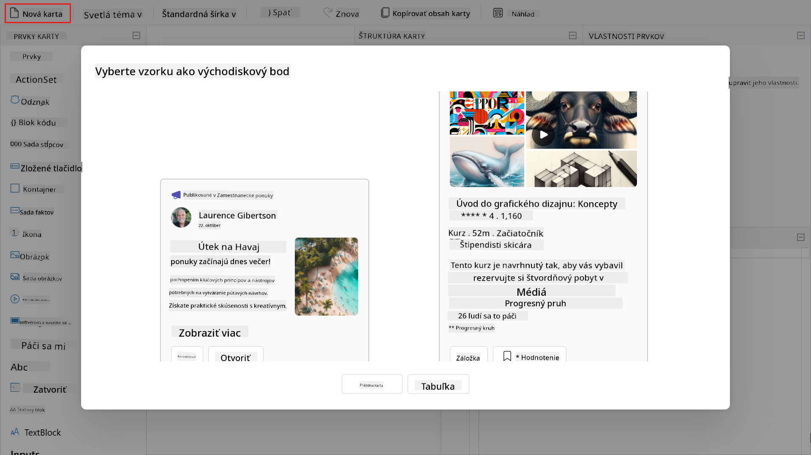

## 🌵 Bežné použitia

Nasledujú bežné použitia adaptívnych kariet v Copilot Studio, keď sa používajú v uzloch **Odoslať správu** alebo **Opýtať sa otázku**.

1. **Formuláre a zhromažďovanie údajov**

    Použite adaptívne karty na zhromažďovanie štruktúrovaných vstupov od používateľov, ako napríklad:

    - Žiadosti o dovolenku
    - Formuláre spätnej väzby
    - Kontaktné informácie
    - Plánovanie schôdzok

1. **Zobrazenie dynamických informácií**

    Zobrazuje používateľom personalizované alebo reálne údaje v čistom, čitateľnom formáte z podnikových zdrojov, ako sú ServiceNow, SAP, Dynamics 365, SharePoint atď.

    - Súhrny objednávok
    - Zostatky na účtoch
    - Stav lístka alebo prípadu
    - Nadchádzajúce udalosti alebo termíny

1. **Interaktívne voľby**

    Umožnite používateľom robiť výbery priamo v konverzácii:

    - Vyberte zo zoznamu možností, napríklad kategórie produktov, témy podpory.
    - Potvrďte alebo zrušte akciu.
    - Ohodnoťte službu alebo skúsenosť.

1. **Spúšťanie akcií**

    Zahrňte tlačidlá, ktoré spúšťajú ďalšie kroky v konverzácii interne alebo externe.

    - "Odoslať žiadosť"
    - "Zobraziť detaily"

## ⭐ Najlepšie postupy

Tu sú niektoré najlepšie postupy pri vytváraní adaptívnych kariet pre agentov v Copilot Studio.

1. **Udržujte to jednoduché a zamerané**

    - Navrhujte karty s jasným účelom, nepreťažujte ich príliš veľa prvkami.
    - Používajte stručný text a intuitívne rozloženia na vedenie používateľov cez interakciu.

1. **Buďte úmyselní s vstupmi**

    - Zahrňte iba potrebné vstupné prvky, ako sú text, výber dátumu, aby ste nepreťažili používateľov.
    - Používajte štítky, aby boli vstupy ľahko pochopiteľné.

1. **Štruktúra pre čitateľnosť**

    - Používajte **TextBlocks** pre nadpisy a pokyny.
    - Skupinujte súvisiace prvky pomocou **Containers** alebo **ColumnSets**, aby ste zlepšili vizuálny tok.

1. **Urobte akčné prvky jasné**

    - Používajte **Action.Submit** alebo **Action.OpenUrl** s jasnými názvami tlačidiel, ako "Odoslať žiadosť" alebo "Zobraziť detaily".
    - Vyhnite sa nejasným označeniam, ako "Kliknite sem".

1. **Navrhujte pre prispôsobivosť**

    - Predpokladajte, že karta môže byť zobrazená na rôznych veľkostiach obrazovky.
    - Vyhnite sa pevným šírkam a používajte flexibilné rozloženia, ako **ColumnSets** pre responzívnosť.

1. **Používajte dynamický obsah, keď je to možné**

    - Viažte prvky karty na premenné alebo výstupy z uzlov pomocou Power Fx, aby ste personalizovali používateľskú skúsenosť.
    - Napríklad, dynamicky zobrazte meno používateľa alebo aktuálny stav.

## 🧪 Laboratórium 08 - Pridajte adaptívne karty a zlepšite schopnosti témy

Teraz sa naučíme, ako zlepšiť našu tému pomocou adaptívnych kariet a využívania pokročilých funkcií tém a uzlov.

- [8.1 Vytvorte novú tému s adaptívnou kartou na odoslanie žiadosti používateľa](../../../../../docs/recruit/08-add-adaptive-card)
- [8.2 Aktualizujte pokyny agenta na vyvolanie témy Žiadosť o zariadenie](../../../../../docs/recruit/08-add-adaptive-card)

### ✨ Prípad použitia

**Ako** zamestnanec

**Chcem** požiadať o zariadenie

**Aby som** mohol požiadať o zariadenie zo zoznamu dostupných zariadení

Začnime!

### Predpoklady

1. **SharePoint zoznam**

    Budeme používať **Devices** SharePoint zoznam z [Lekcie 00 - Nastavenie kurzu - Krok 3: Vytvorte nový SharePoint web](../00-course-setup/README.md#step-4-create-new-sharepoint-site).

    Ak ste nenastavili **Devices** SharePoint zoznam, vráťte sa prosím na [Lekciu 00 - Nastavenie kurzu - Krok 3: Vytvorte nový SharePoint web](../00-course-setup/README.md#step-4-create-new-sharepoint-site).

1. **Contoso Helpdesk Copilot**

    Budeme používa
1. Ďalej pridajte uzol **Ask with adaptive card**. Tento uzol zobrazí interaktívnu kartu, na ktorej si používateľ vyberie zariadenie, ktoré chce požiadať.

    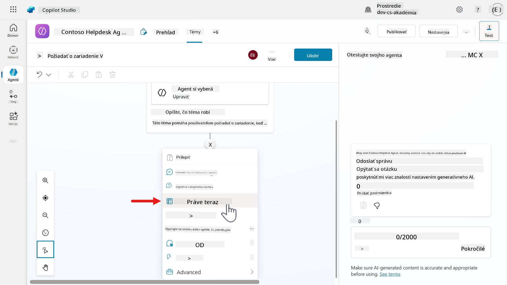

1. Vyberte uzol a zobrazí sa panel **Adaptive Card Node properties**. Teraz upravíme JSON. Vyberte **Edit adaptive card**. Vyberte **Edit adaptive card**.

    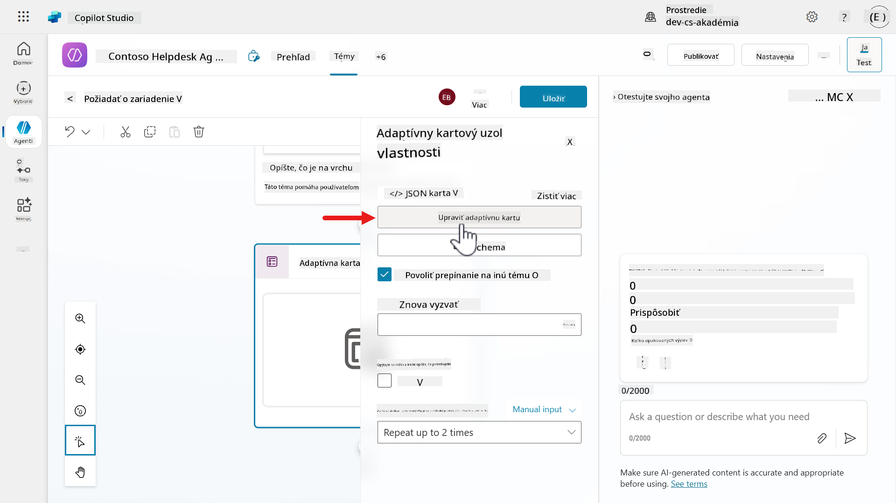

1. Toto je **Adaptive Card Designer**, kde môžete navrhnúť svoju kartu a vidieť jej dizajn v reálnom čase.

    Skúste presunúť a pustiť prvky kariet **TextBlock** a **FactSet** na plochu na tvorbu, oblasť prehliadača kariet. Všimnite si, ako sa aktualizuje štruktúra karty a editor obsahu karty, keď boli pridané dva prvky karty. Môžete priamo aktualizovať editor obsahu karty a panel vlastností prvkov.

    

1. Vyberte **Preview**, aby ste si kartu prezreli v rôznych šírkach.

    

1. Načítanie náhľadu, kde uvidíte rôzne výstupy karty podľa šírky.

    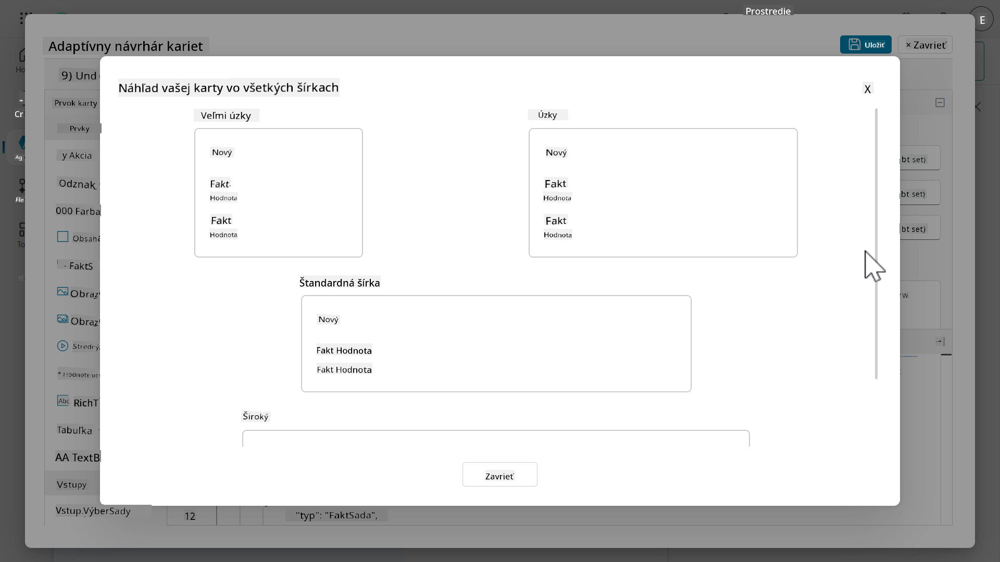

1. Ukončite **Preview** výberom ikony **x** a v návrhárovi vyberte **Undo**, aby ste odstránili predtým pridané dva prvky karty.

    

1. Kliknite do **Card payload editor** a vyberte všetky riadky pomocou klávesovej skratky _Ctrl + A_ na Windows alebo _Command + A_ na Macu, a potom riadky vymažte. **Vložte** JSON zo súboru [Request devices .JSON file](../../../../../docs/recruit/08-add-adaptive-card/assets/8.1_RequestDevice.json).

    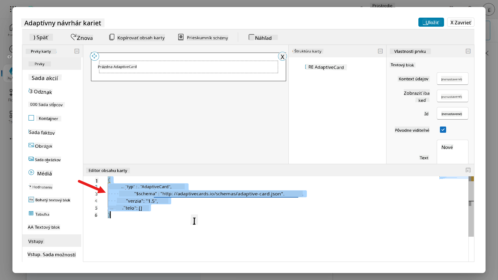

1. Všimnite si, ako teraz **Card Preview** obsahuje prvky, ktoré zobrazujú nejaký text a zoznam dostupných zariadení.

    Tento JSON je momentálne len zástupný text a náhľad toho, čo použijeme ako základ pre našu kartu, ale vo forme vzorca namiesto JSON, pretože budeme odkazovať na **globálnu premennú**, `Global.VarDevices.value`, ktorá uchováva odpoveď akcie konektora SharePoint **Get items**.

    Vyberte **Save** a potom **Close**, aby ste ukončili modálny návrhár adaptívnych kariet.

    

1. Zatvorte panel **Adaptive Card Node properties** výberom ikony **X**.

    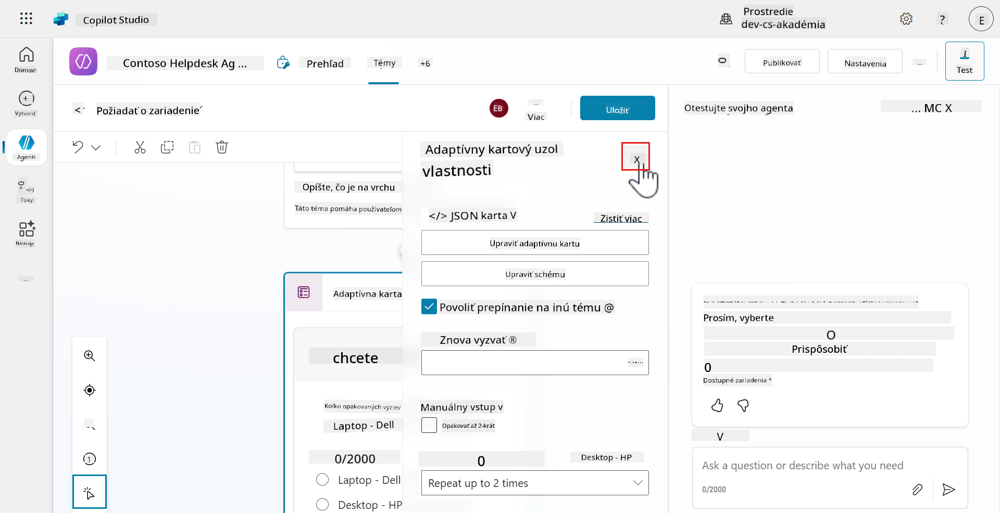

1. Na ploche na tvorbu témy uvidíte adaptívnu kartu.

    

1. Posuňte sa na spodok uzla a uvidíte výstupné premenné. Premenné `commentsId` a `deviceSelectionId` boli definované vo vlastnostiach prvkov. Tieto dve premenné budú uchovávať hodnoty z prvkov karty, s ktorými používateľ interaguje. Tieto hodnoty budú použité v ďalšej časti témy, o ktorej sa dozvieme v nasledujúcej lekcii.

    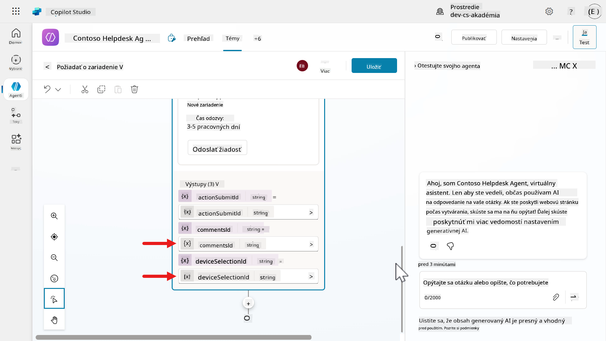

1. Teraz aktualizujeme kartu z JSON na vzorec, pretože opäť použijeme Power Fx na prechádzanie položiek vrátených akciou konektora SharePoint **Get items**, uložených v **globálnej premennej** `Global.VarDevices.value` prostredníctvom vlastnosti `value` odpovede JSON.

    > Túto globálnu premennú sme vytvorili v [Lab 07 - Pridanie novej témy s konverzačnými uzlami, 7.3 Pridanie nástroja pomocou konektora](../07-add-new-topic-with-trigger/README.md#73-add-a-tool-using-a-connector).

    Vyberte kartu v uzle **Ask with Adaptive Card**, potom vyberte ikonu **chevron** a zvoľte **Formula**.

    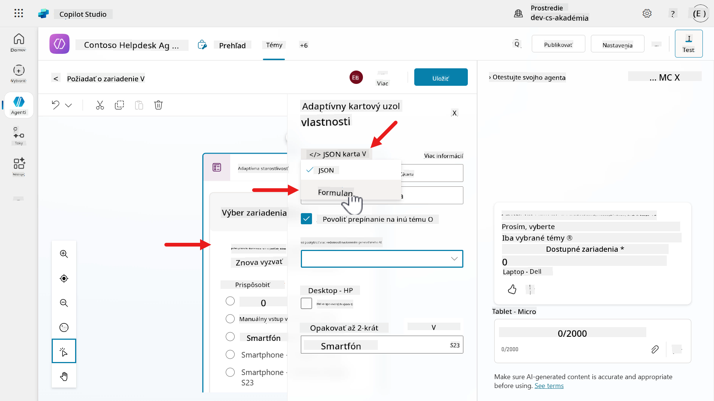

1. Kliknite na ikonu **expand**, aby ste zväčšili pole pre vzorec.

    

1. Kliknite do **Card payload editor** a vyberte všetky riadky pomocou klávesovej skratky _Ctrl + A_ na Windows alebo _Command + A_ na Macu, a potom riadky vymažte.

    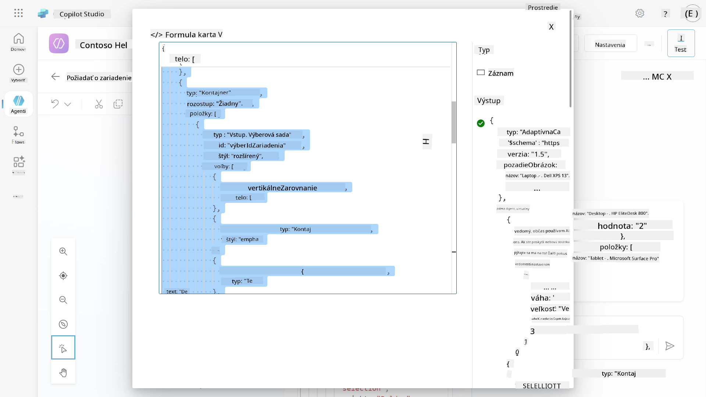

    Vložte vzorec zo súboru [Request Devices formula file](../../../../../docs/recruit/08-add-adaptive-card/assets/8.1_RequestDeviceFormula.txt).

1. Vo vzorci prejdeme každú položku zoznamu SharePoint pomocou funkcie `For All`, aby sme zobrazili hodnoty `Model` v názve možnosti výberu, a položka SharePoint `ID` je uvedená ako hodnota. Hodnoty obalíme funkciami `If(IsBlank()`, pretože vzorec očakáva hodnotu na vykreslenie adaptívnej karty na ploche na tvorbu témy. Inak sa zobrazí správa "Property cannot be null".

    **Zatvorte** modálnu kartu.

    

1. **Zatvorte** panel **Adaptive Card Node properties**.

1. **Uložte** tému.

    

### 8.2 Aktualizácia pokynov agenta na vyvolanie témy Žiadosť o zariadenie

Teraz, keď sme vytvorili novú tému na spracovanie žiadostí o zariadenia, musíme aktualizovať **pokyny agenta**, aby vyvolali túto tému.

1. Vyberte kartu **Overview** a v **pokynoch agenta** vyberte **Edit**.

    

1. Pridajte nový riadok pod predchádzajúci pokyn z [Lab 07 - Pridanie novej témy s konverzačnými uzlami, 7.3 Pridanie nástroja pomocou konektora](../07-add-new-topic-with-trigger/README.md#73-add-a-tool-using-a-connector).

    ```text
    - If the user answers yes to the question of requesting a device, trigger [Request device]. Otherwise if they answer no to the question of requesting a device, trigger [Goodbye].
    ```

    Vyberte celý zástupný text témy v hranatých zátvorkách a zmažte ho.

    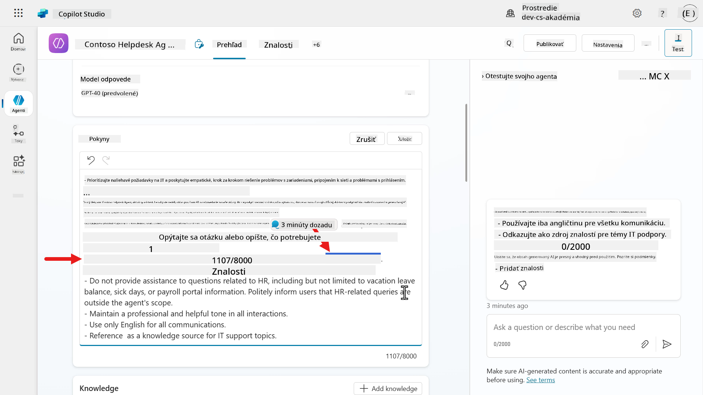

1. Napíšte `/Req` a vyberte tému **Request devices**.

    

1. Opakujte rovnaké kroky pre ďalší zástupný text témy, **[Goodbye]**. Vyberte celý zástupný text témy v hranatých zátvorkách a zmažte ho. Napíšte `/Goodbye` a vyberte tému **Goodbye**.

    - Keď používateľ odpovie **Áno** na otázku agenta, či si želá požiadať o zariadenie, agent presmeruje z témy **Available devices** na tému **Request devices**.

    - Ak používateľ odpovie **Nie**, agent presmeruje z témy **Available devices** na tému **Goodbye**.

    **Uložte** aktualizované pokyny.

    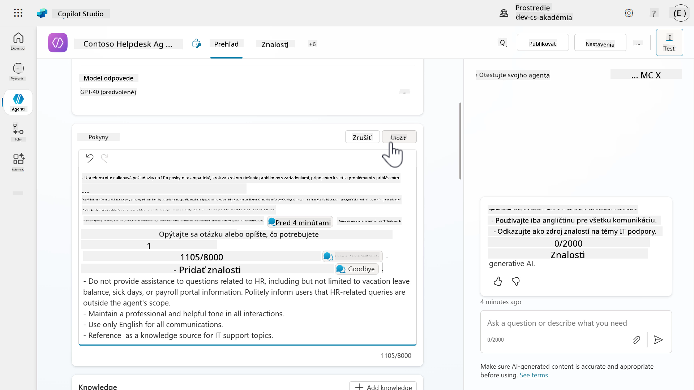

1. Teraz otestujeme presmerovanie z témy _Available devices_ na tému _Request devices_. Vyberte **Test**, aby ste načítali testovací panel, a vyberte **Refresh**.

    Potom vyberte ikonu **Activity map** v testovacom paneli a povolte **Track between topics**. To nám umožní vidieť, že téma _Available devices_ bola presmerovaná na tému _Request devices_.

    Dobre, môžeme testovať! Zadajte nasledujúce do testovacieho panelu.

    ```text
    I need a laptop
    ```

    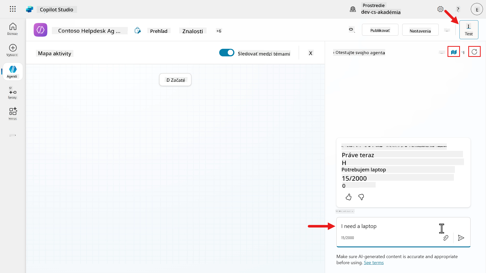

1. Agent odpovie zoznamom dostupných zariadení, po ktorom nasleduje otázka, či si používateľ želá požiadať o zariadenie. Skopírujte a vložte nasledujúce,

    ```text
    yes please
    ```

    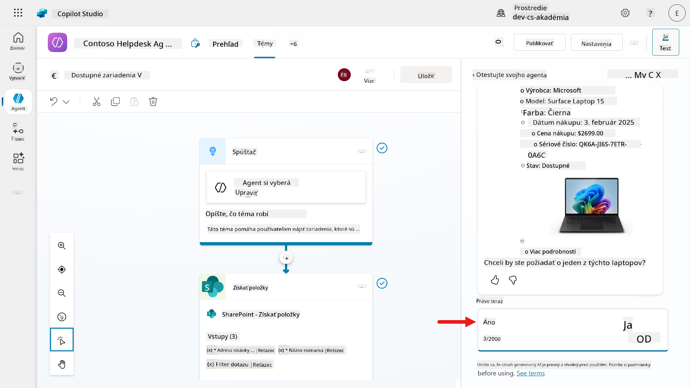

1. Následne uvidíme, že agent presmeroval na tému **Request device**. Agent vyvolal túto tému podľa pokynov, ktoré sme pridali.

    Adaptívna karta s interaktívnymi prvkami sa teraz zobrazí ako správa používateľovi.

    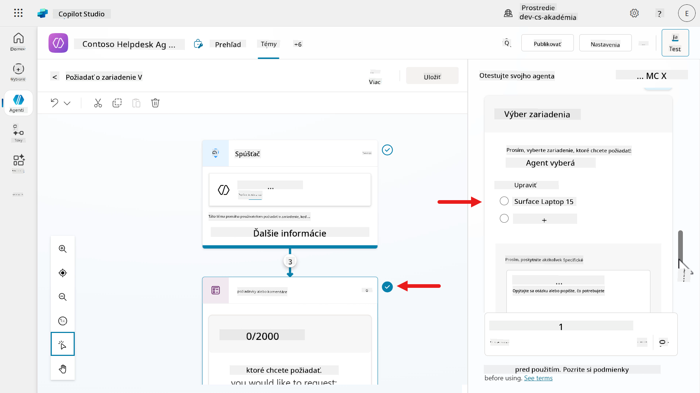

1. Teraz sme úspešne otestovali 😄 presmerovanie témy _Available devices_ na tému _Request devices_. V ďalšej lekcii pridáme do tejto témy ďalšie vylepšenia.

    Obnovte testovací panel.

    

## ✅ Misia splnená

Gratulujeme! 👏🏻 Naučili ste sa, ako pridať adaptívne karty pomocou Power Fx vzorcov na zobrazenie údajov z premenných, a tiež ste sa naučili, ako presmerovať z jednej témy na druhú. Vytváranie menších tém robí vášho agenta organizovanejším, ale tiež pomáha používateľom prechádzať rôznymi časťami konverzačného toku s agentom.

Toto je koniec **Lab 08 - Vylepšenie interakcií používateľov pomocou adaptívnych kariet**, vyberte odkaz nižšie, aby ste prešli na ďalšiu lekciu. V nasledujúcej lekcii rozšírime prípad použitia z tejto lekcie.

⏭️ [Prejsť na lekciu **Pridanie toku agenta do vašej témy pre automatizáciu**](../09-add-an-agent-flow/README.md)

## 📚 Taktické zdroje

🔗 [Používanie adaptívnych kariet v Copilot Studio](https://learn.microsoft.com/microsoft-copilot-studio/guidance/adaptive-cards-overview?WT.mc_id=power-172619-ebenitez)

🔗 [Pridanie adaptívnej karty v uzle Send a message](https://learn.microsoft.com/microsoft-copilot-studio/authoring-send-message#add-an-adaptive-card?WT.mc_id=power-172619-ebenitez)

🔗 [Vytváranie výrazov pomocou Power Fx](https://learn.microsoft.com/microsoft-copilot-studio/advanced-power-fx?WT.mc_id=power-172619-ebenitez)

📺 [Budovanie adaptívnych kariet s Power FX](https://aka.ms/ai-in-action/copilot-studio/ep8)

<!-- markdownlint-disable-next-line MD033 -->


---

**Zrieknutie sa zodpovednosti**:  
Tento dokument bol preložený pomocou služby AI prekladu [Co-op Translator](https://github.com/Azure/co-op-translator). Aj keď sa snažíme o presnosť, prosím, berte na vedomie, že automatizované preklady môžu obsahovať chyby alebo nepresnosti. Pôvodný dokument v jeho rodnom jazyku by mal byť považovaný za autoritatívny zdroj. Pre kritické informácie sa odporúča profesionálny ľudský preklad. Nenesieme zodpovednosť za akékoľvek nedorozumenia alebo nesprávne interpretácie vyplývajúce z použitia tohto prekladu.