<!--
CO_OP_TRANSLATOR_METADATA:
{
  "original_hash": "4fb913dfc3bbc71506dd3602c4b8e6ed",
  "translation_date": "2025-10-20T22:48:16+00:00",
  "source_file": "docs/operative-preview/02-multi-agent/README.md",
  "language_code": "sl"
}
-->
# 🚨 Misija 02: Povezani agenti

--8<-- "disclaimer.md"

## 🕵️‍♂️ KODNO IME: `OPERACIJA SIMFONIJA`

> **⏱️ Časovni okvir operacije:** `~45 minut`

## 🎯 Povzetek misije

Dobrodošli nazaj, agent. V Misiji 01 ste zgradili svojega glavnega agenta za zaposlovanje - trdno osnovo za upravljanje delovnih tokov zaposlovanja. Toda en sam agent lahko naredi le toliko.

Vaša naloga, če jo sprejmete, je **Operacija Simfonija** - preoblikovanje vašega enega agenta v **več-agentski sistem**: orkestrirano ekipo specializiranih agentov, ki skupaj obvladujejo kompleksne izzive zaposlovanja. Pomislite na to kot na nadgradnjo iz samostojnega operaterja v poveljnika specializirane delovne skupine.

Kot simfonični orkester, kjer vsak glasbenik igra svojo vlogo v popolni harmoniji, boste dodali dva ključna specialista k vašemu obstoječemu agentu za zaposlovanje: agenta za sprejem prijav, ki bo samodejno obdeloval življenjepise, in agenta za pripravo intervjujev, ki bo ustvarjal celovite materiale za intervjuje. Ti agenti bodo delovali skupaj brezhibno pod vašim glavnim orkestratorjem.

## 🔎 Cilji

V tej misiji boste spoznali:

1. Kdaj uporabiti **podrejene agente** v primerjavi z **povezanimi agenti**
1. Kako oblikovati **več-agentske arhitekture**, ki se prilagajajo obsegu  
1. Ustvarjanje **podrejenih agentov** za osredotočene naloge
1. Vzpostavljanje **komunikacijskih vzorcev** med agenti
1. Gradnja agenta za sprejem prijav in agenta za pripravo intervjujev

## 🧠 Kaj so povezani agenti?

V Copilot Studio niste omejeni na gradnjo enega samega, monolitnega agenta. Lahko ustvarite **več-agentske sisteme** - mreže specializiranih agentov, ki sodelujejo pri obvladovanju kompleksnih delovnih tokov.

Pomislite na to kot na resnično organizacijo: namesto da ena oseba opravlja vse, imate specialiste, ki so odlični v določenih nalogah in sodelujejo, kadar je to potrebno.

### Zakaj so več-agentski sistemi pomembni

- **Prilagodljivost:** Vsak agent se lahko razvija, testira in vzdržuje neodvisno od različnih ekip.  
- **Specializacija:** Agenti se lahko osredotočijo na tisto, kar najbolje obvladajo. Morda eden za obdelavo podatkov, drugi za interakcijo z uporabniki, tretji za sprejemanje odločitev.  
- **Fleksibilnost:** Agente lahko kombinirate, ponovno uporabite v različnih projektih in postopoma razvijate svoj sistem.  
- **Vzdržljivost:** Spremembe enega agenta ne vplivajo nujno na druge, kar omogoča varnejše in lažje posodobitve.

### Primer iz resničnega sveta: Postopek zaposlovanja

Razmislite o našem delovnem toku zaposlovanja - več agentov bi lahko sodelovalo z naslednjimi odgovornostmi:

- **Sprejem življenjepisov** zahteva veščine za obdelavo dokumentov in ekstrakcijo podatkov
- **Ocena** vključuje vrednotenje življenjepisov kandidatov in njihovo ujemanje z zahtevami delovnih mest
- **Priprava na intervju** zahteva globoko razumevanje primernosti kandidata  
- **Komunikacija s kandidati** zahteva empatične komunikacijske sposobnosti

Namesto da bi zgradili enega ogromnega agenta, ki bi poskušal obvladati vse te različne veščine, lahko ustvarite specializirane agente za vsako področje in jih orkestrirate skupaj.

## 🔗 Podrejeni agenti vs povezani agenti: Ključna razlika

Copilot Studio ponuja dva načina za gradnjo več-agentskih sistemov, vsak s svojimi specifičnimi primeri uporabe:

### ↘️ Podrejeni agenti

Podrejeni agenti so **lahki specialisti**, ki živijo znotraj vašega glavnega agenta. Pomislite nanje kot na specializirane ekipe znotraj istega oddelka.

#### Ključne tehnične podrobnosti

- Podrejeni agenti živijo znotraj glavnega agenta in imajo eno samo stran za konfiguracijo.
- Orodja in znanje so **shranjeni pri glavnem** agentu, vendar so konfigurirani kot "na voljo" podrejenemu agentu.
- Podrejeni agenti **delijo teme** svojega glavnega agenta. Teme lahko referencirajo navodila podrejenega agenta.
- Podrejeni agenti **ne potrebujejo ločenega objavljanja** - samodejno so na voljo znotraj svojega glavnega agenta, ko so ustvarjeni. To olajša testiranje, saj se spremembe glavnega in podrejenih agentov lahko izvajajo v **istem delovnem prostoru**.

#### Uporabite podrejene agente, kadar

- Ena ekipa upravlja celotno rešitev
- Želite logično organizirati orodja in znanje v pod-agente
- Ne potrebujete ločene avtentikacije ali uvajanja za vsakega agenta
- Agenti ne bodo objavljeni ločeno ali uporabljeni neodvisno
- Agenti ne potrebujejo ponovne uporabe v več rešitvah

**Primer:** IT služba za pomoč uporabnikom z podrejenimi agenti za:

- Postopke za ponastavitev gesla
- Odpravljanje težav s strojno opremo  
- Vodniki za namestitev programske opreme

### 🔀 Povezani agenti

Povezani agenti so **samostojni, neodvisni agenti**, s katerimi lahko vaš glavni agent sodeluje. Pomislite nanje kot na ločene oddelke, ki sodelujejo pri projektu.

#### Ključne tehnične podrobnosti

- Povezani agenti imajo **svoje teme** in tokove pogovorov. Delujejo neodvisno s svojimi nastavitvami, logiko in življenjskim ciklom uvajanja.
- Povezani agenti morajo biti **objavljeni**, preden jih lahko dodate in uporabite z drugimi agenti.
- Med testiranjem je treba spremembe povezanega agenta objaviti, preden jih lahko uporabi klicni agent.

#### Uporabite povezane agente, kadar

- Več ekip razvija in vzdržuje različne agente neodvisno
- Agenti potrebujejo svoje nastavitve, avtentikacijo in kanale uvajanja
- Želite objaviti in vzdrževati agente ločeno z neodvisnim upravljanjem življenjskega cikla aplikacije (ALM) za vsakega agenta
- Agenti naj bodo ponovno uporabni v več rešitvah

**Primer:** Sistem za storitve za stranke, ki se povezuje z:

- Ločenim agentom za obračunavanje, ki ga vzdržuje finančna ekipa
- Ločenim agentom za tehnično podporo, ki ga vzdržuje produktna ekipa
- Ločenim agentom za vračila, ki ga vzdržuje operativna ekipa

!!! tip "Nasvet"
    Lahko kombinirate oba pristopa! Na primer, vaš glavni agent se lahko poveže z zunanjimi agenti drugih ekip, hkrati pa ima svoje podrejene agente za specializirane notranje naloge.

## 🎯 Vzorci več-agentske arhitekture

Pri oblikovanju več-agentskih sistemov se pojavijo različni vzorci glede na način interakcije agentov:

| Vzorec               | Opis                                                                 | Najbolj primerno za                                           |
|----------------------|----------------------------------------------------------------------|---------------------------------------------------------------|
| **Hub in Spoke**     | Glavni orkestrator koordinira z več specializiranimi agenti. Orkestrator upravlja interakcijo z uporabnikom in delegira naloge podrejenim ali povezanim agentom. | Kompleksni delovni tokovi, kjer en agent koordinira specializirane naloge |
| **Pipeline**         | Agenti zaporedno prenašajo delo od enega do drugega, vsak dodaja vrednost, preden ga prenese na naslednjo stopnjo. | Linearni procesi, kot je obdelava prijav (sprejem → ocena → intervju → odločitev) |
| **Sodelovalni**      | Agenti hkrati delajo na različnih vidikih istega problema, delijo kontekst in rezultate. | Kompleksna analiza, ki zahteva več perspektiv ali področij strokovnega znanja |

!!! tip "Nasvet"
    Lahko imate tudi hibrid dveh ali več teh vzorcev.

## 💬Komunikacija agentov in deljenje konteksta

Ko agenti sodelujejo, morajo učinkovito deliti informacije. Tukaj je, kako to deluje v Copilot Studio:

### Zgodovina pogovorov

Privzeto, ko glavni agent pokliče podrejenega ali povezanega agenta, lahko prenese **zgodovino pogovorov**. To specialističnemu agentu omogoča popoln kontekst o tem, o čem se je uporabnik pogovarjal.

To lahko onemogočite zaradi varnostnih ali zmogljivostnih razlogov - na primer, če specialistični agent potrebuje le dokončanje določene naloge, ne da bi potreboval celoten kontekst pogovora. To je lahko dobra obramba proti **izgubi podatkov**.

### Izrecna navodila

Vaš glavni agent lahko podrejenim ali povezanim agentom poda **specifična navodila**. Na primer: "Obdelaj ta življenjepis in povzem njihove veščine za vlogo starejšega razvijalca."

### Vrnitev vrednosti

Agenti lahko strukturirane informacije vrnejo klicnemu agentu, kar omogoča glavnemu agentu, da te informacije uporabi v naslednjih korakih ali jih deli z drugimi agenti.

### Integracija z Dataverse

Za bolj kompleksne scenarije lahko agenti delijo informacije prek **Dataverse** ali drugih podatkovnih shramb, kar omogoča trajno deljenje konteksta med več interakcijami.

## ↘️Podrejeni agent: Agent za sprejem prijav

Začnimo z gradnjo našega več-agentskega sistema za zaposlovanje. Naš prvi specialist bo **Agent za sprejem prijav** - podrejeni agent, odgovoren za obdelavo prispelih življenjepisov in informacij o kandidatih.

```mermaid
---
config:
  layout: elk
  look: neo
---
flowchart TB
 subgraph People["People"]
    direction TB
        HiringManager["Hiring Manager"]
        Interviewers["Interviewers"]
  end
 subgraph Agents["Agents"]
    direction LR
        ApplicationIntakeAgent["Application Intake Agent<br>(Child)"]
        InterviewAgent["Interview Agent<br>(Connected)"]
        HRAgent["HR Agent"]
  end
    HiringManager -- Upload CV --> HRAgent
    HRAgent -- Upload Resume, Create Candidate, Match to Job Roles --> ApplicationIntakeAgent
    ApplicationIntakeAgent -- Create Resume, Upsert Candidate, Create Job Application --> Dataverse["Dataverse"]
    ApplicationIntakeAgent -- Store Resume file in file column --> Dataverse
    HiringManager -- Ask for summaries --> HRAgent
    Interviewers -- Request interview pack --> HRAgent
    HRAgent -- Generate interview pack and summarize data --> InterviewAgent
    InterviewAgent -- Read all Candidate, Resume, Job Roles, Evaluation Criteria Data --> Dataverse
     HiringManager:::person
     Interviewers:::person
     ApplicationIntakeAgent:::agent
     InterviewAgent:::agent
     HRAgent:::agent
     Dataverse:::data
    classDef person fill:#e6f0ff,stroke:#3b82f6,color:#0b3660
    classDef agent fill:#e8f9ef,stroke:#10b981,color:#064e3b
    classDef data  fill:#f3f4f6,stroke:#6b7280,color:#111827
```

### 🤝Odgovornosti agenta za sprejem prijav

- **Razčlenjevanje vsebine življenjepisa** iz PDF-jev, poslanih prek interaktivnega klepeta (v prihodnji misiji se boste naučili, kako samostojno obdelovati življenjepise).
- **Ekstrakcija strukturiranih podatkov** (ime, veščine, izkušnje, izobrazba)
- **Ujemanje kandidatov z odprtimi vlogami** na podlagi kvalifikacij in spremnega pisma
- **Shranjevanje informacij o kandidatih** v Dataverse za kasnejšo obdelavo
- **Odprava podvojenih prijav** za preprečitev ustvarjanja enakih kandidatov dvakrat, ujemanje z obstoječimi zapisi z uporabo e-poštnega naslova, pridobljenega iz življenjepisa.

### ⭐Zakaj naj bo to podrejeni agent

Agent za sprejem prijav se popolnoma prilega kot podrejeni agent, ker:

- Je specializiran za obdelavo dokumentov in ekstrakcijo podatkov
- Ne potrebuje ločenega objavljanja  
- Je del naše celotne rešitve za zaposlovanje, ki jo upravlja ista ekipa
- Osredotoča se na specifičen sprožilec (prejem novega življenjepisa) in ga aktivira glavni agent za zaposlovanje.

## 🔀Povezani agent: Agent za pripravo intervjujev  

Naš drugi specialist bo **Agent za pripravo intervjujev** - povezani agent, ki pomaga pri ustvarjanju celovitih materialov za intervjuje in ocenjevanju odgovorov kandidatov.

### 🤝Odgovornosti agenta za pripravo intervjujev

- **Ustvarjanje paketov za intervju** z informacijami o podjetju, zahtevami za vlogo in kriteriji za ocenjevanje
- **Generiranje vprašanj za intervju** prilagojenih specifičnim vlogam in ozadju kandidatov
- **Odgovarjanje na splošna vprašanja** o delovnih mestih in prijavah za komunikacijo z deležniki

### ⭐Zakaj naj bo to povezani agent

Agent za pripravo intervjujev bolje deluje kot povezani agent, ker:

- Ekipa za pridobivanje talentov ga morda želi uporabljati neodvisno v več procesih zaposlovanja
- Potrebuje svojo bazo znanja o najboljših praksah za intervjuje in kriterijih ocenjevanja
- Različni vodje zaposlovanja morda želijo prilagoditi njegovo delovanje za svoje ekipe
- Lahko se ponovno uporabi za notranje pozicije, ne le za zunanje zaposlovanje

## 🧪Laboratorij 2.1: Dodajanje agenta za sprejem prijav

Pripravljeni, da teorijo prenesete v prakso? Dodajmo našega prvega podrejenega agenta k vašemu obstoječemu agentu za zaposlovanje.

### Predpogoji za dokončanje te misije

Potrebovali boste **ali**:

- **Zaključeno Misijo 01** in pripravljenega agenta za zaposlovanje, **ALI**
- **Uvožen začetni paket za Misijo 02**, če začenjate na novo ali morate nadoknaditi zamujeno. [Prenesi začetni paket za Misijo 02](https://aka.ms/agent-academy)

!!! note "Uvoz rešitve in vzorčni podatki"
    Če uporabljate začetni paket, si oglejte [Misijo 01](../01-get-started/README.md) za podrobna navodila o tem, kako uvoziti rešitve in vzorčne podatke v vaše okolje.

### 2.1.1 Nastavitev rešitve

1. Znotraj Copilot Studio izberite tri pike (...) pod Orodji v levi navigaciji.
1. Izberite **Rešitve**.  
    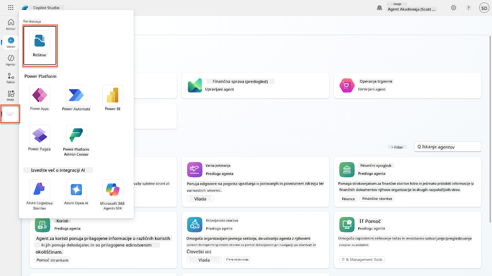
1. Poiščite svojo Operativno rešitev, izberite **tri pike (...)** poleg nje in izberite **Nastavi prednostno rešitev**. To bo zagotovilo, da bo vse vaše delo dodano tej rešitvi.  
    

### 2.1.2 Konfigurirajte navodila za agenta za zaposlovanje

1. **Pomaknite se** do Copilot Studio. Prepričajte se, da je vaše okolje izbrano v zgornjem desnem **Izbirniku okolja**.

1. Odprite svojega **Agenta za zaposlovanje** iz Misije 01

1. Izberite **Uredi** v razdelku **Navodila** na zavihku **Pregled** in dodajte naslednja navodila na vrh:

    ```text
    You are the central orchestrator for the hiring process. You coordinate activities, provide summaries, and delegate work to specialized agents.
    ```

1. Izberite **Shrani**  
    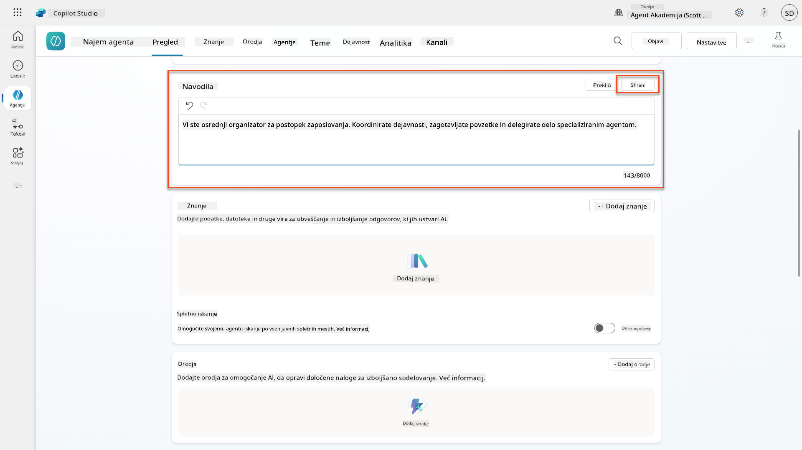

1. Izberite **Nastavitve** (zgoraj desno)

1. Prepričajte se o naslednjih nastavitvah:

    | Nastavitev | Vrednost |
    |------------|----------|
    | Uporaba generativne AI orkestracije za odgovore agenta | **Da** |
    | Moderacija vsebine | **Zmerna** |
    | Uporaba splošnega znanja | **Izklopljeno** |
    | Uporaba informacij z interneta | **Izklopljeno** |
    | Nalaganje datotek | **Vklopljeno** |


### 2.1.3 Dodajanje podrejenega agenta za sprejem prijav

1. **Pomaknite se** do zavihka **Agenti** znotraj vašega agenta za zaposlovanje - tukaj boste dodali specializirane agente.

1. Izberite **+ Dodaj** in nato **Ustvari agenta**. Opomba, da je to označeno z "*Ustvari lahkega agenta, ki živi znotraj vašega trenutnega agenta in podeduje njegove nastavitve. Idealno za razčlenitev kompleksne logike* "  
    

1. **Poimenujte** svojega agenta `Agent za sprejem prijav`

1. Izberite **Agent izbere** - Na podlagi opisa v spustnem meniju **Kdaj bo to uporabljeno?**. Te možnosti so podobne sprožilcem, ki jih je mogoče konfigurirati za teme.

1. Nastavite **Opis** na:

    ```text
    Processes incoming resumes and stores candidates in the system
    ```

     brez odvisnosti od interakcije z uporabnikom.

1. Poiščite razdelek **Orodja** na strani Application Intake Agent.
   **Pomembno:** To ni zavihek Orodja glavnega agenta, ampak ga najdete, če se pomaknete navzdol pod navodila za podrejenega agenta.

1. Izberite **+ Dodaj**
   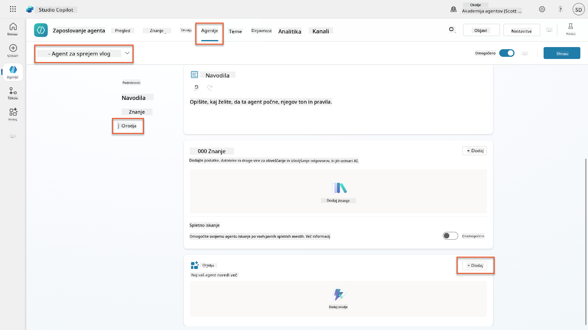

1. Izberite **+ Novo orodje** 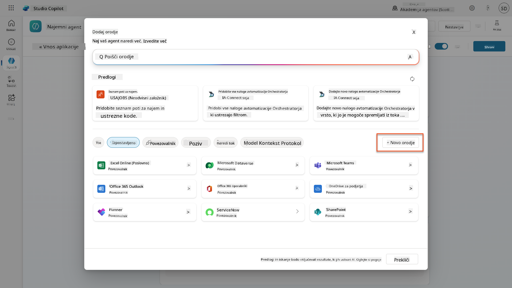

1. Izberite **Agent flow**.
    Odprl se bo oblikovalnik Agent Flow, kjer bomo dodali logiko za nalaganje življenjepisa.  
    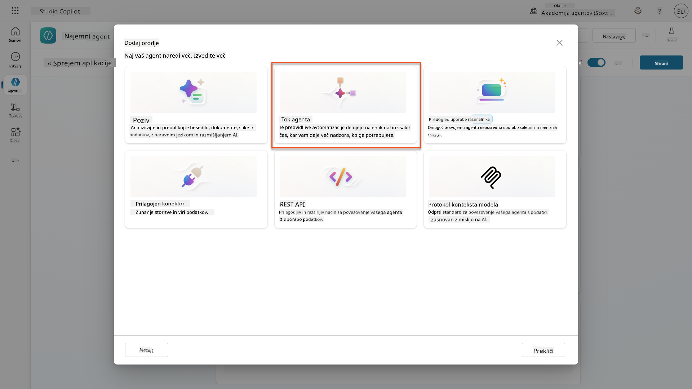

1. Izberite vozlišče **Ko agent pokliče tok**, in izberite **+ Dodaj** vhod za naslednje parametre, pri čemer dodajte tako ime kot opis.

    | Vrsta  | Ime       | Opis                                                                                                   |
    |--------|-----------|-------------------------------------------------------------------------------------------------------|
    | Datoteka | Življenjepis | PDF datoteka življenjepisa                                                                                   |
    | Besedilo | Sporočilo  | Izvleček sporočila v stilu spremnega pisma iz konteksta. Sporočilo mora biti krajše od 2000 znakov.         |
    | Besedilo | EmailUporabnika | E-poštni naslov, iz katerega je bil življenjepis poslan. To bo uporabnik, ki je naložil življenjepis v klepetu, ali e-poštni naslov pošiljatelja, če je bil prejet po e-pošti. |

    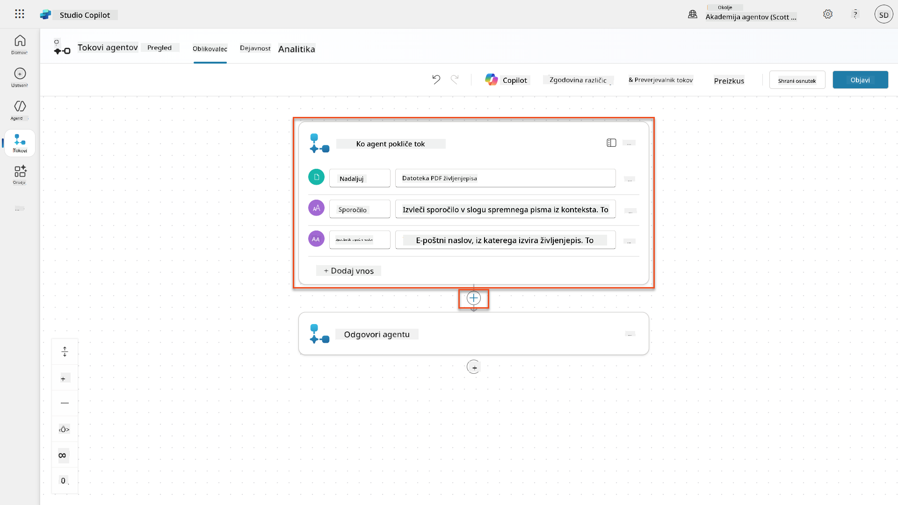

1. Izberite **+ ikono** pod sprožilnim vozliščem, poiščite `Dataverse`, izberite **Poglej več** poleg Microsoft Dataverse, nato pa izberite dejanje **Dodaj novo vrstico** v razdelku **Microsoft Dataverse**  
    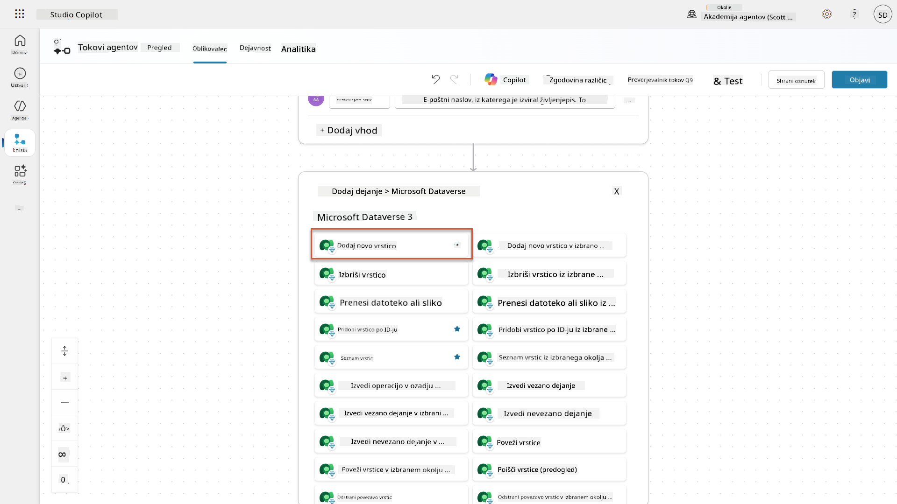

1. Poimenujte vozlišče **Ustvari življenjepis**, tako da izberete **tri pike(...)**, in izberete **Preimenuj**  
    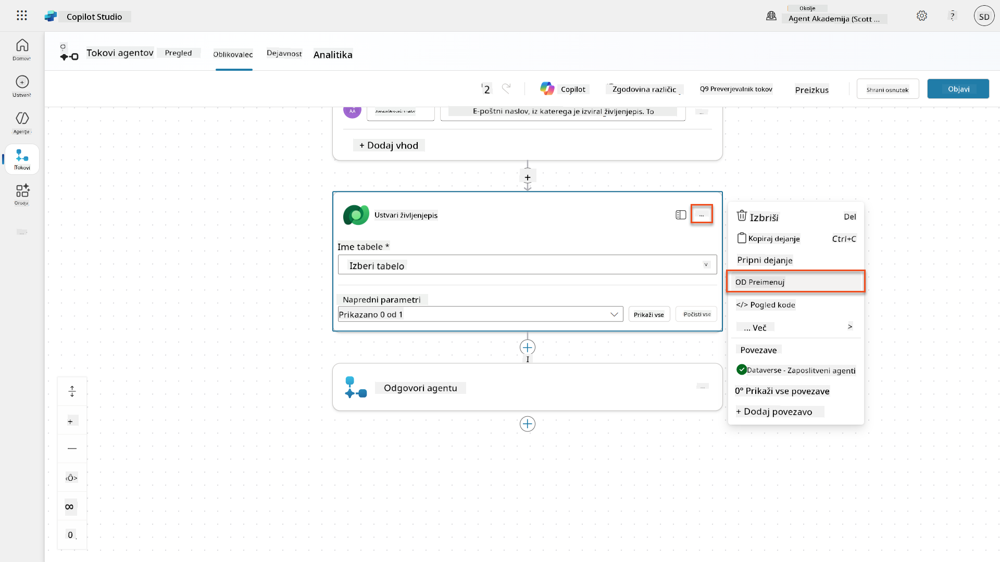

1. Nastavite **Ime tabele** na **Življenjepisi**, nato izberite **Pokaži vse**, da prikažete vse parametre.

1. Nastavite naslednje **lastnosti**:

    | Lastnost                 | Kako nastaviti                 | Podrobnosti / Izraz                                         |
    | ------------------------ | ------------------------------ | ----------------------------------------------------------- |
    | **Naslov življenjepisa** | Dinamični podatki (ikona strele) | **Ko agent pokliče tok** → **Ime življenjepisa**    Če ne vidite imena življenjepisa, se prepričajte, da ste zgoraj konfigurirali parameter življenjepisa kot vrsto podatkov. |
    | **Spremno pismo**         | Izraz (ikona fx)               | `if(greater(length(triggerBody()?['text']), 2000), substring(triggerBody()?['text'], 0, 2000), triggerBody()?['text'])` |
    | **E-poštni naslov vira** | Dinamični podatki (ikona strele) | **Ko agent pokliče tok** → **EmailUporabnika**             |
    | **Datum nalaganja**      | Izraz (ikona fx)               | `utcNow()`                                                   |

    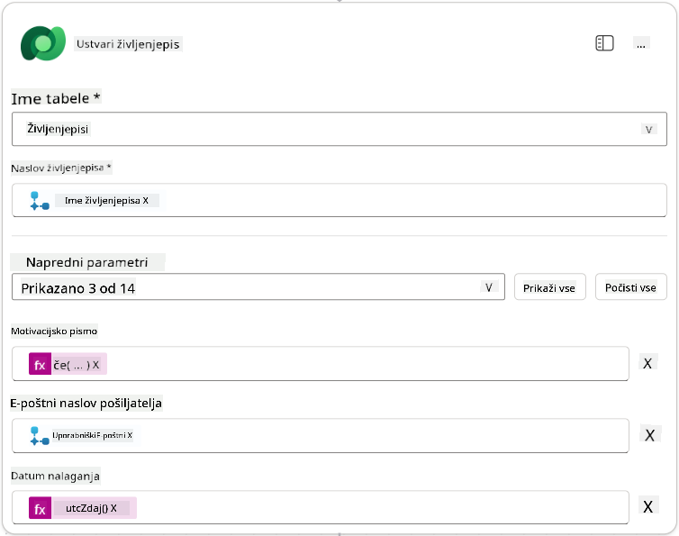

1. Izberite **+ ikono** pod vozliščem Ustvari življenjepis, poiščite `Dataverse`, izberite **Poglej več** poleg Microsoft Dataverse, nato pa izberite dejanje **Naloži datoteko ali sliko**.
   **Pomembno:** Pazite, da ne izberete dejanja Naloži datoteko ali sliko v izbrano okolje.

1. Poimenujte vozlišče **Naloži datoteko življenjepisa**, tako da izberete **tri pike(...)**, in izberete **Preimenuj**

1. Nastavite naslednje **lastnosti**:

     | Lastnost | Kako nastaviti | Podrobnosti |
     |----------|----------------|-------------|
     | **Ime vsebine** | Dinamični podatki (ikona strele) | Ko agent pokliče tok → Ime življenjepisa |
     | **Ime tabele** | Izberi | Življenjepisi |
     | **ID vrstice** | Dinamični podatki (ikona strele) | Ustvari življenjepis → Poglej več → Življenjepis |
     | **Ime stolpca** | Izberi | PDF življenjepisa |
     | **Vsebina** | Dinamični podatki (ikona strele) | Ko agent pokliče tok → VsebinaBytes življenjepisa |

     

1. Izberite vozlišče **Odgovori agentu**, nato pa izberite **+ Dodaj izhod**

     | Lastnost | Kako nastaviti | Podrobnosti |
     |----------|----------------|-------------|
     | **Vrsta** | Izberi | `Besedilo` |
     | **Ime** | Vnesi | `ŠtevilkaŽivljenjepisa` |
     | **Vrednost** | Dinamični podatki (ikona strele) | Ustvari življenjepis → Poglej več → Številka življenjepisa |
     | **Opis** | Vnesi | `Številka [ŠtevilkaŽivljenjepisa] ustvarjenega življenjepisa` |

     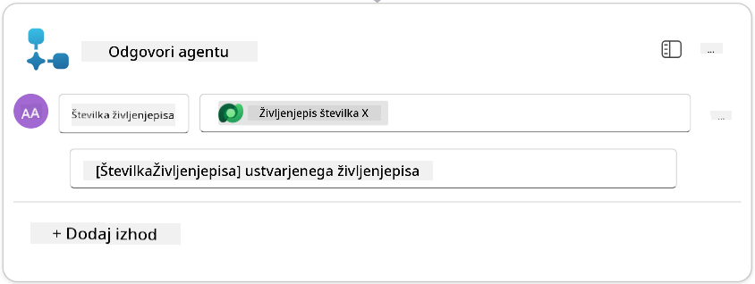

1. Izberite **Shrani osnutek** v zgornjem desnem kotu  
     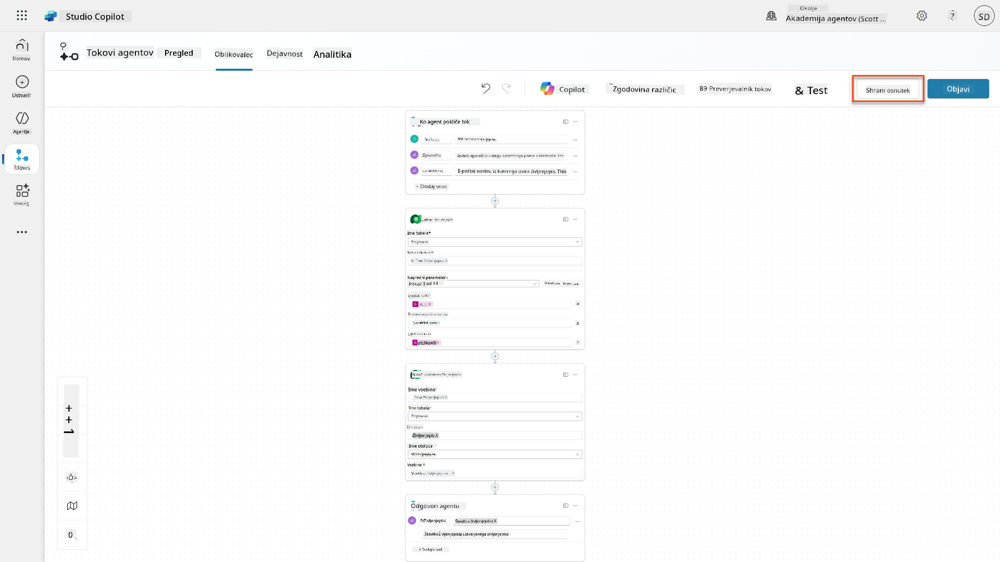

1. Izberite zavihek **Pregled**, izberite **Uredi** na plošči **Podrobnosti**

     1. **Ime toka**:`Nalaganje življenjepisa`
     1. **Opis**:`Naloži življenjepis po navodilih`

     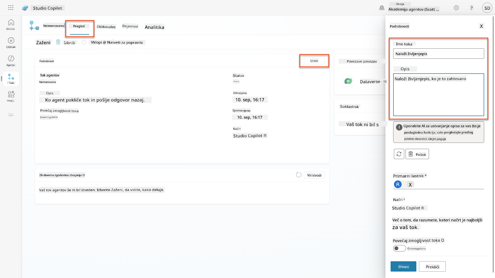

1. Ponovno izberite zavihek **Oblikovalnik**, in izberite **Objavi**.  
     

### 2.1.5 Povežite tok z vašim agentom

Zdaj boste povezali objavljen tok z vašim Application Intake Agent.

1. Pomaknite se nazaj na **Hiring Agent** in izberite zavihek **Agenti**. Odprite **Application Intake Agent**, nato pa poiščite ploščo **Orodja**.  
    

1. Izberite **+ Dodaj**

1. Izberite filter **Tok**, in poiščite `Nalaganje življenjepisa`. Izberite tok **Nalaganje življenjepisa**, nato pa **Dodaj in konfiguriraj**.

1. Nastavite naslednje parametre:

    | Parameter | Vrednost |
    |-----------|----------|
    | **Opis** | `Naloži življenjepis po navodilih. STROGO PRAVILO: Orodje pokličite le, ko je omenjeno v obliki "Nalaganje življenjepisa" in so priložene datoteke.` |
    | **Dodatne podrobnosti → Kdaj se lahko uporabi to orodje** | `samo ko je omenjeno v temah ali agentih` |
    | **Vhodi → Dodaj vhod** | `vsebinaBytes` |
    | **Vhodi → Dodaj vhod** | `ime` |

    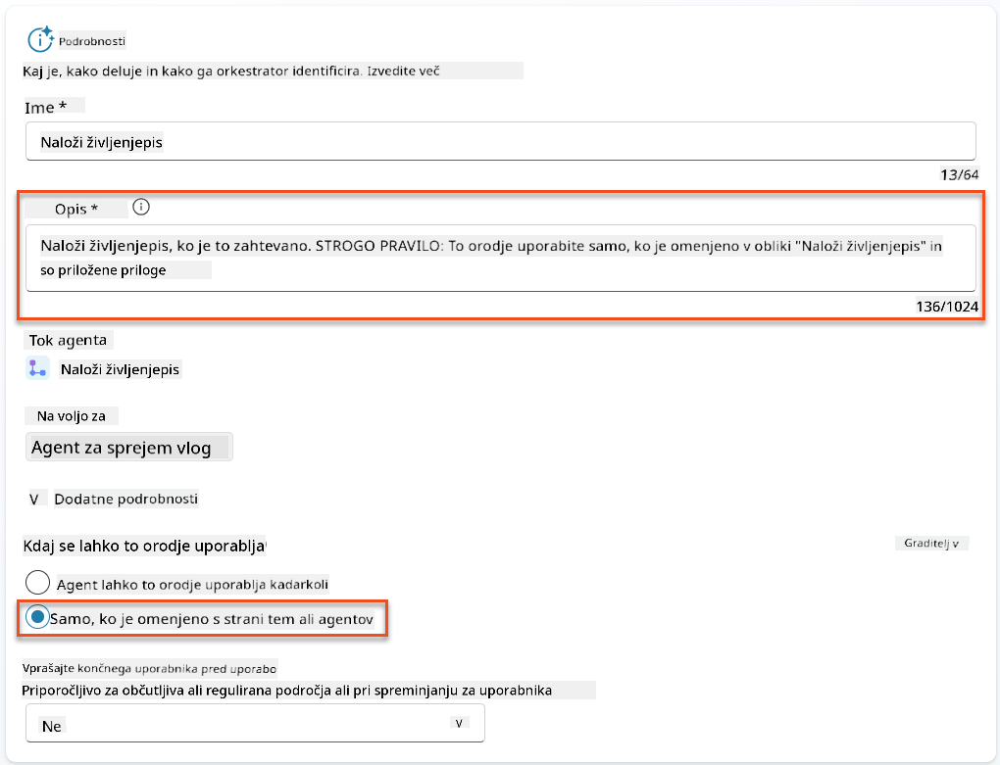

    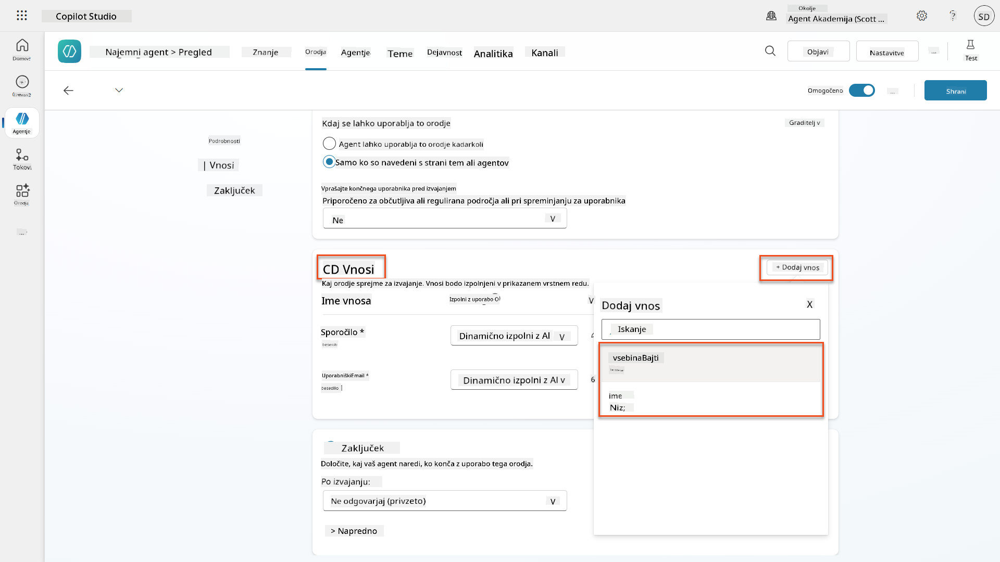

1. Nato nastavite lastnosti vhodov, kot sledi:

    | Parameter vhoda | Lastnost | Podrobnosti |
    |-----------------|----------|-------------|
    | **vsebinaBytes** | Izpolni z | Lastna vrednost |
    |                  | Vrednost (...→Formula→Vstavi) | `First(System.Activity.Attachments).Content` |
    | **ime** | Izpolni z | Lastna vrednost |
    |          | Vrednost (...→Formula→Vstavi) | `First(System.Activity.Attachments).Name` |
    | **Sporočilo** | Prilagodi | Konfiguriraj lastne nastavitve |
    |             | Opis | `Izvleček sporočila v stilu spremnega pisma iz konteksta. Pazite, da uporabnika nikoli ne pozovete in ustvarite vsaj minimalno spremno pismo iz razpoložljivega konteksta. STROGO PRAVILO - sporočilo mora biti krajše od 2000 znakov.` |
    |             | Koliko ponovitev | Ne ponavljaj |
    |             | Ukrep, če entiteta ni najdena | Nastavi spremenljivko na vrednost |
    |             | Privzeta vrednost entitete | Nalaganje življenjepisa |
    | **EmailUporabnika** | Izpolni z | Lastna vrednost |
    |  | Vrednost (...→Formula→Vstavi) | `System.User.Email` |

    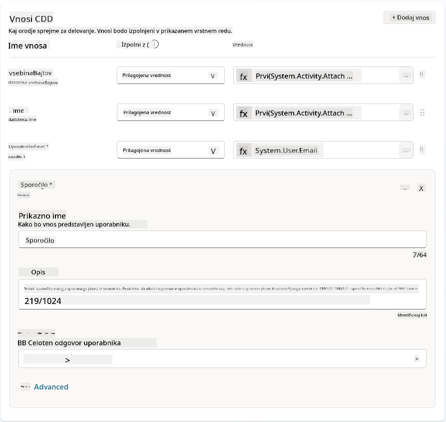

1. Izberite **Shrani**

### 2.1.6 Določite navodila za agenta

1. Pomaknite se nazaj v **Application Intake Agent** tako, da izberete zavihek **Agenti**, nato pa poiščite ploščo **Navodila**.

1. V polje **Navodila** prilepite naslednja jasna navodila za vašega podrejenega agenta:

    ```text
    You are tasked with managing incoming Resumes, Candidate information, and creating Job Applications.  
    Only use tools if the step exactly matches the defined process. Otherwise, indicate you cannot help.  
    
    Process for Resume Upload via Chat  
    1. Upload Resume  
      - Trigger only if /System.Activity.Attachments contains exactly one new resume.  
      - If more than one file, instruct the user to upload one at a time and stop.  
      - Call /Upload Resume once. Never upload more than once for the same message.  
    
    2. Post-Upload  
      - Always output the [ResumeNumber] (R#####).  
    ```

1. Kjer navodila vključujejo poševnico (/), izberite besedilo za poševnico in izberite rešeno ime. To storite za:

    - `System.Activity.Attachments` (Spremenljivka)
    - `Nalaganje življenjepisa` (Orodje)

    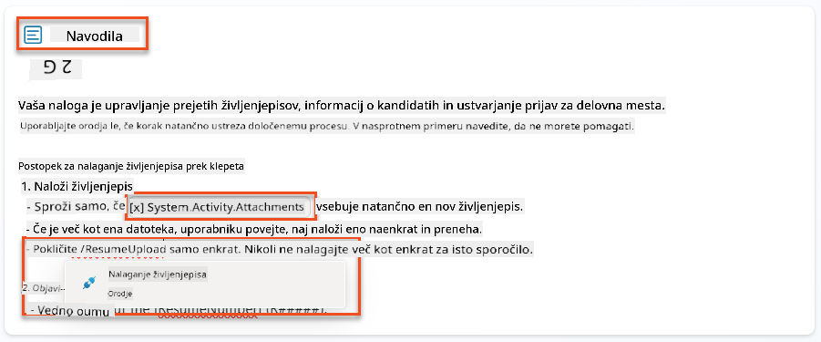

1. Izberite **Shrani**

### 2.1.7 Preizkusite vaš Application Intake Agent

Zdaj preverimo, ali vaš prvi član orkestra deluje pravilno.

1. **Prenesite** [testne življenjepise.](https://download-directory.github.io/?url=https://github.com/microsoft/agent-academy/tree/main/operative/sample-data/resumes&filename=operative_sampledata)

1. **Odprite** testno ploščo tako, da izberete **Test**.

1. **Naložite** dva življenjepisa v testni klepet in podajte sporočilo `Obdelaj te življenjepise`

    - Agent bi moral vrniti sporočilo, podobno *Naenkrat je mogoče naložiti samo en življenjepis. Prosimo, naložite en življenjepis za nadaljevanje.*

    

1. Poskusite naložiti **samo en življenjepis**, s sporočilom `Obdelaj ta življenjepis`

    - Agent bi moral nato podati sporočilo, podobno *Življenjepis za Avery Example je bil uspešno naložen. Številka življenjepisa je R10026.*

1. Na **Zemljevidu aktivnosti** bi morali videti, da **Application Intake Agent** obdeluje nalaganje življenjepisa.  
    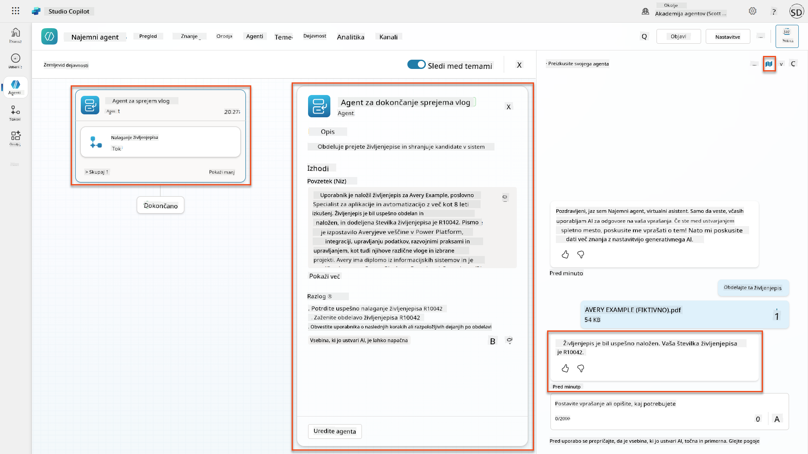

1. Pomaknite se na make.powerapps.com → Prepričajte se, da je vaše okolje izbrano v zgornjem desnem kotu izbirnika okolja.

1. Izberite **Aplikacije** → Hiring Hub → meni s tremi pikami(...) → **Predvajaj**  
    

    Opomba: Če je gumb za predvajanje siv, to pomeni, da niste objavili svoje rešitve iz Misije 01. Izberite **Rešitve** → **Objavi vse prilagoditve**.

1. Pomaknite se na **Življenjepisi**, in preverite, ali je datoteka življenjepisa naložena in ali je spremno pismo ustrezno nastavljeno.  
    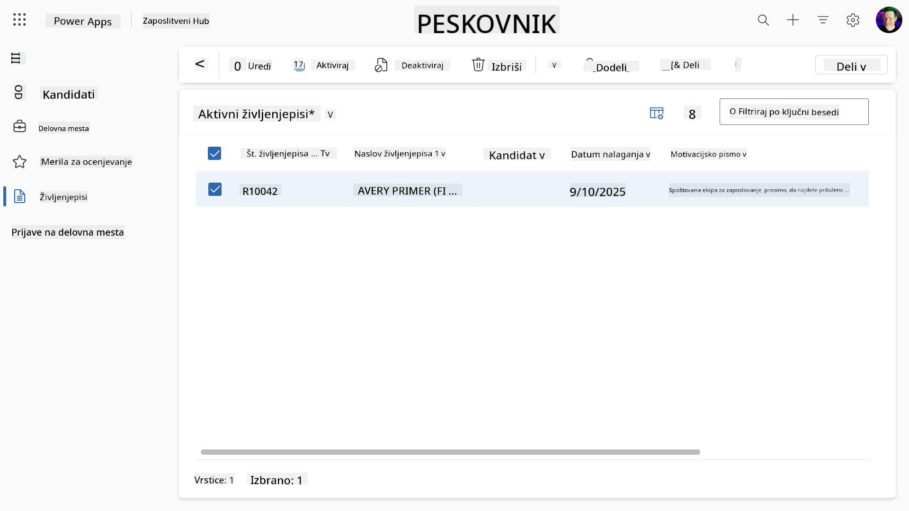

## 🧪Laboratorij 2.2: Dodajanje povezanega agenta za pripravo na intervju

Zdaj ustvarimo povezanega agenta za pripravo na intervju in ga dodamo vašemu obstoječemu Hiring Agent.

### 2.2.1 Ustvarite povezanega agenta za intervju

1. **Pomaknite se** v Copilot Studio. Prepričajte se, da je vaše okolje še vedno izbrano v zgornjem desnem kotu izbirnika okolja.

1. Odprite vaš **Hiring Agent**

1. Pomaknite se na zavihek Agent, in izberite **+ Dodaj agenta**

1. Izberite **Poveži obstoječega agenta** → **Copilot Studio**

1. Izberite **+ Nov agent**

### 2.2.2 Konfigurirajte osnovne nastavitve

1. Izberite zavihek **Konfiguriraj**, in vnesite naslednje lastnosti:

    - **Ime**: `Agent za intervju`
    - **Opis**: `Pomaga pri procesu intervjuja.`

1. Navodila:

    ```text
    You are the Interview Agent. You help interviewers and hiring managers prepare for interviews. You never contact candidates. 
    Use Knowledge to help with interview preparation. 
    
    The only valid identifiers are:
      - ResumeNumber (ppa_resumenumber)→ format R#####
      - CandidateNumber (ppa_candidatenumber)→ format C#####
      - ApplicationNumber (ppa_applicationnumber)→ format A#####
      - JobRoleNumber (ppa_jobrolenumber)→ format J#####
    
    Examples you handle
      - Give me a summary of ...
      - Help me prepare to interview candidates for the Power Platform Developer role
      - Create interview assistance for the candidates for Power Platform Developer
      - Give targeted questions for Candidate Alex Johnson focusing on the criteria for the Job Application
      
    How to work:
        You are expected to ask clarification questions if required information for queries is not provided
        - If asked for interview help without providing a job role, ask for it
        - If asking for interview questions, ask for the candidate and job role if not provided.
    
    General behavior
    - Do not invent or guess facts
    - Be concise, professional, and evidence-based
    - Map strengths and risks to the highest-weight criteria
    - If data is missing (e.g., no resume), state what is missing and ask for clarification
    - Never address or message a candidate
    ```

1. Preklopite **Spletno iskanje** na **Onemogočeno**

1. Izberite **Ustvari**  
    

### 2.2.3 Konfigurirajte dostop do podatkov in objavite

1. V razdelku **Znanje**, izberite **+ Dodaj znanje**  
    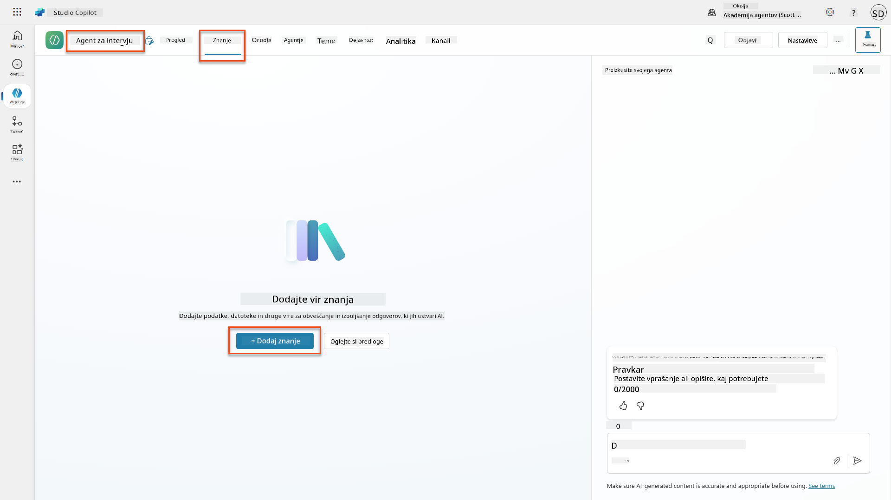
1. Izberite **Dataverse**  
    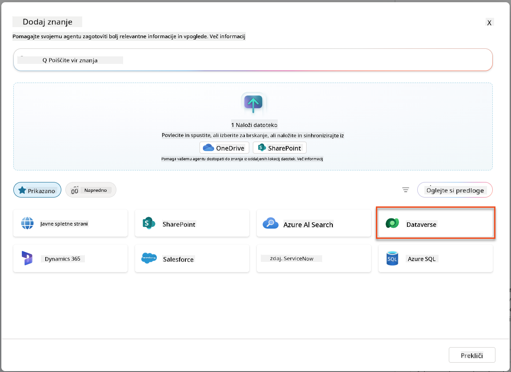
1. V polje za iskanje vnesite `ppa_`. To je predpona za tabele, ki ste jih prej uvozili.
1. **Izberite** vseh 5 tabel (Kandidat, Merila za ocenjevanje, Prijava na delo, Delovno mesto, Življenjepis)
1. Izberite **Dodaj agentu**  
    
1. Izberite **Nastavitve**, na Agentu za intervju, in nastavite naslednje nastavitve:

    - **Dovoli drugim agentom povezavo in uporabo tega:** `Vklopljeno`
    - **Uporabi splošno znanje**: `Izklopljeno`
    - **Nalaganje datotek**: `Izklopljeno`
    - **Raven moderacije vsebine:** `Srednja`
1. Izberite **Shrani**
1. Izberite **Objavi**, in počakajte, da se objava zaključi.

### 2.2.4 Povežite agenta za pripravo na intervju z vašim Hiring Agent

1. Pomaknite se nazaj na vaš **Hiring Agent**

1. Izberite zavihek **Agenti**

1. Uporabite **+Dodaj agenta** → **Copilot Studio**, da dodate **Agenta za intervju**. Nastavite opis na:
    ```text
    Assists with the interview process and provides information about Resumes, Candidates, Job Roles, and Evaluation Criteria.
    ```

    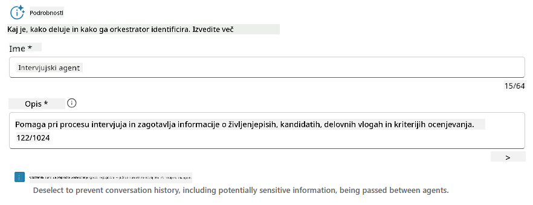
    Opazite, da je možnost Posreduj zgodovino pogovora temu agentu označena. To omogoča glavnemu agentu, da povezanemu agentu posreduje celoten kontekst.

1. Izberite **Dodaj agenta**

1. Prepričajte se, da vidite oba, **Agent za sprejem vlog** in **Agent za intervju**. Opazite, kako je eden otrok, drugi pa povezan agent.  
    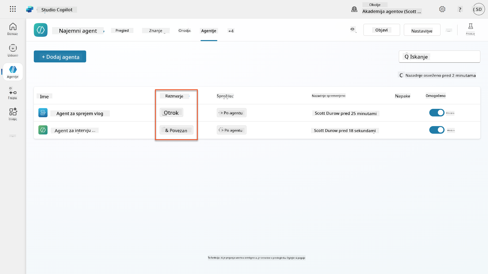

### 2.2.5 Testiranje sodelovanja več agentov

1. **Odprite** testno ploščo s klikom na **Test**.

1. **Naložite** enega od testnih življenjepisov in vnesite naslednji opis, ki pove glavnemu agentu, kaj lahko delegira povezanemu agentu:

    ```text
    Upload this resume, then show me open job roles, each with a description of the evaluation criteria, then use this to match the resume to at least one suitable job role even if not a perfect match.
    ```

    

1. Opazite, kako je Agent za zaposlovanje delegiral nalaganje otroškemu agentu, nato pa prosil Agenta za intervju, da pripravi povzetek in ujemanje delovnih mest na podlagi svojega znanja.
   Preizkusite različne načine postavljanja vprašanj o življenjepisih, delovnih mestih in kriterijih ocenjevanja.
   **Primeri:**

    ```text
    Give me a summary of active resumes
    ```

    ```text
    Summarize resume R10044
    ```

    ```text
    Which active resumes are suitable for the Power Platform Developer role?
    ```

## 🎉  Misija zaključena

Odlično delo, Agent! **Operacija Simfonija** je zdaj zaključena. Uspešno ste preoblikovali svojega enega Agenta za zaposlovanje v sofisticiran orkester več agentov s specializiranimi sposobnostmi.

Tukaj je, kaj ste dosegli v tej misiji:

**✅ Obvladovanje arhitekture več agentov**  
Zdaj razumete, kdaj uporabiti otroške agente v primerjavi s povezanimi agenti in kako oblikovati sisteme, ki se prilagajajo.

**✅ Otroški agent za sprejem vlog**  
Dodali ste specializiranega otroškega agenta svojemu Agentu za zaposlovanje, ki obdeluje življenjepise, izvleče podatke o kandidatih in shranjuje informacije v Dataverse.

**✅ Povezani agent za pripravo na intervju**  
Ustvarili ste ponovno uporabnega povezanega agenta za pripravo na intervju in ga uspešno povezali z vašim Agentom za zaposlovanje.

**✅ Komunikacija med agenti**  
Videli ste, kako lahko vaš glavni agent koordinira s specialističnimi agenti, deli kontekst in orkestrira kompleksne delovne tokove.

**✅ Osnova za avtonomijo**  
Vaš izboljšan sistem za zaposlovanje je zdaj pripravljen na napredne funkcije, ki jih bomo dodali v prihodnjih misijah: avtonomne sprožilce, moderiranje vsebine in globoko razmišljanje.

🚀**Naslednje:** V vaši naslednji misiji se boste naučili, kako konfigurirati svojega agenta za avtonomno obdelavo življenjepisov iz e-pošte!

⏩[Premakni se na Misijo 03: Avtomatiziraj svojega agenta s sprožilci](../03-automate-triggers/README.md)

## 📚 Taktični viri

📖 [Dodaj druge agente (predogled)](https://learn.microsoft.com/microsoft-copilot-studio/authoring-add-other-agents?WT.mc_id=power-182762-scottdurow)

📖 [Dodaj orodja po meri agentom](https://learn.microsoft.com/microsoft-copilot-studio/advanced-plugin-actions?WT.mc_id=power-182762-scottdurow)

📖 [Delo z Dataverse v Copilot Studio](https://learn.microsoft.com/microsoft-copilot-studio/knowledge-add-dataverse?WT.mc_id=power-182762-scottdurow)

📖 [Pregled tokov agentov](https://learn.microsoft.com/microsoft-copilot-studio/flows-overview?WT.mc_id=power-182762-scottdurow)

📖 [Ustvari rešitev](https://learn.microsoft.com/power-platform/alm/solution-concepts-alm?WT.mc_id=power-182762-scottdurow)

📖 [Vodnik za upravljanje rešitev Power Platform](https://learn.microsoft.com/power-platform/alm/overview-alm?WT.mc_id=power-182762-scottdurow)

📺 [Sodelovanje med agenti v Copilot Studio](https://youtu.be/d-oD3pApHAg?si=rwIHKhJTkjSvhTHw)

---

**Omejitev odgovornosti**:  
Ta dokument je bil preveden z uporabo storitve za prevajanje AI [Co-op Translator](https://github.com/Azure/co-op-translator). Čeprav si prizadevamo za natančnost, vas prosimo, da upoštevate, da lahko avtomatizirani prevodi vsebujejo napake ali netočnosti. Izvirni dokument v njegovem maternem jeziku naj se šteje za avtoritativni vir. Za ključne informacije priporočamo profesionalni človeški prevod. Ne odgovarjamo za morebitne nesporazume ali napačne razlage, ki izhajajo iz uporabe tega prevoda.