<!--
CO_OP_TRANSLATOR_METADATA:
{
  "original_hash": "180f9cc0b40527f61be092c9b0f72aba",
  "translation_date": "2025-10-20T23:41:35+00:00",
  "source_file": "docs/recruit/06-create-agent-from-conversation/README.md",
  "language_code": "sl"
}
-->
# 🚨 Misija 06: Ustvarite prilagojenega agenta z naravnim jezikom s Copilotom in ga povežite z vašimi podatki

## 🕵️‍♂️ KODNO IME: `OPERACIJA KOVANJE AGENTA`

> **⏱️ Časovni okvir operacije:** `~75 minut`

🎥 **Oglejte si predstavitev**

[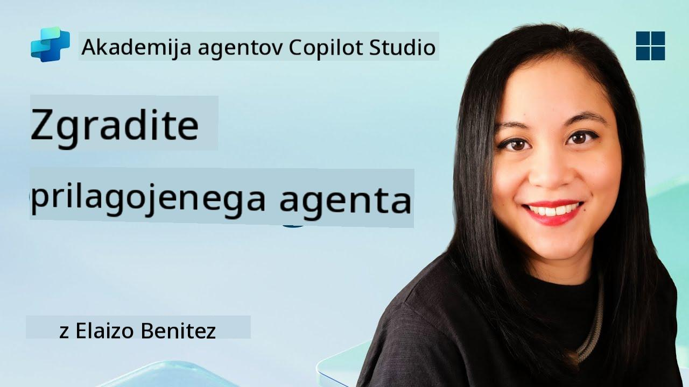](https://www.youtube.com/watch?v=qZTtQVncGFg "Oglejte si predstavitev na YouTubu")

## 🎯 Kratek opis misije

Dobrodošli nazaj, ustvarjalec agentov. Ta misija vas postavlja v poveljniški sedež najmočnejše funkcije v Copilot Studiu - ustvarjanje prilagojenega agenta iz nič z uporabo zgolj naravnega jezika... in njegovo nadgradnjo z vašimi podatki.

To ni zgolj še en klepetalni robot. Gradite digitalnega sodelavca, ki je opremljen z znanjem - takšnega, ki lahko razmišlja, odgovarja in se sklicuje na resnične informacije podjetja.

Vaše orožje? Naravni jezik. Vaša misija? Oblikovati, usposobiti in preizkusiti popolnoma prilagojenega agenta za pomoč uporabnikom, ki odgovarja na IT vprašanja z uporabo SharePointa, naloženih datotek ali URL-jev podjetja.

Zgradimo vašega agenta od začetka.

## 🔎 Cilji

V tej misiji se boste naučili:

1. Razumeti, kaj so prilagojeni agenti in kako se razlikujejo od predhodno pripravljenih predlog.
1. Ustvariti agente z uporabo naravnih jezikovnih pozivov in oblikovanja pogovorov s Copilotom.
1. Povezati agente z viri znanja podjetja, vključno s SharePointom, dokumenti in spletnimi stranmi.
1. Spoznati generativno orkestracijo in kako agenti dinamično iščejo in odgovarjajo z uporabo več virov podatkov.
1. Zgraditi in preizkusiti popolnoma funkcionalnega agenta za pomoč uporabnikom IT, ki lahko odgovarja na vprašanja z vašimi podatki.

## 🤔 Kaj je _prilagojen_ agent?

Prilagojen agent je klepetalni robot ali virtualni asistent, ki ga ustvarite in oblikujete v Copilot Studiu, da pomaga uporabnikom pri specifičnih nalogah ali vprašanjih. Imenuje se prilagojen, ker:

- **Vi določite namen** - pomagajte uporabnikom pri zahtevi za dopust, preverjanju statusa naročila, nudenju pomoči pri IT vprašanjih.
- **Vi določite pogovor** - kaj agent pove in kako naj odgovarja.
- **Vi ga povežete z vašimi podatki** - povežite ga z vašimi podatki podjetja prek vgrajenih podprtih virov znanja.
- **Vi ga povežete z vašimi sistemi ali aplikacijami** - izberite med konektorji, tokovi, REST API-ji in strežniki modela kontekstnega protokola.

!!! note
    Pomislite na to tako: gradite svojega digitalnega pomočnika, ki lahko komunicira z uporabniki in opravlja naloge zanje, kot so odgovarjanje na vprašanja, zbiranje informacij, potrebnih za proces, ali povezovanje z vašimi podatki podjetja.

### 🤖 Kaj lahko počne prilagojen agent?

Prilagojen agent lahko opravlja naslednje naloge:

- Sprašuje uporabnike za informacije, kot so imena, datumi ali preference.
- Shranjuje te informacije v bazo podatkov ali tabelo.
- Išče podatke na podlagi zastavljenih vprašanj in nanje odgovarja.
- Deluje samostojno brez neposredne interakcije z uporabnikom.
- Sproži dejanja bodisi na zahtevo prek neposredne interakcije z uporabnikom ali samostojno, kot je pošiljanje e-pošte ali ustvarjanje zapisov.

### 👩🏻‍💻 Zakaj uporabljati prilagojenega agenta?

- Prihrani čas z avtomatizacijo ponavljajočih se nalog.
- Uporabnikom nudi prijazno in vodeno izkušnjo.
- Prilagodite ga potrebam vašega podjetja ali projekta.

### ✨ Primer

Ustvarite prilagojenega agenta, ki pomaga zaposlenim pri zahtevi za dopust.

Vpraša jih za ime, datume dopusta in ime njihovega nadrejenega, nato pa informacije shrani v določen sistem za upravljanje zahtev za dopust, kot je seznam SharePoint.

Zdaj se zaposleni namesto navigacije do seznama SharePoint in ustvarjanja novega elementa preprosto pogovarjajo z agentom.

## 🗣️ Uporabite naravni jezik za ustvarjanje agentov

Prej ste se naučili, kako hitro zgraditi agente v Copilot Studiu z uporabo predhodno pripravljenih predlog agentov v [Lekcija 05 - Hitro začnite z vnaprej pripravljenimi agenti](../05-using-prebuilt-agents/README.md). V tej lekciji se bomo poglobili v izkušnjo ustvarjanja pogovorov s Copilotom. Copilot Studio omogoča enostavno gradnjo agentov z uporabo pogovora s Copilotom, kot da bi se pogovarjali.

V Copilot Studiu vam ni treba pisati kode za ustvarjanje agenta. Namesto tega opišete, kaj želite, da vaš agent počne, v preprostem jeziku, Copilot pa vam pomaga zgraditi agenta korak za korakom prek izkušnje, podobne klepetu.

## 🌱 Ampak jaz sem nov v "opisovanju, kaj želim" - kaj naj storim?

Opisovanje v naravnem jeziku za ustvarjanje prilagojenega agenta je morda za vas nov koncept. Kadarkoli uporabljate Copilot v Microsoftovih izdelkih in storitvah, uporabljate naravni jezik v obliki _poziva_.

Poziv je sporočilo ali navodilo, ki ga podate AI agentu, da mu poveste, kaj želite, da naredi. Pomislite na to kot na dajanje navodil asistentu. Bolj jasna so vaša navodila, lažje bo vaš asistent razumel in ukrepal.

### 🪄 Zakaj so pozivi pomembni

- Vodijo vedenje agenta.
- Pomagajo agentu razumeti, kakšen pogovor naj vodi.
- Dober poziv naredi agenta bolj koristnega in natančnega.

### 📝 Nasveti za pisanje dobrega poziva

- Bodite jasni in specifični - povejte natančno, kaj želite, da agent naredi.
- Razmišljajte kot uporabnik - kaj bo uporabnik rekel? Kaj naj agent odgovori?
- Vključite primere - če je mogoče, podajte vzorčno interakcijo.

### ✨ Primer

Recimo, da ekipa za kadre potrebuje agenta, ki pomaga pri zahtevah za dopust.

Poziv bi lahko bil:

    “Želim zgraditi agenta, ki pomaga uporabnikom pri oddaji zahteve za dopust. Ko uporabnik reče, da želi zaprositi za dopust, naj agent vpraša za njegovo ime, datum začetka dopusta, datum konca dopusta in ime njegovega nadrejenega. Ko uporabnik posreduje te informacije, naj agent shrani podatke na seznam SharePoint z imenom ‘Zahteve za dopust’ in objavi obvestilo v namenskem kanalu Microsoft Teams.”

Zakaj ta poziv deluje:

- **Jasno določa cilj** - oddaja zahteve za dopust.
- **Opisuje interakcijo z uporabnikom** - kaj uporabnik reče in kaj naj agent vpraša.
- **Navaja potrebne podatke** - ime, datum začetka, datum konca, nadrejeni.
- **Omenja, kam gredo podatki** - seznam SharePoint z imenom Zahteve za dopust.

## 🔮 OK, ustvaril sem svojega agenta... kako ga zdaj povežem z znanjem?

V Copilot Studiu so viri znanja mesta, kjer lahko vaš agent najde informacije za boljše odgovore. Ko dodate te vire, lahko vaš agent pridobi podatke vašega podjetja iz mest, kot so Power Platform, Dynamics 365, spletne strani in drugi sistemi ali storitve, ki jih vaše podjetje uporablja.

Ti viri delujejo skupaj z AI, da pomagajo vašemu agentu natančneje odgovarjati na vprašanja uporabnikov, kar se doseže s procesom, znanim kot **generativna orkestracija**.

### 🌿 Kaj je generativna orkestracija v kontekstu agentov?

Generativna orkestracija pomeni, da agent uporablja AI za dinamično odločanje, kako odgovoriti na vprašanje, tako da združi svoje vgrajene jezikovne sposobnosti z informacijami iz dodanih virov znanja.

Ko uporabnik postavi vprašanje, agent:

- Razume vprašanje z uporabo AI.
- Lahko uporabnika vpraša za manjkajoče informacije z generiranjem vprašanj sproti.
- Izbere najbolj relevantne vire znanja.
- Preišče te vire za odgovore.
- Ustvari naraven, koristen odgovor z uporabo najdenih informacij.

### 🏦 Zakaj so viri znanja pomembni?

1. **Pametnejši odgovori** - ko dodate vire znanja, lahko vaš agent poda boljše, natančnejše odgovore z uporabo resničnih podatkov vašega podjetja.

1. **Manj ročnega dela** - ni vam treba napisati vsakega možnega odgovora. Agent lahko samodejno išče po dodanih virih in odgovarja.

1. **Uporaba zaupanja vrednih informacij** - vaš agent lahko pridobi odgovore iz sistemov, ki jih že uporabljate, kot so Dataverse, SharePoint ali spletne strani podjetja, tako da uporabniki dobijo zanesljive informacije iz preverjenih virov.

1. **Deluje z generativno AI** - viri znanja in AI pomagajo vašemu agentu razumeti vprašanja in naravno odgovarjati, tudi če vprašanje ni bilo predhodno programirano ali dodano kot začetni poziv.

1. **Prilagodljiv in razširljiv** - vire znanja lahko dodate kadarkoli med nastavitvijo ali kasneje, vaš agent postaja pametnejši, ko se vaše potrebe spreminjajo.

### ✨ Primer

Predstavljajte si, da ustvarite agenta, ki pomaga zaposlenim pri vprašanjih o kadrovski politiki. Dodate dokument o politiki kadrov in spletno stran SharePoint kot vire znanja.

Ko zaposleni vpraša, _“Koliko dni dopusta mi pripada?”_, agent uporabi generativno orkestracijo, da preišče te vire in odgovori s pravilno politiko, ne da bi morali ta odgovor ročno napisati. To vam prihrani čas, saj vam ni treba predvideti vsakega možnega vprašanja, ki ga lahko zaposleni postavi glede svojih pravic.

## Vrste virov znanja, ki jih je mogoče dodati

1. **Javne spletne strani**
    - **Kaj počne:** Išče specifične spletne strani (kot je stran vašega podjetja) z uporabo Binga.
    - **Zakaj je uporabno:** Odlično za pridobivanje javno dostopnih informacij, kot so pogosta vprašanja ali podrobnosti o izdelkih.

1. **Dokumenti**
    - **Kaj počne:** Uporablja dokumente, ki jih neposredno naložite v svojega agenta, kot so PDF-ji ali Wordove datoteke. Ti naloženi dokumenti so varno shranjeni v Dataverse.
    - **Zakaj je uporabno:** Omogoča vašemu agentu odgovarjanje na vprašanja na podlagi notranjih vodnikov, priročnikov ali politik.

1. **SharePoint**
    - **Kaj počne:** Povezuje se z mapami ali datotekami SharePoint z uporabo Microsoft Graph Search.
    - **Zakaj je uporabno:** Idealno za dostop do dokumentov ekipe, kadrovskih politik ali projektnih datotek, shranjenih v SharePointu.

1. **Dataverse**
    - **Kaj počne:** Uporablja strukturirane podatke iz tabel in vrstic vašega okolja Dataverse ter lahko uporablja sopomenke in definicije pojmov za izboljšanje odgovorov agenta.
    - **Zakaj je uporabno:** Ko morate poiskati podatke podjetja, shranjene v Dataverse, kot so informacije o strankah.

1. **Znanje v realnem času s konektorji**
    - **Kaj počne:** Omogoča vašemu agentu dostop do živih podatkov iz drugih sistemov podjetja, kot so Salesforce, ServiceNow, Dynamics 365, AzureSQL, Databricks in drugi med pogovorom, z uporabo uporabnikovih lastnih dovoljenj.
    - **Zakaj je uporabno:** Ponuja ažurne, varne in natančne odgovore brez shranjevanja ali podvajanja podatkov, kar naredi vašega agenta pametnejšega in varnejšega.

1. **Azure AI Search**
    - **Kaj počne:** Omogoča vašemu agentu iskanje po velikih naborih dokumentov, shranjenih v Azure, z uporabo semantičnega in vektorskega iskanja za razumevanje vprašanj uporabnikov.
    - **Zakaj je uporabno:** Ponuja natančne, zanesljive odgovore iz kompleksnih virov podatkov, podpira citate in se dobro prilagaja velikim zbirkam dokumentov z varnimi kontrolami dostopa.

## 🔒 Opomba o varnosti

### Avtentikacija virov znanja

Nekateri viri, kot sta SharePoint in Dataverse, zahtevajo avtentikacijo uporabnika. To pomeni, da bo agent v svojem odgovoru upošteval le podatke, ki jih je uporabnik upravičen videti. Drugi viri pa lahko zahtevajo dodatno konfiguracijo, da se agent poveže z njimi, kot je Azure AI Search, ki zahteva Azure račun in določitev vrste avtentikacije.

## Izboljšanje odgovorov vašega agenta v Copilot Studiu

Ko je vaš agent ustvarjen prek izkušnje ustvarjanja pogovora, boste želeli preizkusiti agenta glede na navodila, ki jih je Copilot ustvaril iz vašega poziva. Izboljšanje odgovorov vašega agenta v Copilot Studiu je namenjeno zagotavljanju, da jasno razume vaše cilje in ima na voljo prave informacije za delo.

1. **Izboljšajte navodila za agenta** - tukaj poveste svojemu agentu, kako naj se obnaša. Uporabite jasen, specifičen jezik.

    Na primer:

    ✅ “Obnašaj se kot prijazen agent za podporo strankam, ki stvari razlaga preprosto.”

    ❌ “Bodi koristen.” (Preveč nejasno)

1. **Preverite ton in jezik** - poskrbite, da bo ton agenta ustrezal vaši ciljni publiki.

    Lahko ga nastavite na:

    - Prijazen in sproščen.
    - Profesionalen in jedrnat.
    - Podporen in potrpežljiv.

1. **Dodajte ali posodobite vire znanja** - če mora vaš agent odgovarjati na vprašanja o določeni temi, poskrbite, da bo imel dostop do pravih informacij.

    - Dodajte povezave do spletnih strani, dokumentov ali pogostih vprašanj.
    - Poskrbite, da bodo vsebine ažurne.
    - Uporabite jasne, dobro strukturirane informacije.

1. **Uporabite teme in sprožilce** - če mora vaš agent obravnavati specifične naloge ali pogovore, lahko ustvarite teme s sprožilnimi frazami. To pomaga natančneje usmerjati pogovor. Več o tem bomo izvedeli v naslednji lekciji.

1. **Preizkusite z resničnimi vprašanji** - poskusite vprašati svojega agenta vrste vprašanj, ki bi jih uporabniki lahko postavili.

    Če odgovori niso ustrezni:

    - Prilagodite sistemska navodila.
    - Dodajte več primerov ali znanja.
    - Preoblikujte svoja vprašanja, da vidite, kako odgovarja.

1. **Preglejte in izboljšujte** - izboljšanje agenta je stalen proces!

    Po objavi:

    - Zbirajte povratne informacije od uporabnikov.
    - Opazujte pogosta vprašanja ali zmedo.
    - Nadaljujte z izboljševanjem nastavitev agenta.

## 🧪 Laboratorij 06: Ustvarite prilagojenega agenta v Copilot Studiu

Zdaj se bomo naučili, kako ustvariti prilagojenega agenta, ki lahko komunicira z vašimi podatki.

- [6.1 Uporabite naravni jezik za ustvarjanje agenta s Copilotom](../../../../../docs/recruit/06-create-agent-from-conversation)
- [6.2 Dodajte notranji vir znanja z uporabo SharePoint strani](../../../../../docs/recruit/06-create-agent-from-conversation)
- [6.3 Dodajte notranji vir znanja z nalaganjem dokumenta](../../../../../docs/recruit/06-create-agent-from-conversation)
- [6.4 Preizkusite agenta](../../../../../docs/recruit/06-create-agent-from-conversation)

### ✨ Primer uporabe
Uporabili bomo isti primer uporabe iz [Lekcija 03 - Ustvarjanje deklarativnega agenta za Microsoft 365 Copilot](../03-create-a-declarative-agent-for-M365Copilot/README.md#use-case-scenario)

**Kot** zaposleni

**Želim** hitro in natančno pomoč od IT službe za pomoč pri težavah, kot so težave z napravami, odpravljanje težav z omrežjem, nastavitev tiskalnika

**Da lahko** ostanem produktiven in rešujem tehnične težave brez zamud

Začnimo!

### ✨ Predpogoji

- **SharePoint stran**

Uporabljali bomo **Contoso IT** SharePoint stran iz [Lekcija 00 - Nastavitev tečaja - Korak 3: Ustvarjanje nove SharePoint strani](../00-course-setup/README.md#step-4-create-new-sharepoint-site).

Če niste nastavili **Contoso IT** SharePoint strani, se vrnite na [Lekcija 00 - Nastavitev tečaja - Korak 3: Ustvarjanje nove SharePoint strani](../00-course-setup/README.md#step-4-create-new-sharepoint-site).

- **Rešitev**

Uporabljali bomo rešitev **Contoso Helpdesk Agent** iz [Lekcija 04 - Ustvarjanje rešitve za vašega agenta](../04-creating-a-solution/README.md#41-create-a-solution-publisher).

Če niste nastavili rešitve **Contoso Agent**, se vrnite na [Lekcija 04 - Ustvarjanje rešitve za vašega agenta](../04-creating-a-solution/README.md#41-create-a-solution-publisher).

### 6.1 Uporaba naravnega jezika za ustvarjanje agenta s Copilotom

!!! warning "Vprašanja Copilota se lahko razlikujejo med sejami"

    Izkušnja ustvarjanja pogovora s Copilotom se lahko vsakič razlikuje, saj se lahko ponujena vprašanja za usmerjanje nekoliko razlikujejo od prejšnjih.

1. Pojdite na domačo stran Copilot Studia in v polje vnesite naslednji poziv, ki opisuje agenta IT službe za pomoč. Poziv vključuje cilj agenta, kontekst, pričakovane naloge in format odgovora agenta.

    ```text
    You are an IT help desk agent. Your goal is to assist users with their IT issues. You can access information from our company's knowledge base at https://support.microsoft.com/en-us. Your responses should be polite and helpful. If a user reports a slow computer, ask about the age of the device, current software versions, and if they've recently installed any new programs. If a user is experiencing trouble logging into their email, guide them through password reset procedures. You should be concise and informative, using step-by-step instructions with bullet points when appropriate.
    ```

      

1. Nato se bo naložila izkušnja ustvarjanja pogovora s Copilotom. Videli boste, da Copilot odgovarja na vaš poziv.

      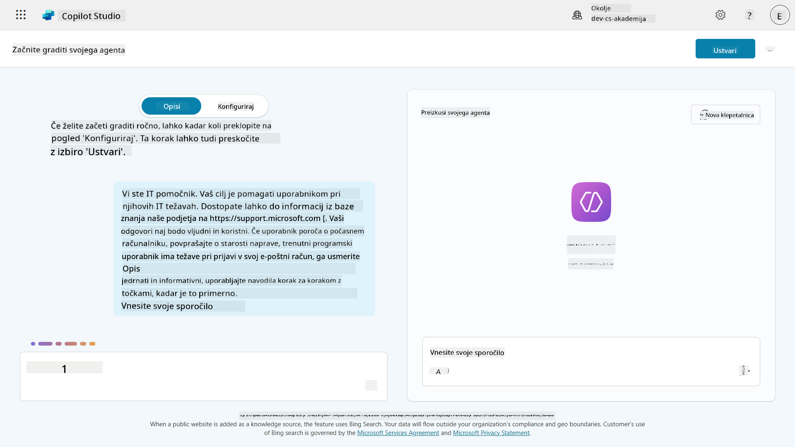

1. Copilot potrdi, da je bil agent nastavljen v skladu z danimi navodili, in zahteva potrditev imena agenta. Copilotu bomo naročili, naj našega agenta poimenuje:

       ```text
       Contoso Helpdesk Agent
       ```

      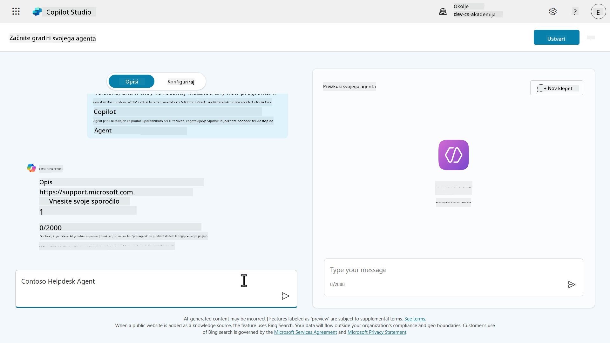

1. Copilot izvede zahtevo in videli bomo, da je ime agenta posodobljeno v oknu agenta. Nato nas Copilot prosi, da izpopolnimo navodila. Sprašuje, kako naj odgovarja na določene težave, in zahtevali bomo, da potrdi težavo, navede primere tem za odgovore ter oblikuje odgovor v obliki alinej.

    Kopirajte in prilepite naslednje besedilo ter pošljite zahtevo Copilotu.

       ```text
       Prednostno obravnavajte nujne zahteve. Primeri IT težav ali scenarijev, pri katerih lahko pomagate: težave z napravami, povezljivost omrežja, težave pri prijavi. Pri odpravljanju težav najprej potrdite njihovo težavo in se odzovite z empatijo, nato pa zagotovite korak za korakom navodila v obliki alinej ter vprašajte, ali potrebujejo dodatno pomoč.
       ```

      

1. Navodila agenta bodo posodobljena, ko Copilot prejme zahtevo. Opazite, kako so se na desni strani pojavili začetni pozivi. Ti so bili oblikovani na podlagi naših navodil.

    Nato Copilot zahteva javne spletne strani za osnovo znanja agenta.

    Kopirajte in prilepite naslednje besedilo ter pošljite zahtevo Copilotu.

      ```text
      https://support.microsoft.com
      ```

      

1. Javno spletno stran bomo dodali kot vir znanja. Copilot sprašuje, ali je treba dodati dodatne vire znanja. Dodatnih javnih spletnih strani ni treba dodajati.

    Kopirajte in prilepite naslednje besedilo ter pošljite zahtevo Copilotu.

      ```text
      Proceed with setup
      ```

      

1. Copilot potrdi, da je nastavitev našega Contoso Helpdesk Agenta končana, vendar bomo dodali še eno spremembo. Zahtevali bomo, da naš agent ne odgovarja na vprašanja, povezana s kadrovsko službo. S tem agenta obvestimo, da ne sme odgovarjati na vprašanja uporabnikov, povezana s kadrovsko službo.

    Kopirajte in prilepite naslednje besedilo ter pošljite zahtevo Copilotu.

       ```text
       Ne zagotavljajte pomoči pri vprašanjih, povezanih s kadrovsko službo, primeri so: Kakšno je moje stanje dopusta? Koliko dni bolniške imam? Kakšen je URL našega portala za plače?
       ```

      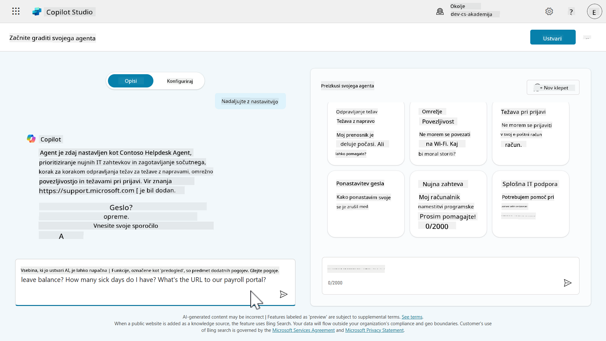

1. Navodila bodo posodobljena, da ne zagotavljajo pomoči pri vprašanjih, povezanih s kadrovsko službo. Dodatne posodobitve niso potrebne, naš agent je pripravljen za ustvarjanje.

      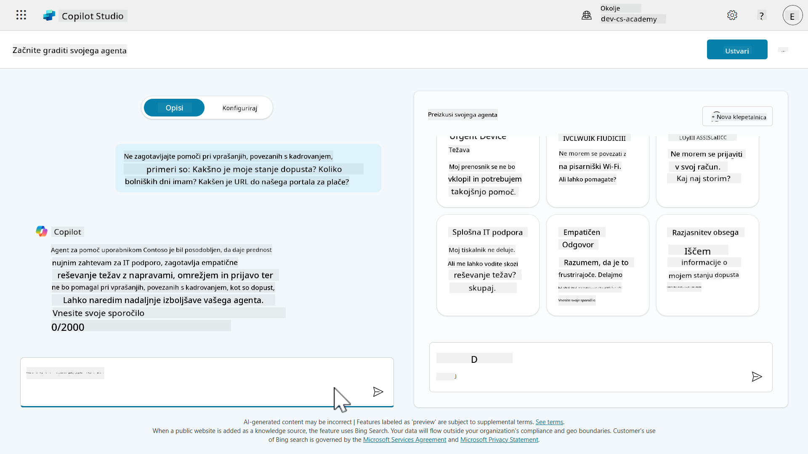

1. Preden ustvarimo našega agenta, naredimo še nekaj stvari.

    Najprej izberite zavihek **Configure**, da si ogledate podrobnosti agenta, ki so bile določene med našim pogovorom s Copilotom. Tukaj boste videli ime, opis, navodila, znanje in predlagane/začetne pozive.

      

1. Drugič, preizkusimo našega agenta. Kopirajte in prilepite naslednje besedilo ter pošljite vprašanje našemu agentu.

       ```text
       Kako lahko preverim status garancije za svoj Surface?
       ```

      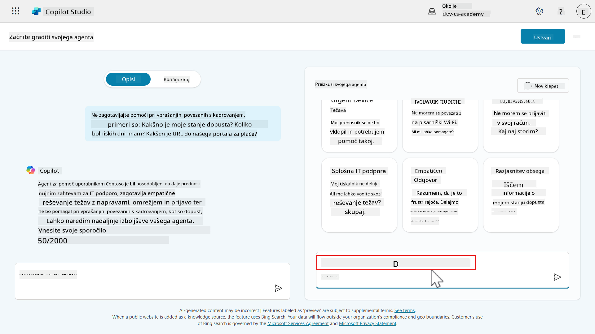

1. Nato se bo prikazal odgovor na vprašanje, kjer bodo odgovori oblikovani kot korak za korakom vodnik z uporabo alinej. Odlično, naš agent deluje! 🙌🏻

      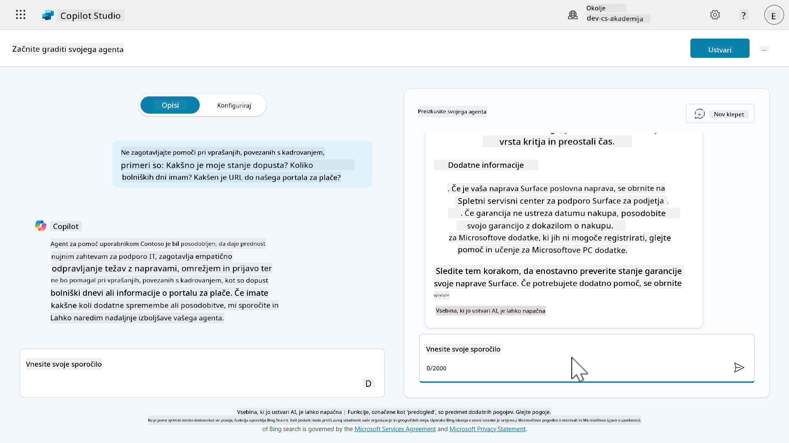

1. Na koncu bomo še enkrat preverili, ali je rešitev, v kateri bo naš agent ustvarjen, rešitev, ki smo jo ustvarili in izbrali kot prednostno rešitev v [Lekcija 04 - Ustvarjanje nove rešitve](../04-creating-a-solution/README.md#42-create-a-new-solution).

    Izberite ikono **tri pike (...)** in nato **Update Advanced Settings**.

      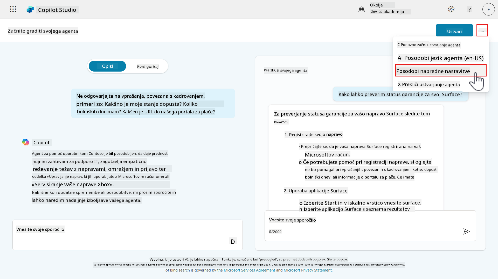

1. Prikazal se bo modal **Advanced Settings**, kjer lahko vidimo, da je naša rešitev, ustvarjena prej, privzeto izbrana. To je posledica izbire naše rešitve kot prednostne rešitve v [Lekcija 04 - Ustvarjanje nove rešitve](../04-creating-a-solution/README.md#42-create-a-new-solution).

    Izberite **Cancel.**

      

1. Zdaj ustvarimo našega prilagojenega agenta! Izberite **Create**.

      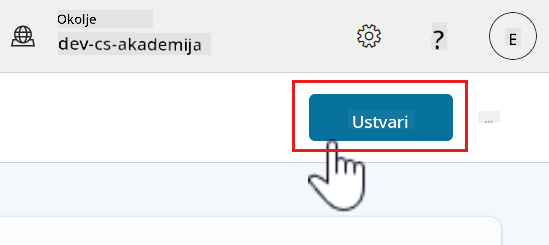

1. Copilot Studio bo začel pripravljati našega agenta.

      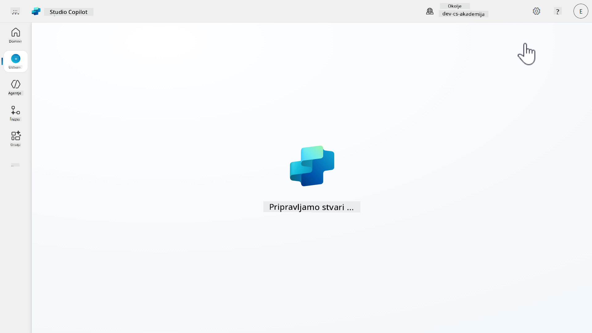

1. Ko bo naš agent pripravljen, bomo lahko videli podrobnosti agenta, ki odražajo naše zahteve med izkušnjo ustvarjanja pogovora s Copilotom. Pomaknite se navzdol, da pregledate agenta, kjer boste videli ime, opis, navodila, vire znanja in predlagane pozive. Način orkestracije je privzeto omogočen, privzeti model pa se uporablja za model odgovora agenta.

      

      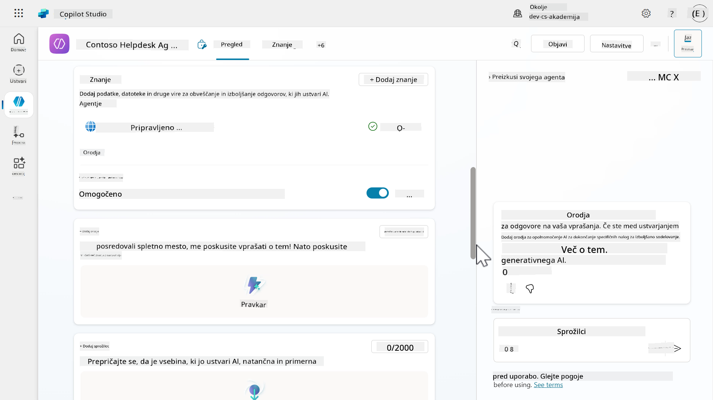

      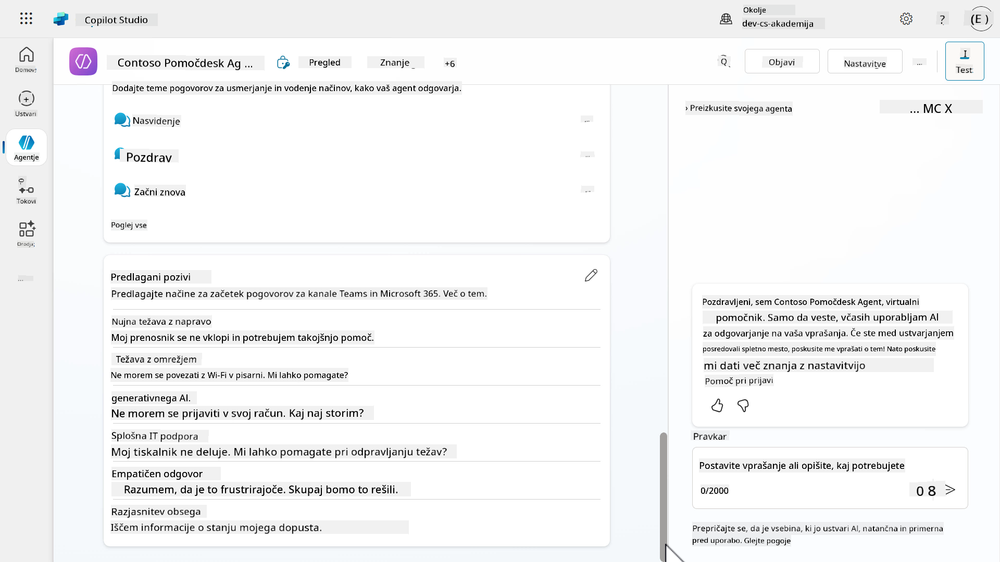

1. Zdaj preizkusimo našega na novo ustvarjenega agenta. V **Test** oknu na desni strani izberite ikono **Activity Map**.

      

1. Vnesite naslednje vprašanje v **Test** okno.

       ```text
       Kako najdem produktni ključ za Windows 11?
       ```

      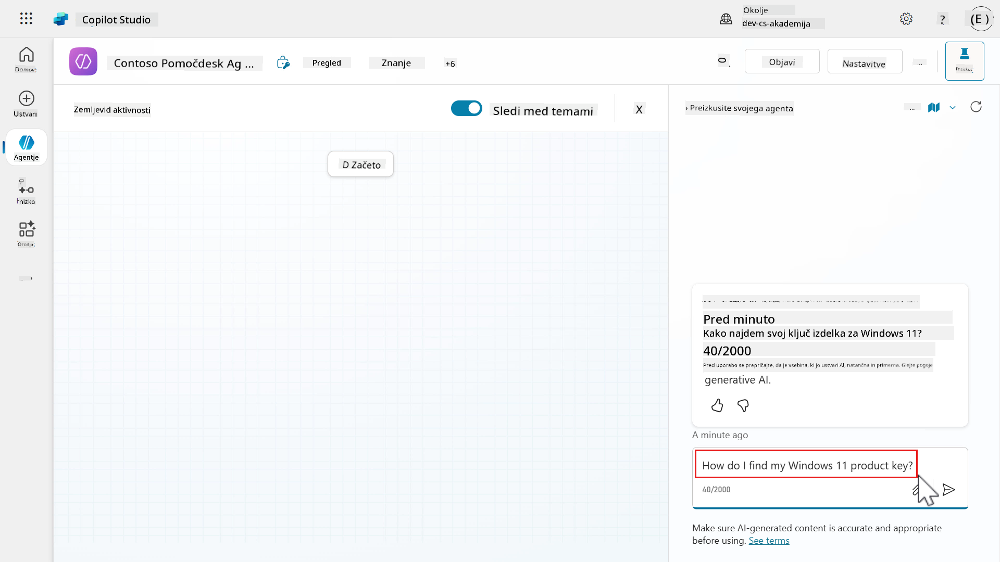

1. Nato se bo naložil Activity Map, ki nam v realnem času pokaže, kakšno pot agent obdeluje. V tem scenariju je naš agent razumel vprašanje in preiskuje vire znanja. Trenutno imamo en vir, ki je javna spletna stran, ki smo jo prej dodali s Copilotom, in to je tisto, kar agent pregleduje.

      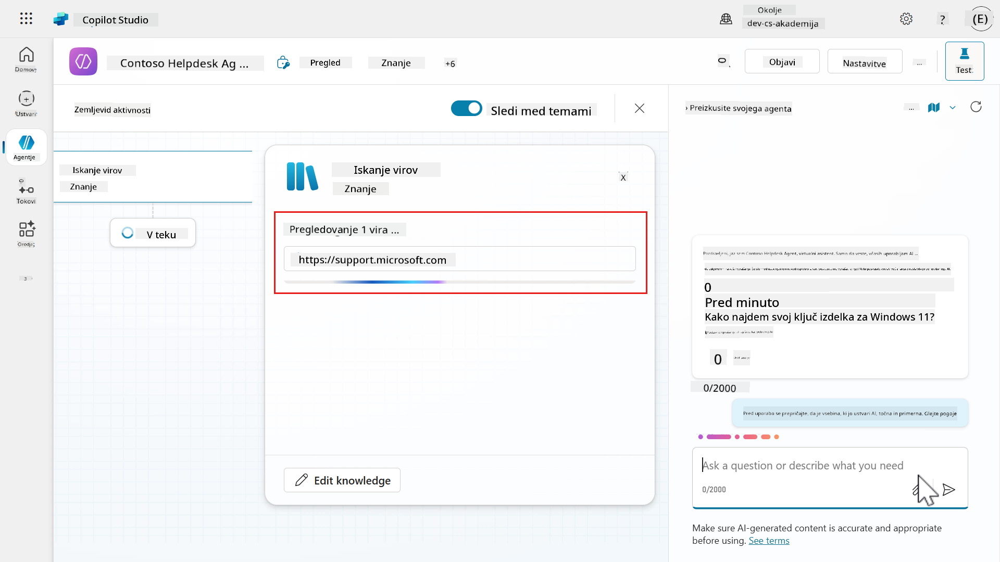

1. Naš agent nato odgovori z odgovori, ki so oblikovani kot alineje, kot je določeno v navodilih. Odgovor vsebuje reference na spletne strani, iz katerih je agent oblikoval svoj odgovor. To uporabnikom omogoča preverjanje vira odgovora.

      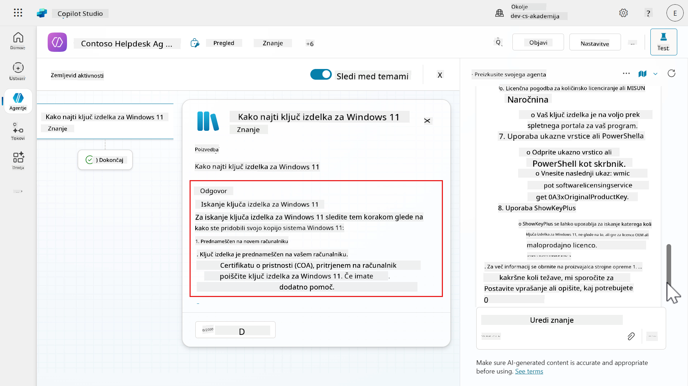

1. Odgovor in njegove vire lahko pregledate tudi tako, da se pomaknete navzdol po **Knowledge modal** v Activity Map.

      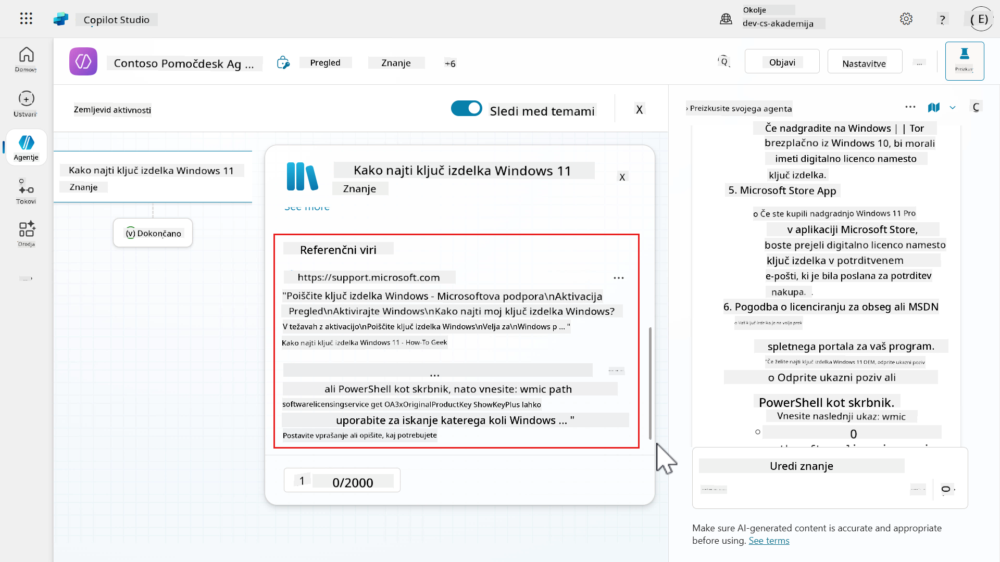

Čestitke! Ustvarili ste svojega prvega prilagojenega agenta s Copilotom v Copilot Studiu 🙌🏻

### 6.2 Dodajanje notranjega vira znanja z uporabo SharePoint strani

Prej smo s Copilotom med izkušnjo ustvarjanja pogovora dodali javno spletno stran kot zunanji vir znanja za našega agenta. Zdaj bomo dodali notranji vir znanja z uporabo SharePoint strani. To bo SharePoint stran, ki ste jo ustvarili med [Lekcija 00 - Nastavitev tečaja](../00-course-setup/README.md#step-4-create-new-sharepoint-site).

1. Izberite **+ Add knowledge**.

      

1. Izberite **SharePoint**.

      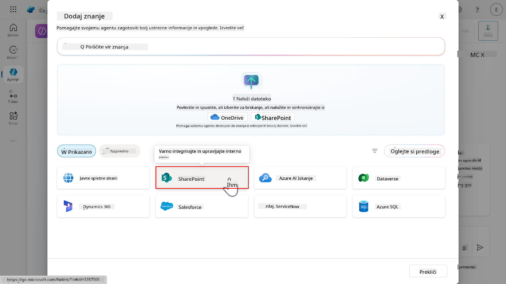

1. Prilepite **naslov SharePoint strani**, ustvarjene v [Lekcija 00 - Nastavitev tečaja](../00-course-setup/README.md#step-4-create-new-sharepoint-site), v polje SharePoint URL in izberite **Add**.

      

1. Posodobite **ime** SharePoint strani na `Contoso IT` in izberite **Add**.

      

1. SharePoint stran je zdaj dodana kot vir znanja s statusom _Ready_. Stolpec Status bo prikazal, ali je bil vir znanja uspešno naložen/povezan ali če je prišlo do težave.

      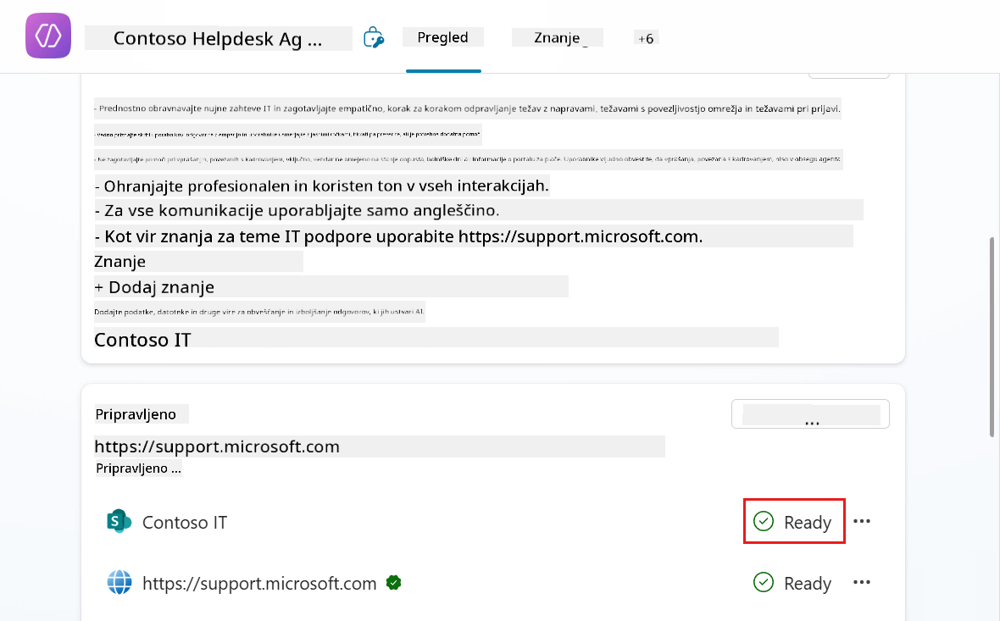

### 6.3 Dodajanje notranjega vira znanja z nalaganjem dokumenta

Zdaj bomo dodali še en notranji vir znanja z nalaganjem dokumenta neposredno v našega agenta.

1. Izberite **Add knowledge**.

      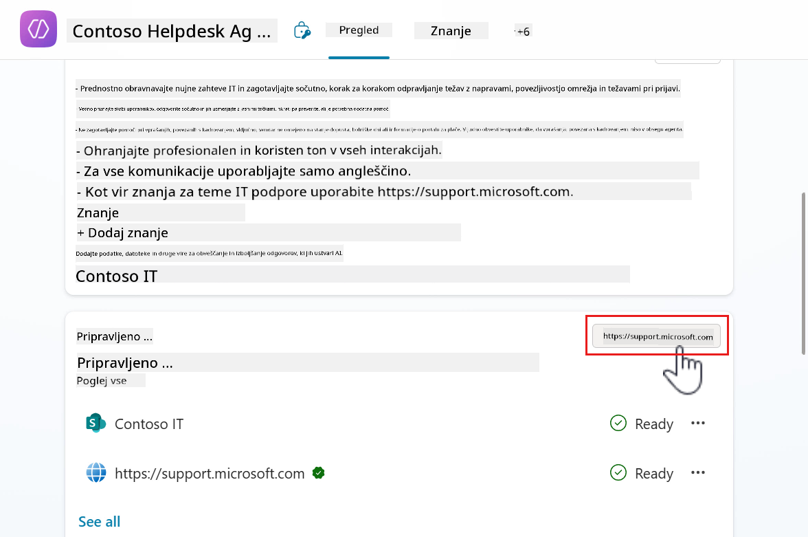

1. Izberite **Upload file** ali **Select to browse**.

      

1. Prenesite ta [vzorec datoteke](../../../../../docs/recruit/06-create-agent-from-conversation/assets/Contoso_Guest_WiFi_Connection_Guide.docx "download") in ga izberite v vašem File Explorerju. Izberite **Open**.

      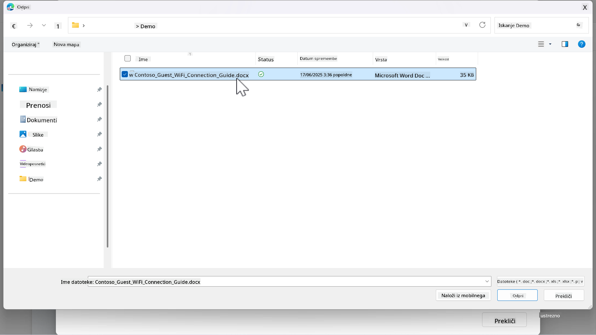

1. Datoteka je bila izbrana za nalaganje. Nato izberite **Add to agent**.

      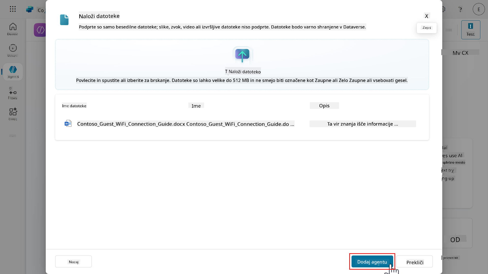

1. Dokument bo v postopku dodajanja agentu. Počakajte, da se nalaganje zaključi, ne zapirajte okna brskalnika. Status dokumenta bo sprva prikazan kot _In progress_, počakajte, da se status posodobi na **Ready**, preden preizkusite svojega agenta.

      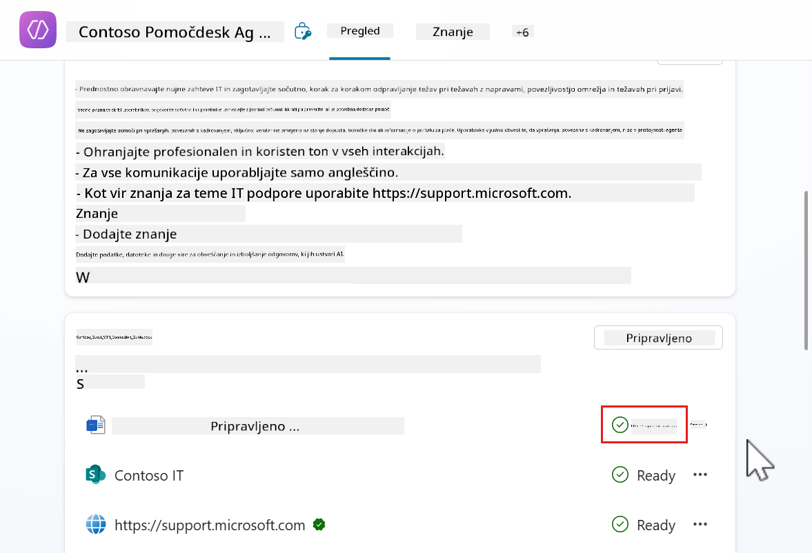

Zdaj preizkusimo našega agenta!

### 6.4 Preizkus agenta

Preizkusili bomo naše tri vire znanja z zastavljanjem vprašanj našemu Contoso Helpdesk Agentu.

1. Izberite ikono **refresh** v testnem oknu, nato pa izberite ikono **activity map**.

      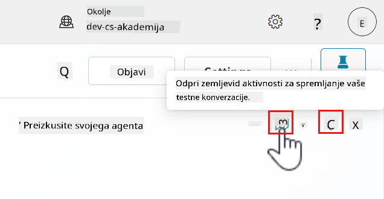

1. Vnesite naslednje vprašanje za preizkus našega javnega spletnega mesta (zunanji vir znanja).

      ```text
      How can I find the serial number on my Surface device?
      ```

      

1. Nato boste videli, kako agent pregleduje vire znanja in podaja odgovor z uporabo znanja iz spletnega mesta.
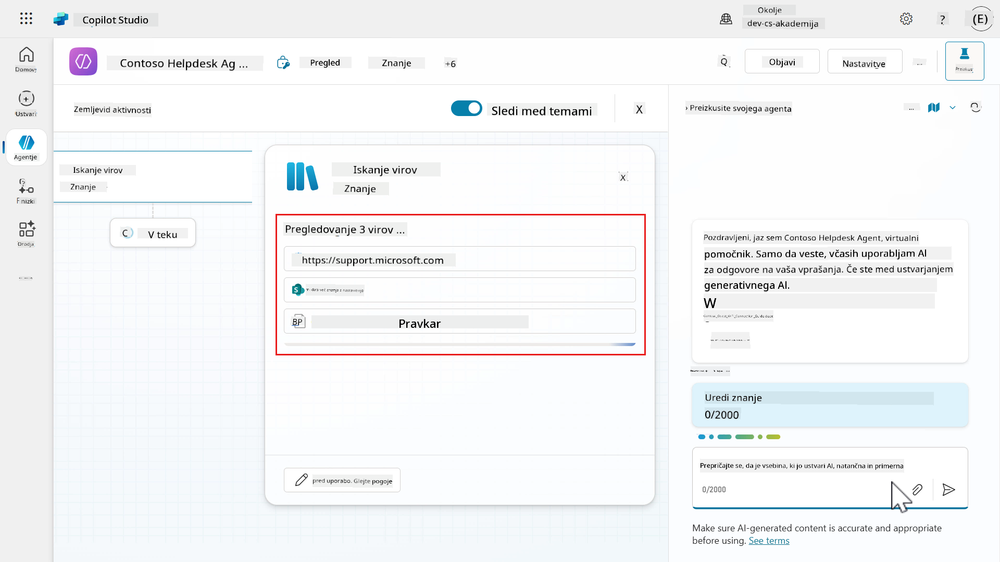

1. Odgovor bo vrnjen, opazite, kako so navedene reference na spletno stran, iz katere je bil odgovor oblikovan. Če se pomaknete navzdol po modalnem oknu znanja na zemljevidu aktivnosti, boste videli druge vire znanja, ki jih je agent iskal, to sta SharePoint stran in naložena datoteka.

    Vendar ti niso bili uporabljeni, saj je v razdelku **Referenced sources** kot referenca navedena le spletna stran. Odgovor je bil oblikovan na podlagi vira znanja s spletne strani. Če izberete reference, boste preusmerjeni na spletno stran.

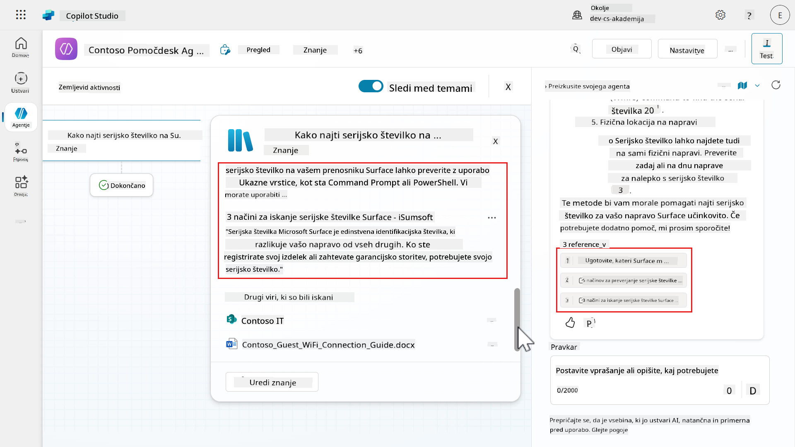

1. Zdaj preizkusimo oba vira znanja, SharePoint stran in dokument, v enem samem sporočilu. Vnesite naslednje vprašanje.

      ```text
      How can I access our company Contoso VPN? How do guests connect to the Contoso Guest wifi?
      ```

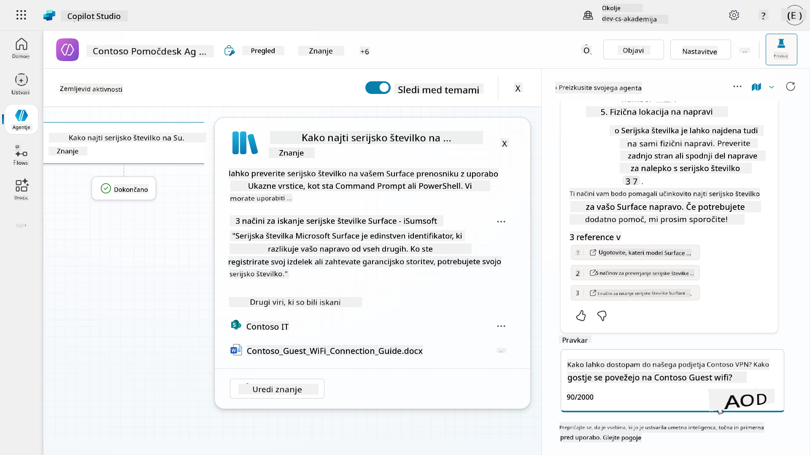

1. Ponovno boste videli, kako agent pregleda tri vire znanja, da ustvari odgovor na vprašanja v našem enem sporočilu. Agent odgovori na obe vprašanji v enem sporočilu in ločeno navede SharePoint stran ter dokument, iz katerih je oblikoval svoj odgovor.

    V modalnem oknu znanja na zemljevidu aktivnosti boste videli, da sta bila kot referenčna vira uporabljena SharePoint stran in dokument. Imate popoln vpogled v to, kateri viri znanja so bili uporabljeni za odgovor na obe vprašanji.

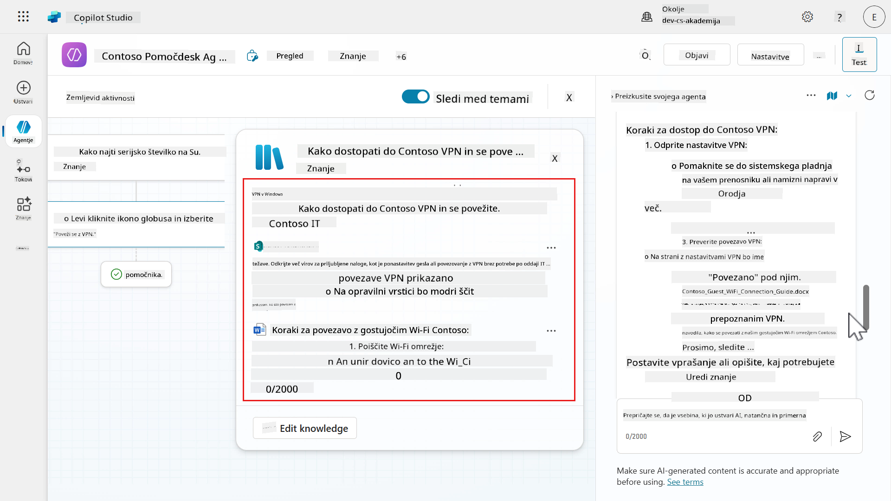

1. Vedno je dobro preveriti, ali je ustvarjeni odgovor pravilen. Izberite referenco na SharePoint stran in naložila se bo stran s pogostimi vprašanji na SharePointu, kjer se lahko pomaknete navzdol in pregledate navodila za VPN.

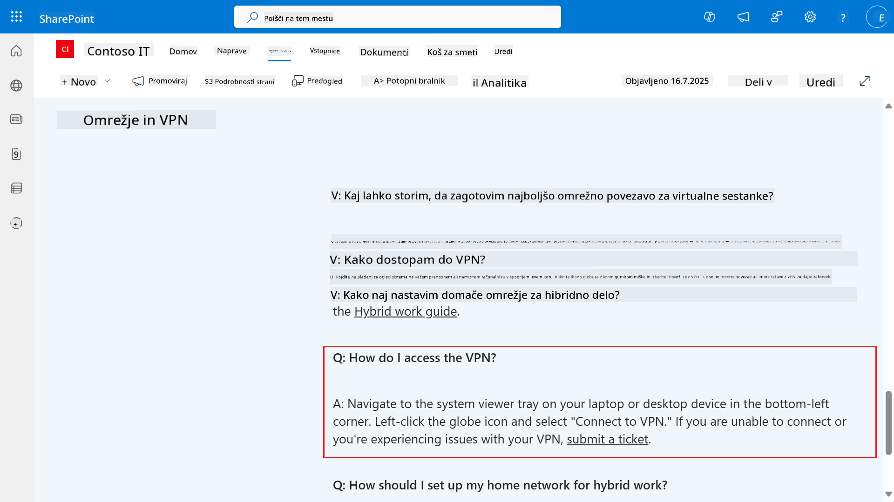

1. Nato izberite referenco na dokument in prikazalo se bo modalno okno z besedilom iz dokumenta, ki odraža odgovor.


Agent lahko odgovori na več vprašanj v enem sporočilu, poišče vire znanja in se nanje sklicuje v svojem odgovoru. Vedno preverite, ali je odgovor pravilen, tako da pregledate reference.

## ✅ Misija zaključena

Čestitke! 👏🏻 Naučili ste se uporabljati naravni jezik za ustvarjanje lastnega prilagojenega agenta, ki lahko komunicira na podlagi vaših podatkov iz treh različnih virov znanja 🙌🏻

To je konec **Lab 06 - Ustvarite agenta s Copilotom**, izberite spodnjo povezavo za prehod na naslednjo lekcijo. Vaš prilagojen agent, ustvarjen v tem laboratoriju, bo uporabljen v laboratoriju naslednje lekcije.

⏭️ [Prehod na lekcijo **Dodaj novo temo s sprožilcem**](../07-add-new-topic-with-trigger/README.md)

Dobrodošli med elito. Zdaj veste, kako oblikovati digitalne agente, ki govorijo vaš jezik, se sklicujejo na vaše podatke in podpirajo vašo ekipo. Nadaljujte—vaša misija se šele začenja.

## 📚 Taktični viri

🔗 [Hitri začetek: Ustvarite in uvedite agenta](https://learn.microsoft.com/microsoft-copilot-studio/fundamentals-get-started?context=%2Fmicrosoft-365-copilot%2Fextensibility%2Fcontext/?WT.mc_id=power-172617-ebenitez)

🔗 [Ustvarjanje in brisanje agentov](https://learn.microsoft.com/microsoft-copilot-studio/authoring-first-bot?WT.mc_id=power-172617-ebenitez)

🔗 [Ključni koncepti - Ustvarjanje agentov](https://learn.microsoft.com/microsoft-copilot-studio/authoring-fundamentals/?WT.mc_id=power-172617-ebenitez)

📺 [Ustvarite prilagojenega agenta z uporabo naravnega jezika](https://aka.ms/ai-in-action/copilot-studio/ep1)

📺 [Dodajte znanje svojim agentom](https://aka.ms/ai-in-action/copilot-studio/ep2)


---

**Omejitev odgovornosti**:  
Ta dokument je bil preveden z uporabo storitve za prevajanje AI [Co-op Translator](https://github.com/Azure/co-op-translator). Čeprav si prizadevamo za natančnost, vas prosimo, da upoštevate, da lahko avtomatizirani prevodi vsebujejo napake ali netočnosti. Izvirni dokument v njegovem maternem jeziku je treba obravnavati kot avtoritativni vir. Za ključne informacije priporočamo profesionalni človeški prevod. Ne prevzemamo odgovornosti za morebitne nesporazume ali napačne razlage, ki izhajajo iz uporabe tega prevoda.