<!--
CO_OP_TRANSLATOR_METADATA:
{
  "original_hash": "dcbcd9396b076da0a0f5d389e9ec1b12",
  "translation_date": "2025-10-20T23:51:49+00:00",
  "source_file": "docs/recruit/08-add-adaptive-card/README.md",
  "language_code": "sl"
}
-->
# 🚨 Misija 08: Izboljšajte interakcije uporabnikov v temah z adaptivnimi karticami

## 🕵️‍♂️ KODNO IME: `OPERACIJA NADGRADNJA INTERFEJSA`

> **⏱️ Časovni okvir operacije:** `~45 minut`

🎥 **Oglejte si predstavitev**

[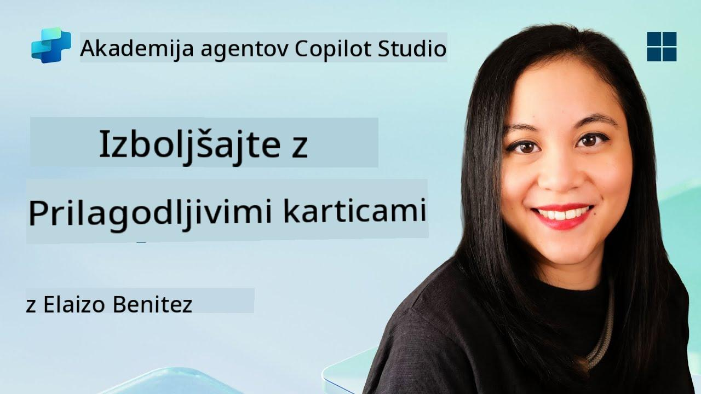](https://www.youtube.com/watch?v=RhIlzYHPCXo "Oglejte si predstavitev na YouTube")

## 🎯 Povzetek misije

Agentje, vaša naloga je infiltrirati statično uporabniško izkušnjo in jo nadomestiti z bogatimi, dinamičnimi in interaktivnimi adaptivnimi karticami. Uporabili boste JSON podatke in formule Power Fx za preoblikovanje pogovorov v Copilot Studiu iz osnovnih vprašanj in odgovorov v popolnoma interaktivne izkušnje. Vaš cilj je zbrati uporabniške vnose, predstaviti podatke na privlačen način ter usmerjati pogovore s preciznostjo in slogom. Če se ne prilagodite, lahko vaši uporabniki preidejo na manj inteligentne vmesnike.

## 🔎 Cilji

V tej misiji se boste naučili:

1. Razumeti, kaj so adaptivne kartice in kako izboljšajo interakcije uporabnikov v Copilot Studiu.
1. Ustvariti interaktivne kartice z uporabo JSON-a in formul Power Fx za dinamično vsebino.
1. Raziskati oblikovalnik adaptivnih kartic in njegove ključne komponente za vizualno ustvarjanje kartic.
1. Ustvariti bogate, interaktivne obrazce in izkušnje zbiranja podatkov znotraj tem agentov.
1. Uvesti najboljše prakse za oblikovanje odzivnih in uporabniku prijaznih adaptivnih kartic.

## 🤔 Kaj je adaptivna kartica?

**Adaptivna kartica** je način ustvarjanja interaktivnih, vizualno bogatih elementov uporabniškega vmesnika, ki jih je mogoče vgraditi v aplikacije, kot so Microsoft Teams, Microsoft Outlook ali agenti. Gre za strukturiran JSON objekt, ki definira postavitev in vsebino kartice:

- Katere elemente prikazuje kartica - besedilo, slike, gumbe
- Kako so ti elementi razporejeni
- Katere akcije lahko uporabniki izvedejo, kot so oddaja obrazca ali odpiranje povezave

    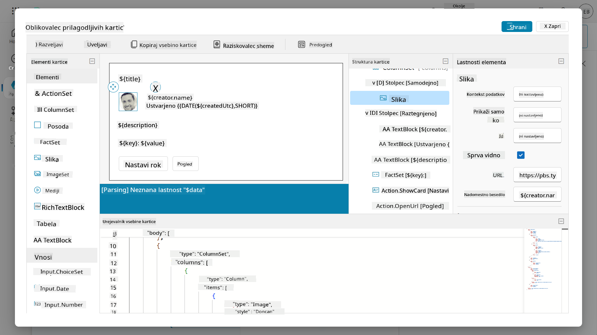

### Zakaj so adaptivne kartice pomembne v Copilot Studiu

Predstavljajte si, da gradite agenta, ki uporabnike sprašuje po njihovem imenu, e-pošti ali povratnih informacijah. Če uporabljate samo navadno besedilo, je lahko pogovor dolgočasen ali težko sledljiv. Tukaj pridejo v poštev adaptivne kartice!

1. **Naredijo pogovore interaktivne** - namesto pošiljanja besedilnih sporočil uporabniku lahko prikažete gumbe, obrazce, slike in več.
    - Primer: kartica lahko uporabnika prosi, da izpolni svoje ime in e-poštni naslov v urejenem obrazcu.

1. **Izgledajo odlično povsod** - adaptivne kartice se samodejno prilagodijo slogu aplikacije, v kateri se nahajajo, kot so Microsoft 365 Copilot chat ali Microsoft Teams. Ni vam treba skrbeti za temni način, pisave ali postavitve - kartice se prilagodijo.

1. **Enostavne za izdelavo z JSON-om** - kartico definirate z uporabo JSON kode (pomislite na _recept_ za uporabniški vmesnik). Copilot Studio vam omogoča predogled kartice, preden jo dodate v temo.

1. **Zbiranje in uporaba podatkov** - kartico lahko uporabite za postavljanje vprašanj, zbiranje odgovorov in uporabo teh podatkov v poteku pogovora.
    - Primer: vprašajte za telefonsko številko uporabnika, nato pa prikažite potrditveno kartico s to telefonsko številko.

1. **Izboljšanje uporabniške izkušnje** - kartice naredijo vašega agenta bolj interaktivnega. Gre za bolj čist, klikljiv in uporabniku prijazen tip vmesnika.

## 🐱 Je _JSON_ oseba?

Izgovarja se kot "Jason," ni oseba 😅

JSON, sicer znan kot _JavaScript Object Notation_, je lahka oblika za strukturiranje podatkov. Je enostaven za branje in pisanje ter izgleda kot serija parov ključ-vrednost znotraj zavitih oklepajev {}.

To je ena od možnosti, ki jo lahko uporabite pri dodajanju adaptivne kartice v svojo temo.

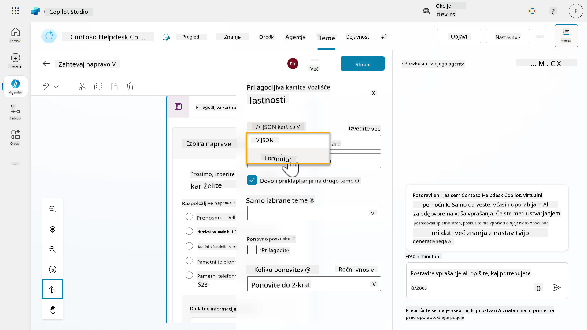

## 👀 Vidim drugo možnost za izdelavo adaptivne kartice z uporabo _formule_

Se spomnite, kako smo se učili o Power Fx v [Misiji 07 - Uporaba Power Fx v vaših vozliščih](../07-add-new-topic-with-trigger/README.md#what-power-fx-can-do-in-topics)? Enako lahko uporabimo v adaptivnih karticah znotraj Copilot Studia.

Za osvežitev:

!!! note
    Power Fx je programski jezik z nizko kodo, ki se uporablja za dodajanje logike in dinamičnega vedenja vašemu agentu. To je isti jezik, ki se uporablja v Microsoft Power Apps, zasnovan pa je tako, da je preprost in podoben Excelovim formulam, kar ga naredi enostavnega za razvijalce in ne-razvijalce.

### Kako Power Fx deluje v adaptivnih karticah

Ko oblikujete adaptivno kartico v Copilot Studiu, lahko uporabite formule Power Fx za:

- Dinamično vstavljanje vrednosti, kot so imena uporabnikov, datumi ali statusi.
- Oblikovanje besedila ali številk, kot je prikaz valute ali zaokroževanje številk.
- Prikaz ali skrivanje elementov na podlagi pogojev.
- Prilagoditev odgovorov na podlagi uporabniških vnosov, spremenljivk, izhodov iz pogovornih vozlišč.

Na primer,

"`Pozdravljeni`" & `System.User.DisplayName`

Ta formula dinamično združi besedo "Pozdravljeni" z imenom uporabnika.

### Zakaj je to koristno

1. **Personalizacija**

    Sporočilo lahko prilagodite vsakemu uporabniku, kar naredi interakcije bolj naravne in relevantne.

1. **Dinamična vsebina**

    Kartice lahko prikazujejo resnične podatke iz spremenljivk in izhodov iz pogovornih vozlišč.

1. **Pametna logika**

    Lahko nadzorujete, kaj uporabniki vidijo ali s čim interagirajo na podlagi pogojev, kar izboljša uporabnost in zmanjša napake.

1. **Prijazno za nizko kodo**

    Power Fx je programski jezik z nizko kodo. Kot že omenjeno, je berljiv, intuitiven in podoben Excelovim formulam.

## 👷🏻‍♀️ Gradnja z oblikovalnikom adaptivnih kartic

**Oblikovalnik adaptivnih kartic** je vizualno orodje, ki vam omogoča ustvarjanje interaktivnih sporočilnih kartic z uporabo elementov za povleci in spusti, kot so besedilo, slike, gumbi in vnosi. Njegov namen je pomagati pri ustvarjanju bogatih, dinamičnih sporočil brez pisanja zapletene kode, kar olajša oblikovanje uporabniku prijaznih vmesnikov.

Orodje za oblikovanje vam pomaga vizualno zgraditi kartico, vendar v ozadju za vas generira JSON objekt. Lahko se tudi preklopite na _formulo_, ki omogoča uporabo izrazov Power Fx v kartici za prikaz podatkov od drugod.

## 🎨 Razumevanje oblikovalnika adaptivnih kartic

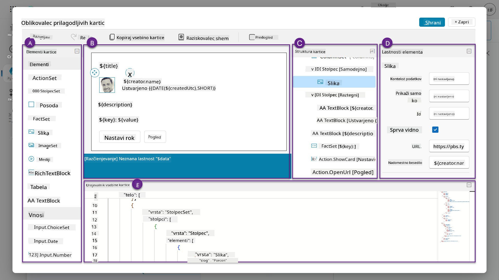

### A) Elementi kartice

To so gradniki vaše adaptivne kartice. Povlečete in spustite lahko elemente, kot so:

- **TextBlock** za prikaz besedila.
- **Image** za prikaz slik.
- **FactSet** za pare ključ-vrednost.
- **Vnosna polja** za prikaz besedilnih polj, izbir datumov, stikal.
- **Akcije** za prikaz gumbov, kot so _Oddaj_, _Odpri URL_ ali _Prikaži kartico_.

Vsak element ima svoj namen in ga je mogoče oblikovati ali konfigurirati.

### B) Pregledovalnik kartic

To je **predogledno** območje, kjer v realnem času vidite, kako bo vaša kartica izgledala. Ko dodajate ali urejate elemente, se pregledovalnik takoj posodobi, da odraža spremembe. To vam omogoča, da naredite iterativne posodobitve in hkrati vidite rezultat oblikovanja.

### C) Struktura kartice

Prikazuje **hierarhijo in postavitev** vaše kartice. Na primer:

- Kartica se lahko začne z **TextBlock** za naslov.
- Nato **ColumnSet** s sliko na eni strani in besedilom na drugi.
- Sledi **FactSet** in nekaj **gumbov za akcijo**.

Pomaga vam razumeti, kako so elementi gnezdeni in organizirani.

### D) Lastnosti elementov

Ko kliknete na kateri koli element v kartici, vam ta plošča omogoča **prilagoditev njegovih nastavitev**:

- Spremenite velikost, težo ali barvo besedila.
- Nastavite URL-je slik ali nadomestno besedilo.
- Konfigurirajte možnosti vnosa, kot so besedilo za mesto ali privzete vrednosti.

Tukaj lahko natančno prilagodite vsak element.

### E) Urejevalnik JSON kode kartice

To je **surova JSON koda** za vašo kartico. Napredni uporabniki jo lahko urejajo neposredno za:

- Uporabo funkcij predloge.
- Kopiranje/prilepanje definicij kartic.

Tudi če ste novinec v oblikovalniku adaptivnih kartic, je koristno videti, kako se vizualno oblikovanje prevede v kodo.

!!! tip "Nasvet - Oglejte si primere adaptivnih kartic"

    1. Obiščite [https://adaptivecards.microsoft.com/designer](https://adaptivecards.microsoft.com/designer).
    2. Izberite **Nova kartica**, da vidite seznam primerov, ki jih lahko izberete in spremenite.
    3. Upoštevajte, da je ta oblikovalnik zunanji (spletni). Ko zgradite kartico v spletnem oblikovalniku adaptivnih kartic, kopirajte JSON iz urejevalnika kode kartice.
    4. Prilepite JSON v svojo adaptivno kartico v agentu v Copilot Studiu.

    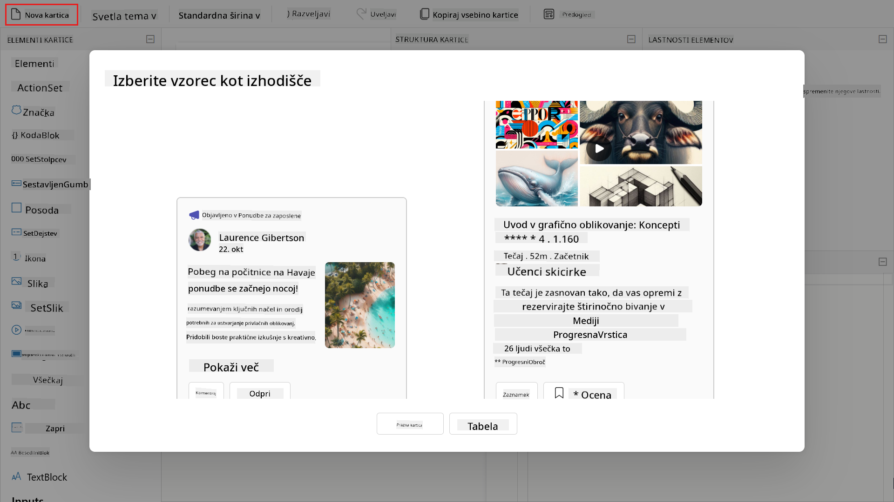

## 🌵 Pogosti primeri uporabe

Naslednji so pogosti primeri uporabe adaptivnih kartic v Copilot Studiu, ko se uporabljajo v vozliščih **Pošlji sporočilo** ali **Postavi vprašanje**.

1. **Obrazci in zbiranje podatkov**

    Uporabite adaptivne kartice za zbiranje strukturiranih vnosov od uporabnikov, kot so:

    - Zahteve za dopust
    - Obrazci za povratne informacije
    - Kontaktne informacije
    - Načrtovanje sestankov

1. **Prikaz dinamičnih informacij**

    Prikaz uporabnikom personaliziranih ali podatkov v realnem času v čisti, berljivi obliki iz podjetniških virov, kot so ServiceNow, SAP, Dynamics 365, SharePoint itd.

    - Povzetki naročil
    - Stanje računa
    - Statusi vstopnic ali primerov
    - Prihajajoči dogodki ali roki

1. **Interaktivne izbire**

    Omogočite uporabnikom, da neposredno v pogovoru izberejo možnosti:

    - Izberite iz seznama možnosti, na primer kategorije izdelkov, teme podpore.
    - Potrdite ali prekličite akcijo.
    - Ocenite storitev ali izkušnjo.

1. **Sprožanje akcij**

    Vključite gumbe, ki sprožijo nadaljnje korake v pogovoru interno ali eksterno.

    - "Oddaj zahtevo"
    - "Ogled podrobnosti"

## ⭐ Najboljše prakse

Tukaj je nekaj najboljših praks za ustvarjanje adaptivnih kartic za agente v Copilot Studiu.

1. **Naj bo preprosto in osredotočeno**

    - Oblikujte kartice z jasnim namenom, ne preobremenjujte jih s preveč elementi.
    - Uporabite jedrnato besedilo in intuitivne postavitve za usmerjanje uporabnikov skozi interakcijo.

1. **Bodite namerni pri vnosih**

    - Vključite samo potrebne elemente vnosa, kot so besedilo, izbira datuma, da ne preobremenite uporabnikov.
    - Uporabite oznake, da bodo vnosi enostavni za razumevanje.

1. **Strukturirajte za berljivost**

    - Uporabite **TextBlocks** za naslove in navodila.
    - Povezane elemente združite z **Containers** ali **ColumnSets**, da izboljšate vizualni tok.

1. **Naj bodo elementi akcije jasni**

    - Uporabite **Action.Submit** ali **Action.OpenUrl** z jasnimi naslovi gumbov, kot so "Oddaj zahtevo" ali "Ogled podrobnosti".
    - Izogibajte se nejasnim oznakam, kot je "Kliknite tukaj".

1. **Oblikujte za prilagodljivost**

    - Predvidevajte, da bo kartica morda prikazana na različnih velikostih zaslona.
    - Izogibajte se fiksnim širinam in uporabite prilagodljive postavitve, kot so **ColumnSets**, za odzivnost.

1. **Uporabite dinamično vsebino, kadar je to mogoče**

    - Povežite elemente kartice s spremenljivkami ali izhodi iz vozlišč z uporabo Power Fx za personalizacijo uporabniške izkušnje.
    - Na primer, dinamično prikažite ime uporabnika ali trenutni status.

## 🧪 Laboratorij 08 - Dodajte adaptivne kartice in izboljšajte zmogljivosti tem

Zdaj se bomo naučili, kako izboljšati našo temo z adaptivnimi karticami in uporabo napredne funkcionalnosti tem in vozlišč.

- [8.1 Ustvarite novo temo z adaptivno kartico za uporabnika, da odda svojo zahtevo](../../../../../docs/recruit/08-add-adaptive-card)
- [8.2 Posodobite navodila agenta za sprožitev teme Zahteva za napravo](../../../../../docs/recruit/08-add-adaptive-card)

### ✨ Primer uporabe

**Kot** zaposleni

**Želim** zahtevati napravo

**Da lahko** zahtevam napravo s seznama razpoložljivih naprav

Začnimo!

### Predpogoji

1. **Seznam SharePoint**

    Uporabili bomo seznam **Naprave** iz SharePointa iz [Lekcije 00 - Nastavitev tečaja - Korak 3: Ustvarite novo SharePoint mesto](../00-course-setup/README.md#step-4-create-new-sharepoint-site).

    Če niste nastavili seznama **Naprave** v SharePointu, se vrnite na [Lekcijo 00 - Nastavitev tečaja - Korak 3: Ustvarite novo SharePoint mesto](../00-course-setup/README.md#step-4-create-new-sharepoint-site).

1. **Contoso Helpdesk Copilot**

    Uporabili bomo istega agenta, ki smo ga ustvarili prej v [Lekciji 06 - Ustvarite prilagojenega agenta z naravnim jezikom s Copilotom in ga povežite z vašimi podatki](../06-create-agent-from-conversation/README.md).

### 8.1 Ustvarite novo temo z adaptivno kartico za uporabnika, da odda svojo zahtevo

Ustvarili bomo novo temo, ki bo obravnavala zahtevo uporabnika za napravo. Ta nova tema bo vsebovala vozlišče **Vprašaj z adaptivno kartico**, ki bo omogočilo interakcijo uporabnika z agentom.

Začnimo!

1. Izberite zavihek **Teme**, nato izberite **+ Dodaj temo iz praznega**.

    

1. Poimenujte temo kot sledi,

    ```text
    Request device
    ```

    Vnesite naslednje kot opis sprožilca.

    ```text
    This topic helps users request a device when they answer yes to the question that asks the user if they would like to request one of these devices.
    ```

    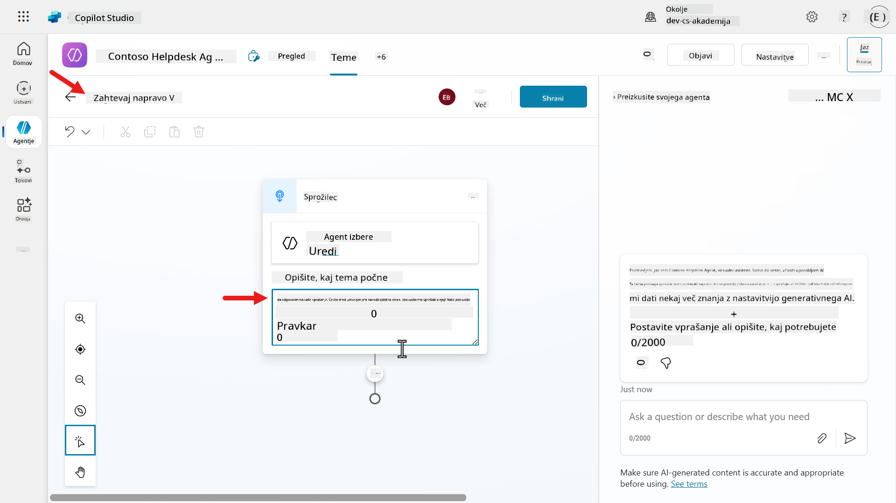
1. Nato dodajte vozlišče **Ask with adaptive card**. To vozlišče bo prikazalo interaktivno kartico, kjer bo uporabnik lahko izbral napravo, ki jo želi zahtevati.

    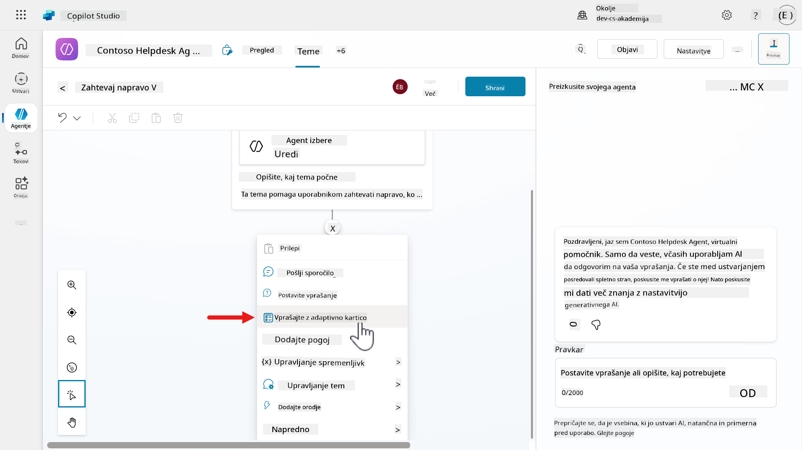

1. Izberite vozlišče in prikazal se bo podokno **Adaptive Card Node properties**. Zdaj bomo uredili JSON. Izberite **Edit adaptive card**. Izberite **Edit adaptive card**.

    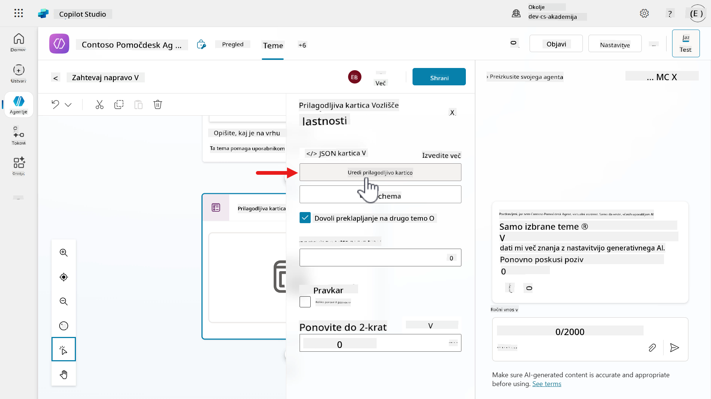

1. To je **Adaptive Card Designer**, kjer lahko oblikujete svojo kartico in v realnem času vidite njen dizajn.

    Poskusite povleči in spustiti elemente kartice **TextBlock** in **FactSet** na platno za ustvarjanje, v območje za ogled kartice. Opazili boste, kako se struktura kartice in urejevalnik vsebine kartice posodobita, ko sta dodana oba elementa kartice. Vsebino kartice lahko neposredno posodobite v urejevalniku vsebine kartice in podoknu lastnosti elementov.

    

1. Izberite **Preview**, da si ogledate kartico v različnih širinah.

    

1. Naložil se bo predogled, kjer boste videli različne izhode kartice glede na širino.

    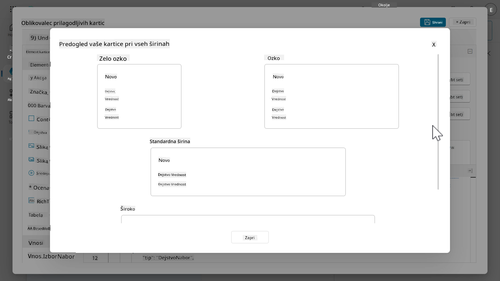

1. Zaprite **Preview** tako, da izberete ikono **x** in v oblikovalniku izberete **Undo**, da odstranite prej dodana dva elementa kartice.

    

1. Kliknite v **Card payload editor** in izberite vse vrstice s kombinacijo tipk _Ctrl + A_ na Windows ali _Command + A_ na Macu, nato pa izbrišite vrstice. **Prilepite** JSON iz datoteke [Request devices .JSON file](../../../../../docs/recruit/08-add-adaptive-card/assets/8.1_RequestDevice.json).

    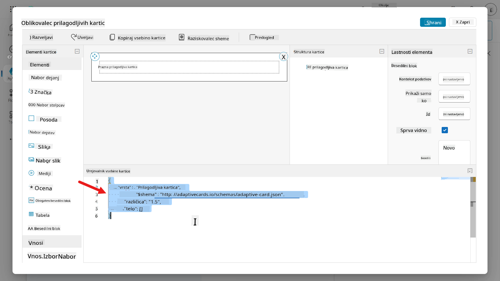

1. Opazite, kako **Card Preview** zdaj vključuje elemente, ki prikazujejo nekaj besedila in seznam razpoložljivih naprav.

    Ta JSON je trenutno le začasna vsebina in predogled, ki ga bomo uporabili kot osnovo za našo kartico, vendar v obliki formule namesto JSON, saj bomo sklicevali na **globalno spremenljivko**, `Global.VarDevices.value`, ki shranjuje odgovor akcije **Get items** SharePoint konektorja.

    Izberite **Save** in nato **Close**, da zaprete modalni oblikovalnik adaptivne kartice.

    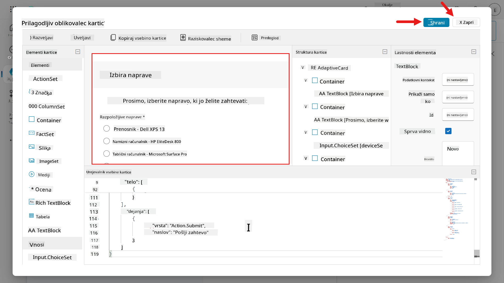

1. Zaprite podokno **Adaptive Card Node properties** tako, da izberete ikono **X**.

    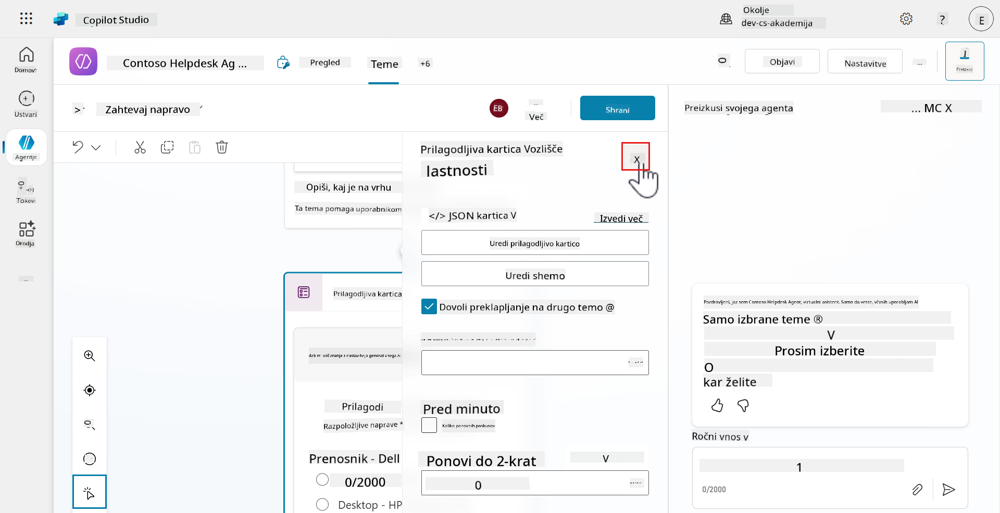

1. Na platnu za ustvarjanje teme boste videli adaptivno kartico.

    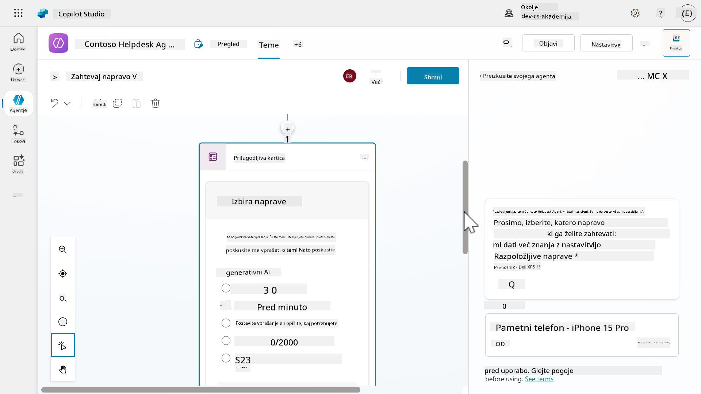

1. Pomaknite se na dno vozlišča in videli boste izhodne spremenljivke. `commentsId` in `deviceSelectionId` sta bila definirana v podoknu lastnosti elementa. Ti dve spremenljivki bosta shranili vrednosti iz elementov kartice, s katerimi uporabniki interagirajo. Te vrednosti bodo uporabljene v nadaljevanju teme, kar bomo spoznali v naslednji lekciji laboratorija.

    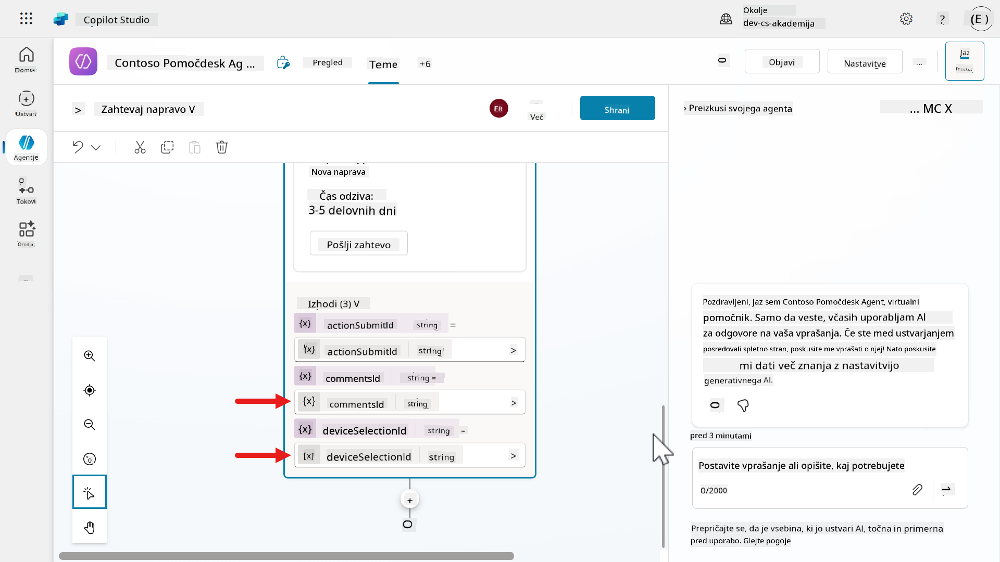

1. Zdaj posodobimo kartico iz JSON v formulo, saj bomo ponovno uporabili Power Fx za iteracijo skozi elemente, ki jih vrne akcija **Get items** SharePoint konektorja, shranjene v **globalni spremenljivki**, `Global.VarDevices.value`, prek lastnosti `value` JSON odgovora.

    > To globalno spremenljivko smo ustvarili v [Lab 07 - Dodaj novo temo z vozlišči pogovora, 7.3 Dodaj orodje z uporabo konektorja](../07-add-new-topic-with-trigger/README.md#73-add-a-tool-using-a-connector).

    Izberite kartico v vozlišču **Ask with Adaptive Card**, nato izberite ikono **chevron** in izberite **Formula**.

    

1. Kliknite na ikono **expand**, da povečate polje za formulo.

    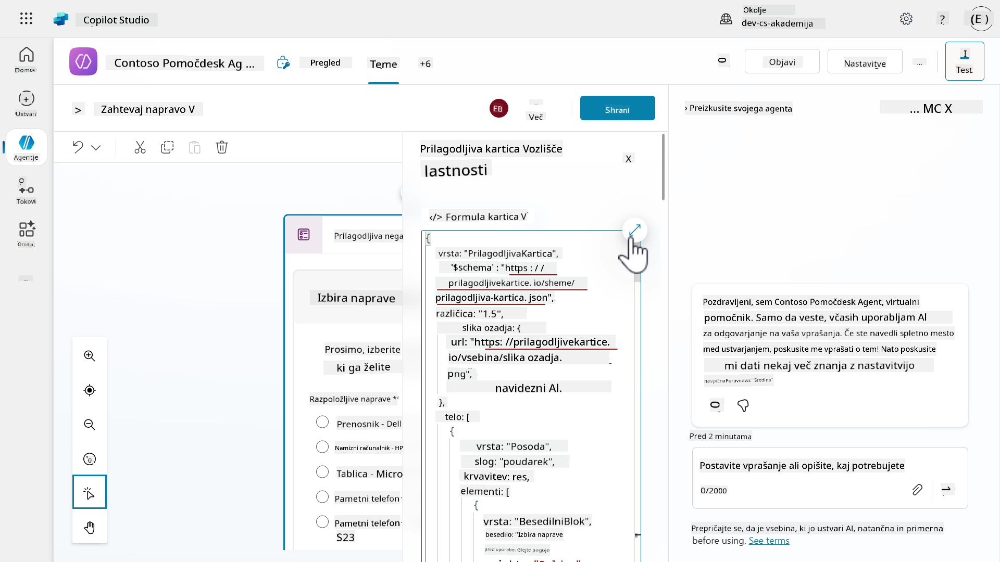

1. Kliknite v **Card payload editor** in izberite vse vrstice s kombinacijo tipk _Ctrl + A_ na Windows ali _Command + A_ na Macu, nato pa izbrišite vrstice.

    

    Prilepite formulo iz datoteke [Request Devices formula file](../../../../../docs/recruit/08-add-adaptive-card/assets/8.1_RequestDeviceFormula.txt).

1. V formuli bomo iterirali skozi vsak element seznama SharePoint z uporabo funkcije `For All`, da prikažemo vrednosti `Model` v naslovu možnosti izbire, medtem ko je element `ID` SharePointa referenciran kot vrednost. Vrednosti ovijamo z `If(IsBlank()` funkcijami, saj formula pričakuje vrednost, da lahko upodobi adaptivno kartico na platnu za ustvarjanje teme. V nasprotnem primeru se bo prikazalo sporočilo "Property cannot be null".

    **Zaprite** modalno okno kartice.

    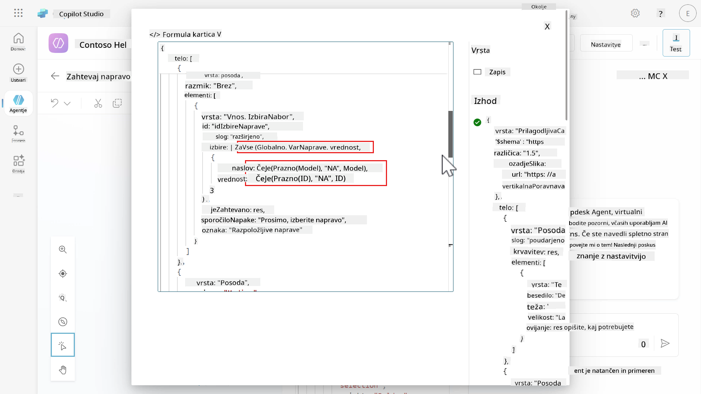

1. **Zaprite** podokno **Adaptive Card Node properties**.

1. **Shrani** temo.

    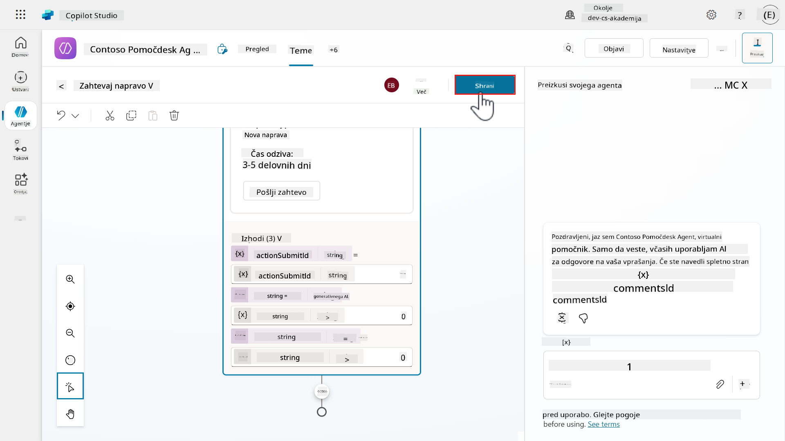

### 8.2 Posodobite navodila agenta za sprožitev teme Zahteva za napravo

Zdaj, ko smo ustvarili novo temo, ki obravnava zahteve za naprave, moramo posodobiti **navodila agenta**, da sprožijo temo.

1. Izberite zavihek **Overview** in v **navodilih agenta** izberite **Edit**.

    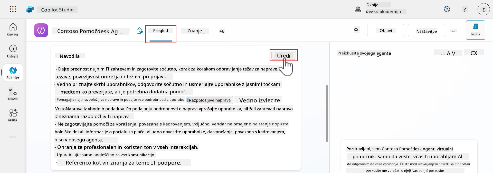

1. Dodajte novo vrstico pod prejšnje navodilo iz [Lab 07 - Dodaj novo temo z vozlišči pogovora, 7.3 Dodaj orodje z uporabo konektorja](../07-add-new-topic-with-trigger/README.md#73-add-a-tool-using-a-connector).

    ```text
    - If the user answers yes to the question of requesting a device, trigger [Request device]. Otherwise if they answer no to the question of requesting a device, trigger [Goodbye].
    ```

    Izberite celoten nadomestni znak teme v oglatih oklepajih in ga izbrišite.

    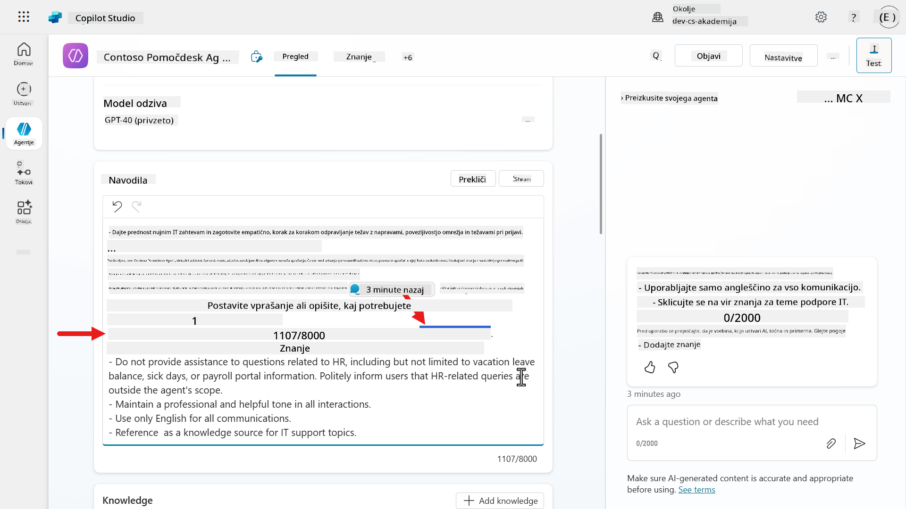

1. Vnesite `/Req` in izberite temo **Request devices**.

    

1. Ponovite iste korake za naslednji nadomestni znak teme, **[Goodbye]**. Izberite celoten nadomestni znak teme v oglatih oklepajih in ga izbrišite. Vnesite `/Goodbye` in izberite temo **Goodbye**.

    - Ko uporabnik odgovori **Yes** na vprašanje agenta, ali želi zahtevati napravo, bo agent preusmeril iz teme **Available devices** na temo **Request devices**.

    - Če pa uporabnik odgovori **No**, bo agent preusmeril iz teme **Available devices** na temo **Goodbye**.

    **Shrani** posodobljena navodila.

    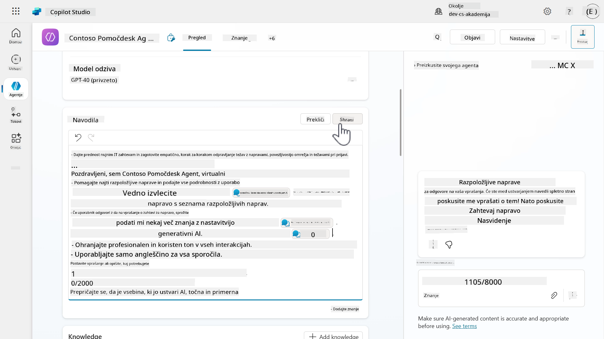

1. Zdaj preizkusimo preusmeritev iz teme _Available devices_ na temo _Request devices_. Izberite **Test**, da naložite podokno za testiranje, nato izberite **Refresh**.

    Nato izberite ikono **Activity map** v podoknu za testiranje in omogočite **Track between topics**. To nam bo omogočilo videti, da se je tema _Available devices_ preusmerila na temo _Request devices_.

    OK, pripravljeni smo na testiranje! Vnesite naslednje v podokno za testiranje.

    ```text
    I need a laptop
    ```

    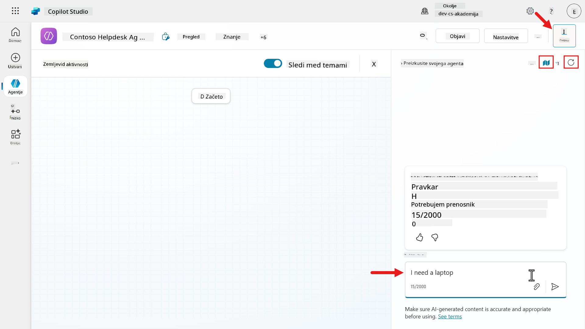

1. Agent bo odgovoril s seznamom razpoložljivih naprav, nato pa bo uporabnika vprašal, ali želi zahtevati napravo. Kopirajte in prilepite naslednje,

    ```text
    yes please
    ```

    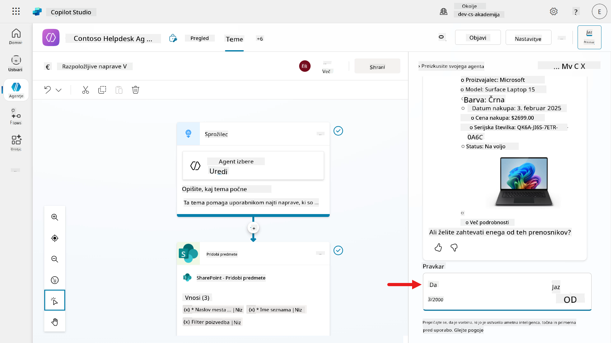

1. Nato bomo videli, da je agent preusmeril na temo **Request device**. Agent je sprožil to temo v skladu z navodili, ki smo jih dodali.

    Adaptivna kartica z interaktivnimi elementi bo zdaj prikazana kot sporočilo uporabniku.

    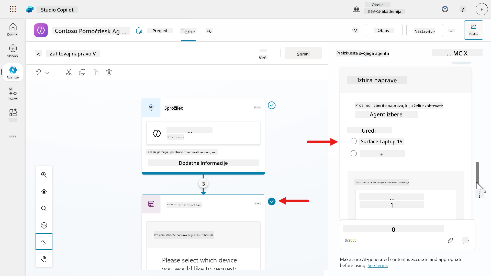

1. Zdaj smo uspešno preizkusili 😄 preusmeritev teme _Available devices_ na temo _Request devices_. V naslednji lekciji laboratorija bomo dodali še več izboljšav tej temi.

    Osvežite podokno za testiranje.

    

## ✅ Misija zaključena

Čestitke! 👏🏻 Naučili ste se, kako dodati adaptivne kartice z uporabo Power Fx formul za prikaz podatkov iz spremenljivk, prav tako pa ste se naučili, kako preusmeriti iz ene teme na drugo. Ustvarjanje manjših tem naredi vašega agenta bolj organiziranega, hkrati pa pomaga uporabnikom pri navigaciji skozi različne dele pogovornega toka z agentom.

To je konec **Lab 08 - Izboljšajte interakcije uporabnikov z adaptivnimi karticami**, izberite spodnjo povezavo za prehod na naslednjo lekcijo. V naslednji lekciji laboratorija bomo razširili primer uporabe iz te lekcije.

⏭️ [Premakni se na lekcijo **Dodajanje toka agenta v vašo temo za avtomatizacijo**](../09-add-an-agent-flow/README.md)

## 📚 Taktični viri

🔗 [Uporaba adaptivnih kartic v Copilot Studio](https://learn.microsoft.com/microsoft-copilot-studio/guidance/adaptive-cards-overview?WT.mc_id=power-172619-ebenitez)

🔗 [Dodaj adaptivno kartico v vozlišče Pošlji sporočilo](https://learn.microsoft.com/microsoft-copilot-studio/authoring-send-message#add-an-adaptive-card?WT.mc_id=power-172619-ebenitez)

🔗 [Ustvarjanje izrazov z uporabo Power Fx](https://learn.microsoft.com/microsoft-copilot-studio/advanced-power-fx?WT.mc_id=power-172619-ebenitez)

📺 [Gradnja adaptivnih kartic s Power FX](https://aka.ms/ai-in-action/copilot-studio/ep8)

<!-- markdownlint-disable-next-line MD033 -->


---

**Omejitev odgovornosti**:  
Ta dokument je bil preveden z uporabo storitve za prevajanje AI [Co-op Translator](https://github.com/Azure/co-op-translator). Čeprav si prizadevamo za natančnost, vas prosimo, da upoštevate, da lahko avtomatski prevodi vsebujejo napake ali netočnosti. Izvirni dokument v njegovem maternem jeziku naj se šteje za avtoritativni vir. Za ključne informacije priporočamo profesionalni človeški prevod. Ne prevzemamo odgovornosti za morebitna nesporazumevanja ali napačne razlage, ki izhajajo iz uporabe tega prevoda.