<!--
CO_OP_TRANSLATOR_METADATA:
{
  "original_hash": "4fb913dfc3bbc71506dd3602c4b8e6ed",
  "translation_date": "2025-10-20T01:02:10+00:00",
  "source_file": "docs/operative-preview/02-multi-agent/README.md",
  "language_code": "sw"
}
-->
# 🚨 Kazi 02: Mawakala Waliounganishwa

--8<-- "disclaimer.md"

## 🕵️‍♂️ JINA LA KODI: `OPERESHENI SYMPHONY`

> **⏱️ Muda wa Operesheni:** `~dakika 45`

## 🎯 Muhtasari wa Kazi

Karibu tena, Wakala. Katika Kazi 01, uliunda Wakala wako Mkuu wa Kuajiri - msingi thabiti wa kusimamia mchakato wa kuajiri. Lakini wakala mmoja hawezi kufanya kila kitu.

Kazi yako, ikiwa utaamua kuikubali, ni **Operesheni Symphony** - kubadilisha wakala wako mmoja kuwa mfumo wa **mawakala wengi**: timu iliyopangwa ya mawakala maalum wanaofanya kazi pamoja kushughulikia changamoto ngumu za kuajiri. Fikiria kama kuboresha kutoka kwa opereta mmoja hadi kuongoza kikosi maalum cha kazi.

Kama orchestra ya symphony ambapo kila mpiga ala anacheza sehemu yake kwa usawa kamili, utaongeza wataalamu wawili muhimu kwa Wakala wako wa Kuajiri uliopo: Wakala wa Kupokea Maombi kwa ajili ya kuchakata wasifu kiotomatiki, na Wakala wa Maandalizi ya Mahojiano kwa ajili ya kuunda nyenzo za kina za mahojiano. Mawakala hawa watafanya kazi pamoja bila matatizo chini ya mpangaji wako mkuu.

## 🔎 Malengo

Katika kazi hii, utajifunza:

1. Wakati wa kutumia **mawakala wa watoto** dhidi ya **mawakala waliounganishwa**
1. Jinsi ya kubuni **miundo ya mawakala wengi** inayoweza kupanuka  
1. Kuunda **mawakala wa watoto** kwa kazi maalum
1. Kuanzisha **mifumo ya mawasiliano** kati ya mawakala
1. Kujenga Wakala wa Kupokea Maombi na Wakala wa Maandalizi ya Mahojiano

## 🧠 Mawakala waliounganishwa ni nini?

Katika Copilot Studio, haujazuiliwa kujenga mawakala mmoja tu. Unaweza kuunda **mifumo ya mawakala wengi** - mitandao ya mawakala maalum wanaofanya kazi pamoja kushughulikia mchakato mgumu.

Fikiria kama shirika la ulimwengu halisi: badala ya mtu mmoja kufanya kila kitu, una wataalamu wanaoelekea kwenye kazi maalum na kushirikiana inapohitajika.

### Kwa nini mifumo ya mawakala wengi ni muhimu

- **Uwezo wa kupanuka:** Kila wakala anaweza kuendelezwa, kupimwa, na kudumishwa kwa uhuru na timu tofauti.  
- **Utaalamu:** Mawakala wanaweza kuzingatia kile wanachofanya vizuri. Labda mmoja kwa uchakataji wa data, mwingine kwa mwingiliano wa mtumiaji, mwingine kwa kufanya maamuzi.  
- **Kubadilika:** Unaweza kuchanganya na kulinganisha mawakala, kuwatumia tena katika miradi tofauti, na kuboresha mfumo wako hatua kwa hatua.  
- **Uwezo wa kudumisha:** Mabadiliko kwa wakala mmoja hayataathiri wengine, na kufanya masasisho kuwa salama na rahisi.

### Mfano wa ulimwengu halisi: Mchakato wa kuajiri

Fikiria mchakato wetu wa kuajiri - mawakala wengi wanaweza kufanya kazi pamoja na majukumu yafuatayo:

- **Kupokea wasifu** kunahitaji ujuzi wa kuchakata nyaraka na uchimbaji wa data
- **Kufanya tathmini** kunahusisha kutathmini wasifu wa wagombea na kuwalinganisha na mahitaji ya kazi
- **Maandalizi ya mahojiano** yanahitaji uelewa wa kina kuhusu kufaa kwa mgombea  
- **Mawasiliano na wagombea** yanahitaji uwezo wa mawasiliano yenye huruma

Badala ya kujenga wakala mmoja mkubwa anayejitahidi kushughulikia ujuzi tofauti, unaweza kuunda mawakala maalum kwa kila eneo na kuwapanga pamoja.

## 🔗 Mawakala wa watoto dhidi ya mawakala waliounganishwa: Tofauti kuu

Copilot Studio inatoa njia mbili za kujenga mifumo ya mawakala wengi, kila moja ikiwa na matumizi tofauti:

### ↘️ Mawakala wa watoto

Mawakala wa watoto ni **wataalamu wa kawaida** wanaoishi ndani ya wakala wako mkuu. Fikiria kama timu maalum ndani ya idara moja.

#### Maelezo ya kiufundi muhimu

- Mawakala wa watoto wanaishi ndani ya wakala mzazi na wana ukurasa mmoja wa usanidi.
- Zana na Maarifa **yanahifadhiwa kwa mzazi** wa wakala, lakini yamewekwa kuwa "Inapatikana kwa" wakala wa mtoto.
- Mawakala wa watoto **wanashiriki mada** za wakala mzazi. Mada zinaweza kurejelewa na maagizo ya wakala wa mtoto.
- Mawakala wa watoto **hawahitaji kuchapishwa kando** - wanapatikana kiotomatiki ndani ya wakala mzazi mara tu wanapoundwa. Hii inafanya majaribio kuwa rahisi kwa sababu mabadiliko kwa wakala mzazi na wa watoto yanaweza kufanywa katika **eneo la kazi lililoshirikiwa**.

#### Tumia mawakala wa watoto wakati

- Timu moja inasimamia suluhisho lote
- Unataka kupanga zana na maarifa kwa mantiki katika mawakala wa chini
- Huhitaji uthibitisho au usambazaji tofauti kwa kila wakala
- Mawakala hawatachapishwa kando au kutumika kwa uhuru
- Huhitaji kutumia mawakala tena katika suluhisho nyingi

**Mfano:** Wakala wa dawati la msaada wa IT na mawakala wa watoto kwa:

- Taratibu za kuweka upya nywila
- Utatuzi wa matatizo ya vifaa  
- Miongozo ya usakinishaji wa programu

### 🔀 Mawakala waliounganishwa

Mawakala waliounganishwa ni **mawakala huru kamili** ambao wakala wako mkuu anaweza kushirikiana nao. Fikiria kama idara tofauti zinazofanya kazi pamoja kwenye mradi.

#### Maelezo ya kiufundi muhimu

- Mawakala waliounganishwa wana **mada zao wenyewe** na mtiririko wa mazungumzo. Wanajitegemea na wana mipangilio yao, mantiki, na mzunguko wa usambazaji.
- Mawakala waliounganishwa **lazima wachapishwe** kabla ya kuongezwa na kutumiwa na mawakala wengine.
- Wakati wa majaribio, mabadiliko kwa wakala aliyeunganishwa lazima yachapishwe kabla ya kutumiwa na wakala anayewaita.

#### Tumia mawakala waliounganishwa wakati

- Timu nyingi zinatengeneza na kudumisha mawakala tofauti kwa uhuru
- Mawakala wanahitaji mipangilio yao wenyewe, uthibitisho, na njia za usambazaji
- Unataka kuchapisha na kudumisha mawakala kando na usimamizi wa mzunguko wa programu (ALM) huru kwa kila wakala
- Mawakala wanapaswa kutumika tena katika suluhisho nyingi

**Mfano:** Mfumo wa huduma kwa wateja unaounganishwa na:

- Wakala wa malipo tofauti unaosimamiwa na timu ya fedha
- Wakala wa msaada wa kiufundi tofauti unaosimamiwa na timu ya bidhaa
- Wakala wa kurudisha bidhaa tofauti unaosimamiwa na timu ya operesheni

!!! tip "Kidokezo"
    Unaweza kuchanganya njia zote mbili! Kwa mfano, wakala wako mkuu anaweza kuunganishwa na mawakala wa nje kutoka kwa timu nyingine huku pia akiwa na mawakala wake wa watoto kwa kazi maalum za ndani.

## 🎯 Miundo ya usanifu wa mawakala wengi

Wakati wa kubuni mifumo ya mawakala wengi, mifumo kadhaa inaibuka kulingana na jinsi mawakala wanavyoshirikiana:

| Muundo              | Maelezo                                                                 | Bora Kwa                                                      |
|----------------------|-------------------------------------------------------------------------|---------------------------------------------------------------|
| **Hub na Spoke**    | Wakala mkuu wa mpangaji anaratibu na mawakala maalum wengi. Mpangaji hushughulikia mwingiliano wa mtumiaji na kugawa kazi kwa mawakala wa watoto au waliounganishwa. | Mchakato mgumu ambapo wakala mmoja anaratibu kazi maalum |
| **Pipeline**         | Mawakala hupitisha kazi kwa mfululizo kutoka mmoja hadi mwingine, kila mmoja akiongeza thamani kabla ya kupitisha kwa hatua inayofuata. | Michakato ya mstari kama uchakataji wa maombi (kupokea → uchunguzi → mahojiano → uamuzi) |
| **Ushirikiano**    | Mawakala hufanya kazi pamoja kwa wakati mmoja kwenye vipengele tofauti vya tatizo moja, wakishirikiana muktadha na matokeo. | Uchambuzi mgumu unaohitaji mitazamo au maeneo ya utaalamu tofauti |

!!! tip "Kidokezo"
    Unaweza hata kuwa na mchanganyiko wa miundo miwili au zaidi.

## 💬 Mawasiliano ya Wakala na Kushirikiana Muktadha

Wakati mawakala wanapofanya kazi pamoja, wanahitaji kushirikiana taarifa kwa ufanisi. Hivi ndivyo inavyofanya kazi katika Copilot Studio:

### Historia ya mazungumzo

Kwa chaguo-msingi, wakati wakala mkuu anapomwita wakala wa mtoto au aliyeunganishwa, anaweza kupitisha **historia ya mazungumzo**. Hii inampa wakala maalum muktadha kamili kuhusu kile mtumiaji amekuwa akijadili.

Unaweza kuzima hili kwa sababu za usalama au utendaji - kwa mfano, ikiwa wakala maalum anahitaji tu kukamilisha kazi maalum bila kuhitaji muktadha kamili wa mazungumzo. Hii inaweza kuwa ulinzi mzuri dhidi ya **uvujaji wa data**.

### Maagizo ya wazi

Wakala wako mkuu anaweza kutoa **maagizo maalum** kwa mawakala wa watoto au waliounganishwa. Kwa mfano: "Chakata wasifu huu na fupisha ujuzi wao kwa nafasi ya Mwandishi Mwandamizi wa Programu."

### Thamani za kurudi

Mawakala wanaweza kurudisha taarifa iliyopangwa kwa wakala anayewaita, kuruhusu wakala mkuu kutumia taarifa hiyo katika hatua zinazofuata au kushirikiana na mawakala wengine.

### Ushirikiano wa Dataverse

Kwa hali ngumu zaidi, mawakala wanaweza kushirikiana taarifa kupitia **Dataverse** au hifadhi nyingine za data, kuruhusu kushirikiana muktadha wa kudumu katika mwingiliano mingi.

## ↘️ Wakala wa mtoto: Wakala wa Kupokea Maombi

Tuanzishe mfumo wetu wa mawakala wengi wa kuajiri. Mtaalamu wetu wa kwanza atakuwa **Wakala wa Kupokea Maombi** - wakala wa mtoto anayehusika na kuchakata wasifu unaopokelewa na taarifa za wagombea.

```mermaid
---
config:
  layout: elk
  look: neo
---
flowchart TB
 subgraph People["People"]
    direction TB
        HiringManager["Hiring Manager"]
        Interviewers["Interviewers"]
  end
 subgraph Agents["Agents"]
    direction LR
        ApplicationIntakeAgent["Application Intake Agent<br>(Child)"]
        InterviewAgent["Interview Agent<br>(Connected)"]
        HRAgent["HR Agent"]
  end
    HiringManager -- Upload CV --> HRAgent
    HRAgent -- Upload Resume, Create Candidate, Match to Job Roles --> ApplicationIntakeAgent
    ApplicationIntakeAgent -- Create Resume, Upsert Candidate, Create Job Application --> Dataverse["Dataverse"]
    ApplicationIntakeAgent -- Store Resume file in file column --> Dataverse
    HiringManager -- Ask for summaries --> HRAgent
    Interviewers -- Request interview pack --> HRAgent
    HRAgent -- Generate interview pack and summarize data --> InterviewAgent
    InterviewAgent -- Read all Candidate, Resume, Job Roles, Evaluation Criteria Data --> Dataverse
     HiringManager:::person
     Interviewers:::person
     ApplicationIntakeAgent:::agent
     InterviewAgent:::agent
     HRAgent:::agent
     Dataverse:::data
    classDef person fill:#e6f0ff,stroke:#3b82f6,color:#0b3660
    classDef agent fill:#e8f9ef,stroke:#10b981,color:#064e3b
    classDef data  fill:#f3f4f6,stroke:#6b7280,color:#111827
```

### 🤝 Majukumu ya Wakala wa Kupokea Maombi

- **Chambua maudhui ya wasifu** kutoka kwa PDF zinazotolewa kupitia mazungumzo ya mwingiliano (Katika kazi ya baadaye utajifunza jinsi ya kuchakata wasifu kiotomatiki).
- **Chimba data iliyopangwa** (jina, ujuzi, uzoefu, elimu)
- **Linganishwa wagombea na nafasi wazi** kulingana na sifa na barua ya maombi
- **Hifadhi taarifa za wagombea** katika Dataverse kwa ajili ya uchakataji wa baadaye
- **Ondoa maombi ya marudio** ili kuepuka kuunda mgombea yule yule mara mbili, linganisha na rekodi zilizopo kwa kutumia anwani ya barua pepe iliyochimbwa kutoka kwa wasifu.

### ⭐ Kwa nini hii inapaswa kuwa wakala wa mtoto

Wakala wa Kupokea Maombi unafaa kabisa kama wakala wa mtoto kwa sababu:

- Umebobea katika uchakataji wa nyaraka na uchimbaji wa data
- Huhitaji kuchapishwa kando  
- Ni sehemu ya suluhisho letu la jumla la kuajiri linalosimamiwa na timu moja
- Unalenga kichocheo maalum (wasifu mpya unapokelewa) na unaitwa kutoka kwa Wakala wa Kuajiri.

## 🔀 Wakala aliyeunganishwa: Wakala wa Maandalizi ya Mahojiano  

Mtaalamu wetu wa pili atakuwa **Wakala wa Maandalizi ya Mahojiano** - wakala aliyeunganishwa anayesaidia kuunda nyenzo za kina za mahojiano na kutathmini majibu ya wagombea.

### 🤝 Majukumu ya Wakala wa Maandalizi ya Mahojiano

- **Unda nyaraka za mahojiano** zenye taarifa za kampuni, mahitaji ya nafasi, na vigezo vya tathmini
- **Tengeneza maswali ya mahojiano** yanayolingana na nafasi maalum na historia za wagombea
- **Jibu maswali ya jumla** kuhusu nafasi za kazi na maombi kwa mawasiliano ya wadau

### ⭐ Kwa nini hii inapaswa kuwa wakala aliyeunganishwa

Wakala wa Maandalizi ya Mahojiano unafanya kazi vizuri zaidi kama wakala aliyeunganishwa kwa sababu:

- Timu ya upatikanaji wa vipaji inaweza kutaka kuitumia kwa uhuru katika michakato mingi ya kuajiri
- Unahitaji msingi wake wa maarifa kuhusu mbinu bora za mahojiano na vigezo vya tathmini
- Mameneja wa kuajiri tofauti wanaweza kutaka kubadilisha tabia yake kwa timu zao
- Inaweza kutumika tena kwa nafasi za ndani, si tu kuajiri nje

## 🧪 Maabara 2.1: Kuongeza Wakala wa Kupokea Maombi

Uko tayari kuweka nadharia katika vitendo? Hebu tuongeze wakala wetu wa kwanza wa mtoto kwa Wakala wako wa Kuajiri uliopo.

### Mahitaji ya kukamilisha kazi hii

Utahitaji **ama**:

- **Kumaliza Kazi 01** na kuwa na Wakala wako wa Kuajiri tayari, **AU**
- **Ingiza suluhisho la kuanzia la Kazi 02** ikiwa unaanza upya au unahitaji kufuatilia. [Pakua Suluhisho la Kuanza la Kazi 02](https://aka.ms/agent-academy)

!!! note "Uingizaji wa Suluhisho na Data ya Mfano"
    Ikiwa unatumia suluhisho la kuanzia, rejelea [Kazi 01](../01-get-started/README.md) kwa maelezo ya kina kuhusu jinsi ya kuingiza suluhisho na data ya mfano katika mazingira yako.

### 2.1.1 Usanidi wa suluhisho

1. Ndani ya Copilot Studio, chagua alama ya ellipsis (...) chini ya Zana katika urambazaji wa kushoto.
1. Chagua **Suluhisho**.  
    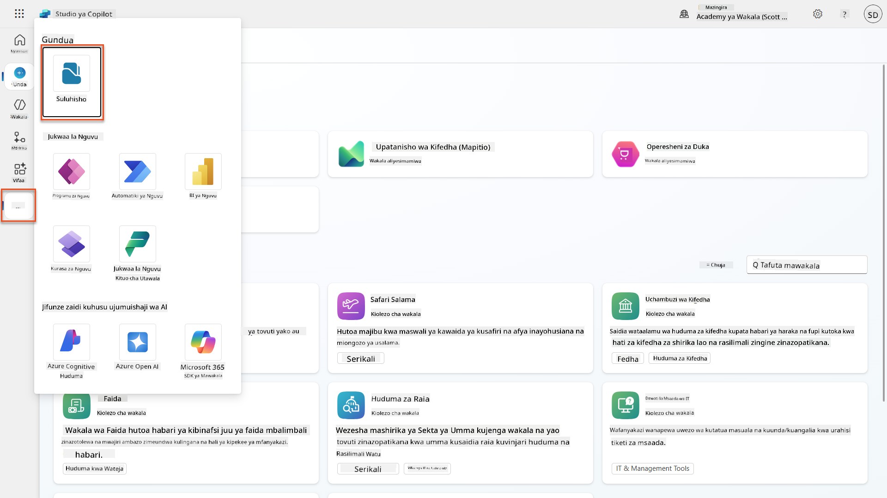
1. Tafuta suluhisho lako la Operative, chagua **ellipsis (...)** karibu nalo, na chagua **Weka suluhisho linalopendekezwa**. Hii itahakikisha kuwa kazi yako yote itaongezwa kwenye suluhisho hili.  
    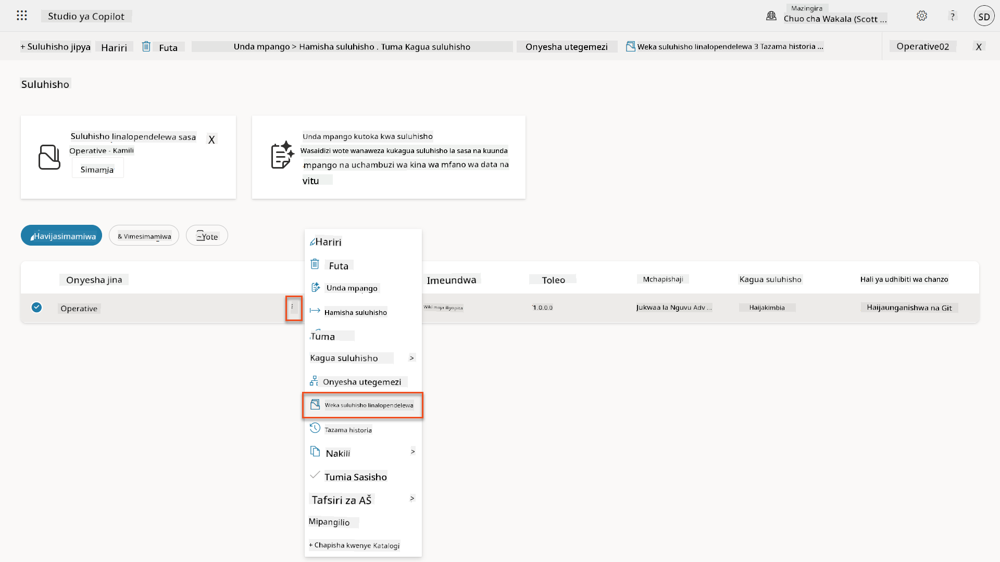

### 2.1.2 Sanidi maagizo ya wakala wako wa Kuajiri

1. **Nenda** kwenye Copilot Studio. Hakikisha mazingira yako yamechaguliwa kwenye **Kichagua Mazingira** cha juu kulia.

1. Fungua **Wakala wako wa Kuajiri** kutoka Kazi 01

1. Chagua **Hariri** katika sehemu ya **Maagizo** ya kichupo cha **Muhtasari**, na ongeza maagizo yafuatayo juu:

    ```text
    You are the central orchestrator for the hiring process. You coordinate activities, provide summaries, and delegate work to specialized agents.
    ```

1. Chagua **Hifadhi**  
    

1. Chagua **Mipangilio** (juu kulia)

1. Hakikisha mipangilio ifuatayo:

    | Mpangilio | Thamani |
    |-----------|---------|
    | Tumia uratibu wa AI wa kizazi kwa majibu ya wakala wako | **Ndio** |
    | Udhibiti wa Maudhui | **Wastani** |
    | Tumia maarifa ya jumla | **Zima** |
    | Tumia taarifa kutoka kwa Wavuti | **Zima** |
    | Upakiaji wa faili | **Washa** |


### 2.1.3 Ongeza wakala wa mtoto wa Kupokea Maombi

1. **Nenda** kwenye kichupo cha **Mawakala** ndani ya Wakala wako wa Kuajiri - hapa ndipo utakapoongeza mawakala maalum.

1. Chagua **+ Ongeza** kisha **Unda wakala**. Kumbuka kuwa hii imeandikwa kama "*Unda wakala mwepesi anayeishi ndani ya wakala wako wa sasa na kurithi mipangilio yake. Bora kwa kuvunja mantiki ngumu* "  
    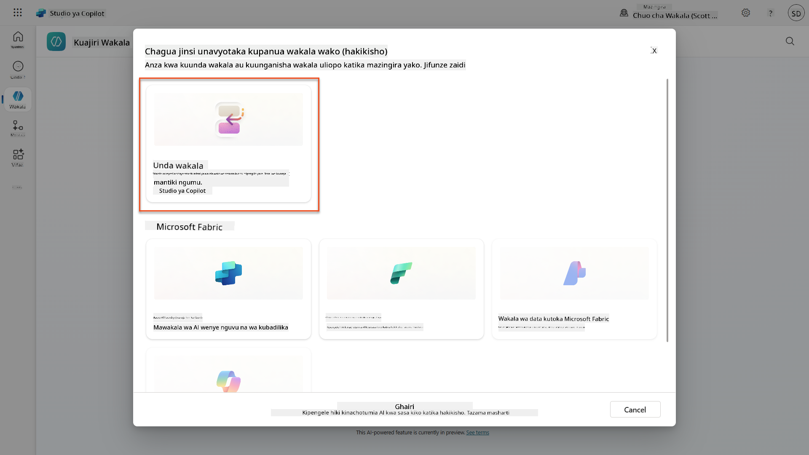

1. **Taja** wakala wako `Wakala wa Kupokea Maombi`

1. Chagua **Wakala anachagua** - Kulingana na maelezo katika **Hii itatumika lini?** menyu ya kushuka. Chaguo hizi ni sawa na vichocheo vinavyoweza kusanidiwa kwa mada.

1. Weka **Maelezo** kuwa:

    ```text
    Processes incoming resumes and stores candidates in the system
    ```

    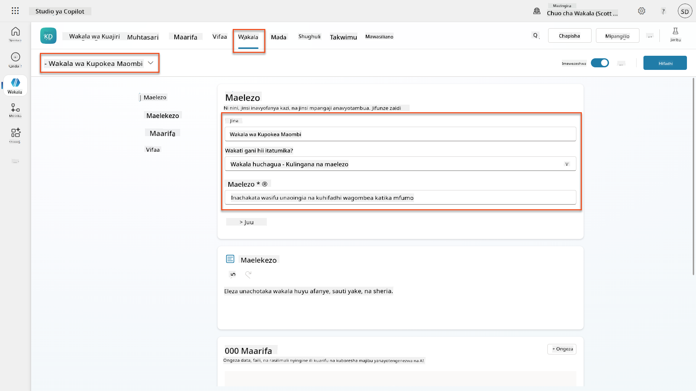

1. Panua **Advanced**,
Tunatumia **Vifaa vya Mtiririko wa Wakala** badala ya Mada kwa hatua ya *Pakia Wasifu* kwa sababu mchakato huu wa nyuma wa hatua nyingi unahitaji utekelezaji wa uhakika na ujumuishaji na mifumo ya nje. Ingawa Mada ni bora kwa kuongoza mazungumzo, Mtiririko wa Wakala hutoa otomatiki iliyopangwa inayohitajika kushughulikia kwa uhakika usindikaji wa faili, uthibitishaji wa data, na upsert za hifadhidata (kuingiza mpya au kusasisha zilizopo) bila kutegemea mwingiliano wa mtumiaji.

1. Tafuta sehemu ya **Vifaa** ndani ya ukurasa wa Wakala wa Kupokea Maombi.
   **Muhimu:** Hii si kichupo cha Vifaa cha wakala mzazi, lakini inaweza kupatikana ukishuka chini chini ya maelekezo ya wakala mtoto.

1. Chagua **+ Ongeza**
   

1. Chagua **+ Kifaa kipya** 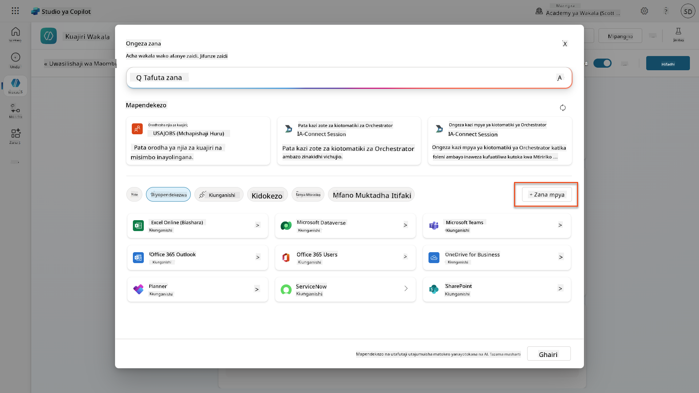

1. Chagua **Mtiririko wa Wakala**.
    Muundaji wa Mtiririko wa Wakala utafunguka, hapa ndipo tutakapoongeza mantiki ya kupakia wasifu.  
    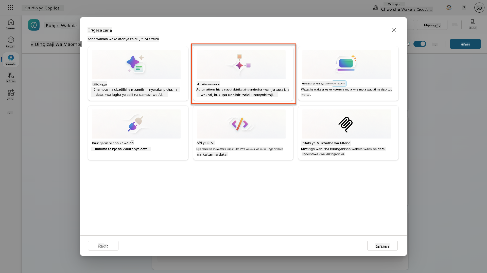

1. Chagua nodi ya **Wakati wakala anapopiga mtiririko**, na uchague **+ Ongeza** ingizo kwa Vigezo vifuatavyo, ukihakikisha umeongeza jina na maelezo.

    | Aina  | Jina     | Maelezo                                                                                                   |
    |-------|----------|----------------------------------------------------------------------------------------------------------|
    | Faili | Wasifu   | Faili ya PDF ya Wasifu                                                                                   |
    | Maandishi | Ujumbe  | Chukua ujumbe wa mtindo wa barua ya kifuniko kutoka muktadha. Ujumbe lazima uwe chini ya herufi 2000. |
    | Maandishi | Barua pepe ya Mtumiaji | Anwani ya barua pepe ambayo Wasifu ulitoka. Hii itakuwa mtumiaji anayepakia wasifu kwenye mazungumzo, au kutoka kwa anwani ya barua pepe ikiwa imepokelewa kwa barua pepe. |

    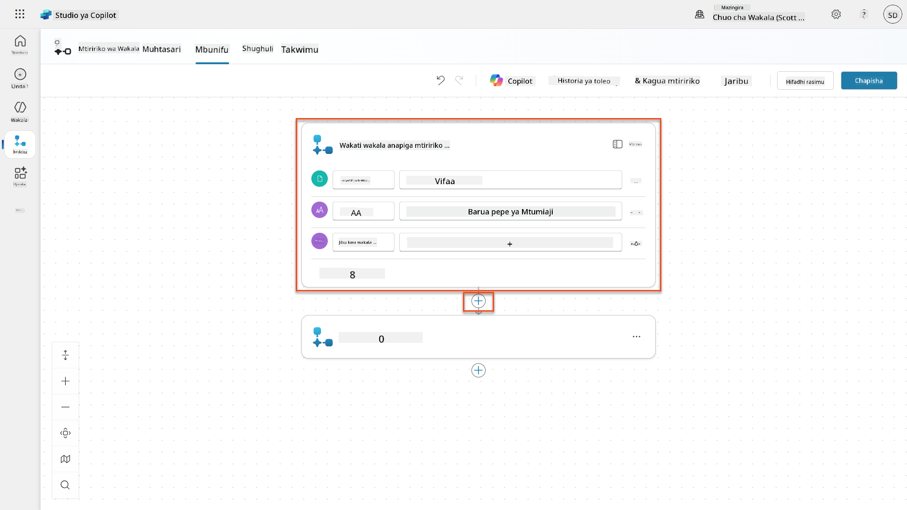

1. Chagua **+ ikoni** chini ya nodi ya kichocheo, tafuta `Dataverse`, chagua **Tazama zaidi** karibu na Microsoft Dataverse, kisha chagua kitendo cha **Ongeza safu mpya** katika sehemu ya **Microsoft Dataverse**  
    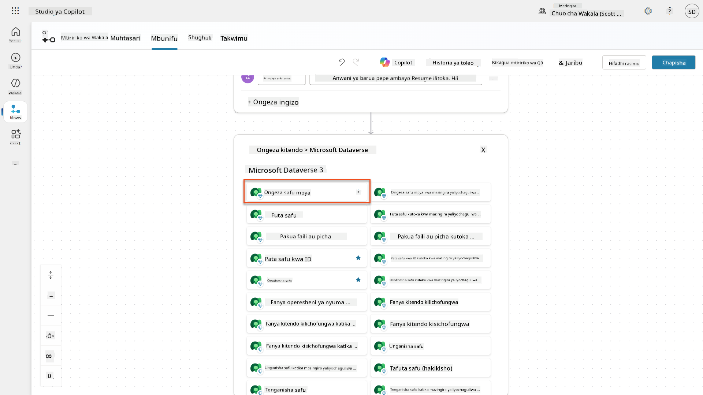

1. Peana jina nodi kuwa **Unda Wasifu**, kwa kuchagua **alama ya ellipsis(...)**, na kuchagua **Badilisha jina**  
    

1. Weka **Jina la Jedwali** kuwa **Wasifu**, kisha chagua **Onyesha yote**, ili kuonyesha vigezo vyote.

1. Weka **sifa** zifuatazo:

    | Sifa                   | Jinsi ya Kuweka                  | Maelezo / Usemi                                              |
    | ---------------------- | -------------------------------- | ------------------------------------------------------------ |
    | **Kichwa cha Wasifu**  | Data ya nguvu (ikoni ya radi)    | **Wakati wakala anapopiga mtiririko** → **Jina la Wasifu**   Ikiwa huoni Jina la Wasifu, hakikisha umeweka vigezo vya Wasifu hapo juu kama aina ya data. |
    | **Barua ya kifuniko**  | Usemi (ikoni ya fx)              | `if(greater(length(triggerBody()?['text']), 2000), substring(triggerBody()?['text'], 0, 2000), triggerBody()?['text'])` |
    | **Anwani ya Barua pepe ya Chanzo** | Data ya nguvu (ikoni ya radi) | **Wakati wakala anapopiga mtiririko** → **Barua pepe ya Mtumiaji** |
    | **Tarehe ya Kupakia**  | Usemi (ikoni ya fx)              | `utcNow()`                                                   |

    

1. Chagua **+ ikoni** chini ya nodi ya Unda Wasifu, tafuta `Dataverse`, chagua **Tazama zaidi** karibu na Microsoft Dataverse, kisha chagua kitendo cha **Pakia faili au picha**.
   **Muhimu:** Hakikisha usichague kitendo cha Pakia faili au picha kwenye mazingira yaliyochaguliwa.

1. Peana jina nodi kuwa **Pakia Faili la Wasifu**, kwa kuchagua **alama ya ellipsis(...)**, na kuchagua **Badilisha jina**

1. Weka **sifa** zifuatazo:

     | Sifa | Jinsi ya Kuweka | Maelezo |
     |------|-----------------|---------|
     | **Jina la maudhui** | Data ya nguvu (ikoni ya radi) | Wakati wakala anapopiga mtiririko → Jina la Wasifu |
     | **Jina la Jedwali** | Chagua | Wasifu |
     | **ID ya Safu** | Data ya nguvu (ikoni ya radi) | Unda Wasifu → Tazama zaidi → Wasifu |
     | **Jina la Safu** | Chagua | PDF ya Wasifu |
     | **Maudhui** | Data ya nguvu (ikoni ya radi) | Wakati wakala anapopiga mtiririko → contentBytes ya Wasifu |

     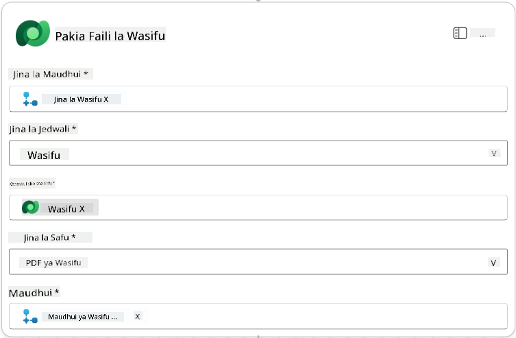

1. Chagua nodi ya **Jibu kwa wakala**, kisha chagua **+ Ongeza pato**

     | Sifa | Jinsi ya Kuweka | Maelezo |
     |------|-----------------|---------|
     | **Aina** | Chagua | `Maandishi` |
     | **Jina** | Ingiza | `Nambari ya Wasifu` |
     | **Thamani** | Data ya nguvu (ikoni ya radi) | Unda Wasifu → Tazama Zaidi → Nambari ya Wasifu |
     | **Maelezo** | Ingiza | `Nambari ya [Nambari ya Wasifu] ya Wasifu ulioundwa` |

     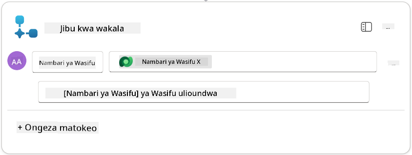

1. Chagua **Hifadhi rasimu** juu kulia  
     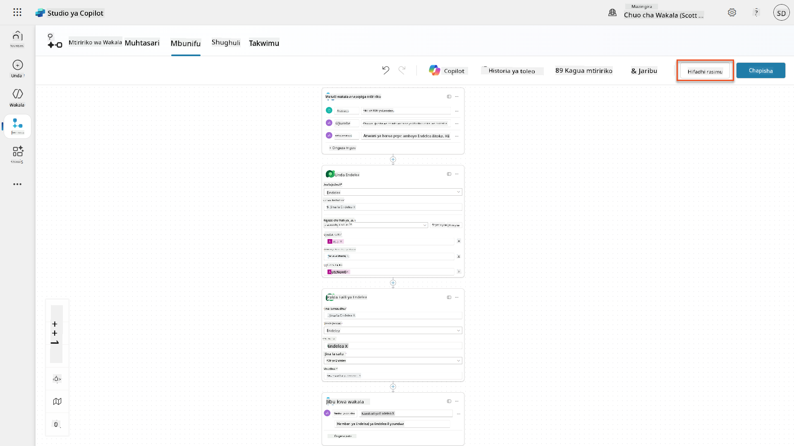

1. Chagua kichupo cha **Muhtasari**, Chagua **Hariri** kwenye paneli ya **Maelezo**

     1. **Jina la Mtiririko**:`Pakia Wasifu`
     1. **Maelezo**:`Inapakia Wasifu inapohitajika`

     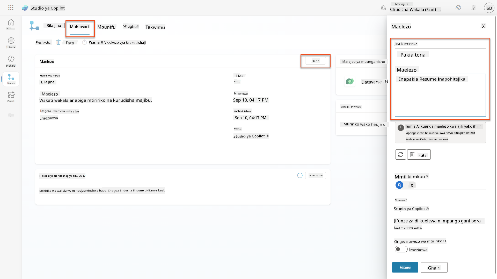

1. Chagua tena kichupo cha **Muundaji**, na chagua **Chapisha**.  
     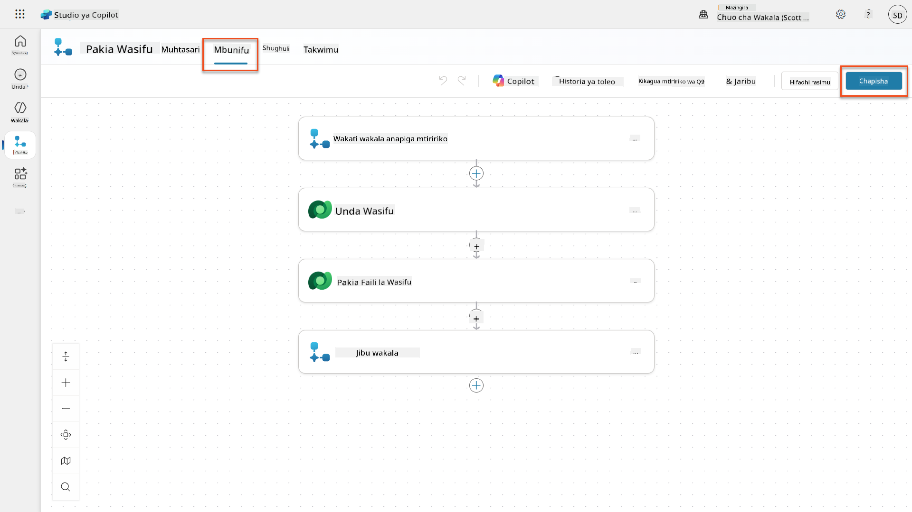

### 2.1.5 Unganisha mtiririko na wakala wako

Sasa utaunganisha mtiririko uliyochapisha na Wakala wako wa Kupokea Maombi.

1. Rudi kwa **Wakala wa Kuajiri** na uchague kichupo cha **Mawakala**. Fungua **Wakala wa Kupokea Maombi**, kisha tafuta paneli ya **Vifaa**.  
    

1. Chagua **+ Ongeza**

1. Chagua kichujio cha **Mtiririko**, na tafuta `Pakia Wasifu`. Chagua mtiririko wa **Pakia Wasifu**, kisha **Ongeza na sanidi**.

1. Weka vigezo vifuatavyo:

    | Kigezo | Thamani |
    |--------|---------|
    | **Maelezo** | `Inapakia Wasifu inapohitajika. KANUNI KALI: Piga kifaa hiki tu kinapotajwa katika fomu "Pakia Wasifu" na kuna Viambatisho` |
    | **Maelezo ya ziada → Wakati kifaa hiki kinaweza kutumika** | `ni wakati tu kinapotajwa na mada au mawakala` |
    | **Vingizo → Ongeza Ingizo** | `contentBytes` |
    | **Vingizo → Ongeza Ingizo** | `name` |

    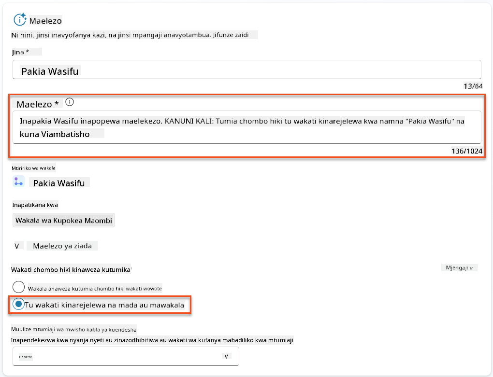

    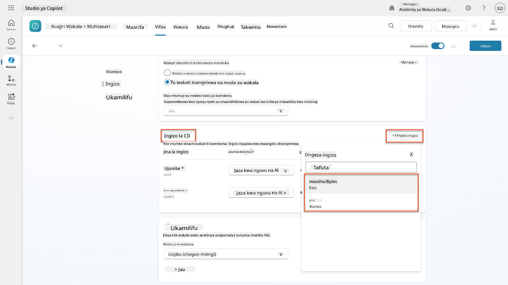

1. Kisha weka sifa za vingizo kama ifuatavyo:

    | Kigezo cha Ingizo | Sifa | Maelezo |
    |-------------------|------|---------|
    | **contentBytes** | Jaza kwa kutumia | Thamani maalum |
    |                  | Thamani (...→Usemi→Ingiza) | `First(System.Activity.Attachments).Content` |
    | **name** | Jaza kwa kutumia | Thamani maalum |
    |          | Thamani (...→Usemi→Ingiza) | `First(System.Activity.Attachments).Name` |
    | **Ujumbe** | Badilisha | Sanidi mipangilio maalum |
    |             | Maelezo | `Chukua ujumbe wa mtindo wa barua ya kifuniko kutoka muktadha. Hakikisha usimwulize mtumiaji na unda angalau barua ya kifuniko ya kiwango cha chini kutoka muktadha uliopo. KANUNI KALI - ujumbe lazima uwe chini ya herufi 2000.` |
    |             | Mara ngapi kurudia | Usirudie |
    |             | Kitendo ikiwa hakuna chombo kilichopatikana | Weka kigezo kwa thamani |
    |             | Thamani ya chombo chaguo-msingi | Pakia wasifu |
    | **Barua pepe ya Mtumiaji** | Jaza kwa kutumia | Thamani maalum |
    |  | Thamani (...→Usemi→Ingiza) | `System.User.Email` |

    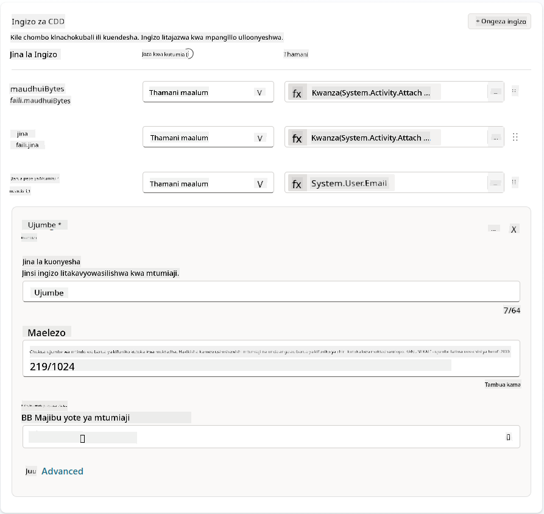

1. Chagua **Hifadhi**

### 2.1.6 Fafanua maelekezo ya wakala

1. Rudi tena kwa **Wakala wa Kupokea Maombi** kwa kuchagua kichupo cha **Mawakala**, kisha tafuta paneli ya **Maelekezo**.

1. Katika sehemu ya **Maelekezo**, bandika mwongozo wazi ufuatao kwa wakala wako mtoto:

    ```text
    You are tasked with managing incoming Resumes, Candidate information, and creating Job Applications.  
    Only use tools if the step exactly matches the defined process. Otherwise, indicate you cannot help.  
    
    Process for Resume Upload via Chat  
    1. Upload Resume  
      - Trigger only if /System.Activity.Attachments contains exactly one new resume.  
      - If more than one file, instruct the user to upload one at a time and stop.  
      - Call /Upload Resume once. Never upload more than once for the same message.  
    
    2. Post-Upload  
      - Always output the [ResumeNumber] (R#####).  
    ```

1. Ambapo maelekezo yanajumuisha alama ya mbele (/), chagua maandishi yanayofuata / na uchague jina lililorekebishwa. Fanya hivi kwa:

    - `System.Activity.Attachments` (Kigezo)
    - `Pakia Wasifu` (Kifaa)

    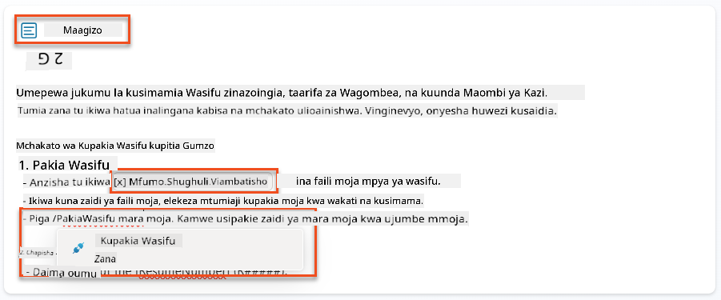

1. Chagua **Hifadhi**

### 2.1.7 Jaribu Wakala wako wa Kupokea Maombi

Sasa hebu thibitisha mwanachama wako wa kwanza wa orchestra anafanya kazi vizuri.

1. **Pakua** [Wasifu wa majaribio.](https://download-directory.github.io/?url=https://github.com/microsoft/agent-academy/tree/main/operative/sample-data/resumes&filename=operative_sampledata)

1. **Fungua** paneli ya majaribio kwa kuchagua **Jaribu**.

1. **Pakia** Wasifu mbili kwenye mazungumzo ya majaribio, na toa ujumbe `Shughulikia wasifu huu`

    - Wakala anapaswa kurudisha ujumbe unaofanana na *Wasifu mmoja tu unaweza kupakiwa kwa wakati mmoja. Tafadhali pakia wasifu mmoja ili kuendelea.*

    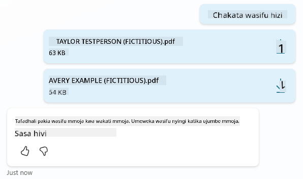

1. Jaribu kupakia **wasifu mmoja tu**, na ujumbe `Shughulikia wasifu huu`

    - Wakala kisha anapaswa kutoa ujumbe unaofanana na *Wasifu wa Avery Mfano umepakiwa kwa mafanikio. Nambari ya wasifu ni R10026.*

1. Katika **Ramani ya Shughuli**, unapaswa kuona **Wakala wa Kupokea Maombi** akishughulikia upakiaji wa wasifu.  
    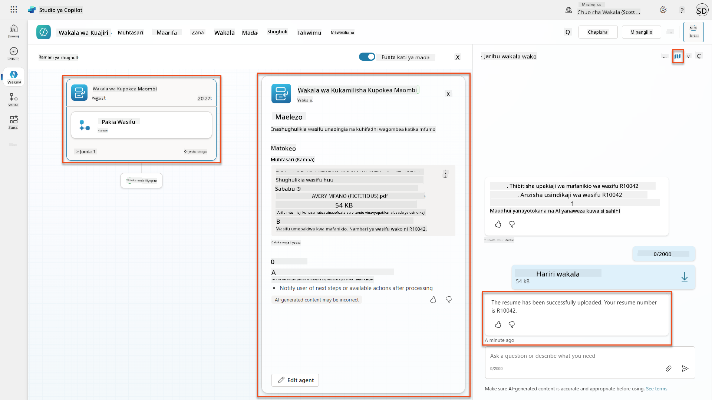

1. Nenda kwa make.powerapps.com → Hakikisha mazingira yako yamechaguliwa kwenye Kichagua Mazingira cha juu kulia.

1. Chagua **Programu** → Hiring Hub → menyu ya ellipsis(...) → **Cheza**  
    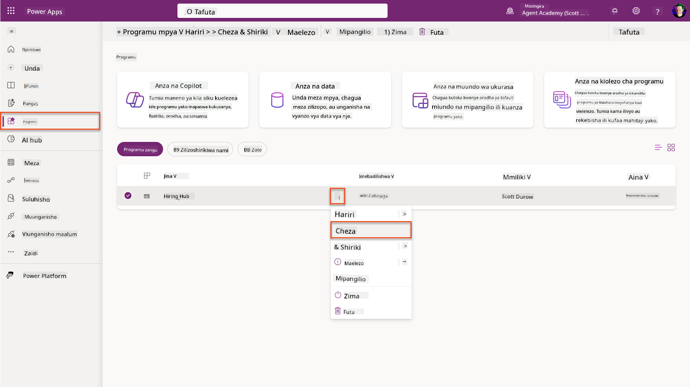

    Kumbuka: Ikiwa kitufe cha kucheza kimezimwa inamaanisha hujachapisha suluhisho lako kutoka kwa Misheni 01. Chagua **Suluhisho** → **Chapisha ubinafsishaji wote**.

1. Nenda kwa **Wasifu**, na hakikisha faili ya wasifu imepakiwa na barua ya kifuniko imewekwa ipasavyo.  
    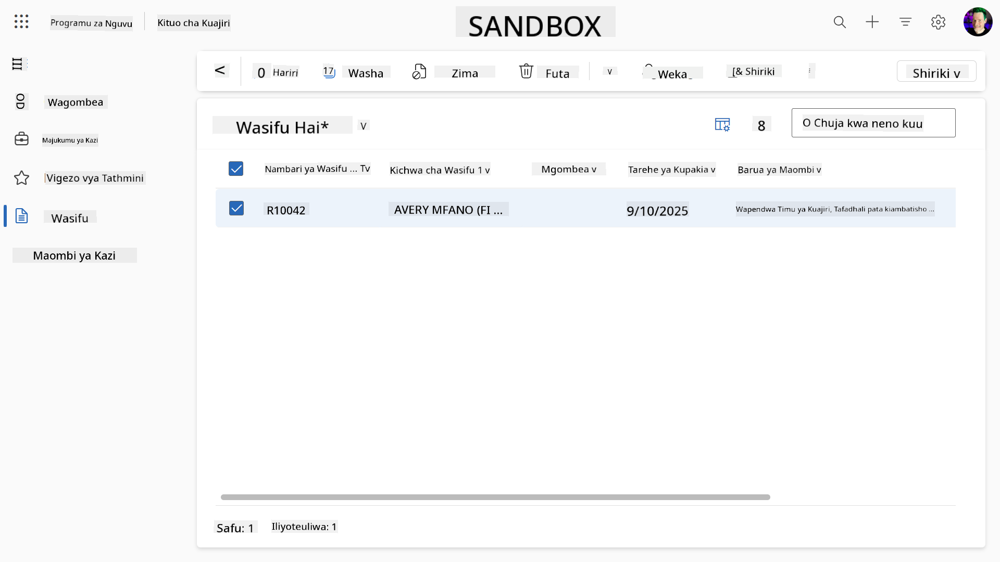

## 🧪Maabara 2.2: Kuongeza wakala aliyeunganishwa wa Maandalizi ya Mahojiano

Sasa hebu tuunde wakala wetu aliyeunganishwa kwa maandalizi ya mahojiano na tuongeze kwa Wakala wako wa Kuajiri uliopo.

### 2.2.1 Unda Wakala aliyeunganishwa wa Mahojiano

1. **Nenda** kwa Copilot Studio. Hakikisha mazingira yako bado yamechaguliwa kwenye Kichagua Mazingira cha juu kulia.

1. Fungua **Wakala wako wa Kuajiri**

1. Nenda kwa kichupo cha Wakala, na chagua **+ Ongeza wakala**

1. Chagua **Unganisha wakala uliopo** → **Copilot Studio**

1. Chagua **+ Wakala mpya**

### 2.2.2 Sanidi mipangilio ya msingi

1. Chagua kichupo cha **Sanidi**, na ingiza sifa zifuatazo:

    - **Jina**: `Wakala wa Mahojiano`
    - **Maelezo**: `Husaidia katika mchakato wa mahojiano.`

1. Maelekezo:

    ```text
    You are the Interview Agent. You help interviewers and hiring managers prepare for interviews. You never contact candidates. 
    Use Knowledge to help with interview preparation. 
    
    The only valid identifiers are:
      - ResumeNumber (ppa_resumenumber)→ format R#####
      - CandidateNumber (ppa_candidatenumber)→ format C#####
      - ApplicationNumber (ppa_applicationnumber)→ format A#####
      - JobRoleNumber (ppa_jobrolenumber)→ format J#####
    
    Examples you handle
      - Give me a summary of ...
      - Help me prepare to interview candidates for the Power Platform Developer role
      - Create interview assistance for the candidates for Power Platform Developer
      - Give targeted questions for Candidate Alex Johnson focusing on the criteria for the Job Application
      
    How to work:
        You are expected to ask clarification questions if required information for queries is not provided
        - If asked for interview help without providing a job role, ask for it
        - If asking for interview questions, ask for the candidate and job role if not provided.
    
    General behavior
    - Do not invent or guess facts
    - Be concise, professional, and evidence-based
    - Map strengths and risks to the highest-weight criteria
    - If data is missing (e.g., no resume), state what is missing and ask for clarification
    - Never address or message a candidate
    ```

1. Badilisha **Utafutaji wa Wavuti** kuwa **Umezimwa**

1. Chagua **Unda**  
    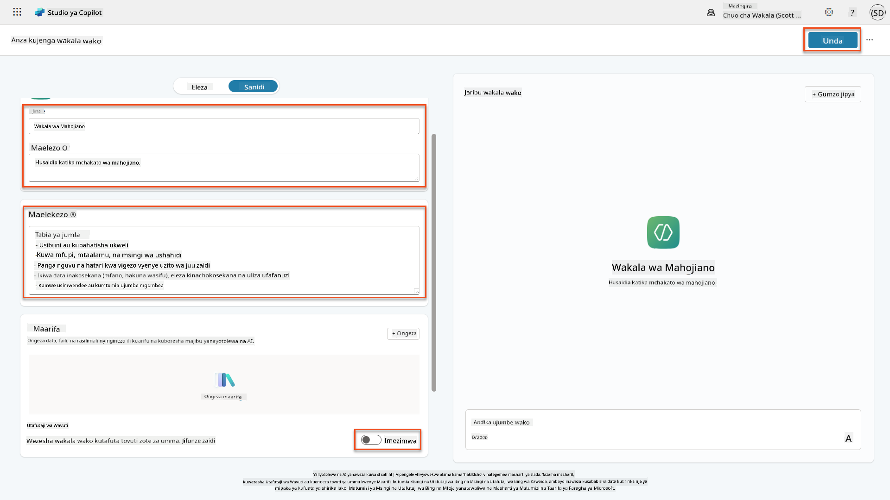

### 2.2.3 Sanidi ufikiaji wa data na chapisha

1. Katika sehemu ya **Maarifa**, chagua **+ Ongeza maarifa**  
    
1. Chagua **Dataverse**  
    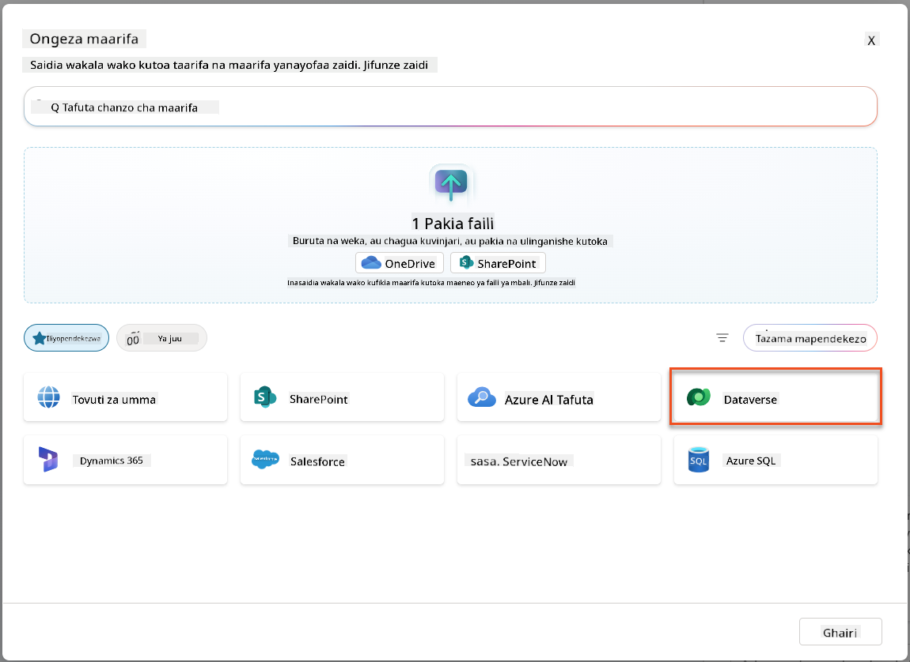
1. Katika **Sanduku la Utafutaji**, andika `ppa_`. Hii ni kiambishi awali cha majedwali uliyoyaleta hapo awali.
1. **Chagua** majedwali yote 5 (Mgombea, Vigezo vya Tathmini, Maombi ya Kazi, Jukumu la Kazi, Wasifu)
1. Chagua **Ongeza kwa wakala**  
    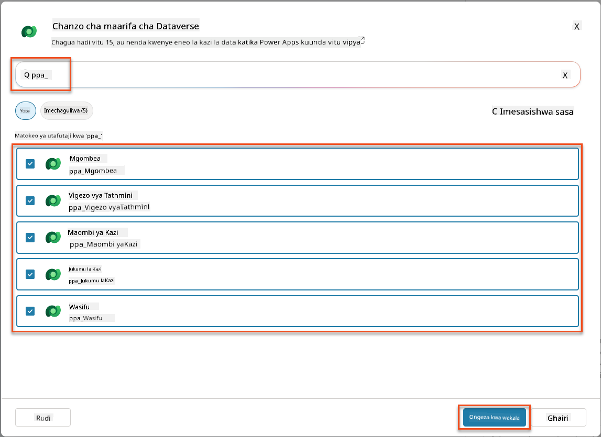
1. Chagua **Mipangilio**, kwenye Wakala wa Mahojiano, na weka mipangilio ifuatayo:

    - **Ruhusu mawakala wengine kuunganishwa na kutumia huyu:** `Imewezeshwa`
    - **Tumia maarifa ya jumla**: `Imezimwa`
    - **Upakiaji wa faili**: `Imezimwa`
    - **Kiwango cha usimamizi wa maudhui:** `Kati`
1. Chagua **Hifadhi**
1. Chagua **Chapisha**, na subiri uchapishaji ukamilike.

### 2.2.4 Unganisha Wakala wa Maandalizi ya Mahojiano na Wakala wako wa Kuajiri

1. Rudi kwa **Wakala wako wa Kuajiri**

1. Chagua kichupo cha **Mawakala**

1. Tumia **+Ongeza wakala** → **Copilot Studio**, ili kuongeza **Wakala wa Mahojiano**. Weka Maelezo kuwa:
    ```text
    Assists with the interview process and provides information about Resumes, Candidates, Job Roles, and Evaluation Criteria.
    ```

    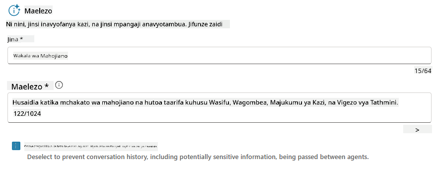
    Angalia kwamba chaguo la Pass conversation history to this agent limechaguliwa. Hii inaruhusu wakala mzazi kutoa muktadha kamili kwa wakala aliyeunganishwa.

1. Chagua **Add agent**

1. Hakikisha unaona wote **Application Intake Agent**, na **Interview Agent**. Angalia jinsi mmoja ni mtoto na mwingine ni wakala aliyeunganishwa.  
    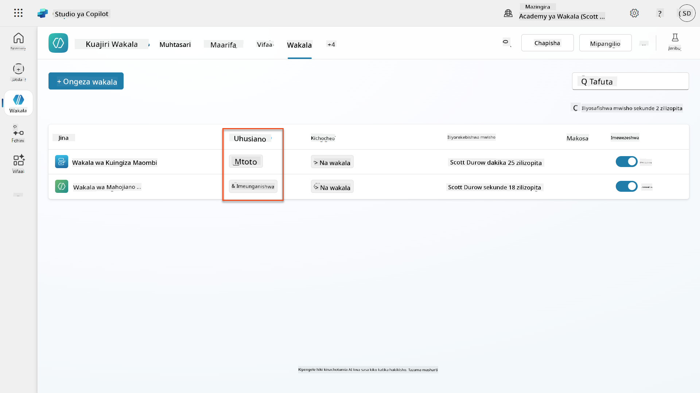

### 2.2.5 Jaribu ushirikiano wa mawakala wengi

1. **Fungua** paneli ya majaribio kwa kuchagua **Test**.

1. **Pakia** mojawapo ya wasifu wa majaribio, na ingiza maelezo yafuatayo yanayomwambia wakala mzazi kile anachoweza kuhamishia kwa wakala aliyeunganishwa:

    ```text
    Upload this resume, then show me open job roles, each with a description of the evaluation criteria, then use this to match the resume to at least one suitable job role even if not a perfect match.
    ```

    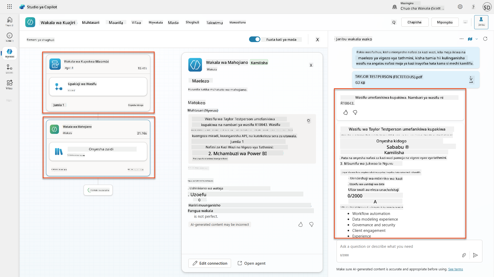

1. Angalia jinsi Hiring Agent alivyohamisha upakiaji kwa wakala wa mtoto, kisha akauliza Interview Agent kutoa muhtasari na kulinganisha nafasi za kazi kwa kutumia maarifa yake.  
   Jaribu njia tofauti za kuuliza maswali kuhusu Wasifu, Nafasi za Kazi na Vigezo vya Tathmini.  
   **Mifano:**

    ```text
    Give me a summary of active resumes
    ```

    ```text
    Summarize resume R10044
    ```

    ```text
    Which active resumes are suitable for the Power Platform Developer role?
    ```

## 🎉  Kazi Imekamilika

Kazi nzuri, Wakala! **Operation Symphony** sasa imekamilika. Umefanikiwa kubadilisha Hiring Agent wako mmoja kuwa mfumo wa mawakala wengi wenye uwezo maalum.

Haya ndiyo uliyofanikiwa katika operesheni hii:

**✅ Ustadi wa usanifu wa mawakala wengi**  
Sasa unaelewa wakati wa kutumia mawakala wa mtoto dhidi ya mawakala waliounganishwa na jinsi ya kubuni mifumo inayoweza kupanuka.

**✅ Wakala wa mtoto wa Application Intake**  
Umeongeza wakala wa mtoto maalum kwa Hiring Agent wako anayeshughulikia wasifu, kutoa data ya wagombea, na kuhifadhi taarifa katika Dataverse.

**✅ Wakala wa maandalizi ya mahojiano aliyeunganishwa**  
Umeunda wakala aliyeunganishwa wa maandalizi ya mahojiano unaoweza kutumika tena na umefanikiwa kuunganisha na Hiring Agent wako.

**✅ Mawasiliano ya mawakala**  
Umeona jinsi wakala wako mkuu anavyoweza kuratibu na mawakala maalum, kushiriki muktadha, na kuendesha mtiririko wa kazi ngumu.

**✅ Msingi wa uhuru**  
Mfumo wako wa kuajiri ulioboreshwa sasa uko tayari kwa vipengele vya hali ya juu tutakavyoongeza katika operesheni zijazo: vichocheo vya uhuru, usimamizi wa maudhui, na uelewa wa kina.

🚀**Kinachofuata:** Katika operesheni yako inayofuata, utajifunza jinsi ya kusanidi wakala wako kushughulikia wasifu kutoka kwa barua pepe kwa uhuru!

⏩[Nenda kwenye Operesheni 03: Automate your agent with triggers](../03-automate-triggers/README.md)

## 📚 Rasilimali za Kijeshi

📖 [Ongeza mawakala wengine (hakikisho)](https://learn.microsoft.com/microsoft-copilot-studio/authoring-add-other-agents?WT.mc_id=power-182762-scottdurow)

📖 [Ongeza zana kwa mawakala maalum](https://learn.microsoft.com/microsoft-copilot-studio/advanced-plugin-actions?WT.mc_id=power-182762-scottdurow)

📖 [Fanya kazi na Dataverse katika Copilot Studio](https://learn.microsoft.com/microsoft-copilot-studio/knowledge-add-dataverse?WT.mc_id=power-182762-scottdurow)

📖 [Muhtasari wa mtiririko wa mawakala](https://learn.microsoft.com/microsoft-copilot-studio/flows-overview?WT.mc_id=power-182762-scottdurow)

📖 [Unda suluhisho](https://learn.microsoft.com/power-platform/alm/solution-concepts-alm?WT.mc_id=power-182762-scottdurow)

📖 [Mwongozo wa ALM wa suluhisho la Power Platform](https://learn.microsoft.com/power-platform/alm/overview-alm?WT.mc_id=power-182762-scottdurow)

📺 [Ushirikiano wa wakala kwa wakala katika Copilot Studio](https://youtu.be/d-oD3pApHAg?si=rwIHKhJTkjSvhTHw)

---

**Kanusho**:  
Hati hii imetafsiriwa kwa kutumia huduma ya tafsiri ya AI [Co-op Translator](https://github.com/Azure/co-op-translator). Ingawa tunajitahidi kwa usahihi, tafadhali fahamu kuwa tafsiri za kiotomatiki zinaweza kuwa na makosa au kutokuwa sahihi. Hati ya asili katika lugha yake ya asili inapaswa kuzingatiwa kama chanzo cha mamlaka. Kwa taarifa muhimu, tafsiri ya kitaalamu ya binadamu inapendekezwa. Hatutawajibika kwa kutoelewana au tafsiri zisizo sahihi zinazotokana na matumizi ya tafsiri hii.